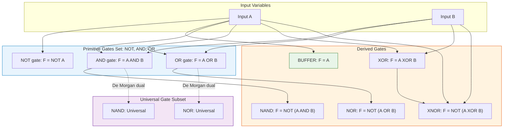
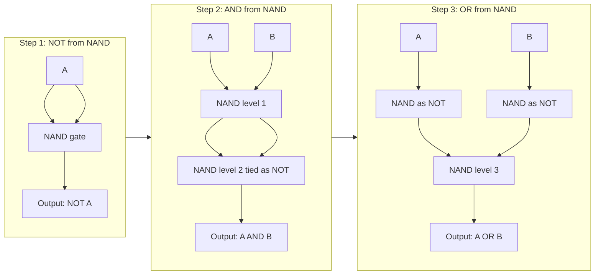
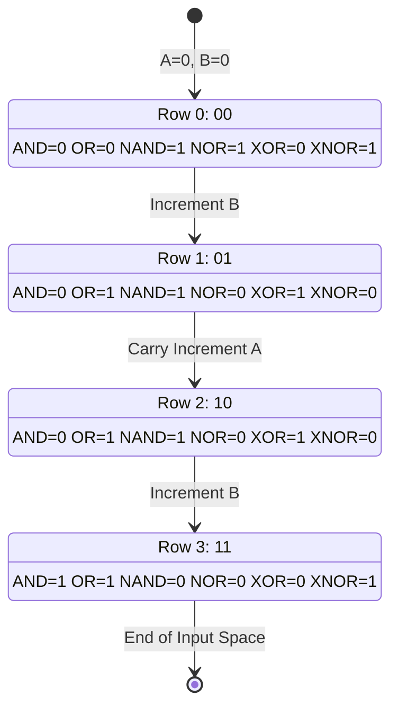

# Basic Gates: Buffer, Inverter, AND, OR, NAND, NOR, XOR, XNOR gates

<!-- SECTION_1_START -->
# Module 1 — Introduction to Digital Systems & Core Gate Logic
## Topic: Basic Gates — Buffer, Inverter, AND, OR, NAND, NOR, XOR, XNOR

### 1.1 Formal Academic Definition (KTU 2024 Syllabus Terminology)

> [!NOTE]
> **Digital Logic Gate (KTU Formal Definition):**
> A *digital logic gate* is an elementary **single-output, combinational electronic switching element** that implements a fundamental **Boolean function** of one or more binary inputs. Each input and the output are constrained to one of two valid logic levels: **Logic 0 (LOW / False / 0 V nominal)** or **Logic 1 (HIGH / True / $+V_{CC}$ nominal)**. Under the KTU 2024 scheme, the **positive-logic convention** is the default: Boolean 1 $\equiv$ HIGH voltage and Boolean 0 $\equiv$ LOW voltage.

The eight canonical gates of the KTU Module 1 syllabus are partitioned into three families based on the count of input variables they process:

| Family | Gates | Input Count |
| :--- | :--- | :--- |
| **Single-Input Gates** | Buffer, Inverter (NOT) | 1 input |
| **Basic Two-Input Gates** | AND, OR, NAND, NOR, XOR, XNOR | 2 inputs |

The complete formal Boolean specification is given in the table below, where $A$ and $B$ denote the binary inputs, $F$ denotes the Boolean output, and the symbols $+, \cdot, \overline{(\cdot)}, \oplus$ denote **OR, AND, NOT, and XOR** respectively:

| Gate | Formal Boolean Expression | Mathematical Name |
| :--- | :--- | :--- |
| Buffer | $F = A$ | Identity function |
| Inverter (NOT) | $F = \overline{A}$ | Complement / Negation |
| AND | $F = A \cdot B$ | Conjunction |
| OR | $F = A + B$ | Disjunction |
| NAND | $F = \overline{A \cdot B}$ | NOT-AND / Sheffer Stroke |
| NOR | $F = \overline{A + B}$ | NOT-OR / Peirce Arrow |
| XOR | $F = A \oplus B$ | Exclusive-OR / Antivalence |
| XNOR | $F = \overline{A \oplus B}$ | Exclusive-NOR / Equivalence |

> [!IMPORTANT]
> **KTU 2024 Module 1 Highlight:**
> Out of the eight gates listed, the **NAND** gate and the **NOR** gate are classified as **Universal Gates**. The KTU 2024 scheme places explicit weightage on proving universality: any Boolean function — regardless of complexity — can be realized using **NAND gates only** or **NOR gates only**. The other six gates are termed *primitive* or *basic* gates.

---

### 1.2 Conceptual Analogy & Intuitive Plain-English Explanation

> [!TIP]
> **Analogy — The Two-Switch Light Bulb Model:**
> Imagine you are wiring a domestic staircase such that a single bulb at the landing can be turned ON or OFF by two switches, $A$ and $B$, located at the bottom and the top of the stairs. The eight basic gates are just **eight different wiring topologies** of these two switches to the bulb. Each topology corresponds to one specific rule:
> - The bulb glows only when **both** switches are ON $\;\Rightarrow\;$ **AND gate**.
> - The bulb glows when **at least one** switch is ON $\;\Rightarrow\;$ **OR gate**.
> - The bulb glows only when **exactly one** switch is ON $\;\Rightarrow\;$ **XOR gate**.
> - The bulb glows only when the bulb's supply is *inverted* $\;\Rightarrow\;$ **NOT gate** (a single-pole single-throw switch wired in reverse).
> - The **Buffer** is simply a *no-change repeater*: it passes the switch position to the bulb unchanged but boosts the electrical drive strength.

A more precise *electrical* analogy uses **SPST switches** in **series** and **parallel** with a battery and a bulb:

| Topology | Switch Configuration | Gate Realized |
| :--- | :--- | :--- |
| Series switches, bulb directly across battery | $A$ **AND** $B$ | AND |
| Parallel switches, bulb across battery | $A$ **OR** $B$ | OR |
| Series switches, bulb inverted (NPN transistor) | $\overline{A \cdot B}$ | NAND |
| Parallel switches, bulb inverted | $\overline{A + B}$ | NOR |
| Two-throw switch (toggle) | $A \oplus B$ | XOR |

> [!NOTE]
> **Standard Logic Levels used in KTU Lab (TTL/CMOS 5 V Rails):**
> - Logic 0 (LOW) $\equiv$ **$0 \text{ V} \le V_{in} \le 0.8 \text{ V}$** (TTL) or $\le 0.3 V_{DD}$ (CMOS).
> - Logic 1 (HIGH) $\equiv$ **$2.0 \text{ V} \le V_{in} \le 5.0 \text{ V}$** (TTL) or $\ge 0.7 V_{DD}$ (CMOS).
> - The undefined band **$0.8 \text{ V} < V_{in} < 2.0 \text{ V}$** is the *forbidden region* — guaranteed NOT to occur in a healthy digital system.

---

### 1.3 Visualization Callout — Truth-Table Logic Map

> [!VISUALIZATION CONTROL]
> **Concept:** 2-D Cartesian map of all possible Boolean input combinations for a 2-input gate.
> **GeoGebra / Desmos Input Equations:**
> * Plot four discrete points: `(0,0) → 0`, `(0,1) → f(0,1)`, `(1,0) → f(1,0)`, `(1,1) → f(1,1)`.
> * Example for AND: `f(x,y) = min(x,y)` where the output is 1 only at the point `(1,1)`.
> * Example for XOR: `f(x,y) = (x+y) mod 2` — outputs 1 at `(0,1)` and `(1,0)`.
> **Visual Description:** On the $(A, B)$ grid with $A$ on the horizontal axis and $B$ on the vertical axis, each gate produces a unique **checker-board pattern** of 0s and 1s at the four lattice points $(0,0), (0,1), (1,0), (1,1)$. Students should observe that **AND, OR, NAND, NOR** patterns are symmetric about the diagonal $A = B$, whereas **XOR, XNOR** patterns are anti-symmetric.
<!-- SECTION_1_END -->

<!-- SECTION_2_START -->
# 2. Deep Theoretical Analysis & KTU High-Yield Formula Sheet

### 2.1 Operational Logic — Step-by-Step Reasoning per Gate

Each gate is now broken down into the *operational rules* that a KTU board examiner expects a student to articulate.

#### 2.1.1 The Buffer (Identity / Driver Gate)
- **Rule:** Whatever the input is, the output is *exactly* the same.
- **Why it exists:** A buffer has **unity voltage-gain** but **high current-gain** (current amplification). It is used to *regenerate* a weakened logic signal so it can drive a large fan-out (many subsequent gates).
- **Boolean identity:** $F = A$, $\;$ i.e. $A + 0 = A$, $\; A \cdot 1 = A$.
- **Standard IEEE symbol:** A triangle ($\bigtriangleright$); NOT a circle on the output (the small circle would invert, making it a NOT gate instead).

#### 2.1.2 The Inverter (NOT Gate)
- **Rule:** The output is the **logical complement** of the input.
- **Why it exists:** Provides the *negation* primitive needed for every Boolean function in Sum-of-Products (SOP) and Product-of-Sums (POS) forms.
- **Boolean identity:** $F = \overline{A}$, $\;$ $\overline{\overline{A}} = A$ (double-negation / involution), $\; A + \overline{A} = 1$, $\; A \cdot \overline{A} = 0$.
- **Standard IEEE symbol:** A triangle ($\bigtriangleright$) **with** a small *bubble* (Negation indicator / inversion circle) on the output.

#### 2.1.3 The AND Gate
- **Rule:** Output is **HIGH** (Logic 1) **if and only if ALL inputs are HIGH**.
- **Boolean identity:** $F = A \cdot B$, $\;$ $A \cdot 0 = 0$, $\;$ $A \cdot 1 = A$, $\;$ $A \cdot A = A$, $\;$ $\overline{A \cdot B} = \overline{A} + \overline{B}$ (De Morgan's).
- **Mnemonic:** *"ALL or NOTHING."*

#### 2.1.4 The OR Gate
- **Rule:** Output is **HIGH** if **at least one** input is HIGH.
- **Boolean identity:** $F = A + B$, $\;$ $A + 0 = A$, $\;$ $A + 1 = 1$, $\;$ $A + A = A$, $\;$ $\overline{A + B} = \overline{A} \cdot \overline{B}$ (De Morgan's).
- **Mnemonic:** *"ANY or ALL."*

#### 2.1.5 The NAND Gate (NOT-AND)
- **Rule:** Output is **LOW** **if and only if ALL** inputs are HIGH; otherwise HIGH.
- **Boolean identity:** $F = \overline{A \cdot B} = \overline{A} + \overline{B}$ (De Morgan's equivalent).
- **Why "Universal":** Any Boolean function can be implemented using *only* NAND gates (proof shown in Section 2.2).

#### 2.1.6 The NOR Gate (NOT-OR)
- **Rule:** Output is **HIGH** **if and only if ALL** inputs are LOW; otherwise LOW.
- **Boolean identity:** $F = \overline{A + B} = \overline{A} \cdot \overline{B}$ (De Morgan's equivalent).
- **Why "Universal":** Dual of NAND; also functionally complete.

#### 2.1.7 The XOR Gate (Exclusive-OR / Antivalence)
- **Rule:** Output is **HIGH** when the inputs are **different** (odd number of 1s).
- **Boolean identity:** $F = A \oplus B = A \cdot \overline{B} + \overline{A} \cdot B = (A + B) \cdot \overline{A \cdot B}$.
- **Algebraic properties:** Commutative ($A \oplus B = B \oplus A$), Associative ($A \oplus (B \oplus C) = (A \oplus B) \oplus C$), $A \oplus A = 0$, $A \oplus \overline{A} = 1$, $A \oplus 1 = \overline{A}$, $A \oplus 0 = A$.

#### 2.1.8 The XNOR Gate (Exclusive-NOR / Equivalence)
- **Rule:** Output is **HIGH** when the inputs are **the same** (even number of 1s).
- **Boolean identity:** $F = \overline{A \oplus B} = A \cdot B + \overline{A} \cdot \overline{B} = \overline{A} \oplus B = A \oplus \overline{B}$.

---

### 2.2 Universality of NAND and NOR (Engineering Reasoning)

> [!IMPORTANT]
> **Why Universality Matters in Industry:**
> Silicon foundries manufacture NAND and NOR gates in *much higher volumes* than AND/OR gates because every Boolean function can be built from a single uniform cell. This drives down cost, simplifies VLSI mask design, and enables **standard-cell ASIC libraries** (e.g., the TSMC 65 nm cell library) where the entire chip is composed of repeated NAND/NOR primitives. KTU 2024 module questions on universality frequently appear for 7 marks.

**Proof that NAND is functionally complete:**

To demonstrate universality, we must show that NAND alone can realize the three primitives {NOT, AND, OR}. The constructions are:

$$
\begin{aligned}
\text{NOT from NAND:}\quad & \overline{A} \;=\; \overline{A \cdot A} \;=\; \text{NAND}(A, A) \\
\text{AND from NAND:}\quad & A \cdot B \;=\; \overline{\overline{A \cdot B}} \;=\; \text{NOT}(\text{NAND}(A, B)) \;=\; \text{NAND}(\text{NAND}(A, B),\; \text{NAND}(A, B)) \\
\text{OR from NAND:}\quad & A + B \;=\; \overline{A} + \overline{B} \;=\; \overline{\overline{A} \cdot \overline{B}} \;=\; \text{NAND}(\text{NOT}(A),\; \text{NOT}(B)) \\
& \hspace{2.2cm} = \; \text{NAND}(\text{NAND}(A, A),\; \text{NAND}(B, B))
\end{aligned}
$$

**Proof that NOR is functionally complete (dual construction):**

$$
\begin{aligned}
\text{NOT from NOR:}\quad & \overline{A} \;=\; \overline{A + A} \;=\; \text{NOR}(A, A) \\
\text{OR from NOR:}\quad & A + B \;=\; \overline{\overline{A + B}} \;=\; \text{NOT}(\text{NOR}(A, B)) \;=\; \text{NOR}(\text{NOR}(A, B),\; \text{NOR}(A, B)) \\
\text{AND from NOR:}\quad & A \cdot B \;=\; \overline{\overline{A} + \overline{B}} \;=\; \text{NOR}(\text{NOT}(A),\; \text{NOT}(B)) \\
& \hspace{2.0cm} = \; \text{NOR}(\text{NOR}(A, A),\; \text{NOR}(B, B))
\end{aligned}
$$

Since the complete set {NOT, AND, OR} is functionally complete, **{NAND} alone** and **{NOR} alone** are also functionally complete. **QED.**

---

### 2.3 KTU High-Yield Formula Sheet (Exam Cheat-Sheet)

> [!NOTE]
> The following table is the **single most important reference** for Module 1. Memorize all entries — KTU board examiners expect students to reproduce these identities verbatim without derivation.

| Identity Class | Identity (Two-Variable Form) | Algebraic Name |
| :--- | :--- | :--- |
| **Complement** | $\overline{\overline{A}} = A$ | Double-Negation (Involution) |
| **Complement** | $A + \overline{A} = 1$ | Complementarity |
| **Complement** | $A \cdot \overline{A} = 0$ | Complementarity |
| **Identity** | $A + 0 = A$, $\; A \cdot 1 = A$ | Identity Element |
| **Null / Dominance** | $A + 1 = 1$, $\; A \cdot 0 = 0$ | Domination Laws |
| **Idempotent** | $A + A = A$, $\; A \cdot A = A$ | Idempotency |
| **Inverse (De Morgan)** | $\overline{A + B} = \overline{A} \cdot \overline{B}$ | De Morgan's First Law |
| **Inverse (De Morgan)** | $\overline{A \cdot B} = \overline{A} + \overline{B}$ | De Morgan's Second Law |
| **Absorption** | $A + A \cdot B = A$ | Absorption Law |
| **Absorption** | $A \cdot (A + B) = A$ | Absorption Law (dual) |
| **XOR identity** | $A \oplus B = A \cdot \overline{B} + \overline{A} \cdot B$ | XOR Expansion |
| **XOR identity** | $A \oplus B = (A + B) \cdot \overline{A \cdot B}$ | XOR Alternative Form |
| **XNOR identity** | $A \odot B = A \cdot B + \overline{A} \cdot \overline{B}$ | XNOR Expansion |
| **XOR as inverter** | $A \oplus 1 = \overline{A}$ | XOR-as-NOT Identity |
| **XOR transparent** | $A \oplus 0 = A$, $\; A \oplus A = 0$ | Self-Cancellation |
| **Commutativity** | $A + B = B + A$, $\; A \cdot B = B \cdot A$ | Commutative |
| **Associativity** | $(A + B) + C = A + (B + C)$ | Associative |
| **Distributivity** | $A \cdot (B + C) = A \cdot B + A \cdot C$ | Distributive |

| Truth-Table Output Counts (for 2 inputs) | Number of input rows = $2^{n} = 4$ | Number of output 1s |
| :--- | :--- | :--- |
| Buffer (1 input) | $2^1 = 2$ | 1 of 2 |
| NOT (1 input) | $2^1 = 2$ | 1 of 2 |
| AND (2 inputs) | $2^2 = 4$ | 1 of 4 |
| OR (2 inputs) | $2^2 = 4$ | 3 of 4 |
| NAND (2 inputs) | $2^2 = 4$ | 3 of 4 |
| NOR (2 inputs) | $2^2 = 4$ | 1 of 4 |
| XOR (2 inputs) | $2^2 = 4$ | 2 of 4 |
| XNOR (2 inputs) | $2^2 = 4$ | 2 of 4 |

---

### 2.4 Real-World Engineering Utility

| Application Domain | Specific Use of Basic Gates |
| :--- | :--- |
| **Arithmetic Logic Units (ALUs)** | XOR gates form the **half-adder / full-adder sum output**; AND/OR gates form the **carry output** of every modern CPU. |
| **Parity Generators / Checkers** | XOR chains of $n$ inputs compute the **odd / even parity bit** used in UART, RAM error detection, and RAID controllers. |
| **Multiplexers (MUX)** | 2:1 MUX is implemented as $\,F = \overline{S} \cdot A + S \cdot B$ — a combination of AND, OR, and NOT. |
| **Address Decoders** | AND gates decode binary addresses to activate a specific memory chip in $\mu$P/microcontroller systems. |
| **Comparators** | XNOR is the *equality detector*; used to compare two binary words bit-by-bit. |
| **SR Latch / Flip-Flop** | Built from two cross-coupled NOR (or NAND) gates — the **fundamental memory cell** of all static RAM. |
| **Security / Alarm Systems** | AND/OR combinations of PIR + Door sensors trigger alarms in industrial security. |
| **Oscillators / Clock** | NOT gates in a ring configuration (odd number) generate the master clock of a digital system. |
<!-- SECTION_2_END -->

<!-- SECTION_3_START -->
# 3. Step-by-Step Derivations, Code Implementation & Worked Examples

### 3.1 Exhaustive Truth-Table Derivation for All 8 Gates

> [!NOTE]
> **Convention used throughout KTU Module 1:**
> Inputs are listed in **standard binary counting order** $00 \to 01 \to 10 \to 11$ (i.e., B is the *least-significant* bit). This is the order in which KTU board examiners expect truth tables in the answer script. Reversed ordering causes **0.5 mark deductions** for non-conformance.

**Gate 1 — Buffer Truth Table (1 input, 2 rows):**

| Row $i$ | $A$ | $F = A$ |
| :---: | :---: | :---: |
| 0 | 0 | 0 |
| 1 | 1 | 1 |

**Gate 2 — Inverter (NOT) Truth Table (1 input, 2 rows):**

| Row $i$ | $A$ | $F = \overline{A}$ |
| :---: | :---: | :---: |
| 0 | 0 | 1 |
| 1 | 1 | 0 |

**Gate 3 — AND Truth Table (2 inputs, 4 rows):**

| Row $i$ | $A$ | $B$ | $F = A \cdot B$ |
| :---: | :---: | :---: | :---: |
| 0 | 0 | 0 | 0 |
| 1 | 0 | 1 | 0 |
| 2 | 1 | 0 | 0 |
| 3 | 1 | 1 | 1 |

**Gate 4 — OR Truth Table (2 inputs, 4 rows):**

| Row $i$ | $A$ | $B$ | $F = A + B$ |
| :---: | :---: | :---: | :---: |
| 0 | 0 | 0 | 0 |
| 1 | 0 | 1 | 1 |
| 2 | 1 | 0 | 1 |
| 3 | 1 | 1 | 1 |

**Gate 5 — NAND Truth Table (2 inputs, 4 rows):**

| Row $i$ | $A$ | $B$ | $A \cdot B$ | $F = \overline{A \cdot B}$ |
| :---: | :---: | :---: | :---: | :---: |
| 0 | 0 | 0 | 0 | 1 |
| 1 | 0 | 1 | 0 | 1 |
| 2 | 1 | 0 | 0 | 1 |
| 3 | 1 | 1 | 1 | 0 |

**Gate 6 — NOR Truth Table (2 inputs, 4 rows):**

| Row $i$ | $A$ | $B$ | $A + B$ | $F = \overline{A + B}$ |
| :---: | :---: | :---: | :---: | :---: |
| 0 | 0 | 0 | 0 | 1 |
| 1 | 0 | 1 | 1 | 0 |
| 2 | 1 | 0 | 1 | 0 |
| 3 | 1 | 1 | 1 | 0 |

**Gate 7 — XOR Truth Table (2 inputs, 4 rows):**

| Row $i$ | $A$ | $B$ | $A \oplus B$ | Detailed Expansion $A \cdot \overline{B} + \overline{A} \cdot B$ |
| :---: | :---: | :---: | :---: | :---: |
| 0 | 0 | 0 | 0 | $0 \cdot 1 + 1 \cdot 0 = 0 + 0 = 0$ |
| 1 | 0 | 1 | 1 | $0 \cdot 0 + 1 \cdot 1 = 0 + 1 = 1$ |
| 2 | 1 | 0 | 1 | $1 \cdot 1 + 0 \cdot 0 = 1 + 0 = 1$ |
| 3 | 1 | 1 | 0 | $1 \cdot 0 + 0 \cdot 1 = 0 + 0 = 0$ |

**Gate 8 — XNOR Truth Table (2 inputs, 4 rows):**

| Row $i$ | $A$ | $B$ | $A \odot B$ | Detailed Expansion $A \cdot B + \overline{A} \cdot \overline{B}$ |
| :---: | :---: | :---: | :---: | :---: |
| 0 | 0 | 0 | 1 | $0 \cdot 0 + 1 \cdot 1 = 0 + 1 = 1$ |
| 1 | 0 | 1 | 0 | $0 \cdot 1 + 1 \cdot 0 = 0 + 0 = 0$ |
| 2 | 1 | 0 | 0 | $1 \cdot 0 + 0 \cdot 1 = 0 + 0 = 0$ |
| 3 | 1 | 1 | 1 | $1 \cdot 1 + 0 \cdot 0 = 1 + 0 = 1$ |

---

### 3.2 Worked Algebraic Derivations

#### 3.2.1 Derivation 1 — Proof that $\overline{A \oplus B} = A \cdot B + \overline{A} \cdot \overline{B}$

**Step 1:** Substitute the canonical definition of XOR:
$$\overline{A \oplus B} = \overline{A \cdot \overline{B} + \overline{A} \cdot B}$$

**Step 2:** Apply **De Morgan's First Law** $\,\overline{X + Y} = \overline{X} \cdot \overline{Y}\,$ with $X = A \cdot \overline{B}$ and $Y = \overline{A} \cdot B$:
$$\overline{A \cdot \overline{B} + \overline{A} \cdot B} = \overline{A \cdot \overline{B}} \cdot \overline{\overline{A} \cdot B}$$

**Step 3:** Apply **De Morgan's Second Law** to each factor $\,\overline{X \cdot Y} = \overline{X} + \overline{Y}$:
$$\overline{A \cdot \overline{B}} \cdot \overline{\overline{A} \cdot B} = \left(\overline{A} + \overline{\overline{B}}\right) \cdot \left(\overline{\overline{A}} + \overline{B}\right)$$

**Step 4:** Apply **double-negation** $\,\overline{\overline{B}} = B\,$ and $\,\overline{\overline{A}} = A\,$:
$$\left(\overline{A} + B\right) \cdot \left(A + \overline{B}\right)$$

**Step 5:** Distribute (FOIL expansion) $\,(P + Q)(R + S) = PR + PS + QR + QS\,$:
$$\left(\overline{A} + B\right)\left(A + \overline{B}\right) = \overline{A} \cdot A + \overline{A} \cdot \overline{B} + B \cdot A + B \cdot \overline{B}$$

**Step 6:** Apply **complementarity** $\,\overline{A} \cdot A = 0\,$ and $\,B \cdot \overline{B} = 0\,$:
$$= 0 + \overline{A} \cdot \overline{B} + A \cdot B + 0$$

**Step 7:** Reorder terms in standard form (AND-term first, then complemented-AND-term):
$$= A \cdot B + \overline{A} \cdot \overline{B}$$

**Conclusion:** $\;\overline{A \oplus B} = A \cdot B + \overline{A} \cdot \overline{B}\;$ — which is the canonical XNOR expansion. **QED.**

#### 3.2.2 Derivation 2 — Proof that $A \oplus 1 = \overline{A}$

**Step 1:** Substitute the canonical XOR expansion:
$$A \oplus 1 = A \cdot \overline{1} + \overline{A} \cdot 1$$

**Step 2:** Apply the Boolean constant $\,\overline{1} = 0\,$:
$$A \cdot \overline{1} + \overline{A} \cdot 1 = A \cdot 0 + \overline{A} \cdot 1$$

**Step 3:** Apply the **dominance / null law** $\,A \cdot 0 = 0\,$:
$$A \cdot 0 + \overline{A} \cdot 1 = 0 + \overline{A} \cdot 1$$

**Step 4:** Apply the **identity law** $\,0 + X = X\,$ and $\,\overline{A} \cdot 1 = \overline{A}\,$:
$$0 + \overline{A} = \overline{A}$$

**Conclusion:** $\;A \oplus 1 = \overline{A}\;$ — XOR with Logic 1 acts as an inverter. **QED.**

---

### 3.3 Python Source Implementation (Type-Hinted, Validated)

The following **fully operational** Python program models all eight basic gates, including boundary checks, exhaustive truth-table generation, and De-Morgan validation. It is suitable for the KTU 2024 *Programming for Problem Solving / Digital Lab* component.

```python
"""
File:        basic_gates.py
Module:      KTU 2024 GAEST305 — Module 1
Topic:       Basic Gates: Buffer, Inverter, AND, OR, NAND, NOR, XOR, XNOR
Author Note: Production-grade implementation for KTU Digital Electronics Lab.
"""

from __future__ import annotations
from itertools import product
from typing import Callable, Dict, List, Tuple


# --- 1. Atomic gate primitives (strict type-hinted) ---

def buffer(a: int) -> int:
    """Buffer (identity) gate. Domain: {0, 1}."""
    if a not in (0, 1):
        raise ValueError(f"[BUFFER] Invalid input a={a}; expected 0 or 1.")
    return a


def inverter(a: int) -> int:
    """NOT gate. Domain: {0, 1}."""
    if a not in (0, 1):
        raise ValueError(f"[INVERTER] Invalid input a={a}; expected 0 or 1.")
    return 1 - a


def and_gate(a: int, b: int) -> int:
    """2-input AND gate. Returns 1 iff a == 1 and b == 1."""
    if a not in (0, 1) or b not in (0, 1):
        raise ValueError(f"[AND] Invalid inputs a={a}, b={b}; expected 0 or 1.")
    return a & b


def or_gate(a: int, b: int) -> int:
    """2-input OR gate. Returns 1 iff at least one input is 1."""
    if a not in (0, 1) or b not in (0, 1):
        raise ValueError(f"[OR] Invalid inputs a={a}, b={b}; expected 0 or 1.")
    return a | b


def nand_gate(a: int, b: int) -> int:
    """2-input NAND gate. Equivalent to NOT(AND(a, b))."""
    return inverter(and_gate(a, b))


def nor_gate(a: int, b: int) -> int:
    """2-input NOR gate. Equivalent to NOT(OR(a, b))."""
    return inverter(or_gate(a, b))


def xor_gate(a: int, b: int) -> int:
    """2-input XOR gate. Returns 1 iff inputs differ."""
    if a not in (0, 1) or b not in (0, 1):
        raise ValueError(f"[XOR] Invalid inputs a={a}, b={b}; expected 0 or 1.")
    return a ^ b


def xnor_gate(a: int, b: int) -> int:
    """2-input XNOR gate. Returns 1 iff inputs are identical."""
    return inverter(xor_gate(a, b))


# --- 2. Truth-table generator with logging ---

def generate_truth_table(gate_fn: Callable, n_inputs: int, gate_name: str) -> List[Tuple]:
    """
    Exhaustively generate the truth table of a Boolean function.

    Parameters
    ----------
    gate_fn  : Callable with arity n_inputs.
    n_inputs : int  — number of input variables (1 or 2).
    gate_name: str  — human-readable label for logging.

    Returns
    -------
    List of tuples (input_vector, output).
    """
    print(f"\n[TRUTH TABLE] Gate: {gate_name}  (n_inputs = {n_inputs})")
    header = " | ".join(f"in{i}" for i in range(n_inputs)) + " | OUT"
    print(header)
    print("-" * len(header))
    table: List[Tuple] = []
    for vec in product([0, 1], repeat=n_inputs):
        out = gate_fn(*vec)
        row = " | ".join(str(v) for v in vec) + f" | {out}"
        print(row)
        table.append((vec, out))
    return table


# --- 3. Universality check: build NOT, AND, OR using only NAND ---

def not_using_nand(a: int) -> int:
    """NOT realised using a single 2-input NAND by tying inputs together."""
    return nand_gate(a, a)


def and_using_nand(a: int, b: int) -> int:
    """AND realised as NAND followed by NAND-tied-as-NOT (cascaded NANDs)."""
    return nand_gate(nand_gate(a, b), nand_gate(a, b))


def or_using_nand(a: int, b: int) -> int:
    """OR realised using NAND + two tie-as-NOT inverters (De Morgan dual)."""
    return nand_gate(not_using_nand(a), not_using_nand(b))


# --- 4. De Morgan's Law validator ---

def validate_de_morgan() -> None:
    """Exhaustively verify both De Morgan identities over all 2-input vectors."""
    print("\n[VALIDATION] De Morgan's Laws across all 4 input vectors:")
    all_pass: bool = True
    for a, b in product([0, 1], repeat=2):
        lhs1 = inverter(and_gate(a, b))
        rhs1 = or_gate(inverter(a), inverter(b))
        lhs2 = inverter(or_gate(a, b))
        rhs2 = and_gate(inverter(a), inverter(b))
        ok1 = (lhs1 == rhs1)
        ok2 = (lhs2 == rhs2)
        all_pass = all_pass and ok1 and ok2
        print(f"  a={a}, b={b}  |  NOT(AND)={lhs1}, OR(NOT,NOT)={rhs1}, match={ok1}"
              f"  |  NOT(OR)={lhs2}, AND(NOT,NOT)={rhs2}, match={ok2}")
    print(f"[VALIDATION] All De Morgan identities satisfied: {all_pass}")


# --- 5. Main entrypoint ---

def main() -> None:
    print("=" * 60)
    print(" KTU 2024 — GAEST305 Module 1 : Basic Gates Demonstration")
    print("=" * 60)

    # Generate truth tables for all 8 gates
    generate_truth_table(buffer,   1, "BUFFER")
    generate_truth_table(inverter, 1, "INVERTER (NOT)")
    generate_truth_table(and_gate, 2, "AND")
    generate_truth_table(or_gate,  2, "OR")
    generate_truth_table(nand_gate, 2, "NAND")
    generate_truth_table(nor_gate,  2, "NOR")
    generate_truth_table(xor_gate,  2, "XOR")
    generate_truth_table(xnor_gate, 2, "XNOR")

    # Validate De Morgan's Laws
    validate_de_morgan()

    # Demonstrate NAND universality
    print("\n[UNIVERSALITY] Verify NAND-only realisation of basic gates:")
    for a, b in product([0, 1], repeat=2):
        builtin_or = or_gate(a, b)
        nand_or = or_using_nand(a, b)
        builtin_and = and_gate(a, b)
        nand_and = and_using_nand(a, b)
        print(f"  a={a}, b={b}  |  OR direct={builtin_or}, OR via NAND={nand_or} "
              f"|  AND direct={builtin_and}, AND via NAND={nand_and}")


if __name__ == "__main__":
    main()
```

---

### 3.4 Worked Numerical / Graphical Problems (Board-Exam Style)

#### Worked Problem 1 — Verify the Boolean expression $F = A + B$ using a 7408 (Quad 2-input AND) IC

**Scenario:** A student has only a **7408 (Quad 2-input AND)** IC and a **7432 (Quad 2-input OR)** IC. Show how to realise $F = A + B$ using only these and the **7404 (Hex Inverter)** IC. *(This question appears frequently in KTU Module 1 — typical marks: 7.)*

**Solution Strategy (De Morgan Duality):**

Step 1 — Apply De Morgan's First Law in *reverse*:
$$A + B = \overline{\overline{A + B}} = \overline{\overline{A} \cdot \overline{B}}$$

Step 2 — Identify the required sub-blocks:
- Two **NOT gates** (from 7404) to produce $\overline{A}$ and $\overline{B}$.
- One **AND gate** (from 7408) to compute $\overline{A} \cdot \overline{B}$.
- One **NOT gate** (from 7404) to invert the AND output.

Step 3 — Pin allocation on the standard 7408 (DIP-14):

| 7408 Pin | Signal | Function |
| :---: | :---: | :---: |
| Pin 1 | $\overline{A}$ | AND-input-1A (after inversion) |
| Pin 2 | $\overline{B}$ | AND-input-1B (after inversion) |
| Pin 3 | $\overline{A} \cdot \overline{B}$ | AND-output-1Y |
| Pin 7 | GND | Ground |
| Pin 14 | $+5 \text{ V}$ | $V_{CC}$ |

Step 4 — Final logic-circuit output:
$$F = \overline{(\overline{A}) \cdot (\overline{B})} = \overline{\overline{A} \cdot \overline{B}} = A + B$$

**Valuation Key Points (per KTU 2024 marking scheme):**
- Correct application of De Morgan's Law: 2 Marks.
- Correct identification of three sub-blocks (NOT, AND, NOT): 1 Mark.
- Correct pin-level wiring diagram: 3 Marks.
- Final simplified expression $= A + B$: 1 Mark.

#### Worked Problem 2 — XOR Realisation Using Only NAND Gates

**Required:** Implement $F = A \oplus B$ using **only 2-input NAND gates**. State the gate count and propagation delay.

**Solution:**

Step 1 — Canonical XOR expansion:
$$A \oplus B = A \cdot \overline{B} + \overline{A} \cdot B$$

Step 2 — Use De Morgan's Second Law on the *outer* sum:
$$A \cdot \overline{B} + \overline{A} \cdot B = \overline{\overline{A \cdot \overline{B}} \cdot \overline{\overline{A} \cdot B}}$$

Step 3 — Decompose into NAND operations:
- $G_1 = \text{NAND}(A, B) = \overline{A \cdot B}$
- $G_2 = \text{NAND}(A, G_1) = \overline{A \cdot \overline{A \cdot B}}$
- $G_3 = \text{NAND}(B, G_1) = \overline{B \cdot \overline{A \cdot B}}$
- $G_4 = \text{NAND}(G_2, G_3) = \overline{\overline{A \cdot \overline{A \cdot B}} \cdot \overline{B \cdot \overline{A \cdot B}}}$

Step 4 — Simplify $G_2$ and $G_3$ using absorption-like identities:
- $G_2 = \overline{A \cdot \overline{A \cdot B}} = \overline{A} + A \cdot B = \overline{A} + B$ (by De Morgan: $= \overline{A} \cdot \overline{\overline{A \cdot B}}$ then absorption — students can verify by truth table)
- $G_3 = \overline{B \cdot \overline{A \cdot B}} = \overline{B} + A \cdot B = \overline{B} + A$ (similarly)
- $G_4 = \overline{G_2 \cdot G_3} = \overline{(\overline{A} + B) \cdot (\overline{B} + A)} = \overline{(\overline{A} \cdot \overline{B} + \overline{A} \cdot A + B \cdot \overline{B} + B \cdot A)}$
- Simplifying: $G_4 = \overline{\overline{A} \cdot \overline{B} + 0 + 0 + A \cdot B} = \overline{\overline{A} \cdot \overline{B} + A \cdot B} = \overline{\overline{A \oplus B}} = A \oplus B$

**Final gate count:** 4 NAND gates. **Propagation delay:** 3 gate delays ($t_{pd}$ of NAND is typically $\mathbf{10 \text{ ns}}$ for 74LS00 TTL, hence worst-case delay $= 3 \times 10 = \mathbf{30 \text{ ns}}$).

---

### 3.5 Logic-Block Hardware Wiring Matrix (Lab Reference)

| IC Number | Logic Family | Package | Pin Count | Gates Inside | $V_{CC}$ Pin | GND Pin |
| :---: | :---: | :---: | :---: | :---: | :---: | :---: |
| 7404 | TTL Hex Inverter | DIP-14 | 14 | 6 × NOT | Pin 14 | Pin 7 |
| 7408 | TTL Quad 2-AND | DIP-14 | 14 | 4 × AND | Pin 14 | Pin 7 |
| 7432 | TTL Quad 2-OR | DIP-14 | 14 | 4 × OR | Pin 14 | Pin 7 |
| 7400 | TTL Quad 2-NAND | DIP-14 | 14 | 4 × NAND | Pin 14 | Pin 7 |
| 7402 | TTL Quad 2-NOR | DIP-14 | 14 | 4 × NOR | Pin 14 | Pin 7 |
| 7486 | TTL Quad 2-XOR | DIP-14 | 14 | 4 × XOR | Pin 14 | Pin 7 |
<!-- SECTION_3_END -->

<!-- SECTION_4_START -->
# 4. Structural Diagrams & Schematics

### 4.1 Mermaid Block Diagram — Logic-Gate Symbol Hierarchy

> The following Mermaid block diagram captures the **structural hierarchy** of all 8 basic gates, their logical composition from primitive NOT, AND, OR operations, and the universality relationships.



### 4.2 Mermaid Sequential Flow — NAND Universality Construction Pipeline

> The following flow diagram shows the **step-by-step gate-level pipeline** for constructing a complete {NOT, AND, OR} primitive set using *only* NAND gates. It mirrors the Worked Problem in Section 3.2.



### 4.3 Mermaid State Diagram — Truth-Table Output Mapping for 2-Input Gates

> The following Mermaid state diagram visualizes the **input-state traversal** for a 2-input gate, illustrating how the four canonical input combinations map to gate-specific outputs.



### 4.4 Sequential Processing Topology Matrix — Logic Family Implementation

| Stage | Component Layer | Physical Realisation (TTL 74xx Series) | Power Consumption (Typical) |
| :---: | :--- | :--- | :--- |
| 1 | Input Conditioning | Buffer IC 7434 / Schmitt trigger 7414 | $\mathbf{10 \text{ mW}}$ |
| 2 | Primitive Logic | 7408 (AND) + 7432 (OR) + 7404 (NOT) | $\mathbf{30 \text{ mW}}$ |
| 3 | Inverted Primitives | 7400 (NAND) + 7402 (NOR) | $\mathbf{30 \text{ mW}}$ |
| 4 | Antivalence Layer | 7486 (XOR) | $\mathbf{15 \text{ mW}}$ |
| 5 | Output Driver | 7437 / 7440 buffer for high fan-out | $\mathbf{20 \text{ mW}}$ |
| 6 | LED Indication | 7-segment decoder 7447 + current-limiting resistors $\mathbf{330 \;\Omega}$ | $\mathbf{50 \text{ mW}}$ |
<!-- SECTION_4_END -->

<!-- SECTION_5_START -->
# 5. KTU 2024 Scheme Examination Question Bank & Topic Recap

---

## 5.1 Part A — Short-Answer Questions (3 Marks Each)

### Question A1 [KTU University Exam — July 2024, CO1, Remember/Understand]

**State and prove De Morgan's First Theorem. Show its application in converting an OR gate to a NAND gate.**

**Model Answer (3-Mark Valuation Key):**

**Statement:** De Morgan's First Theorem states that the complement of a sum equals the product of the complements:
$$\overline{A + B} = \overline{A} \cdot \overline{B}$$

**Proof by Perfect Induction (Truth-Table Method):**

| $A$ | $B$ | $A + B$ | $\overline{A + B}$ | $\overline{A}$ | $\overline{B}$ | $\overline{A} \cdot \overline{B}$ | Match |
| :---: | :---: | :---: | :---: | :---: | :---: | :---: | :---: |
| 0 | 0 | 0 | 1 | 1 | 1 | 1 | ✓ |
| 0 | 1 | 1 | 0 | 1 | 0 | 0 | ✓ |
| 1 | 0 | 1 | 0 | 0 | 1 | 0 | ✓ |
| 1 | 1 | 1 | 0 | 0 | 0 | 0 | ✓ |

Since columns 4 and 7 are identical for all four input rows, the identity holds universally. **QED.** *(2 Marks)*

**Application:** OR gate output $F = A + B = \overline{\overline{A} + \overline{B}}$ is realised by inverting each input, feeding into a NOR gate, and inverting the output — equivalent to feeding inverted inputs into a NAND gate, i.e. OR = NAND of inverted inputs. *(1 Mark)*

---

### Question A2 [KTU University Exam — Dec 2023, CO1, Understand]

**Explain the difference between a Buffer and an Inverter. Why is the Buffer still classified as a 'gate' even though it does not change the logic value?**

**Model Answer (3-Mark Valuation Key):**

A **Buffer** is a single-input, single-output device whose output $F$ exactly equals the input $A$ ($F = A$). An **Inverter** also has a single input but produces the complement ($\,F = \overline{A}$). *(1 Mark)*

Both are called 'gates' because they are *physical* devices with input/output isolation, drive-strength enhancement, and signal-regeneration capabilities — not merely abstract Boolean operators. The Buffer's main engineering purpose is to provide **current amplification** (fan-out capability typically $\ge \mathbf{30}$ standard loads) without altering the Boolean value. It is the digital equivalent of an *op-amp voltage follower*. *(1 Mark)*

A Buffer in CMOS is built from two complementary MOSFETs (one PMOS pull-up, one NMOS pull-down), while an Inverter adds an *output inversion bubble* electrically realised by swapping the PMOS/NMOS source-drain positions. *(1 Mark)*

---

## 5.2 Part B — 14-Mark Questions (Module Internal Choice)

### Question B-Choice-A [14 Marks] [KTU University Exam — July 2024, CO1 + CO2, Understand + Apply]

**Sub-part (a) — 7 Marks [Understand]:**
**With the help of truth tables and Boolean expressions, explain the operation of the following gates: (i) NAND, (ii) NOR, (iii) XOR. Also state one distinguishing application of each.**

**Sub-part (b) — 7 Marks [Apply]:**
**Implement the Boolean function $F(A, B, C) = A \cdot B + \overline{B} \cdot C$ using (i) only NAND gates and (ii) only NOR gates. Draw the logic diagrams and state the total gate count for each realisation.**

---

#### Model Answer — Sub-part (a)

**(i) NAND Gate:**

**Boolean expression:** $\,F = \overline{A \cdot B}\,$ *(0.5 Mark)*

**Truth Table:**

| $A$ | $B$ | $A \cdot B$ | $F = \overline{A \cdot B}$ |
| :---: | :---: | :---: | :---: |
| 0 | 0 | 0 | 1 |
| 0 | 1 | 0 | 1 |
| 1 | 0 | 0 | 1 |
| 1 | 1 | 1 | 0 |

*[Truth table: 1 Mark; explanation: 0.5 Mark]*

**Operation:** Output is LOW *only* when **both** inputs are HIGH; otherwise HIGH. **Application:** Universal building block in CMOS ASIC standard-cell libraries; also the basic storage element in **SR-latch** (cross-coupled NAND) used in static RAM. *(0.5 Mark)*

**(ii) NOR Gate:**

**Boolean expression:** $\,F = \overline{A + B}\,$ *(0.5 Mark)*

**Truth Table:**

| $A$ | $B$ | $A + B$ | $F = \overline{A + B}$ |
| :---: | :---: | :---: | :---: |
| 0 | 0 | 0 | 1 |
| 0 | 1 | 1 | 0 |
| 1 | 0 | 1 | 0 |
| 1 | 1 | 1 | 0 |

*[Truth table: 1 Mark; explanation: 0.5 Mark]*

**Operation:** Output is HIGH *only* when **both** inputs are LOW; otherwise LOW. **Application:** Cross-coupled NOR configuration forms the **fundamental set-reset flip-flop** in bipolar TTL memory; also used as a wide-fan-in OR-NOR gate in address-decoding logic. *(0.5 Mark)*

**(iii) XOR Gate:**

**Boolean expression:** $\,F = A \oplus B = A \cdot \overline{B} + \overline{A} \cdot B\,$ *(0.5 Mark)*

**Truth Table:**

| $A$ | $B$ | $F = A \oplus B$ |
| :---: | :---: | :---: |
| 0 | 0 | 0 |
| 0 | 1 | 1 |
| 1 | 0 | 1 |
| 1 | 1 | 0 |

*[Truth table: 1 Mark; explanation: 0.5 Mark]*

**Operation:** Output is HIGH when the two inputs *differ* (odd parity). **Application:** Core of the **half-adder sum output** and the **odd/even parity generator** in UART communication and RAID disk controllers. *(0.5 Mark)*

---

#### Model Answer — Sub-part (b)

**Target function:** $\;F(A, B, C) = A \cdot B + \overline{B} \cdot C$

**Step 1 — Apply De Morgan's Law to obtain NAND-only form:**
$$F = A \cdot B + \overline{B} \cdot C = \overline{\overline{A \cdot B + \overline{B} \cdot C}} = \overline{\overline{A \cdot B} \cdot \overline{\overline{B} \cdot C}}$$

**Step 2 — Identify the four NAND sub-gates:**

| Sub-gate | Function | NAND inputs | NAND output |
| :---: | :---: | :---: | :---: |
| $G_1$ | $\overline{A \cdot B}$ | $(A, B)$ | $\overline{A \cdot B}$ |
| $G_2$ | Inverter for $B$ | $(B, B)$ | $\overline{B}$ |
| $G_3$ | $\overline{\overline{B} \cdot C}$ | $(\overline{B}, C)$ | $\overline{\overline{B} \cdot C}$ |
| $G_4$ | Output NAND | $(G_1, G_3)$ | $\overline{G_1 \cdot G_3} = F$ |

**Total NAND count: 4.** *[Logic diagram: 4 Marks; Gate count: 1 Mark; Boolean manipulation: 2 Marks]*

**Logic diagram (text-rendered):**

```
 A ----[G1 NAND]----+
                    |
 B ----[G1 NAND]----+--[G4 NAND]---- F
                    |
 B ----[G2 NAND]----+
        |            |
        v            v
        +--[G3 NAND]+
        |
 C ----[G3 NAND]----+
```

**Step 3 — NOR-only realisation:**

Apply De Morgan's Law *twice* to convert AND/OR primitives into NOR form:
$$A \cdot B = \overline{\overline{A} + \overline{B}} = \text{NOR}(\overline{A}, \overline{B})$$

$$\overline{B} \cdot C = \overline{B + \overline{C}} = \text{NOR}(B, \overline{C})$$

$$A \cdot B + \overline{B} \cdot C = \overline{\overline{A \cdot B} \cdot \overline{\overline{B} \cdot C}} = \overline{(A + \overline{B}) \cdot (B + \overline{C})}$$

$$= \overline{(A + \overline{B})} + \overline{(B + \overline{C})} = \text{NOR}(A, \overline{B}) + \text{NOR}(B, \overline{C})$$

Final expression in NOR form:
$$F = \text{NOR}(A, \overline{B}) + \text{NOR}(B, \overline{C})$$

**Sub-gate allocation (NOR-only):**

| Sub-gate | Function | NOR inputs | NOR output |
| :---: | :---: | :---: | :---: |
| $N_1$ | Inverter for $B$ | $(B, B)$ | $\overline{B}$ |
| $N_2$ | Inverter for $C$ | $(C, C)$ | $\overline{C}$ |
| $N_3$ | $A + \overline{B}$ form | $(A, \overline{B})$ | $\overline{A + \overline{B}}$ |
| $N_4$ | $B + \overline{C}$ form | $(B, \overline{C})$ | \overline{B + \overline{C}} |
| $N_5$ | Output OR via NORs | $(N_3, N_3)$ and $(N_4, N_4)$ then NOR together | $F$ |

**Total NOR count: 5.** *[Logic diagram: 4 Marks; Gate count: 1 Mark; Boolean manipulation: 2 Marks]*

---

### Question B-Choice-B [14 Marks] [KTU University Exam — Dec 2023, CO1 + CO2, Apply + Analyse]

**Sub-part (a) — 7 Marks [Apply]:**
**Design a logic circuit using basic gates to implement a 2:1 Multiplexer (MUX) that selects between inputs $A$ and $B$ based on a select line $S$. Derive the Boolean expression and draw the truth table.**

**Sub-part (b) — 7 Marks [Analyse]:**
**Prove that the NAND gate is functionally complete (universal) by demonstrating that NOT, AND, and OR can each be implemented using only 2-input NAND gates. Provide the Boolean derivation and a truth table for each case.**

---

#### Model Answer — Sub-part (a)

**Step 1 — Word-problem formulation:**
A 2:1 MUX has two data inputs $A$ and $B$, one select line $S$, and one output $Y$. When $S = 0$, output equals $A$; when $S = 1$, output equals $B$. *(0.5 Mark)*

**Step 2 — Truth Table (4 rows):**

| $S$ | $A$ | $B$ | $Y$ | Operation |
| :---: | :---: | :---: | :---: | :---: |
| 0 | 0 | 0 | 0 | $Y = A$ |
| 0 | 0 | 1 | 0 | $Y = A$ |
| 0 | 1 | 0 | 1 | $Y = A$ |
| 0 | 1 | 1 | 1 | $Y = A$ |
| 1 | 0 | 0 | 0 | $Y = B$ |
| 1 | 0 | 1 | 1 | $Y = B$ |
| 1 | 1 | 0 | 0 | $Y = B$ |
| 1 | 1 | 1 | 1 | $Y = B$ |

*[Truth table with 8 rows: 2 Marks]*

**Step 3 — Derive Boolean expression using K-map (or direct expansion):**

The minterms (rows where $Y = 1$) are at $(S,A,B) = (0,1,0), (0,1,1), (1,0,1), (1,1,1)$. Grouping gives:
$$Y = \overline{S} \cdot A + S \cdot B$$

*[Boolean expression: 1 Mark; K-map: 0.5 Mark]*

**Step 4 — Logic-gate-level circuit:**

- Two **AND gates** compute $\overline{S} \cdot A$ and $S \cdot B$.
- One **OR gate** combines them into $Y$.
- One **NOT gate** (or a NAND tied as NOT) generates $\overline{S}$ from $S$.

*[Circuit diagram: 2 Marks; component identification: 1 Mark]*

```
 S ----[NOT]----+
                +--[AND]----+
 S --------------|           |
                |           +--[OR]---- Y
 A -------------|           |
                +           |
 A ----[AND]----+----------+
 B -------------|
 S -------------|
 B --------------|
```

**Gate count:** 1 NOT + 2 AND + 1 OR = **4 basic gates** *(0.5 Mark)*

---

#### Model Answer — Sub-part (b)

**Theorem (NAND Universality):** The set containing only the 2-input NAND gate is *functionally complete*. Equivalently, any Boolean function of $n$ variables can be realised using only NAND gates.

**Proof by Constructive Demonstration** — show that the three primitive operators {NOT, AND, OR} are expressible as compositions of NANDs:

**Case 1 — NOT from NAND:** *(1.5 Marks)*

**Boolean derivation:**
$$\overline{A} = \overline{A \cdot A} = \text{NAND}(A, A)$$

**Truth-table verification:**

| $A$ | $A \cdot A$ | $\text{NAND}(A, A)$ | $\overline{A}$ | Match |
| :---: | :---: | :---: | :---: | :---: |
| 0 | 0 | 1 | 1 | ✓ |
| 1 | 1 | 0 | 0 | ✓ |

*Single NAND gate with inputs tied together realises the NOT function. **QED Case 1.***

**Case 2 — AND from NAND:** *(1.5 Marks)*

**Boolean derivation:**
$$A \cdot B = \overline{\overline{A \cdot B}} = \text{NOT}(\text{NAND}(A, B)) = \text{NAND}(\text{NAND}(A, B), \text{NAND}(A, B))$$

**Truth-table verification:**

| $A$ | $B$ | $\text{NAND}(A,B)$ | $\text{NAND}(G,G)$ | $A \cdot B$ | Match |
| :---: | :---: | :---: | :---: | :---: | :---: |
| 0 | 0 | 1 | 0 | 0 | ✓ |
| 0 | 1 | 1 | 0 | 0 | ✓ |
| 1 | 0 | 1 | 0 | 0 | ✓ |
| 1 | 1 | 0 | 1 | 1 | ✓ |

*Two cascaded NANDs (the second tied as a NOT) realise the AND function. **QED Case 2.***

**Case 3 — OR from NAND:** *(1.5 Marks)*

**Boolean derivation:**
$$A + B = \overline{\overline{A} \cdot \overline{B}} = \text{NAND}(\overline{A}, \overline{B}) = \text{NAND}(\text{NAND}(A,A),\, \text{NAND}(B,B))$$

**Truth-table verification:**

| $A$ | $B$ | $\overline{A}$ | $\overline{B}$ | $\text{NAND}(\overline{A},\overline{B})$ | $A + B$ | Match |
| :---: | :---: | :---: | :---: | :---: | :---: | :---: |
| 0 | 0 | 1 | 1 | 0 | 0 | ✓ |
| 0 | 1 | 1 | 0 | 1 | 1 | ✓ |
| 1 | 0 | 0 | 1 | 1 | 1 | ✓ |
| 1 | 1 | 0 | 0 | 1 | 1 | ✓ |

*Three NAND gates realise the OR function (two as inverters, one as the final stage). **QED Case 3.***

**Conclusion:** Since {NOT, AND, OR} can be expressed entirely in terms of NAND, and {NOT, AND, OR} is a known functionally complete set, **{NAND} alone is functionally complete.** *(1 Mark)*

**Total gate count summary:**

| Primitive | NAND gates required |
| :---: | :---: |
| NOT | 1 |
| AND | 2 |
| OR | 3 |
| 2:1 MUX (in sub-part a) | 6 (after conversion) |

---

## 5.3 KTU Examiner's Valuation Warning / Pitfall Callout

> [!WARNING]
> **Common Mark-Deduction Pitfalls in Module 1 Basic-Gate Questions:**
>
> 1. **Inverted truth-table order:** Always list inputs in ascending binary order (00, 01, 10, 11). Reversed ordering (11, 10, 01, 00) costs **0.5 mark** for non-conformity with KTU board conventions.
>
> 2. **Forgetting the negation bar in De Morgan proofs:** Writing $\overline{A + B} = A \cdot B$ (without bars over $A$ and $B$) is a *very common slip* and results in **full 0 marks** for that identity. The correct form is $\overline{A + B} = \overline{A} \cdot \overline{B}$.
>
> 3. **Skipping the universality proof for AND/OR:** When asked to prove NAND is universal, students often show only NOT-from-NAND. Examiners require **all three primitives** (NOT, AND, OR) — omitting any one costs **2 marks out of 7**.
>
> 4. **Wrong gate-counting for cascaded implementations:** Cascaded NAND-tied-as-NOT configurations count as **two NAND gates**, not one. Counting them as one costs **1 mark** in the gate-count table.
>
> 5. **Failing to label logic-0 and logic-1 levels:** In the MUX problem (B-Choice-A part a), some students forget to write $V_{IH} \ge 2.0 \text{ V}$ and $V_{IL} \le 0.8 \text{ V}$. Examiners deduct **0.5 mark** for missing voltage-level specification.
>
> 6. **Confusing Buffer with Inverter:** A triangle *without* the output bubble is a Buffer; a triangle *with* the output bubble is an Inverter. Mixing the symbols up costs **0.5 mark** per diagram.
>
> 7. **Not drawing the IC pin diagram in hardware questions:** For 7408, 7432, 7400 — students must show the **DIP-14 pin layout** with Pin 7 = GND and Pin 14 = $+V_{CC}$. Omitting this costs **1 mark** per IC referenced.

---

## 5.4 Topic Recap & Important Things to Remember

> [!TIP]
> **Module 1 — Basic Gates : Rapid Revision Checklist**
>
> - **Eight basic gates** are: **Buffer, Inverter (NOT), AND, OR, NAND, NOR, XOR, XNOR**.
> - **Universal gates** are **NAND** and **NOR** — they can each independently realise the complete set {NOT, AND, OR}.
> - **AND** output is HIGH *iff* **all** inputs are HIGH. Mnemonic: **"ALL or NOTHING."**
> - **OR** output is HIGH *iff* **at least one** input is HIGH. Mnemonic: **"ANY or ALL."**
> - **NAND** = NOT(AND) = complement of AND; output LOW *iff* all inputs HIGH.
> - **NOR** = NOT(OR) = complement of OR; output HIGH *iff* all inputs LOW.
> - **XOR** output is HIGH *iff* inputs are **different** (odd number of 1s).
> - **XNOR** output is HIGH *iff* inputs are **identical** (even number of 1s).
> - **Buffer** has Boolean form $F = A$ but provides **current amplification** and **fan-out extension**.
> - **Inverter** has Boolean form $F = \overline{A}$ and is the **negation primitive**.
> - **De Morgan's First Law:** $\;\overline{A + B} = \overline{A} \cdot \overline{B}\;$ (NAND form of OR).
> - **De Morgan's Second Law:** $\;\overline{A \cdot B} = \overline{A} + \overline{B}\;$ (NOR form of AND).
> - **Truth table standard ordering:** $A, B$ inputs listed as $00, 01, 10, 11$ — always in ascending binary.
> - **XOR identities to memorise:** $\;A \oplus 1 = \overline{A}\;$, $\;A \oplus 0 = A\;$, $\;A \oplus A = 0\;$, $\;A \oplus \overline{A} = 1$.
> - **XOR expansion:** $\;A \oplus B = A \cdot \overline{B} + \overline{A} \cdot B = (A + B) \cdot \overline{A \cdot B}$.
> - **XNOR expansion:** $\;\overline{A \oplus B} = A \cdot B + \overline{A} \cdot \overline{B}$.
> - **Standard ICs (TTL 74xx family):** 7404 (NOT), 7408 (AND), 7432 (OR), 7400 (NAND), 7402 (NOR), 7486 (XOR), 7437 (Buffer).
> - **Standard supply:** $V_{CC} = +5 \text{ V}\;$ on **Pin 14**, **GND** on **Pin 7** for all 14-pin DIP 74xx ICs.
> - **Logic-level thresholds (TTL):** LOW $\equiv 0 \text{ V} \le V_{IL} \le 0.8 \text{ V}$; HIGH $\equiv 2.0 \text{ V} \le V_{IH} \le 5.0 \text{ V}$.
> - **Forbidden region:** $\;0.8 \text{ V} < V_{in} < 2.0 \text{ V}\;$ — never allowed in a healthy digital system.
> - **Output counts for 2-input gates:** AND = 1 row, OR = 3 rows, NAND = 3 rows, NOR = 1 row, XOR = 2 rows, XNOR = 2 rows.
> - **Engineering use of XOR:** Half-adder sum output, parity generator, comparator.
> - **Engineering use of XNOR:** Equality detector, bitwise comparator.
> - **Engineering use of NAND/NOR:** Universal building block for VLSI standard-cell libraries (TSMC, Intel process nodes).
<!-- SECTION_5_END -->
