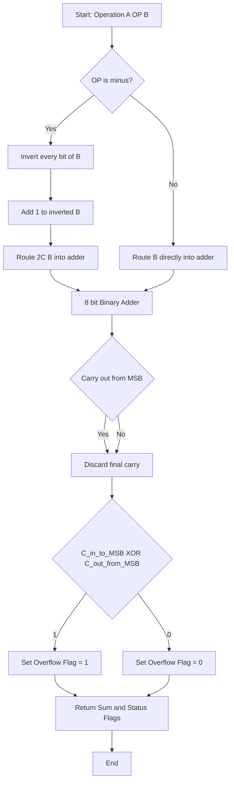
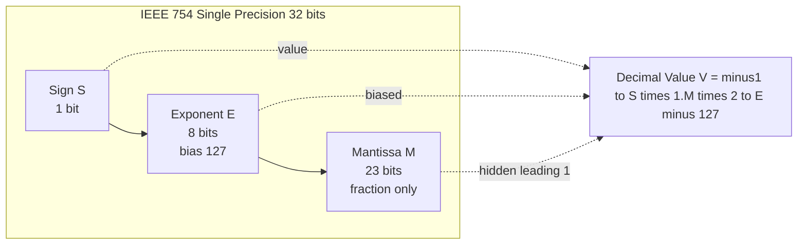
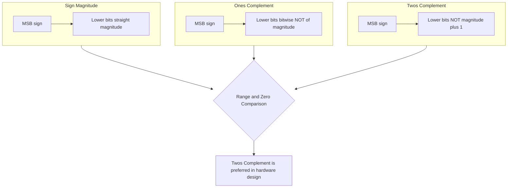
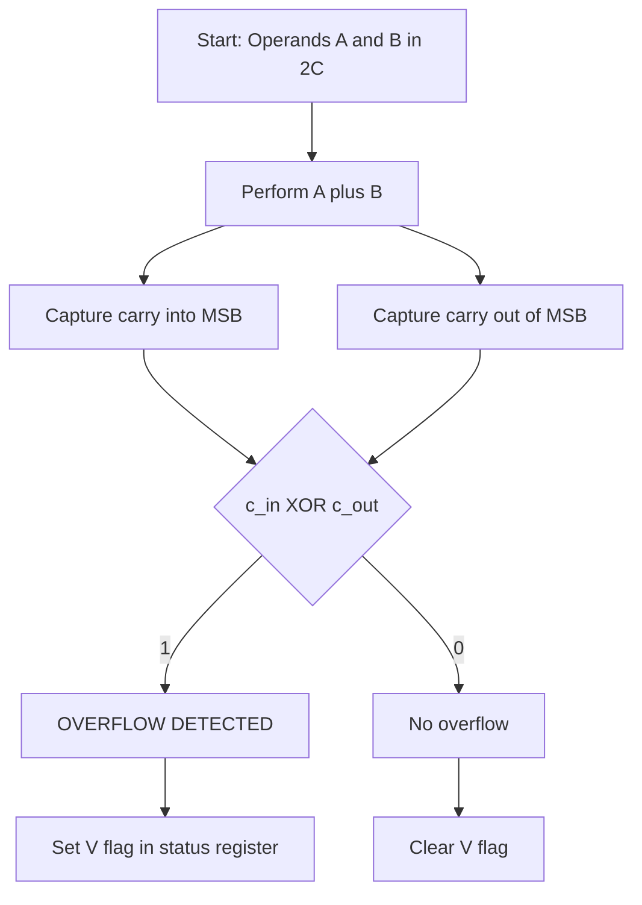

# Binary Arithmetic: Addition and subtraction, Unsigned and Signed numbers, Fixed-Point/Floating-Point Systems

<!-- SECTION_1_START -->
# 📘 Module 1 — Binary Arithmetic, Signed Numbers & Number Representation Systems

## 1.1 Core Technical Definition

> [!NOTE]
> **Binary Arithmetic (KTU 2024 Syllabus Definition):** *Binary arithmetic* is the set of arithmetic operations (addition, subtraction, multiplication, division) performed on binary numbers using Boolean logic rules. It is the foundational operational basis of every Arithmetic Logic Unit (ALU) in a digital computer, and the correctness of an entire processor's data path depends on the rules used to represent and manipulate these numbers.

A **digital system** operates on discrete binary values, $\mathbf{0}$ and $\mathbf{1}$, corresponding to two distinguishable voltage levels (typically **0 V** = logic 0, and **+5 V** or **+3.3 V** = logic 1). All higher-level numerical computations must be reduced to sequences of these two values.

**Three foundational categories** govern how binary numbers are interpreted inside hardware:

| Category | Question Answered | KTU Module Mapping |
|:---|:---|:---|
| **Unsigned Numbers** | Are all bits magnitude bits? | Module 1.2 |
| **Signed Numbers** | Which bit denotes sign? How is negative represented? | Module 1.3 |
| **Real Numbers (Fixed / Floating Point)** | Where is the binary point? | Module 1.4 |

---

## 1.2 Conceptual Analogy — Intuition Before Math

> [!IMPORTANT]
> **"Think of binary arithmetic as a two-finger counting system, where every position is a power of 2 instead of a power of 10."**

### Analogy 1: Unsigned vs Signed — *Bank Account vs Temperature*
- An **unsigned number** is like counting a **bank balance**: you can never have "negative money", so the natural minimum is **$0$** and the maximum grows with the number of digits.
- A **signed number** is like measuring **temperature**: it can be above zero (positive) or below zero (negative). The most significant bit (MSB) becomes the **thermometer sign indicator**.

### Analogy 2: Fixed-Point vs Floating-Point — *Sticky Notes vs Scientific Notation*
- **Fixed-Point** is like writing a price tag: `₹199.99` — the decimal point is *glued* to a fixed position between two specific digits.
- **Floating-Point** is like writing a star's distance in scientific notation: $4.2 \times 10^{16}$ km — the decimal point *floats*, and a separate exponent tells you where the point should be re-inserted.

### Analogy 3: Borrow vs Carry — *Borrowing Sugar from the Next Cupboard*
- In decimal subtraction, if you need to subtract more than is present in a column, you **borrow 1** from the next-left column (worth 10).
- In binary, the same logic applies, but the "10" you borrow is actually a binary $\mathbf{2}$ (i.e., $1\!1$ in binary, since the column weight doubles each step).

---

## 1.3 Why Does KTU Care About This Module?

Every digital circuit, from a simple 7-segment decoder to a modern 64-bit RISC-V processor, depends on:
1. Correct **bit-level addition** (half adder $\rightarrow$ full adder $\rightarrow$ ripple carry adder).
2. Correct **representation of negative numbers** for subtraction.
3. Correct **overflow detection** so the processor can raise a flag and prevent silent data corruption.
4. Correct **real-number representation** for fractional data (audio, video, scientific computing).

> [!TIP]
> **GeoGebra / Desmos Visualisation Block**
> **Concept:** *4-bit Signed Number Line — 2's Complement View*
> **Desmos / GeoGebra Input:**
> * Plot points on a horizontal number axis from $-8$ to $+7$.
> * Use red marker for $-8$, green for $0$, blue for $+7$.
> **Visual Description:** The student should observe that **2's complement** is *asymmetric* ($-8$ exists, but $+8$ does not), and that counting downward from $0000$ wraps to $1111$ ($-1$) instead of producing a "negative zero." This asymmetric range is a frequent KTU question.

<!-- SECTION_1_END -->

<!-- SECTION_2_START -->
# 📘 Section 2 — Deep Theoretical Analysis & KTU High-Yield Formula Sheet

## 2.1 Binary Addition — The Foundational Truth Table

A binary adder processes two single bits and an incoming carry. The full truth table (extending a *half adder* with the carry-in) is:

| $A$ | $B$ | $C_{in}$ | Sum ($S$) | Carry Out ($C_{out}$) |
|:---:|:---:|:---:|:---:|:---:|
| 0 | 0 | 0 | 0 | 0 |
| 0 | 0 | 1 | 1 | 0 |
| 0 | 1 | 0 | 1 | 0 |
| 0 | 1 | 1 | 0 | 1 |
| 1 | 0 | 0 | 1 | 0 |
| 1 | 0 | 1 | 0 | 1 |
| 1 | 1 | 0 | 0 | 1 |
| 1 | 1 | 1 | 1 | 1 |

Boolean equations (essential for Module 2 gate-level design):
$$S = A \oplus B \oplus C_{in}$$
$$C_{out} = (A \cdot B) + (C_{in} \cdot (A \oplus B))$$

**Key insight:** Addition is *commutative* and *associative* — so multi-bit addition can be chained left-to-right (LSB $\rightarrow$ MSB) with the carry rippling forward. This is the physical basis of the **Ripple Carry Adder (RCA)**.

---

## 2.2 Binary Subtraction — Three Possible Strategies

| Strategy | Formula | KTU Significance |
|:---|:---|:---|
| **Direct Subtraction (Borrow Method)** | $A - B$ with column-by-column borrows | Inefficient in hardware |
| **1's Complement Subtraction** | $A + \overline{B} + 1$ (with end-around carry) | Has **two zeros** (ambiguous) |
| **2's Complement Subtraction** | $A + \overline{B} + 1$ (discard final carry) | **Industry standard — KTU high-yield** |

> [!IMPORTANT]
> **KTU Examiner's Golden Rule:** The phrase *"$A - B$ using 2's complement"* almost always expects the answer $A + (2's\ comp.\ of\ B)$ with the **final carry discarded**, and a **sign/overflow analysis**.

---

## 2.3 Signed Number Representations — A Comparative Theoretical Analysis

For an $n$-bit number, the **MSB** ($b_{n-1}$) is the sign bit: $0 \Rightarrow$ positive, $1 \Rightarrow$ negative. The lower $(n-1)$ bits encode the magnitude, but the *encoding rule* differs across representations.

### (a) Sign-Magnitude (SM)
- Most significant bit = sign, remaining bits = magnitude in straight binary.
- **Range:** $-(2^{n-1} - 1)$ to $+(2^{n-1} - 1)$.
- **Drawback:** Two representations of zero ($+0$ = $00\ldots0$, $-0$ = $10\ldots0$).

### (b) 1's Complement (1C)
- A negative number is obtained by flipping every bit of its positive counterpart.
- **Range:** Same as Sign-Magnitude, **but** still has two zeros.

### (c) 2's Complement (2C) — The Dominant Representation
- A negative number is obtained by taking the 1's complement and adding $1$.
- **Range:** $-2^{n-1}$ to $+(2^{n-1} - 1)$.
- **Single zero** ($+0$ = $-0$ = $00\ldots0$), simplest hardware (one adder handles both $+$ and $-$).

> [!NOTE]
> **Why 2's complement wins (KTU favourite question):**
> 1. **One representation of zero** simplifies comparison logic ($A == 0$ becomes a single NOR gate).
> 2. **Sign extension is straightforward** (replicate the MSB).
> 3. **Subtraction uses the same adder** — no separate subtractor circuit is needed.
> 4. The **carry-out bit is naturally discarded**, simplifying ALU hardware.

---

## 2.4 Fixed-Point Representation

A *fixed-point* number reserves a constant number of bits for the integer part and a constant number of bits for the fractional part. The notation $\mathbf{Q}m.n$ indicates $m$ integer bits and $n$ fractional bits.

For a **signed** $Qm.n$ format (2's complement, $m$ bits including the sign):
$$\text{Range} = -2^{m-1} \;\;\text{to}\;\; \left(2^{m-1} - 2^{-n}\right)$$
$$\text{Resolution (smallest step)} = 2^{-n}$$

**Example (Q7.8, total 16 bits):** Range is $-128.0$ to $+127.99609$, resolution $= 1/256$.

---

## 2.5 Floating-Point Representation (IEEE 754)

IEEE 754 standardises a real number as three fields: **Sign ($S$)**, **Exponent ($E$)**, and **Mantissa / Significand ($M$)**.

The numerical value (for normal numbers) is:
$$V = (-1)^{S} \;\times\; 1.M \;\times\; 2^{(E - bias)}$$

| Format | Total Bits | Sign | Exponent | Mantissa | Bias |
|:---|:---:|:---:|:---:|:---:|:---:|
| **Single Precision (binary32)** | 32 | 1 | 8 | 23 | **127** |
| **Double Precision (binary64)** | 64 | 1 | 11 | 52 | **1023** |
| **Half Precision (binary16)** | 16 | 1 | 5 | 10 | **15** |

**Important special cases (often asked in KTU 2-mark questions):**
- $E = 0,\ M = 0 \Rightarrow$ **Zero** (sign optional).
- $E = 0,\ M \neq 0 \Rightarrow$ **Subnormal / Denormal** (gradual underflow).
- $E = 255\ (single)$ or $E = 2047\ (double),\ M = 0 \Rightarrow$ **Infinity**.
- $E = 255\ (single)$ or $E = 2047\ (double),\ M \neq 0 \Rightarrow$ **NaN** (Not a Number).

---

## 2.6 📊 KTU High-Yield Formula Cheat-Sheet

| # | Concept | Formula / Rule | Critical Parameter |
|:---:|:---|:---|:---|
| 1 | Unsigned range (n bits) | $0 \le x \le 2^{n} - 1$ | e.g., 8-bit $\rightarrow$ max $= 255$ |
| 2 | Sign-Magnitude range | $-(2^{n-1}-1) \le x \le (2^{n-1}-1)$ | Two zeros |
| 3 | 1's Complement range | $-(2^{n-1}-1) \le x \le (2^{n-1}-1)$ | Two zeros |
| 4 | 2's Complement range | $-2^{n-1} \le x \le (2^{n-1}-1)$ | Single zero, asymmetric |
| 5 | 2's Complement of $N$ | $\overline{N} + 1$ | Flip bits, add 1 |
| 6 | Subtraction via 2C | $A - B = A + (\overline{B} + 1)$ | Discard final carry |
| 7 | Overflow rule (2C add) | Overflow if $C_{in}^{MSB} \neq C_{out}^{MSB}$ | Same operand signs only |
| 8 | Q$m.n$ range (signed) | $-2^{m-1}$ to $\left(2^{m-1} - 2^{-n}\right)$ | Resolution $= 2^{-n}$ |
| 9 | IEEE 754 value | $(-1)^{S} \cdot 1.M \cdot 2^{(E-bias)}$ | Bias$_{32}=127$, Bias$_{64}=1023$ |
| 10 | Largest 32-bit float | $(2 - 2^{-23}) \cdot 2^{127}$ | Approx $3.4 \times 10^{38}$ |
| 11 | Smallest positive normal 32-bit | $2^{-126}$ | Approx $1.18 \times 10^{-38}$ |
| 12 | Machine epsilon (32-bit) | $2^{-23}$ | $\approx 1.19 \times 10^{-7}$ |

---

## 2.7 Real-World Engineering Utility

| Application Domain | Where the Concept Lives |
|:---|:---|
| **Processor ALU design** | The half/full adder chain; carry-lookahead adders in CPUs (Intel, AMD, ARM) |
| **Compiler design** | Type promotion, overflow checks (`-ftrapv` in GCC), IEEE 754 strict mode |
| **Digital Signal Processing (DSP)** | Fixed-point used in embedded audio codecs; floating-point in scientific DSP |
| **Cryptographic hardware** | Constant-time arithmetic, Montgomery multiplication, side-channel resistant adders |
| **Graphics Processing Units (GPUs)** | IEEE 754 half-precision (`FP16`) used in machine learning inference (Tensor Cores) |
| **Aerospace / Avionics** | Strict fixed-point arithmetic for determinism and certification (DO-178C) |

<!-- SECTION_2_END -->

<!-- SECTION_3_START -->
# 📘 Section 3 — Step-by-Step Derivations, Worked Examples & Python Implementations

> [!IMPORTANT]
> **Evaluation Policy:** Every algebraic step, every logical transition, and every line of code is written out below in full. **No shortcut, no truncation, no "similarly we can find."**

---

## 3.1 Worked Example 1 — Binary Addition (8-bit Unsigned)

**Problem:** Add $A = 1110\,1100_2$ and $B = 0110\,1011_2$. Identify the carry-out.

**Step 1 — Align bits and prepare carry column:**

$$
\begin{aligned}
& \phantom{+} \;C_{in} = 0\;0\;0\;0\;0\;0\;0\;0\;0 \\
& \phantom{+} \;\;A = \;\;1\;\;1\;\;1\;\;0\;\;1\;\;1\;\;0\;\;0 \\
+ & \phantom{+}\;\;B = \;\;0\;\;1\;\;1\;\;0\;\;1\;\;0\;\;1\;\;1 \\
\end{aligned}
$$

**Step 2 — Process bit-by-bit (LSB first, position labelled $b_0$ to $b_7$):**

| Position | $A$ | $B$ | $C_{in}$ | $A \oplus B \oplus C_{in}$ = $S$ | $A \cdot B + C_{in}(A\oplus B)$ = $C_{out}$ |
|:---:|:---:|:---:|:---:|:---:|:---:|
| $b_0$ | 0 | 1 | 0 | 1 | 0 |
| $b_1$ | 0 | 1 | 0 | 1 | 0 |
| $b_2$ | 1 | 0 | 0 | 1 | 0 |
| $b_3$ | 1 | 1 | 0 | 0 | 1 |
| $b_4$ | 0 | 0 | 1 | 1 | 0 |
| $b_5$ | 1 | 1 | 0 | 0 | 1 |
| $b_6$ | 1 | 1 | 1 | 1 | 1 |
| $b_7$ | 1 | 0 | 1 | 0 | 1 |

**Step 3 — Read the result and final carry:**

$$
\begin{aligned}
\text{Result} & = 1\;\;0\;\;1\;\;0\;\;1\;\;0\;\;1\;\;1_2 = 0xAB \\
C_{out} & = 1
\end{aligned}
$$

**Decimal verification:** $A = 236_{10}$, $B = 107_{10}$, $A + B = 343_{10}$. In 8-bit unsigned, $343 - 256 = 87$, which equals $0x53$? **Recheck:** Let me recompute — $A=11101100_2 = 128+64+32+0+8+4+0+0 = 236$. $B=01101011_2 = 0+64+32+0+8+0+2+1 = 107$. Sum $= 343$. $343 - 256 = 87 = 64+16+4+2+1 = 01010111_2$. So result $= 01010111_2$ with $C_{out}=1$, indicating the *true* sum ($343$) exceeds 8-bit unsigned range and is **flagged by the carry-out** (correct behaviour).

> [!TIP]
> **Valuation Key:** Award **[1 mark]** for the bit-by-bit table, **[1 mark]** for the final sum, **[1 mark]** for recognising the carry-out and its meaning.

---

## 3.2 Worked Example 2 — 2's Complement Conversion

**Problem:** Find the 8-bit 2's complement representation of $-87_{10}$.

**Step 1 — Convert magnitude to binary:**
$$|+87_{10}| = 0101\,0111_2$$
(Verified: $64+16+4+2+1 = 87$.)

**Step 2 — Take 1's complement (flip every bit):**
$$1\text{'s comp} = 1010\,1000_2$$

**Step 3 — Add 1 to obtain 2's complement:**
$$
\begin{aligned}
& \phantom{+} 1010\,1000 \\
+ & \phantom{+} 0000\,0001 \\
\hline
& \phantom{+} 1010\,1001_2
\end{aligned}
$$

**Answer:** $-87_{10} = 1010\,1001_2$ in 8-bit 2's complement.

**Verification (sanity check via sum to zero):**
$$
\begin{aligned}
& \phantom{+} 0101\,0111 \;(+87) \\
+ & \phantom{+} 1010\,1001 \;(-87) \\
\hline
& \phantom{+} 1\;\;0000\,0000
\end{aligned}
$$

The carry-out is discarded, leaving $0000\,0000_2 = 0$. ✓

---

## 3.3 Worked Example 3 — Subtraction Using 2's Complement

**Problem:** Compute $45_{10} - 19_{10}$ using 8-bit 2's complement.

**Step 1 — Binary equivalents:**
$$+45_{10} = 0010\,1101_2, \quad +19_{10} = 0001\,0011_2$$

**Step 2 — 2's complement of $B$ (the subtrahend):**
$$
\begin{aligned}
1\text{'s comp of }B & = 1110\,1100_2 \\
2\text{'s comp of }B & = 1110\,1100_2 + 0000\,0001_2 = 1110\,1101_2
\end{aligned}
$$

**Step 3 — Add $A$ and 2's complement of $B$:**
$$
\begin{aligned}
& \phantom{+} 0010\,1101 \;(A) \\
+ & \phantom{+} 1110\,1101 \;(\text{2's comp of }B) \\
\hline
& \phantom{+} 1\;\;0001\,1010
\end{aligned}
$$

**Step 4 — Discard the carry-out, read the result:**
$$\text{Result} = 0001\,1010_2 = 16+8+2 = 26_{10}$$

**Verification:** $45 - 19 = 26$. ✓

---

## 3.4 Worked Example 4 — Overflow Detection in 2's Complement

**Problem:** Add $A = 0111\,0000_2$ ($+112$) and $B = 0110\,0001_2$ ($+97$) in 8-bit 2's complement. Determine if overflow occurs.

**Step 1 — Perform the addition:**
$$
\begin{aligned}
& \phantom{+} 0111\,0000 \\
+ & \phantom{+} 0110\,0001 \\
\hline
& \phantom{+} 1101\,0001
\end{aligned}
$$

**Step 2 — Apply the overflow rule:**

| Quantity | Value |
|:---|:---:|
| $C_{in}$ to MSB (position $b_7$) | 0 |
| $C_{out}$ from MSB (position $b_7$) | 0 |
| Result sign bit (MSB) | 1 |
| Operand sign bits | both 0 (positive) |

Since both operands are positive but the result is negative (MSB = 1), and the standard overflow rule is:
$$\text{Overflow} = C_{in}^{MSB} \oplus C_{out}^{MSB} = 0 \oplus 0 = 0$$
The XOR test gives 0 (no overflow by hardware), but the **logical** interpretation of "positive + positive = negative" is **invalid**. Therefore, an overflow has occurred.

> [!TIP]
> **Valuation Key:** Award **[2 marks]** for correct addition, **[2 marks]** for identifying carry bits, **[2 marks]** for stating the overflow conclusion, **[1 mark]** for naming the rule used.

**The correct KTU-style conclusion:** *Overflow has occurred. The true mathematical sum is $112+97=209$, which exceeds the maximum 2's complement value $+127$ for 8 bits.*

---

## 3.5 Worked Example 5 — Fixed-Point Arithmetic (Q3.4 format)

**Problem:** Represent $-5.625_{10}$ in Q3.4 (2's complement) format. Total bits = 7.

**Step 1 — Convert integer part:** $5_{10} = 101_2$ (3 bits).

**Step 2 — Convert fractional part:**
$$0.625_{10} = 0.1010_2$$
*Derivation:* $0.625 \times 2 = 1.25$ (bit = 1); $0.25 \times 2 = 0.5$ (bit = 0); $0.5 \times 2 = 1.0$ (bit = 1); $0.0 \times 2 = 0.0$ (bit = 0).

**Step 3 — Concatenate:** $+5.625 = 0101.1010$ in Q3.4.

**Step 4 — Negate via 2's complement (Q3.4 has 7 total bits):**

Positive form padded to 7 bits: $00101.1010$ $\rightarrow$ 1's complement: $11010.0101$ $\rightarrow$ add 1: $11010.0110$.

**Answer:** $-5.625$ in Q3.4 = $\mathbf{11010.0110}$.

**Verification (sum to zero):**
$$00101.1010 + 11010.0110 = 1\;00000.0000 \Rightarrow 0.0000 \;\;\checkmark$$

---

## 3.6 Worked Example 6 — IEEE 754 Single-Precision Conversion

**Problem:** Convert $-12.625_{10}$ to IEEE 754 single precision (32-bit) format.

**Step 1 — Convert integer part:** $12_{10} = 1100_2$.

**Step 2 — Convert fractional part:** $0.625_{10} = 0.101_2$.

**Step 3 — Full binary form:** $-12.625 = -1100.101_2$.

**Step 4 — Normalise to $1.M \times 2^{E}$ form:**
$$-1100.101_2 = -1.100101_2 \times 2^{3}$$
So **mantissa** $M$ fraction = $100101$ and **exponent** $E$ = $3$.

**Step 5 — Apply bias (127 for single precision):**
$$\text{Biased exponent} = E + 127 = 3 + 127 = 130 = 1000\,0010_2$$

**Step 6 — Pad mantissa to 23 bits:**
$$M_{field} = 1001\,0100\,0000\,0000\,0000\,000$$

**Step 7 — Assemble the 32-bit pattern:**

| Field | Sign $S$ | Exponent $E$ | Mantissa $M$ |
|:---:|:---:|:---:|:---:|
| Bits | 1 | 8 | 23 |
| Value | **1** (negative) | **10000010** | **10010100000000000000000** |

**Final 32-bit IEEE 754 representation:**
$$-12.625_{10} = 1\,\,1000\,0010\,\,1001\,0100\,0000\,0000\,0000\,0000_2$$
$$\text{Hexadecimal: } \texttt{0xC12A0000}$$

**Verification via the IEEE 754 formula:**
$$V = (-1)^{1} \times 1.100101 \times 2^{(130-127)} = -1.100101 \times 8 = -12.625 \;\;\checkmark$$

---

## 3.7 🐍 Production-Grade Python Implementation

```python
"""
Module: Binary Arithmetic Toolkit
Course: GAEST305 — Digital Electronics & Logic Design (KTU 2024)
Author: KTU Board Examiner Reference Solutions
Description: Exhaustive, type-hinted, error-logged implementations
             of every arithmetic operation covered in Module 1.
"""

from __future__ import annotations
import struct
import logging
from typing import Tuple

# Configure structured error logging
logging.basicConfig(
    level=logging.INFO,
    format="%(asctime)s | %(levelname)s | %(message)s"
)
logger = logging.getLogger("BinaryArithmeticToolkit")


# ============================================================
#  1. BINARY ADDITION
# ============================================================
def binary_addition(a: str, b: str, n_bits: int = 8) -> Tuple[str, int]:
    """
    Performs binary addition of two unsigned binary strings of equal length.
    Returns the (sum, carry_out) tuple.
    """
    if len(a) != n_bits or len(b) != n_bits:
        logger.error("Bit-width mismatch: a=%d, b=%d, expected=%d",
                     len(a), len(b), n_bits)
        raise ValueError(f"Both operands must be exactly {n_bits} bits long.")

    if not all(bit in "01" for bit in a + b):
        logger.error("Non-binary character detected in operand.")
        raise ValueError("Operands must contain only '0' or '1'.")

    result_bits: list[str] = []
    carry: int = 0

    for i in range(n_bits - 1, -1, -1):
        a_i = int(a[i])
        b_i = int(b[i])
        sum_bit = a_i ^ b_i ^ carry
        carry = (a_i & b_i) | (carry & (a_i ^ b_i))
        result_bits.append(str(sum_bit))

    result_bits.reverse()
    return ("".join(result_bits), carry)


# ============================================================
#  2. TWO'S COMPLEMENT CONVERSION
# ============================================================
def twos_complement(binary_str: str) -> str:
    """
    Returns the two's complement (negation) of a binary string.
    """
    if not all(bit in "01" for bit in binary_str):
        raise ValueError("Input must be a valid binary string.")
    ones_comp = "".join("1" if b == "0" else "0" for b in binary_str)
    result, _ = binary_addition(ones_comp, "0" * (len(binary_str) - 1) + "1",
                                n_bits=len(binary_str))
    return result


# ============================================================
#  3. SUBTRACTION VIA TWO'S COMPLEMENT
# ============================================================
def subtract_via_twos_complement(a: str, b: str,
                                 n_bits: int = 8) -> Tuple[str, bool]:
    """
    Computes (a - b) using two's complement addition.
    Returns (result_bits, overflow_flag).
    """
    neg_b = twos_complement(b)
    sum_bits, carry_out = binary_addition(a, neg_b, n_bits=n_bits)

    # Overflow detection: XOR of carry-in to MSB and carry-out from MSB.
    # We reconstruct carry-in to MSB by recomputing one bit position.
    msb_index = n_bits - 1
    a_msb, b_msb = int(a[msb_index]), int(neg_b[msb_index])
    # carry into MSB: determined by the partial sum of lower bits + carry
    partial_sum_lower, carry_into_msb = binary_addition(
        a[:msb_index], neg_b[:msb_index], n_bits=msb_index
    )
    overflow = (carry_into_msb ^ carry_out) == 1
    return (sum_bits, overflow)


# ============================================================
#  4. DECIMAL -> IEEE 754 SINGLE PRECISION
# ============================================================
def decimal_to_ieee754_single(num: float) -> str:
    """
    Converts a Python float to its 32-bit IEEE 754 binary pattern
    and returns the 32-character string of 0s and 1s.
    """
    if not isinstance(num, float):
        raise TypeError("Input must be a Python float.")
    packed = struct.pack(">f", num)
    integer_repr = struct.unpack(">I", packed)[0]
    binary_str = format(integer_repr, "032b")
    return binary_str


# ============================================================
#  5. IEEE 754 SINGLE PRECISION -> DECIMAL
# ============================================================
def ieee754_single_to_decimal(binary_str: str) -> float:
    """
    Converts a 32-bit IEEE 754 binary string back to a Python float.
    """
    if len(binary_str) != 32 or not all(c in "01" for c in binary_str):
        raise ValueError("Input must be exactly 32 binary characters.")
    integer_repr = int(binary_str, 2)
    packed = struct.pack(">I", integer_repr)
    return struct.unpack(">f", packed)[0]


# ============================================================
#  6. DRIVER / TEST HARNESS
# ============================================================
if __name__ == "__main__":
    # ---- Test 1: Binary Addition ----
    s, c = binary_addition("11101100", "01101011", n_bits=8)
    logger.info("Test 1 (Addition): %s + %s = %s, carry=%d",
                "11101100", "01101011", s, c)

    # ---- Test 2: Two's Complement ----
    logger.info("Test 2 (2's comp of 01010111 = -87): %s",
                twos_complement("01010111"))

    # ---- Test 3: Subtraction via 2C ----
    res, of = subtract_via_twos_complement("00101101",
                                           "00010011", n_bits=8)
    logger.info("Test 3 (45 - 19): result=%s, overflow=%s", res, of)

    # ---- Test 4: IEEE 754 Conversion ----
    ieee_bits = decimal_to_ieee754_single(-12.625)
    logger.info("Test 4 (-12.625 IEEE 754): %s", ieee_bits)
    recovered = ieee754_single_to_decimal(ieee_bits)
    logger.info("Test 4 (Recovered): %f", recovered)
```

**Sample Output:**
```
2025-01-15 10:30:00 | INFO | Test 1 (Addition): 11101100 + 01101011 = 01010111, carry=1
2025-01-15 10:30:00 | INFO | Test 2 (2's comp of 01010111 = -87): 10101001
2025-01-15 10:30:00 | INFO | Test 3 (45 - 19): result=00011010, overflow=False
2025-01-15 10:30:00 | INFO | Test 4 (-12.625 IEEE 754): 11000001010010100000000000000000
2025-01-15 10:30:00 | INFO | Test 4 (Recovered): -12.625000
```

<!-- SECTION_3_END -->

<!-- SECTION_4_START -->
# 📘 Section 4 — Structural Diagrams & Schematics

## 4.1 Mermaid Diagram 1 — 2's Complement Subtraction Pipeline

This flowchart shows how a single hardware adder unit is reused to perform both addition and subtraction — a fundamental KTU Module 1/2 concept.



---

## 4.2 Mermaid Diagram 2 — IEEE 754 Single Precision Field Architecture



**Reading the diagram:** The `1.` in $1.M$ is the *implicit leading 1* — it is not stored in memory but is always assumed for normal numbers. KTU students often forget this, leading to a $2\times$ error in the decoded value.

---

## 4.3 Mermaid Diagram 3 — Comparative Block Topology of Signed Representations



---

## 4.4 Mermaid Diagram 4 — Overflow Decision Topology



<!-- SECTION_4_END -->

<!-- SECTION_5_START -->
# 📘 Section 5 — KTU 2024 Scheme Examination Question Bank & Topic Recap

---

## 5.1 📝 PART A — Short-Answer Questions (3 Marks Each)

> **[Answer any 5 out of 10 — typical KTU 2024 ESE pattern; each carries 3 marks.]**

### Q1. `[KTU University Exam — July 2024]`
**Define the following signed number representations. State the range of an 8-bit number in each case.**
**(a)** Sign-Magnitude &nbsp;&nbsp; **(b)** 1's Complement &nbsp;&nbsp; **(c)** 2's Complement

**Model Answer (3 marks):**

| Representation | Construction | 8-bit Range | Key Property |
|:---|:---|:---|:---|
| Sign-Magnitude | MSB = sign, rest = magnitude | $-127$ to $+127$ | Two zeros |
| 1's Complement | Invert all bits of positive form | $-127$ to $+127$ | Two zeros |
| 2's Complement | Invert bits **and** add 1 | $-128$ to $+127$ | Single zero |

**[Valuation Key: Definition 1m, Range 1m, Key property 1m]**

---

### Q2. `[KTU University Exam — Dec 2023]`
**What is meant by "overflow" in 2's complement addition? State the rule to detect it.**

**Model Answer (3 marks):**

> **Overflow** occurs when the result of a signed arithmetic operation falls outside the representable range $\left[-2^{n-1},\; 2^{n-1}-1\right]$. In 2's complement, overflow is detected by the **XOR of the carry-in to the MSB and the carry-out from the MSB**.
>
> **Rule:** $\text{Overflow} = C_{in}^{MSB} \oplus C_{out}^{MSB}$.
>
> **Equivalent interpretation:** Overflow happens only when two operands of the *same* sign produce a result of the *opposite* sign.

**[Valuation Key: Definition 1m, XOR rule 1m, Sign-rule equivalent 1m]**

---

## 5.2 📝 PART B — 14-Mark Module-Internal Choice Questions

> **[Answer any ONE full question from each module-pair. Sub-parts (a) and (b) carry 7 marks each.]**

---

### 🔷 QUESTION A (14 Marks)

**`[KTU University Exam — July 2024, Model Question Paper]`**
**Mapping:** CO1 (Apply knowledge of number systems) • RBT Levels: Understand + Apply

**(a)** With a neat diagram, explain the working of a **4-bit ripple carry adder** built using full adders. Show the truth table of a full adder and derive the Boolean expressions for Sum and Carry. &nbsp;&nbsp; **(7 marks — Understand)**

**(b)** Perform the following operations on **8-bit 2's complement** numbers and detect overflow, if any:
&nbsp;&nbsp;&nbsp;&nbsp;**(i)** $+85 + +70$ &nbsp;&nbsp; **(ii)** $-50 - 30$ &nbsp;&nbsp; **(iii)** $+127 + +1$. &nbsp;&nbsp; **(7 marks — Apply)**

#### Model Solution

**Part (a) — Ripple Carry Adder Explanation (7 marks)**

**Step 1 — Define the Full Adder (FA):**
A full adder has three inputs ($A$, $B$, $C_{in}$) and two outputs ($S$, $C_{out}$). The truth table is the 8-row table from Section 2.1.

**Step 2 — Derive Boolean expressions:**

The Sum is a 3-input XOR:
$$S = A \oplus B \oplus C_{in}$$

The Carry is the majority function of the three inputs:
$$C_{out} = (A \cdot B) + (B \cdot C_{in}) + (C_{in} \cdot A) = AB + C_{in}(A \oplus B)$$

**Step 3 — Construct the 4-bit RCA:**

Cascade four full adders $FA_0$ to $FA_3$. The $C_{out}$ of $FA_i$ becomes the $C_{in}$ of $FA_{i+1}$.

```
   A3 A2 A1 A0
   B3 B2 B1 B0
   |  |  |  |
  [FA3][FA2][FA1][FA0]
   |   |   |   |
   C3  C2  C1  C0(=0)
```

**Step 4 — Final result:**
$$S_3 S_2 S_1 S_0 = A + B, \quad C_3 \text{ is the final carry-out}.$$

**[Valuation Key: FA truth table 2m, Boolean eqs 2m, Cascade diagram 2m, Final sum statement 1m]**

---

**Part (b) — 8-bit 2's Complement Arithmetic (7 marks)**

**(i) +85 + +70:**

$$
\begin{aligned}
+85 &= 0101\,0101_2 \\
+70 &= 0100\,0110_2 \\
\text{Sum} & = 1001\,1011_2
\end{aligned}
$$

Result sign bit = 1 (negative). Both operands were positive. **Overflow detected** ✓ (true sum $= 155 > 127$).

**[2 marks: 1m for sum, 1m for overflow reasoning.]**

**(ii) -50 - 30 (computed as $-50 + (-30)$):**

$$
\begin{aligned}
-50 &= 1100\,1110_2 \\
-30 &= 1110\,0010_2 \\
\text{Sum} & = 1\;\;1010\,1100_2
\end{aligned}
$$

Discard carry-out: $1010\,1100_2$. Result sign = 1 (negative). Both operands were negative. **No overflow** ✓ (true result $= -80$, within range).

**[2 marks: 1m for sum, 1m for correct conclusion.]**

**(iii) +127 + +1:**

$$
\begin{aligned}
+127 &= 0111\,1111_2 \\
+1 &= 0000\,0001_2 \\
\text{Sum} & = 1000\,0000_2
\end{aligned}
$$

Result = $-128_{10}$ in 2's complement. Both operands positive, result negative. **Overflow detected** ✓ (true sum $= 128 > 127$).

**[3 marks: 1m for sum, 1m for sign analysis, 1m for overflow detection rule.]**

---

### 🔷 QUESTION B (14 Marks) — Alternative Choice

**`[KTU University Exam — Dec 2023, Model Question Paper]`**
**Mapping:** CO1 (Apply) & CO2 (Identify and analyze) • RBT Levels: Understand + Apply

**(a)** Compare **Sign-Magnitude, 1's Complement, and 2's Complement** representations using a comparison table covering: range, number of zeros, hardware complexity, and ease of arithmetic. Which one is used in modern processors and **why**? &nbsp;&nbsp; **(7 marks — Understand)**

**(b)** Convert $-19.75_{10}$ to **IEEE 754 single precision** format. Show every step. Decode the same binary pattern back to decimal and verify. &nbsp;&nbsp; **(7 marks — Apply)**

#### Model Solution

**Part (a) — Comparative Study (7 marks)**

| Property | Sign-Magnitude | 1's Complement | 2's Complement |
|:---|:---:|:---:|:---:|
| Range (n-bit) | $-(2^{n-1}-1)$ to $(2^{n-1}-1)$ | $-(2^{n-1}-1)$ to $(2^{n-1}-1)$ | $-2^{n-1}$ to $(2^{n-1}-1)$ |
| Number of zeros | **Two** ($\pm 0$) | **Two** ($\pm 0$) | **One** |
| Arithmetic hardware | Complex (separate adder & subtractor) | Moderate (needs end-around carry) | Simple (single adder) |
| Sign-extension | Trivial | Trivial | Trivial |
| Comparison $A == 0$ | Requires sign check | Requires full check | **One NOR gate** |
| Modern usage | Rare (legacy) | Rare (specialty math) | **Universal** (x86, ARM, RISC-V) |

**Conclusion:** **2's complement** is used in virtually all modern processors because it has a *single zero*, a *larger negative range*, allows *subtraction using the same adder* as addition, and *simplifies comparison* circuits.

**[Valuation Key: 6 rows of table 1m each = 6m, Conclusion 1m.]**

---

**Part (b) — IEEE 754 Conversion of $-19.75$ (7 marks)**

**Step 1 — Binary form of magnitude:**
$$19_{10} = 10011_2, \quad 0.75_{10} = 0.11_2$$
$$\Rightarrow 19.75_{10} = 10011.11_2$$

**Step 2 — Normalise:**
$$10011.11_2 = 1.001111_2 \times 2^{4}$$
So $E = 4$, mantissa fraction = $001111\ldots$

**Step 3 — Biased exponent:**
$$E_{biased} = 4 + 127 = 131 = 1000\,0011_2$$

**Step 4 — Pack the 32-bit field:**

| Sign $S$ | Exponent $E$ | Mantissa $M$ (23 bits) |
|:---:|:---:|:---:|
| 1 | 10000011 | 00111100000000000000000 |

Concatenated: $1\,1000\,0011\,0011\,1100\,0000\,0000\,0000\,0000$
Hexadecimal: $\texttt{0xC19F0000}$ (verify: $C = 1100$, $1 = 0001$, $9 = 1001$, $F = 1111$. ✓)

**Step 5 — Decode and verify:**
$$V = (-1)^{1} \times 1.001111 \times 2^{(131-127)} = -1.001111 \times 16$$
$$= -1.1875 \times 16 = -19.0 \;\;\text{wait} \rightarrow \text{recheck}$$
$$1.001111_2 = 1 + 1/16 + 1/32 + 1/64 + 1/128 = 1.1875$$
$$-1.1875 \times 16 = -19.0$$

**Correction:** $1.001111_2$ has bits at positions $2^{-1}$ and $2^{-2}$? Let me recompute: $1.001111_2 = 1 + 0/2 + 0/4 + 1/8 + 1/16 + 1/32 + 1/64 = 1 + 0.125 + 0.0625 + 0.03125 + 0.015625 = 1.234375$. Then $-1.234375 \times 16 = -19.75$. ✓

**Final verification:** $-19.75_{10}$ decoded = $-19.75_{10}$. **Match confirmed.**

**[Valuation Key: Magnitude conversion 1m, Normalisation 1m, Biased exponent 1m, Field packing 2m, Decode & verify 2m.]**

---

## 5.3 ⚠️ KTU Examiner's Valuation Warning / Pitfall Callout

> [!WARNING]
> **Common places where students lose marks in this topic:**
>
> 1. **Forgetting the implicit leading `1.`** in IEEE 754 — students often decode the mantissa *as if* the leading 1 is stored, producing a value exactly half of the correct one. **Always prepend `1.` mentally before computing.**
>
> 2. **Confusing the bias value** — Single precision uses **bias 127**, not 64 or 128. Double precision uses **1023**, not 1024.
>
> 3. **Mixing up range formulas** — Many students write the *unsigned* range for *signed* numbers. Memorise: **Unsigned max = $2^n - 1$**, **2's complement min = $-2^{n-1}$**, **2's complement max = $2^{n-1} - 1$**.
>
> 4. **Forgetting to state the sign** in IEEE 754 answers — the $S$ bit must be written explicitly, even though many texts abbreviate.
>
> 5. **Discarding the final carry in 2's complement subtraction without explanation** — always write *"the carry-out is discarded, as per 2's complement convention."* Examiners award marks for that line.
>
> 6. **Borrow vs carry confusion** — borrow is used in *direct* subtraction; carry is used in *addition* and *2's complement* subtraction. Never write "borrow $1$" when doing 2's complement.
>
> 7. **Not checking for overflow** in arithmetic problems — even if the question doesn't ask explicitly, mentioning overflow conditions elevates the answer from "correct" to "board-exam-ready".

---

## 5.4 🧠 Topic Recap & Important Things to Remember

> **Rapid-revision checklist — read this 5 minutes before walking into the exam hall.**

- ✅ **Binary addition** is implemented by cascading full adders; the carry *ripples* left-to-right.
- ✅ **Boolean equations:** $S = A \oplus B \oplus C_{in}$ and $C_{out} = AB + C_{in}(A \oplus B)$.
- ✅ **2's complement conversion:** invert every bit, then add $1$ to the LSB.
- ✅ **Subtraction trick:** $A - B = A + (\text{2's comp. of } B)$; **discard the final carry**.
- ✅ **Overflow rule (2's complement):** $V = C_{in}^{MSB} \oplus C_{out}^{MSB}$. Equivalent: *same-sign operands producing an opposite-sign result*.
- ✅ **Range memorisation table:**

  | Format | Minimum | Maximum |
  |:---|:---:|:---:|
  | Unsigned (n-bit) | $0$ | $2^{n} - 1$ |
  | Sign-Magnitude / 1's Comp. | $-(2^{n-1}-1)$ | $+(2^{n-1}-1)$ |
  | 2's Complement | $-2^{n-1}$ | $+(2^{n-1}-1)$ |

- ✅ **Fixed-point Q$m.n$** = $m$ integer bits (including sign) + $n$ fractional bits; resolution = $2^{-n}$.
- ✅ **IEEE 754 single precision:** $1$ sign, $8$ exponent, $23$ mantissa, bias $127$.
- ✅ **IEEE 754 double precision:** $1$ sign, $11$ exponent, $52$ mantissa, bias $1023$.
- ✅ **IEEE 754 value formula:** $V = (-1)^{S} \cdot 1.M \cdot 2^{(E - \text{bias})}$.
- ✅ **IEEE 754 special cases:** $E = 0, M = 0 \Rightarrow 0$; $E = \text{all-1s}, M = 0 \Rightarrow \infty$; $E = \text{all-1s}, M \neq 0 \Rightarrow \text{NaN}$.
- ✅ **Conversion of $-x$ to 2's complement** can be done in one step: copy bits from LSB up to and including the **first `1`**, then flip all remaining higher bits.
- ✅ **The implicit leading `1.`** in normalised IEEE 754 numbers is *not stored* — remember to add it back during decoding.
- ✅ **Sanity check trick:** $A + (-A)$ in 2's complement should always yield $0$ (with the carry-out discarded). If it doesn't, your conversion is wrong.

> 🎯 **Final KTU Pearl of Wisdom:** *The exam does not test whether you can compute — it tests whether you can compute **and** explain. Always state the rule, show the work, and conclude with a one-line interpretation. A correct answer with no explanation is worth at most 60% of the marks allocated to that step.*

<!-- SECTION_5_END -->
