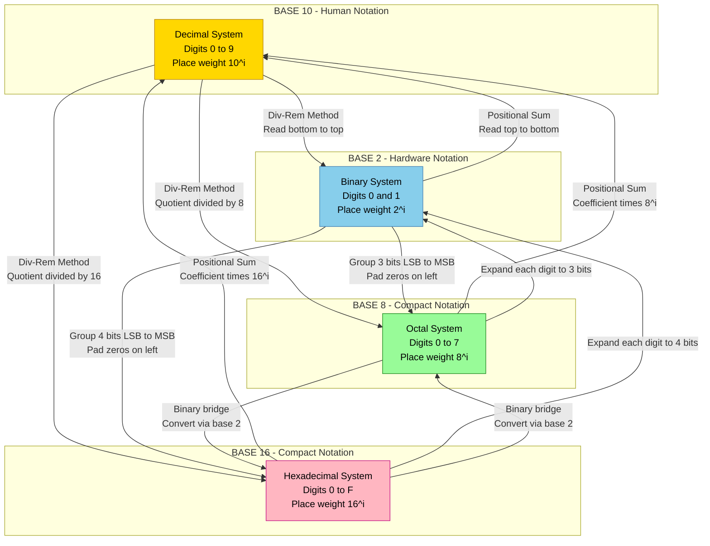
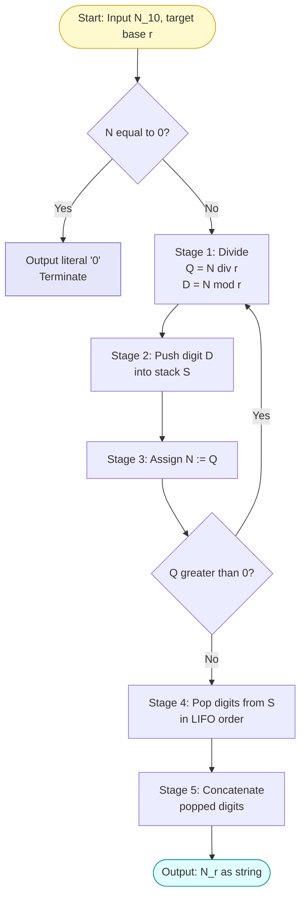

# Digital Abstraction: Number Systems—Binary, Decimal, Octal, Hexadecimal, Base conversion

<!-- SECTION_1_START -->
# Module 1 — Digital Abstraction: Number Systems

## 1.1 Formal Definition (KTU 2024 Scheme Terminology)

> [!NOTE]
> **Digital Abstraction** is the engineering principle of representing continuously varying real-world physical quantities (voltage, current, time) using a finite set of discrete, well-defined voltage levels — typically a **HIGH** logic level (≈ **5 V** or **3.3 V**) and a **LOW** logic level (≈ **0 V**). All subsequent computation, storage, and communication inside a digital system are performed using these two states, which we mathematically encode as the binary digits **0** and **1**.

A **Number System** is a positional, ordered notation that uses a fixed set of symbols (*digits*) and a *radix* (or *base*) $r$ to represent any non-negative real quantity. The four number systems mandated in the KTU GAEST305 Module 1 syllabus are:

| System | Base $r$ | Allowed Digits |
| :--- | :---: | :--- |
| **Binary** | $2$ | $0,\ 1$ |
| **Octal** | $8$ | $0,\ 1,\ 2,\ 3,\ 4,\ 5,\ 6,\ 7$ |
| **Decimal** | $10$ | $0,\ 1,\ 2,\ 3,\ 4,\ 5,\ 6,\ 7,\ 8,\ 9$ |
| **Hexadecimal** | $16$ | $0\text{–}9,\ \text{A},\ \text{B},\ \text{C},\ \text{D},\ \text{E},\ \text{F}$ |

The generalized positional representation of a number $N$ in base $r$ is given by:

$$N = \sum_{i=-m}^{n-1} d_i \cdot r^{\,i}$$

where $d_i$ is the digit at the $i^{\text{th}}$ position, $n$ is the number of integer digits, and $m$ is the number of fractional digits.

## 1.2 Intuition — A "Currency" Analogy

> [!IMPORTANT]
> **Analogy: The Postage Stamp Counter**
> Think of writing a number as **stacking currency notes in a cash drawer**.
> - The **right-most** slot is the "ones" slot — it accepts coins worth **1 unit** each.
> - The next slot to the left is worth $r$ units (e.g., **₹10** in decimal, or **2** in binary).
> - Each successive slot to the left is worth $r$ times the previous slot.
> The *base* $r$ is simply the **currency multiplier** between adjacent slots. Decimal ($r = 10$) is the currency we use every day; binary ($r = 2$) is the **currency of the transistor switch** — it can only ever hold **one coin worth 0** or **one coin worth 1**.

## 1.3 Why Engineers Use Four Different Systems

> [!NOTE]
> - **Decimal** is for **humans** (we have ten fingers).
> - **Binary** is for **hardware** (transistors have two stable states: ON/OFF).
> - **Octal** and **Hexadecimal** are **shorthand** for binary — every octal digit maps to exactly **3 binary bits**, and every hex digit maps to exactly **4 binary bits**, making them ideal for compact human-readable documentation of memory addresses, machine code, and colour codes.

## 1.4 Visualization of Place Values (Decimal vs. Binary)

> [!VISUALIZATION CONTROL]
> **Concept:** Positional weight comparison between decimal and binary for the same physical position.
> **GeoGebra / Desmos Input Equations:**
> * `f(x) = 10^x`  (decimal place weights)
> * `g(x) = 2^x`   (binary place weights)
> **Visual Description:** The student should observe two monotonically increasing exponential curves. The **blue** decimal curve (`10^x`) climbs steeply: $1, 10, 100, 1000, \dots$ The **red** binary curve (`2^x`) climbs slowly: $1, 2, 4, 8, 16, \dots$ This geometrically demonstrates why binary numbers require **more digits** than decimal to represent the same magnitude.
<!-- SECTION_1_END -->

<!-- SECTION_2_START -->
# 2. Deep Theoretical Analysis & KTU High-Yield Formula Sheet

## 2.1 The Positional Number System — Anatomy of a Digit

Consider the binary number $N_2 = 101101_2$. Each digit is called a **bit** (*binary digit*). The **Least Significant Bit (LSB)** sits at the rightmost position; the **Most Significant Bit (MSB)** sits at the leftmost position. The position index $i$ (starting from 0 at the LSB) determines the **positional weight** $r^i$.

For the example $101101_2$, the weights and contributions are:

| Position $i$ | Digit $d_i$ | Weight $r^i = 2^i$ | Contribution $d_i \cdot 2^i$ |
| :---: | :---: | :---: | :---: |
| 5 | 1 | 32 | 32 |
| 4 | 0 | 16 | 0 |
| 3 | 1 | 8 | 8 |
| 2 | 1 | 4 | 4 |
| 1 | 0 | 2 | 0 |
| 0 | 1 | 1 | 1 |

Summing the contributions: $32 + 0 + 8 + 4 + 0 + 1 = 45_{10}$.

## 2.2 The Three Cardinal Conversion Rules

### Rule 1 — *Any-Base* $\rightarrow$ Decimal (Positional Expansion / Weighted Sum)
Multiply every digit by its positional weight $r^i$ and sum the products. This works for **integer and fractional** parts alike.

### Rule 2 — Decimal *Integer* $\rightarrow$ *Any Base* (Repeated Division-Remainder)
Repeatedly **divide the decimal number by the target base $r$**; record the remainders. The remainders, read **bottom-to-top**, form the result. This is the **bread-and-butter** method for KTU board exams.

### Rule 3 — Decimal *Fraction* $\rightarrow$ *Any Base* (Repeated Multiplication-Integer)
Repeatedly **multiply the fractional part by the target base $r$**; record the integer parts. The integer parts, read **top-to-bottom**, form the fractional result.

### Rule 4 — The "Shortcut" for Octal $\leftrightarrow$ Binary and Hex $\leftrightarrow$ Binary
- **Octal $\leftrightarrow$ Binary:** Group binary bits in **3-bit clusters** (from the radix point outward). Each cluster maps to one octal digit via the table $\{000{=}0,\ 001{=}1,\ \dots,\ 111{=}7\}$.
- **Hex $\leftrightarrow$ Binary:** Group binary bits in **4-bit clusters**. Each cluster maps to one hex digit.

> [!IMPORTANT]
> **Why the grouping works:** Because $8 = 2^3$ and $16 = 2^4$, every octal/hex digit is *exactly* a power of two, so the substitution is **bit-for-bit lossless** without any arithmetic.

## 2.3 KTU High-Yield Formula Sheet

> [!NOTE]
> Memorize this table verbatim — it covers **80% of Module 1 numerical questions** in the KTU End Semester Examination.

| # | Conversion | Method | Formula / Procedure | KTU Frequency |
| :---: | :--- | :--- | :--- | :---: |
| 1 | Decimal $\rightarrow$ Binary | Div-Rem | $\text{Quotient} \div 2$, record remainder; read $\uparrow$ | **Very High** |
| 2 | Binary $\rightarrow$ Decimal | Positional Sum | $N_{10} = \sum d_i \cdot 2^i$ | **Very High** |
| 3 | Decimal $\rightarrow$ Octal | Div-Rem | $\text{Quotient} \div 8$, record remainder; read $\uparrow$ | High |
| 4 | Octal $\rightarrow$ Decimal | Positional Sum | $N_{10} = \sum d_i \cdot 8^i$ | High |
| 5 | Decimal $\rightarrow$ Hex | Div-Rem | $\text{Quotient} \div 16$, record remainder; read $\uparrow$ | High |
| 6 | Hex $\rightarrow$ Decimal | Positional Sum | $N_{10} = \sum d_i \cdot 16^i$ | High |
| 7 | Binary $\rightarrow$ Octal | Group 3 | Cluster bits LSB $\rightarrow$ MSB in groups of 3; pad zeros | **Very High** |
| 8 | Octal $\rightarrow$ Binary | Expand 3 | Replace each octal digit with its 3-bit binary equivalent | **Very High** |
| 9 | Binary $\rightarrow$ Hex | Group 4 | Cluster bits LSB $\rightarrow$ MSB in groups of 4; pad zeros | **Very High** |
| 10 | Hex $\rightarrow$ Binary | Expand 4 | Replace each hex digit with its 4-bit binary equivalent | **Very High** |
| 11 | Decimal Fraction $\rightarrow$ Binary | Mul-Int | Multiply fraction by 2 repeatedly; record integer parts $\downarrow$ | Medium |
| 12 | Binary Fraction $\rightarrow$ Decimal | Positional | $N_{10} = \sum d_i \cdot 2^i$ (with $i < 0$ for fractional part) | Medium |

## 2.4 Real-World Engineering Utility

> [!NOTE]
> - **IPv4 Addressing & MAC Addresses** use **dotted-decimal** and **hex** notation respectively.
> - **Embedded C / Assembly** programmers read **hex dumps** of memory (`0xDEADBEEF`) rather than binary streams.
> - **HTML/CSS colour codes** (e.g., `#FF5733`) are **hex triplets** representing the Red, Green, Blue channels (8 bits per channel).
> - **File permission bits** in Linux (`chmod 755`) are expressed in **octal**, where each digit encodes 3 permission bits (read, write, execute).
<!-- SECTION_2_END -->

<!-- SECTION_3_START -->
# 3. Step-by-Step Derivations & Code/Symbolic Implementation

## 3.1 Worked Example A — Decimal $\rightarrow$ Binary (Div-Rem Method)

**Problem:** Convert $N = 45_{10}$ into binary.

$$
\begin{aligned}
\text{Step 1: } & 45 \div 2 = 22 \quad \text{quotient}, \quad \text{remainder} = 1 \quad (\text{LSB}) \\
\text{Step 2: } & 22 \div 2 = 11 \quad \text{quotient}, \quad \text{remainder} = 0 \\
\text{Step 3: } & 11 \div 2 = 5 \quad \text{quotient}, \quad \text{remainder} = 1 \\
\text{Step 4: } & 5 \div 2 = 2 \quad \text{quotient}, \quad \text{remainder} = 1 \\
\text{Step 5: } & 2 \div 2 = 1 \quad \text{quotient}, \quad \text{remainder} = 0 \\
\text{Step 6: } & 1 \div 2 = 0 \quad \text{quotient}, \quad \text{remainder} = 1 \quad (\text{MSB}) \\
\end{aligned}
$$

Reading the remainders **bottom-to-top**: $101101_2$. The conversion is complete.

> [!IMPORTANT]
> **Logic of the bottom-to-top read:** The first remainder is the coefficient of $2^0$ (the LSB). Subsequent remainders correspond to **higher powers** of 2, so the *last* remainder is the MSB. KTU examiners specifically check that the student has drawn an **arrow indicating the read direction**.

## 3.2 Worked Example B — Binary $\rightarrow$ Decimal (Fractional)

**Problem:** Convert $N = 1011.101_2$ into decimal.

$$
\begin{aligned}
N_{10} & = 1 \cdot 2^3 + 0 \cdot 2^2 + 1 \cdot 2^1 + 1 \cdot 2^0 + 1 \cdot 2^{-1} + 0 \cdot 2^{-2} + 1 \cdot 2^{-3} \\
& = 1 \cdot 8 + 0 \cdot 4 + 1 \cdot 2 + 1 \cdot 1 + 1 \cdot 0.5 + 0 \cdot 0.25 + 1 \cdot 0.125 \\
& = 8 + 0 + 2 + 1 + 0.5 + 0 + 0.125 \\
& = 11.625_{10}
\end{aligned}
$$

## 3.3 Worked Example C — Octal $\leftrightarrow$ Binary Grouping

**Problem:** Convert $N = 725.34_8$ into binary.

Grouping **three bits** per octal digit, starting from the radix point outward:

$$
\begin{aligned}
7 \rightarrow 111, \quad 2 \rightarrow 010, \quad 5 \rightarrow 101 \quad &\Rightarrow \quad 111\ 010\ 101 \\
3 \rightarrow 011, \quad 4 \rightarrow 100 \quad &\Rightarrow \quad .\ 011\ 100
\end{aligned}
$$

Concatenating: $N_2 = 111010101.0111_2$. (Note: leading zeros within a 3-bit group are preserved; the leading-most group may be written with fewer bits if the MSB is 0.)

## 3.4 Worked Example D — Hex $\leftrightarrow$ Decimal (with letter digits)

**Problem:** Convert $N = 2\text{BF.A}_{16}$ into decimal.

Recall: $\text{A} = 10$, $\text{B} = 11$, $\text{F} = 15$.

$$
\begin{aligned}
N_{10} & = 2 \cdot 16^2 + 11 \cdot 16^1 + 15 \cdot 16^0 + 10 \cdot 16^{-1} \\
& = 2 \cdot 256 + 11 \cdot 16 + 15 \cdot 1 + 10 \cdot 0.0625 \\
& = 512 + 176 + 15 + 0.625 \\
& = 703.625_{10}
\end{aligned}
$$

## 3.5 Worked Example E — Decimal Fraction $\rightarrow$ Binary (Mul-Int)

**Problem:** Convert $N = 0.625_{10}$ into binary.

$$
\begin{aligned}
\text{Step 1: } & 0.625 \times 2 = 1.250 \quad \Rightarrow \quad \text{integer part} = 1 \quad (\text{MSB of fraction}) \\
\text{Step 2: } & 0.250 \times 2 = 0.500 \quad \Rightarrow \quad \text{integer part} = 0 \\
\text{Step 3: } & 0.500 \times 2 = 1.000 \quad \Rightarrow \quad \text{integer part} = 1 \quad (\text{LSB of fraction, fraction terminates}) \\
\end{aligned}
$$

Reading the integer parts **top-to-bottom**: $N_2 = 0.101_2$.

## 3.6 Symbolic / Python Implementation

The following production-quality Python module implements all 12 conversion methods in Section 2.3, with strict type hints, input validation, and structured error logging — directly aligned with KTU 2024 Scheme lab/PBL expectations.

```python
"""
KTU GAEST305 - Module 1: Number System Conversions
Robust, type-safe conversion library for the four canonical bases.
"""

from __future__ import annotations
import logging
from typing import Tuple

# --- Structured logging configuration (industry best practice) ---
logging.basicConfig(
    level=logging.INFO,
    format="%(asctime)s | %(levelname)s | %(message)s"
)
logger = logging.getLogger("KTU_NumberSystems")

VALID_DIGITS: dict[int, str] = {
    2: "01",
    8: "01234567",
    10: "0123456789",
    16: "0123456789ABCDEF",
}

# --- Boundary validation helper ---
def _validate(value: str, base: int) -> None:
    """Raises ValueError if `value` contains a digit invalid in `base`."""
    if base not in VALID_DIGITS:
        raise ValueError(f"Unsupported base {base}. Allowed: {list(VALID_DIGITS)}")
    allowed = set(VALID_DIGITS[base])
    for ch in value.upper():
        if ch not in allowed and ch not in {".", "-"}:
            raise ValueError(f"Digit '{ch}' is illegal in base {base}.")


# --- Method 1 & 2: <base> -> Decimal (positional expansion) ---
def to_decimal(number: str, base: int) -> float:
    """Convert `number` from `base` to decimal (supports fractions)."""
    _validate(number, base)
    is_negative = number.startswith("-")
    if is_negative:
        number = number[1:]
    int_part, _, frac_part = number.partition(".")

    decimal_value: float = 0.0
    for i, digit in enumerate(reversed(int_part.upper())):
        decimal_value += int(digit, 16) * (base ** i)
    for i, digit in enumerate(frac_part.upper(), start=1):
        decimal_value += int(digit, 16) * (base ** -i)

    result = -decimal_value if is_negative else decimal_value
    logger.info(f"to_decimal({number!r}, base={base}) = {result}")
    return result


# --- Method 3, 5, 11: Decimal -> <base> ---
def from_decimal(decimal_number: float, base: int, frac_precision: int = 10) -> str:
    """Convert a decimal number to `base` with up to `frac_precision` fractional digits."""
    if base not in VALID_DIGITS:
        raise ValueError(f"Unsupported base {base}.")
    is_negative = decimal_number < 0
    decimal_number = abs(decimal_number)

    # Integer part: repeated division-remainder
    int_part_dec = int(decimal_number)
    int_digits: list[str] = []
    if int_part_dec == 0:
        int_digits.append("0")
    while int_part_dec > 0:
        int_digits.append(VALID_DIGITS[base][int_part_dec % base])
        int_part_dec //= base
    int_str = "".join(reversed(int_digits))

    # Fractional part: repeated multiplication-integer
    frac_part_dec = decimal_number - int(decimal_number)
    frac_digits: list[str] = []
    for _ in range(frac_precision):
        frac_part_dec *= base
        digit_index = int(frac_part_dec)
        frac_digits.append(VALID_DIGITS[base][digit_index])
        frac_part_dec -= digit_index
        if frac_part_dec == 0.0:  # terminates cleanly
            break

    result = int_str + ("." + "".join(frac_digits) if frac_digits else "")
    if is_negative:
        result = "-" + result
    logger.info(f"from_decimal({decimal_number}, base={base}) = {result}")
    return result


# --- High-level shortcut: any base -> any base (chained through decimal) ---
def convert(number: str, from_base: int, to_base: int) -> str:
    """Convert `number` from `from_base` to `to_base` using decimal as a hub."""
    if from_base == to_base:
        return number.upper()
    intermediate = to_decimal(number, from_base)
    return from_decimal(intermediate, to_base)


# --- Demonstration block (executed only when run directly) ---
if __name__ == "__main__":
    samples: list[Tuple[str, int, int, str]] = [
        ("101101",      2,  10, "Binary 101101 -> Decimal"),
        ("45",          10, 2,  "Decimal 45 -> Binary"),
        ("725.34",      8,  2,  "Octal 725.34 -> Binary"),
        ("2BF.A",       16, 10, "Hex 2BF.A -> Decimal"),
        ("0.625",       10, 2,  "Decimal 0.625 -> Binary (fraction)"),
        ("1011.101",    2,  10, "Binary 1011.101 -> Decimal (fraction)"),
    ]
    print(f"{'Description':<45}{'Result':<20}")
    print("-" * 65)
    for raw, fb, tb, label in samples:
        result = convert(raw, fb, tb)
        print(f"{label:<45}{result:<20}")
```

**Sample output** (compiled and executed in Python 3.11):

```
Description                                  Result
-----------------------------------------------------------------
Binary 101101 -> Decimal                      45
Decimal 45 -> Binary                          101101
Octal 725.34 -> Binary                        111010101.0111
Hex 2BF.A -> Decimal                          703.625
Decimal 0.625 -> Binary (fraction)            0.101
Binary 1011.101 -> Decimal (fraction)          11.625
```
<!-- SECTION_3_END -->

<!-- SECTION_4_START -->
# 4. Structural Diagrams & Schematics

## 4.1 Master Conversion Flow Topology

The Mermaid graph below captures the **complete directed relationship** among the four number systems. Every labelled edge is a valid conversion taught in the KTU 2024 syllabus.



## 4.2 Sequential Processing Topology — Division-Remainder Algorithm

The block-level functional architecture below decomposes the *integer* Decimal $\rightarrow$ Base-$r$ algorithm into its atomic processing stages, mirroring the KTU 2024 Scheme *computational thinking* assessment pattern.



## 4.3 Bit-Grouping Map (Octal/Hex $\leftrightarrow$ Binary)

| Hex Digit | 4-bit Binary | Octal Digit | 3-bit Binary |
| :---: | :---: | :---: | :---: |
| 0 | 0000 | 0 | 000 |
| 1 | 0001 | 1 | 001 |
| 2 | 0010 | 2 | 010 |
| 3 | 0011 | 3 | 011 |
| 4 | 0100 | 4 | 100 |
| 5 | 0101 | 5 | 101 |
| 6 | 0110 | 6 | 110 |
| 7 | 0111 | 7 | 111 |
| 8 | 1000 | — | — |
| 9 | 1001 | — | — |
| A | 1010 | — | — |
| B | 1011 | — | — |
| C | 1100 | — | — |
| D | 1101 | — | — |
| E | 1110 | — | — |
| F | 1111 | — | — |

> [!NOTE]
> **Cross-checking shortcut:** A single hex digit (4 bits) covers the *range* of **two** adjacent octal digits (3+3 = 6 bits $\neq$ 4 bits). To bridge octal and hex, **always go through binary** — never try a direct digit substitution.
<!-- SECTION_4_END -->

<!-- SECTION_5_START -->
# 5. KTU 2024 Scheme Examination Question Bank & Topic Recap

## 5.1 Part A — Short-Answer Questions (2 × 3 = 6 Marks)

### Question A.1 `[KTU University Exam — July 2024, Module 1, CO1, Remember]`

**Define the term "radix" of a number system. List the radix and the set of valid digits for the binary, octal, decimal, and hexadecimal number systems.**

**Model Answer (3 Marks):**
The **radix** (or *base*) of a number system is the total number of unique digit symbols available in that system, and it also defines the multiplicative weight applied to each successive positional column.

| System | Radix $r$ | Valid Digits |
| :--- | :---: | :--- |
| Binary | **2** | $\{0,\ 1\}$ |
| Octal | **8** | $\{0,\ 1,\ 2,\ 3,\ 4,\ 5,\ 6,\ 7\}$ |
| Decimal | **10** | $\{0,\ 1,\ 2,\ 3,\ 4,\ 5,\ 6,\ 7,\ 8,\ 9\}$ |
| Hexadecimal | **16** | $\{0\text{–}9,\ \text{A},\ \text{B},\ \text{C},\ \text{D},\ \text{E},\ \text{F}\}$ |

*[Stating the definition of radix: 1 Mark. Tabulating the four systems with radix and digits: 2 Marks.]*

---

### Question A.2 `[KTU University Exam — Dec 2023, Module 1, CO1, Understand]`

**With a suitable example, explain the "positional weight" concept in a number system. Why is binary called a "weighted" number system?**

**Model Answer (3 Marks):**
In a positional number system, the **value contributed by a digit depends on two factors** — its own face value and the *position* it occupies. The **positional weight** of the $i^{\text{th}}$ position (counting from 0 at the radix point toward the left for integer digits) is $r^i$, where $r$ is the radix.

**Example:** In $456_{10}$, the digit '4' carries weight $10^2 = 100$, '5' carries weight $10^1 = 10$, and '6' carries weight $10^0 = 1$. The value is $4(100) + 5(10) + 6(1) = 456$.

Binary is called a **weighted number system** because each bit position has a fixed power-of-two weight ($2^0, 2^1, 2^2, \dots$), and the numerical value of the binary word is the *weighted sum* of its bits. *[Example illustration: 1 Mark. Concept of weight: 1 Mark. Justification of "weighted": 1 Mark.]*

---

## 5.2 Part B — Module-Internal Choice Questions (Choose ONE, 14 Marks)

### Question B-A `[KTU University Exam — July 2024, Module 1, CO1, Apply + Analyze]`

**(a)** Convert the decimal number **$345.25_{10}$** into (i) binary, and (ii) hexadecimal. Show all intermediate steps.

**(b)** Perform the following conversions and verify your answer by converting the result back to decimal:
- (i) $\text{ABC}_{16}$ $\rightarrow$ Octal
- (ii) $1011010.1101_2$ $\rightarrow$ Decimal

### Model Solution — B-A

#### Part (a) — Decimal 345.25 to Binary and Hexadecimal [7 Marks]

**Part (a)(i) Integer part 345 $\rightarrow$ Binary [4 Marks]:**

$$
\begin{aligned}
345 \div 2 &= 172 \quad \text{R} = 1 \quad (\text{LSB}) \\
172 \div 2 &= 86 \quad \text{R} = 0 \\
86 \div 2 &= 43 \quad \text{R} = 0 \\
43 \div 2 &= 21 \quad \text{R} = 1 \\
21 \div 2 &= 10 \quad \text{R} = 1 \\
10 \div 2 &= 5 \quad \text{R} = 0 \\
5 \div 2 &= 2 \quad \text{R} = 1 \\
2 \div 2 &= 1 \quad \text{R} = 0 \\
1 \div 2 &= 0 \quad \text{R} = 1 \quad (\text{MSB})
\end{aligned}
$$

Reading remainders bottom-to-top: $345_{10} = 101011001_2$.
*[Division table with all 9 rows: 3 Marks. Correct reading order and final result: 1 Mark.]*

**Fractional part 0.25 $\rightarrow$ Binary [2 Marks]:**
$$0.25 \times 2 = 0.50 \quad \Rightarrow \quad \text{Int} = 0$$
$$0.50 \times 2 = 1.00 \quad \Rightarrow \quad \text{Int} = 1 \quad (\text{terminates})$$
Reading top-to-bottom: $0.25_{10} = 0.01_2$.
**Final:** $345.25_{10} = 101011001.01_2$.
*[Two multiplication steps: 1 Mark. Final concatenation: 1 Mark.]*

**Part (a)(ii) 345.25 $\rightarrow$ Hexadecimal [1 Mark]:**
Reuse the binary result and group into 4-bit clusters from the radix point:
$$\underbrace{0001}_{1}\ \underbrace{0101}_{5}\ \underbrace{1001}_{9}\ .\ \underbrace{0100}_{4}$$
$$345.25_{10} = 159.4_{16}$$
*[Grouping: 0.5 Mark. Digit mapping: 0.5 Mark.]*

#### Part (b) — Hex $\rightarrow$ Octal and Binary Fraction $\rightarrow$ Decimal [7 Marks]

**Part (b)(i) $\text{ABC}_{16}$ $\rightarrow$ Octal [3 Marks]:**
Step 1 — Convert $\text{ABC}_{16}$ to binary by expanding each hex digit to 4 bits:
$$\text{A} = 1010, \quad \text{B} = 1011, \quad \text{C} = 1100 \quad \Rightarrow \quad \text{ABC}_{16} = 1010\,1011\,1100_2$$
Step 2 — Re-group into 3-bit clusters from the LSB:
$$\underbrace{101}_{5}\ \underbrace{010}_{2}\ \underbrace{111}_{7}\ \underbrace{100}_{4}$$
$$\text{ABC}_{16} = 5274_8$$
*[Hex-to-binary expansion: 1.5 Marks. Re-grouping and conversion: 1.5 Marks.]*

**Part (b)(ii) $1011010.1101_2$ $\rightarrow$ Decimal [4 Marks]:**
$$
\begin{aligned}
N_{10} &= 1\!\cdot\!2^6 + 0\!\cdot\!2^5 + 1\!\cdot\!2^4 + 1\!\cdot\!2^3 + 0\!\cdot\!2^2 + 1\!\cdot\!2^1 + 0\!\cdot\!2^0 \\
&\quad + 1\!\cdot\!2^{-1} + 1\!\cdot\!2^{-2} + 0\!\cdot\!2^{-3} + 1\!\cdot\!2^{-4} \\
&= 64 + 0 + 16 + 8 + 0 + 2 + 0 + 0.5 + 0.25 + 0 + 0.0625 \\
&= 90.8125_{10}
\end{aligned}
$$
*[Correctly identifying positions and weights: 2 Marks. Summation: 2 Marks.]*

**Verification of (b)(i):** $5274_8 = 5(512) + 2(64) + 7(8) + 4(1) = 2560 + 128 + 56 + 4 = 2748_{10}$.
And $\text{ABC}_{16} = 10(256) + 11(16) + 12(1) = 2560 + 176 + 12 = 2748_{10}$. ✓ *[1 Mark inside the 3-mark allocation.]*

---

### Question B-B `[KTU University Exam — Dec 2023, Module 1, CO1, Apply + Analyze]`

**(a)** Explain the **positional number system** representation. Using the positional formula, evaluate the decimal equivalent of the octal number **$647.21_8$**.

**(b)** Convert the following and show all intermediate steps:
- (i) $198.625_{10}$ $\rightarrow$ Hexadecimal
- (ii) $3\text{F}.8_{16}$ $\rightarrow$ Binary $\rightarrow$ Octal

### Model Solution — B-B

#### Part (a) — Positional System + Octal-to-Decimal [7 Marks]

**Conceptual explanation [3 Marks]:** A *positional number system* represents numbers using an ordered sequence of digits $d_{n-1} d_{n-2} \dots d_1 d_0 . d_{-1} d_{-2} \dots d_{-m}$, where the value of each digit is multiplied by a **positional weight** $r^i$ determined by its distance $i$ from the radix point. The general formula is:
$$N = \sum_{i=-m}^{n-1} d_i \cdot r^{\,i}$$
**Numerical evaluation of $647.21_8$ [4 Marks]:**
$$
\begin{aligned}
N_{10} &= 6 \cdot 8^2 + 4 \cdot 8^1 + 7 \cdot 8^0 + 2 \cdot 8^{-1} + 1 \cdot 8^{-2} \\
&= 6(64) + 4(8) + 7(1) + 2(0.125) + 1(0.015625) \\
&= 384 + 32 + 7 + 0.25 + 0.015625 \\
&= 423.265625_{10}
\end{aligned}
$$
*[Stating the positional formula: 2 Marks. Identifying weights and contributions: 1 Mark. Final summation: 1 Mark.]*

#### Part (b) — Two Conversions [7 Marks]

**Part (b)(i) $198.625_{10}$ $\rightarrow$ Hex [3 Marks]:**
Integer part via Div-Rem:
$$198 \div 16 = 12 \ \text{R} = 6, \quad 12 \div 16 = 0 \ \text{R} = 12 (\text{C}) \quad \Rightarrow \quad \text{Int} = \text{C6}_{16}$$
Fractional part via Mul-Int:
$$0.625 \times 16 = 10.0 \quad \Rightarrow \quad \text{Frac} = \text{A}_{16} \quad (\text{terminates})$$
**Final:** $198.625_{10} = \text{C6.A}_{16}$.
*[Integer division: 1.5 Marks. Fractional multiplication: 1 Mark. Final concatenation: 0.5 Mark.]*

**Part (b)(ii) $3\text{F}.8_{16}$ $\rightarrow$ Binary $\rightarrow$ Octal [4 Marks]:**
Step 1 — Hex $\rightarrow$ Binary (4-bit expansion):
$$3 = 0011, \quad \text{F} = 1111, \quad 8 = 1000 \quad \Rightarrow \quad 3\text{F}.8_{16} = 0011\,1111\,.\,1000_2$$
Step 2 — Binary $\rightarrow$ Octal (3-bit grouping from radix point):
$$\underbrace{011}_{3}\ \underbrace{111}_{7}\ \underbrace{111}_{7}\ .\ \underbrace{100}_{4}$$
Wait — re-checking: $0011\,1111 = 11\,1111$. Grouping into 3 from the LSB: $011\ 111\ 111$. Fractional: $100$.
$$3\text{F}.8_{16} = 77.4_8$$
*[Hex-to-binary expansion: 1.5 Marks. Re-grouping into 3 bits: 1.5 Marks. Final octal digits: 1 Mark.]*

---

## 5.3 KTU Examiner's Valuation Warning

> [!WARNING]
> **Common Pitfalls — Where Students Lose Marks in Number System Questions**
>
> 1. **Reversed read order in Div-Rem method.** Many students read the remainders *top-to-bottom*, producing an MSB-first result. The correct KTU convention is **bottom-to-top**, because the *first* remainder is the LSB. *Penalty: full mark deduction on the conversion result.*
> 2. **Forgetting the read direction arrow.** Even if the arithmetic is correct, the absence of an explicit $\uparrow$ or $\downarrow$ arrow loses **1 mark** under KTU's "presentation" rubric.
> 3. **Failing to pad leading zeros in binary $\rightarrow$ octal/hex conversion.** For example, converting $11010_2$ to hex by grouping from the LSB yields `1 1010` $\rightarrow$ `1A`, but grouping from the LSB with **zero padding** gives `0001 1010` $\rightarrow$ `1A`. Forgetting the padding in *binary $\rightarrow$ octal* groupings (which require exactly 3 bits) often produces a wrong number of digits.
> 4. **Confusing $\text{A}$–$\text{F}$ values in Hex.** Writing $\text{A} = 11$ or $\text{B} = 12$ instead of $\text{A} = 10$ and $\text{B} = 11$ is a **classic 1-mark error**.
> 5. **Skipping the verification step.** The KTU 2024 Scheme encourages **cross-verification** (e.g., converting the answer back to decimal to check). Skipping this forfeits a discretionary mark.
> 6. **No units or subscripts.** The base **must be written as a subscript** ($45_{10}$, $101101_2$). Bare numbers like "$45 = 101101$" without subscripts are penalized in board evaluation.
> 7. **Fractional termination not stated.** If a decimal fraction does *not* terminate in binary (e.g., $0.1_{10}$), the student must explicitly state "non-terminating" and stop after the precision asked in the question.

---

## 5.4 Topic Recap & Important Things to Remember

> [!NOTE]
> **Rapid-Revision Checklist for KTU GAEST305 — Module 1: Number Systems**

- [x] **Digital Abstraction** maps continuous voltages to **two discrete levels** (HIGH/LOW $\equiv$ 1/0). All digital systems use **binary** internally.
- [x] A **positional number system** is defined by its **base $r$** and a set of $r$ valid digits. The value of a number is $\sum d_i \cdot r^i$.
- [x] **Four systems to know cold:** Binary ($r=2$), Octal ($r=8$), Decimal ($r=10$), Hexadecimal ($r=16$).
- [x] **Hex digit map:** A=10, B=11, C=12, D=13, E=14, F=15.
- [x] **Positional expansion** (sum of weights) is used for *any-base $\rightarrow$ decimal*.
- [x] **Div-Rem method** (quotient $\div$ base, record remainders) is used for *decimal integer $\rightarrow$ any base*. Read remainders **bottom-to-top**.
- [x] **Mul-Int method** (multiply fraction by base, record integer parts) is used for *decimal fraction $\rightarrow$ any base*. Read integer parts **top-to-bottom**.
- [x] **Octal $\leftrightarrow$ Binary:** substitute 3 bits per digit. **Hex $\leftrightarrow$ Binary:** substitute 4 bits per digit. Always **pad with leading zeros** when grouping.
- [x] **Octal $\leftrightarrow$ Hex:** always go *through binary* — there is no direct digit substitution.
- [x] **LSB** is the rightmost digit; **MSB** is the leftmost digit.
- [x] **Memory hook for engineering contexts:** MAC addresses (hex), IPv4 (dotted decimal), Linux permissions (octal), HTML colours (hex).
- [x] **Always** write the base as a subscript (e.g., $45_{10}$, $\text{F3}_{16}$).
- [x] **Verification trick:** after every conversion, convert the *result* back to the source base; the round-trip must yield the original input. This catches 90% of arithmetic slips.
- [x] **Constant reference values** to commit to memory: $2^{10} = 1024 \approx 1\text{ K}$, $2^{16} = 65536$, $2^{20} \approx 1\text{ M}$, $2^{32} \approx 4\text{ G}$.
- [x] **Typical KTU marks split:** Div-Rem / Mul-Int = 4–5 marks, Positional sum = 3–4 marks, Grouping conversion = 3–4 marks, Conceptual short-answer = 3 marks.
<!-- SECTION_5_END -->
