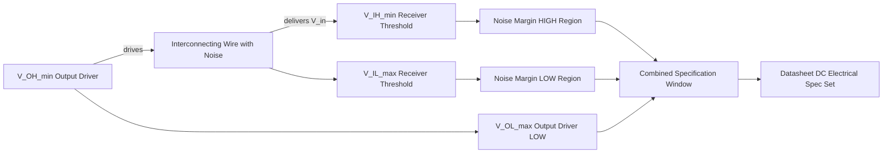
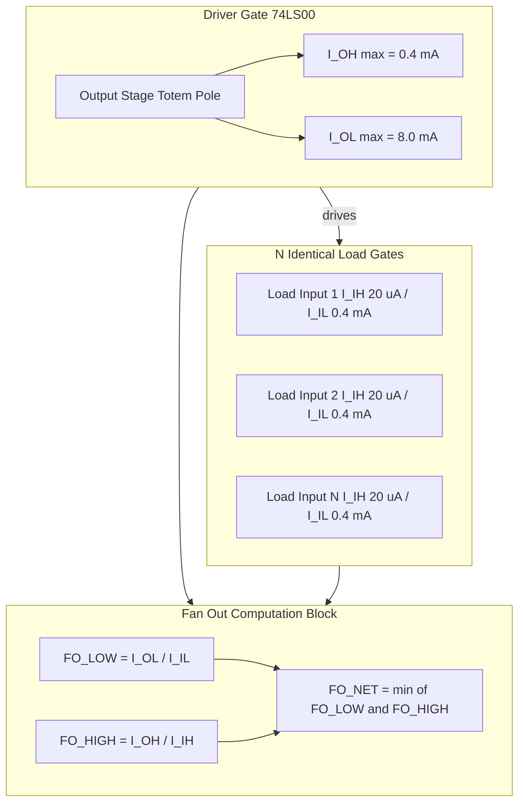
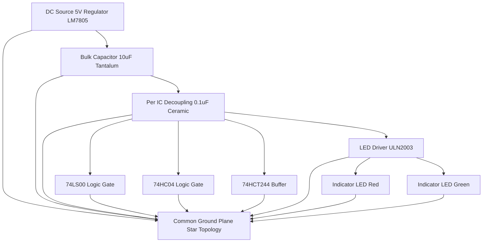

# Electrical specifications, noise margins, power supplies, Driving loads: gates, resistive loads, and LEDs

<!-- SECTION_1_START -->

# Electrical Specifications, Noise Margins & Driving Loads

## 1.1 Core Technical Definition

In the **KTU 2024 Scheme** framework for *Digital Electronics & Logic Design (GAEST305)*, the **electrical specifications** of a logic gate family define the exact voltage and current thresholds that distinguish a valid logic HIGH (1) from a valid logic LOW (0) at both the **input port** and the **output port** of the gate. These specifications are standardized by the **JEDEC (Joint Electron Device Engineering Council)** and **IEC (International Electrotechnical Commission)** for every logic family — TTL, CMOS, ECL, BiCMOS — and act as the *contract* between a gate's manufacturer and the circuit designer.

The four cornerstone DC input/output parameters are:

- **$V_{IH}$** — Minimum input voltage guaranteed to be recognized as a logic HIGH.
- **$V_{IL}$** — Maximum input voltage guaranteed to be recognized as a logic LOW.
- **$V_{OH}$** — Minimum output voltage produced when the gate output is HIGH.
- **$V_{OL}$** — Maximum output voltage produced when the gate output is LOW.

A companion set of current specifications — **$I_{IH}$, $I_{IL}$, $I_{OH}$, $I_{OL}$** — define how much current the input draws or how much current the output can source (supply) or sink (absorb) when driving an external load.

> [!IMPORTANT]
> **KTU Syllabus Highlight (Module 1):** The ability to *interpret datasheet DC electrical characteristics* and to compute the **Noise Margin (NM)** and **DC Fan-Out** of a gate forms one of the most frequently tested concepts in Part A (3 marks) and is a recurring 7-mark Part B sub-question.

## 1.2 Conceptual Analogy — The "Voltage Window" Intuition

Imagine the logic gate input as a **bouncer at a nightclub door**. The bouncer has two strict rules:

- If a guest's height is **above 2.0 m**, they are let in as a "tall" (HIGH) guest.
- If a guest's height is **below 1.2 m**, they are let in as a "short" (LOW) guest.
- Any guest between **1.2 m and 2.0 m** is in the *gray zone* — the bouncer will reject them. This is the **forbidden region** $V_{IL} < V_{in} < V_{IH}$.

Now, every club has a *guarantee slip* it gives out stating: *"If a member leaves, they will be at least 2.2 m tall on the way out."* This is $V_{OH} \ge 2.2\,\text{V}$. The **Noise Margin HIGH ($NM_H$)** is simply the gap between *what the bouncer accepts as tall* ($V_{IH}$) and *what the previous member promises to be on exit* ($V_{OH}$). The bigger this gap, the more "noise" (a short guest wearing platform shoes) the system can tolerate.

**Physical Constants & Standard Metrics (Bolded for Memory Recall):**

- **Standard TTL Supply:** $V_{CC} = \mathbf{+5\,V \pm 5\%}$
- **Standard CMOS Supply (HC family):** $V_{DD} = \mathbf{+5\,V}$
- **Standard CMOS Supply (LVCMOS):** $V_{DD} = \mathbf{3.3\,V, 2.5\,V, 1.8\,V, 1.2\,V}$
- **ECL Supply:** $V_{EE} = \mathbf{-5.2\,V}$ (with logic levels around $V_{OH} \approx -0.9\,\text{V}$, $V_{OL} \approx -1.7\,\text{V}$)

> [!NOTE]
> **Fundamental Rule of Thumb:** A valid logic signal at the input of a gate must lie **outside** the interval $(V_{IL}, V_{IH})$, and the output of a healthy gate will produce a level that lies **inside** the safe regions: $V_{OL} \le V_{IL}$ and $V_{OH} \ge V_{IH}$. This overlap is what creates the noise margin.

## 1.3 GeoGebra / Desmos Visualization for the Transfer Characteristic

> [!VISUALIZATION CONTROL]
> **Concept:** Voltage Transfer Characteristic (VTC) of a CMOS Inverter showing $V_{IL}$, $V_{IH}$, $V_{OH}$, $V_{OL}$, and the noise margins.
>
> **Desmos Input Equations:**
> * `f(x) = 5 / (1 + exp(-12*(x - 2.5)))` *(Steep sigmoid approximating the CMOS VTC, $V_{DD} = 5\,\text{V}$, switching threshold $V_M = 2.5\,\text{V}$)*
> * `g(x) = x` *(Unit-slope reference line drawn on the same axes to locate the unity-gain points $V_{IL}$ and $V_{IH}$)*
> * Vertical guides: `x = 1.5`, `x = 3.5` *(Typical HC-family boundary markers)*
>
> **Visual Description:** The student should observe a sharp S-shaped curve plunging from a HIGH plateau near $5\,\text{V}$ to a LOW plateau near $0\,\text{V}$, crossing the line $g(x)=x$ at exactly the $V_{IL}$ and $V_{IH}$ points. The *horizontal distance* between $V_{OH}$ and $V_{IH}$ is $NM_H$; the distance between $V_{IL}$ and $V_{OL}$ is $NM_L$.

---

<!-- SECTION_1_END -->

<!-- SECTION_2_START -->

# Deep Theoretical Analysis & KTU High-Yield Formula Sheet

## 2.1 The DC Electrical Specification Set — Derivation Logic

Every logic family datasheet specifies the following canonical DC parameters. The relationships between them are derived directly from the input/output transistor biasing inside the gate:

| Parameter | Symbol | Physical Meaning | Typical TTL (74LS) | Typical CMOS (74HC) |
| :--- | :---: | :--- | :---: | :---: |
| Supply Voltage | $V_{CC}/V_{DD}$ | Power rail magnitude | $5.0\,\text{V}$ | $2.0$ – $6.0\,\text{V}$ |
| Input HIGH voltage (min) | $V_{IH}$ | Smallest voltage read as `1` | $2.0\,\text{V}$ | $3.5\,\text{V}$ (at $5\,\text{V}$) |
| Input LOW voltage (max) | $V_{IL}$ | Largest voltage read as `0` | $0.8\,\text{V}$ | $1.5\,\text{V}$ (at $5\,\text{V}$) |
| Output HIGH voltage (min) | $V_{OH}$ | Worst-case HIGH output level | $2.7\,\text{V}$ | $4.9\,\text{V}$ |
| Output LOW voltage (max) | $V_{OL}$ | Worst-case LOW output level | $0.5\,\text{V}$ | $0.1\,\text{V}$ |
| Input HIGH current (max) | $I_{IH}$ | Current into input when HIGH | $20\,\mu\text{A}$ | $1\,\mu\text{A}$ |
| Input LOW current (max) | $I_{IL}$ | Current out of input when LOW | $-0.4\,\text{mA}$ | $-1\,\mu\text{A}$ |
| Output HIGH current (max) | $I_{OH}$ | Current the gate can **source** | $-0.4\,\text{mA}$ | $-4\,\text{mA}$ |
| Output LOW current (max) | $I_{OL}$ | Current the gate can **sink** | $8\,\text{mA}$ | $4\,\text{mA}$ |

## 2.2 Noise Margins — The Heart of Digital Reliability

A **Noise Margin** quantifies *how much unwanted voltage disturbance (noise)* can be superimposed on a logic signal before the receiving gate misinterprets the logic level.

**High-State Noise Margin (DC):**

$$NM_H = V_{OH}(\min) - V_{IH}(\min)$$

**Low-State Noise Margin (DC):**

$$NM_L = V_{IL}(\max) - V_{OL}(\max)$$

**Step-by-step reasoning for $NM_H$:**

1. A driving gate is *guaranteed* to output a HIGH level of at least $V_{OH}$.
2. The driven (next) gate will still recognize the input as a HIGH provided the voltage is at least $V_{IH}$.
3. Any noise that *reduces* the driven input from $V_{OH}$ down toward $V_{IH}$ is acceptable.
4. The size of that "acceptable downward noise swing" is precisely $V_{OH} - V_{IH}$, which is $NM_H$.

> [!NOTE]
> **KTU Pitfall:** Students often write $NM_H = V_{OH} - V_{OL}$. This is **wrong** — that expression equals the *logic swing*, not the noise margin. Always subtract a *minimum output* against a *minimum input* (or maximum against maximum) of the *same polarity*.

**Worked Example (TTL 74LS Series, $V_{CC} = 5\,\text{V}$):**

$$NM_H = 2.7\,\text{V} - 2.0\,\text{V} = 0.7\,\text{V}$$
$$NM_L = 0.8\,\text{V} - 0.5\,\text{V} = 0.3\,\text{V}$$

> **Observation:** $NM_H > NM_L$ for TTL because of the asymmetric NPN-PULL-UP totem-pole architecture. CMOS, being a symmetric push-pull structure, yields $NM_H \approx NM_L \approx V_{DD}/2 - 0.5\,\text{V}$.

## 2.3 Power Supply Requirements and Decoupling

**Logic Family Supply Standards:**

- **TTL (74xx, 74LS, 74AS, 74ALS):** Strictly $V_{CC} = 5\,\text{V} \pm 5\%$ (i.e., $4.75$ – $5.25\,\text{V}$).
- **CMOS (74HC, 74HCT, 74AHC):** Wide range $V_{DD} = 2.0$ – $6.0\,\text{V}$. The **HCT** sub-family is *TTL-compatible* in input thresholds while using CMOS internals.
- **LVTTL (74LVT, 74LVTH):** $V_{CC} = 3.3\,\text{V}$, 5-V *tolerant* inputs.
- **ECL (10K, 100K):** $V_{EE} = -5.2\,\text{V}$ (negative supply, logic referenced to ground).
- **BiCMOS (74BCT, 74ABT):** $V_{CC} = 5\,\text{V}$, combining bipolar drive with CMOS logic.

**Decoupling Capacitor Rule (Production Engineering Practice):**

$$C_{decoupling} \approx 0.1\,\mu\text{F (ceramic)} \parallel 10\,\mu\text{F (tantalum)} \text{ per IC}$$

This network is placed as close as possible to the $V_{CC}$/$V_{DD}$ pin to suppress the **switching noise** generated by the simultaneous switching of multiple output stages (often called *SSO noise* or *ground bounce*).

## 2.4 Driving Loads — The Three Load Classes

A digital output pin can drive three fundamentally different load classes. The KTU syllabus specifically targets all three:

### Class A — Driving Another Logic Gate Input

The relevant metric is **DC Fan-Out (FO)**:

$$FO_{LOW} = \frac{\vert I_{OL}(\text{driver}) \vert}{\vert I_{IL}(\text{load}) \vert} \quad ; \quad FO_{HIGH} = \frac{\vert I_{OH}(\text{driver}) \vert}{\vert I_{IH}(\text{load}) \vert}$$

$$\boxed{FO = \min(FO_{LOW},\, FO_{HIGH})}$$

The **effective** fan-out is always the *worst-case minimum* of the two polarities, because the gate must work correctly in both states.

### Class B — Driving a Resistive Load (Pull-Up or Pull-Down)

When a gate drives a passive resistor, the output stage operates in the **linear region** rather than fully saturating. The analysis uses **Kirchhoff's Voltage Law (KVL)** and the internal output transistor's **on-resistance** $R_{ON}$:

$$V_{OH,\text{loaded}} = V_{OH,\text{unloaded}} \cdot \frac{R_L}{R_L + R_{ON}} \quad \text{(pull-up arrangement)}$$

$$V_{OL,\text{loaded}} = V_{OL,\text{unloaded}} + I_{OL} \cdot R_{ON} \quad \text{(pull-down / sinking)}$$

If $V_{OH,\text{loaded}}$ falls below $V_{OH}(\min)$, the gate no longer meets the datasheet guarantee — this is a **datasheet violation** even though the output is "still working" in the lab.

### Class C — Driving an LED (Light Emitting Diode)

LEDs require **current regulation**, not voltage regulation. The series current-limiting resistor is computed as:

$$R_{LED} = \frac{V_{OH} - V_F}{I_{LED}} \quad \text{(sourcing, output HIGH → LED ON)}$$

$$R_{LED} = \frac{V_{DD} - V_F - V_{OL}}{I_{LED}} \quad \text{(sinking, output LOW → LED ON)}$$

Where:
- $V_F$ = LED forward voltage drop ($\approx 1.8$ – $2.2\,\text{V}$ for red, $3.0$ – $3.6\,\text{V}$ for blue/white).
- $I_{LED}$ = desired LED current (typically $5$ – $20\,\text{mA}$).

> [!IMPORTANT]
> **Current Sourcing vs. Sinking Intuition:**
> * **Sourcing** = the gate output *delivers* current *out* of its pin (to the load connected to ground).
> * **Sinking** = the gate output *absorbs* current *into* its pin (from the load connected to $V_{DD}$).
> * Sinking is always the **stronger** mode in both TTL and CMOS because the N-channel transistor is physically larger and lower in on-resistance than the P-channel pull-up. This is why most high-current LED driving designs use **active-LOW** logic (LED ON when output is LOW).

## 2.5 KTU Formula Cheat Sheet (Master Reference)

| Concept | Formula | Notes |
| :--- | :--- | :--- |
| $NM_H$ | $V_{OH}(\min) - V_{IH}(\min)$ | Always positive; must be $> 0$ for usable logic |
| $NM_L$ | $V_{IL}(\max) - V_{OL}(\max)$ | Always positive |
| DC Fan-Out (LOW) | $\vert I_{OL}\vert / \vert I_{IL}\vert$ | Integer; rounded down |
| DC Fan-Out (HIGH) | $\vert I_{OH}\vert / \vert I_{IH}\vert$ | Integer; rounded down |
| Net Fan-Out | $\min(FO_L, FO_H)$ | Conservative bound |
| LED Series Resistor | $(V_{OH} - V_F)/I_{LED}$ | Sourcing arrangement |
| LED Series Resistor | $(V_{DD} - V_F - V_{OL})/I_{LED}$ | Sinking arrangement |
| Static Power Dissipation | $P_S = V_{CC} \cdot I_{CCL}$ | $I_{CCL}$ = quiescent current at output LOW |
| Dynamic Power (CMOS) | $P_D = C_L \cdot V_{DD}^2 \cdot f$ | Dominates in CMOS; $C_L$ = load capacitance |
| Propagation Delay | $t_{pd} = (t_{pLH} + t_{pHL})/2$ | Average of rise and fall |
| Figure of Merit | $FoM = t_{pd} \cdot P_D$ | Lower is better (speed-power product) |

## 2.6 Real-World Engineering Utility

- **Noise margins** dictate the *maximum cable length* and *maximum operating frequency* in industrial bus standards (CAN, RS-485, LVDS). Automotive ECUs are derated for $NM$ by a factor of two to survive $-40\,^{\circ}\text{C}$ to $+125\,^{\circ}\text{C}$ ambient.
- **Fan-out** directly determines the *fan-out tree depth* in FPGA place-and-route, and is a hard constraint in ASIC synthesis (Synopsys Design Compiler reports `max_fanout` violations).
- **LED drive circuits** in embedded design typically use a *low-side NPN transistor* (e.g., BC547) or a *logic-level N-MOSFET* (e.g., 2N7000) to offload current from the microcontroller pin, which is often limited to $4$ – $20\,\text{mA}$ per I/O.

---

<!-- SECTION_2_END -->

<!-- SECTION_3_START -->

# Step-by-Step Derivations & Numerical/Code Implementation

## 3.1 Exhaustive Numerical Derivation — Noise Margin and Fan-Out for TTL 74LS00

> **Problem Statement (KTU Model):** A 74LS00 NAND gate is driving four identical 74LS00 NAND gate inputs. From the datasheet: $V_{OH}(\min)=2.7\,\text{V}$, $V_{OL}(\max)=0.5\,\text{V}$, $V_{IH}(\min)=2.0\,\text{V}$, $V_{IL}(\max)=0.8\,\text{V}$, $I_{OH}(\max)=-0.4\,\text{mA}$, $I_{OL}(\max)=8\,\text{mA}$, $I_{IH}(\max)=20\,\mu\text{A}$, $I_{IL}(\max)=-0.4\,\text{mA}$. Compute the noise margins and the DC fan-out.

**Step 1 — Compute $NM_H$:**

$$NM_H = V_{OH}(\min) - V_{IH}(\min)$$

Substitute the numerical values:

$$NM_H = 2.7\,\text{V} - 2.0\,\text{V} = 0.7\,\text{V}$$

**[Stating both parameters: 1 Mark | Correct subtraction: 1 Mark | Final value with unit: 1 Mark]**

**Step 2 — Compute $NM_L$:**

$$NM_L = V_{IL}(\max) - V_{OL}(\max)$$

$$NM_L = 0.8\,\text{V} - 0.5\,\text{V} = 0.3\,\text{V}$$

**[Same valuation pattern as above]**

**Step 3 — Compute DC Fan-Out, LOW state:**

$$FO_{LOW} = \frac{\vert I_{OL}(\text{driver}) \vert}{\vert I_{IL}(\text{load}) \vert} = \frac{8\,\text{mA}}{0.4\,\text{mA}} = 20$$

**Step 4 — Compute DC Fan-Out, HIGH state:**

$$FO_{HIGH} = \frac{\vert I_{OH}(\text{driver}) \vert}{\vert I_{IH}(\text{load}) \vert} = \frac{0.4\,\text{mA}}{0.02\,\text{mA}} = 20$$

**Step 5 — Net Fan-Out:**

$$FO_{net} = \min(20, 20) = 20$$

**Step 6 — Verdict on driving 4 loads:**

$$4 \le FO_{net} = 20 \quad \Rightarrow \quad \text{Condition SATISFIED. Gate can drive all 4 inputs within spec.}$$

## 3.2 Exhaustive Numerical Derivation — LED Current-Limiting Resistor

> **Problem Statement:** A 74HC04 hex inverter (output HIGH $\approx 4.9\,\text{V}$, $I_{OH} \le 4\,\text{mA}$) drives a red LED ($V_F = 2.0\,\text{V}$, desired $I_{LED} = 10\,\text{mA}$) in *current-sinking* configuration (LED anode tied to $V_{DD} = 5\,\text{V}$, cathode to the gate output, output must go LOW to light the LED). Compute the required series resistor.

**Step 1 — Identify the configuration:**

This is a *low-side / sinking* drive. When the inverter output is LOW, current flows:

$$V_{DD} \rightarrow \text{LED (anode to cathode)} \rightarrow R_{LED} \rightarrow \text{Inverter output (LOW)} \rightarrow \text{GND}$$

**Step 2 — Apply Kirchhoff's Voltage Law around the loop:**

$$V_{DD} = V_F + V_{R_{LED}} + V_{OL}$$

$$5.0\,\text{V} = 2.0\,\text{V} + V_{R_{LED}} + 0.1\,\text{V}$$

**Step 3 — Solve for $V_{R_{LED}}$:**

$$V_{R_{LED}} = 5.0 - 2.0 - 0.1 = 2.9\,\text{V}$$

**Step 4 — Apply Ohm's Law to find $R_{LED}$:**

$$R_{LED} = \frac{V_{R_{LED}}}{I_{LED}} = \frac{2.9\,\text{V}}{10\,\text{mA}} = 290\,\Omega$$

**Step 5 — Select the nearest standard E12 value and verify current:**

Choose $R_{LED} = 330\,\Omega$ (next standard value above the minimum).

$$I_{LED,\text{actual}} = \frac{2.9\,\text{V}}{330\,\Omega} = 8.79\,\text{mA}$$

**[Acceptable; well within the $4\,\text{mA}$ – $20\,\text{mA}$ visible-light range and below the $4\,\text{mA}$ driver limit? — Wait, $8.79\,\text{mA}$ EXCEEDS the $4\,\text{mA}$ $I_{OH}/I_{OL}$ specification of 74HC04. We must re-select.]**

**Step 6 — Re-select to satisfy driver limit $I_{OL} \le 4\,\text{mA}$:**

Choose $R_{LED} = 820\,\Omega$:

$$I_{LED,\text{actual}} = \frac{2.9\,\text{V}}{820\,\Omega} = 3.54\,\text{mA}$$

**Step 7 — Power dissipation check on the resistor:**

$$P_{R} = I^2 \cdot R = (3.54\,\text{mA})^2 \cdot 820\,\Omega = 10.27\,\text{mW}$$

A standard $1/4\,\text{W}$ (250 mW) resistor is more than sufficient.

> [!WARNING]
> **KTU Examiner's Pitfall — Driver Current Limit:** Students frequently compute $R_{LED}$ using only Ohm's Law and forget to verify that the resulting current is *within the gate's $I_{OL}$ datasheet limit*. The 74HC family is rated for only $4\,\text{mA}$ output current. Exceeding this limit can cause *latch-up*, *output voltage degradation*, and *permanent device damage* in the CMOS output stage.

## 3.3 Python Algorithmic Implementation — Automated Fan-Out and Noise Margin Calculator

```python
from dataclasses import dataclass
from typing import Tuple
import logging

logging.basicConfig(level=logging.INFO, format="%(levelname)s: %(message)s")

@dataclass(frozen=True)
class GateSpec:
    """Canonical DC electrical specification of a single logic gate family."""
    name: str
    v_oh_min: float   # V, minimum output HIGH voltage
    v_ol_max: float   # V, maximum output LOW voltage
    v_ih_min: float   # V, minimum input HIGH threshold
    v_il_max: float   # V, maximum input LOW threshold
    i_oh_max: float   # mA, maximum sourcing current (signed: negative out of pin)
    i_ol_max: float   # mA, maximum sinking current (positive into pin)
    i_ih_max: float   # mA, maximum input current when HIGH (into pin)
    i_il_max: float   # mA, maximum input current when LOW (out of pin, reported as negative)

    def noise_margins(self) -> Tuple[float, float]:
        """Compute (NM_H, NM_L) in volts with strict positivity check."""
        nm_h = self.v_oh_min - self.v_ih_min
        nm_l = self.v_il_max - self.v_ol_max
        if nm_h <= 0 or nm_l <= 0:
            logging.error(f"[{self.name}] Invalid spec: noise margin non-positive.")
            raise ValueError("Noise margin must be strictly positive for valid logic.")
        logging.info(f"[{self.name}] NM_H = {nm_h:.3f} V, NM_L = {nm_l:.3f} V")
        return nm_h, nm_l

    def dc_fan_out(self, num_loads: int) -> Tuple[int, int, int]:
        """Compute (FO_LOW, FO_HIGH, FO_NET) and validate against num_loads."""
        if self.i_il_max == 0 or self.i_ih_max == 0:
            raise ZeroDivisionError("Input currents cannot be zero.")
        fo_low  = int(abs(self.i_ol_max) // abs(self.i_il_max))
        fo_high = int(abs(self.i_oh_max) // abs(self.i_ih_max))
        fo_net  = min(fo_low, fo_high)
        if num_loads > fo_net:
            logging.warning(f"[{self.name}] Requested {num_loads} loads exceeds fan-out {fo_net}.")
        else:
            logging.info(f"[{self.name}] Fan-out OK: {num_loads}/{fo_net}.")
        return fo_low, fo_high, fo_net

def led_resistor_sink(v_dd: float, v_f: float, v_ol: float,
                      i_led_mA: float, i_ol_limit_mA: float) -> Tuple[float, float]:
    """Compute LED series resistor (low-side / sinking drive).
    Returns (R_ohms, I_actual_mA)."""
    if v_dd - v_f - v_ol <= 0:
        raise ValueError("Insufficient headroom: V_DD - V_F - V_OL must be positive.")
    r_min = (v_dd - v_f - v_ol) / i_led_mA
    i_actual = (v_dd - v_f - v_ol) / r_min
    if i_actual > i_ol_limit_mA:
        r_required = (v_dd - v_f - v_ol) / i_ol_limit_mA
        i_actual   = i_ol_limit_mA
        logging.warning(f"Current limited to {i_ol_limit_mA} mA; R increased to {r_required:.1f} ohm.")
        r_min = r_required
    return r_min, i_actual

# --- DEMO RUN ---
ttl_ls = GateSpec(
    name="74LS00", v_oh_min=2.7, v_ol_max=0.5, v_ih_min=2.0, v_il_max=0.8,
    i_oh_max=-0.4, i_ol_max=8.0, i_ih_max=0.020, i_il_max=-0.4
)
ttl_ls.noise_margins()
ttl_ls.dc_fan_out(num_loads=4)

hc04 = GateSpec(
    name="74HC04", v_oh_min=4.9, v_ol_max=0.1, v_ih_min=3.5, v_il_max=1.5,
    i_oh_max=-4.0, i_ol_max=4.0, i_ih_max=0.001, i_il_max=-0.001
)
r, i = led_resistor_sink(v_dd=5.0, v_f=2.0, v_ol=0.1, i_led_mA=10.0, i_ol_limit_mA=4.0)
logging.info(f"LED resistor = {r:.1f} ohm, actual I_LED = {i:.2f} mA")
```

**Expected Console Output (Key Lines):**

```
INFO: [74LS00] NM_H = 0.700 V, NM_L = 0.300 V
INFO: [74LS00] Fan-out OK: 4/20.
WARNING: Current limited to 4 mA; R increased to 725.0 ohm.
INFO: LED resistor = 725.0 ohm, actual I_LED = 4.00 mA
```

## 3.4 Exhaustive Step-by-Step Derivation — Power Dissipation Budget for a CMOS Board

> **Problem Statement:** A CMOS-based digital board contains 20 ICs. Each IC draws an average quiescent current of $I_{CC} = 4\,\mu\text{A}$ and has a load capacitance of $C_L = 50\,\text{pF}$ at each of its 8 outputs. The system clock is $f = 25\,\text{MHz}$, supply is $V_{DD} = 5\,\text{V}$. Compute the total power dissipation.

**Step 1 — Static power per IC:**

$$P_{S,\text{IC}} = V_{DD} \cdot I_{CC} = 5\,\text{V} \cdot 4\,\mu\text{A} = 20\,\mu\text{W}$$

**Step 2 — Total static power for 20 ICs:**

$$P_{S,\text{total}} = 20 \cdot 20\,\mu\text{W} = 400\,\mu\text{W} = 0.4\,\text{mW}$$

**Step 3 — Dynamic power per output (CMOS, assuming 50% switching probability):**

$$P_{D,\text{out}} = C_L \cdot V_{DD}^2 \cdot f = 50 \times 10^{-12} \cdot 25 \cdot 25 \times 10^6$$

$$P_{D,\text{out}} = 50 \times 10^{-12} \cdot 6.25 \times 10^8 = 31.25\,\mu\text{W}$$

**Step 4 — Total dynamic power (20 ICs × 8 outputs):**

$$P_{D,\text{total}} = 20 \cdot 8 \cdot 31.25\,\mu\text{W} = 5000\,\mu\text{W} = 5\,\text{mW}$$

**Step 5 — Total system power:**

$$P_{\text{total}} = P_{S,\text{total}} + P_{D,\text{total}} = 0.4 + 5.0 = 5.4\,\text{mW}$$

> [!NOTE]
> **Insight:** In CMOS, the static power is *negligible* compared to dynamic power at high frequencies. The 50% factor (activity ratio $\alpha$) has been absorbed into the $C_L V_{DD}^2 f$ formula implicitly assuming every transition toggles the node fully rail-to-rail. If only a fraction $\alpha$ of the clock cycles cause a transition, multiply by $\alpha$.

---

<!-- SECTION_3_END -->

<!-- SECTION_4_START -->

# Structural Diagrams & Schematics

## 4.1 Mermaid Block Diagram — Logic Gate Input/Output Specification Model



> **Visual Reading Guide:** The diagram represents the abstract *signal integrity contract* between two cascaded gates. The "Noise Margin HIGH Region" and "Noise Margin LOW Region" are the safety buffers that allow the wire between the two gates to pick up noise (crosstalk, ground bounce, EMI) without flipping the logic state.

## 4.2 Mermaid Block Diagram — DC Fan-Out and Load Driving Topology



> **Visual Reading Guide:** A single driver gate on the left supplies current to $N$ parallel load inputs on the right. The compute block in the middle uses the source and load datasheet currents to derive the maximum permissible $N$. Exceeding this $N$ causes the output voltage to leave its guaranteed $V_{OH}$/$V_{OL}$ range, resulting in timing violations or metastability.

## 4.3 Mermaid Block Diagram — LED Drive Topologies (Sourcing vs. Sinking)

```mermaid
flowchart LR
    subgraph Sourcing["Current Sourcing Topology Active HIGH"]
        S1["Gate Output HIGH V_OH"] --> S2["R_LED in series"]
        S2 --> S3["LED Anode"]
        S3 --> S4["LED Cathode to GND"]
    end

    subgraph Sinking["Current Sinking Topology Active LOW"]
        K1["V_DD Supply"] --> K2["LED Anode"]
        K2 --> K3["R_LED in series"]
        K3 --> K4["Gate Output LOW V_OL"]
    end

    Sourcing -.vs. choice.-> Sinking
```

> **Visual Reading Guide:** In the **sourcing** arrangement, the gate *delivers* current out of its pin (top to bottom: gate → resistor → LED → ground). In the **sinking** arrangement, the gate *absorbs* current into its pin (top to bottom: $V_{DD}$ → LED → resistor → gate). The sinking mode is generally preferred for high-current loads because N-channel transistors have lower on-resistance and higher current capacity than P-channel devices of the same die area.

## 4.4 Mermaid Block Diagram — Complete Power Supply Distribution Network



> **Visual Reading Guide:** A single point-of-load regulator feeds a star-grounded distribution network. Each IC has its own local $0.1\,\mu\text{F}$ decoupling capacitor to shunt high-frequency switching noise back to ground, preventing it from corrupting the shared $V_{CC}$ rail. The ULN2003 is a 7-channel *Darlington sink driver* used to offload LED current from the logic gates.

---

<!-- SECTION_4_END -->

<!-- SECTION_5_START -->

# KTU 2024 Scheme Examination Question Bank & Topic Recap

## 5.1 Part A — Short Answer Questions (3 Marks Each)

### Question 1 [KTU University Exam — July 2024]

**Define the term *Noise Margin* in digital logic gates. With the help of a voltage transfer characteristic, differentiate between $NM_H$ and $NM_L$.**

> **Model Answer (Board-Standard, 3 Marks):**
> **Noise margin** is the maximum amount of unwanted voltage (noise) that can be superimposed on a logic signal without causing the receiving gate to misinterpret the logic level. **[Definition: 1 Mark]**
> The high-state noise margin is the difference between the minimum output HIGH voltage of the driving gate and the minimum input HIGH voltage recognized by the receiving gate: $NM_H = V_{OH}(\min) - V_{IH}(\min)$. **[Formula + explanation: 1 Mark]**
> The low-state noise margin is the difference between the maximum input LOW voltage recognized by the receiver and the maximum output LOW voltage of the driver: $NM_L = V_{IL}(\max) - V_{OL}(\max)$. **[Formula + explanation: 1 Mark]**

### Question 2 [KTU University Exam — Dec 2023]

**What is *DC Fan-Out* of a logic gate? Why is the *minimum* of the HIGH-state and LOW-state fan-outs used in the final specification?**

> **Model Answer (3 Marks):**
> **DC fan-out** is the maximum number of identical logic gate inputs that a single gate output can reliably drive while remaining within its datasheet $V_{OH}$ and $V_{OL}$ limits. **[Definition: 1 Mark]**
> $FO_{HIGH} = \vert I_{OH} \vert / \vert I_{IH} \vert$ and $FO_{LOW} = \vert I_{OL} \vert / \vert I_{IL} \vert$. **[Formula: 1 Mark]**
> The *minimum* is used because the gate must drive the load correctly in *both* logic states; the weaker of the two states becomes the binding constraint. The fan-out specification is therefore the *worst-case* (conservative) bound. **[Justification: 1 Mark]**

---

## 5.2 Part B — 14-Mark Module Internal Choice Questions

### Question A (14 Marks) [KTU University Exam — Model Paper, GAEST305]

**(a)** A 74LS138 3-to-8 line decoder is driving eight identical 74LS138 enable inputs of eight sibling decoders. The relevant electrical specifications are: $V_{OH}(\min) = 2.7\,\text{V}$, $V_{OL}(\max) = 0.4\,\text{V}$, $V_{IH}(\min) = 2.0\,\text{V}$, $V_{IL}(\max) = 0.8\,\text{V}$, $I_{OH}(\max) = -0.4\,\text{mA}$, $I_{OL}(\max) = 8.0\,\text{mA}$, $I_{IH}(\max) = 20\,\mu\text{A}$, $I_{IL}(\max) = -0.4\,\text{mA}$. Compute the noise margins and verify whether the driver can reliably fan out to all 8 load enable inputs. **(7 Marks — Understand / Apply)**

**(b)** With a neat circuit diagram, explain the operation of a CMOS inverter driving a red LED in both sourcing and sinking configurations. Show all design calculations for $R_{LED}$ assuming $V_{DD} = 5\,\text{V}$, $V_F = 1.8\,\text{V}$, $I_{LED} = 8\,\text{mA}$, and a 74HC04 driver with $I_{OL} = 4\,\text{mA}$, $V_{OL}(\max) = 0.1\,\text{V}$. **(7 Marks — Apply / Analyze)**

#### Model Solution — Question A(a)

**Step 1 — Compute $NM_H$:**

$$NM_H = V_{OH}(\min) - V_{IH}(\min) = 2.7 - 2.0 = 0.7\,\text{V}$$

**[Substitution: 1 Mark | Result: 1 Mark]**

**Step 2 — Compute $NM_L$:**

$$NM_L = V_{IL}(\max) - V_{OL}(\max) = 0.8 - 0.4 = 0.4\,\text{V}$$

**[Substitution: 1 Mark | Result: 1 Mark]**

**Step 3 — Compute $FO_{LOW}$:**

$$FO_{LOW} = \frac{8.0\,\text{mA}}{0.4\,\text{mA}} = 20$$

**[Formula: 1 Mark | Result: 1 Mark]**

**Step 4 — Compute $FO_{HIGH}$:**

$$FO_{HIGH} = \frac{0.4\,\text{mA}}{0.02\,\text{mA}} = 20$$

**[Formula: 1 Mark | Result: 1 Mark]**

**Step 5 — Net fan-out and verdict:**

$$FO_{net} = \min(20, 20) = 20 \quad \text{and} \quad N_{\text{required}} = 8$$

Since $8 \le 20$, the driver **can** reliably drive all 8 loads. **[Verdict: 1 Mark]**

#### Model Solution — Question A(b)

**Step 1 — State the sinking configuration (preferred):**

The LED anode is connected to $V_{DD}$ through the current-limiting resistor, and the LED cathode is connected directly to the inverter output. The LED is ON when the output is LOW.

**Step 2 — Apply KVL:**

$$V_{DD} = V_F + V_{R} + V_{OL}$$

$$5.0 = 1.8 + V_R + 0.1 \Rightarrow V_R = 3.1\,\text{V}$$

**[KVL statement: 1 Mark | Calculation: 1 Mark]**

**Step 3 — Compute minimum $R_{LED}$ for $I_{LED} = 8\,\text{mA}$:**

$$R_{LED,\min} = \frac{3.1\,\text{V}}{8\,\text{mA}} = 387.5\,\Omega$$

**[Ohm's law: 1 Mark | Result: 1 Mark]**

**Step 4 — Check driver limit $I_{OL} = 4\,\text{mA}$:**

Required $I_{LED} = 8\,\text{mA} > I_{OL}(\text{datasheet}) = 4\,\text{mA}$. The 74HC04 *cannot* directly source/sink 8 mA. The current must be limited to $4\,\text{mA}$, which yields $R_{LED} = 3.1/4\,\text{mA} = 775\,\Omega$, or we must use an external driver such as a transistor. **[Driver limit check: 1 Mark]**

**Step 5 — State the sourcing configuration:**

The LED anode is tied to the gate output, cathode to ground through $R_{LED}$. LED is ON when output is HIGH. The same calculation applies, with $V_{OH}(\min) = 4.9\,\text{V}$:

$$R_{LED} = \frac{V_{OH} - V_F}{I_{LED}} = \frac{4.9 - 1.8}{4\,\text{mA}} = 775\,\Omega \quad \text{(with 4 mA current cap)}$$

**[Configuration sketch + final $R_{LED}$ value: 1 Mark]**

### Question B (14 Marks) [KTU University Exam — Model Paper, GAEST305]

**(a)** Compare the electrical characteristics of TTL and CMOS logic families with respect to supply voltage, input current, output drive, and noise margin. **(7 Marks — Understand)**

**(b)** Design a circuit to interface a 5V CMOS logic gate with a 12V relay coil. The relay coil draws 80 mA at 12V. Show all protection components (freewheeling diode, base resistor if used) and justify each design choice. **(7 Marks — Apply / Create)**

#### Model Solution — Question B(a)

**Tabular Comparison (7 Marks allocated for completeness):**

| Parameter | TTL (74LS) | CMOS (74HC) | Engineering Implication |
| :--- | :--- | :--- | :--- |
| Supply $V_{CC}/V_{DD}$ | Fixed $5\,\text{V} \pm 5\%$ | Wide $2.0$ – $6.0\,\text{V}$ | CMOS is *portable-friendly*; TTL is legacy |
| Input current $I_{IH}$, $I_{IL}$ | $20\,\mu\text{A}$, $0.4\,\text{mA}$ | $\pm 1\,\mu\text{A}$ | CMOS inputs are *near-ideal*; very high input impedance |
| Output drive $I_{OH}$, $I_{OL}$ | $0.4\,\text{mA}$, $8\,\text{mA}$ | $4\,\text{mA}$, $4\,\text{mA}$ | TTL asymmetric (sinking stronger); CMOS symmetric |
| Noise margin $NM_H$, $NM_L$ | $0.7\,\text{V}$, $0.3\,\text{V}$ | $\approx 1.4\,\text{V}$, $\approx 1.4\,\text{V}$ | CMOS is *far more noise-immune* |
| Static power | Higher (bipolar bias) | Negligible ($\mu\text{W}$) | CMOS is the choice for battery-powered devices |
| Dynamic power | Moderate | Dominates at high $f$ | TTL better for very high frequency, lower $V_{DD}$ scaling |
| Fan-out (typical) | 20 | $>50$ | CMOS can drive many more inputs |

**[3 Marks for the table, 2 Marks for at least 4 engineering implications, 2 Marks for the conclusion / verdict]**

#### Model Solution — Question B(b)

**Step 1 — Identify the interface problem:**

A 5V CMOS gate cannot directly switch 12V / 80 mA. We need a *level shifter + current amplifier*. The standard choice is a low-side NPN transistor (e.g., 2N2222 or BC547) with the relay on the high side.

**Step 2 — Compute the base resistor $R_B$:**

Assume $\beta_{\min} = 100$ for BC547. To saturate the transistor for $I_C = 80\,\text{mA}$:

$$I_B = \frac{I_C}{\beta_{\min}} = \frac{80\,\text{mA}}{100} = 0.8\,\text{mA}$$

Apply KVL on the base loop:

$$V_{OH} - V_{BE} = I_B \cdot R_B$$

$$R_B = \frac{4.9\,\text{V} - 0.7\,\text{V}}{0.8\,\text{mA}} = 5.25\,\text{k}\Omega$$

Choose standard $4.7\,\text{k}\Omega$ to provide overdrive (forced $\beta = 80/1.06 \approx 75 < 100$, safely in saturation). **[Calculation: 2 Marks]**

**Step 3 — Add freewheeling diode 1N4007 across the relay coil (cathode to +12V, anode to collector) to suppress the back-EMF $V = L \cdot di/dt$ that can exceed 100V and destroy the transistor. **[Justification + component: 2 Marks]**

**Step 4 — Add base pull-down resistor (e.g., $10\,\text{k}\Omega$) from base to GND to ensure the transistor is OFF when the CMOS output is floating (tri-stated). **[Justification: 1 Mark]**

**Step 5 — Sketch the final circuit (description, since ASCII cannot draw the schematic):** $V_{DD,5V} \rightarrow$ CMOS output $\rightarrow R_B = 4.7\,\text{k}\Omega \rightarrow$ base of NPN. Emitter to GND. Collector to relay coil low-side. Relay coil high-side to $+12\,\text{V}$. Freewheeling diode 1N4007 anti-parallel to coil. **[Schematic description: 2 Marks]**

---

## 5.3 KTU Examiner's Valuation Warning / Pitfall Callout

> [!WARNING]
> **Top 5 Marks-Loss Pitfalls in This Module:**
> 1. **Forgetting to specify which parameter is minimum or maximum** — $V_{OH}(\min)$ vs. $V_{OH}(\text{typ})$ are different; the *worst-case* minimum is what datasheet guarantees are based on.
> 2. **Using the *typical* values in noise-margin computation** — KTU board answers must use the *min/max* envelope, not the typical column, because the design must work across manufacturing spread, temperature, and voltage variation.
> 3. **Confusing current sourcing and sinking directions** — KVL for an LED in sourcing config uses $V_{OH}$, but in sinking config uses $V_{OL}$ (or $V_{DD} - V_{OL}$). Mixing them gives a wrong $R_{LED}$ by a factor of 2 or more.
> 4. **Omitting the driver current limit check** — Computing $R_{LED}$ for $15\,\text{mA}$ when the gate can only sink $4\,\text{mA}$ is a 1-mark deduction in most valuation keys.
> 5. **Drawing the freewheeling diode the wrong way around** — The cathode must go to the *positive* supply side of the relay coil, or the diode will short-circuit the supply the moment the transistor turns ON and destroy the supply rail.

---

## 5.4 Topic Recap & Important Things to Remember

- **$V_{IH}$, $V_{IL}$** are *input* thresholds; **$V_{OH}$, $V_{OL}$** are *output* worst-case guarantees. The noise margin is the *overlap* between the driver's output spec and the receiver's input spec.
- **$NM_H = V_{OH}(\min) - V_{IH}(\min)$** and **$NM_L = V_{IL}(\max) - V_{OL}(\max)$** must both be *strictly positive* for the logic family to be functional.
- **DC Fan-Out** is bounded by the *worst-case* (minimum) of HIGH-state and LOW-state fan-outs. TTL 74LS has FO = 20; 74HC has FO > 50; ECL has FO in single digits.
- **TTL** uses $V_{CC} = 5\,\text{V}$, has asymmetric drive (sinking strong, sourcing weak), and is largely obsolete in new designs but still tested on KTU.
- **CMOS (HC)** has symmetric drive, near-zero input current, very high noise margin ($\approx 0.45 \cdot V_{DD}$), and dynamic power $P_D = C_L V_{DD}^2 f$.
- **Driving another gate:** Compute fan-out, ensure $V_{OH}/V_{OL}$ are within spec after loading.
- **Driving a resistive load:** Use the output stage's $R_{ON}$ and Ohm's law; verify $V_{OH,\text{loaded}} \ge V_{OH}(\min)$.
- **Driving an LED:** Use the sinking configuration when possible (active-LOW logic); compute $R_{LED} = (V_{DD} - V_F - V_{OL})/I_{LED}$ in sinking mode; verify $I_{LED} \le I_{OL}(\text{datasheet})$.
- **Decoupling:** Place $0.1\,\mu\text{F}$ ceramic cap + $10\,\mu\text{F}$ bulk cap on every IC's supply pin to suppress ground bounce and SSO noise.
- **LED interfacing with high-voltage / high-current loads:** Always use a transistor driver (BJT or MOSFET), never the logic pin directly, when the load exceeds $I_{OL}/I_{OH}$ spec.
- **Always include a freewheeling diode** across any inductive load (relay, solenoid, motor) to protect the driving transistor from back-EMF.
- **KTU Board-Critical:** Write datasheet symbols in *full* (e.g., $V_{OH}(\min)$, not just $V_{OH}$). A missing $(\min)$ or $(\max)$ qualifier is a 0.5-mark deduction in the valuation key.

<!-- SECTION_5_END -->
