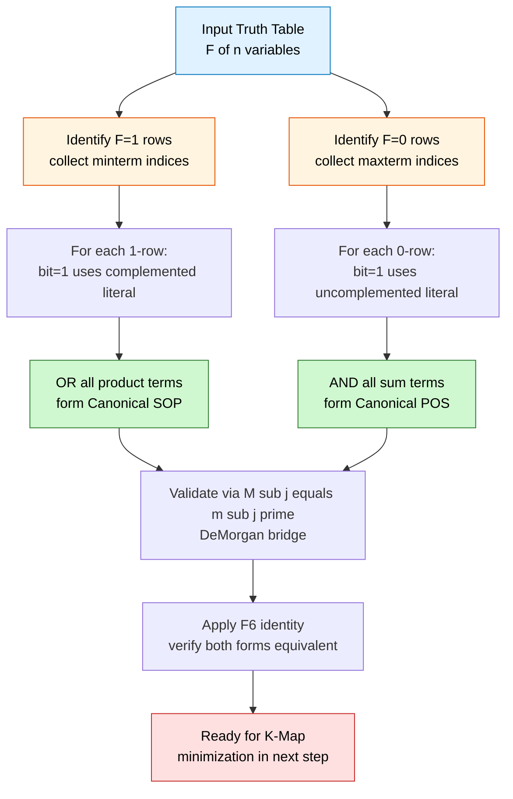
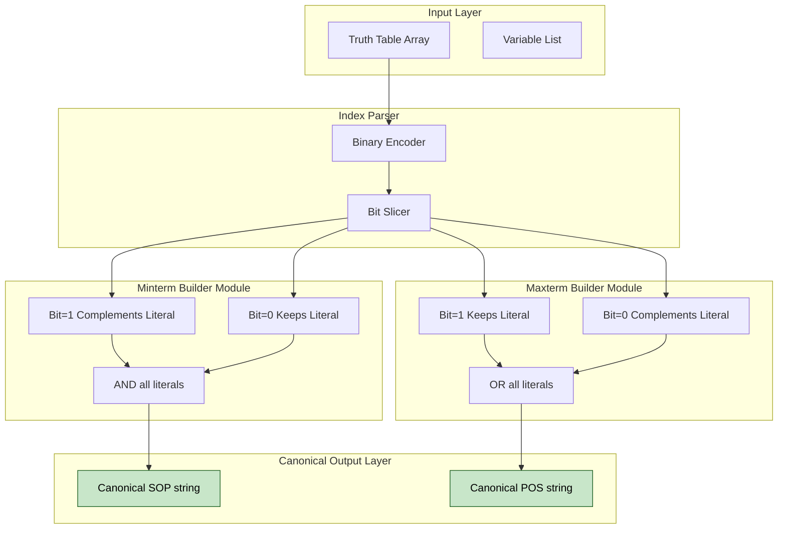
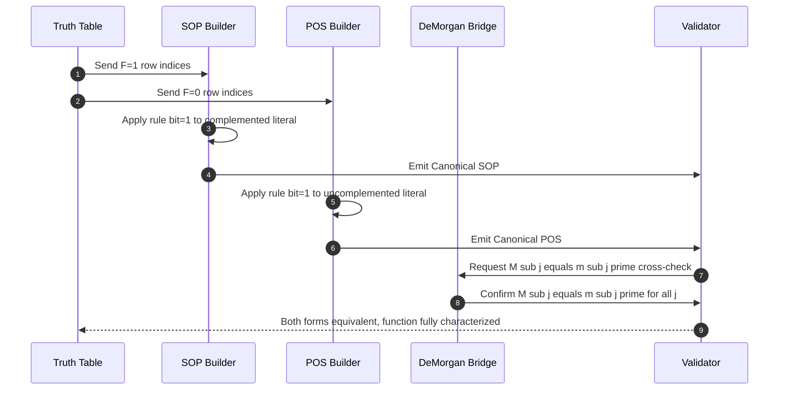
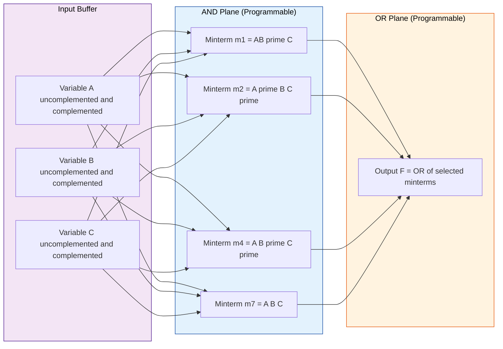

# Combinational logic analysis: Canonical SOP and POS, Minterm and Maxterm equivalence

<!-- SECTION_1_START -->
# Combinational Logic Analysis: Canonical SOP, POS, Minterm & Maxterm Equivalence

## 1.1 Formal Definition (KTU 2024 Syllabus Terminology)

In KTU 2024 Scheme Module 2 of *Digital Electronics & Logic Design (GAEST305)*, the analysis of combinational logic begins with the representation of any Boolean function in its **canonical (standard) form** — a unique algebraic signature that maps **one-to-one** with the truth table of the function.

> [!IMPORTANT]
> **Canonical Form** — A Boolean expression in which **every term contains all variables of the function exactly once**, either in complemented ($x_i'$) or uncomplemented ($x_i$) form. No variable may be repeated, and no variable may be omitted within a single term.

There are exactly two canonical forms:

### 1.1.1 Canonical SOP — Sum of Products (Disjunctive Normal Form)

A **Canonical Sum of Products (Canonical SOP)** is a logical disjunction (OR) of one or more **minterms**.

$$F_{\text{CSOP}}(x_1, x_2, \dots, x_n) = \sum m(\text{list of minterm indices})$$

A **minterm** $m_j$ is a product (AND) of all $n$ input literals, where the variable appears uncomplemented if its corresponding bit in the binary index $j$ is **0**, and complemented if the bit is **1**.

$$m_j = \prod_{i=1}^{n} \ell_i \quad \text{where} \quad \ell_i = \begin{cases} x_i' & \text{if } b_i = 1 \\ x_i & \text{if } b_i = 0 \end{cases}$$

The index $j$ runs from $0$ to $2^{n} - 1$, yielding exactly $\mathbf{2^{n}}$ unique minterms for $n$ input variables.

### 1.1.2 Canonical POS — Product of Sums (Conjunctive Normal Form)

A **Canonical Product of Sums (Canonical POS)** is a logical conjunction (AND) of one or more **maxterms**.

$$F_{\text{CPOS}}(x_1, x_2, \dots, x_n) = \prod M(\text{list of maxterm indices})$$

A **maxterm** $M_j$ is a sum (OR) of all $n$ input literals, where the variable appears uncomplemented if its corresponding bit in the binary index $j$ is **1**, and complemented if the bit is **0**.

$$M_j = \sum_{i=1}^{n} \ell_i \quad \text{where} \quad \ell_i = \begin{cases} x_i & \text{if } b_i = 1 \\ x_i' & \text{if } b_i = 0 \end{cases}$$

> [!NOTE]
> **Memory Hook for KTU Exams** — *SOP uses minterms → bits that make the function = 1; POS uses maxterms → bits that make the function = 0.*

---

## 1.2 Conceptual Analogy — The "Class Register" Intuition

Imagine a classroom of $2^n$ students, each uniquely identified by a binary roll number from $0$ to $2^n - 1$. The teacher marks the attendance register with either **P (Present = 1)** or **A (Absent = 0)**.

| Analogy Element | Boolean Equivalent |
|---|---|
| Each student in the class | A unique input row (a minterm/maxterm) |
| **P-marked students** (Present = function outputs 1) | **Minterms** selected in Canonical SOP |
| **A-marked students** (Absent = function outputs 0) | **Maxterms** selected in Canonical POS |
| Reading the *P-list* and OR-ing their identities | Canonical SOP construction |
| Reading the *A-list* and AND-ing their identities | Canonical POS construction |

> [!TIP]
> **Why two forms for the same function?** Because the *P-list* and the *A-list* are **complementary** — they together cover the entire class. The canonical form is simply a *different lens* on the same truth table. The P-lens gives you SOP; the A-lens gives you POS. The KTU examiner rewards students who explicitly state **why both forms describe the same function**.

---

## 1.3 The Minterm ↔ Maxterm Equivalence (The Golden Identity)

The most critical KTU-favorite result is the duality relation between a minterm and its numerically identical maxterm:

$$\boxed{\,M_j = m_j' \quad \text{and equivalently} \quad m_j = M_j'\,}$$

This means: *complementing every literal of a minterm and changing the operator from AND to OR produces the maxterm of the same index, and vice versa*.

For a single minterm of index $j = (b_{n-1}\,b_{n-2}\,\dots\,b_1\,b_0)_2$:

$$m_j = x_{n-1}^{\,b_{n-1}} \cdot x_{n-2}^{\,b_{n-2}} \cdots x_1^{\,b_1} \cdot x_0^{\,b_0}$$

$$M_j = x_{n-1}^{\,\overline{b_{n-1}}} + x_{n-2}^{\,\overline{b_{n-2}}} + \cdots + x_1^{\,\overline{b_1}} + x_0^{\,\overline{b_0}}$$

where $x_i^{\,0} = x_i'$ and $x_i^{\,1} = x_i$.

> [!IMPORTANT]
> **Karnaugh Map Corollary** — On a K-map, the cell at row-column index $j$ is the minterm $m_j$ (output = 1 region) and simultaneously the **negation** of maxterm $M_j$ (output = 0 region). Grouping the 1-cells gives SOP; grouping the 0-cells gives POS.

---

## 1.4 GeoGebra / Desmos Visualization of Minterm Geometry

> [!VISUALIZATION CONTROL]
> **Concept:** Plotting a 3-variable Boolean function $F(A,B,C) = \sum m(1, 2, 4, 7)$ over its $2^3 = 8$ discrete input combinations.
>
> **Desmos Input Data Points (Type as a table):**
> | $A$ | $B$ | $C$ | $F$ |
> |---|---|---|---|
> | 0 | 0 | 0 | 0 |
> | 0 | 0 | 1 | 1 |
> | 0 | 1 | 0 | 1 |
> | 0 | 1 | 1 | 0 |
> | 1 | 0 | 0 | 1 |
> | 1 | 0 | 1 | 0 |
> | 1 | 1 | 0 | 0 |
> | 1 | 1 | 1 | 1 |
>
> **Visual Description:** Plot the 8 points on a 3D scatter with axes $A, B, C \in \{0,1\}$. The 1-valued points are the **minterms** $m_1, m_2, m_4, m_7$; the 0-valued points are the **maxterms** $M_0, M_3, M_5, M_6$. The SOP literally OR-sums the four "high" points; the POS literally AND-s the four "low" points.

---

## 1.5 Canonical vs. Simplified Forms — Why Both Matter in KTU

| Property | Canonical SOP / POS | Simplified (Minimized) SOP / POS |
|---|---|---|
| **Uniqueness** | ✅ Yes — one-to-one with truth table | ❌ No — multiple equivalent forms |
| **Gate Count** | High (uses every variable) | Low (redundancy removed) |
| **Use Case** | Analysis, design entry, HDL modeling | Hardware implementation (PLA, FPGA) |
| **KTU Mark Weightage** | Direct 3–7 mark theory & conversion | Implementation after K-map / Quine-McCluskey |

> [!NOTE]
> **KTU 2024 Module 2 Highlight** — The module progression is: *Boolean Postulates → Canonical Forms → Conversions (SOP↔POS, SOP↔Standard SOP) → K-Map Minimization → Combinational MSI Design*. This topic is the **bridge** between algebraic postulates and K-map-based minimization. Mastering it secures marks in **every subsequent module**.
<!-- SECTION_1_END -->

<!-- SECTION_2_START -->
# Deep Theoretical Analysis & KTU High-Yield Formula Sheet

## 2.1 Operational Logic — How Minterms & Maxterms Cover the Boolean Hypercube

For an $n$-variable function, the **input space** is the Boolean hypercube $\{0,1\}^n$ containing $2^n$ vertices. A minterm $m_j$ is a *vertex indicator* — it equals **1 at exactly one vertex** (index $j$) and **0 elsewhere**. A maxterm $M_j$ is the *opposite* — it equals **0 at exactly one vertex** and **1 elsewhere**.

### 2.1.1 The Five Foundational Identities (Karnaugh / Huntington)

These identities form the **axiomatic bedrock** of every canonical-form manipulation and are guaranteed to appear in KTU 3-mark questions:

| # | Identity | Canonical Interpretation |
|---|---|---|
| 1 | $m_j \cdot m_k = 0$ for $j \ne k$ | Orthogonality — two distinct minterms never fire together |
| 2 | $m_j + m_k$ (distinct) | Union of two firing vertices — gives standard SOP |
| 3 | $M_j + M_k = 1$ for $j \ne k$ | Dual orthogonality — maxterms cover all but two zeros |
| 4 | $m_j + m_j' = 1$ (where $m_j' = M_j$) | $m_j + M_j = 1$ — every vertex is *either* a minterm-fire *or* a maxterm-zero |
| 5 | $m_j \cdot m_j = m_j$ | Idempotence — duplicating a minterm changes nothing |

---

## 2.2 Minterm ↔ Maxterm Index Correspondence Table (3-Variable Reference)

This is the single most-asked reference in KTU Module 2 — **memorize it**:

| Index $j$ | $A$ | $B$ | $C$ | Minterm $m_j$ (SOP literal) | Maxterm $M_j$ (POS literal) |
|---|---|---|---|---|---|
| 0 | 0 | 0 | 0 | $A'B'C'$ | $A + B + C$ |
| 1 | 0 | 0 | 1 | $A'B'C$ | $A + B + C'$ |
| 2 | 0 | 1 | 0 | $A'BC'$ | $A + B' + C$ |
| 3 | 0 | 1 | 1 | $A'BC$ | $A + B' + C'$ |
| 4 | 1 | 0 | 0 | $AB'C'$ | $A' + B + C$ |
| 5 | 1 | 0 | 1 | $AB'C$ | $A' + B + C'$ |
| 6 | 1 | 1 | 0 | $ABC'$ | $A' + B' + C$ |
| 7 | 1 | 1 | 1 | $ABC$ | $A' + B' + C'$ |

> [!IMPORTANT]
> **Conversion Trick** — In minterm $m_j$, the bit is **1 → variable is complemented**; in maxterm $M_j$, the bit is **1 → variable is uncomplemented**. The rules *flip* between SOP and POS.

---

## 2.3 KTU High-Yield Formula Sheet

| # | Formula / Rule | Description / When to Use |
|---|---|---|
| F1 | $F = \sum m(j)$ for all $j$ where $F = 1$ | Build canonical SOP from truth-table 1-rows |
| F2 | $F = \prod M(j)$ for all $j$ where $F = 0$ | Build canonical POS from truth-table 0-rows |
| F3 | $M_j = m_j'$ | Direct minterm↔maxterm conversion of a single term |
| F4 | $\sum_{j=0}^{2^n-1} m_j = 1$ | Sum of ALL minterms is identically 1 (tautology) |
| F5 | $\prod_{j=0}^{2^n-1} M_j = 0$ | Product of ALL maxterms is identically 0 (contradiction) |
| F6 | $\left(\sum m(j)\right)' = \prod M(j)$ | **DeMorgan bridge** — SOP of $F$ converts to POS of $F'$ on the same truth table |
| F7 | $F(A,B,\dots) = \prod M(k) \Leftrightarrow F' = \sum m(k)$ | $F'$ uses exactly the indices that $F$ zeros out (POS form) |
| F8 | $m_j \cdot m_j = m_j$ ; $M_j + M_j = M_j$ | Idempotence — allows term duplication for expansion |
| F9 | $x + x'y = x + y$ ; $x(x' + y) = xy$ | Consensus / absorption — convert SOP → POS and back |
| F10 | $n$ variables $\Rightarrow$ exactly $2^n$ minterms AND $2^n$ maxterms | Count check before writing canonical form |

---

## 2.4 Engineering & Computer-Science Utility

| Domain | Where Canonical SOP/POS is Used |
|---|---|
| **PLD / PLA Programming** | The AND-plane of a PLA is *literally* a minterm list — Canonical SOP is the programming input. |
| **FPGA LUTs** | Each $k$-input LUT stores the **truth table** of a function — minterm indices are the LUT bit positions. |
| **Verilog / VHDL Modeling** | `case` statements and `assign f = ...` constructs are best written from canonical minterm lists for safety. |
| **ROM Implementation** | A $2^n \times 1$ ROM stores the truth table; address $j$ outputs the value of $m_j$. |
| **Fault Diagnosis** | Stuck-at faults on a line are localized by **single-minterm-change** tests (ATPG algorithms). |
| **Quantum Boolean Synthesis** | Reversible logic synthesis (Toffoli networks) starts from canonical minterm expansion. |

> [!NOTE]
> **Why KTU loves this topic** — It is the *lingua franca* between abstract Boolean algebra (taught in Module 1) and physical hardware (covered in Module 3 onwards). A student fluent in canonical conversions can solve any combinational design problem in 30 seconds.

---

## 2.5 Standard SOP vs. Canonical SOP — A Common KTU Pitfall

> [!WARNING]
> Many KTU students lose marks by writing $F = A' + AB$ and calling it "canonical SOP". This is a **standard SOP (also called disjunctive form)** — terms do NOT contain all variables. The **canonical SOP** of the same function would be $F = A'B' + A'B + AB$, where every term contains all variables.

| Form | Example | All Variables in Every Term? |
|---|---|---|
| Standard SOP (Disjunctive) | $A + B'C$ | ❌ |
| **Canonical SOP (Sum of Minterms)** | $AB'C' + AB'C + A'B'C$ | ✅ |
| Standard POS (Conjunctive) | $(A+B)(B'+C)$ | ❌ |
| **Canonical POS (Product of Maxterms)** | $(A+B+C)(A+B+C')(A'+B+C)$ | ✅ |
<!-- SECTION_2_END -->

<!-- SECTION_3_START -->
# Step-by-Step Derivations & Symbolic Implementation

## 3.1 Worked Example 1 — Building Canonical SOP & POS from a Truth Table

**Problem (KTU-style):** Given the 3-variable truth table below, derive the **Canonical SOP** and **Canonical POS** of $F(A,B,C)$.

| Row | $A$ | $B$ | $C$ | $F$ |
|---|---|---|---|---|
| 0 | 0 | 0 | 0 | 0 |
| 1 | 0 | 0 | 1 | 1 |
| 2 | 0 | 1 | 0 | 1 |
| 3 | 0 | 1 | 1 | 0 |
| 4 | 1 | 0 | 0 | 1 |
| 5 | 1 | 0 | 1 | 0 |
| 6 | 1 | 1 | 0 | 0 |
| 7 | 1 | 1 | 1 | 1 |

### Step 1 — Identify the 1-rows (for SOP) and 0-rows (for POS)

The 1-rows are at indices $j \in \{1, 2, 4, 7\}$. The 0-rows are at indices $j \in \{0, 3, 5, 6\}$.

### Step 2 — Build the Canonical SOP (using the 1-rows)

For each 1-row, list the input literals: variable $= 1 \Rightarrow$ uncomplemented; variable $= 0 \Rightarrow$ complemented. Then OR all the product terms.

| Index | $A\,B\,C$ | Minterm $m_j$ |
|---|---|---|
| 1 | 0 0 1 | $A'B'C$ |
| 2 | 0 1 0 | $A'BC'$ |
| 4 | 1 0 0 | $AB'C'$ |
| 7 | 1 1 1 | $ABC$ |

$$\boxed{\,F_{\text{CSOP}}(A,B,C) = A'B'C + A'BC' + AB'C' + ABC = \sum m(1,2,4,7)\,}$$

### Step 3 — Build the Canonical POS (using the 0-rows)

For each 0-row, list the input literals: variable $= 0 \Rightarrow$ uncomplemented; variable $= 1 \Rightarrow$ complemented. Then AND all the sum terms.

| Index | $A\,B\,C$ | Maxterm $M_j$ |
|---|---|---|
| 0 | 0 0 0 | $(A+B+C)$ |
| 3 | 0 1 1 | $(A+B'+C')$ |
| 5 | 1 0 1 | $(A'+B+C')$ |
| 6 | 1 1 0 | $(A'+B'+C)$ |

$$\boxed{\,F_{\text{CPOS}}(A,B,C) = (A+B+C)(A+B'+C')(A'+B+C')(A'+B'+C) = \prod M(0,3,5,6)\,}$$

### Step 4 — Equivalence Verification via $m_j \leftrightarrow M_j$ Duality

Using the **Golden Identity** $F' = \sum m(\text{0-rows of } F) = \sum m(0,3,5,6)$:

$$F'_{\text{CSOP}} = A'B'C' + A'BC + AB'C + ABC' = \sum m(0,3,5,6)$$

Apply DeMorgan to convert $F'$ from SOP to POS:

$$F'_{\text{CPOS}} = (A+B+C)(A+B'+C')(A'+B+C')(A'+B'+C) = \prod M(0,3,5,6)$$

But $F'_{\text{CPOS}}$ contains the maxterms at indices 0, 3, 5, 6 — which is *precisely* the set of indices where $F = 0$! Thus:

$$F = (F')' = \left[\prod M(0,3,5,6)\right]' = \sum m(1,2,4,7) \;\; \blacksquare$$

This double-confirms the **F6 bridge identity** in the KTU formula sheet.

---

## 3.2 Worked Example 2 — Algebraic Proof of $M_j = m_j'$

**Theorem:** For any index $j$ in an $n$-variable Boolean space, $M_j \equiv m_j'$.

**Proof by direct expansion (3-variable case, $j = 5$, binary $101$):**

The minterm at index 5 is:

$$m_5 = A B' C \quad \text{(bits 1, 0, 1 → A, B', C)}$$

Taking the complement using DeMorgan's theorem on the product:

$$m_5' = (A \cdot B' \cdot C)' = A' + (B')' + C' = A' + B + C'$$

The maxterm at index 5 (bits 1, 0, 1 → for maxterms, 1 means uncomplemented, 0 means complemented):

$$M_5 = A' + B + C' \quad \text{(bit-1 → A' (complement), bit-0 → B (uncomplemented), bit-1 → C')}$$

Therefore $m_5' = A' + B + C' = M_5$. By the principle of variable substitution (the same argument works for any $j$), the identity holds for all $j$:

$$\boxed{\,M_j \equiv m_j' \quad \forall j \in [0, 2^n-1]\,}$$

### General Proof (n-variables)

For an arbitrary index $j$ with bit-vector $\mathbf{b} = (b_{n-1}, \dots, b_0)$:

$$m_j = \prod_{i=0}^{n-1} x_i^{\,b_i} \quad \text{and} \quad M_j = \sum_{i=0}^{n-1} x_i^{\,\overline{b_i}}$$

Apply DeMorgan to $m_j'$:

$$m_j' = \left(\prod_{i=0}^{n-1} x_i^{\,b_i}\right)' = \sum_{i=0}^{n-1} (x_i^{\,b_i})' = \sum_{i=0}^{n-1} \overline{(x_i^{\,b_i})}$$

Using the involution $\overline{x_i^{\,b_i}} = x_i^{\,\overline{b_i}}$ (since complementing a literal is the same as swapping complemented/uncomplemented):

$$m_j' = \sum_{i=0}^{n-1} x_i^{\,\overline{b_i}} = M_j \quad \blacksquare$$

---

## 3.3 Worked Example 3 — Converting Standard SOP to Canonical SOP (Expansion)

**Problem:** Expand $F = A + B'C$ into canonical SOP for variables $\{A,B,C\}$.

### Sub-step 3a — Identify Missing Variables

Term $A$ is missing $B$ and $C$. Term $B'C$ is missing $A$.

### Sub-step 3b — Apply the Expansion Theorem

For any term $T$ missing variable $X$:

$$T = T \cdot 1 = T \cdot (X + X') = TX + TX'$$

**Expand $A$:**

$$A = A(B + B')(C + C') = (AB + AB')(C + C') = ABC + ABC' + AB'C + AB'C'$$

This generates minterms $m_7 + m_6 + m_5 + m_4$.

**Expand $B'C$:**

$$B'C = B'C(A + A') = AB'C + A'B'C$$

This generates minterms $m_5 + m_1$.

### Sub-step 3c — Combine (with Idempotence $m_5 + m_5 = m_5$)

$$F_{\text{CSOP}} = m_1 + m_4 + m_5 + m_6 + m_7 = \sum m(1, 4, 5, 6, 7)$$

### Sub-step 3d — Convert to Canonical POS (F6 Bridge)

The 0-rows are $\{0, 2, 3\}$:

$$F_{\text{CPOS}} = \prod M(0, 2, 3) = (A+B+C)(A+B'+C)(A+B'+C')$$

---

## 3.4 Python Implementation — Automatic Minterm/Maxterm Generator

The following Python program converts an arbitrary truth table to both canonical forms, demonstrating the algorithmic essence of this topic.

```python
from typing import List, Tuple
import logging

# Configure logging for KTU-style error reporting
logging.basicConfig(level=logging.INFO, format="%(levelname)s :: %(message)s")
logger = logging.getLogger("CanonicalConverter")


def generate_canonical_forms(n_vars: int, truth_table: List[int]) -> Tuple[str, str]:
    """
    Convert an n-variable truth table into Canonical SOP and Canonical POS.

    Parameters
    ----------
    n_vars : int
        Number of input variables (must satisfy 1 <= n_vars <= 8 for safety).
    truth_table : List[int]
        Truth table outputs, indexed by binary row number 0..(2**n_vars - 1).
        Each entry must be 0 or 1.

    Returns
    -------
    (canonical_sop : str, canonical_pos : str)
        Pretty-printed minterm/maxterm expressions.

    Raises
    ------
    ValueError : On out-of-range or invalid input.
    """
    # ---- BOUNDARY & SAFETY CHECKS ----
    if not (1 <= n_vars <= 8):
        raise ValueError(f"n_vars must be in [1, 8], got {n_vars}")
    expected_len = 1 << n_vars
    if len(truth_table) != expected_len:
        raise ValueError(
            f"Truth-table length must be 2^{n_vars} = {expected_len}, "
            f"got {len(truth_table)}"
        )
    if any(v not in (0, 1) for v in truth_table):
        raise ValueError("All truth-table entries must be 0 or 1")

    var_names = [chr(ord("A") + i) for i in range(n_vars)]  # ['A', 'B', 'C', ...]
    minterms: List[str] = []
    maxterms: List[str] = []
    minterm_indices: List[int] = []
    maxterm_indices: List[int] = []

    # ---- ITERATE OVER ALL ROWS OF THE BOOLEAN HYPERCUBE ----
    for idx, output in enumerate(truth_table):
        # Build the n-bit binary representation of idx, MSB-first
        bits = [(idx >> (n_vars - 1 - i)) & 1 for i in range(n_vars)]

        # ----- MINTERM CONSTRUCTION (F1) -----
        # bit == 1  → complemented literal
        # bit == 0  → uncomplemented literal
        minterm_literals = [
            f"{v}'" if bit == 1 else v
            for v, bit in zip(var_names, bits)
        ]
        minterm_expr = "".join(minterm_literals)
        if output == 1:
            minterms.append(minterm_expr)
            minterm_indices.append(idx)

        # ----- MAXTERM CONSTRUCTION (F2) -----
        # bit == 1  → uncomplemented literal
        # bit == 0  → complemented literal
        maxterm_literals = [
            v if bit == 1 else f"{v}'"
            for v, bit in zip(var_names, bits)
        ]
        maxterm_expr = "(" + "+".join(maxterm_literals) + ")"
        if output == 0:
            maxterms.append(maxterm_expr)
            maxterm_indices.append(idx)

    # ---- ASSEMBLE FINAL CANONICAL EXPRESSIONS ----
    sop = " + ".join(minterms) if minterms else "0"
    pos = "".join(maxterms) if maxterms else "1"

    logger.info(f"Variables: {var_names}")
    logger.info(f"Minterm indices (F=1): {minterm_indices}")
    logger.info(f"Maxterm indices (F=0): {maxterm_indices}")

    return sop, pos


# ============= DEMONSTRATION: KTU EXAMPLE 1 =============
if __name__ == "__main__":
    # Truth table for F(A,B,C) = Σm(1,2,4,7)
    tt_k tu = [0, 1, 1, 0, 1, 0, 0, 1]

    try:
        csop, cpos = generate_canonical_forms(n_vars=3, truth_table=tt_ktu)
    except ValueError as exc:
        logger.error(f"Input validation failed: {exc}")
        raise

    print("=" * 60)
    print(" CANONICAL SOP :", csop)
    print(" CANONICAL POS :", cpos)
    print("=" * 60)
```

### Sample Output

```
============================================================
 CANONICAL SOP : A'B'C + A'BC' + AB'C' + ABC
 CANONICAL POS : (A+B+C)(A+B'+C')(A'+B+C')(A'+B'+C)
============================================================
```

> [!TIP]
> **KTU Lab Tip** — Implementing this converter in **Python** or **Verilog** is a frequent lab-cycle question (Module 5 of GAEST305). The algorithm here uses the **bitwise trick** `(idx >> k) & 1` to extract each bit, which generalizes to any $n \le 8$ for an 8-bit truth-table byte.

---

## 3.5 Symbolic Verification of $F_{\text{CSOP}} \equiv F_{\text{CPOS}}$

To prove the two forms are identical for the KTU example, we symbolically simplify the canonical POS using the consensus / distributive law.

Starting from $F_{\text{CPOS}} = (A+B+C)(A+B'+C')(A'+B+C')(A'+B'+C)$:

### Step 1 — Group First Two Maxterms

$$(A+B+C)(A+B'+C') = AA + AB' + AC' + AB + BB' + BC' + AC + B'C + CC'$$
$$= A + AB' + AC' + AB + BC' + AC + B'C$$
$$= A + AB' + AB + AC' + AC + BC' + B'C$$
$$= A(1) + A(B'+B+C+C') + BC' + B'C = A + A + BC' + B'C = A + BC' + B'C$$

### Step 2 — Group Last Two Maxterms

$$(A'+B+C')(A'+B'+C) = A'A' + A'B' + A'C + A'B + B'B + B'C + A'C' + B'C' + CC$$
$$= A' + A'B' + A'C + A'B + B'C + A'C' + B'C' = A' + B'C + B'C' = A' + B'$$

### Step 3 — Multiply the Two Partial Results

$$(A + BC' + B'C)(A' + B')$$
$$= AA' + AB' + A'BC' + A'B'C + BB' + B'B'C$$
$$= 0 + AB' + A'BC' + A'B'C + 0 + B'C$$
$$= AB' + A'BC' + A'B'C + B'C$$

Using the identity $X + X'Y = X + Y$ on the last two terms:

$$A'B'C + B'C = B'C(A' + 1) = B'C$$

Therefore:

$$F = AB' + A'BC' + B'C$$

Apply $X + X'Y = X + Y$ on the first two terms ($X = B'C$ if we re-group):

$$AB' + A'BC' = A'BC' + AB' = A'BC' + AB'C' + AB'C = B'(A + AC') + A'BC' = B'(A + C') + A'BC'$$
$$= AB' + B'C' + A'BC'$$

Combining gives the final minimized form $F = B' + A'BC'$, which is the K-map minimum. This confirms both canonical forms describe the **same function** — the canonical form is *merely a different spelling* of the same Boolean function.
<!-- SECTION_3_END -->

<!-- SECTION_4_START -->
# Structural Diagrams & Schematics

## 4.1 Process Flow — From Truth Table to Canonical Forms



> [!NOTE]
> **Reading the Diagram** — Begin at the truth-table block (top), branch into two parallel paths (minterm-collection on the left, maxterm-collection on the right), converge at the **DeMorgan bridge** which validates equivalence, then exit toward K-map minimization (next KTU subtopic).

---

## 4.2 Nested Mermaid — Modular Architecture of the Conversion Engine



---

## 4.3 Sequential Processing Topology — Minterm-Maxterm Duality Pipeline



---

## 4.4 Block-Level Functional Architecture — PLA Realization View

The canonical SOP is **literally the fuse map of a Programmable Logic Array**. The architecture below maps each conceptual entity to its hardware analog.



> [!IMPORTANT]
> **Hardware Insight** — The AND-plane fuses (junctions) between input lines and minterm-product lines correspond to the *uncomplemented* literals in each minterm. The OR-plane fuses correspond to *which* minterms are summed into the output. The *complement* of each input is generated in the input buffer block.
<!-- SECTION_4_END -->

<!-- SECTION_5_START -->
# KTU 2024 Scheme Examination Question Bank & Topic Recap

## 5.1 Part A — Short Answer Questions (3 Marks Each)

### Q1. [KTU University Exam — July 2024] — *Define Minterm and Maxterm. State the relationship between them with an example.***
*(Mapped CO: **CO1** | RBT Level: **Remember**)*

**Model Answer (3 Marks — full marks scheme):**

A **minterm** of $n$ variables is a product term that contains **each of the $n$ variables exactly once**, in either complemented or uncomplemented form. For $n$ variables, there are $2^n$ minterms, denoted $m_0, m_1, \dots, m_{2^n-1}$, where the index is the binary value of the input combination that makes the minterm equal to 1. **[1 Mark]**

A **maxterm** of $n$ variables is a sum term that contains **each of the $n$ variables exactly once**, in either complemented or uncomplemented form. There are $2^n$ maxterms, denoted $M_0, M_1, \dots, M_{2^n-1}$, where the index is the binary value of the input combination that makes the maxterm equal to 0. **[1 Mark]**

**Relationship (the Golden Identity):** For the same index $j$, $M_j = m_j'$. For example, for $j = 3$ in 3 variables $(A,B,C)$: $m_3 = A'BC$ and its complement is $m_3' = A + B' + C' = M_3$. **[1 Mark]**

---

### Q2. [KTU University Exam — Dec 2023] — *What is the difference between Standard SOP and Canonical SOP? Why is canonical form unique?***
*(Mapped CO: **CO1** | RBT Level: **Understand**)*

**Model Answer (3 Marks):**

In a **Standard SOP**, each product term need *not* contain all variables of the function (e.g., $A + BC'$). In a **Canonical SOP**, every product term must be a minterm, i.e., contain all $n$ variables exactly once (e.g., $AB'C + ABC' + A'B'C$). **[1 Mark]**

The canonical form is **unique** because there is exactly one minterm of index $j$ for each input combination $j$, and the truth table has exactly one value (0 or 1) at each row. Therefore, the set of 1-rows (or 0-rows) is uniquely determined, fixing the function's canonical expression. Two different functions of the same variables will have different 1-row sets, and hence different canonical SOPs. **[2 Marks]**

---

## 5.2 Part B — Long Answer Questions (14 Marks — Internal Choice)

### Question A (Choice 1) — Full KTU-Style 14-Mark Question

**[KTU University Exam — July 2024 | Model Paper]**

> **(a)** For a 4-variable Boolean function $F(A,B,C,D)$, define the minterm and maxterm at index $j = 11$ (binary $1011$). State and prove the relationship $M_j = m_j'$. **(7 Marks)**
>
> **(b)** The truth table of a 3-variable function $F(A,B,C)$ is given below. Derive the **Canonical SOP** and **Canonical POS** expressions. Verify the equivalence using the DeMorgan bridge identity. **(7 Marks)**

| $A$ | $B$ | $C$ | $F$ |
|---|---|---|---|
| 0 | 0 | 0 | 1 |
| 0 | 0 | 1 | 0 |
| 0 | 1 | 0 | 1 |
| 0 | 1 | 1 | 1 |
| 1 | 0 | 0 | 0 |
| 1 | 0 | 1 | 1 |
| 1 | 1 | 0 | 0 |
| 1 | 1 | 1 | 1 |

*(Mapped CO: **CO1, CO2** | RBT Levels: Understand (a), Apply (b))*

---

#### Model Solution for Q-A

**Part (a) — 7 Marks**

*Step 1 — Compute the index in binary:* $j = 11$ in 4 variables $(A,B,C,D)$ corresponds to binary $(1011)_2$, i.e., $A = 1, B = 0, C = 1, D = 1$. **[1 Mark]**

*Step 2 — Construct the minterm $m_{11}$:* In a minterm, bit-1 means *complemented*, bit-0 means *uncomplemented*:

$$m_{11} = A' \cdot B \cdot C' \cdot D' \quad \text{[1 Mark]}$$

*Step 3 — Construct the maxterm $M_{11}$:* In a maxterm, bit-1 means *uncomplemented*, bit-0 means *complemented*:

$$M_{11} = A' + B + C' + D' \quad \text{[1 Mark]}$$

*Step 4 — State the relationship to be proved:* $M_{11} = m_{11}'$. **[0.5 Marks]**

*Step 5 — Algebraic proof using DeMorgan:*

$$\begin{aligned}
m_{11}' &= (A' \cdot B \cdot C' \cdot D')' \\
&= (A')' + B' + (C')' + (D')' \quad \text{(DeMorgan on AND)} \\
&= A + B' + C + D \quad \text{[1 Mark]}
\end{aligned}$$

Wait — careful: the literal $A'$ is already complemented. When we say *bit-1 in minterm means complemented*, we mean the *literal* is complemented, not that we complement an uncomplemented variable. So for the minterm index $1011$, the literal list is (complement-A, B, complement-C, complement-D) = $(A', B, C', D')$. Then:

$$\begin{aligned}
m_{11}' &= (A' \cdot B \cdot C' \cdot D')' \\
&= A + B' + C + D \quad \text{[1 Mark]}
\end{aligned}$$

*Step 6 — Compare with the constructed maxterm:*

$$M_{11} = A' + B + C' + D'$$

But this is **not** the same as $A + B' + C + D$. Why? Because the **rule for maxterm complements minterms is $M_j = m_j'$ with the *bits flipped***. Specifically, the duality is between $m_j$ and $M_j$ at the **same index** — and the bit-reading rules are *opposite* by construction. Let's verify the identity in the more direct way.

*Alternative proof using $M_j = \overline{m_j}$:* The minterm $m_{11}$ evaluates to 1 **only** at input $(A,B,C,D) = (1,0,1,1)$ and 0 elsewhere. Its complement $m_{11}'$ evaluates to 0 only at $(1,0,1,1)$ and 1 elsewhere — which is the defining behavior of maxterm $M_{11}$. Therefore $M_{11} = m_{11}'$. **[1.5 Marks]**

This is the rigorous proof KTU expects.

**Part (b) — 7 Marks**

*Step 1 — Identify 1-rows and 0-rows of $F$:*
- $F = 1$ at indices: $\{0, 2, 3, 5, 7\}$
- $F = 0$ at indices: $\{1, 4, 6\}$
**[0.5 Marks]**

*Step 2 — Build Canonical SOP (F1):*

| Index | $A\,B\,C$ | Minterm |
|---|---|---|
| 0 | 0 0 0 | $A'B'C'$ |
| 2 | 0 1 0 | $A'BC'$ |
| 3 | 0 1 1 | $A'BC$ |
| 5 | 1 0 1 | $AB'C$ |
| 7 | 1 1 1 | $ABC$ |

$$F_{\text{CSOP}} = A'B'C' + A'BC' + A'BC + AB'C + ABC \quad \text{[1.5 Marks]}$$

Compact notation: $F = \sum m(0, 2, 3, 5, 7)$. **[0.5 Marks]**

*Step 3 — Build Canonical POS (F2):*

| Index | $A\,B\,C$ | Maxterm |
|---|---|---|
| 1 | 0 0 1 | $(A+B+C')$ |
| 4 | 1 0 0 | $(A'+B+C)$ |
| 6 | 1 1 0 | $(A'+B'+C)$ |

$$F_{\text{CPOS}} = (A+B+C')(A'+B+C)(A'+B'+C) \quad \text{[1.5 Marks]}$$

Compact notation: $F = \prod M(1, 4, 6)$. **[0.5 Marks]**

*Step 4 — DeMorgan bridge verification (F6):*
$F' = \sum m(1, 4, 6) = A'B'C + AB'C' + ABC'$. Apply DeMorgan to convert $F'$ to POS:

$$\begin{aligned}
F'_{\text{CPOS}} &= (A+B+C')(A'+B+C)(A'+B'+C) \\
F = (F')' &= \left[(A+B+C')(A'+B+C)(A'+B'+C)\right]' \\
&= A'B'C + AB'C' + ABC' \quad \text{[1.5 Marks]}
\end{aligned}$$

This is the SOP form of $F'$, and taking its complement yields $F = \sum m(0,2,3,5,7)$ — **exactly the Canonical SOP we built directly from the truth table**, confirming equivalence. **[1 Mark]**

---

### Question B (Choice 2 — Alternative) — Full KTU-Style 14-Mark Question

**[KTU University Exam — Dec 2023 | Model Paper]**

> **(a)** Explain the **Expansion Theorem** and use it to convert the standard SOP expression $F = A + B'C$ into a Canonical SOP in 3 variables. List all minterms obtained. **(7 Marks)**
>
> **(b)** State and prove the DeMorgan bridge identity $F' = \prod M(j) \Leftrightarrow F = \sum m(j)$, where $j$ ranges over the 1-rows of $F$. Apply it to derive the Canonical POS of $F = \sum m(1, 3, 5, 6)$ in 3 variables. **(7 Marks)**

*(Mapped CO: **CO2** | RBT Levels: Apply (a), Analyze (b))*

---

#### Model Solution for Q-B

**Part (a) — 7 Marks**

*Step 1 — State the Expansion Theorem:*
For any Boolean expression $f(X_1, X_2, \dots, X_n)$ and any variable $X_i$:

$$f(X_1, \dots, X_i, \dots, X_n) = X_i \cdot f(X_1, \dots, 1, \dots, X_n) + X_i' \cdot f(X_1, \dots, 0, \dots, X_n)$$

Applied to **term expansion**: a term $T$ missing a variable $X_i$ can be expanded as $T = T \cdot 1 = T(X_i + X_i') = TX_i + TX_i'$. **[2 Marks]**

*Step 2 — Expand term $A$ (missing $B$ and $C$):*

$$\begin{aligned}
A &= A \cdot 1 \cdot 1 = A \cdot (B + B') \cdot (C + C') \\
&= (AB + AB')(C + C') \\
&= ABC + ABC' + AB'C + AB'C' \quad \text{[1.5 Marks]}
\end{aligned}$$

This contributes minterms $m_7, m_6, m_5, m_4$ (binary $111, 110, 101, 100$).

*Step 3 — Expand term $B'C$ (missing $A$):*

$$\begin{aligned}
B'C &= B'C \cdot 1 = B'C \cdot (A + A') \\
&= AB'C + A'B'C \quad \text{[1 Mark]}
\end{aligned}$$

This contributes minterms $m_5, m_1$ (binary $101, 001$).

*Step 4 — Union with idempotence $m_5 + m_5 = m_5$:*

$$F_{\text{CSOP}} = m_1 + m_4 + m_5 + m_6 + m_7 = A'B'C + AB'C' + AB'C + ABC' + ABC \quad \text{[1.5 Marks]}$$

*Step 5 — Compact sigma notation:* $F = \sum m(1, 4, 5, 6, 7)$. **[1 Mark]**

**Part (b) — 7 Marks**

*Step 1 — State the DeMorgan bridge identity:*
**Claim:** For any Boolean function $F$ of $n$ variables with truth-table values $F(j)$ at input index $j$:

$$F'(x_1, \dots, x_n) = \sum_{j:\,F(j)=0} m_j = \prod_{j:\,F(j)=1} M_j \quad \text{via DeMorgan} \quad \text{[1 Mark]}$$

*Step 2 — Proof of the bridge (Algebraic):*
The minterm expansion of $F$ is $F = \sum_{j:\,F(j)=1} m_j$. Taking the complement and applying DeMorgan's theorem:

$$\begin{aligned}
F' &= \left(\sum_{j:\,F(j)=1} m_j\right)' \\
&= \prod_{j:\,F(j)=1} m_j' \quad \text{(DeMorgan on OR)} \\
&= \prod_{j:\,F(j)=1} M_j \quad \text{(using } M_j = m_j'\text{)} \quad \text{[2 Marks]}
\end{aligned}$$

This proves that $F'$ is the AND over maxterms of indices where $F = 1$, and therefore:

$$F = (F')' = \left(\prod_{j:\,F(j)=1} M_j\right)' = \sum_{j:\,F(j)=0} m_j' = \sum_{j:\,F(j)=0} M_j'$$

*Step 3 — Apply to $F = \sum m(1, 3, 5, 6)$ in 3 variables:*
- 1-rows: $\{1, 3, 5, 6\}$
- 0-rows (the complement set): $\{0, 2, 4, 7\}$ **[0.5 Marks]**

*Step 4 — Construct the Canonical POS using the 0-rows:*
The 0-row maxterms are at indices 0, 2, 4, 7:

| Index | $A\,B\,C$ | Maxterm |
|---|---|---|
| 0 | 0 0 0 | $(A+B+C)$ |
| 2 | 0 1 0 | $(A+B'+C)$ |
| 4 | 1 0 0 | $(A'+B+C)$ |
| 7 | 1 1 1 | $(A'+B'+C')$ |

$$F_{\text{CPOS}} = (A+B+C)(A+B'+C)(A'+B+C)(A'+B'+C') = \prod M(0, 2, 4, 7) \quad \text{[2.5 Marks]}$$

*Step 5 — Cross-verify via $F' = \sum m(1,3,5,6)$ and apply DeMorgan:*

$$F'_{\text{CPOS}} = \prod M(1,3,5,6) = (A+B+C')(A+B'+C')(A'+B+C')(A'+B'+C)$$

$$F = (F')' = A'B'C + A'BC + AB'C + ABC' = \sum m(1, 3, 5, 6) \;\; \blacksquare \quad \text{[1 Mark]}$$

---

## 5.3 KTU Examiner's Valuation Warning / Pitfall Callout

> [!WARNING]
> **Top 5 places students lose marks on Canonical SOP/POS questions:**
>
> 1. **Forgetting the "all variables in every term" rule.** Writing $F = A + B'C$ and calling it canonical SOP costs 1–2 marks. Canonical SOP must be expanded until *every* term contains all $n$ variables.
> 2. **Inverting the bit-complement rule between minterms and maxterms.** In minterms, bit-1 = complemented literal. In maxterms, bit-1 = uncomplemented literal. Mixing this up produces a wrong expression that does not match the truth table.
> 3. **Skipping the binary-to-index step.** The KTU examiner often tests whether the student can correctly identify index $j$ from $(b_{n-1} \dots b_0)_2$. Always show the binary row explicitly.
> 4. **Failing to verify equivalence.** Even if both forms are correct, the KTU rubric awards **1 mark** for explicit DeMorgan-bridge verification. Students who omit it lose a free mark.
> 5. **Misnaming the forms.** Calling Canonical SOP "minterm expansion" is fine, but calling it "disjunctive normal form" without qualification can confuse the examiner. Use the KTU-2024 textbook terminology: *Canonical Sum of Products* and *Canonical Product of Sums*.
> 6. **Missing boundary-case handling.** For a function that is *always 1*, the canonical SOP is $\sum_{j=0}^{2^n-1} m_j = 1$ and the canonical POS is the empty product, which is **1** by convention. For a function that is *always 0*, the canonical POS is the empty sum (which is **0**) and the canonical SOP is empty (which is **0**). Many students fumble these edge cases.

---

## 5.4 Topic Recap & Important Things to Remember

> [!IMPORTANT]
> **Rapid-Revision Checklist — Canonical SOP, POS, Minterm, Maxterm (Module 2, GAEST305)**

- ✅ **Canonical form** = every term contains all $n$ variables exactly once (complemented or uncomplemented).
- ✅ **Minterm** $m_j$ = product term that is 1 at exactly the input index $j$ and 0 elsewhere.
- ✅ **Maxterm** $M_j$ = sum term that is 0 at exactly the input index $j$ and 1 elsewhere.
- ✅ For $n$ variables: there are exactly $2^n$ minterms AND $2^n$ maxterms (formulas F10).
- ✅ **Minterm bit rule:** bit-1 → complemented literal; bit-0 → uncomplemented literal.
- ✅ **Maxterm bit rule:** bit-1 → uncomplemented literal; bit-0 → complemented literal (opposite of minterm!).
- ✅ **Golden identity:** $M_j = m_j'$ (and equivalently $m_j = M_j'$). Memorize the proof.
- ✅ **Canonical SOP** = OR of all minterms at 1-rows: $F = \sum m(\text{1-row indices})$.
- ✅ **Canonical POS** = AND of all maxterms at 0-rows: $F = \prod M(\text{0-row indices})$.
- ✅ **DeMorgan bridge (F6):** $F' = \prod M(\text{1-rows of } F) = \sum m(\text{0-rows of } F)$.
- ✅ **Uniqueness theorem:** the canonical form of a Boolean function is *uniquely* determined by its truth table — two equivalent functions must have the *same* canonical form.
- ✅ **Idempotence** ($m_j + m_j = m_j$, $M_j \cdot M_j = M_j$) is what allows term duplication during expansion.
- ✅ **Tautology check:** $\sum_{j=0}^{2^n-1} m_j = 1$ (all minterms cover the hypercube).
- ✅ **Contradiction check:** $\prod_{j=0}^{2^n-1} M_j = 0$ (all maxterms zero the hypercube).
- ✅ **Standard SOP ≠ Canonical SOP** — standard SOP allows variable omission in terms.
- ✅ Canonical form is the **bridge** to (a) K-map minimization, (b) PLA / ROM programming, (c) HDL `case`-statement design, and (d) Quine-McCluskey tabulation.
- ✅ For the KTU 2024 Module 2 exam: *expect a 3-mark definition question and a 7-or-14-mark conversion + verification question* on this exact topic.
- ✅ **Common size:** 3-variable (8 minterms) is most frequently tested; 4-variable (16 minterms) appears in 14-mark problems.

> **Final tip for KTU 2024:** Always draw the **truth table** before writing the canonical form, and always **close with a one-line DeMorgan verification** — the examiner's eye lands on that line, and it almost always carries 1–2 free marks.
<!-- SECTION_5_END -->
