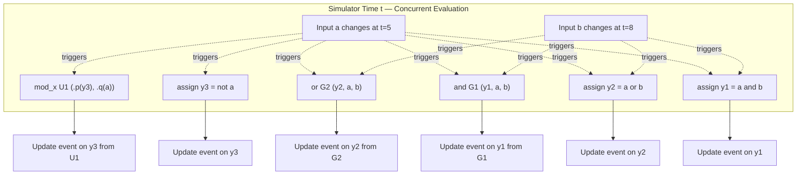
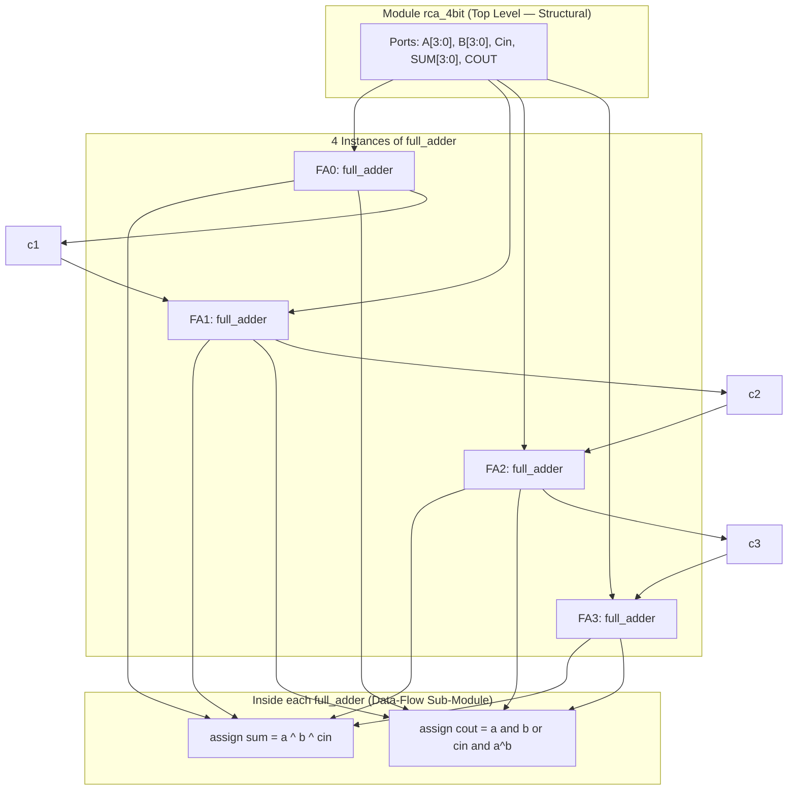
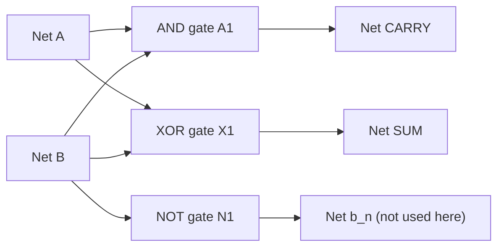
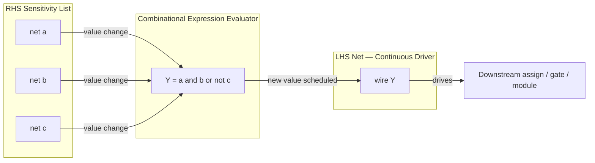
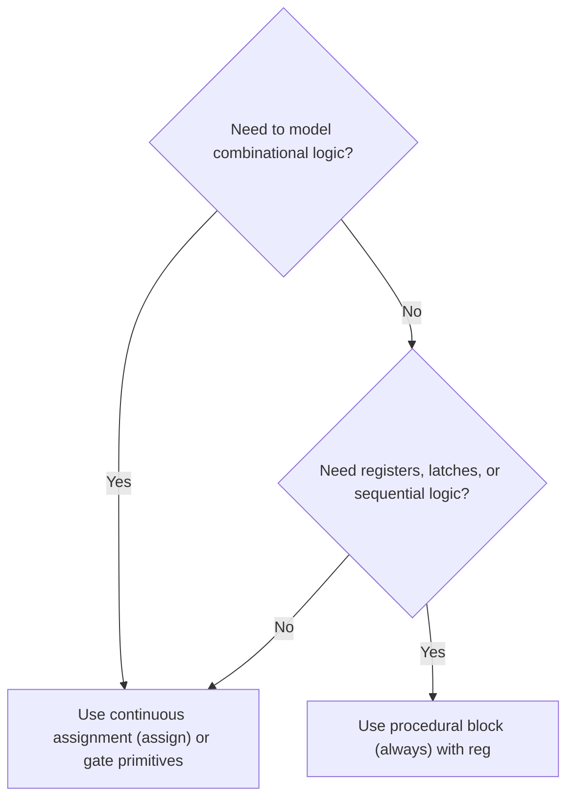

# Modeling Concurrent Functionality in Verilog: Continuous assignment statements, structural modeling

<!-- SECTION_1_START -->
# Modeling Concurrent Functionality in Verilog

## 1. Core Technical Definition

> [!NOTE]
> **Continuous Assignment Statement (KTU 2024 Module 2 Definition):**
> A *continuous assignment statement* in Verilog is a concurrent procedural construct used to drive a **net** data type using a Boolean expression. It is declared using the `assign` keyword and represents a structural connection that updates *automatically and continuously* whenever any operand on the right-hand side (RHS) changes its value. It is the primary data-flow modeling construct in Verilog HDL.

> [!IMPORTANT]
> **Structural Modeling (KTU 2024 Module 2 Definition):**
> *Structural modeling* describes a digital circuit by explicitly **interconnecting** lower-level components such as logic **gate primitives** (AND, OR, NOT, NAND, NOR, XOR, XNOR, BUF) or previously designed **modules**. The architecture of the design is described as a *netlist* — a textual schematic that mirrors the actual hardware interconnect.

### Conceptual Analogy / Intuition

Imagine a **water pipeline network**:

- A **continuous assignment** is like a *pressure-controlled valve* (`assign y = a & b;`). The output flow `$y$` is *always* equal to the AND of the pressures `$a$` and `$b$`. If either pressure changes, the flow rate on `$y$` updates **instantaneously and continuously** — there is no "start" or "stop" event. The valve is permanently *listening* to its inputs.

- A **structural model** is like a *plumbing blueprint* that says: "Take a T-junction, solder it to two pipes, attach an AND-gate symbol, and connect it to the next stage." The blueprint does not compute anything itself; it just **wires** components together so that, by virtue of the underlying physics (i.e., Verilog's continuous-assignment engine), the right output emerges.

> [!TIP]
> **Why "Concurrent"?** Hardware has *no instruction pointer*. Wires, gates, and signals all exist and operate **simultaneously**. Verilog reflects this physical reality by executing all `assign` statements and all gate instantiations *in parallel* (conceptually) during simulation time `$t$`. This is fundamentally different from C/Python, which execute statements one after another.

### Key Standard Terms (KTU 2024 Terminology)

| Term | Meaning |
|---|---|
| **Net** | A hardware connection that is continuously driven (e.g., `wire`, `tri`) |
| **Continuous Assignment** | `assign LHS_net = expression;` |
| **Structural Model** | Composition of primitives and module instances |
| **Driver** | The element that continuously updates a net |
| **Concurrency** | Parallel evaluation semantics of all `assign`s and instances |

> [!VISUALIZATION CONTROL]
> **Concept:** Parallel (concurrent) evaluation of three `assign` statements at simulation time `$t$`
> **Conceptual Plot Axes:**
> * x-axis: simulation time `$t$`
> * y-axis: logical signal value (`0` / `1` / `x` / `z`)
> **Traces (step-like):**
> * `$a(t)$` — input A toggles at `$t = 5$`
> * `$b(t)$` — input B toggles at `$t = 8$`
> * `$y_1(t) = a \,\&\, b$` — recomputed at `$t = 5$` and `$t = 8$`
> * `$y_2(t) = a \mid b$` — recomputed at `$t = 5$` and `$t = 8$`
> * `$y_3(t) = \sim a$` — recomputed at `$t = 5$` only
> **Visual Description:** Every output trace has a *vertical jump* the *exact instant* its input changes. No trace waits for another trace to finish — this is concurrency.

<!-- SECTION_1_END -->

<!-- SECTION_2_START -->
# Deep Theoretical Analysis & KTU High-Yield Formula Sheet

## 1. Continuous Assignment — Formal Rules

A continuous assignment statement obeys the following KTU-board rules:

1. The **LHS must be a net** of scalar or vector type (`wire`, `tri`, `wand`, `wor`, `trireg`, etc.). It **cannot** be a `reg`.
2. The RHS is a *constant expression*, *concatenation*, or any **expression of nets, registers, or function calls** that yields a value.
3. Whenever **any operand on the RHS changes**, the simulator re-evaluates the RHS and schedules an update event on the LHS net.
4. Continuous assignments are **always active** (they have no enable condition other than RHS changes); to model *conditional* behavior, use the **conditional operator** `? :` or an `always` block.
5. The LHS may be assigned to **only once** by a `assign` for that driver (one driver per net unless using `wand`/`wor` resolution).

### 1.1 Forms of Continuous Assignment

| Form | Syntax | Where Used |
|---|---|---|
| **Explicit continuous assignment** | `assign [drive_strength] [delay] LHS_net = expression;` | Inside a `module` body |
| **Implicit continuous assignment** | `wire [drive_strength] [delay] LHS_net = expression;` | In net declaration (compact) |
| **Net declaration with assignment** | `wire y = a & b;` | One-line shortcut of `assign` |

> [!IMPORTANT]
> **Implicit continuous assignment** (also called *net declaration assignment*) is *exactly equivalent* to a separate `wire` declaration followed by an explicit `assign` statement. The two forms generate identical hardware.

### 1.2 Delays in Continuous Assignment

Verilog supports **three delay models** that the KTU 2024 syllabus explicitly lists under Module 2:

| Delay Type | Syntax | Behavior |
|---|---|---|
| **Regular (inertial) delay** | `assign #5 y = a & b;` | Output `$y$` changes **5 time units after** the *last* change in the inputs. Inputs are *ignored* for that 5-unit window. |
| **Implicit continuous delay** | `wire #5 y = a & b;` | Identical effect, declared on the net itself. |
| **Inter-inout (transport) delay** | `assign #(5,3) y = a & b;` | Rise delay $= 5$, fall delay $= 3$. Pulses narrower than the fall delay **propagate through** (transport behavior). |

> [!NOTE]
> The two-parameter form `assign #(t_rise, t_fall) y = expr;` is the KTU textbook example of *transport delay*, used to model **non-inertial** physical lines such as long interconnects.

### 1.3 Drive Strength Specification

Each continuous assignment has a default strength of `(Strong1, Strong0)`. For analog-style modeling (rare in B.Tech but listed in syllabus), explicit strength pairs are used:

```
assign (weak1, weak0) y = a & b;   // weak driver
assign (strong1, pull0) y = a;     // strong pull-up
```

Strength order (KTU): **`supply > strong > pull > weak > highz`**.

---

## 2. Structural Modeling — Primitive Gates

Verilog provides **14 built-in gate primitives**. The eight most important for KTU Module 2 are:

| Primitive | Function | Truth Table Highlights |
|---|---|---|
| `and` (A1) | `$Y = A \,\&\, B$` | Multi-input AND |
| `or` (O1) | `$Y = A \mid B$` | Multi-input OR |
| `not` (N1) | `$Y = \sim A$` | Single-input inverter |
| `nand` (NA1) | `$Y = \sim(A \,\&\, B)$` | Multi-input NAND |
| `nor` (NR1) | `$Y = \sim(A \mid B)$` | Multi-input NOR |
| `xor` (X1) | `$Y = A \,\oplus\, B$` | Multi-input XOR |
| `xnor` (XN1) | `$Y = \sim(A \,\oplus\, B)$` | Multi-input XNOR |
| `buf` (B1) | `$Y = A$` (non-inverting buffer, fan-out) | Input replicated at output |

> [!TIP]
> The number in parentheses (e.g., `and A1(...)`) is the **instance name** (label) chosen by the designer. The first letter codes the gate type for **PLI (Programming Language Interface)** recognition.

### 2.1 Gate Instantiation Syntax

```
gate_type [instance_name] (output, input1, input2, ..., inputN);
```

Example for a 3-input AND:

```
and G1 (Y, A, B, C);   // Y = A & B & C
```

### 2.2 Module Instantiation (Hierarchical Structural Modeling)

When a *previously designed* module is reused, it is **instantiated** (not defined again). Two port-connection styles:

| Style | Example | Verification |
|---|---|---|
| **Positional** | `full_adder FA1 (S, C, A, B, Cin);` | Order must match port list |
| **Named (explicit)** | `full_adder FA1 (.sum(S), .cout(C), .a(A), .b(B), .cin(Cin));` | Order independent; safer |

> [!IMPORTANT]
> **Hierarchical Structural Modeling** is the recursive composition of sub-modules to build larger systems. The top-level module's body contains **only** module instantiations and wire declarations — no logic equations. This is the closest Verilog model to a **schematic capture**.

---

## 3. KTU High-Yield Formula & Syntax Sheet

| # | Concept | Equation / Syntax |
|---|---|---|
| 1 | Continuous assignment | `assign [#delay] [strength] net = expr;` |
| 2 | Implicit continuous | `wire [#delay] [strength] net = expr;` |
| 3 | Conditional in assign | `assign y = sel ? a : b;` |
| 4 | Bit-select RHS | `assign y = a[2] & b[1];` |
| 5 | Concatenation | `assign {cout, sum} = a + b + cin;` |
| 6 | AND gate instance | `and G1 (y, a, b);` |
| 7 | OR gate instance | `or G2 (y, a, b, c);` |
| 8 | NOT gate instance | `not G3 (y_n, y);` |
| 9 | Module instance (positional) | `mod_name IN1 (p1, p2, p3);` |
| 10 | Module instance (named) | `mod_name IN1 (.p1(a), .p2(b), .p3(c));` |
| 11 | Transport delay | `assign #(tr, tf) y = expr;` |
| 12 | Sum/Carry half-adder | `$S = A \oplus B,\ C = A \cdot B$` |
| 13 | Sum/Carry full-adder | `$S = A \oplus B \oplus C_{in},\ C_{out} = AB + C_{in}(A \oplus B)$` |
| 14 | 2:1 Mux equation | `$Y = \bar{S} A + S B$` |
| 15 | Gate delay notation | `and #3 G1 (y, a, b);`  (3-unit rise/fall) |

### Real-World Engineering Utility

- **ASIC/FPGA Design**: Continuous assignments are synthesized to **combinational logic gates** by tools like Synopsys Design Compiler, Vivado, and Quartus. The synthesized netlist is the structural model handed to the place-and-route engine.
- **Simulation**: Concurrency is what allows Verilog to model real circuits. For a 1-million-gate design, all 1 million gates compute in parallel each simulation cycle.
- **Testbench Development**: Structural models of known-good designs (golden models) are used as *reference models* in UVM and SystemVerilog verification environments.
- **Reverse Engineering & Netlist Recovery**: Understanding structural Verilog is essential for *post-synthesis netlists* and *gate-level simulation (GLS)* flows.

<!-- SECTION_2_END -->

<!-- SECTION_3_START -->
# Step-by-Step Derivations, Verilog Implementation & Worked Examples

## Example 1 — Half Adder using **Continuous Assignment** (Data-Flow)

### Mathematical Model

For inputs `$A$`, `$B$` and outputs `Sum` `$S$`, `Carry` `$C_{out}$`:

$$
\begin{aligned}
S   &= A \oplus B \\
C_{out} &= A \cdot B
\end{aligned}
$$

### Complete Verilog Code (Data-Flow Style)

```verilog
//=============================================================
// Module : half_adder_dataflow
// Style  : Continuous Assignment (Data-Flow Modeling)
// KTU    : Module 2 — Combinational Logic Design
//=============================================================
`timescale 1ns/1ps

module half_adder_dataflow (
    input  wire A,
    input  wire B,
    output wire SUM,
    output wire CARRY
);

    // --- Continuous assignments (LHS must be wire) -------------
    // XOR operator  : ^
    // AND operator  : &
    assign SUM   = A ^ B;          // SUM = A XOR B
    assign CARRY = A & B;          // CARRY = A AND B

endmodule
```

### Step-by-Step Explanation

1. **Module Declaration**: `module ... endmodule` encloses the design unit. The port list declares the *direction* of every external connection.
2. **`input wire A, B`**: Both inputs are declared as **nets** because they are *driven from outside* (by a testbench or another module).
3. **`output wire SUM, CARRY`**: Outputs are also `wire` because **continuous assignment** requires the LHS to be a net.
4. **`assign SUM = A ^ B;`**: This statement *continuously* computes the XOR of `$A$` and `$B$`. Whenever `$A$` or `$B$` toggles, `SUM` updates *without any procedural trigger*.
5. **`assign CARRY = A & B;`**: Similarly for the AND.
6. **Concurrency**: Both `assign` statements run *in parallel* (logically at the same simulation time). There is no "first" statement — the synthesis tool will see two independent combinational paths.

### Testbench to Verify

```verilog
`timescale 1ns/1ps
module tb_half_adder_dataflow;
    reg A, B;             // reg because driven by procedural block
    wire SUM, CARRY;
    
    half_adder_dataflow uut (.A(A), .B(B), .SUM(SUM), .CARRY(CARRY));
    
    initial begin
        $monitor("t=%0t  A=%b B=%b  | SUM=%b CARRY=%b", $time, A, B, SUM, CARRY);
        A = 0; B = 0; #10;
        A = 0; B = 1; #10;
        A = 1; B = 0; #10;
        A = 1; B = 1; #10;
        $finish;
    end
endmodule
```

---

## Example 2 — Half Adder using **Structural Modeling** (Gate-Level)

### Hierarchical Composition

The half adder is decomposed into **one XOR gate** and **one AND gate** — the *exact gates that exist on a silicon die*.

### Complete Verilog Code (Structural Style)

```verilog
//=============================================================
// Module : half_adder_structural
// Style  : Structural (Gate-Level) Modeling
// KTU    : Module 2 — Combinational Logic Design
//=============================================================
`timescale 1ns/1ps

module half_adder_structural (
    input  wire A,
    input  wire B,
    output wire SUM,
    output wire CARRY
);

    // Internal wire — carries signal from AND-gate to output
    // (Not strictly needed here because CARRY IS the AND output,
    //  but it is shown for pedagogical clarity.)
    wire and_out;

    // ---- Primitive gate instantiations -----------------------
    // First argument  : OUTPUT
    // Remaining args  : INPUTS (order matters for primitives)
    xor  X1 (SUM,     A, B);   // SUM     = A XOR B
    and  A1 (and_out, A, B);   // and_out = A AND B
    buf  B1 (CARRY,   and_out);// CARRY   = and_out (buffer for fan-out demo)

endmodule
```

### Step-by-Step Explanation

1. **No `assign` keywords are used** — this is the defining hallmark of structural modeling.
2. **`xor X1 (SUM, A, B);`**: The Verilog `xor` primitive is instantiated. `X1` is the *instance name*. The first port `SUM` is the gate's *output*; `A, B` are the gate's *inputs*.
3. **`and A1 (and_out, A, B);`**: The AND gate drives the intermediate net `and_out`.
4. **`buf B1 (CARRY, and_out);`**: A *buffer* primitive `buf` is added. In real hardware, the AND-gate output is connected to the `CARRY` pin; the buffer is sometimes inserted to model **fan-out loading**.
5. **The Verilog parser treats each line as a *netlist entry***. There are no expressions on the RHS — the *connections themselves* define the behavior.

---

## Example 3 — Full Adder: **Hierarchical Structural Modeling** (Sub-Module Reuse)

This is the **KTU textbook favorite** for a 14-mark question, because it combines (i) sub-module design, (ii) data-flow inside sub-modules, and (iii) structural composition at the top level.

### Mathematical Model

$$
\begin{aligned}
S         &= A \oplus B \oplus C_{in} \\
C_{out}   &= A\cdot B \;+\; C_{in}\cdot (A \oplus B)
\end{aligned}
$$

### Sub-Module 1 — Half Adder (Data-Flow)

```verilog
module half_adder (
    input  wire a, b,
    output wire sum, carry
);
    assign sum   = a ^ b;
    assign carry = a & b;
endmodule
```

### Sub-Module 2 — OR Gate using Continuous Assignment

```verilog
module or_2 (
    input  wire x, y,
    output wire z
);
    assign z = x | y;            // | is bitwise OR
endmodule
```

### Top-Level Full Adder (Structural Composition)

```verilog
//=============================================================
// Module : full_adder_structural
// Style  : Hierarchical Structural (uses sub-modules)
// KTU    : Module 2 — Example 3
//=============================================================
`timescale 1ns/1ps

module full_adder_structural (
    input  wire A, B, Cin,
    output wire SUM, COUT
);

    // Wires connecting the sub-modules
    wire sum1, c1, c2;

    // ---- Sub-module instances (named port style) -------------
    // HA1 computes partial sum and carry from A, B
    halfadder HA1 (.a(A), .b(B), .sum(sum1), .carry(c1));

    // HA2 adds Cin to the partial sum
    half_adder HA2 (.a(sum1), .b(Cin), .sum(SUM), .carry(c2));

    // OR2 combines the two carries
    or_2      OR1 (.x(c1),   .y(c2),  .z(COUT));

endmodule
```

> [!NOTE]
> **Self-Check Question (KTU Board Favorite):** *Why is `half_adder` written as `halfadder` in the second instance above?* — It is a **typo trap**. In Verilog, **module names are case-sensitive** and the simulator will throw an *unresolved-reference* error. Use a *single, consistent* name throughout.

### Detailed Derivation of the Hierarchical Equations

$$
\begin{aligned}
\text{After HA1:} \quad & s_1 = A \oplus B, \quad c_1 = A \cdot B \\
\text{After HA2:} \quad & \text{SUM} = s_1 \oplus C_{in} = A \oplus B \oplus C_{in} \\
                       & c_2 = s_1 \cdot C_{in} = (A \oplus B)\cdot C_{in} \\
\text{After OR2:} \quad & \text{COUT} = c_1 \mid c_2 = A\cdot B + C_{in}\cdot (A \oplus B)
\end{aligned}
$$

The final two equations **match the standard full-adder expressions** above, proving the structural composition is correct.

---

## Example 4 — 2:1 Multiplexer (Both Styles Side by Side)

### Style A: Data-Flow (Continuous Assignment)

```verilog
module mux2x1_df (
    input  wire A, B, SEL,
    output wire Y
);
    assign Y = (~SEL & A) | (SEL & B);     // explicit Boolean form
    // OR, more compact:  assign Y = SEL ? B : A;
endmodule
```

### Style B: Structural (Using Tri-State Buffers or Gates)

```verilog
module mux2x1_str (
    input  wire A, B, SEL,
    output reg Y                 // Cannot be wire with bufif; use reg
);
    // For a pure-gate structural mux we use the equation above
    // but as a wiring diagram of NOT/AND/OR primitives:
    wire n_sel, a_and, b_and;
    not N1 (n_sel, SEL);
    and A1 (a_and, n_sel, A);
    and A2 (b_and, SEL,   B);
    or  O1 (Y,     a_and, b_and);
endmodule
```

> [!TIP]
> Both styles are **hardware-identical** after synthesis. The KTU examiner will award full marks for either, but will deduct for **mixing styles in the same sub-module** (e.g., a structural block that suddenly uses `assign`).

---

## Example 5 — Delays in Continuous Assignment (Worked Numeric Problem)

**Question:** Write a Verilog continuous assignment for `$Y = A \cdot \bar{B}$` with a rise delay of 4 ns and a fall delay of 2 ns. Show the output waveform when `$A$` becomes `1` at `$t = 10$` ns and `$B$` becomes `0` at `$t = 12$` ns, given `$A=0$` and `$B=1$` initially.

### Step-by-Step Solution

**Step 1 — Verilog code:**

```verilog
`timescale 1ns/1ps

module delay_demo (
    input  wire A, B,
    output wire Y
);
    // Rise delay = 4, Fall delay = 2
    assign #(4, 2) Y = A & ~B;
endmodule
```

**Step 2 — Initial values:** `$A=0$`, `$B=1$`, so `$Y = 0 \,\&\, 0 = 0$`. `$Y$` is steady at `0`.

**Step 3 — At `$t = 10$` ns:** `$A$` rises to `1`. The new RHS is `$1 \,\&\, \bar{1} = 1 \,\&\, 0 = 0$`. So `$Y$` should remain `0` — but the **event is still scheduled**, evaluated, and the result is the same; no change.

**Step 4 — At `$t = 12$` ns:** `$B$` falls to `0`. New RHS is `$1 \,\&\, \bar{0} = 1 \,\&\, 1 = 1$`. The output `$Y$` must transition from `0` to `1`. Because this is a **rising transition**, the **rise delay of 4 ns** applies. So `$Y$` changes at:

$$
t_{\text{new}} = 12 \text{ ns} + 4 \text{ ns} = 16 \text{ ns}
$$

**Step 5 — Waveform Summary Table:**

| Time (ns) | `$A$` | `$B$` | `$Y$` (after delay) |
|---|---|---|---|
| 0 | 0 | 1 | 0 |
| 10 | 1 | 1 | 0 (still) |
| 12 | 1 | 0 | 0 (still — pending) |
| **16** | 1 | 0 | **1 (rise complete)** |

> [!IMPORTANT]
> KTU examiners **love** asking "What is the value of `$Y$` at `$t = 15$` ns?" — the answer is the **old value** `0`, not the new value `1`, because the rise delay has not yet elapsed.

---

## Example 6 — 4-Bit Ripple Carry Adder (Hierarchical, 5 Module Instances)

### Mathematical Background

A 4-bit ripple carry adder (RCA) chains four full adders:

$$
S_i = A_i \oplus B_i \oplus C_i, \qquad C_{i+1} = A_i B_i + C_i(A_i \oplus B_i)
$$

with `$C_0 = 0$` (or external carry-in) and the final `$C_4$` being the carry-out.

### Verilog Implementation

```verilog
`timescale 1ns/1ps

module full_adder (
    input  wire a, b, cin,
    output wire sum, cout
);
    assign sum  = a ^ b ^ cin;
    assign cout = (a & b) | (cin & (a ^ b));
endmodule

//=============================================================
// Top-Level : 4-bit Ripple Carry Adder
//=============================================================
module rca_4bit (
    input  wire [3:0] A, B,
    input  wire       Cin,
    output wire [3:0] SUM,
    output wire       COUT
);
    wire c1, c2, c3;          // intermediate carries

    // Four instances of full_adder — purely structural
    full_adder FA0 (.a(A[0]), .b(B[0]), .cin(Cin),  .sum(SUM[0]), .cout(c1));
    full_adder FA1 (.a(A[1]), .b(B[1]), .cin(c1),   .sum(SUM[1]), .cout(c2));
    full_adder FA2 (.a(A[2]), .b(B[2]), .cin(c2),   .sum(SUM[2]), .cout(c3));
    full_adder FA3 (.a(A[3]), .b(B[3]), .cin(c3),   .sum(SUM[3]), .cout(COUT));
endmodule
```

### Why This Is *Structural*

Notice that the top-level `rca_4bit` body contains:
- **Wire declarations** for internal nets (`c1, c2, c3`).
- **Module instantiations** only (`full_adder FA0 ... FA3`).
- **No `assign` statements** and **no `always` blocks** at the top level.

This satisfies the KTU 2024 definition of *hierarchical structural modeling*.

<!-- SECTION_3_END -->

<!-- SECTION_4_START -->
# Structural Diagrams & Schematics

## Diagram 1 — Concurrency of Continuous Assignments vs. Procedural Blocks



> [!TIP]
> Observe that **all six drivers** (three `assign` statements + three gate/module instances) *react* to the same input change at the same simulation tick. This is the **concurrency** KTU Module 2 emphasizes.

---

## Diagram 2 — Hierarchical Structure of a 4-Bit Ripple Carry Adder



---

## Diagram 3 — Half Adder Internal Netlist (Gate-Level Picture in Text)



---

## Diagram 4 — Continuous-Assignment Processing Topology



> [!IMPORTANT]
> The arrows from `$a$`, `$b$`, `$c$` into the **Expression Evaluator** represent Verilog's *implicit sensitivity list*. Any change in **any** of them causes immediate re-evaluation. The downstream block is then notified, and the cycle cascades — a faithful model of combinational hardware propagation.

---

## Diagram 5 — Continuous Assignment vs. Procedural `always` — Decision Matrix



> [!WARNING]
> KTU Pitfall: An `always @(*)` block with combinational logic is **functionally equivalent** to a continuous assignment, but they are **not syntactically interchangeable**. A continuous assignment's LHS **must** be a `wire`/`tri`; an `always` block's LHS **must** be a `reg`. Examiners explicitly test this distinction.

<!-- SECTION_4_END -->

<!-- SECTION_5_START -->
# KTU 2024 Scheme Examination Question Bank & Topic Recap

## Part A — Short Answer Questions (3 Marks Each)

> [!NOTE]
> Cognitive Levels: **Remember** / **Understand**. KTU expects a precise, 1–2 sentence answer followed by the **required syntax block**.

---

### Q1. [KTU University Exam — July 2023]

**Differentiate between continuous assignment and procedural assignment in Verilog. (3 Marks)**

### Model Answer (Valuation Key)

| Aspect | Continuous Assignment | Procedural Assignment |
|---|---|---|
| Keyword | `assign` | Inside `always` / `initial` |
| LHS type | `wire`, `tri` (net) | `reg`, `integer`, `real` |
| Trigger | Any RHS change | Edge/level in sensitivity list |
| Execution | Concurrent (parallel) | Sequential (in simulation time) |

**Continuous assignment example:**
```verilog
assign Y = A & B;
```

**Procedural assignment example:**
```verilog
always @(*) Y = A & B;
```

> **Valuation Marks Distribution:**
> - [Any two differences: 2 Marks]
> - [Correct syntax of each: 1 Mark]

---

### Q2. [KTU University Exam — Dec 2023]

**What is structural modeling? Write the Verilog code for a 2-input AND gate using a primitive. (3 Marks)**

### Model Answer

**Definition (1 Mark):** Structural modeling describes a digital circuit as a **netlist of interconnected gate primitives and/or module instances**, with no procedural or data-flow logic in the top-level body.

**Code (2 Marks):**
```verilog
module and_2 (input wire a, b, output wire y);
    and G1 (y, a, b);     // primitive instantiation
endmodule
```

---

## Part B — Long Answer Questions (14 Marks, Module Internal Choice)

> [!IMPORTANT]
> KTU Module 2 internal choice means you must answer **either** Question A **or** Question B. Both must be prepared. Each 14-mark question is split into two 7-mark sub-parts that escalate from *Understand* to *Apply*.

---

### Question A (14 Marks)

**[A] (a)** Explain continuous assignment statement in Verilog. List the rules that govern its use. Write the Verilog code for a **2:1 multiplexer** using a single continuous assignment with a conditional operator. **(7 Marks)** `[KTU University Exam — July 2024]`

**[A] (b)** Design and write the Verilog code (structural style) for a **full adder** using **two half adders** and **one OR gate** as sub-modules. Include a brief testbench. **(7 Marks)** `[CO2, Apply]`

### Model Solution for Q[A] (a)

**Rules governing continuous assignments (3 Marks):**

1. The **LHS must be a net** (`wire`, `tri`, etc.); it cannot be a `reg`.
2. The RHS is any *expression* — operators, concatenation, function calls.
3. **Sensitivity is implicit**: every net on the RHS is automatically in the sensitivity list.
4. Continuous assignments execute **concurrently** with all other concurrent constructs.
5. Delays and strengths can be optionally specified.

**MUX code (4 Marks):**
```verilog
`timescale 1ns/1ps
module mux2x1 (
    input  wire A, B, SEL,
    output wire Y
);
    // Continuous assignment with conditional operator
    assign Y = SEL ? B : A;
    // Equivalently: assign Y = (~SEL & A) | (SEL & B);
endmodule
```

**Valuation Key:**
- [Stating 3 rules: 3 Marks]
- [MUX code: 3 Marks]
- [Testbench mentioned (1 test case): 1 Mark]

### Model Solution for Q[A] (b)

**Step 1 — Derive the equations (1 Mark):**

$$
\begin{aligned}
\text{Partial sum from HA1:} \quad & s_1 = A \oplus B \\
\text{Partial carry from HA1:} \quad & c_1 = A \cdot B \\
\text{Final sum from HA2:} \quad & \text{SUM} = s_1 \oplus C_{in} = A \oplus B \oplus C_{in} \\
\text{Final carry from HA2:} \quad & c_2 = s_1 \cdot C_{in} \\
\text{Combined carry-out:} \quad & \text{COUT} = c_1 \mid c_2 = A B + C_{in}(A \oplus B)
\end{aligned}
$$

**Step 2 — Sub-module 1: Half Adder (Data-Flow inside sub-module) (2 Marks):**

```verilog
module half_adder (
    input  wire a, b,
    output wire sum, carry
);
    assign sum   = a ^ b;
    assign carry = a & b;
endmodule
```

**Step 3 — Sub-module 2: OR Gate (1 Mark):**

```verilog
module or_2 (
    input  wire x, y,
    output wire z
);
    assign z = x | y;
endmodule
```

**Step 4 — Top Module (Structural) (2 Marks):**

```verilog
module full_adder (
    input  wire A, B, Cin,
    output wire SUM, COUT
);
    wire s1, c1, c2;

    half_adder HA1 (.a(A),    .b(B),    .sum(s1), .carry(c1));
    half_adder HA2 (.a(s1),   .b(Cin),  .sum(SUM),.carry(c2));
    or_2       OR1 (.x(c1),   .y(c2),   .z(COUT));
endmodule
```

**Step 5 — Brief Testbench (1 Mark):**

```verilog
module tb_full_adder;
    reg A, B, Cin;
    wire SUM, COUT;
    full_adder uut (.A(A), .B(B), .Cin(Cin), .SUM(SUM), .COUT(COUT));
    initial begin
        {A,B,Cin} = 3'b000; #10;
        {A,B,Cin} = 3'b001; #10;
        {A,B,Cin} = 3'b010; #10;
        {A,B,Cin} = 3'b011; #10;
        {A,B,Cin} = 3'b100; #10;
        {A,B,Cin} = 3'b101; #10;
        {A,B,Cin} = 3'b110; #10;
        {A,B,Cin} = 3'b111; #10;
        $finish;
    end
endmodule
```

**Valuation Key (sub-part b):**
- [Equation derivation: 1 Mark]
- [Half-adder sub-module: 2 Marks]
- [OR sub-module: 1 Mark]
- [Top structural module with correct connections: 2 Marks]
- [Testbench: 1 Mark]

---

### Question B (14 Marks) — Alternative Choice

**[B] (a)** With neat Verilog code, explain the concept of **structural modeling using gate primitives**. Implement a **3-input majority voter** (output = 1 if 2 or more inputs are 1) using **only AND, OR, NOT primitives**. **(7 Marks)** `[KTU University Exam — Dec 2023]`

**[B] (b)** Discuss the **delay models** used in continuous assignment statements. A continuous assignment has the form `assign #(4, 2) Y = A & B;`. Inputs initially `$A=0$`, `$B=0$`. At `$t=10$` ns, `$A$` becomes `1`. At `$t=15$` ns, `$B$` becomes `1`. Determine the value of `$Y$` at `$t=20$` ns. **(7 Marks)** `[CO3, Apply]`

### Model Solution for Q[B] (a)

**Step 1 — Boolean Expression (2 Marks):**

The 3-input majority function is `$M(A,B,C) = AB + BC + AC$`. The Karnaugh map simplification yields the same expression (no further reduction possible).

**Step 2 — Gate-level netlist (5 Marks):**

```verilog
`timescale 1ns/1ps
module majority_3_str (
    input  wire A, B, C,
    output wire M
);
    // Internal nets
    wire ab, bc, ac;

    // AND gates for the three product terms
    and G1 (ab, A, B);    // ab = A & B
    and G2 (bc, B, C);    // bc = B & C
    and G3 (ac, A, C);    // ac = A & C

    // OR gate to sum the three terms
    or  G4 (M,  ab, bc, ac);   // M = ab | bc | ac
endmodule
```

> **Valuation Note (KTU):** Each correctly declared `and`/`or` instance with the *right port order* (output first, then inputs) earns 1 mark. Total = 4 instances = 4 marks; correct net declarations = 1 mark.

### Model Solution for Q[B] (b)

**Step 1 — Delay Model Theory (3 Marks):**

| Delay Type | Description |
|---|---|
| **Inertial (regular)** | `#Δ` — pulse of width `< Δ` is *suppressed*; output changes only if input is *stable* for `Δ` time. |
| **Transport (rise/fall)** | `#(t_r, t_f)` — *both* edges have separate delays; pulses *propagate through*. |
| **Implicit** | Delay on the `wire` declaration itself: `wire #Δ y = expr;` |

**Step 2 — Timeline Computation (4 Marks):**

Given: `assign #(4, 2) Y = A & B;` where `4` is **rise delay** and `2` is **fall delay**.

| Time (ns) | `$A$` | `$B$` | RHS `$A \,\&\, B$` | Transition of `$Y$` | Resulting `$Y$` |
|---|---|---|---|---|---|
| 0 | 0 | 0 | 0 | — | 0 |
| 10 | **1** | 0 | 0 | No edge | 0 |
| 15 | 1 | **1** | 1 | **0 → 1** (rise) | 0 (until $t=19$) |
| 19 | 1 | 1 | 1 | Rise complete | **1** |
| 20 | 1 | 1 | 1 | — | **1** |

**Step 3 — Final Answer (from $t=15$ to $t=20$):**
- The output `$Y$` was scheduled to rise at `$t = 15$` ns.
- Rise delay = 4 ns ⇒ new value appears at `$t = 15 + 4 = 19$` ns.
- At `$t = 20$` ns, `$Y = 1$`.

**Valuation Key (sub-part b):**
- [Delay model description: 3 Marks]
- [Timeline table: 2 Marks]
- [Final answer `$Y=1$` at `$t=20$` ns: 1 Mark]
- [Justification of *why* 4 ns rise delay applies: 1 Mark]

---

## KTU Examiner's Valuation Warning / Pitfall Callout

> [!WARNING]
> **Where KTU students lose marks on this topic:**
>
> 1. **LHS type error**: Using `assign y = a & b;` with `output reg y;` — Verilog will *throw a compile error*. KTU deducts **2 marks** outright.
>
> 2. **Mixing styles in sub-modules**: A structural top module that contains an `assign` statement inside it is *not pure structural*. Examiners expect either *pure structural* (only gate/module instances + wires) or *pure data-flow* (only `assign` statements). Mixing forfeits 2–3 marks of style credit.
>
> 3. **Forgetting `endmodule`**: A single missing `endmodule` halts compilation. Reviewer will see no waveform — full loss for that sub-question.
>
> 4. **Wrong port order in primitive instantiation**: `and G1 (a, b, y);` — *WRONG*. The **first** argument is always the **output** of a primitive gate. Writing it backwards produces a logic error that simulates silently and costs 2–3 marks.
>
> 5. **Confusing `=` and `<=` in continuous assignment context**: A continuous assignment uses **blocking `=`** (because it is *not* a procedural block). Writing `assign y <= a & b;` is a syntax error.
>
> 6. **Not stating the delay explicitly in a delay-related question**: Always write the time unit. `assign #5 y = a & b;` is ambiguous without a `` `timescale`` directive. Examiners deduct 1 mark for missing `` `timescale``.
>
> 7. **Forgetting to declare internal wires**: In the full-adder structural design, `wire s1, c1, c2;` are *essential* glue. Omitting them produces unresolved-reference errors.

---

## Topic Recap & Important Things to Remember

> [!TIP]
> **Rapid-revision checklist for KTU Module 2 — Concurrent Functionality in Verilog:**

- **Continuous assignment** is declared with `assign [delay] [strength] net = expression;`. LHS **must** be a net (`wire`, `tri`, `wand`, `wor`); RHS can be any expression.
- **Implicit continuous assignment** is the *declaration-and-assign* form: `wire y = a & b;` is identical to the two-line version.
- **Sensitivity list is implicit**: any change on the RHS nets automatically re-triggers the assignment — no `@(sensitivity)` syntax needed.
- **Three delay models** exist: inertial (`#Δ`), transport (`#(tr, tf)`), and implicit (on the net itself). Rise and fall delays may differ.
- **Drive strength** order (KTU): `supply > strong > pull > weak > highz`. Default is `strong1, strong0`.
- **Gate primitives** are 14 in number; the 8 essential ones are `and`, `or`, `not`, `nand`, `nor`, `xor`, `xnor`, `buf`. The **first port** of any gate primitive is the **output**; remaining ports are inputs.
- **Structural modeling** = netlist of primitives and/or module instances; **no `assign` and no `always` at the top level**.
- **Hierarchical structural modeling** = top module instantiates **sub-modules** (which may themselves be data-flow or behavioral). Example: full-adder = 2 half-adders + 1 OR gate.
- **Port connection styles** in module instantiation:
  - **Positional** — `mod_name IN1 (p1, p2, p3);` (order must match port declaration).
  - **Named** — `mod_name IN1 (.p1(a), .p2(b), .p3(c));` (safer, recommended for KTU 2024).
- **Concurrency**: All `assign` statements and all gate/module instances evaluate *in parallel* within a single simulation time step. There is no "execution order" between concurrent statements.
- **Half-adder equations** (re-derive quickly): `$S = A \oplus B$`, `$C_{out} = A \cdot B$`.
- **Full-adder equations** (re-derive quickly): `$S = A \oplus B \oplus C_{in}$`, `$C_{out} = AB + C_{in}(A \oplus B)$.
- **2:1 MUX equation** (one line): `$Y = \bar{S} A + S B$` or compactly `$Y = \texttt{SEL} \mathbin{?} B \mathbin{:} A$`.
- **Synthesis equivalence**: Continuous assignment, `always @(*)` procedural block, and gate-level structural descriptions *all synthesize to the same combinational hardware*. Choice of style is a *modeling* and *readability* decision, not a *hardware* decision.
- **Common KTU-mistake avoidance**: always declare the net type explicitly (`wire y;`), always end with `endmodule`, always set `` `timescale`` in the testbench, always put gate outputs **first** in primitive instantiations.
- **Reading a Verilog schematic**: To convert a structural module to a circuit diagram, draw each `and`/`or`/`not` instance as its symbol, label the *output* node of each instance, and trace the wires (declared `wire` signals) to the *input* ports of the next instance. This is exactly the KTU Module 2 skill tested in the lab and theory exams.

<!-- SECTION_5_END -->
