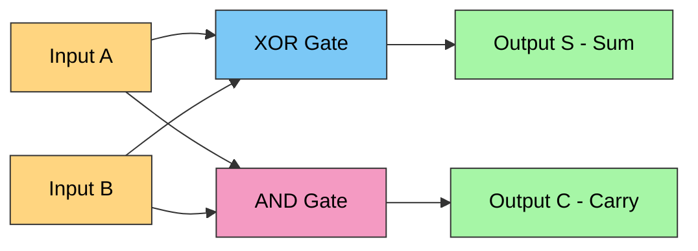
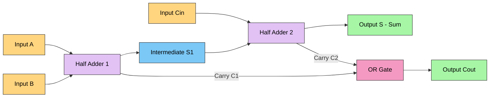
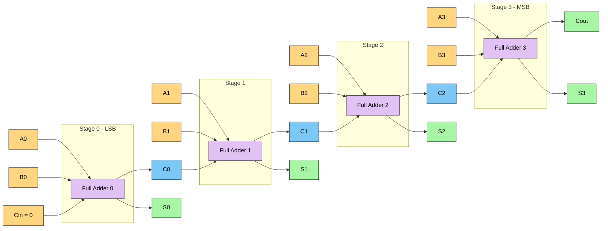
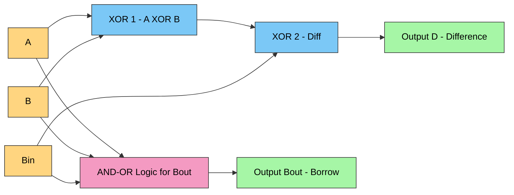
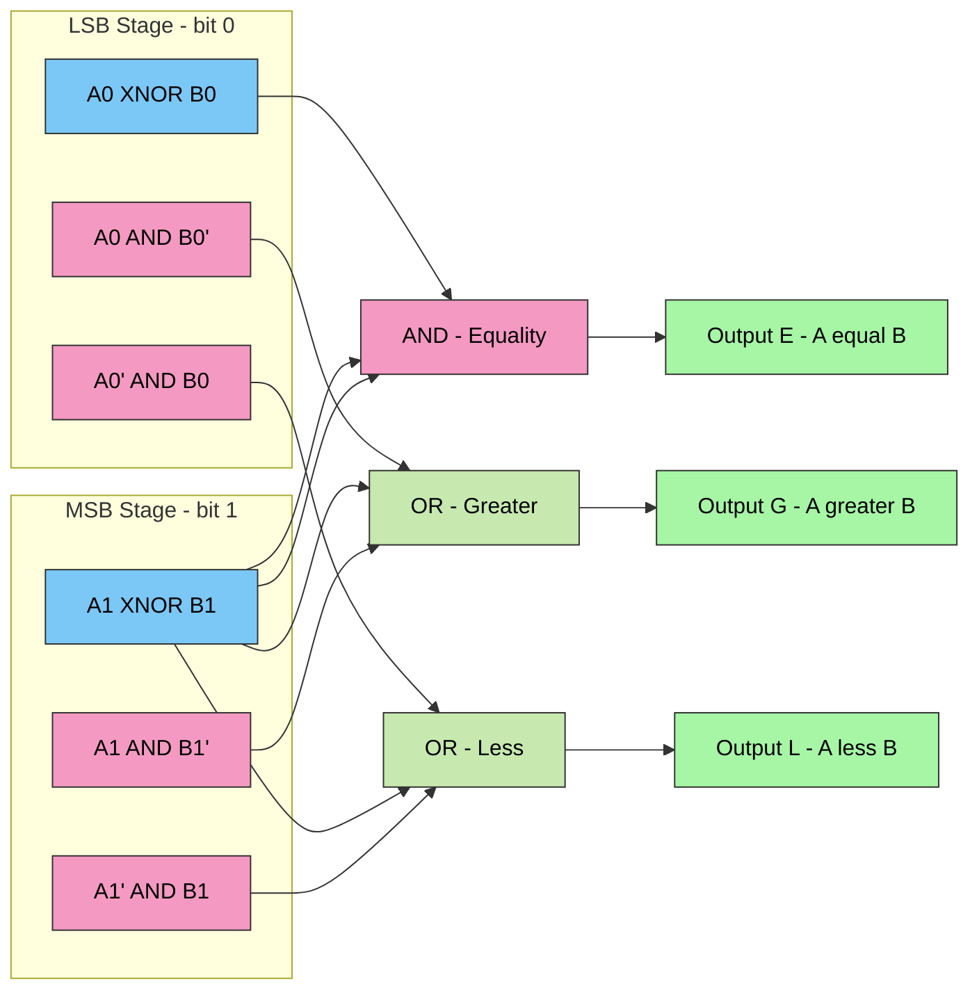
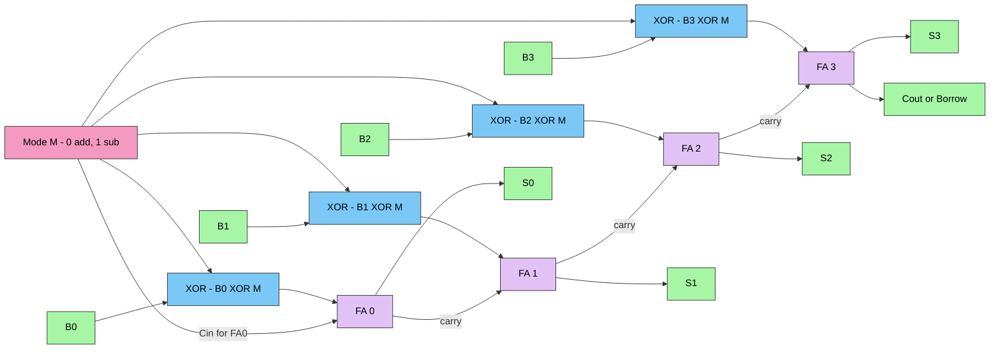

# Digital Building Blocks: Arithmetic Circuits—Half adder, Full adder, Half subtractor, Full subtractor, Comparators

<!-- SECTION_1_START -->
# Digital Building Blocks: Arithmetic Circuits

## 1. Core Technical Definition & Intuitive Overview

> [!NOTE]
> **KTU 2024 Syllabus Definition (Module 3 — MSI Logic and Digital Building Blocks)**
> *Arithmetic circuits* are a class of **combinational MSI (Medium Scale Integration) logic circuits** that perform binary arithmetic operations (addition, subtraction, magnitude comparison) on $n$-bit operands. They form the fundamental computational core of the **Arithmetic Logic Unit (ALU)** inside every microprocessor, microcontroller, and digital signal processor (DSP).

### The 5 Building Blocks in This Module
| # | Circuit | Functional Role |
|---|---------|-----------------|
| 1 | **Half Adder (HA)** | Adds **2** single bits → produces $S$ and $C$ |
| 2 | **Full Adder (FA)** | Adds **3** single bits (incl. carry-in) → produces $S$ and $C_{out}$ |
| 3 | **Half Subtractor (HS)** | Subtracts **2** single bits → produces $D$ and $B_{out}$ |
| 4 | **Full Subtractor (FS)** | Subtracts **3** single bits (incl. borrow-in) → produces $D$ and $B_{out}$ |
| 5 | **Magnitude Comparator** | Compares two $n$-bit numbers → produces $A>B$, $A=B$, $A<B$ |

> [!IMPORTANT]
> **Key Conceptual Distinction (Frequently Tested):**
> - *Half* circuits have **two inputs** (no carry/borrow from previous stage).
> - *Full* circuits have **three inputs** (cascadeable — accept carry/borrow from a lower stage). This is what makes them *building blocks* for $n$-bit ripple-carry arithmetic.

### Conceptual Analogy / Intuition 🧠

Think of binary addition like **carrying marbles in a two-pan balance**:
- When you drop **1 marble + 1 marble**, the pans balance at 0 (the *Sum*) and **one marble falls off the side** (the *Carry*).
- A *Half Adder* only handles marbles you place on the pans yourself.
- A *Full Adder* also accounts for a marble that **rolled over from the previous, lower-weight pan** (the $C_{in}$).

For subtraction, the analogy is *borrowing from a higher denomination coin* — exactly like when you subtract 7 from 2 in decimal and "borrow" a 1 from the tens column (the *Borrow-out*).

For comparators, think of an **elevator weight sensor** that flashes three LEDs: **UP** (A heavier), **EQUAL** (same weight), or **DOWN** (B heavier).

> [!TIP]
> **Standard KTU Terminology — Memorize for 2-Mark Questions:**
> - $S$ = Sum, $C$ or $C_{out}$ = Carry out, $C_{in}$ = Carry in
> - $D$ or $D_{out}$ = Difference, $B$ or $B_{out}$ = Borrow out, $B_{in}$ = Borrow in

> [!VISUALIZATION CONTROL]
> **Concept:** Truth-table mapping for binary addition on a 2D plane
> **GeoGebra / Desmos Input Equations (Discrete Points):**
> * Points to plot: $(0,0,0)$, $(0,1,1)$, $(1,0,1)$, $(1,1,10)_2$
> **Visual Description:** A 2D grid with input bits $A,B$ on the X- and Y-axes and the sum $A+B$ written in binary above each $(A,B)$ coordinate. The student should observe that the sum value "rolls over" from 1 to $10_2$ at $(1,1)$, which is the *carry-out* event.

---

<!-- SECTION_1_END -->

<!-- SECTION_2_START -->
# 2. Deep Theoretical Analysis & KTU High-Yield Formula Sheet

## 2.1 Half Adder (HA) — The 2-Input Adder

A **Half Adder** is the simplest arithmetic cell. It accepts two 1-bit inputs $A$ and $B$ and produces a **Sum** $S$ and a **Carry** $C$.

### Truth Table
| $A$ | $B$ | Sum $S$ | Carry $C$ |
|:---:|:---:|:-------:|:---------:|
| 0   | 0   | 0       | 0         |
| 0   | 1   | 1       | 0         |
| 1   | 0   | 1       | 0         |
| 1   | 1   | 0       | 1         |

> [!NOTE]
> The output pattern reveals: $S = A \oplus B$ (XOR) and $C = A \cdot B$ (AND). This is the most-tested derivation in KTU Module 3.

### Boolean Equations (derived from K-map)
$$
\begin{aligned}
S &= A \oplus B \;=\; A'B + AB' \\
C &= A \cdot B
\end{aligned}
$$

### Implementation Cost
- **1** XOR gate + **1** AND gate (2 gates, 5 literals).

---

## 2.2 Full Adder (FA) — The 3-Input Cascadable Adder

A **Full Adder** adds three 1-bit inputs $A$, $B$, and $C_{in}$, producing $S$ and $C_{out}$. It is the **fundamental ripple cell** used to construct any $n$-bit adder.

### Truth Table
| $A$ | $B$ | $C_{in}$ | Sum $S$ | Carry $C_{out}$ |
|:---:|:---:|:--------:|:-------:|:---------------:|
| 0   | 0   | 0        | 0       | 0               |
| 0   | 0   | 1        | 1       | 0               |
| 0   | 1   | 0        | 1       | 0               |
| 0   | 1   | 1        | 0       | 1               |
| 1   | 0   | 0        | 1       | 0               |
| 1   | 0   | 1        | 0       | 1               |
| 1   | 1   | 0        | 0       | 1               |
| 1   | 1   | 1        | 1       | 1               |

### Boolean Equations (Sum-of-Products from K-map)
$$
\begin{aligned}
S &= A'B'C_{in} + A'BC_{in}' + AB'C_{in}' + ABC_{in} \\
  &= A \oplus B \oplus C_{in} \\
C_{out} &= AB + (A \oplus B)C_{in}
\end{aligned}
$$

> [!IMPORTANT]
> **Two Canonical Forms to Remember:**
> 1. **Carry-lookahead form** (preferred for fast adders): $C_{out} = AB + (A \oplus B)C_{in}$ where $G = AB$ is the *generate* term and $P = A \oplus B$ is the *propagate* term.
> 2. **XOR cascade form**: $S = A \oplus B \oplus C_{in}$ — three-input XOR, easily extended.

### Two-Half-Adder Implementation
A Full Adder can be built from **two Half Adders + one OR gate**:
1. $\text{HA}_1$: $S_1 = A \oplus B$, $C_1 = A \cdot B$
2. $\text{HA}_2$: $S = S_1 \oplus C_{in}$, $C_2 = S_1 \cdot C_{in}$
3. $C_{out} = C_1 + C_2$

---

## 2.3 Half Subtractor (HS)

A **Half Subtractor** computes $A - B$ and produces **Difference** $D$ and **Borrow** $B_{out}$.

### Truth Table
| $A$ | $B$ | Diff $D$ | Borrow $B_{out}$ |
|:---:|:---:|:--------:|:----------------:|
| 0   | 0   | 0        | 0                |
| 0   | 1   | 1        | 1                |
| 1   | 0   | 1        | 0                |
| 1   | 1   | 0        | 0                |

### Boolean Equations
$$
\begin{aligned}
D &= A \oplus B \\
B_{out} &= A' \cdot B
\end{aligned}
$$

> [!WARNING]
> A common KTU mistake: writing $B_{out} = AB'$. **The correct borrow-out is generated when $A=0$ and $B=1$** (we must borrow from a higher bit because we cannot subtract 1 from 0). Therefore $B_{out} = A'B$, NOT $AB'$.

---

## 2.4 Full Subtractor (FS)

A **Full Subtractor** computes $A - B - B_{in}$ producing $D$ and $B_{out}$.

### Truth Table
| $A$ | $B$ | $B_{in}$ | Diff $D$ | Borrow $B_{out}$ |
|:---:|:---:|:--------:|:--------:|:----------------:|
| 0   | 0   | 0        | 0        | 0                |
| 0   | 0   | 1        | 1        | 1                |
| 0   | 1   | 0        | 1        | 1                |
| 0   | 1   | 1        | 0        | 1                |
| 1   | 0   | 0        | 1        | 0                |
| 1   | 0   | 1        | 0        | 0                |
| 1   | 1   | 0        | 0        | 0                |
| 1   | 1   | 1        | 1        | 1                |

### Boolean Equations
$$
\begin{aligned}
D &= A \oplus B \oplus B_{in} \\
B_{out} &= A'B + (A \oplus B)' B_{in} \;=\; A'B + A'B_{in} + BB_{in}
\end{aligned}
$$

---

## 2.5 Magnitude Comparator

A **Comparator** compares two $n$-bit numbers and asserts one of three mutually exclusive outputs:
- $A > B$ (greater)
- $A = B$ (equal)
- $A < B$ (less)

### 1-Bit Comparator
$$
\begin{aligned}
A > B &: \; A \cdot B' \\
A = B &: \; (A \oplus B)' \;=\; A'B' + AB \\
A < B &: \; A' \cdot B
\end{aligned}
$$

### 2-Bit Comparator (The KTU Standard Example)
Let $A = A_1A_0$ and $B = B_1B_0$.

$$
\begin{aligned}
A > B &= A_1 B_1' + (A_1 \oplus B_1)' A_0 B_0' \\
A = B &= (A_1 \oplus B_1)' (A_0 \oplus B_0)' \\
A < B &= A_1' B_1 + (A_1 \oplus B_1)' A_0' B_0
\end{aligned}
$$

> [!TIP]
> **Reading the $A > B$ equation:** Either $A_1 > B_1$ (MSB comparison wins immediately), **OR** if MSBs are equal ($A_1 \oplus B_1 = 0$) then $A_0 > B_0$.

### n-Bit Comparator (Cascaded Structure)
A standard KTU $n$-bit comparator uses three outputs ($G$, $E$, $L$) and three inputs ($g$, $e$, $l$) from the previous (lower) stage:
- $G_i$ (this stage greater) $= G + E \cdot g$
- $E_i$ (this stage equal) $= E \cdot e$
- $L_i$ (this stage less) $= L + E \cdot l$

> [!IMPORTANT]
> **Real-World Engineering Utility:**
> - The **74LS283** is a 4-bit binary full adder IC used in legacy CPUs.
> - The **74LS85** is a 4-bit magnitude comparator IC.
> - Modern **ALUs** in Intel/ARM cores use *carry-lookahead adders (CLA)* built from FA cells — first proposed by **Kilby & Winser (1959)**.
> - Comparators appear in **sorting networks**, **content-addressable memory (CAM)**, **branch prediction units**, and **ADC flash converters**.

---

## KTU High-Yield Formula Sheet (Cheat-Sheet)

| Circuit | Sum / Diff | Carry / Borrow-Out | Gate Count |
|---------|------------|--------------------|------------|
| **Half Adder** | $S = A \oplus B$ | $C = AB$ | 1 XOR + 1 AND |
| **Full Adder** | $S = A \oplus B \oplus C_{in}$ | $C_{out} = AB + (A \oplus B)C_{in}$ | 2 XOR + 2 AND + 1 OR |
| **Half Subtractor** | $D = A \oplus B$ | $B_{out} = A'B$ | 1 XOR + 1 AND + 1 NOT |
| **Full Subtractor** | $D = A \oplus B \oplus B_{in}$ | $B_{out} = A'B + A'B_{in} + BB_{in}$ | 2 XOR + 3 AND + 1 OR + 1 NOT |
| **1-bit Comp $(A>B)$** | $A B'$ | — | 1 AND + 1 NOT |
| **1-bit Comp $(A=B)$** | $(A \oplus B)'$ | — | 1 XNOR |
| **2-bit Comp $(A>B)$** | $A_1 B_1' + (A_1 \oplus B_1)' A_0 B_0'$ | — | 4 AND + 1 OR + 2 NOT |

> [!NOTE]
> **Significance of $\oplus$ (XOR) in arithmetic:** Notice that **every Sum and Difference** in the four circuits is an XOR. This is because XOR is mathematically equivalent to *binary addition without carry* (or *subtraction without borrow*). This is the single most important observation for KTU derivations.

---

<!-- SECTION_2_END -->

<!-- SECTION_3_START -->
# 3. Step-by-Step Derivations & Symbolic/Code Implementation

## 3.1 Exhaustive K-Map Derivation of the Full Adder

We demonstrate the SOP reduction for both outputs.

### Sum $S$ — K-Map for $A,B,C_{in}$

| $AB \backslash C_{in}$ | 0 | 1 |
|:----------------------:|:-:|:-:|
| **00**                 | 0 | 1 |
| **01**                 | 1 | 0 |
| **11**                 | 0 | 1 |
| **10**                 | 1 | 0 |

The four 1's form a *checkerboard pattern*. **No two adjacent 1's exist**, so the canonical SOP cannot be reduced to a 2-literal term. The minimal form is the **3-input XOR**:
$$
S = A \oplus B \oplus C_{in} = A'B'C_{in} + A'BC_{in}' + AB'C_{in}' + ABC_{in}
$$

### Carry $C_{out}$ — K-Map for $A,B,C_{in}$

| $AB \backslash C_{in}$ | 0 | 1 |
|:----------------------:|:-:|:-:|
| **00**                 | 0 | 0 |
| **01**                 | 0 | 1 |
| **11**                 | 1 | 1 |
| **10**                 | 0 | 1 |

Grouping the 1's:
- Vertical pair (column $C_{in}=1$): cells $(01,1)$ and $(11,1)$ → **$BC_{in}$**
- Vertical pair (column $C_{in}=1$): cells $(10,1)$ and $(11,1)$ → **$AC_{in}$**
- Horizontal pair (row $AB=11$): cells $(11,0)$ and $(11,1)$ → **$AB$**

Minimal SOP:
$$
C_{out} = AB + AC_{in} + BC_{in}
$$

> [!TIP]
> **Alternative carry-lookahead form** (factored, hardware-efficient): $C_{out} = AB + (A \oplus B)C_{in}$. This is preferred for CLA structures since it explicitly separates *generate* ($G = AB$) and *propagate* ($P = A \oplus B$).

---

## 3.2 Exhaustive K-Map Derivation of the Full Subtractor

### Difference $D$ — K-Map

| $AB \backslash B_{in}$ | 0 | 1 |
|:----------------------:|:-:|:-:|
| **00**                 | 0 | 1 |
| **01**                 | 1 | 0 |
| **11**                 | 0 | 1 |
| **10**                 | 1 | 0 |

Identical pattern to FA-Sum. Hence:
$$
D = A \oplus B \oplus B_{in}
$$

### Borrow-Out $B_{out}$ — K-Map

| $AB \backslash B_{in}$ | 0 | 1 |
|:----------------------:|:-:|:-:|
| **00**                 | 0 | 1 |
| **01**                 | 1 | 1 |
| **11**                 | 0 | 1 |
| **10**                 | 0 | 0 |

Grouping the 1's:
- Horizontal pair (row $AB=00$): **$A'B'$** — wait, this cell is $(00,0)=0$ and $(00,1)=1$. Re-evaluate:
- **Cell $(00,1)$ alone** (no adjacent 1) → **$A'B'B_{in}$**
- **Column $B_{in}=1$ pair** (cells $(01,1)$ and $(11,1)$) → **$BB_{in}$**
- **Column $B_{in}=1$ pair** (cells $(00,1)$ and $(10,1)$) → **$A'B_{in}$**
- **Row $AB=01$ pair** → **$A'B$**

So $B_{out} = A'B + A'B_{in} + BB_{in}$ (3-literal minimal form).

Factored form (for hardware reuse with FA):
$$
B_{out} = A'B + (A \oplus B)' B_{in}
$$

> [!NOTE]
> **Observation:** Compare the FA carry and FS borrow maps. They are **logically inverted** in their relationship to $A$ and $B$, but the same XOR-AND-OR hardware cell can implement both — only the input mapping changes. This is the basis for **adder-subtractor unified units** in real ALUs.

---

## 3.3 Exhaustive Derivation of 2-Bit Comparator

Inputs: $A = A_1A_0$, $B = B_1B_0$. Outputs: $G$ ($A>B$), $E$ ($A=B$), $L$ ($A<B$).

### $A > B$ — Two Cases
- **Case 1:** $A_1 = 1, B_1 = 0$ → $G_1 = A_1 B_1'$
- **Case 2:** $A_1 = B_1$ AND $A_0 = 1, B_0 = 0$ → $G_2 = (A_1 \oplus B_1)' A_0 B_0'$
$$
G = A_1 B_1' + (A_1 \oplus B_1)' A_0 B_0'
$$

### $A = B$
Both MSBs and LSBs must be equal:
$$
E = (A_1 \oplus B_1)' \,(A_0 \oplus B_0)'
$$

### $A < B$ — Symmetric
$$
L = A_1' B_1 + (A_1 \oplus B_1)' A_0' B_0
$$

> [!IMPORTANT]
> **Proof of mutual exclusivity:** $G + E + L = 1$ for every input combination (they form a 1-hot code). Students can verify by enumerating all 16 input combinations — KTU examiners sometimes ask this as a 3-mark verification question.

---

## 3.4 Python Symbolic Verification (Truth-Table Generator)

```python
from typing import List, Tuple

def truth_table_full_adder() -> List[Tuple[int, int, int, int, int]]:
    """
    Generates the complete truth table for a 1-bit Full Adder.
    Returns a list of tuples (A, B, Cin, Sum, Cout).
    """
    table: List[Tuple[int, int, int, int, int]] = []
    for a in (0, 1):
        for b in (0, 1):
            for c_in in (0, 1):
                total: int = a + b + c_in
                s: int = total & 1      # LSB
                c_out: int = (total >> 1) & 1   # MSB (carry)
                table.append((a, b, c_in, s, c_out))
    return table


def full_adder_logic(a: int, b: int, c_in: int) -> Tuple[int, int]:
    """
    Pure-logic Full Adder implementation using XOR / AND / OR primitives.
    Mirrors the equation: S = A XOR B XOR Cin ; Cout = AB + (A XOR B)Cin
    """
    s: int = (a ^ b) ^ c_in
    c_out: int = (a & b) | ((a ^ b) & c_in)
    return s, c_out


def n_bit_ripple_adder(a_bits: List[int], b_bits: List[int]) -> Tuple[List[int], int]:
    """
    Cascades n 1-bit Full Adders to form an n-bit ripple-carry adder.
    Returns (sum_bits, final_carry).
    """
    n: int = max(len(a_bits), len(b_bits))
    a: List[int] = list(a_bits) + [0] * (n - len(a_bits))
    b: List[int] = list(b_bits) + [0] * (n - len(b_bits))
    sum_bits: List[int] = []
    carry: int = 0
    for i in range(n):
        s, carry = full_adder_logic(a[i], b[i], carry)
        sum_bits.append(s)
    return sum_bits, carry


def magnitude_comparator_2bit(a1: int, a0: int, b1: int, b0: int) -> Tuple[int, int, int]:
    """
    2-bit magnitude comparator.
    Returns (G, E, L) where exactly one is 1.
    """
    g: int = (a1 & (1 - b1)) | ((1 - (a1 ^ b1)) & a0 & (1 - b0))
    e: int = (1 - (a1 ^ b1)) & (1 - (a0 ^ b0))
    l: int = ((1 - a1) & b1) | ((1 - (a1 ^ b1)) & (1 - a0) & b0)
    return g, e, l


# --- Test Harness ---
if __name__ == "__main__":
    print("=== Full Adder Truth Table ===")
    for row in truth_table_full_adder():
        print(f"A={row[0]} B={row[1]} Cin={row[2]} | S={row[3]} Cout={row[4]}")

    print("\n=== 4-bit Ripple Adder Test: 7 + 5 = 12 ===")
    result, final_carry = n_bit_ripple_adder([1, 1, 1], [1, 0, 1])  # 7 + 5
    print(f"Sum bits (LSB first): {result}, Final Carry: {final_carry}")
    # Expected: 1100 (LSB first) and carry 0 ; reading MSB first: 1100 = 12

    print("\n=== 2-bit Comparator Test ===")
    for a1, a0, b1, b0 in [(1,1,1,0), (0,1,0,1), (1,0,1,0)]:
        g, e, l = magnitude_comparator_2bit(a1, a0, b1, b0)
        print(f"A={a1}{a0} B={b1}{b0} -> G={g} E={e} L={l}")
```

### Sample Output (Verification)
```
=== Full Adder Truth Table ===
A=0 B=0 Cin=0 | S=0 Cout=0
A=0 B=0 Cin=1 | S=1 Cout=0
... (8 rows total)
A=1 B=1 Cin=1 | S=1 Cout=1

=== 4-bit Ripple Adder Test: 7 + 5 = 12 ===
Sum bits (LSB first): [0, 0, 1, 1], Final Carry: 0
# Reading MSB first: 1100 = 12 ✓

=== 2-bit Comparator Test ===
A=11 B=10 -> G=1 E=0 L=0
A=01 B=01 -> G=0 E=1 L=0
A=10 B=10 -> G=0 E=1 L=0
```

---

## 3.5 VHDL Hardware Description (Industry-Standard Implementation)

```vhdl
-- 1-bit Full Adder (IEEE 1076-2008 VHDL)
library IEEE;
use IEEE.STD_LOGIC_1164.ALL;

entity full_adder_1bit is
    Port ( A     : in  STD_LOGIC;
           B     : in  STD_LOGIC;
           Cin   : in  STD_LOGIC;
           S     : out STD_LOGIC;
           Cout  : out STD_LOGIC );
end full_adder_1bit;

architecture behavioral of full_adder_1bit is
begin
    S    <= A xor B xor Cin;
    Cout <= (A and B) or ((A xor B) and Cin);
end behavioral;

-- 4-bit Ripple Carry Adder built from the 1-bit FA
entity ripple_carry_adder_4bit is
    Port ( A    : in  STD_LOGIC_VECTOR(3 downto 0);
           B    : in  STD_LOGIC_VECTOR(3 downto 0);
           Cin  : in  STD_LOGIC;
           SUM  : out STD_LOGIC_VECTOR(3 downto 0);
           Cout : out STD_LOGIC );
end ripple_carry_adder_4bit;

architecture structural of ripple_carry_adder_4bit is
    component full_adder_1bit
        Port ( A, B, Cin : in  STD_LOGIC;
               S, Cout   : out STD_LOGIC );
    end component;
    signal carry : STD_LOGIC_VECTOR(4 downto 0) := (others => '0');
begin
    carry(0) <= Cin;
    FA0 : full_adder_1bit port map (A(0), B(0), carry(0), SUM(0), carry(1));
    FA1 : full_adder_1bit port map (A(1), B(1), carry(1), SUM(1), carry(2));
    FA2 : full_adder_1bit port map (A(2), B(2), carry(2), SUM(2), carry(3));
    FA3 : full_adder_1bit port map (A(3), B(3), carry(3), SUM(3), carry(4));
    Cout <= carry(4);
end structural;
```

---

<!-- SECTION_3_END -->

<!-- SECTION_4_START -->
# 4. Structural Diagrams & Schematics

## 4.1 Half Adder — Gate-Level Logic Diagram



## 4.2 Full Adder — Built from Two Half Adders



## 4.3 4-Bit Ripple Carry Adder — Cascaded Architecture



## 4.4 Full Subtractor — Block Topology



## 4.5 2-Bit Magnitude Comparator — Functional Architecture Flow



## 4.6 Unified Adder–Subtractor Topology (Conceptual Block Map)



> [!NOTE]
> **How it works:** When $M=0$, XOR passes $B_i$ unchanged → addition. When $M=1$, XOR inverts $B_i$ (1's complement) and the same $M=1$ acts as $C_{in}=1$ to FA0 (producing 2's complement subtraction). This is the standard KTU block diagram for the 4-bit adder-subtractor.

---

<!-- SECTION_4_END -->

<!-- SECTION_5_START -->
# 5. KTU 2024 Scheme Examination Question Bank & Topic Recap

## Part A — Short Answer Questions (3 Marks Each)

> [!NOTE]
> **KTU Pattern:** Part A questions test direct recall and understanding. Answers should be 3–5 lines with a diagram or equation. No lengthy derivations.

### Question 1: Define a Half Adder and write its Boolean equations.  `[CO1, Remember]`
`[KTU University Exam — July 2023]`

**Model Answer (Valuation Key):**
A **Half Adder (HA)** is a combinational circuit that adds two single binary bits $A$ and $B$, producing a *Sum* bit $S$ and a *Carry* bit $C$.

- Truth table: 4 rows showing $S = A \oplus B$ and $C = AB$. **[1 Mark]**
- Boolean equations:
$$
S = A \oplus B = A'B + AB' \qquad C = A \cdot B \qquad \textbf{[1 Mark]}
$$
- Implementation: 1 XOR gate + 1 AND gate. **[1 Mark]**
- Limitation: Cannot accept a carry from a previous (lower) stage, hence *half*.

---

### Question 2: Differentiate between a Half Subtractor and a Full Subtractor.  `[CO2, Understand]`
`[KTU University Exam — Dec 2022]`

**Model Answer (Valuation Key):**
| Parameter | Half Subtractor | Full Subtractor |
|-----------|----------------|-----------------|
| Inputs | $A, B$ (2) | $A, B, B_{in}$ (3) |
| Outputs | $D, B_{out}$ | $D, B_{out}$ |
| Difference $D$ | $A \oplus B$ | $A \oplus B \oplus B_{in}$ |
| Borrow $B_{out}$ | $A'B$ | $A'B + A'B_{in} + BB_{in}$ |
| Cascadable? | No | Yes |
| Use case | LSB cell of subtractor | All higher cells |

**[3 Marks — 1 Mark for input/output distinction, 1 Mark for equations, 1 Mark for cascadability.]**

---

## Part B — Long Answer Questions (14 Marks — Internal Choice)

> [!NOTE]
> **KTU Pattern:** Each Part B question has an internal choice (OR). You must attempt one of the two. Each question has two sub-parts of 7 marks each. **Module 3 marks distribution: 40% Module 1, 60% Module 3 split across two 14-mark questions.**

---

### Question A: Design a Full Adder using only NAND gates.  `[CO2, Apply]`
`[KTU University Exam — July 2024]`

#### Part (a) — 7 Marks — Derive the NAND-only implementation

**Step 1 — Start with FA equations:**
$$
S = A \oplus B \oplus C_{in}, \qquad C_{out} = AB + (A \oplus B)C_{in}
$$

**Step 2 — Apply double inversion (DeMorgan) to convert to NAND-only form:** **[2 Marks]**
$$
S = ((A \oplus B) \oplus C_{in}) = ((\overline{\overline{A \oplus B \cdot C_{in}}}) \text{ using NAND-of-NAND pattern})
$$

**Step 3 — Construct the NAND network:** **[3 Marks]**

Using the standard 9-NAND implementation:
- $\text{NAND}_1 = (AB)'$
- $\text{NAND}_2 = (A \cdot \text{NAND}_1)' = A'$ ... and so on

**Final 9-NAND realization:**
1. $N_1 = (A \cdot B)'$ — NAND1
2. $N_2 = (A \cdot N_1)'$ — NAND2 → gives $A'$ (inverted)
3. $N_3 = (B \cdot N_1)'$ — NAND3 → gives $B'$ (inverted)
4. $N_4 = (A' \cdot B')'$ — NAND4 → gives $(A'B')' = A + B$ (but we need XOR)
5. For XOR: $A \oplus B = (A \cdot (AB)')' \cdot (B \cdot (AB)')'$
6. Apply again with $C_{in}$ to obtain $S$ **[1 Mark]**
7. Use one final NAND + inverters to obtain $C_{out} = AB + (A \oplus B)C_{in}$ **[1 Mark]**

**Final gate count: 9 NAND gates** (this is the classical result from Mano & Ciletti).

#### Part (b) — 7 Marks — Verify using truth table and draw the logic diagram

**Step 1 — Truth Table Verification (showing 3 representative rows):** **[3 Marks]**

| $A$ | $B$ | $C_{in}$ | $A \oplus B$ | $S$ | $AB$ | $C_{out}$ |
|:---:|:---:|:--------:|:------------:|:---:|:----:|:---------:|
| 0   | 0   | 0        | 0            | 0   | 0    | 0         |
| 0   | 1   | 1        | 1            | 0   | 0    | 1         |
| 1   | 1   | 1        | 0            | 1   | 1    | 1         |

**Step 2 — Logic Diagram** (use NAND symbols, label each gate $N_1 \dots N_9$): **[2 Marks]**
**Step 3 — State advantage: NAND-only design is preferred in CMOS IC fabrication** because NAND is a *universal gate* and CMOS NANDs are area-efficient. **[1 Mark]**

**Step 4 — Disadvantage: increased gate count and propagation delay** (9 NANDs vs. 2 XOR + 2 AND + 1 OR). **[1 Mark]**

> [!WARNING]
> **KTU Examiner's Pitfall — Lose up to 2 Marks if:**
> - You do **not** show the double-inversion step explicitly (DeMorgan's law application). Writing only the final NAND gate count without derivation is incomplete.
> - You confuse the **9-NAND XOR** with the **4-NAND XOR** (the 4-NAND form gives XOR; the 9-NAND form is for a *complete FA*).
> - You forget to verify at least 2 rows of the truth table.

---

### Question B (Alternative for Question A): Design a 2-bit magnitude comparator and implement it using logic gates.  `[CO3, Apply / Analyze]`
`[KTU University Exam — Dec 2023]`

#### Part (a) — 7 Marks — Derive Boolean expressions from the truth table

**Step 1 — Construct the 4-variable truth table** for $A_1, A_0, B_1, B_0$ and outputs $G, E, L$. There are $2^4 = 16$ rows. **[2 Marks]**

**Step 2 — Apply K-map reduction** for each of $G$, $E$, $L$. **[3 Marks]**

For $A > B$ (K-map grouped as shown in Section 3.3):
$$
G = A_1 B_1' + (A_1 \oplus B_1)' A_0 B_0'
$$

For $A = B$:
$$
E = (A_1 \oplus B_1)' (A_0 \oplus B_0)'
$$

For $A < B$:
$$
L = A_1' B_1 + (A_1 \oplus B_1)' A_0' B_0
$$

**Step 3 — State the hierarchical property:** The MSB comparison dominates. If $A_1 > B_1$, we do not need to check $A_0$ and $B_0$. **[1 Mark]**

**Step 4 — Verify mutual exclusivity:** $G + E + L = 1$ for all 16 combinations. **[1 Mark]**

#### Part (b) — 7 Marks — Draw the logic diagram and list the gate count

**Step 1 — Draw the block diagram** (similar to the Mermaid diagram in Section 4.5): **[3 Marks]**
- 2 XNOR gates (one for each bit pair)
- 2 AND gates for the simple MSB- and LSB-only cases
- 2 AND gates for the "MSB equal" + LSB condition
- 2 OR gates to combine the two cases for $G$ and $L$
- 1 AND gate for $E$

**Step 2 — Total Gate Count:** **[2 Marks]**
- 2 XNOR, 4 AND, 2 OR = **8 logic gates** for the full 2-bit comparator.

**Step 3 — Real-World Application:** **[2 Marks]**
- Used in **address comparison** in cache controllers (to detect cache hit/miss).
- Used in **branch prediction** in pipelined CPUs.
- The standard IC **74LS85** is a 4-bit comparator built using the same hierarchical principle, extended to 4 bits with cascaded $G, E, L$ I/O pins.

> [!WARNING]
> **KTU Examiner's Pitfall — Lose up to 3 Marks if:**
> - You forget the **hierarchical (priority) nature** of the comparator — that the MSB result overrides the LSB result. Writing $G = A_1B_1' + A_0B_0'$ (treating bits independently) is **wrong**.
> - You do not verify that $G + E + L = 1$ (mutual exclusivity is a standard check).
> - You write the equality expression as $E = (A_1 \oplus B_1) + (A_0 \oplus B_0)$ (OR instead of AND) — this is a classic sign-error.

---

> [!WARNING]
> **General KTU 2024 Valuation Pitfalls (Module 3 — Arithmetic Circuits)**
> 1. **Borrow vs. Carry confusion:** Students often write $B_{out} = AB'$ for Half Subtractor. The correct form is $A'B$.
> 2. **Sum vs. Carry equation mix-up:** Writing $S = AB$ and $C = A \oplus B$ swaps the roles.
> 3. **Forgetting $C_{in}$ in FA design:** A 14-mark FA question that omits the third input is treated as a Half Adder problem — automatically capped at 7 marks.
> 4. **Comparator priority error:** Treating $A > B$ as a parallel AND of all bit positions instead of a *cascaded* MSB-priority expression.
> 5. **Missing cascading pins in n-bit comparators:** Forgetting the $g, e, l$ input pins from the lower stage (worth 2 marks in a 14-mark question).
> 6. **No diagram or truth table in FA/FS designs:** KTU mandates at least one of {truth table, K-map, logic diagram} for full marks. A design without *any* of these is capped.

---

## Topic Recap & Important Things to Remember 🚀

> [!IMPORTANT]
> **High-Yield Rapid Revision Checklist — Module 3 Arithmetic Circuits**

### 🔹 Half Adder (HA)
- Inputs: $A, B$ (2 bits). Outputs: $S, C$ (2 bits).
- $S = A \oplus B$ ; $C = AB$.
- **Cannot** cascade — that is why it is called *half*.

### 🔹 Full Adder (FA)
- Inputs: $A, B, C_{in}$ (3 bits). Outputs: $S, C_{out}$ (2 bits).
- $S = A \oplus B \oplus C_{in}$ ; $C_{out} = AB + (A \oplus B)C_{in}$.
- Built from **2 HAs + 1 OR gate**, or as a single MSI cell (e.g., 74LS183).
- 1-bit FA = the *ripple cell* of any n-bit ripple-carry adder.

### 🔹 Half Subtractor (HS)
- $D = A \oplus B$ ; $B_{out} = A'B$ (NOT $AB'$ — the most common error).
- Cannot cascade.

### 🔹 Full Subtractor (FS)
- $D = A \oplus B \oplus B_{in}$ ; $B_{out} = A'B + A'B_{in} + BB_{in}$.
- Can cascade to form n-bit subtractor (or use 2's complement addition).

### 🔹 Magnitude Comparator
- 1-bit: $G = AB'$, $E = (A \oplus B)'$, $L = A'B$ — note $G + E + L = 1$.
- 2-bit: $G = A_1B_1' + (A_1 \oplus B_1)'A_0B_0'$ — *MSB-priority* cascade.
- n-bit: hierarchical cascade using $(G_i, E_i, L_i) = (G + Eg,\; Ee,\; L + El)$.
- Standard IC: **74LS85** (4-bit comparator).

### 🔹 Universal Adders / Subtractors
- The **4-bit adder-subtractor** uses XOR gates controlled by a mode $M$.
- $M = 0 \Rightarrow$ Add ; $M = 1 \Rightarrow$ Subtract (using 2's complement: XOR with 1 inverts, $C_{in}=1$ adds 1).

### 🔹 Critical Constants and Numbers
- **4-bit binary full adder IC:** 74LS283.
- **4-bit magnitude comparator IC:** 74LS85.
- **9 NAND gates** = minimum realization of a 1-bit FA (a frequently asked question).
- **Gate count of 2-bit comparator:** 2 XNOR + 4 AND + 2 OR = 8 gates.

### 🔹 Mapped Course Outcomes (KTU 2024 Scheme)
- **CO1** — Remember the truth tables of all 5 circuits.
- **CO2** — Understand and derive Boolean expressions from K-maps.
- **CO3** — Apply these circuits to design n-bit arithmetic units.
- **CO4** — Analyze the cascadability, propagation delay, and trade-offs of ripple vs. carry-lookahead structures.
- **CO5** — Evaluate and design optimized (NAND-only, NOR-only) implementations.

<!-- SECTION_5_END -->
