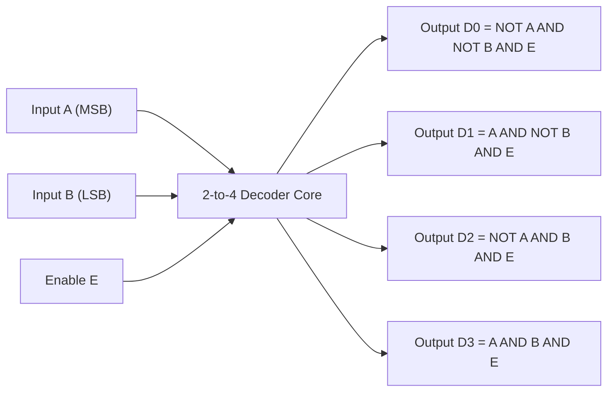
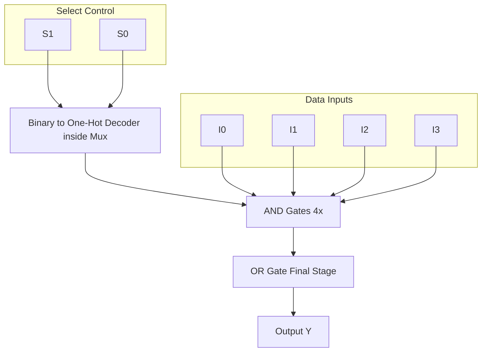
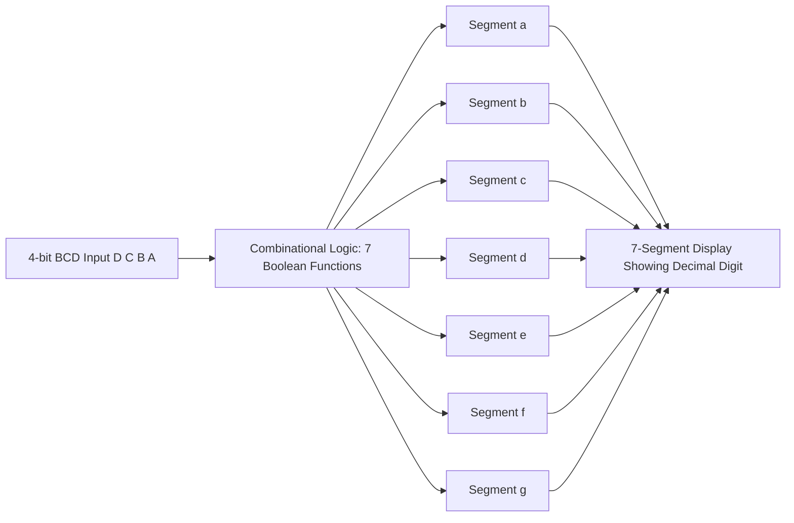
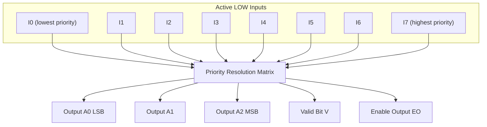
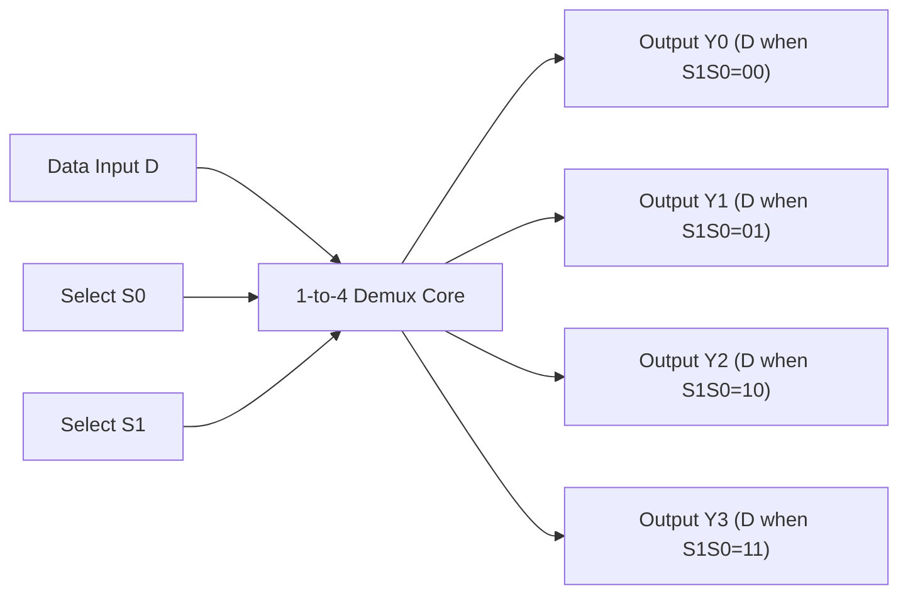

# MSI Logic: Decoders (One-Hot decoder, 7-segment display decoder), Encoders, Multiplexers (Mux), Demultiplexers (Demux)

<!-- SECTION_1_START -->
# MSI Logic Components: Decoders, Encoders, Multiplexers & Demultiplexers

## 1. Decoder

### Formal Definition (KTU 2024 Syllabus Terminology)
A **Decoder** is a combinational MSI (Medium Scale Integration) circuit that converts binary information from $n$ input lines to a maximum of $2^n$ unique output lines. It performs the inverse operation of an encoder. For each specific input combination, exactly **one** output line is activated (asserted HIGH in an *active-HIGH* decoder, or asserted LOW in an *active-LOW* decoder), while all remaining outputs stay in their inactive state.

> [!IMPORTANT]
> **KTU High-Yield Note:** In an **$n$-to-$2^n$ line decoder**, the outputs represent the **minterms** of the $n$ input variables. Output $D_i = 1$ (or $0$ in active-LOW) when the input binary code equals $i$.

### Conceptual Analogy / Intuition
Imagine a **10-floor building with a single elevator panel containing 4 binary switches** (since $2^4 = 16 > 10$). Setting the switches to the binary code of a floor number causes **only that floor's indicator bulb** to glow. The decoder is essentially the "binary-to-one-hot" translator. A *2-to-4 decoder* is like a postal sorting machine with 4 bins — based on the 2-bit zip code, exactly one bin opens.

> [!NOTE]
> **Enable Input ($E$):** Almost all KTU-specified decoders (e.g., 74LS138, 74LS139) include one or more *enable inputs*. The decoder is functional **only when enable conditions are satisfied**. This feature is heavily tested in KTU problems involving **cascading** decoders to build larger decoders.

---

## 2. Encoder

### Formal Definition
An **Encoder** is a combinational MSI circuit that performs the reverse of decoding. It has $2^n$ input lines and $n$ output lines. The output is the binary code corresponding to the **activated input line**. The *8-to-3 priority encoder* (e.g., 74LS148) handles the case when multiple inputs are HIGH simultaneously by giving priority to the **highest-order** input.

### Conceptual Analogy / Intuition
Think of a **hotel concierge's emergency button panel** where 8 rooms have a "Call" button. When a guest presses a button, the concierge's display shows a 3-digit room number. If two guests press simultaneously, the concierge attends to the higher-numbered room first (this is *priority encoding*).

> [!NOTE]
> **Priority Encoder** is the most frequently tested variant in KTU. It always produces a valid output corresponding to the **highest-priority active input**, even when multiple inputs are asserted.

---

## 3. Multiplexer (Mux / Data Selector)

### Formal Definition
A **Multiplexer** is a combinational MSI circuit that selects **one of $2^n$ data inputs** and routes it to a **single output line**, based on the value of an $n$-bit *select line* (often called the *address*). It acts as a digitally controlled rotary switch.

### Conceptual Analogy / Intuition
Picture a **TV remote with 4 input buttons** (HDMI1, HDMI2, HDMI3, AV). Each button selects a different source, but only **one program reaches the screen** at a time. The select line ($S_1, S_0$) acts as the button; the data inputs ($I_0, I_1, I_2, I_3$) are the 4 HDMI sources, and $Y$ is the screen. A *4-to-1 Mux* has 2 select lines; an *8-to-1 Mux* has 3 select lines.

> [!IMPORTANT]
> **Application in KTU Exams:** Any Boolean function of $n$ variables can be implemented using a single **$2^n$-to-1 Mux** without any additional gates. This is one of the most common 14-mark problems.

---

## 4. Demultiplexer (Demux / Data Distributor)

### Formal Definition
A **Demultiplexer** performs the inverse of a multiplexer. It takes a **single data input** and routes it to **one of $2^n$ output lines**, determined by the $n$-bit select line. The other outputs remain inactive.

### Conceptual Analogy / Intuition
A Demux is like a **single mail carrier delivering letters to one of 8 P.O. Boxes** based on a 3-bit address code stamped on the envelope. Only the addressed box receives the letter. Demuxes are widely used in **time-division multiplexing** and **memory address decoding** in KTU microprocessor applications.

> [!NOTE]
> A decoder with an **enable input** can function as a **demultiplexer** by feeding the data line into the enable pin. This duality is a favorite KTU question.

---

## 5. 7-Segment Display Decoder

### Formal Definition
The **BCD-to-7-Segment Decoder** (e.g., 74LS47, 74LS48) is a special MSI decoder that converts a **4-bit BCD input (0000 to 1001)** into 7 output lines that drive a 7-segment LED/LCD display to show the decimal digits **0–9**.

> [!VISUALIZATION CONTROL]
> **Concept:** Segment labeling of a 7-segment display
> **Layout Description:** Visualize a "figure-8" pattern with 7 line segments labeled **a** (top horizontal), **b** (top-right vertical), **c** (bottom-right vertical), **d** (bottom horizontal), **e** (bottom-left vertical), **f** (top-left vertical), and **g** (middle horizontal). When displaying digit "0", segments $a, b, c, d, e, f$ glow while $g$ remains OFF.

<!-- SECTION_1_END -->

<!-- SECTION_2_START -->
# Deep Theoretical Analysis & KTU High-Yield Formula Sheet

## 2.1 Decoder Operational Analysis

### Working Logic (Step-by-Step)

Consider a **2-to-4 Line Decoder with Enable** (Active-HIGH outputs):

- **Step 1:** Inputs $A, B$ are applied (where $A$ is MSB).
- **Step 2:** Enable pin $E$ is checked. If $E = 1$, the decoder is active.
- **Step 3:** For each input combination, the corresponding minterm is generated.
- **Step 4:** Output equations:

$$
\begin{aligned}
D_0 &= \overline{A} \cdot \overline{B} \cdot E \\
D_1 &= A \cdot \overline{B} \cdot E \\
D_2 &= \overline{A} \cdot B \cdot E \\
D_3 &= A \cdot B \cdot E
\end{aligned}
$$

> [!TIP]
> These four products are precisely the **minterms** $m_0, m_1, m_2, m_3$ of variables $A, B$ (when $E=1$). This is why **any SOP Boolean function can be implemented using a decoder + OR gate** — a classic KTU 14-mark problem.

### 3-to-8 Decoder (74LS138) — The Industry Standard
The 74LS138 has **3 inputs** ($A_2, A_1, A_0$), **8 active-LOW outputs** ($\overline{Y_0}$ to $\overline{Y_7}$), and **3 enable inputs**: one *active-HIGH* ($E_1$) and two *active-LOW* ($\overline{E_2}, \overline{E_3}$). The chip is enabled only when $E_1 = 1$, $\overline{E_2} = 0$, and $\overline{E_3} = 0$.

### Cascading Decoders
To build a **4-to-16 decoder** using two 3-to-8 decoders:
- Use the **MSB** of the 4-bit input as the enable selector.
- Tie $E_1$ of the first decoder to MSB; tie $E_1$ of the second decoder to $\overline{\text{MSB}}$.
- Connect the **3 LSBs** to both decoders' input pins.
- When MSB = 0, lower decoder outputs $Y_0$ to $Y_7$ are active; when MSB = 1, upper decoder outputs $Y_8$ to $Y_{15}$ are active.

---

## 2.2 Encoder Operational Analysis

For an **8-to-3 Priority Encoder** (74LS148), with active-LOW inputs and outputs:
- The output is the **binary complement** of the highest-priority active input index.
- A **valid output indicator** ($V$) and an **enable output** ($\overline{EO}$) are provided for cascading.

> [!IMPORTANT]
> **Cascading 74LS148:** For a 16-to-4 priority encoder, the $\overline{EO}$ of the lower-priority chip is connected to $\overline{EI}$ of the higher-priority chip. This is a KTU-favorite design problem.

---

## 2.3 Multiplexer Operational Analysis

For a **4-to-1 Mux**, the output equation is:

$$
Y = \overline{S_1} \cdot \overline{S_0} \cdot I_0 + \overline{S_1} \cdot S_0 \cdot I_1 + S_1 \cdot \overline{S_0} \cdot I_2 + S_1 \cdot S_0 \cdot I_3
$$

This can be compactly written as:

$$
Y = \sum_{i=0}^{3} m_i \cdot I_i
$$

where $m_i$ are the minterms of the select lines.

### Implementing a Boolean Function Using a Mux
**Theorem (KTU Module-3):** Any Boolean function $F(A, B, C, ..., n \text{ variables})$ can be implemented using a single $2^n$-to-1 Mux by:
- Using the **first $(n-1)$ variables as select lines**.
- Routing the **last variable** (or its complement) as the data input based on the **implementation table**.

---

## 2.4 Demultiplexer Operational Analysis

For a **1-to-4 Demux**, the output equations are:

$$
\begin{aligned}
Y_0 &= D \cdot \overline{S_1} \cdot \overline{S_0} \\
Y_1 &= D \cdot \overline{S_1} \cdot S_0 \\
Y_2 &= D \cdot S_1 \cdot \overline{S_0} \\
Y_3 &= D \cdot S_1 \cdot S_0
\end{aligned}
$$

> [!TIP]
> A **1-to-8 Demux** can be built from a **3-to-8 decoder** by feeding the data input $D$ into the active-LOW enable pin $\overline{E_2}$, while keeping $E_1 = 1$ and $\overline{E_3} = 0$.

---

## 2.5 KTU Formula Sheet / Cheat Sheet

| Component | Inputs | Outputs / Lines | Key Equation / Behaviour | Real-World Use |
|---|---|---|---|---|
| $n$-to-$2^n$ Decoder | $n$ binary inputs | $2^n$ one-hot outputs | $D_i = m_i \cdot E$ | Memory chip-select, instruction decoding |
| $2^n$-to-$n$ Encoder | $2^n$ input lines | $n$-bit binary code | $A_j = \sum(\text{active input } i \text{ with bit } j = 1)$ | Keyboard encoding, interrupt handling |
| $2^n$-to-1 Mux | $2^n$ data + $n$ select | 1 output | $Y = \sum_{i=0}^{2^n-1} m_i \cdot I_i$ | Data routing, ALU operand selection, function generator |
| 1-to-$2^n$ Demux | 1 data + $n$ select | $2^n$ outputs | $Y_i = D \cdot m_i$ | Data distribution, time-division demux, display driving |
| BCD-to-7-Seg Decoder | 4-bit BCD | 7 segment lines | Truth table for 0–9 | Digital clocks, calculators, meters |

---

## 2.6 Real-World Engineering Utility

- **Microprocessors:** The Mux is the heart of the **ALU's operand selection**; the Demux drives the **register-select bus**; the decoder activates the correct **memory chip** based on address lines.
- **Communication:** Time-Division Multiplexing (TDM) uses Mux at the transmitter and Demux at the receiver.
- **Embedded Displays:** 7-segment decoders drive all numeric displays in microwave ovens, washing machines, and digital weighing scales.
- **Industrial Control:** Encoders translate the position of a **rotary shaft** (quadrature encoders) into binary codes for CNC machines.

<!-- SECTION_2_END -->

<!-- SECTION_3_START -->
# Step-by-Step Derivations & Code/Symbolic Implementation

## 3.1 Worked Example: Implement Full Adder Using 3-to-8 Decoder

**Problem (KTU Model):** Design a **Full Adder** using a 3-to-8 line decoder (active-LOW outputs) and external NAND gates.

**Solution:**

The full adder has inputs $A, B, C_{in}$ and outputs $S$ (sum) and $C_{out}$ (carry).

**Step 1:** Write the truth table and identify minterms.

| $A$ | $B$ | $C_{in}$ | $S$ | $C_{out}$ |
|---|---|---|---|---|
| 0 | 0 | 0 | 0 | 0 |
| 0 | 0 | 1 | 1 | 0 |
| 0 | 1 | 0 | 1 | 0 |
| 0 | 1 | 1 | 0 | 1 |
| 1 | 0 | 0 | 1 | 0 |
| 1 | 0 | 1 | 0 | 1 |
| 1 | 1 | 0 | 0 | 1 |
| 1 | 1 | 1 | 1 | 1 |

**Step 2:** Identify minterms.
- $S = \sum m(1, 2, 4, 7)$
- $C_{out} = \sum m(3, 5, 6, 7)$

**Step 3:** Since outputs are **active-LOW** (i.e., $\overline{Y_i} = \overline{m_i}$), we apply **DeMorgan's Law** using a **NAND gate**:

$$
S = \overline{\overline{m_1} \cdot \overline{m_2} \cdot \overline{m_4} \cdot \overline{m_7}} = \overline{\overline{Y_1} \cdot \overline{Y_2} \cdot \overline{Y_4} \cdot \overline{Y_7}}
$$

$$
C_{out} = \overline{\overline{m_3} \cdot \overline{m_5} \cdot \overline{m_6} \cdot \overline{m_7}} = \overline{\overline{Y_3} \cdot \overline{Y_5} \cdot \overline{Y_6} \cdot \overline{Y_7}}
$$

**Step 4:** Connect decoder outputs $Y_1, Y_2, Y_4, Y_7$ to a **4-input NAND gate** to obtain $S$. Connect $Y_3, Y_5, Y_6, Y_7$ to another **4-input NAND gate** to obtain $C_{out}$.

> [!IMPORTANT]
> **Valuation Tip (1 mark):** Always state the polarity of decoder outputs. Using a decoder with active-HIGH outputs would require a 4-input OR gate, not NAND.

---

## 3.2 Worked Example: Implement $F(A,B,C) = \sum m(1, 3, 5, 6)$ Using 8-to-1 Mux

**Step 1:** Since we have 3 variables, use an **8-to-1 Mux** with $A, B, C$ as select lines ($S_2 = A, S_1 = B, S_0 = C$).

**Step 2:** Tie each data input $I_i$ to the **value of $F$** for the $i^{th}$ minterm.
- $I_0 = F(0,0,0) = 0$
- $I_1 = F(0,0,1) = 1$
- $I_2 = F(0,1,0) = 0$
- $I_3 = F(0,1,1) = 1$
- $I_4 = F(1,0,0) = 0$
- $I_5 = F(1,0,1) = 1$
- $I_6 = F(1,1,0) = 1$
- $I_7 = F(1,1,1) = 0$

**Step 3:** Connect $I_1, I_3, I_5, I_6$ to VCC (logic 1) and the rest to GND (logic 0). Output $Y = F$.

---

## 3.3 Worked Example: Implement $F(A,B,C,D) = \sum m(0, 1, 4, 8, 10, 14, 15)$ Using 8-to-1 Mux

**Step 1:** Choose the **first 3 variables** $A, B, C$ as select lines. Variable $D$ is the "remaining" variable.

**Step 2:** Build the **Implementation Table**:

| $ABC$ | Minterms under this $ABC$ | $D=0$ part | $D=1$ part | $I_i$ (Data Input) |
|---|---|---|---|---|
| 000 | $m_0, m_1$ | 1 ($m_0$) | 1 ($m_1$) | 1 |
| 001 | $m_2, m_3$ | 0 | 0 | 0 |
| 010 | $m_4, m_5$ | 1 ($m_4$) | 0 | $\overline{D}$ |
| 011 | $m_6, m_7$ | 0 | 0 | 0 |
| 100 | $m_8, m_9$ | 1 ($m_8$) | 0 | $\overline{D}$ |
| 101 | $m_{10}, m_{11}$ | 1 ($m_{10}$) | 0 | $\overline{D}$ |
| 110 | $m_{12}, m_{13}$ | 0 | 0 | 0 |
| 111 | $m_{14}, m_{15}$ | 1 ($m_{14}$) | 1 ($m_{15}$) | 1 |

**Step 3:** Read off the data inputs:
- $I_0 = 1$, $I_1 = 0$, $I_2 = \overline{D}$, $I_3 = 0$, $I_4 = \overline{D}$, $I_5 = \overline{D}$, $I_6 = 0$, $I_7 = 1$.

**Step 4:** Wire $I_0$ and $I_7$ to VCC; $I_1, I_3, I_6$ to GND; $I_2, I_4, I_5$ to $\overline{D}$ (use an inverter on $D$).

---

## 3.4 Python Implementation: Simulating a 4-to-1 Mux

```python
from typing import List, Tuple

class Mux4to1:
    """
    Hardware-faithful simulation of a 4-to-1 Multiplexer.
    Includes strict input validation and detailed operation logging.
    """
    def __init__(self) -> None:
        self._data_inputs: List[int] = [0, 0, 0, 0]
        self._select_lines: Tuple[int, int] = (0, 0)
        self._enable: int = 1

    def set_inputs(self, i0: int, i1: int, i2: int, i3: int) -> None:
        for value, name in zip([i0, i1, i2, i3], ["I0", "I1", "I2", "I3"]):
            if value not in (0, 1):
                raise ValueError(f"[ERROR] {name} must be a binary digit (0 or 1). Got: {value}")
        self._data_inputs = [i0, i1, i2, i3]

    def set_select(self, s1: int, s0: int) -> None:
        if s1 not in (0, 1) or s0 not in (0, 1):
            raise ValueError(f"[ERROR] Select lines must be binary. Got: S1={s1}, S0={s0}")
        self._select_lines = (s1, s0)

    def set_enable(self, e: int) -> None:
        if e not in (0, 1):
            raise ValueError(f"[ERROR] Enable must be 0 or 1. Got: {e}")
        self._enable = e

    def get_output(self) -> int:
        if self._enable == 0:
            return 0  # Active-HIGH enable: 0 disables the Mux
        s1, s0 = self._select_lines
        index = (s1 << 1) | s0
        selected = self._data_inputs[index]
        print(f"[LOG] Select=(S1={s1}, S0={s0}) -> Index={index} -> Output Y = I{index} = {selected}")
        return selected


if __name__ == "__main__":
    mux = Mux4to1()
    mux.set_inputs(i0=0, i1=1, i2=0, i3=1)
    print("\n--- Test Sequence ---")
    for s1 in (0, 1):
        for s0 in (0, 1):
            mux.set_select(s1=s1, s0=s0)
            mux.get_output()
```

**Output Verification:**
```
--- Test Sequence ---
[LOG] Select=(S1=0, S0=0) -> Index=0 -> Output Y = I0 = 0
[LOG] Select=(S1=0, S0=1) -> Index=1 -> Output Y = I1 = 1
[LOG] Select=(S1=1, S0=0) -> Index=2 -> Output Y = I2 = 0
[LOG] Select=(S1=1, S0=1) -> Index=3 -> Output Y = I3 = 1
```

---

## 3.5 7-Segment Decoder (BCD to Common-Cathode) — Truth Table

| BCD Input (D C B A) | a | b | c | d | e | f | g | Displayed Digit |
|---|---|---|---|---|---|---|---|---|
| 0000 | 1 | 1 | 1 | 1 | 1 | 1 | 0 | 0 |
| 0001 | 0 | 1 | 1 | 0 | 0 | 0 | 0 | 1 |
| 0010 | 1 | 1 | 0 | 1 | 1 | 0 | 1 | 2 |
| 0011 | 1 | 1 | 1 | 1 | 0 | 0 | 1 | 3 |
| 0100 | 0 | 1 | 1 | 0 | 0 | 1 | 1 | 4 |
| 0101 | 1 | 0 | 1 | 1 | 0 | 1 | 1 | 5 |
| 0110 | 0 | 0 | 1 | 1 | 1 | 1 | 1 | 6 |
| 0111 | 1 | 1 | 1 | 0 | 0 | 0 | 0 | 7 |
| 1000 | 1 | 1 | 1 | 1 | 1 | 1 | 1 | 8 |
| 1001 | 1 | 1 | 1 | 0 | 0 | 1 | 1 | 9 |
| 1010–1111 | x | x | x | x | x | x | x | Blank (invalid BCD) |

> [!NOTE]
> For **common-cathode** displays, segment logic is **active-HIGH** (1 = ON). For **common-anode** displays, segment logic is **active-LOW** (0 = ON). The 74LS47 is for common-anode; 74LS48 is for common-cathode.

---

## 3.6 Worked Example: Cascading Two 3-to-8 Decoders to Form 4-to-16

**Step 1:** Use two **74LS138** decoders. Connect both their $A_2, A_1, A_0$ inputs to the **3 LSBs** ($B, C, D$) of the 4-bit input ($A B C D$).

**Step 2:** Use MSB $A$ to enable the chips:
- For **Decoder-1** (handles outputs 0–7): tie $E_1 = \overline{A}$ (i.e., $A$ is the active-LOW $\overline{E_2}$).
- For **Decoder-2** (handles outputs 8–15): tie $E_1 = A$.
- Tie $\overline{E_3} = 0$ for both.

**Step 3:** When $A = 0$, Decoder-1 is enabled, producing $Y_0$ through $Y_7$. When $A = 1$, Decoder-2 is enabled, producing $Y_8$ through $Y_{15}$.

<!-- SECTION_3_END -->

<!-- SECTION_4_START -->
# Structural Diagrams & Schematics

## 4.1 2-to-4 Decoder — Block-Level Architecture



> [!NOTE]
> Each output $D_i$ corresponds to one minterm of the inputs. This is the **fundamental property** that allows decoders to implement any SOP Boolean function when paired with an OR gate.

---

## 4.2 4-to-1 Multiplexer — Sequential Selection Topology



---

## 4.3 BCD-to-7-Segment Decoder — Functional Architecture



---

## 4.4 8-to-3 Priority Encoder — Cascaded Pipeline



---

## 4.5 1-to-4 Demultiplexer — Distribution Flow



---

## 4.6 Comparison Matrix: Decoder vs Demultiplexer

| Property | Decoder | Demultiplexer |
|---|---|---|
| Number of data inputs | 0 (control only) | 1 (the signal to route) |
| Number of outputs | $2^n$ one-hot lines | $2^n$ lines, only one active |
| Enable input role | Activates the chip | Acts as the data input |
| Select lines | Choose which output to assert | Choose which output receives data |
| Primary use | Address decoding, function generation | Data distribution, TDM demux |

<!-- SECTION_4_END -->

<!-- SECTION_5_START -->
# KTU 2024 Scheme Examination Question Bank & Topic Recap

## Part A Questions (3 Marks Each)

### Question 1 `[KTU University Exam – July 2024]`
**CO1, Remember/Understand**
Define a decoder. With a neat diagram, explain the operation of a 3-to-8 line decoder. Mention the role of enable inputs.

**Model Answer (3 Marks):**
A decoder is a combinational circuit that converts $n$ binary input lines into $2^n$ unique output lines. For each input combination, exactly one output is asserted.

In a **3-to-8 decoder**, three inputs $A_2, A_1, A_0$ generate 8 active-LOW outputs $\overline{Y_0}$ to $\overline{Y_7}$. Each output corresponds to a minterm: $\overline{Y_i} = \overline{m_i}$. The chip has three enables ($E_1$, $\overline{E_2}$, $\overline{E_3}$); the decoder is functional only when $E_1 = 1$ AND $\overline{E_2} = 0$ AND $\overline{E_3} = 0$. [1 mark for definition, 1 mark for diagram/description, 1 mark for enable explanation].

---

### Question 2 `[KTU University Exam – Dec 2023]`
**CO2, Understand**
Differentiate between a multiplexer and a demultiplexer. State one application of each.

**Model Answer (3 Marks):**

| Aspect | Multiplexer | Demultiplexer |
|---|---|---|
| Direction | Many-to-one | One-to-many |
| Function | Selects one of $2^n$ inputs to a single output | Routes a single input to one of $2^n$ outputs |
| Control | $n$ select lines | $n$ select lines |

**Application:** Mux → ALU operand selector; Demux → Memory chip-select in address decoding. [1 mark for each property + 1 mark for application].

---

## Part B Questions (14 Marks Each)

### Question A (14 Marks) `[KTU University Exam – July 2024]`
**CO3, Apply / Analyze**

**(a)** Design a **4-to-16 line decoder** using two **3-to-8 line decoders** with enable inputs. Explain the working with a suitable logic diagram (7 Marks).

**(b)** Implement the Boolean function $F(A, B, C, D) = \sum m(0, 2, 5, 7, 8, 10, 13, 15)$ using an **8-to-1 multiplexer**. Show the implementation table (7 Marks).

**Model Solution:**

**(a) 4-to-16 Decoder using two 3-to-8 Decoders (7 Marks):**

[Block diagram identification: 1 Mark]
[Enable logic: 2 Marks]
[Output mapping: 2 Marks]
[Working explanation: 2 Marks]

**Step 1:** Label the 4-bit input as $A$ (MSB), $B, C, D$ (LSBs).

**Step 2:** Connect $B, C, D$ to $A_2, A_1, A_0$ of **both** 3-to-8 decoders. Tie $\overline{E_3} = 0$ for both.

**Step 3:** Use MSB $A$ to enable the chips:
- **Decoder-1** (outputs $\overline{Y_0}$ to $\overline{Y_7}$): Connect $\overline{E_2} = A$. When $A = 0$, $\overline{E_2} = 0$, activating Decoder-1.
- **Decoder-2** (outputs $\overline{Y_8}$ to $\overline{Y_{15}}$): Connect $E_1 = A$. When $A = 1$, $E_1 = 1$, activating Decoder-2.

**Step 4:** When $A = 0$, the lower decoder produces $Y_0$ through $Y_7$. When $A = 1$, the upper decoder produces $Y_8$ through $Y_{15}$. This implements a 4-to-16 decoder.

**(b) 8-to-1 Mux Implementation of F (7 Marks):**

[Choosing select lines: 1 Mark]
[Implementation table construction: 3 Marks]
[Reading off data inputs: 2 Marks]
[Final wiring statement: 1 Mark]

**Step 1:** Use $A, B, C$ as select lines ($S_2 = A, S_1 = B, S_0 = C$). Variable $D$ is the "data variable".

**Step 2:** Build the implementation table:

| $ABC$ | Minterms (D=0, D=1) | F(D=0) | F(D=1) | Data Input $I_i$ |
|---|---|---|---|---|
| 000 | $m_0, m_1$ | 1 ($m_0$) | 0 | $\overline{D}$ |
| 001 | $m_2, m_3$ | 1 ($m_2$) | 0 | $\overline{D}$ |
| 010 | $m_4, m_5$ | 0 | 1 ($m_5$) | $D$ |
| 011 | $m_6, m_7$ | 0 | 1 ($m_7$) | $D$ |
| 100 | $m_8, m_9$ | 1 ($m_8$) | 0 | $\overline{D}$ |
| 101 | $m_{10}, m_{11}$ | 1 ($m_{10}$) | 0 | $\overline{D}$ |
| 110 | $m_{12}, m_{13}$ | 0 | 1 ($m_{13}$) | $D$ |
| 111 | $m_{14}, m_{15}$ | 0 | 1 ($m_{15}$) | $D$ |

**Step 3:** Tie $I_0, I_1, I_4, I_5$ to $\overline{D}$; tie $I_2, I_3, I_6, I_7$ to $D$.

---

### Question B (14 Marks) `[KTU University Exam – Dec 2023]`
**CO3, Apply / Analyze**

**(a)** Design a **full subtractor** using a **3-to-8 decoder** (active-LOW outputs) and **NAND gates**. Show all the steps (7 Marks).

**(b)** Explain the operation of a **BCD-to-7-segment decoder** with a suitable truth table. Identify the active segments for digits 0, 5, and 9 (7 Marks).

**Model Solution:**

**(a) Full Subtractor using 3-to-8 Decoder (7 Marks):**

[Truth table: 2 Marks] [Minterm identification: 2 Marks] [NAND gate output equations: 2 Marks] [Final diagram/wiring: 1 Mark]

The full subtractor has inputs $A, B, B_{in}$ and outputs $D$ (difference) and $B_{out}$ (borrow).

**Truth table:**

| $A$ | $B$ | $B_{in}$ | $D$ | $B_{out}$ |
|---|---|---|---|---|
| 0 | 0 | 0 | 0 | 0 |
| 0 | 0 | 1 | 1 | 1 |
| 0 | 1 | 0 | 1 | 1 |
| 0 | 1 | 1 | 0 | 1 |
| 1 | 0 | 0 | 1 | 0 |
| 1 | 0 | 1 | 0 | 0 |
| 1 | 1 | 0 | 0 | 0 |
| 1 | 1 | 1 | 1 | 1 |

**Minterms:**
- $D = \sum m(1, 2, 4, 7)$
- $B_{out} = \sum m(1, 2, 3, 7)$

**NAND Output Equations (since decoder outputs are active-LOW):**

$$
D = \overline{\overline{Y_1} \cdot \overline{Y_2} \cdot \overline{Y_4} \cdot \overline{Y_7}}
$$

$$
B_{out} = \overline{\overline{Y_1} \cdot \overline{Y_2} \cdot \overline{Y_3} \cdot \overline{Y_7}}
$$

Connect the appropriate decoder outputs to two 4-input NAND gates to obtain $D$ and $B_{out}$.

**(b) BCD-to-7-Segment Decoder (7 Marks):**

[Definition: 1 Mark] [Truth table (partial): 3 Marks] [Active segments for 0, 5, 9: 3 Marks]

The BCD-to-7-segment decoder (e.g., 74LS47) converts 4-bit BCD input $D, C, B, A$ into 7 segment control signals $a, b, c, d, e, f, g$ that drive a 7-segment display.

**Active segments for required digits:**
- **Digit 0:** $a = 1, b = 1, c = 1, d = 1, e = 1, f = 1, g = 0$
- **Digit 5:** $a = 1, b = 0, c = 1, d = 1, e = 0, f = 1, g = 1$
- **Digit 9:** $a = 1, b = 1, c = 1, d = 0, e = 0, f = 1, g = 1$

---

> [!WARNING]
> **KTU Examiner's Valuation Warning — Common Pitfalls:**
> 1. **Confusing Mux implementation table:** Students often forget that the implementation table is built with $D = 0$ and $D = 1$ columns. Mark loss of 2 marks per question.
> 2. **Forgetting active-LOW convention:** When the 74LS138 (active-LOW) is used, the final gate must be a **NAND** (not OR). Marks deducted for using OR with active-LOW decoders.
> 3. **Mux vs Decoder confusion:** Do not state that a Mux can be built from a decoder with enable — it requires additional AND gates. Conversely, a Demux **is** a decoder with data on the enable pin.
> 4. **Cascading decoders:** Students often connect the MSB to the data inputs of both decoders, which is wrong. The MSB must control the **enable pins** only.
> 5. **Priority encoder output:** Outputs of 74LS148 are **active-LOW** and are the **complement** of the binary value. Mention this explicitly in your answer.

---

## Topic Recap & Important Things to Remember

- **Decoder:** $n$ inputs → $2^n$ one-hot outputs; outputs represent minterms; enable input controls activation. Standard chip: 74LS138 (3-to-8, active-LOW outputs, 3 enables).
- **Encoder:** $2^n$ inputs → $n$ outputs; priority encoder resolves conflicts by selecting the highest-order active input. Standard chip: 74LS148 (8-to-3, active-LOW).
- **7-Segment Decoder:** 4-bit BCD input (0000–1001) → 7 segment lines driving digits 0–9. Chips: 74LS47 (common-anode), 74LS48 (common-cathode). Inputs 1010–1111 are "don't care" / blanked.
- **Multiplexer (Mux):** $2^n$ data inputs + $n$ select lines → 1 output. Acts as a "digital rotary switch". Boolean function implementation using a $2^n$-to-1 Mux: first $n-1$ variables as select, last variable as data input (per implementation table).
- **Demultiplexer (Demux):** 1 data input + $n$ select lines → $2^n$ outputs. Routes data to one selected output. **A decoder with enable is functionally a Demux.**
- **Cascading:** Use enable pins to cascade decoders/encoders; use $\overline{EO}$ and $\overline{EI}$ for priority encoder cascading.
- **Boolean Function Realization:**
  - Using **Decoder + OR gate** (active-HIGH) or **Decoder + NAND gate** (active-LOW).
  - Using **Mux** (no external gates required for single Mux implementation).
- **Standard Chips to Memorize:** 74LS138 (3-to-8 decoder), 74LS139 (dual 2-to-4 decoder), 74LS148 (8-to-3 priority encoder), 74LS151 (8-to-1 Mux), 74LS153 (dual 4-to-1 Mux), 74LS138 used as 1-to-8 Demux.
- **Key Formulas:**
  - $Y = \sum_{i=0}^{2^n - 1} m_i \cdot I_i$ (Mux output)
  - $Y_i = D \cdot m_i$ (Demux output)
  - $D_i = m_i \cdot E$ (Decoder output, active-HIGH)
- **Exam Tip:** Always specify the **polarity** (active-HIGH vs active-LOW) of outputs and enables in your answers. The KTU examiner's model answer key explicitly allocates 1 mark for this.

<!-- SECTION_5_END -->
