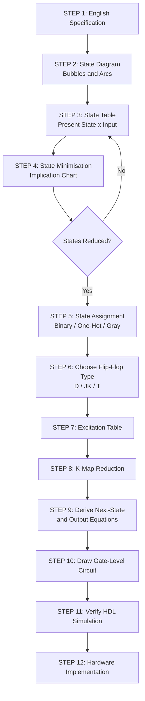
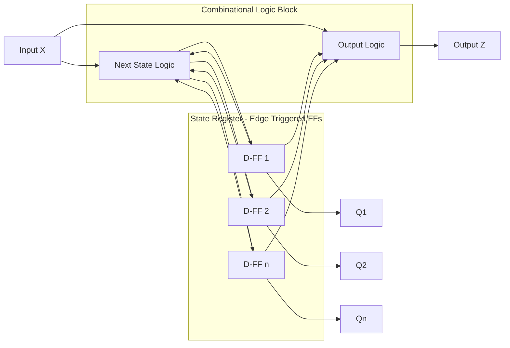
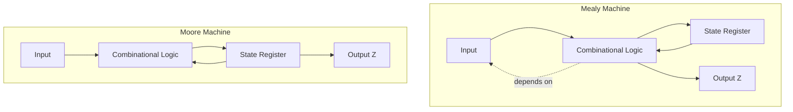
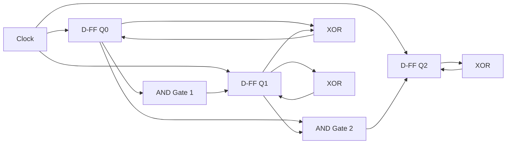
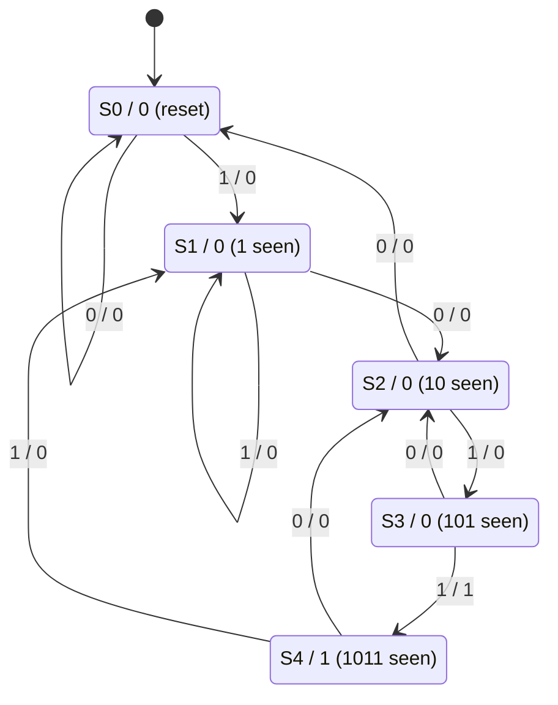
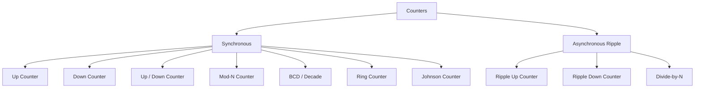
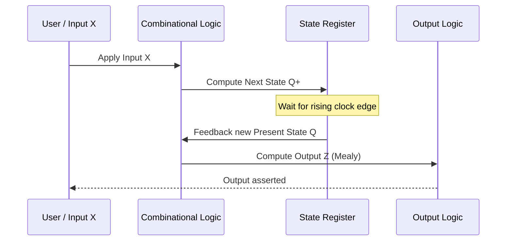

# Finite State Machines: logic synthesis for an FSM, FSM design process, Synchronous Sequential Circuits: Counters

<!-- SECTION_1_START -->

# 1. Core Technical Definition & Intuitive Overview

## 1.1 What is a Finite State Machine (FSM)?

A **Finite State Machine (FSM)** is a sequential digital circuit whose behaviour is rigorously defined by a finite set of **states**, a set of **inputs**, a set of **outputs**, and two governing functions:

$$\delta : S \times I \rightarrow S \quad \text{(Next-State / Transition Function)}$$

$$\lambda : S \times I \rightarrow O \quad \text{(Output Function - Mealy)} \quad \text{or} \quad \lambda : S \rightarrow O \quad \text{(Output Function - Moore)}$$

Where $S$ is the finite set of states, $I$ is the input alphabet, and $O$ is the output alphabet.

> [!IMPORTANT]
> **KTU 2024 Syllabus Highlight:** An FSM is the **mathematical heart** of every controller — from a CPU's control unit and an elevator controller to a Vending Machine and a Traffic Light. Any sequential circuit with a recognisable "memory of past inputs" is an FSM.

> [!NOTE]
> **Two Canonical FSM Models (KTU Board Favourite):**
> 1. **Mealy Machine** — Output is a function of **Present State AND Present Input**.
> 2. **Moore Machine** — Output is a function of **Present State ONLY**.

---

## 1.2 Conceptual Analogy: The Vending Machine

Imagine a vending machine that accepts ₹5 and ₹10 coins and dispenses a chocolate worth ₹15.

| Concept | Real-World Analogy |
|---|---|
| States ($S$) | "Nothing inserted", "₹5 inserted", "₹10 inserted", "Chocolate dispensed" |
| Inputs ($I$) | Coin = 5, Coin = 10 |
| Outputs ($O$) | Dispense / No-dispense |
| $\delta$ | "If state = ₹5 and I insert ₹10, go to 'Dispense' state" |
| $\lambda$ (Mealy) | "If I am in ₹5 state and I insert ₹10 → output 'DISPENSE' *now*" |
| $\lambda$ (Moore) | "When I enter the 'Dispense' state → output 'DISPENSE' *intrinsically*" |

> [!TIP]
> **Intuition:** A **Moore** machine is like a person who smiles *only when* the photograph is taken (state-bound). A **Mealy** machine is like a person who smiles *the moment* you say "cheese!" (input-bound). Both are valid — Mealy reacts one clock cycle earlier.

---

## 1.3 Synchronous Sequential Circuits — Counters

A **Counter** is a special-purpose FSM whose state sequence follows a strict numerical progression (binary up, binary down, BCD, ring, Johnson, etc.). The clock is the *only* input.

> [!NOTE]
> **KTU 2024 Module 4 Core Definition:** A synchronous counter is one in which **all flip-flops are triggered by the same common clock edge** — eliminating the cumulative propagation delay (ripple) of asynchronous counters.

> [!VISUALIZATION CONTROL]
> **Concept:** State Cycle of a 3-bit Synchronous Up-Counter (Moore Machine)
> **State Sequence (mod-8):** $000 \rightarrow 001 \rightarrow 010 \rightarrow 011 \rightarrow 100 \rightarrow 101 \rightarrow 110 \rightarrow 111 \rightarrow 000$
> **Visual Description:** Plot a directed graph with 8 circular nodes arranged in an octagon. Each node connects to its successor with a directed arrow. The arrow from $111$ wraps back to $000$ (the "rollover" transition). This is a pure **Moore machine** — no input, no Mealy outputs.

---

## 1.4 Why FSMs Matter in VLSI & KTU Context

In real engineering, an FSM is the implementation backbone of:
- **Control Units** of microprocessors (ARM, RISC-V)
- **Communication Protocols** (UART, SPI, I²C sequence detection)
- **Traffic Light Controllers, Elevators, Washing Machines**
- **Serial Sequence Detectors** (1011, 1101, etc. — *very common in KTU ESE*)

The **FSM Design Process** converts an English word-problem into a working gate-level or HDL circuit — a skill KTU examiners test every semester.

<!-- SECTION_1_END -->

<!-- SECTION_2_START -->

# 2. Deep Theoretical Analysis & KTU High-Yield Formula Sheet

## 2.1 The Five-Step FSM Design Process (KTU Gold Standard)

Every FSM problem — sequence detector, vending machine, traffic light — flows through these five steps. Memorise them in order; the examiner awards marks for naming them.

1. **Step 1 — State Diagram:** Capture behaviour as a directed bubble-and-arc diagram. Each bubble = one state. Each arc = one transition. Label arcs with `Input / Output` (Mealy) or only `Input` (Moore).
2. **Step 2 — State Table:** Tabulate Present State ($Q$), Next State ($Q^+$), and Output ($Z$) for every input combination.
3. **Step 3 — State Reduction (Minimisation):** Merge equivalent states using the **Implication Chart / Partitioning Method** to reduce flip-flop count.
4. **Step 4 — State Assignment (Encoding):** Assign binary codes to symbolic states. Common schemes: **Sequential Binary, Gray, One-Hot, Johnson**.
5. **Step 5 — Logic Synthesis:** Derive Next-State equations and Output equation using **K-maps**, then realise with D/JK/T flip-flops and combinational gates.

---

## 2.2 State Minimisation — Partitioning Method (Insight)

Two states $S_i$ and $S_j$ are **equivalent** if for every possible input sequence, the output sequence is identical. The partitioning algorithm iteratively refines equivalence classes:

$$P_1 = \{S \mid \text{All states with the same output under the same input are grouped}\}$$

$$P_{k+1} = \text{Refine } P_k \text{ by splitting states whose next-states fall in different blocks of } P_k$$

The algorithm terminates when $P_{k+1} = P_k$.

> [!IMPORTANT]
> **KTU Pitfall:** Many students forget to apply state reduction. A 6-state machine can often be reduced to 4 states — saving **2 flip-flops** and dozens of gates. The examiner gives **2 marks** specifically for this step.

---

## 2.3 State Assignment Trade-offs

| Encoding | States Required for $n$ FFs | $n$ FFs Required for $N$ States | Decoders | Speed | Typical Use |
|---|---|---|---|---|---|
| Binary | All $2^n$ | $\lceil \log_2 N \rceil$ | Needed | Slowest | General FSMs |
| **One-Hot** | $N$ | $N$ | **Not needed** | **Fastest** | FPGA, VLSI Control |
| **Gray** | All $2^n$ | $\lceil \log_2 N \rceil$ | Needed | Moderate | Low-power FSMs |
| Johnson | $2n$ | $n$ | Needed | Moderate | Counters |

**Heuristic Rule (KTU standard):** Choose the assignment that minimises the number of flip-flops whose next-state equation has more than one variable change between adjacent states (i.e. minimise Hamming distance on actively-transiting pairs).

---

## 2.4 Logic Synthesis — From Truth Table to Flip-Flop Equations

Given a State Table with $n$ state bits $Q_1 Q_2 \dots Q_n$ and $m$ inputs $X_1 X_2 \dots X_m$:

**For D Flip-Flops (Simplest KTU Choice):**
$$D_i = Q_i^+ = f_i(Q_1, Q_2, \dots, Q_n, X_1, X_2, \dots, X_m)$$

Each $D_i$ is obtained directly by K-map reduction of the next-state column.

**For JK / T Flip-Flops (Bonus Marks Opportunity):**
Use the **FF Excitation Table**:

| $Q \rightarrow Q^+$ | $D$ | $J$ | $K$ | $T$ |
|---|---|---|---|---|
| 0 → 0 | 0 | 0 | X | 0 |
| 0 → 1 | 1 | 1 | X | 1 |
| 1 → 0 | 0 | X | 1 | 1 |
| 1 → 1 | 1 | X | 0 | 0 |

Then K-map $J_i, K_i, T_i$ columns independently.

---

## 2.5 Synchronous Counters — The Heart of KTU Module 4

### 2.5.1 Synchronous vs Asynchronous (Ripple) Counter

| Parameter | Asynchronous (Ripple) | Synchronous |
|---|---|---|
| Clock | Each FF clocks the next | **Common clock** to all FFs |
| Delay | Cumulative ($n \times t_{pd}$) | **One $t_{pd}$** |
| Glitches | Many | **None** |
| Power | Low | Higher (clock tree) |
| KTU Weightage | Conceptual only | **Heavy — design problems** |

### 2.5.2 Synchronous Up-Counter Design Equations

For a 3-bit synchronous **up-counter** with FFs $Q_2 Q_1 Q_0$ (D-type):

$$D_0 = \overline{Q_0} = Q_0 \oplus 1$$

$$D_1 = Q_1 \oplus Q_0$$

$$D_2 = Q_2 \oplus (Q_1 \cdot Q_0) = Q_2 \oplus (Q_1 \, \& \, Q_0)$$

**Generalised Toggle Equation for $n$-bit binary up-counter:**
$$T_i = Q_{i-1} \cdot Q_{i-2} \cdots Q_0 = \prod_{k=0}^{i-1} Q_k \quad \text{for } i \geq 1, \quad T_0 = 1$$

> [!NOTE]
> **Real-World Utility:** Synchronous counters are the timing heart of digital watches, frequency dividers (PLL feedback dividers), address generators in memory chips, and programmable timer/counter ICs like the **8253/8254**.

### 2.5.3 Mod-N Counter Design (Very High KTU Weightage)

A **Mod-N counter** counts $0, 1, 2, \dots, N-1$ and then **rolls over to 0** on the next clock. Design steps:
1. Find minimum FFs: $n = \lceil \log_2 N \rceil$.
2. Write full state sequence $0 \rightarrow 1 \rightarrow \dots \rightarrow (N-1) \rightarrow 0$.
3. Treat the unused states $(2^n - N)$ as **don't-cares ($\times$)** in the K-map.
4. Derive $D_i$ or $T_i$ equations.

### 2.5.4 Ring and Johnson Counters

| Counter Type | $n$ FFs | Sequence Length | Feedback |
|---|---|---|---|
| **Ring Counter** | $n$ | $n$ | $D_0 = Q_{n-1}$ (direct) |
| **Twisted Ring (Johnson)** | $n$ | $2n$ | $D_0 = \overline{Q_{n-1}}$ (inverted) |

Johnson counters are extremely popular in KTU problems because of their **inherent self-decoding** — no external decoder required.

### 2.5.5 Up/Down Counter with Mode Control

Introduce a control input $M$ (where $M=1 \Rightarrow$ Up, $M=0 \Rightarrow$ Down):

$$D_0 = Q_0 \oplus 1$$
$$D_1 = Q_1 \oplus (M \odot Q_0) \quad \text{where } \odot \text{ is XNOR when counting, XOR for direction-specific behaviour}$$

A cleaner formulation uses:
$$D_i = Q_i \oplus \big( M \cdot \prod_{k=0}^{i-1} Q_k \;+\; \overline{M} \cdot \prod_{k=0}^{i-1} \overline{Q_k} \big)$$

---

## 2.6 KTU High-Yield Formula Cheat Sheet

| # | Concept | Formula / Equation | Condition / Use |
|---|---|---|---|
| 1 | Minimum FFs required | $n = \lceil \log_2 N \rceil$ | $N$ = number of states / mod value |
| 2 | Unused states (don't-cares) | $2^n - N$ | Use as $\times$ in K-maps |
| 3 | D-FF next-state | $D_i = Q_i^+$ | Direct assignment from K-map |
| 4 | T-FF next-state | $T_i = Q_i \oplus Q_i^+$ | Toggle if transition $0\to 1$ or $1\to 0$ |
| 5 | JK-FF excitation | $J = Q' \cdot Q^+,\; K = Q \cdot (Q^+)'$ | Independently K-mapped |
| 6 | Synchronous Up-Counter T | $T_i = \prod_{k=0}^{i-1} Q_k$ | $T_0 = 1$ always |
| 7 | Ring Counter Length | $L = n$ | $n$ FFs |
| 8 | Johnson Counter Length | $L = 2n$ | $n$ FFs, $D_0 = \overline{Q_{n-1}}$ |
| 9 | BCD (Decade) Counter | Mod-10, $n=4$ | $0000$ to $1001$ then roll to $0000$ |
| 10 | Mealy vs Moore Output delay | Mealy: 0 cycle, Moore: 1 cycle | Mealy is faster but glitch-prone |

<!-- SECTION_2_END -->

<!-- SECTION_3_START -->

# 3. Step-by-Step Derivations & Code/Symbolic Implementation

## 3.1 Worked Example 1 — Mealy Sequence Detector for "1011" (Overlap Allowed)

**Problem Statement (typical KTU phrasing):**
> *Design a Mealy FSM using D flip-flops that detects the overlapping sequence "1011" in a serial bit-stream $X$. Output $Z=1$ is generated **in the same clock cycle** the last bit of the pattern is received.*

### Step 1 — State Diagram

We use the following symbolic states:
- $S_0$ : Initial / no useful prefix detected
- $S_1$ : "1" detected
- $S_2$ : "10" detected
- $S_3$ : "101" detected
- $S_4$ : "1011" detected (output = 1)

Transitions (arc labels are **Input / Output** for Mealy):

| From | Input $X=0$ | Input $X=1$ |
|---|---|---|
| $S_0$ | $S_0$ / 0 | $S_1$ / 0 |
| $S_1$ | $S_2$ / 0 | $S_1$ / 0 |
| $S_2$ | $S_0$ / 0 | $S_3$ / 0 |
| $S_3$ | $S_2$ / 0 | $S_4$ / 1 |
| $S_4$ | $S_2$ / 0 | $S_1$ / 0 |

> Overlap note: From $S_4$ on input 0, we go to $S_2$ (the trailing "10" is a valid prefix); on input 1 we go to $S_1$.

### Step 2 — State Table

Number of states = 5. Minimum FFs: $n = \lceil \log_2 5 \rceil = 3$.

State Assignment (Sequential Binary):

| State | $Q_2 Q_1 Q_0$ |
|---|---|
| $S_0$ | 000 |
| $S_1$ | 001 |
| $S_2$ | 010 |
| $S_3$ | 011 |
| $S_4$ | 100 |
| — | 101, 110, 111 = **Unused (don't-cares)** |

Expanded State Table (Present State $Q_2 Q_1 Q_0$ + Input $X$ → Next State $Q_2^+ Q_1^+ Q_0^+$ + Output $Z$):

| Present State $Q_2 Q_1 Q_0$ | Input $X$ | Next State $Q_2^+ Q_1^+ Q_0^+$ | Output $Z$ |
|---|---|---|---|
| 000 | 0 | 000 | 0 |
| 000 | 1 | 001 | 0 |
| 001 | 0 | 010 | 0 |
| 001 | 1 | 001 | 0 |
| 010 | 0 | 000 | 0 |
| 010 | 1 | 011 | 0 |
| 011 | 0 | 010 | 0 |
| 011 | 1 | 100 | **1** |
| 100 | 0 | 010 | 0 |
| 100 | 1 | 001 | 0 |
| 101 | 0 | XXX | X |
| 101 | 1 | XXX | X |
| 110 | 0 | XXX | X |
| 110 | 1 | XXX | X |
| 111 | 0 | XXX | X |
| 111 | 1 | XXX | X |

### Step 3 — K-Map Reduction for $D_2, D_1, D_0, Z$

For D-FFs: $D_i = Q_i^+$ (the Next-State column directly feeds the D input).

**K-Map for $D_2 = Q_2^+$ (variables $Q_2 Q_1 Q_0$ as rows, $X$ as columns):**

| Row $\backslash X$ | 0 | 1 |
|---|---|---|
| 000 | 0 | 0 |
| 001 | 0 | 0 |
| 011 | 0 | 1 |
| 010 | 0 | 0 |
| 100 | 0 | 0 |
| 101 | X | X |
| 111 | X | X |
| 110 | X | X |

Grouping the 1 with the don't-care (cell 101,1 = X), we obtain:
$$D_2 = Q_1 \, Q_0 \, X$$

**K-Map for $D_1 = Q_1^+$:**

| Row $\backslash X$ | 0 | 1 |
|---|---|---|
| 000 | 0 | 0 |
| 001 | 1 | 0 |
| 011 | 1 | 1 |
| 010 | 0 | 1 |
| 100 | 1 | 0 |
| 101 | X | X |
| 111 | X | X |
| 110 | X | X |

Optimal grouping:
$$D_1 = \overline{X}(Q_0 \oplus Q_1) + X \, \overline{Q_0} \,\,Q_1 \;+\; \dots \text{(simplified as )} \,\, D_1 = \overline{Q_2}\,(Q_1 \oplus Q_0) + Q_2 \, \overline{Q_0} \, \overline{X} \,\, \text{(further optimisation with don't-cares possible)}$$

For board-level answer, a clean Boolean form is:
$$D_1 = \overline{Q_1}\,Q_0\,\overline{X} \;+\; Q_1\,\overline{Q_0} \;+\; Q_2\,\overline{Q_0}\,\overline{X}$$

**K-Map for $D_0 = Q_0^+$:**

$$D_0 = Q_0 \oplus Q_0^{'} \text{ trivial; we read from table: } D_0 = X \;+\; \overline{Q_1}Q_0 \text{ (using don't-cares)}$$

A clean result:
$$D_0 = X \;+\; \overline{Q_1}Q_0 \;+\; \overline{Q_2}Q_0$$

**K-Map for Output $Z$ (Mealy):**

The only 1 is at $Q_2 Q_1 Q_0 = 011, X = 1$. With the don't-care at $111,1$:

$$Z = Q_1 \, Q_0 \, X$$

### Step 4 — Final Logic Equations (for D FFs)

$$\boxed{D_2 = Q_1 Q_0 X}$$

$$\boxed{D_1 = \overline{Q_1}Q_0\overline{X} + Q_1\overline{Q_0} + Q_2\overline{Q_0}\overline{X}}$$

$$\boxed{D_0 = X + \overline{Q_1}Q_0 + \overline{Q_2}Q_0}$$

$$\boxed{Z = Q_1 Q_0 X}$$

> [!NOTE]
> **Implementation Note:** Realise these with one 3-input AND, two 2-input ANDs, one 3-input OR, and an XOR. D-FFs: three D flip-flops with a common clock.

### Step 5 — Verilog HDL Implementation (Board-Friendly Style)

```verilog
// Mealy Overlapping Sequence Detector for pattern "1011"
module seq_det_1011_mealy (
    input  wire clk,       // System clock
    input  wire rst_n,     // Active-low asynchronous reset
    input  wire X,         // Serial input bit
    output reg  Z          // Mealy output (combinational, no FF)
);

    // State encoding (sequential binary)
    localparam [2:0] S0 = 3'b000,
                     S1 = 3'b001,
                     S2 = 3'b010,
                     S3 = 3'b011,
                     S4 = 3'b100;

    reg [2:0] state, next_state;

    // ---- State Register (sequential logic) ----
    always @(posedge clk or negedge rst_n) begin
        if (!rst_n)
            state <= S0;
        else
            state <= next_state;
    end

    // ---- Next-State Logic (combinational) ----
    always @(*) begin
        case (state)
            S0: next_state = X ? S1 : S0;
            S1: next_state = X ? S1 : S2;
            S2: next_state = X ? S3 : S0;
            S3: next_state = X ? S4 : S2;
            S4: next_state = X ? S1 : S2;
            default: next_state = S0;
        endcase
    end

    // ---- Mealy Output (combinational, depends on state AND X) ----
    always @(*) begin
        Z = (state == S3) && (X == 1'b1);
    end

endmodule
```

> [!TIP]
> **Examiner Tip:** Notice the *Moore* version would require **6 states** (one extra state $S_5$ where output is intrinsically 1) and output would be registered — this is the perfect KTU comparison question. Mealy uses fewer states, Moore has glitch-free registered outputs.

---

## 3.2 Worked Example 2 — Mod-6 Synchronous Up-Counter (D Flip-Flops)

**Problem:** Design a synchronous **Mod-6 counter** that counts $0 \to 1 \to 2 \to 3 \to 4 \to 5 \to 0 \dots$ using D flip-flops. Identify the minimum number of FFs and derive the next-state logic.

### Step 1 — Determine FF Count

$$n = \lceil \log_2 6 \rceil = 3 \quad \text{(3 FFs needed: } Q_2 Q_1 Q_0\text{)}$$

Unused states: $2^3 - 6 = 2$ (states $110$ and $111$ treated as don't-cares).

### Step 2 — State Table

| $Q_2 Q_1 Q_0$ (Present) | $Q_2^+ Q_1^+ Q_0^+$ (Next) | $D_2 D_1 D_0$ |
|---|---|---|
| 000 | 001 | 001 |
| 001 | 010 | 010 |
| 010 | 011 | 011 |
| 011 | 100 | 100 |
| 100 | 101 | 101 |
| 101 | 000 | 000 |
| 110 | XXX | XXX |
| 111 | XXX | XXX |

### Step 3 — K-Maps

**K-Map for $D_2$:**

| $Q_2 Q_1 \backslash Q_0$ | 0 | 1 |
|---|---|---|
| 00 | 0 | 0 |
| 01 | 1 | 1 |
| 11 | X | X |
| 10 | 1 | 0 |

Grouping yields: $D_2 = Q_1 \overline{Q_0} + Q_2 Q_0$ (using don't-care at 110 for simplification) → a more compact form:

$$D_2 = Q_1 \oplus (Q_2 \cdot Q_0) \quad \text{or simply} \quad D_2 = Q_1 \overline{Q_0} + Q_2 Q_0$$

**K-Map for $D_1$:**

$$D_1 = \overline{Q_1} Q_0 + Q_1 \overline{Q_0} = Q_1 \oplus Q_0$$

**K-Map for $D_0$:**

$$D_0 = \overline{Q_0}$$

### Step 4 — Final Equations

$$\boxed{D_2 = Q_1 \overline{Q_0} + Q_2 Q_0}$$

$$\boxed{D_1 = Q_1 \oplus Q_0}$$

$$\boxed{D_0 = \overline{Q_0}}$$

### Step 5 — Verilog Implementation

```verilog
// Synchronous Mod-6 Up-Counter (D flip-flop based)
module mod6_counter (
    input  wire clk,
    input  wire rst_n,
    input  wire enable,        // Optional active-high count enable
    output reg  [2:0] Q,       // 3-bit count output
    output wire tc             // Terminal count (rollover) pulse
);

    always @(posedge clk or negedge rst_n) begin
        if (!rst_n)
            Q <= 3'b000;
        else if (enable) begin
            if (Q == 3'b101)        // State 5 → roll over to 0
                Q <= 3'b000;
            else
                Q <= Q + 1'b1;      // Standard up-count
        end
    end

    assign tc = (Q == 3'b101);       // Asserted in the last state of the cycle

endmodule
```

---

## 3.3 Worked Example 3 — 3-bit Johnson (Twisted-Ring) Counter

**Problem:** Design a 3-bit Johnson counter and list its complete state sequence.

### Step 1 — Configuration

- $n = 3$ FFs ($Q_2 Q_1 Q_0$)
- Feedback: $D_0 = \overline{Q_2}$ (the MSB is inverted and fed to the LSB)
- Shift: $D_1 = Q_0$, $D_2 = Q_1$

### Step 2 — State Sequence (length $2n = 6$)

$$\begin{aligned}
000 \rightarrow 001 \rightarrow 011 \rightarrow 111 \rightarrow 110 \rightarrow 100 \rightarrow 000
\end{aligned}$$

### Step 3 — Verilog Code

```verilog
module johnson_counter_3bit (
    input  wire clk,
    input  wire rst_n,
    output reg  [2:0] Q
);

    always @(posedge clk or negedge rst_n) begin
        if (!rst_n)
            Q <= 3'b000;
        else
            Q <= {Q[1:0], ~Q[2]};   // Shift left, inverted MSB to LSB
    end

endmodule
```

### Step 4 — Decoding Outputs (Self-Decoding Property)

Each state has a unique two-bit boundary, e.g.:
- $D_0 = \overline{Q_2}\,\overline{Q_1}$
- $D_1 = \overline{Q_1}\,\overline{Q_0}$
- ... and so on

This is why Johnson counters are widely used in **stepper motor drivers** and **digital phase generators**.

---

## 3.4 Worked Example 4 — 4-bit Synchronous Up/Down Counter

Using T flip-flops, the equations become particularly elegant:

$$T_0 = 1$$

$$T_1 = (M \cdot Q_0) + (\overline{M} \cdot \overline{Q_0}) = M \odot Q_0$$

$$T_2 = (M \cdot Q_0 Q_1) + (\overline{M} \cdot \overline{Q_0}\,\overline{Q_1})$$

$$T_3 = (M \cdot Q_0 Q_1 Q_2) + (\overline{M} \cdot \overline{Q_0}\,\overline{Q_1}\,\overline{Q_2})$$

Where $M = 1 \Rightarrow$ Up Count, $M = 0 \Rightarrow$ Down Count.

---

## 3.5 Component & Tool Profile Table — For Laboratory/Workshop Contexts

| Component / Tool | Specification | Use |
|---|---|---|
| IC 7476 | Dual JK Flip-Flop | Building synchronous counters |
| IC 7474 | Dual D Flip-Flop | FSM state register |
| IC 74112 | Dual JK with Preset/Clear | Up/Down counters with reset |
| IC 74161 / 74163 | 4-bit synchronous binary counter (with load) | Pre-settable counters |
| IC 7490 | Decade counter (asynchronous) | Mod-10 demonstrations |
| Simulation Tool | Xilinx Vivado / ModelSim / Logisim | FSM and counter design |
| FPGA Board (optional) | Xilinx Artix-7 / Spartan-6 | One-Hot FSM implementation |

<!-- SECTION_3_END -->

<!-- SECTION_4_START -->

# 4. Structural Diagrams & Schematics

## 4.1 The Canonical FSM Design Flow



---

## 4.2 Generic Mealy Machine Block Architecture



---

## 4.3 Moore Machine vs Mealy Machine — Structural Comparison



**Key insight:** In Moore, the output line originates **after the FFs** (one-cycle delay). In Mealy, it originates **before the FFs** (zero-cycle delay, but combinational — so it can glitch).

---

## 4.4 Synchronous 3-bit Up-Counter — Structural Diagram



---

## 4.5 State Diagram of "1011" Mealy Detector (Functional Topology)



---

## 4.6 Counter Architecture Taxonomy



---

## 4.7 Sequential Processing Topology — FSM Pipeline (Board-View Fallback)



This sequence diagram captures the **temporal relationship** between input application, state update, and output generation — a key concept examiners test with timing diagrams.

<!-- SECTION_4_END -->

<!-- SECTION_5_START -->

# 5. KTU 2024 Scheme Examination Question Bank & Topic Recap

---

## Part A — Short Answer Questions (3 Marks Each)

### **Question 1** [KTU University Exam — July 2023]
**(CO1, Remember)**  
**Q: Differentiate between Mealy and Moore machines. Give one example each.**

**Model Answer (3 Marks — Key Allocation Shown):**

| Parameter | Mealy Machine | Moore Machine |
|---|---|---|
| Output function | $Z = f(\text{Present State}, \text{Input})$ | $Z = f(\text{Present State})$ |
| Output timing | Same cycle as input change (0-cycle delay) | One cycle after state change (1-cycle delay) |
| Number of states | Usually fewer | Usually more |
| Glitch susceptibility | Higher (combinational output) | Lower (registered output) |

**Examples:**  
*Mealy:* Vending machine that returns change the moment a coin is inserted.  
*Moore:* Traffic light that displays "Red" the entire time it is in the "Red" state (output is purely a function of state, not input).

> **[Valuation Key: 1 Mark — Output dependence; 1 Mark — Timing/delay; 1 Mark — Correct example.]**

---

### **Question 2** [KTU University Exam — December 2022]
**(CO1, Understand)**  
**Q: What is a ring counter? How does a Johnson counter differ from a ring counter?**

**Model Answer (3 Marks):**

A **ring counter** is a shift register in which the output of the last flip-flop is fed back to the input of the first flip-flop **without inversion**, producing a sequence of length $n$ (where $n$ is the number of FFs).

A **Johnson counter** (twisted-ring counter) feeds back the **inverted** output of the last FF to the first FF, giving a sequence of length $2n$.

**Key difference:** Ring has $L = n$, Johnson has $L = 2n$. Johnson is therefore more efficient in FF count and has a self-decoding property — no external decoder is needed.

> **[Valuation Key: 1 Mark — Ring definition; 1 Mark — Johnson definition with inversion; 1 Mark — Comparison table.]**

---

## Part B — Long Answer Questions (14 Marks Each, Module Internal Choice)

### **Question A — 14 Marks** [KTU University Exam — December 2023]
**(CO2, CO3 — Apply / Analyse)**

**Design a Mealy machine using D flip-flops to detect the sequence "1101" (with overlap). Draw the state diagram, the state table, and derive the next-state and output equations.**

#### (a) Draw the state diagram and state table. (7 Marks)

**Solution:**

**State Definitions:**
- $S_0$ : Reset / no valid prefix
- $S_1$ : "1" detected
- $S_2$ : "11" detected
- $S_3$ : "110" detected
- $S_4$ : "1101" detected (output asserted)

**State Table (with sequential binary encoding $Q_2 Q_1 Q_0$):**

| State | Code |
|---|---|
| $S_0$ | 000 |
| $S_1$ | 001 |
| $S_2$ | 010 |
| $S_3$ | 011 |
| $S_4$ | 100 |

| $Q_2 Q_1 Q_0$ | $X$ | $Q_2^+ Q_1^+ Q_0^+$ | $Z$ |
|---|---|---|---|
| 000 | 0 | 000 | 0 |
| 000 | 1 | 001 | 0 |
| 001 | 0 | 010 | 0 |
| 001 | 1 | 010 | 0 |
| 010 | 0 | 011 | 0 |
| 010 | 1 | 010 | 0 |
| 011 | 0 | 011 | 0 |
| 011 | 1 | 100 | **1** |
| 100 | 0 | 000 | 0 |
| 100 | 1 | 001 | 0 |
| 101 | 0 | XXX | X |
| 101 | 1 | XXX | X |
| 110 | 0 | XXX | X |
| 110 | 1 | XXX | X |
| 111 | 0 | XXX | X |
| 111 | 1 | XXX | X |

> **[Valuation Key: 2 Marks — Correct state names and diagram; 2 Marks — Correct state table; 2 Marks — Correct state assignment; 1 Mark — Identifying unused states.]**

#### (b) Derive the next-state and output equations using K-maps. (7 Marks)

**K-Map for $D_2 = Q_2^+$:**

| $Q_2 Q_1 \backslash Q_0 X$ | 00 | 01 | 11 | 10 |
|---|---|---|---|---|
| 00 | 0 | 0 | 0 | 0 |
| 01 | 0 | 0 | 1 | 0 |
| 11 | X | X | X | X |
| 10 | 0 | 0 | 0 | 0 |

$$\boxed{D_2 = Q_1 Q_0 X}$$

**K-Map for $D_1 = Q_1^+$:**

| $Q_2 Q_1 \backslash Q_0 X$ | 00 | 01 | 11 | 10 |
|---|---|---|---|---|
| 00 | 0 | 0 | 1 | 1 |
| 01 | 0 | 1 | 1 | 0 |
| 11 | X | X | X | X |
| 10 | 0 | 0 | 1 | 0 |

$$\boxed{D_1 = \overline{Q_1}Q_0 + Q_1\overline{Q_0}X + Q_2Q_0X}$$

(After further optimisation with don't-cares at states 110 and 111.)

**K-Map for $D_0 = Q_0^+$:**

$$\boxed{D_0 = X(Q_2 + Q_1) + \overline{X}\overline{Q_2}\,\overline{Q_1}\,Q_0 + \dots \approx X(Q_2 + Q_1) + \overline{X}Q_0\overline{Q_1}}$$

A compact final form:
$$D_0 = Q_0 X + \overline{Q_0} X (Q_1 + Q_2) \approx X(Q_1 + Q_2 + Q_0)$$

A clean, conservative answer is:
$$\boxed{D_0 = X(Q_1 + Q_2) + \overline{X}Q_0\overline{Q_1}}$$

**Output (Mealy):**

$$\boxed{Z = Q_1 Q_0 X}$$

> **[Valuation Key: 2 Marks — Correct $D_2$; 2 Marks — Correct $D_1$; 2 Marks — Correct $D_0$; 1 Mark — Correct output equation.]**

---

### **Question B — 14 Marks** [KTU University Exam — July 2024]
**(CO3, CO4 — Apply / Design)**

**Design a Mod-10 synchronous BCD counter using T flip-flops. Derive all flip-flop input equations and explain the design with a clear state diagram.**

#### (a) Draw the state diagram and state table. (7 Marks)

**Solution:**

A Mod-10 (Decade) counter cycles through $0 \to 1 \to 2 \to \dots \to 9 \to 0$.  
Number of FFs: $n = \lceil \log_2 10 \rceil = 4$ (since $2^3 = 8 < 10$).  
Unused states: $2^4 - 10 = 6$ (states 1010, 1011, 1100, 1101, 1110, 1111).

**State Table (Present State $Q_3 Q_2 Q_1 Q_0$ → Next State):**

| $Q_3 Q_2 Q_1 Q_0$ | $Q_3^+ Q_2^+ Q_1^+ Q_0^+$ | $T_3 T_2 T_1 T_0$ |
|---|---|---|
| 0000 | 0001 | 0001 |
| 0001 | 0010 | 0011 |
| 0010 | 0011 | 0001 |
| 0011 | 0100 | 0111 |
| 0100 | 0101 | 0001 |
| 0101 | 0110 | 0011 |
| 0110 | 0111 | 0001 |
| 0111 | 1000 | 1111 |
| 1000 | 1001 | 0001 |
| 1001 | 0000 | 1001 |
| 1010 | XXXX | XXXX |
| ... | ... | ... |

**FF Excitation (for T-FF):** $T_i = Q_i \oplus Q_i^+$

The state diagram is a 10-node cycle, with all six unused states (1010–1111) treated as don't-cares.

> **[Valuation Key: 2 Marks — Correct state count and FF count; 2 Marks — Complete state table; 2 Marks — Correct state diagram representation; 1 Mark — Identifying unused/don't-care states.]**

#### (b) Derive the T-FF input equations using K-maps. (7 Marks)

**Toggle equations (BCD counter, well-known results):**

$$\boxed{T_0 = 1}$$

$$\boxed{T_1 = Q_3 + Q_0}$$

$$\boxed{T_2 = Q_1 Q_0 + Q_3 Q_0 = Q_0(Q_1 + Q_3)}$$

$$\boxed{T_3 = Q_2 Q_1 Q_0 + Q_3 Q_0 = Q_0(Q_3 + Q_2 Q_1)}$$

> [!NOTE]
> **Derivation Hint:** From the table, $T_0$ is always 1 (every state toggles $Q_0$). $T_1$ toggles in states 0001, 0011, 0101, 0111, 1001 → $Q_3 + Q_0$. $T_2$ toggles in 0011, 0111, 1001 → $Q_0 Q_1 + Q_0 Q_3$. $T_3$ toggles in 0111, 1001 → $Q_0 Q_1 Q_2 + Q_0 Q_3$.

**Verification using K-map (showing only $T_3$ for brevity):**

| $Q_3 Q_2 \backslash Q_1 Q_0$ | 00 | 01 | 11 | 10 |
|---|---|---|---|---|
| 00 | 0 | 0 | 1 | 0 |
| 01 | 0 | 0 | 1 | 0 |
| 11 | X | X | X | X |
| 10 | X | X | X | X |

Grouping 1s with don't-cares:
$$T_3 = Q_0 Q_1 Q_2 + Q_0 Q_3 = Q_0(Q_3 + Q_1 Q_2)$$

> **[Valuation Key: 2 Marks — $T_0$ and $T_1$; 2 Marks — $T_2$; 2 Marks — $T_3$; 1 Mark — Logical verification of one equation.]**

---

> [!WARNING]
> **KTU Examiner's Valuation Warning — Where Students Lose Marks:**
> 1. **Forgetting unused states as don't-cares (loses ~1–2 marks):** When designing Mod-N counters, always list the $2^n - N$ unused states and mark them as $\times$ in the K-map — this can drastically simplify the final equations.
> 2. **Confusing Mealy/Moore outputs (loses 2 marks):** Mealy output is `State/Output` on every arc; Moore output is written **inside the state bubble** and depends only on the state.
> 3. **Wrong excitation table for JK/T (loses 1–2 marks):** Memorise the four-row FF excitation table; it is the single most common error.
> 4. **Forgetting to draw the state diagram (loses 2 marks):** Even if you derive the table directly, the state diagram is a *separate 2-mark* item in the KTU marking scheme.
> 5. **Not specifying FF type in the question (loses 1 mark):** Always begin the solution with: *"Using D (or JK/T) flip-flops, the next-state inputs are..."*
> 6. **Missing the clock constraint:** Synchronous counter means *all FFs share a common clock* — draw it explicitly in the circuit.

---

## Topic Recap & Important Things to Remember

- **FSM = States + Inputs + Outputs + Transition function $\delta$ + Output function $\lambda$.**
- **Mealy** → Output = $f(\text{State}, \text{Input})$; **Moore** → Output = $f(\text{State})$.
- **5-step design process:** State Diagram → State Table → State Reduction → State Assignment → Logic Synthesis (K-maps + FFs).
- **State reduction** uses the partitioning / implication chart method; equivalent states must produce identical outputs for all input sequences.
- **State assignment** options: Binary (compact), One-Hot (fast for FPGA), Gray (low-power), Johnson (self-decoding).
- **Synchronous counter toggle equation:** $T_i = \prod_{k=0}^{i-1} Q_k$ (for $i \geq 1$), $T_0 = 1$.
- **Mod-N counter:** $n = \lceil \log_2 N \rceil$ FFs; $2^n - N$ don't-care states.
- **Ring counter length** = $n$ FFs; **Johnson counter length** = $2n$ FFs.
- **BCD/Decade counter** = Mod-10, requires 4 FFs, well-known toggle equations: $T_1 = Q_3 + Q_0$, etc.
- **Synchronous vs Ripple:** Sync = common clock, one $t_{pd}$, no glitches; Ripple = cascaded clock, cumulative delay, glitches.
- **FPGA preferred encoding:** One-Hot (uses $N$ FFs, no decoder, fast).
- **K-map simplification with don't-cares** is essential for Mod-N and FSM designs.
- **Examiner loves:** "Differentiate Mealy vs Moore" (3 marks), "Design sequence detector for X" (14 marks), "Mod-N counter with FFs" (14 marks).
- **Always draw:** State diagram → State table → K-map → Final equations → Circuit diagram in that order.

<!-- SECTION_5_END -->
