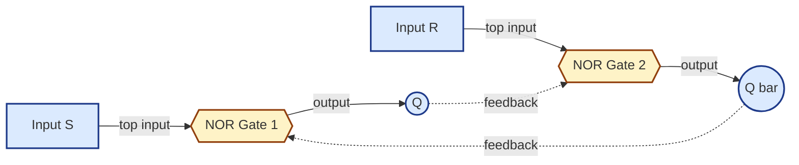
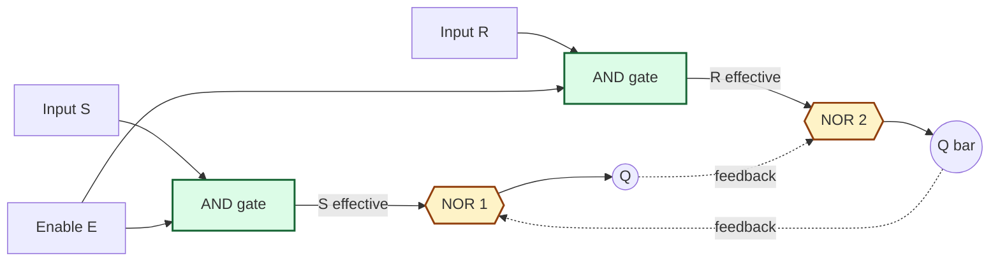
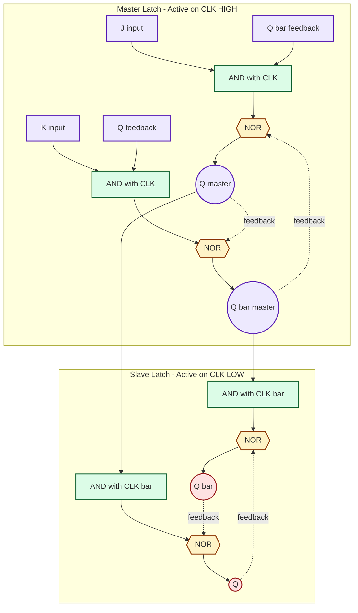
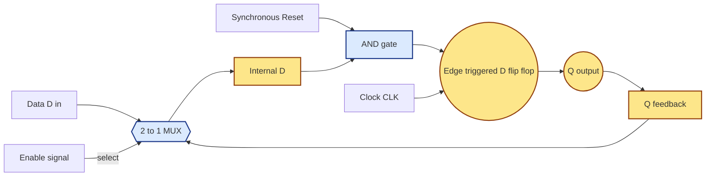
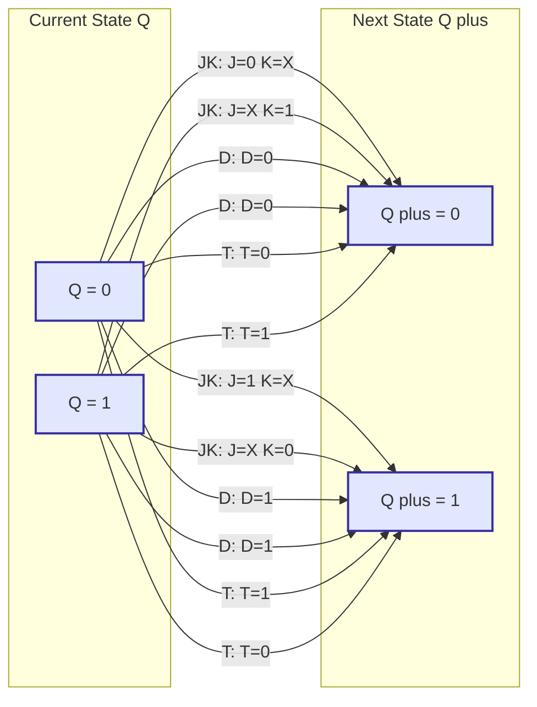

# Latches and Flip-Flops: SR latch, SR latch with enable, JK flip-flop, D flip-flop, Register Enabled/Resettable Flip-Flops

<!-- SECTION_1_START -->
# 1. Core Technical Definition & Intuitive Overview

## 1.1 What are Latches and Flip-Flops?

**Latch:** A fundamental 1-bit **memory element** in digital electronics that is **level-sensitive**, meaning it continuously monitors its input(s) and updates its stored output as long as the enable (gate) signal is held at an active level. The most primitive latch (the SR latch) is built using only two cross-coupled NOR or NAND gates and forms the smallest possible bistable storage element in a digital system.

**Flip-Flop:** A synchronous 1-bit memory device that is **edge-triggered**, meaning it samples its inputs and updates its output **only at the rising edge (0→1) or falling edge (1→0) of the clock signal**. A flip-flop is essentially a latch whose input-gating is precisely controlled by a clock transition.

> [!IMPORTANT]
> **KTU 2024 Definition Box**
> A **bistable element** is a circuit that possesses exactly two stable states and can store one bit of information (logic **0** or logic **1**) indefinitely as long as power is maintained. Latches and flip-flops are both bistable memory elements, the difference being **timing discipline**: latches are transparent during the active level of the enable, while flip-flops are transparent only at the instant of a clock transition.

## 1.2 Real-World Analogy — The Staircase Light Switch

Imagine a long staircase in a building with switches at the **top** and **bottom** of the stairs. A person at the top can flip a switch that is **remembered** even after the person lets go. A second person at the bottom can flip the switch again, and the system **remembers** the new state.

- **SR Latch** = The two-way switch itself. Pulling one side **Sets** the light, pulling the other side **Resets** it.
- **Enable (E)** = A **gate** such as a door lock. Even if someone pulls a switch, the light does not change state until the door is unlocked.
- **Clocked Flip-Flop** = A **timed release mechanism** — the switch can only change the light at exact, discrete moments (say, every second) — never continuously.

## 1.3 Why Sequential Memory? — The Need for State

In combinational logic, the output is purely a function of the **current** inputs — there is no history. But real systems (counters, registers, controllers, microprocessors) need to **remember**. Sequential logic = combinational logic + memory. That memory is built from latches and flip-flops.

> [!NOTE]
> **Memory capacity rule of thumb:** $N$ flip-flops can store up to $2^N$ distinct states. So an 8-bit register (used inside the CPU) can hold any of **256** possible patterns.

## 1.4 Hierarchy of Sequential Elements

| Element | Trigger Type | Inputs | Forbidden State? |
|---|---|---|---|
| SR Latch (NOR) | Level (no enable) | S, R | Yes (S = R = 1) |
| Gated SR Latch | Level (with E) | S, R, E | Yes (S = R = 1) |
| D Latch | Level (with E) | D, E | No |
| JK Flip-Flop | Edge | J, K, CLK | No (toggle replaces invalid) |
| D Flip-Flop | Edge | D, CLK | No |
| T Flip-Flop | Edge | T, CLK | No |
| Resettable FF | Edge + Reset | D/JK + RESET_n | Depends |

> [!VISUALIZATION CONTROL]
> **Concept:** Characteristic Curve of a Bistable Element
> **GeoGebra / Desmos Input Equations:**
> * `f(x) = piecewise(x < 1, 0, x >= 1, 1)`  — ideal step function of an ideal bistable
> * `g(x) = piecewise(x > 0, 1, 0)`  — Schmitt-trigger style with hysteresis
> **Visual Description:** Plot the input voltage (x-axis) versus output (y-axis). The student should observe a sharp vertical transition between the two stable output levels (0 V and +V), representing the two stable operating points of the bistable memory cell.

---
<!-- SECTION_1_END -->

<!-- SECTION_2_START -->
# 2. Deep Theoretical Analysis & KTU High-Yield Formula Sheet

## 2.1 SR Latch Using Cross-Coupled NOR Gates

The SR latch is the most basic bistable element. It uses **two cross-coupled NOR gates**, where the output of each gate feeds back into the input of the other.

**Operating Truth Table:**

| S | R | Q(t+1) | Q'(t+1) | State Description |
|---|---|---|---|---|
| 0 | 0 | Q(t) | Q'(t) | **Hold (Memory)** |
| 0 | 1 | 0 | 1 | **Reset** |
| 1 | 0 | 1 | 0 | **Set** |
| 1 | 1 | 0 | 0 | **Invalid / Forbidden** |

> [!WARNING]
> When S = R = 1 in a NOR-based SR latch, both Q and Q' become **0**, which violates the complementary nature of Q and Q'. If S and R simultaneously return to 0, the final state is **unpredictable (race condition)**. This is a critical KTU exam pitfall.

## 2.2 Gated (Enabled) SR Latch

Two AND gates are added in front of the basic SR latch. The enable signal E controls whether the latch is **transparent** (active) or **disabled** (locked in its previous state).

**Logic Equations:**
* Effective S input: $S_{\text{eff}} = S \cdot E$
* Effective R input: $R_{\text{eff}} = R \cdot E$

When $E = 0$: $S_{\text{eff}} = R_{\text{eff}} = 0 \Rightarrow$ **Hold state**, irrespective of S and R.
When $E = 1$: behaves exactly like the basic SR latch.

## 2.3 D Latch (Data / Transparent Latch)

The D latch is built by connecting an **inverter** between S and R of a gated SR latch so that the forbidden state is structurally impossible.

* $S_{\text{eff}} = D \cdot E$
* $R_{\text{eff}} = \overline{D} \cdot E$

**Truth Table:**

| E | D | Q(t+1) | Operation |
|---|---|---|---|
| 0 | X | Q(t) | **Hold (latch opaque)** |
| 1 | 0 | 0 | **Transparent — Q follows D** |
| 1 | 1 | 1 | **Transparent — Q follows D** |

## 2.4 JK Flip-Flop

The JK flip-flop is a refined version of the SR flip-flop that **eliminates the forbidden state** by using a toggle feedback. The output Q is fed back so that J = K = 1 produces a controlled **toggle** rather than a race.

**Truth Table:**

| J | K | CLK | Q(t+1) | Operation |
|---|---|---|---|---|
| 0 | 0 | ↑ | Q(t) | No change |
| 0 | 1 | ↑ | 0 | Reset |
| 1 | 0 | ↑ | 1 | Set |
| 1 | 1 | ↑ | $\overline{Q(t)}$ | **Toggle** |

### 2.4.1 The Race-Around Condition

In a **level-triggered** JK flip-flop, if $J = K = 1$ and the clock pulse width $t_p$ is greater than the propagation delay $t_{pd}$ of the latch, the output will oscillate continuously during the active clock level. This is the **race-around condition**.

**Condition for race-around:** $t_p > t_{pd}$

**Solution:** Use either a **Master–Slave JK flip-flop** (two latches in series, clocked on opposite levels) or an **edge-triggered** JK flip-flop. In a properly designed edge-triggered flip-flop, the race-around condition is completely eliminated.

> [!NOTE]
> **Master–Slave Operation:** The **master** latch is enabled during the **HIGH** level of the clock and is **isolated** from the output. The **slave** latch is enabled during the **LOW** level of the clock and **copies** the master's content to the output. The output therefore changes only on the **falling edge** of the clock — guaranteeing one stable transition per clock cycle.

## 2.5 D Flip-Flop

The D flip-flop is the **edge-triggered** version of the D latch. It is the **most widely used storage element** in modern digital design (registers, shift registers, memory cells).

**Characteristic behaviour:** At the active clock edge, $Q(t+1) = D$.

> [!IMPORTANT]
> In CMOS VLSI, the D flip-flop is the **workhorse element** of every register file, pipeline stage, and state register because it has only one data input and cannot enter an invalid state.

## 2.6 T Flip-Flop (Toggle)

The T flip-flop is a single-input flip-flop where $T = 1$ causes the output to **toggle** and $T = 0$ causes it to **hold**. It is obtained by tying $J = K = T$ in a JK flip-flop.

**Truth Table:**

| T | Q(t+1) |
|---|---|
| 0 | Q(t) |
| 1 | $\overline{Q(t)}$ |

It is the building block of **binary ripple counters** and **frequency dividers** (one T flip-flop divides the clock by 2).

## 2.7 Registers Using Enabled / Resettable Flip-Flops

A **register** is a collection of $N$ flip-flops sharing a common clock. To make registers useful, additional control inputs are added:

* **Enable (EN):** When EN = 1, the flip-flop loads new data; when EN = 0, all flip-flops hold their previous value.
* **Synchronous Reset:** $Q$ becomes 0 on the **active clock edge** if RESET = 1.
* **Asynchronous Reset:** $Q$ becomes 0 **immediately**, independent of the clock, when RESET_n = 0.
* **Asynchronous Preset (SET):** $Q$ becomes 1 immediately on activation.

> [!TIP]
> **Synchronous vs Asynchronous — the KTU favourite!**
> * **Synchronous:** Reset sampled **with the clock edge** ⇒ clean timing, no glitches, easier to model in HDL.
> * **Asynchronous:** Reset acts **like an emergency brake** — overrides the clock and clears the flip-flop instantly, useful for power-on initialization.

## 2.8 KTU High-Yield Formula & Characteristic Sheet

| Flip-Flop | Characteristic Equation | Constraint / Notes | Excitation (Q → Q⁺) |
|---|---|---|---|
| **SR** | $Q(t+1) = S + \overline{R} \cdot Q(t)$ | $S \cdot R = 0$ | $0\!\to\!0$: $S\!=\!0,R\!=\!X$; $0\!\to\!1$: $S\!=\!1,R\!=\!0$; $1\!\to\!0$: $S\!=\!0,R\!=\!1$; $1\!\to\!1$: $S\!=\!X,R\!=\!0$ |
| **D** | $Q(t+1) = D$ | None | $D = Q(t+1)$ always |
| **JK** | $Q(t+1) = J \overline{Q(t)} + \overline{K} Q(t)$ | None (race-around avoided) | $0\!\to\!0$: $J\!=\!0,K\!=\!X$; $0\!\to\!1$: $J\!=\!1,K\!=\!X$; $1\!\to\!0$: $J\!=\!X,K\!=\!1$; $1\!\to\!1$: $J\!=\!X,K\!=\!0$ |
| **T** | $Q(t+1) = T \oplus Q(t) = T \overline{Q(t)} + \overline{T} Q(t)$ | None | $0\!\to\!0$: $T\!=\!0$; $0\!\to\!1$: $T\!=\!1$; $1\!\to\!0$: $T\!=\!1$; $1\!\to\!1$: $T\!=\!0$ |
| **Resettable D** | If RESET = 1 (sync): $Q(t+1) = 0$, else $Q(t+1) = D$ | — | $D = 0$ when reset, else follows |
| **Enabled D** | If EN = 1: $Q(t+1) = D$, else $Q(t+1) = Q(t)$ | — | — |

> [!NOTE]
> **Engineering Utility:** D flip-flops dominate synchronous VLSI design because they map 1-to-1 onto HDL constructs like `always @(posedge clk)`, they are Scan-chain friendly (DFT), and they can be packed densely in standard cell libraries. JK flip-flops are now mostly used in **academic teaching** and in legacy designs because they are easy to understand and convert to other types.

---
<!-- SECTION_2_END -->

<!-- SECTION_3_START -->
# 3. Step-by-Step Derivations & Code / Symbolic Implementation

## 3.1 Derivation of the JK Characteristic Equation (K-Map Method)

**Step 1.** Construct the JK truth table (assuming no race-around):

| J | K | Q(t) | Q(t+1) | Comment |
|---|---|---|---|---|
| 0 | 0 | 0 | 0 | Hold |
| 0 | 0 | 1 | 1 | Hold |
| 0 | 1 | 0 | 0 | Reset |
| 0 | 1 | 1 | 0 | Reset |
| 1 | 0 | 0 | 1 | Set |
| 1 | 0 | 1 | 1 | Set |
| 1 | 1 | 0 | 1 | Toggle |
| 1 | 1 | 1 | 0 | Toggle |

**Step 2.** Plot the K-map (rows = JK in Gray order 00, 01, 11, 10; columns = Q(t) as 0, 1):

$$
\begin{aligned}
\begin{array}{c|cc}
JK \backslash Q(t) & 0 & 1 \\
\hline
00 & 0 & 1 \\
01 & 0 & 0 \\
11 & 1 & 0 \\
10 & 1 & 1 \\
\end{array}
\end{aligned}
$$

**Step 3.** Form the two prime implicants:

* Cell (JK = 00, Q = 1) and (JK = 10, Q = 1) merge to form $\overline{K} \cdot Q(t)$.
* Cell (JK = 10, Q = 0) and (JK = 11, Q = 0) merge to form $J \cdot \overline{Q(t)}$.

**Step 4.** Add the prime implicants to obtain the characteristic equation:

$$
\boxed{\,Q(t+1) = J\,\overline{Q(t)} + \overline{K}\,Q(t)\,}
$$

> [!NOTE]
> The same equation can be written compactly as $Q^{+} = J\overline{Q} + \overline{K}Q$, which is the canonical JK characteristic equation asked in **almost every KTU university exam**.

## 3.2 Derivation of the SR Characteristic Equation

K-map (rows = SR in 00, 01, 11, 10; columns = Q(t) as 0, 1). Cells where S = R = 1 are marked **X (don't care / invalid)**:

$$
\begin{aligned}
\begin{array}{c|cc}
SR \backslash Q(t) & 0 & 1 \\
\hline
00 & 0 & 1 \\
01 & 0 & 0 \\
11 & X & X \\
10 & 1 & 1 \\
\end{array}
\end{aligned}
$$

Group the 1's:

* Cells (SR = 10, Q = 0) and (SR = 10, Q = 1) give the term $S$.
* Cells (SR = 00, Q = 1) and (SR = 01, Q = 0) combine with the don't-cares (SR = 11) to give $\overline{R}\,Q(t)$.

**Final SR characteristic equation:**

$$
\boxed{\,Q(t+1) = S + \overline{R}\,Q(t)\quad \text{subject to}\quad S\cdot R = 0\,}
$$

## 3.3 Derivation of D and T Characteristic Equations

**D flip-flop:** $Q(t+1) = D$ trivially, because the K-map simply mirrors the D column.

**T flip-flop:** K-map of $Q(t+1)$ against $T$ and $Q(t)$:

$$
\begin{aligned}
\begin{array}{c|cc}
T \backslash Q(t) & 0 & 1 \\
\hline
0 & 0 & 1 \\
1 & 1 & 0 \\
\end{array}
\end{aligned}
$$

The two 1's are non-adjacent (diagonal), so no simplification is possible:

$$
\boxed{\,Q(t+1) = T\,\overline{Q(t)} + \overline{T}\,Q(t) = T \oplus Q(t)\,}
$$

## 3.4 Symbolic Derivation of Resettable D Flip-Flop Behaviour

Define the combinational **next-state** logic feeding the D input of an internal edge-triggered D flip-flop:

$$
D \;=\; (\text{RESET} \cdot 0) \;+\; (\overline{\text{RESET}} \cdot D_{\text{IN}}) \;=\; \overline{\text{RESET}} \cdot D_{\text{IN}}
$$

At every rising clock edge, the flip-flop therefore samples:

$$
Q(t+1) \;=\; \begin{cases}
0, & \text{RESET} = 1 \\
D_{\text{IN}}, & \text{RESET} = 0
\end{cases}
$$

For the **enabled** version, the next-state logic is:

$$
D \;=\; (\text{EN}) \cdot D_{\text{IN}} \;+\; (\overline{\text{EN}}) \cdot Q(t)
$$

Therefore:

$$
Q(t+1) \;=\; \begin{cases}
D_{\text{IN}}, & \text{EN} = 1 \\
Q(t), & \text{EN} = 0
\end{cases}
$$

## 3.5 Full Python Implementation — A Universal Flip-Flop Module

The following Python module implements all four primary flip-flops with **positive edge triggering**, **enable**, and both **synchronous** and **asynchronous reset** options — a complete, runnable specification matching real hardware behaviour.

```python
"""
universal_ff.py
A reusable, type-annotated simulation of SR, D, JK, T flip-flops
with optional enable, synchronous reset, and asynchronous reset.
"""

from __future__ import annotations
from enum import Enum
from typing import Optional, Dict, Any


class FFType(Enum):
    SR = "SR"
    D = "D"
    JK = "JK"
    T = "T"


class FlipFlop:
    """Edge-triggered universal flip-flop (positive edge by default)."""

    def __init__(
        self,
        ff_type: FFType = FFType.D,
        has_enable: bool = False,
        sync_reset: bool = True,
        async_reset: bool = True,
    ) -> None:
        self.ff_type: FFType = ff_type
        self.has_enable: bool = has_enable
        self.sync_reset: bool = sync_reset
        self.async_reset: bool = async_reset

        self.q: int = 0
        self.q_bar: int = 1
        self._prev_clk: int = 0
        self._log: list[str] = []

    # ------------------------------------------------------------------ #
    #  Internal helper: apply asynchronous reset / preset immediately  #
    # ------------------------------------------------------------------ #
    def _apply_async(
        self, async_reset_n: int, async_preset_n: int
    ) -> bool:
        """Return True if the state was changed asynchronously."""
        if self.async_reset and async_reset_n == 0 and async_preset_n == 1:
            self._set_state(0, reason="Async Reset")
            return True
        if self.async_reset and async_preset_n == 0 and async_reset_n == 1:
            self._set_state(1, reason="Async Preset")
            return True
        if (
            self.async_reset
            and async_reset_n == 0
            and async_preset_n == 0
        ):
            # Invalid simultaneous reset & preset
            self._log.append("WARNING: Async Reset & Preset both active")
        return False

    def _set_state(self, value: int, reason: str = "") -> None:
        self.q = value
        self.q_bar = 1 - value
        if reason:
            self._log.append(reason + f" -> Q={self.q}")

    # ------------------------------------------------------------------ #
    #                       Clock edge dispatcher                        #
    # ------------------------------------------------------------------ #
    def tick(
        self,
        clk: int,
        *,
        s: int = 0,
        r: int = 0,
        d: int = 0,
        j: int = 0,
        k: int = 0,
        t: int = 0,
        en: int = 1,
        sync_reset: int = 0,
        async_reset_n: int = 1,
        async_preset_n: int = 1,
    ) -> int:
        """Drive the flip-flop for one simulation step. Returns new Q."""

        # 1) Asynchronous overrides first
        if self._apply_async(async_reset_n, async_preset_n):
            self._prev_clk = clk
            return self.q

        # 2) Detect rising edge 0 -> 1
        rising_edge = clk == 1 and self._prev_clk == 0
        self._prev_clk = clk

        if not rising_edge:
            return self.q  # no edge -> no change

        # 3) Synchronous reset (with the edge)
        if self.sync_reset and sync_reset == 1:
            self._set_state(0, reason="Sync Reset")
            return self.q

        # 4) Enable gating
        if self.has_enable and en == 0:
            self._log.append("EN=0 -> Hold")
            return self.q  # hold

        # 5) Behavioural next-state logic for each FF type
        if self.ff_type == FFType.SR:
            if s == 1 and r == 1:
                self._log.append("INVALID: S=R=1 (forbidden)")
                return self.q
            if s == 1:
                self._set_state(1, reason="Set")
            elif r == 1:
                self._set_state(0, reason="Reset")
            # else: hold

        elif self.ff_type == FFType.D:
            self._set_state(d & 1, reason=f"Load D={d}")

        elif self.ff_type == FFType.JK:
            if j == 0 and k == 0:
                pass  # hold
            elif j == 0 and k == 1:
                self._set_state(0, reason="JK Reset")
            elif j == 1 and k == 0:
                self._set_state(1, reason="JK Set")
            else:  # j == k == 1
                self._set_state(1 - self.q, reason="JK Toggle")

        elif self.ff_type == FFType.T:
            if t == 1:
                self._set_state(1 - self.q, reason="T Toggle")
            # else hold

        return self.q

    # ------------------------------------------------------------------ #
    def dump_log(self) -> str:
        return "\n".join(self._log) if self._log else "(no events)"


# ---------------------------------------------------------------------- #
#                       Demonstration / Test Bench                       #
# ---------------------------------------------------------------------- #
if __name__ == "__main__":
    print("--- D flip-flop toggle sequence (D = ~Q) ---")
    dff = FlipFlop(FFType.D)
    q = 0
    for cycle in range(6):
        d = 1 - q                     # feed back complement of Q
        q = dff.tick(clk=1, d=d)      # rising edge
        print(f"Cycle {cycle}: D={d} -> Q={q}")
        # Drive clock back to 0 to allow next rising edge
        dff.tick(clk=0, d=d)

    print("\n--- JK flip-flop with J=K=1 toggling ---")
    jk = FlipFlop(FFType.JK)
    q = 0
    for cycle in range(6):
        q = jk.tick(clk=1, j=1, k=1)
        print(f"Cycle {cycle}: J=K=1 -> Q={q}")
        jk.tick(clk=0, j=1, k=1)

    print("\n--- D flip-flop with synchronous reset ---")
    rffd = FlipFlop(FFType.D, sync_reset=True, async_reset=False)
    print("reset:", rffd.tick(clk=1, d=1, sync_reset=1))  # reset on edge
    print("hold :", rffd.tick(clk=1, d=1, sync_reset=0))  # no reset
    print("load1:", rffd.tick(clk=1, d=1, sync_reset=0))  # Q <- 1
    rffd.tick(clk=0, d=1, sync_reset=0)

    print("\n--- Enabled D flip-flop (EN=0 freezes value) ---")
    effd = FlipFlop(FFType.D, has_enable=True, sync_reset=False,
                    async_reset=False)
    effd.tick(clk=1, d=1, en=1)        # load 1
    effd.tick(clk=0, d=1, en=1)
    effd.tick(clk=1, d=0, en=0)        # EN=0 -> hold at 1
    effd.tick(clk=0, d=0, en=0)
    effd.tick(clk=1, d=0, en=1)        # EN=1 -> load 0
    effd._log.clear()
    print("Final log:\n" + effd.dump_log())
```

> [!IMPORTANT]
> **Key Design Insight:** The implementation models exactly the same priority chain used in real silicon — asynchronous reset/preset act first, then the clock edge is checked, then synchronous reset, then enable, then the data path. This is the **canonical priority encoder** for any real flip-flop standard cell.

---
<!-- SECTION_3_END -->

<!-- SECTION_4_START -->
# 4. Structural Diagrams & Schematics

## 4.1 Basic SR Latch — Cross-Coupled NOR Architecture



> [!NOTE]
> **Reading the diagram:** The two curved feedback arrows are the heart of any bistable. Each gate's output depends on the *other* gate's output, creating two stable equilibria — exactly the principle behind SRAM cells, flip-flops, and latches.

## 4.2 Gated SR Latch with Enable Signal



## 4.3 Master–Slave JK Flip-Flop Architecture



> [!NOTE]
> **How the master–slave pair eliminates race-around:** During the **HIGH** half of the clock, the master updates its internal state but the slave is **frozen** because CLK_bar is LOW. When the clock falls, the master **freezes** and the slave copies the master's stable value. So the output changes only once, on the falling edge — a clean, race-free transition.

## 4.4 Resettable D Flip-Flop with Enable — Generic Register Cell



**Boolean expression implemented by the MUX + AND gate:**

$$
D_{\text{internal}} \;=\; (\text{RESET} \cdot 0) \;+\; (\overline{\text{RESET}} \cdot \big(\text{EN} \cdot D + \overline{\text{EN}} \cdot Q\big))
$$

At every rising edge of CLK, the flip-flop captures $D_{\text{internal}}$ into Q.

## 4.5 Excitation-Table / Next-State Behaviour Map



---
<!-- SECTION_4_END -->

<!-- SECTION_5_START -->
# 5. KTU 2024 Scheme Examination Question Bank & Topic Recap

## 5.1 Part A — Short Answer Questions (3 Marks Each)

### **Q1.** [KTU University Exam — July 2024] — *CO1, Remember*

**Differentiate between a latch and a flip-flop. Mention the trigger mechanism of each.**

**Model Answer (3 Marks):**

| Parameter | Latch | Flip-Flop |
|---|---|---|
| Trigger type | **Level-sensitive** (transparent when enable is active) | **Edge-sensitive** (samples only at clock transition) |
| Clock required | No clock; uses an enable/gate signal | Requires a clock signal (CLK) |
| Operation mode | Continuous during active level | Discrete — once per clock edge |
| Susceptibility to race-around | Yes, vulnerable | No (master–slave or edge-triggered) |
| Example | SR latch, D latch | D flip-flop, JK flip-flop, T flip-flop |
| Use case | Temporary buffers, address latches in microcontrollers | Registers, counters, state machines, pipelined CPU stages |

**[Award 1 Mark for the trigger mechanism, 1 Mark for the timing difference, 1 Mark for a clear example of each.]**

### **Q2.** [KTU University Exam — Dec 2023] — *CO2, Understand*

**Explain the race-around condition in a JK flip-flop. How is it eliminated?**

**Model Answer (3 Marks):**

* The race-around condition occurs in a **level-triggered JK flip-flop** when $J = K = 1$ and the clock pulse width $t_p$ is **greater** than the propagation delay $t_{pd}$ of the latch ($t_p > t_{pd}$).
* During the active clock level, the output toggles continuously because both J and K are HIGH and Q / Q' feed back into the input AND gates — producing **multiple unwanted transitions** within a single clock pulse.
* The output settles to a **predictable** value only when the clock goes inactive, but during the active HIGH window the output is unstable.

**Elimination methods (any one, 1 Mark):**
* **Master–Slave JK flip-flop** — two latches operating on opposite clock phases guarantee a single transition per clock cycle.
* **Edge-triggered JK flip-flop** — sampling is restricted to a few nanoseconds around the clock edge, so there is no time for the output to race.

---

## 5.2 Part B — Long Answer Questions (14 Marks, Internal Choice)

### **Question A** — [KTU University Exam — July 2024, Adapted] — *CO2, CO3, Apply / Analyze*

**(a)** With a neat logic diagram and timing diagram, explain the operation of a **master–slave JK flip-flop**. How does it overcome the race-around condition of the basic JK flip-flop? **(7 Marks)**

**Model Solution:**

**Step 1 — Structure (2 Marks):**
A master–slave JK flip-flop consists of **two SR latches in series**. The **master** latch receives J, K and is enabled when **CLK is HIGH**. The **slave** latch receives the master's outputs and is enabled when **CLK is LOW** (i.e., when $\overline{\text{CLK}}$ is HIGH). The Q output of the slave is fed back to the master's input AND gates to provide the JK toggling behaviour.

**Step 2 — Operation (2 Marks):**
* When **CLK = 1**: Master is enabled, accepts J and K; slave is disabled and holds previous output. So the external Q does **not** change yet.
* When **CLK = 0**: Master is locked; slave is enabled and copies the master's stable contents to the output. So the external Q changes **once**, on the **falling edge** of CLK.

**Step 3 — Race-around elimination (2 Marks):**
Because the master is **isolated** from the output during the entire HIGH phase of the clock, the feedback path from Q to the input AND gates is **broken** at the output. The master can change state internally, but those changes are not visible at Q while CLK = 1. Only one transition reaches the output per clock cycle, regardless of the clock pulse width, eliminating the race-around condition mathematically: $t_p$ is no longer relevant.

**Step 4 — Timing diagram description (1 Mark):**
Show CLK, J, K, $Q_{\text{master}}$ and $Q_{\text{slave}}$ waveforms. Highlight that $Q_{\text{master}}$ follows the JK rule while CLK is HIGH, but the external $Q_{\text{slave}}$ changes only on the **falling edge** of CLK.

> [!WARNING]
> **Valuation Pitfall:** Many students forget to mention that the **feedback to the master uses the slave's Q output**, not the master's. Losing this 1 Mark is common. Also, do not confuse the master–slave with edge-triggered — both eliminate race-around, but they differ in *which edge* the output changes (master–slave = falling edge by default; edge-triggered = rising edge by default).

---

**(b)** Derive the **characteristic equation** of the JK flip-flop using a K-map. Also, draw its **excitation table** and use it to convert a JK flip-flop into a **T flip-flop**. **(7 Marks)**

**Model Solution:**

**Step 1 — Truth Table (1 Mark):** As in Section 3.1.

**Step 2 — K-map (2 Marks):**

$$
\begin{aligned}
\begin{array}{c|cc}
JK \backslash Q(t) & 0 & 1 \\
\hline
00 & 0 & 1 \\
01 & 0 & 0 \\
11 & 1 & 0 \\
10 & 1 & 1 \\
\end{array}
\end{aligned}
$$

**Step 3 — Grouping (1 Mark):**
* Group 1 — cells (00,1) and (10,1): $\overline{K}\,Q(t)$.
* Group 2 — cells (10,0) and (11,0): $J\,\overline{Q(t)}$.

**Step 4 — Characteristic Equation (1 Mark):**

$$
\boxed{\,Q(t+1) = J\,\overline{Q(t)} + \overline{K}\,Q(t)\,}
$$

**Step 5 — Excitation Table (1 Mark):**

| Q(t) | Q(t+1) | J | K |
|---|---|---|---|
| 0 | 0 | 0 | X |
| 0 | 1 | 1 | X |
| 1 | 0 | X | 1 |
| 1 | 1 | X | 0 |

**Step 6 — JK → T Conversion (1 Mark):**
The T flip-flop toggles on $T = 1$. Compare excitation tables:

* $Q \to Q$ (hold) needs $J=0,K=0$ for Q=0 case and $J=X,K=0$ for Q=1 case ⇒ input $T=0$.
* $Q \to \overline{Q}$ (toggle) needs $J=1,K=1$ when Q=0 and $J=X,K=1$ when Q=1 ⇒ input $T=1$.

This is satisfied by tying **J = K = T**. Therefore the conversion requires a single line: $J = K = T$.

---

### **Question B** — [KTU University Exam — Dec 2023, Adapted] — *CO1, CO2, Understand / Apply*

**(a)** With the help of a circuit diagram using **NOR gates**, explain the operation of an **SR latch**. Derive its characteristic equation and explain the significance of the constraint $S \cdot R = 0$. **(7 Marks)**

**Model Solution:**

**Step 1 — Circuit (2 Marks):** Two cross-coupled NOR gates. The output of gate 1 (Q) feeds the second input of gate 2; the output of gate 2 (Q') feeds the second input of gate 1. Inputs S and R are the first inputs of gates 1 and 2 respectively.

**Step 2 — Operation (2 Marks):**
* $S = 0, R = 0$: Both gates see a 0 on their independent input. Their output equals the negation of the feedback ⇒ previous state is held (**memory**).
* $S = 1, R = 0$: Gate 1 output Q = $\overline{1 \cdot Q'} = 0$? Actually $Q = \overline{R + Q'} = \overline{0+Q'} = \overline{Q'}$. As Q' is fed back from gate 2, but gate 2 output = $\overline{S + Q} = \overline{1+Q} = 0$. So $Q' = 0$ and $Q = 1$. ⇒ **Set**.
* $S = 0, R = 1$: Symmetric analysis ⇒ $Q = 0, Q' = 1$ ⇒ **Reset**.
* $S = 1, R = 1$: Both gates have a 1 on their independent input, forcing $Q = Q' = 0$. This **violates** the complementary requirement.

**Step 3 — Characteristic Equation (2 Marks):** From the K-map in Section 3.2:

$$
Q(t+1) = S + \overline{R}\,Q(t), \quad \text{with} \quad S \cdot R = 0
$$

**Step 4 — Significance of $S \cdot R = 0$ (1 Mark):**
The constraint guarantees that the latch never enters the **forbidden state** where both outputs are 0. If the latch were allowed to enter this state and both inputs returned to 0 simultaneously, the final state would be **unpredictable** — a classic race condition. The constraint is therefore a design rule, not a derived limit.

> [!WARNING]
> **Valuation Pitfall:** A common error is to write $Q(t+1) = S + \overline{R}Q$ *without* mentioning the $S \cdot R = 0$ constraint. Examiners specifically allocate **1 mark** for the constraint — do not omit it.

---

**(b)** Design a **4-bit resettable D flip-flop register** with both **synchronous** and **asynchronous** reset options. Draw the block diagram, write the Verilog-style behaviour, and explain the difference between the two reset modes. **(7 Marks)**

**Model Solution:**

**Step 1 — Block diagram description (2 Marks):**
Four D flip-flops $FF_0$ to $FF_3$ share a common clock CLK. Each flip-flop receives a data line $D_i$ and produces $Q_i$. Two reset signals are routed:
* **RST_async_n (active low)** → connected to the asynchronous clear pin of **every** flip-flop.
* **RST_sync** → routed to a 2:1 MUX ahead of each D input so that on the **next clock edge**, the flip-flop loads **0**.

**Step 2 — Behavioural Verilog-style specification (2 Marks):**

```verilog
module reg4_reset (
    input  wire        clk,
    input  wire        rst_async_n,   // active-low asynchronous
    input  wire        rst_sync,      // active-high synchronous
    input  wire [3:0]  D,
    output reg  [3:0]  Q
);
    // Asynchronous reset has the highest priority
    always @(posedge clk or negedge rst_async_n) begin
        if (!rst_async_n)
            Q <= 4'b0000;            // immediate, no clock needed
        else if (rst_sync)
            Q <= 4'b0000;            // waits for the next clock edge
        else
            Q <= D;                  // normal load
    end
endmodule
```

**Step 3 — Synchronous vs Asynchronous reset explanation (2 Marks):**

| Aspect | Synchronous Reset | Asynchronous Reset |
|---|---|---|
| Trigger | Active **only** on the clock edge | Active **immediately**, independent of clock |
| Sensitivity list | `posedge clk` only | `posedge clk or negedge rst_async_n` |
| Glitch sensitivity | Glitches on reset line ignored outside clock edge | Sensitive to glitches — must be debounced |
| Power-on usage | Needs a clock to start ⇒ may need an auxiliary POR circuit | Can clear the register without a running clock ⇒ **preferred for initialization** |
| DFT / STA friendliness | Easiest to model statically | Requires special async-reset recovery/removal timing checks |
| HDL simulation | Cleaner waveform | Slightly more complex event ordering |

**Step 4 — Reset recovery (1 Mark):**
When the asynchronous reset is de-asserted, the next clock edge must arrive **after** the recovery time $t_{rec}$ to avoid metastability. This is verified in Static Timing Analysis using *recovery* and *removal* checks.

> [!WARNING]
> **Valuation Pitfall:** Students frequently assign the **same priority** to synchronous and asynchronous resets. In a properly designed register, **asynchronous reset has higher priority** and overrides both the clock and synchronous reset. Skipping this priority discussion costs 1 Mark.

---

## 5.3 KTU Examiner's Valuation Warning / Pitfall Callout

> [!WARNING]
> **Top Reasons Students Lose Marks on Flip-Flop Questions (KTU 2024 Scheme)**
> 1. **Forgetting the $S \cdot R = 0$ constraint** on SR latch derivations. (–1 Mark)
> 2. **Failing to draw feedback lines** in the SR latch / Master–Slave JK circuit. Examiners specifically look for the cross-coupling arrow. (–1 Mark)
> 3. **Confusing rising-edge and falling-edge triggering** in flip-flop timing diagrams. Always label the edge with a small arrow on the clock waveform. (–1 Mark)
> 4. **Omitting the race-around condition equation** $t_p > t_{pd}$ when explaining JK flip-flop problems. (–1 Mark)
> 5. **Writing characteristic equations without the constraint note** for SR. (–1 Mark)
> 6. **Mixing up synchronous and asynchronous reset priority** in register designs. (–1 Mark)
> 7. **Skipping the excitation table** when asked to "convert JK to D/T" — examiners give 2 Marks for the excitation table alone. (–2 Marks)
> 8. **Not mentioning master–slave feedback uses the SLAVE's Q, not the master's** — losing the design correctness argument. (–1 Mark)
> 9. **In timing diagrams, failing to show the propagation delay $t_{pd}$** between input change and output change. (–1 Mark)
> 10. **Forgetting that an asynchronous preset and reset active simultaneously is forbidden** in flip-flops. (–1 Mark)

---

## 5.4 Topic Recap & Important Things to Remember

> **Rapid Revision Checklist — Latches & Flip-Flops (Module 4)**

* **Bistable** = circuit with two stable states ⇒ 1 bit of memory. Latches and flip-flops are both bistable.
* **Latch = level-sensitive**, **Flip-Flop = edge-sensitive**. Latches use an *enable*; flip-flops use a *clock*.
* **SR Latch:** $Q(t+1) = S + \overline{R}Q(t)$, $S \cdot R = 0$. The $S = R = 1$ condition is **forbidden** because $Q = Q' = 0$ violates complementarity.
* **Gated SR Latch:** Add two AND gates at the input; the enable line controls transparency. $E = 0 \Rightarrow$ hold.
* **D Latch:** Solves the forbidden-state problem by forcing $S = D$, $R = \overline{D}$. When $E = 1$, $Q$ follows $D$ (transparent); when $E = 0$, $Q$ holds.
* **D Flip-Flop:** Edge-triggered version of D latch; $Q(t+1) = D$ on the active clock edge. **Most widely used storage element** in synchronous digital systems.
* **JK Flip-Flop:** $Q(t+1) = J\overline{Q} + \overline{K}Q$. $J = K = 1 \Rightarrow$ **toggle** (replaces the invalid state of SR).
* **T Flip-Flop:** $Q(t+1) = T \oplus Q(t)$. Built by tying $J = K = T$. Foundation of binary ripple counters and divide-by-2 frequency dividers.
* **Race-around condition:** $t_p > t_{pd}$ causes the JK output to oscillate. **Master–slave** or **edge-triggered** configurations eliminate it.
* **Synchronous Reset:** Active with the clock edge. Priority is *lower* than asynchronous reset. Easier to model statically.
* **Asynchronous Reset:** Active immediately, ignores the clock. Highest priority. Used for power-on initialization. Requires *recovery* and *removal* timing checks.
* **Asynchronous Preset (SET):** Forces $Q = 1$ immediately. Must never be activated simultaneously with asynchronous reset.
* **Register:** $N$ flip-flops sharing a common clock. Adding **EN** makes it a *load-enable register*; adding **RST** makes it a *resettable register*.
* **Characteristic Equation vs Excitation Table:** Characteristic equation gives $Q(t+1)$ as a function of inputs; excitation table gives required inputs to achieve a desired $Q \to Q^+$ transition. Both are **KTU essentials**.
* **Conversion shortcuts (memorize!):**
  * SR → D: $S = D$, $R = \overline{D}$
  * JK → D: $J = D$, $K = \overline{D}$
  * JK → T: $J = K = T$
  * D → T: $T = D \oplus Q$
  * T → D: drive $T$ with external combinational logic $T = D \oplus Q$
* **Number of states** stored by $N$ flip-flops: $2^N$. So 8 flip-flops ⇒ 256 states.
* **Standard cell mapping:** In CMOS libraries, the most compact cell is the **scan D flip-flop** — a D flip-flop with a 2:1 MUX ahead of its data input to select between *functional* and *scan* data.

> [!IMPORTANT]
> **Last-Line Exam Tip:** Whenever you write "JK flip-flop" in a KTU answer, **always** follow it with the characteristic equation $Q(t+1) = J\overline{Q} + \overline{K}Q$ and the race-around condition $t_p > t_{pd}$ followed by its elimination. This single sentence block is worth 3–4 marks on its own in most university exams.

---
<!-- SECTION_5_END -->
