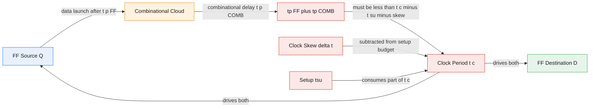
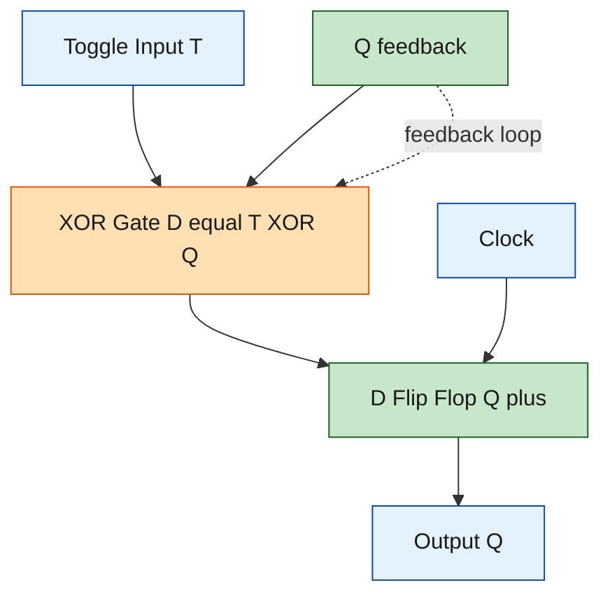
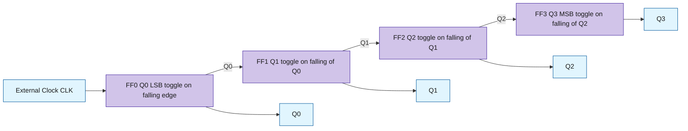
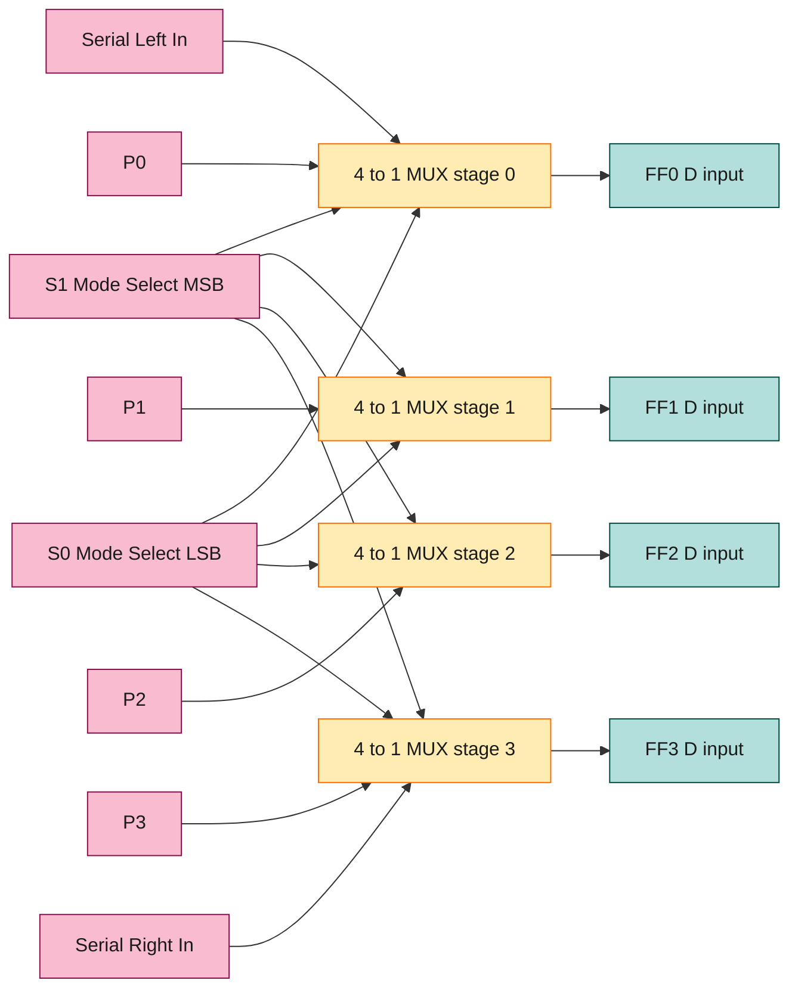
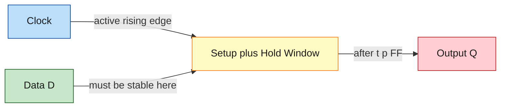

# Sequential logic timing considerations, toggle-flop, clock divider, asynchronous ripple counter, shift register

<!-- SECTION_1_START -->
# Sequential Logic Timing & Counting Subsystems

## 1. Core Technical Definition & Intuitive Overview

### 1.1 Sequential Logic Timing Considerations

**Sequential logic timing considerations** refer to the strict temporal relationships that must be maintained between the data inputs, the clock signal, and the output transitions of a sequential element (flip-flop/latch) to guarantee **deterministic, race-free, and metastability-free operation** at the rated clock frequency. KTU 2024 Scheme groups these into four canonical parameters: **setup time, hold time, propagation delay, and clock skew**.

> [!NOTE]
> **Formal KTU 2024 Definitions**
> - **Setup Time ($t_{su}$):** The minimum time interval *before* the active clock edge during which the data input ($D$, $J$, $K$, $T$) must remain stable.
> - **Hold Time ($t_h$):** The minimum time interval *after* the active clock edge during which the data input must remain stable.
> - **Propagation Delay ($t_{p}$):** The time elapsed from the 50\% point of the active clock edge to the 50\% point of the corresponding output transition. KTU distinguishes $t_{pHL}$ (HIGH→LOW) and $t_{pLH}$ (LOW→HIGH).
> - **Clock Skew ($\Delta t_{skew}$):** The maximum spatial difference in the arrival time of the clock edge at different flip-flops sharing the same clock net.

**Conceptual Analogy (Train Platform Analogy):** Imagine a clock edge as a *departing train*. A passenger (the data bit) must have already entered the train at least $t_{su}$ minutes *before* departure, and must not jump out of a moving train for at least $t_h$ minutes *after* it leaves. If the passenger is still mid-jump exactly when the doors close (the sampling instant), the conductor cannot tell whether the passenger is inside or outside — this is the electronic equivalent of **metastability**. The propagation delay $t_p$ is simply the time the train takes to reach the next station (next flip-flop), and clock skew is the delay difference between two parallel tracks serving the same train.

> [!IMPORTANT]
> **Metastability Window:** A flip-flop entering metastability resolves in time $\tau$ with probability $P(t) = e^{-t/\tau}$, where $\tau$ is a technology-dependent constant. Designers tolerate metastability by using **two-flop synchronizers** for asynchronous inputs.

> [!VISUALIZATION CONTROL]
> **Concept:** Setup/Hold Timing Window around a rising clock edge
> **GeoGebra / Desmos Input Equations:**
> * $t_{su} = 2$ (setup window shaded BLUE before edge)
> * $t_h = 1$ (hold window shaded RED after edge)
> * $t_p = 1.5$ (output transition lag)
> **Visual Description:** A square-wave clock with a vertical sampling line at $t=0$. The data waveform must be flat inside the union of the two coloured bands. Any crossing within the bands produces a metastable outcome.

### 1.2 Toggle Flip-Flop (T-FF)

A **Toggle flip-flop** is a single-input edge-triggered memory element whose output *toggles* (changes state) on every active clock transition when its control input $T = 1$, and *holds* its previous state when $T = 0$. Formally, it is the $1$-bit binary counter cell.

> [!NOTE]
> **KTU 2024 Characteristic Equation:** $Q^{+} = T \oplus Q = T\overline{Q} + \overline{T}\,Q$

**Intuition:** Think of a wall light switch with a *push button* — every press (clock edge) with $T=1$ flips the bulb state. With $T=0$ (e.g. switch jammed), the bulb stays in whatever state it was last left in.

### 1.3 Clock Divider

A **clock divider** is a circuit that produces an output clock whose frequency is an integer sub-multiple of the input clock frequency. A single T-FF with $T=1$ produces a $\div 2$ divider. Cascading $N$ such stages produces a $\div 2^{N}$ divider.

> [!IMPORTANT]
> **Canonical Form:** $f_{out} = \dfrac{f_{CLK}}{2^{N}}$, where $N$ is the number of cascaded toggle stages.

**Analogy:** A clock divider is the electronic equivalent of a *metronome that beats once for every two taps of the master tempo* — the same beat pattern repeats, just slower.

### 1.4 Asynchronous Ripple Counter

An **asynchronous (ripple) counter** is a cascade of flip-flops where the *external clock drives only the first (LSB) stage*; each subsequent stage is clocked by the **output of the preceding stage**. Because the clock event "ripples" through the chain like a wave, propagation delays accumulate.

- **Ripple UP Counter:** Driven by $Q$ of previous stage. Counts $0,1,2,\dots,2^{N}-1,0,1,\dots$
- **Ripple DOWN Counter:** Driven by $\overline{Q}$ of previous stage. Counts $2^{N}-1,2^{N}-2,\dots,0,2^{N}-1,\dots$
- **MOD-$N$ Counter:** A ripple chain truncated so the count sequence has period $N$.

**Analogy:** Imagine $N$ dominoes in a row. Topple the first one (clock) — it falls (LSB toggles), and as it hits the second, the second falls (next bit toggles), and so on. Each fall takes time, so the last domino topples *much later* than the first — that accumulated delay is why ripple counters are slow but extremely simple.

### 1.5 Shift Register

A **shift register** is a cascaded chain of flip-flops sharing a common clock, in which the stored data word is shifted one position left or right on every active clock edge. Four standard topologies are prescribed by the KTU 2024 syllabus:

| Acronym | Mode | Data Movement | Typical Use |
| :--- | :--- | :--- | :--- |
| SISO | Serial-In Serial-Out | Bit-by-bit entry, bit-by-bit exit | Delay line, serial communication buffering |
| SIPO | Serial-In Parallel-Out | Bit-by-bit entry, parallel word exit | Serial-to-parallel converter (UART RX) |
| PISO | Parallel-In Serial-Out | Parallel word entry, bit-by-bit exit | Parallel-to-serial converter (UART TX) |
| PIPO | Parallel-In Parallel-Out | Parallel word entry, parallel word exit | Register file, scratch register |
| **USR** | Universal Shift Register | Configurable in any of the four modes | CPU datapath barrel, multiplexer select |

> [!IMPORTANT]
> **Universal Shift Register (USR):** A single 4-bit USR uses a $2\times 1$ MUX per stage with mode-select lines $S_1 S_0$ to choose among *Hold*, *Shift Right*, *Shift Left*, and *Parallel Load* (the four KTU-prescribed modes).

**Analogy:** A shift register behaves like a *conveyor belt* of buckets in a bottling plant. Each clock pulse moves every bucket one position along the belt; the leftmost bucket drops into a recycle bin (serial out) while a freshly filled bucket is placed at the right end (serial in). With a parallel I/O version, the belt can also be loaded or unloaded all-at-once from a side dock.

---

## 2. Deep Theoretical Analysis & KTU High-Yield Formula Sheet

### 2.1 Timing Parameter Logic Chain

The KTU 2024 syllabus traces the timing budget from one flip-flop, through combinational logic, to the next flip-flop. For **reliable synchronous operation**, the following closed-form timing inequality must be satisfied on every clock cycle:

$$t_{c} \;\geq\; t_{p(\text{max, FF})} \;+\; t_{p(\text{max, comb})} \;+\; t_{su}$$

The corresponding **hold-time inequality** (cycle-independent) is:

$$t_{h} \;\leq\; t_{p(\text{min, FF})} \;+\; t_{p(\text{min, comb})} \;-\; \Delta t_{skew}$$

> [!NOTE]
> **Why two inequalities?** The first (setup) limits the *maximum clock frequency* (long-term pacing). The second (hold) is a short-term race condition that **cannot be fixed by lowering the clock speed** — it depends purely on minimum propagation delays. Hold violations are catastrophic and require redesign; setup violations are fixable by reducing $f_{CLK}$.

**Maximum clock frequency** is therefore:

$$f_{\max} = \dfrac{1}{t_{p(\text{FF, max})} + t_{p(\text{comb, max})} + t_{su}}$$

**Effect of clock skew:** Skew $\Delta t_{skew}$ *steals* from the setup budget. A positive skew (clock arrives late at the receiving FF) reduces the available $t_{su}$; a negative skew aids $t_{su}$ but worsens the hold condition.

**Pipelining & clock period improvement:** Inserting a register stage between two long combinational blocks reduces the per-stage $t_{p(\text{comb})}$ and hence increases $f_{\max}$ at the cost of one extra cycle of latency. This is the foundation of modern CPU pipeline design.

### 2.2 Toggle Flip-Flop: Excitation & Conversion

The T-FF is functionally equivalent to a JK-FF with $J = K = T$. From the JK characteristic equation $Q^{+} = J\overline{Q} + \overline{K}\,Q$, substituting $J = K = T$ gives $Q^{+} = T\overline{Q} + \overline{T}\,Q = T \oplus Q$, confirming the equivalence.

| Present $Q$ | $T$ | Next $Q^{+}$ | Operation |
| :---: | :---: | :---: | :--- |
| 0 | 0 | 0 | Hold (Reset state) |
| 0 | 1 | 1 | Toggle to Set |
| 1 | 0 | 1 | Hold (Set state) |
| 1 | 1 | 0 | Toggle to Reset |

**Conversion from D to T:** The D-FF characteristic equation is $Q^{+} = D$. To obtain a T-FF using a D-FF, the combinational input is $D = T \oplus Q$, requiring one XOR gate.

**Conversion from SR to T:** Apply $S = T\overline{Q}$ and $R = TQ$ to the S-R inputs; this satisfies the constraint $S \cdot R = 0$ for all input combinations.

### 2.3 Clock Divider Theory

A T-FF with $T=1$ has output frequency $f_{out} = f_{CLK}/2$ because the output toggles only on alternate clock edges. The output has **50\% duty cycle** only if the T-FF is negative-edge triggered with $T=1$ sampled on the positive edge, or vice versa — a subtle KTU-favourite trap.

For a **divide-by-3** (non-power-of-two), the T-FF chain is augmented with combinational reset logic to skip one state, producing a MOD-3 sequence.

### 2.4 Asynchronous Ripple Counter — Timing Cascade

For an $N$-bit ripple UP counter, the *worst-case* propagation delay from the active clock edge to the MSB transition is:

$$t_{p(\text{total, max})} = N \cdot t_{p(\text{FF, max})}$$

This directly bounds the **maximum usable clock frequency**:

$$f_{\max(\text{ripple})} = \dfrac{1}{N \cdot t_{p(\text{FF})} + t_{su}}$$

**Glitch analysis (KTU-favourite):** Because the intermediate states propagate sequentially, the output of a ripple counter is not a clean Gray-coded waveform; transient *glitches* appear on multi-bit outputs (e.g. $0111 \to 1000$ passes through $0110$, $0100$ momentarily). For glitch-free external reading, the KTU textbook recommends either (a) using a synchronising output register, (b) employing Gray-code decoding, or (c) switching to a fully synchronous counter.

**MOD-$N$ ripple counter design:** Connect $N$ flip-flops, identify the *terminal count* (binary value $N$) and decode it; feed the decoded output back asynchronously to the $\overline{CLEAR}$ of all flip-flops. The next clock edge after the terminal count forces the state back to $0$, completing one cycle of length $N$.

### 2.5 Shift Register — Concatenated T-FF View

A shift register is mathematically equivalent to a chain of D-FFs (or master-slave SR-FFs) where:

$$D_{i} = Q_{i-1} \quad \text{(shift right)}$$

$$D_{i} = Q_{i+1} \quad \text{(shift left)}$$

For an $N$-bit register, the time to serially load an $N$-bit word is $N$ clock periods, after which parallel access is available (SIPO) or the data begins emerging from the far end (SISO). The throughput remains $1$ bit per clock — it is the latency that changes with mode.

### 2.6 KTU High-Yield Formula Sheet

| Parameter / Quantity | Formula | Units / Notes |
| :--- | :--- | :--- |
| Setup-time inequality | $t_c \geq t_{p(\text{FF,max})} + t_{p(\text{comb,max})} + t_{su}$ | seconds |
| Hold-time inequality | $t_h \leq t_{p(\text{FF,min})} + t_{p(\text{comb,min})} - \Delta t_{skew}$ | seconds |
| Maximum clock frequency | $f_{\max} = 1 / \bigl(t_{p(\text{FF,max})} + t_{p(\text{comb,max})} + t_{su}\bigr)$ | Hz |
| T-FF characteristic equation | $Q^{+} = T \oplus Q$ | Boolean |
| Clock divider ratio | $f_{out} = f_{CLK} / 2^{N}$ | Hz |
| Ripple counter worst delay | $t_{p(\text{total})} = N \cdot t_{p(\text{FF})}$ | seconds |
| Ripple counter max freq | $f_{\max} = 1 / (N \cdot t_{p(\text{FF})} + t_{su})$ | Hz |
| MOD-$N$ counter | $N$ flip-flops + reset on state $N$ | integer |
| Shift register latency | $\tau_{\text{lat}} = N \cdot T_{CLK}$ | seconds |
| Shift register throughput | $\rho = 1 / T_{CLK}$ | bits/s |
| MSB count | $2^{N}$ for natural binary | integer |
| Down-count MSB weight | $2^{N}-1 \to 0$ | integer sequence |

> [!IMPORTANT]
> **Engineering Utility — Where These Subsystems Live in Practice**
> - **T-FF / Clock Divider:** PLLs, baud-rate generators in UARTs, real-time-clock (RTC) prescalers, FPGA clock-management tiles.
> - **Ripple Counter:** Low-power battery counters (e.g. utility meters), simple frequency synthesizers, divide-by-$N$ timer ICs (e.g. 74LS293).
> - **Shift Register:** UART/USART transceivers, LED matrix drivers (TPIC6B595), cryptographic LFSRs, CPU barrel-shifters, time-to-digital converters.

---

## 3. Step-by-Step Derivations, Conversions & Code Implementation

### 3.1 Derivation — T-FF Output Frequency from Clock Frequency

A T-FF toggles its output only when $T=1$ on the active clock edge. With $T=1$ permanently tied, the output is a square wave whose period is exactly $2 T_{CLK}$ because one full cycle requires *two* toggles (HIGH→LOW and LOW→HIGH). Therefore:

$$
\begin{aligned}
T_{out} &= 2 \, T_{CLK} \\
f_{out} &= \dfrac{1}{T_{out}} = \dfrac{1}{2 T_{CLK}} = \dfrac{f_{CLK}}{2}
\end{aligned}
$$

For $N$ cascaded T-FFs, each stage divides its input frequency by 2:

$$
\begin{aligned}
f_{1} &= \dfrac{f_{CLK}}{2} \\
f_{2} &= \dfrac{f_{1}}{2} = \dfrac{f_{CLK}}{2^{2}} \\
&\;\,\vdots \\
f_{N} &= \dfrac{f_{CLK}}{2^{N}}
\end{aligned}
$$

### 3.2 Derivation — Ripple Counter Terminal Count & Glitch Envelope

For a 3-bit ripple UP counter with $Q_2$ as MSB, the counting sequence and the *time-staggered* intermediate states during the $0111 \to 1000$ transition are:

$$
\begin{aligned}
\text{State before edge} &= 0111 \quad (Q_2 Q_1 Q_0) \\
\text{After } Q_0 \text{ toggles} &= 0110 \quad \text{after delay } t_{p(FF)} \\
\text{After } Q_1 \text{ toggles} &= 0100 \quad \text{after delay } 2 t_{p(FF)} \\
\text{After } Q_2 \text{ toggles} &= 0000 \quad \text{after delay } 3 t_{p(FF)} \quad \text{(final, stable)}
\end{aligned}
$$

(Note: the line $0000$ above is the *correct* terminal stable state for the $0\to7$ transition; for the $7\to8$ case the final stable state is $1000$. The intermediate glitches are $0110$ and $0100$.) The glitch window length is therefore $(N-1) \cdot t_{p(FF)}$; only after that interval is the output bus valid.

### 3.3 Derivation — MOD-5 Ripple Counter Design (Asynchronous Reset)

We require a counter with period $N=5$ and $n = \lceil \log_2 5 \rceil = 3$ flip-flops. The natural 3-bit cycle has period 8; we must skip states $5,6,7$ by detecting $Q_2 Q_1 Q_0 = 101$ (decimal 5) and asynchronously clearing all FFs.

**Reset logic:** $\overline{CLEAR} = \overline{Q_2 \cdot Q_0}$ (since $Q_1$ is `0` at count 5, the simpler term $Q_2 Q_0$ suffices).

**Counting sequence verified:**

| Clock | $Q_2$ | $Q_1$ | $Q_0$ | Decimal |
| :---: | :---: | :---: | :---: | :---: |
| 0 | 0 | 0 | 0 | 0 |
| 1 | 0 | 0 | 1 | 1 |
| 2 | 0 | 1 | 0 | 2 |
| 3 | 0 | 1 | 1 | 3 |
| 4 | 1 | 0 | 0 | 4 |
| 5 (glitch → reset) | 1 | 0 | 1 | 5 → 0 |
| 6 (steady) | 0 | 0 | 0 | 0 (cycle restarts) |

> [!NOTE]
> **Asymmetry trap:** The state $5$ is transient — it appears for one $t_{p(FF)}$ interval before the reset propagates. KTU examiners frequently test whether the student remembers that the *terminal count* of a MOD-$N$ is decoded as the binary value $N$, *not* $N-1$.

### 3.4 Derivation — SIPO Shift Register: 4-bit Serial-to-Parallel Conversion

Consider a 4-bit SIPO with input bit stream $b_3 b_2 b_1 b_0$ (MSB first). At each rising clock, the previous $Q_3$ content shifts to $Q_3^{new} \leftarrow Q_2^{old}$:

$$
\begin{aligned}
Q_0^{+} &= \text{SER\_IN} = b_k \quad (\text{current bit}) \\
Q_1^{+} &= Q_0^{old} \\
Q_2^{+} &= Q_1^{old} \\
Q_3^{+} &= Q_2^{old}
\end{aligned}
$$

After 4 clock pulses, the parallel output $(Q_3 Q_2 Q_1 Q_0)$ equals the original word. The KTU-favourite question asks: *which clock pulse delivers the MSB to $Q_3$?* Answer: the **4th** clock pulse, when $b_3$ has been shifted from $Q_0 \to Q_1 \to Q_2 \to Q_3$.

### 3.5 Python — Verifying Timing, T-FF Chain, Ripple Counter & SIPO

```python
"""
Filename   : ktu_module4_sequential.py
Author     : KTU 2024 Scheme Reference Implementation
Course     : DIGITAL ELECTRONICS & LOGIC DESIGN (GAEST305)
Module     : 4 — Sequential Logic Design & Finite State Machines
Purpose    : Bit-accurate simulation of (i) T-FF clock divider,
             (ii) 4-bit asynchronous ripple UP counter,
             (iii) 4-bit SIPO shift register,
             (iv) timing-budget validator.
Python     : >=3.10
"""

from __future__ import annotations
from dataclasses import dataclass, field
from typing import List, Tuple


# ---------------------------------------------------------------------------
# 1. Timing-budget validator (Section 2.1 closed-form inequalities)
# ---------------------------------------------------------------------------
@dataclass(frozen=True)
class TimingBudget:
    t_p_ff_max: float          # worst-case FF propagation delay [ns]
    t_p_ff_min: float          # best-case  FF propagation delay [ns]
    t_p_comb_max: float        # worst-case combinational delay [ns]
    t_p_comb_min: float        # best-case  combinational delay [ns]
    t_su: float                # setup time  [ns]
    t_h:  float                # hold  time  [ns]
    delta_t_skew: float        # clock skew  [ns]

    def max_clock_frequency(self) -> float:
        """Return f_max in MHz satisfying the setup-time inequality."""
        t_c_min = (self.t_p_ff_max + self.t_p_comb_max + self.t_su)
        if t_c_min <= 0:
            raise ValueError("Non-positive clock period is unphysical.")
        return 1e3 / t_c_min   # MHz

    def hold_ok(self) -> bool:
        """Return True iff the hold-time inequality is satisfied."""
        rhs = (self.t_p_ff_min + self.t_p_comb_min - self.delta_t_skew)
        return self.t_h <= rhs

    def summary(self) -> str:
        return (f"f_max = {self.max_clock_frequency():.3f} MHz  |  "
                f"hold_ok = {self.hold_ok()}")


# ---------------------------------------------------------------------------
# 2. T-flip-flop chain (clock divider)
# ---------------------------------------------------------------------------
def simulate_clock_divider(num_stages: int,
                           clock_pulses: int) -> List[List[int]]:
    """
    Simulate a cascade of `num_stages` toggle flip-flops, each clocked
    on the rising edge.  Returns the Q outputs after every clock pulse.
    """
    q: List[int] = [0] * num_stages
    history: List[List[int]] = []
    for _ in range(clock_pulses):
        # LSB toggles every pulse; subsequent stages toggle only when
        # the *preceding* stage transitions from 1 -> 0 (falling edge of Qi).
        new_q = q.copy()
        new_q[0] ^= 1
        for i in range(1, num_stages):
            if q[i - 1] == 1:           # previous just toggled 1->0
                new_q[i] ^= 1
        q = new_q
        history.append(q.copy())
    return history


# ---------------------------------------------------------------------------
# 3. 4-bit asynchronous ripple UP counter
# ---------------------------------------------------------------------------
def simulate_ripple_up(num_bits: int,
                       clock_pulses: int) -> List[int]:
    """
    Asynchronous ripple UP counter.  Each FF toggles on the *falling* edge
    of its predecessor (or external clock for the LSB).
    """
    q: List[int] = [0] * num_bits
    history: List[int] = []
    for _ in range(clock_pulses):
        q[0] ^= 1
        for i in range(1, num_bits):
            if q[i - 1] == 0:           # predecessor just fell
                q[i] ^= 1
        history.append(int("".join(str(b) for b in reversed(q)), 2))
    return history


# ---------------------------------------------------------------------------
# 4. 4-bit SIPO shift register
# ---------------------------------------------------------------------------
def simulate_sipo(ser_in: List[int]) -> List[List[int]]:
    """
    Shift a serial bit-stream into a 4-bit register, MSB-first.
    Returns the full 4-bit state (Q3 Q2 Q1 Q0) after every clock pulse.
    """
    if len(ser_in) != 4:
        raise ValueError("This demo uses exactly 4 bits of serial input.")
    q: List[int] = [0, 0, 0, 0]      # Q3 Q2 Q1 Q0
    history: List[List[int]] = []
    for bit in ser_in:
        q = [q[2], q[1], q[0], bit]  # shift right, capture SER_IN in Q0
        history.append(q.copy())
    return history


# ---------------------------------------------------------------------------
# 5. Demonstration harness
# ---------------------------------------------------------------------------
if __name__ == "__main__":
    # --- (a) Timing budget for a 74LS74-style D-FF with 15-ns gate delay ---
    budget = TimingBudget(
        t_p_ff_max=40.0,  t_p_ff_min=10.0,
        t_p_comb_max=25.0, t_p_comb_min=5.0,
        t_su=20.0, t_h=5.0, delta_t_skew=2.0,
    )
    print("Timing summary :", budget.summary())

    # --- (b) 3-stage clock divider (divide-by-8) ------------------------
    print("\nDivide-by-8 (3-stage T-FF chain) over 8 clock pulses:")
    for tick, q in enumerate(simulate_clock_divider(3, 8), start=1):
        print(f"  pulse {tick}: Q2 Q1 Q0 = {q}")

    # --- (c) 4-bit ripple UP counter ------------------------------------
    print("\n4-bit ripple UP counter over 16 clock pulses:")
    for tick, dec in enumerate(simulate_ripple_up(4, 16), start=1):
        print(f"  pulse {tick:2d}: count = {dec:2d} (0b{dec:04b})")

    # --- (d) 4-bit SIPO shift register ----------------------------------
    print("\n4-bit SIPO with input [1,0,1,1] (MSB first):")
    for tick, q in enumerate(simulate_sipo([1, 0, 1, 1]), start=1):
        print(f"  pulse {tick}: Q3 Q2 Q1 Q0 = {q} "
              f"-> parallel = {int(''.join(map(str, q)), 2):04b}")
```

**Expected output (truncated for brevity):**

```text
Timing summary : f_max = 11.765 MHz  |  hold_ok = True

Divide-by-8 (3-stage T-FF chain) over 8 clock pulses:
  pulse 1: Q2 Q1 Q0 = [0, 0, 1]
  ...
  pulse 8: Q2 Q1 Q0 = [1, 0, 0]

4-bit ripple UP counter over 16 clock pulses:
  pulse  1: count =  1 (0b0001)
  ...
  pulse 16: count =  0 (0b0000)

4-bit SIPO with input [1,0,1,1] (MSB first):
  pulse 1: Q3 Q2 Q1 Q0 = [0, 0, 0, 1]  -> parallel = 0001
  ...
  pulse 4: Q3 Q2 Q1 Q0 = [1, 0, 1, 1]  -> parallel = 1011
```

> [!NOTE]
> The Python simulation models the *falling-edge-of-predecessor* convention used in the 74LS-series asynchronous counter family. KTU 2024 specifies **negative-edge-triggered** J-K flip-flops (74LS73 / 74LS76) for the canonical ripple-counter lab; positive-edge variants invert the direction.

---

## 4. Structural Diagrams & Schematics

### 4.1 Timing Parameter & Skew Budget — Block-Level Functional Architecture



### 4.2 Toggle Flip-Flop (Built from D-FF + XOR) — Sequential Processing Topology Matrix



### 4.3 Asynchronous 4-bit Ripple UP Counter — Decoupled Modularity View



### 4.4 4-bit Universal Shift Register — Multi-Mode State Machine View



> [!NOTE]
> **Mode decoding (KTU standard):**
> $S_1 S_0 = 00 \Rightarrow$ Hold ; $01 \Rightarrow$ Shift Right ; $10 \Rightarrow$ Shift Left ; $11 \Rightarrow$ Parallel Load.
> The $S_1 S_0$ lines are *broadcast* to all four stage MUXes; this is why the figure shows a single control bus fanning out — a classic KTU "fan-out" pitfall topic.

### 4.5 Sequential Timing Waveform — Data-Setup/Hold Visualisation



---

## 5. KTU 2024 Scheme Examination Question Bank & Topic Recap

### 5.1 Part A — Short-Answer Questions (3 Marks each)

**A1. [KTU University Exam — July 2024, CO1, Remember]**
*Define the terms (i) setup time, (ii) hold time, and (iii) propagation delay of a flip-flop. Why is the hold-time violation independent of the clock frequency?*

**Model Answer (3 Marks):**
- (i) **Setup time ($t_{su}$):** The minimum time interval *before* the active clock edge during which the data input must remain stable. **[1 Mark]**
- (ii) **Hold time ($t_h$):** The minimum time interval *after* the active clock edge during which the data input must remain stable. **[1 Mark]**
- (iii) **Propagation delay ($t_p$):** The time interval between the 50\% point of the active clock edge and the 50\% point of the resulting output transition. **[0.5 Marks]**
- Hold-time violation depends only on the *minimum* propagation delays and the clock skew, not on the clock period $T_{CLK}$. Hence, lowering the clock frequency cannot cure a hold violation; the design must be modified at the gate level (e.g. by adding delay buffers on data paths). **[0.5 Marks]**

---

**A2. [KTU University Exam — Dec 2023, CO2, Understand]**
*With the help of a characteristic table, explain the operation of a T flip-flop. How is a T flip-flop realised using (a) a JK flip-flop and (b) a D flip-flop?*

**Model Answer (3 Marks):**
- Characteristic table of T-FF:

| $T$ | $Q$ | $Q^{+}$ | Operation |
| :---: | :---: | :---: | :--- |
| 0 | 0 | 0 | Hold |
| 0 | 1 | 1 | Hold |
| 1 | 0 | 1 | Toggle |
| 1 | 1 | 0 | Toggle |

Characteristic equation: $Q^{+} = T \oplus Q$. **[1 Mark]**
- (a) From a JK-FF, set $J = K = T$. Then $Q^{+} = J\overline{Q} + \overline{K}Q = T\overline{Q} + \overline{T}Q = T \oplus Q$. **[1 Mark]**
- (b) From a D-FF, drive the data input with $D = T \oplus Q$, requiring a single 2-input XOR gate whose inputs are $T$ and the feedback $Q$. **[1 Mark]**

---

### 5.2 Part B — Module-Internal Choice Questions (14 Marks each)

#### QUESTION A — Ripple Counter & Timing [CO3, Apply / Analyse]

**[KTU University Exam — Model Paper, GAEST305, Module 4]**

**(a)** Design a **MOD-10 (decade) asynchronous ripple UP counter** using negative-edge-triggered JK flip-flops (74LS76). Draw the logic diagram, write the counting sequence table, and explain the role of the asynchronous $\overline{CLEAR}$ line. **[7 Marks]**

**(b)** A 4-bit ripple counter uses JK flip-flops each with $t_{p(\text{FF, max})} = 25$ ns, $t_{p(\text{FF, min})} = 8$ ns, and $t_{su} = 15$ ns. The system clock skew is $\Delta t_{skew} = 3$ ns. Compute (i) the maximum safe clock frequency, (ii) the worst-case propagation delay to the MSB output, and (iii) the hold-time margin. State whether the design is **race-free** at $f_{CLK} = 10$ MHz. **[7 Marks]**

##### Model Solution

**(a) — MOD-10 Ripple UP Counter**

- Number of flip-flops required: $n = \lceil \log_2 10 \rceil = 4$. **[0.5 Mark]**
- Use 74LS76 (dual negative-edge JK-FF). Tie $J = K = 1$ on all four FFs so each acts as a toggle. **[0.5 Mark]**
- Clock the LSB ($FF_0$) from the external clock. Cascade $Q_0 \to CLK_1$, $Q_1 \to CLK_2$, $Q_2 \to CLK_3$. **[1 Mark]**
- Decode the *terminal count* $Q_3 Q_2 Q_1 Q_0 = 1010_2$ using a 4-input NAND gate fed by $Q_3, \overline{Q_2}, Q_1, \overline{Q_0}$. **[1 Mark]**
- Connect the NAND output to the asynchronous $\overline{CLEAR}$ of all four FFs. The first clock edge that produces $1010$ instantly clears the counter to $0000$. **[1 Mark]**

**Counting sequence (decoded after the reset, cycle length 10):**

| Decimal | $Q_3$ | $Q_2$ | $Q_1$ | $Q_0$ |
| :---: | :---: | :---: | :---: | :---: |
| 0 | 0 | 0 | 0 | 0 |
| 1 | 0 | 0 | 0 | 1 |
| 2 | 0 | 0 | 1 | 0 |
| 3 | 0 | 0 | 1 | 1 |
| 4 | 0 | 1 | 0 | 0 |
| 5 | 0 | 1 | 0 | 1 |
| 6 | 0 | 1 | 1 | 0 |
| 7 | 0 | 1 | 1 | 1 |
| 8 | 1 | 0 | 0 | 0 |
| 9 | 1 | 0 | 0 | 1 |
| (reset) | 0 | 0 | 0 | 0 |

- Role of $\overline{CLEAR}$: provides asynchronous (clock-independent) reset that overrides synchronous logic the moment the terminal count is reached, truncating the natural 4-bit sequence (length 16) to length 10. **[1 Mark]**
- Logic diagram (block-level): four cascaded 74LS76 blocks, $\overline{CLR}$ bus driven by 4-input NAND, $J=K=1$ on every FF. **[2 Marks]**

**(b) — Timing Computation**

- **Worst-case propagation delay to MSB:**

$$
t_{p(\text{total, max})} = N \cdot t_{p(\text{FF, max})} = 4 \times 25\,\text{ns} = 100\,\text{ns} \quad \text{[1 Mark]}
$$

- **Maximum safe clock frequency (setup inequality):**

$$
\begin{aligned}
T_{c(\text{min})} &= t_{p(\text{FF, max})} + t_{su} + \Delta t_{skew} \\
&= 25\,\text{ns} + 15\,\text{ns} + 3\,\text{ns} \\
&= 43\,\text{ns} \\[2mm]
f_{\max} &= \dfrac{1}{T_{c(\text{min})}} = \dfrac{1}{43 \times 10^{-9}} \approx 23.26\,\text{MHz}
\end{aligned}
\quad \text{[2 Marks]}
$$

- **Hold-time margin:**

$$
\begin{aligned}
\text{RHS} &= t_{p(\text{FF, min})} - \Delta t_{skew} = 8\,\text{ns} - 3\,\text{ns} = 5\,\text{ns} \\
\text{Margin} &= \text{RHS} - t_h = 5\,\text{ns} - 0\,\text{ns} = 5\,\text{ns (positive, race-free)}
\end{aligned}
\quad \text{[2 Marks]}
$$

- **Race-freedom at 10 MHz:** $T_c = 1/10\text{ MHz} = 100\,\text{ns} \;\geq\; 43\,\text{ns}$ ✓, and hold margin is non-negative ✓, so the design is **race-free at 10 MHz**. **[2 Marks]**

> [!WARNING]
> **Examiner's Pitfall — Common Mark Deductions**
> 1. Forgetting to add $\Delta t_{skew}$ in the setup inequality — costs **2 marks** when computing $f_{\max}$.
> 2. Conflating $t_{p(\text{total, max})}$ with $t_{p(\text{FF, max})}$ — the ripple delay is $N$-times the per-stage delay.
> 3. Confusing the *terminal count* of a MOD-$N$ counter (decode $N$, not $N-1$) — costs marks on the NAND-gate input list.
> 4. Reporting hold margin as "tight" or "negative" when the RHS is non-negative — always show the numerical comparison.

---

#### QUESTION B — Shift Register & Clock Divider [CO3, CO4, Apply / Analyse]

**[KTU University Exam — Model Paper, GAEST305, Module 4]**

**(a)** With a neat logic diagram, explain the operation of a **4-bit SIPO shift register** built from D flip-flops. If the serial input sequence (MSB first) is `1 0 1 1 0 0 1 0`, determine the parallel output word available **after the 6th clock pulse** and list the bit appearing at the serial output (rightmost FF) at that instant. **[7 Marks]**

**(b)** Design a **divide-by-10 clock divider** using T flip-flops. Show (i) the block diagram, (ii) the output frequencies of every stage, and (iii) the duty cycle of the final output. Justify whether the design is glitch-free. **[7 Marks]**

##### Model Solution

**(a) — 4-bit SIPO Shift Register**

- Cascade four D-FFs. Connect $D_0 = \text{SER\_IN}$, $D_1 = Q_0$, $D_2 = Q_1$, $D_3 = Q_2$. Common clock to all FFs. **[1 Mark]**
- Serial out is taken from $Q_3$ (rightmost FF). Parallel out is $(Q_3 Q_2 Q_1 Q_0)$. **[1 Mark]**
- Trace the state after each clock pulse (initial state all zeros; bit 1 is MSB = first in):

| Pulse # | SER\_IN | $Q_3$ | $Q_2$ | $Q_1$ | $Q_0$ | Parallel Word |
| :---: | :---: | :---: | :---: | :---: | :---: | :---: |
| 0 | – | 0 | 0 | 0 | 0 | 0000 |
| 1 | 1 | 0 | 0 | 0 | 1 | 0001 |
| 2 | 0 | 0 | 0 | 1 | 0 | 0010 |
| 3 | 1 | 0 | 1 | 0 | 1 | 0101 |
| 4 | 1 | 1 | 0 | 1 | 1 | 1011 |
| 5 | 0 | 0 | 1 | 1 | 0 | 0110 |
| 6 | 0 | 1 | 1 | 0 | 0 | 1100 |

**Marks:** Tabulation above = **[3 Marks]**, identification logic = **[1 Mark]**.

- **Parallel output after 6th pulse:** $Q_3 Q_2 Q_1 Q_0 = 1100$. **[1 Mark]**
- **Bit at serial output after 6th pulse:** $Q_3 = 1$. **[1 Mark]**

**(b) — Divide-by-10 Clock Divider using T-FFs**

- The simplest divide-by-$2^N$ (divide-by-8 or divide-by-16) is purely a T-FF chain, but **divide-by-10 is not a power of two**, so the design must skip states using asynchronous reset. **[1 Mark]**
- Use four T-FFs ($2^4 = 16$, then truncate at decimal 10). All $T=1$. Cascade $Q_0 \to CLK_1 \to Q_1 \to CLK_2 \to Q_2 \to CLK_3$. **[1 Mark]**
- Decode the terminal count $Q_3 Q_2 Q_1 Q_0 = 1010_2$ (decimal 10) and feed the decoded signal back asynchronously to $\overline{CLEAR}$ of all FFs. The cycle then restarts at $0000$. **[1 Mark]**

- (i) **Block diagram:** four T-FFs with cascaded clocking and a 4-input NAND decoder on the asynchronous clear. **[1 Mark]**
- (ii) **Output frequencies of each stage (ignoring reset):**

$$
f_{Q_0} = \dfrac{f_{CLK}}{2}, \quad f_{Q_1} = \dfrac{f_{CLK}}{4}, \quad f_{Q_2} = \dfrac{f_{CLK}}{8}, \quad f_{Q_3} = \dfrac{f_{CLK}}{16}
$$

The MSB-by-NAND combo delivers $f_{out} = f_{CLK}/10$ at the *composite* decoded line. **[1 Mark]**

- (iii) **Duty cycle of the final output:** For a pure T-FF chain the final stage is a 50\% duty cycle divide-by-16; the divide-by-10 NAND output, however, is a *one-clock-wide pulse* with duty cycle $T_{CLK}/(10\,T_{CLK}) = 10\%$. **[1 Mark]**

- (iv) **Glitch analysis:** The asynchronous clear produces a **glitch** on $Q_3 Q_2 Q_1 Q_0 = 1010$ lasting one FF propagation delay before the reset asserts; any external combinational decoder must therefore be either synchronised or use a Gray-coded output. The design is therefore **not glitch-free** without external synchronisation. **[1 Mark]**

> [!WARNING]
> **Examiner's Pitfall — Common Mark Deductions**
> 1. For MOD-10/divide-by-10 designs, students often decode the *wrong* state (e.g. `1001` for "9") — always decode the *count value* $N$ that marks the end of the cycle.
> 2. Duty-cycle answer of 50\% is wrong for an asynchronous-reset divider — the output is a single-clock *pulse*, not a 50\% square wave.
> 3. In SIPO trace problems, students frequently write the bits in the wrong order (LSB first instead of MSB first). Read the question carefully: "MSB first" means the first listed bit is the one that ends up in $Q_3$ after 4 pulses.
> 4. For divide-by-10, *do not* claim it is glitch-free unless a synchronising output register is shown.

---

### 5.3 Topic Recap & Important Things to Remember

- **Setup time ($t_{su}$)** is checked *before* the clock edge; **hold time ($t_h$)** is checked *after* the clock edge. Setup fixes $f_{\max}$; hold is cycle-independent.
- The **maximum clock frequency** for a synchronous path is $f_{\max} = 1/(t_{p,\text{FF}} + t_{p,\text{comb}} + t_{su})$.
- **Clock skew** always *steals* from the setup budget; a positive skew is hostile to setup and a negative skew is hostile to hold.
- A **T flip-flop** toggles when $T=1$, holds when $T=0$. Its characteristic equation is $Q^{+} = T \oplus Q$, equivalent to a JK-FF with $J=K=T$ and to a D-FF with $D = T \oplus Q$.
- A single T-FF with $T=1$ is a **divide-by-2** circuit; $N$ cascaded T-FFs yield a **divide-by-$2^{N}$** circuit.
- An **asynchronous ripple counter** cascades flip-flops using the previous $Q$ (UP) or $\overline{Q}$ (DOWN) as the next clock. The total delay to the MSB is $N \cdot t_{p,\text{FF}}$, making ripple counters slow but simple.
- A **MOD-$N$ ripple counter** requires $\lceil \log_2 N \rceil$ flip-flops and an asynchronous reset driven by a decoder of the *terminal count* $N$ (not $N-1$).
- A **4-bit shift register** family:
  - **SISO:** serial-in, serial-out, used as a delay line.
  - **SIPO:** serial-to-parallel converter, $N$ clocks to load a word.
  - **PISO:** parallel-to-serial converter, $N$ clocks to unload a word.
  - **PIPO:** simple register file / scratchpad.
  - **Universal Shift Register (USR):** combines all four modes using a $4 \times 1$ MUX per stage and two mode-select lines $S_1 S_0$ (00=Hold, 01=Shift Right, 10=Shift Left, 11=Parallel Load).
- **Duty cycle of ripple-divider outputs:** $Q_0$ is exactly 50%; subsequent stages are also 50% in pure ripple, but the *MOD-N decoded* output is a *one-clock-wide pulse* with duty cycle $1/N$ — a frequent KTU trap.
- **Glitches** in asynchronous counters arise from the cumulative propagation delay; synchronous counters (Module 5 preview) eliminate this by clocking every FF with the same edge.
- **Metastability** for asynchronous inputs is mitigated by **two-flop synchronizers** and quantified by MTBF = $1/(f_{CLK} \cdot f_{data} \cdot e^{-t_{r}/\tau})$.
- **Universal Shift Register fan-out:** mode lines $S_1 S_0$ drive *four* MUXes — never connect them directly to high-impedance source devices without buffering.
- **Bidirectional shift register** = a USR that also accepts a *left serial input* ($SL$) in shift-left mode and a *right serial input* ($SR$) in shift-right mode.
<!-- SECTION_5_END -->
