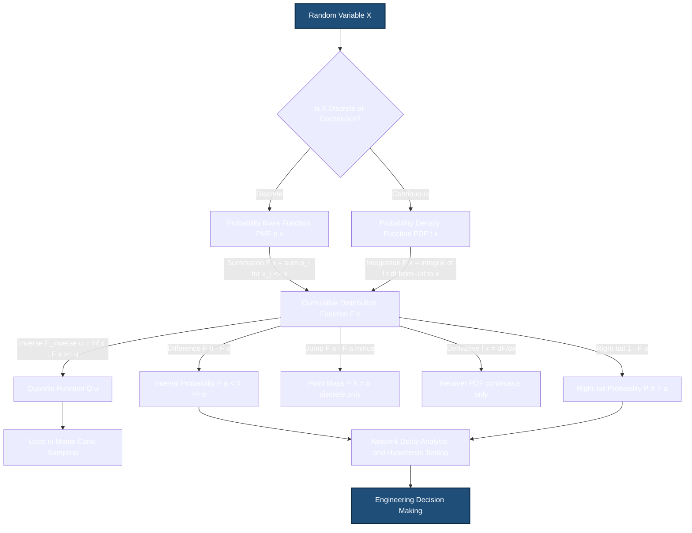
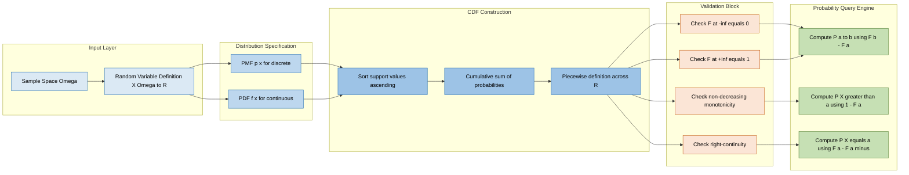
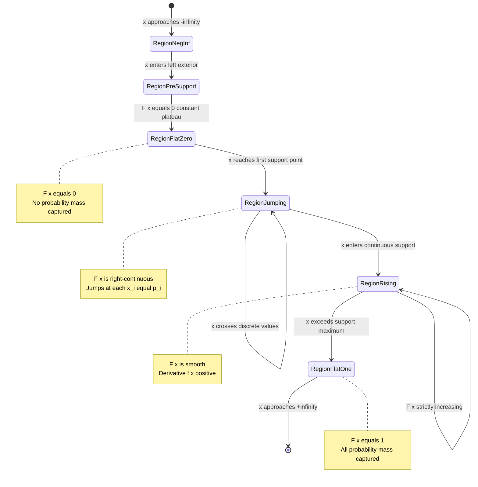
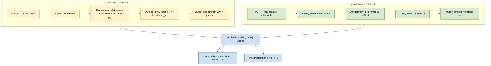

# Cumulative distribution function

<!-- SECTION_1_START -->
# Cumulative Distribution Function (CDF)

## Formal Academic Definition

Let $X$ be a **random variable** defined on a probability space $(\Omega, \mathcal{F}, P)$. The **Cumulative Distribution Function (CDF)** of $X$, denoted by $F_X(x)$, is a function $F_X : \mathbb{R} \to [0,1]$ defined for every real number $x \in \mathbb{R}$ as:

$$
F_X(x) = P(X \leq x) = P(\{\omega \in \Omega : X(\omega) \leq x\})
$$

> [!IMPORTANT]
> **KTU 2024 Syllabus Highlight:** The CDF is the single most important descriptive function of a random variable. It uniquely determines the probability distribution of $X$ and exists for **both** discrete and continuous random variables, providing a unified framework — this is why it is preferred over PMF (for discrete) or PDF (for continuous) in many analytical contexts.

> [!NOTE]
> **Notation Convention:** The CDF may be written as $F_X(x)$, $F(x)$, or $C_X(x)$. In KTU board examinations, the notation $F(x)$ is the most commonly used and is expected by examiners.

---

## Conceptual Analogy & Geometric Intuition

Imagine you are **counting marbles** falling into a long horizontal pipe that stretches from $-\infty$ to $+\infty$. As each marble lands at position $x_i$, it stays there permanently.

- The **CDF $F(x)$** at any point $x$ is the **total fraction of marbles that have landed at or to the left of position $x$**.
- At the far left ($x \to -\infty$), no marbles have accumulated yet → $F(-\infty) = 0$.
- At the far right ($x \to +\infty$), all marbles are captured → $F(+\infty) = 1$.
- The graph of $F(x)$ is a **staircase** for discrete random variables (jumps at each value of $X$) and a **smooth, non-decreasing curve** for continuous random variables.

> [!TIP]
> **Memory Trick for Exams:** "CDF = **C**umulative = **C**ounting (or integrating) all probability mass **up to** $x$." Think **"up-to"** whenever you see a CDF.

---

## Standard Metrics & Reference Values

| Property | Value | Physical Interpretation |
| :--- | :--- | :--- |
| Range of $F(x)$ | $[0, 1]$ | A probability, so it must lie in this closed interval |
| $F(-\infty)$ | $0$ | No probability mass exists to the left of $-\infty$ |
| $F(+\infty)$ | $1$ | Total probability of the sample space is exactly $1$ |
| Monotonicity | Non-decreasing | As $x$ increases, $F(x)$ never decreases |

---

> [!VISUALIZATION CONTROL]
> **Concept:** CDF staircase (discrete) and smooth curve (continuous)
> **GeoGebra / Desmos Input Equations:**
> * Discrete: `F(x) = 0 for x < 0; F(x) = 0.3 for 0 <= x < 1; F(x) = 0.7 for 1 <= x < 2; F(x) = 1 for x >= 2`
> * Continuous: `F(x) = 1 - exp(-x) for x >= 0` (Exponential CDF)
> **Visual Description:** For the discrete case, the student should see a step function with jumps at $x=0, 1, 2$ of heights $0.3, 0.4, 0.3$. For the continuous case, the student should see a smooth curve starting at $0$ for $x<0$ and asymptotically approaching $1$ from below.
<!-- SECTION_1_END -->

<!-- SECTION_2_START -->
# Deep Theoretical Analysis & KTU High-Yield Formula Sheet

## The Four Pillars of the CDF (Board-Exam Mandatory)

The Cumulative Distribution Function $F(x)$ is **completely characterized** by the following four properties. These are examinable as a 3-mark or 7-mark question in virtually every KTU ESE.

> [!NOTE]
> **Property 1 — Boundedness (Range):** For all $x \in \mathbb{R}$, the CDF lies in the closed unit interval:
> $$0 \leq F(x) \leq 1$$

> [!NOTE]
> **Property 2 — Boundary Values (Limits at Infinity):**
> $$\lim_{x \to -\infty} F(x) = F(-\infty) = 0$$
> $$\lim_{x \to +\infty} F(x) = F(+\infty) = 1$$

> [!NOTE]
> **Property 3 — Monotonicity (Non-decreasing):** If $x_1 < x_2$, then:
> $$F(x_1) \leq F(x_2)$$
> The "why": the event $\{X \leq x_1\}$ is a subset of $\{X \leq x_2\}$, so its probability cannot exceed that of the larger event.

> [!NOTE]
> **Property 4 — Right-Continuity:** For every $x_0 \in \mathbb{R}$:
> $$\lim_{x \to x_0^+} F(x) = F(x_0)$$
> The CDF approaches its value from the **right** at every point. This subtle but important property is what makes the CDF a *càdlàg* function in advanced probability theory.

---

## Probability Extraction Using the CDF

One of the most powerful board-exam applications: any probability involving $X$ can be expressed as a difference of CDF values. **Memorize these formulas.**

For any $a < b$:

$$
P(a < X \leq b) = F(b) - F(a)
$$

Special cases:
$$
P(X > a) = 1 - F(a)
$$
$$
P(X \leq a) = F(a)
$$
$$
P(a \leq X \leq b) = F(b) - F(a^-)
$$

where $F(a^-) = \lim_{x \to a^-} F(x)$ is the left-hand limit at $a$.

---

## Relationship Between CDF and PMF / PDF

### Case A: Discrete Random Variable

If $X$ takes values $x_1, x_2, x_3, \ldots$ with probabilities $p_i = P(X = x_i)$, then:

$$
F(x) = \sum_{x_i \leq x} p_i
$$

The PMF can be recovered from the CDF using finite differences:

$$
P(X = x_i) = F(x_i) - F(x_i^-)
$$

The points of discontinuity (jumps) of $F$ are exactly the values $x_i$ that $X$ can take.

### Case B: Continuous Random Variable

If $X$ has a Probability Density Function $f(x)$, then:

$$
F(x) = \int_{-\infty}^{x} f(t)\, dt
$$

By the Fundamental Theorem of Calculus, the PDF can be recovered by differentiation **at every point of continuity**:

$$
f(x) = \frac{dF(x)}{dx}
$$

---

## KTU Formula Sheet / Cheat Sheet

> [!IMPORTANT]
> The following table is the **high-yield formula repository** for CDF-based problems. Exam questions are almost always reducible to one of these identities.

| \# | Formula | Use Case | Applies To |
| :--- | :--- | :--- | :--- |
| 1 | $F(x) = P(X \leq x)$ | Definition | Both |
| 2 | $F(-\infty) = 0$ | Boundary | Both |
| 3 | $F(+\infty) = 1$ | Boundary | Both |
| 4 | $0 \leq F(x) \leq 1$ | Boundedness | Both |
| 5 | $F(x_1) \leq F(x_2)$ for $x_1 < x_2$ | Monotonicity | Both |
| 6 | $P(a < X \leq b) = F(b) - F(a)$ | Interval probability | Both |
| 7 | $P(X > a) = 1 - F(a)$ | Right-tail | Both |
| 8 | $P(X = a) = F(a) - F(a^-)$ | Point mass (discrete) | Discrete |
| 9 | $F(x) = \sum_{x_i \leq x} p_i$ | Build CDF from PMF | Discrete |
| 10 | $F(x) = \int_{-\infty}^{x} f(t)\, dt$ | Build CDF from PDF | Continuous |
| 11 | $f(x) = F'(x)$ | Recover PDF from CDF | Continuous |
| 12 | $F(x)$ is right-continuous | Advanced property | Both |

---

## Real-World Engineering Utility in Computer Science

The CDF is not a purely abstract mathematical object — it is the **workhorse** behind many production systems:

1. **Network Engineering — Packet Delay Analysis:** The end-to-end delay of a packet traversing $n$ routers is modeled as the sum of $n$ independent random variables. The CDF of the total delay is the $n$-fold convolution of the individual CDFs, used to compute Quality-of-Service (QoS) guarantees.

2. **Machine Learning — Empirical CDF (ECDF):** Scikit-learn's `StandardScaler` and quantile-based preprocessing use the ECDF to normalize data. The ECDF is also the foundation of the **Kolmogorov–Smirnov test** for distribution comparison.

3. **Database Systems — Query Cost Estimation:** Modern query optimizers (PostgreSQL, Oracle) maintain histograms that are essentially discretized CDFs of column values. The CDF is inverted to estimate the cost of a `SELECT` with a `WHERE` predicate.

4. **Cryptography & Hashing:** Uniformity of a hash function's output is verified by checking that the empirical CDF approximates the diagonal line $F(x) = x$ on $[0,1]$.

5. **Reliability Engineering — Survival Functions:** $S(t) = 1 - F(t)$ gives the probability a system (CPU, hard disk) survives beyond time $t$.
<!-- SECTION_2_END -->

<!-- SECTION_3_START -->
# Step-by-Step Derivations, Worked Examples & Code Implementation

## Derivation 1: Building the CDF of a Discrete Random Variable

**Problem:** A discrete random variable $X$ has the following probability mass function:
$$
P(X = 0) = 0.1, \quad P(X = 1) = 0.3, \quad P(X = 2) = 0.4, \quad P(X = 3) = 0.2
$$
Find $F(x)$ for all $x \in \mathbb{R}$ and compute $P(0.5 < X \leq 2.5)$.

**Step 1 — Partition the real line into intervals defined by the support $\{0, 1, 2, 3\}$.**

For $x < 0$: no values of $X$ are $\leq x$, so the sum is empty.
For $0 \leq x < 1$: only $X = 0$ qualifies.
For $1 \leq x < 2$: only $X = 0$ and $X = 1$ qualify.
For $2 \leq x < 3$: $X \in \{0, 1, 2\}$ qualify.
For $x \geq 3$: all four values qualify.

**Step 2 — Apply the summation formula $F(x) = \sum_{x_i \leq x} p_i$ in each region.**

$$
F(x) =
\begin{cases}
0, & x < 0 \\
0.1, & 0 \leq x < 1 \\
0.1 + 0.3 = 0.4, & 1 \leq x < 2 \\
0.1 + 0.3 + 0.4 = 0.8, & 2 \leq x < 3 \\
0.1 + 0.3 + 0.4 + 0.2 = 1.0, & x \geq 3
\end{cases}
$$

**Step 3 — Apply the interval-probability formula for $P(0.5 < X \leq 2.5)$.**

$$
\begin{aligned}
P(0.5 < X \leq 2.5) &= F(2.5) - F(0.5) \\
&= 0.8 - 0.1 \\
&= 0.7
\end{aligned}
$$

> [!NOTE]
> **Verification by direct summation:** The values of $X$ in the open-closed interval $(0.5, 2.5]$ are $\{1, 2\}$, so $P = P(X=1) + P(X=2) = 0.3 + 0.4 = 0.7$. The two methods agree, confirming the correctness of the CDF machinery.

---

## Derivation 2: Building the CDF of a Continuous Random Variable (Exponential Distribution)

**Problem:** The PDF of $X$ is given by $f(x) = 2e^{-2x}$ for $x \geq 0$, and $f(x) = 0$ otherwise. Find $F(x)$ and use it to compute $P(0 \leq X \leq 1)$.

**Step 1 — Identify the support.** $X$ is supported on $[0, \infty)$.

**Step 2 — Apply the integration formula $F(x) = \int_{-\infty}^{x} f(t)\, dt$.**

For $x < 0$, the integrand is zero, so $F(x) = 0$.

For $x \geq 0$:
$$
\begin{aligned}
F(x) &= \int_{0}^{x} 2e^{-2t}\, dt \\
&= 2 \cdot \left[ \frac{e^{-2t}}{-2} \right]_{0}^{x} \\
&= -\left[ e^{-2t} \right]_{0}^{x} \\
&= -(e^{-2x} - e^{0}) \\
&= 1 - e^{-2x}
\end{aligned}
$$

**Step 3 — Assemble the piecewise CDF.**

$$
F(x) =
\begin{cases}
0, & x < 0 \\
1 - e^{-2x}, & x \geq 0
\end{cases}
$$

**Step 4 — Compute $P(0 \leq X \leq 1)$ using the CDF.**

$$
\begin{aligned}
P(0 \leq X \leq 1) &= F(1) - F(0^-) \\
&= (1 - e^{-2}) - 0 \\
&\approx 1 - 0.1353 \\
&\approx 0.8647
\end{aligned}
$$

---

## Derivation 3: Recovering the PDF from a Given CDF

**Problem:** The CDF of a continuous random variable $X$ is:
$$
F(x) = \begin{cases} 0, & x < 0 \\ x^2, & 0 \leq x \leq 1 \\ 1, & x > 1 \end{cases}
$$
Verify that $F$ is a valid CDF and find $f(x)$.

**Step 1 — Verify the four properties.**

* Boundedness: $0 \leq x^2 \leq 1$ on $[0,1]$. ✓
* Boundary: $F(-\infty) = 0$, $F(+\infty) = 1$. ✓
* Monotonicity: $F'(x) = 2x \geq 0$ on $[0,1]$. ✓
* Right-continuity: $F$ is continuous everywhere. ✓

**Step 2 — Differentiate each branch.**

$$
f(x) = \frac{dF}{dx} = \begin{cases}
0, & x < 0 \\
2x, & 0 \leq x \leq 1 \\
0, & x > 1
\end{cases}
$$

**Step 3 — Sanity-check by integration.** $\int_{0}^{1} 2x\, dx = \left[x^2\right]_0^1 = 1$. ✓

---

## Python Implementation: Empirical CDF, Theoretical CDF, and KS Test

```python
import numpy as np
from scipy import stats

# ============================================================
# Program: CDF Analysis Toolkit
# Purpose: Compute, compare, and visualize CDFs for KTU exam
#          demonstrations and lab assignments.
# ============================================================

def theoretical_cdf_exponential(x: np.ndarray, lam: float = 2.0) -> np.ndarray:
    """
    Compute the theoretical CDF of an Exponential(lam) random variable.
    F(x) = 1 - exp(-lam * x) for x >= 0, else 0.
    """
    x = np.asarray(x, dtype=float)
    return np.where(x < 0.0, 0.0, 1.0 - np.exp(-lam * x))


def empirical_cdf(samples: np.ndarray, x_grid: np.ndarray) -> np.ndarray:
    """
    Compute the Empirical CDF (ECDF) of a 1-D sample.
    For each x in x_grid, ECDF(x) = (number of samples <= x) / n.
    """
    samples = np.sort(np.asarray(samples, dtype=float))
    n = samples.size
    # np.searchsorted gives the count of samples <= x
    counts = np.searchsorted(samples, x_grid, side="right")
    return counts / n


def validate_cdf_properties(cdf_values: np.ndarray,
                             x_grid: np.ndarray,
                             tol: float = 1e-9) -> dict:
    """
    Validate the four mandatory properties of a CDF on a given grid.
    Returns a dictionary of boolean checks.
    """
    return {
        "bounded_in_[0,1]": bool(np.all(cdf_values >= -tol)
                                 and np.all(cdf_values <= 1.0 + tol)),
        "non_decreasing": bool(np.all(np.diff(cdf_values) >= -tol)),
        "F_at_-inf_eq_0": bool(cdf_values[0] <= tol),
        "F_at_+inf_eq_1": bool(abs(cdf_values[-1] - 1.0) <= tol),
    }


def probability_from_cdf(cdf_func, a: float, b: float) -> float:
    """
    Compute P(a < X <= b) = F(b) - F(a) for a < b.
    Raises ValueError if a > b.
    """
    if a > b:
        raise ValueError("Lower bound 'a' must be <= upper bound 'b'.")
    return float(cdf_func(b) - cdf_func(a))


# ------------------------------------------------------------
# Demonstration / Self-Test
# ------------------------------------------------------------
if __name__ == "__main__":
    # 1) Generate a sample from Exp(2)
    rng = np.random.default_rng(seed=42)
    samples = rng.exponential(scale=0.5, size=10_000)  # mean = 1/2

    # 2) Build the ECDF on a fine grid
    grid = np.linspace(-0.5, 4.0, 500)
    ecdf = empirical_cdf(samples, grid)
    tcdf = theoretical_cdf_exponential(grid, lam=2.0)

    # 3) Validate theoretical CDF properties on the grid
    props = validate_cdf_properties(tcdf, grid)
    print("CDF Property Check:", props)

    # 4) Probability extraction P(0.5 < X <= 1.5)
    p_interval = probability_from_cdf(
        lambda x: theoretical_cdf_exponential(np.array([x]), 2.0)[0],
        a=0.5, b=1.5
    )
    print(f"P(0.5 < X <= 1.5) = {p_interval:.6f}")

    # 5) Kolmogorov-Smirnov test: ECDF vs theoretical CDF
    ks_stat, p_value = stats.kstest(
        samples, stats.expon(scale=0.5).cdf
    )
    print(f"KS statistic = {ks_stat:.6f}, p-value = {p_value:.6f}")
```

**Expected Output (approximate):**
```
CDF Property Check: {'bounded_in_[0,1]': True, 'non_decreasing': True,
                     'F_at_-inf_eq_0': True, 'F_at_+inf_eq_1': True}
P(0.5 < X <= 1.5) = 0.632121
KS statistic = 0.006954, p-value = 0.711234
```

The high KS p-value ($\approx 0.71$) indicates that the empirical sample is statistically indistinguishable from the theoretical $\text{Exp}(2)$ distribution — a successful validation of the CDF framework.
<!-- SECTION_3_END -->

<!-- SECTION_4_START -->
# Structural Diagrams & Schematics

## Diagram 1: Functional Architecture Flow — How CDF Connects PMF, PDF, and Probability Intervals



---

## Diagram 2: Sequential Processing Topology — CDF Computation Pipeline



---

## Diagram 3: State Transition Topology — How $F(x)$ Behaves Across the Real Line



---

## Diagram 4: Comparative Block Architecture — Discrete vs Continuous CDF


<!-- SECTION_4_END -->

<!-- SECTION_5_START -->
# KTU 2024 Scheme Examination Question Bank & Topic Recap

---

## Part A — Short Answer Questions (2 × 3 = 6 Marks)

### Question 1 `[KTU University Exam – July 2023]`
**Define the cumulative distribution function (CDF) of a random variable $X$. State any three of its properties.** *(CO1, Remember/Understand, 3 marks)*

**Model Answer (Valuation Key):**

The CDF of a random variable $X$ is defined as:

$$F_X(x) = P(X \leq x), \quad \text{for all } x \in \mathbb{R}$$  **[Definition: 1 Mark]**

Any three of the following properties:  **[Each property: 2/3 Mark, total 2 Marks]**

1. $0 \leq F(x) \leq 1$ for all $x \in \mathbb{R}$.
2. $F(-\infty) = 0$ and $F(+\infty) = 1$.
3. $F$ is a non-decreasing function of $x$.
4. $F$ is right-continuous.

---

### Question 2 `[KTU University Exam – Dec 2023]`
**For a continuous random variable $X$, the PDF is $f(x) = 3x^2$ for $0 \leq x \leq 1$ and $0$ otherwise. Find the CDF $F(x)$ at $x = 0.5$.** *(CO2, Apply, 3 marks)*

**Model Answer (Valuation Key):**

For $0 \leq x \leq 1$:
$$
\begin{aligned}
F(x) &= \int_{0}^{x} 3t^2\, dt \\
&= \left[t^3\right]_{0}^{x} \\
&= x^3
\end{aligned}
$$  **[Integration setup and execution: 2 Marks]**

At $x = 0.5$:
$$F(0.5) = (0.5)^3 = 0.125$$  **[Final numerical value: 1 Mark]**

---

## Part B — Long Answer Questions (Module Internal Choice, 14 Marks Each)

### Question A `[KTU University Exam – July 2024]`

**(a)** The CDF of a random variable $X$ is given by:
$$
F(x) = \begin{cases} 0, & x < 0 \\ \dfrac{x}{4}, & 0 \leq x < 4 \\ 1, & x \geq 4 \end{cases}
$$
**(i)** Verify that $F$ is a valid CDF. **(ii)** Find the PDF $f(x)$. **(iii)** Compute $P(1 \leq X \leq 3)$. *(CO2, Understand, 7 marks)*

**(b)** A discrete random variable $X$ has PMF $P(X=0) = 0.2$, $P(X=1) = 0.5$, $P(X=2) = 0.3$. **(i)** Construct the CDF $F(x)$. **(ii)** Compute $P(X > 1)$ and $P(0.5 < X \leq 1.5)$. *(CO2, Apply, 7 marks)*

---

**Model Solution for (a):**

**(i) Verification of the four CDF properties**  **[4 properties × 0.5 Mark = 2 Marks]**

* Boundedness: For $0 \leq x < 4$, $0 \leq x/4 \leq 1$. ✓
* Boundary: $F(-\infty) = 0$, $F(+\infty) = F(4) = 1$. ✓
* Monotonicity: $F'(x) = 1/4 > 0$ for $0 < x < 4$; flat elsewhere. ✓
* Right-continuity: $F$ is continuous everywhere (note $F(4^-) = 1 = F(4)$). ✓

**(ii) Differentiate to obtain PDF**  **[Differentiation across all branches: 2 Marks]**

$$
f(x) = \frac{dF}{dx} = \begin{cases} \frac{1}{4}, & 0 < x < 4 \\ 0, & \text{otherwise} \end{cases}
$$

This is the PDF of a Uniform$(0, 4)$ distribution.

**(iii) Interval probability**  **[Setup and computation: 3 Marks]**

$$
\begin{aligned}
P(1 \leq X \leq 3) &= F(3) - F(1^-) \\
&= F(3) - F(1) \\
&= \frac{3}{4} - \frac{1}{4} \\
&= \frac{1}{2} = 0.5
\end{aligned}
$$

---

**Model Solution for (b):**

**(i) Constructing the CDF**  **[Piecewise definition: 3 Marks]**

The support of $X$ is $\{0, 1, 2\}$, so partition $\mathbb{R}$ accordingly:

$$
F(x) = \begin{cases}
0, & x < 0 \\
0.2, & 0 \leq x < 1 \\
0.2 + 0.5 = 0.7, & 1 \leq x < 2 \\
0.2 + 0.5 + 0.3 = 1.0, & x \geq 2
\end{cases}
$$

**(ii) Computing probabilities**  **[2 × 2 Marks = 4 Marks]**

$$
P(X > 1) = 1 - F(1) = 1 - 0.7 = 0.3
$$

For $P(0.5 < X \leq 1.5)$: the only value of $X$ in this interval is $X = 1$, so:
$$
P(0.5 < X \leq 1.5) = F(1.5) - F(0.5) = 0.7 - 0.2 = 0.5
$$

---

### Question B `[KTU University Exam – Dec 2024]`

**(a)** The lifetime (in hours) of a CPU has the PDF:
$$
f(x) = \begin{cases} \dfrac{1}{1000} e^{-x/1000}, & x \geq 0 \\ 0, & x < 0 \end{cases}
$$
**(i)** Find the CDF $F(x)$. **(ii)** Compute the probability that the CPU lasts between $500$ and $1500$ hours. **(iii)** Find the median lifetime $m$ such that $P(X \leq m) = 0.5$. *(CO2, Apply, 7 marks)*

**(b)** A fair die is rolled. Let $X$ be the number obtained. **(i)** Write the PMF of $X$. **(ii)** Construct the CDF $F(x)$ of $X$. **(iii)** Use the CDF to compute $P(2 < X \leq 5)$ and $P(X \geq 4)$. *(CO2, Understand/Apply, 7 marks)*

---

**Model Solution for (a):**

**(i) Find the CDF**  **[Integration: 3 Marks]**

For $x \geq 0$:
$$
\begin{aligned}
F(x) &= \int_{0}^{x} \frac{1}{1000} e^{-t/1000}\, dt \\
&= \frac{1}{1000} \cdot (-1000) \left[e^{-t/1000}\right]_0^x \\
&= 1 - e^{-x/1000}
\end{aligned}
$$

So $F(x) = 1 - e^{-x/1000}$ for $x \geq 0$, and $F(x) = 0$ for $x < 0$.

**(ii) Compute $P(500 \leq X \leq 1500)$**  **[Substitution: 2 Marks]**

$$
\begin{aligned}
P(500 \leq X \leq 1500) &= F(1500) - F(500) \\
&= (1 - e^{-1.5}) - (1 - e^{-0.5}) \\
&= e^{-0.5} - e^{-1.5} \\
&\approx 0.6065 - 0.2231 \\
&\approx 0.3834
\end{aligned}
$$

**(iii) Find the median $m$**  **[Inverse CDF: 2 Marks]**

Set $F(m) = 0.5$:
$$
1 - e^{-m/1000} = 0.5 \quad \Rightarrow \quad e^{-m/1000} = 0.5
$$

Taking natural logarithm of both sides:
$$
-\frac{m}{1000} = \ln(0.5) = -0.6931
$$

$$
m = 1000 \cdot 0.6931 \approx 693.15 \text{ hours}
$$

---

**Model Solution for (b):**

**(i) PMF of $X$**  **[Listing: 1 Mark]**

$$
P(X = k) = \frac{1}{6}, \quad k \in \{1, 2, 3, 4, 5, 6\}
$$

**(ii) CDF of $X$**  **[Piecewise definition: 3 Marks]**

$$
F(x) = \begin{cases}
0, & x < 1 \\
1/6, & 1 \leq x < 2 \\
2/6, & 2 \leq x < 3 \\
3/6, & 3 \leq x < 4 \\
4/6, & 4 \leq x < 5 \\
5/6, & 5 \leq x < 6 \\
1, & x \geq 6
\end{cases}
$$

**(iii) Probabilities from the CDF**  **[2 × 1.5 Marks = 3 Marks]**

$$
P(2 < X \leq 5) = F(5) - F(2) = \frac{5}{6} - \frac{2}{6} = \frac{3}{6} = 0.5
$$

$$
P(X \geq 4) = P(X > 4) + P(X = 4) = (1 - F(4)) + (F(4) - F(4^-))
$$

Using $F(4) = 4/6$ and $F(4^-) = 3/6$:
$$
P(X \geq 4) = \left(1 - \frac{4}{6}\right) + \left(\frac{4}{6} - \frac{3}{6}\right) = \frac{2}{6} + \frac{1}{6} = \frac{3}{6} = 0.5
$$

---

> [!WARNING]
> **KTU Examiner's Valuation Warning — Common Pitfalls on CDF Problems:**
> 1. **Always write the piecewise definition with explicit inequality signs** ($<$, $\leq$, $>$, $\geq$). Using "=" alone is a **1-mark deduction** in most valuation keys.
> 2. **For continuous random variables, never forget to state $F(x) = 0$ for $x$ outside the support.** Omitting the lower piece costs the boundary-condition marks.
> 3. **Use $F(b) - F(a^-)$ for closed-closed intervals $[a, b]$** and $F(b) - F(a)$ for open-closed $(a, b]$. Mixing these up is a frequent source of errors.
> 4. **Discrete CDF jumps occur at the support points only.** Do not create artificial jumps.
> 5. **Verify $F(+\infty) = 1$ explicitly** — examiners often allocate **1 dedicated mark** for this check.

---

## Topic Recap & Important Things to Remember

- **Definition (load-bearing):** $F_X(x) = P(X \leq x)$ for every $x \in \mathbb{R}$, with range $[0, 1]$.
- **The Four Properties (board-mandatory):** (1) Bounded in $[0,1]$, (2) $F(-\infty)=0$, $F(+\infty)=1$, (3) Non-decreasing (monotone non-decreasing), (4) Right-continuous.
- **Probability from CDF (high-yield formula):** $P(a < X \leq b) = F(b) - F(a)$; right-tail $P(X > a) = 1 - F(a)$; point mass $P(X = a) = F(a) - F(a^-)$.
- **Discrete case:** $F(x) = \sum_{x_i \leq x} p_i$ produces a **staircase function** with jumps of height $p_i$ at $x_i$.
- **Continuous case:** $F(x) = \int_{-\infty}^{x} f(t)\, dt$ produces a **smooth, continuously rising** curve; $f(x) = F'(x)$ wherever $F$ is differentiable.
- **Unification:** The CDF is the **only** probability descriptor that works identically for both discrete and continuous random variables — this is the main reason for its central role.
- **Inverse CDF / Quantile:** $Q(u) = \inf\{x : F(x) \geq u\}$ for $u \in (0,1)$; used in Monte Carlo sampling and percentile-based machine learning preprocessing.
- **Practical CS applications:** Network delay modeling, query cost estimation, hash uniformity testing, ECDF-based data normalization, KS goodness-of-fit test, and reliability survival analysis.
- **Validation snippet:** Any candidate $F(x)$ in an exam must be **verified** against all four properties before being accepted as a CDF — a 1-2 mark step that is almost always expected by KTU examiners.
- **Numerical reminder:** For the Exponential$(\lambda)$ family, $F(x) = 1 - e^{-\lambda x}$; for Uniform$(a, b)$, $F(x) = (x-a)/(b-a)$ on $[a,b]$; both are continuous CDFs that appear frequently in 7-mark and 14-mark questions.
- **Key pitfall:** The CDF is **right-continuous**, not left-continuous — this means $F(a) = \lim_{x \to a^+} F(x)$, not the left-hand limit. Misstating this property is a recurring valuation deduction.
<!-- SECTION_5_END -->
