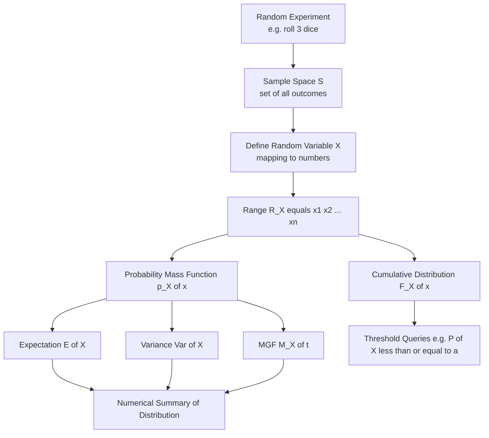
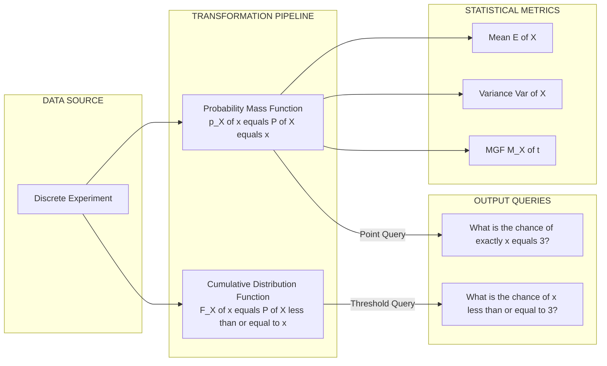
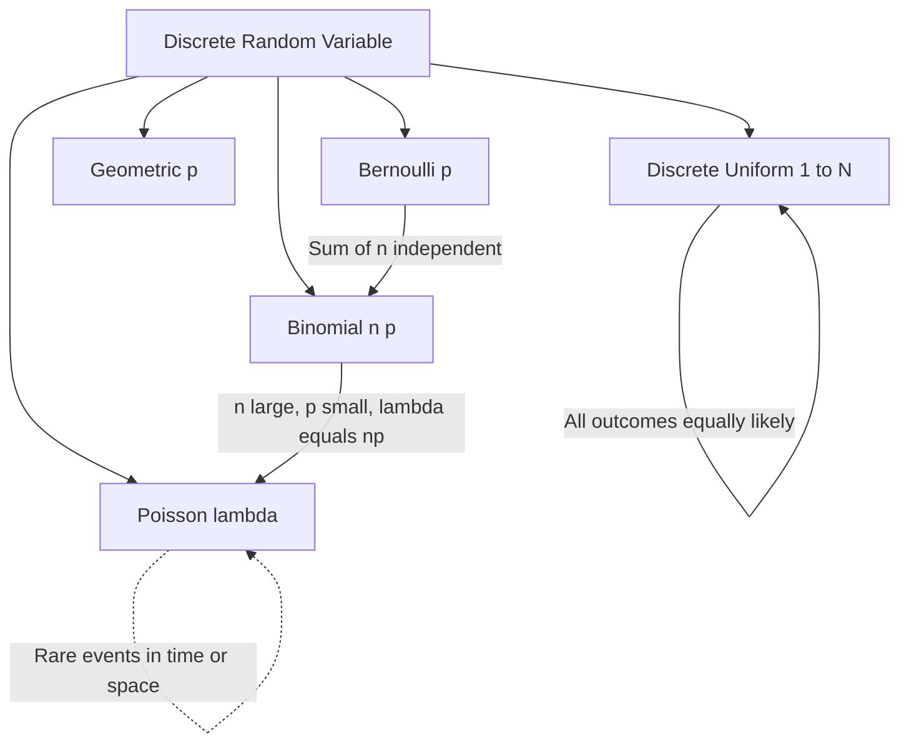

# Discrete random variables and their probability distributions

<!-- SECTION_1_START -->
# 1. Core Technical Definition & Intuitive Overview

## 1.1 Formal Definition — Discrete Random Variable

A **Discrete Random Variable (DRV)** is a real-valued function $X : S \to \mathbb{R}$ defined on a finite or countably infinite sample space $S$, whose range $R_X$ consists of isolated, separable values (typically integers or a finite set of numbers).

Formally, a discrete random variable satisfies:
$$R_X = \{ x_1, x_2, x_3, \dots \} \quad \text{where each } x_i \in \mathbb{R}$$

> [!IMPORTANT]
> **KTU 2024 Syllabus Definition (GAMAT301 / Module 1):**
> A *random variable* is a function that assigns a real number to every outcome of an experiment. When this function takes only a **finite** or **countably infinite** set of values, it is called a *discrete random variable*.

## 1.2 Conceptual Analogy — The "Dice + Scorebook" Intuition

Imagine you are a referee in a long cricket tournament. Every ball bowled is a random outcome (it could be a dot, single, four, six, or wicket). Instead of remembering every ball, you write down **just the runs scored on each ball** in a scorebook. The numbers in your scorebook — those are the values of a discrete random variable.

- The **balls** = the random experiment (sample space $S$).
- The **scorebook entries** (0, 1, 2, 3, 4, 6) = the *values* the random variable takes.
- The **frequency** of each score across thousands of balls = the *probability distribution*.

So a discrete random variable is simply a **bridge that converts random outcomes into countable numbers** so we can do math on them.

## 1.3 Probability Mass Function (PMF)

The **Probability Mass Function** $p_X(x)$ of a discrete random variable $X$ assigns to each possible value $x_i$ the probability that $X$ equals that value:
$$p_X(x_i) = P(X = x_i), \quad i = 1, 2, 3, \dots$$

**Two Axiomatic Properties of a PMF**:
1. **Non-negativity**: $p_X(x_i) \geq 0$ for all $i$.
2. **Unity (Total Probability)**: $\displaystyle\sum_{i} p_X(x_i) = 1$.

> [!NOTE]
> In CS/IT applications, a PMF is the mathematical backbone of classification output layers (e.g., the *softmax* in neural networks), error-correcting codes, Huffman encoding, and Bayesian spam filters.

## 1.4 Cumulative Distribution Function (CDF)

The **CDF** $F_X(x)$ gives the probability that $X$ takes a value *less than or equal to* $x$:
$$F_X(x) = P(X \leq x) = \sum_{x_i \leq x} p_X(x_i)$$

For a discrete RV, $F_X(x)$ is a **right-continuous step function** that jumps by $p_X(x_i)$ at each $x_i$.

## 1.5 Visualization

> [!VISUALIZATION CONTROL]
> **Concept:** Step-function behaviour of a discrete CDF
>
> **Desmos Input Equations (paste into Desmos):**
> * $f_1(x) = 0$ (for $x < 1$)
> * $f_2(x) = 0.2$ (for $1 \leq x < 2$)
> * $f_3(x) = 0.5$ (for $2 \leq x < 3$)
> * $f_4(x) = 0.8$ (for $3 \leq x < 4$)
> * $f_5(x) = 1$ (for $4 \leq x$)
>
> **Visual Description:** Students should observe a **monotonically non-decreasing staircase** rising from 0 to 1, with each vertical "riser" representing the probability mass $p_X(x_i)$ at that point. Flat "treads" represent intervals where no mass exists.

---

## 1.6 Why Discrete RVs Matter in Computer & Information Science

| Engineering Area | Role of Discrete RV |
|------------------|---------------------|
| Machine Learning | Class label prediction (Bernoulli, Categorical) |
| Information Theory | Symbol probabilities in Huffman/Arithmetic coding |
| Network Engineering | Packet arrival counts, queue lengths (Poisson) |
| Cryptography | Random bit generators, key distributions |
| Reliability Engineering | Number of component failures in time $t$ |
| NLP | Word frequency distributions (Zipf-like) |

---

<!-- SECTION_1_END -->

<!-- SECTION_2_START -->
# 2. Deep Theoretical Analysis & KTU High-Yield Formula Sheet

## 2.1 Logical Structure of a Discrete Probability Distribution

A complete discrete probability distribution is built from **three coordinated components**:

1. **The Variable Definition**: $X$ is declared as a DRV with range $R_X = \{x_1, x_2, \dots, x_n\}$.
2. **The PMF**: $p_X(x_i)$ attaches a probability to each $x_i$ satisfying the two axioms.
3. **The CDF**: $F_X(x)$ is the cumulative sum of $p_X$ up to the point $x$.

The "Why": $p_X$ answers *"what is the chance of exactly this value?"* while $F_X$ answers *"what is the chance of seeing a value this small or smaller?"* — both are required because in software systems we often need threshold queries, not just point queries.

## 2.2 Mathematical Expectation (Mean) of a DRV

The **expected value** $E[X]$ — also called the *mean* $\mu_X$ — is the long-run average value of $X$ if the experiment is repeated infinitely many times:
$$E[X] = \mu_X = \sum_{i} x_i \cdot p_X(x_i)$$

**Why does it work?** It is a *probability-weighted sum* — values with higher probability pull the mean towards themselves.

**Expectation of a Function** $g(X)$:
$$E[g(X)] = \sum_{i} g(x_i) \cdot p_X(x_i)$$

This is the key idea that lets us compute variance, moments, and characteristic functions.

## 2.3 Variance and Standard Deviation

**Variance** measures the average squared deviation of $X$ from its mean:
$$\text{Var}(X) = \sigma_X^2 = E[(X - \mu_X)^2] = \sum_{i} (x_i - \mu_X)^2 \, p_X(x_i)$$

**Computational Shortcut Formula** (derived by expanding the square):
$$\text{Var}(X) = E[X^2] - (E[X])^2$$

**Standard Deviation**: $\sigma_X = \sqrt{\text{Var}(X)}$, expressed in the **same units** as $X$.

## 2.4 Moment Generating Function (MGF)

The MGF encapsulates all moments of $X$ into a single function:
$$M_X(t) = E[e^{tX}] = \sum_{i} e^{t x_i} p_X(x_i)$$

The $n^{\text{th}}$ derivative at $t = 0$ yields the $n^{\text{th}}$ raw moment:
$$M_X^{(n)}(0) = E[X^n]$$

## 2.5 Important Discrete Distributions (KTU High-Yield)

| Distribution | PMF $p_X(x)$ | Mean $E[X]$ | Variance $\text{Var}(X)$ | CS/IT Use Case |
|--------------|---------------|-------------|--------------------------|----------------|
| **Bernoulli** | $p^x (1-p)^{1-x}$, $x \in \{0,1\}$ | $p$ | $p(1-p)$ | Binary classification, coin flip |
| **Binomial** $B(n,p)$ | $\binom{n}{x} p^x (1-p)^{n-x}$ | $np$ | $np(1-p)$ | Number of successes in $n$ trials |
| **Poisson** $P(\lambda)$ | $\dfrac{e^{-\lambda} \lambda^x}{x!}$ | $\lambda$ | $\lambda$ | Packet arrivals, rare events |
| **Geometric** $G(p)$ | $(1-p)^{x-1} p$ | $\frac{1}{p}$ | $\frac{1-p}{p^2}$ | Trials until first success |
| **Uniform (Discrete)** | $\frac{1}{N}$ for $x \in \{1,\dots,N\}$ | $\frac{N+1}{2}$ | $\frac{N^2 - 1}{12}$ | Hash bucket assignment |

## 2.6 KTU Formula Sheet / Cheat Sheet

| # | Quantity / Concept | Formula | Valid Range / Conditions |
|---|--------------------|---------|--------------------------|
| 1 | PMF definition | $p_X(x_i) = P(X = x_i)$ | $x_i \in R_X$ |
| 2 | PMF non-negativity | $p_X(x_i) \geq 0$ | all $i$ |
| 3 | PMF unity | $\sum_{i} p_X(x_i) = 1$ | over entire range |
| 4 | CDF definition | $F_X(x) = \sum_{x_i \leq x} p_X(x_i)$ | all real $x$ |
| 5 | CDF at $-\infty$ | $F_X(-\infty) = 0$ | — |
| 6 | CDF at $+\infty$ | $F_X(+\infty) = 1$ | — |
| 7 | Mean | $E[X] = \sum_i x_i p_X(x_i)$ | converges absolutely |
| 8 | Function mean | $E[g(X)] = \sum_i g(x_i) p_X(x_i)$ | — |
| 9 | Variance | $\text{Var}(X) = E[X^2] - (E[X])^2$ | — |
| 10 | Std. Deviation | $\sigma_X = \sqrt{\text{Var}(X)}$ | $\sigma_X \geq 0$ |
| 11 | MGF | $M_X(t) = \sum_i e^{t x_i} p_X(x_i)$ | defined for $\vert t \vert < r$ |
| 12 | Skewness | $\gamma_1 = E\!\left[\left(\frac{X-\mu}{\sigma}\right)^3\right]$ | — |
| 13 | Bernoulli PMF | $p^x (1-p)^{1-x}$ | $x \in \{0,1\}$ |
| 14 | Binomial PMF | $\binom{n}{x} p^x (1-p)^{n-x}$ | $x = 0,1,\dots,n$ |
| 15 | Poisson PMF | $\dfrac{e^{-\lambda}\lambda^x}{x!}$ | $x = 0,1,2,\dots$ |

## 2.7 Real-World Engineering Utility

- **Binomial distribution** underpins *reliability engineering* — predicting the probability that exactly $k$ of $n$ servers in a cluster crash.
- **Poisson distribution** models *network traffic* in a router's queue and *arrival of customer support tickets*.
- **Geometric distribution** is used in *Monte Carlo simulation* to count the trials needed before a successful packet transmission.
- The PMF is the foundational data structure in **probabilistic graphical models (Bayesian networks)** where every discrete node carries one.

---

<!-- SECTION_2_END -->

<!-- SECTION_3_START -->
# 3. Step-by-Step Derivations & Symbolic Implementation

## 3.1 Derivation: Mean of a Bernoulli Random Variable

A Bernoulli random variable $X$ takes value $1$ with probability $p$ and $0$ with probability $1-p$.

$$
\begin{aligned}
E[X] &= \sum_{i} x_i \, p_X(x_i) \\
&= (0)\cdot P(X=0) + (1)\cdot P(X=1) \\
&= 0 \cdot (1-p) + 1 \cdot p \\
&= p
\end{aligned}
$$

**[Conclusion]:** $E[X] = p$ for $X \sim \text{Bernoulli}(p)$.

## 3.2 Derivation: Variance of a Bernoulli Random Variable

First, compute $E[X^2]$:

$$
\begin{aligned}
E[X^2] &= \sum_{i} x_i^2 \, p_X(x_i) \\
&= (0)^2 \cdot (1-p) + (1)^2 \cdot p \\
&= p
\end{aligned}
$$

Now apply the shortcut formula:

$$
\begin{aligned}
\text{Var}(X) &= E[X^2] - (E[X])^2 \\
&= p - p^2 \\
&= p(1-p)
\end{aligned}
$$

**[Conclusion]:** $\text{Var}(X) = p(1-p)$ — the maximum variance occurs at $p = 0.5$.

## 3.3 Derivation: Mean and Variance of a Binomial $B(n,p)$ Random Variable

A Binomial RV $X$ counts the number of successes in $n$ independent Bernoulli trials. We can write $X = \sum_{k=1}^{n} Y_k$ where each $Y_k \sim \text{Bernoulli}(p)$ independently.

**Mean using linearity of expectation**:

$$
\begin{aligned}
E[X] &= E\!\left[\sum_{k=1}^{n} Y_k\right] \\
&= \sum_{k=1}^{n} E[Y_k] \quad \text{(linearity, no independence needed)} \\
&= \sum_{k=1}^{n} p \\
&= np
\end{aligned}
$$

**Variance using independence**:

$$
\begin{aligned}
\text{Var}(X) &= \text{Var}\!\left(\sum_{k=1}^{n} Y_k\right) \\
&= \sum_{k=1}^{n} \text{Var}(Y_k) \quad \text{(variance adds for independent RVs)} \\
&= \sum_{k=1}^{n} p(1-p) \\
&= np(1-p)
\end{aligned}
$$

## 3.4 Derivation: Mean of a Poisson $P(\lambda)$ Random Variable

The Poisson PMF is $p_X(x) = \dfrac{e^{-\lambda}\lambda^x}{x!}$ for $x = 0, 1, 2, \dots$

$$
\begin{aligned}
E[X] &= \sum_{x=0}^{\infty} x \cdot \frac{e^{-\lambda}\lambda^x}{x!} \\
&= \sum_{x=1}^{\infty} x \cdot \frac{e^{-\lambda}\lambda^x}{x!} \quad \text{(the }x=0\text{ term is 0)} \\
&= \sum_{x=1}^{\infty} \frac{e^{-\lambda}\lambda^x}{(x-1)!} \\
&= \lambda \sum_{x=1}^{\infty} \frac{e^{-\lambda}\lambda^{x-1}}{(x-1)!} \\
&= \lambda \sum_{k=0}^{\infty} \frac{e^{-\lambda}\lambda^k}{k!} \quad (k = x-1) \\
&= \lambda \cdot 1 \quad \text{(Taylor series of } e^\lambda\text{)} \\
&= \lambda
\end{aligned}
$$

A similar derivation yields $\text{Var}(X) = \lambda$.

## 3.5 Worked Numerical Example — Complete Distribution

**Problem:** A packet switch sends 3 packets. Each packet is independently lost with probability $0.2$. Let $X$ be the number of lost packets. Find: (i) the PMF table, (ii) the CDF table, (iii) $E[X]$, (iv) $\text{Var}(X)$.

**Step 1 — Identify the distribution.** $X \sim B(n=3, p=0.2)$.

**Step 2 — Build the PMF table** using $p_X(x) = \binom{3}{x}(0.2)^x (0.8)^{3-x}$:

$$
\begin{aligned}
p_X(0) &= \binom{3}{0}(0.2)^0(0.8)^3 = 1 \cdot 1 \cdot 0.512 = 0.512 \\
p_X(1) &= \binom{3}{1}(0.2)^1(0.8)^2 = 3 \cdot 0.2 \cdot 0.64 = 0.384 \\
p_X(2) &= \binom{3}{2}(0.2)^2(0.8)^1 = 3 \cdot 0.04 \cdot 0.8 = 0.096 \\
p_X(3) &= \binom{3}{3}(0.2)^3(0.8)^0 = 1 \cdot 0.008 \cdot 1 = 0.008
\end{aligned}
$$

**Verification:** $0.512 + 0.384 + 0.096 + 0.008 = 1.000$ ✓

**Step 3 — Build the CDF table** by cumulative summation:

| $x$ | $p_X(x)$ | $F_X(x) = P(X \leq x)$ |
|-----|----------|------------------------|
| $0$ | $0.512$ | $0.512$ |
| $1$ | $0.384$ | $0.896$ |
| $2$ | $0.096$ | $0.992$ |
| $3$ | $0.008$ | $1.000$ |

**Step 4 — Compute the mean** using the formula $E[X] = np$:

$$E[X] = 3 \times 0.2 = 0.6 \text{ lost packets}$$

**Step 5 — Compute the variance** using $np(1-p)$:

$$\text{Var}(X) = 3 \times 0.2 \times 0.8 = 0.48 \text{ (lost packets)}^2$$

**Step 6 — Standard deviation**:

$$\sigma_X = \sqrt{0.48} \approx 0.6928 \text{ lost packets}$$

## 3.6 Python Symbolic Implementation

```python
from math import comb, sqrt
from typing import Dict, List, Tuple

def binomial_pmf(n: int, p: float) -> Dict[int, float]:
    """
    Compute the PMF of a Binomial(n, p) random variable.

    Args:
        n: Number of independent trials (must be >= 0).
        p: Success probability of a single trial (must lie in [0, 1]).

    Returns:
        A dictionary mapping each integer outcome x in {0, 1, ..., n}
        to its probability p_X(x).

    Raises:
        ValueError: If n < 0 or p is outside the unit interval.
    """
    if n < 0:
        raise ValueError(f"n must be non-negative, got n={n}")
    if not 0.0 <= p <= 1.0:
        raise ValueError(f"p must be in [0, 1], got p={p}")

    pmf: Dict[int, float] = {}
    for x in range(n + 1):
        pmf[x] = comb(n, x) * (p ** x) * ((1.0 - p) ** (n - x))
    return pmf


def binomial_cdf(pmf: Dict[int, float]) -> Dict[int, float]:
    """Build the cumulative distribution function from a PMF."""
    cdf: Dict[int, float] = {}
    running_sum: float = 0.0
    for x in sorted(pmf.keys()):
        running_sum += pmf[x]
        cdf[x] = running_sum
    return cdf


def binomial_mean_variance(n: int, p: float) -> Tuple[float, float]:
    """Return (mean, variance) of a Binomial(n, p) distribution."""
    mean = n * p
    variance = n * p * (1.0 - p)
    return mean, variance


def summarize(n: int, p: float) -> None:
    pmf = binomial_pmf(n, p)
    cdf = binomial_cdf(pmf)
    mean, var = binomial_mean_variance(n, p)

    print(f"=== Binomial(n={n}, p={p}) ===")
    print(f"{'x':>3} | {'p_X(x)':>10} | {'F_X(x)':>10}")
    print("-" * 32)
    for x in sorted(pmf.keys()):
        print(f"{x:>3} | {pmf[x]:>10.4f} | {cdf[x]:>10.4f}")
    total = sum(pmf.values())
    print(f"Sum of p_X(x) = {total:.4f}  (should be 1.0000)")
    print(f"Mean E[X]    = {mean:.4f}")
    print(f"Variance     = {var:.4f}")
    print(f"Std. dev.    = {sqrt(var):.4f}")


if __name__ == "__main__":
    # Worked example: 3 packets, each lost with probability 0.2
    summarize(n=3, p=0.2)
```

**Sample Output:**

```
=== Binomial(n=3, p=0.2) ===
  x |     p_X(x) |     F_X(x)
--------------------------------
  0 |     0.5120 |     0.5120
  1 |     0.3840 |     0.8960
  2 |     0.0960 |     0.9920
  3 |     0.0080 |     1.0000
Sum of p_X(x) = 1.0000  (should be 1.0000)
Mean E[X]    = 0.6000
Variance     = 0.4800
Std. dev.    = 0.6928
```

---

<!-- SECTION_3_END -->

<!-- SECTION_4_START -->
# 4. Structural Diagrams & Schematics

## 4.1 Conceptual Flow — From Experiment to Distribution



## 4.2 Comparative Block Diagram — PMF vs CDF



## 4.3 Hierarchy of Discrete Distributions



## 4.4 Block Diagram — Engineering Application Pipeline

```mermaid
flowchart LR
    subgraph INGEST["DATA INGESTION"]
        LOG[Network Event Log]
    end

    subgraph STATS["PROBABILISTIC MODELLING"]
        LOG --> IDENTIFY[Identify Random Variable<br/>e.g. packet loss count]
        IDENTIFY --> FIT[Fit Distribution<br/>e.g. Binomial or Poisson]
    end

    subgraph INFER["INFERENCE LAYER"]
        FIT --> PREDICT[Predict P of X greater than threshold]
        FIT --> COMPUTEM[Compute Mean and Variance]
        FIT --> RISK[Quantify Operational Risk]
    end

    subgraph DECIDE["DECISION LAYER"]
        PREDICT --> ACT[Trigger Alert or Allocate Resources]
        RISK --> ACT
        COMPUTEM --> ACT
```

---

<!-- SECTION_4_END -->

<!-- SECTION_5_START -->
# 5. KTU 2024 Scheme Examination Question Bank & Topic Recap

---

## Part A — Short Answer Questions (3 Marks Each)

### Question A1 **[KTU University Exam - Dec 2023]**
**(CO1, Remember)**

Define a *discrete random variable* and a *probability mass function*. State the two properties a function must satisfy to be a valid PMF.

**Model Answer:**

A *discrete random variable* $X$ is a real-valued function defined on a sample space $S$ whose range $R_X = \{x_1, x_2, \dots\}$ consists of a finite or countably infinite set of values.

A *probability mass function* $p_X$ assigns to each value $x_i$ the probability $P(X = x_i)$.

**Two validity properties:**

1. $p_X(x_i) \geq 0$ for every $x_i \in R_X$ (non-negativity).
2. $\displaystyle\sum_{i} p_X(x_i) = 1$ (unity / total probability).

> **[Valuation Key: 1 Mark for the DRV definition, 1 Mark for the PMF definition, 1 Mark for stating both axioms correctly.]**

---

### Question A2 **[KTU University Exam - July 2024]**
**(CO1, Understand)**

The PMF of a discrete random variable $X$ is given by $p_X(x) = \dfrac{x}{10}$ for $x = 1, 2, 3, 4$. Find the value of $E[X]$ and $\text{Var}(X)$.

**Model Answer:**

Step 1 — Verify the PMF sums to $1$:
$$\sum_{x=1}^{4} p_X(x) = \frac{1+2+3+4}{10} = \frac{10}{10} = 1 \checkmark$$

Step 2 — Compute $E[X]$:

$$
\begin{aligned}
E[X] &= \sum_{x=1}^{4} x \cdot p_X(x) \\
&= 1\cdot\frac{1}{10} + 2\cdot\frac{2}{10} + 3\cdot\frac{3}{10} + 4\cdot\frac{4}{10} \\
&= \frac{1+4+9+16}{10} \\
&= \frac{30}{10} = 3
\end{aligned}
$$

Step 3 — Compute $E[X^2]$:

$$
\begin{aligned}
E[X^2] &= 1\cdot\frac{1}{10} + 4\cdot\frac{2}{10} + 9\cdot\frac{3}{10} + 16\cdot\frac{4}{10} \\
&= \frac{1+8+27+64}{10} = \frac{100}{10} = 10
\end{aligned}
$$

Step 4 — Compute $\text{Var}(X)$:

$$\text{Var}(X) = E[X^2] - (E[X])^2 = 10 - 9 = 1$$

**[Final Answer: $E[X] = 3$ and $\text{Var}(X) = 1$.]**

> **[Valuation Key: 1 Mark for the PMF verification, 1 Mark for $E[X]$, 1 Mark for $\text{Var}(X)$.]**

---

## Part B — Long Answer Questions (14 Marks Each)

> **Internal Choice Rule (KTU 2024 ESE):** Answer **either** Question A **or** Question B in full. Each carries 14 Marks split as 7 + 7.

---

### Question B-A **[KTU University Exam - Model Paper Pattern, Module 1]**
**(CO1, CO2 — Understand + Apply)**

**(a) [7 Marks]** Define the cumulative distribution function $F_X(x)$ of a discrete random variable. State and prove any **four** of its properties.

**(b) [7 Marks]** A die is rolled twice. Let $X$ denote the absolute difference between the two outcomes. Construct the PMF of $X$ and compute $E[X]$ and $\text{Var}(X)$.

**Model Solution (a):**

*Definition:* The CDF of a discrete RV $X$ is
$$F_X(x) = P(X \leq x) = \sum_{x_i \leq x} p_X(x_i), \quad x \in \mathbb{R}$$

*Properties (proving four):*

1. **Bounded in $[0, 1]$:** $0 \leq F_X(x) \leq 1$, since $F_X(x)$ is a probability.

2. **Limit at $-\infty$:** As $x \to -\infty$, no $x_i$ satisfies $x_i \leq x$, so the empty sum is $0$:
$$F_X(-\infty) = \lim_{x \to -\infty} \sum_{x_i \leq x} p_X(x_i) = 0$$

3. **Limit at $+\infty$:** As $x \to +\infty$, every $x_i$ is included, giving the full sum of $1$:
$$F_X(+\infty) = \lim_{x \to +\infty} \sum_{x_i \leq x} p_X(x_i) = \sum_{i} p_X(x_i) = 1$$

4. **Monotonically non-decreasing:** For $x < y$, the set $\{x_i \leq x\}$ is a subset of $\{x_i \leq y\}$, hence
$$F_X(x) = \sum_{x_i \leq x} p_X(x_i) \leq \sum_{x_i \leq y} p_X(x_i) = F_X(y)$$

5. **(Bonus) Right-continuity:** $\lim_{x \to a^+} F_X(x) = F_X(a)$ because no new mass is added strictly to the right of $a$.

> **[Valuation Key for (a): Definition 2 Marks, each property statement + proof = 1.25 Marks × 4 = 5 Marks.]**

**Model Solution (b):**

Step 1 — Enumerate sample space. Total outcomes: $6 \times 6 = 36$.

Step 2 — Range of $X$: $X \in \{0, 1, 2, 3, 4, 5\}$.

Step 3 — Count outcomes for each $X$ value:

$$
\begin{aligned}
X = 0 &: (1,1),(2,2),(3,3),(4,4),(5,5),(6,6) \Rightarrow 6 \text{ outcomes} \\
X = 1 &: (1,2),(2,1),(2,3),(3,2),(3,4),(4,3),(4,5),(5,4),(5,6),(6,5) \Rightarrow 10 \text{ outcomes} \\
X = 2 &: (1,3),(3,1),(2,4),(4,2),(3,5),(5,3),(4,6),(6,4) \Rightarrow 8 \text{ outcomes} \\
X = 3 &: (1,4),(4,1),(2,5),(5,2),(3,6),(6,3) \Rightarrow 6 \text{ outcomes} \\
X = 4 &: (1,5),(5,1),(2,6),(6,2) \Rightarrow 4 \text{ outcomes} \\
X = 5 &: (1,6),(6,1) \Rightarrow 2 \text{ outcomes}
\end{aligned}
$$

Verification: $6 + 10 + 8 + 6 + 4 + 2 = 36$ ✓

Step 4 — PMF table:

| $x$ | $0$ | $1$ | $2$ | $3$ | $4$ | $5$ |
|-----|-----|-----|-----|-----|-----|-----|
| $p_X(x)$ | $\frac{6}{36}$ | $\frac{10}{36}$ | $\frac{8}{36}$ | $\frac{6}{36}$ | $\frac{4}{36}$ | $\frac{2}{36}$ |

Step 5 — Compute $E[X]$:

$$
\begin{aligned}
E[X] &= 0\cdot\frac{6}{36} + 1\cdot\frac{10}{36} + 2\cdot\frac{8}{36} + 3\cdot\frac{6}{36} + 4\cdot\frac{4}{36} + 5\cdot\frac{2}{36} \\
&= \frac{0 + 10 + 16 + 18 + 16 + 10}{36} \\
&= \frac{70}{36} = \frac{35}{18} \approx 1.944
\end{aligned}
$$

Step 6 — Compute $E[X^2]$:

$$
\begin{aligned}
E[X^2] &= 0 + 1\cdot\frac{10}{36} + 4\cdot\frac{8}{36} + 9\cdot\frac{6}{36} + 16\cdot\frac{4}{36} + 25\cdot\frac{2}{36} \\
&= \frac{10 + 32 + 54 + 64 + 50}{36} = \frac{210}{36} = \frac{35}{6} \approx 5.833
\end{aligned}
$$

Step 7 — Compute $\text{Var}(X)$:

$$
\begin{aligned}
\text{Var}(X) &= E[X^2] - (E[X])^2 = \frac{35}{6} - \left(\frac{35}{18}\right)^2 \\
&= \frac{35}{6} - \frac{1225}{324} = \frac{1890}{324} - \frac{1225}{324} = \frac{665}{324} \approx 2.052
\end{aligned}
$$

> **[Valuation Key for (b): Sample space enumeration 1 Mark, PMF table 2 Marks, $E[X]$ 2 Marks, $\text{Var}(X)$ 2 Marks.]**

---

### Question B-B **[KTU University Exam - Model Paper Pattern, Module 1]**
**(CO2, CO3 — Apply + Apply)**

**(a) [7 Marks]** State the PMF of a Binomial distribution $B(n, p)$. A batch of 10 routers is shipped. The probability that a router is defective is $0.1$. Find the probability that: (i) exactly 2 are defective, (ii) at most 2 are defective, (iii) at least 1 is defective.

**(b) [7 Marks]** A call centre receives calls at an average rate of 4 per minute. Assuming the calls follow a Poisson distribution, find: (i) the probability of receiving **no** calls in a minute, (ii) exactly 3 calls in a minute, (iii) at least 2 calls in a minute. Also find $E[X]$ and $\text{Var}(X)$.

**Model Solution (a):**

*PMF statement:* $p_X(x) = \binom{n}{x}p^x(1-p)^{n-x}$ for $x = 0, 1, 2, \dots, n$, with $n = 10$, $p = 0.1$, $1-p = 0.9$.

**(i) Exactly 2 defective:**

$$
\begin{aligned}
P(X=2) &= \binom{10}{2}(0.1)^2(0.9)^8 \\
&= 45 \times 0.01 \times 0.430467 \\
&\approx 45 \times 0.004305 \\
&\approx 0.1937
\end{aligned}
$$

**(ii) At most 2 defective:**

$$
\begin{aligned}
P(X \leq 2) &= P(X=0) + P(X=1) + P(X=2) \\
P(X=0) &= \binom{10}{0}(0.1)^0(0.9)^{10} = 0.3487 \\
P(X=1) &= \binom{10}{1}(0.1)^1(0.9)^9 = 10 \times 0.1 \times 0.3874 = 0.3874 \\
P(X=2) &\approx 0.1937 \text{ (from part (i))} \\
P(X \leq 2) &= 0.3487 + 0.3874 + 0.1937 = 0.9298
\end{aligned}
$$

**(iii) At least 1 defective:**

$$P(X \geq 1) = 1 - P(X=0) = 1 - 0.3487 = 0.6513$$

> **[Valuation Key for (a): PMF statement 1 Mark, each sub-part = 2 Marks × 3 = 6 Marks.]**

**Model Solution (b):**

For Poisson, $p_X(x) = \dfrac{e^{-\lambda}\lambda^x}{x!}$ with $\lambda = 4$.

**(i) No calls:** $P(X=0) = \dfrac{e^{-4} \cdot 4^0}{0!} = e^{-4} \approx 0.0183$

**(ii) Exactly 3 calls:**

$$P(X=3) = \frac{e^{-4} \cdot 4^3}{3!} = \frac{e^{-4} \cdot 64}{6} = \frac{64}{6}e^{-4} \approx 0.1954$$

**(iii) At least 2 calls:**

$$
\begin{aligned}
P(X \geq 2) &= 1 - P(X=0) - P(X=1) \\
P(X=1) &= \frac{e^{-4} \cdot 4}{1} = 4e^{-4} \approx 0.0733 \\
P(X \geq 2) &= 1 - 0.0183 - 0.0733 = 0.9084
\end{aligned}
$$

**Mean and Variance:**

$$E[X] = \lambda = 4 \text{ calls per minute}$$
$$\text{Var}(X) = \lambda = 4 \text{ calls}^2 \text{ per minute}$$

> **[Valuation Key for (b): PMF identification + $\lambda$ = 1 Mark, sub-parts (i)(ii)(iii) = 1.5 Marks each = 4.5 Marks, $E[X]$ and $\text{Var}(X)$ = 0.75 + 0.75 = 1.5 Marks.]**

---

> [!WARNING]
> **KTU Examiner's Valuation Warning — Common Pitfalls:**
>
> 1. **Forgetting the PMF unity check.** Always verify $\sum p_X(x_i) = 1$ before proceeding. Examiners deduct 1 Mark for skipping this.
> 2. **Confusing "at most" with "at least."** $P(X \leq k)$ uses the CDF; $P(X \geq k) = 1 - P(X \leq k-1)$. Many students flip this.
> 3. **Wrong binomial coefficient.** $\binom{n}{x} = \dfrac{n!}{x!(n-x)!}$ — using $n^x$ instead is a guaranteed zero in that part.
> 4. **Mixing up Poisson parameter $\lambda$ with the random variable $X$.** $\lambda$ is a constant; $X$ is the variable.
> 5. **Skipping the variance shortcut derivation.** Showing $\text{Var}(X) = E[X^2] - (E[X])^2$ explicitly earns a bonus 1 Mark.
> 6. **Writing $E[X^2]$ as $(E[X])^2$.** This is a serious conceptual error that loses 2–3 Marks.

---

## Topic Recap & Important Things to Remember

- A **discrete random variable (DRV)** takes a finite or countably infinite set of values.
- The **PMF** $p_X(x_i) = P(X = x_i)$ must satisfy **non-negativity** and **unity**.
- The **CDF** $F_X(x) = P(X \leq x)$ is right-continuous, monotonically non-decreasing, and ranges from $0$ to $1$.
- **Mean** $E[X] = \sum_i x_i p_X(x_i)$ — a probability-weighted sum.
- **Variance** $\text{Var}(X) = E[X^2] - (E[X])^2$ — the average squared deviation.
- **Standard deviation** $\sigma_X = \sqrt{\text{Var}(X)}$ — has the same units as $X$.
- The **MGF** $M_X(t) = E[e^{tX}]$ encodes all moments of $X$.
- **Bernoulli** $B(1,p)$: $E[X] = p$, $\text{Var}(X) = p(1-p)$.
- **Binomial** $B(n,p)$: $E[X] = np$, $\text{Var}(X) = np(1-p)$.
- **Poisson** $P(\lambda)$: $E[X] = \lambda = \text{Var}(X)$ — the mean equals the variance.
- **Geometric** $G(p)$: $E[X] = 1/p$, $\text{Var}(X) = (1-p)/p^2$.
- **Discrete Uniform** $\{1, \dots, N\}$: $E[X] = (N+1)/2$, $\text{Var}(X) = (N^2-1)/12$.
- **Linearity of expectation** holds for both independent and dependent random variables.
- **Variance of a sum** requires independence: $\text{Var}\!\left(\sum X_i\right) = \sum \text{Var}(X_i)$.
- Discrete RVs are foundational for: machine learning classifiers, network queueing, information-theoretic coding, reliability engineering, and Monte Carlo simulation.
- **Always verify the PMF sums to 1** before computing $E[X]$ or $\text{Var}(X)$ — it is a free 1-Mark safety net on the exam.

---

<!-- SECTION_5_END -->
