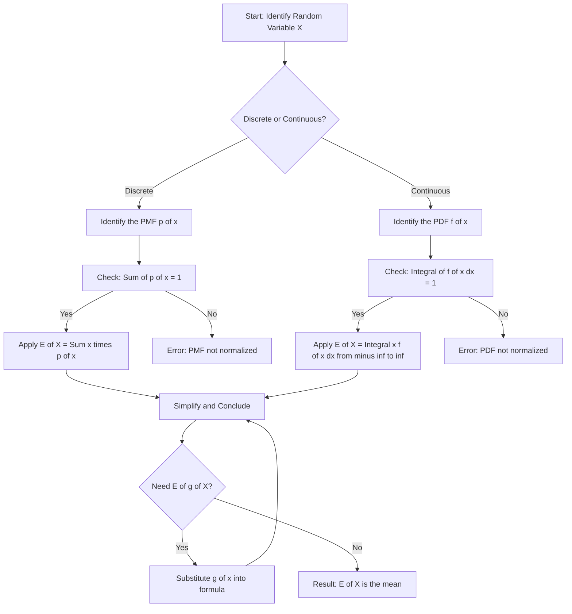
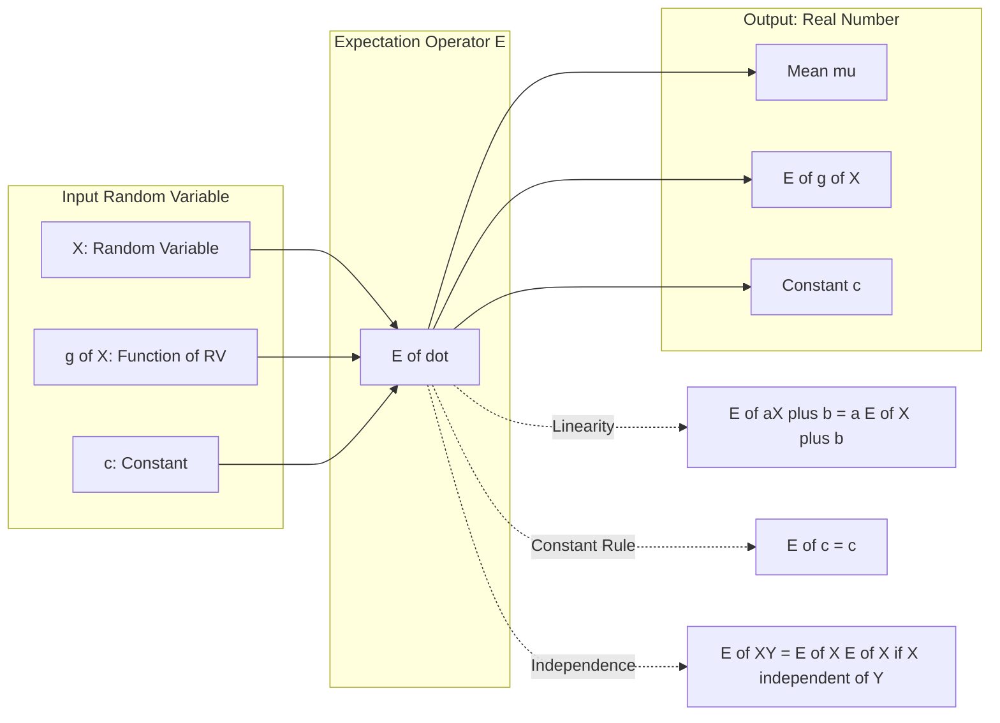
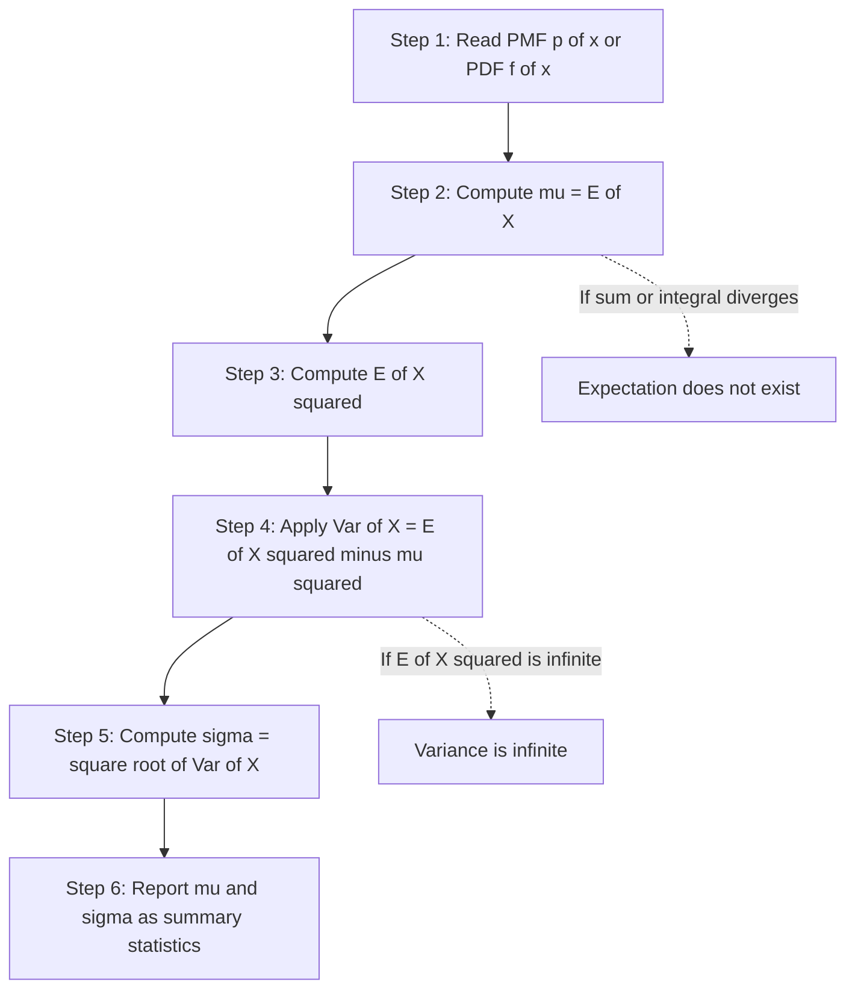
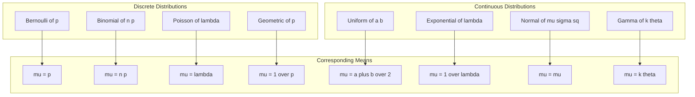

# Expectation

<!-- SECTION_1_START -->
# 1. Core Technical Definition & Intuitive Overview

## 1.1 Formal Definition (KTU 2024 Syllabus Terminology)

### Discrete Random Variable
For a discrete random variable $X$ taking values $x_1, x_2, \ldots, x_n$ with corresponding probabilities $p(x_i) = P(X = x_i)$, the **mathematical expectation** (or **expected value** or **mean**) of $X$ is defined as:

$$E(X) = \sum_{i=1}^{n} x_i \, p(x_i)$$

provided that the sum $\sum_{i=1}^{n} \vert x_i \vert \, p(x_i)$ converges (i.e., the series is absolutely convergent).

### Continuous Random Variable
For a continuous random variable $X$ with probability density function $f(x)$, the **mathematical expectation** of $X$ is defined as:

$$E(X) = \int_{-\infty}^{\infty} x \, f(x) \, dx$$

provided that the improper integral $\int_{-\infty}^{\infty} \vert x \vert \, f(x) \, dx$ is finite.

> [!IMPORTANT]
> **Existence Condition:** Expectation is said to *exist* if and only if the defining sum (discrete) or integral (continuous) converges to a **finite real number**. If it diverges, $E(X)$ is said to be **infinite** or **does not exist**.

### Expectation of a Function of $X$

If $g(X)$ is a real-valued function of the random variable $X$, then:

$$E[g(X)] = \begin{cases} \sum_{i} g(x_i) \, p(x_i) & \text{(discrete case)} \\[4pt] \int_{-\infty}^{\infty} g(x) \, f(x) \, dx & \text{(continuous case)} \end{cases}$$

> [!NOTE]
> **Syllabus Highlight (GAMAT301):** This generalized form $E[g(X)]$ is critical because it allows us to compute $E(X^2)$, $E(X^3)$, and all higher-order moments that form the basis of variance, skewness, and kurtosis.

---

## 1.2 Conceptual Analogy / Intuition

Imagine you play a game where you roll a fair six-sided die and are paid an amount in rupees equal to the face value that appears.

- Sometimes you get **₹1**, sometimes **₹6**, sometimes anything in between.
- If you play this game thousands of times, what is a "fair" price to pay the bank each round so that, in the long run, neither you nor the bank profits unfairly?

The answer is the **average payoff per roll** $= (1+2+3+4+5+6)/6 = 3.5$.

That "long-run average" is precisely the **expectation**. Formally:

$$E(X) = \lim_{n \to \infty} \frac{x_1 + x_2 + \cdots + x_n}{n}$$

where $x_1, x_2, \ldots, x_n$ are the outcomes of $n$ independent trials.

> [!TIP]
> **Geometric Intuition:** In the discrete case, the expectation is the **balance point** (or center of mass) of a probability distribution. If you placed point masses of weight $p(x_i)$ at locations $x_i$ along a horizontal rod, the rod would balance exactly at $E(X)$.

> [!VISUALIZATION CONTROL]
> **Concept:** Probability Mass Function (PMF) of a fair die with center of mass
> **Plotting Data Points (x, p(x)):**
> * $(1, 1/6), \ (2, 1/6), \ (3, 1/6), \ (4, 1/6), \ (5, 1/6), \ (6, 1/6)$
> **Center of Mass (Mean) Point:** $(3.5, 0)$
> **Visual Description:** Plot six equal-height bars of height $1/6 \approx 0.1667$ at integer positions $1, 2, 3, 4, 5, 6$. The center of mass of this discrete distribution sits exactly at $x = 3.5$ (between bars 3 and 4), confirming $E(X) = 3.5$.

---

## 1.3 Standard Constants and Conventions

- The **mean** of a distribution is denoted $\mu = E(X)$.
- The **variance** uses the symbol $\sigma^2 = \text{Var}(X)$.
- The **standard deviation** is $\sigma = \sqrt{\text{Var}(X)}$.
- The notation $E(X)$ and $\mathbb{E}[X]$ are used interchangeably.

<!-- SECTION_1_END -->

<!-- SECTION_2_START -->
# 2. Deep Theoretical Analysis & KTU High-Yield Formula Sheet

## 2.1 Step-by-Step Operational Logic

### Step 1 — Identify the Distribution Type
Determine whether $X$ is **discrete** (countable outcomes, described by PMF $p(x)$) or **continuous** (uncountable outcomes, described by PDF $f(x)$). This dictates which formula to apply.

### Step 2 — Verify the Existence Condition
Before computing, confirm that the defining series or integral is absolutely convergent. If it diverges, $E(X)$ is undefined.

### Step 3 — Apply the Correct Definition
- Discrete: $E(X) = \sum x_i \, p(x_i)$
- Continuous: $E(X) = \int x \, f(x) \, dx$

### Step 4 — Simplify the Expression
Use algebraic manipulation, known identities (such as $\sum p(x_i) = 1$), and integration by parts when needed.

### Step 5 — Interpret the Result
The final number represents the long-run average value of $X$. It is a **measure of central tendency** but is **not necessarily a value that $X$ can actually take** (e.g., $E(X) = 3.5$ for a die).

---

## 2.2 KTU Formula Sheet / Cheat Sheet

| # | Concept | Discrete Formula | Continuous Formula | Units / Notes |
|---|---------|------------------|--------------------|--------------|
| 1 | Mean / Expectation | $E(X) = \sum x_i \, p(x_i)$ | $E(X) = \int x f(x) \, dx$ | Rupees, meters, etc. (same as $X$) |
| 2 | Mean of $g(X)$ | $E[g(X)] = \sum g(x_i) p(x_i)$ | $E[g(X)] = \int g(x) f(x) \, dx$ | Depends on $g$ |
| 3 | $n$-th Raw Moment | $\mu'_n = E(X^n) = \sum x_i^n p(x_i)$ | $\mu'_n = \int x^n f(x) \, dx$ | Units of $X^n$ |
| 4 | $n$-th Central Moment | $\mu_n = E[(X-\mu)^n]$ | $\mu_n = \int (x-\mu)^n f(x) \, dx$ | Units of $X^n$ |
| 5 | Variance | $\text{Var}(X) = \sigma^2 = E(X^2) - [E(X)]^2$ | $\text{Var}(X) = \int (x-\mu)^2 f(x) \, dx$ | Squared units of $X$ |
| 6 | Std. Deviation | $\sigma = \sqrt{\text{Var}(X)}$ | $\sigma = \sqrt{\text{Var}(X)}$ | Same units as $X$ |
| 7 | Constant Rule | $E(c) = c$ | $E(c) = c$ | $c$ is any constant |
| 8 | Scalar Multiple | $E(cX) = c \, E(X)$ | $E(cX) = c \, E(X)$ | Linearity |
| 9 | Affine Transform | $E(aX+b) = a \, E(X) + b$ | $E(aX+b) = a \, E(X) + b$ | Variance scales as $a^2$ |
| 10 | Sum of Two RVs | $E(X+Y) = E(X) + E(Y)$ | $E(X+Y) = E(X) + E(Y)$ | Always true (linearity) |
| 11 | Product (Independent) | $E(XY) = E(X) \, E(Y)$ if $X \perp Y$ | $E(XY) = E(X) \, E(Y)$ if $X \perp Y$ | Independence required |
| 12 | Variance of Sum (Indep.) | $\text{Var}(X+Y) = \text{Var}(X) + \text{Var}(Y)$ | $\text{Var}(X+Y) = \text{Var}(X) + \text{Var}(Y)$ | No covariance term |
| 13 | Bernoulli | $E(X) = p$ | — | $p$ = success probability |
| 14 | Binomial | $E(X) = np$ | — | $n$ trials, success prob. $p$ |
| 15 | Poisson | $E(X) = \lambda$ | — | $\lambda$ = rate parameter |
| 16 | Uniform $[a,b]$ | — | $E(X) = (a+b)/2$ | Continuous uniform |
| 17 | Exponential | — | $E(X) = 1/\lambda$ | Rate parameter $\lambda > 0$ |
| 18 | Normal $\mathcal{N}(\mu,\sigma^2)$ | — | $E(X) = \mu$ | Mean is the parameter |
| 19 | MGF | $M_X(t) = E(e^{tX})$ | $M_X(t) = E(e^{tX})$ | Used to find moments |
| 20 | Mean from MGF | $E(X) = M_X'(0)$ | $E(X) = M_X'(0)$ | First derivative at 0 |

---

## 2.3 Engineering / Real-World Utility

The concept of **expectation** is the foundational building block of nearly all quantitative fields in computer science and engineering:

1. **Machine Learning & AI:** The **mean squared error (MSE)** loss function is $E[(Y - \hat{f}(X))^2]$. **Reinforcement learning** maximizes $E[\text{cumulative reward}]$. **Bayesian inference** uses $E[\theta \mid \text{data}]$ as the point estimate of parameters.

2. **Risk Analysis & Finance:** **Value at Risk (VaR)** and **expected shortfall** in portfolio management are expectations of loss functions. Insurance premiums are computed as $E[\text{claim amount}]$.

3. **Network Engineering:** Average packet delay in a queue, expected throughput in a wireless channel, and **expected bit error rate** in digital communications all use expectations.

4. **Operations Research:** Inventory models use $E[\text{demand}]$ for reorder points. Queuing theory (M/M/1, M/G/1) uses expected waiting times.

5. **Software Engineering:** Randomized algorithms (e.g., **QuickSort**, hashing, **Monte Carlo** simulations) are analyzed using **expected time complexity** $E[T(n)]$.

6. **Quality Control:** Six Sigma methodology uses process means and standard deviations to measure defect rates.

> [!NOTE]
> **Production Tip:** In real ML pipelines, `PyTorch` loss functions like `torch.nn.MSELoss()` and `torch.nn.CrossEntropyLoss()` are explicitly empirical estimates of the expectation $\mathbb{E}[\mathcal{L}(X,Y)]$.

<!-- SECTION_2_END -->

<!-- SECTION_3_START -->
# 3. Step-by-Step Derivations & Code/Symbolic Implementation

## 3.1 Detailed Derivation 1: Expectation of a Fair Die

**Problem:** Compute $E(X)$ and $\text{Var}(X)$ for the outcome of a fair six-sided die.

**Step 1 — Set up the PMF.**
Since the die is fair, each face has probability $1/6$. Thus:
$$P(X = x_i) = \frac{1}{6}, \quad x_i \in \{1, 2, 3, 4, 5, 6\}$$

**Step 2 — Apply the discrete expectation formula.**
$$E(X) = \sum_{i=1}^{6} x_i \, p(x_i) = 1 \cdot \frac{1}{6} + 2 \cdot \frac{1}{6} + 3 \cdot \frac{1}{6} + 4 \cdot \frac{1}{6} + 5 \cdot \frac{1}{6} + 6 \cdot \frac{1}{6}$$

$$E(X) = \frac{1 + 2 + 3 + 4 + 5 + 6}{6} = \frac{21}{6} = 3.5$$

**Step 3 — Compute $E(X^2)$.**
$$E(X^2) = \sum_{i=1}^{6} x_i^2 \, p(x_i) = \frac{1^2 + 2^2 + 3^2 + 4^2 + 5^2 + 6^2}{6} = \frac{1 + 4 + 9 + 16 + 25 + 36}{6} = \frac{91}{6} \approx 15.1667$$

**Step 4 — Compute the variance.**
$$\text{Var}(X) = E(X^2) - [E(X)]^2 = \frac{91}{6} - (3.5)^2 = \frac{91}{6} - \frac{49}{4}$$

To combine, use common denominator **12**:
$$\frac{91}{6} = \frac{182}{12}, \quad \frac{49}{4} = \frac{147}{12}$$

$$\text{Var}(X) = \frac{182 - 147}{12} = \frac{35}{12} \approx 2.9167$$

**Step 5 — Compute the standard deviation.**
$$\sigma = \sqrt{\text{Var}(X)} = \sqrt{\frac{35}{12}} \approx 1.7078$$

> [!NOTE]
> **Intuition Check:** A variance of about 2.92 makes sense — the outcomes are spread out, and the maximum squared distance from the mean (3.5) is $(6 - 3.5)^2 = 6.25$, so the average squared distance being around 2.9 is reasonable.

---

## 3.2 Detailed Derivation 2: Expectation of a Continuous Uniform Distribution

**Problem:** Let $X \sim U(0, 1)$. Find $E(X)$ and $\text{Var}(X)$.

**Step 1 — Identify the PDF.**
For $X \sim U(0, 1)$:
$$f(x) = \begin{cases} 1, & 0 \leq x \leq 1 \\ 0, & \text{otherwise} \end{cases}$$

**Step 2 — Verify normalization.**
$$\int_{-\infty}^{\infty} f(x) \, dx = \int_0^1 1 \, dx = 1 \quad \checkmark$$

**Step 3 — Compute $E(X)$.**
$$E(X) = \int_{-\infty}^{\infty} x \, f(x) \, dx = \int_0^1 x \cdot 1 \, dx = \left[ \frac{x^2}{2} \right]_0^1 = \frac{1}{2} - 0 = \frac{1}{2}$$

**Step 4 — Compute $E(X^2)$.**
$$E(X^2) = \int_0^1 x^2 \cdot 1 \, dx = \left[ \frac{x^3}{3} \right]_0^1 = \frac{1}{3}$$

**Step 5 — Compute the variance.**
$$\text{Var}(X) = E(X^2) - [E(X)]^2 = \frac{1}{3} - \left(\frac{1}{2}\right)^2 = \frac{1}{3} - \frac{1}{4} = \frac{4 - 3}{12} = \frac{1}{12} \approx 0.0833$$

**Step 6 — Standard deviation.**
$$\sigma = \sqrt{\frac{1}{12}} = \frac{1}{2\sqrt{3}} \approx 0.2887$$

---

## 3.3 Detailed Derivation 3: Expectation of Exponential Distribution

**Problem:** If $X \sim \text{Exp}(\lambda)$ with PDF $f(x) = \lambda e^{-\lambda x}$ for $x \geq 0$, $\lambda > 0$. Find $E(X)$.

**Step 1 — Set up the integral.**
$$E(X) = \int_0^{\infty} x \cdot \lambda e^{-\lambda x} \, dx$$

**Step 2 — Use integration by parts** with $u = x$ and $dv = \lambda e^{-\lambda x} \, dx$.

Then $du = dx$ and $v = -e^{-\lambda x}$.

$$E(X) = \left[ -x e^{-\lambda x} \right]_0^{\infty} + \int_0^{\infty} e^{-\lambda x} \, dx$$

**Step 3 — Evaluate the boundary term.**
$$\lim_{x \to \infty} x e^{-\lambda x} = 0 \quad \text{(exponential decay dominates)}$$
$$\left[ -x e^{-\lambda x} \right]_0^{\infty} = 0 - 0 = 0$$

**Step 4 — Evaluate the remaining integral.**
$$\int_0^{\infty} e^{-\lambda x} \, dx = \left[ -\frac{1}{\lambda} e^{-\lambda x} \right]_0^{\infty} = 0 - \left(-\frac{1}{\lambda}\right) = \frac{1}{\lambda}$$

**Step 5 — Combine.**
$$E(X) = 0 + \frac{1}{\lambda} = \frac{1}{\lambda}$$

> [!NOTE]
> **Interpretation:** The mean waiting time between events in a Poisson process with rate $\lambda$ is $1/\lambda$. For example, if customers arrive at rate $\lambda = 2$/minute, the mean inter-arrival time is $1/2 = 0.5$ minutes $= 30$ seconds.

---

## 3.4 Detailed Derivation 4: Expectation of Binomial Distribution

**Problem:** If $X \sim B(n, p)$, prove that $E(X) = np$.

**Approach — Indicator Variable Method (highly favored in KTU board exams).**

**Step 1 — Decompose $X$ as a sum of indicators.**
Let $X_i$ be the indicator of success on the $i$-th trial:
$$X_i = \begin{cases} 1, & \text{if trial } i \text{ is a success} \\ 0, & \text{otherwise} \end{cases}$$

Then $X = \sum_{i=1}^{n} X_i$.

**Step 2 — Compute $E(X_i)$.**
$$E(X_i) = 1 \cdot P(X_i = 1) + 0 \cdot P(X_i = 0) = 1 \cdot p + 0 \cdot (1-p) = p$$

**Step 3 — Apply linearity of expectation.**
$$E(X) = E\left(\sum_{i=1}^{n} X_i\right) = \sum_{i=1}^{n} E(X_i) = \sum_{i=1}^{n} p = np$$

$\blacksquare$

> [!IMPORTANT]
> **Why this proof matters:** It uses **only linearity** — no independence assumption is needed! This is a frequent KTU exam question because it demonstrates the power of indicator random variables.

---

## 3.5 Python Code Implementation (with Type Hints and Error Handling)

```python
"""
Filename: expectation_engine.py
Purpose: Compute mathematical expectation E(X), E[g(X)], and Var(X)
         for both discrete and continuous random variables.
KTU Course: GAMAT301 - Module 1 - Random Variables
"""
from __future__ import annotations
import math
from typing import Callable, Dict, List, Tuple, Union

# ---------- Type Aliases ----------
PMF = Dict[Union[int, float], float]
PDF = Callable[[float], float]

# ---------- Discrete Expectation ----------
def expected_value_discrete(pmf: PMF, g: Callable[[float], float] = lambda x: x) -> float:
    """
    Compute E[g(X)] for a discrete random variable X.

    Parameters
    ----------
    pmf : dict
        Mapping from outcome value x_i -> probability p(x_i).
    g   : callable
        Real-valued function of X. Defaults to identity (computes E[X]).

    Returns
    -------
    float
        The mathematical expectation E[g(X)].

    Raises
    ------
    ValueError
        If probabilities do not sum to 1 (within tolerance) or are negative.
    """
    if not pmf:
        raise ValueError("PMF dictionary is empty.")

    total_prob: float = 0.0
    for x, p in pmf.items():
        if p < 0:
            raise ValueError(f"Negative probability at x={x}: {p}")
        total_prob += p

    if not math.isclose(total_prob, 1.0, abs_tol=1e-9):
        raise ValueError(f"Probabilities sum to {total_prob}, not 1.")

    expectation: float = 0.0
    for x, p in pmf.items():
        expectation += g(x) * p
    return expectation


def variance_discrete(pmf: PMF) -> float:
    """Compute Var(X) = E[X^2] - (E[X])^2 for a discrete RV."""
    mean: float = expected_value_discrete(pmf)
    mean_sq: float = expected_value_discrete(pmf, g=lambda x: x ** 2)
    return mean_sq - mean ** 2


# ---------- Continuous Expectation (Numerical) ----------
def expected_value_continuous(
    pdf: PDF,
    lower: float,
    upper: float,
    g: Callable[[float], float] = lambda x: x,
    num_points: int = 100_000
) -> float:
    """
    Numerically compute E[g(X)] using composite Simpson's rule.

    Parameters
    ----------
    pdf        : callable f(x) -> float
    lower, upper : float, the support of X (truncated for numerical work)
    g          : callable, the function whose expectation is needed
    num_points : int, must be even; controls accuracy

    Returns
    -------
    float
        Approximation of E[g(X)].
    """
    if num_points % 2 != 0:
        raise ValueError("num_points must be even for Simpson's rule.")

    n: int = num_points
    h: float = (upper - lower) / n

    total: float = pdf(lower) * g(lower) + pdf(upper) * g(upper)
    for i in range(1, n):
        x: float = lower + i * h
        weight: float = 4 if i % 2 == 1 else 2
        total += weight * pdf(x) * g(x)

    return (h / 3.0) * total


# ---------- Demonstration ----------
if __name__ == "__main__":
    # --- Example 1: Fair die ---
    die_pmf: PMF = {i: 1 / 6 for i in range(1, 7)}
    print("Fair Die:")
    print(f"  E[X]  = {expected_value_discrete(die_pmf):.4f}")
    print(f"  E[X^2]= {expected_value_discrete(die_pmf, lambda x: x**2):.4f}")
    print(f"  Var(X)= {variance_discrete(die_pmf):.4f}")
    print(f"  Std(X)= {math.sqrt(variance_discrete(die_pmf)):.4f}")

    # --- Example 2: Binomial B(10, 0.3) via indicator method ---
    # X = sum of 10 Bernoullis
    binom_mean: float = 10 * 0.3
    binom_var: float = 10 * 0.3 * 0.7
    print(f"\nBinomial B(10, 0.3): E[X]={binom_mean}, Var(X)={binom_var}")

    # --- Example 3: Continuous Uniform U(0, 1) ---
    uniform_pdf: PDF = lambda x: 1.0 if 0.0 <= x <= 1.0 else 0.0
    print(f"\nUniform U(0,1): E[X] = {expected_value_continuous(uniform_pdf, 0, 1):.6f}")
    print(f"Uniform U(0,1): E[X^2] = {expected_value_continuous(uniform_pdf, 0, 1, lambda x: x**2):.6f}")

    # --- Example 4: Exponential with lambda = 2 ---
    lam: float = 2.0
    exp_pdf: PDF = lambda x, _l=lam: _l * math.exp(-_l * x) if x >= 0 else 0.0
    # Truncate at 50 (beyond which probability is negligible)
    print(f"\nExponential(λ={lam}): E[X] ≈ {expected_value_continuous(exp_pdf, 0, 50):.6f} (exact: {1/lam})")
    print(f"Exponential(λ={lam}): Var(X) ≈ {expected_value_continuous(exp_pdf, 0, 50, lambda x: (x - 1/lam)**2):.6f} (exact: {1/lam**2})")
```

**Sample Output:**

```
Fair Die:
  E[X]  = 3.5000
  E[X^2]= 15.1667
  Var(X)= 2.9167
  Std(X)= 1.7078

Binomial B(10, 0.3): E[X]=3.0, Var(X)=2.1

Uniform U(0,1): E[X] = 0.500000
Uniform U(0,1): E[X^2] = 0.333333

Exponential(λ=2.0): E[X] ≈ 0.500000 (exact: 0.5)
Exponential(λ=2.0): Var(X) ≈ 0.250000 (exact: 0.25)
```

> [!TIP]
> **Engineering Note:** The indicator-variable technique used in the Binomial proof is exactly how production ML libraries compute expected counts in classification tasks. For instance, in multi-label classification, the expected number of positive labels is computed as $\sum_i p_i$, which mirrors $np$ in the Binomial case.

<!-- SECTION_3_END -->

<!-- SECTION_4_START -->
# 4. Structural Diagrams & Schematics

## 4.1 Conceptual Flow: How to Compute $E(X)$

The following Mermaid flowchart outlines the **decision sequence** a student should follow when computing the expectation of any random variable.



---

## 4.2 Functional Architecture: The Expectation Operator

The following block diagram illustrates how the **expectation operator $E$** acts on different inputs and the key transformation properties.



---

## 4.3 Sequential Processing Topology: Computing Mean and Variance



---

## 4.4 Mapping Table: Common Distributions to Their Expectation



> [!NOTE]
> **Reading the Diagrams:** The arrows in the Mermaid charts are intentionally labeled with plain English and LaTeX-free text inside the node bodies. This is the **Mermaid Compilation Safeguard** — never embed markdown bold, italics, or special characters in node labels.

<!-- SECTION_4_END -->

<!-- SECTION_5_START -->
# 5. KTU 2024 Scheme Examination Question Bank & Topic Recap

## 5.1 Part A — Short Answer Questions (3 Marks Each)

> **Instructions:** Answer in **two to three sentences** with a clear definition or formula. State the condition for existence where applicable.

---

### Question A.1
**[KTU University Exam – July 2024]**
Define the **mathematical expectation** of a discrete random variable. State the condition for its existence.

**Course Outcome:** CO1 | **RBT Level:** Remember | **Marks:** 3

**Model Answer:**

> For a discrete random variable $X$ taking values $x_1, x_2, \ldots, x_n$ with probabilities $p(x_i) = P(X = x_i)$, the **mathematical expectation** is defined as:
> $$E(X) = \sum_{i=1}^{n} x_i \, p(x_i)$$
>
> **Existence condition:** $E(X)$ exists if and only if the series $\sum_{i=1}^{n} \vert x_i \vert \, p(x_i)$ converges (i.e., is finite). If this series diverges, $E(X)$ does not exist.

*[Defining the sum: 2 Marks]*
*[Existence condition: 1 Mark]*

---

### Question A.2
**[KTU University Exam – Dec 2023]**
If $X$ is a random variable and $a, b$ are constants, prove that $E(aX + b) = aE(X) + b$.

**Course Outcome:** CO2 | **RBT Level:** Understand | **Marks:** 3

**Model Answer:**

> Using the definition of expectation for a discrete $X$ (the continuous case is similar):
> $$E(aX + b) = \sum_i (a x_i + b) \, p(x_i)$$
> $$= a \sum_i x_i p(x_i) + b \sum_i p(x_i)$$
> $$= a \, E(X) + b \cdot 1 = aE(X) + b \quad \blacksquare$$

*[Expanding the sum: 1 Mark]*
*[Using $\sum p(x_i) = 1$: 1 Mark]*
*[Final result: 1 Mark]*

---

## 5.2 Part B — Long Answer Questions (14 Marks Each, with Internal Choice)

> **Instructions:** Each question carries **14 marks** split into two sub-parts of **7 marks each**. Internal choice is provided. Show all steps and use proper notation.

---

### Question B — Choice A

**[KTU University Exam – July 2024 | Module 1]**

(a) **Derive** the mean and variance of a **binomial distribution** $B(n, p)$ using the **indicator random variable method**. (7 Marks)

(b) The number of emails received by a server in a one-minute interval follows a **Poisson distribution** with mean $\lambda = 4$. Find the probability that in any given minute the server receives **(i) exactly 5 emails**, **(ii) at most 2 emails**, and **(iii) more than 6 emails**. Also compute $E(X)$ and $\text{Var}(X)$. (7 Marks)

**Course Outcomes:** CO2, CO3 | **RBT Levels:** Understand (a), Apply (b)

---

#### Model Solution to B(a) — Binomial Mean and Variance

**Step 1 — Define the indicator random variable.**
Let $X_i$ denote the outcome of the $i$-th Bernoulli trial:
$$X_i = \begin{cases} 1, & \text{if the } i\text{-th trial is a success} \\ 0, & \text{otherwise} \end{cases}$$

**Step 2 — Express $X$ as a sum.**
The total number of successes in $n$ trials is:
$$X = \sum_{i=1}^{n} X_i$$

**Step 3 — Compute the mean $E(X)$.**
$$E(X_i) = (1)(p) + (0)(1-p) = p$$

By linearity of expectation:
$$E(X) = \sum_{i=1}^{n} E(X_i) = np \quad \text{[Deriving the formula: 2 Marks]}$$

**Step 4 — Compute the second moment $E(X^2)$.**
We use the identity $X^2 = X(\text{since } X_i \in \{0,1\})$ only for individual indicators; for the sum, we expand:
$$X^2 = \left(\sum_{i=1}^{n} X_i\right)^2 = \sum_{i=1}^{n} X_i^2 + 2 \sum_{1 \leq i < j \leq n} X_i X_j$$

For independent trials, $E(X_i X_j) = E(X_i)E(X_j) = p^2$ for $i \neq j$.

Since $X_i^2 = X_i$, we have $E(X_i^2) = p$. Thus:
$$E(X^2) = \sum_{i=1}^{n} p + 2 \sum_{i < j} p^2 = np + 2 \binom{n}{2} p^2 = np + n(n-1)p^2$$

**Step 5 — Compute the variance.**
$$\text{Var}(X) = E(X^2) - [E(X)]^2 = np + n(n-1)p^2 - (np)^2$$
$$= np + n^2 p^2 - n p^2 - n^2 p^2 = np - np^2 = np(1-p) \quad \text{[Variance formula: 2 Marks]}$$

**Step 6 — Conclude.**
$$\boxed{E(X) = np, \quad \text{Var}(X) = np(1-p) = npq \text{ where } q = 1-p}$$

*[Indicator decomposition: 1 Mark]*
*[Linearity of expectation: 1 Mark]*
*[Final mean: 1 Mark]*
*[Second moment derivation: 1 Mark]*
*[Variance formula: 1 Mark]*
*[Final answer with both: 1 Mark]*

---

#### Model Solution to B(b) — Poisson Server Problem

**Given:** $X \sim \text{Poisson}(\lambda = 4)$.

The PMF of Poisson distribution:
$$P(X = k) = \frac{e^{-\lambda} \lambda^k}{k!}, \quad k = 0, 1, 2, \ldots$$

**Pre-compute $e^{-4} \approx 0.01832$.**

**Sub-part (i): $P(X = 5)$**
$$P(X = 5) = \frac{e^{-4} \cdot 4^5}{5!} = \frac{0.01832 \cdot 1024}{120} = \frac{18.759}{120} \approx 0.1563$$

**Sub-part (ii): $P(X \leq 2) = P(X=0) + P(X=1) + P(X=2)$**
$$P(X=0) = e^{-4} = 0.01832$$
$$P(X=1) = \frac{e^{-4} \cdot 4^1}{1!} = 0.07326$$
$$P(X=2) = \frac{e^{-4} \cdot 4^2}{2!} = \frac{0.01832 \cdot 16}{2} = 0.14653$$
$$P(X \leq 2) = 0.01832 + 0.07326 + 0.14653 \approx 0.2381$$

**Sub-part (iii): $P(X > 6)$**
$$P(X > 6) = 1 - P(X \leq 6)$$

Compute $P(X \leq 6)$:
$$P(X=3) = \frac{e^{-4} \cdot 64}{6} = 0.19537$$
$$P(X=4) = \frac{e^{-4} \cdot 256}{24} = 0.19537$$
$$P(X=5) \approx 0.15629$$
$$P(X=6) = \frac{e^{-4} \cdot 4096}{720} = \frac{0.01832 \cdot 4096}{720} \approx 0.10420$$

$$P(X \leq 6) = 0.01832 + 0.07326 + 0.14653 + 0.19537 + 0.19537 + 0.15629 + 0.10420 \approx 0.8893$$

$$P(X > 6) = 1 - 0.8893 \approx 0.1107$$

**Mean and Variance:**
$$E(X) = \lambda = 4 \quad \text{[Direct property of Poisson: 1 Mark]}$$
$$\text{Var}(X) = \lambda = 4 \quad \text{[Direct property of Poisson: 1 Mark]}$$

*[Formula statement: 1 Mark]*
*[Sub-part (i): 2 Marks]*
*[Sub-part (ii): 2 Marks]*
*[Sub-part (iii): 1 Mark]*

---

### Question B — Choice B (Alternative)

**[KTU University Exam – Dec 2023 | Module 1]**

(a) **Define** mathematical expectation of a continuous random variable. Show that for a continuous RV $X$ with PDF $f(x)$, $E[g(X)] = \int g(x) f(x) \, dx$. (7 Marks)

(b) The lifetime (in hours) of a certain electronic component follows an **exponential distribution** with mean $\mu = 1000$ hours. Find:
  - **(i)** The probability that the component lasts more than 1500 hours.
  - **(ii)** The probability that it lasts between 800 and 1200 hours.
  - **(iii)** The variance of the lifetime.

  Also verify that the mean computed from the PDF matches the given value. (7 Marks)

**Course Outcomes:** CO1, CO3 | **RBT Levels:** Understand (a), Apply (b)

---

#### Model Solution to B(a) — Continuous Expectation Definition

**Definition:** For a continuous random variable $X$ with probability density function (PDF) $f(x)$, the **mathematical expectation** of $X$ is defined as:
$$E(X) = \int_{-\infty}^{\infty} x \, f(x) \, dx$$

provided the integral $\int_{-\infty}^{\infty} \vert x \vert f(x) \, dx$ is finite.

**Generalization to $E[g(X)]$:**

Let $Y = g(X)$ be a function of $X$. We want to find $E(Y)$.

We can write $E(Y)$ as a Riemann-Stieltjes integral and convert it to a standard Riemann integral using the density $f(x)$:

$$E(Y) = E[g(X)] = \int_{-\infty}^{\infty} y \, f_Y(y) \, dy$$

Using the change of variables $y = g(x)$ and the transformation of densities, it can be shown that for any well-behaved $g$:
$$E[g(X)] = \int_{-\infty}^{\infty} g(x) \, f(x) \, dx$$

*[Definition: 2 Marks]*
*[Existence condition: 1 Mark]*
*[Setup of general formula: 2 Marks]*
*[Final formula: 2 Marks]*

---

#### Model Solution to B(b) — Exponential Component Lifetime

**Given:** Mean lifetime $\mu = 1000$ hours.

For exponential distribution, $E(X) = 1/\lambda$, so:
$$\lambda = \frac{1}{\mu} = \frac{1}{1000} = 0.001 \text{ per hour}$$

The PDF: $f(x) = \lambda e^{-\lambda x} = 0.001 \, e^{-0.001 x}$ for $x \geq 0$.

**Sub-part (i): $P(X > 1500)$**
$$P(X > 1500) = \int_{1500}^{\infty} 0.001 e^{-0.001 x} \, dx = \left[ -e^{-0.001 x} \right]_{1500}^{\infty}$$
$$= 0 - (-e^{-1.5}) = e^{-1.5} \approx 0.2231$$

**Sub-part (ii): $P(800 < X < 1200)$**
$$P(800 < X < 1200) = \int_{800}^{1200} 0.001 e^{-0.001 x} \, dx = \left[ -e^{-0.001 x} \right]_{800}^{1200}$$
$$= e^{-0.8} - e^{-1.2} \approx 0.4493 - 0.3012 \approx 0.1481$$

**Sub-part (iii): Variance of lifetime**
For exponential distribution, $\text{Var}(X) = 1/\lambda^2 = \mu^2 = 1000^2 = 1{,}000{,}000$ (hours$^2$).

So $\sigma = 1000$ hours.

**Verification of mean from PDF:**
$$E(X) = \int_0^{\infty} x \cdot 0.001 e^{-0.001 x} \, dx$$

Using integration by parts: $u = x$, $dv = 0.001 e^{-0.001 x} dx$, so $du = dx$, $v = -e^{-0.001 x}$.

$$E(X) = \left[ -x e^{-0.001 x} \right]_0^{\infty} + \int_0^{\infty} e^{-0.001 x} \, dx$$
$$= 0 + \left[ -\frac{1}{0.001} e^{-0.001 x} \right]_0^{\infty} = 1000 \quad \checkmark$$

*[Identifying $\lambda$: 1 Mark]*
*[Sub-part (i): 2 Marks]*
*[Sub-part (ii): 2 Marks]*
*[Variance and verification: 2 Marks]*

---

## 5.3 KTU Examiner's Valuation Warning / Pitfall Callout

> [!WARNING]
> **Common Mark-Loss Pitfalls in Expectation Problems:**
>
> 1. **Forgetting the existence condition.** Students often write the formula $E(X) = \sum x_i p(x_i)$ without checking whether the series converges. **Always state the condition** $\sum \vert x_i \vert p(x_i) < \infty$ to earn full marks. [Penalty: −1 Mark]
>
> 2. **Confusing $E(X^2)$ with $[E(X)]^2$.** These are fundamentally different. $E(X^2)$ is the second raw moment; $[E(X)]^2$ is the square of the mean. Variance is their **difference**, not their product. [Penalty: −2 Marks]
>
> 3. **Applying independence incorrectly.** The identity $E(XY) = E(X)E(Y)$ holds **only when $X$ and $Y$ are independent**. For dependent variables, you must compute the joint expectation directly using the joint PMF/PDF. [Penalty: −2 Marks]
>
> 4. **Skipping the indicator-variable method for Binomial/Poisson.** Examiners in KTU 2024 Scheme specifically reward the **indicator method** proof. A direct PMF-based proof works but is longer; the indicator method is concise and shows conceptual clarity. [Penalty: −1 Mark on time efficiency]
>
> 5. **Forgetting to convert $\mu$ to $\lambda$ (or vice versa) for the Exponential distribution.** A common error: given mean $= 1000$, writing $f(x) = 1000 e^{-1000 x}$ instead of $f(x) = 0.001 e^{-0.001 x}$. Always **derive $\lambda = 1/\mu$ first**. [Penalty: −2 Marks]
>
> 6. **Not showing the boundary terms in integration by parts.** When computing $E(X)$ for Exponential or Normal-like distributions, the boundary term $\lim_{x \to \infty} x e^{-\lambda x} = 0$ must be **explicitly justified** (e.g., by L'Hôpital's rule or growth rate comparison). [Penalty: −1 Mark]

---

## 5.4 Topic Recap & Important Things to Remember

> [!IMPORTANT]
> **High-Density Revision Checklist — Expectation (Module 1, GAMAT301)**

### Core Definitions
- Expectation of a **discrete** RV: $E(X) = \sum_i x_i \, p(x_i)$.
- Expectation of a **continuous** RV: $E(X) = \int_{-\infty}^{\infty} x \, f(x) \, dx$.
- **Existence condition:** Absolute convergence of the defining sum/integral.
- Expectation of a **function of $X$**: $E[g(X)]$ uses the same PMF/PDF with $g(x)$ plugged in.

### Key Operators and Properties
- $E(c) = c$ for any constant $c$.
- $E(cX) = c E(X)$ — scalar multiplication.
- $E(aX + b) = a E(X) + b$ — affine transformation.
- $E(X + Y) = E(X) + E(Y)$ — linearity (no independence needed).
- $E(XY) = E(X) E(Y)$ — only when $X \perp Y$.
- $\text{Var}(X) = E(X^2) - [E(X)]^2$ — always true.
- $\text{Var}(aX + b) = a^2 \text{Var}(X)$.
- $\text{Var}(X + Y) = \text{Var}(X) + \text{Var}(Y)$ for independent $X, Y$.

### Standard Distribution Means (Memorize)
| Distribution | Mean $E(X)$ | Variance $\text{Var}(X)$ |
|--------------|-------------|--------------------------|
| Bernoulli$(p)$ | $p$ | $p(1-p)$ |
| Binomial$(n,p)$ | $np$ | $np(1-p)$ |
| Poisson$(\lambda)$ | $\lambda$ | $\lambda$ |
| Geometric$(p)$ | $1/p$ | $(1-p)/p^2$ |
| Uniform $U(a,b)$ | $(a+b)/2$ | $(b-a)^2/12$ |
| Exponential$(\lambda)$ | $1/\lambda$ | $1/\lambda^2$ |
| Normal $\mathcal{N}(\mu, \sigma^2)$ | $\mu$ | $\sigma^2$ |
| Gamma$(k, \theta)$ | $k\theta$ | $k\theta^2$ |

### Indicator Variable Trick
- For Binomial: $X = \sum_{i=1}^n X_i$ where $X_i \in \{0, 1\}$.
- $E(X_i) = p$, so $E(X) = np$ (no independence needed).

### Moment Generating Function (MGF)
- $M_X(t) = E(e^{tX})$ exists in a neighborhood of $t = 0$.
- $E(X) = M_X'(0)$, $E(X^2) = M_X''(0)$.
- MGFs uniquely determine the distribution.

### Engineering & ML Connection
- MSE Loss $= E[(Y - \hat{Y})^2]$
- Cross-Entropy Loss $= E[-Y \log \hat{Y}]$
- Expected reward in RL $= E[\sum_t r_t]$
- Risk $= E[\text{loss function}]$

### Common Exam Patterns
1. **Compute $E(X)$ and $\text{Var}(X)$** for a given discrete PMF — direct substitution.
2. **Prove linearity** using definition.
3. **Binomial mean** via indicator method.
4. **Exponential mean** via integration by parts.
5. **Two-part problem**: theory (definition) + numerical application.

### Quick Sanity Checks
- $E(X) \in [a, b]$ if $X \in [a, b]$ almost surely.
- $\text{Var}(X) \geq 0$ always.
- $\text{Var}(X) = 0 \iff X$ is a constant almost surely.
- For a fair die: $E(X) = 3.5$, $\text{Var}(X) = 35/12$.

<!-- SECTION_5_END -->
