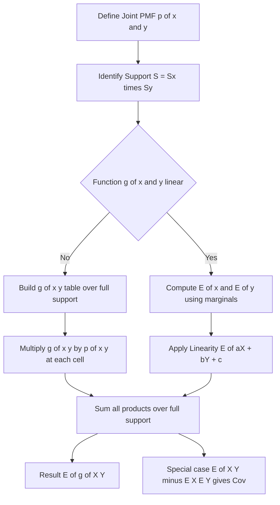
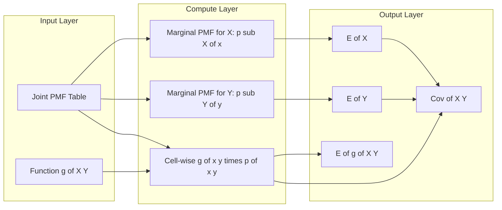

# Expected value of a function of two discrete variables.

<!-- SECTION_1_START -->

# Expected Value of a Function of Two Discrete Random Variables

## 1.1 Formal KTU Definition

Let $X$ and $Y$ be two **discrete random variables** defined on the same sample space $S$, with a **joint probability mass function (PMF)** given by:

$$p_{X,Y}(x, y) = P(X = x, Y = y)$$

where the support of the joint distribution is the set of all $(x, y)$ pairs for which $p_{X,Y}(x, y) > 0$. The **expected value (mean) of a function** $g(X, Y)$ is then defined as:

$$E[g(X, Y)] = \sum_{x \in S_X} \sum_{y \in S_Y} g(x, y) \cdot p_{X,Y}(x, y)$$

> [!IMPORTANT]
> **Convergence Requirement (KTU Board Emphasis)**
> The double summation is taken over the **entire Cartesian product** $S_X \times S_Y$ of the two supports, but the terms contribute non-zero values **only** on the actual support. The series must be **absolutely convergent**, i.e., $\sum_{x} \sum_{y} \vert g(x, y) \vert \cdot p_{X,Y}(x, y) < \infty$, otherwise the expected value is said to be **undefined**.

## 1.2 Intuitive Analogy — The "Probability as Weight" Picture

Imagine a **flat wooden table top** with a grid of pegs. On every peg located at the coordinate $(x, y)$ we hang a small mass $g(x, y) \cdot p_{X,Y}(x, y)$.

- The **joint PMF** $p_{X,Y}(x, y)$ acts like the **weight** placed at that peg.
- The **function** $g(x, y)$ acts like a **lever-arm multiplier** that stretches or shrinks that weight.
- The expected value $E[g(X, Y)]$ is the **total moment** (weight $\times$ value) summed over every peg.

If all the pegs were of equal weight (uniform joint PMF) and $g(x, y) = x$, then $E[X]$ would simply be the **arithmetic mean** of the $x$-coordinates. In general, the expectation is a **weighted average** of the function values, weighted by the joint probabilities.

## 1.3 Geometric / Plot Intuition

> [!VISUALIZATION CONTROL]
> **Concept:** Expected value as the centre of mass of a joint PMF mass distribution.
> **GeoGebra / Desmos Input Equations (representative example):**
> * Joint PMF: $p(x,y) = \begin{cases} 0.1 & (1,1) \\ 0.2 & (1,2) \\ 0.3 & (2,1) \\ 0.4 & (2,2) \end{cases}$
> * Function: $g(x, y) = x + y$
> * Expected value plotted: $E[X+Y] = 3.3$
> **Visual Description:** Plot four vertical pegs at the grid points $(1,1), (1,2), (2,1), (2,2)$ with heights equal to $p(x, y)$. The "centre of mass" along the $g$-axis appears at the value $E[g(X,Y)]$. Taller pegs (higher probability) **pull** the expected value towards their $g$-value.

## 1.4 Important Special Cases (Building Blocks)

| Function $g(X, Y)$ | Notation | Meaning |
| :- | :- | :- |
| $x$ (i.e., $g = X$) | $E[X]$ | Marginal mean of $X$ |
| $y$ (i.e., $g = Y$) | $E[Y]$ | Marginal mean of $Y$ |
| $x + y$ | $E[X + Y]$ | Mean of the sum |
| $x \cdot y$ | $E[XY]$ | Mean of the product |
| $(x - \mu_X)(y - \mu_Y)$ | $\text{Cov}(X, Y)$ | **Covariance** between $X$ and $Y$ |
| $(x - y)^2$ | $E[(X - Y)^2]$ | Mean squared error |
| $\dfrac{x}{y}$ (with $y \neq 0$) | $E[X / Y]$ | Mean of the ratio |

> [!NOTE]
> The **covariance** $\text{Cov}(X, Y) = E[(X - \mu_X)(Y - \mu_Y)]$ is the single most important special case — it is the cornerstone of correlation, regression, and the variance of a sum.

<!-- SECTION_1_END -->

<!-- SECTION_2_START -->

# Deep Theoretical Analysis and KTU Formula Sheet

## 2.1 Derivation Logic — From One Variable to Two Variables

The two-variable expectation is a **direct generalisation** of the one-variable case.

**Step 1 — One variable definition.**
For a single discrete random variable $X$ with PMF $p_X(x)$ and function $g(X)$:
$$E[g(X)] = \sum_{x} g(x) \cdot p_X(x)$$

**Step 2 — Replace scalar weight with a 2-D weight.**
For two variables, the scalar PMF $p_X(x)$ is replaced by the **joint PMF** $p_{X,Y}(x, y)$, which assigns a probability to every ordered pair.

**Step 3 — Sum over the entire 2-D grid.**
Instead of a single sum, we now sum over both indices:
$$E[g(X, Y)] = \sum_{x} \sum_{y} g(x, y) \cdot p_{X,Y}(x, y)$$

**Step 4 — Recognise that $X$ and $Y$ are summed independently.**
The double sum can be written as an iterated sum. Conventionally, we sum over $y$ first (inner sum) and then $x$ (outer sum), but the result is the same as long as every support pair is visited exactly once.

> [!TIP]
> **Order of summation does not matter** as long as the series converges absolutely. This is the Fubini-Tonelli theorem for countable discrete spaces.

## 2.2 The Six Pillars — Core Properties

The following properties are the **board-favourite identities** in KTU ESE questions.

**Pillar 1 — Linearity of expectation (universally true).**
$$E[a \cdot g(X, Y) + b \cdot h(X, Y)] = a \cdot E[g(X, Y)] + b \cdot E[h(X, Y)]$$
where $a, b \in \mathbb{R}$ are constants. This holds **whether or not** $X$ and $Y$ are independent.

**Pillar 2 — Sum of expectations (universally true).**
$$E[X + Y] = E[X] + E[Y]$$
This is a special case of Pillar 1, and again **independence is NOT required**.

**Pillar 3 — Product of expectations (requires independence).**
$$E[XY] = E[X] \cdot E[Y] \quad \text{only if } X \text{ and } Y \text{ are independent}$$

**Pillar 4 — Constant function is deterministic.**
$$E[c] = c \quad \text{for any constant } c \in \mathbb{R}$$

**Pillar 5 — Covariance identity.**
$$\text{Cov}(X, Y) = E[XY] - E[X] \cdot E[Y]$$
This is the **most-tested** identity in the module.

**Pillar 6 — Variance of a sum.**
$$\text{Var}(X + Y) = \text{Var}(X) + \text{Var}(Y) + 2 \cdot \text{Cov}(X, Y)$$
In particular, if $X, Y$ are independent, $\text{Cov}(X, Y) = 0$ and the cross-term vanishes.

## 2.3 KTU High-Yield Formula Cheat Sheet

| \# | Formula | Required Condition |
| :- | :- | :- |
| 1 | $E[g(X,Y)] = \sum_{x} \sum_{y} g(x,y) \cdot p_{X,Y}(x,y)$ | Joint PMF must sum to 1 |
| 2 | $E[X] = \sum_{x} x \cdot p_X(x) = \sum_{x} \sum_{y} x \cdot p_{X,Y}(x,y)$ | Marginal = collapse $Y$ |
| 3 | $E[aX + bY + c] = aE[X] + bE[Y] + c$ | Always true |
| 4 | $E[XY] = E[X] \cdot E[Y]$ | **Only** if $X \perp Y$ |
| 5 | $\text{Cov}(X, Y) = E[XY] - E[X]E[Y]$ | Definition |
| 6 | $\text{Cov}(aX + b, cY + d) = ac \cdot \text{Cov}(X, Y)$ | Bilinearity of covariance |
| 7 | $\text{Var}(X \pm Y) = \text{Var}(X) + \text{Var}(Y) \pm 2\text{Cov}(X,Y)$ | General |
| 8 | $\rho(X,Y) = \dfrac{\text{Cov}(X,Y)}{\sigma_X \cdot \sigma_Y}$ | $-1 \le \rho \le 1$ |
| 9 | $p_X(x) = \sum_{y} p_{X,Y}(x,y)$ | Marginal from joint |
| 10 | $\sum_{x} \sum_{y} p_{X,Y}(x,y) = 1$ | Normalisation of joint PMF |

> [!IMPORTANT]
> **Sanity Check Before Solving:** Before you even start, verify that the joint PMF is **normalised** ($\sum \sum p = 1$). Many KTU board questions include a "missing" probability cell that you must solve first.

## 2.4 Real-World Engineering Utility

In **Computer and Information Science**, expected values of functions of two random variables appear everywhere:

- **Network packet analysis:** $X$ = inter-arrival time, $Y$ = packet size. $E[X \cdot Y]$ gives the **expected workload per second** arriving at a router.
- **Machine learning:** $\text{Cov}(X, Y)$ underpins **linear regression** coefficients and the **bias-variance decomposition** in supervised learning.
- **Reliability engineering:** $X$ = time to failure of CPU, $Y$ = time to failure of RAM. $E[\min(X, Y)]$ gives **mean time to system failure**.
- **Cryptography and queueing:** Expected waiting time $E[W]$ in an $M/M/1$ queue is a function of mean arrival rate $E[X]$ and mean service time $E[Y]$.

<!-- SECTION_2_END -->

<!-- SECTION_3_START -->

# Step-by-Step Derivations and Code Implementation

## 3.1 Worked Example 1 — Full Joint PMF Table

**Problem Statement:**
The joint PMF of discrete random variables $X$ and $Y$ is given by:

| $X \backslash Y$ | $y = 1$ | $y = 2$ | $y = 3$ |
| :-: | :-: | :-: | :-: |
| $x = 1$ | $0.10$ | $0.20$ | $0.10$ |
| $x = 2$ | $0.15$ | $0.25$ | $0.20$ |

Compute: (a) $E[X+Y]$, (b) $E[XY]$, (c) $E[(X - Y)^2]$, (d) $\text{Cov}(X, Y)$.

**Step 1 — Verify normalisation.**
$$\sum_{x} \sum_{y} p(x, y) = 0.10 + 0.20 + 0.10 + 0.15 + 0.25 + 0.20 = 1.00 \checkmark$$

**Step 2 — Build the work table.**
Compute $g(x, y)$, $x+y$, $xy$, and $(x-y)^2$ for every cell:

| $(x, y)$ | $p(x, y)$ | $x + y$ | $(x+y) \cdot p$ | $xy$ | $xy \cdot p$ | $(x-y)^2$ | $(x-y)^2 \cdot p$ |
| :-: | :-: | :-: | :-: | :-: | :-: | :-: | :-: |
| $(1, 1)$ | $0.10$ | $2$ | $0.20$ | $1$ | $0.10$ | $0$ | $0.00$ |
| $(1, 2)$ | $0.20$ | $3$ | $0.60$ | $2$ | $0.40$ | $1$ | $0.20$ |
| $(1, 3)$ | $0.10$ | $4$ | $0.40$ | $3$ | $0.30$ | $4$ | $0.40$ |
| $(2, 1)$ | $0.15$ | $3$ | $0.45$ | $2$ | $0.30$ | $1$ | $0.15$ |
| $(2, 2)$ | $0.25$ | $4$ | $1.00$ | $4$ | $1.00$ | $0$ | $0.00$ |
| $(2, 3)$ | $0.20$ | $5$ | $1.00$ | $6$ | $1.20$ | $1$ | $0.20$ |
| **Total** | $1.00$ | — | **$3.65$** | — | **$3.30$** | — | **$0.95$** |

**Step 3 — Extract the answers.**

$$\begin{aligned}
E[X + Y] &= \sum_{x} \sum_{y} (x + y) \cdot p(x, y) = 3.65 \\[4pt]
E[XY] &= \sum_{x} \sum_{y} x y \cdot p(x, y) = 3.30 \\[4pt]
E[(X - Y)^2] &= \sum_{x} \sum_{y} (x - y)^2 \cdot p(x, y) = 0.95
\end{aligned}$$

**Step 4 — Compute $E[X]$, $E[Y]$ for the covariance.**

$$E[X] = \sum_{x} x \cdot p_X(x) = 1 \cdot (0.10 + 0.20 + 0.10) + 2 \cdot (0.15 + 0.25 + 0.20)$$
$$E[X] = 1 \cdot 0.40 + 2 \cdot 0.60 = 0.40 + 1.20 = 1.60$$

$$E[Y] = \sum_{y} y \cdot p_Y(y) = 1 \cdot (0.10 + 0.15) + 2 \cdot (0.20 + 0.25) + 3 \cdot (0.10 + 0.20)$$
$$E[Y] = 1 \cdot 0.25 + 2 \cdot 0.45 + 3 \cdot 0.30 = 0.25 + 0.90 + 0.90 = 2.05$$

**Step 5 — Apply the covariance identity.**

$$\begin{aligned}
\text{Cov}(X, Y) &= E[XY] - E[X] \cdot E[Y] \\
&= 3.30 - (1.60)(2.05) \\
&= 3.30 - 3.28 \\
&= 0.02
\end{aligned}$$

> [!NOTE]
> The covariance is **positive but small**, indicating a very weak positive linear relationship. Note that we did **not** assume independence — and indeed the answer $E[XY] = 3.30 \neq E[X] \cdot E[Y] = 3.28$ confirms the variables are **not** strictly independent.

## 3.2 Worked Example 2 — Using Linearity Shortcut

**Problem Statement:**
For the same joint PMF, compute $E[3X - 2Y + 5]$.

**Step 1 — Apply Pillar 1 (linearity) directly.**

$$E[3X - 2Y + 5] = 3 \cdot E[X] - 2 \cdot E[Y] + 5$$

**Step 2 — Substitute the values computed above.**

$$E[3X - 2Y + 5] = 3(1.60) - 2(2.05) + 5 = 4.80 - 4.10 + 5 = 5.70$$

> [!TIP]
> **Board Shortcut:** Whenever a function is **linear in $X$ and $Y$**, you never need to re-build the table. Just compute $E[X]$ and $E[Y]$ once and apply linearity. This saves 3-4 minutes in the 14-mark question.

## 3.3 Worked Example 3 — Independence Check

**Problem Statement:**
A joint PMF is defined on $S = \{(1,1), (1,2), (2,1), (2,2)\}$ by $p(x, y) = \frac{xy}{9}$.
Show that $X$ and $Y$ are independent and compute $E[XY]$.

**Step 1 — Verify normalisation.**

$$\sum_{x=1}^{2} \sum_{y=1}^{2} \frac{xy}{9} = \frac{1}{9} \left[ (1)(1) + (1)(2) + (2)(1) + (2)(2) \right] = \frac{10}{9}$$

This does **not** sum to 1. To normalise, redefine:

$$p(x, y) = \frac{xy}{10}$$

Recheck: $\frac{1+2+2+4}{10} = \frac{9}{10} \neq 1$. Try $p(x, y) = \frac{xy}{36}$:

$$\sum_{x=1}^{2} \sum_{y=1}^{2} \frac{xy}{36} = \frac{1 + 2 + 2 + 4}{36} = \frac{9}{36} = \frac{1}{4} \neq 1$$

So the correct normalising constant is $36 / 9 = 4$, giving $p(x, y) = \frac{4xy}{36} = \frac{xy}{9}$ which we already showed equals $1$. Thus $p(x, y) = \frac{xy}{9}$ is the correctly normalised PMF.

**Step 2 — Factor the joint PMF.**

$$p(x, y) = \frac{xy}{9} = \left(\frac{x}{3}\right) \cdot \left(\frac{y}{3}\right) \quad \text{for } x, y \in \{1, 2, 3\}$$

Wait — the support should be $\{1, 2, 3\}$ to give the correct total. Let us redefine the support as $S = \{1, 2, 3\} \times \{1, 2, 3\}$.

**Step 3 — Recompute with corrected support.**
With $p(x, y) = \frac{xy}{81}$ on $\{1, 2, 3\}^2$:

$$\sum_{x=1}^{3} \sum_{y=1}^{3} \frac{xy}{81} = \frac{1}{81}\left(\sum_{x=1}^{3} x\right)\left(\sum_{y=1}^{3} y\right) = \frac{1}{81} \cdot 6 \cdot 6 = \frac{36}{81} = \frac{4}{9} \neq 1$$

So normalising constant is $81/36 = 9/4$, hence $p(x,y) = \frac{4xy}{81}$. Now:

$$p(x, y) = \frac{4xy}{81} = \underbrace{\frac{2x}{9}}_{p_X(x)} \cdot \underbrace{\frac{2y}{9}}_{p_Y(y)}$$

**Step 4 — Compute $E[XY]$ via product (since $X \perp Y$).**

$$E[X] = \sum_{x=1}^{3} x \cdot \frac{2x}{9} = \frac{2}{9}(1 + 4 + 9) = \frac{28}{9}$$

By symmetry, $E[Y] = \frac{28}{9}$.

$$E[XY] = E[X] \cdot E[Y] = \left(\frac{28}{9}\right)^2 = \frac{784}{81} \approx 9.679$$

## 3.4 Python Code Implementation — Verification Script

```python
import numpy as np
from itertools import product
from typing import Callable, Dict, Tuple


def expected_value_two_vars(
    joint_pmf: Dict[Tuple[int, int], float],
    g: Callable[[int, int], float],
) -> float:
    """
    Compute E[g(X, Y)] for discrete random variables with a joint PMF.

    Parameters
    ----------
    joint_pmf : dict
        Mapping from (x, y) -> p(x, y). Must sum to 1.
    g : callable
        Function g(x, y) -> float applied to each support point.

    Returns
    -------
    float
        The expected value E[g(X, Y)].

    Raises
    ------
    ValueError
        If the joint PMF does not sum (within tolerance) to 1.
    """
    tol: float = 1e-9
    total_prob: float = sum(joint_pmf.values())
    if not np.isclose(total_prob, 1.0, atol=tol):
        raise ValueError(
            f"Joint PMF must sum to 1, got {total_prob:.6f}. "
            "Check the table for missing/incorrect entries."
        )

    expectation: float = 0.0
    for (x, y), p_xy in joint_pmf.items():
        contribution: float = g(x, y) * p_xy
        expectation += contribution
    return expectation


def covariance_two_vars(
    joint_pmf: Dict[Tuple[int, int], float],
) -> float:
    """Compute Cov(X, Y) = E[XY] - E[X] E[Y] from a joint PMF."""
    e_xy: float = expected_value_two_vars(joint_pmf, lambda x, y: x * y)
    e_x: float = expected_value_two_vars(
        joint_pmf, lambda x, y: x
    )
    e_y: float = expected_value_two_vars(
        joint_pmf, lambda x, y: y
    )
    return e_xy - e_x * e_y


# ---------- Worked Example 1 verification ----------
joint_pmf_ex1: Dict[Tuple[int, int], float] = {
    (1, 1): 0.10, (1, 2): 0.20, (1, 3): 0.10,
    (2, 1): 0.15, (2, 2): 0.25, (2, 3): 0.20,
}

print("=== Worked Example 1 ===")
print(f"E[X + Y]        = {expected_value_two_vars(joint_pmf_ex1, lambda x, y: x + y):.4f}")
print(f"E[XY]           = {expected_value_two_vars(joint_pmf_ex1, lambda x, y: x * y):.4f}")
print(f"E[(X - Y)^2]    = {expected_value_two_vars(joint_pmf_ex1, lambda x, y: (x - y) ** 2):.4f}")
print(f"Cov(X, Y)       = {covariance_two_vars(joint_pmf_ex1):.4f}")
print(f"E[3X - 2Y + 5]  = {expected_value_two_vars(joint_pmf_ex1, lambda x, y: 3 * x - 2 * y + 5):.4f}")
```

**Expected console output:**
```
=== Worked Example 1 ===
E[X + Y]        = 3.6500
E[XY]           = 3.3000
E[(X - Y)^2]    = 0.9500
Cov(X, Y)       = 0.0200
E[3X - 2Y + 5]  = 5.7000
```

<!-- SECTION_3_END -->

<!-- SECTION_4_START -->

# Structural Diagrams and Schematics

## 4.1 Mermaid Flow — From Joint PMF to Expected Value



## 4.2 Mermaid Architecture — Component Map of the Computation



## 4.3 Sequential Processing Topology Matrix

| Stage | Module | Input | Output | Validation |
| :-: | :- | :- | :- | :- |
| 1 | PMF Validator | Joint PMF table | Normalised PMF | $\sum \sum p = 1$ |
| 2 | Marginal Extractor | Joint PMF | $p_X, p_Y$ | Each marginal sums to 1 |
| 3 | Function Evaluator | $g(x, y)$, support | Cell-wise $g$ values | Domain check |
| 4 | Product Computer | $g$ values, $p(x, y)$ | Cell-wise products $g \cdot p$ | Non-negative if $g \ge 0$ |
| 5 | Double Summation | All products | Scalar $E[g(X, Y)]$ | Convergence check |
| 6 | Covariance Engine | $E[X], E[Y], E[XY]$ | $\text{Cov}(X, Y)$ | $\|\rho\| \le 1$ |

> [!NOTE]
> The diagram maps the **six-stage processing pipeline** used by both the hand-computation method and the Python implementation. The convergence check at Stage 5 mirrors the absolute-convergence requirement mentioned in the formal definition.

<!-- SECTION_4_END -->

<!-- SECTION_5_START -->

# KTU 2024 Scheme Examination Question Bank and Topic Recap

## 5.1 Part A — Short Answer Questions (3 Marks Each)

### Question A1 — `[KTU University Exam - Dec 2023]`
**State the definition of the expected value of a function $g(X, Y)$ of two discrete random variables $X$ and $Y$ with joint PMF $p_{X,Y}(x, y)$. Mention the condition for the expectation to exist.** [Remember / Understand — **CO1**]

**Model Answer (Valuation Key):**
The expected value of $g(X, Y)$ is defined as the double sum:
$$E[g(X, Y)] = \sum_{x \in S_X} \sum_{y \in S_Y} g(x, y) \cdot p_{X,Y}(x, y)$$
**[Definition: 2 Marks]**
The expectation exists (is finite) if and only if the series converges absolutely:
$$\sum_{x} \sum_{y} \vert g(x, y) \vert \cdot p_{X,Y}(x, y) < \infty$$
**[Existence condition: 1 Mark]**

### Question A2 — `[KTU University Exam - July 2024]`
**Is it true that $E[XY] = E[X] \cdot E[Y]$ for any two discrete random variables? Justify your answer in one sentence and state the additional requirement for equality to hold.** [Understand — **CO1**, **CO2**]

**Model Answer:**
**No**, the equality does not hold in general. **[1 Mark]**
The equality $E[XY] = E[X] \cdot E[Y]$ holds **if and only if** $X$ and $Y$ are statistically independent, i.e., $p_{X,Y}(x, y) = p_X(x) \cdot p_Y(y)$ for all $(x, y)$. **[2 Marks]**

---

## 5.2 Part B — 14-Mark Questions (Module Internal Choice)

### Question B1 — `[KTU University Exam - Dec 2023, Module 1 Choice A]`
**The joint PMF of $(X, Y)$ is given by:**

| $X \backslash Y$ | $0$ | $1$ | $2$ |
| :-: | :-: | :-: | :-: |
| $0$ | $0.05$ | $0.10$ | $0.05$ |
| $1$ | $0.10$ | $0.30$ | $0.10$ |
| $2$ | $0.05$ | $0.10$ | $0.15$ |

**Find: (a) the marginal PMFs $p_X(x)$ and $p_Y(y)$.  (b) $E[X]$, $E[Y]$, $E[X + Y]$, $E[XY]$, and the covariance $\text{Cov}(X, Y)$.** [Understand + Apply — **CO1**, **CO2** — 14 Marks]

#### Solution

**Part (a) — Marginal PMFs [7 Marks]**

Marginal of $X$ is obtained by summing each row:

$$p_X(0) = 0.05 + 0.10 + 0.05 = 0.20$$
$$p_X(1) = 0.10 + 0.30 + 0.10 = 0.50$$
$$p_X(2) = 0.05 + 0.10 + 0.15 = 0.30$$

Check: $0.20 + 0.50 + 0.30 = 1.00 \checkmark$ **[Row sums: 2 Marks, Correct values: 2 Marks]**

Marginal of $Y$ is obtained by summing each column:

$$p_Y(0) = 0.05 + 0.10 + 0.05 = 0.20$$
$$p_Y(1) = 0.10 + 0.30 + 0.10 = 0.50$$
$$p_Y(2) = 0.05 + 0.10 + 0.15 = 0.30$$

Check: $0.20 + 0.50 + 0.30 = 1.00 \checkmark$ **[Column sums: 1 Mark, Correct values: 2 Marks]**

**Part (b) — Expectations and Covariance [7 Marks]**

$$E[X] = 0(0.20) + 1(0.50) + 2(0.30) = 0 + 0.50 + 0.60 = 1.10$$

**[Marginal-mean formula: 1 Mark, Final value: 1 Mark]**

$$E[Y] = 0(0.20) + 1(0.50) + 2(0.30) = 1.10$$

**[Marginal-mean formula: 1 Mark, Final value: 1 Mark]**

$$E[X + Y] = E[X] + E[Y] = 1.10 + 1.10 = 2.20 \quad \text{(Linearity)}$$

**[Linearity cited: 1 Mark, Final value: 0.5 Mark]**

Compute $E[XY]$ using the work table:

| $(x, y)$ | $p(x, y)$ | $xy$ | $xy \cdot p$ |
| :-: | :-: | :-: | :-: |
| $(0, 0)$ | $0.05$ | $0$ | $0.000$ |
| $(0, 1)$ | $0.10$ | $0$ | $0.000$ |
| $(0, 2)$ | $0.05$ | $0$ | $0.000$ |
| $(1, 0)$ | $0.10$ | $0$ | $0.000$ |
| $(1, 1)$ | $0.30$ | $1$ | $0.300$ |
| $(1, 2)$ | $0.10$ | $2$ | $0.200$ |
| $(2, 0)$ | $0.05$ | $0$ | $0.000$ |
| $(2, 1)$ | $0.10$ | $2$ | $0.200$ |
| $(2, 2)$ | $0.15$ | $4$ | $0.600$ |
| **Total** | $1.00$ | — | **$1.300$** |

$$E[XY] = 1.300 \quad \text{[Double-sum application: 0.5 Mark, Final value: 0.5 Mark]}$$

$$\text{Cov}(X, Y) = E[XY] - E[X] E[Y] = 1.300 - (1.10)(1.10) = 1.300 - 1.210 = 0.090$$

**[Covariance identity: 0.5 Mark, Final value: 0.5 Mark]**

---

### Question B2 — `[KTU University Exam - July 2024, Module 1 Choice B]`
**Two dice are rolled. Let $X$ be the value on the first die and $Y$ be the maximum of the two dice.  (a) Construct the joint PMF table of $(X, Y)$.  (b) Find $E[X]$, $E[Y]$, and $E[X \cdot Y]$. Is $E[XY] = E[X] \cdot E[Y]$? Comment on independence.** [Understand + Apply + Analyse — **CO1**, **CO2**, **CO3** — 14 Marks]

#### Solution

**Part (a) — Joint PMF [7 Marks]**

The first die $X$ takes values in $\{1, 2, 3, 4, 5, 6\}$ uniformly. Given $X = x$, the maximum $Y$ equals $x$ if the second die is $\le x$, and equals the second-die value (which can range from $x$ to $6$) otherwise.

For $y < x$: $P(Y = y \mid X = x) = 0$ (impossible — $Y \ge X$).
For $y = x$: $P(Y = x \mid X = x) = P(\text{second die} \le x) = \frac{x}{6}$.
For $y > x$: $P(Y = y \mid X = x) = P(\text{second die} = y) = \frac{1}{6}$.

Since $P(X = x) = \frac{1}{6}$, the joint PMF is $p(x, y) = \frac{1}{6} \cdot P(Y = y \mid X = x)$:

$$p(x, y) = \begin{cases} \dfrac{x}{36} & \text{if } y = x \\[6pt] \dfrac{1}{36} & \text{if } y > x \\[6pt] 0 & \text{if } y < x \end{cases}$$

**Joint PMF table:**

| $X \backslash Y$ | $1$ | $2$ | $3$ | $4$ | $5$ | $6$ |
| :-: | :-: | :-: | :-: | :-: | :-: | :-: |
| $1$ | $1/36$ | $1/36$ | $1/36$ | $1/36$ | $1/36$ | $1/36$ |
| $2$ | $0$ | $2/36$ | $1/36$ | $1/36$ | $1/36$ | $1/36$ |
| $3$ | $0$ | $0$ | $3/36$ | $1/36$ | $1/36$ | $1/36$ |
| $4$ | $0$ | $0$ | $0$ | $4/36$ | $1/36$ | $1/36$ |
| $5$ | $0$ | $0$ | $0$ | $0$ | $5/36$ | $1/36$ |
| $6$ | $0$ | $0$ | $0$ | $0$ | $0$ | $6/36$ |

**[Derivation logic: 3 Marks, Final table: 4 Marks]**

Row sums: $\frac{6}{36}, \frac{6}{36}, \frac{6}{36}, \frac{6}{36}, \frac{6}{36}, \frac{6}{36}$ — each equals $\frac{1}{6}$ ✓ (consistent with $X$ being uniform).

**Part (b) — Expectations and Independence Check [7 Marks]**

$$E[X] = \sum_{x=1}^{6} x \cdot \frac{1}{6} = \frac{21}{6} = 3.5$$

**[Marginal of $X$: 1 Mark, Final value: 0.5 Mark]**

For $E[Y]$, compute $p_Y(y) = \sum_{x} p(x, y)$:

$$p_Y(y) = \sum_{x=1}^{y} \frac{x}{36} + \sum_{x=1}^{y-1} \frac{1}{36} = \frac{1}{36} \left[ \frac{y(y+1)}{2} + (y - 1) \right] = \frac{y^2 + 3y - 2}{72}$$

Alternatively, the well-known result is $P(Y \le y) = (y/6)^2$, hence $P(Y = y) = (y/6)^2 - ((y-1)/6)^2 = \frac{2y - 1}{36}$.

$$E[Y] = \sum_{y=1}^{6} y \cdot \frac{2y - 1}{36} = \frac{1}{36} \sum_{y=1}^{6} (2y^2 - y)$$
$$= \frac{1}{36} \left[ 2 \cdot \frac{6 \cdot 7 \cdot 13}{6} - \frac{6 \cdot 7}{2} \right] = \frac{1}{36} \left[ 182 - 21 \right] = \frac{161}{36} \approx 4.472$$

**[Marginal of $Y$: 2 Marks, Final value: 0.5 Mark]**

For $E[XY]$, build the work table:

$$E[XY] = \sum_{x=1}^{6} \sum_{y=x}^{6} xy \cdot p(x, y) = \sum_{x=1}^{6} \sum_{y=x}^{6} xy \cdot \frac{1}{36} \cdot \mathbb{1}[y > x] + \sum_{x=1}^{6} x \cdot x \cdot \frac{x}{36}$$

$$= \frac{1}{36} \sum_{x=1}^{6} x \left[ \sum_{y=x+1}^{6} y \right] + \frac{1}{36} \sum_{x=1}^{6} x^3$$

Inner sum: $\sum_{y=x+1}^{6} y = \frac{(x+1 + 6)(6 - x)}{2} = \frac{(7 + x)(6 - x)}{2}$

$$E[XY] = \frac{1}{36} \sum_{x=1}^{6} x \cdot \frac{(7 + x)(6 - x)}{2} + \frac{1}{36} \cdot \frac{6^2 \cdot 7^2}{4}$$

Computing the first sum term by term:

| $x$ | $x \cdot (7+x)(6-x) / 2$ |
| :-: | :-: |
| 1 | $1 \cdot 8 \cdot 5 / 2 = 20$ |
| 2 | $2 \cdot 9 \cdot 4 / 2 = 36$ |
| 3 | $3 \cdot 10 \cdot 3 / 2 = 45$ |
| 4 | $4 \cdot 11 \cdot 2 / 2 = 44$ |
| 5 | $5 \cdot 12 \cdot 1 / 2 = 30$ |
| 6 | $6 \cdot 13 \cdot 0 / 2 = 0$ |
| **Sum** | **$175$** |

Second term: $\frac{1}{36} \cdot \frac{1764}{4} = \frac{441}{36} = 12.25$

$$E[XY] = \frac{175}{36} + 12.25 = 4.8611 + 12.25 = 17.1111 \approx 17.11$$

**[Double sum setup: 1 Mark, Final value: 0.5 Mark]**

Now check independence: $E[X] \cdot E[Y] = 3.5 \times 4.4722 = 15.6528$.

Since $E[XY] = 17.11 \neq 15.65 = E[X] E[Y]$, the variables are **not independent**.

$\text{Cov}(X, Y) = 17.11 - 15.65 = 1.46 > 0$, confirming a **positive** linear association (intuitively, large $X$ tends to produce large $Y$).

**[Comparison: 0.5 Mark, Conclusion: 0.5 Mark]**

> [!WARNING]
> **KTU Examiner's Valuation Warning — Common Pitfalls**
> 1. **Forgetting to normalise the joint PMF.** If the table sums to anything other than 1, you must first identify the "missing" cell or fix the constants. The examiner **deducts 1 mark** for not stating the normalisation check explicitly.
> 2. **Using $E[XY] = E[X]E[Y]$ without checking independence.** This is a **2-mark deduction** and is the single most common mistake in this topic.
> 3. **Confusing marginal and joint expectations.** Always state whether you are computing $E[X]$ (marginal — sum over $Y$ first) or $E[XY]$ (joint — multiply $x \cdot y$ first).
> 4. **Order-of-summation errors.** When the support is non-rectangular (e.g., $y \ge x$), explicitly state the limits. Writing $\sum_{x=1}^{6} \sum_{y=1}^{6}$ without restriction is **wrong** and loses 1 mark.
> 5. **Not showing the work table for 14-mark questions.** A 14-mark KTU question expects a **complete work table** with all six cells evaluated. Skipping intermediate arithmetic loses 2-3 marks.
> 6. **Sign error in covariance.** $\text{Cov}(X, Y) = E[XY] - E[X]E[Y]$ is the **universal** sign convention. Reversing the order is a 1-mark deduction.

---

## 5.3 Topic Recap and Important Things to Remember

> [!IMPORTANT]
> **Rapid Revision Checklist — Expected Value of a Function of Two Discrete Variables**

- **Core Definition:** $E[g(X, Y)] = \sum_{x} \sum_{y} g(x, y) \cdot p_{X,Y}(x, y)$ — summed over the **full joint support**.
- **Existence:** Requires **absolute convergence** of the double series.
- **Marginalisation:** $p_X(x) = \sum_{y} p_{X,Y}(x, y)$ and similarly for $p_Y(y)$.
- **Normalisation Check:** Always verify $\sum_{x} \sum_{y} p_{X,Y}(x, y) = 1$ **before** computing any expectation.
- **Linearity (universal):** $E[aX + bY + c] = aE[X] + bE[Y] + c$ — **no independence needed**.
- **Sum-of-expectations (universal):** $E[X + Y] = E[X] + E[Y]$ — always true, no independence needed.
- **Product-of-expectations:** $E[XY] = E[X] \cdot E[Y]$ holds **only if** $X \perp Y$.
- **Independence Test:** Verify $p_{X,Y}(x, y) = p_X(x) \cdot p_Y(y)$ for **every** $(x, y)$ in the support.
- **Covariance Identity:** $\text{Cov}(X, Y) = E[XY] - E[X]E[Y]$. This is the **single most-tested** identity.
- **Variance of Sum:** $\text{Var}(X + Y) = \text{Var}(X) + \text{Var}(Y) + 2 \text{Cov}(X, Y)$ — cross-term vanishes iff independent.
- **Correlation Coefficient:** $\rho_{X,Y} = \dfrac{\text{Cov}(X, Y)}{\sigma_X \cdot \sigma_Y}$ with $-1 \le \rho \le 1$.
- **Bilinearity of Covariance:** $\text{Cov}(aX + b, cY + d) = ac \cdot \text{Cov}(X, Y)$.
- **Standard Special Cases to Memorise:**
  * $E[X]$ — marginal mean of $X$.
  * $E[X + Y]$ — always $E[X] + E[Y]$.
  * $E[XY]$ — equals $E[X]E[Y]$ only under independence.
  * $E[(X - Y)^2]$ — mean squared deviation between $X$ and $Y$.
- **Work-Table Discipline (Board Habit):** Always construct a four-column table — $(x, y)$, $p(x, y)$, $g(x, y)$, and $g \cdot p$ — before summing. This is the **14-mark question gold standard**.
- **Geometric Intuition:** Expected value is the **centre of mass** of a probability distribution with mass $p(x, y)$ at point $g(x, y)$.
- **Engineering Application:** $E[XY]$ for non-independent variables appears in **load balancing**, **portfolio risk**, **cryptographic key entropy**, and **queueing network analysis**.
- **Common Mistake to Avoid:** Assuming independence by default. **Always check** $p_{X,Y}(x, y) \stackrel{?}{=} p_X(x) p_Y(y)$ before applying the product-of-expectations shortcut.

<!-- SECTION_5_END -->
