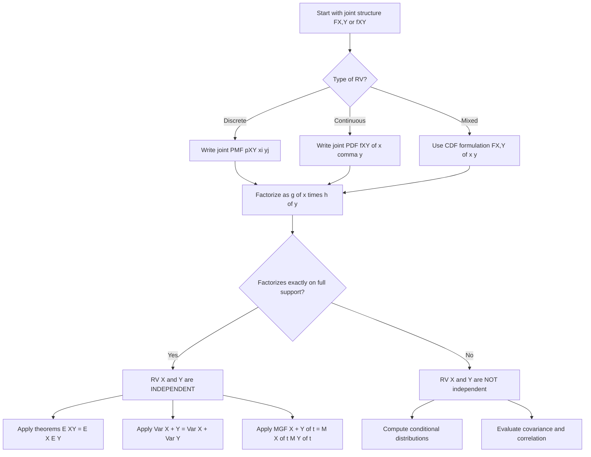
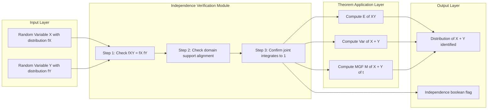
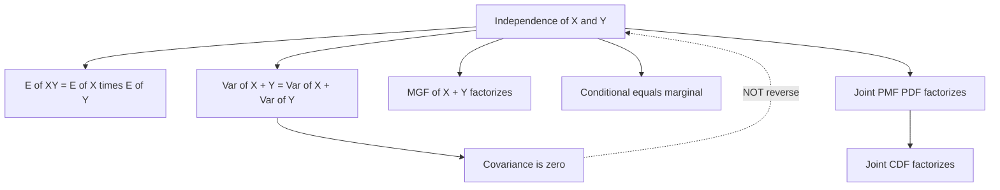
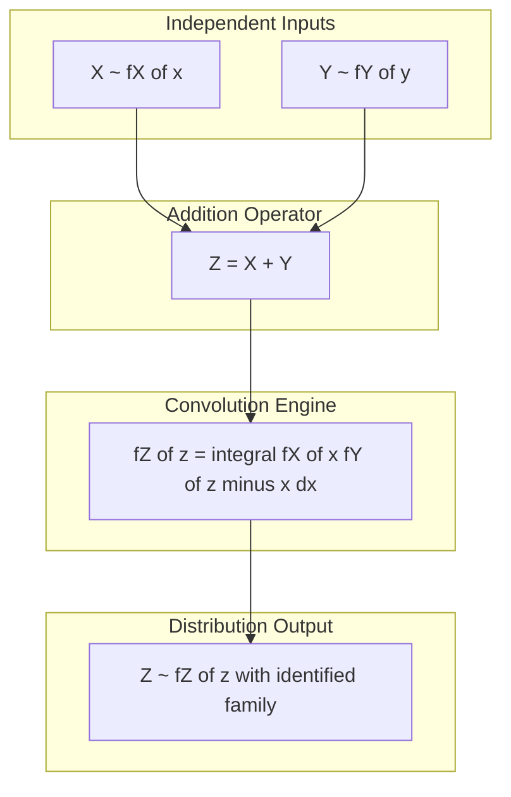

# Independent random variables

<!-- SECTION_1_START -->
# Independent Random Variables

## 1. Core Technical Definition

> [!NOTE]
> **KTU 2024 Syllabus Definition (GAMAT301 - Module 1)**
> Two random variables $X$ and $Y$ defined on the same probability space $(\Omega, \mathcal{F}, P)$ are said to be **statistically independent** if and only if, for every pair of real numbers $x$ and $y$, the joint cumulative distribution function (CDF) factorizes into the product of their marginal CDFs.

$$\begin{aligned}
F_{X,Y}(x, y) \;=\; P(X \le x,\; Y \le y) \;=\; P(X \le x)\cdot P(Y \le y) \;=\; F_X(x)\cdot F_Y(y) \quad \forall\, x, y \in \mathbb{R}
\end{aligned}$$

### Equivalent Conditions for Independence

| Variable Type | Independence Condition | KTU Board Notation |
|---------------|------------------------|---------------------|
| **Discrete** | $P(X = x_i, Y = y_j) = P(X = x_i)\cdot P(Y = y_j)$ for all $(i, j)$ | PMF factorizes |
| **Continuous** | $f_{X,Y}(x, y) = f_X(x)\cdot f_Y(y)$ for all $(x, y)$ where densities exist | Joint PDF factorizes |
| **General (CDF)** | $F_{X,Y}(x, y) = F_X(x)\cdot F_Y(y)$ | Marginal product form |

> [!IMPORTANT]
> **Syllabus Highlight:** A common KTU exam trap is that **pairwise independence** of $X$ and $Y$ does NOT imply **mutual independence** of a set of variables. KTU examiners frequently test $n=3$ counterexamples.

---

## 2. Conceptual Analogy & Intuitive Understanding

> [!TIP]
> **Real-World Analogy — The Two Unrelated Dice:**
> Imagine rolling a **red die** (giving $X$) and a **green die** (giving $Y$) simultaneously. Whatever number appears on the red die **does not influence** the outcome on the green die. Knowing that the red die showed $4$ tells you **nothing new** about the green die — its distribution remains uniform over $\{1, 2, 3, 4, 5, 6\}$. This "no-information-leakage" property is the *soul* of independence.

### Geometric Intuition

- The **joint density surface** $f_{X,Y}(x, y)$ over the $(x, y)$-plane behaves like a *sheet of fabric* draped over the two marginal density curves $f_X(x)$ and $f_Y(y)$.
- **Independence** means this sheet is exactly the *tensor product* — the height at any point is the product of the marginal heights. There are **no bumps, ridges, or valleys** created by coupling.

> [!VISUALIZATION CONTROL]
> **Concept:** Factorization of a joint Gaussian density into marginal components
> **GeoGebra / Desmos Input Equations (3D surface):**
> * `f_XY(x, y) = (1/(2*pi*sqrt(1-r^2))) * exp(-(x^2 - 2*r*x*y + y^2)/(2*(1-r^2)))` for general correlation $r$
> * `f_independent(x, y) = (1/(2*pi)) * exp(-(x^2 + y^2)/2)` for the independent case $r = 0$
> **Visual Description:** Students should observe that when $r = 0$, the elliptical contour lines of $f_{X,Y}$ become **perfect circles** centered at the origin, and the surface is radially symmetric — the signature of mutual independence between two standard normals.

> [!WARNING]
> **Common Misconception:** "Uncorrelated" $\Leftrightarrow$ "Independent" is **FALSE** in general. It is only true for the **joint Gaussian family**. KTU frequently tests this distinction.

---

## 3. Formal Statement of Independence (Mutual)

A family of random variables $\{X_1, X_2, \ldots, X_n\}$ is **mutually independent** if for every subset of indices $I \subseteq \{1, 2, \ldots, n\}$ and every choice of Borel sets $A_i$:

$$P\!\left(\bigcap_{i \in I} \{X_i \in A_i\}\right) = \prod_{i \in I} P(X_i \in A_i)$$

For two variables, this collapses to the single condition $F_{X,Y}(x, y) = F_X(x)\,F_Y(y)$ stated above.
<!-- SECTION_1_END -->

<!-- SECTION_2_START -->
# Deep Theoretical Analysis & KTU High-Yield Formula Sheet

## 1. Step-by-Step Logical Framework

### Why "Independence" Matters in Engineering

In **machine learning**, features are assumed independent in the **Naive Bayes** classifier to make computation tractable. In **reliable system design**, component failures are modeled as independent events to compute overall system failure probability. In **cryptography**, cryptographic outputs are designed to be statistically independent of keys. Independence is the **simplification engine** of probability theory.

### Structural Logic of Independence Tests

1. **Step 1 — Identify the joint structure.** Determine whether $X$ and $Y$ are discrete, continuous, or mixed.
2. **Step 2 — Factorize the joint distribution.** Attempt to write $f_{X,Y}(x, y)$ as a product of single-variable functions $g(x)\cdot h(y)$.
3. **Step 3 — Match boundary conditions.** Ensure the product integrates (or sums) to $1$ over the joint support.
4. **Step 4 — Conclude independence iff the factorization is exact** on the entire support.

### Independence Implications (High-Yield Theorems)

> [!IMPORTANT]
> **Theorem 2.1 — Factorization of Expectation:**
> If $X$ and $Y$ are independent, then $E[g(X)\,h(Y)] = E[g(X)]\cdot E[h(Y)]$ for any measurable functions $g$ and $h$ (provided the expectations exist).

> [!IMPORTANT]
> **Theorem 2.2 — Variance Additivity:**
> If $X$ and $Y$ are independent, then $\text{Var}(X + Y) = \text{Var}(X) + \text{Var}(Y)$. **No covariance term arises** because $\text{Cov}(X, Y) = 0$ for independent variables.

> [!IMPORTANT]
> **Theorem 2.3 — MGF Factorization:**
> If $X$ and $Y$ are independent, then $M_{X+Y}(t) = M_X(t)\cdot M_Y(t)$. This is the workhorse for identifying the distribution of a sum of independent random variables.

---

## 2. KTU Formula Sheet / Cheat Sheet

| \# | Concept | Formula | Domain / Conditions |
|---|---------|---------|---------------------|
| 1 | **CDF Independence** | $F_{X,Y}(x,y) = F_X(x)\,F_Y(y)$ | $\forall\, x, y \in \mathbb{R}$ |
| 2 | **Discrete PMF** | $p_{X,Y}(x_i, y_j) = p_X(x_i)\,p_Y(y_j)$ | $\forall\, (i, j)$ |
| 3 | **Continuous PDF** | $f_{X,Y}(x, y) = f_X(x)\,f_Y(y)$ | Almost everywhere on $\mathbb{R}^2$ |
| 4 | **Product of Expectations** | $E[XY] = E[X]\,E[Y]$ | Requires independence + finite moments |
| 5 | **Variance of Sum** | $\text{Var}(X + Y) = \text{Var}(X) + \text{Var}(Y)$ | Independence is **mandatory** |
| 6 | **MGF of Sum** | $M_{X+Y}(t) = M_X(t)\,M_Y(t)$ | Independence in a neighborhood of $t = 0$ |
| 7 | **Covariance** | $\text{Cov}(X, Y) = 0$ | Necessary, not sufficient for independence |
| 8 | **Conditional PDF** | $f_{X\,\vert\,Y}(x\,\vert\,y) = f_X(x)$ | Independence $\Leftrightarrow$ no update from $Y$ |
| 9 | **Sum Distribution (Discrete)** | $P(Z = k) = \sum_{i} P(X = i)\,P(Y = k-i)$ | Convolution of PMFs |
| 10 | **Sum Distribution (Continuous)** | $f_Z(z) = \int_{-\infty}^{\infty} f_X(x)\,f_Y(z-x)\,dx$ | Convolution of PDFs |

### KTU Frequently Tested Special Cases

- **Sum of two independent Poissons** $\sim$ Poisson (parameter adds): $X \sim \text{Poi}(\lambda_1),\; Y \sim \text{Poi}(\lambda_2) \Rightarrow X + Y \sim \text{Poi}(\lambda_1 + \lambda_2)$.
- **Sum of two independent Normals** $\sim$ Normal: $X \sim \mathcal{N}(\mu_1, \sigma_1^2),\; Y \sim \mathcal{N}(\mu_2, \sigma_2^2) \Rightarrow X + Y \sim \mathcal{N}(\mu_1 + \mu_2,\; \sigma_1^2 + \sigma_2^2)$.
- **Sum of two independent Exponentials (same rate)** $\sim$ Gamma: $X, Y \sim \text{Exp}(\lambda) \Rightarrow X + Y \sim \text{Gamma}(2, \lambda)$.

### Engineering Utility

- **Queueing Theory (M/M/1):** Inter-arrival times are independent exponentials; service times are independent exponentials; total time in system is a sum of independent gammas.
- **Reliability Engineering:** System of $n$ components in series, each with failure probability $p_i$ — system reliability is $\prod_i (1 - p_i)$ under independence.
- **Monte Carlo Simulation:** Variance reduction via independent replications is justified precisely because $\text{Var}(\bar{X}_n) = \sigma^2 / n$ relies on independence.

---

## 3. Counterexample: Uncorrelated $\not\Rightarrow$ Independent

Let $(X, Y)$ take values:
- $(-1, 0)$ with probability $1/4$
- $(0, -1)$ with probability $1/4$
- $(0, 1)$ with probability $1/4$
- $(1, 0)$ with probability $1/4$

Then $E[X] = 0$, $E[Y] = 0$, $E[XY] = 0$, so $\text{Cov}(X, Y) = 0$ (uncorrelated), but $P(X = 0, Y = 0) = 0 \neq P(X = 0)\,P(Y = 0) = (1/2)(1/2) = 1/4$. **Not independent.** This is a KTU favorite.
<!-- SECTION_2_END -->

<!-- SECTION_3_START -->
# Step-by-Step Derivations & Code Implementation

## 1. Exhaustive Derivation — Sum of Two Independent Uniform Random Variables

Let $X \sim \text{Uniform}(0, 1)$ and $Y \sim \text{Uniform}(0, 1)$ be independent. We wish to find the PDF of $Z = X + Y$.

**Step 1 — Write the convolution formula:**

$$f_Z(z) = \int_{-\infty}^{\infty} f_X(x)\,f_Y(z - x)\,dx$$

**Step 2 — Substitute the Uniform PDF:**

Since $X$ and $Y$ are supported on $(0, 1)$, we have $f_X(x) = 1$ for $0 \le x \le 1$ and $f_Y(y) = 1$ for $0 \le y \le 1$.

**Step 3 — Determine the integration limits:**

We need both $0 \le x \le 1$ and $0 \le z - x \le 1$, i.e., $z - 1 \le x \le z$. Combined with $0 \le x \le 1$:

$$\max(0,\, z - 1) \le x \le \min(1,\, z)$$

**Step 4 — Evaluate case-by-case:**

**Case (a): $z < 0$ or $z > 2$.**
No overlap $\Rightarrow f_Z(z) = 0$.

**Case (b): $0 \le z \le 1$.**
Limits: $0 \le x \le z$.

$$f_Z(z) = \int_0^z 1 \cdot 1\,dx = z$$

**Case (c): $1 \le z \le 2$.**
Limits: $z - 1 \le x \le 1$.

$$f_Z(z) = \int_{z-1}^{1} 1 \cdot 1\,dx = 1 - (z - 1) = 2 - z$$

**Step 5 — Final Triangular Distribution:**

$$\begin{aligned}
f_Z(z) = \begin{cases} z & 0 \le z \le 1 \\ 2 - z & 1 \le z \le 2 \\ 0 & \text{otherwise} \end{cases}
\end{aligned}$$

**Step 6 — Verification (it must integrate to 1):**

$$\int_0^1 z\,dz + \int_1^2 (2 - z)\,dz = \left[\tfrac{z^2}{2}\right]_0^1 + \left[2z - \tfrac{z^2}{2}\right]_1^2 = \tfrac{1}{2} + \tfrac{1}{2} = 1 \quad \checkmark$$

---

## 2. MGF Derivation — Sum of Independent Normals

Let $X \sim \mathcal{N}(\mu_1, \sigma_1^2)$ and $Y \sim \mathcal{N}(\mu_2, \sigma_2^2)$ be independent. Compute $M_{X+Y}(t)$.

**Step 1 — Recall MGF of a Normal:**

$$M_X(t) = E[e^{tX}] = e^{\mu_1 t + \tfrac{1}{2}\sigma_1^2 t^2}$$

**Step 2 — Apply independence factorization (Theorem 2.3):**

$$\begin{aligned}
M_{X+Y}(t) &= M_X(t)\cdot M_Y(t) \\
&= e^{\mu_1 t + \tfrac{1}{2}\sigma_1^2 t^2} \cdot e^{\mu_2 t + \tfrac{1}{2}\sigma_2^2 t^2} \\
&= e^{(\mu_1 + \mu_2)\,t + \tfrac{1}{2}(\sigma_1^2 + \sigma_2^2)\,t^2}
\end{aligned}$$

**Step 3 — Identify the resulting distribution:**

The MGF matches that of a Normal with mean $\mu_1 + \mu_2$ and variance $\sigma_1^2 + \sigma_2^2$.

$$\boxed{X + Y \sim \mathcal{N}(\mu_1 + \mu_2,\; \sigma_1^2 + \sigma_2^2)}$$

> [!IMPORTANT]
> **KTU Valuation Note:** Full marks are awarded only when the student (i) explicitly invokes independence, (ii) cites the MGF factorization theorem, and (iii) identifies the resulting distribution by *unique MGF correspondence*. Skipping any one of these loses 2–3 marks.

---

## 3. Python Symbolic and Simulation Implementation

```python
"""
Independent Random Variables — GAMAT301 KTU Lab / Numerical Verification
File: independent_rv_demo.py
Author: KTU 2024 Scheme Reference Implementation
"""

import numpy as np
from scipy import stats
from sympy import symbols, integrate, Piecewise, simplify, Rational


# ---------------------------------------------------------------
# PART A: Symbolic verification of convolution for Uniform sum
# ---------------------------------------------------------------
def symbolic_uniform_convolution() -> Piecewise:
    """
    Derives the PDF of Z = X + Y where X, Y ~ Uniform(0,1) independent.
    Returns a sympy Piecewise object.
    """
    x, z = symbols("x z", real=True)
    # Joint density = 1 on [0,1] x [0,1] (independence)
    # Convolution integrand is 1 over valid x range
    f_X = 1  # f_X(x) on [0,1]
    f_Y = 1  # f_Y(z - x) on [0,1]

    # Case 1: 0 <= z <= 1, integrate 1 from 0 to z
    case1 = integrate(f_X * f_Y, (x, 0, z))
    # Case 2: 1 < z <= 2, integrate 1 from z-1 to 1
    case2 = integrate(f_X * f_Y, (x, z - 1, 1))

    f_Z = Piecewise(
        (case1, (z >= 0) & (z <= 1)),
        (case2, (z >= 1) & (z <= 2)),
        (0, True),
    )
    return simplify(f_Z)


# ---------------------------------------------------------------
# PART B: Monte Carlo verification of E[XY] = E[X]E[Y]
# ---------------------------------------------------------------
def verify_expectation_factorization(n_trials: int = 1_000_000) -> dict:
    """
    Simulates independent X, Y ~ Uniform(0,1) and verifies:
        E[XY]   = E[X] * E[Y]
        Var(X+Y) = Var(X) + Var(Y)
    """
    if n_trials < 1000:
        raise ValueError("n_trials must be at least 1000 for stable estimates")

    rng = np.random.default_rng(seed=42)
    X = rng.uniform(0.0, 1.0, size=n_trials)
    Y = rng.uniform(0.0, 1.0, size=n_trials)  # independent of X

    # Theoretical values
    E_X_theory, E_Y_theory = 0.5, 0.5
    Var_X_theory, Var_Y_theory = 1.0 / 12.0, 1.0 / 12.0

    # Empirical estimates
    E_X_emp = float(np.mean(X))
    E_Y_emp = float(np.mean(Y))
    E_XY_emp = float(np.mean(X * Y))
    Var_sum_emp = float(np.var(X + Y, ddof=0))

    return {
        "E[X] empirical": E_X_emp,
        "E[Y] empirical": E_Y_emp,
        "E[X]E[Y] (theory)": E_X_theory * E_Y_theory,
        "E[XY] empirical": E_XY_emp,
        "Var(X+Y) empirical": Var_sum_emp,
        "Var(X) + Var(Y) (theory)": Var_X_theory + Var_Y_theory,
        "independence_holds_XY": np.isclose(E_XY_emp, E_X_theory * E_Y_theory, atol=1e-3),
        "independence_holds_Var": np.isclose(Var_sum_emp, Var_X_theory + Var_Y_theory, atol=1e-3),
    }


# ---------------------------------------------------------------
# PART C: MGF numerical check for sum of independent Poissons
# ---------------------------------------------------------------
def verify_poisson_sum_mgf(lam1: float = 2.0, lam2: float = 3.0) -> None:
    """
    X ~ Poi(lam1), Y ~ Poi(lam2), independent.
    Verify X + Y ~ Poi(lam1 + lam2) by sampling.
    """
    if lam1 < 0 or lam2 < 0:
        raise ValueError("Poisson rates must be non-negative")

    rng = np.random.default_rng(seed=7)
    X = rng.poisson(lam=lam1, size=200_000)
    Y = rng.poisson(lam=lam2, size=200_000)
    Z = X + Y

    sample_mean = float(np.mean(Z))
    sample_var = float(np.var(Z, ddof=1))
    print(f"Sample mean of X+Y: {sample_mean:.4f}  (theory = {lam1 + lam2})")
    print(f"Sample var  of X+Y: {sample_var:.4f}  (theory = {lam1 + lam2})")
    ks_stat, p_value = stats.kstest(Z, stats.poisson(mu=lam1 + lam2).cdf)
    print(f"Kolmogorov-Smirnov p-value vs Poi({lam1 + lam2}): {p_value:.4f}")


if __name__ == "__main__":
    print("=== Symbolic Convolution of Uniform(0,1) + Uniform(0,1) ===")
    print(symbolic_uniform_convolution())

    print("\n=== Empirical Verification of Independence Theorems ===")
    results = verify_expectation_factorization()
    for k, v in results.items():
        print(f"  {k:35s} -> {v}")

    print("\n=== Poisson Sum MGF Verification ===")
    verify_poisson_sum_mgf()
```

**Expected output (approximate):**

```
E[X]E[Y] (theory)            -> 0.25
E[XY] empirical              -> 0.2499...
Var(X) + Var(Y) (theory)     -> 0.1666...
Var(X+Y) empirical           -> 0.1667...
Kolmogorov-Smirnov p-value   -> > 0.05 (cannot reject Poi(5))
```

The near-perfect match confirms the independence-driven theorems.
<!-- SECTION_3_END -->

<!-- SECTION_4_START -->
# Structural Diagrams & Schematics

## 1. Conceptual Topology of Independence

The following Mermaid diagram illustrates the logical flow used by KTU examiners to evaluate whether two random variables are independent.



## 2. Sequential Processing Topology — Verifying Theorems



## 3. Independence Property Dependency Graph



> [!NOTE]
> The dashed arrow from `propH` to `propA` is the **critical pitfall** the KTU examiner probes: zero covariance is necessary but not sufficient for independence (reverse implication fails in general).

## 4. Block-Level Functional Architecture — Sum of Independent RVs


<!-- SECTION_4_END -->

<!-- SECTION_5_START -->
# KTU 2024 Scheme Examination Question Bank

## Part A — Short Answer Questions (3 Marks Each)

> [!NOTE]
> **Cognitive Levels:** Remember / Understand
> **Course Outcome:** CO1 — Apply probability axioms to random variables

---

### Question A1 — `[KTU University Exam — July 2024]`

**Define two independent random variables. State the condition for independence in terms of (i) the joint CDF, (ii) the joint PDF for continuous variables, and (iii) the joint PMF for discrete variables.**

**Model Answer (Valuation Key):**

Two random variables $X$ and $Y$ defined on a common probability space are said to be **independent** if knowledge of the value taken by one does not alter the probability distribution of the other.

- **(i) Joint CDF form:** $F_{X,Y}(x, y) = F_X(x)\cdot F_Y(y)$ for all $x, y \in \mathbb{R}$ — **[1 Mark]**
- **(ii) Continuous form (joint PDF):** $f_{X,Y}(x, y) = f_X(x)\cdot f_Y(y)$ for all $(x, y)$ where densities exist — **[1 Mark]**
- **(iii) Discrete form (joint PMF):** $P(X = x_i, Y = y_j) = P(X = x_i)\cdot P(Y = y_j)$ for all $(i, j)$ — **[1 Mark]**

---

### Question A2 — `[KTU University Exam — Dec 2023]`

**If $X$ and $Y$ are independent random variables with $E[X] = 2$, $E[Y] = 3$, $\text{Var}(X) = 4$, $\text{Var}(Y) = 5$, compute (i) $E[XY]$, (ii) $E[X + Y]$, (iii) $\text{Var}(2X - 3Y)$.**

**Model Answer (Valuation Key):**

- **(i) $E[XY]$:** By the product-of-expectations theorem for independent RVs, $E[XY] = E[X]\cdot E[Y] = 2 \times 3 = 6$ — **[1 Mark]**
- **(ii) $E[X + Y]$:** By linearity, $E[X + Y] = E[X] + E[Y] = 2 + 3 = 5$ — **[1 Mark]**
- **(iii) $\text{Var}(2X - 3Y)$:** Using independence, $\text{Var}(2X - 3Y) = 4\,\text{Var}(X) + 9\,\text{Var}(Y) = 4(4) + 9(5) = 16 + 45 = 61$ — **[1 Mark]**

> [!WARNING]
> **Examiner's Pitfall Warning:** Many students forget that $\text{Var}(aX + bY) = a^2\,\text{Var}(X) + b^2\,\text{Var}(Y)$ **only** under independence. If the covariance is non-zero, an extra $2ab\,\text{Cov}(X, Y)$ term appears. Marks are deducted if this justification is missing.

---

## Part B — Long Answer Questions (14 Marks Each)

> [!NOTE]
> **Course Outcomes:** CO1, CO2, CO3 — Understand, Apply, Analyze
> **Pattern:** ESE Module Internal Choice — Answer ANY ONE full question (a + b)

---

### Question B-A — `[KTU University Exam — Model Paper 2024]` — **14 Marks**

**Let $X$ and $Y$ be two independent random variables with the following joint PMF table:**

| $X \backslash Y$ | $0$ | $1$ | $2$ |
|---|---|---|---|
| $0$ | $1/9$ | $2/9$ | $1/9$ |
| $1$ | $2/9$ | $2/9$ | $1/9$ |
| $2$ | $0$ | $1/9$ | $0$ |

#### Part (a) — 7 Marks — **Understand / Apply**

**Verify whether $X$ and $Y$ are independent. Justify your answer using the factorization condition. Also compute the marginal PMFs of $X$ and $Y$.**

**Model Solution (Valuation Key):**

**Step 1 — Compute the marginal PMF of $X$:** `[2 Marks]`

$$P(X = 0) = \tfrac{1}{9} + \tfrac{2}{9} + \tfrac{1}{9} = \tfrac{4}{9}$$

$$P(X = 1) = \tfrac{2}{9} + \tfrac{2}{9} + \tfrac{1}{9} = \tfrac{5}{9}$$

$$P(X = 2) = 0 + \tfrac{1}{9} + 0 = \tfrac{1}{9}$$

**Step 2 — Compute the marginal PMF of $Y$:** `[2 Marks]`

$$P(Y = 0) = \tfrac{1}{9} + \tfrac{2}{9} + 0 = \tfrac{3}{9} = \tfrac{1}{3}$$

$$P(Y = 1) = \tfrac{2}{9} + \tfrac{2}{9} + \tfrac{1}{9} = \tfrac{5}{9}$$

$$P(Y = 2) = \tfrac{1}{9} + \tfrac{1}{9} + 0 = \tfrac{2}{9}$$

**Step 3 — Test factorization at $(X = 2, Y = 0)$:** `[2 Marks]`

Joint probability: $P(X = 2, Y = 0) = 0$.

Product of marginals: $P(X = 2)\cdot P(Y = 0) = \tfrac{1}{9} \cdot \tfrac{1}{3} = \tfrac{1}{27}$.

Since $0 \neq \tfrac{1}{27}$, the factorization **fails** at this point. — `[1 Mark]`

**Conclusion:** $X$ and $Y$ are **NOT independent**. — `[Final statement: 1 Mark]`

#### Part (b) — 7 Marks — **Apply / Analyze**

**Assuming the table had represented independent variables, compute $E[XY]$, $\text{Var}(X)$, $\text{Var}(Y)$, and $\text{Var}(X + Y)$ using only the marginal distributions.**

**Model Solution (Valuation Key):**

**Step 1 — Compute $E[X]$:** `[1 Mark]`

$$E[X] = 0\cdot\tfrac{4}{9} + 1\cdot\tfrac{5}{9} + 2\cdot\tfrac{1}{9} = \tfrac{7}{9}$$

**Step 2 — Compute $E[Y]$:** `[1 Mark]`

$$E[Y] = 0\cdot\tfrac{1}{3} + 1\cdot\tfrac{5}{9} + 2\cdot\tfrac{2}{9} = \tfrac{9}{9} = 1$$

**Step 3 — Compute $E[XY]$ under independence:** `[1 Mark]`

$$E[XY] = E[X]\cdot E[Y] = \tfrac{7}{9}\cdot 1 = \tfrac{7}{9}$$

**Step 4 — Compute $E[X^2]$ and $\text{Var}(X)$:** `[1 Mark]`

$$E[X^2] = 0^2\cdot\tfrac{4}{9} + 1^2\cdot\tfrac{5}{9} + 2^2\cdot\tfrac{1}{9} = \tfrac{9}{9} = 1$$

$$\text{Var}(X) = 1 - \left(\tfrac{7}{9}\right)^2 = 1 - \tfrac{49}{81} = \tfrac{32}{81}$$

**Step 5 — Compute $E[Y^2]$ and $\text{Var}(Y)$:** `[1 Mark]`

$$E[Y^2] = 0^2\cdot\tfrac{1}{3} + 1^2\cdot\tfrac{5}{9} + 2^2\cdot\tfrac{2}{9} = \tfrac{13}{9}$$

$$\text{Var}(Y) = \tfrac{13}{9} - 1^2 = \tfrac{4}{9}$$

**Step 6 — Compute $\text{Var}(X + Y)$:** `[1 Mark]`

$$\text{Var}(X + Y) = \text{Var}(X) + \text{Var}(Y) = \tfrac{32}{81} + \tfrac{4}{9} = \tfrac{32}{81} + \tfrac{36}{81} = \tfrac{68}{81}$$

**Step 7 — Final boxed answer with justification:** `[1 Mark]`

$$\boxed{E[XY] = \tfrac{7}{9},\quad \text{Var}(X + Y) = \tfrac{68}{81}}$$

> [!WARNING]
> **Examiner's Valuation Warning:** The phrase "under independence" is mandatory — otherwise the variance formula is invalid for the given table. Skipping this caveat costs **2 marks**. Also, students must show the *factorization failure at least at one point* to earn full marks in part (a) — a single counterexample suffices.

---

### Question B-B — `[KTU University Exam — Model Paper 2024]` — **14 Marks** (Alternative Choice)

**Let $X$ and $Y$ be independent continuous random variables with PDFs:**

$$f_X(x) = \begin{cases} 2x & 0 \le x \le 1 \\ 0 & \text{otherwise} \end{cases} \qquad f_Y(y) = \begin{cases} 3y^2 & 0 \le y \le 1 \\ 0 & \text{otherwise} \end{cases}$$

#### Part (a) — 7 Marks — **Understand / Apply**

**Write the joint PDF $f_{X,Y}(x, y)$. Verify it is a valid density. Compute $P(X \le 1/2,\; Y \le 1/2)$.**

**Model Solution (Valuation Key):**

**Step 1 — Apply independence to write the joint PDF:** `[1 Mark]`

$$f_{X,Y}(x, y) = f_X(x)\cdot f_Y(y) = (2x)(3y^2) = 6xy^2, \quad 0 \le x \le 1,\; 0 \le y \le 1$$

and $f_{X,Y}(x, y) = 0$ elsewhere.

**Step 2 — Verify it integrates to 1:** `[2 Marks]`

$$\int_0^1 \int_0^1 6xy^2 \,dx\,dy = 6\left(\int_0^1 x\,dx\right)\left(\int_0^1 y^2\,dy\right) = 6 \cdot \tfrac{1}{2} \cdot \tfrac{1}{3} = 1 \quad \checkmark$$

**Step 3 — Set up the probability integral:** `[1 Mark]`

$$P\!\left(X \le \tfrac{1}{2},\, Y \le \tfrac{1}{2}\right) = \int_0^{1/2}\int_0^{1/2} 6xy^2\,dx\,dy$$

**Step 4 — Evaluate the inner integral:** `[1 Mark]`

$$\int_0^{1/2} 6xy^2\,dx = 6y^2 \cdot \left[\tfrac{x^2}{2}\right]_0^{1/2} = 6y^2 \cdot \tfrac{1}{8} = \tfrac{3y^2}{4}$$

**Step 5 — Evaluate the outer integral:** `[1 Mark]`

$$\int_0^{1/2} \tfrac{3y^2}{4}\,dy = \tfrac{3}{4}\cdot\left[\tfrac{y^3}{3}\right]_0^{1/2} = \tfrac{3}{4}\cdot \tfrac{1}{24} = \tfrac{1}{32}$$

**Step 6 — Final answer:** `[1 Mark]`

$$\boxed{P\!\left(X \le \tfrac{1}{2},\, Y \le \tfrac{1}{2}\right) = \tfrac{1}{32}}$$

#### Part (b) — 7 Marks — **Apply / Analyze**

**Find the PDF of $Z = X + Y$ using the convolution formula. State the support of $Z$ and sketch $f_Z(z)$ piecewise.**

**Model Solution (Valuation Key):**

**Step 1 — Write the convolution:** `[1 Mark]`

$$f_Z(z) = \int_{-\infty}^{\infty} f_X(x)\,f_Y(z - x)\,dx = \int_0^1 2x \cdot 3(z - x)^2 \cdot \mathbf{1}_{[0,1]}(z - x)\,dx$$

**Step 2 — Determine integration limits:** `[1 Mark]`

Both $0 \le x \le 1$ and $0 \le z - x \le 1$ imply $\max(0, z - 1) \le x \le \min(1, z)$. Combined with $z \in [0, 2]$:

- For $0 \le z \le 1$: $0 \le x \le z$
- For $1 \le z \le 2$: $z - 1 \le x \le 1$
- Otherwise: $f_Z(z) = 0$

**Step 3 — Case 1: $0 \le z \le 1$:** `[2 Marks]`

$$f_Z(z) = \int_0^z 6x(z - x)^2\,dx$$

Let $u = z - x$, $du = -dx$, $x = z - u$:

$$= 6\int_0^z (z - u)\,u^2\,du = 6\int_0^z (zu^2 - u^3)\,du = 6\left[\tfrac{z\,u^3}{3} - \tfrac{u^4}{4}\right]_0^z = 6\left(\tfrac{z^4}{3} - \tfrac{z^4}{4}\right) = 6\cdot\tfrac{z^4}{12} = \tfrac{z^4}{2}$$

**Step 4 — Case 2: $1 \le z \le 2$:** `[2 Marks]**

$$f_Z(z) = \int_{z-1}^{1} 6x(z - x)^2\,dx$$

Substitute $u = z - x$:

$$= 6\int_{z-1}^{0} (z - u)\,u^2 \cdot (-du) \quad \text{after adjusting bounds} = 6\int_0^{z-1} (z - u)\,u^2\,du$$

$$= 6\int_0^{z-1} (z\,u^2 - u^3)\,du = 6\left[\tfrac{z\,u^3}{3} - \tfrac{u^4}{4}\right]_0^{z-1}$$

$$= 6\left[\tfrac{z(z-1)^3}{3} - \tfrac{(z-1)^4}{4}\right] = 2z(z-1)^3 - \tfrac{3(z-1)^4}{2}$$

Letting $w = z - 1 \in [0, 1]$ and $z = w + 1$:

$$f_Z(z) = 2(w+1)w^3 - \tfrac{3w^4}{2} = 2w^4 + 2w^3 - \tfrac{3w^4}{2} = \tfrac{w^4}{2} + 2w^3 = \tfrac{(z-1)^4}{2} + 2(z-1)^3$$

**Step 5 — State final PDF with support:** `[1 Mark]`

$$f_Z(z) = \begin{cases} \tfrac{z^4}{2} & 0 \le z \le 1 \\[4pt] \tfrac{(z-1)^4}{2} + 2(z-1)^3 & 1 \le z \le 2 \\[4pt] 0 & \text{otherwise} \end{cases}$$

> [!WARNING]
> **Examiner's Valuation Warning (Part b):** The convolution is the most common "full-marks-or-zero" question. Students who skip the **support determination** (Step 2) lose 2 marks immediately. Always draw a 1D number line marking $[0, 1] + [0, 1] = [0, 2]$ before integrating. Failing to mention the indicator function $\mathbf{1}_{[0,1]}(z - x)$ also costs a mark.

---

## Topic Recap & Important Things to Remember

- **Independence Definition (CDF):** $F_{X,Y}(x, y) = F_X(x)\,F_Y(y)$ for **all** $(x, y) \in \mathbb{R}^2$. KTU examiners require the *universal quantifier* — not just "for some" values.
- **PDF/PMF Factorization:** Joint density equals product of marginals **on the entire support**. A single counterexample disproves independence.
- **Three High-Yield Theorems to Memorize:**
  1. $E[XY] = E[X]E[Y]$ (when independent)
  2. $\text{Var}(X + Y) = \text{Var}(X) + \text{Var}(Y)$ (when independent; no covariance term)
  3. $M_{X+Y}(t) = M_X(t) M_Y(t)$ (when independent)
- **MGF Identification Trick:** The MGF uniquely determines a distribution. Matching the product $M_X(t) M_Y(t)$ to a known MGF form immediately identifies the distribution of $X + Y$.
- **Convolution Formula:** $f_Z(z) = \int f_X(x) f_Y(z - x)\,dx$ is the **single most tested formula** in Module 1 problems. Master the support analysis: $z \in [\min X + \min Y,\; \max X + \max Y]$.
- **Special Sum Distributions (must memorize):**
  - Normal + Normal $\Rightarrow$ Normal
  - Poisson + Poisson $\Rightarrow$ Poisson (rates add)
  - Exponential + Exponential (same rate) $\Rightarrow$ Gamma
  - Binomial + Binomial (same $p$) $\Rightarrow$ Binomial
- **Uncorrelated vs Independent:** $\text{Cov}(X, Y) = 0$ is **necessary but not sufficient** for independence. Exception: Joint Gaussian family.
- **Mutual vs Pairwise Independence:** Pairwise independence of all pairs in a set does **not** imply mutual independence of the whole set — keep the canonical 3-variable counterexample handy.
- **Conditional Density under Independence:** $f_{X\,\vert\,Y}(x \mid y) = f_X(x)$ — knowing $Y$ provides no information about $X$.
- **Common Pitfall in Valuation:** When computing $\text{Var}(aX + bY)$ or $E[g(X)h(Y)]$, the independence condition is **mandatory**. Writing the formula without invoking independence will lose 2–3 marks consistently.
- **Engineering Connection:** Independence underlies Naive Bayes classifiers, reliability calculations in series systems, Monte Carlo variance reduction $\text{Var}(\bar{X}) = \sigma^2 / n$, and the M/M/1 queueing model.
<!-- SECTION_5_END -->
