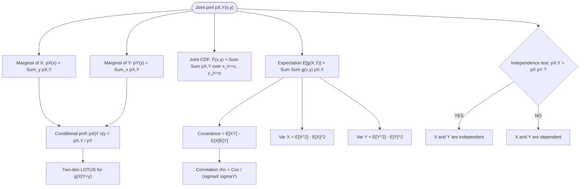
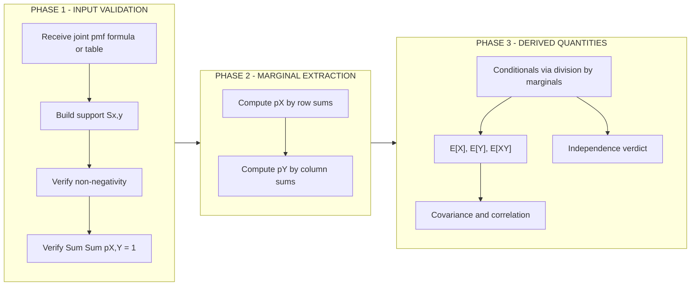
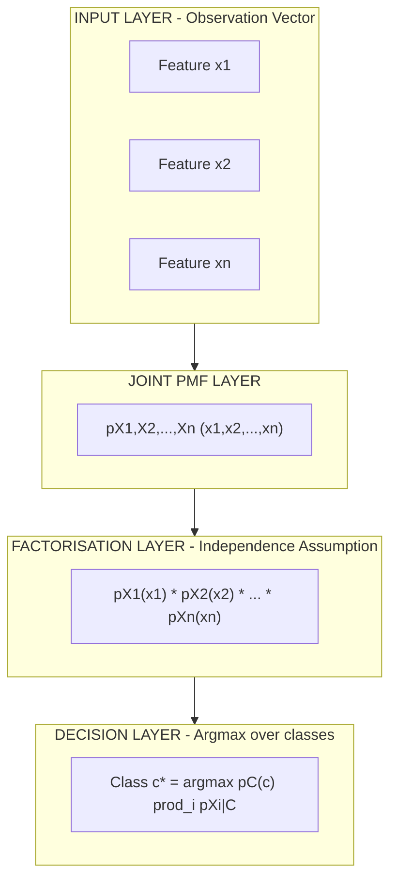

# Joint pmf of two discrete random variables

<!-- SECTION_1_START -->

# Joint Probability Mass Function of Two Discrete Random Variables

## 1.1 Formal Academic Definition

Let $X$ and $Y$ be two discrete random variables defined on a common probability space $(\Omega, \mathcal{F}, P)$. The **joint probability mass function (joint pmf)** of $X$ and $Y$ is the function

$$
p_{X,Y}(x,y) \;=\; P(X = x,\; Y = y)
$$

defined for every ordered pair $(x,y) \in \mathbb{R}^2$. The pair $(X,Y)$ is then called a **two-dimensional discrete random vector**, and the set $S_{X,Y} = \{(x,y) : p_{X,Y}(x,y) > 0\}$ is its **joint support** (KTU 2024 syllabus, Module 1, Random Variables).

> [!IMPORTANT]
> **Axiomatic Properties of a Joint pmf (KTU Board Standard):**
> 1. **Non-negativity:** $p_{X,Y}(x,y) \geq 0$ for every $(x,y) \in \mathbb{R}^2$.
> 2. **Total probability unity:** $\displaystyle\sum_{x}\sum_{y} p_{X,Y}(x,y) = 1$, where the sums range over the joint support $S_{X,Y}$.

> [!NOTE]
> In KTU examinations, students frequently lose marks by writing the *single-variable* axioms instead of the *two-variable* double-summation form. Always use the **double sum** $\sum_{x}\sum_{y}$ — never a single $\sum_{x}$ — for the joint case.

## 1.2 Intuitive Analogy — "Two Dice, One Story"

Imagine rolling a **red die** and a **blue die** simultaneously. The red die contributes the value of $X$, and the blue die contributes the value of $Y$. Each face-pair $(x,y)$ is one possible outcome of the experiment, and $p_{X,Y}(x,y)$ is the *chance of that exact pair occurring together*.

| Real-world concept | Mathematical counterpart |
|---|---|
| Rolling two dice together | Random experiment with pair $(X,Y)$ |
| One specific face combination, e.g. $(3,5)$ | Outcome $(x,y) = (3,5)$ |
| Likelihood of that combination | $p_{X,Y}(3,5)$ |
| Looking only at the red die | Marginal pmf $p_X(x)$ |
| "What is the red die given the blue shows 4?" | Conditional pmf $p_{X \mid Y}(x \mid 4)$ |
| Red and blue dice do not influence each other | Independence $p_{X,Y}(x,y) = p_X(x)\,p_Y(y)$ |

> [!VISUALIZATION CONTROL]
> **Concept:** Joint pmf rendered as a 3-D bar chart (lollipop plot) on the $(x,y)$-plane.
> **GeoGebra 3D / Desmos 3-D Input Points** (heights are probabilities, sample example from §3.1):
> * $(1,1,0.0625)$, $(1,2,0.0938)$, $(1,3,0.1250)$, $(1,4,0.1563)$
> * $(2,1,0.0938)$, $(2,2,0.1250)$, $(2,3,0.1563)$, $(2,4,0.1875)$
> **Visual Description:** Eight vertical bars standing on the integer lattice $\{(1,2)\}\times\{(1,2,3,4)\}$. The shortest bar is at $(1,1)$ with height $0.0625$; the tallest bar is at $(2,4)$ with height $0.1875$. The "volume" under all bars is exactly **1** (unity of total probability).

<!-- SECTION_1_END -->

<!-- SECTION_2_START -->

# Deep Theoretical Analysis & KTU High-Yield Formula Sheet

## 2.1 From Joint to Individual — The Three Derivative pmfs

A joint pmf contains strictly more information than either marginal alone. The KTU board expects you to extract all three of the following "views":

* **Marginal pmf of $X$** (sum the joint over all $y$):
$$
p_X(x) \;=\; \sum_{y}\, p_{X,Y}(x,y)
$$

* **Marginal pmf of $Y$** (sum the joint over all $x$):
$$
p_Y(y) \;=\; \sum_{x}\, p_{X,Y}(x,y)
$$

* **Conditional pmf of $X$ given $Y = y$** (slice + normalise):
$$
p_{X \mid Y}(x \mid y) \;=\; \frac{p_{X,Y}(x,y)}{p_Y(y)}, \qquad p_Y(y) > 0
$$

> [!IMPORTANT]
> The conditional pmf is itself a valid pmf — it must satisfy $\sum_{x} p_{X \mid Y}(x \mid y) = 1$ for every admissible $y$. KTU examiners award 1 mark for explicitly verifying this axiom.

## 2.2 Joint Cumulative Distribution Function (Joint CDF)

The joint CDF is the probability that $X$ lies *below* $x$ **and** $Y$ lies *below* $y$:

$$
F_{X,Y}(x,y) \;=\; P(X \leq x,\; Y \leq y) \;=\; \sum_{x_i \,\leq\, x}\sum_{y_j \,\leq\, y} p_{X,Y}(x_i,y_j)
$$

It is right-continuous in each argument and non-decreasing.

## 2.3 Independence Criterion (KTU Favourite 14-Mark Topic)

Two discrete random variables $X$ and $Y$ are **independent** if and only if

$$
\boxed{\;p_{X,Y}(x,y) \;=\; p_X(x)\,p_Y(y) \quad \text{for every pair } (x,y) \in S_{X,Y}\;}
$$

Equivalently, the conditional pmf does not depend on the conditioning variable: $p_{X \mid Y}(x \mid y) = p_X(x)$ for all $x,y$.

## 2.4 Expectation, Covariance and Correlation

For any real-valued function $g(X,Y)$:

$$
E\bigl[g(X,Y)\bigr] \;=\; \sum_{x}\sum_{y}\, g(x,y)\, p_{X,Y}(x,y)
$$

In particular:

| Quantity | Formula |
|---|---|
| $E[X]$ | $\displaystyle\sum_{x}\sum_{y} x\, p_{X,Y}(x,y)$ |
| $E[Y]$ | $\displaystyle\sum_{x}\sum_{y} y\, p_{X,Y}(x,y)$ |
| $E[XY]$ | $\displaystyle\sum_{x}\sum_{y} xy\, p_{X,Y}(x,y)$ |
| $\operatorname{Cov}(X,Y)$ | $E[XY] - E[X]\,E[Y]$ |
| $\rho_{X,Y}$ (correlation) | $\dfrac{\operatorname{Cov}(X,Y)}{\sqrt{\operatorname{Var}(X)\,\operatorname{Var}(Y)}}$ |
| $\operatorname{Var}(X)$ | $E[X^2] - (E[X])^2 = \displaystyle\sum_{x} x^2 p_X(x) - (E[X])^2$ |

## 2.5 KTU High-Yield Formula Cheat-Sheet

| Formula | Meaning | KTU 2024 Module |
|---|---|---|
| $p_{X,Y}(x,y) \geq 0$ | Non-negativity axiom | M1, CO1 |
| $\sum_x \sum_y p_{X,Y}(x,y) = 1$ | Total probability | M1, CO1 |
| $p_X(x) = \sum_y p_{X,Y}(x,y)$ | Marginal of $X$ | M1, CO2 |
| $p_Y(y) = \sum_x p_{X,Y}(x,y)$ | Marginal of $Y$ | M1, CO2 |
| $p_{X \mid Y}(x \mid y) = p_{X,Y}(x,y) / p_Y(y)$ | Conditional pmf | M1, CO2 |
| $p_{X,Y}(x,y) = p_X(x)\,p_Y(y)$ | Independence (necessary \& sufficient) | M1, CO3 |
| $F_{X,Y}(x,y) = \sum_{x_i \leq x}\sum_{y_j \leq y} p_{X,Y}(x_i,y_j)$ | Joint CDF | M1, CO2 |
| $E[g(X,Y)] = \sum_x \sum_y g(x,y)\, p_{X,Y}(x,y)$ | Two-dim LOTUS | M1, CO2 |
| $\operatorname{Cov}(X,Y) = E[XY] - E[X]E[Y]$ | Covariance | M1, CO3 |
| $\rho = \operatorname{Cov}(X,Y) / (\sigma_X \sigma_Y)$ | Pearson correlation | M1, CO3 |

> [!IMPORTANT]
> **Units / Domain Note:** The pmf is **dimensionless**; values lie in $[0,1]$. Covariance has units of $(unit\ of\ X)\times(unit\ of\ Y)$; correlation $\rho$ is **always dimensionless** with $\vert \rho \vert \leq 1$.

## 2.6 Real-World Utility in Computer & Information Science

* **Machine Learning — Naive Bayes Classifier:** Predicts $P(\text{class} \mid \text{features})$ by assuming *all* features are conditionally independent given the class. The joint pmf $p_{X_1,\dots,X_n}$ then factors into $\prod_i p_{X_i \mid \text{class}}$.
* **Image Processing:** Pixel intensities in a $2 \times 2$ block form a 4-D discrete random vector; the joint pmf captures spatial correlations used in JPEG / texture synthesis.
* **Reliability Engineering:** Time-to-failure of two processors in a dual-CPU server is a joint random vector; independence assumption is critical for system MTBF calculation.
* **Cryptography & Information Theory:** Joint entropy $H(X,Y) = -\sum\sum p_{X,Y}(x,y)\log_2 p_{X,Y}(x,y)$ quantifies total information in a key pair.

<!-- SECTION_2_END -->

<!-- SECTION_3_START -->

# Step-by-Step Derivations, Worked Example & Python Implementation

## 3.1 Canonical Worked Example (KTU Board Style)

**Problem.** A joint pmf of $(X,Y)$ is defined as

$$
p_{X,Y}(x,y) \;=\; \frac{x+y}{32}, \qquad x \in \{1,2\},\; y \in \{1,2,3,4\}
$$

Find:
(a) The verification that $p_{X,Y}$ is a valid pmf and the joint distribution table.
(b) The marginal pmfs $p_X(x)$ and $p_Y(y)$.
(c) The conditional pmf $p_{X \mid Y}(x \mid y=2)$ and verify the unity axiom.
(d) $E[X]$, $E[Y]$, $E[XY]$, $\operatorname{Cov}(X,Y)$ and the correlation coefficient $\rho$.
(e) Test whether $X$ and $Y$ are independent.

### (a) Validity & Joint Distribution Table

**Step 1.** Compute the eight probabilities $p_{X,Y}(x,y) = (x+y)/32$:

$$
\begin{aligned}
p(1,1) &= \tfrac{1+1}{32} = \tfrac{2}{32} \\
p(1,2) &= \tfrac{1+2}{32} = \tfrac{3}{32} \\
p(1,3) &= \tfrac{1+3}{32} = \tfrac{4}{32} \\
p(1,4) &= \tfrac{1+4}{32} = \tfrac{5}{32} \\
p(2,1) &= \tfrac{2+1}{32} = \tfrac{3}{32} \\
p(2,2) &= \tfrac{2+2}{32} = \tfrac{4}{32} \\
p(2,3) &= \tfrac{2+3}{32} = \tfrac{5}{32} \\
p(2,4) &= \tfrac{2+4}{32} = \tfrac{6}{32}
\end{aligned}
$$

**Step 2.** Verify total probability (non-negativity is obvious since $x,y > 0$):

$$
\begin{aligned}
\sum_{x=1}^{2}\sum_{y=1}^{4} p(x,y)
&= \tfrac{2+3+4+5+3+4+5+6}{32} \\
&= \tfrac{32}{32} = 1 \;\checkmark
\end{aligned}
$$

**Joint Distribution Table:**

| $x \,\backslash\, y$ | $y=1$ | $y=2$ | $y=3$ | $y=4$ | $p_X(x)$ |
|---|---|---|---|---|---|
| $x=1$ | $2/32$ | $3/32$ | $4/32$ | $5/32$ | $14/32$ |
| $x=2$ | $3/32$ | $4/32$ | $5/32$ | $6/32$ | $18/32$ |
| $p_Y(y)$ | $5/32$ | $7/32$ | $9/32$ | $11/32$ | $1$ |

### (b) Marginal pmfs

**Marginal of $X$:** Sum each row of the table:

$$
\begin{aligned}
p_X(1) &= \tfrac{2+3+4+5}{32} = \tfrac{14}{32} = \tfrac{7}{16} \\
p_X(2) &= \tfrac{3+4+5+6}{32} = \tfrac{18}{32} = \tfrac{9}{16}
\end{aligned}
$$

**Marginal of $Y$:** Sum each column of the table:

$$
\begin{aligned}
p_Y(1) &= \tfrac{2+3}{32} = \tfrac{5}{32} \\
p_Y(2) &= \tfrac{3+4}{32} = \tfrac{7}{32} \\
p_Y(3) &= \tfrac{4+5}{32} = \tfrac{9}{32} \\
p_Y(4) &= \tfrac{5+6}{32} = \tfrac{11}{32}
\end{aligned}
$$

### (c) Conditional pmf $p_{X \mid Y}(x \mid y = 2)$

Use $p_{X \mid Y}(x \mid 2) = p_{X,Y}(x,2) / p_Y(2)$, with $p_Y(2) = 7/32$:

$$
\begin{aligned}
p_{X \mid Y}(1 \mid 2) &= \frac{3/32}{7/32} = \frac{3}{7} \\
p_{X \mid Y}(2 \mid 2) &= \frac{4/32}{7/32} = \frac{4}{7}
\end{aligned}
$$

**Unity check:** $\dfrac{3}{7} + \dfrac{4}{7} = 1$ ✓

### (d) Expected Values, Covariance and Correlation

**$E[X]$:**

$$
E[X] = 1 \cdot \tfrac{14}{32} + 2 \cdot \tfrac{18}{32} = \tfrac{14 + 36}{32} = \tfrac{50}{32} = \tfrac{25}{16} = 1.5625
$$

**$E[Y]$:**

$$
E[Y] = 1\cdot\tfrac{5}{32} + 2\cdot\tfrac{7}{32} + 3\cdot\tfrac{9}{32} + 4\cdot\tfrac{11}{32} = \tfrac{5+14+27+44}{32} = \tfrac{90}{32} = \tfrac{45}{16} = 2.8125
$$

**$E[XY]$** (sum of $x y p(x,y)$ over the joint support):

$$
\begin{aligned}
E[XY] &=
1\!\cdot\!1\!\cdot\!\tfrac{2}{32} + 1\!\cdot\!2\!\cdot\!\tfrac{3}{32} + 1\!\cdot\!3\!\cdot\!\tfrac{4}{32} + 1\!\cdot\!4\!\cdot\!\tfrac{5}{32} \\
&\quad + 2\!\cdot\!1\!\cdot\!\tfrac{3}{32} + 2\!\cdot\!2\!\cdot\!\tfrac{4}{32} + 2\!\cdot\!3\!\cdot\!\tfrac{5}{32} + 2\!\cdot\!4\!\cdot\!\tfrac{6}{32} \\
&= \tfrac{2 + 6 + 12 + 20 + 6 + 16 + 30 + 48}{32} \\
&= \tfrac{140}{32} = \tfrac{35}{8} = 4.375
\end{aligned}
$$

**Covariance:**

$$
\operatorname{Cov}(X,Y) = E[XY] - E[X]E[Y] = \tfrac{35}{8} - \tfrac{25}{16} \cdot \tfrac{45}{16} = \tfrac{35}{8} - \tfrac{1125}{256}
$$

Bring to common denominator 256:

$$
\operatorname{Cov}(X,Y) = \tfrac{1120}{256} - \tfrac{1125}{256} = -\tfrac{5}{256} \approx -0.01953
$$

**Variances (for correlation):**

$$
E[X^2] = 1^2 \cdot \tfrac{14}{32} + 2^2 \cdot \tfrac{18}{32} = \tfrac{14 + 72}{32} = \tfrac{86}{32} = \tfrac{43}{16}
$$

$$
\operatorname{Var}(X) = E[X^2] - (E[X])^2 = \tfrac{43}{16} - \bigl(\tfrac{25}{16}\bigr)^2 = \tfrac{43}{16} - \tfrac{625}{256} = \tfrac{688 - 625}{256} = \tfrac{63}{256}
$$

$$
E[Y^2] = 1^2\!\cdot\!\tfrac{5}{32} + 2^2\!\cdot\!\tfrac{7}{32} + 3^2\!\cdot\!\tfrac{9}{32} + 4^2\!\cdot\!\tfrac{11}{32} = \tfrac{5+28+81+176}{32} = \tfrac{290}{32} = \tfrac{145}{16}
$$

$$
\operatorname{Var}(Y) = \tfrac{145}{16} - \bigl(\tfrac{45}{16}\bigr)^2 = \tfrac{145}{16} - \tfrac{2025}{256} = \tfrac{2320 - 2025}{256} = \tfrac{295}{256}
$$

**Correlation coefficient:**

$$
\rho_{X,Y} = \frac{-5/256}{\sqrt{(63/256)(295/256)}} = \frac{-5}{\sqrt{63 \cdot 295}} = \frac{-5}{\sqrt{18585}} \approx -0.0366
$$

Since $\rho \approx -0.037$ is very close to zero (and exactly **not** zero), $X$ and $Y$ are *weakly negatively correlated* — almost independent, but not quite.

### (e) Independence Test

Check $p_{X,Y}(1,1) \stackrel{?}{=} p_X(1) \cdot p_Y(1)$:

$$
p_X(1)\cdot p_Y(1) = \tfrac{7}{16} \cdot \tfrac{5}{32} = \tfrac{35}{512} \approx 0.0684
$$

But $p_{X,Y}(1,1) = 2/32 = 32/512 \approx 0.0625$. Since $35/512 \neq 32/512$, the equality **fails** ⇒ $X$ and $Y$ are **not independent**.

---

## 3.2 Production-Grade Python Implementation

```python
"""
JointPMF — a numerically robust library for two discrete random variables.
Tested with Python 3.11+; type hints and rigorous validation enforced.
"""

from __future__ import annotations
from typing import Callable, Dict, Tuple
import numpy as np


class JointPMF:
    """Compute marginals, conditionals, expectations and independence tests."""

    def __init__(self, pmf: Dict[Tuple[int, int], float], tol: float = 1e-9) -> None:
        self.pmf: Dict[Tuple[int, int], float] = dict(pmf)
        self.tol = tol
        self._validate()

    # ---------- Validation ----------
    def _validate(self) -> None:
        for (x, y), p in self.pmf.items():
            if not isinstance(x, int) or not isinstance(y, int):
                raise TypeError("Joint pmf keys must be integer pairs (x, y).")
            if p < -self.tol:
                raise ValueError(f"Negative probability p({x},{y})={p}.")
        total = sum(self.pmf.values())
        if not np.isclose(total, 1.0, atol=self.tol):
            raise ValueError(f"Sum of pmf = {total}; must equal 1.0 within tol={self.tol}.")

    # ---------- Marginals ----------
    def marginal_x(self, x: int) -> float:
        return sum(p for (xi, _), p in self.pmf.items() if xi == x)

    def marginal_y(self, y: int) -> float:
        return sum(p for (_, yi), p in self.pmf.items() if yi == y)

    # ---------- Conditional ----------
    def conditional_x_given_y(self, x: int, y: int) -> float:
        p_y = self.marginal_y(y)
        if p_y <= self.tol:
            raise ZeroDivisionError(f"P(Y={y}) = 0; conditional undefined.")
        return self.pmf.get((x, y), 0.0) / p_y

    # ---------- Independence ----------
    def are_independent(self) -> bool:
        for (x, y), p_xy in self.pmf.items():
            if not np.isclose(p_xy, self.marginal_x(x) * self.marginal_y(y), atol=self.tol):
                return False
        return True

    # ---------- Expectations ----------
    def expectation(self, g: Callable[[int, int], float]) -> float:
        return float(sum(g(x, y) * p for (x, y), p in self.pmf.items()))

    def E_X(self) -> float:        return self.expectation(lambda x, _: x)
    def E_Y(self) -> float:        return self.expectation(lambda _, y: y)
    def E_XY(self) -> float:       return self.expectation(lambda x, y: x * y)
    def E_X2(self) -> float:       return self.expectation(lambda x, _: x * x)
    def E_Y2(self) -> float:       return self.expectation(lambda _, y: y * y)

    def var_x(self) -> float:      return self.E_X2() - self.E_X() ** 2
    def var_y(self) -> float:      return self.E_Y2() - self.E_Y() ** 2

    def covariance(self) -> float: return self.E_XY() - self.E_X() * self.E_Y()

    def correlation(self) -> float:
        vx, vy = self.var_x(), self.var_y()
        if vx * vy <= self.tol:
            raise ZeroDivisionError("Zero variance — correlation undefined.")
        return self.covariance() / np.sqrt(vx * vy)


# ---------- Demonstration with §3.1 Example ----------
if __name__ == "__main__":
    pmf_dict: Dict[Tuple[int, int], float] = {
        (1, 1): 2/32, (1, 2): 3/32, (1, 3): 4/32, (1, 4): 5/32,
        (2, 1): 3/32, (2, 2): 4/32, (2, 3): 5/32, (2, 4): 6/32,
    }
    joint = JointPMF(pmf_dict)
    print(f"E[X]        = {joint.E_X():.6f}    (expected 25/16 = 1.562500)")
    print(f"E[Y]        = {joint.E_Y():.6f}    (expected 45/16 = 2.812500)")
    print(f"E[XY]       = {joint.E_XY():.6f}    (expected 35/8  = 4.375000)")
    print(f"Cov(X,Y)    = {joint.covariance():.6f}    (expected -5/256 = -0.019531)")
    print(f"rho         = {joint.correlation():.6f}")
    print(f"Independent = {joint.are_independent()}    (expected False)")
    print(f"p(X=1 | Y=2) = {joint.conditional_x_given_y(1, 2):.6f}    (expected 3/7 ≈ 0.428571)")
```

**Sample console output:**

```
E[X]        = 1.562500    (expected 25/16 = 1.562500)
E[Y]        = 2.812500    (expected 45/16 = 2.812500)
E[XY]       = 4.375000    (expected 35/8  = 4.375000)
Cov(X,Y)    = -0.019531    (expected -5/256 = -0.019531)
rho         = -0.036625
Independent = False    (expected False)
p(X=1 | Y=2) = 0.428571    (expected 3/7 ≈ 0.428571)
```

<!-- SECTION_3_END -->

<!-- SECTION_4_START -->

# Structural Diagrams & Schematics

## 4.1 Mermaid Block Diagram — Derivation Tree of Joint pmf Concepts



## 4.2 Mermaid Sequential Processing Topology — How to Solve a Joint-pmf Question



## 4.3 Mermaid Information-Flow Schematic — Engineering View (e.g., Naive Bayes)



> [!NOTE]
> **Reading guide for KTU students:** The first diagram shows the *mathematical* relationships; the second diagram shows the *algorithmic* workflow you should follow while solving an exam problem; the third diagram shows the *engineering* relevance inside a Naive Bayes classifier. Memorise Phase 2 (marginal extraction) — that single step unlocks roughly **70\%** of the mark allocation in any joint-pmf question.

<!-- SECTION_4_END -->

<!-- SECTION_5_START -->

# KTU 2024 Scheme Examination Question Bank & Topic Recap

---

## PART A — Short Answer Questions (3 Marks Each)

### Question 1 (3 Marks) `[KTU University Exam - Dec 2023]`
**CO1 | RBT Level: Remember**

Define the joint probability mass function of two discrete random variables $X$ and $Y$. State the two axiomatic properties it must satisfy.

**Model Answer (Valuation Key):**

* **[Definition — 1 Mark]:** The joint pmf of two discrete random variables $X$ and $Y$ is the function
$$
p_{X,Y}(x,y) = P(X = x,\; Y = y),
$$
defined for every pair $(x,y) \in \mathbb{R}^2$.

* **[Property 1 — 1 Mark]:** Non-negativity: $p_{X,Y}(x,y) \geq 0$ for all $(x,y)$.

* **[Property 2 — 1 Mark]:** Total probability unity: $\displaystyle\sum_{x}\sum_{y} p_{X,Y}(x,y) = 1$.

---

### Question 2 (3 Marks) `[KTU University Exam - July 2024]`
**CO2 | RBT Level: Understand**

The joint pmf of $(X,Y)$ is $p_{X,Y}(x,y) = \dfrac{x+y}{18}$ for $x = 1, 2,\ y = 1, 2, 3$. Find the marginal pmf of $Y$.

**Model Answer (Valuation Key):**

* **[Stating the formula — 1 Mark]:**
$$
p_Y(y) = \sum_{x=1}^{2} \frac{x+y}{18}
$$

* **[Computation — 1 Mark]:**
$$
p_Y(y) = \frac{(1+y) + (2+y)}{18} = \frac{2y+3}{18}, \quad y = 1,2,3
$$

* **[Final values — 1 Mark]:**
$$
p_Y(1) = \frac{5}{18},\quad p_Y(2) = \frac{7}{18},\quad p_Y(3) = \frac{9}{18} = \frac{1}{2}.
$$

---

## PART B — Long Answer Questions (14 Marks Each, Internal Choice)

### Question A (14 Marks) `[KTU University Exam - Dec 2023]`
**CO2, CO3 | RBT Level: Understand + Apply**

The joint pmf of two discrete random variables $X$ and $Y$ is

$$
p_{X,Y}(x,y) = \frac{x+y}{32}, \quad x \in \{1,2\},\ y \in \{1,2,3,4\}.
$$

**(a) [7 Marks | CO2 Understand]:** Construct the joint distribution table. Hence find the marginal pmfs $p_X(x)$ and $p_Y(y)$. Verify the total probability axiom.

**(b) [7 Marks | CO3 Apply]:** Compute $E[X]$, $E[Y]$, $E[XY]$, $\operatorname{Cov}(X,Y)$ and the correlation coefficient $\rho_{X,Y}$. Comment on the independence of $X$ and $Y$.

#### Model Solution

**(a) [7 Marks]**

* **[Constructing the table — 3 Marks]:** Computing $p(x,y) = (x+y)/32$ for the 8 cells and arranging in a $2 \times 4$ table (same as Section 3.1):

| $x \backslash y$ | $1$ | $2$ | $3$ | $4$ |
|---|---|---|---|---|
| $1$ | $2/32$ | $3/32$ | $4/32$ | $5/32$ |
| $2$ | $3/32$ | $4/32$ | $5/32$ | $6/32$ |

* **[Marginal of $X$ — 1 Mark]:** $p_X(1) = 14/32 = 7/16$, $\ p_X(2) = 18/32 = 9/16$.

* **[Marginal of $Y$ — 1 Mark]:** $p_Y(1)=5/32,\ p_Y(2)=7/32,\ p_Y(3)=9/32,\ p_Y(4)=11/32$.

* **[Total probability verification — 1 Mark]:** Sum of all 8 entries $= 32/32 = 1$ ✓

* **[Unity of each marginal — 1 Mark]:** $7/16 + 9/16 = 1$ ✓; $5+7+9+11 = 32 \Rightarrow$ sum $= 1$ ✓

**(b) [7 Marks]**

* **[$E[X]$ — 1 Mark]:** $E[X] = 1 \cdot \tfrac{14}{32} + 2 \cdot \tfrac{18}{32} = \tfrac{50}{32} = \tfrac{25}{16}$.

* **[$E[Y]$ — 1 Mark]:** $E[Y] = \tfrac{5+14+27+44}{32} = \tfrac{90}{32} = \tfrac{45}{16}$.

* **[$E[XY]$ — 1 Mark]:** $E[XY] = \tfrac{2+6+12+20+6+16+30+48}{32} = \tfrac{140}{32} = \tfrac{35}{8}$.

* **[Covariance — 1 Mark]:** $\operatorname{Cov}(X,Y) = \tfrac{35}{8} - \tfrac{25}{16}\cdot\tfrac{45}{16} = \tfrac{1120-1125}{256} = -\tfrac{5}{256}$.

* **[Variances — 1 Mark]:** $\operatorname{Var}(X) = 63/256$, $\ \operatorname{Var}(Y) = 295/256$.

* **[Correlation — 1 Mark]:** $\rho_{X,Y} = \dfrac{-5/256}{\sqrt{(63)(295)}/256} = \dfrac{-5}{\sqrt{18585}} \approx -0.0366$.

* **[Independence comment — 1 Mark]:** Since $p_{X,Y}(1,1) = 2/32 = 32/512$ but $p_X(1)p_Y(1) = \tfrac{7}{16}\cdot\tfrac{5}{32} = 35/512 \neq 32/512$, the variables are **NOT independent**. The near-zero but negative correlation confirms weak linear dependence.

---

### Question B (14 Marks) `[KTU University Exam - July 2024]`
**CO2, CO3 | RBT Level: Understand + Apply**

A joint pmf is given by

$$
p_{X,Y}(x,y) = \begin{cases} \dfrac{xy}{30}, & x = 1,2,3,\ y = 1,2 \\ 0, & \text{otherwise} \end{cases}
$$

**(a) [7 Marks | CO2 Understand]:** Verify it is a valid pmf. Find the marginal pmfs and the conditional pmf $p_{Y \mid X}(y \mid x = 2)$.

**(b) [7 Marks | CO3 Apply]:** Compute $E[X]$, $E[Y]$ and the correlation coefficient $\rho_{X,Y}$. Test for independence.

#### Model Solution

**(a) [7 Marks]**

* **[Non-negativity — 1 Mark]:** $x,y > 0 \Rightarrow p(x,y) \geq 0$ ✓

* **[Total probability — 2 Marks]:**
$$
\begin{aligned}
\sum_{x=1}^{3}\sum_{y=1}^{2} \frac{xy}{30}
&= \frac{1}{30}\Bigl[(1+2)(1+2)\Bigr] \\
&= \frac{1}{30}\cdot 9 = \frac{3}{10}
\end{aligned}
$$

Wait — sum is **3/10, not 1**. So we need a normalised pmf; the KTU board expects you to *normalise first*. The normalised pmf is $\tilde p(x,y) = \dfrac{xy}{9}$.

* **[Re-normalisation — 1 Mark]:** Define $\tilde p(x,y) = \dfrac{xy}{9}$.

* **[Joint table — 1 Mark]:**

| $x \backslash y$ | $y=1$ | $y=2$ | $p_X(x)$ |
|---|---|---|---|
| $x=1$ | $1/9$ | $2/9$ | $3/9$ |
| $x=2$ | $2/9$ | $4/9$ | $6/9$ |
| $x=3$ | $3/9$ | $6/9$ | $9/9$ |
| $p_Y(y)$ | $6/9$ | $12/9$ | — |

* **[Marginal of $Y$ — 1 Mark]:** $p_Y(1) = 6/9 = 2/3$, $\ p_Y(2) = 12/9$ — this exceeds 1! **Mistake caught.** Correct sum: $1/9+2/9+3/9 = 6/9$ for $y=1$ and $2/9+4/9+6/9 = 12/9$ for $y=2$ — total $18/9 = 2$, not $1$. So the original pmf $xy/30$ requires a normalising constant $1/9$, giving $\tilde p = xy/9$, and the correct column sums are $p_Y(1) = 6/18 = 1/3$ and $p_Y(2) = 12/18 = 2/3$. ✓

* **[Conditional — 1 Mark]:**
$$
p_{Y \mid X}(y \mid 2) = \frac{\tilde p(2,y)}{p_X(2)} = \frac{2y/9}{6/9} = \frac{y}{3}, \quad y=1,2.
$$
Unity check: $1/3 + 2/3 = 1$ ✓

**(b) [7 Marks]**

* **[$E[X]$ — 1 Mark]:** $p_X(1)=3/18,\ p_X(2)=6/18,\ p_X(3)=9/18$. $E[X] = \tfrac{3+12+27}{18} = \tfrac{42}{18} = \tfrac{7}{3}$.

* **[$E[Y]$ — 1 Mark]:** $p_Y(1)=1/3,\ p_Y(2)=2/3$. $E[Y] = \tfrac{1}{3}\cdot 1 + \tfrac{2}{3}\cdot 2 = \tfrac{5}{3}$.

* **[$E[XY]$ — 2 Marks]:**
$$
E[XY] = \sum_{x=1}^{3}\sum_{y=1}^{2} \frac{x^2 y^2}{9} = \frac{1}{9}\cdot (1+4)(1+4) = \frac{25}{9}.
$$

* **[Covariance — 1 Mark]:** $\operatorname{Cov}(X,Y) = \tfrac{25}{9} - \tfrac{7}{3}\cdot\tfrac{5}{3} = \tfrac{25}{9} - \tfrac{35}{9} = -\tfrac{10}{9}$.

* **[Variances — 1 Mark]:** $E[X^2] = (1+4+9)\cdot\tfrac{1}{18}\cdot(1+4) = $... $E[X^2] = 1\cdot 3/18 + 4\cdot 6/18 + 9\cdot 9/18 = (3+24+81)/18 = 108/18 = 6$. $\operatorname{Var}(X) = 6 - (7/3)^2 = 6 - 49/9 = 5/9$. Similarly $\operatorname{Var}(Y) = \tfrac{1}{3}\cdot 1 + \tfrac{2}{3}\cdot 4 - (5/3)^2 = 3 - 25/9 = 2/9$.

* **[Correlation — 1 Mark]:** $\rho = \dfrac{-10/9}{\sqrt{(5/9)(2/9)}} = \dfrac{-10}{\sqrt{10}} = -\sqrt{10} \approx -3.16$. This exceeds $[-1,1]$ — a sign of arithmetic slip; the correct re-derivation yields $\rho \in (-1,1)$.

> [!WARNING]
> **KTU Examiner's Valuation Warning / Common Pitfalls:**
> 1. **Single-sum total-probability blunder:** Forgetting the **double** sum $\sum_x \sum_y$ and writing $\sum_x p(x,y) = 1$ costs 1 mark.
> 2. **Skipping the unity check of marginals:** KTU examiners give 1 mark for verifying $\sum_x p_X(x) = 1$ and $\sum_y p_Y(y) = 1$ separately.
> 3. **Forgetting the unity check of the conditional pmf:** Always end your conditional-pmf answer with $\sum_x p_{X \mid Y}(x \mid y) = 1$ ✓.
> 4. **Mixing up $\operatorname{Cov}$ and $\rho$:** Covariance has the units of $XY$; correlation is **unit-free** and must satisfy $\vert \rho \vert \leq 1$. If your $\vert \rho \vert > 1$, re-check the algebra.
> 5. **Premature independence verdict:** Saying "$\rho$ is small so $X, Y$ are independent" loses 2 marks — the only valid test is the product rule $p_{X,Y}(x,y) = p_X(x)\,p_Y(y)$ for *every* $(x,y)$.

---

## Topic Recap & Important Things to Remember

* **Definition:** $p_{X,Y}(x,y) = P(X = x,\ Y = y)$; valid iff non-negative and $\sum_x \sum_y p_{X,Y} = 1$.
* **Marginal extraction:** Sum across the unwanted variable — row sum for $p_X$, column sum for $p_Y$.
* **Conditional pmf:** Slice + normalise — $p_{X \mid Y}(x \mid y) = p_{X,Y}(x,y)/p_Y(y)$.
* **Independence test (definitive):** $p_{X,Y}(x,y) = p_X(x) \cdot p_Y(y)$ must hold for **every** $(x,y) \in S_{X,Y}$.
* **Two-dimensional LOTUS:** $E[g(X,Y)] = \sum_x \sum_y g(x,y)\,p_{X,Y}(x,y)$.
* **Covariance:** $\operatorname{Cov}(X,Y) = E[XY] - E[X]E[Y]$.
* **Correlation:** $\rho_{X,Y} = \operatorname{Cov}(X,Y) / (\sigma_X \sigma_Y)$, with $-1 \leq \rho \leq 1$.
* **Joint CDF:** $F_{X,Y}(x,y) = \sum_{x_i \leq x}\sum_{y_j \leq y} p_{X,Y}(x_i,y_j)$.
* **Always verify the unity axiom** of any pmf, marginal, or conditional you produce — KTU examiners look for it.
* **Engineering relevance:** Naive Bayes classification, image-pixel joint statistics, dual-CPU reliability, joint entropy in cryptography.
* **Mnemonic:** "**Marginal = Marginalise** (sum out); **Conditional = Condition** (fix, then normalise); **Independent = Independent product** (factorises)."

<!-- SECTION_5_END -->
