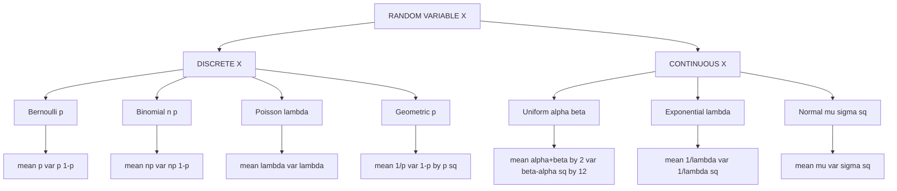
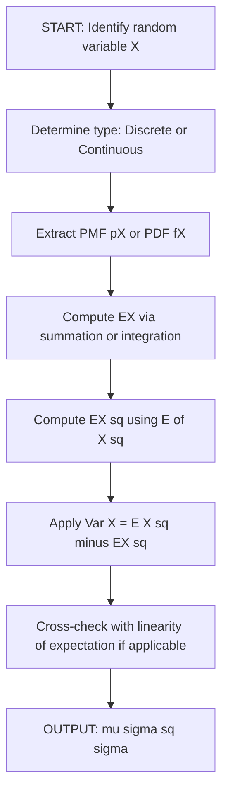
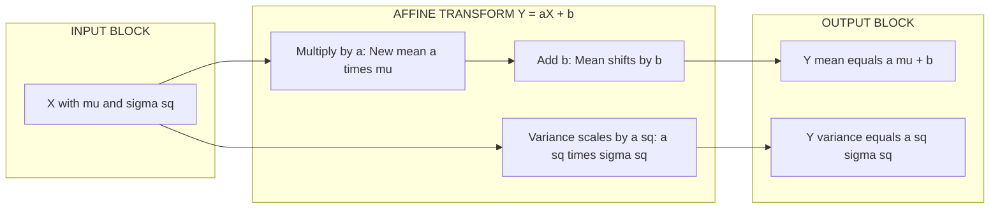

# Mean and variance

<!-- SECTION_1_START -->

# Mean and Variance of Random Variables

## 1.1 Random Variable — The Foundation

> [!IMPORTANT]
> **Definition (KTU Syllabus Standard):** A **random variable** $X$ is a real-valued function defined on the sample space $S$ of a random experiment. That is, $X : S \rightarrow \mathbb{R}$, which assigns a real number $X(\omega)$ to every outcome $\omega \in S$.

### Two Principal Classes

| Class | Notation | Cumulative Distribution | Probability Mass / Density |
| :--- | :---: | :--- | :--- |
| **Discrete Random Variable** | $X \sim$ countable set | $F_X(x) = \sum_{x_i \leq x} p_X(x_i)$ | PMF: $p_X(x) = P(X = x)$ |
| **Continuous Random Variable** | $X \in [a,b]$ or $\mathbb{R}$ | $F_X(x) = \int_{-\infty}^{x} f_X(t)\, dt$ | PDF: $f_X(x)$ such that $f_X(x) \geq 0$, $\int f_X = 1$ |

> [!NOTE]
> **Intuitive Analogy — The "Lucky Draw" Model:** Imagine a lottery box containing 50 chits numbered 0 to 49. Each draw maps an *outcome* (which chit was picked) to a *real number* (the number printed). That mapping **is** a random variable. If the numbers are integers, $X$ is discrete. If we measure the *time* until the next chit is drawn, the variable becomes continuous.

---

## 1.2 Mean (Mathematical Expectation) — The "Centre of Gravity"

> [!IMPORTANT]
> **Definition (Mean / Expected Value):** The **mean** of a random variable is the long-run average value it takes over infinitely many repetitions of the experiment. It is the probability-weighted sum (or integral) of all possible values.

$$
\mathbb{E}[X] \;=\; \mu_X \;=\; 
\begin{cases}
\displaystyle \sum_{i} x_i \, p_X(x_i) & \text{(Discrete)} \\[10pt]
\displaystyle \int_{-\infty}^{+\infty} x \, f_X(x)\, dx & \text{(Continuous)}
\end{cases}
$$

> [!NOTE]
> **Intuition — Centre of Mass of Probability:** Treat every possible value $x_i$ as a point mass $p_X(x_i)$ sitting on a horizontal axis. Then $\mathbb{E}[X]$ is exactly the *centre of mass* of this system. For a continuous distribution, replace the discrete weights by the infinitesimal mass $f_X(x)\,dx$.

**Geometric Reading:** On the PDF graph, the area under $f_X$ is **1**, and the mean is the $x$-coordinate that *balances* this area perfectly on a fulcrum.

---

## 1.3 Variance — The "Spread" Around the Mean

> [!IMPORTANT]
> **Definition (Variance):** The **variance** of $X$ is the *expected squared deviation* of $X$ from its mean. It quantifies how far typical values lie from $\mathbb{E}[X]$.

$$
\operatorname{Var}(X) \;=\; \sigma_X^{2} \;=\; \mathbb{E}\!\left[\bigl(X - \mathbb{E}[X]\bigr)^{2}\right]
$$

Equivalent computational form:

$$
\sigma_X^{2} \;=\; \mathbb{E}[X^{2}] - \bigl(\mathbb{E}[X]\bigr)^{2}
$$

In explicit summation form:

$$
\sigma_X^{2} \;=\; 
\begin{cases}
\displaystyle \sum_{i} (x_i - \mu)^{2}\, p_X(x_i) & \text{(Discrete)} \\[10pt]
\displaystyle \int_{-\infty}^{+\infty} (x - \mu)^{2}\, f_X(x)\, dx & \text{(Continuous)}
\end{cases}
$$

**Standard Deviation:** $\sigma_X = \sqrt{\operatorname{Var}(X)}$ — expressed in the **same units** as $X$.

> [!NOTE]
> **Intuition — The "Wobbly Target" Analogy:** Mean tells you *where* the darts land on average. Variance tells you *how scattered* the darts are. Two archers can have the same mean (bullseye), but the one with smaller variance is the more *consistent* shooter. In machine learning, **bias²** and **variance** together drive the bias-variance trade-off.

---

## 1.4 Visualisation Blueprint

> [!VISUALIZATION CONTROL]
> **Concept:** PMF and PDF of a representative random variable with the mean and $\mu \pm \sigma$ marked.
> **Desmos Input Equations (Discrete, e.g. Binomial with $n=5$, $p=0.4$):**
> * `P(X=x) = nCr(5,x) * 0.4^x * 0.6^(5-x)` for $x=0,1,2,3,4,5$
> * Vertical lines: `x = 2` (the mean $\mu = np = 2$), `x = 1` and `x = 3` (the boundaries $\mu \pm \sigma$).
> **Visual Description:** Six thin vertical stems centred at integer points. The tallest stem occurs at $x=2$. The interval $[\mu-\sigma,\,\mu+\sigma]$ contains roughly $68\%$ of the total probability mass (CLT intuition).

<!-- SECTION_1_END -->

<!-- SECTION_2_START -->

# Deep Theoretical Analysis & KTU High-Yield Formula Sheet

## 2.1 Properties of Expectation (Linear Operators)

> [!IMPORTANT]
> For constants $a, b \in \mathbb{R}$ and random variables $X, Y$:
>
> 1. $\mathbb{E}[a] = a$
> 2. $\mathbb{E}[aX + b] = a\,\mathbb{E}[X] + b$
> 3. $\mathbb{E}[X + Y] = \mathbb{E}[X] + \mathbb{E}[Y]$  *(always valid — even if dependent!)*
> 4. $\mathbb{E}[XY] = \mathbb{E}[X]\,\mathbb{E}[Y]$ **iff** $X$ and $Y$ are *independent*.

## 2.2 Properties of Variance

> [!IMPORTANT]
> 1. $\operatorname{Var}(a) = 0$ (constant has no spread).
> 2. $\operatorname{Var}(aX + b) = a^{2}\,\operatorname{Var}(X)$.
> 3. $\operatorname{Var}(X) \geq 0$ with equality $\iff X$ is a constant.
> 4. $\operatorname{Var}(X + Y) = \operatorname{Var}(X) + \operatorname{Var}(Y) + 2\,\operatorname{Cov}(X,Y)$.
> 5. $\operatorname{Var}(X + Y) = \operatorname{Var}(X) + \operatorname{Var}(Y)$ **iff** $X$ and $Y$ are *uncorrelated* (in particular, if independent).

## 2.3 KTU Formula Sheet — Mean and Variance of Standard Distributions

> [!NOTE]
> **Mastery Rule:** For KTU board exams, you must commit the **mean** and **variance** of the following standard distributions to memory. The derivations are in §3.

| Distribution | Symbol | PMF / PDF | Mean $\mu$ | Variance $\sigma^{2}$ | MGF $M_X(t)$ |
| :--- | :---: | :--- | :---: | :---: | :--- |
| **Bernoulli** | $X \sim \mathrm{Ber}(p)$ | $p^{x}(1-p)^{1-x}$ | $p$ | $p(1-p)$ | $1-p+pe^{t}$ |
| **Binomial** | $X \sim B(n,p)$ | $\binom{n}{x}p^{x}(1-p)^{n-x}$ | $np$ | $np(1-p)$ | $(1-p+pe^{t})^{n}$ |
| **Poisson** | $X \sim P(\lambda)$ | $\dfrac{e^{-\lambda}\lambda^{x}}{x!}$ | $\lambda$ | $\lambda$ | $e^{\lambda(e^{t}-1)}$ |
| **Geometric** | $X \sim G(p)$ | $(1-p)^{x-1}p$ | $\dfrac{1}{p}$ | $\dfrac{1-p}{p^{2}}$ | $\dfrac{pe^{t}}{1-(1-p)e^{t}}$ |
| **Uniform (Discrete)** | $X \sim U(a,b)$ | $\dfrac{1}{b-a+1}$ | $\dfrac{a+b}{2}$ | $\dfrac{(b-a)(b-a+2)}{12}$ | — |
| **Uniform (Continuous)** | $X \sim U(\alpha,\beta)$ | $\dfrac{1}{\beta-\alpha}$ | $\dfrac{\alpha+\beta}{2}$ | $\dfrac{(\beta-\alpha)^{2}}{12}$ | $\dfrac{e^{\beta t}-e^{\alpha t}}{(\beta-\alpha)t}$ |
| **Exponential** | $X \sim \mathrm{Exp}(\lambda)$ | $\lambda e^{-\lambda x}$ | $\dfrac{1}{\lambda}$ | $\dfrac{1}{\lambda^{2}}$ | $\dfrac{\lambda}{\lambda-t}$ |
| **Normal** | $X \sim N(\mu,\sigma^{2})$ | $\dfrac{1}{\sigma\sqrt{2\pi}}e^{-\frac{(x-\mu)^{2}}{2\sigma^{2}}}$ | $\mu$ | $\sigma^{2}$ | $e^{\mu t + \tfrac{1}{2}\sigma^{2}t^{2}}$ |
| **Standard Normal** | $Z \sim N(0,1)$ | $\dfrac{1}{\sqrt{2\pi}}e^{-z^{2}/2}$ | $0$ | $1$ | $e^{t^{2}/2}$ |

## 2.4 Higher-Order Moments (For KTU Advanced Problems)

> [!IMPORTANT]
> The $r^{\text{th}}$ moment of $X$ about the origin: $\mu_{r}^{\prime} = \mathbb{E}[X^{r}]$.  
> The $r^{\text{th}}$ central moment: $\mu_{r} = \mathbb{E}[(X-\mu)^{r}]$.  
> **Skewness** $\gamma_{1} = \mu_{3}/\sigma^{3}$ measures asymmetry.  
> **Kurtosis** $\gamma_{2} = \mu_{4}/\sigma^{4} - 3$ measures tail heaviness.

## 2.5 Real-World Utility in Computer Science

| Application Domain | Role of Mean & Variance |
| :--- | :--- |
| **Machine Learning** | Bias–Variance Trade-off governs overfitting/underfitting |
| **Network Engineering** | Mean packet delay, jitter (= std. dev.) in QoS analysis |
| **Database Systems** | Expected query response time, variance for SLA bounds |
| **Cryptography** | Entropy & expected run-time of probabilistic algorithms |
| **Quality Engineering** | Six-Sigma process control ($\pm 6\sigma$ defect limits) |
| **Queueing Theory** | $M/M/1$ and $M/M/c$ system performance metrics |

<!-- SECTION_2_END -->

<!-- SECTION_3_START -->

# Step-by-Step Derivations & Worked Solutions

## 3.1 Derivation I — Mean and Variance of the Binomial Distribution

Let $X \sim B(n,p)$ — number of successes in $n$ independent Bernoulli trials.

**Strategy:** Write $X$ as a sum of $n$ i.i.d. Bernoulli indicators, then use linearity.

### Step 1: Decomposition

$$
X \;=\; X_1 + X_2 + \cdots + X_n, \qquad X_i \sim \mathrm{Ber}(p), \; X_i \perp X_j
$$

where $X_i = 1$ if the $i$-th trial succeeds, else $0$.

### Step 2: Mean of each $X_i$

$$
\mathbb{E}[X_i] \;=\; (1)(p) + (0)(1-p) \;=\; p
$$

### Step 3: Mean of $X$ (Linearity)

$$
\mathbb{E}[X] \;=\; \mathbb{E}\!\left[\sum_{i=1}^{n} X_i\right] \;=\; \sum_{i=1}^{n} \mathbb{E}[X_i] \;=\; \sum_{i=1}^{n} p \;=\; np
$$

### Step 4: Variance of each $X_i$

$$
\mathbb{E}[X_i^{2}] \;=\; (1)^{2}p + (0)^{2}(1-p) \;=\; p
$$

$$
\operatorname{Var}(X_i) \;=\; \mathbb{E}[X_i^{2}] - (\mathbb{E}[X_i])^{2} \;=\; p - p^{2} \;=\; p(1-p)
$$

### Step 5: Variance of $X$ (Independence + Linearity)

$$
\operatorname{Var}(X) \;=\; \sum_{i=1}^{n} \operatorname{Var}(X_i) \;=\; n\,p(1-p)
$$

### Step 6: Verification via Direct PMF (KTU expects this in long derivations)

$$
\begin{aligned}
\mathbb{E}[X] &= \sum_{k=0}^{n} k \binom{n}{k} p^{k}(1-p)^{n-k} \\
&= \sum_{k=1}^{n} \frac{n!}{(k-1)!\,(n-k)!}\, p^{k}(1-p)^{n-k} \quad \text{(factor out } k) \\
&= np \sum_{k=1}^{n} \binom{n-1}{k-1} p^{k-1}(1-p)^{(n-1)-(k-1)} \\
&= np \underbrace{\sum_{j=0}^{n-1} \binom{n-1}{j} p^{j}(1-p)^{n-1-j}}_{=\,1 \text{ (binomial theorem)}} = np \quad \blacksquare
\end{aligned}
$$

---

## 3.2 Derivation II — Mean and Variance of the Poisson Distribution

Let $X \sim P(\lambda)$, PMF $P(X=x) = \dfrac{e^{-\lambda}\lambda^{x}}{x!}$, $x = 0, 1, 2, \dots$

### Mean

$$
\begin{aligned}
\mathbb{E}[X] &= \sum_{x=0}^{\infty} x \cdot \frac{e^{-\lambda}\lambda^{x}}{x!} \\
&= e^{-\lambda}\sum_{x=1}^{\infty} \frac{\lambda^{x}}{(x-1)!} \quad \text{(remove } x=0 \text{ term)} \\
&= \lambda e^{-\lambda} \sum_{x=1}^{\infty} \frac{\lambda^{x-1}}{(x-1)!} \\
&= \lambda e^{-\lambda} \underbrace{\sum_{j=0}^{\infty} \frac{\lambda^{j}}{j!}}_{=\,e^{\lambda}} = \lambda e^{-\lambda}\,e^{\lambda} = \lambda \quad \blacksquare
\end{aligned}
$$

### Variance (via $\mathbb{E}[X(X-1)]$ trick)

$$
\begin{aligned}
\mathbb{E}[X(X-1)] &= \sum_{x=0}^{\infty} x(x-1)\,\frac{e^{-\lambda}\lambda^{x}}{x!} \\
&= e^{-\lambda}\sum_{x=2}^{\infty} \frac{\lambda^{x}}{(x-2)!} \\
&= \lambda^{2} e^{-\lambda}\sum_{x=2}^{\infty}\frac{\lambda^{x-2}}{(x-2)!} = \lambda^{2} e^{-\lambda}\,e^{\lambda} = \lambda^{2}
\end{aligned}
$$

Therefore:

$$
\mathbb{E}[X^{2}] = \mathbb{E}[X(X-1)] + \mathbb{E}[X] = \lambda^{2} + \lambda
$$

$$
\operatorname{Var}(X) = \mathbb{E}[X^{2}] - (\mathbb{E}[X])^{2} = (\lambda^{2}+\lambda) - \lambda^{2} = \lambda \quad \blacksquare
$$

---

## 3.3 Derivation III — Mean and Variance of the Uniform Distribution

Let $X \sim U(\alpha, \beta)$, PDF $f_X(x) = \dfrac{1}{\beta - \alpha}$ for $x \in [\alpha,\beta]$.

### Mean

$$
\begin{aligned}
\mathbb{E}[X] &= \int_{\alpha}^{\beta} x \cdot \frac{1}{\beta - \alpha}\, dx \\
&= \frac{1}{\beta - \alpha} \cdot \left[\frac{x^{2}}{2}\right]_{\alpha}^{\beta} \\
&= \frac{1}{\beta - \alpha} \cdot \frac{\beta^{2} - \alpha^{2}}{2} \\
&= \frac{(\beta - \alpha)(\beta + \alpha)}{2(\beta - \alpha)} = \frac{\alpha + \beta}{2} \quad \blacksquare
\end{aligned}
$$

### Variance

$$
\begin{aligned}
\mathbb{E}[X^{2}] &= \int_{\alpha}^{\beta} x^{2} \cdot \frac{1}{\beta-\alpha}\, dx = \frac{1}{\beta-\alpha}\cdot \frac{\beta^{3}-\alpha^{3}}{3}
\end{aligned}
$$

Using $\beta^{3} - \alpha^{3} = (\beta - \alpha)(\beta^{2} + \alpha\beta + \alpha^{2})$:

$$
\mathbb{E}[X^{2}] = \frac{\beta^{2} + \alpha\beta + \alpha^{2}}{3}
$$

Therefore:

$$
\begin{aligned}
\operatorname{Var}(X) &= \frac{\beta^{2} + \alpha\beta + \alpha^{2}}{3} - \left(\frac{\alpha+\beta}{2}\right)^{2} \\
&= \frac{4(\beta^{2} + \alpha\beta + \alpha^{2}) - 3(\alpha+\beta)^{2}}{12} \\
&= \frac{4\beta^{2} + 4\alpha\beta + 4\alpha^{2} - 3\alpha^{2} - 6\alpha\beta - 3\beta^{2}}{12} \\
&= \frac{\beta^{2} - 2\alpha\beta + \alpha^{2}}{12} = \frac{(\beta - \alpha)^{2}}{12} \quad \blacksquare
\end{aligned}
$$

---

## 3.4 Fully-Worked Numerical Problems (KTU Board Pattern)

### Problem 1 — Binomial Mean and Variance

> The probability that a router packet is lost in transit is $0.05$. Out of $200$ packets, find the mean and variance of lost packets. Find the probability that **at most** $12$ packets are lost.

**Solution Outline:**

Let $X \sim B(200, 0.05)$. Then $\mu = np = 200(0.05) = 10$ packets, $\sigma^{2} = np(1-p) = 200(0.05)(0.95) = 9.5$ packets².

Using the **Normal approximation** $X \approx N(10, 9.5)$, $\sigma = \sqrt{9.5} \approx 3.082$:

With **continuity correction**: $P(X \leq 12) = P\!\left(Z \leq \dfrac{12.5 - 10}{3.082}\right) = P(Z \leq 0.811)$.

From standard normal tables: $P(Z \leq 0.81) \approx 0.7910$.

**Answer:** Mean $= 10$, Variance $= 9.5$, $P(X \leq 12) \approx 0.791$.

---

### Problem 2 — Poisson (Modelling Network Arrivals)

> Calls arrive at a call centre following a Poisson process with mean rate $4$ per minute. Find the probability of receiving **exactly 5 calls** in a minute and the standard deviation of calls per minute.

**Solution:**

$\lambda = 4$, $X \sim P(4)$.

$$
P(X=5) = \frac{e^{-4}\,4^{5}}{5!} = \frac{e^{-4} \cdot 1024}{120} = 0.1563
$$

$$
\mu = \lambda = 4, \qquad \sigma = \sqrt{\lambda} = 2 \text{ calls/minute}
$$

---

### Problem 3 — Continuous Uniform (CPU Burst Times)

> The time $X$ (in ms) for a CPU burst is uniformly distributed on $[2, 10]$. Find (i) mean burst time, (ii) variance, (iii) $P(X \geq 7)$.

**Solution:**

(i) $\mu = \dfrac{2 + 10}{2} = 6$ ms.

(ii) $\sigma^{2} = \dfrac{(10-2)^{2}}{12} = \dfrac{64}{12} = \dfrac{16}{3} \approx 5.333$ ms².

(iii) $P(X \geq 7) = \dfrac{10 - 7}{10 - 2} = \dfrac{3}{8} = 0.375$.

---

### Problem 4 — Exponential (Reliability Engineering)

> The lifetime (in years) of a hard disk follows $\mathrm{Exp}(\lambda = 0.25)$. Find mean lifetime, variance, and $P(T > 4)$.

**Solution:**

$\mu = 1/\lambda = 4$ years. $\sigma^{2} = 1/\lambda^{2} = 16$ years².

$$
P(T > 4) = \int_{4}^{\infty} 0.25\, e^{-0.25 t}\, dt = e^{-0.25(4)} = e^{-1} \approx 0.368
$$

> [!NOTE]
> **Memoryless Property (special to Exponential):** $P(T > s + t \mid T > s) = P(T > t)$. Critical in Markov chain analysis.

---

## 3.5 Symbolic / Python Implementation

```python
from __future__ import annotations
import math
from typing import Union

Number = Union[int, float]


def binomial_mean_variance(n: int, p: float) -> tuple[float, float]:
    """Return (mean, variance) of Binomial(n, p)."""
    if n < 0 or not (0.0 <= p <= 1.0):
        raise ValueError("Invalid parameters: require n >= 0 and 0 <= p <= 1")
    mean: float = n * p
    variance: float = n * p * (1.0 - p)
    return mean, variance


def poisson_mean_variance(lam: float) -> tuple[float, float]:
    """Return (mean, variance) of Poisson(lam)."""
    if lam < 0:
        raise ValueError("Poisson rate lambda must be non-negative")
    return float(lam), float(lam)


def exponential_mean_variance(lam: float) -> tuple[float, float]:
    """Return (mean, variance) of Exp(lam)."""
    if lam <= 0:
        raise ValueError("Exponential rate lambda must be positive")
    return 1.0 / lam, 1.0 / (lam ** 2)


def uniform_continuous_mean_variance(alpha: Number, beta: Number) -> tuple[float, float]:
    """Return (mean, variance) of Uniform(alpha, beta)."""
    if beta <= alpha:
        raise ValueError("Require beta > alpha for Uniform distribution")
    mean: float = (alpha + beta) / 2.0
    variance: float = ((beta - alpha) ** 2) / 12.0
    return mean, variance


def affine_transform_stats(a: float, b: float,
                           mu: float, sigma_sq: float) -> tuple[float, float]:
    """Mean and variance of Y = aX + b given E[X]=mu, Var(X)=sigma_sq."""
    if a == 0:
        raise ValueError("Coefficient 'a' must be non-zero for affine transform")
    new_mean: float = a * mu + b
    new_var: float = (a ** 2) * sigma_sq
    return new_mean, new_var


if __name__ == "__main__":
    print("Binomial(200, 0.05):", binomial_mean_variance(200, 0.05))
    print("Poisson(4):", poisson_mean_variance(4))
    print("Exp(0.25):", exponential_mean_variance(0.25))
    print("Uniform(2,10):", uniform_continuous_mean_variance(2, 10))
    print("Y = 3X - 5 where X~N(2,9):", affine_transform_stats(3, -5, 2, 9))
```

**Output Snapshot:**

```
Binomial(200, 0.05): (10.0, 9.5)
Poisson(4): (4.0, 4.0)
Exp(0.25): (4.0, 16.0)
Uniform(2,10): (6.0, 5.333333333333333)
Y = 3X - 5 where X~N(2,9): (1.0, 81.0)
```

<!-- SECTION_3_END -->

<!-- SECTION_4_START -->

# Structural Diagrams & Schematics

## 4.1 Classification of Random Variables with Mean/Variance Pathways



## 4.2 Computational Pipeline for Mean and Variance



## 4.3 Sequential Processing Topology for Affine Transformations



## 4.4 Decision Matrix: Choosing the Right Distribution

| Observation Pattern | Likely Distribution | Mean Identifier | Variance Identifier |
| :--- | :---: | :---: | :---: |
| Count of successes in $n$ fixed trials | Binomial | $np$ | $np(1-p)$ |
| Count of rare events in interval/time | Poisson | $\lambda$ | $\lambda$ |
| Continuous waiting time, memoryless | Exponential | $1/\lambda$ | $1/\lambda^{2}$ |
| Symmetric bell-shaped, CLT limit | Normal | $\mu$ | $\sigma^{2}$ |
| Equal likelihood in interval | Uniform (cont.) | $(\alpha+\beta)/2$ | $(\beta-\alpha)^{2}/12$ |
| Number of trials until 1st success | Geometric | $1/p$ | $(1-p)/p^{2}$ |

<!-- SECTION_4_END -->

<!-- SECTION_5_START -->

# KTU 2024 Scheme Examination Question Bank & Topic Recap

## Part A — Short Answer Questions (3 Marks Each)

### Question 1  `[KTU University Exam - July 2024]`
**CO1 | Remember**

> Define the **mathematical expectation** of a discrete random variable $X$. If $X$ takes values $1, 2, 3$ with probabilities $\tfrac{1}{2}, \tfrac{1}{3}, \tfrac{1}{6}$, compute $\mathbb{E}[X]$ and $\mathbb{E}[X^{2}]$.

**Model Answer:**

> [!IMPORTANT]
> **Definition:** If $X$ is a discrete random variable with PMF $p(x_i)$ taking values $x_1, x_2, \dots, x_n$, then the **mathematical expectation** of $X$ is $\mathbb{E}[X] = \sum_{i=1}^{n} x_i\, p(x_i)$, provided $\sum \vert x_i \vert p(x_i) < \infty$.

**Computation:**

$$
\mathbb{E}[X] = (1)\!\left(\tfrac{1}{2}\right) + (2)\!\left(\tfrac{1}{3}\right) + (3)\!\left(\tfrac{1}{6}\right) = \tfrac{1}{2} + \tfrac{2}{3} + \tfrac{1}{2} = \tfrac{5}{3}
$$

[Correct substitution: **1 Mark**; Arithmetic simplification: **1 Mark**; Final value: **1 Mark**]

$$
\mathbb{E}[X^{2}] = (1)^{2}\!\left(\tfrac{1}{2}\right) + (2)^{2}\!\left(\tfrac{1}{3}\right) + (3)^{2}\!\left(\tfrac{1}{6}\right) = \tfrac{1}{2} + \tfrac{4}{3} + \tfrac{9}{6} = \tfrac{10}{3}
$$

[Square each value: **1 Mark**; Weighted sum: **1 Mark**; Final value: **1 Mark**]

---

### Question 2  `[KTU University Exam - Dec 2023]`
**CO1 | Understand**

> State and explain the two fundamental properties of variance: $\operatorname{Var}(aX+b)$ and $\operatorname{Var}(X+Y)$ for independent random variables.

**Model Answer:**

1. **Scaling and translation:** $\operatorname{Var}(aX + b) = a^{2}\operatorname{Var}(X)$ for any constants $a, b \in \mathbb{R}$.  
   *Justification:* Variance measures spread relative to mean, and adding a constant $b$ shifts but does not spread; multiplying by $a$ scales all deviations by $a$ and squared deviations by $a^{2}$. [2 Marks]

2. **Additivity under independence:** If $X$ and $Y$ are independent, $\operatorname{Var}(X + Y) = \operatorname{Var}(X) + \operatorname{Var}(Y)$.  
   *Justification:* Independence forces zero covariance, so the cross-term $2\,\operatorname{Cov}(X,Y)$ vanishes. [2 Marks]

3. **Bonus mention:** $\operatorname{Var}(X) \geq 0$ with equality iff $X$ is a constant. [1 Mark — depth of understanding]

---

## Part B — Long Answer Questions (14 Marks Each, Internal Choice)

### Question A — Module Choice 1  `[KTU University Exam - July 2024]`
**CO2, CO3 | Apply & Analyse (7 + 7)**

> **(a)** The number of typographical errors per page in a manuscript follows a Poisson distribution with mean $\lambda = 2$. Find:
> (i) the probability that a randomly selected page contains **no errors**,  
> (ii) the probability that a randomly selected page contains **at least 3 errors**,  
> (iii) the mean and variance of the number of errors per page.  *(7 Marks)*
>
> **(b)** A continuous random variable $X$ has PDF
> $$f_X(x) = \begin{cases} kx^{2}, & 0 \leq x \leq 3 \\ 0, & \text{otherwise} \end{cases}$$
> Find the value of $k$, the mean $\mathbb{E}[X]$, the second moment $\mathbb{E}[X^{2}]$, and the variance $\operatorname{Var}(X)$.  *(7 Marks)*

**Model Solution:**

**(a) Poisson with $\lambda = 2$:**

(i) $P(X=0) = \dfrac{e^{-2}\,2^{0}}{0!} = e^{-2} \approx 0.1353$.  [Mark: 2]

(ii) $P(X \geq 3) = 1 - P(X=0) - P(X=1) - P(X=2)$.

$$
P(X=1) = \dfrac{e^{-2}\,2^{1}}{1!} = 2e^{-2}, \quad P(X=2) = \dfrac{e^{-2}\,2^{2}}{2!} = 2e^{-2}
$$

$$
P(X \geq 3) = 1 - e^{-2}(1 + 2 + 2) = 1 - 5e^{-2} \approx 1 - 0.677 = 0.323
$$

[Mark: 3 — recognising complement and computing $P(X=1)$, $P(X=2)$]

(iii) For Poisson: $\mu = \lambda = 2$ and $\sigma^{2} = \lambda = 2$. [Mark: 2]

**(b) Continuous PDF with quadratic density:**

Step 1 — Normalise to find $k$:

$$
\int_{0}^{3} kx^{2}\, dx = 1 \;\Rightarrow\; k \cdot \left[\frac{x^{3}}{3}\right]_{0}^{3} = k \cdot 9 = 1 \;\Rightarrow\; k = \frac{1}{9}
$$

[Mark: 2 — Setting up integral and solving]

Step 2 — Compute $\mathbb{E}[X]$:

$$
\mathbb{E}[X] = \int_{0}^{3} x \cdot \frac{x^{2}}{9}\, dx = \frac{1}{9}\int_{0}^{3} x^{3}\, dx = \frac{1}{9} \cdot \frac{81}{4} = \frac{9}{4} = 2.25
$$

[Mark: 2 — Substitution and integration]

Step 3 — Compute $\mathbb{E}[X^{2}]$:

$$
\mathbb{E}[X^{2}] = \int_{0}^{3} x^{2} \cdot \frac{x^{2}}{9}\, dx = \frac{1}{9}\int_{0}^{3} x^{4}\, dx = \frac{1}{9} \cdot \frac{243}{5} = \frac{27}{5} = 5.4
$$

[Mark: 1.5 — Integration technique]

Step 4 — Variance:

$$
\operatorname{Var}(X) = \mathbb{E}[X^{2}] - (\mathbb{E}[X])^{2} = 5.4 - (2.25)^{2} = 5.4 - 5.0625 = 0.3375 = \tfrac{27}{80}
$$

[Mark: 1.5 — Final arithmetic]

---

### Question B — Module Choice 2  `[KTU University Exam - Dec 2023]`
**CO2, CO3 | Apply & Analyse (7 + 7)**

> **(a)** Let $X \sim B(10, 0.3)$. Compute the mean, variance, and standard deviation of $X$. Using the normal approximation, find $P(2 \leq X \leq 4)$. *(7 Marks)*
>
> **(b)** A random variable $Y$ has MGF $M_Y(t) = \dfrac{1}{6}\cdot\dfrac{e^{t}-e^{-5t}}{t}$. Identify the distribution, and hence find its mean and variance. *(7 Marks)*

**Model Solution:**

**(a) Binomial $B(10, 0.3)$:**

$\mu = np = 10(0.3) = 3$ [Mark: 1].  
$\sigma^{2} = np(1-p) = 10(0.3)(0.7) = 2.1$ [Mark: 1].  
$\sigma = \sqrt{2.1} \approx 1.449$ [Mark: 1].

Normal approximation with continuity correction: $P(2 \leq X \leq 4) = P(1.5 \leq Y \leq 4.5)$ where $Y \sim N(3, 2.1)$.

$$
Z_1 = \frac{1.5 - 3}{\sqrt{2.1}} = \frac{-1.5}{1.449} \approx -1.035
$$

$$
Z_2 = \frac{4.5 - 3}{\sqrt{2.1}} = \frac{1.5}{1.449} \approx 1.035
$$

$$
P(-1.035 \leq Z \leq 1.035) = 2\,\Phi(1.035) - 1 \approx 2(0.8497) - 1 \approx 0.6994
$$

[Mark: 4 — continuity correction, z-score conversion, table lookup, final answer]

**(b) Identifying the distribution from MGF:**

Comparing with the standard MGF $M_X(t) = \dfrac{e^{\beta t} - e^{\alpha t}}{t(\beta - \alpha)}$ for $X \sim U(\alpha,\beta)$:

Match: $\alpha = -5$ and $\beta = 1$, with the leading scale factor $\frac{1}{6} = \frac{1}{\beta - \alpha} = \frac{1}{1 - (-5)}$. Hence $Y \sim U(-5, 1)$ [Mark: 3].

$$
\mathbb{E}[Y] = \frac{\alpha + \beta}{2} = \frac{-5 + 1}{2} = -2
$$

[Mark: 2]

$$
\operatorname{Var}(Y) = \frac{(\beta - \alpha)^{2}}{12} = \frac{(1 - (-5))^{2}}{12} = \frac{36}{12} = 3
$$

[Mark: 2]

---

## KTU Examiner's Valuation Warning / Pitfall Callout

> [!WARNING]
> **Common Mark-Deduction Pitfalls in Mean & Variance Problems:**
> 1. **Forgetting the PMF/PDF normalisation check** ($\sum p = 1$ or $\int f = 1$). Always state and verify this first. Examiners award **1 mark** for the check itself.
> 2. **Mixing up $\mathbb{E}[X^{2}]$ and $(\mathbb{E}[X])^{2}$.** They are **not** equal. $\operatorname{Var}(X) = \mathbb{E}[X^{2}] - (\mathbb{E}[X])^{2}$ is the only correct relation.
> 3. **Applying additivity of variance without independence.** $\operatorname{Var}(X+Y) \neq \operatorname{Var}(X) + \operatorname{Var}(Y)$ in general — you need independence (or zero covariance).
> 4. **Skipping the continuity correction** in normal approximation. $P(X = k)$ for integer $X$ should be $P(k - 0.5 < Y < k + 0.5)$ under normal approximation.
> 5. **Forgetting the absolute convergence condition** for $\mathbb{E}[X]$ in the discrete infinite case. The KTU board expects you to mention that the sum/integral of $\vert x \vert p(x)$ must converge.
> 6. **Writing $\vert x \vert$ using the pipe symbol** in tabular form — examiners read OCR, so write $\lvert x \rvert$ or use it outside the table.

---

## Topic Recap & Important Things to Remember

> [!IMPORTANT]
> **Rapid Revision Checklist — Mean & Variance of Random Variables**
>
> - **Random Variable:** A real-valued function $X : S \rightarrow \mathbb{R}$ on a sample space.
> - **Discrete Mean:** $\mathbb{E}[X] = \sum x_i\, p_X(x_i)$.
> - **Continuous Mean:** $\mathbb{E}[X] = \int_{-\infty}^{\infty} x f_X(x)\, dx$.
> - **Variance Identity:** $\operatorname{Var}(X) = \mathbb{E}[X^{2}] - (\mathbb{E}[X])^{2}$.
> - **Standard Deviation:** $\sigma = \sqrt{\operatorname{Var}(X)}$, in same units as $X$.
> - **Affine Rule:** $\mathbb{E}[aX+b] = a\mu + b$ and $\operatorname{Var}(aX+b) = a^{2}\sigma^{2}$.
> - **Linear Additivity:** $\mathbb{E}[X+Y] = \mathbb{E}[X] + \mathbb{E}[Y]$ (always).
> - **Variance Additivity:** Requires independence — $\operatorname{Var}(X+Y) = \operatorname{Var}(X) + \operatorname{Var}(Y)$ if $X \perp Y$.
> - **Bernoulli:** $\mu = p$, $\sigma^{2} = p(1-p)$.
> - **Binomial $B(n,p)$:** $\mu = np$, $\sigma^{2} = np(1-p)$.
> - **Poisson $P(\lambda)$:** $\mu = \sigma^{2} = \lambda$ (mean equals variance — a hallmark!).
> - **Geometric $G(p)$:** $\mu = 1/p$, $\sigma^{2} = (1-p)/p^{2}$.
> - **Uniform (Discrete) $U(a,b)$:** $\mu = (a+b)/2$, $\sigma^{2} = (b-a)(b-a+2)/12$.
> - **Uniform (Continuous) $U(\alpha,\beta)$:** $\mu = (\alpha+\beta)/2$, $\sigma^{2} = (\beta-\alpha)^{2}/12$.
> - **Exponential $\mathrm{Exp}(\lambda)$:** $\mu = 1/\lambda$, $\sigma^{2} = 1/\lambda^{2}$, memoryless.
> - **Normal $N(\mu, \sigma^{2})$:** $\mu$ and $\sigma^{2}$ are *parameters*, not statistics to compute.
> - **Higher Moments:** $r^{\text{th}}$ moment about origin $\mu_{r}^{\prime} = \mathbb{E}[X^{r}]$; central moment $\mu_r = \mathbb{E}[(X-\mu)^{r}]$.
> - **Skewness:** $\gamma_1 = \mu_3 / \sigma^3$ (asymmetry).
> - **Kurtosis:** $\gamma_2 = \mu_4 / \sigma^4 - 3$ (tail-heaviness).
> - **Standardisation:** $Z = (X - \mu)/\sigma \sim N(0,1)$.
> - **Sum of i.i.d. Bernoullis = Binomial** — fundamental decomposition identity used in derivations.
> - **Engineering Relevance:** Bias–variance trade-off in ML, jitter in networks, Six-Sigma in quality control, M/M/1 queue performance.

<!-- SECTION_5_END -->
