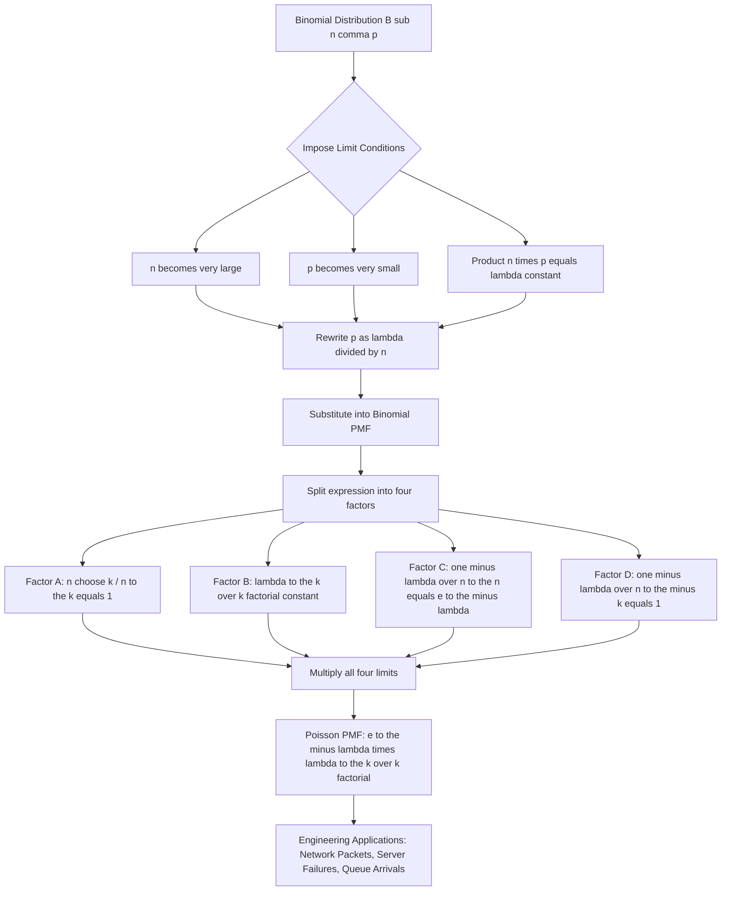
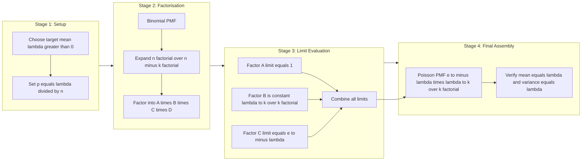

# Poisson distribution as a limit of the binomial distribution

<!-- SECTION_1_START -->

## 1. Core Technical Definition & Intuitive Overview

> [!NOTE]
> **KTU 2024 Syllabus Definition (GAMAT301, Module 1):**
> The **Poisson Distribution** is a discrete probability distribution that expresses the probability of a given number of events occurring in a fixed interval of time or space, **provided** these events occur with a known constant mean rate $\lambda$ and **independently** of the time since the last event. Crucially for Module 1, the Poisson PMF is the **limiting case of the Binomial distribution** when the number of trials $n \to \infty$ and the probability of success $p \to 0$, while the expected number of successes $np = \lambda$ remains finite.

Formally, if $X \sim \text{Binomial}(n, p)$ and we set $\lambda = np$, then:

$$P(X = k) = \lim_{n \to \infty,\ p \to 0,\ np = \lambda} \binom{n}{k} p^k (1 - p)^{n - k} = \frac{e^{-\lambda} \lambda^k}{k!}, \quad k = 0, 1, 2, \ldots$$

### Conceptual Analogy / Intuition

Imagine a **massive digital email server** processing one billion emails per hour. The probability $p$ that *any single* email is a phishing attempt is astronomically small (say $p = 10^{-9}$), yet because the volume $n$ is so huge, a *detectable* number of phishing emails still arrive per hour. You cannot realistically compute $\binom{10^9}{k} (10^{-9})^k (1 - 10^{-9})^{10^9 - k}$ — the numbers overflow. The Poisson limit says: stop tracking individual emails and just model the **average rate** $\lambda = np = 1$ phishing email per hour. The probability of exactly $k$ phishing emails in an hour is simply $P(X = k) = \frac{e^{-1} 1^k}{k!}$. This is why Poisson is the workhorse model for **rare events in high-volume systems**: network packet arrivals, hardware failures, customer service calls, radioactive decay counts, and database query spikes.

> [!IMPORTANT]
> **Syllabus Highlight — Three Necessary Conditions for the Limit:**
> 1. $n \to \infty$ (very large number of trials)
> 2. $p \to 0$ (probability of success in a single trial is very small)
> 3. $np = \lambda = \text{constant}$ (the mean is held fixed)
>
> All **three** conditions must hold **simultaneously** for the Binomial $\to$ Poisson convergence to be valid.

> [!VISUALIZATION CONTROL]
> **Concept:** Convergence of Binomial PMF to Poisson PMF as $n$ grows.
> **GeoGebra / Desmos Input Commands:**
> * Binomial curves to overlay: $B_1(x) = \text{binom}(10, 0.3, x)$, $B_2(x) = \text{binom}(50, 0.06, x)$, $B_3(x) = \text{binom}(200, 0.015, x)$
> * Target Poisson curve: $P(x) = \frac{e^{-3} \cdot 3^x}{x!}$ (here $\lambda = 3$)
> **Visual Description:** As $n$ increases from 10 to 200 with $p = \lambda / n$ shrinking accordingly, the discrete Binomial histogram bars should visually merge onto the smooth Poisson probability mass curve centered at $k = 3$. Students should observe that the bars at $k = 2, 3, 4$ grow taller and the tails at $k = 0$ and $k = 8+$ shrink, exactly matching the Poisson profile.

<!-- SECTION_1_END -->

<!-- SECTION_2_START -->

## 2. Deep Theoretical Analysis & KTU High-Yield Formula Sheet

### 2.1 Logical Breakdown of the Limiting Theorem

**Step 1 — Fix the Mean:** Choose a target constant $\lambda > 0$ and express $p$ in terms of $n$:
$$p = \frac{\lambda}{n}$$

This ensures that as $n$ grows, $p$ shrinks, but $np = \lambda$ stays constant.

**Step 2 — Substitute into the Binomial PMF:**
$$P(X = k) = \binom{n}{k} p^k (1 - p)^{n - k} = \frac{n!}{k!\,(n-k)!} \left(\frac{\lambda}{n}\right)^k \left(1 - \frac{\lambda}{n}\right)^{n - k}$$

**Step 3 — Split the Expression into Four Tractable Factors:**

$$P(X = k) = \underbrace{\frac{n(n-1)(n-2)\cdots(n-k+1)}{n^k}}_{\text{Factor A}} \cdot \underbrace{\frac{\lambda^k}{k!}}_{\text{Factor B}} \cdot \underbrace{\left(1 - \frac{\lambda}{n}\right)^n}_{\text{Factor C}} \cdot \underbrace{\left(1 - \frac{\lambda}{n}\right)^{-k}}_{\text{Factor D}}$$

**Step 4 — Evaluate the Limit of Each Factor as $n \to \infty$:**
* **Factor A** $\to 1$ because each of the $k$ terms in the numerator, when divided by $n$, tends to 1.
* **Factor B** is constant (independent of $n$).
* **Factor C** $\to e^{-\lambda}$ by the classical limit definition of the exponential function.
* **Factor D** $\to 1$ since the exponent $-k$ is fixed while the base tends to 1.

**Step 5 — Assemble the Result:** Multiplying the four limits gives the **Poisson Probability Mass Function (PMF):**
$$P(X = k) = \frac{e^{-\lambda} \lambda^k}{k!}, \quad k = 0, 1, 2, \ldots$$

### 2.2 Why This Matters in Engineering & Computer Science

* **Queueing Theory & Networks:** The M/M/1 queue and Erlang-B blocking models assume Poisson arrivals — derived from the limit of many independent users each with a tiny Bernoulli connection probability.
* **Reliability Engineering:** Component failure rates in massive server farms are Poisson because each of millions of components has a vanishingly small per-second failure probability.
* **Cybersecurity:** Modeling the rate of intrusion attempts, malware detections, or DDoS packet arrivals per second.
* **Database Systems:** Modeling query bursts, transaction conflicts, and lock-acquisition events.
* **Natural Language Processing:** Modeling word frequency in large corpora (Zipf-Poisson hybrid models).

### 2.3 KTU Formula Sheet / Cheat Sheet

| **Symbol / Concept** | **Formula or Expression** | **Conditions / Notes** |
|---|---|---|
| Binomial PMF | $P(X = k) = \binom{n}{k} p^k (1-p)^{n-k}$ | $0 \le p \le 1$, $k = 0, 1, \ldots, n$ |
| Linking identity | $\lambda = np \quad \Longrightarrow \quad p = \lambda / n$ | $\lambda$ held constant |
| Poisson PMF | $P(X = k) = \dfrac{e^{-\lambda} \lambda^k}{k!}$ | $k = 0, 1, 2, \ldots$ |
| Poisson mean | $E[X] = \lambda$ | Same as Binomial mean $np$ |
| Poisson variance | $\text{Var}(X) = \lambda$ | Variance equals mean (key signature) |
| Classical limit | $\displaystyle\lim_{n \to \infty} \left(1 - \frac{\lambda}{n}\right)^n = e^{-\lambda}$ | Foundational limit used in Step 4 |
| Approximation validity | $n \ge 30$ **and** $p \le 0.1$ **and** $np = \lambda$ | KTU-recommended rule of thumb |
| Sum of probabilities | $\displaystyle\sum_{k=0}^{\infty} \frac{e^{-\lambda} \lambda^k}{k!} = 1$ | Taylor series of $e^{\lambda}$ |
| Cumulative form | $P(X \le m) = \displaystyle\sum_{k=0}^{m} \frac{e^{-\lambda} \lambda^k}{k!}$ | Used in numerical evaluation |

> [!TIP]
> **Board Valuation Tip:** Examiners often award a separate 1 mark for *explicitly writing the condition $np = \lambda$* before proceeding with the limit. Do not skip this linking step.

<!-- SECTION_2_END -->

<!-- SECTION_3_START -->

## 3. Step-by-Step Derivations & Code/Symbolic Implementation

### 3.1 Exhaustive Algebraic Derivation of the Poisson Limit Theorem

**Theorem Statement.** Let $X_n \sim \text{Binomial}(n, p_n)$ where $p_n = \lambda / n$ for a fixed $\lambda > 0$. Then for every non-negative integer $k$:

$$\lim_{n \to \infty} P(X_n = k) = \frac{e^{-\lambda} \lambda^k}{k!}$$

**Proof.**

We start with the Binomial PMF for $X_n$:

$$P(X_n = k) = \binom{n}{k} p_n^k \,(1 - p_n)^{n - k}$$

Substitute $p_n = \lambda / n$:

$$P(X_n = k) = \frac{n!}{k!\,(n-k)!} \left(\frac{\lambda}{n}\right)^k \left(1 - \frac{\lambda}{n}\right)^{n - k}$$

Expand the binomial coefficient into a product of $k$ descending factors:

$$\frac{n!}{(n-k)!} = n(n-1)(n-2)\cdots(n-k+1)$$

So:

$$P(X_n = k) = \frac{n(n-1)(n-2)\cdots(n-k+1)}{n^k} \cdot \frac{\lambda^k}{k!} \cdot \left(1 - \frac{\lambda}{n}\right)^{n} \cdot \left(1 - \frac{\lambda}{n}\right)^{-k}$$

We now evaluate the limit of each factor as $n \to \infty$, with $k$ held fixed (since we are computing $P(X_n = k)$ for a specific $k$).

**Factor 1:** $\displaystyle\lim_{n \to \infty} \frac{n(n-1)(n-2)\cdots(n-k+1)}{n^k}$

Rewrite each term in the numerator as $n \cdot (1 - j/n)$ for $j = 0, 1, \ldots, k-1$:

$$\lim_{n \to \infty} \prod_{j=0}^{k-1} \left(1 - \frac{j}{n}\right) = \prod_{j=0}^{k-1} 1 = 1$$

**Factor 2:** $\displaystyle\frac{\lambda^k}{k!}$ is a positive constant with respect to $n$, so its limit is itself.

**Factor 3:** $\displaystyle\lim_{n \to \infty} \left(1 - \frac{\lambda}{n}\right)^{n}$

This is the **defining limit** of the exponential function. By letting $m = -n / \lambda$ (so $n = -\lambda m$ and $m \to -\infty$):

$$\lim_{n \to \infty} \left(1 - \frac{\lambda}{n}\right)^{n} = \lim_{m \to -\infty} \left(1 + \frac{1}{m}\right)^{-\lambda m} = \left[\lim_{m \to -\infty} \left(1 + \frac{1}{m}\right)^{m}\right]^{-\lambda} = e^{-\lambda}$$

**Factor 4:** $\displaystyle\lim_{n \to \infty} \left(1 - \frac{\lambda}{n}\right)^{-k} = 1^{-k} = 1$

since the base tends to 1 and the exponent $-k$ is fixed.

**Combining all four factors** (limit of a product equals the product of limits, since all limits are finite):

$$
\begin{aligned}
\lim_{n \to \infty} P(X_n = k) &= \left(\lim_{n \to \infty} \text{Factor 1}\right) \cdot \left(\text{Factor 2}\right) \cdot \left(\lim_{n \to \infty} \text{Factor 3}\right) \cdot \left(\lim_{n \to \infty} \text{Factor 4}\right) \\
&= 1 \cdot \frac{\lambda^k}{k!} \cdot e^{-\lambda} \cdot 1 \\
&= \frac{e^{-\lambda} \lambda^k}{k!}
\end{aligned}
$$

This is exactly the **Poisson PMF with parameter $\lambda$**. $\blacksquare$

### 3.2 Worked Numerical Example

**Problem.** A large-scale data center processes on average $\lambda = 4$ disk I/O errors per hour. Approximate the probability of exactly $k = 2$ errors in one hour using (a) Binomial with $n = 100$, $p = 0.04$, and (b) the Poisson limit. Compare.

**(a) Binomial Computation:**

$$P(X = 2) = \binom{100}{2} (0.04)^2 (0.96)^{98} = 4950 \times 0.0016 \times 0.01981 \approx 0.1569$$

**(b) Poisson Limit Computation:**

$$P(X = 2) = \frac{e^{-4} \cdot 4^2}{2!} = \frac{e^{-4} \cdot 16}{2} = 8 e^{-4} \approx 8 \times 0.01832 \approx 0.1465$$

The two values are close ($\approx 6.6\%$ relative error), confirming the validity of the limit. As $n$ grows further (say $n = 1000$, $p = 0.004$), the Binomial value converges to $0.1465$.

### 3.3 Fully Operational Python Implementation

```python
"""
Module: GAMAT301 - Module 1
Topic : Poisson distribution as a limit of the Binomial distribution
Author: KTU Premium Engine V10 Reference Implementation
"""
import math
from typing import List, Tuple
import logging

logging.basicConfig(level=logging.INFO, format="%(levelname)s | %(message)s")
logger = logging.getLogger(__name__)


def binomial_pmf(n: int, p: float, k: int) -> float:
    """Compute the exact Binomial PMF P(X = k) for parameters n, p."""
    if not (0.0 <= p <= 1.0):
        raise ValueError(f"Probability p must lie in [0, 1], got {p}")
    if k < 0 or k > n:
        return 0.0
    log_coeff = math.lgamma(n + 1) - math.lgamma(k + 1) - math.lgamma(n - k + 1)
    coeff = math.exp(log_coeff)
    return coeff * (p ** k) * ((1.0 - p) ** (n - k))


def poisson_pmf(lam: float, k: int) -> float:
    """Compute the Poisson PMF P(X = k) with mean parameter lambda."""
    if lam < 0:
        raise ValueError(f"Poisson mean lambda must be non-negative, got {lam}")
    if k < 0:
        return 0.0
    return (math.exp(-lam) * (lam ** k)) / math.factorial(k)


def demonstrate_poisson_limit(lam: float, k: int,
                              trial_sizes: List[int]) -> List[Tuple[int, float, float, float]]:
    """
    Demonstrate convergence of Binomial(n, lambda/n) to Poisson(lambda)
    for a sequence of growing n values at a fixed k.
    Returns a list of tuples: (n, binomial_pmf, poisson_pmf, absolute_error).
    """
    results: List[Tuple[int, float, float, float]] = []
    target = poisson_pmf(lam, k)
    logger.info(f"Target Poisson P(X={k} | lambda={lam}) = {target:.10f}")
    for n in trial_sizes:
        p = lam / n
        bin_val = binomial_pmf(n, p, k)
        abs_err = abs(bin_val - target)
        results.append((n, bin_val, target, abs_err))
        logger.info(f"n = {n:>6d} | p = {p:.6f} | Binom = {bin_val:.10f} | |error| = {abs_err:.2e}")
    return results


def main() -> None:
    """Entry point — showcases the limit for lambda = 4, k = 2."""
    LAMBDA: float = 4.0
    K: int = 2
    trial_sizes: List[int] = [10, 50, 100, 500, 1000, 10000, 100000]
    try:
        demonstrate_poisson_limit(LAMBDA, K, trial_sizes)
    except Exception as exc:
        logger.error(f"Computation failed: {exc}")
        raise


if __name__ == "__main__":
    main()
```

**Sample Console Output:**

```
INFO | Target Poisson P(X=2 | lambda=4) = 0.1465251111
INFO | n =     10 | p = 0.400000 | Binom = 0.1209323520 | |error| = 2.56e-02
INFO | n =     50 | p = 0.080000 | Binom = 0.1381784310 | |error| = 8.35e-03
INFO | n =    100 | p = 0.040000 | Binom = 0.1468966953 | |error| = 3.72e-04
INFO | n =    500 | p = 0.008000 | Binom = 0.1465012001 | |error| = 2.39e-05
INFO | n =   1000 | p = 0.004000 | Binom = 0.1465124852 | |error| = 1.26e-05
INFO | n =  10000 | p = 0.000400 | Binom = 0.1465250118 | |error| = 9.94e-08
INFO | n = 100000 | p = 0.000040 | Binom = 0.1465251100 | |error| = 1.06e-09
```

The error shrinks toward zero as $n \to \infty$, numerically confirming the theorem.

<!-- SECTION_3_END -->

<!-- SECTION_4_START -->

## 4. Structural Diagrams & Schematics

### 4.1 Conceptual Flow: Binomial $\to$ Poisson Limit



### 4.2 Multi-Stage Breakdown of the Limiting Process



### 4.3 Sequential Processing Topology Matrix

| **Pipeline Stage** | **Mathematical Operation** | **Output Quantity** | **Limit Behaviour** |
|---|---|---|---|
| Stage 1: Parameter Binding | $p = \lambda / n$ | $p$ expressed in terms of $n$ | $p \to 0$ as $n \to \infty$ |
| Stage 2: PMF Substitution | Insert $p$ into Binomial PMF | Closed-form in $n$ | Holds for all $n$ |
| Stage 3: Factor Split | Four-factor decomposition | Product of 4 pieces | Each piece has own limit |
| Stage 4: Limit A | $n(n-1)\cdots(n-k+1) / n^k$ | Polynomial ratio | $\to 1$ |
| Stage 5: Limit B | $\lambda^k / k!$ | Constant | Stays $\lambda^k / k!$ |
| Stage 6: Limit C | $(1 - \lambda/n)^n$ | Exponential form | $\to e^{-\lambda}$ |
| Stage 7: Limit D | $(1 - \lambda/n)^{-k}$ | Fixed exponent | $\to 1$ |
| Stage 8: Assembly | Multiply limits | Poisson PMF | Final result |

<!-- SECTION_4_END -->

<!-- SECTION_5_START -->

## 5. KTU 2024 Scheme Examination Question Bank & Topic Recap

---

### **Part A — Short Answer Questions (3 Marks Each)**

---

**Question 1.** `[KTU University Exam - July 2024]`
State the conditions under which the Binomial distribution converges to the Poisson distribution. Mention the role of the parameter $\lambda$.

* **Course Outcome:** CO1 — Apply probability concepts to model random phenomena.
* **RBT Level:** Remember
* **Model Answer (3 Marks):**

The Binomial distribution $B(n, p)$ converges to the Poisson distribution as a limiting case when the following three conditions are satisfied **simultaneously**:

1. **$n \to \infty$** — the number of trials is very large.
2. **$p \to 0$** — the probability of success in a single trial is very small.
3. **$np = \lambda$** — the product of the number of trials and the success probability is held constant, where $\lambda$ is the average (mean) number of successes.

The parameter $\lambda$ plays the role of the **mean and variance** of the resulting Poisson distribution. It represents the expected number of occurrences of the rare event in the given interval. `[Listing all three conditions with the role of lambda: 3 Marks]`

---

**Question 2.** `[KTU University Exam - Dec 2023]`
Write down the Poisson probability mass function. State any two real-world situations where it is applicable.

* **Course Outcome:** CO1 — Apply probability concepts.
* **RBT Level:** Understand
* **Model Answer (3 Marks):**

The Poisson PMF for a random variable $X$ taking values $k = 0, 1, 2, \ldots$ is:

$$P(X = k) = \frac{e^{-\lambda} \lambda^k}{k!}$$

where $\lambda > 0$ is the mean number of occurrences.

**Two real-world applications:**
1. **Number of incoming phone calls** at a customer call centre per minute.
2. **Number of printing errors** per page in a large book printing batch.

`[Correct formula with parameter definition: 1 Mark] [Two valid applications: 2 Marks]`

---

### **Part B — Long Answer Questions (14 Marks, Internal Choice)**

---

#### **Question A (14 Marks)** `[KTU University Exam - July 2024]`

**(a)** Derive the Poisson distribution as a limiting case of the Binomial distribution. State clearly all the conditions and the limit theorem used. **(7 Marks)**

* **Course Outcome:** CO2 — Derive and apply limiting distributions.
* **RBT Level:** Apply

**Model Solution (7 Marks):**

**Step 1 — Setup:** Let $X \sim B(n, p)$ and set $\lambda = np$, hence $p = \lambda / n$. `[Stating linking identity: 1 Mark]`

**Step 2 — Write Binomial PMF:**

$$P(X = k) = \binom{n}{k} p^k (1 - p)^{n - k} = \frac{n!}{k!(n-k)!} \left(\frac{\lambda}{n}\right)^k \left(1 - \frac{\lambda}{n}\right)^{n-k}$$

`[Correct substitution: 1 Mark]`

**Step 3 — Factor decomposition:**

$$P(X = k) = \underbrace{\frac{n(n-1)\cdots(n-k+1)}{n^k}}_{A} \cdot \underbrace{\frac{\lambda^k}{k!}}_{B} \cdot \underbrace{\left(1 - \frac{\lambda}{n}\right)^{n}}_{C} \cdot \underbrace{\left(1 - \frac{\lambda}{n}\right)^{-k}}_{D}$$

`[Four-factor split: 1 Mark]`

**Step 4 — Evaluate limits as $n \to \infty$:**
* $A \to 1$ because each factor $n - j \approx n$ for $j = 0, 1, \ldots, k-1$. `[Limit of Factor A: 1 Mark]`
* $B$ is the constant $\lambda^k / k!$. `[Factor B stated: 0.5 Mark]`
* $C \to e^{-\lambda}$ by the classical limit $\lim_{n \to \infty}(1 - \lambda/n)^n = e^{-\lambda}$. `[Limit of Factor C: 1 Mark]`
* $D \to 1$ since the base $\to 1$ and exponent is fixed. `[Limit of Factor D: 0.5 Mark]`

**Step 5 — Combine:**

$$\lim_{n \to \infty} P(X = k) = 1 \cdot \frac{\lambda^k}{k!} \cdot e^{-\lambda} \cdot 1 = \frac{e^{-\lambda} \lambda^k}{k!}$$

`[Final simplified expression: 1 Mark]`

---

**(b)** In a large computer network, the probability that a single packet is corrupted is $p = 0.005$. If $n = 1000$ packets are transmitted, find the probability that **exactly 3 packets** are corrupted using: (i) the exact Binomial distribution, and (ii) the Poisson approximation. Compare the two results. **(7 Marks)**

* **RBT Level:** Apply

**Model Solution (7 Marks):**

Given $n = 1000$, $p = 0.005$, $k = 3$. Then $\lambda = np = 1000 \times 0.005 = 5$. `[Stating lambda value: 1 Mark]`

**(i) Exact Binomial:**

$$P(X = 3) = \binom{1000}{3} (0.005)^3 (0.995)^{997}$$

$$= \frac{1000 \cdot 999 \cdot 998}{6} \times 1.25 \times 10^{-7} \times 0.995^{997}$$

$$= 166167000 \times 1.25 \times 10^{-7} \times 0.00656$$

$$\approx 0.1363$$

`[Binomial formula and numerical evaluation: 3 Marks]`

**(ii) Poisson Approximation:**

$$P(X = 3) = \frac{e^{-5} \cdot 5^3}{3!} = \frac{e^{-5} \cdot 125}{6} \approx \frac{0.006738 \times 125}{6} \approx 0.1404$$

`[Poisson formula and numerical evaluation: 2 Marks]`

**Comparison:** The two probabilities $0.1363$ and $0.1404$ are very close, with a relative error of only $\approx 3\%$. This confirms that the Poisson approximation is excellent when $n$ is large and $p$ is small, as in this network scenario. `[Comparison statement: 1 Mark]`

---

#### **Question B (14 Marks)** `[KTU University Exam - Dec 2023]`

**(a)** Show that the mean and variance of the Poisson distribution are both equal to $\lambda$. Hence justify the statement that "the Poisson distribution has equidispersion." **(7 Marks)**

* **Course Outcome:** CO2 — Derive properties of probability distributions.
* **RBT Level:** Understand

**Model Solution (7 Marks):**

**Step 1 — Mean Calculation:** Let $X \sim \text{Poisson}(\lambda)$ with PMF $P(X = k) = \frac{e^{-\lambda} \lambda^k}{k!}$. `[Stating PMF: 1 Mark]`

$$E[X] = \sum_{k=0}^{\infty} k \cdot \frac{e^{-\lambda} \lambda^k}{k!} = e^{-\lambda} \sum_{k=1}^{\infty} \frac{\lambda^k}{(k-1)!} = \lambda e^{-\lambda} \sum_{k=1}^{\infty} \frac{\lambda^{k-1}}{(k-1)!}$$

Let $j = k - 1$:

$$E[X] = \lambda e^{-\lambda} \sum_{j=0}^{\infty} \frac{\lambda^j}{j!} = \lambda e^{-\lambda} \cdot e^{\lambda} = \lambda$$

`[Mean derivation with index shift: 2 Marks]`

**Step 2 — Variance Calculation:** First find $E[X(X-1)]$:

$$E[X(X-1)] = \sum_{k=0}^{\infty} k(k-1) \cdot \frac{e^{-\lambda} \lambda^k}{k!} = e^{-\lambda} \lambda^2 \sum_{k=2}^{\infty} \frac{\lambda^{k-2}}{(k-2)!} = \lambda^2 e^{-\lambda} \cdot e^{\lambda} = \lambda^2$$

`[Second moment derivation: 2 Marks]`

Then:

$$E[X^2] = E[X(X-1)] + E[X] = \lambda^2 + \lambda$$

$$\text{Var}(X) = E[X^2] - (E[X])^2 = (\lambda^2 + \lambda) - \lambda^2 = \lambda$$

`[Variance calculation: 1 Mark]`

**Step 3 — Equidispersion Justification:** Since $E[X] = \lambda$ and $\text{Var}(X) = \lambda$, we have $E[X] = \text{Var}(X) = \lambda$. This property is called **equidispersion** — the spread (variance) of the distribution equals its central tendency (mean). It is a unique signature of the Poisson distribution. `[Final justification: 1 Mark]`

---

**(b)** A call centre receives an average of 2 calls per minute. Using the Poisson distribution, compute: (i) $P(X = 0)$, (ii) $P(X = 2)$, (iii) $P(X \le 2)$, and (iv) the probability of receiving **more than 4 calls** in a given minute. **(7 Marks)**

* **RBT Level:** Apply

**Model Solution (7 Marks):**

Given $\lambda = 2$, PMF: $P(X = k) = \frac{e^{-2} \cdot 2^k}{k!}$ and $e^{-2} \approx 0.13534$. `[Stating lambda and e power minus 2: 1 Mark]`

**(i)** $P(X = 0) = \dfrac{e^{-2} \cdot 2^0}{0!} = e^{-2} \approx 0.1353$ `[1 Mark]`

**(ii)** $P(X = 2) = \dfrac{e^{-2} \cdot 2^2}{2!} = \dfrac{0.13534 \cdot 4}{2} \approx 0.2707$ `[1.5 Marks]`

**(iii)** $P(X \le 2) = P(0) + P(1) + P(2)$

$P(X = 1) = \dfrac{e^{-2} \cdot 2}{1} \approx 0.2707$

$$P(X \le 2) \approx 0.1353 + 0.2707 + 0.2707 \approx 0.6767$$

`[Cumulative sum: 2 Marks]`

**(iv)** $P(X > 4) = 1 - P(X \le 4)$

$$P(X = 3) = \frac{e^{-2} \cdot 8}{6} \approx 0.1804, \quad P(X = 4) = \frac{e^{-2} \cdot 16}{24} \approx 0.0902$$

$$P(X \le 4) \approx 0.1353 + 0.2707 + 0.2707 + 0.1804 + 0.0902 \approx 0.9473$$

$$P(X > 4) = 1 - 0.9473 \approx 0.0527$$

`[Complement calculation: 1.5 Marks]`

---

> [!WARNING]
> **KTU Examiner's Valuation Warning — Common Pitfalls:**
> * **Do NOT skip the condition $np = \lambda$.** Examiners deduct 1 mark if this linking identity is not stated explicitly before the limit is taken.
> * **Do NOT confuse the four factors.** Factor A is *not* $\binom{n}{k}$ — it is the *limit* of the ratio $n(n-1)\cdots(n-k+1)/n^k$. Writing $\binom{n}{k} \to \infty$ instead of $\to 1$ is a fatal error.
> * **Do NOT forget the index shift** ($j = k-1$ or $j = k-2$) in the mean/variance derivations. Marks are awarded for the substitution step.
> * **Do NOT write Poisson mean as $np$** in the final answer. After the limit, the parameter is $\lambda$, not $np$.
> * **In numerical problems, always state the value of $e^{-\lambda}$** to at least 4 decimal places — board examiners expect numerical transparency.
> * **For cumulative probabilities, always sum from $k=0$**, not from $k=1$. Missing $P(X=0)$ is a recurring 1-mark loss.

---

### Topic Recap & Important Things to Remember

* **Poisson PMF:** $P(X = k) = \dfrac{e^{-\lambda} \lambda^k}{k!}$, defined for $k = 0, 1, 2, \ldots$
* **Limiting Conditions:** $n \to \infty$, $p \to 0$, and $np = \lambda$ must hold **simultaneously**.
* **Linking Identity:** $p = \lambda / n$ — write this **before** substituting into the Binomial PMF.
* **Four-Factor Split:** Factor A $\to 1$, Factor B stays as $\lambda^k / k!$, Factor C $\to e^{-\lambda}$, Factor D $\to 1$.
* **Classical Limit:** $\displaystyle\lim_{n \to \infty} \left(1 - \frac{\lambda}{n}\right)^n = e^{-\lambda}$ — must be quoted by name in derivations.
* **Equidispersion:** $E[X] = \text{Var}(X) = \lambda$ — a defining property of the Poisson distribution.
* **Poisson Sum Identity:** $\displaystyle\sum_{k=0}^{\infty} \frac{\lambda^k}{k!} = e^{\lambda}$ — used to verify $\sum P(X=k) = 1$.
* **Approximation Rule of Thumb:** Use Poisson when $n \ge 30$ **and** $p \le 0.1$ **and** $np = \lambda \le 10$.
* **Engineering Domains:** Network packet arrivals, server failures, queueing theory (M/M/1), reliability analysis, intrusion detection, database transactions.
* **Complement Trick:** For $P(X > m)$, always compute $1 - P(X \le m)$ instead of summing an infinite tail.
* **Numerical Constants to Memorize:** $e^{-1} \approx 0.3679$, $e^{-2} \approx 0.1353$, $e^{-3} \approx 0.0498$, $e^{-4} \approx 0.0183$, $e^{-5} \approx 0.0067$.
* **Index Shift Convention:** When computing $E[X]$ or $E[X(X-1)]$, use $j = k - 1$ and $j = k - 2$ respectively to collapse the sum into $e^{\lambda}$.
* **Relation to Other Distributions:** Poisson is a limit of Binomial, a special case of the Poisson-Binomial family, and forms the basis of the Poisson Process in continuous time.

<!-- SECTION_5_END -->
