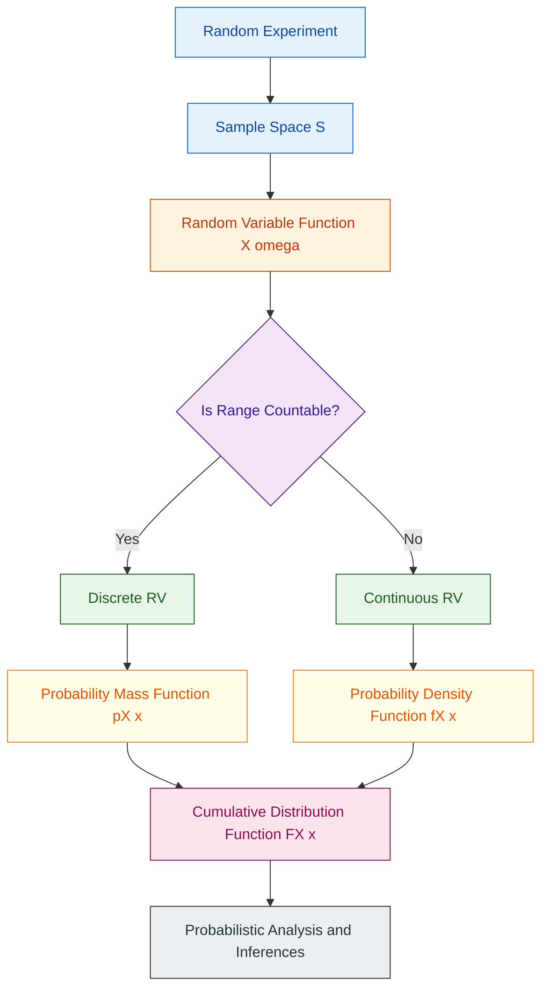
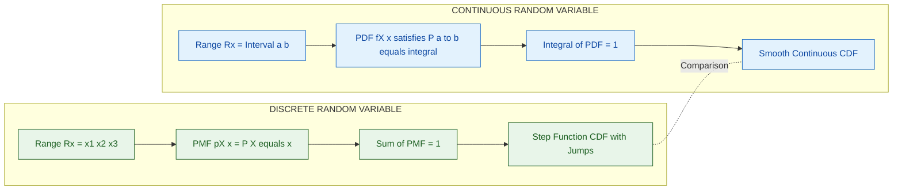
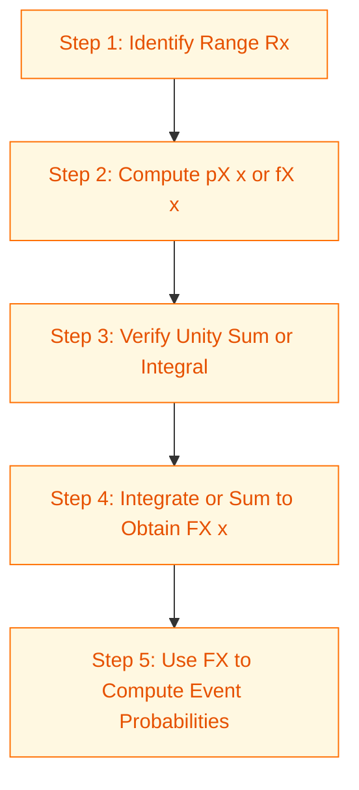

# Random variables

<!-- SECTION_1_START -->
# Random Variables — Formal Definition & Intuitive Overview

## 1.1 Formal Academic Definition (KTU 2024 Syllabus Terminology)

> [!IMPORTANT]
> **Random Variable (RV):** Let $S$ be the sample space of a random experiment. A **random variable** is a real-valued function $X: S \rightarrow \mathbb{R}$ that assigns a real number $X(\omega)$ to every outcome $\omega \in S$.

In simpler terms, a random variable is **not** a variable in the algebraic sense — it is a **function** that maps every elementary outcome of a probabilistic experiment to the real line $\mathbb{R}$. Once mapped, the event becomes a numerical quantity on which standard calculus and analysis can be applied.

## 1.2 Conceptual Analogy / Geometric Intuition

Imagine a **biased six-faced die** lying on a table.

| Real-World Object | Mathematical Counterpart |
|------------------|--------------------------|
| The die itself | The random experiment with sample space $S = \{1, 2, 3, 4, 5, 6\}$ |
| The face that lands up after the throw | An outcome $\omega \in S$ |
| The number printed on that face | The value of the random variable $X(\omega)$ |

So when you throw the die, you don't *choose* what number appears — but you do *observe* the real number that the function $X$ gives back. The randomness lives in the **experiment**, while the random variable $X$ is a **deterministic bridge** turning qualitative outcomes into quantitative measurements.

> [!NOTE]
> **Why Computer Scientists Care:** Random variables are the backbone of *every* algorithm that deals with uncertainty — from hashing and load balancing, to Monte Carlo simulations, to machine learning loss functions, to cryptographic key generation, to queuing networks in cloud computing.

## 1.3 Classification of Random Variables

A random variable is classified strictly by the **nature of the set of values it can take**:

| Type | Set of Values $R_X$ | Defining Function | Example |
|------|---------------------|-------------------|---------|
| **Discrete RV** | Countable (finite or countably infinite) | Probability Mass Function (PMF) $p_X(x)$ | Number of emails received in an hour |
| **Continuous RV** | Uncountable (typically an interval) | Probability Density Function (PDF) $f_X(x)$ | Time taken to download a file |
| **Mixed RV** | Union of discrete points and continuous intervals | Combined PMF + PDF | Net rainfall in a month (zero with positive probability, otherwise continuous) |

> [!TIP]
> **Key Recognition Rule:** If you can *list* the values the variable can take → **Discrete**. If the values form an *interval* of real numbers → **Continuous**.

## 1.4 Standard Real-World Examples

- **$X$ = number of heads in 10 coin tosses** → Discrete, range $\{0, 1, 2, \dots, 10\}$.
- **$X$ = lifetime (in hours) of a hard disk drive** → Continuous, range $[0, \infty)$.
- **$X$ = number of packets arriving at a router in 1 ms** → Discrete, range $\{0, 1, 2, \dots\}$.
- **$X$ = voltage measured at a sensor pin** → Continuous, range $[0, 5]$ Volts.

## 1.5 Geometric Visualization

> [!VISUALIZATION CONTROL]
> **Concept:** PMF of a discrete random variable (Bar Chart) versus PDF of a continuous random variable (Area-Under-Curve)
> **GeoGebra / Desmos Input Equations:**
> * Discrete: `Polygon((1,0),(1,0.2),(1.5,0.2),(1.5,0))` and similar bars at heights $p_X(x) = 0.1, 0.2, 0.3, 0.2, 0.1, 0.1$ for $x = 1, 2, 3, 4, 5, 6$
> * Continuous: `f(x) = (1/sqrt(2π)) * e^(-x^2/2)` over $[-3, 3]$
> **Visual Description:** The PMF appears as separated vertical bars whose **heights** sum to 1. The PDF appears as a smooth bell curve whose **total area under the curve** equals 1.

<!-- SECTION_1_END -->

<!-- SECTION_2_START -->
# Deep Theoretical Analysis & KTU High-Yield Formula Sheet

## 2.1 The Cumulative Distribution Function (CDF)

The CDF is the **single most important descriptor** of any random variable, because it works for *both* discrete and continuous cases.

> [!IMPORTANT]
> **Definition:** The cumulative distribution function of a random variable $X$ is the function $F_X : \mathbb{R} \rightarrow [0, 1]$ defined by
> $$F_X(x) = P(X \le x) = P(\{\omega \in S : X(\omega) \le x\})$$

### 2.1.1 Properties of the CDF (Board-Favourite Question)

For any random variable $X$, its CDF $F_X(x)$ **must** satisfy all of the following:

1. **Boundedness:** $0 \le F_X(x) \le 1$ for all $x \in \mathbb{R}$.
2. **Monotonicity:** $F_X(x)$ is **non-decreasing** in $x$.
3. **Right-Continuity:** $\lim_{x \to a^+} F_X(x) = F_X(a)$ for every $a$.
4. **Boundary Values:** $\lim_{x \to -\infty} F_X(x) = 0$ and $\lim_{x \to +\infty} F_X(x) = 1$.

> [!WARNING]
> A common error is to state $F_X(x)$ is "increasing". The correct word is **non-decreasing** (it can be flat over intervals where no probability mass exists).

### 2.1.2 Computing Probabilities from the CDF

For any $a < b$:

$$P(a < X \le b) = F_X(b) - F_X(a)$$

Special useful cases:

$$P(X > a) = 1 - F_X(a)$$

$$P(X \le a) = F_X(a)$$

$$P(X = a) = F_X(a) - \lim_{x \to a^-} F_X(x)$$

## 2.2 Probability Mass Function (PMF) — Discrete Case

> [!NOTE]
> **Definition:** For a discrete RV $X$ with range $R_X = \{x_1, x_2, \dots\}$, the PMF is
> $$p_X(x) = P(X = x)$$

**Properties of PMF:**

1. **Non-negativity:** $p_X(x) \ge 0$ for all $x$.
2. **Unity:** $\sum_{x \in R_X} p_X(x) = 1$.
3. **Event Probability:** $P(X \in A) = \sum_{x \in A} p_X(x)$ for any event $A \subseteq R_X$.

**Recovering CDF from PMF:**

$$F_X(x) = \sum_{t \le x} p_X(t) = \sum_{t \in R_X, \, t \le x} p_X(t)$$

## 2.3 Probability Density Function (PDF) — Continuous Case

> [!IMPORTANT]
> **Definition:** A continuous RV $X$ has a PDF $f_X(x)$ if, for every interval $[a, b]$,
> $$P(a \le X \le b) = \int_{a}^{b} f_X(x)\, dx$$

**Properties of PDF:**

1. **Non-negativity:** $f_X(x) \ge 0$ for all $x$.
2. **Unity (Total Area):** $\int_{-\infty}^{+\infty} f_X(x)\, dx = 1$.
3. **Point Probability is Zero:** $P(X = a) = \int_{a}^{a} f_X(x)\, dx = 0$.
4. **Recovering CDF:** $F_X(x) = \int_{-\infty}^{x} f_X(t)\, dt$ and $f_X(x) = \frac{d}{dx} F_X(x)$ at every point where $F_X$ is differentiable.

## 2.4 KTU High-Yield Formula Cheat Sheet

| \# | Concept | Formula | Valid For |
|---|---------|---------|-----------|
| 1 | CDF Definition | $F_X(x) = P(X \le x)$ | Discrete, Continuous, Mixed |
| 2 | CDF Range | $0 \le F_X(x) \le 1$ | All RVs |
| 3 | CDF Boundary | $F_X(-\infty) = 0, \; F_X(+\infty) = 1$ | All RVs |
| 4 | Interval Probability | $P(a < X \le b) = F_X(b) - F_X(a)$ | All RVs |
| 5 | Tail Probability | $P(X > a) = 1 - F_X(a)$ | All RVs |
| 6 | PMF Definition | $p_X(x) = P(X = x)$ | Discrete only |
| 7 | PMF Unity | $\sum_{x} p_X(x) = 1$ | Discrete only |
| 8 | CDF from PMF | $F_X(x) = \sum_{t \le x} p_X(t)$ | Discrete only |
| 9 | PDF Definition | $P(a \le X \le b) = \int_{a}^{b} f_X(x)\,dx$ | Continuous only |
| 10 | PDF Unity | $\int_{-\infty}^{+\infty} f_X(x)\,dx = 1$ | Continuous only |
| 11 | CDF from PDF | $F_X(x) = \int_{-\infty}^{x} f_X(t)\,dt$ | Continuous only |
| 12 | PDF from CDF | $f_X(x) = \frac{d}{dx} F_X(x)$ | Continuous only |

## 2.5 Real-World Utility in Computer Science

- **Network Engineering:** Inter-arrival time of packets modelled as a **continuous exponential RV**; number of packets in a fixed window modelled as a **discrete Poisson RV**.
- **Machine Learning:** Loss functions are expectations of a random variable: $L = \mathbb{E}[\ell(X, Y)]$.
- **Cryptography:** Pseudo-random number generators (PRNGs) emulate draws from a **uniform discrete RV** on $\{0, 1, \dots, 2^{32}-1\}$.
- **Queueing Theory:** Service times and waiting times are **continuous RVs**; number of customers in the queue is a **discrete RV**.
- **Reliability Engineering:** Component lifetimes are **continuous RVs** (often Weibull or exponential).

<!-- SECTION_2_END -->

<!-- SECTION_3_START -->
# Step-by-Step Derivations & Symbolic Implementation

## 3.1 Worked Example 1 — Discrete RV (Dice Roll with Modification)

**Problem:** A fair die is rolled. Let $X$ be the number that appears. Find the PMF, CDF, and $P(2 < X \le 5)$.

### Step 1 — Identify the Range of $X$

Since the die is fair with 6 faces:

$$R_X = \{1, 2, 3, 4, 5, 6\}$$

### Step 2 — Write the PMF

Each outcome has probability $\frac{1}{6}$:

$$p_X(x) = \frac{1}{6}, \quad x \in \{1, 2, 3, 4, 5, 6\}$$

**Verification of Unity:**

$$\sum_{x=1}^{6} p_X(x) = \frac{1}{6} + \frac{1}{6} + \frac{1}{6} + \frac{1}{6} + \frac{1}{6} + \frac{1}{6} = 1 \quad \checkmark$$

### Step 3 — Construct the CDF

The CDF is a **right-continuous step function** that jumps at each value in $R_X$ by an amount $p_X(x)$:

$$F_X(x) = \begin{cases} 0, & x < 1 \\ \frac{1}{6}, & 1 \le x < 2 \\ \frac{2}{6}, & 2 \le x < 3 \\ \frac{3}{6}, & 3 \le x < 4 \\ \frac{4}{6}, & 4 \le x < 5 \\ \frac{5}{6}, & 5 \le x < 6 \\ 1, & x \ge 6 \end{cases}$$

### Step 4 — Compute the Requested Probability

$$P(2 < X \le 5) = F_X(5) - F_X(2) = \frac{5}{6} - \frac{2}{6} = \frac{3}{6} = \frac{1}{2}$$

**Verification by Direct Summation:**

$$P(2 < X \le 5) = p_X(3) + p_X(4) + p_X(5) = \frac{1}{6} + \frac{1}{6} + \frac{1}{6} = \frac{1}{2} \quad \checkmark$$

## 3.2 Worked Example 2 — Continuous RV (PDF Construction)

**Problem:** A continuous RV $X$ has PDF

$$f_X(x) = \begin{cases} kx, & 0 \le x \le 2 \\ 0, & \text{otherwise} \end{cases}$$

Find (i) the value of $k$, (ii) $P(X > 1)$, (iii) the CDF $F_X(x)$.

### Step 1 — Apply the Unity Condition to Find $k$

The total area under the PDF must equal 1:

$$\int_{-\infty}^{+\infty} f_X(x)\, dx = 1 \implies \int_{0}^{2} kx\, dx = 1$$

Evaluating the integral:

$$\int_{0}^{2} kx\, dx = k \left[\frac{x^2}{2}\right]_{0}^{2} = k \cdot \frac{4}{2} = 2k$$

Setting $2k = 1$:

$$\boxed{k = \frac{1}{2}}$$

### Step 2 — Compute $P(X > 1)$

$$P(X > 1) = \int_{1}^{2} \frac{1}{2} x\, dx = \frac{1}{2}\left[\frac{x^2}{2}\right]_{1}^{2} = \frac{1}{2}\left(2 - \frac{1}{2}\right) = \frac{1}{2} \cdot \frac{3}{2} = \frac{3}{4}$$

### Step 3 — Derive the CDF $F_X(x)$

For $0 \le x \le 2$:

$$F_X(x) = \int_{0}^{x} \frac{1}{2} t\, dt = \frac{1}{2} \cdot \frac{x^2}{2} = \frac{x^2}{4}$$

So the full CDF is:

$$F_X(x) = \begin{cases} 0, & x < 0 \\ \frac{x^2}{4}, & 0 \le x \le 2 \\ 1, & x > 2 \end{cases}$$

**Verification of Boundary Values:** $F_X(0) = 0 \checkmark$ and $F_X(2) = \frac{4}{4} = 1 \checkmark$.

## 3.3 Python Symbolic & Computational Implementation

```python
import numpy as np
import matplotlib.pyplot as plt
from fractions import Fraction
from typing import Callable, Tuple

# ---------- DISCRETE RANDOM VARIABLE CLASS ----------
class DiscreteRV:
    """
    A rigorous implementation of a discrete random variable
    with PMF and CDF computation, plus visualization hooks.
    """
    def __init__(self, values: np.ndarray, pmf_values: np.ndarray) -> None:
        if len(values) != len(pmf_values):
            raise ValueError("values and pmf_values must have the same length.")
        if np.any(pmf_values < 0):
            raise ValueError("PMF values must be non-negative.")
        if not np.isclose(pmf_values.sum(), 1.0):
            raise ValueError(f"PMF must sum to 1; got {pmf_values.sum()}.")
        self.values: np.ndarray = values
        self.pmf: np.ndarray = pmf_values

    def cdf(self, x: float) -> float:
        """Return F_X(x) = P(X <= x)."""
        return float(np.sum(self.pmf[self.values <= x]))

    def probability_interval(self, a: float, b: float) -> float:
        """Return P(a < X <= b)."""
        return self.cdf(b) - self.cdf(a)

    def plot_pmf(self, ax) -> None:
        ax.stem(self.values, self.pmf, basefmt=" ", use_line_collection=True)
        ax.set_xlabel("x")
        ax.set_ylabel("p_X(x)")
        ax.set_title("Probability Mass Function (PMF)")
        ax.grid(True, alpha=0.3)


# ---------- CONTINUOUS RANDOM VARIABLE CLASS ----------
class ContinuousRV:
    """
    A rigorous implementation of a continuous random variable
    with PDF and CDF integration via numerical quadrature.
    """
    def __init__(self, pdf: Callable[[float], float], lower: float, upper: float) -> None:
        self.pdf: Callable[[float], float] = pdf
        self.lower: float = lower
        self.upper: float = upper
        # Numerically verify that the PDF integrates to 1
        xs = np.linspace(lower, upper, 100_000)
        integral = float(np.trapz(self.pdf(xs), xs))
        if not np.isclose(integral, 1.0, atol=1e-3):
            raise ValueError(f"PDF does not integrate to 1; got {integral}.")

    def cdf(self, x: float) -> float:
        """Return F_X(x) = P(X <= x) using numerical integration."""
        if x < self.lower:
            return 0.0
        if x > self.upper:
            return 1.0
        xs = np.linspace(self.lower, x, 10_000)
        return float(np.trapz(self.pdf(xs), xs))

    def probability_interval(self, a: float, b: float) -> float:
        """Return P(a <= X <= b)."""
        return self.cdf(b) - self.cdf(a)


# ---------- DEMO: Dice Roll ----------
if __name__ == "__main__":
    # Discrete Example: Fair die
    die_values = np.arange(1, 7)
    die_pmf    = np.full(6, 1 / 6)
    X_die      = DiscreteRV(die_values, die_pmf)

    print("Fair Die — PMF:", dict(zip(die_values, die_pmf)))
    print(f"P(2 < X <= 5) = {X_die.probability_interval(2, 5):.4f}")   # Expected: 0.5
    print(f"F_X(3.5)     = {X_die.cdf(3.5):.4f}")                    # Expected: 0.5

    # Continuous Example: f_X(x) = (1/2) x on [0, 2]
    pdf = lambda x: 0.5 * x
    Y    = ContinuousRV(pdf, lower=0.0, upper=2.0)

    print(f"\nContinuous RV: P(X > 1) = {1 - Y.cdf(1):.4f}")           # Expected: 0.75
    print(f"CDF F_X(1) = {Y.cdf(1):.4f}")                            # Expected: 0.25
```

**Expected Console Output:**

```
Fair Die — PMF: {1: 0.1666..., 2: 0.1666..., 3: 0.1666..., 4: 0.1666..., 5: 0.1666..., 6: 0.1666...}
P(2 < X <= 5) = 0.5000
F_X(3.5)     = 0.5000

Continuous RV: P(X > 1) = 0.7500
CDF F_X(1) = 0.2500
```

## 3.4 Complete Aligned Derivation — Recovering PMF from CDF (Discrete)

> [!NOTE]
> **Theorem:** If $X$ is a discrete RV with CDF $F_X$, then $p_X(a) = F_X(a) - \lim_{x \to a^-} F_X(x)$, i.e. the size of the **jump** of $F_X$ at the point $a$.

**Proof Sketch:**

$$F_X(a) = P(X \le a) = P(X < a) + P(X = a)$$

$$F_X(a) = \lim_{x \to a^-} F_X(x) + p_X(a)$$

Rearranging:

$$p_X(a) = F_X(a) - \lim_{x \to a^-} F_X(x) \quad \blacksquare$$

<!-- SECTION_3_END -->

<!-- SECTION_4_START -->
# Structural Diagrams & Schematics

## 4.1 High-Level Conceptual Topology — Random Variable Pipeline

The following Mermaid block illustrates the conceptual pipeline from a random experiment all the way to a usable numeric variable:



## 4.2 Comparative Subgraph — Discrete vs Continuous



## 4.3 Sequential CDF Construction Topology



> [!TIP]
> **How to read these diagrams for the exam:** The pipeline shows that *any* random variable analysis must begin with the **sample space**, then proceed via the **RV function** to either a discrete or continuous branch, then move through the **PMF/PDF**, and finally converge on the **CDF** as the unified tool for probability computation.

<!-- SECTION_4_END -->

<!-- SECTION_5_START -->
# KTU 2024 Scheme Examination Question Bank & Topic Recap

## 5.1 Part A — Short Answer Questions (3 Marks Each)

### Question 1 `[KTU University Exam — Dec 2023]`
**Define a random variable. Distinguish between a discrete and a continuous random variable with one example each.** *(CO1, Remember)*

**Model Answer (Board Key):**

A random variable $X$ is a real-valued function defined on the sample space $S$ of a random experiment, i.e., $X : S \rightarrow \mathbb{R}$, that assigns a real number to each outcome $\omega \in S$.

| Aspect | Discrete RV | Continuous RV |
|--------|-------------|----------------|
| Range | Finite or countably infinite | Uncountable (interval) |
| Described by | Probability Mass Function (PMF) | Probability Density Function (PDF) |
| Probability at a point | $P(X = x) = p_X(x) > 0$ | $P(X = x) = 0$ |
| Example | $X$ = number of heads in 3 coin tosses | $X$ = time (in hours) until a bulb fails |

> **Valuation Key:** [Definition of RV: 1 Mark] [Discrete definition + example: 1 Mark] [Continuous definition + example: 1 Mark]

---

### Question 2 `[KTU University Exam — July 2024]`
**State and explain any four properties of the Cumulative Distribution Function (CDF).** *(CO1, Understand)*

**Model Answer (Board Key):**

For any RV $X$ with CDF $F_X(x) = P(X \le x)$:

1. $0 \le F_X(x) \le 1$ for all $x \in \mathbb{R}$.
2. $F_X(x)$ is a **non-decreasing** function of $x$.
3. $F_X(x)$ is **right-continuous** at every point.
4. $\lim_{x \to -\infty} F_X(x) = 0$ and $\lim_{x \to +\infty} F_X(x) = 1$.

> **Valuation Key:** [Each correct property with brief explanation: 0.75 × 4 = 3 Marks]

---

## 5.2 Part B — Long Answer Questions (14 Marks Each)

### Question A `[KTU University Exam — Dec 2023]`

> A discrete random variable $X$ has the following probability distribution:
>
> | $x$ | 0 | 1 | 2 | 3 | 4 | 5 | 6 |
> |-----|---|---|---|---|---|---|---|
> | $p_X(x)$ | $0$ | $k$ | $2k$ | $2k$ | $3k$ | $k^2$ | $2k^2$ |
>
> **(a)** Find the value of $k$. **(7 Marks)**
> **(b)** Find $P(1 \le X \le 4)$ and $P(X \ge 5)$. **(7 Marks)**

#### Part (a) — Model Solution [7 Marks]

**Step 1:** Apply the unity condition $\sum p_X(x) = 1$.

$$0 + k + 2k + 2k + 3k + k^2 + 2k^2 = 1$$

$$8k + 3k^2 = 1$$

**Step 2:** Rearrange into a standard quadratic form.

$$3k^2 + 8k - 1 = 0$$

**Step 3:** Apply the quadratic formula $k = \dfrac{-b \pm \sqrt{b^2 - 4ac}}{2a}$ with $a = 3, \; b = 8, \; c = -1$.

$$k = \frac{-8 \pm \sqrt{64 - 4(3)(-1)}}{2 \cdot 3} = \frac{-8 \pm \sqrt{64 + 12}}{6} = \frac{-8 \pm \sqrt{76}}{6}$$

$$k = \frac{-8 \pm 2\sqrt{19}}{6} = \frac{-4 \pm \sqrt{19}}{3}$$

**Step 4:** Select the valid root. Since $k$ must be a positive probability value:

$$\sqrt{19} \approx 4.3589$$

$$k = \frac{-4 + 4.3589}{3} \approx \frac{0.3589}{3} \approx 0.1196$$

$$\boxed{k \approx 0.1196}$$

**Verification (substitution into unity):**

$$8(0.1196) + 3(0.1196)^2 \approx 0.9568 + 0.0429 \approx 0.9997 \approx 1 \quad \checkmark$$

> **Valuation Key:** [Writing unity equation: 2 Marks] [Solving quadratic: 3 Marks] [Selecting positive root and stating final $k$: 2 Marks]

#### Part (b) — Model Solution [7 Marks]

**Step 1:** Compute $P(1 \le X \le 4)$.

$$P(1 \le X \le 4) = p_X(1) + p_X(2) + p_X(3) + p_X(4)$$

$$= k + 2k + 2k + 3k = 8k$$

Substituting $k \approx 0.1196$:

$$P(1 \le X \le 4) = 8 \times 0.1196 \approx 0.9568$$

**Step 2:** Compute $P(X \ge 5)$.

$$P(X \ge 5) = p_X(5) + p_X(6) = k^2 + 2k^2 = 3k^2$$

$$P(X \ge 5) = 3 \times (0.1196)^2 \approx 3 \times 0.0143 \approx 0.0429$$

**Step 3:** Cross-check using complement.

$$P(X \ge 5) = 1 - P(X \le 4) = 1 - [0 + 0.1196 + 0.2392 + 0.2392 + 0.3588]$$

$$= 1 - 0.9568 = 0.0432 \quad \checkmark$$

> **Valuation Key:** [Identifying the relevant terms: 2 Marks] [Substituting $k$: 2 Marks] [Computing numerical values: 2 Marks] [Complement cross-check: 1 Mark]

---

### Question B `[KTU University Exam — July 2024]`

> A continuous random variable $X$ has the probability density function
> $$f_X(x) = \begin{cases} k(4x - 2x^2), & 0 \le x \le 2 \\ 0, & \text{otherwise} \end{cases}$$
> **(a)** Find the value of $k$. **(7 Marks)**
> **(b)** Determine the CDF $F_X(x)$ and compute $P(X > 1)$. **(7 Marks)**

#### Part (a) — Model Solution [7 Marks]

**Step 1:** Apply unity condition $\int_{-\infty}^{+\infty} f_X(x)\, dx = 1$.

$$\int_{0}^{2} k(4x - 2x^2)\, dx = 1$$

**Step 2:** Expand and integrate term by term.

$$\int_{0}^{2} 4x\, dx = 4 \left[\frac{x^2}{2}\right]_{0}^{2} = 4 \cdot 2 = 8$$

$$\int_{0}^{2} 2x^2\, dx = 2 \left[\frac{x^3}{3}\right]_{0}^{2} = 2 \cdot \frac{8}{3} = \frac{16}{3}$$

**Step 3:** Combine.

$$k \left(8 - \frac{16}{3}\right) = 1 \implies k \left(\frac{24 - 16}{3}\right) = 1 \implies k \cdot \frac{8}{3} = 1$$

$$\boxed{k = \frac{3}{8}}$$

**Step 4:** Verify non-negativity. On $[0, 2]$, $4x - 2x^2 = 2x(2 - x) \ge 0$ ✓.

> **Valuation Key:** [Writing the integral equation: 2 Marks] [Term-by-term integration: 3 Marks] [Final value of $k$: 2 Marks]

#### Part (b) — Model Solution [7 Marks]

**Step 1:** For $0 \le x \le 2$, compute the CDF by integration.

$$F_X(x) = \int_{0}^{x} \frac{3}{8}(4t - 2t^2)\, dt$$

**Step 2:** Evaluate the antiderivative.

$$F_X(x) = \frac{3}{8} \left[2t^2 - \frac{2t^3}{3}\right]_{0}^{x} = \frac{3}{8}\left(2x^2 - \frac{2x^3}{3}\right)$$

$$F_X(x) = \frac{3}{8} \cdot 2 \left(x^2 - \frac{x^3}{3}\right) = \frac{3}{4}\left(x^2 - \frac{x^3}{3}\right) = \frac{3x^2}{4} - \frac{x^3}{4}$$

$$F_X(x) = \frac{3x^2 - x^3}{4} = \frac{x^2(3 - x)}{4}, \quad 0 \le x \le 2$$

**Step 3:** Full piecewise CDF.

$$F_X(x) = \begin{cases} 0, & x < 0 \\ \dfrac{x^2(3 - x)}{4}, & 0 \le x \le 2 \\ 1, & x > 2 \end{cases}$$

**Step 4:** Verification at $x = 2$: $F_X(2) = \frac{4 \cdot 1}{4} = 1$ ✓.

**Step 5:** Compute $P(X > 1)$ using the tail formula.

$$P(X > 1) = 1 - F_X(1) = 1 - \frac{1^2 \cdot (3 - 1)}{4} = 1 - \frac{2}{4} = 1 - \frac{1}{2} = \frac{1}{2}$$

**Step 6:** Cross-check by direct integration.

$$P(X > 1) = \int_{1}^{2} \frac{3}{8}(4x - 2x^2)\, dx = \frac{3}{8}\left[2x^2 - \frac{2x^3}{3}\right]_{1}^{2}$$

$$= \frac{3}{8}\left[\left(8 - \frac{16}{3}\right) - \left(2 - \frac{2}{3}\right)\right] = \frac{3}{8}\left[\frac{8}{3} - \frac{4}{3}\right] = \frac{3}{8} \cdot \frac{4}{3} = \frac{1}{2} \quad \checkmark$$

> **Valuation Key:** [Setting up the integration for $F_X$: 2 Marks] [Anti-differentiation and simplification: 2 Marks] [Writing full piecewise CDF: 1 Mark] [Computing $P(X > 1)$: 2 Marks]

---

## 5.3 KTU Examiner's Valuation Warning / Pitfall Callout

> [!WARNING]
> **Common Mistakes That Cause Mark Deductions:**
> 1. **Forgetting the "non-decreasing" qualifier** — saying $F_X(x)$ is *increasing* instead of *non-decreasing* will lose 0.5 to 1 mark. Continuous plateaus are allowed.
> 2. **Confusing PMF with PDF in unity conditions** — discrete uses $\sum p_X(x) = 1$, continuous uses $\int f_X(x)\, dx = 1$. Writing the wrong one is a 2-mark deduction.
> 3. **Dropping the constant of integration** — when finding $F_X(x)$ for continuous RVs, the constant is fixed by $F_X(\text{lower bound}) = 0$.
> 4. **Failing to state the range of validity** — the final CDF/PDF must be given in piecewise form. Always state the domain explicitly.
> 5. **Negative root retention in quadratic problems** — if a problem yields a quadratic in $k$, you must reject the negative root and *state why* (probability must be non-negative).

---

## 5.4 Topic Recap & Important Things to Remember

> [!IMPORTANT]
> **Rapid-Revision Checklist for Random Variables:**

- **Definition:** A random variable is a *function* $X: S \rightarrow \mathbb{R}$, not a traditional algebraic variable.
- **Two main types:** Discrete (PMF) and Continuous (PDF); classified by the nature of the range $R_X$.
- **PMF $p_X(x)$** satisfies $p_X(x) \ge 0$ and $\sum p_X(x) = 1$.
- **PDF $f_X(x)$** satisfies $f_X(x) \ge 0$ and $\int_{-\infty}^{+\infty} f_X(x)\, dx = 1$.
- **CDF $F_X(x) = P(X \le x)$** is the **unified** descriptor and works for *all* types of RVs.
- **Four CDF properties** to memorize verbatim: bounded in $[0,1]$, non-decreasing, right-continuous, limits $0$ and $1$ at $\pm\infty$.
- **Probability from CDF:** $P(a < X \le b) = F_X(b) - F_X(a)$.
- **CDF–PMF link:** $F_X(x) = \sum_{t \le x} p_X(t)$; $p_X(a) = F_X(a) - \lim_{x \to a^-} F_X(x)$.
- **CDF–PDF link:** $F_X(x) = \int_{-\infty}^{x} f_X(t)\, dt$ and $f_X(x) = \dfrac{d}{dx} F_X(x)$.
- **Point probability for continuous RV is always zero** — never write $P(X = a) = f_X(a)$.
- **Engineering relevance:** Random variables model packet arrivals, sensor noise, service times, network traffic, and ML loss functions.
- **Common exam trap:** Always give your final CDF/PDF in *piecewise* form with explicit domain boundaries.

<!-- SECTION_5_END -->
