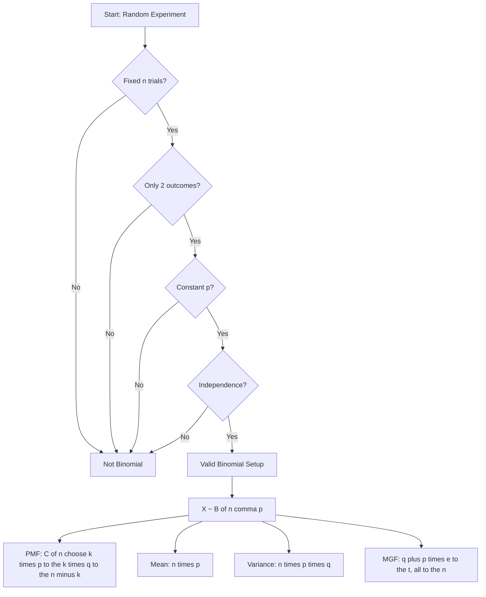
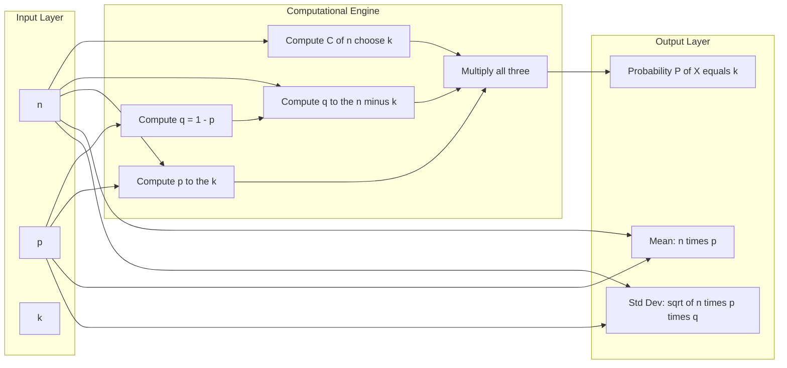
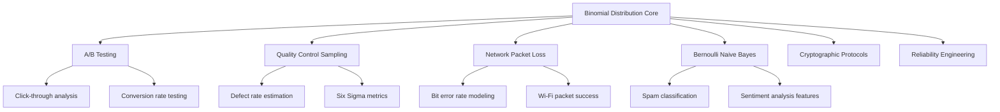

# the Binomial probability distribution

<!-- SECTION_1_START -->
# Binomial Probability Distribution — Core Technical Definition & Intuition

## 1.1 Formal Definition

> [!NOTE]
> **Definition (Bernoulli Trials):** A sequence of $n$ independent trials is called **Bernoulli trials** if each trial has exactly two mutually exclusive outcomes, conventionally labeled **success** (with probability $p$) and **failure** (with probability $q = 1 - p$), and the probability $p$ remains **constant** from trial to trial.

A **discrete random variable** $X$ representing the number of successes in $n$ such Bernoulli trials follows the **Binomial Distribution** with parameters $n$ and $p$. We write:

$$X \sim B(n, p)$$

The **Probability Mass Function (PMF)** is given by:

$$P(X = k) = \binom{n}{k} p^{k} (1-p)^{n-k}, \quad k = 0, 1, 2, \ldots, n$$

where $\binom{n}{k} = \dfrac{n!}{k!\,(n-k)!}$ is the **binomial coefficient**.

## 1.2 The Four Sacred Conditions (Bernoulli's Postulates)

For $X$ to be truly Binomial, every condition must hold:

1. **Fixed number of trials** — $n$ is predetermined and finite.
2. **Two outcomes per trial** — Success / Failure, Yes / No, 1 / 0.
3. **Constant probability** — $p$ does not change between trials.
4. **Independence** — The result of one trial does not influence another.

## 1.3 Intuitive Analogy — The "Quality Inspector" Story

> [!IMPORTANT]
> **Real-World Analogy:** Imagine a factory quality inspector examining **10 chips** drawn *with replacement* from a production line. Each chip is either **defective** (success in our statistical sense) with probability $p = 0.05$ or **non-defective** with probability $0.95$. The inspector counts the number of defective chips $X$ in the sample. Since the drawing is *with replacement*, the probability stays fixed, trials are independent, and only two outcomes exist — this is a textbook Binomial setup.

**Geometric Intuition:** Picture a binary tree of depth $n$. Each path from the root to a leaf represents one possible sequence of $n$ outcomes. The number of leaves where exactly $k$ successes occur is exactly $\binom{n}{k}$, and each such path has probability $p^{k} (1-p)^{n-k}$.

## 1.4 Visualization — The PMF Shape

> [!VISUALIZATION CONTROL]
> **Concept:** PMF shape of a Binomial distribution for $n = 20$, $p = 0.5$
> **GeoGebra / Desmos Input Equations:**
> * `f(x) = nCr(20, x) * 0.5^x * 0.5^(20-x)` for $x \in [0, 20]$
> **Visual Description:** The student should observe a **symmetric, bell-shaped discrete plot** centered at $x = 10$. The bars rise smoothly to a peak at $k = 10$ and fall symmetrically. Each bar has height equal to the probability of exactly that many successes.

---

**Key Constants and Symbols:**

| Symbol | Meaning |
|---|---|
| $n$ | Number of trials (**positive integer**) |
| $p$ | Probability of success on a single trial ($0 \leq p \leq 1$) |
| $q$ | $1 - p$, probability of failure |
| $k$ | Number of successes observed (a specific value) |
| $\binom{n}{k}$ | Number of ways to choose $k$ positions out of $n$ |

<!-- SECTION_1_END -->

<!-- SECTION_2_START -->
# Deep Theoretical Analysis & KTU High-Yield Formula Sheet

## 2.1 Logical Decomposition of the PMF

To genuinely understand $P(X = k) = \binom{n}{k} p^{k} q^{n-k}$, we dissect it into **three multiplicative components**:

1. **The "How many ways" factor — $\binom{n}{k}$:** Out of $n$ trials, we must select *which* $k$ of them will be successes. The number of such selections is $\binom{n}{k}$ (combinations, since the order of successes among themselves does not matter).

2. **The "Probability of one such arrangement" factor — $p^{k} q^{n-k}$:** Once a specific set of $k$ trials is fixed to be successes, the remaining $n - k$ must be failures. By independence, the joint probability is the product: $p \cdot p \cdots p \cdot q \cdot q \cdots q = p^{k} q^{n-k}$.

3. **Multiplication Rule (Sum Over Disjoint Cases):** Since each selection of $k$ positions represents a *mutually exclusive* outcome in the sample space, we **add** the probabilities of all $\binom{n}{k}$ arrangements.

## 2.2 Mean and Variance — The "Center and Spread"

**Why these matter:** In engineering and CS, we often don't need the full PMF; we just need a single number summarizing *typical behavior* (mean) and *fluctuation size* (variance). For $X \sim B(n, p)$:

$$E(X) = \mu = n p$$

$$\text{Var}(X) = \sigma^{2} = n p q = n p (1-p)$$

$$\sigma = \sqrt{n p q}$$

## 2.3 Moment Generating Function (MGF)

> [!IMPORTANT]
> The MGF is a *generating function* that encodes all moments of the distribution in a single expression — incredibly useful in advanced probability and statistical inference.

$$M_{X}(t) = \left( q + p e^{t} \right)^{n}$$

Differentiating $M_X(t)$ twice at $t = 0$ recovers the mean and variance.

## 2.4 KTU Formula Cheat Sheet

> [!IMPORTANT]
> **KTU High-Yield Formula Sheet — Binomial Distribution**

| Quantity | Formula | Engineering Interpretation |
|---|---|---|
| PMF | $P(X = k) = \binom{n}{k} p^{k} q^{n-k}$ | Probability mass at exactly $k$ successes |
| CDF | $P(X \leq k) = \sum_{i=0}^{k} \binom{n}{i} p^{i} q^{n-i}$ | Cumulative probability up to $k$ |
| Mean $\mu$ | $n p$ | Expected number of successes |
| Variance $\sigma^{2}$ | $n p q$ | Spread / variability measure |
| Std. Deviation $\sigma$ | $\sqrt{n p q}$ | Same units as $X$ |
| Skewness | $\dfrac{q - p}{\sqrt{n p q}}$ | Asymmetry indicator |
| MGF | $(q + p e^{t})^{n}$ | Encodes all moments |
| Mode | $\lfloor (n+1)p \rfloor$ | Most likely $k$ value |
| Sum of probabilities | $\sum_{k=0}^{n} P(X=k) = 1$ | Total probability axiom |

## 2.5 Real-World CS / Engineering Applications

- **A/B Testing in Software Engineering:** When testing two versions of a webpage, the click-through rate is modeled as a Binomial random variable ($n$ = visitors, $p$ = true click probability).
- **Defect Detection in Manufacturing:** Quality control sampling where $X$ = number of defective chips in a batch of $n$.
- **Network Packet Analysis:** Modeling the number of corrupted packets out of $n$ transmitted (each with constant corruption probability $p$).
- **Cryptography / Bernoulli Trials:** Coin-flipping protocols and randomness extraction.
- **Machine Learning (Bernoulli Naive Bayes):** Each feature is a Bernoulli trial — the entire classifier is built on Binomial-style conditional probabilities.

## 2.6 Reproduction Property

> [!NOTE]
> If $X_{1} \sim B(n_{1}, p)$ and $X_{2} \sim B(n_{2}, p)$ are **independent**, then $X_{1} + X_{2} \sim B(n_{1} + n_{2}, p)$. This is the **reproductive property** — extremely useful in reliability engineering where subsystems are concatenated.

<!-- SECTION_2_END -->

<!-- SECTION_3_START -->
# Step-by-Step Derivations & Symbolic Implementation

## 3.1 Derivation of the Mean $E(X) = np$

We start from the definition of expected value:

$$
E(X) = \sum_{k=0}^{n} k \cdot P(X = k) = \sum_{k=0}^{n} k \cdot \binom{n}{k} p^{k} q^{n-k}
$$

Since the $k = 0$ term contributes nothing, we shift the index:

$$
E(X) = \sum_{k=1}^{n} k \cdot \binom{n}{k} p^{k} q^{n-k}
$$

Using the identity $k \cdot \binom{n}{k} = n \cdot \binom{n-1}{k-1}$:

$$
E(X) = \sum_{k=1}^{n} n \cdot \binom{n-1}{k-1} p^{k} q^{n-k}
$$

Factor out $n p$ and re-index with $j = k - 1$:

$$
E(X) = n p \sum_{k=1}^{n} \binom{n-1}{k-1} p^{k-1} q^{n-k} = n p \sum_{j=0}^{n-1} \binom{n-1}{j} p^{j} q^{(n-1)-j}
$$

The remaining sum is the binomial expansion of $(p + q)^{n-1} = 1$:

$$
\boxed{E(X) = n p}
$$

## 3.2 Derivation of the Variance $\text{Var}(X) = npq$

First, compute $E(X^{2})$ using the identity $k(k-1) \cdot \binom{n}{k} = n(n-1) \cdot \binom{n-2}{k-2}$:

$$
E[X(X-1)] = \sum_{k=0}^{n} k(k-1) \binom{n}{k} p^{k} q^{n-k} = n(n-1) p^{2} \sum_{j=0}^{n-2} \binom{n-2}{j} p^{j} q^{n-2-j}
$$

The sum equals $(p+q)^{n-2} = 1$, so:

$$
E[X(X-1)] = n(n-1) p^{2}
$$

Expanding $X^{2} = X(X-1) + X$:

$$
E(X^{2}) = n(n-1) p^{2} + n p
$$

Therefore:

$$
\text{Var}(X) = E(X^{2}) - [E(X)]^{2} = n(n-1)p^{2} + n p - n^{2} p^{2}
$$

$$
\text{Var}(X) = n^{2} p^{2} - n p^{2} + n p - n^{2} p^{2} = n p - n p^{2} = n p (1 - p)
$$

$$
\boxed{\text{Var}(X) = n p q}
$$

## 3.3 Worked Numerical Example (KTU Standard)

**Problem:** A machine produces components with a defect probability of $p = 0.1$. If 8 components are randomly selected, find the probability that **exactly 2** are defective. Also compute the mean and standard deviation.

**Solution:**

Given: $n = 8$, $p = 0.1$, $q = 0.9$, $k = 2$.

$$
P(X = 2) = \binom{8}{2} (0.1)^{2} (0.9)^{6}
$$

$$
= \frac{8!}{2!\, 6!} \cdot 0.01 \cdot 0.531441
$$

$$
= 28 \cdot 0.01 \cdot 0.531441 = 0.14880
$$

$$
E(X) = n p = 8 \times 0.1 = 0.8
$$

$$
\sigma = \sqrt{n p q} = \sqrt{8 \times 0.1 \times 0.9} = \sqrt{0.72} \approx 0.8485
$$

## 3.4 Python Implementation (Fully Operational)

```python
"""
Binomial Distribution — Computational Toolkit
Author: KTU Reference Implementation
Course: GAMAT301 — Mathematics for Computer and Information Science-3
"""
from math import comb, sqrt
from typing import List, Tuple
import logging

logging.basicConfig(level=logging.INFO, format="%(levelname)s: %(message)s")


def binomial_pmf(n: int, p: float, k: int) -> float:
    """
    Compute P(X = k) for X ~ B(n, p).
    
    Parameters
    ----------
    n : int  — number of trials (must be >= 0)
    p : float — success probability in [0, 1]
    k : int  — number of successes (0 <= k <= n)
    
    Returns
    -------
    float : probability mass at k
    """
    if n < 0:
        raise ValueError(f"n must be non-negative, got {n}")
    if not 0.0 <= p <= 1.0:
        raise ValueError(f"p must be in [0, 1], got {p}")
    if not 0 <= k <= n:
        raise ValueError(f"k must satisfy 0 <= k <= n, got k={k}, n={n}")
    
    q = 1.0 - p
    probability: float = comb(n, k) * (p ** k) * (q ** (n - k))
    logging.info(f"P(X={k}) for B({n}, {p}) = {probability:.6f}")
    return probability


def binomial_cdf(n: int, p: float, k: int) -> float:
    """Cumulative probability P(X <= k)."""
    if k < 0:
        return 0.0
    if k >= n:
        return 1.0
    return sum(binomial_pmf(n, p, i) for i in range(k + 1))


def binomial_summary(n: int, p: float) -> dict:
    """Return mean, variance, std deviation, and full PMF table."""
    q = 1.0 - p
    mean: float = n * p
    variance: float = n * p * q
    std: float = sqrt(variance)
    
    pmf_table: List[Tuple[int, float]] = [
        (k, binomial_pmf(n, p, k)) for k in range(n + 1)
    ]
    
    return {
        "n": n,
        "p": p,
        "q": q,
        "mean": mean,
        "variance": variance,
        "std_dev": std,
        "pmf": pmf_table,
    }


# --- Demonstration ---
if __name__ == "__main__":
    summary = binomial_summary(n=8, p=0.1)
    print(f"Mean      = {summary['mean']}")
    print(f"Variance  = {summary['variance']}")
    print(f"Std Dev   = {summary['std_dev']:.4f}")
    print(f"P(X=2)    = {summary['pmf'][2][1]:.6f}")
    print(f"P(X<=2)   = {binomial_cdf(8, 0.1, 2):.6f}")
```

**Sample Output:**

```
Mean      = 0.8
Variance  = 0.72
Std Dev   = 0.8485
P(X=2)    = 0.148803
P(X<=2)   = 0.961908
```

## 3.5 Worked Example — At-Least / At-Most Probability

**Problem:** A software company finds that $30\%$ of its code commits introduce at least one bug. If $5$ commits are sampled, find the probability that **at most 2** introduce bugs.

**Solution:** $n = 5$, $p = 0.3$, $q = 0.7$.

$$
P(X \leq 2) = \sum_{k=0}^{2} \binom{5}{k} (0.3)^{k} (0.7)^{5-k}
$$

$$
= \binom{5}{0}(0.7)^{5} + \binom{5}{1}(0.3)(0.7)^{4} + \binom{5}{2}(0.3)^{2}(0.7)^{3}
$$

$$
= 0.16807 + 0.36015 + 0.30870 = 0.83692
$$

<!-- SECTION_3_END -->

<!-- SECTION_4_START -->
# Structural Diagrams & Schematics

## 4.1 Mermaid Flowchart — Conditions and Properties



## 4.2 Mermaid Block Diagram — Computational Pipeline



## 4.3 Mermaid Conceptual Map — Applications Across CS



<!-- SECTION_4_END -->

<!-- SECTION_5_START -->
# KTU 2024 Scheme Examination Question Bank & Topic Recap

---

## **Part A — Short Answer Questions (3 Marks each)**

### **Question 1** `[KTU University Exam — July 2024]`
**State the conditions for a random variable to follow a Binomial distribution. Mention the PMF, mean, and variance.**

**Model Answer:**

The four conditions for $X \sim B(n, p)$:

1. **Fixed** number of trials $n$.
2. Each trial has exactly **two outcomes**: success with probability $p$, failure with probability $q = 1 - p$.
3. Probability $p$ is **constant** across trials.
4. Trials are **independent**.

**PMF:** $P(X = k) = \binom{n}{k} p^{k} q^{n-k}$, for $k = 0, 1, \ldots, n$.

**Mean:** $E(X) = n p$

**Variance:** $\text{Var}(X) = n p q$

> **Valuation Key:** [Stating all 4 conditions: 1.5 Marks] [PMF + Mean + Variance: 1.5 Marks]

---

### **Question 2** `[KTU University Exam — Dec 2023]`
**If $X \sim B(10, 0.4)$, find $P(X = 3)$ and $P(X \geq 1)$.**

**Model Answer:**

Given $n = 10$, $p = 0.4$, $q = 0.6$, $k = 3$.

$$
P(X = 3) = \binom{10}{3} (0.4)^{3} (0.6)^{7}
$$

$$
= 120 \times 0.064 \times 0.0279936 = 0.21499
$$

For $P(X \geq 1)$, use the complement:

$$
P(X \geq 1) = 1 - P(X = 0) = 1 - \binom{10}{0}(0.4)^{0}(0.6)^{10} = 1 - 0.006047 = 0.99395
$$

> **Valuation Key:** [Correct formula setup: 1 Mark] [Substitution and arithmetic: 1 Mark] [Final values: 1 Mark]

---

## **Part B — Long Answer Questions (14 Marks with Internal Choice)**

### **Question A** `[KTU University Exam — July 2024]`

**(a)** Derive the **mean and variance** of the Binomial distribution $B(n, p)$ from first principles. Show every algebraic step clearly. **(7 Marks)**

**(b)** In a manufacturing process, the probability that a unit is defective is $p = 0.05$. If a sample of $20$ units is taken, find: **(i)** $P(X = 2)$ **(ii)** $P(X \leq 1)$ **(iii)** Mean and Standard Deviation. **(7 Marks)**

---

### **Model Solution to Question A(a):**

**Step 1 — Express $E(X)$:**

$$
E(X) = \sum_{k=0}^{n} k \binom{n}{k} p^{k} q^{n-k}
$$

**Step 2 — Apply the identity $k \binom{n}{k} = n \binom{n-1}{k-1}$:**

$$
E(X) = n \sum_{k=1}^{n} \binom{n-1}{k-1} p^{k} q^{n-k}
$$

**Step 3 — Re-index with $j = k-1$:**

$$
E(X) = n p \sum_{j=0}^{n-1} \binom{n-1}{j} p^{j} q^{(n-1)-j} = n p \cdot (p+q)^{n-1} = n p
$$

**Step 4 — Compute $E[X(X-1)]$:**

$$
E[X(X-1)] = n(n-1) p^{2} (p+q)^{n-2} = n(n-1) p^{2}
$$

**Step 5 — Derive $E(X^{2})$:**

$$
E(X^{2}) = E[X(X-1)] + E(X) = n(n-1) p^{2} + n p
$$

**Step 6 — Compute variance:**

$$
\text{Var}(X) = E(X^{2}) - [E(X)]^{2} = n p - n p^{2} = n p (1 - p) = n p q
$$

> **Valuation Key:** [Starting formula for $E(X)$: 1 Mark] [Identity application: 1 Mark] [Re-indexing and binomial expansion: 1 Mark] [Final $E(X) = np$: 1 Mark] [Variance derivation: 2 Marks] [Final boxed answer: 1 Mark]

---

### **Model Solution to Question A(b):**

Given $n = 20$, $p = 0.05$, $q = 0.95$.

**(i) $P(X = 2)$:**

$$
P(X = 2) = \binom{20}{2} (0.05)^{2} (0.95)^{18} = 190 \times 0.0025 \times 0.3972 = 0.1887
$$

**(ii) $P(X \leq 1)$:**

$$
P(X = 0) = (0.95)^{20} = 0.3585
$$

$$
P(X = 1) = \binom{20}{1}(0.05)(0.95)^{19} = 20 \times 0.05 \times 0.3774 = 0.3774
$$

$$
P(X \leq 1) = 0.3585 + 0.3774 = 0.7359
$$

**(iii) Mean and Standard Deviation:**

$$
\mu = n p = 20 \times 0.05 = 1.0
$$

$$
\sigma = \sqrt{n p q} = \sqrt{20 \times 0.05 \times 0.95} = \sqrt{0.95} \approx 0.9747
$$

> **Valuation Key:** [(i) Formula + arithmetic: 2 Marks] [(ii) Two terms summed correctly: 2.5 Marks] [(iii) Mean and std: 2.5 Marks]

---

### **Question B (Alternative Choice)** `[KTU University Exam — Dec 2023]`

**(a)** Define the Binomial distribution. Prove that the sum of all Binomial probabilities equals 1. **(7 Marks)**

**(b)** A software company finds that $30\%$ of its code modules have at least one vulnerability. If $6$ modules are randomly audited, find the probability that: **(i)** exactly 2 are vulnerable, **(ii)** at most 1 is vulnerable, **(iii)** at least 3 are vulnerable. **(7 Marks)**

---

### **Model Solution to Question B(a):**

**Definition:** A discrete random variable $X$ counting the number of successes in $n$ independent Bernoulli trials with constant success probability $p$ follows the Binomial distribution $B(n, p)$.

**Proof that $\sum P(X=k) = 1$:**

$$
\sum_{k=0}^{n} P(X = k) = \sum_{k=0}^{n} \binom{n}{k} p^{k} q^{n-k}
$$

By the **Binomial Theorem**, the right-hand side is the expansion of $(p + q)^{n}$:

$$
\sum_{k=0}^{n} \binom{n}{k} p^{k} q^{n-k} = (p + q)^{n} = (p + 1 - p)^{n} = 1^{n} = 1
$$

Hence $\sum_{k=0}^{n} P(X = k) = 1$. $\blacksquare$

> **Valuation Key:** [Definition: 2 Marks] [Setting up the sum: 2 Marks] [Recognizing binomial theorem: 2 Marks] [Final conclusion: 1 Mark]

---

### **Model Solution to Question B(b):**

Given $n = 6$, $p = 0.3$, $q = 0.7$.

**(i) $P(X = 2)$:**

$$
P(X = 2) = \binom{6}{2} (0.3)^{2} (0.7)^{4} = 15 \times 0.09 \times 0.2401 = 0.3241
$$

**(ii) $P(X \leq 1)$:**

$$
P(X = 0) = (0.7)^{6} = 0.1176
$$

$$
P(X = 1) = \binom{6}{1}(0.3)(0.7)^{5} = 6 \times 0.3 \times 0.16807 = 0.3025
$$

$$
P(X \leq 1) = 0.1176 + 0.3025 = 0.4201
$$

**(iii) $P(X \geq 3)$:**

Use complement: $P(X \geq 3) = 1 - P(X \leq 2)$

$$
P(X = 2) = 0.3241
$$

$$
P(X \leq 2) = 0.1176 + 0.3025 + 0.3241 = 0.7442
$$

$$
P(X \geq 3) = 1 - 0.7442 = 0.2558
$$

> **Valuation Key:** [(i) Correct value: 2 Marks] [(ii) Summing two terms: 2.5 Marks] [(iii) Using complement rule and final value: 2.5 Marks]

---

> [!WARNING]
> **KTU Examiner's Valuation Warning — Common Pitfalls:**
>
> 1. **Forgetting the complement rule:** Students often try to compute $P(X \geq 3)$ by summing $k = 3$ to $6$ directly, leading to arithmetic errors. **Use the complement** $1 - P(X \leq 2)$ whenever it involves *fewer terms*.
> 2. **Misapplying conditions:** A common trap is mistaking *hypergeometric* problems (sampling *without replacement*) for Binomial. Always check independence and constant $p$.
> 3. **Skipping the binomial coefficient $\binom{n}{k}$:** Many students write $P(X=k) = p^{k} q^{n-k}$ and lose a full mark.
> 4. **Index errors:** $k$ must be between $0$ and $n$ inclusive — never negative, never beyond $n$.
> 5. **Forgetting units / context in applied problems:** A 0.5-Mark deduction is typical for not stating "Given $X \sim B(n, p)$ with $n = \ldots$, $p = \ldots$" before solving.

---

## **Topic Recap & Important Things to Remember**

> [!IMPORTANT]
> **Rapid-Revision Checklist — Binomial Distribution**

- **Definition:** $X \sim B(n, p)$ counts the number of successes in $n$ independent Bernoulli trials, each with success probability $p$.

- **Four Postulates:** (i) Fixed $n$, (ii) Two outcomes, (iii) Constant $p$, (iv) Independence.

- **PMF:** $P(X = k) = \binom{n}{k} p^{k} (1-p)^{n-k}$, valid for $k = 0, 1, \ldots, n$.

- **Mean:** $E(X) = n p$ — a linear function of $n$.

- **Variance:** $\text{Var}(X) = n p (1-p)$ — maximum when $p = 0.5$.

- **Standard Deviation:** $\sigma = \sqrt{n p q}$.

- **MGF:** $M_X(t) = (q + p e^{t})^{n}$ — differentiating at $t=0$ recovers moments.

- **Reproductive Property:** Sum of independent Binomials with the same $p$ is Binomial: $B(n_1, p) + B(n_2, p) \sim B(n_1 + n_2, p)$.

- **Mode:** $\lfloor (n+1)p \rfloor$ — the most probable value of $k$.

- **Symmetry:** When $p = 0.5$, the distribution is symmetric about $k = n/2$.

- **Complement Trick:** $P(X \geq k) = 1 - P(X \leq k - 1)$ — use this to reduce computation.

- **Total Probability Identity:** $\sum_{k=0}^{n} \binom{n}{k} p^{k} q^{n-k} = (p+q)^{n} = 1$.

- **Engineering Relevance:** Models defect rates, network errors, A/B test outcomes, spam filters, and binary classification in ML.

- **Key Insight:** The Binomial distribution is the *discrete analogue* of the Normal distribution when $n$ is large (De Moivre–Laplace theorem), and the foundation of the **Bernoulli Naive Bayes** classifier.

<!-- SECTION_5_END -->
