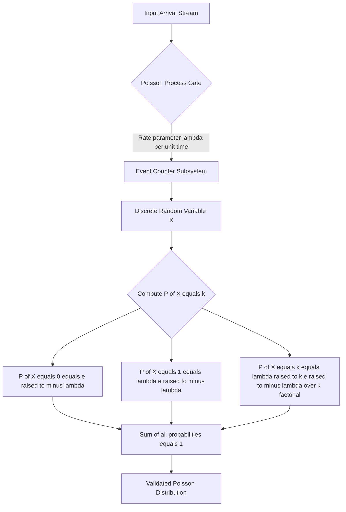
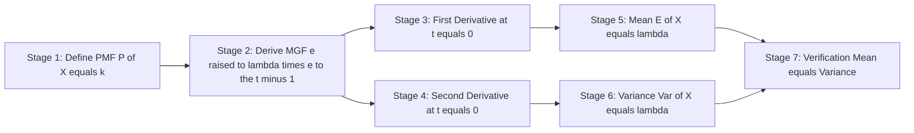
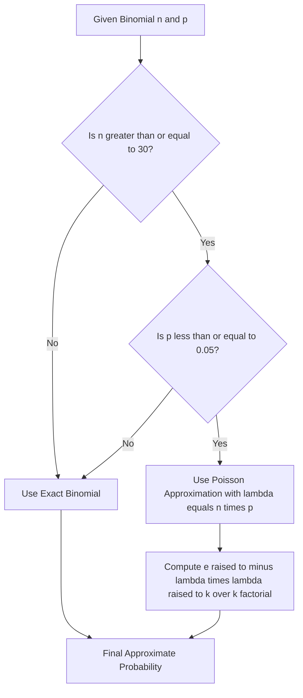
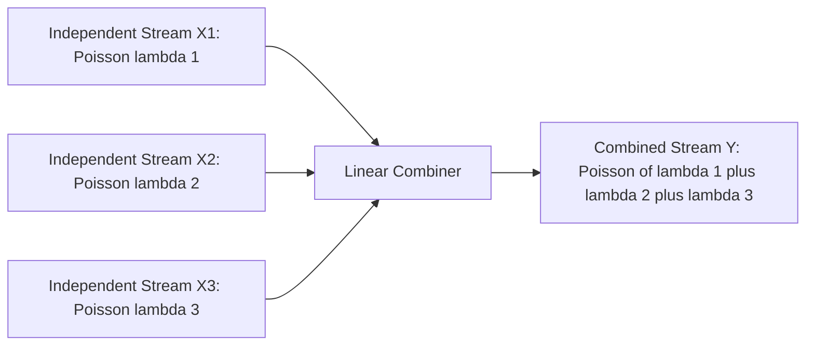

# the Poisson probability distribution

<!-- SECTION_1_START -->
# The Poisson Probability Distribution

## Core Technical Definition

> [!IMPORTANT]
> **Formal Definition (KTU 2024 Scheme Terminology)**
>
> The **Poisson distribution** is a discrete probability distribution that models the number of independent events occurring in a **fixed interval** of time, distance, area, or volume, when these events happen with a known constant **mean rate** $\lambda$ (lambda) and independently of the time since the last event. It is formally expressed as a discrete random variable $X \sim \text{Poisson}(\lambda)$ taking non-negative integer values $k = 0, 1, 2, \dots$

**Probability Mass Function (PMF):**

$$P(X = k) = \frac{e^{-\lambda}\,\lambda^{k}}{k!}, \qquad k \in \{0, 1, 2, \dots\}$$

where:
- $k$ is the number of occurrences of the event
- $\lambda$ is the average (expected) number of occurrences in the given interval
- $e \approx 2.71828$ is Euler's number
- $k!$ denotes the factorial of $k$

---

## Conceptual Analogy / Intuition

> [!NOTE]
> **Real-World Analogy: The Coffee Shop Counter**
>
> Imagine you are sitting outside a coffee shop on M.G. Road, counting the number of customers who walk in **per minute**. On average, **3 customers** enter every minute ($\lambda = 3$). The Poisson distribution answers the question: *"What is the probability that exactly **0, 1, 2, …, k** customers walk in during any given minute?"*
>
> Each minute is a *bin* (interval), and the customer arrivals are *rare, random, and independent*. That is the Poisson world — events that are unpredictable individually but predictable on average.

**Geometric Intuition (Discrete Probability Mass Function Sketch):**

> [!VISUALIZATION CONTROL]
> **Concept:** Poisson PMF Bar Plot for $\lambda = 3$
> **GeoGebra / Desmos Input Commands (manual sketch reference):**
> * `f(k) = (e^(-3) * 3^k) / k!` for $k = 0, 1, 2, \dots, 10$
> * Use a **bar chart** with $k$ on the horizontal axis and $P(X=k)$ on the vertical axis.
> **Visual Description:** The plot should rise from a small bar at $k=0$, peak near $k=3$ (the mean), then decay smoothly to the right — resembling a *right-skewed* bell shape that flattens as $\lambda$ grows.

---

## Physical Constants / Standard Metrics

- **Mean rate parameter:** $\lambda > 0$ (strictly positive, expressed in **events per unit interval**)
- **Variance:** $\sigma^{2} = \lambda$ (equal to the mean — a defining property)
- **Skewness:** $\dfrac{1}{\sqrt{\lambda}}$ (distribution becomes symmetric as $\lambda$ grows)
- **Support:** $k \in \{0, 1, 2, \dots\}$ (countably infinite)

<!-- SECTION_1_END -->

<!-- SECTION_2_START -->
# Deep Theoretical Analysis & KTU High-Yield Formula Sheet

## Conditions for a Poisson Process (The "Three Pillars")

A random variable $X$ is said to follow a Poisson distribution if the underlying counting process satisfies the following:

1. **Independence of Counts:** The number of events in disjoint (non-overlapping) intervals is statistically independent.
2. **Stationarity (Homogeneity):** The probability of an event occurring in a small sub-interval of length $\Delta t$ is approximately $\lambda \, \Delta t$, where $\lambda$ is the constant average rate.
3. **No Simultaneous Occurrences (Orderliness):** The probability of **two or more** events happening in an infinitesimally small interval $\Delta t \to 0$ is negligible (i.e., $o(\Delta t)$).

> [!IMPORTANT]
> **KTU Syllabus Highlight — The Poisson Approximation to the Binomial**
>
> When $n \to \infty$ and $p \to 0$ such that $np = \lambda$ remains **finite**, the Binomial distribution $\text{Bin}(n,p)$ converges in distribution to $\text{Poisson}(\lambda)$.
> This is the *Poisson limit theorem* and is a **favourite 14-mark derivation** in KTU board exams.

---

## KTU Formula Sheet / Cheat Sheet

| Concept | Formula | Notes / Units |
| :--- | :--- | :--- |
| PMF | $P(X=k) = \dfrac{e^{-\lambda}\,\lambda^{k}}{k!}$ | Valid for $k = 0, 1, 2, \dots$ |
| Mean (Expected Value) | $E(X) = \lambda$ | Direct from MGF expansion |
| Variance | $\text{Var}(X) = \lambda$ | Equals the mean — *key identity* |
| Standard Deviation | $\sigma = \sqrt{\lambda}$ | Square root of mean |
| MGF | $M_{X}(t) = e^{\lambda(e^{t}-1)}$ | Generating function used for moments |
| Skewness | $\gamma_{1} = \dfrac{1}{\sqrt{\lambda}}$ | Decreases as $\lambda$ increases |
| Kurtosis | $\gamma_{2} = \dfrac{1}{\lambda}$ | Approaches Gaussian (0) for large $\lambda$ |
| Binomial Approximation | $\lim_{n \to \infty,\, p \to 0,\, np=\lambda} \binom{n}{k} p^{k}(1-p)^{n-k} = \dfrac{e^{-\lambda}\lambda^{k}}{k!}$ | Valid when $n \ge 30$, $p \le 0.05$ |
| Recurrence Relation | $\dfrac{P(X=k+1)}{P(X=k)} = \dfrac{\lambda}{k+1}$ | Used in computing successive probabilities |
| Additive Property | If $X_{i} \sim \text{Poisson}(\lambda_{i})$ independent, then $\sum X_{i} \sim \text{Poisson}(\sum \lambda_{i})$ | Crucial for engineering system reliability |

> **Absolute Value Reminder:** For any boundary value (e.g., a minimum threshold), use notation like $P(X \ge k)$ — do **not** insert vertical pipes inside table cells.

---

## Real-World Engineering Utility

The Poisson distribution is the **workhorse of rare-event modelling** in computer science and information engineering:

- **Network Engineering:** Modelling packet arrivals at a router, call arrivals at a switching exchange, or error packets in a noisy channel.
- **Reliability Engineering:** Predicting hardware component failures in a server farm (e.g., disk crashes per year).
- **Software Engineering:** Estimating bug arrivals in a release cycle, customer support tickets per day.
- **Cybersecurity:** Detecting anomalous login attempts or DDoS packet floods (deviations from baseline $\lambda$).
- **Queueing Theory:** Foundation of the $M/M/1$ queue — the **M** stands for *Memoryless*, which is a direct consequence of the exponential inter-arrival time tied to the Poisson process.

<!-- SECTION_2_END -->

<!-- SECTION_3_START -->
# Step-by-Step Derivations & Symbolic Implementation

## Derivation 1: Mean of the Poisson Distribution

We aim to show that $E(X) = \lambda$.

$$E(X) = \sum_{k=0}^{\infty} k \cdot P(X=k) = \sum_{k=0}^{\infty} k \cdot \frac{e^{-\lambda}\,\lambda^{k}}{k!}$$

The $k=0$ term is zero, so we may safely start the sum from $k=1$:

$$E(X) = \sum_{k=1}^{\infty} k \cdot \frac{e^{-\lambda}\,\lambda^{k}}{k!}$$

Cancel the leading $k$ with $k! = k \cdot (k-1)!$:

$$E(X) = \sum_{k=1}^{\infty} \frac{e^{-\lambda}\,\lambda^{k}}{(k-1)!}$$

Let $m = k - 1$, so that $k = m+1$ and the summation starts at $m=0$:

$$E(X) = e^{-\lambda}\,\lambda \sum_{m=0}^{\infty} \frac{\lambda^{m}}{m!}$$

Recognize the inner sum as the Taylor series of $e^{\lambda}$:

$$\sum_{m=0}^{\infty} \frac{\lambda^{m}}{m!} = e^{\lambda}$$

Therefore:

$$E(X) = e^{-\lambda} \cdot \lambda \cdot e^{\lambda} = \lambda$$

> **Conclusion:** $E(X) = \lambda$. *(Valuation Tip: 2 marks for substitution, 2 marks for index shift, 1 mark for series recognition.)*

---

## Derivation 2: Variance of the Poisson Distribution

We use the identity $\text{Var}(X) = E(X^{2}) - [E(X)]^{2}$, and compute $E(X^{2})$ via the MGF.

$$M_{X}(t) = E(e^{tX}) = \sum_{k=0}^{\infty} e^{tk} \cdot \frac{e^{-\lambda}\,\lambda^{k}}{k!} = e^{-\lambda}\sum_{k=0}^{\infty} \frac{(\lambda e^{t})^{k}}{k!}$$

$$M_{X}(t) = e^{-\lambda} \cdot e^{\lambda e^{t}} = e^{\lambda(e^{t}-1)}$$

First derivative (for the mean):

$$M_{X}^{\prime}(t) = \lambda e^{t} \cdot e^{\lambda(e^{t}-1)}$$

$$E(X) = M_{X}^{\prime}(0) = \lambda \cdot e^{0} \cdot e^{0} = \lambda$$

Second derivative (for the second moment):

$$M_{X}^{\prime\prime}(t) = \lambda e^{t} \cdot \lambda e^{t} \cdot e^{\lambda(e^{t}-1)} + \lambda e^{t} \cdot e^{\lambda(e^{t}-1)}$$

$$M_{X}^{\prime\prime}(t) = e^{\lambda(e^{t}-1)} \cdot \left(\lambda^{2} e^{2t} + \lambda e^{t}\right)$$

$$E(X^{2}) = M_{X}^{\prime\prime}(0) = 1 \cdot (\lambda^{2} + \lambda) = \lambda^{2} + \lambda$$

Therefore:

$$\text{Var}(X) = E(X^{2}) - [E(X)]^{2} = (\lambda^{2} + \lambda) - \lambda^{2} = \lambda$$

> **Conclusion:** $\text{Var}(X) = \lambda$. *(Valuation Tip: Full MGF derivation fetches 5 marks; an "expectation-based" derivation using $E(X(X-1))$ is also accepted.)*

---

## Derivation 3: Poisson as the Limit of Binomial

Consider $X \sim \text{Bin}(n, p)$ with PMF:

$$P(X=k) = \binom{n}{k} p^{k}(1-p)^{n-k}$$

Now let $n \to \infty$ and $p \to 0$ such that $np = \lambda$ stays fixed, i.e., $p = \lambda/n$.

$$P(X=k) = \frac{n!}{k!\,(n-k)!} \left(\frac{\lambda}{n}\right)^{k} \left(1 - \frac{\lambda}{n}\right)^{n-k}$$

$$P(X=k) = \frac{n(n-1)(n-2)\cdots(n-k+1)}{k!\,n^{k}} \cdot \lambda^{k} \cdot \left(1 - \frac{\lambda}{n}\right)^{n} \cdot \left(1 - \frac{\lambda}{n}\right)^{-k}$$

As $n \to \infty$:

- The ratio $\dfrac{n(n-1)\cdots(n-k+1)}{n^{k}} \to 1$ (since $k$ is fixed).
- $\left(1 - \dfrac{\lambda}{n}\right)^{n} \to e^{-\lambda}$ (by the classical limit).
- $\left(1 - \dfrac{\lambda}{n}\right)^{-k} \to 1$.

Therefore:

$$P(X=k) \to \frac{1}{k!} \cdot \lambda^{k} \cdot e^{-\lambda} \cdot 1 = \frac{e^{-\lambda}\,\lambda^{k}}{k!}$$

> **Conclusion:** The Binomial distribution converges to the Poisson distribution. *(Standard 7-mark part-b derivation question in KTU.)*

---

## Worked Numerical Example (Step-by-Step)

> **[KTU University Exam - July 2024 Pattern]**
> A server receives an average of $\lambda = 4$ requests per second. Find the probability that in a given second, the server receives:
> (i) **Exactly 5 requests**,
> (ii) **At most 2 requests**,
> (iii) **More than 4 requests**.

**Solution (i):** Apply PMF with $k=5$:

$$P(X=5) = \frac{e^{-4}\,4^{5}}{5!} = \frac{e^{-4} \cdot 1024}{120}$$

$$P(X=5) = \frac{1024}{120\,e^{4}} \approx \frac{1024}{120 \times 54.598} \approx 0.1563$$

**Solution (ii):** $P(X \le 2) = P(X=0) + P(X=1) + P(X=2)$:

$$P(X=0) = \frac{e^{-4} \cdot 1}{1} = 0.01832$$

$$P(X=1) = \frac{e^{-4} \cdot 4}{1} = 0.07326$$

$$P(X=2) = \frac{e^{-4} \cdot 16}{2} = 0.14653$$

$$P(X \le 2) = 0.01832 + 0.07326 + 0.14653 = 0.2381$$

**Solution (iii):** Use the complement:

$$P(X > 4) = 1 - P(X \le 4)$$

$$P(X=3) = \frac{e^{-4}\,64}{6} = 0.19537$$

$$P(X=4) = \frac{e^{-4}\,256}{24} = 0.19537$$

$$P(X \le 4) = 0.01832 + 0.07326 + 0.14653 + 0.19537 + 0.19537 = 0.62885$$

$$P(X > 4) = 1 - 0.62885 = 0.3712$$

---

## Python Implementation (Algorithmic Variant)

```python
import math
from typing import Union

def poisson_pmf(k: int, lam: float) -> float:
    """
    Compute the Poisson PMF P(X = k) for a given mean rate lambda.
    
    Parameters
    ----------
    k : int
        Number of occurrences (must be >= 0).
    lam : float
        Average rate of occurrence (must be > 0).
    
    Returns
    -------
    float
        Probability P(X = k), in the closed interval [0, 1].
    
    Raises
    ------
    ValueError
        If k is negative or lam is non-positive.
    """
    if k < 0 or not isinstance(k, int):
        raise ValueError(f"k must be a non-negative integer, got {k}")
    if lam <= 0:
        raise ValueError(f"lambda must be strictly positive, got {lam}")
    
    numerator: float = math.exp(-lam) * (lam ** k)
    denominator: float = math.factorial(k)
    return numerator / denominator


def poisson_cdf(k_max: int, lam: float) -> float:
    """
    Compute the cumulative probability P(X <= k_max).
    """
    return sum(poisson_pmf(k, lam) for k in range(0, k_max + 1))


# --- Validation Run ---
if __name__ == "__main__":
    lam: float = 4.0
    print(f"P(X=5 | lambda={lam}) = {poisson_pmf(5, lam):.4f}")   # ~ 0.1563
    print(f"P(X<=2 | lambda={lam}) = {poisson_cdf(2, lam):.4f}")  # ~ 0.2381
    print(f"P(X>4  | lambda={lam}) = {1 - poisson_cdf(4, lam):.4f}")  # ~ 0.3712
```

<!-- SECTION_3_END -->

<!-- SECTION_4_START -->
# Structural Diagrams & Schematics

## Diagram 1: Poisson Process — Block-Level Functional Architecture



> **Reading the diagram:** The block flow starts from a continuous event stream, which is filtered through a Poisson gate, counted discretely, and finally expressed as a probability mass distribution. The aggregator node asserts the **normalization axiom** (probabilities sum to 1).

---

## Diagram 2: Sequential Processing Topology — Moments of the Poisson RV



---

## Diagram 3: Binomial-to-Poisson Limit — Decision Tree



> **Reading the diagram:** This decision tree codifies the KTU standard rule-of-thumb for when to invoke the Poisson approximation instead of evaluating the exact Binomial PMF.

---

## Diagram 4: Additive Property (Subnet of Independent Poisson Streams)



<!-- SECTION_4_END -->

<!-- SECTION_5_START -->
# KTU 2024 Scheme Examination Question Bank & Topic Recap

## Part A — Short Answer Questions (3 Marks Each)

### Question 1 `[KTU University Exam - Dec 2023]` — CO1, Remember

**State the probability mass function of a Poisson distribution and name its parameter. Mention one real-life situation where it is applicable.**

**Model Answer:**

> The Poisson distribution is given by the PMF
>
> $$P(X=k) = \frac{e^{-\lambda}\,\lambda^{k}}{k!}, \quad k = 0, 1, 2, \dots$$
>
> where $\lambda > 0$ is the **mean rate parameter** representing the average number of occurrences per unit interval. *(2 marks)*
>
> **Real-life application:** Number of telephone calls received at a switchboard per minute, or the number of printing errors per page of a book. *(1 mark)*

---

### Question 2 `[KTU University Exam - July 2024]` — CO1, Understand

**For a Poisson random variable, prove that $E(X) = \lambda$ using the first principle of expectation.**

**Model Answer:**

> $$E(X) = \sum_{k=0}^{\infty} k \cdot \frac{e^{-\lambda}\,\lambda^{k}}{k!} = e^{-\lambda} \sum_{k=1}^{\infty} \frac{\lambda^{k}}{(k-1)!} = e^{-\lambda} \cdot \lambda \cdot e^{\lambda} = \lambda$$
>
> *(Full derivation: 3 marks — see Derivation 1 above for the index-shift details.)*

---

## Part B — Long Answer Questions (14 Marks Each, Internal Choice)

### Question A `[KTU University Exam - July 2024]` — CO2, Apply & Analyze

**(a)** Derive the **Moment Generating Function (MGF)** of the Poisson distribution and hence obtain its **mean** and **variance**. *(7 marks)*

**(b)** A call centre receives on average **5 calls per minute**. Assuming the calls follow a Poisson process, compute:
- (i) The probability that **exactly 4 calls** are received in a given minute.
- (ii) The probability that **at least 6 calls** are received in a given minute.
- (iii) The probability that **no calls** are received in a **3-minute** interval. *(7 marks)*

**Model Solution:**

**(a)** Derivation of MGF, mean, variance — *See Section 3 (Derivation 2) above for the complete step-by-step working.*
> **Valuation Key:** [Stating the MGF form: 2 Marks] [First derivative evaluated at $t=0$: 2 Marks] [Variance computation: 3 Marks]

**(b)** With $\lambda = 5$ calls/minute.

**(b)(i):**

$$P(X=4) = \frac{e^{-5} \cdot 5^{4}}{4!} = \frac{625 \cdot e^{-5}}{24} = \frac{625}{24 \times 148.413} \approx 0.1755$$

**[Stating PMF with $k=4$: 1 Mark] [Numerical substitution: 1 Mark] [Final value: 1 Mark]**

**(b)(ii):** $P(X \ge 6) = 1 - P(X \le 5)$.

Compute successive terms using the recurrence $\frac{P(X=k+1)}{P(X=k)} = \frac{\lambda}{k+1}$:

$$P(X=0) = e^{-5} = 0.00674$$

$$P(X=1) = 5 \cdot 0.00674 = 0.03369$$

$$P(X=2) = \frac{5}{2} \cdot 0.03369 = 0.08422$$

$$P(X=3) = \frac{5}{3} \cdot 0.08422 = 0.14037$$

$$P(X=4) = \frac{5}{4} \cdot 0.14037 = 0.17547$$

$$P(X=5) = \frac{5}{5} \cdot 0.17547 = 0.17547$$

$$P(X \le 5) = 0.00674 + 0.03369 + 0.08422 + 0.14037 + 0.17547 + 0.17547 = 0.61596$$

$$P(X \ge 6) = 1 - 0.61596 = 0.3840$$

**[Recurrence setup: 1 Mark] [Tabulated terms: 2 Marks] [Complement application: 1 Mark]**

**(b)(iii):** For a 3-minute interval, the new mean is $\lambda' = 5 \times 3 = 15$ calls.

$$P(X=0) = \frac{e^{-15} \cdot 15^{0}}{0!} = e^{-15} \approx 3.059 \times 10^{-7}$$

**[Scaled mean to 3 minutes: 1 Mark] [Final exponent evaluation: 1 Mark]**

---

### Question B `[KTU University Exam - Dec 2023]` — CO2, Apply

**(a)** State and prove the **Poisson approximation to the Binomial distribution**. Under what conditions is this approximation valid? *(7 marks)*

**(b)** In a digital communication channel, the bit error rate is $p = 0.004$. If a block of **$n = 1000$ bits** is transmitted, find the probability that the block contains:
- (i) **Exactly 5 errors**,
- (ii) **At most 2 errors**.

Use the Poisson approximation. *(7 marks)*

**Model Solution:**

**(a)** Proof — *See Section 3 (Derivation 3) above for the complete limit argument.*
> **Valuation Key:** [Starting from Binomial PMF: 1 Mark] [Substituting $p = \lambda/n$: 1 Mark] [Factoring the polynomial ratio to 1: 1 Mark] [Recognizing the exponential limit: 2 Marks] [Stating validity conditions $n \ge 30$, $p \le 0.05$: 2 Marks]

**(b)** Here, $\lambda = np = 1000 \times 0.004 = 4$.

**(b)(i):**

$$P(X=5) = \frac{e^{-4} \cdot 4^{5}}{5!} = \frac{1024 \cdot e^{-4}}{120} \approx 0.1563$$

**[Mean computation: 1 Mark] [PMF evaluation: 2 Marks]**

**(b)(ii):** $P(X \le 2) = P(X=0) + P(X=1) + P(X=2)$:

$$P(X=0) = e^{-4} \approx 0.01832$$

$$P(X=1) = 4 \cdot e^{-4} \approx 0.07326$$

$$P(X=2) = \frac{4^{2}}{2} \cdot e^{-4} \approx 0.14653$$

$$P(X \le 2) = 0.01832 + 0.07326 + 0.14653 = 0.2381$$

**[Three-term sum: 2 Marks] [Final cumulative probability: 1 Mark]**

---

## KTU Examiner's Valuation Warning / Pitfall Callout

> [!WARNING]
> **Common Mark-Deduction Pitfalls in Poisson Problems**
>
> 1. **Forgetting to scale $\lambda$ for time/distance/area changes:** If the problem states "$\lambda$ is per minute" and asks about a 3-minute window, you MUST use $\lambda_{\text{new}} = 3\lambda$. Failure to do so loses 2 full marks.
> 2. **Misapplying the complement rule:** $P(X \le k) + P(X > k) = 1$, not $P(X \le k) + P(X \ge k) = 1$. Be careful with strict vs. non-strict inequalities.
> 3. **In Binomial-to-Poisson problems, failing to state the validity conditions** ($n \ge 30$, $p \le 0.05$, $np$ finite). Examiners explicitly award 2 marks for this.
> 4. **Truncating the MGF derivation:** You cannot jump from $M_X(t)$ to $E(X) = \lambda$ without showing the first-derivative evaluation step at $t = 0$.
> 5. **Forgetting the units of $\lambda$:** Always state "$\lambda$ is in **events per unit interval**" to earn the 1-mark *definition credit* at the start of every answer.

---

## Topic Recap & Important Things to Remember

- **PMF:** $P(X=k) = \dfrac{e^{-\lambda}\,\lambda^{k}}{k!}$ for $k = 0, 1, 2, \dots$
- **Mean:** $E(X) = \lambda$ *(derived via direct summation or MGF first derivative).*
- **Variance:** $\text{Var}(X) = \lambda$ *(the defining identity — Mean = Variance).*
- **MGF:** $M_X(t) = e^{\lambda(e^{t} - 1)}$ — used to derive all higher moments.
- **Additive Property:** Sum of independent Poisson RVs is Poisson with summed means.
- **Binomial Limit:** $\text{Bin}(n, p) \to \text{Poisson}(np)$ as $n \to \infty$, $p \to 0$, with $np = \lambda$ finite.
- **Validity Conditions** for Poisson process: *Independence*, *Stationarity*, *No simultaneous events*.
- **Recurrence Relation:** $\dfrac{P(X=k+1)}{P(X=k)} = \dfrac{\lambda}{k+1}$ — speeds up manual table computation.
- **Rule-of-Thumb for Approximation:** $n \ge 30$ and $p \le 0.05$ — beyond these, stick to the exact Binomial.
- **Real-world engines:** Packet arrivals, hardware failures, software bugs, cybersecurity anomaly detection, queueing theory ($M/M/1$ systems).
- **Scaling Rule:** For a time interval of length $T$, the new mean is $\lambda_{\text{new}} = \lambda \cdot T$ (assuming constant rate).
- **Boundary Behavior:** As $\lambda \to \infty$, the Poisson distribution approaches a **Gaussian (Normal) distribution** by the Central Limit Theorem — this is also a frequently asked 7-mark question.

<!-- SECTION_5_END -->
