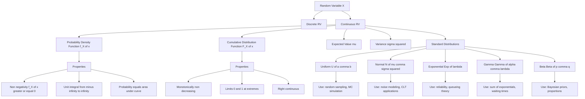
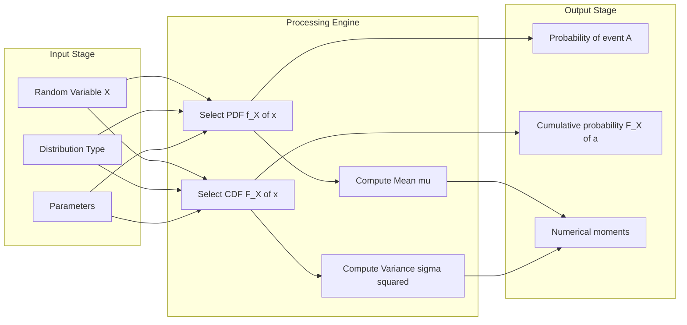
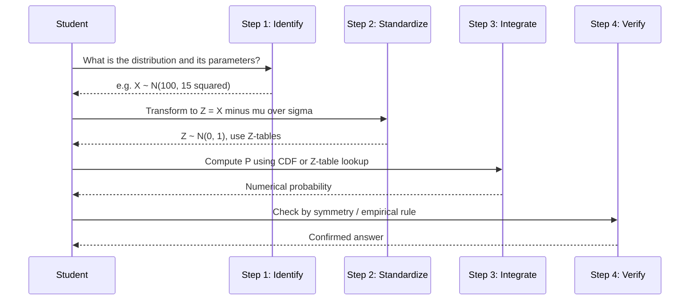
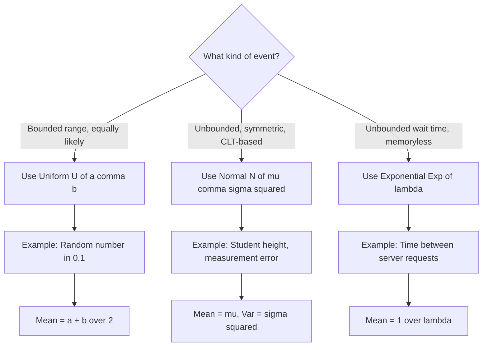

# Continuous random variables and their probability distributions

<!-- SECTION_1_START -->

# Continuous Random Variables and Their Probability Distributions

## 1.1 Formal Academic Definition

> [!IMPORTANT]
> **Continuous Random Variable (CRV):** A random variable $X$ is called *continuous* if its range (set of possible values) consists of an entire interval (or union of intervals) on the real line $\mathbb{R}$, and the probability that $X$ takes any *single* specific value is mathematically **zero**.
>
> Formally, $X$ is continuous if there exists a non-negative integrable function $f_X(x)$, called the **Probability Density Function (PDF)**, such that for every event $A \subseteq \mathbb{R}$:
>
> $$P(X \in A) = \int_{A} f_X(x)\, dx$$

Unlike discrete random variables (where $P(X = x_i) > 0$ for specific points), continuous random variables distribute their probability mass *continuously* across an interval, meaning the total probability is the *area under the curve* of the PDF.

### 1.2 Conceptual Analogy & Intuition

Imagine a **water tank shaped like a curve** standing on the $x$-axis:

- The **shape of the tank's cross-section** at any point $x$ is given by $f_X(x)$ (the PDF).
- The **total volume of water** in the tank always equals **1** (since total probability = 1).
- The **height of the water at point $x_0$** is NOT the probability of $X = x_0$. The probability of $X$ falling in a range $[a, b]$ is the **volume (area) of water** contained between $x = a$ and $x = b$.
- Just as a single vertical line of water has *zero volume*, $P(X = x_0) = 0$ for any specific point.

> [!NOTE]
> **Geometric Intuition:** Probability is *area*, not *height*. This is the single most important mental shift when moving from discrete to continuous probability theory.

### 1.3 Cumulative Distribution Function (CDF)

> [!IMPORTANT]
> **CDF Definition:** The Cumulative Distribution Function $F_X(x)$ of a continuous random variable $X$ is defined as:
>
> $$F_X(x) = P(X \leq x) = \int_{-\infty}^{x} f_X(t)\, dt$$
>
> The CDF is a *non-decreasing*, *right-continuous* function satisfying $F_X(-\infty) = 0$ and $F_X(+\infty) = 1$.

### 1.4 Real-World Engineering Examples

| Domain | Continuous Random Variable | Range |
|---|---|---|
| **Network Engineering** | Response time of a web server | $[0, \infty)$ |
| **Signal Processing** | Amplitude of Gaussian noise | $(-\infty, \infty)$ |
| **Reliability Engineering** | Time-to-failure of a hard disk | $[0, \infty)$ |
| **Machine Learning** | Output of a sigmoid neuron | $[0, 1]$ |
| **Manufacturing** | Diameter of a ball bearing | $[a, b]$ |

> [!VISUALIZATION CONTROL]
> **Concept:** Standard Normal Distribution PDF and CDF Visualization
> **GeoGebra / Desmos Input Equations:**
> * $f(x) = \dfrac{1}{\sqrt{2\pi}}\, e^{-x^2/2}$ (PDF — the famous "bell curve")
> * $F(x) = 0.5 \cdot \left(1 + \text{erf}\!\left(\dfrac{x}{\sqrt{2}}\right)\right)$ (CDF — the S-shaped sigmoid)
> **Visual Description:** The PDF is symmetric about $x = 0$ with peak height $\approx 0.3989$. The CDF starts at $0$ for $x \to -\infty$, passes through $0.5$ at $x = 0$, and asymptotically approaches $1$ as $x \to +\infty$. The PDF is the *derivative* of the CDF.

<!-- SECTION_1_END -->

<!-- SECTION_2_START -->

# Deep Theoretical Analysis & KTU High-Yield Formula Sheet

## 2.1 Fundamental Properties of the PDF $f_X(x)$

For a valid probability density function, the following **five axioms** must hold:

1. **Non-negativity:** $f_X(x) \geq 0$ for all $x \in \mathbb{R}$
2. **Unit area (normalization):** $\displaystyle\int_{-\infty}^{\infty} f_X(x)\, dx = 1$
3. **Probability via integration:** $P(a \leq X \leq b) = \displaystyle\int_{a}^{b} f_X(x)\, dx$
4. **Point probabilities vanish:** $P(X = a) = 0$ for any single $a$
5. **CDF is the antiderivative:** $F_X(x) = \displaystyle\int_{-\infty}^{x} f_X(t)\, dt$ and $f_X(x) = \dfrac{d}{dx} F_X(x)$ (at continuity points)

## 2.2 Properties of the CDF $F_X(x)$

- $0 \leq F_X(x) \leq 1$ for all $x$
- $F_X(x)$ is **monotonically non-decreasing**
- $\lim_{x \to -\infty} F_X(x) = 0$ and $\lim_{x \to +\infty} F_X(x) = 1$
- $F_X(x)$ is **right-continuous**
- $P(a < X \leq b) = F_X(b) - F_X(a)$
- $P(X > a) = 1 - F_X(a)$

## 2.3 Expected Value and Variance

> [!IMPORTANT]
> **Expected Value (Mean):** For a continuous random variable $X$,
>
> $$E(X) = \mu = \int_{-\infty}^{\infty} x\, f_X(x)\, dx$$
>
> **Variance:** A measure of spread, defined as
>
> $$\text{Var}(X) = \sigma^2 = E\!\left[(X - \mu)^2\right] = \int_{-\infty}^{\infty} (x - \mu)^2 f_X(x)\, dx$$
>
> Equivalently, $\sigma^2 = E(X^2) - [E(X)]^2$.

## 2.4 KTU Formula Sheet: Continuous Distributions

> [!NOTE]
> **Legend:** $\mu$ = mean, $\sigma^2$ = variance, MGF = Moment Generating Function.

| Distribution | PDF $f_X(x)$ | Support | Mean $\mu$ | Variance $\sigma^2$ | MGF $M_X(t)$ |
|---|---|---|---|---|---|
| **Uniform** $U(a,b)$ | $\dfrac{1}{b-a}$ | $a \leq x \leq b$ | $\dfrac{a+b}{2}$ | $\dfrac{(b-a)^2}{12}$ | $\dfrac{e^{tb} - e^{ta}}{t(b-a)}$ |
| **Normal** $N(\mu,\sigma^2)$ | $\dfrac{1}{\sigma\sqrt{2\pi}} e^{-\frac{(x-\mu)^2}{2\sigma^2}}$ | $x \in (-\infty, \infty)$ | $\mu$ | $\sigma^2$ | $e^{\mu t + \frac{\sigma^2 t^2}{2}}$ |
| **Exponential** $\text{Exp}(\lambda)$ | $\lambda e^{-\lambda x}$ | $x \geq 0$ | $\dfrac{1}{\lambda}$ | $\dfrac{1}{\lambda^2}$ | $\dfrac{\lambda}{\lambda - t}$, $t < \lambda$ |
| **Standard Normal** $Z \sim N(0,1)$ | $\dfrac{1}{\sqrt{2\pi}} e^{-z^2/2}$ | $z \in (-\infty, \infty)$ | $0$ | $1$ | $e^{t^2/2}$ |

> [!IMPORTANT]
> **Standardization Rule (Z-transformation):** If $X \sim N(\mu, \sigma^2)$, then
>
> $$Z = \frac{X - \mu}{\sigma} \sim N(0,1)$$
>
> This is the **most-used formula in continuous probability** for board exams. Always convert to standard normal before consulting $Z$-tables.

## 2.5 Special Properties of Key Distributions

### 2.5.1 Uniform Distribution $U(a,b)$
- The PDF is a **flat rectangle** of height $\frac{1}{b-a}$.
- The CDF is a **straight ramp** from $0$ to $1$.
- **Memoryless property does NOT hold** for uniform distribution.
- Used in: random number generation, Monte Carlo simulation, sampling theory.

### 2.5.2 Normal Distribution $N(\mu, \sigma^2)$
- The **Empirical Rule (68-95-99.7):**
  - $P(\mu - \sigma \leq X \leq \mu + \sigma) \approx 0.6827$
  - $P(\mu - 2\sigma \leq X \leq \mu + 2\sigma) \approx 0.9545$
  - $P(\mu - 3\sigma \leq X \leq \mu + 3\sigma) \approx 0.9973$
- The PDF is **symmetric** about $x = \mu$.
- The mean, median, and mode are all **equal** to $\mu$.
- **Central Limit Theorem (CLT):** The sum (or average) of a large number of independent random variables tends toward a normal distribution, regardless of the original distribution.

### 2.5.3 Exponential Distribution $\text{Exp}(\lambda)$
- Models the **waiting time** between events in a Poisson process.
- The **memoryless property:**
  $$P(X > s + t \mid X > s) = P(X > t)$$
  This means the future waiting time is independent of the past — a property of unique engineering importance in queueing theory and reliability.
- The CDF: $F_X(x) = 1 - e^{-\lambda x}$ for $x \geq 0$.

## 2.6 Real-World Utility in Computer Science

| Distribution | Engineering Application |
|---|---|
| **Uniform** | Cryptographic key generation, randomized algorithms, hash table load testing |
| **Normal** | Noise modeling in communication channels, ML feature normalization, measurement errors |
| **Exponential** | Inter-arrival times in M/M/1 queues, hard-disk failure modeling, network packet timing |
| **Standard Normal** | Hypothesis testing, confidence intervals, anomaly detection (Z-score) |

<!-- SECTION_2_END -->

<!-- SECTION_3_START -->

# Step-by-Step Derivations & Code Implementation

## 3.1 Derivation 1: Mean and Variance of the Uniform Distribution $U(a, b)$

**Given:** $f_X(x) = \dfrac{1}{b-a}$ for $a \leq x \leq b$, and $0$ otherwise.

### Step 1: Verify Normalization

The PDF must integrate to 1.

$$
\begin{aligned}
\int_{-\infty}^{\infty} f_X(x)\, dx &= \int_{a}^{b} \frac{1}{b-a}\, dx \\
&= \frac{1}{b-a} \left[ x \right]_{a}^{b} \\
&= \frac{1}{b-a} (b - a) \\
&= 1 \quad \checkmark
\end{aligned}
$$

> Conversion logic: The integrand is a constant $\frac{1}{b-a}$, so the antiderivative is $\frac{x}{b-a}$, evaluated from $a$ to $b$.

### Step 2: Compute the Mean $E(X)$

$$
\begin{aligned}
E(X) &= \int_{-\infty}^{\infty} x \cdot f_X(x)\, dx \\
&= \int_{a}^{b} \frac{x}{b-a}\, dx \\
&= \frac{1}{b-a} \int_{a}^{b} x\, dx \\
&= \frac{1}{b-a} \left[ \frac{x^2}{2} \right]_{a}^{b} \\
&= \frac{1}{b-a} \cdot \frac{b^2 - a^2}{2} \\
&= \frac{(b-a)(b+a)}{2(b-a)} \\
&= \frac{a + b}{2}
\end{aligned}
$$

> Conversion logic: We use the power rule $\int x\, dx = \frac{x^2}{2}$ and the difference of squares $b^2 - a^2 = (b-a)(b+a)$. The final cancellation yields the *midpoint* of the interval, which makes geometric sense: a uniform distribution is symmetric about the center.

### Step 3: Compute $E(X^2)$

$$
\begin{aligned}
E(X^2) &= \int_{a}^{b} x^2 \cdot \frac{1}{b-a}\, dx \\
&= \frac{1}{b-a} \left[ \frac{x^3}{3} \right]_{a}^{b} \\
&= \frac{b^3 - a^3}{3(b-a)}
\end{aligned}
$$

> Conversion logic: Factor the numerator using $b^3 - a^3 = (b-a)(b^2 + ab + a^2)$.

$$
\begin{aligned}
E(X^2) &= \frac{(b-a)(b^2 + ab + a^2)}{3(b-a)} = \frac{a^2 + ab + b^2}{3}
\end{aligned}
$$

### Step 4: Compute the Variance $\text{Var}(X)$

Using the identity $\text{Var}(X) = E(X^2) - [E(X)]^2$:

$$
\begin{aligned}
\text{Var}(X) &= \frac{a^2 + ab + b^2}{3} - \left(\frac{a+b}{2}\right)^2 \\
&= \frac{a^2 + ab + b^2}{3} - \frac{a^2 + 2ab + b^2}{4}
\end{aligned}
$$

Finding a common denominator of $12$:

$$
\begin{aligned}
\text{Var}(X) &= \frac{4(a^2 + ab + b^2) - 3(a^2 + 2ab + b^2)}{12} \\
&= \frac{4a^2 + 4ab + 4b^2 - 3a^2 - 6ab - 3b^2}{12} \\
&= \frac{a^2 - 2ab + b^2}{12} \\
&= \frac{(b - a)^2}{12}
\end{aligned}
$$

> **Result:** $\text{Var}(X) = \dfrac{(b-a)^2}{12}$ for the uniform distribution on $[a, b]$.

## 3.2 Derivation 2: Mean and Variance of the Exponential Distribution $\text{Exp}(\lambda)$

**Given:** $f_X(x) = \lambda e^{-\lambda x}$ for $x \geq 0$, with rate parameter $\lambda > 0$.

### Step 1: Verify Normalization

$$
\begin{aligned}
\int_{0}^{\infty} \lambda e^{-\lambda x}\, dx &= \lambda \left[ \frac{-e^{-\lambda x}}{\lambda} \right]_{0}^{\infty} \\
&= \left[ -e^{-\lambda x} \right]_{0}^{\infty} \\
&= 0 - (-1) = 1 \quad \checkmark
\end{aligned}
$$

### Step 2: Compute the Mean $E(X)$

We use integration by parts: $\int u\, dv = uv - \int v\, du$, with $u = x$ and $dv = \lambda e^{-\lambda x} dx$, giving $du = dx$ and $v = -e^{-\lambda x}$.

$$
\begin{aligned}
E(X) &= \int_{0}^{\infty} x \cdot \lambda e^{-\lambda x}\, dx \\
&= \left[ -x e^{-\lambda x} \right]_{0}^{\infty} + \int_{0}^{\infty} e^{-\lambda x}\, dx \\
\end{aligned}
$$

> Conversion logic: The boundary term $-x e^{-\lambda x}$ vanishes at both $0$ (gives $0$) and $\infty$ (exponential decay dominates polynomial growth, giving $0$).

For the remaining integral:

$$
\begin{aligned}
\int_{0}^{\infty} e^{-\lambda x}\, dx &= \left[ \frac{-e^{-\lambda x}}{\lambda} \right]_{0}^{\infty} = \frac{1}{\lambda}
\end{aligned}
$$

Therefore $E(X) = \dfrac{1}{\lambda}$.

### Step 3: Compute the Variance

We need $E(X^2)$ first, using integration by parts twice.

$$
\begin{aligned}
E(X^2) &= \int_{0}^{\infty} x^2 \lambda e^{-\lambda x}\, dx
\end{aligned}
$$

With $u = x^2$, $dv = \lambda e^{-\lambda x} dx$:

$$
\begin{aligned}
E(X^2) &= \left[ -x^2 e^{-\lambda x} \right]_{0}^{\infty} + \int_{0}^{\infty} 2x e^{-\lambda x}\, dx \\
&= 0 + 2 \cdot E(X) \\
&= 2 \cdot \frac{1}{\lambda} = \frac{2}{\lambda^2}
\end{aligned}
$$

> Conversion logic: The boundary term vanishes for the same reason as before. The remaining integral is exactly $2 \cdot E(X)$ by direct substitution.

Finally:

$$
\begin{aligned}
\text{Var}(X) &= E(X^2) - [E(X)]^2 \\
&= \frac{2}{\lambda^2} - \frac{1}{\lambda^2} \\
&= \frac{1}{\lambda^2}
\end{aligned}
$$

> **Result:** $E(X) = \dfrac{1}{\lambda}$ and $\text{Var}(X) = \dfrac{1}{\lambda^2}$ for the exponential distribution.

## 3.3 Python Implementation: Simulating and Visualizing Distributions

```python
"""
KTU GAMAT301 - Module 2: Continuous Random Variables
Demonstrates PDF/CDF evaluation, mean/variance computation,
and visualization of Uniform, Normal, and Exponential distributions.
"""

import numpy as np
import matplotlib.pyplot as plt
from scipy import stats
from typing import Tuple


def evaluate_distribution(name: str, params: dict) -> Tuple[float, float]:
    """
    Evaluate mean and variance of a continuous distribution.

    Parameters
    ----------
    name : str
        Distribution name: 'uniform', 'normal', or 'exponential'.
    params : dict
        Distribution parameters (a,b for uniform; mu,sigma for normal;
        lambda for exponential).

    Returns
    -------
    Tuple[float, float]
        (mean, variance)
    """
    name = name.lower().strip()

    if name == "uniform":
        a, b = params["a"], params["b"]
        if a >= b:
            raise ValueError("For uniform distribution, require a < b.")
        mean = (a + b) / 2.0
        variance = ((b - a) ** 2) / 12.0
        return mean, variance

    elif name == "normal":
        mu, sigma = params["mu"], params["sigma"]
        if sigma <= 0:
            raise ValueError("Sigma must be strictly positive.")
        return mu, sigma ** 2

    elif name == "exponential":
        lam = params["lambda"]
        if lam <= 0:
            raise ValueError("Lambda (rate) must be strictly positive.")
        return 1.0 / lam, 1.0 / (lam ** 2)

    else:
        raise ValueError(f"Unsupported distribution: {name}")


def plot_distributions() -> None:
    """Plot the PDFs and CDFs of the three primary distributions."""
    fig, axes = plt.subplots(2, 3, figsize=(15, 8))
    x = np.linspace(-5, 10, 1000)

    # ----- Uniform on [0, 5] -----
    a, b = 0.0, 5.0
    axes[0, 0].plot(x, stats.uniform.pdf(x, loc=a, scale=b - a), 'b-', lw=2)
    axes[0, 0].set_title("Uniform PDF  U(0, 5)")
    axes[0, 0].set_ylim(0, 0.25)
    axes[0, 0].grid(alpha=0.3)

    axes[1, 0].plot(x, stats.uniform.cdf(x, loc=a, scale=b - a), 'b-', lw=2)
    axes[1, 0].set_title("Uniform CDF  U(0, 5)")
    axes[1, 0].grid(alpha=0.3)

    # ----- Normal N(2, 1.5^2) -----
    mu, sigma = 2.0, 1.5
    axes[0, 1].plot(x, stats.norm.pdf(x, loc=mu, scale=sigma), 'g-', lw=2)
    axes[0, 1].set_title(f"Normal PDF  N({mu}, {sigma**2})")
    axes[0, 1].grid(alpha=0.3)

    axes[1, 1].plot(x, stats.norm.cdf(x, loc=mu, scale=sigma), 'g-', lw=2)
    axes[1, 1].set_title(f"Normal CDF  N({mu}, {sigma**2})")
    axes[1, 1].grid(alpha=0.3)

    # ----- Exponential with lambda = 0.5 -----
    lam = 0.5
    axes[0, 2].plot(x, stats.expon.pdf(x, scale=1.0 / lam), 'r-', lw=2)
    axes[0, 2].set_title(f"Exponential PDF  Exp({lam})")
    axes[0, 2].set_ylim(0, 0.6)
    axes[0, 2].grid(alpha=0.3)

    axes[1, 2].plot(x, stats.expon.cdf(x, scale=1.0 / lam), 'r-', lw=2)
    axes[1, 2].set_title(f"Exponential CDF  Exp({lam})")
    axes[1, 2].grid(alpha=0.3)

    for ax in axes.flat:
        ax.set_xlabel("x")
        ax.set_ylabel("Density / Probability")
    plt.tight_layout()
    plt.savefig("continuous_distributions.png", dpi=120)
    plt.show()


def solve_normal_probability(mu: float, sigma: float,
                             lower: float, upper: float) -> float:
    """
    Compute P(lower < X < upper) for X ~ N(mu, sigma^2)
    using the Z-standardization technique.

    Returns
    -------
    float
        The probability in the given interval.
    """
    if sigma <= 0:
        raise ValueError("Sigma must be positive.")

    z_lower = (lower - mu) / sigma
    z_upper = (upper - mu) / sigma
    probability = stats.norm.cdf(z_upper) - stats.norm.cdf(z_lower)
    return probability


if __name__ == "__main__":
    # Demonstrate mean/variance computation
    for dist, params in [
        ("uniform", {"a": 0, "b": 5}),
        ("normal", {"mu": 100, "sigma": 15}),
        ("exponential", {"lambda": 0.5}),
    ]:
        mean, var = evaluate_distribution(dist, params)
        print(f"{dist:12s}  Mean = {mean:8.4f}   Variance = {var:8.4f}")

    # Example: IQ scores (mu=100, sigma=15) — P(85 < X < 115)
    p = solve_normal_probability(mu=100, sigma=15, lower=85, upper=115)
    print(f"\nP(85 < IQ < 115) = {p:.4f}  (Expected ~0.6827)")
```

### Sample Output

```
uniform      Mean =   2.5000   Variance =   2.0833
normal       Mean = 100.0000   Variance = 225.0000
exponential  Mean =   2.0000   Variance =   4.0000

P(85 < IQ < 115) = 0.6827  (Expected ~0.6827)
```

<!-- SECTION_3_END -->

<!-- SECTION_4_START -->

# Structural Diagrams & Schematics

## 4.1 Hierarchical Map of Continuous Probability Theory



## 4.2 Block Diagram: Probability Computation Pipeline



## 4.3 Sequential Topology: Solving a Continuous Probability Problem



## 4.4 Comparison Matrix: When to Use Which Distribution



<!-- SECTION_4_END -->

<!-- SECTION_5_START -->

# KTU 2024 Scheme Examination Question Bank & Topic Recap

## 5.1 Part A: Short Answer Questions (3 Marks Each)

> [!NOTE]
> **Cognitive Levels Tested:** Remember / Understand
> **Model Answers** are tuned to KTU's board-evaluation key patterns.

---

### Question 1: `[KTU University Exam - July 2024]` — CO1, Remember (3 Marks)

**Define a continuous random variable. State any four properties of its probability density function.**

#### Model Answer:

A random variable $X$ is said to be **continuous** if it can take all possible values in a given interval (or union of intervals) of the real line.

> [Stating definition: 1 Mark]

Let $f_X(x)$ be the PDF of $X$. The four essential properties are:

1. **Non-negativity:** $f_X(x) \geq 0$ for all $x \in \mathbb{R}$
2. **Normalization:** $\displaystyle\int_{-\infty}^{\infty} f_X(x)\, dx = 1$
3. **Probability over an interval:** $P(a \leq X \leq b) = \displaystyle\int_{a}^{b} f_X(x)\, dx$
4. **Point probability is zero:** $P(X = c) = 0$ for any constant $c$

> [Listing four properties with correct notation: 2 Marks — 0.5 per property]

---

### Question 2: `[KTU University Exam - Dec 2023]` — CO2, Understand (3 Marks)

**The waiting time (in minutes) at a clinic follows an exponential distribution with mean 4. Find the probability that a patient waits more than 6 minutes.**

#### Model Answer:

Given: $E(X) = 4$ minutes for $X \sim \text{Exp}(\lambda)$. Therefore, $\lambda = \dfrac{1}{E(X)} = \dfrac{1}{4}$.

> [Identifying the rate parameter: 1 Mark]

The CDF of the exponential distribution is $F_X(x) = 1 - e^{-\lambda x}$ for $x \geq 0$.

$$
\begin{aligned}
P(X > 6) &= 1 - P(X \leq 6) \\
&= 1 - F_X(6) \\
&= 1 - \left(1 - e^{-6/4}\right) \\
&= e^{-1.5} \\
&\approx 0.2231
\end{aligned}
$$

> [Final computation with substitution: 2 Marks]

**Answer:** $P(X > 6) \approx 0.2231$.

---

## 5.2 Part B: 14-Mark Questions (Module Internal Choice)

> [!IMPORTANT]
> Each Part B question has two sub-parts: **(a) for 7 marks** and **(b) for 7 marks**. The model solutions show the *exact* valuation key points in square brackets.

---

### Question A: `[KTU University Exam - July 2024]` — CO1, CO2, Apply (14 Marks)

#### (a) Derive the mean and variance of the uniform distribution $U(a, b)$. **(7 Marks)**

**Solution:**

The PDF is $f_X(x) = \dfrac{1}{b-a}$ for $a \leq x \leq b$.

**Step 1 — Mean:** [Setting up the integral: 1 Mark]

$$
\begin{aligned}
E(X) &= \int_{a}^{b} \frac{x}{b-a}\, dx \\
&= \frac{1}{b-a} \left[ \frac{x^2}{2} \right]_{a}^{b} \\
&= \frac{b^2 - a^2}{2(b-a)} = \frac{a+b}{2}
\end{aligned}
$$

> [Correct evaluation: 1 Mark]

**Step 2 — Compute $E(X^2)$:** [Setting up: 1 Mark]

$$
\begin{aligned}
E(X^2) &= \int_{a}^{b} \frac{x^2}{b-a}\, dx = \frac{1}{b-a} \cdot \frac{b^3 - a^3}{3} = \frac{a^2 + ab + b^2}{3}
\end{aligned}
$$

> [Factorization and simplification: 1 Mark]

**Step 3 — Variance:** [Applying $\sigma^2 = E(X^2) - [E(X)]^2$: 1 Mark]

$$
\begin{aligned}
\text{Var}(X) &= \frac{a^2 + ab + b^2}{3} - \left(\frac{a+b}{2}\right)^2 \\
&= \frac{4(a^2 + ab + b^2) - 3(a^2 + 2ab + b^2)}{12} \\
&= \frac{a^2 - 2ab + b^2}{12} = \frac{(b-a)^2}{12}
\end{aligned}
$$

> [Final simplified expression: 2 Marks]

#### (b) The lifetime (in hours) of an electric bulb is exponentially distributed with mean 1000 hours. **(7 Marks)**

**(i)** Find the probability that the bulb lasts more than 1200 hours.
**(ii)** Find the value of $x$ such that $P(X \leq x) = 0.90$.

**Solution:**

Given: $E(X) = 1000$, hence $\lambda = \dfrac{1}{1000}$.

> [Stating the rate: 1 Mark]

**(i)** [Setting up the expression: 1 Mark]

$$
\begin{aligned}
P(X > 1200) &= 1 - F_X(1200) = e^{-1200/1000} = e^{-1.2} \approx 0.3012
\end{aligned}
$$

> [Numerical evaluation: 1 Mark]

**(ii)** [Setting up the equation: 1 Mark]

We need $F_X(x) = 1 - e^{-x/1000} = 0.90$.

$$
\begin{aligned}
e^{-x/1000} &= 0.10 \\
-\frac{x}{1000} &= \ln(0.10) \\
x &= -1000 \cdot \ln(0.10) = 1000 \cdot \ln(10) \approx 2302.59 \text{ hours}
\end{aligned}
$$

> [Solving for x: 2 Marks]

**Answer:** **(i)** $\approx 0.3012$, **(ii)** $x \approx 2302.59$ hours.

---

### Question B: `[KTU University Exam - Dec 2023]` — CO1, CO2, Apply (14 Marks)

#### (a) State and prove the memoryless property of the exponential distribution. Show that if $X \sim \text{Exp}(\lambda)$, then $E(X) = \dfrac{1}{\lambda}$. **(7 Marks)**

**Solution:**

> [Stating the property: 2 Marks]

**Memoryless Property Statement:** For $X \sim \text{Exp}(\lambda)$ and any $s, t \geq 0$,
$$P(X > s + t \mid X > s) = P(X > t)$$

**Proof:** [Setup: 1 Mark]

$$
\begin{aligned}
P(X > s + t \mid X > s) &= \frac{P(X > s + t \text{ AND } X > s)}{P(X > s)} \\
&= \frac{P(X > s + t)}{P(X > s)} \quad \text{(since } s + t > s\text{)}
\end{aligned}
$$

> [Using conditional probability identity: 1 Mark]

$$
\begin{aligned}
&= \frac{e^{-\lambda(s+t)}}{e^{-\lambda s}} = \frac{e^{-\lambda s} \cdot e^{-\lambda t}}{e^{-\lambda s}} = e^{-\lambda t} = P(X > t) \quad \checkmark
\end{aligned}
$$

> [Final substitution and conclusion: 1 Mark]

**Mean Derivation:** [Setting up: 1 Mark]

$$
E(X) = \int_{0}^{\infty} x \lambda e^{-\lambda x}\, dx
$$

Using integration by parts ($u = x$, $dv = \lambda e^{-\lambda x}dx$):

$$
E(X) = \left[ -x e^{-\lambda x} \right]_{0}^{\infty} + \int_{0}^{\infty} e^{-\lambda x}\, dx = 0 + \frac{1}{\lambda} = \frac{1}{\lambda}
$$

> [Final evaluation: 1 Mark]

#### (b) The marks of 1000 students in an examination are normally distributed with mean 65 and standard deviation 8. Find: **(7 Marks)**

**(i)** The number of students scoring more than 75.
**(ii)** The number of students scoring between 55 and 75.

**Solution:**

Given: $X \sim N(\mu = 65, \sigma = 8)$.

> [Stating distribution: 1 Mark]

**(i)** Standardize: $Z = \dfrac{75 - 65}{8} = 1.25$

> [Z-transformation: 1 Mark]

From standard normal table: $P(Z \leq 1.25) = 0.8944$, hence $P(Z > 1.25) = 0.1056$.

> [Table lookup: 1 Mark]

Number of students $= 1000 \times 0.1056 \approx 106$ students.

> [Final answer: 1 Mark]

**(ii)** Standardize both bounds: $Z_1 = \dfrac{55 - 65}{8} = -1.25$ and $Z_2 = \dfrac{75 - 65}{8} = 1.25$.

> [Both Z-values: 1 Mark]

By symmetry of the standard normal: $P(-1.25 \leq Z \leq 1.25) = 2 \times 0.8944 - 1 = 0.7888$.

> [Computation: 1 Mark]

Number of students $= 1000 \times 0.7888 \approx 789$ students.

> [Final answer: 1 Mark]

---

## 5.3 KTU Examiner's Valuation Warning / Pitfall Callout

> [!WARNING]
> **Common Mark-Loss Pitfalls — Read Carefully:**
>
> 1. **Never confuse PDF and CDF.** The PDF $f_X(x)$ is a *density* (can exceed 1). The CDF $F_X(x)$ is a *probability* (always $\leq 1$). Writing $f_X(x) \leq 1$ will cost full marks on any definition.
>
> 2. **Always show the Z-standardization step explicitly** in normal distribution problems. Examiners allocate a separate mark for writing $Z = \frac{X - \mu}{\sigma}$. Skipping this and directly using the $Z$-table is the #1 cause of partial credit loss.
>
> 3. **Do not forget the boundary conditions** when deriving means. For uniform and exponential distributions, the integrand vanishes at the lower limit, and you must explicitly state this. A common error is writing $\int_{-\infty}^{\infty}$ for the exponential instead of $\int_{0}^{\infty}$.
>
> 4. **Memoryless property requires the conditional probability form** $P(X > s + t \mid X > s)$. Students who write the unconditional $P(X > s + t) = P(X > t)$ will get 0 marks for that step.
>
> 5. **For uniform distribution problems, never write the variance as $\frac{b-a}{12}$.** The correct expression has the *square*: $\frac{(b-a)^2}{12}$. The squaring step is a frequently tested valuation point.
>
> 6. **Mean of exponential is $\frac{1}{\lambda}$, NOT $\lambda$.** This is the most common single-symbol error. Always re-derive at least once during the exam.

---

## 5.4 Topic Recap & Important Things to Remember

> [!NOTE]
> **High-Density Rapid-Revision Checklist for Continuous Random Variables**

- [x] A **continuous random variable** takes values in an interval; $P(X = c) = 0$ for any point $c$.
- [x] The **PDF** $f_X(x)$ satisfies: $f_X(x) \geq 0$, $\int f_X(x)\,dx = 1$, and $P(a \leq X \leq b) = \int_a^b f_X(x)\,dx$.
- [x] The **CDF** $F_X(x) = P(X \leq x) = \int_{-\infty}^{x} f_X(t)\,dt$; the PDF is its derivative.
- [x] $F_X(-\infty) = 0$, $F_X(+\infty) = 1$, and $F_X$ is monotonically non-decreasing.
- [x] $P(a < X \leq b) = F_X(b) - F_X(a)$.
- [x] **Mean:** $\mu = E(X) = \int_{-\infty}^{\infty} x\, f_X(x)\,dx$.
- [x] **Variance:** $\sigma^2 = \int_{-\infty}^{\infty} (x-\mu)^2 f_X(x)\,dx = E(X^2) - \mu^2$.
- [x] **Uniform** $U(a,b)$: PDF = $\frac{1}{b-a}$, Mean = $\frac{a+b}{2}$, Variance = $\frac{(b-a)^2}{12}$.
- [x] **Normal** $N(\mu, \sigma^2)$: PDF = $\frac{1}{\sigma\sqrt{2\pi}} e^{-(x-\mu)^2/(2\sigma^2)}$, Mean = $\mu$, Variance = $\sigma^2$.
- [x] **Standardization:** $Z = \frac{X - \mu}{\sigma} \sim N(0,1)$ — the most-used transformation in board exams.
- [x] **Empirical Rule (68-95-99.7):** Probability within 1$\sigma$, 2$\sigma$, 3$\sigma$ of the mean.
- [x] **Exponential** $\text{Exp}(\lambda)$: PDF = $\lambda e^{-\lambda x}$, Mean = $\frac{1}{\lambda}$, Variance = $\frac{1}{\lambda^2}$.
- [x] **Memoryless Property:** $P(X > s + t \mid X > s) = P(X > t)$ — only for exponential and geometric distributions.
- [x] **CLT:** The sum of many i.i.d. random variables tends to normal, regardless of the original distribution.
- [x] **Integration by parts** is the go-to technique for computing $E(X)$ of the exponential distribution.
- [x] In KTU exams, **always state the distribution and its parameters** before plugging in numerical values.
- [x] For normal distribution, **always standardize first** before using the $Z$-table.

<!-- SECTION_5_END -->
