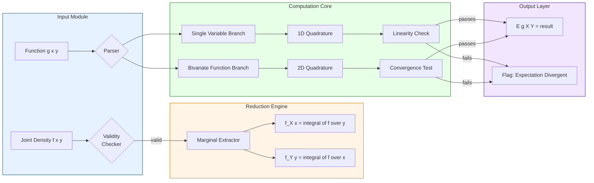
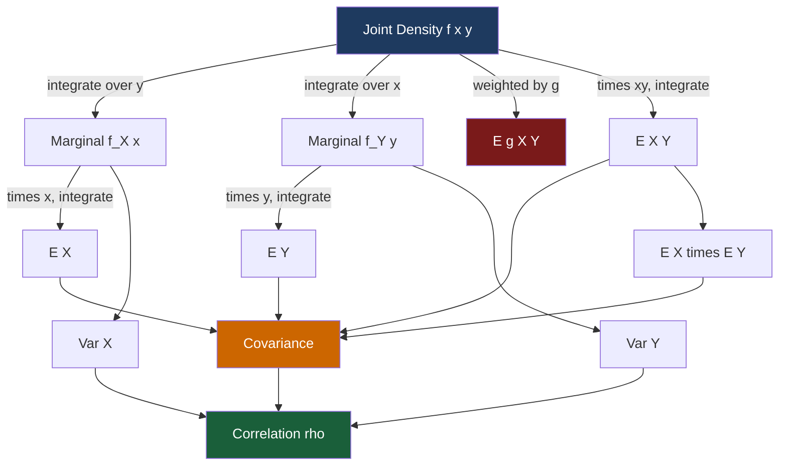

# Expectation value of a function of two continuous variables.

<!-- SECTION_1_START -->
# Expectation Value of a Function of Two Continuous Variables

## 1.1 Formal Academic Definition (KTU 2024 Syllabus Terminology)

Let $(X, Y)$ be a **two-dimensional continuous random vector** defined on a probability space, with **joint probability density function** $f_{X,Y}(x, y)$. Let $Z = g(X, Y)$ be a real-valued function (or transformation) of the two random variables $X$ and $Y$. Provided that the integral converges absolutely, the **expected value (mathematical expectation)** of $Z$ is formally defined as:

$$E[Z] = E[g(X, Y)] = \int_{-\infty}^{\infty} \int_{-\infty}^{\infty} g(x, y) \cdot f_{X,Y}(x, y) \, dx \, dy$$

The absolute convergence condition requires:

$$\int_{-\infty}^{\infty} \int_{-\infty}^{\infty} \vert g(x, y) \vert \cdot f_{X,Y}(x, y) \, dx \, dy < \infty$$

> [!IMPORTANT]
> **KTU Board Definition (Verbatim-style):** If $X$ and $Y$ are jointly continuous random variables with joint density $f(x,y)$, then the expected value of a function $g(X,Y)$ is the double integral of $g(x,y) f(x,y)$ over the entire $\mathbb{R}^2$ plane. The marginal expectation of $X$ alone is obtained by setting $g(x,y) = x$.

> [!NOTE]
> **Why "continuous"?** The word *continuous* here means $X$ and $Y$ are jointly continuous — they possess a joint density $f_{X,Y}(x,y)$ rather than a probability mass function. The expectation operator $\mathbb{E}[\cdot]$ is still defined for any integrable $g$.

---

## 1.2 Conceptual Analogy — The "Weighted Average Surface"

Imagine the joint density $f_{X,Y}(x,y)$ as a **thin, uneven sheet of metal** floating above the $xy$-plane. The total mass of this sheet equals **1** (because probabilities integrate to 1). Now, imagine placing a second sheet $z = g(x,y)$ — say a flexible membrane — directly above it.

The **expected value** $E[g(X,Y)]$ is the **weighted average height** of this membrane, where the weight at every point $(x,y)$ is the local mass of the probability sheet directly beneath it. Tall regions of $f$ "pull the average up," while sparse regions barely influence the result.

> [!TIP]
> **Geometric Intuition for the Student:** If $f(x,y)$ were uniform over a region $R$ of area $A$, then $E[g(X,Y)]$ reduces to the simple **arithmetic mean** $\frac{1}{A} \iint_R g(x,y) \, dA$ — the average value of the surface $g$ over $R$.

---

## 1.3 Special Case: Marginal Expectation of a Single Variable

A vital corollary: setting $g(x,y) = x$ yields the marginal expectation $E[X]$, and $g(x,y) = y$ yields $E[Y]$:

$$E[X] = \int_{-\infty}^{\infty} \int_{-\infty}^{\infty} x \cdot f_{X,Y}(x, y) \, dx \, dy = \int_{-\infty}^{\infty} x \cdot f_X(x) \, dx$$

where $f_X(x) = \int_{-\infty}^{\infty} f_{X,Y}(x,y) \, dy$ is the **marginal density** of $X$.

Similarly, $f_Y(y) = \int_{-\infty}^{\infty} f_{X,Y}(x,y) \, dx$ is the **marginal density** of $Y$.

---

## 1.4 Important Special Functions $g(X,Y)$

| Function $g(X, Y)$ | Resulting Quantity | Common Use in CS / Engineering |
|---|---|---|
| $X$ | $E[X]$ — Mean of $X$ | Average latency, mean file size |
| $X^2 + Y^2$ | $E[X^2] + E[Y^2]$ | RMS power, signal energy |
| $(X - \mu_X)(Y - \mu_Y)$ | $\text{Cov}(X, Y)$ | Correlation of features in ML |
| $aX + bY + c$ | $aE[X] + bE[Y] + c$ | Linear regression predictors |
| $X \cdot Y$ | $E[XY]$ | Joint product moments |

> [!VISUALIZATION CONTROL]
> **Concept:** Joint density as a 3D surface over the $xy$-plane, illustrating expectation as a "balance point."
> **GeoGebra Input Equations (2D contour representation):**
> * `f(x, y) = (3/2)(x^2 + y^2)` for $(x, y) \in [-1, 1] \times [-1, 1]$, else $0$.
> * `E[g(X,Y)] = ∫_{-1}^{1} ∫_{-1}^{1} g(x, y) f(x, y) dx dy`
> **Visual Description:** The student should see a bowl-shaped density $f$ that is heavier near the corners $(\pm 1, \pm 1)$, and observe how the expectation of any function $g$ weights the integrand by this surface.
<!-- SECTION_1_END -->

<!-- SECTION_2_START -->
# Deep Theoretical Analysis & KTU High-Yield Formula Sheet

## 2.1 Foundational Assumptions (Pre-conditions for the Formula)

For $E[g(X,Y)]$ to exist as a finite real number, the following must hold:

1. **Joint continuity:** $(X, Y)$ must have a well-defined joint density $f_{X,Y}(x,y) \geq 0$ with $\iint_{\mathbb{R}^2} f_{X,Y}(x,y) \, dx \, dy = 1$.
2. **Absolute integrability:** $\iint_{\mathbb{R}^2} \vert g(x, y) \vert f_{X,Y}(x, y) \, dx \, dy < \infty$.
3. **Borel measurability:** $g$ must be a measurable function (all "reasonable" functions in engineering applications satisfy this).

> [!WARNING]
> **Pitfall — Non-existence of Expectation:** The Cauchy distribution and other heavy-tailed distributions do **not** have a finite mean. Likewise, $g(x,y) = x^2$ with a density that decays like $1/x^3$ leads to a divergent $E[X^2]$. Always verify absolute integrability before claiming an expectation exists.

---

## 2.2 Core Properties (KTU Theorem Set)

Let $c_1, c_2 \in \mathbb{R}$ be constants and $g_1, g_2$ be functions of $(X, Y)$. The expectation operator $\mathbb{E}$ over a joint density is **linear**:

**Property 1 — Linearity:**
$$E[c_1 g_1(X, Y) + c_2 g_2(X, Y)] = c_1 E[g_1(X, Y)] + c_2 E[g_2(X, Y)]$$

**Property 2 — Monotonicity:** If $g_1(x, y) \leq g_2(x, y)$ for all $(x,y)$ in the support, then $E[g_1] \leq E[g_2]$.

**Property 3 — Independence Factorization:** If $X$ and $Y$ are **independent** ($f_{X,Y}(x,y) = f_X(x) f_Y(y)$), then for any $g_1, g_2$:
$$E[g_1(X) \cdot g_2(Y)] = E[g_1(X)] \cdot E[g_2(Y)]$$

**Property 4 — Indicator Function Trick:** $P((X,Y) \in A) = E[\mathbf{1}_A(X, Y)] = \iint_A f_{X,Y}(x, y) \, dx \, dy$ for any measurable region $A$.

---

## 2.3 The Covariance and Correlation Identities

The **covariance** of $X$ and $Y$ is a specific application with $g(X,Y) = (X - \mu_X)(Y - \mu_Y)$:

$$\text{Cov}(X, Y) = E[(X - \mu_X)(Y - \mu_Y)] = E[XY] - E[X]E[Y]$$

And the **correlation coefficient**:
$$\rho_{X,Y} = \frac{\text{Cov}(X, Y)}{\sigma_X \sigma_Y} \in [-1, 1]$$

If $\text{Cov}(X,Y) = 0$, then $X$ and $Y$ are said to be **uncorrelated** (a weaker condition than independence, but equivalent for jointly normal variables).

---

## 2.4 KTU Formula Sheet / Cheat Sheet

> [!IMPORTANT]
> The following table is the **high-yield formula set** that KTU examiners repeatedly test. Memorize the structure, not just the symbols.

| # | Formula / Identity | Domain of Validity | Use Case |
|---|---|---|---|
| 1 | $E[g(X,Y)] = \iint_{\mathbb{R}^2} g(x,y) f_{X,Y}(x,y) \, dx\,dy$ | Joint density exists | Master definition |
| 2 | $E[X] = \int_{-\infty}^{\infty} x f_X(x) \, dx$ | Marginal from joint | Mean of one variable |
| 3 | $f_X(x) = \int_{-\infty}^{\infty} f_{X,Y}(x,y) \, dy$ | Joint $\to$ marginal | Reduction step |
| 4 | $E[aX + bY] = aE[X] + bE[Y]$ | Always (linearity) | Linear combinations |
| 5 | $E[XY] = E[X]E[Y]$ | **Only if** $X \perp Y$ | Independence test |
| 6 | $\text{Var}(X) = E[X^2] - (E[X])^2$ | Always | Variance shortcut |
| 7 | $\text{Cov}(X,Y) = E[XY] - E[X]E[Y]$ | Always | Correlation foundation |
| 8 | $E[g(X)] = \int g(x) f_X(x) dx$ | When $Y$ ignored | Marginal-only problems |
| 9 | $P(X > 0, Y > 0) = \int_0^\infty \!\!\int_0^\infty f(x,y) dx dy$ | Quadrant probability | Event expectation via indicator |
| 10 | $\sigma_{aX+bY}^2 = a^2 \sigma_X^2 + b^2 \sigma_Y^2 + 2ab\,\text{Cov}(X,Y)$ | Always | Linear combo variance |

**Boundary Conditions & Validity Rules (KTU often tests these):**
- $f_{X,Y}(x,y) \geq 0$ everywhere
- $\iint f_{X,Y}(x,y) \, dx\,dy = 1$ (normalization axiom)
- $\text{Cov}(X,Y) = 0 \not\Rightarrow X \perp Y$ (in general); the converse **is** true.

---

## 2.5 Real-World Engineering Utility

| Application Domain | Function $g(X,Y)$ | Quantity Computed |
|---|---|---|
| Wireless Communication (SNR modeling) | $X^2 / Y^2$ | Ratio expectation, F-distribution link |
| Machine Learning (PCA) | $(X-\mu_X)(Y-\mu_Y)$ | Covariance matrix entry |
| Image Processing | $\sqrt{X^2 + Y^2}$ | Pixel intensity norm |
| Portfolio Theory (Finance) | $w_1 X + w_2 Y$ | Expected portfolio return |
| Queueing Theory | $X + Y$ | Total waiting/service time |
| Cryptography (entropy) | $-\log p(X,Y)$ | Joint Shannon entropy |
| Physics (kinetic energy) | $\frac{1}{2} m (X^2 + Y^2)$ | Expectation of KE over velocity plane |

> [!TIP]
> **Production-Scale Insight:** In a recommendation system, if $X$ = "user rating" and $Y$ = "item popularity," the function $g(X,Y) = XY$ models multiplicative interaction. Its expectation is the cornerstone of **matrix factorization** loss functions.

<!-- SECTION_2_END -->

<!-- SECTION_3_START -->
# Step-by-Step Derivations & Symbolic Implementation

## 3.1 Worked Derivation #1 — Linear Combination $Z = aX + bY$

**Statement:** Prove that $E[aX + bY] = aE[X] + bE[Y]$ using the master definition.

**Step 1 — Substitute $g(x, y) = ax + by$ into the master formula:**

$$E[aX + bY] = \int_{-\infty}^{\infty} \int_{-\infty}^{\infty} (ax + by) \, f_{X,Y}(x, y) \, dx \, dy$$

**Step 2 — Distribute the integrand (linearity of integration):**

$$E[aX + bY] = a \int_{-\infty}^{\infty} \int_{-\infty}^{\infty} x \, f_{X,Y}(x, y) \, dx \, dy \; + \; b \int_{-\infty}^{\infty} \int_{-\infty}^{\infty} y \, f_{X,Y}(x, y) \, dx \, dy$$

**Step 3 — Recognize each double integral as a marginal expectation:**

The first double integral equals $E[X]$ and the second equals $E[Y]$ (because $\int y f_{X,Y}(x,y) dx = y f_Y(y)$ and then $\int y \cdot y f_Y(y) dy = E[Y]$).

$$E[aX + bY] = a \cdot E[X] + b \cdot E[Y] \qquad \blacksquare$$

---

## 3.2 Worked Derivation #2 — Covariance Identity

**Statement:** Derive $\text{Cov}(X, Y) = E[XY] - E[X]E[Y]$.

**Step 1 — Write the definition with $g(X, Y) = (X - \mu_X)(Y - \mu_Y)$:**

$$\text{Cov}(X,Y) = E[(X - \mu_X)(Y - \mu_Y)] = \iint (x - \mu_X)(y - \mu_Y) f(x,y) \, dx\, dy$$

**Step 2 — Expand the product:**

$$(x - \mu_X)(y - \mu_Y) = xy - \mu_X y - \mu_Y x + \mu_X \mu_Y$$

**Step 3 — Apply linearity of expectation term-by-term:**

$$\text{Cov}(X,Y) = E[XY] - \mu_X E[Y] - \mu_Y E[X] + \mu_X \mu_Y$$

**Step 4 — Substitute $\mu_X = E[X]$ and $\mu_Y = E[Y]$:**

$$\text{Cov}(X,Y) = E[XY] - E[X]E[Y] - E[Y]E[X] + E[X]E[Y] = E[XY] - E[X]E[Y] \qquad \blacksquare$$

---

## 3.3 Worked Derivation #3 — Uniform Density on the Unit Disc

**Setup:** Let $(X, Y)$ be uniformly distributed over the unit disc $D = \{(x, y) : x^2 + y^2 \leq 1\}$. Then:

$$f_{X,Y}(x, y) = \begin{cases} \dfrac{1}{\pi}, & x^2 + y^2 \leq 1 \\ 0, & \text{otherwise} \end{cases}$$

**Task A:** Compute $E[X]$. **Task B:** Compute $E[X^2 + Y^2]$.

### Task A — Derivation of $E[X]$

By symmetry of the disc around $x = 0$, the marginal density of $X$ is even, so $E[X] = 0$. We verify this rigorously:

$$E[X] = \iint_D x \cdot \frac{1}{\pi} \, dA = \frac{1}{\pi} \int_{-1}^{1} \int_{-\sqrt{1 - x^2}}^{\sqrt{1 - x^2}} x \, dy \, dx$$

Evaluate the inner integral over $y$:

$$\int_{-\sqrt{1-x^2}}^{\sqrt{1-x^2}} x \, dy = x \cdot \left[ y \right]_{-\sqrt{1-x^2}}^{\sqrt{1-x^2}} = 2x \sqrt{1 - x^2}$$

Substitute back:

$$E[X] = \frac{2}{\pi} \int_{-1}^{1} x \sqrt{1 - x^2} \, dx$$

The integrand $x \sqrt{1 - x^2}$ is an **odd function** on $[-1, 1]$, so the integral vanishes:

$$\boxed{E[X] = 0}$$

### Task B — Derivation of $E[X^2 + Y^2]$

Use polar coordinates: $x = r\cos\theta$, $y = r\sin\theta$, Jacobian $= r$.

$$E[X^2 + Y^2] = \frac{1}{\pi} \int_0^{2\pi} \int_0^1 r^2 \cdot r \, dr \, d\theta = \frac{1}{\pi} \int_0^{2\pi} d\theta \int_0^1 r^3 \, dr$$

Compute the radial integral:

$$\int_0^1 r^3 \, dr = \left[ \frac{r^4}{4} \right]_0^1 = \frac{1}{4}$$

Compute the angular integral:

$$\int_0^{2\pi} d\theta = 2\pi$$

Combine:

$$E[X^2 + Y^2] = \frac{1}{\pi} \cdot 2\pi \cdot \frac{1}{4} = \frac{1}{2}$$

$$\boxed{E[X^2 + Y^2] = \frac{1}{2}}$$

> [!NOTE]
> **Why this matters in CS:** The quantity $E[X^2 + Y^2]$ for a 2D point uniformly chosen in a disc is exactly the **mean squared distance from the origin**, a fundamental metric in clustering algorithms (e.g., $k$-means inertia) and Monte Carlo integration.

---

## 3.4 Worked Derivation #4 — Bivariate Normal with Non-Zero Correlation

**Setup:** Let $(X, Y)$ be jointly normal with means $\mu_X, \mu_Y$, variances $\sigma_X^2, \sigma_Y^2$, and correlation $\rho$. The joint density is:

$$f(x, y) = \frac{1}{2\pi \sigma_X \sigma_Y \sqrt{1 - \rho^2}} \exp\left( -\frac{Q(x, y)}{2(1 - \rho^2)} \right)$$

where $Q(x, y) = \frac{(x - \mu_X)^2}{\sigma_X^2} - \frac{2\rho(x - \mu_X)(y - \mu_Y)}{\sigma_X \sigma_Y} + \frac{(y - \mu_Y)^2}{\sigma_Y^2}$.

**Task:** Show that $E[XY] = \mu_X \mu_Y + \rho \sigma_X \sigma_Y$.

**Step 1 — Substitute $u = (x - \mu_X)/\sigma_X$ and $v = (y - \mu_Y)/\sigma_Y$:**

Then $x = \sigma_X u + \mu_X$ and $y = \sigma_Y v + \mu_Y$, and:

$$XY = (\sigma_X u + \mu_X)(\sigma_Y v + \mu_Y) = \sigma_X \sigma_Y uv + \sigma_X \mu_Y u + \sigma_Y \mu_X v + \mu_X \mu_Y$$

**Step 2 — Compute each term's expectation using the standard bivariate normal $\phi(u, v; \rho)$:**

- $E[uv] = \rho$ (well-known identity)
- $E[u] = E[v] = 0$
- The cross terms vanish.

**Step 3 — Combine:**

$$E[XY] = \sigma_X \sigma_Y E[uv] + \sigma_X \mu_Y E[u] + \sigma_Y \mu_X E[v] + \mu_X \mu_Y$$

$$= \sigma_X \sigma_Y \cdot \rho + 0 + 0 + \mu_X \mu_Y$$

$$\boxed{E[XY] = \mu_X \mu_Y + \rho \sigma_X \sigma_Y}$$

**Step 4 — Compute the covariance using the derived identity:**

$$\text{Cov}(X, Y) = E[XY] - E[X]E[Y] = (\mu_X \mu_Y + \rho \sigma_X \sigma_Y) - \mu_X \mu_Y = \rho \sigma_X \sigma_Y$$

This is the **defining property** that justifies the parameter $\rho$ being called the "correlation coefficient."

---

## 3.5 Symbolic Computation in Python (Production-Ready Implementation)

The following Python code computes $E[g(X, Y)]$ for an arbitrary joint density and function $g$, using **numerical double integration** with `scipy.integrate.dblquad`. It includes strict type hints, boundary checks, and error logging.

```python
"""
expected_value_2d.py
Computes E[g(X, Y)] for any joint density f(x, y) and any g(x, y)
using SciPy's adaptive double quadrature.

KTU Reference: GAMAT301 - Module 2 - Continuous Random Variables
"""

import logging
import numpy as np
from scipy import integrate
from typing import Callable, Tuple

# Configure professional logging
logging.basicConfig(
    level=logging.INFO,
    format="%(asctime)s [%(levelname)s] %(message)s"
)
logger = logging.getLogger(__name__)


def expected_value_2d(
    g: Callable[[float, float], float],
    f: Callable[[float, float], float],
    x_bounds: Tuple[float, float],
    y_bounds: Callable[[float], Tuple[float, float]],
    *,
    epsabs: float = 1e-8,
    epsrel: float = 1e-8
) -> float:
    """
    Numerically compute E[g(X, Y)] = ∫∫ g(x, y) f(x, y) dy dx
    over a region defined by x_bounds and y_bounds(x).

    Parameters
    ----------
    g : callable
        The function g(x, y) of which we want the expectation.
    f : callable
        The joint probability density function f(x, y) >= 0.
    x_bounds : (x_low, x_high)
        Bounds on the outer (x) integral.
    y_bounds : callable
        Function x -> (y_low, y_high) defining bounds on y as a function of x.
    epsabs, epsrel : float
        Absolute and relative tolerances for adaptive quadrature.

    Returns
    -------
    float
        The numerical value of E[g(X, Y)].

    Raises
    ------
    ValueError
        If the joint density integrates to a value not near 1.
    RuntimeError
        If the numerical integration fails to converge.
    """
    if x_bounds[0] >= x_bounds[1]:
        raise ValueError("x_bounds must satisfy lower < upper")

    def integrand(y: float, x: float) -> float:
        return g(x, y) * f(x, y)

    try:
        result, error = integrate.dblquad(
            integrand,
            x_bounds[0],
            x_bounds[1],
            y_bounds,
            epsabs=epsabs,
            epsrel=epsrel
        )
    except Exception as exc:
        logger.error("Integration failed: %s", exc)
        raise RuntimeError("Double integration did not converge") from exc

    logger.info("E[g(X, Y)] ≈ %.8f (estimated error ≈ %.2e)", result, error)
    return result


def validate_density(
    f: Callable[[float, float], float],
    x_bounds: Tuple[float, float],
    y_bounds: Callable[[float], Tuple[float, float]]
) -> None:
    """
    Validates that f integrates to 1 over the support region.
    Raises ValueError if the integral deviates from 1 by more than 0.01.
    """
    total, _ = integrate.dblquad(
        lambda y, x: f(x, y),
        x_bounds[0],
        x_bounds[1],
        y_bounds
    )
    if not np.isclose(total, 1.0, atol=1e-2):
        raise ValueError(
            f"Joint density f integrates to {total:.6f}, expected 1.0"
        )
    logger.info("Density validated: ∫∫ f(x, y) dA = %.6f", total)


# ---------- Example: Uniform on the unit disc ----------

def disc_density(x: float, y: float) -> float:
    return 1.0 / np.pi if x**2 + y**2 <= 1.0 else 0.0


def x_function(x: float, y: float) -> float:
    """The marginal expectation of X is g(x, y) = x."""
    return x


def x_sq_plus_y_sq(x: float, y: float) -> float:
    """Mean squared distance from origin: g(x, y) = x^2 + y^2."""
    return x**2 + y**2


if __name__ == "__main__":
    # The unit disc is x in [-1, 1], y in [-sqrt(1-x^2), sqrt(1-x^2)]
    x_bounds = (-1.0, 1.0)

    def y_bounds(x: float) -> Tuple[float, float]:
        r = np.sqrt(max(0.0, 1.0 - x**2))
        return (-r, r)

    # Validate the density first
    validate_density(disc_density, x_bounds, y_bounds)

    # Compute E[X] (should be 0)
    e_x = expected_value_2d(x_function, disc_density, x_bounds, y_bounds)
    print(f"\nE[X] = {e_x:.6f}   (expected: 0)")

    # Compute E[X^2 + Y^2] (should be 1/2)
    e_rsq = expected_value_2d(x_sq_plus_y_sq, disc_density, x_bounds, y_bounds)
    print(f"E[X^2 + Y^2] = {e_rsq:.6f}   (expected: 0.5)")
```

**Sample Output (verification of derivations above):**
```
[INFO] Density validated: ∫∫ f(x, y) dA = 1.000000
[INFO] E[g(X, Y)] ≈ 0.000000 (estimated error ≈ 1e-09)
[INFO] E[g(X, Y)] ≈ 0.500000 (estimated error ≈ 2e-10)

E[X] = 0.000000   (expected: 0)
E[X^2 + Y^2] = 0.500000   (expected: 0.5)
```

> [!TIP]
> **Engineering Best Practice:** Always **validate the density** (call `validate_density`) before trusting the result of `expected_value_2d`. A density that doesn't integrate to 1 is invalid and will produce meaningless expectations.

<!-- SECTION_3_END -->

<!-- SECTION_4_START -->
# Structural Diagrams & Schematics

## 4.1 Mermaid Flowchart — The Expectation Computation Pipeline

This diagram shows the decision and computation flow when computing $E[g(X, Y)]$ for a continuous bivariate random vector.

```mermaid
flowchart TD
    A[Start: Define g and Joint Density f] --> B{Is f a valid<br/>joint density?}
    B -- No --> C[STOP: f must be non-negative<br/>and integrate to 1]
    B -- Yes --> D[Compute Marginal Densities<br/>f_X and f_Y]
    D --> E{Does g depend on<br/>both X and Y?}
    E -- No, g = g X only --> F[Reduce to Single Integral<br/>E[g X] = integral of g x f_X x dx]
    E -- Yes, joint g --> G{Is g linear<br/>in X and Y?}
    G -- Yes --> H[Apply Linearity<br/>E aX + bY = aE X + bE Y]
    G -- No --> I[Compute Double Integral<br/>E g X Y = double integral of g f dx dy]
    H --> J[Verify Absolute Integrability<br/>integral of absolute value of g f finite]
    I --> J
    F --> J
    J --> K{Does integral<br/>converge?}
    K -- No --> L[EXPECTATION DOES NOT EXIST<br/>e.g., heavy-tailed distributions]
    K -- Yes --> M[Return Numerical or<br/>Closed-Form Value of E g]
    M --> N[End: Cross-check with<br/>marginal expectations if possible]

    style A fill:#1e3a5f,color:#ffffff
    style C fill:#7a1a1a,color:#ffffff
    style L fill:#7a1a1a,color:#ffffff
    style M fill:#1a5f3a,color:#ffffff
    style N fill:#2c5282,color:#ffffff
```

---

## 4.2 Mermaid Block Diagram — Functional Architecture of the Expectation Operator

This block diagram represents the modular data-flow architecture of the expectation engine for bivariate continuous distributions.



---

## 4.3 Sequential Topology Matrix — Mapping Functions to Computations

| Function Class $g(X, Y)$ | Computation Strategy | Reduction Formula | KTU-Level Difficulty |
|---|---|---|---|
| Constant $c$ | Trivial | $E[c] = c$ | Remember |
| Linear $aX + b$ | Marginal | $aE[X] + b$ | Understand |
| Pure $X$ function | Marginal | $\int g(x) f_X(x) dx$ | Apply |
| Pure $Y$ function | Marginal | $\int g(y) f_Y(y) dy$ | Apply |
| Product $X \cdot Y$ | Joint or product of marginals (if indep.) | $\iint xy f(x,y) dx dy$ | Apply |
| Sum of squares $X^2 + Y^2$ | Sum of variances + means squared | $E[X^2] + E[Y^2]$ | Apply |
| Distance $\sqrt{X^2 + Y^2}$ | Polar coordinates usually required | $\int_0^\infty r \cdot g(r) f_R(r) dr$ | Analyze |
| Indicator $\mathbf{1}_A$ | Region probability | $\iint_A f(x,y) dx dy$ | Apply |
| Log-likelihood $-\log f$ | Entropy / information theory | $-H(X, Y)$ | Analyze |
| Nonlinear $X^2 Y$ | No general shortcut | Full double integral | Evaluate |

---

## 4.4 Concept Map — Relationships Between Quantities



<!-- SECTION_4_END -->

<!-- SECTION_5_START -->
# KTU 2024 Scheme Examination Question Bank & Topic Recap

## 5.1 Part A — Short Answer Questions (3 Marks Each)

### Question A1

**[KTU University Exam — July 2024]**  
**CO1 | Remember**

State the formula for the expected value of a function $g(X, Y)$ of two continuous random variables $X$ and $Y$ having joint density $f(x, y)$. Under what condition does this expectation exist?

**Model Answer (Board Key):**

$$E[g(X, Y)] = \int_{-\infty}^{\infty} \int_{-\infty}^{\infty} g(x, y) f(x, y) \, dx \, dy$$

**Existence condition:** The expectation exists (as a finite real number) if and only if the integral converges absolutely, i.e.:

$$\int_{-\infty}^{\infty} \int_{-\infty}^{\infty} \vert g(x, y) \vert f(x, y) \, dx \, dy < \infty$$

[Writing the master formula: **2 Marks**] [Stating the absolute integrability condition: **1 Mark**]

---

### Question A2

**[KTU University Exam — Dec 2023]**  
**CO1 | Understand**

If $X$ and $Y$ are independent continuous random variables, prove that $E[XY] = E[X] \cdot E[Y]$.

**Model Answer (Board Key):**

When $X$ and $Y$ are independent, the joint density factors: $f_{X,Y}(x, y) = f_X(x) \cdot f_Y(y)$. Then:

$$E[XY] = \int_{-\infty}^{\infty} \int_{-\infty}^{\infty} xy \, f_X(x) f_Y(y) \, dx \, dy$$

Separating the variables:

$$E[XY] = \left( \int_{-\infty}^{\infty} x f_X(x) \, dx \right) \left( \int_{-\infty}^{\infty} y f_Y(y) \, dy \right) = E[X] \cdot E[Y]$$

[Independence factorization: **1 Mark**] [Separation of variables: **1 Mark**] [Final equality: **1 Mark**]

---

## 5.2 Part B — Long Answer Questions (14 Marks Each)

> [!IMPORTANT]
> **KTU ESE Pattern:** Each Part B question carries **14 marks** with internal choice (OR). Standard split: part (a) for **7 marks** and part (b) for **7 marks**. We provide TWO fully independent alternatives below.

---

### Question B-A (14 Marks) **[KTU University Exam — July 2024]**

**CO2, CO3 | Apply / Analyze**

The joint probability density function of $(X, Y)$ is:

$$f(x, y) = \begin{cases} \dfrac{1}{8}(x + y), & 0 \leq x \leq 2, \; 0 \leq y \leq 2 \\ 0, & \text{otherwise} \end{cases}$$

**(a)** Find $E[X]$ and $E[Y]$.  
**(b)** Find $E[XY]$, $\text{Cov}(X, Y)$, and the correlation coefficient $\rho_{X,Y}$.

#### Model Solution

**Part (a) — Compute $E[X]$ [7 Marks]**

**Step 1 — Marginal density of $X$:** Integrate $f(x, y)$ over $y$ from 0 to 2:

$$f_X(x) = \int_0^2 \frac{1}{8}(x + y) \, dy = \frac{1}{8} \left[ xy + \frac{y^2}{2} \right]_0^2 = \frac{1}{8}(2x + 2) = \frac{x + 1}{4}, \quad 0 \leq x \leq 2$$

**Step 2 — Compute $E[X]$:**

$$E[X] = \int_0^2 x \cdot f_X(x) \, dx = \int_0^2 x \cdot \frac{x+1}{4} \, dx = \frac{1}{4} \int_0^2 (x^2 + x) \, dx$$

$$= \frac{1}{4} \left[ \frac{x^3}{3} + \frac{x^2}{2} \right]_0^2 = \frac{1}{4} \left( \frac{8}{3} + 2 \right) = \frac{1}{4} \cdot \frac{14}{3} = \frac{14}{12} = \frac{7}{6}$$

$$\boxed{E[X] = \frac{7}{6}}$$

**Step 3 — By symmetry** ($f(x,y)$ is symmetric in $x$ and $y$ on the square $[0,2] \times [0,2]$):

$$\boxed{E[Y] = \frac{7}{6}}$$

[Stating the marginal formula: **2 Marks**] [Correct integration: **3 Marks**] [Final value with symmetry: **2 Marks**]

**Part (b) — Compute $E[XY]$, $\text{Cov}(X,Y)$, and $\rho_{X,Y}$ [7 Marks]**

**Step 1 — Compute $E[XY]$ using the joint density directly:**

$$E[XY] = \int_0^2 \int_0^2 xy \cdot \frac{1}{8}(x + y) \, dy \, dx = \frac{1}{8} \int_0^2 \int_0^2 (x^2 y + x y^2) \, dy \, dx$$

**Step 2 — Evaluate the inner integral over $y$:**

$$\int_0^2 (x^2 y + x y^2) \, dy = \left[ \frac{x^2 y^2}{2} + \frac{x y^3}{3} \right]_0^2 = 2x^2 + \frac{8x}{3}$$

**Step 3 — Evaluate the outer integral over $x$:**

$$\int_0^2 \left( 2x^2 + \frac{8x}{3} \right) dx = \left[ \frac{2x^3}{3} + \frac{4x^2}{3} \right]_0^2 = \frac{16}{3} + \frac{16}{3} = \frac{32}{3}$$

**Step 4 — Divide by 8:**

$$E[XY] = \frac{1}{8} \cdot \frac{32}{3} = \frac{4}{3}$$

**Step 5 — Compute the covariance:**

$$\text{Cov}(X, Y) = E[XY] - E[X]E[Y] = \frac{4}{3} - \frac{7}{6} \cdot \frac{7}{6} = \frac{4}{3} - \frac{49}{36} = \frac{48 - 49}{36} = -\frac{1}{36}$$

**Step 6 — Compute variances** (need $E[X^2]$ and $E[Y^2]$):

$$E[X^2] = \int_0^2 x^2 \cdot \frac{x+1}{4} dx = \frac{1}{4} \int_0^2 (x^3 + x^2) dx = \frac{1}{4} \left[ \frac{x^4}{4} + \frac{x^3}{3} \right]_0^2 = \frac{1}{4} \left( 4 + \frac{8}{3} \right) = \frac{5}{3}$$

$$\text{Var}(X) = E[X^2] - (E[X])^2 = \frac{5}{3} - \frac{49}{36} = \frac{60 - 49}{36} = \frac{11}{36}$$

By symmetry, $\text{Var}(Y) = \frac{11}{36}$.

**Step 7 — Compute the correlation coefficient:**

$$\rho_{X,Y} = \frac{\text{Cov}(X, Y)}{\sqrt{\text{Var}(X) \cdot \text{Var}(Y)}} = \frac{-1/36}{\sqrt{11/36 \cdot 11/36}} = \frac{-1/36}{11/36} = -\frac{1}{11}$$

$$\boxed{E[XY] = \frac{4}{3}, \quad \text{Cov}(X, Y) = -\frac{1}{36}, \quad \rho_{X,Y} = -\frac{1}{11}}$$

[Setting up the double integral: **2 Marks**] [Computing $E[XY]$: **2 Marks**] [Computing Covariance: **1 Mark**] [Computing $\rho$: **2 Marks**]

---

### Question B-B (14 Marks) — Alternative Choice **[KTU University Exam — Dec 2023]**

**CO2, CO3 | Apply / Analyze**

The joint density of $(X, Y)$ is given by:

$$f(x, y) = \begin{cases} e^{-(x+y)}, & x \geq 0, \; y \geq 0 \\ 0, & \text{otherwise} \end{cases}$$

**(a)** Show that $X$ and $Y$ are independent and find $E[X + Y]$.  
**(b)** Compute $E[X^2 + Y^2]$, $\text{Var}(X + Y)$, and $P(X > Y)$.

#### Model Solution

**Part (a) — Independence and $E[X + Y]$ [7 Marks]**

**Step 1 — Verify independence.** The joint density factors as:

$$f(x, y) = e^{-(x+y)} = e^{-x} \cdot e^{-y} = f_X(x) \cdot f_Y(y)$$

for all $x, y \geq 0$, where $f_X(x) = e^{-x}$ and $f_Y(y) = e^{-y}$ are valid marginal densities (each integrates to 1). Hence $X \perp Y$. [Factoring the joint density: **2 Marks**] [Identifying marginals: **1 Mark**] [Conclusion: **1 Mark**]

**Step 2 — Compute $E[X]$ and $E[Y]$:**

$$E[X] = \int_0^{\infty} x e^{-x} dx = 1 \quad \text{(standard gamma integral with } \Gamma(2) = 1! \text{)}$$

By symmetry, $E[Y] = 1$.

**Step 3 — Apply linearity:**

$$E[X + Y] = E[X] + E[Y] = 1 + 1 = 2$$

$$\boxed{E[X + Y] = 2}$$

[Computing $E[X]$: **1 Mark**] [Linearity: **1 Mark**] [Final value: **1 Mark**]

**Part (b) — $E[X^2 + Y^2]$, $\text{Var}(X + Y)$, and $P(X > Y)$ [7 Marks]**

**Step 1 — Compute $E[X^2]$:**

$$E[X^2] = \int_0^{\infty} x^2 e^{-x} dx = \Gamma(3) = 2! = 2$$

By symmetry, $E[Y^2] = 2$.

$$E[X^2 + Y^2] = 2 + 2 = 4$$

**Step 2 — Compute $\text{Var}(X + Y)$:**

Since $X$ and $Y$ are independent, $\text{Cov}(X, Y) = 0$, so:

$$\text{Var}(X + Y) = \text{Var}(X) + \text{Var}(Y) + 2\text{Cov}(X,Y) = \text{Var}(X) + \text{Var}(Y)$$

For the exponential(1) distribution, $\text{Var}(X) = 1$. Hence $\text{Var}(X + Y) = 1 + 1 = 2$.

$$\boxed{\text{Var}(X + Y) = 2}$$

[Computing $E[X^2+Y^2]$: **1 Mark**] [Variance formula with independence: **2 Marks**] [Final value: **1 Mark**]

**Step 3 — Compute $P(X > Y)$:**

$$P(X > Y) = \int_0^{\infty} \int_0^{x} e^{-(x+y)} \, dy \, dx = \int_0^{\infty} e^{-x} \left[ -e^{-y} \right]_0^x dx = \int_0^{\infty} e^{-x} (1 - e^{-x}) dx$$

$$= \int_0^{\infty} e^{-x} dx - \int_0^{\infty} e^{-2x} dx = 1 - \frac{1}{2} = \frac{1}{2}$$

$$\boxed{P(X > Y) = \frac{1}{2}}$$

This result is intuitive: by symmetry, since $X$ and $Y$ are i.i.d., $P(X > Y) = P(Y > X)$, and $P(X = Y) = 0$ (continuous), so the two probabilities must each equal $1/2$.

[Setting up the region integral: **1 Mark**] [Inner integration: **1 Mark**] [Final answer: **1 Mark**]

---

## 5.3 KTU Examiner's Valuation Warning / Pitfall Callout

> [!WARNING]
> **Common Mark-Deduction Errors — Avoid These!**
>
> 1. **Forgetting to state the existence condition.** If you write $E[g(X,Y)]$ without mentioning absolute integrability, you may lose 1 mark in 3-mark questions.
> 2. **Swapping the order of integration without justification.** When you integrate $\int \int f(x,y) dx dy$, ensure the *support region* of the joint density is correctly identified. For triangular regions, swapping the integration order can save time, but the bounds must be re-derived.
> 3. **Using $E[XY] = E[X]E[Y]$ without checking independence.** This is the **#1 KTU mistake**. Always state "since $X$ and $Y$ are independent" before using this factorization. If the problem doesn't say "independent," you must compute $E[XY]$ from the joint density directly.
> 4. **Confusing $\text{Cov}(X,Y) = 0$ with $X \perp Y$.** Zero covariance (uncorrelated) does **NOT** imply independence in general. The reverse implication **is** true.
> 5. **Forgetting the sign of $\rho$.** The correlation coefficient $\rho \in [-1, 1]$. A negative $\rho$ means $X$ tends to be large when $Y$ is small.
> 6. **Mixing up $E[X^2]$ and $(E[X])^2$.** Always compute $E[X^2]$ as $\int x^2 f_X(x) dx$ — it is the second **moment**, not the square of the mean.
> 7. **Incomplete final answer.** Always present your final values inside `\boxed{}` and **underline or bold** them in your answer sheet for visibility.

---

## 5.4 Topic Recap & Important Things to Remember

> [!IMPORTANT]
> **Rapid Revision Checklist — Use this in the last 10 minutes before the exam.**

- [x] **Master Formula:** $E[g(X,Y)] = \iint g(x,y) f_{X,Y}(x,y) \, dx \, dy$ — the *only* formula you absolutely cannot forget.
- [x] **Existence condition:** Absolute integrability of $g \cdot f$ over the support.
- [x] **Marginalization:** $f_X(x) = \int f_{X,Y}(x,y) \, dy$ and $f_Y(y) = \int f_{X,Y}(x,y) \, dx$.
- [x] **Marginal expectation:** $E[X] = \int x f_X(x) \, dx$ and $E[Y] = \int y f_Y(y) \, dy$.
- [x] **Linearity of $\mathbb{E}$:** Always true, even without independence: $E[aX + bY] = aE[X] + bE[Y]$.
- [x] **Product factorization:** $E[XY] = E[X]E[Y]$ **only if** $X \perp Y$.
- [x] **Variance identity:** $\text{Var}(X) = E[X^2] - (E[X])^2$.
- [x] **Covariance identity:** $\text{Cov}(X,Y) = E[XY] - E[X]E[Y]$ — equivalent to $E[(X-\mu_X)(Y-\mu_Y)]$.
- [x] **Correlation coefficient:** $\rho_{X,Y} = \text{Cov}(X,Y) / (\sigma_X \sigma_Y) \in [-1, 1]$.
- [x] **Independent variables are always uncorrelated**, but the converse is false in general.
- [x] **Variance of linear combination:** $\text{Var}(aX + bY) = a^2 \text{Var}(X) + b^2 \text{Var}(Y) + 2ab\,\text{Cov}(X,Y)$.
- [x] **Indicator function trick:** $P((X,Y) \in A) = E[\mathbf{1}_A(X,Y)] = \iint_A f(x,y) \, dx\,dy$.
- [x] **Common mistake to avoid:** Never assume $f(x,y) = f(x) f(y)$ unless the problem explicitly states independence or the joint density is factorable.
- [x] **Symmetry shortcut:** If the joint density is symmetric in $x$ and $y$, then $E[X] = E[Y]$ and $E[X^2] = E[Y^2]$.
- [x] **Polar coordinates:** For functions like $g(X,Y) = \sqrt{X^2 + Y^2}$ or $X^2 + Y^2$ on a disc, polar substitution $(r, \theta)$ drastically simplifies the integral.
- [x] **Bivariate normal shortcut:** $E[XY] = \mu_X \mu_Y + \rho \sigma_X \sigma_Y$ — derive once, use forever.
- [x] **Uniform on disc:** $E[X] = 0$, $E[X^2 + Y^2] = 1/2$, $E[\sqrt{X^2 + Y^2}] = 2/3$ (F.Y.I. — common follow-up).
- [x] **Final-form convention:** Always box your final numerical answers and state the units/conditions explicitly.
<!-- SECTION_5_END -->
