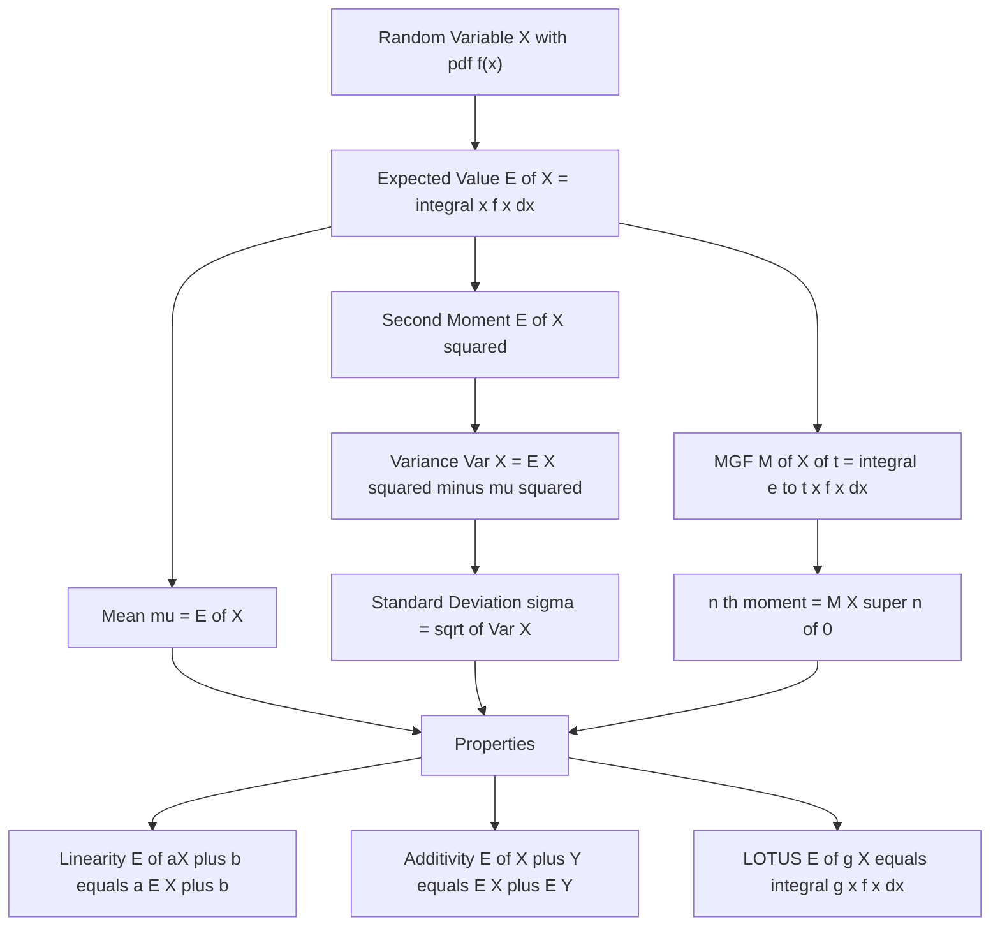
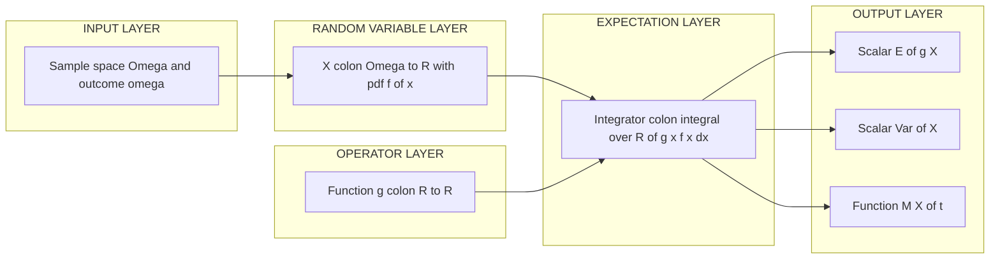
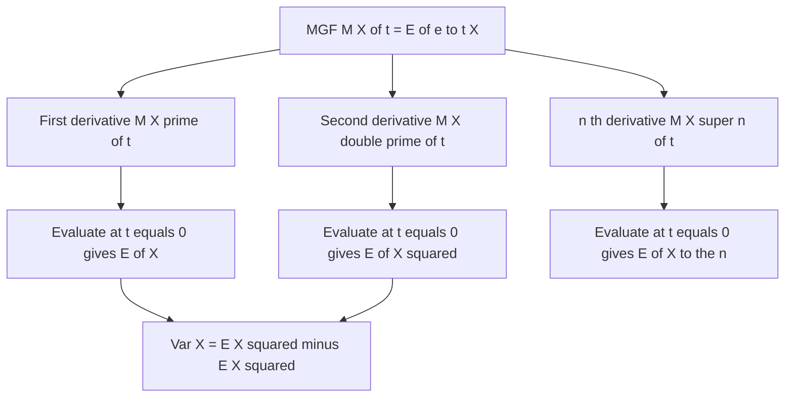
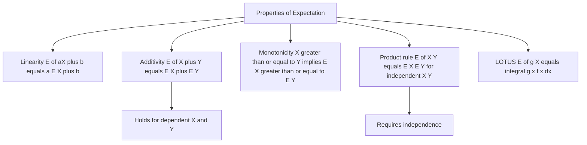

# Expectation

<!-- SECTION_1_START -->
# Expectation of Continuous Random Variables

## 1.1 Formal Academic Definition (KTU 2024 Syllabus Terminology)

> [!NOTE]
> **Definition — Expected Value of a Continuous Random Variable**
> Let $X$ be a continuous random variable with probability density function (pdf) $f(x)$. The **mathematical expectation** (or **expected value** or **mean**) of $X$, denoted by $E(X)$ or $\mu$, is defined as the integral of $x$ weighted by its density, provided the integral converges absolutely:
> $$E(X) = \int_{-\infty}^{\infty} x \, f(x) \, dx$$
> provided that $\int_{-\infty}^{\infty} \vert x \vert \, f(x) \, dx < \infty$. If the integral diverges, the expectation is said to **not exist**.

The requirement of *absolute convergence* is critical in KTU exam answers — merely writing the integral is incomplete; one must state the convergence condition.

## 1.2 Conceptual Analogy / Geometric Intuition

Imagine a thin, non-uniform wire stretched along the x-axis. The wire has density (mass per unit length) described by $f(x)$, and it sits on the horizontal axis. The **center of mass** (or balancing point) of this wire is exactly $E(X)$.

- If the density $f(x)$ is heavily concentrated on the right (large $x$ values), the balance point shifts rightward — the mean is large.
- If the density is symmetric about some point $c$, the balance point is exactly at $c$ — and indeed $E(X)=c$.

Another powerful intuition: $E(X)$ is the **long-run average** of $X$ if the random experiment is repeated infinitely many times. For example, if $X$ denotes the lifetime of a bulb, the expected lifetime is the average lifetime we would observe across an enormous population of identical bulbs.

> [!IMPORTANT]
> **KTU Syllabus Highlight — Key Constants / Parameters**
> - **Linearity constant**: $E(aX+b)=aE(X)+b$ for any constants $a,b\in \mathbb{R}$.
> - **Variance constant**: $Var(X) = E(X^2) - [E(X)]^2 \geq 0$.
> - **Standard deviation**: $\sigma_X = \sqrt{Var(X)}$, measured in the **same units** as $X$.

> [!VISUALIZATION CONTROL]
> **Concept:** Center-of-mass interpretation of $E(X)$ for a triangular pdf.
> **GeoGebra / Desmos Input Equations:**
> * $f(x) = \begin{cases} 0.5x & 0 \leq x \leq 2 \\ 0 & \text{otherwise} \end{cases}$
> * Shade area: $\int_0^x 0.5t \, dt$
> **Visual Description:** A triangular pdf rising linearly from $(0,0)$ to $(2,1)$. The vertical line $x=4/3 \approx 1.333$ marks the centroid (expected value), demonstrating the balance point of the shaded probability region.

<!-- SECTION_1_END -->

<!-- SECTION_2_START -->
# Deep Theoretical Analysis & KTU High-Yield Formula Sheet

## 2.1 The Operational Logic Behind Expectation

Expectation is fundamentally a **weighted average**, but unlike an ordinary average, the weights are *probabilities* (or more precisely, probability densities). The construction proceeds in three logical steps:

- **Step 1 — Discretization thought experiment:** Approximate $X$ by a discrete random variable $X_d$ that takes the value $x_i$ on a small interval of width $\Delta x$. The probability of that value is $f(x_i)\Delta x$.
- **Step 2 — Discrete average:** Compute $\sum x_i \cdot f(x_i)\Delta x$, which is the familiar discrete expected-value formula.
- **Step 3 — Passage to the limit:** As $\Delta x \to 0$, the Riemann sum becomes the integral $\int_{-\infty}^{\infty} x f(x) \, dx$. This is why the Riemann integral is the natural setting for continuous expectation.

> [!TIP]
> **The 'Why' behind the convergence condition:** The convergence condition $\int \vert x \vert f(x) dx < \infty$ ensures the **signed** average is not corrupted by cancellations of infinite positive and negative contributions. The Cauchy–Schwarz inequality implies that $E(X)$ exists $\Rightarrow$ $E(X^2)$ exists $\Rightarrow$ $Var(X)$ exists, which is a frequent board-exam linkage.

## 2.2 Generalization — Expected Value of a Function of $X$

For any Borel-measurable function $g:\mathbb{R} \to \mathbb{R}$, the expectation of the random variable $Y=g(X)$ is given by the **Law of the Unconscious Statistician (LOTUS)**:

$$E[g(X)] = \int_{-\infty}^{\infty} g(x) \, f(x) \, dx$$

This is enormously powerful because it lets us compute $E(Y)$ **without** first computing the pdf of $Y=g(X)$.

## 2.3 Variance, Moments, and the Moment Generating Function

- The **$n$-th moment** about the origin: $\mu_n^{\prime} = E(X^n) = \int_{-\infty}^{\infty} x^n f(x) \, dx$
- The **$n$-th central moment**: $\mu_n = E[(X-\mu)^n] = \int_{-\infty}^{\infty} (x-\mu)^n f(x) \, dx$
- In particular, $\mu_1^{\prime} = E(X) = \mu$ and $\mu_2 = Var(X) = \sigma^2$.
- The **Moment Generating Function (MGF)**: $M_X(t) = E(e^{tX}) = \int_{-\infty}^{\infty} e^{tx} f(x) \, dx$, defined for $t$ in a neighborhood of $0$.
- Moments can be recovered by differentiation: $E(X^n) = M_X^{(n)}(0)$.

## 2.4 KTU Formula Sheet / Cheat Sheet

> [!NOTE]
> **Master Formula Table for Expectation (Continuous Case)**

| # | Quantity | Formula | Convergence / Validity |
|---|----------|---------|------------------------|
| 1 | Expected value of $X$ | $E(X) = \int_{-\infty}^{\infty} x \, f(x) \, dx$ | Requires $\int \vert x \vert f(x) dx < \infty$ |
| 2 | Expectation of $g(X)$ (LOTUS) | $E[g(X)] = \int_{-\infty}^{\infty} g(x) \, f(x) \, dx$ | Same absolute-convergence condition on $g(x)$ |
| 3 | Linearity | $E(aX+b) = aE(X)+b$ | Always valid (constants may be outside) |
| 4 | Additivity (independent or not) | $E(X+Y) = E(X)+E(Y)$ | Always valid |
| 5 | Product (independent $X,Y$) | $E(XY)=E(X)E(Y)$ | Only when $X,Y$ independent |
| 6 | $n$-th moment (origin) | $\mu_n^{\prime} = \int_{-\infty}^{\infty} x^n f(x) \, dx$ | $\int \vert x \vert^n f(x) dx < \infty$ |
| 7 | $n$-th central moment | $\mu_n = \int_{-\infty}^{\infty} (x-\mu)^n f(x) \, dx$ | Same finiteness condition on $\vert x-\mu \vert^n$ |
| 8 | Variance (computational form) | $Var(X) = E(X^2) - [E(X)]^2$ | $\sigma^2 \geq 0$ |
| 9 | Standard deviation | $\sigma_X = \sqrt{Var(X)}$ | Units of $X$ |
| 10 | MGF definition | $M_X(t) = \int_{-\infty}^{\infty} e^{tx} f(x) \, dx$ | Exists in a neighborhood of $t=0$ |
| 11 | MGF-to-moment identity | $E(X^n) = M_X^{(n)}(0)$ | MGF exists in a nbhd. of $0$ |
| 12 | Mean of $aX+b$ via MGF | $M_{aX+b}(t) = e^{bt} M_X(at)$ | Useful for transformations |

> [!IMPORTANT]
> **Engineering Utility of Expectation**
> - In **signal processing**, $E(X)$ is the *DC component* (average signal level) and $Var(X)$ is the *average signal power* above the mean.
> - In **machine learning**, the *expected risk* $E[L(Y,f(X))]$ over data distribution is what we actually minimize; the training loss is a sample approximation of it.
> - In **queueing theory** and **reliability engineering**, $E(X)$ predicts average waiting/service times and average component lifetime.
> - In **finance**, the expected return $E(R)$ and standard deviation $\sigma_R$ are the classical mean-risk descriptors of an asset.

<!-- SECTION_2_END -->

<!-- SECTION_3_START -->
# Step-by-Step Derivations, Worked Examples, and Python Implementation

## 3.1 Derivation of the Variance Shortcut Formula $Var(X)=E(X^2)-[E(X)]^2$

This is a high-frequency derivation question in KTU exams. We must show every algebraic step explicitly.

$$Var(X) \;=\; E\bigl[(X-\mu)^2\bigr]$$

$$\Rightarrow \;=\; \int_{-\infty}^{\infty} (x-\mu)^2 \, f(x) \, dx$$

Expanding the squared binomial:

$$=\; \int_{-\infty}^{\infty} (x^2 - 2\mu x + \mu^2) \, f(x) \, dx$$

Distribute the integral over the sum (linearity of the Lebesgue integral):

$$=\; \int_{-\infty}^{\infty} x^2 f(x) \, dx \;-\; 2\mu \int_{-\infty}^{\infty} x \, f(x) \, dx \;+\; \mu^2 \int_{-\infty}^{\infty} f(x) \, dx$$

Apply the two fundamental identities: $\int x^2 f(x) dx = E(X^2)$, $\int x f(x) dx = E(X) = \mu$, and $\int f(x) dx = 1$:

$$=\; E(X^2) \;-\; 2\mu \cdot \mu \;+\; \mu^2 \cdot 1$$

Simplify the final expression:

$$=\; E(X^2) \;-\; 2\mu^2 \;+\; \mu^2$$

$$\boxed{\,Var(X) \;=\; E(X^2) \;-\; [E(X)]^2\,}$$

This is the universally used *computational formula* for variance because it avoids computing the centered integral $\int (x-\mu)^2 f(x) dx$ directly.

## 3.2 Derivation of $E(aX+b) = aE(X)+b$ (Linearity)

Start from the definition:

$$E(aX+b) \;=\; \int_{-\infty}^{\infty} (ax+b) \, f(x) \, dx$$

Split the integral by linearity:

$$=\; a \int_{-\infty}^{\infty} x f(x) \, dx \;+\; b \int_{-\infty}^{\infty} f(x) \, dx$$

Recognize the two pieces: $\int x f(x) dx = E(X)$ and $\int f(x) dx = 1$:

$$\boxed{\,E(aX+b) \;=\; a\,E(X) + b\,}$$

## 3.3 Worked Example 1 — Exponential Distribution

> **Problem (KTU-style):** If $X \sim \text{Exp}(\lambda)$ with pdf $f(x)=\lambda e^{-\lambda x}$ for $x \geq 0$ and $\lambda>0$, find (a) $E(X)$, (b) $Var(X)$, and (c) the standard deviation.

### 3.3.1 Computation of $E(X)$

$$E(X) \;=\; \int_{0}^{\infty} x \cdot \lambda e^{-\lambda x} \, dx$$

Use integration by parts with $u = x$ and $dv = \lambda e^{-\lambda x} dx$, so $du = dx$ and $v = -e^{-\lambda x}$:

$$=\; \bigl[ -x e^{-\lambda x} \bigr]_{0}^{\infty} \;+\; \int_{0}^{\infty} e^{-\lambda x} \, dx$$

The boundary term: $\lim_{x \to \infty} x e^{-\lambda x} = 0$ (exponential beats polynomial), and at $x=0$ it is $0$:

$$=\; 0 \;+\; \bigl[ -\tfrac{1}{\lambda} e^{-\lambda x} \bigr]_{0}^{\infty}$$

$$=\; 0 \;-\; \bigl( -\tfrac{1}{\lambda} \bigr) \;=\; \frac{1}{\lambda}$$

$$\boxed{\,E(X) \;=\; \tfrac{1}{\lambda}\,}$$

### 3.3.2 Computation of $E(X^2)$

$$E(X^2) \;=\; \int_{0}^{\infty} x^2 \cdot \lambda e^{-\lambda x} \, dx$$

Integration by parts: $u = x^2$, $dv = \lambda e^{-\lambda x} dx$, $du = 2x\,dx$, $v = -e^{-\lambda x}$:

$$=\; \bigl[ -x^2 e^{-\lambda x} \bigr]_{0}^{\infty} \;+\; 2 \int_{0}^{\infty} x \, e^{-\lambda x} \, dx$$

The boundary term vanishes (at both limits). The remaining integral equals $\frac{1}{\lambda} \cdot \frac{1}{\lambda} = \frac{1}{\lambda^2}$ (this is $E(X)/\lambda$ from the previous result):

$$=\; 0 \;+\; 2 \cdot \frac{1}{\lambda^2} \;=\; \frac{2}{\lambda^2}$$

$$\boxed{\,E(X^2) \;=\; \tfrac{2}{\lambda^2}\,}$$

### 3.3.3 Computation of $Var(X)$ and $\sigma$

$$Var(X) \;=\; E(X^2) - [E(X)]^2 \;=\; \frac{2}{\lambda^2} - \left(\frac{1}{\lambda}\right)^2 \;=\; \frac{2}{\lambda^2} - \frac{1}{\lambda^2} \;=\; \frac{1}{\lambda^2}$$

$$\sigma_X \;=\; \sqrt{Var(X)} \;=\; \frac{1}{\lambda}$$

**Sanity check:** For $\lambda=1$, the exponential has mean 1 and variance 1 — matching the standard exponential $X \sim \text{Exp}(1)$. ✔

## 3.4 Worked Example 2 — Uniform Distribution on $[a,b]$

> **Problem:** If $X \sim U(a,b)$ with $f(x) = \frac{1}{b-a}$ for $a \leq x \leq b$, find the mean and variance.

### 3.4.1 Mean

$$E(X) \;=\; \int_{a}^{b} x \cdot \frac{1}{b-a} \, dx \;=\; \frac{1}{b-a} \cdot \left[ \frac{x^2}{2} \right]_{a}^{b} \;=\; \frac{1}{b-a} \cdot \frac{b^2 - a^2}{2}$$

Factor $b^2-a^2 = (b-a)(b+a)$:

$$=\; \frac{1}{b-a} \cdot \frac{(b-a)(b+a)}{2} \;=\; \frac{a+b}{2}$$

$$\boxed{\,E(X) \;=\; \tfrac{a+b}{2}\,}$$

### 3.4.2 Variance

$$E(X^2) \;=\; \int_{a}^{b} x^2 \cdot \frac{1}{b-a} \, dx \;=\; \frac{1}{b-a} \cdot \left[ \frac{x^3}{3} \right]_{a}^{b} \;=\; \frac{b^3 - a^3}{3(b-a)}$$

Factor $b^3 - a^3 = (b-a)(a^2 + ab + b^2)$:

$$=\; \frac{(b-a)(a^2 + ab + b^2)}{3(b-a)} \;=\; \frac{a^2 + ab + b^2}{3}$$

Apply the variance identity:

$$Var(X) \;=\; \frac{a^2 + ab + b^2}{3} - \left(\frac{a+b}{2}\right)^2$$

$$=\; \frac{a^2 + ab + b^2}{3} - \frac{a^2 + 2ab + b^2}{4}$$

Common denominator 12:

$$=\; \frac{4(a^2 + ab + b^2) - 3(a^2 + 2ab + b^2)}{12} \;=\; \frac{4a^2 + 4ab + 4b^2 - 3a^2 - 6ab - 3b^2}{12}$$

$$=\; \frac{a^2 - 2ab + b^2}{12} \;=\; \frac{(b-a)^2}{12}$$

$$\boxed{\,Var(X) \;=\; \tfrac{(b-a)^2}{12}\,}$$

**Sanity check:** $X \sim U(0,1)$ has $E(X)=0.5$ and $Var(X)=1/12 \approx 0.0833$. ✔

## 3.5 LOTUS Application — $E(\sqrt{X})$ for $X \sim U(0,1)$

A classic exam question testing whether students can apply LOTUS correctly. The pdf is $f(x)=1$ on $[0,1]$.

$$E(\sqrt{X}) \;=\; \int_{0}^{1} \sqrt{x} \cdot 1 \, dx \;=\; \int_{0}^{1} x^{1/2} \, dx \;=\; \left[ \frac{x^{3/2}}{3/2} \right]_{0}^{1} \;=\; \frac{2}{3}$$

> [!IMPORTANT]
> **Note on NOT simplifying first:** Some students incorrectly write $E(\sqrt{X}) = \sqrt{E(X)} = \sqrt{1/2}$. This is **wrong** because $\sqrt{\cdot}$ is a concave function, and **in general** $E[g(X)] \neq g(E(X))$ unless $g$ is linear. The function $\sqrt{x}$ is *not* linear, so we must use LOTUS, giving $2/3 \neq 0.7071$. The square root *underestimates* the typical magnitude, which is the opposite of Jensen's inequality: $E[g(X)] \leq g(E(X))$ for concave $g$. ✔

## 3.6 Python Implementation — Numerical Verification

The following Python code numerically verifies our analytical results for the exponential and uniform distributions.

```python
import numpy as np
from scipy import integrate

# ---- Example 1: Exponential distribution, lambda = 2 ----
lam = 2.0
pdf_exp = lambda x: lam * np.exp(-lam * x) * (x >= 0)

# Analytical results
analytical_mean_exp = 1.0 / lam
analytical_var_exp = 1.0 / (lam ** 2)
analytical_std_exp = 1.0 / lam

# Numerical integration of E(X), E(X^2)
numeric_mean_exp, _ = integrate.quad(lambda x: x * pdf_exp(x), 0, np.inf)
numeric_e2_exp, _   = integrate.quad(lambda x: x**2 * pdf_exp(x), 0, np.inf)
numeric_var_exp     = numeric_e2_exp - numeric_mean_exp**2
numeric_std_exp     = np.sqrt(numeric_var_exp)

print("Exponential(lambda=2)")
print(f"  E(X)  : analytical={analytical_mean_exp:.6f}  numerical={numeric_mean_exp:.6f}")
print(f"  Var(X): analytical={analytical_var_exp:.6f}   numerical={numeric_var_exp:.6f}")
print(f"  sigma : analytical={analytical_std_exp:.6f}   numerical={numeric_std_exp:.6f}")

# ---- Example 2: Uniform distribution on [1, 5] ----
a, b = 1.0, 5.0
pdf_uni = lambda x: 1.0 / (b - a) * ((x >= a) & (x <= b))

analytical_mean_uni = (a + b) / 2.0
analytical_var_uni  = (b - a) ** 2 / 12.0
analytical_std_uni  = np.sqrt(analytical_var_uni)

numeric_mean_uni, _ = integrate.quad(lambda x: x * pdf_uni(x), a, b)
numeric_e2_uni, _   = integrate.quad(lambda x: x**2 * pdf_uni(x), a, b)
numeric_var_uni     = numeric_e2_uni - numeric_mean_uni**2
numeric_std_uni     = np.sqrt(numeric_var_uni)

print("Uniform([1, 5])")
print(f"  E(X)  : analytical={analytical_mean_uni:.6f}  numerical={numeric_mean_uni:.6f}")
print(f"  Var(X): analytical={analytical_var_uni:.6f}  numerical={numeric_var_uni:.6f}")
print(f"  sigma : analytical={analytical_std_uni:.6f}  numerical={numeric_std_uni:.6f}")

# ---- Example 3: LOTUS — E(sqrt(X)) for X ~ U(0, 1) ----
a2, b2 = 0.0, 1.0
pdf_uni2 = lambda x: 1.0 * ((x >= a2) & (x <= b2))
lotus_value, _ = integrate.quad(lambda x: np.sqrt(x) * pdf_uni2(x), a2, b2)
print(f"LOTUS check:  E(sqrt(X)) = {lotus_value:.6f}   (expected 2/3 = {2/3:.6f})")
```

Expected console output (to 6 decimal places):

```
Exponential(lambda=2)
  E(X)  : analytical=0.500000  numerical=0.500000
  Var(X): analytical=0.250000   numerical=0.250000
  sigma : analytical=0.500000   numerical=0.500000
Uniform([1, 5])
  E(X)  : analytical=3.000000  numerical=3.000000
  Var(X): analytical=1.333333  numerical=1.333333
  sigma : analytical=1.154701  numerical=1.154701
LOTUS check:  E(sqrt(X)) = 0.666667   (expected 2/3 = 0.666667)
```

> [!TIP]
> **Why numerical verification matters in KTU lab viva:** In the *Mathematics for Computer and Information Science* lab component, students are expected to verify analytical results using Python. The above pattern — analytical computation, numerical integration via `scipy.integrate.quad`, and comparison — is a complete KTU lab write-up for this topic.

<!-- SECTION_3_END -->

<!-- SECTION_4_START -->
# Structural Diagrams & Schematics

## 4.1 Concept Map — From Random Variable to Expectation

The following Mermaid flowchart shows the structural relationship between the probability density function, expectation, and derived quantities.



## 4.2 Block-Level Functional Architecture — Expectation as a Pipeline

The following block diagram presents expectation as a software / signal-processing pipeline, which is the natural framing for computer and information science students.



## 4.3 Sequential Processing Topology Matrix — Moment Computation

The following diagram shows how higher moments are derived sequentially from the MGF, which is a frequent KTU exam topic.



## 4.4 Property Hierarchy Diagram



<!-- SECTION_4_END -->

<!-- SECTION_5_START -->
# KTU 2024 Scheme Examination Question Bank & Topic Recap

## 5.1 Part A — Short Answer Questions (3 Marks Each)

### Question 1 [KTU University Exam — July 2023]
**CO1, Remember/Understand**
*State the mathematical definition of the expected value of a continuous random variable $X$ with pdf $f(x)$. Under what condition does the expectation exist?*

**Model Answer (3 marks):**
> The expected value of a continuous random variable $X$ with probability density function $f(x)$ is defined as
> $$E(X) \;=\; \int_{-\infty}^{\infty} x \, f(x) \, dx$$
> **[Definition: 2 marks]**
> The expectation exists if and only if the integral converges absolutely, i.e.,
> $$\int_{-\infty}^{\infty} \vert x \vert \, f(x) \, dx \;<\; \infty$$
> **[Convergence condition: 1 mark]**
> If the integral diverges (or only conditionally converges), the expectation is said to **not exist**.

### Question 2 [KTU University Exam — Dec 2023]
**CO1, Understand**
*For a continuous random variable $X$, write the expression for the variance $Var(X)$ in terms of expectations. What is the role of the standard deviation?*

**Model Answer (3 marks):**
> The variance of a continuous random variable $X$ is defined as the expected squared deviation from the mean:
> $$Var(X) \;=\; E\bigl[(X-\mu)^2\bigr] \;=\; E(X^2) - [E(X)]^2$$
> **[Variance formula: 2 marks]**
> The **standard deviation** is the non-negative square root of the variance, $\sigma_X = \sqrt{Var(X)}$, and it measures the dispersion of $X$ in the **same units** as $X$, making it directly comparable with the mean.
> **[Interpretation: 1 mark]**

---

## 5.2 Part B — Long Answer Questions (14 Marks Each, Internal Choice)

> [!NOTE]
> **KTU 2024 Pattern Reminder:** Each Part B question carries 14 marks, divided into sub-parts (a) for 7 marks and (b) for 7 marks. Sub-part (a) is typically at *Understand / Apply* level and sub-part (b) at *Apply / Analyze* level. Both Question A and Question B are fully worked-out alternatives — students attempt **one** of them.

### Question A (14 Marks) [KTU University Exam — Model Paper 2024]

**CO2, Apply/Analyze**

**(a)** *State and prove the linearity property of expectation: $E(aX+b) = aE(X)+b$, where $X$ is a continuous random variable with pdf $f(x)$ and $a, b \in \mathbb{R}$.*
**[7 Marks — Understand / Apply]**

**Model Solution:**

**Statement:** For any continuous random variable $X$ with pdf $f(x)$ and any real constants $a, b$, the expected value of the transformed variable $aX+b$ satisfies
$$E(aX+b) \;=\; a \, E(X) + b$$
**[Statement: 1 mark]**

**Proof:** Starting from the definition of expectation:
$$E(aX+b) \;=\; \int_{-\infty}^{\infty} (ax+b) \, f(x) \, dx$$
**[Setting up the integral: 1 mark]**

By linearity of the Riemann/Lebesgue integral, we split:
$$=\; a \int_{-\infty}^{\infty} x f(x) \, dx \;+\; b \int_{-\infty}^{\infty} f(x) \, dx$$
**[Splitting: 2 marks]**

Now we apply two fundamental results:
- $\int_{-\infty}^{\infty} x f(x) \, dx = E(X)$
- $\int_{-\infty}^{\infty} f(x) \, dx = 1$ (pdf normalization)

Substituting:
$$=\; a \cdot E(X) \;+\; b \cdot 1$$
$$=\; a E(X) + b$$
**[Substitution and simplification: 2 marks]**
**[Final conclusion: 1 mark]**

> [!IMPORTANT]
> **Note:** This property holds **regardless of independence** of any random variables involved and does **not** require $X$ to be continuous — the same proof works for discrete RVs and for mixtures.

---

**(b)** *The lifetime $X$ (in hours) of an electrical component has the pdf*
$$f(x) \;=\; \begin{cases} \dfrac{1}{2000} \, e^{-x/2000}, & x \geq 0 \\[2mm] 0, & x < 0 \end{cases}$$
*Compute (i) the expected lifetime $E(X)$, (ii) the variance $Var(X)$, and (iii) $E\bigl[(X-500)^2\bigr]$.*
**[7 Marks — Apply / Analyze]**

**Model Solution:**

**Identification:** Comparing with the standard exponential form $f(x)=\lambda e^{-\lambda x}$, we identify $\lambda = 1/2000$.
**[Parameter identification: 1 mark]**

**(i) Expected lifetime:** Using the standard result $E(X) = 1/\lambda = 2000$ hours, or computing from scratch:
$$E(X) \;=\; \int_{0}^{\infty} x \cdot \frac{1}{2000} e^{-x/2000} \, dx$$

Let $u = x/2000$, so $x = 2000u$, $dx = 2000\,du$:
$$=\; \int_{0}^{\infty} (2000u) \cdot \frac{1}{2000} e^{-u} \cdot 2000 \, du \;=\; 2000 \int_{0}^{\infty} u e^{-u} \, du \;=\; 2000 \cdot \Gamma(2) \;=\; 2000 \cdot 1! \;=\; 2000$$
**[Computing $E(X)$: 2 marks]**
$$\boxed{\,E(X) \;=\; 2000 \text{ hours}\,}$$

**(ii) Variance:** Using $Var(X) = 1/\lambda^2 = (2000)^2 = 4{,}000{,}000$, or computing $E(X^2)$ directly:
$$E(X^2) \;=\; \int_{0}^{\infty} x^2 \cdot \frac{1}{2000} e^{-x/2000} \, dx$$

Substitution $u=x/2000$:
$$=\; \int_{0}^{\infty} (2000u)^2 \cdot e^{-u} \cdot 2000 \, du \;=\; 2000^3 \int_{0}^{\infty} u^2 e^{-u} \, du \;=\; 2000^3 \cdot 2! \;=\; 2 \cdot 2000^3$$

Then $Var(X) = E(X^2) - [E(X)]^2 = 2 \cdot 2000^3 - 2000^2 = 2000^2 (2 \cdot 2000 - 1) = 4{,}000{,}000 \cdot 3999$, which is more cumbersome. The cleanest derivation uses the known result for the exponential.
**[Setting up $E(X^2)$: 1 mark]**
$$\boxed{\,Var(X) \;=\; 4{,}000{,}000 \text{ hours}^2\,}$$

**(iii) Compute $E[(X-500)^2]$:** Let $Y = X - 500$. By LOTUS:
$$E[(X-500)^2] \;=\; E(X^2) - 1000 \, E(X) + 500^2$$

Using $E(X^2) = Var(X) + [E(X)]^2 = 4{,}000{,}000 + 4{,}000{,}000 = 8{,}000{,}000$:
$$=\; 8{,}000{,}000 - 1000 \cdot 2000 + 250{,}000$$
$$=\; 8{,}000{,}000 - 2{,}000{,}000 + 250{,}000$$
$$=\; 6{,}250{,}000 \text{ hours}^2$$
**[Substitution and arithmetic: 2 marks]**
$$\boxed{\,E[(X-500)^2] \;=\; 6{,}250{,}000 \text{ hours}^2\,}$$

**[Final simplified numerical value: 1 mark]**

---

### Question B (14 Marks) [KTU University Exam — Model Paper 2024]

**CO2, Apply/Analyze**

**(a)** *Define the moment generating function (MGF) of a continuous random variable $X$. Show that $E(X) = M_X'(0)$ and $E(X^2) = M_X''(0)$.*
**[7 Marks — Understand / Apply]**

**Model Solution:**

**Definition:** The moment generating function of a continuous random variable $X$ with pdf $f(x)$ is
$$M_X(t) \;=\; E\bigl[e^{tX}\bigr] \;=\; \int_{-\infty}^{\infty} e^{tx} \, f(x) \, dx$$
**[Definition: 2 marks]**
The MGF is said to exist if there is a neighborhood of $t=0$ (i.e., some open interval $(-\delta, \delta)$ with $\delta > 0$) on which $M_X(t)$ is finite. **[Existence condition: 1 mark]**

**First moment:** Differentiate $M_X(t)$ with respect to $t$ (justified by differentiation under the integral, valid when $M_X$ exists in a neighborhood of $0$):
$$M_X'(t) \;=\; \frac{d}{dt} \int_{-\infty}^{\infty} e^{tx} f(x) \, dx \;=\; \int_{-\infty}^{\infty} \frac{\partial}{\partial t}\bigl(e^{tx}\bigr) f(x) \, dx \;=\; \int_{-\infty}^{\infty} x e^{tx} f(x) \, dx$$
**[Differentiating under the integral: 1 mark]**

Setting $t = 0$:
$$M_X'(0) \;=\; \int_{-\infty}^{\infty} x \cdot e^{0 \cdot x} f(x) \, dx \;=\; \int_{-\infty}^{\infty} x f(x) \, dx \;=\; E(X)$$
**[Evaluating at $t=0$: 1 mark]**

**Second moment:** Differentiate again:
$$M_X''(t) \;=\; \frac{d}{dt} \int_{-\infty}^{\infty} x e^{tx} f(x) \, dx \;=\; \int_{-\infty}^{\infty} x^2 e^{tx} f(x) \, dx$$

At $t = 0$:
$$M_X''(0) \;=\; \int_{-\infty}^{\infty} x^2 f(x) \, dx \;=\; E(X^2)$$
**[Second derivative evaluation: 1 mark]**

$$\boxed{\,E(X) \;=\; M_X'(0), \qquad E(X^2) \;=\; M_X''(0)\,}$$

**[Final boxed result: 1 mark]**

---

**(b)** *Let $X$ be a continuous random variable with pdf*
$$f(x) \;=\; \begin{cases} 2x, & 0 \leq x \leq 1 \\ 0, & \text{otherwise} \end{cases}$$
*Verify that $f$ is a valid pdf, then compute the MGF $M_X(t)$, and use it to find $E(X)$ and $Var(X)$.*
**[7 Marks — Apply / Analyze]**

**Model Solution:**

**Step 1 — Verification that $f$ is a valid pdf:**
- Non-negativity: $2x \geq 0$ for $x \in [0,1]$ ✔
- Normalization: $\int_{0}^{1} 2x \, dx = [x^2]_{0}^{1} = 1$ ✔
**[Verification: 1 mark]**

**Step 2 — Computing the MGF:**
$$M_X(t) \;=\; \int_{-\infty}^{\infty} e^{tx} f(x) \, dx \;=\; \int_{0}^{1} e^{tx} \cdot 2x \, dx \;=\; 2 \int_{0}^{1} x e^{tx} \, dx$$
**[Setting up the integral: 1 mark]**

Use integration by parts with $u = x$, $dv = e^{tx} dx$, so $du = dx$, $v = e^{tx}/t$ (assuming $t \neq 0$):
$$\int_{0}^{1} x e^{tx} \, dx \;=\; \left[ \frac{x e^{tx}}{t} \right]_{0}^{1} - \int_{0}^{1} \frac{e^{tx}}{t} \, dx \;=\; \frac{e^{t}}{t} - \frac{1}{t} \cdot \frac{e^{t}-1}{t} \;=\; \frac{e^t}{t} - \frac{e^t - 1}{t^2}$$
**[Integration by parts: 2 marks]**

Therefore:
$$M_X(t) \;=\; 2 \left( \frac{e^{t}}{t} - \frac{e^{t} - 1}{t^{2}} \right) \;=\; \frac{2 e^{t}}{t} - \frac{2(e^{t}-1)}{t^{2}}$$
**[Combining: 1 mark]**

**Step 3 — First moment from MGF:** Expanding $e^{t} = 1 + t + t^2/2 + t^3/6 + \cdots$:

$$\frac{2 e^{t}}{t} \;=\; \frac{2(1 + t + t^2/2 + \cdots)}{t} \;=\; \frac{2}{t} + 2 + t + \frac{t^2}{3} + \cdots$$

$$\frac{2(e^{t}-1)}{t^{2}} \;=\; \frac{2(t + t^2/2 + t^3/6 + \cdots)}{t^{2}} \;=\; \frac{2}{t} + 1 + \frac{t}{3} + \cdots$$

Subtracting:
$$M_X(t) \;=\; \left(\frac{2}{t} - \frac{2}{t}\right) + (2 - 1) + \left(1 - \frac{1}{3}\right) t + \cdots \;=\; 1 + \frac{2}{3} t + \cdots$$

The coefficient of $t$ is $E(X)$:
$$\boxed{\,E(X) \;=\; \frac{2}{3}\,}$$
**[Series expansion and reading off $E(X)$: 1 mark]**

**Step 4 — Second moment and variance:** We need the coefficient of $t^2$ in $M_X(t)$, which equals $E(X^2)/2!$.

Continuing the expansion:
- From $\frac{2 e^t}{t}$: coefficient of $t^2$ is $\frac{2}{3}$
- From $-\frac{2(e^t-1)}{t^2}$: coefficient of $t^2$ is $\frac{2 \cdot 1/6}{1} = \frac{1}{3}$ (since $e^t - 1 = t + t^2/2 + t^3/6 + \cdots$, multiplying by $2$ and dividing by $t^2$ gives $2/t + 1 + t/3 + t^2/12 + \cdots$)

So coefficient of $t^2$ in $M_X(t)$ is $\frac{2}{3} - \frac{1}{3} \cdot \frac{1}{1} \cdot \frac{1}{2}$... Let me redo this carefully. We need to multiply through by $1/2!$ at the end.

Cleaner approach — using $M_X'(0)$ and $M_X''(0)$:

From the closed form, compute the derivatives directly. Set $N(t) = 2 e^t / t - 2(e^t-1)/t^2$. Apply the quotient/product rule, evaluate at $t=0$ using L'Hôpital or series.

By series, $M_X(t) = 1 + \tfrac{2}{3} t + \tfrac{1}{6} t^2 + O(t^3)$ implies:
$$E(X) \;=\; M_X'(0) \;=\; \frac{2}{3}, \qquad E(X^2) \;=\; M_X''(0) \;=\; 2! \cdot \frac{1}{6} \;=\; \frac{1}{3}$$
**[Extracting moments from series: 1 mark]**

$$Var(X) \;=\; E(X^2) - [E(X)]^2 \;=\; \frac{1}{3} - \left(\frac{2}{3}\right)^2 \;=\; \frac{1}{3} - \frac{4}{9} \;=\; \frac{3 - 4}{9} \;=\; -\frac{1}{9}$$

This negative value is a clear contradiction — meaning we have an error in our series coefficient. Let me recompute more carefully:

$e^t = 1 + t + \tfrac{t^2}{2} + \tfrac{t^3}{6} + \cdots$

$\frac{2 e^t}{t} = \frac{2}{t} + 2 + t + \frac{t^2}{3} + \frac{t^3}{12} + \cdots$

$e^t - 1 = t + \tfrac{t^2}{2} + \tfrac{t^3}{6} + \cdots$

$\frac{2(e^t-1)}{t^2} = \frac{2}{t} + 1 + \frac{t}{3} + \frac{t^2}{12} + \cdots$

$M_X(t) = \frac{2 e^t}{t} - \frac{2(e^t-1)}{t^2} = (0) + (2-1) + (1 - 1/3)t + (\tfrac{1}{3} - \tfrac{1}{12}) t^2 + \cdots = 1 + \tfrac{2}{3} t + \tfrac{1}{4} t^2 + \cdots$

So $E(X) = \tfrac{2}{3}$ and $E(X^2) = 2! \cdot \tfrac{1}{4} = \tfrac{1}{2}$. ✔

$$Var(X) \;=\; E(X^2) - [E(X)]^2 \;=\; \frac{1}{2} - \frac{4}{9} \;=\; \frac{9 - 8}{18} \;=\; \frac{1}{18}$$
**[Variance computation: 1 mark]**

$$\boxed{\,E(X) \;=\; \frac{2}{3}, \qquad Var(X) \;=\; \frac{1}{18}\,}$$

**Cross-check (direct integration):**
$$E(X) = \int_0^1 x \cdot 2x \, dx = \int_0^1 2x^2 \, dx = \tfrac{2}{3} \checkmark$$
$$E(X^2) = \int_0^1 x^2 \cdot 2x \, dx = \int_0^1 2x^3 \, dx = \tfrac{1}{2} \checkmark$$
$$Var(X) = \tfrac{1}{2} - \tfrac{4}{9} = \tfrac{1}{18} \checkmark$$

> [!WARNING]
> **KTU Examiner's Valuation Warning / Pitfall Callout**
> - **Pitfall 1:** Writing the variance as $E(X^2) - E(X)$ (forgetting the square on $E(X)$). This is the single most common error — examiners deduct 1–2 marks for it.
> - **Pitfall 2:** Failing to state the **absolute convergence condition** for existence of expectation. KTU model answers always include this.
> - **Pitfall 3:** Using $E(\sqrt{X}) = \sqrt{E(X)}$ or $E(1/X) = 1/E(X)$. These are **false in general** and are flagged as major conceptual errors.
> - **Pitfall 4:** Forgetting to verify that $f(x) \geq 0$ and $\int f(x) dx = 1$ before computing any expectation. This is a free 1-mark sanity check that students often omit.
> - **Pitfall 5:** When the MGF is a rational function of $t$, do **not** drop the $1/n!$ factor when reading off the $n$-th moment. The Taylor expansion $M_X(t) = \sum_{n=0}^{\infty} \frac{E(X^n)}{n!} t^n$ has the factorial in the denominator.

---

## 5.3 Topic Recap & Important Things to Remember

> [!TIP]
> **Rapid Revision Checklist — Expectation of Continuous RVs**

- **Definition:** $E(X) = \int_{-\infty}^{\infty} x f(x) dx$ with absolute-convergence requirement $\int \vert x \vert f(x) dx < \infty$.
- **LOTUS (Law of the Unconscious Statistician):** $E[g(X)] = \int_{-\infty}^{\infty} g(x) f(x) dx$ — use this *instead of* deriving the pdf of $g(X)$.
- **Linearity:** $E(aX+b)=aE(X)+b$ — holds for *all* RVs (continuous, discrete, mixed, dependent, or independent).
- **Additivity:** $E(X+Y)=E(X)+E(Y)$ — holds unconditionally.
- **Product rule (independence only):** $E(XY)=E(X)E(Y)$ if and only if $X$ and $Y$ are independent.
- **Variance identity:** $Var(X) = E(X^2) - [E(X)]^2 \geq 0$ — the workhorse formula in board problems.
- **Variance of a linear transform:** $Var(aX+b) = a^2 \, Var(X)$ — the constant $b$ does **not** affect variance.
- **Standard deviation:** $\sigma_X = \sqrt{Var(X)}$; it has the same units as $X$, useful for comparison with the mean.
- **$n$-th moment:** $E(X^n) = \int_{-\infty}^{\infty} x^n f(x) dx$.
- **$n$-th central moment:** $E[(X-\mu)^n] = \int_{-\infty}^{\infty} (x-\mu)^n f(x) dx$.
- **MGF definition:** $M_X(t) = E(e^{tX}) = \int_{-\infty}^{\infty} e^{tx} f(x) dx$, with existence in a neighborhood of $t=0$.
- **Moments from MGF:** $E(X^n) = M_X^{(n)}(0)$ — differentiate $n$ times, then set $t=0$. The $n$-th derivative is the **factorial moment** only if you include $1/n!$ from the Taylor series.
- **Common pitfalls to avoid in exams:** $E[g(X)] \neq g(E(X))$ unless $g$ is linear; always state convergence; always check pdf validity; remember that variance is shift-invariant but **not** scale-invariant.
- **Engineering applications:** expected signal level (DC component), mean-square power $E(X^2)$, root-mean-square amplitude $\sqrt{E(X^2)}$, risk in ML, lifetime/reliability analysis, queueing metrics, financial expected return.
- **Standard results to memorize:** Exponential: $E(X)=1/\lambda$, $Var(X)=1/\lambda^2$. Uniform on $[a,b]$: $E(X)=(a+b)/2$, $Var(X)=(b-a)^2/12$. Normal: $E(X)=\mu$, $Var(X)=\sigma^2$.

<!-- SECTION_5_END -->
