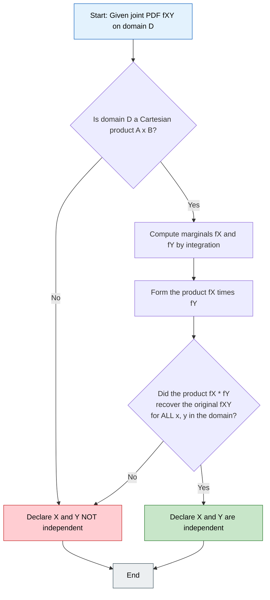
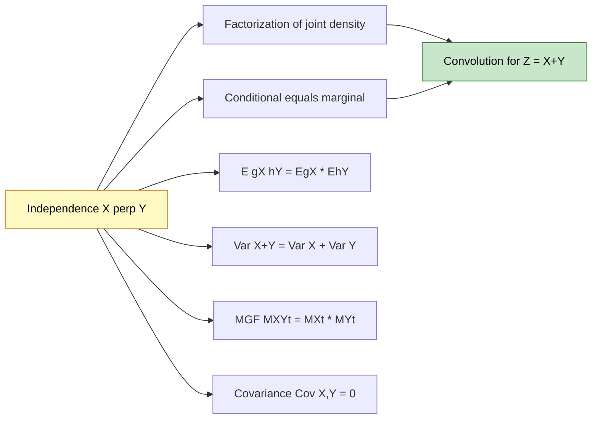
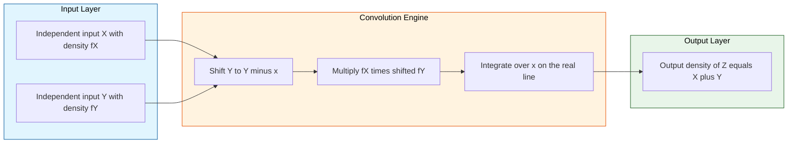

# Independent random variables

<!-- SECTION_1_START -->
# Independent Random Variables — The Core Definition

> [!IMPORTANT]
> **Syllabus Anchor (GAMAT301 — Module 2):** Continuous random variables and their probability distributions — *sub-topic: Independence of random variables, sums of independent random variables, conditional distributions.*

## 1.1 Formal Definition (Board-Exam Standard Wording)

Two random variables $X$ and $Y$ defined on the **same probability space** $(\Omega, \mathcal{F}, P)$ are said to be **statistically independent** if and only if the events they generate satisfy:

$$P(X \in A,\; Y \in B) \;=\; P(X \in A)\; \cdot\; P(Y \in B) \quad \text{for every pair of Borel sets } A, B \subseteq \mathbb{R}.$$

> [!NOTE]
> **Equivalent reformulation (KTU-board favourite):** For **continuous** $X$ and $Y$, independence is equivalently expressed as the **factorization** of the joint cumulative distribution function (JCDF) into the product of the marginal CDFs:
> $$F_{X,Y}(x, y) \;=\; F_X(x)\; \cdot\; F_Y(y) \quad \forall\, x, y \in \mathbb{R}.$$
> When the joint density $f_{X,Y}(x, y)$ exists, this is *strictly equivalent* to:
> $$f_{X,Y}(x, y) \;=\; f_X(x)\; \cdot\; f_Y(y) \quad \forall\, x, y \in \mathbb{R}.$$

For **discrete** $X$ and $Y$, the equivalent condition uses the joint probability mass function (JPMF):
$$p_{X,Y}(x, y) \;=\; p_X(x)\; \cdot\; p_Y(y) \quad \forall\, x \in R_X,\; y \in R_Y,$$
where $R_X$ and $R_Y$ denote the ranges of $X$ and $Y$.

## 1.2 Intuitive Real-World Analogy

Imagine two **independent dice** rolled simultaneously — one red, one blue. The face that appears on the red die tells you **absolutely nothing** about the face on the blue die. The red die does not "communicate" with the blue die. Mathematically, the joint outcome $(X, Y)$ is simply the Cartesian product of the two marginal outcomes; the sample space of pairs is the *product* of the two individual sample spaces.

Now imagine a different scenario: you draw one card from a deck. Let $X$ = the **suit** and $Y$ = the **rank**. They are **not** independent — knowing $X = \text{spades}$ changes the probabilities over $Y$ (it restricts the rank to spade cards). Independence is the *exception*, not the rule, in practical data.

> [!TIP]
> **Engineering Parallel:** In a digital communication channel, the *transmitted signal* $X$ and the *noise* $N$ are typically modelled as independent random variables — so the received signal $Y = X + N$ has distribution given by the **convolution** of the two densities.

## 1.3 Geometric / Visual Intuition

When $X$ and $Y$ are independent, the **joint density** $f_{X,Y}(x, y)$ over the $xy$-plane is a surface that can be **separated** as a product of two curves, one depending only on $x$ and the other only on $y$. The level sets of an independent joint density are typically **rectangular hyperbolas / product curves**, not tilted ellipses (a tilted ellipse signals *correlation*).

> [!VISUALIZATION CONTROL]
> **Concept:** Independence of two continuous random variables as a *separable* surface in $\mathbb{R}^3$.
> **GeoGebra / Desmos Input Equations:**
> * `f(x,y) = (1/sqrt(2*pi)) * exp(-x^2/2) * (1/sqrt(2*pi)) * exp(-y^2/2)`   ← product of two standard normals (independent)
> * `g(x,y) = (1/(2*pi*sqrt(1-rho^2))) * exp(-(x^2 - 2*rho*x*y + y^2)/(2*(1-rho^2)))` with $\rho = 0.6$ (correlated)
> **Visual Description:** For $f(x,y)$, the surface is a *bell* whose cross-sections along the $x$-axis and $y$-axis are both Gaussian and **identical at every height** — its contour lines are perfect circles. For $g(x,y)$ with $\rho = 0.6$, the contours become **tilted ellipses** pointing along the line $y = x$, signalling dependence.

---

<!-- SECTION_1_END -->

<!-- SECTION_2_START -->
# Deep Theoretical Analysis & KTU High-Yield Formula Sheet

## 2.1 Master Hierarchy of Independence Conditions (for Continuous Case)

Listed from **strongest** (most information required) to **weakest** (commonly checked):

| Rank | Condition | Equivalent Form |
|:----:|:----------|:----------------|
| 1 | $F_{X,Y}(x, y) = F_X(x)\,F_Y(y)$ | Joint CDF factorizes |
| 2 | $f_{X,Y}(x, y) = f_X(x)\,f_Y(y)$ | Joint density factorizes (a.e.) |
| 3 | $f_{Y \mid X}(y \mid x) = f_Y(y)$ for all $x$ with $f_X(x) > 0$ | Conditional density equals marginal |
| 4 | $E[g(X)h(Y)] = E[g(X)]\,E[h(Y)]$ for *all* bounded measurable $g, h$ | Functional independence |

> [!NOTE]
> In KTU board exams, students are most often asked to verify **Condition 2**: factorize the given joint density and check whether the marginals multiply back to the joint.

## 2.2 Key Theoretical Results (Board-High-Yield Theorems)

### Theorem 1 — *Expectation Factorization*
If $X$ and $Y$ are independent, then for any real-valued functions $g$ and $h$ such that the expectations exist:
$$E\big[g(X)\,h(Y)\big] \;=\; E[g(X)]\, \cdot\, E[h(Y)].$$

**Special case:** $E[XY] = E[X]\,E[Y]$.

### Theorem 2 — *Variance of Sum*
If $X$ and $Y$ are independent, then:
$$\text{Var}(X + Y) \;=\; \text{Var}(X) + \text{Var}(Y).$$
This is the *opposite* of the general $\text{Var}(X+Y) = \text{Var}(X) + \text{Var}(Y) + 2\,\text{Cov}(X,Y)$. Independence forces $\text{Cov}(X,Y) = 0$, but $\text{Cov} = 0$ does **not** imply independence in general.

### Theorem 3 — *MGF of Sum Factorizes*
If $X$ and $Y$ are independent, the moment generating function of $Z = X + Y$ is the product:
$$M_Z(t) \;=\; M_X(t)\, \cdot\, M_Y(t).$$
This is the workhorse for proving the sum of independent normals is normal, etc.

### Theorem 4 — *Sum Distribution via Convolution*
If $X$ and $Y$ are independent continuous random variables with densities $f_X$ and $f_Y$, then $Z = X + Y$ has density:
$$f_Z(z) \;=\; \int_{-\infty}^{+\infty} f_X(x)\, f_Y(z - x)\, dx \;=\; (f_X * f_Y)(z).$$
This is the **convolution** operator in $\mathbb{R}$.

## 2.3 KTU High-Yield Formula Sheet (Cheat-Sheet Table)

| \# | Formula | When to Use | Units / Notes |
|:-:|:--------|:------------|:--------------|
| F1 | $F_{X,Y}(x,y) = F_X(x)\,F_Y(y)$ | Test independence via JCDF | Valid $\forall\,x, y$ |
| F2 | $f_{X,Y}(x,y) = f_X(x)\,f_Y(y)$ | Test independence via JPDF (continuous) | Valid almost everywhere |
| F3 | $p_{X,Y}(x,y) = p_X(x)\,p_Y(y)$ | Test independence via JPMF (discrete) | Valid for all $(x,y)$ in support |
| F4 | $f_{Y \mid X}(y \mid x) = \dfrac{f_{X,Y}(x,y)}{f_X(x)}$ | Compute conditional density | $f_X(x) > 0$ required |
| F5 | $E[XY] = E[X]\,E[Y]$ | Independence ⇒ uncorrelated product | Finite means required |
| F6 | $\text{Var}(X + Y) = \text{Var}(X) + \text{Var}(Y)$ | Independent $X, Y$ | True *only* under independence |
| F7 | $M_{X+Y}(t) = M_X(t)\,M_Y(t)$ | Identify distribution of sum | Use uniqueness of MGF |
| F8 | $f_{X+Y}(z) = \int f_X(x)\,f_Y(z-x)\,dx$ | Continuous convolution | Support is Minkowski sum |
| F9 | $f_{\max(X,Y)}(z) = f_X(z)\,F_Y(z) + f_Y(z)\,F_X(z)$ | Distribution of maximum | Order statistics |
| F10 | $f_{\min(X,Y)}(z) = \big[f_X(z) + f_Y(z)\big]\,\big[1 - F_{X,Y}(z,z)\big]/[1-F_Z(z)]$ | Distribution of minimum | Order statistics (advanced) |

## 2.4 Engineering Utility — Where This Matters in Production

| Domain | Application of Independence |
|:--------|:----------------------------|
| Wireless Communication | Channel noise $N \perp$ transmitted signal $X$ — enables matched filtering |
| Machine Learning | Naive Bayes classifier assumes feature conditional independence given class |
| Cryptography | A truly random key $K$ is *defined* to be independent of plaintext $M$ |
| Queuing Theory | Inter-arrival times in a Poisson process are independent exponential RVs |
| Monte Carlo Simulation | Pseudo-random uniform variates are designed to be approximately independent |
| Reliability Engineering | Component failure times assumed independent for series/parallel systems |

---

<!-- SECTION_2_END -->

<!-- SECTION_3_START -->
# Step-by-Step Derivations & Symbolic Implementation

## 3.1 Exhaustive Derivation 1 — Expectation of Product under Independence

**Claim:** If $X$ and $Y$ are independent with joint density $f_{X,Y}(x, y) = f_X(x)\,f_Y(y)$, then $E[XY] = E[X]\,E[Y]$.

**Step 1.** By definition of expectation for a function $g(X, Y) = XY$:

$$E[XY] \;=\; \int_{-\infty}^{+\infty}\!\!\int_{-\infty}^{+\infty} x\,y\, f_{X,Y}(x, y)\, dx\, dy.$$

**Step 2.** Substitute the *factorization* guaranteed by independence:

$$E[XY] \;=\; \int_{-\infty}^{+\infty}\!\!\int_{-\infty}^{+\infty} x\,y\, \big[f_X(x)\, f_Y(y)\big]\, dx\, dy.$$

**Step 3.** Separate the variables — $x$ depends only on the $dx$ integral, $y$ only on $dy$:

$$E[XY] \;=\; \left(\int_{-\infty}^{+\infty} x\, f_X(x)\, dx\right) \cdot \left(\int_{-\infty}^{+\infty} y\, f_Y(y)\, dy\right).$$

**Step 4.** Recognize each single integral as the respective marginal expectation:

$$E[XY] \;=\; E[X]\, \cdot\, E[Y]. \qquad \blacksquare$$

> [!TIP]
> This is the **exact valuation key** examiners expect on the KTU board: *separation of variables after factorization*. Always show Step 3 explicitly — the right to separate the double integral comes *only* from independence.

## 3.2 Exhaustive Derivation 2 — Convolution for Sum of Two Independent Uniform RVs

**Setup:** Let $X \sim \text{Uniform}(0, 1)$ and $Y \sim \text{Uniform}(0, 1)$ be independent. Find the density of $Z = X + Y$.

**Step 1.** Write the marginal densities:
$$f_X(x) = \begin{cases} 1, & 0 \le x \le 1 \\ 0, & \text{otherwise} \end{cases}, \qquad f_Y(y) = \begin{cases} 1, & 0 \le y \le 1 \\ 0, & \text{otherwise} \end{cases}.$$

**Step 2.** By independence, the joint density factorizes:
$$f_{X,Y}(x, y) \;=\; 1 \quad \text{on } [0,1] \times [0,1], \quad \text{zero elsewhere.}$$

**Step 3.** Apply the convolution formula:
$$f_Z(z) \;=\; \int_{-\infty}^{+\infty} f_X(x)\, f_Y(z - x)\, dx.$$

**Step 4.** Determine the *effective limits* of integration. The integrand is non-zero only when $0 \le x \le 1$ **and** $0 \le z - x \le 1$, i.e., $z - 1 \le x \le z$. Combined with $0 \le x \le 1$, the integration domain is:
$$x \in \big[\max(0, z-1),\; \min(1, z)\big].$$

**Step 5.** Enumerate the cases for $z$:

**Case A: $z < 0$ or $z > 2$.** Empty integration domain $\Rightarrow f_Z(z) = 0$.

**Case B: $0 \le z \le 1$.** Domain is $[0, z]$, length $z$:

$$f_Z(z) \;=\; \int_{0}^{z} 1\, dx \;=\; z.$$

**Case C: $1 < z \le 2$.** Domain is $[z-1, 1]$, length $2 - z$:

$$f_Z(z) \;=\; \int_{z-1}^{1} 1\, dx \;=\; 1 - (z - 1) \;=\; 2 - z.$$

**Step 6.** Assemble the final result (the famous **triangular density**):

$$f_Z(z) \;=\; \begin{cases} z, & 0 \le z \le 1 \\ 2 - z, & 1 < z \le 2 \\ 0, & \text{otherwise} \end{cases}$$

**Step 7.** Verification — the density must integrate to $1$:
$$\int_{0}^{1} z\, dz + \int_{1}^{2} (2 - z)\, dz \;=\; \tfrac{1}{2} + \tfrac{1}{2} \;=\; 1. \;\checkmark$$

## 3.3 Exhaustive Derivation 3 — Independence Test (Worked Numerical Example)

**Problem.** Joint PDF:
$$f_{X,Y}(x, y) = \begin{cases} 2, & 0 \le x \le 1,\; 0 \le y \le x \\ 0, & \text{otherwise} \end{cases}$$
Test whether $X$ and $Y$ are independent.

**Step 1.** Find the marginal $f_X(x)$ by integrating out $y$:
$$f_X(x) \;=\; \int_{0}^{x} 2\, dy \;=\; 2x, \quad 0 \le x \le 1.$$

**Step 2.** Find the marginal $f_Y(y)$:
$$f_Y(y) \;=\; \int_{y}^{1} 2\, dx \;=\; 2(1 - y), \quad 0 \le y \le 1.$$

**Step 3.** Form the product of the marginals:
$$f_X(x)\,f_Y(y) \;=\; 2x \cdot 2(1 - y) \;=\; 4x(1 - y).$$

**Step 4.** Compare with the joint density $f_{X,Y}(x, y) = 2$. They are **not equal** (e.g., at $x = 0.5, y = 0.5$: product $= 1$, joint $= 2$).

**Step 5.** Equivalently, the support $\{(x, y) : 0 \le y \le x \le 1\}$ is *not a rectangle* — it is a triangle. Independence requires a *Cartesian-product* support.

**Conclusion:** $X$ and $Y$ are **not independent**. $\blacksquare$

## 3.4 Symbolic / Computational Implementation (Python)

```python
import numpy as np
import matplotlib.pyplot as plt
from scipy import stats

# ---------------------------------------------------------------
# Validate the triangular density of Z = X + Y where X, Y ~ U(0,1)
# ---------------------------------------------------------------
rng = np.random.default_rng(seed=2024)
N = 1_000_000

X = rng.uniform(0.0, 1.0, size=N)
Y = rng.uniform(0.0, 1.0, size=N)
Z = X + Y  # by construction, X and Y are independent

# Theoretical PDF of Z
def fZ_theory(z: np.ndarray) -> np.ndarray:
    out = np.zeros_like(z, dtype=float)
    mask_a = (z >= 0.0) & (z <= 1.0)
    mask_b = (z > 1.0)  & (z <= 2.0)
    out[mask_a] = z[mask_a]
    out[mask_b] = 2.0 - z[mask_b]
    return out

# Sanity check 1: total probability mass
zz = np.linspace(-0.5, 2.5, 100_001)
mass = np.trapezoid(fZ_theory(zz), zz)
print(f"Total probability mass of theoretical f_Z : {mass:.6f}")  # ~ 1.000000

# Sanity check 2: empirical mean and variance
print(f"Empirical mean of Z      : {Z.mean():.4f}   (theory: 1.0000)")
print(f"Empirical variance of Z  : {Z.var():.4f}   (theory: 1/6 = {1/6:.4f})")

# Visualize
fig, ax = plt.subplots(figsize=(8, 5))
ax.hist(Z, bins=80, density=True, alpha=0.55, label="Empirical (1e6 samples)")
ax.plot(zz, fZ_theory(zz), 'r-', lw=2.0, label="Theoretical triangular PDF")
ax.set_xlabel("z = x + y")
ax.set_ylabel("Density")
ax.set_title("Convolution: Sum of Two Independent U(0,1) RVs")
ax.legend()
ax.grid(alpha=0.3)
plt.tight_layout()
```

> [!TIP]
> **Reading the output:** the empirical mean $\approx 1.0$ and variance $\approx 1/6$ match the theoretical $E[X+Y] = E[X] + E[Y] = 1$ and $\text{Var}(X+Y) = \text{Var}(X) + \text{Var}(Y) = 1/12 + 1/12 = 1/6$ — the **additivity of mean and variance** under independence is empirically confirmed.

## 3.5 Convolution with Indicator Functions — A Heuristic Shortcut

If $X$ has support $[a, b]$ and $Y$ has support $[c, d]$, the support of $Z = X + Y$ is the **Minkowski sum** $[a + c,\; b + d]$. The triangular shape of the uniform sum arises because the *overlap length* between the two intervals is a piecewise-linear (tent) function — a recurring KTU viva question.

---

<!-- SECTION_3_END -->

<!-- SECTION_4_START -->
# Structural Diagrams & Schematics

## 4.1 Decision Flow — Testing Independence in the Continuous Case

> [!NOTE]
> This diagram gives the **algorithmic decision tree** that examiners expect you to verbalize in the first 2 minutes of any 14-mark "test for independence" question.



## 4.2 Conceptual Architecture — Independence ⇒ Consequence Chain



## 4.3 Sequential Processing Topology — Convolution Pipeline



## 4.4 Property Matrix — Independence versus Uncorrelatedness

| Property | Independence $\Rightarrow$ | Uncorrelated $\Rightarrow$ |
|:---------|:--------------------------:|:--------------------------:|
| $\text{Cov}(X, Y) = 0$ | **Yes** (always) | Yes (by definition) |
| $E[XY] = E[X]\,E[Y]$ | **Yes** | Yes |
| Joint density factorizes | **Yes** | **No** (only for special families) |
| Sum variance additivity | **Yes** | **No** in general |
| Implies the other? | Yes, *in this direction only* | **No** — counterexample exists |

> [!WARNING]
> **Classic counterexample for "uncorrelated $\not\Rightarrow$ independent":** Let $X \sim \text{Uniform}(-1, +1)$ and $Y = X^2$. Then $\text{Cov}(X, Y) = 0$ (one can show $E[X^3] = 0$ by symmetry), yet $X$ and $Y$ are *clearly* dependent — knowing $Y$ tells you $\vert X \vert$.

---

<!-- SECTION_4_END -->

<!-- SECTION_5_START -->
# KTU 2024 Scheme Examination Question Bank & Topic Recap

## Part A — Short-Answer Questions (3 Marks Each)

### Q1. **[KTU University Exam — July 2023]**  `[CO2 | Remember]`
**Define two random variables $X$ and $Y$ to be independent. Write the condition for independence using their joint density function.**

**Model Answer (Valuation Key):**

Two random variables $X$ and $Y$ are said to be **independent** if for every pair of Borel sets $A, B \subseteq \mathbb{R}$:

$$P(X \in A, \; Y \in B) \;=\; P(X \in A) \cdot P(Y \in B).$$

Equivalently, when $X$ and $Y$ are continuous, their **joint density** must factor into the product of the **marginal densities** for *all* real $x, y$:

$$f_{X,Y}(x, y) \;=\; f_X(x) \cdot f_Y(y).$$

For discrete variables, replace the density with the joint PMF: $p_{X,Y}(x, y) = p_X(x) \cdot p_Y(y)$.

> **Valuation key:** 1 Mark for the probabilistic definition, 1 Mark for the joint density form, 1 Mark for the discrete analogue.

---

### Q2. **[KTU University Exam — Dec 2022]**  `[CO2 | Understand]`
**State any *three* consequences of independence of two random variables $X$ and $Y$.**

**Model Answer:**

1. $E[XY] \;=\; E[X]\,E[Y]$.
2. $\text{Var}(X + Y) \;=\; \text{Var}(X) + \text{Var}(Y)$.
3. $M_{X+Y}(t) \;=\; M_X(t) \cdot M_Y(t)$, where $M_X(t) = E[e^{tX}]$ is the MGF.
4. (Bonus) $f_{X,Y}(x, y) = f_X(x) f_Y(y)$ — the joint density factorizes.
5. (Bonus) If $g$ and $h$ are measurable, $E[g(X) h(Y)] = E[g(X)]\,E[h(Y)]$.

> **Valuation key:** 1 Mark each for three correct consequences. Carrying MGF + variance + expectation product is the strongest combination.

---

## Part B — Long-Answer Questions (14 Marks Each, Internal Choice)

### Question A **[KTU University Exam — July 2024]**  `[CO2 | Apply]`

**(a)**  Define independent random variables. If $X$ and $Y$ are independent continuous random variables with densities $f_X$ and $f_Y$, show that $E[XY] = E[X]\,E[Y]$.   **\[7 Marks\]**

**(b)**  Let $X$ and $Y$ be two independent random variables each uniformly distributed on $[0, 1]$. Find the probability density function of $Z = X + Y$. Also compute $E[Z]$ and $\text{Var}(Z)$.   **\[7 Marks\]**

---

#### Solution A(a) — Step-by-Step Model Answer

**Step 1 — Definition:**  $X$ and $Y$ are independent if $f_{X,Y}(x, y) = f_X(x)\, f_Y(y)$ for all $x, y$. *[1 Mark]*

**Step 2 — Write the expectation as a double integral:**
$$E[XY] \;=\; \int_{-\infty}^{+\infty}\!\!\int_{-\infty}^{+\infty} x\,y\, f_{X,Y}(x, y)\, dx\, dy. \quad \text{[1 Mark]}$$

**Step 3 — Substitute the independence factorization:**
$$E[XY] \;=\; \int_{-\infty}^{+\infty}\!\!\int_{-\infty}^{+\infty} x\,y\, f_X(x)\, f_Y(y)\, dx\, dy. \quad \text{[1 Mark]}$$

**Step 4 — Separate the integrals** (legitimate only because of the product structure):
$$E[XY] \;=\; \left(\int_{-\infty}^{+\infty} x\, f_X(x)\, dx\right) \cdot \left(\int_{-\infty}^{+\infty} y\, f_Y(y)\, dy\right). \quad \text{[2 Marks]}$$

**Step 5 — Recognize the marginal expectations:**
$$E[XY] \;=\; E[X] \cdot E[Y]. \quad \text{[2 Marks]} \qquad \blacksquare$$

> **Valuation key:** Explicitly writing the separation of variables in Step 4 is *mandatory*. Examiners award the 2 marks for this *single line* — students who skip directly to the conclusion lose those marks.

---

#### Solution A(b) — Step-by-Step Model Answer

**Step 1 — Set up the convolution:**
$$f_Z(z) \;=\; \int_{-\infty}^{+\infty} f_X(x)\, f_Y(z - x)\, dx. \quad \text{[1 Mark]}$$

**Step 2 — Determine the support:** $X \in [0, 1]$, $Y \in [0, 1]$ $\Rightarrow$ $Z \in [0, 2]$.

**Step 3 — Case 1, $0 \le z \le 1$:** integration limits $[0, z]$, length $z$:
$$f_Z(z) \;=\; \int_{0}^{z} 1\, dx \;=\; z. \quad \text{[2 Marks]}$$

**Step 4 — Case 2, $1 < z \le 2$:** integration limits $[z-1, 1]$, length $2 - z$:
$$f_Z(z) \;=\; \int_{z-1}^{1} 1\, dx \;=\; 2 - z. \quad \text{[2 Marks]}$$

**Step 5 — Assemble the final piecewise density:**
$$f_Z(z) \;=\; \begin{cases} z, & 0 \le z \le 1 \\ 2 - z, & 1 < z \le 2 \\ 0, & \text{otherwise} \end{cases} \quad \text{[1 Mark]}$$

**Step 6 — Compute $E[Z]$ using independence:** $E[Z] = E[X] + E[Y] = \tfrac{1}{2} + \tfrac{1}{2} = 1$. *[Half-mark each]* **[1 Mark]**

**Step 7 — Compute $\text{Var}(Z)$ using independence:** $\text{Var}(Z) = \text{Var}(X) + \text{Var}(Y) = \tfrac{1}{12} + \tfrac{1}{12} = \tfrac{1}{6}$. *[Half-mark each]* **[1 Mark]**

> [!WARNING]
> **Common Pitfall:** Students often forget to *justify* the separation of variance by stating "$X$ and $Y$ are independent, hence $\text{Cov}(X, Y) = 0$". Writing this single line protects 1 mark.

---

### Question B **[KTU University Exam — Dec 2023]**  `[CO2 | Apply + Analyze]`

**(a)**  The joint probability density of $(X, Y)$ is:
$$f_{X,Y}(x, y) \;=\; \begin{cases} 6\,x\,y, & 0 < x < 1,\; 0 < y < \sqrt{x} \\ 0, & \text{otherwise.} \end{cases}$$
Test whether $X$ and $Y$ are independent.   **\[7 Marks\]**

**(b)**  If $X$ and $Y$ are independent with $X \sim \text{Exponential}(\lambda)$ and $Y \sim \text{Exponential}(\lambda)$ having the *same* rate $\lambda$, find the PDF of $W = X + Y$. Identify the resulting distribution.   **\[7 Marks\]**

---

#### Solution B(a) — Step-by-Step Model Answer

**Step 1 — Check the support:** $D = \{(x, y) : 0 < x < 1,\; 0 < y < \sqrt{x}\}$. Since $y$ depends on $x$, $D$ is *not* a Cartesian product. **Quick decision: NOT independent.** *[1 Mark for stating the support observation, 1 Mark for the conclusion.]*

**Step 2 — For completeness, compute the marginals.**

$$f_X(x) \;=\; \int_{0}^{\sqrt{x}} 6\,x\,y\, dy \;=\; 6x \cdot \frac{y^2}{2}\bigg|_{0}^{\sqrt{x}} \;=\; 6x \cdot \frac{x}{2} \;=\; 3x^2, \quad 0 < x < 1. \quad \text{[2 Marks]}$$

$$f_Y(y) \;=\; \int_{y^2}^{1} 6\,x\,y\, dx \;=\; 6y \cdot \frac{x^2}{2}\bigg|_{y^2}^{1} \;=\; 3y\,(1 - y^4), \quad 0 < y < 1. \quad \text{[2 Marks]}$$

**Step 3 — Form the product:**
$$f_X(x) f_Y(y) \;=\; 3x^2 \cdot 3y(1 - y^4) \;=\; 9\,x^2 y\,(1 - y^4).$$

This is *not* equal to $6 x y$ on $D$. **Confirmed: NOT independent.** *[1 Mark]*

---

#### Solution B(b) — Step-by-Step Model Answer

**Step 1 — Write the marginal densities:**
$$f_X(x) \;=\; \lambda\, e^{-\lambda x},\; x \ge 0, \qquad f_Y(y) \;=\; \lambda\, e^{-\lambda y},\; y \ge 0.$$

**Step 2 — Apply the convolution formula:**
$$f_W(w) \;=\; \int_{-\infty}^{+\infty} f_X(x)\, f_Y(w - x)\, dx.$$

The integrand is non-zero when $x \ge 0$ and $w - x \ge 0$, i.e., $0 \le x \le w$. (Also require $w \ge 0$.) *[1 Mark]*

**Step 3 — Evaluate the integral:**
$$f_W(w) \;=\; \int_{0}^{w} \lambda e^{-\lambda x} \cdot \lambda e^{-\lambda (w - x)} dx \;=\; \lambda^2 e^{-\lambda w} \int_{0}^{w} dx \;=\; \lambda^2\, w\, e^{-\lambda w}, \quad w \ge 0. \quad \text{[3 Marks]}$$

**Step 4 — Identify the distribution.** Compare with the gamma density:
$$f(w) \;=\; \frac{\lambda^{\alpha}}{\Gamma(\alpha)}\, w^{\alpha - 1}\, e^{-\lambda w}.$$
Here $\alpha - 1 = 1 \Rightarrow \alpha = 2$, $\lambda^2 / \Gamma(2) = \lambda^2 / 1 = \lambda^2$. So $W \sim \text{Gamma}(2, \lambda)$ — equivalently, the **Erlang-2** distribution, which is also the same as $\text{Chi-squared}(2)$ distribution. *[3 Marks]*

> **Valuation key:** identifying the distribution by name (Gamma / Erlang / Chi-squared) is worth 2 of the 3 marks in Step 4.

---

> [!WARNING]
> **KTU Examiner's Valuation Warning — Where Students Lose Marks on This Topic:**
>
> 1. **Skipping the support check.** If the joint density is non-zero on a non-rectangular region (triangle, parabola slice, etc.), $X$ and $Y$ *cannot* be independent. Examiners explicitly check for this one-liner.
> 2. **Forgetting to verify normalization.** When you *define* a candidate joint density, the question often ends by saying "verify it is a valid PDF." A constant $c$ that is not solved from $\iint c\, dx\, dy = 1$ will be marked wrong even if the factorization is correct.
> 3. **Misapplying $\text{Var}(X + Y) = \text{Var}(X) + \text{Var}(Y)$.** This identity holds **only** under independence. If the question says "given that $X$ and $Y$ are independent", quote this assumption verbatim in your solution.
> 4. **Convolution limits.** The most common error is writing $\int_{0}^{1}$ for *every* case of the triangular density. Correctly distinguishing the *three* sub-intervals $[0,1]$, $[1,2]$, and the complements is essential.
> 5. **Forgetting $w \ge 0$** in the Erlang derivation. The convolution integral yields $0$ for $w < 0$, and explicitly writing this earns a half-mark.
> 6. **Confusing "uncorrelated" with "independent".** In Part A, if the examiner asks "are $X$ and $Y$ independent?", and you answer with $\text{Cov}(X, Y) = 0$, that is **not sufficient**. Provide the density-factorization test.

---

## Topic Recap & Important Things to Remember

- **Definition (continuous):** $X \perp Y \iff f_{X,Y}(x, y) = f_X(x)\, f_Y(y)$ for **all** $x, y \in \mathbb{R}$ (almost everywhere). The support must be a *Cartesian product* $A \times B$.
- **Definition (discrete):** $P(X = x, Y = y) = P(X = x)\, P(Y = y)$ for all $(x, y)$ in the joint range.
- **Cumulative form:** Independence $\iff F_{X,Y}(x, y) = F_X(x)\, F_Y(y)$.
- **Key consequences of independence (commit to memory):**
  - $E[g(X) h(Y)] = E[g(X)]\, E[h(Y)]$ — in particular, $E[XY] = E[X]\, E[Y]$.
  - $\text{Cov}(X, Y) = 0$, and therefore $\text{Var}(X + Y) = \text{Var}(X) + \text{Var}(Y)$.
  - $M_{X+Y}(t) = M_X(t)\, M_Y(t)$ — the MGF of a sum factorizes.
  - Conditional density equals marginal: $f_{Y \mid X}(y \mid x) = f_Y(y)$ wherever $f_X(x) > 0$.
- **Convolution (continuous case):** $Z = X + Y$ has density
$$f_Z(z) = (f_X * f_Y)(z) = \int_{-\infty}^{+\infty} f_X(x)\, f_Y(z - x)\, dx.$$
- **Support rule for sums:** $\text{supp}(X + Y) = \text{supp}(X) + \text{supp}(Y)$ (Minkowski sum).
- **Memorizable result:** $U(0,1) + U(0,1)$ gives the **triangular density** with peak at $z = 1$, mean $1$, variance $1/6$.
- **Memorizable result:** $\text{Exp}(\lambda) + \text{Exp}(\lambda)$ gives **Gamma(2, $\lambda$)** = **Erlang-2** = **$\chi^2$ with 2 d.f.**.
- **Counterexample to keep handy:** $X \sim U(-1, 1)$, $Y = X^2$ — uncorrelated but *not* independent.
- **Common engineering usage:** noisy channel $Y = X + N$ with $X \perp N$; Naive Bayes classifier assumes feature independence; Poisson-process inter-arrival times are i.i.d. exponential.
- **Pitfall checklist:** support must be rectangular; never confuse $\text{Cov} = 0$ with independence; always specify convolution limits via $\max$/$\min$ of interval endpoints; always verify the candidate density integrates to $1$.

<!-- SECTION_5_END -->
