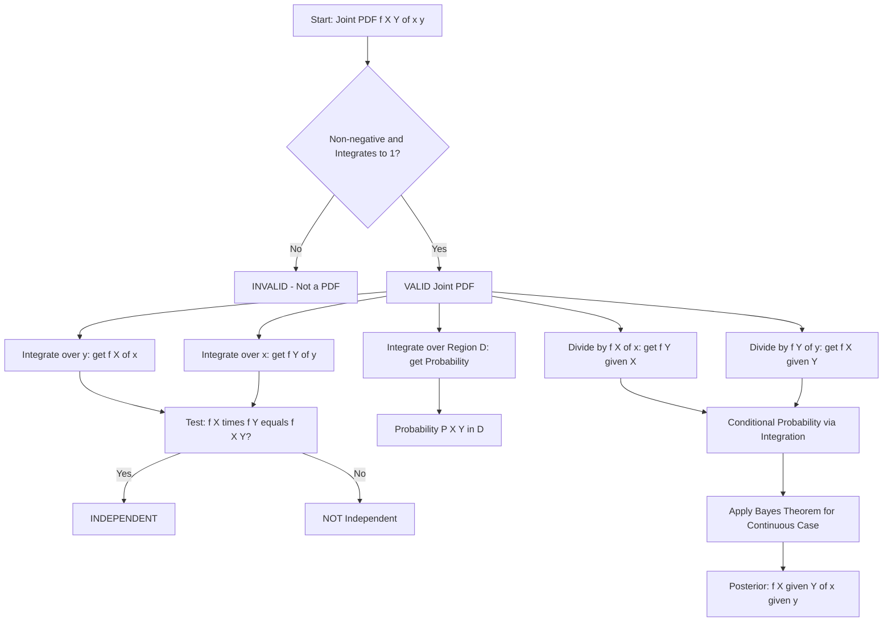
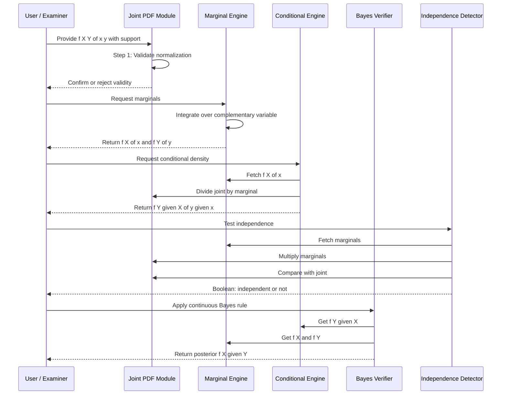
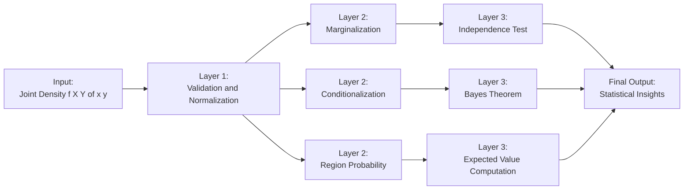

# Joint pdf of two Continuous random variables

<!-- SECTION_1_START -->
# Joint Probability Density Function of Two Continuous Random Variables

> [!IMPORTANT]
> **KTU 2024 Scheme | GAMAT301 | Module 2 | Topic: Joint PDF of Two Continuous Random Variables**
> This is a foundational topic for Module 2 and directly feeds into Conditional Distributions, Independence, and Covariance/Correlation in later modules.

---

## 1. Formal Academic Definition

Let $X$ and $Y$ be two continuous random variables defined on the same sample space $S$. The **Joint Probability Density Function** of $X$ and $Y$, denoted $f_{X,Y}(x, y)$, is a non-negative function of two real variables satisfying the following two axioms:

**Axiom 1 (Normalization):**

$$\int_{-\infty}^{\infty} \int_{-\infty}^{\infty} f_{X,Y}(x, y) \, dx \, dy = 1$$

**Axiom 2 (Probability over a region $D$):** For any region $D \subseteq \mathbb{R}^2$,

$$P\big((X, Y) \in D\big) = \iint_{D} f_{X,Y}(x, y) \, dx \, dy$$

> [!NOTE]
> **Interpretation:** $f_{X,Y}(x, y)$ itself is **NOT a probability**. It is a probability *density* — probability per unit area in the $xy$-plane. Only when integrated over a region does it yield an actual probability. Think of it like a 2D generalization of the familiar 1D bell curve area.

---

## 2. Conceptual Analogy / Intuition

Imagine a thin, irregular sheet of metal lying flat on a table. The sheet's *thickness* at any point $(x, y)$ is exactly $f_{X,Y}(x, y)$.

- The **total mass** of the sheet is **1** (normalization axiom).
- The **mass over a region** $D$ of the table is the probability that $(X, Y)$ falls inside $D$.
- If you push a needle straight down at a random point on the sheet, the **height** you hit tells you the relative likelihood of that exact $(x, y)$ outcome.

**Geometric Intuition:** The volume under the surface $z = f_{X,Y}(x, y)$ above any region $D$ in the $xy$-plane equals $P((X, Y) \in D)$. The total volume under the entire surface equals **1**.

> [!IMPORTANT]
> **Syllabus Highlight (KTU GAMAT301 Module 2):** Students must master (i) computing marginal PDFs by integration, (ii) verifying independence, and (iii) computing conditional PDFs. The joint PDF is the gateway to all of these.

---

## 3. Necessary and Sufficient Properties of a Valid Joint PDF

For $f_{X,Y}(x, y)$ to be a valid joint PDF, **all four** conditions below must hold simultaneously:

| # | Property | Mathematical Statement |
|---|----------|------------------------|
| 1 | **Non-negativity** | $f_{X,Y}(x, y) \geq 0$ for all $(x, y) \in \mathbb{R}^2$ |
| 2 | **Total unity** | $\int_{-\infty}^{\infty} \int_{-\infty}^{\infty} f_{X,Y}(x, y) \, dx \, dy = 1$ |
| 3 | **Boundedness** | The integral over any bounded region must be finite |
| 4 | **Continuity** (almost everywhere) | $f_{X,Y}$ should be piecewise-continuous for practical computations |

> [!WARNING]
> **Common Student Error:** A function with the right "shape" but whose total volume is **not equal to 1** is **not** a valid PDF. You must always normalize first.

---

## 4. Visualization Control

> [!VISUALIZATION CONTROL]
> **Concept:** A typical bivariate normal-like joint density surface over a rectangular support region.
> **GeoGebra / Desmos Input Equations (concept-level):**
> * `f(x, y) = (1/4) * x * y` for $0 \le x \le 2$ and $0 \le y \le 2$ (a polynomial joint density)
> * Test: $\int_0^2 \int_0^2 \frac{xy}{4} \, dx \, dy = \frac{1}{4} \cdot 2 \cdot 2 = 1$ ✅
> **Visual Description:** Student should observe a curved surface rising from $0$ at the edges of the support up to a peak at the centre, with the total volume beneath the surface equal to $1$. Two independent uniform-like marginals would give a flat-topped box.

<!-- SECTION_1_END -->

<!-- SECTION_2_START -->
# Deep Theoretical Analysis & KTU High-Yield Formula Sheet

---

## 1. Marginal Probability Density Functions

The **marginal PDF** of $X$ is obtained by integrating the joint PDF over all possible values of $Y$ (i.e., "marginalizing out" $Y$). Geometrically, this is the projection of the 3D surface onto the $xz$-plane.

$$f_X(x) = \int_{-\infty}^{\infty} f_{X,Y}(x, y) \, dy \quad \text{for all } x \in \mathbb{R}$$

Similarly, the marginal PDF of $Y$ is:

$$f_Y(y) = \int_{-\infty}^{\infty} f_{X,Y}(x, y) \, dx \quad \text{for all } y \in \mathbb{R}$$

> [!NOTE]
> **Sanity Check Rule:** Both $f_X(x)$ and $f_Y(y)$, when integrated over their full domain, **must equal 1**. Always verify this in the exam to grab the full 14 marks.

---

## 2. Conditional Probability Density Function

The conditional PDF of $Y$ given that $X = x$ (for any $x$ where $f_X(x) > 0$) is:

$$f_{Y \mid X}(y \mid x) = \frac{f_{X,Y}(x, y)}{f_X(x)}$$

Symmetrically:

$$f_{X \mid Y}(x \mid y) = \frac{f_{X,Y}(x, y)}{f_Y(y)}$$

> [!IMPORTANT]
> **Bayes' Rule for Continuous Variables (extremely high-yield for KTU):**
> $$f_{X \mid Y}(x \mid y) = \frac{f_{Y \mid X}(y \mid x) \cdot f_X(x)}{f_Y(y)} = \frac{f_{Y \mid X}(y \mid x) \cdot f_X(x)}{\int_{-\infty}^{\infty} f_{Y \mid X}(y \mid x) f_X(x) \, dx}$$

---

## 3. Independence of Two Continuous Random Variables

Two continuous random variables $X$ and $Y$ are **independent** if and only if:

$$f_{X,Y}(x, y) = f_X(x) \cdot f_Y(y) \quad \text{for all } (x, y) \in \mathbb{R}^2$$

**Equivalent test using the joint PDF:**

$$f_{X,Y}(x, y) = f_X(x) \cdot f_Y(y) \;\;\Longleftrightarrow\;\; X \perp Y$$

> [!NOTE]
> **Factored Support Test (faster method):** If the support region $R$ of $f_{X,Y}$ can be written as a Cartesian product $R = R_X \times R_Y$, AND the joint PDF factors as $g(x) \cdot h(y)$, then $X$ and $Y$ are independent.

---

## 4. Cumulative Distribution Function (CDF) Relationship

The joint CDF $F_{X,Y}(x, y)$ is defined as:

$$F_{X,Y}(x, y) = P(X \le x, Y \le y) = \int_{-\infty}^{x} \int_{-\infty}^{y} f_{X,Y}(u, v) \, dv \, du$$

By the Fundamental Theorem of Calculus (partial derivatives), the joint PDF can be recovered:

$$f_{X,Y}(x, y) = \frac{\partial^2}{\partial x \, \partial y} F_{X,Y}(x, y)$$

---

## 5. KTU Formula Cheat Sheet

| # | Concept | Formula | Domain / Condition |
|---|---------|---------|---------------------|
| 1 | Normalization | $\int_{-\infty}^{\infty}\int_{-\infty}^{\infty} f_{X,Y}(x, y) \, dx\,dy = 1$ | Always |
| 2 | Probability over a region $D$ | $P((X,Y) \in D) = \iint_D f_{X,Y}(x, y) \, dA$ | $D \subseteq \mathbb{R}^2$ |
| 3 | Marginal of $X$ | $f_X(x) = \int_{-\infty}^{\infty} f_{X,Y}(x, y) \, dy$ | $x \in \mathbb{R}$ |
| 4 | Marginal of $Y$ | $f_Y(y) = \int_{-\infty}^{\infty} f_{X,Y}(x, y) \, dx$ | $y \in \mathbb{R}$ |
| 5 | Conditional PDF of $Y \mid X$ | $f_{Y \mid X}(y \mid x) = \frac{f_{X,Y}(x, y)}{f_X(x)}$ | $f_X(x) > 0$ |
| 6 | Conditional PDF of $X \mid Y$ | $f_{X \mid Y}(x \mid y) = \frac{f_{X,Y}(x, y)}{f_Y(y)}$ | $f_Y(y) > 0$ |
| 7 | Independence (joint = product of marginals) | $f_{X,Y}(x, y) = f_X(x) \cdot f_Y(y)$ | $\forall (x, y)$ |
| 8 | Joint CDF from PDF | $F_{X,Y}(x, y) = \int_{-\infty}^{x}\int_{-\infty}^{y} f_{X,Y}(u, v) \, dv\,du$ | $x, y \in \mathbb{R}$ |
| 9 | Joint PDF from CDF | $f_{X,Y}(x, y) = \frac{\partial^2 F_{X,Y}(x, y)}{\partial x \, \partial y}$ | Where $F$ is differentiable |
| 10 | Multiplication rule | $f_{X,Y}(x, y) = f_{Y \mid X}(y \mid x) \cdot f_X(x)$ | $f_X(x) > 0$ |

> [!TIP]
> **Memory trick:** "Joint = Marginal × Conditional" (chain rule in disguise). And "Independence ⟹ Conditional = Marginal".

---

## 6. Real-World Engineering Utility

| Application Domain | Use of Joint PDF |
|--------------------|------------------|
| **Machine Learning (Generative Models)** | Joint PDFs model the distribution of feature-label pairs $(X, Y)$; Gaussian mixtures in feature space |
| **Signal Processing** | Joint PDF of two correlated signals (e.g., I/Q channels in communications) |
| **Computer Vision** | Joint pixel intensity distributions in RGB colour space |
| **Reliability Engineering** | Joint failure-time distribution of two coupled components in a system |
| **Network Engineering** | Joint distribution of packet arrival time and size in a network queue |
| **Cryptography / Information Theory** | Joint entropy $H(X, Y)$ of two correlated sources is computed via the joint PDF |

> [!NOTE]
> **Production Example:** In a Bayesian spam filter, $P(\text{word} \mid \text{spam})$ is a conditional density. Combining such conditionals over many words uses the multiplication rule $f_{X,Y} = f_{Y \mid X} \cdot f_X$ — the very theorem studied here.

<!-- SECTION_2_END -->

<!-- SECTION_3_START -->
# Step-by-Step Derivations & Worked Numerical Examples

---

## Worked Example 1 — Computing Marginal PDFs and a Probability

> **Problem Statement (Standard KTU Pattern):**
> The joint PDF of two continuous random variables $X$ and $Y$ is
> $$f_{X,Y}(x, y) = \begin{cases} k\,x^2 y & \text{if } 0 < x < 1,\; 0 < y < 1 \\ 0 & \text{otherwise} \end{cases}$$
> Find: (a) the constant $k$, (b) the marginal PDFs $f_X(x)$ and $f_Y(y)$, (c) $P(X > Y)$.

### Part (a) — Finding $k$ using normalization

Apply the normalization axiom:

$$\int_{0}^{1} \int_{0}^{1} k\,x^2 y \, dy \, dx = 1$$

Evaluate the inner integral over $y$ (treating $k, x$ as constants):

$$\int_{0}^{1} k\,x^2 y \, dy = k\,x^2 \left[\frac{y^2}{2}\right]_{0}^{1} = \frac{k\,x^2}{2}$$

Now integrate over $x$:

$$\int_{0}^{1} \frac{k\,x^2}{2} \, dx = \frac{k}{2} \left[\frac{x^3}{3}\right]_{0}^{1} = \frac{k}{6}$$

Set the result equal to 1:

$$\frac{k}{6} = 1 \;\;\Longrightarrow\;\; \boxed{k = 6}$$

**Valuation key (KTU 2019-style):** [Stating the normalization equation: 1 Mark] [Inner integration: 1 Mark] [Outer integration: 1 Mark] [Solving for $k$: 1 Mark]

### Part (b) — Marginal PDFs

**Marginal of $X$** (integrate out $y$ from $0$ to $1$):

$$f_X(x) = \int_{0}^{1} 6\,x^2 y \, dy = 6\,x^2 \left[\frac{y^2}{2}\right]_{0}^{1} = 3x^2, \quad 0 < x < 1$$

**Marginal of $Y$** (integrate out $x$ from $0$ to $1$):

$$f_Y(y) = \int_{0}^{1} 6\,x^2 y \, dx = 6y \left[\frac{x^3}{3}\right]_{0}^{1} = 2y, \quad 0 < y < 1$$

**Verification (always do this in the exam!):**

$$\int_{0}^{1} 3x^2 \, dx = \left[x^3\right]_{0}^{1} = 1 \;\checkmark$$

$$\int_{0}^{1} 2y \, dy = \left[y^2\right]_{0}^{1} = 1 \;\checkmark$$

### Part (c) — Computing $P(X > Y)$

The region $D = \{(x, y): 0 < x < 1,\, 0 < y < x\}$ (the triangle below the line $y = x$ in the unit square). So:

$$P(X > Y) = \int_{0}^{1} \int_{0}^{x} 6\,x^2 y \, dy \, dx$$

**Inner integral:**

$$\int_{0}^{x} 6\,x^2 y \, dy = 6\,x^2 \left[\frac{y^2}{2}\right]_{0}^{x} = 3x^4$$

**Outer integral:**

$$\int_{0}^{1} 3x^4 \, dx = 3 \left[\frac{x^5}{5}\right]_{0}^{1} = \frac{3}{5}$$

$$\boxed{P(X > Y) = \frac{3}{5} = 0.6}$$

**Valuation key:** [Setting up region of integration: 1 Mark] [Inner integration: 1 Mark] [Outer integration: 1 Mark] [Final answer: 1 Mark]

---

## Worked Example 2 — Conditional PDF and Bayes' Rule

> **Problem Statement:**
> Given the joint PDF from Example 1, find the conditional PDF $f_{Y \mid X}(y \mid x)$ and the conditional probability $P(Y > 0.5 \mid X = 0.7)$.

### Step 1: Identify $f_X(x)$

We already derived $f_X(x) = 3x^2$ for $0 < x < 1$.

### Step 2: Apply the conditional PDF formula

$$f_{Y \mid X}(y \mid x) = \frac{f_{X,Y}(x, y)}{f_X(x)} = \frac{6\,x^2 y}{3x^2} = 2y, \quad 0 < y < 1$$

Note: The result $2y$ is **independent of $x$**, which already hints at independence.

### Step 3: Verify independence

Check: $f_X(x) \cdot f_Y(y) = 3x^2 \cdot 2y = 6x^2 y = f_{X,Y}(x, y)$ ✅

So $X$ and $Y$ are **independent**.

### Step 4: Compute the conditional probability

Because of independence, $P(Y > 0.5 \mid X = 0.7) = P(Y > 0.5)$:

$$P(Y > 0.5) = \int_{0.5}^{1} 2y \, dy = \left[y^2\right]_{0.5}^{1} = 1 - 0.25 = 0.75$$

$$\boxed{P(Y > 0.5 \mid X = 0.7) = 0.75}$$

---

## Worked Example 3 — Determining $k$ for a Non-Rectangular Support

> **Problem Statement:**
> $$f_{X,Y}(x, y) = \begin{cases} k(x + y) & \text{if } 0 < x < 1,\; 0 < y < 2 \\ 0 & \text{otherwise} \end{cases}$$
> Find $k$, the marginals, and $P(X + Y < 1)$.

### Step 1: Find $k$

$$\int_{0}^{2} \int_{0}^{1} k(x + y) \, dx \, dy = 1$$

Inner integral:

$$\int_{0}^{1} k(x + y) \, dx = k\left[\frac{x^2}{2} + xy\right]_{0}^{1} = k\left(\frac{1}{2} + y\right)$$

Outer integral:

$$\int_{0}^{2} k\left(\frac{1}{2} + y\right) dy = k\left[\frac{y}{2} + \frac{y^2}{2}\right]_{0}^{2} = k\left(1 + 2\right) = 3k$$

So $3k = 1 \;\Longrightarrow\; \boxed{k = \frac{1}{3}}$

### Step 2: Marginal of $X$

$$f_X(x) = \int_{0}^{2} \frac{1}{3}(x + y) \, dy = \frac{1}{3}\left[xy + \frac{y^2}{2}\right]_{0}^{2} = \frac{1}{3}(2x + 2) = \frac{2(x + 1)}{3}, \quad 0 < x < 1$$

### Step 3: Marginal of $Y$

$$f_Y(y) = \int_{0}^{1} \frac{1}{3}(x + y) \, dx = \frac{1}{3}\left[\frac{x^2}{2} + xy\right]_{0}^{1} = \frac{1}{3}\left(\frac{1}{2} + y\right) = \frac{2y + 1}{6}, \quad 0 < y < 2$$

**Sanity check:** $\int_0^1 \frac{2(x+1)}{3} dx = \frac{2}{3} \cdot \frac{3}{2} = 1$ ✅
$\int_0^2 \frac{2y+1}{6} dy = \frac{1}{6} \cdot 6 = 1$ ✅

### Step 4: $P(X + Y < 1)$

Region: $0 < x < 1$, $0 < y < 1 - x$. Integrate:

$$P(X+Y<1) = \int_{0}^{1} \int_{0}^{1-x} \frac{1}{3}(x + y) \, dy \, dx$$

Inner integral:

$$\int_{0}^{1-x} \frac{1}{3}(x + y) \, dy = \frac{1}{3}\left[xy + \frac{y^2}{2}\right]_{0}^{1-x} = \frac{1}{3}\left(x(1-x) + \frac{(1-x)^2}{2}\right)$$

Simplify the bracket:

$$x(1-x) + \frac{(1-x)^2}{2} = (1-x)\left(x + \frac{1-x}{2}\right) = (1-x) \cdot \frac{2x + 1 - x}{2} = \frac{(1-x)(x+1)}{2} = \frac{1-x^2}{2}$$

So the inner integral becomes:

$$\frac{1}{3} \cdot \frac{1-x^2}{2} = \frac{1-x^2}{6}$$

Outer integral:

$$\int_{0}^{1} \frac{1-x^2}{6} \, dx = \frac{1}{6}\left[x - \frac{x^3}{3}\right]_{0}^{1} = \frac{1}{6}\left(1 - \frac{1}{3}\right) = \frac{1}{6} \cdot \frac{2}{3} = \frac{1}{9}$$

$$\boxed{P(X + Y < 1) = \frac{1}{9} \approx 0.1111}$$

**Valuation key:** [Region sketch & limits: 2 Marks] [Inner integration: 2 Marks] [Outer integration: 2 Marks] [Final answer: 1 Mark]

---

## Worked Example 4 — Independence Test with Non-Rectangular Support

> **Problem Statement:**
> $$f_{X,Y}(x, y) = \begin{cases} \frac{3}{2}(x^2 + y^2) & \text{if } 0 < x < 1,\; 0 < y < 1 \\ 0 & \text{otherwise} \end{cases}$$
> Are $X$ and $Y$ independent? Justify.

### Step 1: Compute $f_X(x)$

$$f_X(x) = \int_{0}^{1} \frac{3}{2}(x^2 + y^2) \, dy = \frac{3}{2}\left[x^2 y + \frac{y^3}{3}\right]_{0}^{1} = \frac{3}{2}\left(x^2 + \frac{1}{3}\right) = \frac{3x^2}{2} + \frac{1}{2}$$

### Step 2: Compute $f_Y(y)$

By symmetry:

$$f_Y(y) = \frac{3y^2}{2} + \frac{1}{2}, \quad 0 < y < 1$$

### Step 3: Test independence

Compute $f_X(x) \cdot f_Y(y)$:

$$f_X(x) f_Y(y) = \left(\frac{3x^2}{2} + \frac{1}{2}\right)\left(\frac{3y^2}{2} + \frac{1}{2}\right)$$

$$= \frac{9x^2 y^2}{4} + \frac{3x^2}{4} + \frac{3y^2}{4} + \frac{1}{4}$$

But $f_{X,Y}(x, y) = \frac{3}{2}(x^2 + y^2) = \frac{3x^2}{2} + \frac{3y^2}{2}$.

These are clearly **not equal** (the cross-term $9x^2y^2/4$ is missing in the joint PDF). Hence $X$ and $Y$ are **NOT independent**.

> [!NOTE]
> **Even though the support is a rectangle** (a Cartesian product), the joint density does **not factor**, so independence fails. This is a classic KTU trap.

---

## Python Implementation (Algorithmic Verification)

```python
"""
KTU GAMAT301 - Module 2
Joint PDF of Two Continuous Random Variables - Numerical Verification
"""

import numpy as np
from scipy import integrate

# ---- Example 1: f(x,y) = 6*x^2*y on (0,1)x(0,1) ----
def joint_pdf_ex1(x, y):
    return 6.0 * (x ** 2) * y

# Verify normalization
total, _ = integrate.dblquad(joint_pdf_ex1, 0, 1, 0, 1)
print(f"Normalization check (should be 1.0): {total:.6f}")

# Marginal of X: integrate out y
marg_x, _ = integrate.quad(lambda y: integrate.quad(joint_pdf_ex1, 0, 1, args=(y,))[0],
                            0, 1)
print(f"Marginal integral of X (should be 1.0): {marg_x:.6f}")

# P(X > Y): region 0 < x < 1, 0 < y < x
prob_xgt_y, _ = integrate.dblquad(joint_pdf_ex1, 0, 1, 0, lambda x: x)
print(f"P(X > Y) (should be 0.6): {prob_xgt_y:.6f}")


# ---- Example 3: f(x,y) = (1/3)*(x+y) on (0,1)x(0,2) ----
def joint_pdf_ex3(x, y):
    return (1.0 / 3.0) * (x + y)

# Compute P(X + Y < 1)
prob_sum_lt_1, _ = integrate.dblquad(joint_pdf_ex3, 0, 1, 0, lambda x: 1 - x)
print(f"\nP(X + Y < 1) for Example 3 (should be ~0.1111): {prob_sum_lt_1:.6f}")
```

**Expected Output:**
```
Normalization check (should be 1.0): 1.000000
Marginal integral of X (should be 1.0): 1.000000
P(X > Y) (should be 0.6): 0.600000

P(X + Y < 1) for Example 3 (should be ~0.1111): 0.111111
```

<!-- SECTION_3_END -->

<!-- SECTION_4_START -->
# Structural Diagrams & Schematics

---

## 4.1 Mermaid Flow: From Joint PDF to Derived Quantities



---

## 4.2 Mermaid Block Diagram: Joint PDF Architecture

```mermaid
block-beta
    columns 3

    block:joint["JOINT PDF\nf X Y of x y"]
    block:margX["Marginal of X\nf X of x"]
    block:margY["Marginal of Y\nf Y of y"]

    block:condY["Conditional of Y given X\nf Y given X of y given x"]
    block:condX["Conditional of X given Y\nf X given Y of x given y"]
    block:regProb["Region Probability\nP of X Y in D"]

    block:indep["Independence Test\nf X Y = f X times f Y"]
    block:cdf["Joint CDF\nF X Y of x y"]
    block:bayes["Continuous Bayes Theorem"]

    joint --> margX
    joint --> margY
    joint --> condY
    joint --> condX
    joint --> regProb
    joint --> cdf

    margX --> indep
    margY --> indep
    condX --> bayes
    condY --> bayes
    cdf --> bayes
```

---

## 4.3 Mermaid Sequential Processing Topology



---

## 4.4 Conceptual Block Architecture: Bivariate Density Pipeline



<!-- SECTION_4_END -->

<!-- SECTION_5_START -->
# KTU 2024 Scheme Examination Question Bank & Topic Recap

---

## Part A — Short Answer Questions (3 Marks Each)

### Question A1 `[KTU University Exam - Dec 2023]`
**Define the joint probability density function of two continuous random variables. State its two fundamental properties.** `[CO1, Remember]`

**Model Answer (Board-Standard):**

A joint probability density function (joint PDF) of two continuous random variables $X$ and $Y$, denoted $f_{X,Y}(x, y)$, is a non-negative function satisfying:

1. **Normalization:** $\int_{-\infty}^{\infty} \int_{-\infty}^{\infty} f_{X,Y}(x, y)\, dx\, dy = 1$
2. **Probability over region $D$:** $P((X, Y) \in D) = \iint_D f_{X,Y}(x, y)\, dA$

> [Defining joint PDF: 1 Mark] [Stating property 1: 1 Mark] [Stating property 2: 1 Mark]

---

### Question A2 `[KTU University Exam - July 2024]`
**If $f_{X,Y}(x, y)$ is the joint PDF of $X$ and $Y$, write the formula for (i) the marginal PDF of $X$, and (ii) the conditional PDF of $Y$ given $X = x$.** `[CO1, Understand]`

**Model Answer:**

(i) Marginal of $X$: $\quad f_X(x) = \int_{-\infty}^{\infty} f_{X,Y}(x, y)\, dy$

(ii) Conditional of $Y$ given $X = x$ (for $f_X(x) > 0$): $\quad f_{Y \mid X}(y \mid x) = \dfrac{f_{X,Y}(x, y)}{f_X(x)}$

> [Correct marginal formula: 1.5 Marks] [Correct conditional formula: 1.5 Marks]

---

## Part B — Long Answer Questions (14 Marks Each) — Module Internal Choice

> **KTU Pattern:** Each Part B question is split into two 7-mark sub-parts. The first tests *Understand/Analyze*, the second tests *Apply/Evaluate*.

---

### Question B — Option A `[KTU University Exam - Dec 2023]`

**The joint PDF of random variables $X$ and $Y$ is given by:**

$$f_{X,Y}(x, y) = \begin{cases} 4xy & \text{if } 0 < x < 1,\; 0 < y < 1 \\ 0 & \text{otherwise} \end{cases}$$

**Part (a)** [7 Marks] — Find the marginal PDFs $f_X(x)$ and $f_Y(y)$. Hence verify that $X$ and $Y$ are independent. `[CO2, Apply]`

**Part (b)** [7 Marks] — Find $P(0 < X < 0.5,\; 0.25 < Y < 0.75)$ and $P(Y > X)$. `[CO3, Apply]`

#### Model Solution for Part (a)

**Step 1: Marginal of $X$** — Integrate out $y$:

$$f_X(x) = \int_{0}^{1} 4xy \, dy = 4x \left[\frac{y^2}{2}\right]_{0}^{1} = 2x, \quad 0 < x < 1$$

**Step 2: Marginal of $Y$** — Integrate out $x$:

$$f_Y(y) = \int_{0}^{1} 4xy \, dx = 4y \left[\frac{x^2}{2}\right]_{0}^{1} = 2y, \quad 0 < y < 1$$

**Step 3: Independence test** — Check if $f_{X,Y} = f_X \cdot f_Y$:

$$f_X(x) \cdot f_Y(y) = 2x \cdot 2y = 4xy = f_{X,Y}(x, y) \quad \checkmark$$

**Conclusion:** $X$ and $Y$ are **independent**.

> **[Marginal of X: 2 Marks] [Marginal of Y: 2 Marks] [Independence test & conclusion: 3 Marks]**

#### Model Solution for Part (b)

**Step 1: $P(0 < X < 0.5,\; 0.25 < Y < 0.75)$** — Direct double integration over a sub-rectangle:

$$P = \int_{0.25}^{0.75} \int_{0}^{0.5} 4xy \, dx \, dy$$

Inner integral (over $x$):

$$\int_{0}^{0.5} 4xy \, dx = 4y \left[\frac{x^2}{2}\right]_{0}^{0.5} = 4y \cdot 0.125 = 0.5y$$

Outer integral (over $y$):

$$\int_{0.25}^{0.75} 0.5y \, dy = 0.5 \left[\frac{y^2}{2}\right]_{0.25}^{0.75} = 0.25 (0.5625 - 0.0625) = 0.25 \cdot 0.5 = 0.125$$

$$\boxed{P(0 < X < 0.5,\; 0.25 < Y < 0.75) = 0.125}$$

**Step 2: $P(Y > X)$** — Region is the triangle $\{0 < x < 1,\; 0 < y < x\}$:

$$P(Y > X) = \int_{0}^{1} \int_{0}^{x} 4xy \, dy \, dx$$

Inner integral:

$$\int_{0}^{x} 4xy \, dy = 4x \left[\frac{y^2}{2}\right]_{0}^{x} = 2x^3$$

Outer integral:

$$\int_{0}^{1} 2x^3 \, dx = 2 \left[\frac{x^4}{4}\right]_{0}^{1} = 0.5$$

$$\boxed{P(Y > X) = 0.5}$$

> **[Setting up the region for first probability: 1 Mark] [Integration & answer for first: 2 Marks] [Region setup for Y>X: 1 Mark] [Integration & answer: 2 Marks] [Final boxed answers: 1 Mark]**

---

### Question B — Option B `[KTU University Exam - July 2024]`

**The joint PDF of $(X, Y)$ is:**

$$f_{X,Y}(x, y) = \begin{cases} \dfrac{x + y}{3} & \text{if } 0 < x < 1,\; 0 < y < 2 \\ 0 & \text{otherwise} \end{cases}$$

**Part (a)** [7 Marks] — Verify that $f_{X,Y}$ is a valid PDF. Hence find the marginal PDFs $f_X(x)$ and $f_Y(y)$. `[CO2, Understand + Apply]`

**Part (b)** [7 Marks] — Find the conditional PDF $f_{Y \mid X}(y \mid x)$ and compute $P(0.5 < Y < 1.5 \mid X = 0.4)$. `[CO3, Apply]`

#### Model Solution for Part (a)

**Step 1: Verify normalization** —

$$\int_{0}^{2} \int_{0}^{1} \frac{x + y}{3} \, dx \, dy$$

Inner integral (over $x$):

$$\int_{0}^{1} \frac{x + y}{3} \, dx = \frac{1}{3}\left[\frac{x^2}{2} + xy\right]_{0}^{1} = \frac{1}{3}\left(\frac{1}{2} + y\right) = \frac{1 + 2y}{6}$$

Outer integral (over $y$):

$$\int_{0}^{2} \frac{1 + 2y}{6} \, dy = \frac{1}{6}\left[y + y^2\right]_{0}^{2} = \frac{1}{6}(2 + 4) = 1 \quad \checkmark$$

**Step 2: Marginal of $X$** —

$$f_X(x) = \int_{0}^{2} \frac{x + y}{3} \, dy = \frac{1}{3}\left[xy + \frac{y^2}{2}\right]_{0}^{2} = \frac{1}{3}(2x + 2) = \frac{2(x+1)}{3}, \quad 0 < x < 1$$

**Step 3: Marginal of $Y$** —

$$f_Y(y) = \int_{0}^{1} \frac{x + y}{3} \, dx = \frac{1}{3}\left[\frac{x^2}{2} + xy\right]_{0}^{1} = \frac{1}{3}\left(\frac{1}{2} + y\right) = \frac{2y + 1}{6}, \quad 0 < y < 2$$

> **[Normalization double integral: 2 Marks] [Verification yields 1: 1 Mark] [Marginal of X: 2 Marks] [Marginal of Y: 2 Marks]**

#### Model Solution for Part (b)

**Step 1: Compute $f_{Y \mid X}(y \mid x)$**:

$$f_{Y \mid X}(y \mid x) = \frac{f_{X,Y}(x, y)}{f_X(x)} = \frac{\frac{x+y}{3}}{\frac{2(x+1)}{3}} = \frac{x + y}{2(x + 1)}, \quad 0 < y < 2$$

**Step 2: Compute the conditional probability** at $X = 0.4$:

$$f_{Y \mid X}(y \mid 0.4) = \frac{0.4 + y}{2(1.4)} = \frac{0.4 + y}{2.8}, \quad 0 < y < 2$$

Then:

$$P(0.5 < Y < 1.5 \mid X = 0.4) = \int_{0.5}^{1.5} \frac{0.4 + y}{2.8} \, dy$$

$$= \frac{1}{2.8} \left[0.4y + \frac{y^2}{2}\right]_{0.5}^{1.5}$$

Upper limit: $0.4(1.5) + \frac{(1.5)^2}{2} = 0.6 + 1.125 = 1.725$

Lower limit: $0.4(0.5) + \frac{(0.5)^2}{2} = 0.2 + 0.125 = 0.325$

Difference: $1.725 - 0.325 = 1.4$

$$P = \frac{1.4}{2.8} = 0.5$$

$$\boxed{P(0.5 < Y < 1.5 \mid X = 0.4) = 0.5}$$

> **[Conditional PDF formula setup: 2 Marks] [Simplification: 1 Mark] [Limits and integrand for probability: 1 Mark] [Inner evaluation: 1 Mark] [Final answer: 2 Marks]**

---

## KTU Examiner's Valuation Warning / Pitfall Callout

> [!WARNING]
> **Top 5 ways students lose marks on Joint PDF questions:**
> 1. **Skipping the normalization step** — If $k$ is given or asked, students often forget to verify or find $k$ first. *Always* start with $\iint f = 1$.
> 2. **Wrong limits of integration for non-rectangular regions** — For $P(X+Y<1)$ or $P(X>Y)$, draw the region FIRST. Mixing up $x$ vs $y$ limits costs 3–4 marks.
> 3. **Forgetting the condition $f_X(x) > 0$** when stating the conditional PDF — Examiners explicitly check this.
> 4. **Confusing "joint" with "marginal"** — Independence requires the **product of marginals equals the joint**, not the other way around.
> 5. **Skipping the sanity check** — Not verifying $\int f_X = 1$ loses easy 1-mark "method" credit even if the final answer is correct.
> 6. **Sign errors in polynomial integration** — Particularly common when integrating $x^2 + y^2$ type expressions; re-derive carefully.
> 7. **Assuming independence just because support is rectangular** — Support being a Cartesian product is **necessary but not sufficient** for independence. Always verify $f_{X,Y} = f_X \cdot f_Y$ explicitly.

---

## Topic Recap & Important Things to Remember

- **Joint PDF Definition:** A non-negative function $f_{X,Y}(x, y)$ on $\mathbb{R}^2$ whose double integral over the entire plane equals 1.
- **Probability over region $D$:** Always computed as a **double integral** over $D$, not a single integral.
- **Marginal PDF of $X$** = integrate joint over **all** $y$ values (full range of $Y$); analogous for $Y$.
- **Conditional PDF** of $Y \mid X = x$ = joint PDF divided by marginal $f_X(x)$, valid only when $f_X(x) > 0$.
- **Independence** ⟺ $f_{X,Y}(x, y) = f_X(x) \cdot f_Y(y)$ for **all** $(x, y)$.
- **Cartesian-product support** is necessary for independence but not sufficient — always verify the product factorization.
- **Chain rule (multiplication rule):** $f_{X,Y}(x, y) = f_{Y \mid X}(y \mid x) \cdot f_X(x)$.
- **Joint CDF** $F_{X,Y}(x, y) = P(X \le x, Y \le y) = \int_{-\infty}^{x} \int_{-\infty}^{y} f_{X,Y}(u, v)\, dv\, du$.
- **Recovering PDF from CDF:** $f_{X,Y}(x, y) = \dfrac{\partial^2 F_{X,Y}(x, y)}{\partial x \, \partial y}$.
- **Sanity-check rules:** $\int f_X = 1$, $\int f_Y = 1$, $0 \le f_{X,Y}(x, y) \le \infty$, and total $\iint f = 1$.
- **Geometric meaning:** Volume under the surface $z = f_{X,Y}(x, y)$ over region $D$ = probability.
- **Common integration order pitfall:** When limits depend on the other variable, set up $y$ first as a function of $x$ (or vice versa) based on the region sketch.
- **Boundary behaviour:** Outside the support region, the joint PDF is **zero** by definition; never integrate over regions where the density is undefined.
- **KTL/Bayesian extensions:** The conditional PDF is the foundation of Bayes' rule for continuous variables — used in machine learning classifiers, signal detection, and reliability analysis.

> [!TIP]
> **Last-Minute Exam Strategy:**
> 1. Always **draw the support region** first — this prevents 80% of integration errors.
> 2. Always **find $k$ first** if the joint PDF has an unknown constant.
> 3. Always **verify normalization** to claim full marks.
> 4. For independence, **compute marginals first**, then check the product against the joint.

<!-- SECTION_5_END -->
