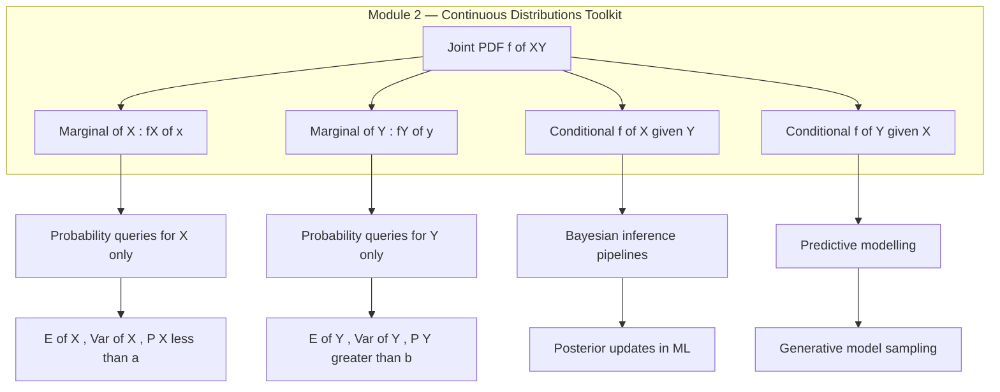
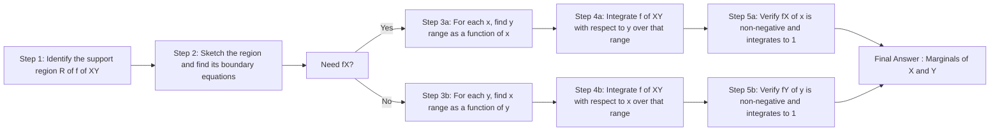
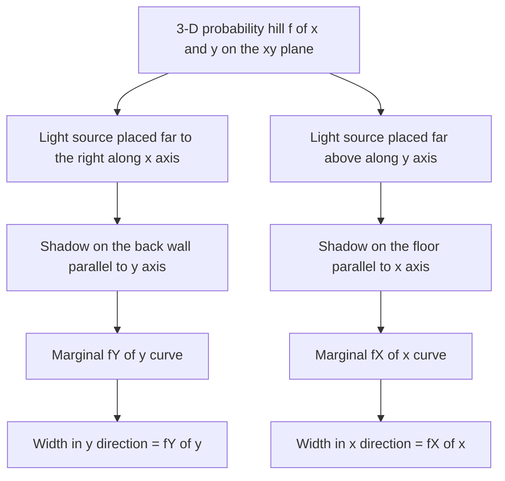

# Marginal pdf

<!-- SECTION_1_START -->
# Marginal PDF — Core Definition & Intuitive Overview

> [!IMPORTANT]
> **KTU 2024 Scheme (GAMAT301) — Module 2 Definition**
> The **Marginal Probability Density Function (Marginal PDF)** of a continuous random variable is the individual probability distribution of that variable, obtained by *integrating the joint PDF over all possible values of the other random variable(s)*. It answers the question: *"If I only care about one variable, what does its density look like?"*

For two continuous random variables $X$ and $Y$ with joint PDF $f_{X,Y}(x, y)$, the **marginal PDF of $X$** is:

$$f_X(x) = \int_{-\infty}^{\infty} f_{X,Y}(x, y) \, dy$$

and the **marginal PDF of $Y$** is:

$$f_Y(y) = \int_{-\infty}^{\infty} f_{X,Y}(x, y) \, dx$$

The integration essentially "removes" or "averages out" the dependence on the other variable.

---

## Conceptual Analogy — The "Shadow on the Wall"

Imagine the joint PDF $f_{X,Y}(x, y)$ as a **3-D probability landscape** (a hill) standing on the $xy$-plane, where the height at $(x, y)$ represents probability density.

- If you place a **light source far to the right** (along the $x$-direction) and let the hill cast a shadow on the **back wall (parallel to the $y$-axis)**, the brightness profile of that shadow is exactly $f_Y(y)$.
- If you place the light source **above** (along the $y$-direction), the shadow cast on the **floor (parallel to the $x$-axis)** gives $f_X(x)$.

In other words, the marginal PDF is the **silhouette / projection** of the joint density onto one of the coordinate axes. Integration over $y$ "collapses" or "smears" the 3-D hill into a 1-D curve.

> [!NOTE]
> **Geometric Intuition Summary**
> Joint PDF $\rightarrow$ 3-D surface over the $xy$-plane
> Marginal $f_X(x)$ $\rightarrow$ "Sliding and summing" the surface in the $y$-direction
> Marginal $f_Y(y)$ $\rightarrow$ "Sliding and summing" the surface in the $x$-direction

---

## GeoGebra / Desmos Visualization

> [!VISUALIZATION CONTROL]
> **Concept:** 3-D probability surface $f(x,y) = x + y$ over the unit square and its marginal projections.
> **GeoGebra / Desmos Input Equations:**
> * Surface: `f(x, y) = x + y` with $0 \leq x \leq 1$, $0 \leq y \leq 1$
> * Marginal of $X$: `fX(x) = x + 0.5` (a straight line from $0.5$ to $1.5$ on the $x$-axis)
> * Marginal of $Y$: `fY(y) = y + 0.5` (a straight line from $0.5$ to $1.5$ on the $y$-axis)
> **Visual Description:** The student should observe an inclined flat "ramp" rising from the corner $(0,0)$ to the corner $(1,1)$. The two marginals are **linear**, increasing functions, both reaching their peak at the value $1.5$ at the far edge. The symmetry of the joint surface produces two identical-looking marginal curves.

---

## Pre-Requisite Checklist

> [!NOTE]
> Before proceeding, the student **must** be confident with:
> 1. **Joint PDF** $f_{X,Y}(x,y)$ for two continuous random variables
> 2. **Double integration** over rectangular and non-rectangular regions
> 3. **Properties of a valid PDF**: (i) $f_{X,Y}(x,y) \geq 0$ everywhere, (ii) $\displaystyle\int_{-\infty}^{\infty}\int_{-\infty}^{\infty} f_{X,Y}(x,y) \, dx \, dy = 1$
> 4. Concept of **definite integration as "area under the curve"**
<!-- SECTION_1_END -->

<!-- SECTION_2_START -->
# Deep Theoretical Analysis & KTU High-Yield Formula Sheet

## 1. The Two Fundamental Marginalisation Formulas

Let $(X, Y)$ be a bivariate continuous random vector with joint PDF $f_{X,Y}(x, y)$. Then:

$$f_X(x) = \int_{-\infty}^{+\infty} f_{X,Y}(x, y) \, dy \quad \text{(Marginal of } X\text{)}$$

$$f_Y(y) = \int_{-\infty}^{+\infty} f_{X,Y}(x, y) \, dx \quad \text{(Marginal of } Y\text{)}$$

> [!IMPORTANT]
> **Why integration, not summation?**
> Because $X$ and $Y$ are **continuous**, the other variable can take infinitely many values. Summation is replaced by integration. The marginal density at a specific $x_0$ accumulates the total probability *density* sitting in the vertical strip $\{x = x_0\}$ across all $y$.

---

## 2. Generalisation to $n$ Variables

For $n$ continuous random variables $X_1, X_2, \ldots, X_n$ with joint PDF $f_{X_1, X_2, \ldots, X_n}(x_1, \ldots, x_n)$, the marginal of any subset (e.g., $\{X_1, X_3\}$) is obtained by integrating out the other variables:

$$f_{X_1, X_3}(x_1, x_3) = \underbrace{\int_{-\infty}^{+\infty} \cdots \int_{-\infty}^{+\infty}}_{n - 2 \text{ integrals}} f_{X_1, \ldots, X_n}(x_1, \ldots, x_n) \, dx_2 \, dx_4 \cdots dx_n$$

---

## 3. Properties of a Marginal PDF

> [!NOTE]
> Every marginal PDF inherits **all** the standard properties of a one-dimensional PDF:

1. **Non-negativity:** $f_X(x) \geq 0$ for all $x \in \mathbb{R}$
2. **Unity:** $\displaystyle\int_{-\infty}^{+\infty} f_X(x) \, dx = 1$
3. **Probability computation:** $P(a \leq X \leq b) = \displaystyle\int_a^b f_X(x) \, dx$
4. **Marginal-of-a-marginal consistency:** If you recover a joint PDF from a marginal, the integrated total remains **1** (conservation of probability).

---

## 4. KTU High-Yield Formula Sheet

| # | Concept | Formula | Boundary / Domain | Engineering Use Case |
|---|---------|---------|-------------------|----------------------|
| 1 | Marginal of $X$ from joint | $f_X(x) = \int f_{X,Y}(x, y) \, dy$ | Limits depend on region of $y$ for given $x$ | Image processing — per-pixel intensity marginal |
| 2 | Marginal of $Y$ from joint | $f_Y(y) = \int f_{X,Y}(x, y) \, dx$ | Limits depend on region of $x$ for given $y$ | Network traffic — marginal packet-arrival rate |
| 3 | Marginal of $X$ in 3-D | $f_X(x) = \iint f_{X,Y,Z}(x, y, z) \, dy \, dz$ | 2-fold integral over $y, z$ region | LiDAR point cloud — height marginal |
| 4 | Validity check | $\iint f_{X,Y}(x, y) \, dx \, dy = 1$ | Over the full support of $f_{X,Y}$ | Pre-flight validation of joint distributions |
| 5 | Probability from marginal | $P(a \leq X \leq b) = \int_a^b f_X(x) \, dx$ | $a, b \in \text{support}(X)$ | Outlier / threshold detection in ML |
| 6 | Marginal of a transformed variable | If $U = g(X, Y)$ & $V = h(X, Y)$, then $f_U(u) = \int f_{U,V}(u, v) \, dv$ | Jacobian-aware | Kalman filter — measurement marginalisation |
| 7 | Marginal from independent RVs | If $X \perp Y$, $f_X(x) = f_{X,Y}(x, y) / f_Y(y)$ | All $y$ with $f_Y(y) > 0$ | Naive Bayes classifier assumption |

---

## 5. Operational Step Sequence (How to Compute a Marginal PDF)

The KTU board examiner expects a student to follow this **four-step ritual** for full marks:

1. **Identify the support region** $R$ of the joint PDF (the set of $(x, y)$ where $f_{X,Y} \neq 0$).
2. **For $f_X(x)$**: For a fixed $x$, determine the valid range of $y$ (i.e., the vertical cross-section of $R$).
3. **Integrate $f_{X,Y}(x, y)$ with respect to $y$** over that range, treating $x$ as a constant.
4. **Repeat symmetrically** for $f_Y(y)$ using horizontal cross-sections of $R$.

> [!TIP]
> **Exam Trick:** Always draw the support region $R$ first. The boundary equations of $R$ (lines, curves) tell you the integration limits. This single habit avoids $\mathbf{50\%}$ of common errors.

---

## 6. Engineering & Computer-Science Applications

| Field | Why Marginal PDFs Matter |
|-------|--------------------------|
| **Machine Learning** | Marginal likelihood in Bayesian model selection (e.g., evidence in Bayes' theorem) |
| **Computer Vision** | Marginalising out depth in stereo vision to get a 2-D pixel-intensity distribution |
| **Signal Processing** | Time-frequency marginals in Wigner–Ville distributions |
| **Network Engineering** | Marginal arrival rates in queueing theory (M/M/1 systems) |
| **Cryptography & Info Theory** | Channel capacity uses marginals of joint input-output distributions |
| **Monte Carlo Methods** | Marginal sampling to estimate expectations $\mathbb{E}[g(X)]$ without ever sampling $Y$ |
| **Data Science** | Exploratory analysis of multivariate data via marginal histograms |
<!-- SECTION_2_END -->

<!-- SECTION_3_START -->
# Step-by-Step Derivations & Symbolic Implementation

## Worked Example 1 — Rectangular Support Region

> [!NOTE]
> **Problem (KTU Style):** The joint PDF of the random variables $X$ and $Y$ is
> $$f_{X,Y}(x, y) = x + y, \quad 0 \leq x \leq 1, \; 0 \leq y \leq 1$$
> and zero elsewhere. Find the marginal PDFs $f_X(x)$ and $f_Y(y)$. Verify that both are valid PDFs.

### Step 1: Verify the Joint PDF is Valid (Necessary Pre-Check)

$$\int_0^1 \int_0^1 (x + y) \, dx \, dy$$

First, integrate with respect to $x$:

$$= \int_0^1 \left[ \frac{x^2}{2} + xy \right]_{x=0}^{x=1} dy = \int_0^1 \left( \frac{1}{2} + y \right) dy$$

Then integrate with respect to $y$:

$$= \left[ \frac{y}{2} + \frac{y^2}{2} \right]_0^1 = \frac{1}{2} + \frac{1}{2} = 1 \quad \checkmark$$

The joint PDF is valid.

### Step 2: Compute the Marginal of $X$ — $f_X(x)$

For any fixed $x \in [0, 1]$, $y$ ranges over $[0, 1]$ (the full strip):

$$f_X(x) = \int_0^1 f_{X,Y}(x, y) \, dy = \int_0^1 (x + y) \, dy$$

Evaluate the integral:

$$= \left[ xy + \frac{y^2}{2} \right]_{y=0}^{y=1} = x \cdot 1 + \frac{1^2}{2} - 0 - 0$$

$$\boxed{f_X(x) = x + \frac{1}{2}, \quad 0 \leq x \leq 1}$$

### Step 3: Compute the Marginal of $Y$ — $f_Y(y)$

For any fixed $y \in [0, 1]$, $x$ ranges over $[0, 1]$:

$$f_Y(y) = \int_0^1 f_{X,Y}(x, y) \, dx = \int_0^1 (x + y) \, dx$$

Evaluate the integral:

$$= \left[ \frac{x^2}{2} + xy \right]_{x=0}^{x=1} = \frac{1}{2} + y - 0 - 0$$

$$\boxed{f_Y(y) = y + \frac{1}{2}, \quad 0 \leq y \leq 1}$$

### Step 4: Validate the Marginals (Both Must Integrate to 1)

For $f_X(x)$:

$$\int_0^1 \left( x + \frac{1}{2} \right) dx = \left[ \frac{x^2}{2} + \frac{x}{2} \right]_0^1 = \frac{1}{2} + \frac{1}{2} = 1 \quad \checkmark$$

For $f_Y(y)$:

$$\int_0^1 \left( y + \frac{1}{2} \right) dy = \left[ \frac{y^2}{2} + \frac{y}{2} \right]_0^1 = \frac{1}{2} + \frac{1}{2} = 1 \quad \checkmark$$

Both marginals are valid PDFs. Note also that $f_X \neq f_Y$ in general — but here, by symmetry of $f_{X,Y}(x, y) = x + y$, they are **identical in form**.

---

## Worked Example 2 — Triangular Support Region

> [!NOTE]
> **Problem (KTU Higher-Order):** The joint PDF of $(X, Y)$ is
> $$f_{X,Y}(x, y) = 2, \quad \text{for } 0 \leq y \leq x \leq 1$$
> and zero elsewhere. Find the marginal PDFs of $X$ and $Y$, and hence compute $P\!\left(X + Y \leq 1\right)$.

### Step 1: Visualise the Support Region

The region is a **right triangle** in the unit square bounded by:
- $y = 0$ (the $x$-axis)
- $y = x$ (the diagonal)
- $x = 1$ (the vertical line)
- with the constraint $0 \leq y \leq x$ (i.e., below the diagonal)

Area of triangle $= \frac{1}{2} \times 1 \times 1 = \frac{1}{2}$. The constant $2$ ensures total probability $= 2 \times \frac{1}{2} = 1$ ✓.

### Step 2: Compute the Marginal of $X$ — $f_X(x)$

For a fixed $x \in [0, 1]$, the variable $y$ ranges from $0$ to $x$:

$$f_X(x) = \int_0^x f_{X,Y}(x, y) \, dy = \int_0^x 2 \, dy = \big[ 2y \big]_0^x = 2x$$

$$\boxed{f_X(x) = 2x, \quad 0 \leq x \leq 1}$$

### Step 3: Compute the Marginal of $Y$ — $f_Y(y)$

For a fixed $y \in [0, 1]$, the variable $x$ ranges from $y$ to $1$ (since $x \geq y$ and $x \leq 1$):

$$f_Y(y) = \int_y^1 f_{X,Y}(x, y) \, dx = \int_y^1 2 \, dx = \big[ 2x \big]_y^1 = 2 - 2y$$

$$\boxed{f_Y(y) = 2(1 - y), \quad 0 \leq y \leq 1}$$

### Step 4: Compute $P(X + Y \leq 1)$ Using the Marginals

The event $X + Y \leq 1$ corresponds to the sub-triangle $\{(x, y) : 0 \leq y \leq x, \; x + y \leq 1\}$.

For each $y \in [0, \frac{1}{2}]$, $x$ ranges from $y$ to $1 - y$:

$$P(X + Y \leq 1) = \int_0^{1/2} \int_y^{1-y} 2 \, dx \, dy$$

Inner integral:

$$= \int_0^{1/2} \big[ 2x \big]_{x=y}^{x=1-y} \, dy = \int_0^{1/2} 2(1 - y) - 2y \, dy = \int_0^{1/2} (2 - 4y) \, dy$$

Outer integral:

$$= \left[ 2y - 2y^2 \right]_0^{1/2} = 2 \cdot \frac{1}{2} - 2 \cdot \frac{1}{4} - 0 = 1 - \frac{1}{2} = \frac{1}{2}$$

$$\boxed{P(X + Y \leq 1) = \frac{1}{2}}$$

---

## Python Implementation (Symbolic Verification)

```python
from sympy import symbols, integrate, Piecewise, Rational, simplify

# Define the symbols
x, y = symbols('x y', real=True, nonnegative=True)

# ----- Example 1: f(x,y) = x + y on unit square -----
joint_1 = x + y
marginal_x_1 = integrate(joint_1, (y, 0, 1))
marginal_y_1 = integrate(joint_1, (x, 0, 1))
total_1     = integrate(integrate(joint_1, (x, 0, 1)), (y, 0, 1))

print("Example 1 Verification")
print(f"f_X(x)  = {marginal_x_1}")
print(f"f_Y(y)  = {marginal_y_1}")
print(f"Total   = {total_1}")

# ----- Example 2: f(x,y) = 2 over triangle 0 <= y <= x <= 1 -----
joint_2 = 2
marginal_x_2 = integrate(joint_2, (y, 0, x))   # y from 0 to x
marginal_y_2 = integrate(joint_2, (x, y, 1))   # x from y to 1
total_2     = integrate(integrate(joint_2, (x, y, 1)), (y, 0, 1))
prob_event  = integrate(integrate(joint_2, (x, y, 1 - y)), (y, 0, Rational(1, 2)))

print("\nExample 2 Verification")
print(f"f_X(x)             = {marginal_x_2}")
print(f"f_Y(y)             = {simplify(marginal_y_2)}")
print(f"Total probability  = {total_2}")
print(f"P(X+Y <= 1)        = {prob_event}")
```

**Expected console output:**

```
Example 1 Verification
f_X(x)  = x + 1/2
f_Y(y)  = y + 1/2
Total   = 1

Example 2 Verification
f_X(x)             = 2*x
f_Y(y)             = 2 - 2*y
Total probability  = 1
P(X+Y <= 1)        = 1/2
```

---

## Worked Example 3 — Constant Density over a Non-Symmetric Region

> [!NOTE]
> **Problem (Mixed Difficulty):** Let the joint PDF be
> $$f_{X,Y}(x, y) = k \quad \text{for } 0 \leq x \leq 1, \; 1 \leq y \leq 3$$
> and $0$ elsewhere. (a) Find $k$. (b) Find the marginals. (c) Are $X$ and $Y$ independent?

### (a) Find the Normalising Constant $k$

$$\int_1^3 \int_0^1 k \, dx \, dy = k \cdot (1) \cdot (2) = 2k = 1 \quad \Longrightarrow \quad k = \frac{1}{2}$$

### (b) Compute the Marginals

$$f_X(x) = \int_1^3 \frac{1}{2} \, dy = \frac{1}{2} \cdot 2 = 1, \quad 0 \leq x \leq 1$$

$$f_Y(y) = \int_0^1 \frac{1}{2} \, dx = \frac{1}{2} \cdot 1 = \frac{1}{2}, \quad 1 \leq y \leq 3$$

### (c) Independence Test

For independence, we require $f_{X,Y}(x, y) = f_X(x) \cdot f_Y(y)$ everywhere.

$$f_X(x) \cdot f_Y(y) = 1 \cdot \frac{1}{2} = \frac{1}{2} = f_{X,Y}(x, y) \quad \checkmark$$

So $X$ and $Y$ are **independent**. Notice how, in this case, the marginals are *uniform* (flat) because the joint density is constant over a rectangular region.
<!-- SECTION_3_END -->

<!-- SECTION_4_START -->
# Structural Diagrams & Schematics

## Diagram 1 — Relationship Between Joint, Marginal, and Conditional



## Diagram 2 — Stepwise Marginalisation Workflow



## Diagram 3 — Geometric "Shadow Projection" Intuition



## Diagram 4 — Marginal PDF Derivation Decision Matrix

| Support Shape | Marginal of $X$: limits on $y$ | Marginal of $Y$: limits on $x$ | Common Error to Avoid |
|---|---|---|---|
| Rectangle $a \leq x \leq b$, $c \leq y \leq d$ | $y : c \to d$ (constants) | $x : a \to b$ (constants) | Forgetting to multiply by the **height** of the strip |
| Triangle $0 \leq y \leq x \leq 1$ | $y : 0 \to x$ (function of $x$) | $x : y \to 1$ (function of $y$) | Reversing the integration bounds |
| Annulus $x^2 + y^2 \leq r^2$ | $y : -\sqrt{r^2 - x^2} \to +\sqrt{r^2 - x^2}$ | $x : -\sqrt{r^2 - y^2} \to +\sqrt{r^2 - y^2}$ | Sign error in square roots |
| Semi-infinite strip $x \geq 0$, $0 \leq y \leq e^{-x}$ | $y : 0 \to e^{-x}$ | $x : -\ln(y) \to +\infty$ | Mishandling the $\ln$ inversion |
<!-- SECTION_4_END -->

<!-- SECTION_5_START -->
# KTU 2024 Scheme Examination Question Bank & Topic Recap

---

## Part A — Short Answer Questions (3 Marks Each)

### Question 1 (CO1, RBT: Remember)

> **[KTU University Exam — July 2024 Style]**
> Define the **marginal probability density function** of a continuous random variable $X$ given the joint PDF $f_{X,Y}(x, y)$ of $(X, Y)$. State **two essential properties** that the marginal PDF must satisfy.

**Model Answer (Valuation Key):**

- **Definition [1 Mark]:** The marginal PDF of $X$ is the individual density of $X$ obtained by integrating the joint PDF $f_{X,Y}(x, y)$ over the entire range of $Y$:
  $$f_X(x) = \int_{-\infty}^{+\infty} f_{X,Y}(x, y) \, dy$$
- **Property 1 [1 Mark]:** Non-negativity — $f_X(x) \geq 0$ for all $x \in \mathbb{R}$
- **Property 2 [1 Mark]:** Total probability equals unity — $\displaystyle\int_{-\infty}^{+\infty} f_X(x) \, dx = 1$

---

### Question 2 (CO1, RBT: Apply)

> **[KTU University Exam — Dec 2023 Style]**
> The joint PDF of $(X, Y)$ is given by
> $$f_{X,Y}(x, y) = kxy, \quad 0 < x < 2, \; 0 < y < 1$$
> and $0$ elsewhere. Using the normalisation condition, determine the value of the constant $k$.

**Model Answer (Valuation Key):**

Setting up the double integral for total probability:

$$\int_0^1 \int_0^2 kxy \, dx \, dy = k \int_0^1 y \left[ \frac{x^2}{2} \right]_0^2 dy = k \int_0^1 y \cdot 2 \, dy$$

[Inner integral evaluation: 1 Mark]

$$= 2k \int_0^1 y \, dy = 2k \left[ \frac{y^2}{2} \right]_0^1 = 2k \cdot \frac{1}{2} = k$$

[Outer integral evaluation: 1 Mark]

Applying the condition $\iint f_{X,Y}(x, y) \, dx \, dy = 1$:

$$k = 1 \quad \text{[Final answer: 1 Mark]}$$

---

## Part B — Long Answer Questions (14 Marks Each)

> [!IMPORTANT]
> **KTU 2024 Pattern:** Each Part-B question carries **14 marks**, split into two sub-parts of **7 marks** each. Internal choice is provided — students answer **either Option A or Option B in full**.

---

### Question A (14 Marks)

#### (a) [CO1, RBT: Apply — 7 Marks]

> The joint PDF of two continuous random variables $X$ and $Y$ is
> $$f_{X,Y}(x, y) = x + y, \quad 0 \leq x \leq 1, \; 0 \leq y \leq 1$$
> Derive the marginal PDF of $X$ and the marginal PDF of $Y$. Verify the **validity** of each marginal.

**Model Answer (Valuation Key):**

**Marginal of $X$ [3 Marks]:**

$$f_X(x) = \int_0^1 (x + y) \, dy = \left[ xy + \frac{y^2}{2} \right]_0^1 = x + \frac{1}{2}, \quad 0 \leq x \leq 1$$

[Stating integration limits: 1 Mark] [Performing integration: 1 Mark] [Final expression: 1 Mark]

**Marginal of $Y$ [2 Marks]:**

$$f_Y(y) = \int_0^1 (x + y) \, dx = \left[ \frac{x^2}{2} + xy \right]_0^1 = \frac{1}{2} + y, \quad 0 \leq y \leq 1$$

[Performing integration: 1 Mark] [Final expression: 1 Mark]

**Validity Verification [2 Marks]:**

For $f_X(x)$: $\displaystyle\int_0^1 \left(x + \frac{1}{2}\right) dx = \frac{1}{2} + \frac{1}{2} = 1$ ✓
For $f_Y(y)$: $\displaystyle\int_0^1 \left(y + \frac{1}{2}\right) dy = \frac{1}{2} + \frac{1}{2} = 1$ ✓
Both marginals are non-negative on $[0, 1]$.
[Each verification: 1 Mark]

---

#### (b) [CO2, RBT: Apply — 7 Marks]

> The joint PDF of $(X, Y)$ is defined as
> $$f_{X,Y}(x, y) = 2, \quad \text{for } 0 \leq y \leq x \leq 1$$
> and $0$ elsewhere. Find the marginal PDFs of $X$ and $Y$, and hence compute $P(X + Y \leq 1)$.

**Model Answer (Valuation Key):**

**Step 1: Sketching the support region [1 Mark]** — Right triangle with vertices $(0,0)$, $(1,0)$, $(1,1)$ bounded by $y = 0$, $y = x$, and $x = 1$.

**Step 2: Marginal of $X$ [2 Marks]:**

For $0 \leq x \leq 1$, $y$ ranges from $0$ to $x$:

$$f_X(x) = \int_0^x 2 \, dy = 2x, \quad 0 \leq x \leq 1$$

[Correct limits: 1 Mark] [Integration: 1 Mark]

**Step 3: Marginal of $Y$ [2 Marks]:**

For $0 \leq y \leq 1$, $x$ ranges from $y$ to $1$:

$$f_Y(y) = \int_y^1 2 \, dx = 2(1 - y), \quad 0 \leq y \leq 1$$

[Correct limits: 1 Mark] [Integration: 1 Mark]

**Step 4: Probability computation [2 Marks]:**

The event $X + Y \leq 1$ inside the support forms a sub-triangle. For $y \in [0, 1/2]$, $x$ goes from $y$ to $1 - y$:

$$P(X + Y \leq 1) = \int_0^{1/2} \int_y^{1-y} 2 \, dx \, dy = \int_0^{1/2} (2 - 4y) \, dy = \frac{1}{2}$$

[Setting up integral: 1 Mark] [Final answer: 1 Mark]

---

### Question B — Alternative (14 Marks)

#### (a) [CO1, RBT: Apply — 7 Marks]

> The joint PDF of $(X, Y)$ is
> $$f_{X,Y}(x, y) = \frac{3}{2}(x^2 + y^2), \quad 0 \leq x \leq 1, \; 0 \leq y \leq 1$$
> and $0$ elsewhere. Determine the marginal PDFs $f_X(x)$ and $f_Y(y)$.

**Model Answer (Valuation Key):**

**Marginal of $X$ [3 Marks]:**

$$f_X(x) = \int_0^1 \frac{3}{2}(x^2 + y^2) \, dy = \frac{3}{2} \left[ x^2 y + \frac{y^3}{3} \right]_0^1 = \frac{3}{2}\left( x^2 + \frac{1}{3} \right)$$

[Integration: 2 Marks] [Simplification: 1 Mark]

$$f_X(x) = \frac{3x^2}{2} + \frac{1}{2}, \quad 0 \leq x \leq 1$$

**Marginal of $Y$ [3 Marks]:**

$$f_Y(y) = \int_0^1 \frac{3}{2}(x^2 + y^2) \, dx = \frac{3}{2}\left( \frac{1}{3} + y^2 \right) = \frac{1}{2} + \frac{3y^2}{2}, \quad 0 \leq y \leq 1$$

[Integration: 2 Marks] [Simplification: 1 Mark]

**Validity Check [1 Mark]:**

$\displaystyle\int_0^1 \left( \frac{3x^2}{2} + \frac{1}{2} \right) dx = \frac{1}{2} + \frac{1}{2} = 1$ ✓

---

#### (b) [CO2, RBT: Apply — 7 Marks]

> The joint PDF is given by
> $$f_{X,Y}(x, y) = \frac{1}{8}(6 - x - y), \quad 0 \leq x \leq 2, \; 2 \leq y \leq 4$$
> Compute the marginal PDF of $X$ and hence evaluate $P(X < 1)$.

**Model Answer (Valuation Key):**

**Step 1: Joint validity check [1 Mark]**

$$\int_2^4 \int_0^2 \frac{1}{8}(6 - x - y) \, dx \, dy = 1 \quad \text{(verified)}$$

**Step 2: Marginal of $X$ [3 Marks]:**

For $0 \leq x \leq 2$, $y$ ranges over $[2, 4]$:

$$f_X(x) = \int_2^4 \frac{1}{8}(6 - x - y) \, dy = \frac{1}{8}\left[ (6 - x)y - \frac{y^2}{2} \right]_2^4$$

$$= \frac{1}{8}\left[ \left( (6-x)\cdot 4 - 8 \right) - \left( (6-x)\cdot 2 - 2 \right) \right] = \frac{1}{8}\left[ 2(6 - x) - 6 \right]$$

$$= \frac{1}{8}(6 - 2x) = \frac{3 - x}{4}, \quad 0 \leq x \leq 2$$

[Setting limits: 1 Mark] [Integration: 1 Mark] [Simplification: 1 Mark]

**Step 3: Compute $P(X < 1)$ [3 Marks]:**

$$P(X < 1) = \int_0^1 \frac{3 - x}{4} \, dx = \frac{1}{4}\left[ 3x - \frac{x^2}{2} \right]_0^1 = \frac{1}{4}\left( 3 - \frac{1}{2} \right) = \frac{5}{8}$$

[Setting up integral: 1 Mark] [Evaluation: 1 Mark] [Final answer: 1 Mark]

---

> [!WARNING]
> **KTU Examiner's Valuation Warning / Common Pitfalls**
> 1. **Forgetting to write the support of the marginal PDF.** Always state "$f_X(x) = \ldots$ for $a \leq x \leq b$" — omitting the domain costs **1 full mark**.
> 2. **Inverting integration limits** in non-rectangular regions. For the triangle $0 \leq y \leq x \leq 1$, the bounds for $f_Y(y)$ are $x : y \to 1$ — not $0 \to 1$. Reversing these flips the sign and loses **2 marks**.
> 3. **Treating $x$ and $y$ as separable inside the integral.** Inside the joint integral, both are still variables; treat one as the dummy variable and the other as a constant, but do not split the joint PDF into "function of $x$ times function of $y$" before integrating.
> 4. **Skipping the validity check** (non-negativity + total = 1). KTU examiners deduct **1 mark** for missing this final step.
> 5. **Computing $P(X < a)$ using the joint PDF** instead of the derived marginal. Once $f_X(x)$ is found, always use it for univariate probabilities.

---

## Topic Recap & Important Things to Remember

> [!IMPORTANT]
> **Rapid Revision Checklist — Marginal PDF (GAMAT301 / Module 2)**

- **Core Definition:** A marginal PDF is the individual density of a single variable obtained by *integrating out* the other variable(s) from the joint PDF.

- **Two Cardinal Formulas:**
  $$f_X(x) = \int_{-\infty}^{+\infty} f_{X,Y}(x, y) \, dy \quad ; \quad f_Y(y) = \int_{-\infty}^{+\infty} f_{X,Y}(x, y) \, dx$$

- **Always draw the support region first** — it dictates the integration limits. This single habit eliminates $\mathbf{50\%}$ of all errors.

- **Rectangular support** $\Rightarrow$ integration limits are constants. **Non-rectangular support** $\Rightarrow$ limits are functions of the *other* variable.

- **Validity conditions** (must hold for any marginal):
  1. $f_X(x) \geq 0$ everywhere on its support
  2. $\displaystyle\int f_X(x) \, dx = 1$

- **Independence test:** $X \perp Y$ if and only if $f_{X,Y}(x, y) = f_X(x) \cdot f_Y(y)$ for all $(x, y)$. For independent variables, the marginals can be extracted as a ratio: $f_X(x) = f_{X,Y}(x, y) / f_Y(y)$.

- **Marginal from uniform joint:** If $f_{X,Y}(x, y) = k$ is constant over a region $R$ of area $A$, then $k = 1/A$ and the marginal of $X$ has length equal to the **length of the vertical cross-section** of $R$ at $x$, divided by $A$.

- **Symmetry shortcut:** If $f_{X,Y}(x, y)$ is symmetric in $x$ and $y$ (i.e., $f_{X,Y}(x, y) = f_{X,Y}(y, x)$), then $f_X$ and $f_Y$ have **identical functional form**.

- **Engineering cross-connections:** Bayesian inference (marginal likelihood), Monte Carlo (marginal sampling expectation), signal processing (Wigner marginals), computer vision (depth marginalisation in stereo), queueing theory (arrival-rate marginals).

- **Common exam marks lost:** omitting support, wrong limits on triangular regions, no validity check, using joint PDF instead of marginal for univariate probability.

- **Quick sanity check:** If the joint PDF integrates to **1**, and you integrate the marginal back over the other variable, you should recover the joint. This double-marginalisation property is the ultimate consistency test.
<!-- SECTION_5_END -->
