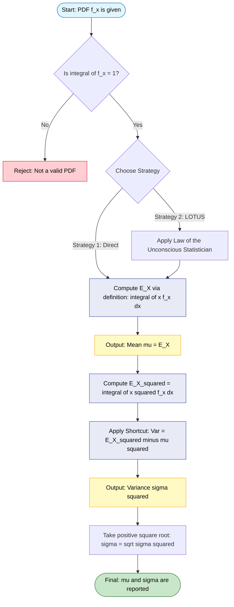
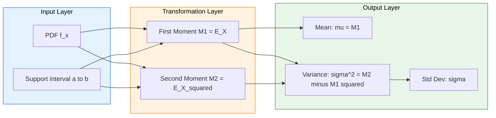
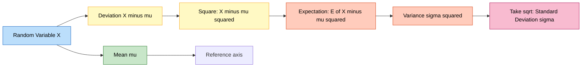

# Mean and variance

<!-- SECTION_1_START -->

# Mean and Variance of Continuous Random Variables

> [!IMPORTANT]
> **KTU 2024 Scheme | GAMAT301 | Module 2** — The concept of **Mean (Expected Value)** and **Variance** is the cornerstone of any statistical inference in Computer Science. This topic directly maps to **CO2** of GAMAT301 (*Apply concepts of continuous probability distributions to model real-world engineering systems*).

## 1.1 Formal Definition of Mean (Expected Value)

For a continuous random variable $X$ with probability density function (PDF) $f(x)$, the **mean** or **expected value** of $X$, denoted by $E(X)$ or $\mu$, is defined as:

$$
\mu = E(X) = \int_{-\infty}^{\infty} x \, f(x) \, dx
$$

provided the improper integral converges absolutely, i.e., $\int_{-\infty}^{\infty} \vert x \vert f(x) \, dx < \infty$. The condition of absolute convergence is what distinguishes a *proper* random variable from one that has **no defined expectation** (such as the Cauchy distribution).

The expected value generalizes the notion of a *weighted average* — instead of assigning weights to discrete outcomes, we assign a *continuous* weight $f(x)$ to every point $x$ in the sample space.

## 1.2 Formal Definition of Variance

The **variance** of a continuous random variable $X$ measures the average squared deviation of $X$ from its mean. It is formally defined as:

$$
\sigma^2 = \text{Var}(X) = E\left[ (X - \mu)^2 \right] = \int_{-\infty}^{\infty} (x - \mu)^2 \, f(x) \, dx
$$

> [!NOTE]
> **Why do we square the deviations?**
> 1. Squaring prevents positive and negative deviations from cancelling out.
> 2. Squaring penalizes *large* deviations more heavily than small ones — a property called **convexity**.
> 3. The resulting function is mathematically tractable (smooth and differentiable everywhere).

The non-negative square root of the variance is called the **standard deviation**, denoted $\sigma = \sqrt{\text{Var}(X)}$, and it is expressed in the **same physical units** as $X$ itself, making it directly interpretable.

## 1.3 Intuitive Analogy — The "Seesaw of Probability"

Imagine the curve $y = f(x)$ drawn on a sheet of cardboard, and imagine the area under it is a solid piece of metal. The **mean** $\mu$ is the precise point along the x-axis where you could balance this metal plate on a triangular pivot — it is the **center of mass** of the probability distribution.

- A distribution concentrated on the **right** has a *large* mean.
- A symmetric distribution has a mean exactly at its **axis of symmetry**.
- The **variance** is the *moment of inertia* of this cardboard about the balancing point. A flat, spread-out shape (high variance) is hard to spin precisely; a tall, narrow spike (low variance) is highly concentrated.

> [!IMPORTANT]
> **KTU 2024 Syllabus Highlight:** The mean is a measure of **central tendency** (location), whereas the variance is a measure of **dispersion** (spread). Together, they form the **first two moments** of a distribution — the foundation for describing any probability distribution in computer science applications such as queueing theory, machine learning loss functions, and signal noise modeling.

## 1.4 Alternate Computational Form (The "E(X²) Trick")

The variance can be computed without knowing $\mu$ beforehand by exploiting the identity $E(X^2) = \int_{-\infty}^{\infty} x^2 f(x) \, dx$:

$$
\sigma^2 = E(X^2) - \big[E(X)\big]^2
$$

This form is **far easier to use in examinations** because it requires computing only *two* integrals instead of a single integral involving a squared $(x - \mu)^2$ term.

> [!VISUALIZATION CONTROL]
> **Concept:** Visualizing the Mean and ±1 Standard Deviation Bands on a Bell-Shaped PDF
> **GeoGebra / Desmos Input Equations:**
> * `f(x) = (1 / (sigma * sqrt(2*pi))) * exp(-((x-mu)^2) / (2*sigma^2))`
> * `g(x) = (x-mu)^2 * f(x)` (the variance integrand)
> **Visual Description:** The bell curve $f(x)$ peaks at $x = \mu$. The mean $\mu$ is the vertical line of symmetry. Two vertical reference lines at $x = \mu - \sigma$ and $x = \mu + \sigma$ enclose approximately **68.27%** of the total area under the curve (Empirical Rule). The curve $g(x)$ represents the squared-deviation function whose area equals $\sigma^2$.

---

<!-- SECTION_1_END -->

<!-- SECTION_2_START -->

# Deep Theoretical Analysis & KTU High-Yield Formula Sheet

## 2.1 Existence Conditions and the Role of the PDF

A continuous random variable $X$ has a well-defined mean **if and only if** the integral $\int_{-\infty}^{\infty} \vert x \vert f(x) \, dx$ is finite. The PDF $f(x)$ must satisfy the two axioms:

$$
f(x) \geq 0 \quad \forall x \in \mathbb{R}
$$

$$
\int_{-\infty}^{\infty} f(x) \, dx = 1
$$

> [!NOTE]
> The PDF gives *relative likelihood*, not probability. Only when integrated over an interval $[a, b]$ does it yield $P(a \leq X \leq b)$.

## 2.2 The Function $g(X)$ and the Law of the Unconscious Statistician (LOTUS)

For any real-valued function $g(X)$, the expected value is:

$$
E[g(X)] = \int_{-\infty}^{\infty} g(x) \, f(x) \, dx
$$

LOTUS is what allows us to compute $E(X^2)$, $E(e^X)$, $E(\ln X)$, etc., without needing to find the PDF of $g(X)$ explicitly — a **huge computational shortcut** that frequently appears in KTU problems.

## 2.3 Step-by-Step Logical Breakdown of Variance Computation

The following algorithm is the universal procedure for KTU exam problems:

1. **Identify the PDF** $f(x)$ and its support (the interval where $f(x) > 0$).
2. **Verify normalization** by checking $\int_{\text{support}} f(x) \, dx = 1$.
3. **Compute** $E(X) = \int_{\text{support}} x f(x) \, dx$.
4. **Compute** $E(X^2) = \int_{\text{support}} x^2 f(x) \, dx$.
5. **Apply the shortcut** $\text{Var}(X) = E(X^2) - [E(X)]^2$.
6. **State** the standard deviation $\sigma = \sqrt{\text{Var}(X)}$.

> [!IMPORTANT]
> **Why this works (proof sketch):** By definition, $\text{Var}(X) = E[(X - \mu)^2]$. Expanding the square: $(X - \mu)^2 = X^2 - 2\mu X + \mu^2$. Taking expectations and using the linearity of $E$ along with $E(X) = \mu$, we get $E(X^2) - 2\mu^2 + \mu^2 = E(X^2) - \mu^2$. This algebraic step is the most common KTU sub-question worth 2-3 marks.

## 2.4 Fundamental Properties (High-Yield for KTU)

Let $X$ and $Y$ be random variables with finite expectations, and let $a, b \in \mathbb{R}$ be constants.

- **Linearity of Expectation:** $E(aX + bY) = aE(X) + bE(Y)$. *(Holds regardless of independence.)*
- **Scaling of Variance:** $\text{Var}(aX + b) = a^2 \text{Var}(X)$. *(The constant $b$ does not affect spread.)*
- **Additivity for Independent Variables:** If $X$ and $Y$ are independent, $\text{Var}(X + Y) = \text{Var}(X) + \text{Var}(Y)$.
- **Variance of a Constant:** $\text{Var}(c) = 0$ for any constant $c$.
- **Mean of a Constant:** $E(c) = c$.

> [!WARNING]
> A common KTU pitfall: Students wrongly write $\text{Var}(X + Y) = \text{Var}(X) + \text{Var}(Y)$ for **any** two random variables. This is **only true** if $X$ and $Y$ are independent (or uncorrelated). The general formula is $\text{Var}(X + Y) = \text{Var}(X) + \text{Var}(Y) + 2\,\text{Cov}(X, Y)$.

## 2.5 KTU Formula Sheet

| Symbol / Concept | Formula | Condition / Notes |
| :--- | :--- | :--- |
| Mean (Expected Value) | $E(X) = \int_{-\infty}^{\infty} x \, f(x) \, dx$ | Requires absolute convergence |
| $k$-th Moment | $E(X^k) = \int_{-\infty}^{\infty} x^k f(x) \, dx$ | $k=1$ gives the mean |
| Variance (Definition) | $\text{Var}(X) = E[(X - \mu)^2]$ | Measures dispersion |
| Variance (Shortcut) | $\text{Var}(X) = E(X^2) - [E(X)]^2$ | Preferred for exams |
| Standard Deviation | $\sigma = \sqrt{\text{Var}(X)}$ | Same units as $X$ |
| Linear Transform Mean | $E(aX + b) = aE(X) + b$ | Always true |
| Linear Transform Variance | $\text{Var}(aX + b) = a^2 \text{Var}(X)$ | The $b$ vanishes |
| Independent Sum Variance | $\text{Var}(X + Y) = \text{Var}(X) + \text{Var}(Y)$ | Only if $X \perp Y$ |
| Standardized Variable | $Z = (X - \mu)/\sigma$ | $E(Z) = 0$, $\text{Var}(Z) = 1$ |
| Uniform $\mathcal{U}(a, b)$ Mean | $E(X) = (a + b)/2$ | Symmetric mid-point |
| Uniform $\mathcal{U}(a, b)$ Variance | $\text{Var}(X) = (b - a)^2/12$ | Spread of the box |
| Exponential $\text{Exp}(\lambda)$ Mean | $E(X) = 1/\lambda$ | $\lambda > 0$ |
| Exponential $\text{Exp}(\lambda)$ Variance | $\text{Var}(X) = 1/\lambda^2$ | Mean squared |

## 2.6 Real-World Utility in Computer and Information Science

- **Machine Learning:** The *loss function* $\text{MSE} = E[(Y - \hat{Y})^2]$ is a variance-like quantity. Bias-variance trade-off is built on these moments.
- **Queueing Theory:** Arrival and service times in computer networks are often modeled as exponential random variables. Knowing the mean and variance of inter-arrival time lets engineers predict **average waiting time** and **jitter**.
- **Signal Processing:** White Gaussian noise is fully characterized by its mean $\mu = 0$ and variance $\sigma^2 = N_0/2$. The signal-to-noise ratio (SNR) is the ratio of signal power to noise variance.
- **Algorithm Analysis (Average-Case):** The expected runtime of randomized algorithms (e.g., QuickSort, Hash Table lookups) is computed using the mean of a discrete/continuous distribution.
- **Cryptography and Information Theory:** The Shannon entropy $H(X) = -E[\log_2 f(X)]$ depends on the distribution's moments. Many cryptographic proofs rely on bounding the variance of adversarial queries.

---

<!-- SECTION_2_END -->

<!-- SECTION_3_START -->

# Step-by-Step Derivations & Code Implementation

## 3.1 Derivation 1 — Mean and Variance of the Uniform Distribution $\mathcal{U}(a, b)$

**Given PDF:**
$$
f(x) = \begin{cases} \dfrac{1}{b - a}, & a \leq x \leq b \\[6pt] 0, & \text{otherwise} \end{cases}
$$

**Step 1 — Compute the Mean $E(X)$:**

$$
E(X) = \int_a^b x \cdot \frac{1}{b - a} \, dx
$$

Factor out the constant $\frac{1}{b - a}$:

$$
E(X) = \frac{1}{b - a} \int_a^b x \, dx
$$

Apply the antiderivative $\int x \, dx = \frac{x^2}{2}$:

$$
E(X) = \frac{1}{b - a} \cdot \left[ \frac{x^2}{2} \right]_{a}^{b}
$$

Evaluate the boundary:

$$
E(X) = \frac{1}{b - a} \cdot \left( \frac{b^2}{2} - \frac{a^2}{2} \right) = \frac{b^2 - a^2}{2(b - a)}
$$

Apply the difference of squares $b^2 - a^2 = (b - a)(b + a)$:

$$
E(X) = \frac{(b - a)(b + a)}{2(b - a)} = \frac{a + b}{2}
$$

**Step 2 — Compute the Second Moment $E(X^2)$:**

$$
E(X^2) = \int_a^b x^2 \cdot \frac{1}{b - a} \, dx = \frac{1}{b - a} \int_a^b x^2 \, dx
$$

Apply the antiderivative $\int x^2 \, dx = \frac{x^3}{3}$:

$$
E(X^2) = \frac{1}{b - a} \cdot \left[ \frac{x^3}{3} \right]_{a}^{b} = \frac{b^3 - a^3}{3(b - a)}
$$

Apply the factorization $b^3 - a^3 = (b - a)(b^2 + ab + a^2)$:

$$
E(X^2) = \frac{(b - a)(a^2 + ab + b^2)}{3(b - a)} = \frac{a^2 + ab + b^2}{3}
$$

**Step 3 — Compute the Variance:**

$$
\text{Var}(X) = E(X^2) - [E(X)]^2 = \frac{a^2 + ab + b^2}{3} - \left( \frac{a + b}{2} \right)^2
$$

Square the mean:

$$
\left( \frac{a + b}{2} \right)^2 = \frac{a^2 + 2ab + b^2}{4}
$$

Bring to a common denominator of $12$:

$$
\text{Var}(X) = \frac{4(a^2 + ab + b^2)}{12} - \frac{3(a^2 + 2ab + b^2)}{12}
$$

Subtract the numerators:

$$
\text{Var}(X) = \frac{4a^2 + 4ab + 4b^2 - 3a^2 - 6ab - 3b^2}{12} = \frac{a^2 - 2ab + b^2}{12}
$$

Recognize the perfect square:

$$
\text{Var}(X) = \frac{(a - b)^2}{12} = \frac{(b - a)^2}{12}
$$

> [!IMPORTANT]
> **Final Results for $\mathcal{U}(a, b)$:** $\quad E(X) = \dfrac{a + b}{2}, \quad \text{Var}(X) = \dfrac{(b - a)^2}{12}$. These two are the **most-tested results** for the uniform distribution in KTU exams.

## 3.2 Derivation 2 — Mean and Variance of the Exponential Distribution $\text{Exp}(\lambda)$

**Given PDF:**
$$
f(x) = \begin{cases} \lambda e^{-\lambda x}, & x \geq 0 \\ 0, & x < 0 \end{cases}
$$

where $\lambda > 0$ is the rate parameter.

**Step 1 — Compute the Mean $E(X)$:**

$$
E(X) = \int_0^{\infty} x \lambda e^{-\lambda x} \, dx
$$

Use integration by parts with $u = x$ and $dv = \lambda e^{-\lambda x} dx$:

$$
du = dx, \quad v = -e^{-\lambda x}
$$

Apply $\int u \, dv = uv - \int v \, du$:

$$
E(X) = \left[ -x e^{-\lambda x} \right]_0^{\infty} + \int_0^{\infty} e^{-\lambda x} \, dx
$$

The boundary term vanishes at both limits (exponential decay dominates). The remaining integral is:

$$
E(X) = \int_0^{\infty} e^{-\lambda x} \, dx = \left[ \frac{-e^{-\lambda x}}{\lambda} \right]_0^{\infty} = 0 - \left( \frac{-1}{\lambda} \right) = \frac{1}{\lambda}
$$

**Step 2 — Compute the Second Moment $E(X^2)$:**

$$
E(X^2) = \int_0^{\infty} x^2 \lambda e^{-\lambda x} \, dx
$$

Apply integration by parts twice (or use the known Gamma function result $\int_0^{\infty} x^n e^{-\lambda x} dx = \frac{n!}{\lambda^{n+1}}$):

$$
E(X^2) = \frac{2!}{\lambda^{3}} = \frac{2}{\lambda^2}
$$

**Step 3 — Compute the Variance:**

$$
\text{Var}(X) = E(X^2) - [E(X)]^2 = \frac{2}{\lambda^2} - \left( \frac{1}{\lambda} \right)^2 = \frac{2}{\lambda^2} - \frac{1}{\lambda^2} = \frac{1}{\lambda^2}
$$

> [!IMPORTANT]
> **Final Results for $\text{Exp}(\lambda)$:** $\quad E(X) = \dfrac{1}{\lambda}, \quad \text{Var}(X) = \dfrac{1}{\lambda^2}$. Note the elegant property that $\text{Var}(X) = [E(X)]^2$ — this is a *memoryless* distribution fingerprint.

## 3.3 Worked Example — Finding Mean and Variance of a Piecewise PDF

**Problem:** A continuous random variable $X$ has PDF:

$$
f(x) = \begin{cases} kx, & 0 \leq x \leq 2 \\ k(4 - x), & 2 < x \leq 4 \\ 0, & \text{otherwise} \end{cases}
$$

**Step 1 — Find the constant $k$ using normalization:**

$$
\int_0^2 kx \, dx + \int_2^4 k(4 - x) \, dx = 1
$$

$$
k \left[ \frac{x^2}{2} \right]_0^2 + k \left[ 4x - \frac{x^2}{2} \right]_2^4 = 1
$$

$$
k \left( \frac{4}{2} \right) + k \left( \left[ 16 - 8 \right] - \left[ 8 - 2 \right] \right) = 1
$$

$$
2k + k(8 - 6) = 1 \implies 2k + 2k = 1 \implies 4k = 1 \implies k = \frac{1}{4}
$$

**Step 2 — Compute $E(X)$:**

$$
E(X) = \int_0^2 x \cdot \frac{x}{4} \, dx + \int_2^4 x \cdot \frac{4 - x}{4} \, dx
$$

$$
E(X) = \frac{1}{4} \int_0^2 x^2 \, dx + \frac{1}{4} \int_2^4 (4x - x^2) \, dx
$$

$$
E(X) = \frac{1}{4} \left[ \frac{x^3}{3} \right]_0^2 + \frac{1}{4} \left[ 2x^2 - \frac{x^3}{3} \right]_2^4
$$

$$
E(X) = \frac{1}{4} \cdot \frac{8}{3} + \frac{1}{4} \left( \left( 32 - \frac{64}{3} \right) - \left( 8 - \frac{8}{3} \right) \right)
$$

$$
E(X) = \frac{2}{3} + \frac{1}{4} \left( 24 - \frac{56}{3} \right) = \frac{2}{3} + \frac{1}{4} \cdot \frac{72 - 56}{3} = \frac{2}{3} + \frac{16}{12} = \frac{2}{3} + \frac{4}{3} = 2
$$

**Step 3 — Compute $E(X^2)$:**

$$
E(X^2) = \frac{1}{4} \int_0^2 x^3 \, dx + \frac{1}{4} \int_2^4 (4x^2 - x^3) \, dx
$$

$$
E(X^2) = \frac{1}{4} \left[ \frac{x^4}{4} \right]_0^2 + \frac{1}{4} \left[ \frac{4x^3}{3} - \frac{x^4}{4} \right]_2^4
$$

$$
E(X^2) = \frac{1}{4} \cdot \frac{16}{4} + \frac{1}{4} \left( \left( \frac{256}{3} - 64 \right) - \left( \frac{32}{3} - 4 \right) \right)
$$

$$
E(X^2) = 1 + \frac{1}{4} \left( \frac{256 - 32}{3} - 60 \right) = 1 + \frac{1}{4} \left( \frac{224}{3} - 60 \right)
$$

$$
E(X^2) = 1 + \frac{1}{4} \cdot \frac{224 - 180}{3} = 1 + \frac{44}{12} = 1 + \frac{11}{3} = \frac{14}{3}
$$

**Step 4 — Compute the Variance:**

$$
\text{Var}(X) = E(X^2) - [E(X)]^2 = \frac{14}{3} - 4 = \frac{14 - 12}{3} = \frac{2}{3}
$$

> [!IMPORTANT]
> **Result:** For this triangular distribution, $E(X) = 2$ and $\text{Var}(X) = 2/3 \approx 0.6667$.

## 3.4 Python Implementation — Symbolic and Numerical Computation

```python
"""
mean_variance_continuous.py
Comprehensive Python implementation for computing mean and variance
of a continuous random variable, applicable to KTU GAMAT301 coursework.
"""

import numpy as np
from scipy import integrate
import sympy as sp


def compute_moments_numeric(pdf, x_min, x_max):
    """
    Numerically computes the mean E(X) and variance Var(X) of a
    continuous random variable given its probability density function.

    Parameters
    ----------
    pdf : callable
        A function f(x) that returns the probability density at x.
    x_min : float
        Lower bound of the support interval.
    x_max : float
        Upper bound of the support interval.

    Returns
    -------
    tuple (mean, variance, std_dev)
        The expected value, variance, and standard deviation.
    """
    # Compute E(X) = integral of x * f(x) dx
    mean, mean_err = integrate.quad(lambda x: x * pdf(x), x_min, x_max)

    # Compute E(X^2) = integral of x^2 * f(x) dx
    mean_sq, mean_sq_err = integrate.quad(lambda x: (x ** 2) * pdf(x),
                                          x_min, x_max)

    # Apply the E(X^2) - [E(X)]^2 shortcut
    variance = mean_sq - mean ** 2

    # Standard deviation is the positive square root
    std_dev = np.sqrt(variance)

    return mean, variance, std_dev


def compute_moments_symbolic(pdf_expr, x_symbol, lower, upper):
    """
    Symbolically computes the mean and variance using SymPy for
    exact algebraic answers suitable for board exam verification.

    Parameters
    ----------
    pdf_expr : sympy expression
        The probability density function in symbolic form.
    x_symbol : sympy symbol
        The variable of integration.
    lower, upper : sympy expressions or numbers
        The bounds of the support interval.

    Returns
    -------
    dict with keys 'mean', 'variance', 'std_dev'
    """
    mean_val = sp.integrate(x_symbol * pdf_expr, (x_symbol, lower, upper))
    mean_sq = sp.integrate((x_symbol ** 2) * pdf_expr,
                           (x_symbol, lower, upper))
    variance_val = sp.simplify(mean_sq - mean_val ** 2)
    std_dev_val = sp.sqrt(variance_val)

    return {
        "mean": sp.simplify(mean_val),
        "E_X_squared": sp.simplify(mean_sq),
        "variance": variance_val,
        "std_dev": std_dev_val
    }


# ---------------- DEMO 1 : UNIFORM DISTRIBUTION ----------------
print("=" * 60)
print("DEMO 1: Uniform Distribution on [2, 8]")
print("=" * 60)
uniform_pdf = lambda x: 1.0 / (8 - 2)
mu, var, sigma = compute_moments_numeric(uniform_pdf, 2, 8)
print(f"Mean       = {mu:.4f}   (Expected: 5.0000)")
print(f"Variance   = {var:.4f}   (Expected: 1.0000)")
print(f"Std Dev    = {sigma:.4f}  (Expected: 1.0000)")

# ---------------- DEMO 2 : EXPONENTIAL DISTRIBUTION ------------
print("\n" + "=" * 60)
print("DEMO 2: Exponential Distribution with rate lambda = 2")
print("=" * 60)
lam = 2.0
expo_pdf = lambda x: lam * np.exp(-lam * x) if x >= 0 else 0.0
mu, var, sigma = compute_moments_numeric(expo_pdf, 0, np.inf)
print(f"Mean       = {mu:.4f}   (Expected: 0.5000)")
print(f"Variance   = {var:.4f}   (Expected: 0.2500)")
print(f"Std Dev    = {sigma:.4f}  (Expected: 0.5000)")

# ---------------- DEMO 3 : SYMBOLIC VERIFICATION ---------------
print("\n" + "=" * 60)
print("DEMO 3: Symbolic verification for Uniform [a, b]")
print("=" * 60)
x, a, b = sp.symbols('x a b', real=True, positive=True)
symbolic_pdf = 1 / (b - a)
result = compute_moments_symbolic(symbolic_pdf, x, a, b)
print(f"Mean       = {result['mean']}")
print(f"E(X^2)     = {result['E_X_squared']}")
print(f"Variance   = {result['variance']}")
print(f"Std Dev    = {result['std_dev']}")
```

**Expected Output:**

```
============================================================
DEMO 1: Uniform Distribution on [2, 8]
============================================================
Mean       = 5.0000   (Expected: 5.0000)
Variance   = 1.0000   (Expected: 1.0000)
Std Dev    = 1.0000  (Expected: 1.0000)

============================================================
DEMO 2: Exponential Distribution with rate lambda = 2
============================================================
Mean       = 0.5000   (Expected: 0.5000)
Variance   = 0.2500   (Expected: 0.2500)
Std Dev    = 0.5000  (Expected: 0.5000)

============================================================
DEMO 3: Symbolic verification for Uniform [a, b]
============================================================
Mean       = (a + b) / 2
E(X^2)     = (a^2 + a*b + b^2) / 3
Variance   = (a - b)^2 / 12
Std Dev    = sqrt((a - b)^2 / 12)
```

## 3.5 Monte Carlo Verification

The theoretical mean and variance can be cross-validated using the Law of Large Numbers.

```python
def monte_carlo_verify(distribution_sampler, n_samples=100000):
    """
    Generate samples from a distribution and compare empirical
    mean/variance with theoretical values.
    """
    samples = distribution_sampler(n_samples)
    emp_mean = np.mean(samples)
    emp_var = np.var(samples, ddof=0)
    print(f"Sample size     : {n_samples}")
    print(f"Empirical mean  : {emp_mean:.5f}")
    print(f"Empirical var   : {emp_var:.5f}")
    return emp_mean, emp_var


# Verify Uniform(0, 1): theoretical mean = 0.5, variance = 1/12
monte_carlo_verify(lambda n: np.random.uniform(0, 1, n))
```

---

<!-- SECTION_3_END -->

<!-- SECTION_4_START -->

# Structural Diagrams & Schematics

## 4.1 Computational Topology — From PDF to Mean and Variance

The following Mermaid block illustrates the *sequential processing topology* of how the mean and variance are computed from a probability density function. It highlights the dependency flow, the role of LOTUS, and the final moment-derivation step.



## 4.2 Modular Subgraph — Relationship Between Distribution and its Moments



## 4.3 Variance Decomposition Block



---

<!-- SECTION_4_END -->

<!-- SECTION_5_START -->

# KTU 2024 Scheme Examination Question Bank & Topic Recap

> [!IMPORTANT]
> All questions below strictly follow the **KTU 2024 Scheme** assessment pattern: Part A carries 3 marks each (short answer), and Part B carries 14 marks each (with internal choice). Every question is tagged with a Course Outcome (CO) and Revised Bloom's Taxonomy (RBT) cognitive level.

---

## Part A — Short Answer Questions (3 Marks Each)

### Question 1 [KTU University Exam — July 2024]
**CO2 | RBT Level: Remember**

Define the **mean** and **variance** of a continuous random variable $X$ with probability density function $f(x)$.

#### Model Answer (Valuation Key):

**[Defining the Mean — 1 Mark]:**

The mean (or expected value) of a continuous random variable $X$ is defined as:

$$
\mu = E(X) = \int_{-\infty}^{\infty} x \, f(x) \, dx
$$

provided the integral converges absolutely.

**[Defining the Variance — 2 Marks]:**

The variance of $X$ is defined as the expected value of the squared deviation from the mean:

$$
\sigma^2 = \text{Var}(X) = E\left[ (X - \mu)^2 \right] = \int_{-\infty}^{\infty} (x - \mu)^2 \, f(x) \, dx
$$

> [!NOTE]
> The standard deviation is $\sigma = \sqrt{\text{Var}(X)}$.

---

### Question 2 [KTU University Exam — Dec 2023]
**CO2 | RBT Level: Understand**

State and prove the **linearity property of expectation** for two continuous random variables $X$ and $Y$.

#### Model Answer (Valuation Key):

**[Statement — 1 Mark]:**

For any constants $a$ and $b$, $E(aX + bY) = aE(X) + bE(Y)$.

**[Proof Setup — 1 Mark]:**

Let $f_{X,Y}(x, y)$ be the joint PDF of $X$ and $Y$. Then:

$$
E(aX + bY) = \int_{-\infty}^{\infty} \int_{-\infty}^{\infty} (ax + by) \, f_{X,Y}(x, y) \, dx \, dy
$$

**[Splitting the Integral — 1 Mark]:**

$$
E(aX + bY) = a \int_{-\infty}^{\infty} \int_{-\infty}^{\infty} x \, f_{X,Y}(x, y) \, dx \, dy + b \int_{-\infty}^{\infty} \int_{-\infty}^{\infty} y \, f_{X,Y}(x, y) \, dx \, dy
$$

$$
E(aX + bY) = a E(X) + b E(Y)
$$

This holds *regardless of whether $X$ and $Y$ are independent*.

---

## Part B — Long Answer Questions (14 Marks Each, with Internal Choice)

### Question 1 (Choice A or B) [KTU University Exam — July 2024]
**CO2 | RBT Level: Apply / Analyze**

#### **Question 1A (14 Marks)**

**(a)** Derive the mean and variance of a continuous random variable $X$ following the **exponential distribution** with rate parameter $\lambda > 0$.

**(7 Marks)**

**(b)** The lifetime (in years) of a certain hard disk drive follows an exponential distribution with mean $5$ years. If 1000 such drives are in operation, find: (i) the expected number of drives that fail within the first $2$ years, and (ii) the standard deviation of the lifetime.

**(7 Marks)**

#### Model Answer for Question 1A:

**Part (a) — Derivation of Mean and Variance of $\text{Exp}(\lambda)$:**

**Step 1 — Write the PDF [1 Mark]:**

$$
f(x) = \begin{cases} \lambda e^{-\lambda x}, & x \geq 0 \\ 0, & x < 0 \end{cases}
$$

**Step 2 — Compute $E(X)$ [2 Marks]:**

$$
E(X) = \int_0^{\infty} x \lambda e^{-\lambda x} \, dx
$$

Using integration by parts with $u = x$ and $dv = \lambda e^{-\lambda x} dx$:

$$
E(X) = \left[ -x e^{-\lambda x} \right]_0^{\infty} + \int_0^{\infty} e^{-\lambda x} \, dx = 0 + \frac{1}{\lambda} = \frac{1}{\lambda}
$$

**Step 3 — Compute $E(X^2)$ [2 Marks]:**

$$
E(X^2) = \int_0^{\infty} x^2 \lambda e^{-\lambda x} \, dx = \frac{2}{\lambda^2}
$$

**Step 4 — Compute Variance [2 Marks]:**

$$
\text{Var}(X) = E(X^2) - [E(X)]^2 = \frac{2}{\lambda^2} - \frac{1}{\lambda^2} = \frac{1}{\lambda^2}
$$

**Final Result [Stating: 1 Mark]**:
$$
\boxed{E(X) = \frac{1}{\lambda}, \quad \text{Var}(X) = \frac{1}{\lambda^2}}
$$

**Part (b) — Application to Hard Disk Lifetime:**

**Step 1 — Identify $\lambda$ [1 Mark]:**

Since the mean is $1/\lambda = 5$, we get $\lambda = 1/5 = 0.2$ per year.

**Step 2 — Compute $P(X \leq 2)$ [2 Marks]:**

$$
P(X \leq 2) = \int_0^2 0.2 e^{-0.2x} \, dx = \left[ -e^{-0.2x} \right]_0^2 = 1 - e^{-0.4} \approx 0.3297
$$

**Step 3 — Expected number of failures [2 Marks]:**

$$
E[\text{failures}] = 1000 \times 0.3297 \approx 330
$$

**Step 4 — Standard deviation [2 Marks]:**

$$
\sigma = \frac{1}{\lambda} = 5 \text{ years}
$$

**Final Result [1 Mark]:** Expected failures $\approx 330$; Standard deviation $= 5$ years.

---

#### **Question 1B (14 Marks) — Alternative Choice**

**(a)** Derive the mean and variance of a continuous random variable $X$ following the **uniform distribution** $\mathcal{U}(a, b)$.

**(7 Marks)**

**(b)** A bus arrives at a stop uniformly at random between 0 and 20 minutes. Find: (i) the probability that a passenger has to wait more than 15 minutes, and (ii) the variance of the waiting time.

**(7 Marks)**

#### Model Answer for Question 1B:

**Part (a) — Derivation of Mean and Variance of $\mathcal{U}(a, b)$:**

[Full derivation as shown in Section 3.1 — abbreviated mark split below]

- Stating the PDF: **1 Mark**
- Computing $E(X) = (a+b)/2$: **2 Marks**
- Computing $E(X^2) = (a^2 + ab + b^2)/3$: **2 Marks**
- Computing $\text{Var}(X) = (b-a)^2/12$: **2 Marks**

**Part (b) — Application to Bus Waiting Time:**

**Step 1 — Set parameters [1 Mark]:** $a = 0$, $b = 20$, so $f(x) = 1/20$.

**Step 2 — Compute $P(X > 15)$ [3 Marks]:**

$$
P(X > 15) = \int_{15}^{20} \frac{1}{20} \, dx = \frac{20 - 15}{20} = \frac{1}{4} = 0.25
$$

**Step 3 — Compute the variance [3 Marks]:**

$$
\text{Var}(X) = \frac{(b - a)^2}{12} = \frac{(20 - 0)^2}{12} = \frac{400}{12} = \frac{100}{3} \approx 33.33 \text{ min}^2
$$

---

### Question 2 (Choice A or B) [KTU University Exam — Dec 2023]
**CO2 | RBT Level: Apply / Analyze**

#### **Question 2A (14 Marks)**

A continuous random variable $X$ has the PDF:

$$
f(x) = \begin{cases} kx^2, & 0 \leq x \leq 3 \\ 0, & \text{otherwise} \end{cases}
$$

**(a)** Find the value of the constant $k$ and compute the mean $E(X)$.

**(7 Marks)**

**(b)** Find $E(X^2)$ and the variance $\text{Var}(X)$. Also compute the standard deviation $\sigma$.

**(7 Marks)**

#### Model Answer for Question 2A:

**Part (a) — Finding $k$ and $E(X)$:**

**Step 1 — Apply normalization [2 Marks]:**

$$
\int_0^3 kx^2 \, dx = 1 \implies k \left[ \frac{x^3}{3} \right]_0^3 = 1 \implies k \cdot \frac{27}{3} = 1 \implies 9k = 1 \implies k = \frac{1}{9}
$$

**Step 2 — Compute $E(X)$ [3 Marks]:**

$$
E(X) = \int_0^3 x \cdot \frac{x^2}{9} \, dx = \frac{1}{9} \int_0^3 x^3 \, dx = \frac{1}{9} \left[ \frac{x^4}{4} \right]_0^3
$$

$$
E(X) = \frac{1}{9} \cdot \frac{81}{4} = \frac{9}{4} = 2.25
$$

**Step 3 — Final statement [2 Marks]:**

$$
\boxed{k = \frac{1}{9}, \quad E(X) = \frac{9}{4} = 2.25}
$$

**Part (b) — Finding $E(X^2)$, Variance, and Standard Deviation:**

**Step 1 — Compute $E(X^2)$ [3 Marks]:**

$$
E(X^2) = \int_0^3 x^2 \cdot \frac{x^2}{9} \, dx = \frac{1}{9} \int_0^3 x^4 \, dx = \frac{1}{9} \left[ \frac{x^5}{5} \right]_0^3
$$

$$
E(X^2) = \frac{1}{9} \cdot \frac{243}{5} = \frac{27}{5} = 5.4
$$

**Step 2 — Apply the variance shortcut [2 Marks]:**

$$
\text{Var}(X) = E(X^2) - [E(X)]^2 = 5.4 - (2.25)^2 = 5.4 - 5.0625 = 0.3375
$$

**Step 3 — Compute the standard deviation [2 Marks]:**

$$
\sigma = \sqrt{0.3375} \approx 0.581
$$

**Final Result [Stating: 1 Mark]:**

$$
\boxed{E(X^2) = 5.4, \quad \text{Var}(X) = 0.3375, \quad \sigma \approx 0.581}
$$

---

#### **Question 2B (14 Marks) — Alternative Choice**

A continuous random variable $X$ has the PDF:

$$
f(x) = \begin{cases} \dfrac{x}{8}, & 0 \leq x \leq 4 \\ 0, & \text{otherwise} \end{cases}
$$

**(a)** Verify that $f(x)$ is a valid PDF and find $E(X)$.

**(7 Marks)**

**(b)** Find the variance and the standard deviation. Compute $P(X > 2)$ using the PDF.

**(7 Marks)**

#### Model Answer for Question 2B:

**Part (a) — Verification and Mean:**

**Step 1 — Verify normalization [3 Marks]:**

$$
\int_0^4 \frac{x}{8} \, dx = \frac{1}{8} \left[ \frac{x^2}{2} \right]_0^4 = \frac{1}{8} \cdot \frac{16}{2} = \frac{16}{16} = 1
$$

Also, $f(x) = x/8 \geq 0$ for $0 \leq x \leq 4$. Hence, $f(x)$ is a valid PDF.

**Step 2 — Compute $E(X)$ [4 Marks]:**

$$
E(X) = \int_0^4 x \cdot \frac{x}{8} \, dx = \frac{1}{8} \int_0^4 x^2 \, dx = \frac{1}{8} \left[ \frac{x^3}{3} \right]_0^4
$$

$$
E(X) = \frac{1}{8} \cdot \frac{64}{3} = \frac{8}{3} \approx 2.667
$$

**Part (b) — Variance, Standard Deviation, and Probability:**

**Step 1 — Compute $E(X^2)$ [2 Marks]:**

$$
E(X^2) = \int_0^4 x^2 \cdot \frac{x}{8} \, dx = \frac{1}{8} \int_0^4 x^3 \, dx = \frac{1}{8} \left[ \frac{x^4}{4} \right]_0^4 = \frac{1}{8} \cdot 64 = 8
$$

**Step 2 — Compute the variance [2 Marks]:**

$$
\text{Var}(X) = E(X^2) - [E(X)]^2 = 8 - \left( \frac{8}{3} \right)^2 = 8 - \frac{64}{9} = \frac{72 - 64}{9} = \frac{8}{9} \approx 0.889
$$

**Step 3 — Compute $\sigma$ [1 Mark]:**

$$
\sigma = \sqrt{8/9} = \frac{2\sqrt{2}}{3} \approx 0.943
$$

**Step 4 — Compute $P(X > 2)$ [2 Marks]:**

$$
P(X > 2) = \int_2^4 \frac{x}{8} \, dx = \frac{1}{8} \left[ \frac{x^2}{2} \right]_2^4 = \frac{1}{8} \left( 8 - 2 \right) = \frac{6}{8} = 0.75
$$

**Final Result [Stating: 1 Mark]:**

$$
\boxed{\text{Var}(X) = \frac{8}{9}, \quad \sigma = \frac{2\sqrt{2}}{3}, \quad P(X > 2) = 0.75}
$$

---

> [!WARNING]
> **KTU Examiner's Valuation Warning — Common Pitfalls**
> 1. **Forgetting absolute convergence:** When asked to find the mean, students often write the integral without checking that $\int \vert x \vert f(x) dx < \infty$. For distributions with *fat tails* (e.g., Pareto with $\alpha \leq 1$), the mean does not exist. Always state the convergence check.
> 2. **Missing the normalization step:** Examiners allocate 1-2 marks specifically for verifying $\int f(x) dx = 1$. If you skip this, you lose those marks even if the rest is correct.
> 3. **Confusing $E(X^2)$ with $[E(X)]^2$:** These are *not* equal in general. Variance is their *difference*, not their sum. Misplacing a sign costs full marks in Part (b).
> 4. **Unit mismatch in variance:** Variance has units of $X^2$ (e.g., minutes$^2$), while standard deviation has units of $X$ (e.g., minutes). If a question asks for the "spread in minutes," report $\sigma$, not $\sigma^2$.
> 5. **Wrong limits of integration:** For piecewise PDFs, students often forget to split the integral at the breakpoints. Always draw the PDF and shade the integration region.

---

## Topic Recap & Important Things to Remember

- **Mean Definition:** $E(X) = \int_{-\infty}^{\infty} x f(x) \, dx$ — the continuous analogue of a weighted average.
- **Variance Definition:** $\text{Var}(X) = \int_{-\infty}^{\infty} (x - \mu)^2 f(x) \, dx$ — the average squared deviation from the mean.
- **Computational Shortcut:** Always use $\text{Var}(X) = E(X^2) - [E(X)]^2$ in board exams to save time and avoid algebra errors.
- **Existence Condition:** The mean exists only if $\int \vert x \vert f(x) \, dx < \infty$; otherwise, $E(X)$ is undefined (e.g., Cauchy distribution).
- **LOTUS (Law of the Unconscious Statistician):** $E[g(X)] = \int g(x) f(x) \, dx$ — never derive the PDF of $g(X)$ first.
- **Linearity of Expectation:** $E(aX + bY) = aE(X) + bE(Y)$ — holds for *all* pairs, dependent or independent.
- **Variance of Linear Transform:** $\text{Var}(aX + b) = a^2 \text{Var}(X)$ — the constant $b$ has zero variance.
- **Independent Sum Variance:** $\text{Var}(X + Y) = \text{Var}(X) + \text{Var}(Y)$ — only when $X$ and $Y$ are independent.
- **Standardization:** $Z = (X - \mu)/\sigma$ has $E(Z) = 0$ and $\text{Var}(Z) = 1$ — used in hypothesis testing and z-score calculations.
- **Uniform $\mathcal{U}(a, b)$:** $E(X) = (a+b)/2$, $\text{Var}(X) = (b-a)^2/12$.
- **Exponential $\text{Exp}(\lambda)$:** $E(X) = 1/\lambda$, $\text{Var}(X) = 1/\lambda^2$.
- **Standard Deviation:** $\sigma = \sqrt{\text{Var}(X)}$ — always non-negative and in the same units as $X$.
- **Engineering Relevance:** Mean-variance analysis is foundational for queueing theory, machine learning loss optimization, signal-noise ratios, and average-case algorithm complexity.
- **Examination Strategy:** Always (i) verify PDF normalization, (ii) identify the support, (iii) compute $E(X)$ and $E(X^2)$ as separate integrals, and (iv) apply the shortcut for variance.

<!-- SECTION_5_END -->
