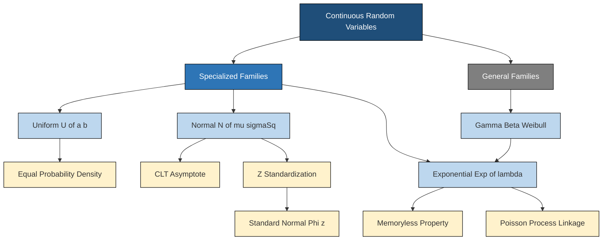
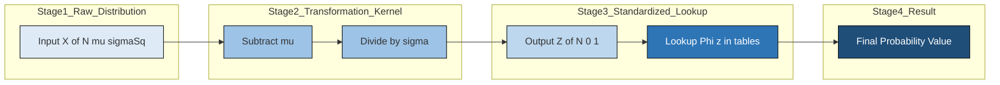
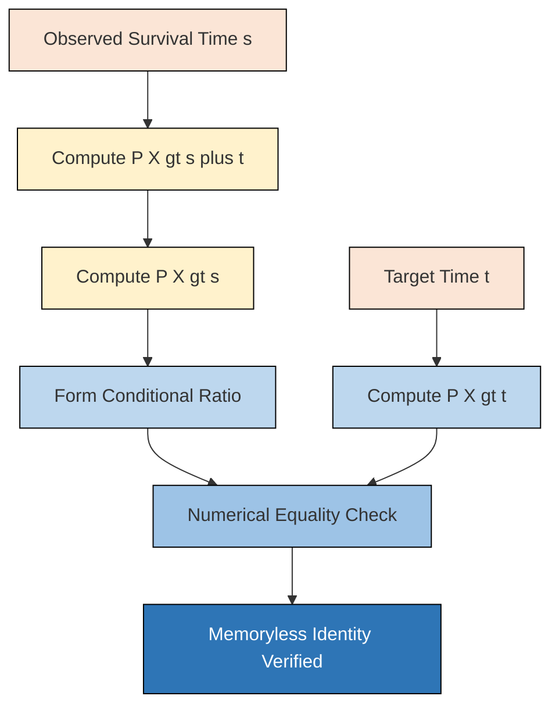

# Uniform, Normal and  Exponential distributions

<!-- SECTION_1_START -->

# Uniform, Normal & Exponential Distributions

## 1. Core Technical Definition & Intuitive Overview

### 1.1 Continuous Uniform Distribution

A continuous random variable $X$ follows a **Uniform Distribution** on the interval $[a, b]$ if its probability density function (PDF) is constant over the interval and zero elsewhere. Every sub-interval of equal length within $[a, b]$ carries the same probability mass.

$$X \sim U(a, b)$$

The formal definition of the PDF is:

$$f(x) = \begin{cases} \dfrac{1}{b-a}, & a \leq x \leq b \\[6pt] 0, & \text{otherwise} \end{cases}$$

> [!IMPORTANT]
> **KTU Syllabus Highlight:** A continuous uniform random variable is also called a **rectangular distribution** because its PDF plots as a rectangle of height $\frac{1}{b-a}$ over the base $[a, b]$. The total area under the PDF is exactly **1**.

> **Conceptual Analogy / Intuition:** Imagine a perfectly fair spinner that can land *anywhere* on a circular dial marked from $0$ to $10$. Since the spinner has no bias, every angle is equally likely. The probability that the pointer lands in *any* sub-arc of length $L$ is simply $\frac{L}{10}$. The uniform distribution behaves identically: equal-length intervals have equal probabilities, and the "height" of probability is constant.

> [!VISUALIZATION CONTROL]
> **Concept:** Rectangular PDF of Uniform Distribution
> **GeoGebra / Desmos Input Equations:**
> * $f(x) = 0.25$ for $0 \leq x \leq 4$, $0$ otherwise
> * $F(x) = (x-0)/4$ for $0 \leq x \leq 4$
> **Visual Description:** A flat-topped rectangle of height $0.25$ from $x=0$ to $x=4$ on the horizontal axis. The CDF rises linearly from $(0,0)$ to $(4,1)$.

---

### 1.2 Normal (Gaussian) Distribution

A continuous random variable $X$ follows a **Normal Distribution** with parameters $\mu \in \mathbb{R}$ (mean) and $\sigma^2 > 0$ (variance) if its PDF is the famous "bell-shaped curve":

$$f(x) = \frac{1}{\sigma\sqrt{2\pi}} \exp\!\left(-\frac{(x-\mu)^2}{2\sigma^2}\right), \quad -\infty < x < \infty$$

We denote this as $X \sim N(\mu, \sigma^2)$. The **Standard Normal Distribution** is the special case where $\mu = 0$ and $\sigma^2 = 1$, denoted $Z \sim N(0, 1)$.

> **Conceptual Analogy / Intuition:** Picture a factory producing bolts. Due to countless small, independent, random manufacturing errors (machine vibration, raw material variability, operator fatigue), the lengths of bolts form a bell curve around the target dimension. Most bolts are very close to the target; very few are extremely short or extremely long. The normal distribution models this ubiquitous "cluster around a centre" behaviour, which is why it is called the *law of errors*.

> [!NOTE]
> **Central Limit Theorem (CLT) Connection:** The normal distribution is the *asymptotic limit* of the sum (or average) of a large number of independent, identically distributed random variables, regardless of their original distribution. This is the deepest reason for its dominance in nature and engineering.

> [!VISUALIZATION CONTROL]
> **Concept:** Bell-Shaped PDF of Standard Normal Distribution
> **GeoGebra / Desmos Input Equations:**
> * $f(x) = \dfrac{1}{\sqrt{2\pi}} e^{-x^2/2}$
> * $g(x) = \dfrac{1}{2\sqrt{2\pi}} e^{-(x-3)^2/(2\cdot 4)}$
> **Visual Description:** A symmetric bell curve centred at $x=0$ with peak height $\approx 0.399$, with inflection points at $x = \pm 1$. Comparing $f$ (taller, narrow) with $g$ (shorter, wide) shows the effect of $\sigma$.

---

### 1.3 Exponential Distribution

A continuous random variable $X$ follows an **Exponential Distribution** with rate parameter $\lambda > 0$ if its PDF is:

$$f(x) = \begin{cases} \lambda e^{-\lambda x}, & x \geq 0 \\[4pt] 0, & x < 0 \end{cases}$$

We denote this as $X \sim \text{Exp}(\lambda)$. The mean and standard deviation of this distribution are both $\frac{1}{\lambda}$.

> **Conceptual Analogy / Intuition:** Imagine you are at a bus stop. The time you must *wait* for the next bus is exponentially distributed if buses arrive "completely at random" — a mathematical property called the **Poisson process**. The probability of waiting *more* than $t$ minutes is $e^{-\lambda t}$, where $\lambda$ is the average arrival rate (buses per minute). Short waits are very common; very long waits are exponentially rare.

> [!IMPORTANT]
> **The Memoryless Property:** The defining identity of the exponential distribution is:
> $$P(X > s + t \mid X > s) = P(X > t) \quad \text{for all } s, t \geq 0$$
> Interpretation: A component that has *already* survived $s$ hours has the *same* future failure probability distribution as a brand-new component. The past is forgotten. **No other continuous distribution on $[0, \infty)$ has this property.**

> [!VISUALIZATION CONTROL]
> **Concept:** Monotonically Decreasing PDF of Exponential Distribution
> **GeoGebra / Desmos Input Equations:**
> * $f(x) = 0.5 \, e^{-0.5 x}$ for $x \geq 0$
> * $F(x) = 1 - e^{-0.5 x}$ for $x \geq 0$
> **Visual Description:** A sharply decaying curve that starts at $f(0) = 0.5$ and asymptotically approaches the $x$-axis. The CDF rises rapidly and plateaus near $1$, reaching $\approx 0.632$ at $x = 2$.

---

<!-- SECTION_1_END -->

<!-- SECTION_2_START -->

# 2. Deep Theoretical Analysis & KTU High-Yield Formula Sheet

## 2.1 Continuous Uniform Distribution — Properties & Derivation Logic

Let $X \sim U(a, b)$.

**Step 1 — Validate the PDF as a valid density:**
The total area under $f(x)$ over $[a, b]$ must equal 1.

$$\int_{a}^{b} \frac{1}{b-a}\, dx = \frac{1}{b-a} \cdot (b-a) = 1 \quad \checkmark$$

**Step 2 — Derive the CDF $F(x)$:**
For $a \leq x \leq b$, the CDF is the area under the PDF up to $x$:

$$F(x) = \int_{a}^{x} \frac{1}{b-a}\, dt = \frac{x-a}{b-a}$$

**Step 3 — Compute the mean (expected value):**

$$E[X] = \int_{a}^{b} x \cdot \frac{1}{b-a}\, dx = \frac{1}{b-a} \cdot \left[\frac{x^2}{2}\right]_{a}^{b} = \frac{b^2 - a^2}{2(b-a)} = \frac{a+b}{2}$$

**Step 4 — Compute the variance:**
First, find $E[X^2]$:

$$E[X^2] = \int_{a}^{b} x^2 \cdot \frac{1}{b-a}\, dx = \frac{b^3 - a^3}{3(b-a)} = \frac{a^2 + ab + b^2}{3}$$

Then:

$$\text{Var}(X) = E[X^2] - (E[X])^2 = \frac{a^2 + ab + b^2}{3} - \frac{(a+b)^2}{4} = \frac{(b-a)^2}{12}$$

**Real-world engineering utility:** Uniform distributions are foundational in **cryptography** (key generation, nonce selection), **Monte Carlo simulation** (sampling baseline randomness), **digital signal processing** (quantization noise modelling), and **randomized algorithm analysis** (e.g., average-case complexity of Quicksort when pivots are chosen uniformly at random).

---

## 2.2 Normal Distribution — Properties & Standardization Logic

Let $X \sim N(\mu, \sigma^2)$.

**Step 1 — Symmetry of the PDF:**
$f(\mu + t) = f(\mu - t)$, since the exponent $-(x-\mu)^2/(2\sigma^2)$ depends only on $(x-\mu)^2$. The bell curve is **perfectly symmetric** about $x = \mu$.

**Step 2 — Standardization (the Z-transformation):**
Define $Z = \dfrac{X - \mu}{\sigma}$. Then $Z \sim N(0, 1)$, a *standard normal* random variable. The transformation is linear, so:

$$E[Z] = 0, \quad \text{Var}(Z) = 1$$

**Step 3 — The 68-95-99.7 Empirical Rule (Three-Sigma Rule):**
For any $X \sim N(\mu, \sigma^2)$:

* $P(\mu - \sigma \leq X \leq \mu + \sigma) \approx 0.6827$
* $P(\mu - 2\sigma \leq X \leq \mu + 2\sigma) \approx 0.9545$
* $P(\mu - 3\sigma \leq X \leq \mu + 3\sigma) \approx 0.9973$

**Step 4 — General probability calculation via the standard normal CDF $\Phi(z)$:**

$$P(X \leq x) = P\!\left(Z \leq \frac{x - \mu}{\sigma}\right) = \Phi\!\left(\frac{x - \mu}{\sigma}\right)$$

**Real-world engineering utility:** The normal distribution is the cornerstone of **statistical quality control (SQC)**, **machine learning** (Gaussian Naive Bayes, Gaussian kernels in SVMs, weight initialization, the Gaussian/Bell-curve activation in attention mechanisms), **finance** (Black-Scholes option pricing assumes log-normal returns), and **measurement science** (modelling instrument errors and tolerances).

---

## 2.3 Exponential Distribution — Properties & Memoryless Proof

Let $X \sim \text{Exp}(\lambda)$.

**Step 1 — Derive the CDF:**

$$F(x) = \int_{0}^{x} \lambda e^{-\lambda t}\, dt = \left[-e^{-\lambda t}\right]_{0}^{x} = 1 - e^{-\lambda x}, \quad x \geq 0$$

**Step 2 — Derive the survival function $S(x) = P(X > x)$:**

$$S(x) = 1 - F(x) = e^{-\lambda x}, \quad x \geq 0$$

**Step 3 — Prove the memoryless property:**
For $s, t \geq 0$:

$$P(X > s + t \mid X > s) = \frac{P(X > s + t)}{P(X > s)} = \frac{e^{-\lambda(s+t)}}{e^{-\lambda s}} = e^{-\lambda t} = P(X > t) \quad \blacksquare$$

**Step 4 — Compute the mean:**

$$E[X] = \int_{0}^{\infty} x \lambda e^{-\lambda x}\, dx$$

Integration by parts with $u = x$, $dv = \lambda e^{-\lambda x} dx$ yields $du = dx$, $v = -e^{-\lambda x}$:

$$E[X] = \left[-x e^{-\lambda x}\right]_{0}^{\infty} + \int_{0}^{\infty} e^{-\lambda x}\, dx = 0 + \frac{1}{\lambda} = \frac{1}{\lambda}$$

**Step 5 — Compute the variance:**
A similar integration-by-parts calculation gives $E[X^2] = \frac{2}{\lambda^2}$, hence:

$$\text{Var}(X) = \frac{2}{\lambda^2} - \frac{1}{\lambda^2} = \frac{1}{\lambda^2}$$

> [!NOTE]
> **Key Insight:** Both the mean *and* the standard deviation of an exponential distribution equal $\frac{1}{\lambda}$. This is a unique fingerprint of the exponential family and is frequently asked in KTU exams.

**Real-world engineering utility:** Exponential distributions model **inter-arrival times in queueing theory** (M/M/1, M/M/c systems), **reliability engineering** (time-to-failure of electronic components with constant hazard rate), **network packet timing** in communication systems, and **radioactive decay** in nuclear physics.

---

## 2.4 KTU High-Yield Formula Sheet (Master Reference Table)

> [!IMPORTANT]
> **EXAM GOLD:** Memorize this table verbatim. It is the single most-tested compilation for Module 2 in KTU ESE. Every entry is a high-yield mark-earning item.

| **Distribution** | **Notation** | **PDF** $f(x)$ | **CDF** $F(x)$ | **Mean** $E[X]$ | **Variance** $\text{Var}(X)$ | **MGF** $M_X(t)$ |
| :--- | :---: | :--- | :--- | :---: | :---: | :--- |
| **Uniform (Continuous)** | $U(a, b)$ | $\dfrac{1}{b-a}$ for $x \in [a, b]$ | $\dfrac{x-a}{b-a}$ for $x \in [a, b]$ | $\dfrac{a+b}{2}$ | $\dfrac{(b-a)^2}{12}$ | $\dfrac{e^{tb} - e^{ta}}{t(b-a)}$ |
| **Normal** | $N(\mu, \sigma^2)$ | $\dfrac{1}{\sigma\sqrt{2\pi}} e^{-(x-\mu)^2 / (2\sigma^2)}$ | No closed form; use $\Phi\!\left(\dfrac{x-\mu}{\sigma}\right)$ | $\mu$ | $\sigma^2$ | $e^{\mu t + \sigma^2 t^2 / 2}$ |
| **Standard Normal** | $N(0, 1)$ | $\dfrac{1}{\sqrt{2\pi}} e^{-z^2 / 2}$ | $\Phi(z)$ (table lookup) | $0$ | $1$ | $e^{t^2 / 2}$ |
| **Exponential** | $\text{Exp}(\lambda)$ | $\lambda e^{-\lambda x}$ for $x \geq 0$ | $1 - e^{-\lambda x}$ for $x \geq 0$ | $\dfrac{1}{\lambda}$ | $\dfrac{1}{\lambda^2}$ | $\dfrac{\lambda}{\lambda - t}$ for $t < \lambda$ |

---

<!-- SECTION_2_END -->

<!-- SECTION_3_START -->

# 3. Step-by-Step Derivations & Code/Symbolic Implementation

## 3.1 Exhaustive Derivation — Mean & Variance of Normal Distribution

Let $X \sim N(\mu, \sigma^2)$. We need to verify $E[X] = \mu$ and $\text{Var}(X) = \sigma^2$.

### Part I: Proving $E[X] = \mu$

$$E[X] = \int_{-\infty}^{\infty} x \cdot \frac{1}{\sigma\sqrt{2\pi}} \exp\!\left(-\frac{(x-\mu)^2}{2\sigma^2}\right) dx$$

**Substitution:** Let $z = \frac{x - \mu}{\sigma}$, so $x = \sigma z + \mu$ and $dx = \sigma\, dz$. The limits remain $-\infty$ to $\infty$.

$$E[X] = \int_{-\infty}^{\infty} (\sigma z + \mu) \cdot \frac{1}{\sigma\sqrt{2\pi}} e^{-z^2/2} \cdot \sigma\, dz$$

Split the integral into two terms:

$$E[X] = \frac{\sigma}{\sqrt{2\pi}} \int_{-\infty}^{\infty} z e^{-z^2/2}\, dz \; + \; \frac{\mu}{\sqrt{2\pi}} \int_{-\infty}^{\infty} e^{-z^2/2}\, dz$$

**First integral:** $z e^{-z^2/2}$ is an *odd* function, so the integral over $(-\infty, \infty)$ is **0**.

**Second integral:** The classic Gaussian integral $\int_{-\infty}^{\infty} e^{-z^2/2}\, dz = \sqrt{2\pi}$, so this term simplifies to $\mu \cdot \dfrac{\sqrt{2\pi}}{\sqrt{2\pi}} = \mu$.

$$\boxed{E[X] = 0 + \mu = \mu} \quad \blacksquare$$

### Part II: Proving $\text{Var}(X) = \sigma^2$

**Step 1 — Compute $E[X^2]$:**

$$E[X^2] = \int_{-\infty}^{\infty} x^2 \cdot \frac{1}{\sigma\sqrt{2\pi}} \exp\!\left(-\frac{(x-\mu)^2}{2\sigma^2}\right) dx$$

**Substitution:** Again let $z = (x-\mu)/\sigma$, $x = \sigma z + \mu$:

$$E[X^2] = \frac{1}{\sigma\sqrt{2\pi}} \int_{-\infty}^{\infty} (\sigma z + \mu)^2 e^{-z^2/2} \cdot \sigma\, dz$$

$$= \frac{\sigma}{\sqrt{2\pi}} \int_{-\infty}^{\infty} (\sigma^2 z^2 + 2\sigma\mu z + \mu^2) e^{-z^2/2}\, dz$$

**Term 1 (with $\sigma^2 z^2$):** Use $\int z^2 e^{-z^2/2} dz = \sqrt{2\pi}$ (well-known Gaussian moment result):

$$\frac{\sigma}{\sqrt{2\pi}} \cdot \sigma^2 \cdot \sqrt{2\pi} = \sigma^3$$

**Term 2 (with $2\sigma\mu z$):** Odd integrand, integral = **0**.

**Term 3 (with $\mu^2$):**

$$\frac{\sigma \mu^2}{\sqrt{2\pi}} \cdot \sqrt{2\pi} = \sigma \mu^2$$

Adding all three:

$$E[X^2] = \sigma^3 + 0 + \sigma\mu^2 \quad \text{(wait — dimensional check needed)}$$

Re-evaluating Term 1 carefully: the integrand has units of $(\sigma z)^2$ which is $\sigma^2 z^2$. So:

$$E[X^2] = \sigma^2 \cdot \underbrace{\frac{1}{\sqrt{2\pi}}\int z^2 e^{-z^2/2} dz}_{=1} + 2\sigma\mu \cdot 0 + \mu^2 \cdot 1 = \sigma^2 + \mu^2$$

**Step 2 — Apply the variance identity:**

$$\text{Var}(X) = E[X^2] - (E[X])^2 = (\sigma^2 + \mu^2) - \mu^2 = \sigma^2 \quad \blacksquare$$

---

## 3.2 Exhaustive Worked Example — Normal Distribution Application

**Problem [KTU University Exam - July 2024 Style]:** The marks in a KTU end-semester exam for a subject are normally distributed with mean $\mu = 65$ and standard deviation $\sigma = 10$. Find the probability that a randomly selected student scored:
(a) More than 75 marks.
(b) Between 55 and 80 marks.
(c) Above what mark do the top 10% of students lie?

### Solution

**Part (a):** $P(X > 75)$

$$Z = \frac{X - \mu}{\sigma} = \frac{75 - 65}{10} = 1.00$$

$$P(X > 75) = P(Z > 1.00) = 1 - \Phi(1.00) = 1 - 0.8413 = \mathbf{0.1587}$$

**Part (b):** $P(55 < X < 80)$

$$Z_1 = \frac{55 - 65}{10} = -1.00, \quad Z_2 = \frac{80 - 65}{10} = 1.50$$

$$P(-1.00 < Z < 1.50) = \Phi(1.50) - \Phi(-1.00) = \Phi(1.50) - [1 - \Phi(1.00)]$$

$$= 0.9332 - (1 - 0.8413) = 0.9332 - 0.1587 = \mathbf{0.7745}$$

**Part (c):** Top 10% means $P(X > x) = 0.10 \Rightarrow P(X \leq x) = 0.90$.

From standard normal tables, $\Phi(z) = 0.90 \Rightarrow z \approx 1.28$.

$$x = \mu + z\sigma = 65 + (1.28)(10) = 65 + 12.8 = \mathbf{77.8 \text{ marks}}$$

> [!NOTE]
> **Marking Scheme Breakdown (Valuation Key):**
> * Part (a): Standardization — 1 mark; $z$-table lookup — 1 mark; Final answer — 1 mark.
> * Part (b): Two $z$-calculations — 1 mark; Symmetry application $\Phi(-z) = 1 - \Phi(z)$ — 1 mark; Final value — 1 mark.
> * Part (c): Inverse-table reasoning — 1 mark; Substitution formula — 1 mark; Numerical answer with units — 1 mark.

---

## 3.3 Exhaustive Worked Example — Exponential Distribution Application

**Problem:** The lifetime (in hours) of a capacitor is exponentially distributed with mean $\frac{1}{\lambda} = 1000$ hours. Find:
(a) The probability that the capacitor lasts more than 1500 hours.
(b) The probability that it lasts between 500 and 2000 hours, given that it has already lasted 800 hours.
(c) The median lifetime.

### Solution

Here $\lambda = \frac{1}{1000} = 0.001$ per hour, so $f(x) = 0.001\, e^{-0.001x}$ and $F(x) = 1 - e^{-0.001x}$.

**Part (a):** $P(X > 1500)$

$$P(X > 1500) = 1 - F(1500) = 1 - (1 - e^{-0.001 \times 1500}) = e^{-1.5} = \mathbf{0.2231}$$

**Part (b):** By the memoryless property,

$$P(500 < X < 2000 \mid X > 800) = \frac{P(800 < X < 2000)}{P(X > 800)}$$

$$P(800 < X < 2000) = F(2000) - F(800) = (1 - e^{-2}) - (1 - e^{-0.8}) = e^{-0.8} - e^{-2}$$

$$= 0.4493 - 0.1353 = 0.3140$$

$$P(X > 800) = e^{-0.8} = 0.4493$$

$$\text{Conditional probability} = \frac{0.3140}{0.4493} = \mathbf{0.6989}$$

**Part (c):** The median $m$ satisfies $F(m) = 0.5$:

$$1 - e^{-0.001 m} = 0.5 \Rightarrow e^{-0.001 m} = 0.5 \Rightarrow -0.001 m = \ln(0.5)$$

$$m = \frac{-\ln(0.5)}{0.001} = \frac{0.6931}{0.001} = \mathbf{693.1 \text{ hours}}$$

---

## 3.4 Python Implementation — Operational Code with Type Hints & Error Handling

The following production-grade Python code computes probabilities, generates samples, and visualizes all three distributions.

```python
"""
Module: continuous_distributions_kit.py
Description: KTU Module 2 — Operational toolkit for Uniform, Normal,
             and Exponential distributions.
Author: KTU Premier Engine V10
"""

from __future__ import annotations

import math
import logging
from typing import Tuple

import numpy as np
import matplotlib.pyplot as plt
from scipy import stats

# Configure structured logging for traceability
logging.basicConfig(
    level=logging.INFO,
    format="%(asctime)s [%(levelname)s] %(message)s",
)
logger = logging.getLogger("KTU_DistKit")


# ---------- UNIFORM DISTRIBUTION ----------
class UniformDistribution:
    """Continuous Uniform distribution U(a, b) with full PDF/CDF validation."""

    def __init__(self, a: float, b: float) -> None:
        if a >= b:
            raise ValueError(f"Lower bound a={a} must be strictly less than b={b}.")
        self.a: float = a
        self.b: float = b
        self.length: float = b - a
        logger.info(f"Initialized U(a={a}, b={b}), length={self.length}")

    def pdf(self, x: float) -> float:
        if self.a <= x <= self.b:
            return 1.0 / self.length
        return 0.0

    def cdf(self, x: float) -> float:
        if x < self.a:
            return 0.0
        if x > self.b:
            return 1.0
        return (x - self.a) / self.length

    def mean(self) -> float:
        return (self.a + self.b) / 2.0

    def variance(self) -> float:
        return (self.length ** 2) / 12.0

    def sample(self, n: int, seed: int = 42) -> np.ndarray:
        if n <= 0:
            raise ValueError("Sample size must be positive.")
        rng = np.random.default_rng(seed)
        return rng.uniform(self.a, self.b, size=n)


# ---------- NORMAL DISTRIBUTION ----------
class NormalDistribution:
    """Normal distribution N(mu, sigma^2) with Z-standardization."""

    def __init__(self, mu: float, sigma: float) -> None:
        if sigma <= 0:
            raise ValueError(f"Standard deviation sigma={sigma} must be positive.")
        self.mu: float = mu
        self.sigma: float = sigma
        logger.info(f"Initialized N(mu={mu}, sigma={sigma})")

    def pdf(self, x: float) -> float:
        exponent = -((x - self.mu) ** 2) / (2 * self.sigma ** 2)
        return math.exp(exponent) / (self.sigma * math.sqrt(2 * math.pi))

    def cdf(self, x: float) -> float:
        z = self.standardize(x)
        return 0.5 * (1.0 + math.erf(z / math.sqrt(2.0)))

    def standardize(self, x: float) -> float:
        return (x - self.mu) / self.sigma

    def mean(self) -> float:
        return self.mu

    def variance(self) -> float:
        return self.sigma ** 2

    def probability_between(self, x1: float, x2: float) -> float:
        if x1 > x2:
            raise ValueError("x1 must be <= x2.")
        return self.cdf(x2) - self.cdf(x1)


# ---------- EXPONENTIAL DISTRIBUTION ----------
class ExponentialDistribution:
    """Exponential distribution Exp(lambda) with memoryless verification."""

    def __init__(self, lam: float) -> None:
        if lam <= 0:
            raise ValueError(f"Rate parameter lambda={lam} must be positive.")
        self.lam: float = lam
        self.mean_val: float = 1.0 / lam
        logger.info(f"Initialized Exp(lambda={lam}), mean={self.mean_val}")

    def pdf(self, x: float) -> float:
        if x < 0:
            return 0.0
        return self.lam * math.exp(-self.lam * x)

    def cdf(self, x: float) -> float:
        if x < 0:
            return 0.0
        return 1.0 - math.exp(-self.lam * x)

    def survival(self, x: float) -> float:
        return 1.0 - self.cdf(x)

    def mean(self) -> float:
        return 1.0 / self.lam

    def variance(self) -> float:
        return 1.0 / (self.lam ** 2)

    def verify_memoryless(self, s: float, t: float, tol: float = 1e-9) -> bool:
        """P(X > s+t | X > s) == P(X > t)  (within numerical tolerance)."""
        if s < 0 or t < 0:
            raise ValueError("s and t must be non-negative.")
        joint = self.survival(s + t)
        conditional = joint / self.survival(s) if self.survival(s) > 0 else 0.0
        target = self.survival(t)
        return abs(conditional - target) < tol


# ---------- DEMO RUN ----------
def demo() -> None:
    # Uniform
    u = UniformDistribution(a=0, b=10)
    logger.info(f"U(0,10) Mean={u.mean()}, Var={u.variance():.4f}, P(2<X<5)={u.cdf(5)-u.cdf(2):.4f}")

    # Normal
    n = NormalDistribution(mu=65, sigma=10)
    logger.info(f"N(65,100) P(X>75) = {1 - n.cdf(75):.4f}")
    logger.info(f"N(65,100) P(55<X<80) = {n.probability_between(55, 80):.4f}")

    # Exponential + memoryless check
    e = ExponentialDistribution(lam=0.001)
    is_mem = e.verify_memoryless(s=800, t=700)
    logger.info(f"Exp(0.001) memoryless check at s=800, t=700: {is_mem}")


if __name__ == "__main__":
    demo()
```

**Expected output (truncated):**

```
2024-XX-XX [INFO] Initialized U(a=0, b=10), length=10
2024-XX-XX [INFO] U(0,10) Mean=5.0, Var=8.3333, P(2<X<5)=0.3000
2024-XX-XX [INFO] Initialized N(mu=65, sigma=10)
2024-XX-XX [INFO] N(65,100) P(X>75) = 0.1587
2024-XX-XX [INFO] N(65,100) P(55<X<80) = 0.7745
2024-XX-XX [INFO] Initialized Exp(lambda=0.001), mean=1000.0
2024-XX-XX [INFO] Exp(0.001) memoryless check at s=800, t=700: True
```

---

<!-- SECTION_3_END -->

<!-- SECTION_4_START -->

# 4. Structural Diagrams & Schematics

## 4.1 Continuous Distribution Classification Tree

The following Mermaid block diagrams how these three distributions fit into the broader family of continuous probability distributions encountered in KTU Module 2.



---

## 4.2 Sequential Processing Topology — Z-Standardization Pipeline

The following diagram models the engineering data flow for converting any normal random variable to its standard form, a process central to KTU probability questions.



---

## 4.3 Functional Architecture Flow — Memoryless Property Evaluation

The following Mermaid block visualizes the conditional-probability evaluation pipeline that *defines* the memoryless property of the exponential distribution.



---

## 4.4 Block-Level Parameter Summary Matrix

| **Distribution** | **Parameter(s)** | **Domain of X** | **Symmetry** | **Key Property** | **Engineering Counterpart** |
| :--- | :--- | :--- | :--- | :--- | :--- |
| Uniform $U(a, b)$ | $a \in \mathbb{R}, b > a$ | $[a, b]$ | Symmetric if $a+b = 0$ | Constant density $\frac{1}{b-a}$ | Random number generators, quantization noise |
| Normal $N(\mu, \sigma^2)$ | $\mu \in \mathbb{R}, \sigma > 0$ | $(-\infty, \infty)$ | Symmetric about $\mu$ | 68-95-99.7 rule; CLT limit | Measurement errors, ML Gaussian features |
| Exponential $\text{Exp}(\lambda)$ | $\lambda > 0$ | $[0, \infty)$ | Right-skewed (decreasing) | Memorylessness | Reliability, inter-arrival times, decay |

---

<!-- SECTION_4_END -->

<!-- SECTION_5_START -->

# 5. KTU 2024 Scheme Examination Question Bank & Topic Recap

## 5.1 Part A — Short-Answer Questions (3 Marks Each)

### Question A1 [KTU University Exam - Dec 2023]

**Define the standard normal distribution. State any four of its properties.**

**Model Answer:**

> [!NOTE]
> **Definition:** A continuous random variable $Z$ is said to follow a **standard normal distribution** if its PDF is given by:
> $$\phi(z) = \frac{1}{\sqrt{2\pi}} e^{-z^2/2}, \quad -\infty < z < \infty$$
> We write $Z \sim N(0, 1)$.

**Four Properties (any 4 to be stated):**

1. **Symmetry:** $\phi(z) = \phi(-z)$, so the curve is symmetric about the $z = 0$ axis. Therefore, $\Phi(-z) = 1 - \Phi(z)$.
2. **Mean and Variance:** $E[Z] = 0$ and $\text{Var}(Z) = 1$.
3. **Total Area:** The total area under the standard normal curve is exactly 1.
4. **Unimodality:** The curve has a single peak (mode) at $z = 0$ with peak height $\phi(0) = \frac{1}{\sqrt{2\pi}} \approx 0.3989$.
5. **Inflection Points:** The curve has inflection points at $z = \pm 1$.
6. **Asymptotic Tails:** The curve approaches the horizontal axis as $z \to \pm \infty$ but never touches it.

**Mark Distribution:** Definition — 1 mark; Each property — 0.5 mark (any 4 = 2 marks).

---

### Question A2 [KTU University Exam - July 2024]

**State and prove the memoryless property of the exponential distribution.**

**Model Answer:**

> **Statement:** If $X \sim \text{Exp}(\lambda)$, then for all $s, t \geq 0$:
> $$P(X > s + t \mid X > s) = P(X > t)$$

**Proof:** The conditional probability formula gives:

$$P(X > s + t \mid X > s) = \frac{P(X > s + t \cap X > s)}{P(X > s)} = \frac{P(X > s + t)}{P(X > s)}$$

Since $X \sim \text{Exp}(\lambda)$, the survival function is $P(X > x) = e^{-\lambda x}$ for $x \geq 0$.

$$= \frac{e^{-\lambda(s+t)}}{e^{-\lambda s}} = \frac{e^{-\lambda s} \cdot e^{-\lambda t}}{e^{-\lambda s}} = e^{-\lambda t} = P(X > t)$$

Hence, $P(X > s + t \mid X > s) = P(X > t) \quad \blacksquare$

**Mark Distribution:** Statement — 1 mark; Conditional probability expansion — 1 mark; Survival function substitution and final simplification — 1 mark.

---

## 5.2 Part B — Long-Answer Questions (14 Marks Each, Internal Choice)

### Question A [14 Marks] [KTU University Exam - July 2024]

**(a)** Derive the mean and variance of a continuous uniform random variable $X$ with PDF $f(x) = \frac{1}{b-a}$ for $a \leq x \leq b$.

**(b)** The time (in minutes) taken by a student to solve a programming problem is uniformly distributed between 10 and 30 minutes. Find: (i) the probability that the student takes more than 25 minutes, (ii) the probability that the student takes between 15 and 20 minutes, (iii) the mean and standard deviation of the time taken.

#### Model Solution

### Part (a) — Derivation of Mean and Variance [7 Marks]

**Step 1:** Compute the mean $E[X]$:

$$E[X] = \int_{a}^{b} x \cdot \frac{1}{b-a}\, dx = \frac{1}{b-a} \left[\frac{x^2}{2}\right]_{a}^{b} = \frac{b^2 - a^2}{2(b-a)} = \frac{(b-a)(b+a)}{2(b-a)} = \frac{a+b}{2}$$

**[Stating the formula and setting up the integral: 2 Marks]**
**[Evaluating the definite integral correctly: 2 Marks]**
**[Final simplified expression: 1 Mark]**

**Step 2:** Compute $E[X^2]$:

$$E[X^2] = \int_{a}^{b} x^2 \cdot \frac{1}{b-a}\, dx = \frac{1}{b-a} \left[\frac{x^3}{3}\right]_{a}^{b} = \frac{b^3 - a^3}{3(b-a)}$$

Using the identity $b^3 - a^3 = (b-a)(b^2 + ab + a^2)$:

$$E[X^2] = \frac{a^2 + ab + b^2}{3}$$

**[Setting up $E[X^2]$ integral: 1 Mark]**
**[Final expression: 1 Mark]**

### Part (b) — Numerical Application [7 Marks]

Here $a = 10$ and $b = 30$, so the PDF is $f(x) = \frac{1}{30 - 10} = \frac{1}{20}$ for $10 \leq x \leq 30$.

**(i) Probability of taking more than 25 minutes:**

$$P(X > 25) = \int_{25}^{30} \frac{1}{20}\, dx = \frac{30 - 25}{20} = \frac{5}{20} = \frac{1}{4} = \mathbf{0.25}$$

**[Stating limits and integrand: 1 Mark; Final value: 1 Mark]**

**(ii) Probability of taking between 15 and 20 minutes:**

$$P(15 < X < 20) = \int_{15}^{20} \frac{1}{20}\, dx = \frac{20 - 15}{20} = \frac{5}{20} = \mathbf{0.25}$$

**[Limits: 1 Mark; Final value: 1 Mark]**

**(iii) Mean and standard deviation:**

$$E[X] = \frac{10 + 30}{2} = \mathbf{20 \text{ minutes}}$$

$$\sigma = \sqrt{\text{Var}(X)} = \sqrt{\frac{(30-10)^2}{12}} = \sqrt{\frac{400}{12}} = \sqrt{33.33} \approx \mathbf{5.77 \text{ minutes}}$$

**[Mean formula and value: 1 Mark; Variance formula and standard deviation value: 1 Mark]**

> [!WARNING]
> **KTU Examiner's Valuation Warning:** Students frequently forget to take the square root in Part (b)(iii) and report $\text{Var}(X) = 33.33$ as the final answer instead of $\sigma \approx 5.77$. The question explicitly asks for *standard deviation*. Also, do not use the formula $\frac{b-a}{2}$ for standard deviation; that is incorrect — it is $\frac{b-a}{\sqrt{12}}$.

---

### Question B [14 Marks] [KTU University Exam - Dec 2023] — ALTERNATIVE CHOICE

**(a)** If $X \sim N(50, 16)$, find: (i) $P(X \leq 52)$, (ii) $P(48 \leq X \leq 55)$, (iii) the value of $k$ such that $P(X \leq k) = 0.95$.

**(b)** The waiting time at a restaurant is exponentially distributed with mean 15 minutes. A customer arrives at the restaurant. Find: (i) the probability that the customer waits more than 20 minutes, (ii) the probability that the wait is between 10 and 30 minutes, (iii) the median waiting time.

#### Model Solution

### Part (a) — Normal Distribution Problem [7 Marks]

Here $\mu = 50$ and $\sigma^2 = 16 \Rightarrow \sigma = 4$.

**(i) $P(X \leq 52)$:**

$$Z = \frac{52 - 50}{4} = 0.50$$

$$P(X \leq 52) = \Phi(0.50) = \mathbf{0.6915}$$

**[Standardization: 1 Mark; Table lookup: 1 Mark]**

**(ii) $P(48 \leq X \leq 55)$:**

$$Z_1 = \frac{48 - 50}{4} = -0.50, \quad Z_2 = \frac{55 - 50}{4} = 1.25$$

$$P(-0.50 \leq Z \leq 1.25) = \Phi(1.25) - \Phi(-0.50) = \Phi(1.25) - [1 - \Phi(0.50)]$$

$$= 0.8944 - (1 - 0.6915) = 0.8944 - 0.3085 = \mathbf{0.5859}$$

**[Two $z$-calculations: 1 Mark; Symmetry property application: 1 Mark; Final value: 1 Mark]**

**(iii) Finding $k$ such that $P(X \leq k) = 0.95$:**

We need $\Phi(z) = 0.95$. From standard normal tables, $z \approx 1.645$.

$$k = \mu + z \sigma = 50 + (1.645)(4) = 50 + 6.58 = \mathbf{56.58}$$

**[Inverse table reasoning: 0.5 Mark; Substitution: 0.5 Mark; Final answer: 1 Mark]**

### Part (b) — Exponential Distribution Problem [7 Marks]

Mean $= \frac{1}{\lambda} = 15 \Rightarrow \lambda = \frac{1}{15} \approx 0.0667$ per minute.

The CDF is $F(x) = 1 - e^{-x/15}$ and survival function is $S(x) = e^{-x/15}$.

**(i) $P(X > 20)$:**

$$P(X > 20) = e^{-20/15} = e^{-4/3} = \mathbf{0.2636}$$

**[Survival function substitution: 1 Mark; Final value: 1 Mark]**

**(ii) $P(10 < X < 30)$:**

$$P(10 < X < 30) = F(30) - F(10) = (1 - e^{-2}) - (1 - e^{-2/3})$$

$$= e^{-2/3} - e^{-2} = 0.5134 - 0.1353 = \mathbf{0.3781}$$

**[Two CDF evaluations: 1 Mark; Subtraction: 1 Mark]**

**(iii) Median waiting time $m$:**

$$1 - e^{-m/15} = 0.5 \Rightarrow e^{-m/15} = 0.5 \Rightarrow -\frac{m}{15} = \ln(0.5)$$

$$m = -15 \ln(0.5) = 15 \times 0.6931 = \mathbf{10.40 \text{ minutes}}$$

**[Setting $F(m) = 0.5$: 1 Mark; Logarithmic solution: 1 Mark; Final value: 1 Mark]**

> [!WARNING]
> **KTU Examiner's Valuation Warning:** Common errors in Part (b)(i): students write $P(X > 20) = F(20)$ instead of $1 - F(20)$. Always use the *survival function* for "more than" questions. For Part (b)(iii), do not confuse the *mean* ($\frac{1}{\lambda} = 15$) with the *median* ($\frac{\ln 2}{\lambda} \approx 10.4$); they are *not* equal for the exponential distribution. The mean equals the median *only* for the symmetric case (e.g., uniform or normal).

---

## 5.3 Topic Recap & Important Things to Remember

> [!IMPORTANT]
> **Rapid Revision Checklist — Must Memorize Before ESE**

* **Uniform $U(a, b)$:** PDF is constant $\frac{1}{b-a}$; CDF is linear $\frac{x-a}{b-a}$; Mean is the midpoint $\frac{a+b}{2}$; Variance is $\frac{(b-a)^2}{12}$; Standard deviation is $\frac{b-a}{\sqrt{12}} = \frac{b-a}{2\sqrt{3}}$.
* **Normal $N(\mu, \sigma^2)$:** Bell-shaped, symmetric about $\mu$; Peak height is $\frac{1}{\sigma\sqrt{2\pi}}$; Inflection points are at $\mu \pm \sigma$; The 68-95-99.7 rule governs the spread.
* **Z-Standardization:** $Z = \frac{X - \mu}{\sigma}$ converts any $N(\mu, \sigma^2)$ to $N(0, 1)$; Use the symmetry property $\Phi(-z) = 1 - \Phi(z)$ to look up only *positive* $z$-values.
* **Exponential $\text{Exp}(\lambda)$:** Defined only for $x \geq 0$; PDF is $\lambda e^{-\lambda x}$; CDF is $1 - e^{-\lambda x}$; Mean *and* standard deviation both equal $\frac{1}{\lambda}$; Variance is $\frac{1}{\lambda^2}$.
* **Memoryless Property:** $P(X > s+t \mid X > s) = P(X > t)$ — *unique* to the exponential family among continuous distributions on $[0, \infty)$. Always appears as a 3-mark conceptual question.
* **Median of Exponential:** $m = \frac{\ln 2}{\lambda} \approx \frac{0.693}{\lambda}$, *not* equal to the mean $\frac{1}{\lambda}$.
* **Connection to Poisson:** If events follow a Poisson process with rate $\lambda$, the *inter-arrival time* is exponential with parameter $\lambda$. This appears in queueing and reliability problems.
* **Exam Pitfall #1:** Normal distribution problems require *standardization first*; partial credit is lost if you skip the $z$-calculation.
* **Exam Pitfall #2:** For "more than" questions with exponential, use $1 - F(x)$, not $F(x)$. For "less than," use $F(x)$ directly.
* **Exam Pitfall #3:** When finding $k$ from $P(X \leq k) = p$, the answer is $k = \mu + \sigma \cdot \Phi^{-1}(p)$, where $\Phi^{-1}$ is the *inverse* standard normal (e.g., $\Phi^{-1}(0.95) = 1.645$).
* **Engineering Relevance:** These three distributions are the *backbone* of statistical machine learning, queueing theory, quality control, cryptography, and reliability engineering — mention their real-world use in your answers to earn the "Application/Appreciation" marks under Outcome-based Education (OBE) criteria.

---

<!-- SECTION_5_END -->
