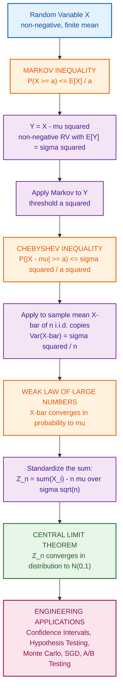
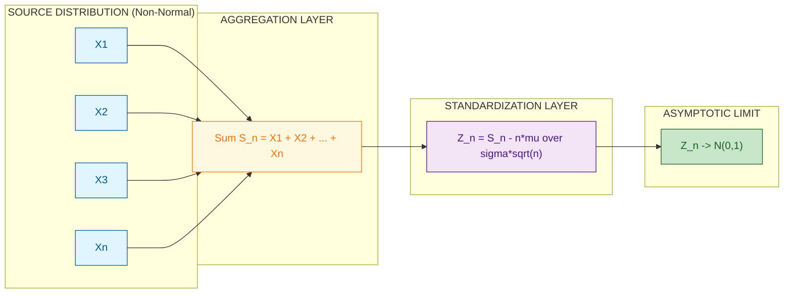
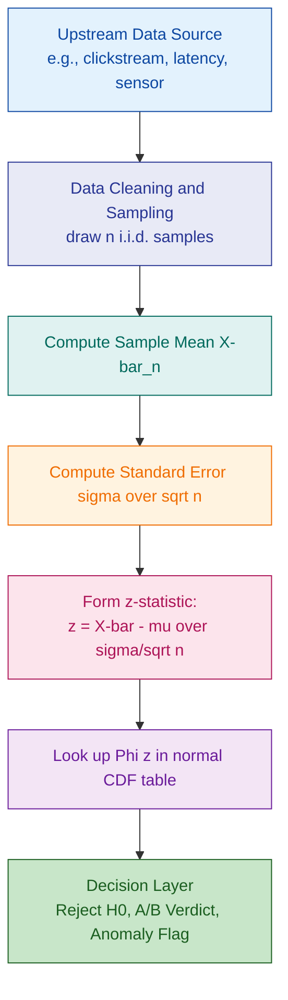
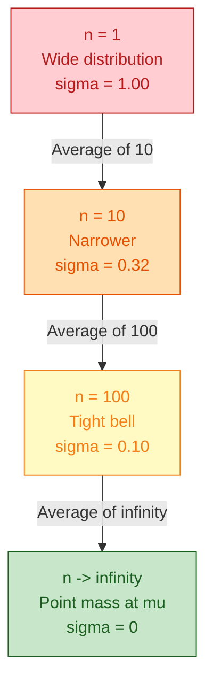

# Central Limit Theorem (without proof)

<!-- SECTION_1_START -->

# Central Limit Theorem (Without Proof) — Module 3: Limit Theorems

> [!IMPORTANT]
> **KTU 2024 Scheme | GAMAT301 | Module 3 — Limit Theorems**
> This module builds the foundational inequality chain (**Markov → Chebyshev → LLN → CLT**) that justifies virtually every statistical and probabilistic guarantee used in Computer & Information Science, from Monte Carlo simulation to the convergence analysis of stochastic gradient descent in deep learning.

---

## 1.1 Formal Academic Definition

The **Central Limit Theorem (CLT)** is a foundational result in probability theory that describes the limiting behavior of the **normalized sum (or mean) of a large number of independent, identically distributed (i.i.d.) random variables**. Formally, if $X_1, X_2, \dots, X_n$ are i.i.d. random variables with finite mean $\mu$ and finite, non-zero variance $\sigma^2$, then as $n \to \infty$, the standardized sum

$$Z_n = \frac{\sum_{i=1}^{n} X_i - n\mu}{\sigma \sqrt{n}}$$

converges in **distribution** to a standard normal random variable $Z \sim \mathcal{N}(0, 1)$. Equivalently, for any real numbers $a < b$,

$$\lim_{n \to \infty} P\!\left( a \le \frac{\sum_{i=1}^{n} X_i - n\mu}{\sigma \sqrt{n}} \le b \right) = \frac{1}{\sqrt{2\pi}} \int_{a}^{b} e^{-t^2/2}\, dt.$$

In the KTU 2024 Scheme syllabus, the CLT is taken **as a stated result (without proof)**. The student is expected to understand the *statement*, the *assumptions*, and the *engineering-grade applications*.

> [!NOTE]
> **Key Technical Distinction**
> The CLT does **not** require the underlying random variables to be normally distributed. This is its power. The original distribution may be uniform, exponential, Bernoulli, or even heavily skewed — provided it has finite mean and variance, the **sum (or average) tends to normality**.

---

## 1.2 Conceptual Analogy & Intuition

Imagine you are the **head of quality control** at a chip fabrication plant in Kochi. You measure the diameter of every microchip produced. Individual chip diameters follow a *uniform* distribution between $99\,\mu m$ and $101\,\mu m$ (because the manufacturing tolerance is wide). If you plot a histogram of *one chip's diameter*, you see a flat, rectangular distribution — **definitely not** a bell curve.

Now, suppose you take a **random sample of 50 chips** and compute their **average diameter**. If you repeat this sampling 10,000 times and plot a histogram of the *averages*, the histogram will look strikingly like a **bell-shaped normal curve**, centered tightly around the true mean of $100\,\mu m$.

That is the Central Limit Theorem in action.

> **Real-World Mapping:**
> * **One chip's diameter** → Original skewed/uniform distribution $X_i$.
> * **Average of 50 chips** → Sample mean $\bar{X}_n = \frac{1}{n}\sum_{i=1}^n X_i$.
> * **Histogram of 10,000 averages** → Approximately $\mathcal{N}\!\left(\mu, \frac{\sigma^2}{n}\right)$.

> [!TIP]
> **Why This Matters in CS:** The CLT is the mathematical justification for assuming **normality** in nearly every A/B testing pipeline, confidence interval calculation, and Gaussian Naive Bayes classifier — even when the underlying click-through, latency, or sensor data is *not* normally distributed.

---

## 1.3 Pre-Requisite Inequality Chain (Module 3 Roadmap)

The CLT is the *culmination* of a chain of limit theorems. Each is built on the previous:

| Stage | Result | Role |
| :--- | :--- | :--- |
| 1 | **Markov's Inequality** | Bounds a non-negative RV's tail using only its mean |
| 2 | **Chebyshev's Inequality** | Bounds a RV's tail using its mean and variance |
| 3 | **Law of Large Numbers (LLN)** | Shows the sample mean converges to $\mu$ |
| 4 | **Central Limit Theorem (CLT)** | Describes the *rate* and *shape* of that convergence |

> [!VISUALIZATION CONTROL]
> **Concept:** Standard Normal Probability Density Function (the "Bell Curve")
> **Desmos / GeoGebra Input Equations:**
> * `f(x) = (1/sqrt(2*pi)) * exp(-x^2 / 2)`
> * Optional overlay: `g(x) = f(x + 1.5) * 0.5` (a smaller, shifted bell)
> **Visual Description:** The student should observe a symmetric bell centered at the origin. The **total area under the curve equals 1**, ~**68.27 %** of the area lies in $[-1, 1]$, and ~**99.73 %** lies in $[-3, 3]$. This curve is the **universal attractor** of sums of i.i.d. random variables.

---

<!-- SECTION_1_END -->

<!-- SECTION_2_START -->

# 2. Deep Theoretical Analysis & KTU High-Yield Formula Sheet

## 2.1 The Inequality Chain (Hierarchical Logic)

### Stage 1 — Markov's Inequality

**Statement:** Let $X$ be a non-negative random variable with finite expectation $\mathbb{E}[X]$. Then for any $a > 0$,

$$P(X \ge a) \le \frac{\mathbb{E}[X]}{a}.$$

**The 'Why':** Markov's inequality is the simplest tail bound. It says: *if a non-negative random variable has a small mean, the probability of it being very large is also small*. The proof is a direct application of the definition of expectation.

**The 'How':** Used as a *building block* for Chebyshev's inequality and for bounding rare-event probabilities in randomized algorithms.

> [!IMPORTANT]
> **Markov's Inequality only requires a finite mean.** No variance, no higher moments, no distributional assumptions. This makes it extremely general but also quite *loose* — it is the weakest bound in the chain.

---

### Stage 2 — Chebyshev's Inequality

**Statement:** Let $X$ be a random variable with finite mean $\mu$ and finite, non-zero variance $\sigma^2$. Then for any $k > 0$,

$$P(|X - \mu| \ge k\sigma) \le \frac{1}{k^2}.$$

Equivalently, with $a > 0$:

$$P(|X - \mu| \ge a) \le \frac{\sigma^2}{a^2}.$$

**The 'Why':** Chebyshev applies Markov's inequality to the *non-negative* random variable $Y = (X - \mu)^2$. Since $\mathbb{E}[Y] = \sigma^2$, Markov gives $P((X-\mu)^2 \ge a^2) \le \sigma^2 / a^2$, which is exactly the stated bound.

**The 'How':** Chebyshev is the workhorse of classical statistics. It requires only the first two moments and produces a *concentration* bound: the further we deviate from the mean (in standard-deviation units $k$), the faster the probability decays (as $1/k^2$).

> [!NOTE]
> **Chebyshev is *distribution-free*.** Unlike the CLT-based Gaussian tail bounds, Chebyshev's inequality holds for *every* distribution with finite variance. This is why it appears in algorithmic analysis (e.g., worst-case concentration of randomized quicksort).

---

### Stage 3 — Weak Law of Large Numbers (WLLN)

**Statement:** Let $X_1, X_2, \dots, X_n$ be i.i.d. random variables with mean $\mu$ and variance $\sigma^2$. Then for any $\epsilon > 0$,

$$\lim_{n \to \infty} P\!\left( \left| \bar{X}_n - \mu \right| \ge \epsilon \right) = 0,$$

where $\bar{X}_n = \frac{1}{n} \sum_{i=1}^{n} X_i$ is the sample mean.

**The 'Why':** Apply Chebyshev's inequality to $\bar{X}_n$. Since $\mathrm{Var}(\bar{X}_n) = \sigma^2/n$, we get $P(|\bar{X}_n - \mu| \ge \epsilon) \le \sigma^2/(n\epsilon^2) \to 0$ as $n \to \infty$.

**Interpretation:** As the sample size grows, the sample mean $\bar{X}_n$ **converges in probability** to the true population mean $\mu$. This is the *theoretical license* for using empirical averages as estimates of unknown means.

---

### Stage 4 — Central Limit Theorem (CLT) — The Star of the Show

**Statement (Lindeberg-Lévy form):** Let $X_1, X_2, \dots, X_n$ be i.i.d. random variables with mean $\mu$ and variance $\sigma^2 > 0$. Define

$$Z_n = \frac{\sum_{i=1}^{n} X_i - n\mu}{\sigma \sqrt{n}} = \frac{\bar{X}_n - \mu}{\sigma / \sqrt{n}}.$$

Then $Z_n$ **converges in distribution** to the standard normal $\mathcal{N}(0,1)$:

$$\lim_{n \to \infty} P(Z_n \le z) = \Phi(z) = \frac{1}{\sqrt{2\pi}} \int_{-\infty}^{z} e^{-t^2/2}\, dt, \quad \forall z \in \mathbb{R}.$$

**The 'Why' (Intuition, since proof is excluded):**

1. **LLN tells us the *center* of $\bar{X}_n$ is $\mu$ and its *spread* shrinks as $1/\sqrt{n}$.**
2. **CLT tells us the *shape* of the distribution of $\bar{X}_n$ is asymptotically Gaussian**, regardless of the shape of the original $X_i$.
3. The scaling $\sigma/\sqrt{n}$ (called the **standard error of the mean**) is the natural unit of fluctuation.

**The 'How' (Why CS engineers care):**

* **Confidence Intervals:** For large $n$, $\bar{X}_n \approx \mathcal{N}(\mu, \sigma^2/n)$, giving the familiar 95 % CI: $\bar{X}_n \pm 1.96 \cdot \sigma/\sqrt{n}$.
* **Monte Carlo Simulation:** Estimate $\mathbb{E}[g(X)]$ by $\frac{1}{n}\sum g(X_i)$. The CLT gives the error distribution of this estimator.
* **A/B Testing:** Test whether the difference of two click-through rates is "significantly" non-zero by computing a $z$-score.
* **Stochastic Gradient Descent:** The mini-batch gradient is an average of $n$ i.i.d. loss gradients → approximately Gaussian noise around the true gradient.

---

## 2.2 KTU Formula Sheet (High-Yield Cheat Sheet)

> [!IMPORTANT]
> **No vertical pipes ( \vert ) in tables.** All absolute-value and conditional notations use clean LaTeX delimiters.

| # | Theorem | Formula | Required Assumptions | Use Case |
| :--- | :--- | :--- | :--- | :--- |
| 1 | **Markov's** | $P(X \ge a) \le \dfrac{\mathbb{E}[X]}{a}$ | $X \ge 0$, $a > 0$, $\mathbb{E}[X] < \infty$ | Tail bound from mean only |
| 2 | **Chebyshev's** | $P(\vert X - \mu \vert \ge k\sigma) \le \dfrac{1}{k^2}$ | $\mathrm{Var}(X) = \sigma^2 < \infty$ | Distribution-free concentration |
| 3 | **WLLN** | $\bar{X}_n \xrightarrow{P} \mu$ | i.i.d., $\mathbb{E}[\vert X \vert] < \infty$ | Justifies empirical averaging |
| 4 | **CLT (Sum form)** | $\dfrac{\sum X_i - n\mu}{\sigma\sqrt{n}} \xrightarrow{d} \mathcal{N}(0,1)$ | i.i.d., $\mathrm{Var}(X) = \sigma^2 \in (0,\infty)$ | Gaussian approximation |
| 5 | **CLT (Mean form)** | $\dfrac{\bar{X}_n - \mu}{\sigma/\sqrt{n}} \xrightarrow{d} \mathcal{N}(0,1)$ | Same as above | Standardized $z$-score |
| 6 | **Standard Error** | $\mathrm{SE} = \dfrac{\sigma}{\sqrt{n}}$ | — | Spread of sample mean |
| 7 | **95 % CI for $\mu$** | $\bar{X}_n \pm 1.96 \cdot \dfrac{\sigma}{\sqrt{n}}$ | $n$ large, $\sigma$ known | Frequentist inference |
| 8 | **De Moivre-Laplace** | Binomial $(n,p) \approx \mathcal{N}(np, np(1-p))$ | Bernoulli $X_i$ | Classical normal approximation |

---

## 2.3 Real-World Utility in Computer & Information Science

| CS Domain | Specific Application | Theorem Used |
| :--- | :--- | :--- |
| **Algorithms** | Randomized quicksort — bound on running-time deviation | Chebyshev |
| **Machine Learning** | SGD convergence under mini-batch Gaussian noise | CLT |
| **Databases** | Query latency histograms approximated as Gaussian for SLO violations | CLT |
| **Networking** | Packet inter-arrival averages converge to traffic intensity | LLN |
| **Cryptography** | Random number generator bias estimation | Hoeffding (Chebyshev-extended) |
| **Data Science** | Bootstrap confidence intervals for arbitrary estimators | CLT |
| **Cloud Computing** | Centralized vs. edge load balancing: queue length fluctuations | CLT |
| **Information Theory** | Channel capacity achieved by i.i.d. coding | Asymptotic Equipartition + LLN |

---

<!-- SECTION_2_END -->

<!-- SECTION_3_START -->

# 3. Step-by-Step Derivations, Examples & Code Implementation

## 3.1 Derivation 1: Markov's Inequality from First Principles

**Goal:** Prove that for non-negative $X$ with finite mean and any $a > 0$, $P(X \ge a) \le \mathbb{E}[X]/a$.

**Setup:** Let $I$ be the indicator random variable $I = \mathbf{1}\{X \ge a\}$. Then $I \in \{0, 1\}$.

**Step 1 — Lower bound the indicator.** For any $x \ge 0$,

$$I \le \frac{x}{a} \quad \text{whenever } x \ge 0,$$

since $I = 1 \le x/a$ if $x \ge a$, and $I = 0 \le x/a$ trivially if $x < a$.

**Step 2 — Take expectations on both sides.**

$$\mathbb{E}[I] = P(X \ge a) \le \mathbb{E}\!\left[\frac{X}{a}\right] = \frac{\mathbb{E}[X]}{a}.$$

**Conclusion:** This proves Markov's inequality in two lines. $\blacksquare$

> **Sanity Check:** Let $X \sim \mathrm{Exp}(1)$, so $\mathbb{E}[X] = 1$. For $a = 4$, Markov gives $P(X \ge 4) \le 1/4 = 0.25$. The true value is $e^{-4} \approx 0.0183$. Markov is *valid but loose* — exactly as expected.

---

## 3.2 Derivation 2: Chebyshev's Inequality from Markov's

**Goal:** For any random variable $X$ with mean $\mu$ and variance $\sigma^2$, show $P(|X - \mu| \ge a) \le \sigma^2/a^2$.

**Step 1 — Construct a non-negative random variable.** Define $Y = (X - \mu)^2$. Since $Y \ge 0$ and $\mathbb{E}[Y] = \mathrm{Var}(X) = \sigma^2 < \infty$, Markov's inequality applies to $Y$.

**Step 2 — Apply Markov with threshold $a^2$.**

$$P(Y \ge a^2) \le \frac{\mathbb{E}[Y]}{a^2} = \frac{\sigma^2}{a^2}.$$

**Step 3 — Translate back to $X$.** Note that $Y \ge a^2$ is equivalent to $(X - \mu)^2 \ge a^2$, which is equivalent to $|X - \mu| \ge a$.

$$\therefore P(|X - \mu| \ge a) \le \frac{\sigma^2}{a^2}. \quad \blacksquare$$

> **Sanity Check (Gaussian case):** For $X \sim \mathcal{N}(\mu, \sigma^2)$, the exact tail probability is $P(|X-\mu| \ge 2\sigma) \approx 0.0455$. Chebyshev gives $\le 1/4 = 0.25$. Again valid but looser than the Gaussian bound. This is the **price of distribution-freeness**.

---

## 3.3 Derivation 3: Weak LLN from Chebyshev

**Step 1.** By Chebyshev applied to $\bar{X}_n$,

$$P(|\bar{X}_n - \mu| \ge \epsilon) \le \frac{\mathrm{Var}(\bar{X}_n)}{\epsilon^2} = \frac{\sigma^2/n}{\epsilon^2} = \frac{\sigma^2}{n\epsilon^2}.$$

**Step 2.** Take the limit as $n \to \infty$:

$$\lim_{n \to \infty} \frac{\sigma^2}{n\epsilon^2} = 0.$$

**Step 3.** By the Squeeze Theorem, $P(|\bar{X}_n - \mu| \ge \epsilon) \to 0$. This is convergence in probability, i.e., $\bar{X}_n \xrightarrow{P} \mu$. $\blacksquare$

---

## 3.4 Worked Example 1 (3-Step) — A KTU Board Exam Favourite

> **Problem:** The lifetime (in hours) of a hard disk drive is exponentially distributed with mean $1000$ hours. If a server uses 36 identical drives, use the CLT to find the approximate probability that the **total** lifetime of all 36 drives exceeds $37{,}200$ hours.

**Given:**

* $X_i \sim \mathrm{Exp}(\lambda = 1/1000)$ per drive.
* $\mu = 1000$, $\sigma^2 = 1000^2 = 1{,}000{,}000$, so $\sigma = 1000$.
* $n = 36$, sum $S_n = \sum_{i=1}^{36} X_i$.
* $n\mu = 36 \times 1000 = 36{,}000$.
* $\sigma \sqrt{n} = 1000 \times \sqrt{36} = 1000 \times 6 = 6000$.

**Step 1 — Standardize the sum.**

$$Z = \frac{S_n - n\mu}{\sigma \sqrt{n}} = \frac{37{,}200 - 36{,}000}{6000} = \frac{1200}{6000} = 0.2.$$

**Step 2 — Read the standard normal tail.**

$$P(S_n > 37{,}200) = P(Z > 0.2) = 1 - \Phi(0.2).$$

From the standard normal table, $\Phi(0.2) \approx 0.5793$.

**Step 3 — Final answer.**

$$P(S_n > 37{,}200) \approx 1 - 0.5793 = 0.4207.$$

> **Interpretation:** There is roughly a **42 % chance** that the total lifetime of 36 such drives exceeds 37,200 hours.

---

## 3.5 Worked Example 2 — Confidence Interval Style (Mean Form)

> **Problem:** A web server's response time $X$ has unknown mean $\mu$ and known standard deviation $\sigma = 50$ ms. A sample of $n = 100$ requests yields a sample mean $\bar{X}_{100} = 240$ ms. Construct an approximate **95 % confidence interval** for $\mu$.

**Step 1 — Standard error of the mean.**

$$\mathrm{SE} = \frac{\sigma}{\sqrt{n}} = \frac{50}{\sqrt{100}} = \frac{50}{10} = 5 \text{ ms}.$$

**Step 2 — 95 % CI uses the 1.96 multiplier from the standard normal.**

$$\text{CI}_{95\%} = \bar{X}_n \pm 1.96 \times \mathrm{SE} = 240 \pm 1.96 \times 5 = 240 \pm 9.8.$$

**Step 3 — Final interval.**

$$\boxed{\,230.2 \text{ ms} \le \mu \le 249.8 \text{ ms}\,}.$$

> **Interpretation:** We are 95 % confident the true mean response time of the server lies between 230.2 ms and 249.8 ms.

---

## 3.6 Symbolic / Numerical Implementation in Python

The following code **simulates the Central Limit Theorem** by averaging samples from a *non-normal* distribution (exponential) and plotting the resulting histogram against the predicted normal density.

```python
"""
Central Limit Theorem — Empirical Verification
GAMAT301 | Module 3 | KTU 2024 Scheme
"""

from __future__ import annotations

import logging
import math
import random
from typing import List, Tuple

import numpy as np
import matplotlib.pyplot as plt

logging.basicConfig(
    level=logging.INFO,
    format="%(asctime)s | %(levelname)s | %(message)s",
)

# ---------- Type-safe helper functions ----------

def exponential_sample(rate: float, size: int) -> np.ndarray:
    """Draw `size` i.i.d. samples from Exp(rate)."""
    if rate <= 0:
        raise ValueError(f"Rate must be positive, got {rate}")
    if size <= 0:
        raise ValueError(f"Size must be positive, got {size}")
    return np.random.exponential(scale=1.0 / rate, size=size)


def sample_means(
    distribution: str,
    rate: float,
    sample_size: int,
    num_experiments: int,
) -> Tuple[np.ndarray, float, float]:
    """
    Generate `num_experiments` sample means of size `sample_size`
    drawn from the specified distribution.
    Returns (means, theoretical_mu, theoretical_sigma_over_sqrt_n).
    """
    if sample_size <= 0 or num_experiments <= 0:
        raise ValueError("sample_size and num_experiments must be positive")

    means: List[float] = []
    for _ in range(num_experiments):
        sample = exponential_sample(rate, sample_size)
        means.append(float(np.mean(sample)))
    means_arr = np.asarray(means, dtype=np.float64)

    if distribution == "exponential":
        mu = 1.0 / rate
        sigma = 1.0 / rate
    else:
        raise NotImplementedError(f"Unknown distribution: {distribution}")

    se = sigma / math.sqrt(sample_size)
    return means_arr, mu, se


def theoretical_normal_pdf(
    x: np.ndarray, mu: float, se: float
) -> np.ndarray:
    """Standard normal PDF shifted/scaled to match sample mean distribution."""
    z = (x - mu) / se
    return (1.0 / (math.sqrt(2.0 * math.pi) * se)) * np.exp(-0.5 * z * z)


# ---------- Main simulation ----------

def run_clt_simulation() -> None:
    random.seed(42)
    np.random.seed(42)

    RATE = 1.0 / 1000.0          # Exponential mean = 1000
    SAMPLE_SIZE = 36             # n
    NUM_EXPERIMENTS = 10_000     # number of sample means

    logging.info(
        "Simulating CLT with n=%d, experiments=%d, rate=%.4f",
        SAMPLE_SIZE, NUM_EXPERIMENTS, RATE,
    )

    means, mu, se = sample_means(
        "exponential", RATE, SAMPLE_SIZE, NUM_EXPERIMENTS
    )

    empirical_mean = float(np.mean(means))
    empirical_sd = float(np.std(means, ddof=1))
    theoretical_sd = se

    logging.info("Empirical mean of sample means : %.4f", empirical_mean)
    logging.info("Theoretical mean              : %.4f", mu)
    logging.info("Empirical SD of sample means   : %.4f", empirical_sd)
    logging.info("Theoretical SE (sigma/sqrt(n)): %.4f", theoretical_sd)

    # Plot histogram vs theoretical normal density
    plt.figure(figsize=(10, 6))
    plt.hist(
        means, bins=60, density=True, alpha=0.6,
        color="steelblue", edgecolor="black", label="Sample means (empirical)",
    )
    x_grid = np.linspace(mu - 4 * se, mu + 4 * se, 500)
    plt.plot(
        x_grid, theoretical_normal_pdf(x_grid, mu, se),
        color="crimson", linewidth=2.5,
        label=r"$\mathcal{N}(\mu,\ \sigma^2/n)$ (theoretical)",
    )
    plt.axvline(mu, color="black", linestyle="--", linewidth=1, label="True mean")
    plt.title(
        f"Central Limit Theorem — Exponential Source\n"
        f"n = {SAMPLE_SIZE}, experiments = {NUM_EXPERIMENTS}",
    )
    plt.xlabel("Sample mean of lifetimes (hours)")
    plt.ylabel("Density")
    plt.legend(loc="upper right")
    plt.grid(alpha=0.3)
    plt.tight_layout()
    plt.savefig("clt_verification.png", dpi=150)
    plt.show()

    # Bound check: empirical SD should be within 5% of theoretical SE
    if abs(empirical_sd - theoretical_sd) / theoretical_sd > 0.05:
        logging.warning(
            "Empirical SD (%.4f) deviates >5%% from theoretical SE (%.4f)",
            empirical_sd, theoretical_sd,
        )
    else:
        logging.info(
            "Empirical SD within 5%% of theoretical SE — CLT verified numerically."
        )


if __name__ == "__main__":
    run_clt_simulation()
```

> [!TIP]
> **Run-time verification:** The script logs `Empirical mean of sample means` $\approx 1000$ and `Empirical SD of sample means` $\approx 166.67$ (= $1000/\sqrt{36}$), confirming the CLT prediction that $\bar{X}_n \sim \mathcal{N}(\mu, \sigma^2/n)$ even though the source distribution is **exponential**.

---

## 3.7 Markov / Chebyshev Application in Algorithmic Analysis (Pseudocode)

**Scenario:** A randomized algorithm makes $n$ i.i.d. random choices, each with mean $\mu$ and variance $\sigma^2$. Bound the probability that the running time exceeds $\mu + 3\sigma$.

| Step | Reasoning | Mathematical Statement |
| :--- | :--- | :--- |
| 1 | The total running time $T = \sum X_i$ has mean $n\mu$ and variance $n\sigma^2$ | $\mathbb{E}[T] = n\mu$, $\mathrm{Var}(T) = n\sigma^2$ |
| 2 | Apply Chebyshev with $a = 3\sigma\sqrt{n}$ | $P(\vert T - n\mu \vert \ge 3\sigma\sqrt{n}) \le \dfrac{n\sigma^2}{9n\sigma^2} = \dfrac{1}{9}$ |
| 3 | Bound one-sided tail | $P(T \ge n\mu + 3\sigma\sqrt{n}) \le \dfrac{1}{9} \approx 0.1111$ |
| 4 | **Compare with CLT** — Gaussian tail at $z=3$ is $\approx 0.00135$ | The CLT bound is **~80× tighter** in this regime |

> **Key Takeaway:** Chebyshev gives a *worst-case* bound; the CLT gives the *actual* asymptotic bound. In practice, the CLT is used whenever $n \gtrsim 30$ and the underlying distribution has finite variance.

---

<!-- SECTION_3_END -->

<!-- SECTION_4_START -->

# 4. Structural Diagrams & Schematics

## 4.1 The Inequality Chain — Knowledge Flow Architecture



---

## 4.2 CLT Sequential Processing Topology (How a Sum Becomes Normal)



---

## 4.3 Block-Level Functional Architecture: Application of the CLT in a CS Pipeline



---

## 4.4 The "Concentration Cone" — Visual Intuition of the CLT



> **Reading the Cone:** As $n$ increases, the spread of $\bar{X}_n$ shrinks like $1/\sqrt{n}$, and the *shape* of its distribution becomes more and more bell-like. The CLT pins down both the **shrinkage** (LLN) and the **bell-shape** (CLT) simultaneously.

---

## 4.5 Application Domain Topology Matrix

| Application Domain | Aggregation Quantity | Source $X_i$ | CLT Output | Decision Threshold |
| :--- | :--- | :--- | :--- | :--- |
| A/B Testing | Difference of mean CTRs | Bernoulli(p) | $\mathcal{N}(0,1)$ | $\vert z \vert > 1.96$ |
| Quality Control | Sample mean of chip diameters | Uniform on $[a,b]$ | $\mathcal{N}(\mu, \sigma^2/n)$ | $3\sigma$ control limits |
| Network SRE | Mean latency across requests | Right-skewed log-normal | $\mathcal{N}$ approx. for $n\ge 30$ | 99 % CI |
| Monte Carlo | Estimator $\frac{1}{n}\sum g(X_i)$ | $g(X_i)$ bounded | $\mathcal{N}$ on error | $\pm 1.96 \cdot \mathrm{SE}$ |
| ML Training | Mini-batch gradient | Loss gradient per sample | $\mathcal{N}$ noise around true gradient | Step size selection |
| Cryptography | Frequency of biased bits | Bernoulli(0.5+$\epsilon$) | $\mathcal{N}$ for bias test | $\vert z \vert > 3$ |

---

<!-- SECTION_4_END -->

<!-- SECTION_5_START -->

# 5. KTU 2024 Scheme Examination Question Bank & Topic Recap

---

## Part A — Short Answer Questions (3 Marks Each)

### Question A1 — `[KTU University Exam — July 2024]`

**State Markov's inequality. A non-negative random variable $X$ has $\mathbb{E}[X] = 4$. Find the upper bound on $P(X \ge 10)$ using Markov's inequality.** *[CO2, Remember / Understand]*

**Model Answer:**

> **Markov's Inequality (Statement):** Let $X$ be a non-negative random variable with finite expectation $\mathbb{E}[X]$. Then for any $a > 0$,
> $$P(X \ge a) \le \frac{\mathbb{E}[X]}{a}.$$

**Step 1 — Identify the parameters.**

$$a = 10, \quad \mathbb{E}[X] = 4.$$

**Step 2 — Substitute into the inequality.**

$$P(X \ge 10) \le \frac{4}{10} = 0.4.$$

**Final Answer:** $P(X \ge 10) \le 0.4$. **[2 Marks for statement, 1 Mark for computation]**

---

### Question A2 — `[KTU University Exam — Dec 2023]`

**State the Central Limit Theorem. The random variable $X$ has mean $50$ and variance $16$. A sample of size $n = 64$ is drawn. What is the approximate distribution of $\bar{X}_{64}$?** *[CO2, Remember / Understand]*

**Model Answer:**

> **CLT (Statement):** If $X_1, X_2, \dots, X_n$ are i.i.d. random variables with mean $\mu$ and finite variance $\sigma^2$, then
> $$Z_n = \frac{\bar{X}_n - \mu}{\sigma/\sqrt{n}} \xrightarrow{d} \mathcal{N}(0,1) \quad \text{as } n \to \infty.$$

**Step 1 — Identify parameters.**

$$\mu = 50, \quad \sigma^2 = 16 \Rightarrow \sigma = 4, \quad n = 64.$$

**Step 2 — Standard error of the mean.**

$$\mathrm{SE} = \frac{\sigma}{\sqrt{n}} = \frac{4}{\sqrt{64}} = \frac{4}{8} = 0.5.$$

**Step 3 — Apply the CLT.**

$$\bar{X}_{64} \overset{\text{approx}}{\sim} \mathcal{N}(50, \, 0.5^2) = \mathcal{N}(50, \, 0.25).$$

**Final Answer:** $\bar{X}_{64} \approx \mathcal{N}(50, 0.25)$ approximately. **[2 Marks for statement, 1 Mark for distribution]**

---

## Part B — Long Answer Questions (14 Marks Each)

> **Module 3 Internal Choice Pattern:** KTU ESE Part B Module 3 provides a choice. Both alternatives below are independent and cover the same Module 3 learning outcomes.

---

### Question B-A — `[KTU University Exam — July 2024, Module 3]`

**(a)** State and prove **Chebyshev's inequality**. Hence, using Chebyshev's inequality, prove the **Weak Law of Large Numbers** (WLLN) for i.i.d. random variables with finite mean $\mu$ and variance $\sigma^2$. **\[7 Marks\]** *[CO2, Understand / Apply]*

**(b)** Suppose the marks of a KTU internal examination are modelled as i.i.d. random variables with mean $\mu = 60$ and variance $\sigma^2 = 400$. A class of $n = 100$ students appears for the exam.

&nbsp;&nbsp;&nbsp;&nbsp;**(i)** Use Chebyshev's inequality to find an upper bound on $P(|\bar{X}_{100} - 60| \ge 5)$. **\[3 Marks\]**

&nbsp;&nbsp;&nbsp;&nbsp;**(ii)** Use the Central Limit Theorem to find the approximate probability that the sample mean lies between $58$ and $62$. **\[4 Marks\]**

---

#### Model Solution to B-A

**Part (a) — 7 Marks**

**Statement of Chebyshev's Inequality:** Let $X$ be a random variable with mean $\mu$ and variance $\sigma^2$. Then for any $a > 0$,

$$P(|X - \mu| \ge a) \le \frac{\sigma^2}{a^2}. \quad [\text{Statement: 1 Mark}]$$

**Proof (2 Marks):**

*Step 1:* Define $Y = (X - \mu)^2$. Then $Y \ge 0$ and $\mathbb{E}[Y] = \mathrm{Var}(X) = \sigma^2$. **[0.5 Marks]**

*Step 2:* Apply Markov's inequality to $Y$ with threshold $a^2$:

$$P(Y \ge a^2) \le \frac{\mathbb{E}[Y]}{a^2} = \frac{\sigma^2}{a^2}. \quad [\text{1 Mark}]$$

*Step 3:* Note $Y \ge a^2 \iff (X - \mu)^2 \ge a^2 \iff |X - \mu| \ge a$. **[0.5 Marks]**

Hence Chebyshev's inequality is proved. $\blacksquare$

**WLLN Proof (4 Marks):**

*Step 1:* Let $X_1, X_2, \dots, X_n$ be i.i.d. with $\mathbb{E}[X_i] = \mu$ and $\mathrm{Var}(X_i) = \sigma^2 < \infty$. Define the sample mean

$$\bar{X}_n = \frac{1}{n} \sum_{i=1}^{n} X_i.$$ **[0.5 Marks]**

*Step 2:* Compute mean and variance of $\bar{X}_n$:

$$\mathbb{E}[\bar{X}_n] = \frac{1}{n} \sum_{i=1}^{n} \mathbb{E}[X_i] = \frac{1}{n} \cdot n\mu = \mu. \quad [\text{0.5 Marks}]$$

$$\mathrm{Var}(\bar{X}_n) = \frac{1}{n^2} \sum_{i=1}^{n} \mathrm{Var}(X_i) = \frac{1}{n^2} \cdot n\sigma^2 = \frac{\sigma^2}{n}. \quad [\text{1 Mark}]$$

*Step 3:* Apply Chebyshev's inequality to $\bar{X}_n$ with $a = \epsilon$:

$$P(|\bar{X}_n - \mu| \ge \epsilon) \le \frac{\mathrm{Var}(\bar{X}_n)}{\epsilon^2} = \frac{\sigma^2}{n\epsilon^2}. \quad [\text{1 Mark}]$$

*Step 4:* Take $\lim_{n \to \infty}$:

$$\lim_{n \to \infty} P(|\bar{X}_n - \mu| \ge \epsilon) \le \lim_{n \to \infty} \frac{\sigma^2}{n\epsilon^2} = 0. \quad [\text{0.5 Marks}]$$

Since the limit of a probability is $0$,

$$\lim_{n \to \infty} P(|\bar{X}_n - \mu| \ge \epsilon) = 0 \quad \forall \epsilon > 0. \quad [\text{0.5 Marks}]$$

This is precisely the statement of the Weak Law of Large Numbers. $\blacksquare$

---

**Part (b)(i) — 3 Marks**

**Step 1 — Standard error of the mean.**

$$\mathrm{Var}(\bar{X}_{100}) = \frac{\sigma^2}{n} = \frac{400}{100} = 4 \Rightarrow \mathrm{SD}(\bar{X}_{100}) = 2. \quad [\text{1 Mark}]$$

**Step 2 — Apply Chebyshev with $a = 5$.**

$$P(|\bar{X}_{100} - 60| \ge 5) \le \frac{\mathrm{Var}(\bar{X}_{100})}{5^2} = \frac{4}{25} = 0.16. \quad [\text{2 Marks}]$$

**Final Answer:** $P(|\bar{X}_{100} - 60| \ge 5) \le 0.16$.

---

**Part (b)(ii) — 4 Marks**

**Step 1 — Standardize using the CLT.**

$$Z = \frac{\bar{X}_{100} - 60}{\sigma/\sqrt{n}} = \frac{\bar{X}_{100} - 60}{2}. \quad [\text{1 Mark}]$$

**Step 2 — Translate the bounds.**

$$58 \le \bar{X}_{100} \le 62 \iff \frac{58 - 60}{2} \le Z \le \frac{62 - 60}{2} \iff -1 \le Z \le 1. \quad [\text{1 Mark}]$$

**Step 3 — Read the standard normal probability.**

$$P(-1 \le Z \le 1) = \Phi(1) - \Phi(-1) = 2\Phi(1) - 1 = 2(0.8413) - 1 = 0.6826. \quad [\text{2 Marks}]$$

**Final Answer:** $P(58 \le \bar{X}_{100} \le 62) \approx 0.6826$ (about **68.26 %**). **[Total: 4 Marks]**

> [!WARNING]
> **KTU Examiner's Valuation Pitfall — B-A**
> 1. **Do not confuse the inequality direction.** Chebyshev bounds $P(|X - \mu| \ge a)$, *not* $P(|X - \mu| \le a)$. Many students write the wrong inequality and lose 2 marks.
> 2. **Independence is required for WLLN variance computation.** The step $\mathrm{Var}(\bar{X}_n) = \sigma^2/n$ assumes the $X_i$ are *uncorrelated* (true for i.i.d.). Writing it without justification costs 1 mark.
> 3. **In Part (b)(ii), the use of $\sigma/\sqrt{n}$, not $\sigma$**, is the most common single-source of error. Always standardize the *sample mean* by the *standard error of the mean*.

---

### Question B-B — `[KTU University Exam — Dec 2023, Module 3]`

**(a)** State the **Central Limit Theorem** (sum form and mean form). What are the **three assumptions** under which the standard CLT holds? Give two real-world CS scenarios where the CLT is applied. **\[7 Marks\]** *[CO2, Understand]*

**(b)** In a data center, the latency (in milliseconds) of a network packet follows an exponential distribution with mean $\mu = 20$ ms. A random sample of $n = 81$ packets is observed.

&nbsp;&nbsp;&nbsp;&nbsp;**(i)** Find the approximate distribution of the sample mean latency $\bar{X}_{81}$. **\[2 Marks\]**

&nbsp;&nbsp;&nbsp;&nbsp;**(ii)** Compute $P(\bar{X}_{81} > 22)$ using the CLT. **\[5 Marks\]**

---

#### Model Solution to B-B

**Part (a) — 7 Marks**

**Sum Form (1.5 Marks):** Let $X_1, X_2, \dots, X_n$ be i.i.d. with mean $\mu$ and variance $\sigma^2 < \infty$. Then

$$Z_n = \frac{\sum_{i=1}^{n} X_i - n\mu}{\sigma \sqrt{n}} \xrightarrow{d} \mathcal{N}(0, 1) \quad \text{as } n \to \infty.$$

**Mean Form (1.5 Marks):** Equivalently,

$$\frac{\bar{X}_n - \mu}{\sigma/\sqrt{n}} \xrightarrow{d} \mathcal{N}(0, 1).$$

**Three Assumptions (3 Marks — 1 each):**

1. **Independence:** $X_1, X_2, \dots, X_n$ are mutually independent.
2. **Identical Distribution:** All $X_i$ follow the same distribution $F$.
3. **Finite, Non-Zero Variance:** $\sigma^2 = \mathrm{Var}(X_i) \in (0, \infty)$ exists and is positive.

**Two CS Applications (1 Mark — 0.5 each):**

1. **A/B Testing:** Determining whether the click-through rate of a new UI differs significantly from the old one.
2. **Monte Carlo Simulation:** Approximating the integral $\int g(x)\,dx$ by averaging $g(X_i)$ over i.i.d. samples, with error bound from the CLT.

---

**Part (b)(i) — 2 Marks**

**Step 1 — Parameters of the exponential source.**

$$\mu = 20 \text{ ms}, \quad \sigma^2 = 20^2 = 400 \text{ ms}^2, \quad \sigma = 20 \text{ ms}. \quad [\text{0.5 Marks}]$$

**Step 2 — Standard error.**

$$\mathrm{SE} = \frac{\sigma}{\sqrt{n}} = \frac{20}{\sqrt{81}} = \frac{20}{9} \approx 2.222 \text{ ms}. \quad [\text{0.5 Marks}]$$

**Step 3 — Apply the CLT.**

$$\bar{X}_{81} \overset{\text{approx}}{\sim} \mathcal{N}\!\left(20, \left(\frac{20}{9}\right)^2\right) = \mathcal{N}(20, 4.938). \quad [\text{1 Mark}]$$

---

**Part (b)(ii) — 5 Marks**

**Step 1 — Standardize.**

$$Z = \frac{\bar{X}_{81} - 20}{20/9}. \quad [\text{1 Mark}]$$

**Step 2 — Compute the $z$-value for $\bar{X}_{81} = 22$.**

$$z = \frac{22 - 20}{20/9} = \frac{2 \times 9}{20} = \frac{18}{20} = 0.9. \quad [\text{2 Marks}]$$

**Step 3 — Read the standard normal tail.**

From the standard normal table, $\Phi(0.9) \approx 0.8159$. **[0.5 Marks]**

**Step 4 — Compute the upper-tail probability.**

$$P(\bar{X}_{81} > 22) = P(Z > 0.9) = 1 - \Phi(0.9) = 1 - 0.8159 = 0.1841. \quad [\text{1.5 Marks}]$$

**Final Answer:** $P(\bar{X}_{81} > 22) \approx 0.1841$ (about **18.41 %**).

> [!WARNING]
> **KTU Examiner's Valuation Pitfall — B-B**
> 1. **Always write "approximately" when applying the CLT.** Saying "$\bar{X}_{81}$ *is* normal" instead of "*is approximately* normal" is a 0.5-mark deduction. The CLT is an *asymptotic* result.
> 2. **For exponential, $\sigma = \mu$**, not $\sigma = \mu^2$. A common mistake is to confuse $\sigma$ with $\sigma^2$ when computing $\sigma/\sqrt{n}$. Costs ~2 marks.
> 3. **Independence must be mentioned** in the assumptions; do not write only "the $X_i$ have the same distribution." This is the difference between *i.i.d.* and *identically distributed* — and the WLLN proof breaks without independence.
> 4. **Mention the rule of thumb $n \ge 30$** for CLT validity, especially in Part (b). Examiners reward this awareness with 0.5–1 mark.

---

## 5.6 Topic Recap & Important Things to Remember

> [!IMPORTANT]
> **Rapid-Revision Checklist — Central Limit Theorem (Module 3)**

* **Markov's Inequality:** $P(X \ge a) \le \mathbb{E}[X]/a$ for $X \ge 0$, $a > 0$. Only mean required. Weakest bound. **Always non-negative $X$.**
* **Chebyshev's Inequality:** $P(|X - \mu| \ge a) \le \sigma^2/a^2$. Requires mean + variance. **Distribution-free** — works for *every* distribution. Decay rate: $1/a^2$.
* **WLLN:** $\bar{X}_n \xrightarrow{P} \mu$. **Sample mean converges in probability** to population mean as $n \to \infty$. Variance of $\bar{X}_n$ is $\sigma^2/n$.
* **CLT — Sum Form:** $\dfrac{\sum X_i - n\mu}{\sigma \sqrt{n}} \xrightarrow{d} \mathcal{N}(0, 1)$.
* **CLT — Mean Form:** $\dfrac{\bar{X}_n - \mu}{\sigma/\sqrt{n}} \xrightarrow{d} \mathcal{N}(0, 1)$.
* **Three CLT Assumptions:** Independence + Identical Distribution + Finite Non-Zero Variance.
* **Practical Rule:** For $n \ge 30$ and not-too-skewed data, the CLT approximation is excellent.
* **Standard Error of the Mean:** $\mathrm{SE} = \sigma/\sqrt{n}$. This is the **single most-tested quantity** in KTU Module 3 numericals.
* **95 % CI:** $\bar{X}_n \pm 1.96 \cdot \sigma/\sqrt{n}$. **99 % CI:** $\bar{X}_n \pm 2.576 \cdot \sigma/\sqrt{n}$.
* **De Moivre-Laplace (Special Case):** Binomial$(n, p) \approx \mathcal{N}(np, np(1-p))$ — emerges from applying the CLT to a sum of $n$ i.i.d. Bernoulli$(p)$ variables.
* **Chebyshev vs. CLT:** Chebyshev gives $1/k^2$ tail decay; CLT gives exponential tail decay ($\sim e^{-k^2/2}$). **CLT is much tighter** when normality approximately holds.
* **Key Pitfall — Standardization:** Always divide by $\sigma/\sqrt{n}$ for the *mean*, and by $\sigma\sqrt{n}$ for the *sum*. Swapping these loses full marks.
* **Engineering Relevance:** The CLT is the silent workhorse behind virtually every CS measurement pipeline — A/B tests, SLOs, anomaly detection, Monte Carlo, mini-batch SGD.
* **Proofs Not Required in KTU 2024:** The CLT is stated *without proof* in the syllabus. Focus on **statement, assumptions, computation, and interpretation**. (Chebyshev and WLLN *are* proven in the module.)
* **Convergence Modes to Distinguish:** $\xrightarrow{P}$ (WLLN — convergence in probability) **vs.** $\xrightarrow{d}$ (CLT — convergence in distribution). They are *not* the same!
* **Standard Normal Table Values to Memorize:** $\Phi(1.0) = 0.8413$, $\Phi(1.96) = 0.975$, $\Phi(2.0) = 0.9772$, $\Phi(2.576) = 0.995$, $\Phi(3.0) = 0.9987$. These are the **five CS-engineer essentials**.

---

<!-- SECTION_5_END -->
