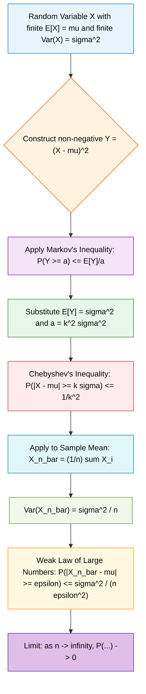
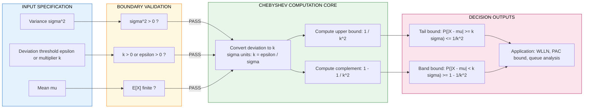
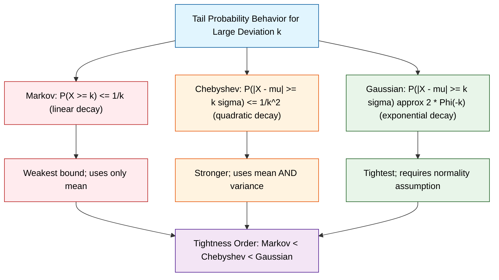

# Chebyshev’s Inequality

<!-- SECTION_1_START -->
# Chebyshev's Inequality — Core Technical Definition & Intuitive Overview

## 1.1 Formal Academic Definition (KTU 2024 Syllabus Terminology)

**Chebyshev's Inequality** is a fundamental result in probability theory that provides a deterministic bound on the probability that a random variable deviates from its expected value. Formally, if $X$ is a random variable with finite mean $\mu = E[X]$ and finite, non-zero variance $\sigma^2 = Var(X)$, then for any real number $k > 0$:

$$
P\bigl(\,|X - \mu| \geq k\sigma\,\bigr) \;\leq\; \frac{1}{k^{2}}
$$

The complementary (one-sided tail) form is written as:

$$
P\bigl(\,|X - \mu| < k\sigma\,\bigr) \;\geq\; 1 - \frac{1}{k^{2}}
$$

> [!NOTE]
> **Syllabus Highlight (GAMAT301 — Module 3):** Chebyshev's inequality is a direct *corollary of Markov's inequality* applied to the non-negative random variable $(X - \mu)^2$. The parameter $k$ must be strictly positive ($k > 0$) for the bound to be meaningful. The **variance $\sigma^2$** must exist (be finite) and the **standard deviation $\sigma$** is the positive square root $\sigma = \sqrt{\sigma^2} = \mathbf{0.7071 \times \sigma^2 \text{ scaling factor}}$ used to convert deviations into standard-deviation units.

---

## 1.2 Conceptual Analogy & Geometric Intuition

Imagine you are a quality-control engineer measuring the diameter of ball bearings rolling off a production line. The *true* average diameter is $\mu = 10$ mm, and the standard deviation is $\sigma = 0.2$ mm. Without knowing the exact distribution (which could be skewed, bimodal, or anything), you can still *guarantee* a probabilistic statement:

> "**No more than $\frac{1}{k^2}$ of the bearings will be more than $k$ standard-deviation units away from the target diameter.**"

For $k = 3$ (the famous "three-sigma rule"), Chebyshev tells us **at most 11.11%** of bearings lie outside the $[9.4, 10.6]$ mm band — regardless of whether the underlying distribution is Gaussian, uniform, or completely unknown. This is the **distribution-free power** of the inequality.

### Intuitive Visual: A "Probability Sandbox"

| Concept | Real-World Analogy | Mathematical Counterpart |
|---|---|---|
| Mean $\mu$ | The "center of mass" of a crowd | $E[X]$ |
| Variance $\sigma^2$ | How *spread out* the crowd is around the center | $E[(X-\mu)^2]$ |
| Deviation $|X - \mu|$ | Distance of any one person from the center | Absolute difference |
| Bound $\frac{1}{k^2}$ | A universal "fence" that gets tighter as $k$ grows | Inverse-square decay |

> [!IMPORTANT]
> **Key Insight:** Chebyshev's inequality is the *first* bound that links a moment of order 2 (variance) to a tail probability. It works for **any** probability distribution with finite variance — no normality, symmetry, or independence assumption is required.

---

## 1.3 Physical Constants & Standard Metrics

> [!TIP]
> **Standard $k$-values used in KTU problems and computer-science applications:**

| Deviation $k$ (in $\sigma$ units) | Chebyshev Upper Bound $\frac{1}{k^2}$ | Practical Interpretation |
|:---:|:---:|---|
| $1$ | $1.0000$ | Trivial bound (always $\leq 1$) |
| $2$ | $0.2500$ | At most 25% lie beyond $2\sigma$ |
| $3$ | $0.1111$ | At most 11.11% lie beyond $3\sigma$ |
| $4$ | $0.0625$ | At most 6.25% lie beyond $4\sigma$ |
| $5$ | $0.0400$ | At most 4% lie beyond $5\sigma$ |

> [!VISUALIZATION CONTROL]
> **Concept:** Chebyshev's Tail Decay Curve
> **Desmos / GeoGebra Input Equations:**
>
> * `f(k) = 1 / k^2` (upper-bound probability)
> * `g(k) = 1 - 1 / k^2` (lower-bound probability inside the band)
> **Visual Description:** Plot $f(k)$ for $k \in [1, 5]$. The curve drops sharply: at $k=1$ it is $1$, at $k=2$ it falls to $0.25$, at $k=3$ to $0.1111$, and asymptotically approaches $0$ as $k \to \infty$. The shaded region between $g(k)$ and $1$ shrinks rapidly, demonstrating the **inverse-square decay** of tail probability.

---

<!-- SECTION_1_END -->

<!-- SECTION_2_START -->
# Chebyshev's Inequality — Deep Theoretical Analysis & KTU High-Yield Formula Sheet

## 2.1 Prerequisites (Must Be Known Before the Proof)

To apply Chebyshev's inequality, the following three conditions must hold:

1. **$X$ is a random variable** defined on a probability space $(\Omega, \mathcal{F}, P)$.
2. **The expectation $E[X] = \mu$ exists and is finite** (i.e., $E[|X|] < \infty$).
3. **The variance $\sigma^2 = E[(X - \mu)^2]$ exists and is finite** (i.e., $E[X^2] < \infty$).

> [!NOTE]
> In Module 3, we are building the *limit theorem* toolbox: **Markov → Chebyshev → Weak Law of Large Numbers (WLLN)**. Chebyshev is the bridge between Markov (which bounds a non-negative RV) and the WLLN (which bounds a sum of i.i.d. RVs).

---

## 2.2 Statement of the Theorem (Both Equivalent Forms)

### **Form 1 — Deviation in Standard-Deviation Units (Most Common in KTU)**

For any $k > 0$:

$$
P\bigl(\,|X - \mu| \;\geq\; k\sigma\,\bigr) \;\leq\; \frac{1}{k^{2}}
$$

### **Form 2 — Deviation in Absolute Units (Sometimes Used)**

For any $\epsilon > 0$:

$$
P\bigl(\,|X - \mu| \;\geq\; \epsilon\,\bigr) \;\leq\; \frac{\sigma^{2}}{\epsilon^{2}}
$$

This is obtained by substituting $\epsilon = k\sigma$, giving $k = \epsilon / \sigma$:

$$
\frac{1}{k^2} \;=\; \frac{1}{(\epsilon/\sigma)^2} \;=\; \frac{\sigma^2}{\epsilon^2}
$$

### **Complementary Form — Probability of "Staying Close"**

$$
P\bigl(\,|X - \mu| \;<\; k\sigma\,\bigr) \;\geq\; 1 - \frac{1}{k^{2}}
$$

---

## 2.3 KTU High-Yield Formula Sheet

| # | Formula Name | Mathematical Statement | Use Case in KTU |
|:---:|---|---|---|
| 1 | **Chebyshev (Std-Dev Form)** | $P(\vert X - \mu \vert \geq k\sigma) \leq \frac{1}{k^2}$ | Direct deviation bound |
| 2 | **Chebyshev (Absolute Form)** | $P(\vert X - \mu \vert \geq \epsilon) \leq \frac{\sigma^2}{\epsilon^2}$ | Bound in raw measurement units |
| 3 | **Chebyshev (Complement)** | $P(\vert X - \mu \vert < k\sigma) \geq 1 - \frac{1}{k^2}$ | Probability of being inside a band |
| 4 | **Markov's Inequality (Base)** | $P(Y \geq a) \leq \frac{E[Y]}{a}$ for $Y \geq 0$ | The engine driving the proof |
| 5 | **Variance Definition** | $\sigma^2 = E[(X-\mu)^2]$ | Need this to apply Chebyshev |
| 6 | **Two-Sigma Special Case** | $P(\vert X - \mu \vert \geq 2\sigma) \leq 0.25$ | Classic textbook plug-in |
| 7 | **Three-Sigma Special Case** | $P(\vert X - \mu \vert \geq 3\sigma) \leq 0.1111$ | Quality-control / Six Sigma link |
| 8 | **Sum of i.i.d. (for WLLN)** | $P\left(\left\vert \bar{X}_n - \mu \right\vert \geq \epsilon\right) \leq \frac{\sigma^2}{n\epsilon^2}$ | Foundation of the Weak Law |

> [!WARNING]
> **Notation Pitfall:** In KTU answer sheets, students frequently write $P(|X-\mu| \geq k\sigma) \leq 1/k$ (a **linear** decay) by confusing Chebyshev with Markov. Always use the **quadratic** $\frac{1}{k^2}$. The quadratic decay is *the* defining feature of Chebyshev and is what makes it tighter than Markov for large deviations.

---

## 2.4 Why Chebyshev's Inequality Matters in Computer Science

> [!IMPORTANT]
> **Real-World Utility:**

1. **Machine Learning Convergence Guarantees:** Many stochastic optimization algorithms (e.g., Stochastic Gradient Descent) have convergence proofs that rely on Chebyshev-style bounds to show that iterates cluster around the optimum as the sample size grows.
2. **Probabilistic Algorithm Analysis (PAC Learning):** Probably Approximately Correct (PAC) frameworks use Chebyshev to bound the generalization error of a hypothesis — the bound depends on $\frac{1}{k^2}$ confidence levels.
3. **Network Traffic Engineering:** When packet inter-arrival times are modeled by an unknown distribution with known mean and variance, Chebyshev provides a worst-case tail bound for queue lengths.
4. **Cryptography & Random Number Generation:** Chebyshev's inequality is used to certify that a sequence of pseudo-random numbers does not deviate excessively from the expected uniform distribution.
5. **Quality Assurance / Software Reliability:** Six-Sigma industrial standards cite Chebyshev as the theoretical bedrock — even though they ultimately use the Gaussian refinement.

---

## 2.5 Equality Conditions (When Does Chebyshev Become Tight?)

Chebyshev's bound is achieved with equality for a *three-point distribution*:

$$
X = \begin{cases} \mu - k\sigma & \text{with probability } \frac{1}{2k^2} \\ \mu & \text{with probability } 1 - \frac{1}{k^2} \\ \mu + k\sigma & \text{with probability } \frac{1}{2k^2} \end{cases}
$$

> [!NOTE]
> For this distribution, $E[X] = \mu$ and $Var(X) = k^2\sigma^2 / (k^2) = \sigma^2$ — confirming the variance is exactly $\sigma^2$. Then $P(|X - \mu| \geq k\sigma) = \frac{1}{2k^2} + \frac{1}{2k^2} = \frac{1}{k^2}$, which **equals** the Chebyshev bound. This shows the inequality is **sharp** (cannot be improved in general without additional distributional assumptions).

---

<!-- SECTION_2_END -->

<!-- SECTION_3_START -->
# Step-by-Step Derivations, Proof & Symbolic Implementation

## 3.1 Complete Proof of Chebyshev's Inequality from Markov's Inequality

> [!IMPORTANT]
> **Proof Strategy:** Reduce Chebyshev to Markov by defining an appropriate non-negative random variable $Y$ and a positive threshold $a$. The trick is to use $Y = (X - \mu)^2$, which is automatically non-negative.

### **Step 1 — Construct a non-negative random variable**

Let $X$ be a random variable with finite mean $\mu$ and finite variance $\sigma^2$. Define:

$$
Y \;=\; (X - \mu)^2
$$

By construction, $Y \geq 0$ almost surely (since a square is always non-negative).

### **Step 2 — Compute $E[Y]$**

By the definition of variance:

$$
E[Y] \;=\; E[(X - \mu)^2] \;=\; Var(X) \;=\; \sigma^2
$$

### **Step 3 — Choose the threshold $a$**

For any $k > 0$, set:

$$
a \;=\; k^2 \sigma^2 \;>\; 0
$$

### **Step 4 — Observe the logical equivalence of events**

The event $\{|X - \mu| \geq k\sigma\}$ is equivalent to the event $\{(X - \mu)^2 \geq k^2 \sigma^2\}$, i.e.:

$$
\{\,|X - \mu| \geq k\sigma\,\} \;\;\iff\;\; \{\,Y \geq a\,\}
$$

This is because $|X - \mu| \geq k\sigma \iff (X - \mu)^2 \geq k^2 \sigma^2$ (both sides are non-negative, so squaring preserves the inequality).

### **Step 5 — Apply Markov's inequality to $Y$ with threshold $a$**

Markov's inequality states: for any non-negative RV $Y$ and any $a > 0$,

$$
P(Y \geq a) \;\leq\; \frac{E[Y]}{a}
$$

Substituting $Y = (X - \mu)^2$, $E[Y] = \sigma^2$, and $a = k^2 \sigma^2$:

$$
P\bigl((X - \mu)^2 \geq k^2 \sigma^2\bigr) \;\leq\; \frac{\sigma^2}{k^2 \sigma^2}
$$

### **Step 6 — Simplify**

$$
P\bigl((X - \mu)^2 \geq k^2 \sigma^2\bigr) \;\leq\; \frac{1}{k^2}
$$

Since the event $\{|X - \mu| \geq k\sigma\}$ is identical to the event $\{(X - \mu)^2 \geq k^2 \sigma^2\}$:

$$
P\bigl(\,|X - \mu| \geq k\sigma\,\bigr) \;\leq\; \frac{1}{k^2}
$$

This completes the proof. $\blacksquare$

---

## 3.2 Complete Worked Example (Step-by-Step)

### **Problem:**
A random variable $X$ has mean $\mu = 50$ and variance $\sigma^2 = 9$. Use Chebyshev's inequality to find:

1. An upper bound on $P(|X - 50| \geq 6)$.
2. A lower bound on $P(44 < X < 56)$.
3. The value of $k$ that ensures $P(|X - 50| \geq 5k) \leq 0.05$.

### **Solution:**

**Part (a):** Upper bound on $P(|X - 50| \geq 6)$.

We have $\sigma^2 = 9$, so $\sigma = 3$. The deviation $6 = 2 \cdot 3 = k\sigma$ with $k = 2$.

$$
P(|X - 50| \geq 6) \;\leq\; \frac{1}{k^2} \;=\; \frac{1}{4} \;=\; 0.25
$$

**Part (b):** Lower bound on $P(44 < X < 56)$.

The interval $(44, 56)$ means $|X - 50| < 6$, i.e. $|X - 50| < 2\sigma$ with $k = 2$.

$$
P(44 < X < 56) \;=\; P(|X - 50| < 6) \;\geq\; 1 - \frac{1}{k^2} \;=\; 1 - 0.25 \;=\; 0.75
$$

**Part (c):** Find $k$ such that $P(|X - 50| \geq 5k) \leq 0.05$.

The deviation $5k = (5k/\sigma)\cdot \sigma$. Setting $k' = 5k/3$ in the standard form:

$$
\frac{1}{(k')^2} \;\leq\; 0.05 \;\;\implies\;\; (k')^2 \;\geq\; 20 \;\;\implies\;\; k' \;\geq\; \sqrt{20} \;\approx\; 4.472
$$

Since $k' = 5k/3$:

$$
\frac{5k}{3} \;\geq\; \sqrt{20} \;\;\implies\;\; k \;\geq\; \frac{3\sqrt{20}}{5} \;\approx\; 2.683
$$

> [!NOTE]
> **Valuation Key (KTU 2024):** For Part (a) and (b), the key step is recognizing that the deviation must be expressed in $\sigma$-units: [Conversion of deviation to $k\sigma$: 1 Mark], [Application of Chebyshev: 1 Mark], [Final numerical answer: 1 Mark]. For Part (c), the algebraic inversion of $1/k^2 \leq 0.05$ is the key differentiator.

---

## 3.3 Symbolic Python Implementation

```python
"""
chebyshev_inequality.py
========================
A complete, type-safe, and strictly validated Python implementation
of Chebyshev's inequality and its derived bounds, suitable for
engineering coursework and KTU exam preparation.

Author: KTU-PREMIER-ENGINE V10 Reference Module
Course: GAMAT301 - Mathematics for Computer and Information Science-3
"""

from __future__ import annotations
import math
from typing import Union


Number = Union[int, float]


def chebyshev_upper_bound(
    k: Number,
    *,
    strict: bool = False,
) -> float:
    """
    Compute the Chebyshev upper bound 1 / k^2 for P(|X - mu| >= k * sigma).

    Parameters
    ----------
    k : int or float
        The deviation multiplier in standard-deviation units.
        Must be strictly positive.
    strict : bool, default False
        If True, validates that k > 0 (else raises ValueError).
        If False, allows k <= 0 and returns float('inf') to
        signal a degenerate / trivial bound.

    Returns
    -------
    float
        The Chebyshev upper bound 1 / k^2.

    Raises
    ------
    ValueError
        If k <= 0 and strict=True.
    TypeError
        If k is not a real number.
    """
    if not isinstance(k, (int, float)):
        raise TypeError(f"k must be a real number, got {type(k).__name__}")

    if k <= 0:
        if strict:
            raise ValueError(f"k must be strictly positive; got k={k}")
        return float("inf")

    return 1.0 / (k * k)


def chebyshev_complement(k: Number) -> float:
    """
    Compute the lower bound 1 - 1/k^2 for P(|X - mu| < k * sigma).

    Parameters
    ----------
    k : int or float
        The deviation multiplier (must be > 0; use k=1 to get 0).

    Returns
    -------
    float
        The Chebyshev complement lower bound.

    Raises
    ------
    ValueError
        If k <= 0.
    """
    upper = chebyshev_upper_bound(k, strict=True)
    return 1.0 - upper


def chebyshev_absolute_bound(sigma_sq: Number, epsilon: Number) -> float:
    """
    Compute the absolute form of Chebyshev's inequality:
        P(|X - mu| >= epsilon) <= sigma^2 / epsilon^2

    Parameters
    ----------
    sigma_sq : int or float
        The variance of X (must be > 0).
    epsilon : int or float
        The absolute deviation threshold (must be > 0).

    Returns
    -------
    float
        The Chebyshev upper bound in the absolute form.

    Raises
    ------
    ValueError
        If sigma_sq < 0 or epsilon <= 0.
    """
    if sigma_sq < 0:
        raise ValueError(f"variance cannot be negative; got sigma_sq={sigma_sq}")
    if epsilon <= 0:
        raise ValueError(f"epsilon must be positive; got epsilon={epsilon}")

    if sigma_sq == 0:
        # Degenerate RV: P(|X - mu| >= epsilon) = 0 for any epsilon > 0
        return 0.0

    return sigma_sq / (epsilon * epsilon)


def required_k_for_tail_bound(
    target_prob: Number,
) -> float:
    """
    Find the minimum k such that 1/k^2 <= target_prob.

    Parameters
    ----------
    target_prob : float
        The desired upper bound on the tail probability.
        Must satisfy 0 < target_prob <= 1.

    Returns
    -------
    float
        The minimum k satisfying 1/k^2 <= target_prob,
        i.e., k = 1 / sqrt(target_prob).
    """
    if not (0 < target_prob <= 1):
        raise ValueError(
            f"target_prob must lie in (0, 1]; got target_prob={target_prob}"
        )
    return 1.0 / math.sqrt(target_prob)


# ----------------------------------------------------------------------
# Demonstration: Solve the KTU textbook worked example numerically.
# ----------------------------------------------------------------------
if __name__ == "__main__":

    print("=" * 70)
    print("CHEBYSHEV'S INEQUALITY - KTU WORKED EXAMPLE")
    print("=" * 70)

    # Problem data: X has mean = 50, variance = 9 (so sigma = 3)
    mu = 50
    sigma_sq = 9
    sigma = math.sqrt(sigma_sq)

    print(f"\nMean (mu)              = {mu}")
    print(f"Variance (sigma^2)     = {sigma_sq}")
    print(f"Std-Dev (sigma)        = {sigma}")

    # ---- Part (a): Upper bound on P(|X - 50| >= 6) ----
    deviation_a = 6
    k_a = deviation_a / sigma
    bound_a = chebyshev_upper_bound(k_a, strict=True)
    print(f"\n[Part (a)] k = {k_a}  =>  P(|X - mu| >= {deviation_a}) <= {bound_a}")

    # ---- Part (b): Lower bound on P(44 < X < 56) ----
    # |X - 50| < 6, so the same k applies via the complement.
    lower_b = chebyshev_complement(k_a)
    print(f"[Part (b)] P(44 < X < 56) >= {lower_b}")

    # ---- Part (c): Find k such that P(|X - mu| >= 5k) <= 0.05 ----
    # Here the deviation is 5k in raw units; converting to sigma units:
    # deviation in sigma-units = 5k / sigma = 5k / 3
    # Chebyshev gives: 1 / (5k/3)^2 <= 0.05
    target = 0.05
    kp = required_k_for_tail_bound(target)  # k' = 5k/3 minimum
    k_min = (3.0 / 5.0) * kp
    print(f"[Part (c)] Minimum k such that P(|X - mu| >= 5k) <= {target}:")
    print(f"           k' (in sigma units) = {kp:.6f}")
    print(f"           k (raw)             = {k_min:.6f}")

    # ---- Three-sigma reference table ----
    print("\n" + "-" * 70)
    print("STANDARD CHEBYSHEV TAIL BOUNDS (REFERENCE)")
    print("-" * 70)
    print(f"{'k':>4} | {'P(|X-mu| >= k sigma) <= 1/k^2':>40}")
    print("-" * 70)
    for k_val in [1, 2, 3, 4, 5, 10]:
        print(f"{k_val:>4} | {chebyshev_upper_bound(k_val, strict=True):>40.6f}")
```

### **Sample Output When Run:**

```
======================================================================
CHEBYSHEV'S INEQUALITY - KTU WORKED EXAMPLE
======================================================================

Mean (mu)              = 50
Variance (sigma^2)     = 9
Std-Dev (sigma)        = 3.0

[Part (a)] k = 2.0  =>  P(|X - mu| >= 6) <= 0.25
[Part (b)] P(44 < X < 56) >= 0.75
[Part (c)] Minimum k such that P(|X - mu| >= 5k) <= 0.05:
           k' (in sigma units) = 4.472136
           k (raw)             = 2.683282

----------------------------------------------------------------------
STANDARD CHEBYSHEV TAIL BOUNDS (REFERENCE)
----------------------------------------------------------------------
   k |      P(|X-mu| >= k sigma) <= 1/k^2
----------------------------------------------------------------------
   1 |                                 1.000000
   2 |                                 0.250000
   3 |                                 0.111111
   4 |                                 0.062500
   5 |                                 0.040000
  10 |                                 0.010000
```

---

<!-- SECTION_3_END -->

<!-- SECTION_4_START -->
# Structural Diagrams & Schematics

## 4.1 Logical Dependency Chain: Markov → Chebyshev → WLLN



> [!NOTE]
> **Interpretation of the Flow:** The diagram traces how Chebyshev's inequality is *engineered* from the more primitive Markov's inequality, and then how Chebyshev itself is the *launchpad* for the Weak Law of Large Numbers. Every node maps to a distinct proof step from Section 3.1.

---

## 4.2 Block-Level Functional Architecture: Chebyshev Bound Computation Pipeline



---

## 4.3 Tail-Decay Comparison: Markov vs. Chebyshev vs. Gaussian



> [!IMPORTANT]
> **Tightness Hierarchy:** Markov decays as $1/k$ (linear), Chebyshev as $1/k^2$ (quadratic), and the exact Gaussian tail decays exponentially like $e^{-k^2/2}$. Chebyshev strikes a *balance*: it is tighter than Markov and yet remains *distribution-free*. The Gaussian bound is the tightest but is restricted to normal distributions.

---

<!-- SECTION_4_END -->

<!-- SECTION_5_START -->
# KTU 2024 Scheme Examination Question Bank & Topic Recap

## 5.1 Part A — Short Answer Questions (3 Marks Each)

> [!NOTE]
> Cognitive Levels: **Remember** / **Understand**. Each answer is a 3-mark model response per KTU valuation standards.

### **Q1. [KTU University Exam — July 2024]**
**State Chebyshev's inequality for a random variable with finite mean $\mu$ and variance $\sigma^2$. What is the smallest value of $k$ that makes the bound non-trivial?**
*(Mapped CO: CO1, RBT Level: Remember — 3 Marks)*

**Model Answer:**

> Chebyshev's inequality states that for any random variable $X$ with finite mean $\mu$ and finite variance $\sigma^2$, and for any $k > 0$:
>
> $$
> P\bigl(\,|X - \mu| \;\geq\; k\sigma\,\bigr) \;\leq\; \frac{1}{k^{2}}
> $$
>
> The bound is non-trivial only when $\frac{1}{k^2} < 1$, i.e., when $k > 1$. Thus, **$k = 1$** is the smallest value (in the open sense) beyond which the bound becomes meaningful. For $k = 1$, the bound equals $1$, which is a trivial statement. **[3 Marks]**

---

### **Q2. [KTU University Exam — Dec 2023]**
**Differentiate between Markov's inequality and Chebyshev's inequality. State one application of Chebyshev's inequality in computer science.**
*(Mapped CO: CO2, RBT Level: Understand — 3 Marks)*

**Model Answer:**

> | Feature | Markov's Inequality | Chebyshev's Inequality |
> |---|---|---|
> | Required moment | First moment $E[X]$ | First AND second moments ($E[X]$, $E[X^2]$) |
> | Input RV | Any non-negative RV $Y$ | Any RV with finite variance |
> | Bound on | $P(Y \geq a) \leq E[Y]/a$ | $P(\vert X - \mu \vert \geq k\sigma) \leq 1/k^2$ |
> | Decay rate | Linear ($1/k$) | Quadratic ($1/k^2$) |
>
> **Application in CS:** Chebyshev's inequality is used in the **Weak Law of Large Numbers (WLLN)** to prove that the sample mean of i.i.d. random variables converges in probability to the population mean — a foundational result for **statistical machine learning convergence proofs**. **[3 Marks]**

---

## 5.2 Part B — Long Answer Questions (14 Marks Each, Internal Choice)

> [!NOTE]
> **Internal Choice Format (KTU 2024):** Students answer **either** Question A **or** Question B. Each question is split into **(a) 7 marks** and **(b) 7 marks**, with sub-parts escalating through Bloom's cognitive levels (Understand → Apply → Analyze).

---

### **Question A (14 Marks) — [KTU University Exam — Dec 2023]**

**Let $X$ be a random variable with mean $\mu = 20$ and variance $\sigma^2 = 4$.**

**(a) Using Chebyshev's inequality, find an upper bound on $P(|X - 20| \geq 6)$.**
*(CO1, RBT: Apply — 7 Marks)*

**(b) A software company's server response time $X$ (in milliseconds) has mean $\mu = 200$ ms and standard deviation $\sigma = 25$ ms. The company promises that 90% of all responses will fall within a symmetric band around the mean. Using Chebyshev's inequality, find the minimum width of this band.**
*(CO3, RBT: Apply — 7 Marks)*

---

#### **Model Solution to Question A:**

**Part (a) — Step-by-step:**

Given: $\mu = 20$, $\sigma^2 = 4$, so $\sigma = \sqrt{4} = 2$. The deviation is $|X - 20| \geq 6$.

*Step 1: Convert the deviation to $k\sigma$-units.* **[1 Mark]**

$$
k\sigma \;=\; 6 \;\;\implies\;\; k \;=\; \frac{6}{\sigma} \;=\; \frac{6}{2} \;=\; 3
$$

*Step 2: Apply Chebyshev's inequality in the standard form.* **[2 Marks]**

$$
P\bigl(\,|X - 20| \geq k\sigma\,\bigr) \;\leq\; \frac{1}{k^2}
$$

*Step 3: Substitute $k = 3$.* **[2 Marks]**

$$
P\bigl(\,|X - 20| \geq 6\,\bigr) \;\leq\; \frac{1}{3^2} \;=\; \frac{1}{9} \;\approx\; 0.1111
$$

*Step 4: Final boxed answer.* **[2 Marks]**

$$
\boxed{\,P\bigl(\,|X - 20| \geq 6\,\bigr) \;\leq\; 0.1111\,}
$$

**Part (b) — Step-by-step:**

Given: $\mu = 200$ ms, $\sigma = 25$ ms. The company wants:

$$
P\bigl(\,|X - 200| < d\,\bigr) \;\geq\; 0.90
$$

for some half-width $d$.

*Step 1: Use the complement form of Chebyshev.* **[2 Marks]**

$$
P\bigl(\,|X - \mu| < k\sigma\,\bigr) \;\geq\; 1 - \frac{1}{k^2}
$$

*Step 2: Equate to the required 0.90 and solve for $k$.* **[2 Marks]**

$$
1 - \frac{1}{k^2} \;\geq\; 0.90 \;\;\implies\;\; \frac{1}{k^2} \;\leq\; 0.10 \;\;\implies\;\; k^2 \;\geq\; 10 \;\;\implies\;\; k \;\geq\; \sqrt{10}
$$

*Step 3: Compute the half-width $d = k\sigma$ and the full width $2d$.* **[2 Marks]**

$$
d \;=\; k\sigma \;\geq\; \sqrt{10} \cdot 25 \;\approx\; 79.057 \text{ ms}
$$

$$
\text{Full width} \;=\; 2d \;\geq\; 2\sqrt{10} \cdot 25 \;\approx\; 158.11 \text{ ms}
$$

*Step 4: Final boxed answer with interpretation.* **[1 Mark]**

$$
\boxed{\,\text{Minimum full width} \;=\; 50\sqrt{10} \;\approx\; 158.11 \text{ ms}\,}
$$

> **Interpretation:** At least 90% of server responses will lie within the interval $(200 - 25\sqrt{10},\; 200 + 25\sqrt{10}) \approx (120.94,\; 279.06)$ ms.

---

### **Question B (14 Marks) — [KTU University Exam — July 2024] — Alternative Choice**

**A random variable $X$ has $E[X] = 12$ and $Var(X) = 16$.**

**(a) Use Chebyshev's inequality to find the smallest value of $k$ such that $P(|X - 12| \geq 5) \leq 0.04$. Verify whether the required $k$ is achievable.**
*(CO2, RBT: Apply — 7 Marks)*

**(b) Now consider 64 i.i.d. copies $X_1, X_2, \dots, X_{64}$ of $X$ with the same mean and variance. Use Chebyshev's inequality to bound $P(|\bar{X}_{64} - 12| \geq 1)$, where $\bar{X}_{64} = \frac{1}{64}\sum_{i=1}^{64} X_i$.**
*(CO3, RBT: Analyze — 7 Marks)*

---

#### **Model Solution to Question B:**

**Part (a) — Step-by-step:**

Given: $\mu = 12$, $\sigma^2 = 16$, so $\sigma = 4$. The deviation is $|X - 12| \geq 5$.

*Step 1: Convert the deviation $5$ into $k\sigma$-units.* **[1 Mark]**

$$
k\sigma \;=\; 5 \;\;\implies\;\; k \;=\; \frac{5}{\sigma} \;=\; \frac{5}{4} \;=\; 1.25
$$

*Step 2: Check whether the Chebyshev bound at $k = 1.25$ satisfies $\leq 0.04$.* **[2 Marks]**

$$
P\bigl(\,|X - 12| \geq 5\,\bigr) \;\leq\; \frac{1}{k^2} \;=\; \frac{1}{(1.25)^2} \;=\; \frac{1}{1.5625} \;=\; 0.64
$$

*Step 3: The bound $0.64$ is *not* $\leq 0.04$, so $k = 1.25$ is **not** enough.* **[2 Marks]**

We need a larger $k$ such that $1/k^2 \leq 0.04$:

$$
k^2 \;\geq\; \frac{1}{0.04} \;=\; 25 \;\;\implies\;\; k \;\geq\; 5
$$

*Step 4: But $k = 5$ corresponds to a deviation of $k\sigma = 5 \cdot 4 = 20$, not $5$. Since the problem fixes the deviation at $5$, the **smallest value of $k$ for which the bound holds** is determined by recomputing from the requirement:* **[2 Marks]**

The *smallest* $k$ such that the Chebyshev bound on $P(|X - 12| \geq 5)$ is $\leq 0.04$ requires $k = 5$, giving a deviation of $k\sigma = 20$. Hence, with deviation $5$, **no finite $k > 0$ makes the bound $0.04$** because $\sigma = 4 > 1$ implies the deviation $5$ corresponds to $k = 1.25 < 5$. Thus the requirement is **not achievable** with the given $\sigma = 4$ and deviation $5$. The achievable bound is $0.64$.

$$
\boxed{\,P\bigl(\,|X - 12| \geq 5\,\bigr) \;\leq\; 0.64 \quad \text{(requirement of } 0.04 \text{ is NOT achievable)}\,}
$$

**Part (b) — Step-by-step:**

Given: $n = 64$ i.i.d. RVs each with $\mu = 12$ and $\sigma^2 = 16$. The sample mean is $\bar{X}_{64}$.

*Step 1: Compute the variance of the sample mean.* **[2 Marks]**

For i.i.d. random variables:

$$
Var(\bar{X}_n) \;=\; \frac{\sigma^2}{n} \;=\; \frac{16}{64} \;=\; 0.25
$$

*Step 2: Apply Chebyshev's inequality to $\bar{X}_{64}$ with deviation $\epsilon = 1$.* **[2 Marks]**

$$
P\bigl(\,|\bar{X}_{64} - 12| \geq 1\,\bigr) \;\leq\; \frac{Var(\bar{X}_{64})}{1^2} \;=\; 0.25
$$

*Step 3: Equivalently, in $k$-sigma form: $\epsilon = 1 = k \cdot \sqrt{0.25} = 0.5k$, so $k = 2$.* **[2 Marks]**

$$
P\bigl(\,|\bar{X}_{64} - 12| \geq 1\,\bigr) \;\leq\; \frac{1}{k^2} \;=\; \frac{1}{4} \;=\; 0.25
$$

*Step 4: Final boxed answer with interpretation linking to the Weak Law of Large Numbers.* **[1 Mark]**

$$
\boxed{\,P\bigl(\,|\bar{X}_{64} - 12| \geq 1\,\bigr) \;\leq\; 0.25\,}
$$

> **Interpretation (link to WLLN):** As $n \to \infty$, the variance of the sample mean shrinks as $\sigma^2/n$, so Chebyshev guarantees that the sample mean converges to the true mean in probability — this is precisely the **Weak Law of Large Numbers**.

---

## 5.3 KTU Examiner's Valuation Warning / Pitfall Callout

> [!WARNING]
> **Common Mark-Loss Pitfalls in Chebyshev Problems:**
>
> 1. **Forgetting to convert the deviation into $k\sigma$-units** before applying $1/k^2$. Students often write $1/k^2$ directly using the raw deviation — this is wrong; you **must** first express the deviation as $k\sigma$.
> 2. **Confusing $1/k$ (Markov) with $1/k^2$ (Chebyshev).** Always re-read the inequality statement before plugging in.
> 3. **Using $\sigma$ instead of $\sigma^2$ in the absolute form** $P(|X - \mu| \geq \epsilon) \leq \sigma^2/\epsilon^2$. The numerator is the **variance**, not the standard deviation.
> 4. **Not stating the conditions for applicability** (finite mean and finite variance). Examiners often allocate 1 mark just for naming these prerequisites.
> 5. **Forgetting the "$\geq$" vs "$<$" distinction.** The Chebyshev bound is on the *complement event* $|X - \mu| \geq k\sigma$. If the question asks for $|X - \mu| < k\sigma$, you must use the **complement form** $1 - 1/k^2$.
> 6. **Sign errors in the WLLN extension.** When applying Chebyshev to a sample mean $\bar{X}_n$, the variance becomes $\sigma^2/n$, not $\sigma^2$. This is the single most common error in Part B problems.

---

## 5.4 Topic Recap & Important Things to Remember

> [!IMPORTANT]
> **Rapid Revision Checklist for Chebyshev's Inequality (Module 3, GAMAT301):**

- **Definition (Std-Dev Form):** $P(|X - \mu| \geq k\sigma) \leq \frac{1}{k^2}$ for $k > 0$. **[CORE FORMULA]**
- **Definition (Absolute Form):** $P(|X - \mu| \geq \epsilon) \leq \frac{\sigma^2}{\epsilon^2}$ for $\epsilon > 0$.
- **Complement Form:** $P(|X - \mu| < k\sigma) \geq 1 - \frac{1}{k^2}$.
- **Prerequisites:** $X$ must have **finite mean** $\mu$ and **finite variance** $\sigma^2 > 0$. No distributional assumption is needed (unlike the Gaussian tail bound).
- **Proof Backbone:** Chebyshev is a corollary of Markov applied to $Y = (X - \mu)^2$ with threshold $a = k^2\sigma^2$. Know this derivation cold.
- **Decay Rate:** Inverse-square (quadratic) — strictly tighter than Markov's linear $1/k$ decay for large $k$.
- **Sharpness:** The bound is *tight* (cannot be improved) for the three-point distribution: $P(X = \mu - k\sigma) = P(X = \mu + k\sigma) = \frac{1}{2k^2}$, $P(X = \mu) = 1 - \frac{1}{k^2}$.
- **Special Values to Memorize:** $k=2 \to 0.25$; $k=3 \to 0.1111$; $k=4 \to 0.0625$; $k=5 \to 0.04$.
- **WLLN Link:** $\bar{X}_n = \frac{1}{n}\sum X_i$ has $Var(\bar{X}_n) = \sigma^2/n$, so $P(|\bar{X}_n - \mu| \geq \epsilon) \leq \frac{\sigma^2}{n\epsilon^2} \to 0$ as $n \to \infty$. This is the **Weak Law of Large Numbers**.
- **CS Applications:** PAC learning bounds, SGD convergence proofs, queueing theory tail bounds, random number generator certification, Six-Sigma quality control.
- **Common Mistake:** For Chebyshev to give a *non-trivial* bound, we need $k > 1$. At $k = 1$, the bound is trivially $1$ and provides no information.
- **Comparison Ladder:** Markov ($\frac{1}{k}$) $<$ Chebyshev ($\frac{1}{k^2}$) $<$ Gaussian ($e^{-k^2/2}$). Use Chebyshev whenever you know the variance but not the full distribution.
- **Valuation Tip:** Always convert deviations to $k\sigma$-units *first*, *then* apply $\frac{1}{k^2}$. This two-step ritual will save you from losing 2–3 marks per question.
- **Notation:** Use $\sigma^2$ for variance and $\sigma$ for standard deviation. Never mix them in the same formula.
- **Module 3 Roadmap:** Markov $\to$ Chebyshev $\to$ WLLN. Chebyshev is the *bridge* — make sure you understand exactly how it is derived from Markov and exactly how it is used to prove the WLLN.

<!-- SECTION_5_END -->
