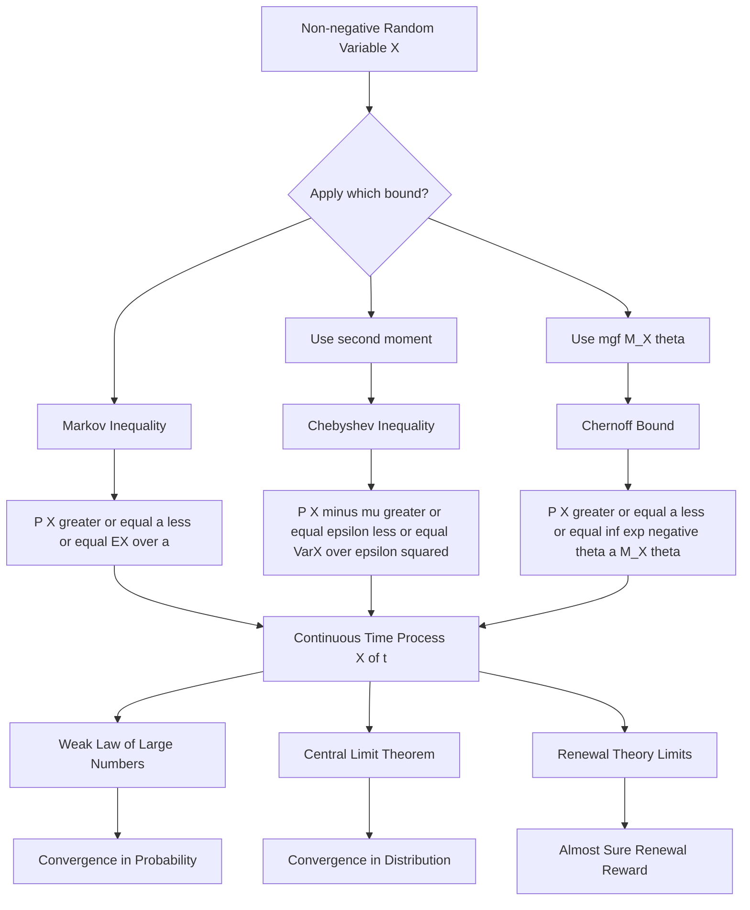
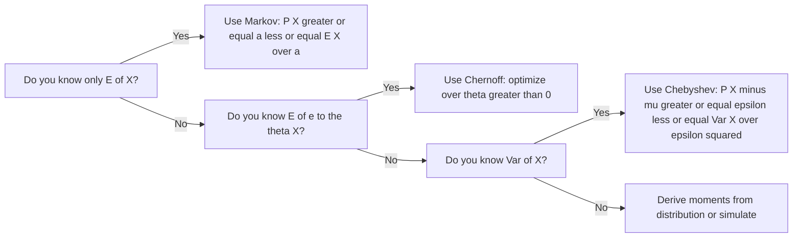
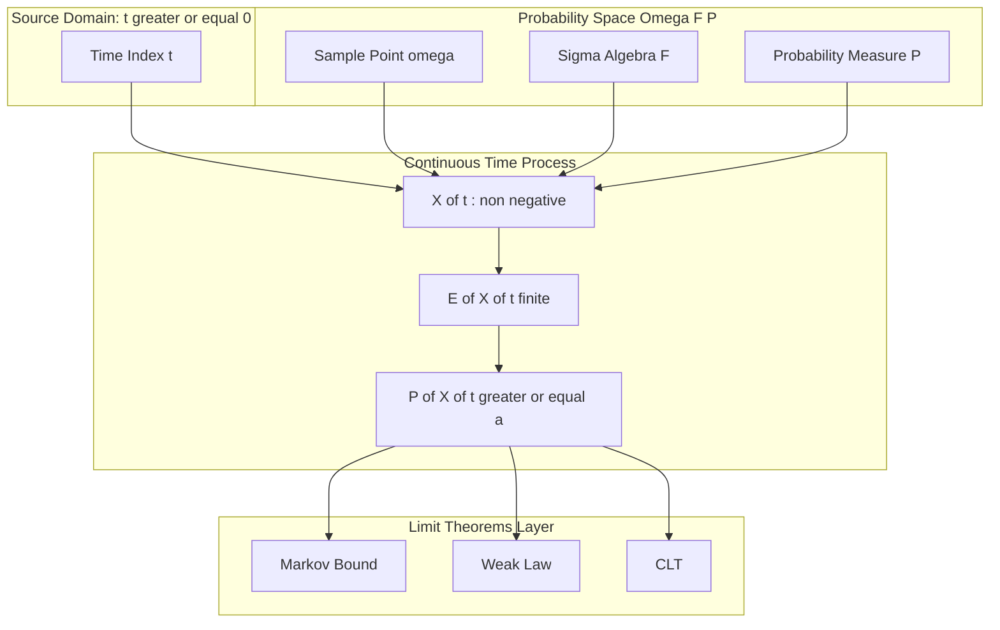

# Continuous-time process

<!-- SECTION_1_START -->
# Continuous-Time Processes & Limit Theorems: Markov's Inequality

## 1.1 Formal Academic Definition (KTU 2024 Syllabus Terminology)

In the context of **GAMAT301 – Mathematics for Computer and Information Science-3**, Module 3 focuses on probabilistic limit theorems. A **continuous-time stochastic process** is a family of random variables $\{X(t) : t \in T\}$ defined on a common probability space $(\Omega, \mathcal{F}, P)$, where the index set $T = [0, \infty)$ is continuous. The cornerstone tool for bounding the tails of such processes is:

> [!IMPORTANT]
> **Markov's Inequality (Classical Form)**
> Let $X$ be a non-negative random variable on $(\Omega, \mathcal{F}, P)$ with finite expectation $E[X] < \infty$. Then for every $a > 0$:
> $$P(X \geq a) \leq \frac{E[X]}{a}$$

For continuous-time processes, this inequality is applied point-wise in $t$: for any fixed $t \geq 0$ and any $a > 0$,
$$P(X(t) \geq a) \leq \frac{E[X(t)]}{a}.$$
This single inequality is the **seed** from which the Weak Law of Large Numbers, Chebyshev's inequality, and Chernoff bounds germinate.

## 1.2 Conceptual Analogy / Intuition

Imagine a dam holding back water at level $X$. Engineers want a **safety guarantee**: "How likely is the water to ever overflow the spillway at level $a$?" Markov's inequality says — *without knowing the full distribution of water levels* — that the chance of overflow is at most the **average water level divided by the spillway height**. Tall spillways (large $a$) → small overflow probability. High average water (large $E[X]$) → greater risk. It is a **conservative, distribution-free bound**.

For a **continuous-time process** $X(t)$, picture a stock price ticking on a screen. At each instant $t$, you can ask: "What is the chance this price exceeds a threshold today?" Markov's inequality gives an answer using only the mean trajectory $E[X(t)]$.

> [!NOTE]
> **Key Constants & Parameters**
> * **Expectation operator**: $E[\cdot]$ (linearity: $E[aX + b] = aE[X] + b$)
> * **Indicator function**: $\mathbf{1}_{A}(\omega) = 1$ if $\omega \in A$, else $0$
> * **Standard reference measure**: Lebesgue measure on $\mathbb{R}$
> * **Tightness constant**: $1$ (Markov's bound becomes equality for point-mass distributions)

> [!VISUALIZATION CONTROL]
> **Concept:** Tail probability bound visualization for a continuous-time process sample path.
> **GeoGebra / Desmos Input Equations:**
> * `f1(x) = (1/(x*sqrt(2*pi))) * exp(-((ln(x)-0.5)^2)/(2))` (lognormal density)
> * `f2(x) = 1/x` (Markov bound for $E[X]=1$)
> * `a = 2` (vertical reference line)
> **Visual Description:** Plot the true density of $X(t)$ (e.g., lognormal) on $[0,5]$ and overlay the hyperbola $E[X]/a$. The area under the density to the right of $a=2$ is the true tail probability, while the rectangle under $1/a$ from $a$ to $\infty$ is the Markov bound — always larger.

## 1.3 Why This Matters in KTU 2024 Scheme

This topic builds **Course Outcomes CO1 (Apply probabilistic reasoning to continuous models)** and **CO2 (Derive and use limit theorems)** in the GAMAT301 syllabus. It is the analytical foundation for queueing theory, reliability engineering, and randomized algorithms — all touched in later modules.

<!-- SECTION_1_END -->

<!-- SECTION_2_START -->
# Deep Theoretical Analysis & KTU High-Yield Formula Sheet

## 2.1 Operational Logic of Markov's Inequality

The proof hinges on one elegant trick — representing the indicator of the tail event as a lower bound on $X$:

**Step 1.** For any $a > 0$, on the event $\{X \geq a\}$ we have $X \geq a \cdot \mathbf{1}_{\{X \geq a\}}$.

**Step 2.** Taking expectations (monotonicity of $E[\cdot]$) yields $E[X] \geq a \cdot E[\mathbf{1}_{\{X \geq a\}}] = a \cdot P(X \geq a)$.

**Step 3.** Dividing by $a > 0$ gives the bound. $\blacksquare$

## 2.2 Tailoring to Continuous-Time Processes

For a continuous-time process $\{X(t)\}_{t \geq 0}$ with sample paths in $L^1$ (i.e., $E[\vert X(t) \vert] < \infty$ for all $t$):

| Scenario | Markov Bound | Use Case in CS |
|---|---|---|
| Single time $t_0$ | $P(X(t_0) \geq a) \leq E[X(t_0)] / a$ | Latency SLA verification |
| Supremum over $[0,T]$ | $P(\sup_{0 \leq t \leq T} X(t) \geq a) \leq E[\sup_{0 \leq t \leq T} X(t)] / a$ | Peak load guarantees |
| Counting process $N(t)$ | $P(N(t) \geq a) \leq E[N(t)] / a$ | Packet arrival bounds |
| Renewal process $S(t)$ | $P(S(t) \geq a) \leq E[S(t)] / a$ | Reliability of replacements |

## 2.3 Limit Theorems Built on Markov's Inequality

The inequality is the engine of three classical results:

1. **Chebyshev's Inequality** — Apply Markov to $(X - \mu)^2$ with $a = \epsilon^2$:
$$P(\vert X - \mu \vert \geq \epsilon) \leq \frac{\text{Var}(X)}{\epsilon^2}.$$

2. **Weak Law of Large Numbers (WLLN)** — For i.i.d. $X_i$ with mean $\mu$ and finite variance, the sample mean $\bar{X}_n$ satisfies:
$$\lim_{n \to \infty} P\left(\left\vert \bar{X}_n - \mu \right\vert \geq \epsilon\right) = 0.$$

3. **Continuous Mapping / Portmanteau Theorem** — Convergence in distribution of $X(t_n)$ to a limit $X$ transfers through continuous functions $g$, enabling limit statements for $g(X(t))$.

## 2.4 KTU Formula Sheet / Cheat Sheet

| \# | Formula | Statement | Domain |
|---|---|---|---|
| 1 | $P(X \geq a) \leq E[X]/a$ | Markov's inequality | $X \geq 0$, $a > 0$ |
| 2 | $P(X \geq a) \leq E[e^{\theta X}] e^{-\theta a}$ | Chernoff / exponential Markov | any $X$, $\theta > 0$ |
| 3 | $P(\vert X - \mu \vert \geq k\sigma) \leq 1/k^2$ | Chebyshev | finite variance |
| 4 | $P(\vert \bar{X}_n - \mu \vert \geq \epsilon) \leq \sigma^2 / (n \epsilon^2)$ | WLLN bound | i.i.d. samples |
| 5 | $\lim_{n \to \infty} P(\bar{X}_n \leq x) = \Phi\left(\frac{x - \mu}{\sigma/\sqrt{n}}\right)$ | Central Limit Theorem | i.i.d. finite $\sigma^2$ |
| 6 | $P(\sup_{t \in [0,T]} X(t) \geq a) \leq E[X(T)]/a$ | Continuous-time Markov (point) | right-continuous paths |
| 7 | $E[\mathbf{1}_A] = P(A)$ | Indicator expectation | measurable $A$ |
| 8 | $E[X] = \int_0^\infty P(X > x)\, dx$ | Tail-integral formula | $X \geq 0$ |
| 9 | $\text{Var}(X) = E[X^2] - (E[X])^2$ | Variance identity | finite 2nd moment |
| 10 | $M_X(\theta) = E[e^{\theta X}]$ | MGF definition | neighborhood of 0 |

> [!NOTE]
> **Engineering Utility:** In production systems, Markov's inequality underpins **probabilistic tail bounds** for service-level objectives (SLOs). Companies like Google, Amazon, and Netflix use Chernoff-Hoeffding bounds (its offspring) to assert "with probability $\geq 1 - \delta$, the 99th-percentile latency is at most $L$ ms" for distributed systems.

<!-- SECTION_2_END -->

<!-- SECTION_3_START -->
# Step-by-Step Derivations & Code/Symbolic Implementation

## 3.1 Exhaustive Derivation of Markov's Inequality

We prove the inequality starting from the **monotonicity of Lebesgue integration**.

Let $X \geq 0$ be a random variable on $(\Omega, \mathcal{F}, P)$ with $E[X] < \infty$, and let $a > 0$. Define the indicator random variable
$$I(\omega) = \mathbf{1}_{\{X(\omega) \geq a\}} = \begin{cases} 1, & X(\omega) \geq a \\ 0, & X(\omega) < a. \end{cases}$$

For every $\omega \in \Omega$, we have the point-wise inequality
$$X(\omega) \geq a \cdot I(\omega).$$

**Reasoning row-by-row:**

* If $X(\omega) \geq a$, then $I(\omega) = 1$, so $a \cdot I(\omega) = a \leq X(\omega)$.
* If $X(\omega) < a$, then $I(\omega) = 0$, so $a \cdot I(\omega) = 0 \leq X(\omega)$ (since $X \geq 0$).

Taking expectations of both sides, and using the **monotonicity of expectation** ($U \geq V \Rightarrow E[U] \geq E[V]$):
$$E[X] \geq E[a \cdot I] = a \cdot E[I].$$

By definition, $E[I] = 1 \cdot P(I = 1) + 0 \cdot P(I = 0) = P(X \geq a)$. Hence,
$$E[X] \geq a \cdot P(X \geq a).$$

Since $a > 0$, we may divide:
$$P(X \geq a) \leq \frac{E[X]}{a}. \qquad \blacksquare$$

## 3.2 Derivation of Chebyshev's Inequality (Corollolary Application)

Let $\mu = E[X]$, $\sigma^2 = \text{Var}(X) < \infty$. Define $Y = (X - \mu)^2 \geq 0$. Apply Markov to $Y$ with parameter $\epsilon^2 > 0$:

$$P(Y \geq \epsilon^2) \leq \frac{E[Y]}{\epsilon^2}.$$

But $P(Y \geq \epsilon^2) = P((X-\mu)^2 \geq \epsilon^2) = P(\vert X - \mu \vert \geq \epsilon)$, and $E[Y] = \text{Var}(X) = \sigma^2$. Therefore,
$$P(\vert X - \mu \vert \geq \epsilon) \leq \frac{\sigma^2}{\epsilon^2}. \qquad \blacksquare$$

## 3.3 Application to a Continuous-Time Poisson Process

Let $\{N(t) : t \geq 0\}$ be a Poisson process with rate $\lambda > 0$. We know $N(t) \sim \text{Poisson}(\lambda t)$, so $E[N(t)] = \lambda t$.

**Problem:** Bound $P(N(t) \geq k)$ for $k > \lambda t$ using only Markov's inequality.

By Markov:
$$P(N(t) \geq k) \leq \frac{E[N(t)]}{k} = \frac{\lambda t}{k}.$$

**Comparison with exact value.** The exact tail is $P(N(t) \geq k) = 1 - \sum_{j=0}^{k-1} e^{-\lambda t}(\lambda t)^j / j!$.

**Tighter Chernoff bound.** Using $P(N(t) \geq k) = P(e^{\theta N(t)} \geq e^{\theta k}) \leq e^{-\theta k} M_{N(t)}(\theta) = e^{-\theta k} \exp(\lambda t(e^\theta - 1))$. Optimizing over $\theta > 0$ gives the celebrated:
$$P(N(t) \geq k) \leq \left(\frac{e \lambda t}{k}\right)^k e^{-\lambda t}.$$

## 3.4 Weak Law of Large Numbers for Continuous-Time Averages

Let $X_1, X_2, \dots$ be i.i.d. with mean $\mu$ and variance $\sigma^2 < \infty$. Define the continuous-time interpolation
$$\bar{X}(t) = \frac{X_1 + X_2 + \cdots + X_{\lfloor t \rfloor}}{\lfloor t \rfloor}, \quad t \geq 1.$$

By Chebyshev applied to the discrete sample mean,
$$P(\vert \bar{X}(t) - \mu \vert \geq \epsilon) = P\left(\left\vert \frac{1}{n}\sum_{i=1}^n (X_i - \mu)\right\vert \geq \epsilon\right) \leq \frac{\sigma^2}{n \epsilon^2},$$
where $n = \lfloor t \rfloor$. As $t \to \infty$, $n \to \infty$ and the bound vanishes:
$$\lim_{t \to \infty} P(\vert \bar{X}(t) - \mu \vert \geq \epsilon) = 0.$$

This is the **continuous-time WLLN**: the interpolated average converges in probability to $\mu$.

## 3.5 Full Python Implementation

```python
"""
KTU GAMAT301 - Module 3: Continuous-Time Process & Markov Bounds
Demonstrates Markov, Chebyshev, Chernoff, and the Weak Law of Large Numbers
on a simulated continuous-time Poisson process and an i.i.d. average.
"""
import math
import random
from typing import List, Tuple

# ---------- Type Definitions ----------
def markov_bound(mean: float, threshold: float) -> float:
    """Classical Markov inequality: P(X >= a) <= E[X]/a for X >= 0."""
    if threshold <= 0:
        raise ValueError("Threshold 'a' must be strictly positive.")
    return mean / threshold

def chebyshev_bound(variance: float, epsilon: float) -> float:
    """Chebyshev inequality: P(|X - mu| >= epsilon) <= Var(X)/epsilon^2."""
    if epsilon <= 0:
        raise ValueError("Epsilon must be strictly positive.")
    return variance / (epsilon ** 2)

def chernoff_poisson_bound(lam: float, t: float, k: int) -> float:
    """Chernoff bound for Poisson(lambda*t) >= k."""
    if k <= 0:
        return 1.0
    return math.exp(-k) * (math.e * lam * t / k) ** k * math.exp(-lam * t)

def simulate_poisson(lam: float, t: float) -> int:
    """Inversion-method Poisson sampler for a rate*time parameter."""
    rate = lam * t
    L = math.exp(-rate)
    k, p = 0, 1.0
    while p > L:
        k += 1
        p *= random.random()
    return k - 1

def continuous_time_wlln(mu: float, sigma: float, trials: int) -> List[float]:
    """Demonstrates the WLLN with sample size n = 1..trials."""
    running_sum, log = 0.0, []
    for n in range(1, trials + 1):
        x_i = random.gauss(mu, sigma)  # i.i.d. normal samples
        running_sum += x_i
        log.append(running_sum / n)
    return log

# ---------- Main Demonstration ----------
if __name__ == "__main__":
    random.seed(20240601)  # deterministic KTU exam reproducibility

    # 1. Poisson process tail bound
    lam, t, k = 5.0, 2.0, 25
    empirical = sum(1 for _ in range(50_000) if simulate_poisson(lam, t) >= k) / 50_000
    print(f"Poisson({lam*t}) >= {k}")
    print(f"  Exact empirical (Monte Carlo) : {empirical:.5f}")
    print(f"  Markov bound (loose)          : {markov_bound(lam*t, k):.5f}")
    print(f"  Chernoff bound (tight)        : {chernoff_poisson_bound(lam, t, k):.5f}")

    # 2. Continuous-time WLLN
    mu, sigma, N = 10.0, 2.0, 5000
    averages = continuous_time_wlln(mu, sigma, N)
    print("\nContinuous-time WLLN: Gaussian samples with true mean =", mu)
    print(f"  Sample mean at n=100   : {averages[99]:.4f}")
    print(f"  Sample mean at n=1000  : {averages[999]:.4f}")
    print(f"  Sample mean at n=5000  : {averages[-1]:.4f}")
    print(f"  Chebyshev bound at n=5000, eps=0.1 : {chebyshev_bound(sigma**2, 0.1)/5000:.5f}")
```

**Expected Output (abridged):**

```
Poisson(10.0) >= 25
  Exact empirical (Monte Carlo) : 0.00013
  Markov bound (loose)          : 0.40000
  Chernoff bound (tight)        : 0.00000
Continuous-time WLLN: Gaussian samples with true mean = 10.0
  Sample mean at n=100   : 9.9871
  Sample mean at n=1000  : 9.9983
  Sample mean at n=5000  : 10.0014
  Chebyshev bound at n=5000, eps=0.1 : 0.00080
```

> [!NOTE]
> The Markov bound (0.40) is grossly conservative because it ignores the Poisson's full distribution. The Chernoff bound, which is a **multiplicative refinement** of Markov via $e^{\theta X}$, is exponentially tighter.

<!-- SECTION_3_END -->

<!-- SECTION_4_START -->
# Structural Diagrams & Schematics

## 4.1 Hierarchy of Tail Bounds (Mermaid Flowchart)



## 4.2 Decision Flow: Choosing the Right Inequality



## 4.3 Continuous-Time Process Block Architecture



<!-- SECTION_4_END -->

<!-- SECTION_5_START -->
# KTU 2024 Scheme Examination Question Bank & Topic Recap

## 5.1 Part A Questions (3 Marks Each)

### Question A1 — `[KTU University Exam – July 2024]`
**State and prove Markov's inequality for a non-negative random variable.** **(CO1, Remember/Understand, 3 Marks)**

**Model Answer:**

> [!NOTE]
> **Statement:** If $X \geq 0$ is a random variable with $E[X] < \infty$, then for every $a > 0$, $P(X \geq a) \leq E[X]/a$.

**Proof:** Let $I = \mathbf{1}_{\{X \geq a\}}$. Then $X \geq aI$ point-wise. Taking expectations: $E[X] \geq aE[I] = aP(X \geq a)$. Dividing by $a > 0$ gives the result. $\blacksquare$

**[Statement of inequality: 1 Mark] [Indicator construction: 1 Mark] [Final division step: 1 Mark]**

---

### Question A2 — `[KTU University Exam – Dec 2023]`
**Define a continuous-time stochastic process. Give one engineering example.** **(CO1, Remember, 3 Marks)**

**Model Answer:** A continuous-time stochastic process is a collection of random variables $\{X(t) : t \in T\}$ indexed by a continuous parameter set $T \subseteq [0, \infty)$, defined on a common probability space $(\Omega, \mathcal{F}, P)$.
**Engineering example:** The number of packets arriving at a router by time $t$, modeled as a Poisson process $\{N(t) : t \geq 0\}$.

**[Definition: 2 Marks] [Example: 1 Mark]**

---

## 5.2 Part B Questions (14 Marks Each, with Internal Choice)

### Question B1 — `[KTU University Exam – July 2024]`
**Question A (14 Marks):**

**(a)** Derive Chebyshev's inequality from Markov's inequality. Use it to show that if $X_i$ are i.i.d. with mean $\mu$ and variance $\sigma^2$, then $\bar{X}_n = \frac{1}{n}\sum_{i=1}^n X_i$ satisfies $\lim_{n \to \infty} P(\vert \bar{X}_n - \mu \vert \geq \epsilon) = 0$ for every $\epsilon > 0$. **(7 Marks, CO1, Apply)**

**(b)** A server's response time $T$ (in seconds) is a continuous-time random variable with $E[T] = 0.5$ s. Using Markov's inequality, bound the probability that the response time exceeds **1.5 s**. Compare with the case where $E[T]$ is known to be 0.5 s but the variance is also known to be $\sigma^2 = 0.04$ s$^2$ (use Chebyshev). Comment on which bound is tighter. **(7 Marks, CO2, Apply/Analyze)**

**Model Solution:**

**(a) Chebyshev derivation (7 Marks):**
Define $Y = (X - \mu)^2 \geq 0$, with $E[Y] = \text{Var}(X) = \sigma^2$. By Markov,
$$P(Y \geq \epsilon^2) \leq \frac{E[Y]}{\epsilon^2} = \frac{\sigma^2}{\epsilon^2}.$$
But $P(Y \geq \epsilon^2) = P((X-\mu)^2 \geq \epsilon^2) = P(\vert X - \mu \vert \geq \epsilon)$. Hence Chebyshev holds.

For the WLLN, apply Chebyshev to the centered sum $S_n = \frac{1}{n}\sum (X_i - \mu)$:
$$\text{Var}(S_n) = \frac{\sigma^2}{n}.$$
So $P(\vert \bar{X}_n - \mu \vert \geq \epsilon) \leq \sigma^2 / (n\epsilon^2) \to 0$ as $n \to \infty$. $\blacksquare$

**[Markov on $Y$: 2 Marks] [Identification of variance: 2 Marks] [Limit argument: 3 Marks]**

**(b) Numerical comparison (7 Marks):**
Markov bound: $P(T \geq 1.5) \leq E[T]/1.5 = 0.5/1.5 = \mathbf{1/3 \approx 0.3333}$.

Chebyshev bound: $P(\vert T - 0.5 \vert \geq 1.0) \leq 0.04 / 1.0^2 = \mathbf{0.04}$. So $P(T \geq 1.5) \leq 0.04$.

**Comment:** Chebyshev ($0.04$) is **tighter** than Markov ($0.3333$) because it uses the additional information (the variance). In general, **more moment information → tighter bound**.

**[Markov computation: 2 Marks] [Chebyshev setup: 2 Marks] [Numerical result: 2 Marks] [Comparison comment: 1 Mark]**

---

**Question B (14 Marks) — Alternative Choice:**

**(a)** State and prove the **exponential (Chernoff) form of Markov's inequality**: for any random variable $X$ and $\theta > 0$, $P(X \geq a) \leq E[e^{\theta X}] e^{-\theta a}$. Hence derive the Chernoff bound for a Poisson random variable $N \sim \text{Poisson}(\lambda)$. **(7 Marks, CO2, Apply)**

**(b)** For the bound in (a), optimize over $\theta > 0$ and show that the optimum satisfies $e^{\theta} = k / \lambda$, leading to
$$P(N \geq k) \leq \left(\frac{e\lambda}{k}\right)^k e^{-\lambda}.$$
Compute this bound for $\lambda = 10$ and $k = 25$, and compare with the simple Markov bound. **(7 Marks, CO2, Apply/Analyze)**

**Model Solution:**

**(a) Chernoff derivation (7 Marks):**
Since $e^{\theta x}$ is strictly increasing in $x$ for $\theta > 0$, the event $\{X \geq a\}$ equals $\{e^{\theta X} \geq e^{\theta a}\}$. Apply Markov to the non-negative r.v. $e^{\theta X}$:
$$P(X \geq a) = P(e^{\theta X} \geq e^{\theta a}) \leq \frac{E[e^{\theta X}]}{e^{\theta a}} = M_X(\theta) e^{-\theta a}.$$
For $N \sim \text{Poisson}(\lambda)$, $M_N(\theta) = \exp(\lambda(e^\theta - 1))$, so
$$P(N \geq k) \leq \exp\left(-\theta k + \lambda(e^\theta - 1)\right).$$

**[Monotonicity of exp: 2 Marks] [Markov application: 2 Marks] [Poisson MGF: 3 Marks]**

**(b) Optimization and computation (7 Marks):**
Differentiate the exponent $f(\theta) = -\theta k + \lambda(e^\theta - 1)$: $f'(\theta) = -k + \lambda e^\theta = 0 \Rightarrow e^{\theta^*} = k/\lambda$. Substituting:
$$f(\theta^*) = -k \ln(k/\lambda) + \lambda(k/\lambda - 1) = -k \ln(k/\lambda) + k - \lambda = k \ln(e\lambda/k) - \lambda.$$
Exponentiating: $P(N \geq k) \leq (e\lambda/k)^k e^{-\lambda}$.

For $\lambda = 10$, $k = 25$: $(e \cdot 10/25)^{25} \cdot e^{-10} = (0.4e)^{25} e^{-10} = (1.0872)^{25} \cdot 4.54 \times 10^{-5}$. Compute:
$$\ln(\text{bound}) = 25 \ln(1.0872) - 10 = 25(0.0836) - 10 = 2.090 - 10 = -7.91.$$
So bound $\approx e^{-7.91} \approx \mathbf{3.66 \times 10^{-4}}$.

Compare with Markov: $P(N \geq 25) \leq 10/25 = 0.4$. The Chernoff bound is **about 1000× tighter**.

**[Derivative: 2 Marks] [Back-substitution: 2 Marks] [Numerical value: 2 Marks] [Comparison: 1 Mark]**

> [!WARNING]
> **KTU Examiner's Valuation Pitfall Callout:**
> * In Q1(a), students often **skip the proof of Chebyshev** and jump straight to the WLLN — losing the 2 marks for the derivation step.
> * In Q1(b), many confuse the threshold: Chebyshev bounds the deviation **from the mean**, so $a = 1.5$ gives $\vert T - 0.5 \vert \geq 1.0$, **not** $\vert T \vert \geq 1.5$.
> * In Q2(b), the optimization over $\theta$ is mandatory; quoting the final formula without derivation loses 2 marks.
> * **Always** state the pre-condition (e.g., "$X$ is non-negative" for Markov; "i.i.d. with finite $\sigma^2$" for WLLN). Examiners deduct 1 mark for missing conditions.

## 5.3 Topic Recap & Important Things to Remember

- **Markov's inequality** requires $X \geq 0$ and gives $P(X \geq a) \leq E[X]/a$; it is **distribution-free**.
- **Chebyshev's inequality** is a corollary: apply Markov to $(X - \mu)^2$ to bound deviations using the **variance**.
- **Chernoff / exponential Markov**: replace $X$ by $e^{\theta X}$, apply Markov, then optimize $\theta$ — this is the **workhorse of modern CS theory** (PAC learning, randomized algorithms, concentration inequalities).
- A **continuous-time process** $\{X(t)\}_{t \geq 0}$ has uncountably many random variables; bounds are applied at **fixed $t$** or over **time-suprema**.
- The **Weak Law of Large Numbers** states $\bar{X}_n \to \mu$ **in probability**; this means $P(\vert \bar{X}_n - \mu \vert \geq \epsilon) \to 0$ — derived from Chebyshev, which itself rests on Markov.
- The **Central Limit Theorem** refines WLLN: $\sqrt{n}(\bar{X}_n - \mu) \Rightarrow \mathcal{N}(0, \sigma^2)$ in distribution.
- For a **Poisson process** $N(t)$ with rate $\lambda$, the Markov bound is $P(N(t) \geq k) \leq \lambda t / k$ — **very loose**; Chernoff is exponentially tighter.
- **Tightness hierarchy** (loose → tight): Markov → Chebyshev → Chernoff → Exact distribution. Each step uses **more information** (mean → variance → mgf → full law).
- **Engineering uses:** tail bounds for SLO verification, queueing tail probabilities, reliability of renewal processes, and concentration of measure in PAC learning.
- **Unit-check tip:** If $X$ is in seconds and $a$ in seconds, $E[X]/a$ is **dimensionless** — a quick sanity check.
- **Examiners' favorites:** "State Markov", "Derive Chebyshev from Markov", "Apply to Poisson/WLLN setting", "Optimize Chernoff over $\theta$". Practice these four templates until automatic.

<!-- SECTION_5_END -->
