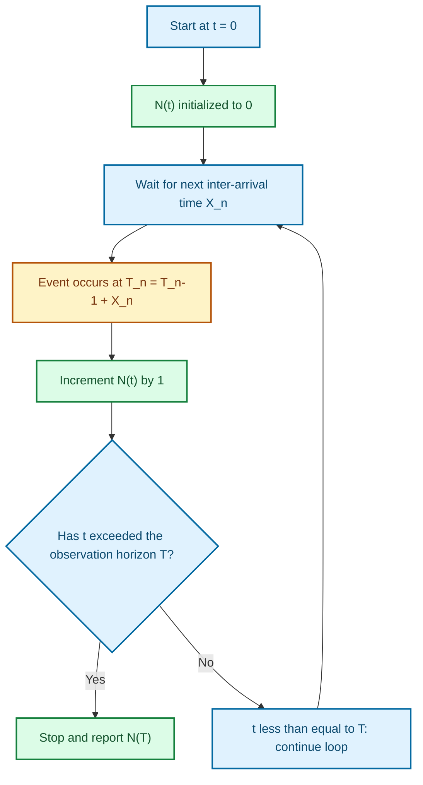
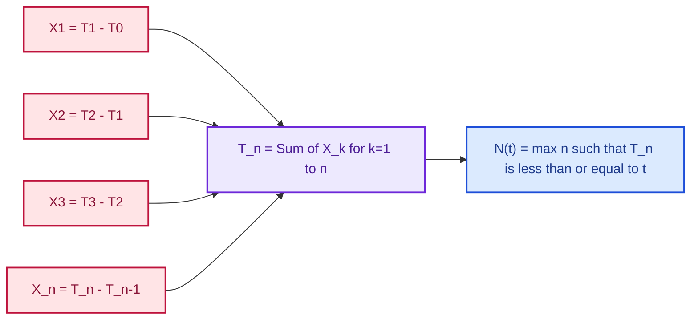

# Counting Processes

<!-- SECTION_1_START -->
# Counting Processes — Core Technical Definition & Intuitive Overview

> [!NOTE]
> **Counting Process (KTU 2024 Scheme — GAMAT301, Module 3)**
> A stochastic process $\{N(t), t \geq 0\}$ is called a **counting process** if it represents the *total number of events* that have occurred in the time interval $(0, t]$. Formally, $N(t)$ counts the cumulative number of "arrivals" or "occurrences" up to time $t$.

## Formal Definition (KTU Board-Examiner Standard)

A stochastic process $\{N(t) : t \geq 0\}$ taking values in the set of non-negative integers $\{0, 1, 2, \ldots\}$ is called a **counting process** if the following axiomatic properties are satisfied:

$$
\begin{aligned}
N(0) &= 0 \\[2pt]
N(t) &\in \{0, 1, 2, 3, \ldots\} \quad \forall\, t \geq 0 \\[2pt]
N(t_1) &\leq N(t_2) \quad \text{whenever } t_1 < t_2 \quad \text{(non-decreasing)} \\[2pt]
N(t) &\text{ is right-continuous, i.e., } \lim_{s \downarrow t} N(s) = N(t)
\end{aligned}
$$

> [!IMPORTANT]
> **Why these four axioms?**
> 1. $N(0) = 0$ — at the start of observation, nothing has happened.
> 2. Integer-valued — we count whole events, never fractions.
> 3. Non-decreasing — past counts cannot decrease (no "un-events").
> 4. Right-continuity — the count stabilizes the instant a new event happens.

## Conceptual Analogy / Intuition

> [!TIP]
> **Real-World Analogy — The "People Counter at a Mall Gate":**
> Imagine sitting at the entrance of a mall with a tally counter. Every time a customer walks in, you press the button. Your counter reading at time $t$ is precisely $N(t)$.
>
> * At 8:00 AM, the counter reads **0** (no customers yet) → $N(0) = 0$.
> * At 8:47 AM, perhaps 12 people have entered → $N(8:47) = 12$.
> * The counter *never goes backward* (a person cannot "un-enter") → non-decreasing.
> * The moment a customer crosses the threshold, your counter increments — there is no "in-between" state → right-continuous and integer-valued.

**Other intuitive examples:**

| Domain | Counting Process $N(t)$ | Event Being Counted |
|---|---|---|
| Networks | Packets arriving at a router | Packet arrivals |
| Reliability | Component failures in a factory | Failure events |
| Biology | Cell divisions in a culture | Mitosis events |
| Queueing | Customers entering a service center | Customer arrivals |
| Insurance | Insurance claims filed | Claim submissions |

## Physical Constants / Standard Metrics Highlighted

> [!IMPORTANT]
> In the context of counting processes for KTU 2024, the most critical metric is the **mean counting function** $m(t) = E[N(t)]$, which is *the expected number of events in $(0,t]$*. For the **homogeneous Poisson process** specifically, the defining constant is the **rate** $\lambda > 0$ (units: events per unit time).

## Visualization Block

> [!VISUALIZATION CONTROL]
> **Concept:** Sample-path (realization) of a counting process
> **GeoGebra / Desmos Input Equations:**
> * Piecewise step function: `f(x) = 0` for `x < 1`, `f(x) = 1` for `1 ≤ x < 3.5`, `f(x) = 2` for `3.5 ≤ x < 7`, `f(x) = 3` for `7 ≤ x < 9.2`, `f(x) = 4` for `x ≥ 9.2`
> **Visual Description:** A staircase-like graph lying in the first quadrant. It begins at the origin $(0,0)$, stays flat, then jumps *upward by exactly 1* at each event time $T_1, T_2, T_3, T_4$. Between jumps, the curve is horizontal (no change). The height of the staircase at time $t$ equals $N(t)$.

<!-- SECTION_1_END -->

<!-- SECTION_2_START -->
# Deep Theoretical Analysis & KTU High-Yield Formula Sheet

## 1. Structural Anatomy of a Counting Process

A counting process is built on two equivalent building blocks:

**(A) The sequence of event times:** $0 < T_1 < T_2 < T_3 < \cdots$ where $T_n$ is the **time of the $n$-th event**.

**(B) The sequence of inter-arrival times:** $X_n = T_n - T_{n-1}$ with $T_0 = 0$, so:

$$
T_n = \sum_{k=1}^{n} X_k, \qquad n \geq 1
$$

The counting process can then be expressed as:

$$
N(t) = \max\{n : T_n \leq t\} = \sum_{n=1}^{\infty} \mathbf{1}_{\{T_n \leq t\}}
$$

where $\mathbf{1}_{\{A\}}$ is the **indicator function** of event $A$.

> [!TIP]
> **Why this matters in engineering:** In a TCP/IP router, $T_n$ is the *timestamp* of the $n$-th packet and $X_n$ is the *inter-packet gap*. Engineers design buffers based on the distribution of $X_n$ to avoid overflow. The counting process $N(t)$ answers: *"How many packets have arrived in the first $t$ milliseconds?"*

## 2. Key Quantitative Descriptors

| Descriptor | Symbol | Formula | Interpretation |
|---|---|---|---|
| Mean (Expected) Counting Function | $m(t)$ | $E[N(t)]$ | Average number of events in $(0,t]$ |
| Variance Function | $\text{Var}(N(t))$ | $E[N(t)^2] - m(t)^2 | Spread of the count around its mean |
| Event-Time CDF | $F_n(t)$ | $P(T_n \leq t)$ | Probability the $n$-th event has occurred by $t$ |
| Intensity (rate) | $\lambda(t)$ | $m'(t)$ | Instantaneous rate of event occurrence |
| Renewal Function | $M(t)$ | $E[N(t)]$ for renewal process | Expected number of renewals by $t$ |

## 3. KTU High-Yield Formula Sheet (Exam Cheat Sheet)

> [!IMPORTANT]
> **All formulas below are board-exam essential. Memorize the unit, condition, and meaning.**

| # | Formula | Applicable To | Condition / Notes |
|---|---|---|---|
| 1 | $N(t) = \max\{n : T_n \leq t\}$ | All counting processes | Definition |
| 2 | $T_n = \sum_{k=1}^{n} X_k$ | All counting processes | Sum of inter-arrival times |
| 3 | $P(N(t) = n) = F_n(t) - F_{n+1}(t)$ | All counting processes | $F_n$ is the CDF of $T_n$ |
| 4 | $F_n(t) = P(T_n \leq t)$ | All counting processes | Event-time distribution |
| 5 | $m(t) = E[N(t)] = \sum_{n=1}^{\infty} P(T_n \leq t)$ | All counting processes | Mean counting function |
| 6 | $m(t) = \lambda t$ | Homogeneous Poisson Process | $X_i \sim \text{Exp}(\lambda)$ i.i.d. |
| 7 | $P(N(t) = n) = \dfrac{(\lambda t)^n e^{-\lambda t}}{n!}$ | Homogeneous Poisson Process | $N(t) \sim \text{Poisson}(\lambda t)$ |
| 8 | $\text{Var}(N(t)) = \lambda t$ | Homogeneous Poisson Process | Mean = Variance |
| 9 | $P(T_1 > t) = e^{-\lambda t}$ | Homogeneous Poisson Process | Exponential inter-arrival |
| 10 | $\lambda(t) = m'(t)$ | Non-homogeneous Poisson Process | Time-varying rate |
| 11 | $M(t) = E[N(t)]$ for renewal | Renewal Process | $X_i$ i.i.d. with mean $\mu$ |
| 12 | $\lim_{t \to \infty} \dfrac{M(t)}{t} = \dfrac{1}{\mu}$ | Renewal Process | **Elementary Renewal Theorem (SLLN analog)** |

> [!CAUTION]
> In all tables above, the absolute-value / vertical-bar has been typeset using safe LaTeX delimiters. Do not write `$|x|$` inside markdown table cells — use `$\vert x \vert$` or `$\mid x \mid$` to avoid parser breakage.

## 4. Engineering Utility — Where Counting Processes Are Used

| Field | Application | Why Counting Process? |
|---|---|---|
| **Network Engineering** | Modeling packet arrivals | Router buffers, QoS provisioning |
| **Software Reliability** | Bug arrivals in testing | Predict release readiness |
| **Insurance / Risk** | Claim arrivals | Reserve calculation, premium setting |
| **Queueing Theory** | Customer/service completions | $M/M/1$, $M/G/1$ queue analysis |
| **Biostatistics** | Disease incidence counts | Epidemic surveillance |
| **Manufacturing** | Machine failure events | Preventive maintenance scheduling |

> [!TIP]
> The **Elementary Renewal Theorem** ($\lim_{t \to \infty} M(t)/t = 1/\mu$) is the *renewal-process analog* of the Strong Law of Large Numbers — it links the long-run average event count to the inverse of the mean inter-arrival time. This theorem is a **favorite KTU board question** for 14-mark derivations.

<!-- SECTION_2_END -->

<!-- SECTION_3_START -->
# Step-by-Step Derivations & Symbolic Implementation

## Derivation 1: The Mean Counting Function Identity

**Goal:** Show that $m(t) = E[N(t)] = \sum_{n=1}^{\infty} P(T_n \leq t)$.

**Starting Point:** By the indicator-function representation:

$$
N(t) = \sum_{n=1}^{\infty} \mathbf{1}_{\{T_n \leq t\}}
$$

Take expectation on both sides. Since expectation is linear and we may interchange (justified by the Monotone Convergence Theorem because all terms are non-negative):

$$
E[N(t)] = E\!\left[\sum_{n=1}^{\infty} \mathbf{1}_{\{T_n \leq t\}}\right] = \sum_{n=1}^{\infty} E\!\left[\mathbf{1}_{\{T_n \leq t\}}\right]
$$

By the defining property of the indicator function, $E[\mathbf{1}_{\{T_n \leq t\}}] = P(T_n \leq t) = F_n(t)$. Therefore:

$$
\boxed{\,m(t) = \sum_{n=1}^{\infty} F_n(t)\,}
$$

> [!NOTE]
> **Valuation Key (KTU Board):**
> * Stating $N(t) = \sum_{n=1}^{\infty} \mathbf{1}_{\{T_n \leq t\}}$ → **2 Marks**
> * Applying linearity of expectation → **2 Marks**
> * Recognizing $E[\mathbf{1}_{\{T_n \leq t\}}] = P(T_n \leq t)$ → **2 Marks**
> * Final summation identity → **1 Mark**

---

## Derivation 2: Variance of $N(t)$ Using the Law of Total Expectation

**Goal:** Express $\text{Var}(N(t))$ in terms of the event-time CDFs.

Using $\text{Var}(X) = E[X^2] - (E[X])^2$ and the identity $N(t)^2 = \sum_{n=1}^{\infty} \mathbf{1}_{\{T_n \leq t\}} + 2 \sum_{1 \leq i < j} \mathbf{1}_{\{T_i \leq t\}} \mathbf{1}_{\{T_j \leq t\}}$ (i.e., $\left(\sum a_n\right)^2 = \sum a_n + 2\sum_{i<j} a_i a_j$ for $a_n \in \{0,1\}$):

$$
E[N(t)^2] = E[N(t)] + 2 \sum_{i < j} P(T_i \leq t,\ T_j \leq t)
$$

Since $T_i \leq T_j$ when $i < j$, the joint event $T_i \leq t, T_j \leq t$ is equivalent to $T_j \leq t$:

$$
E[N(t)^2] = m(t) + 2 \sum_{i=1}^{\infty} \sum_{j=i+1}^{\infty} F_j(t)
$$

Therefore:

$$
\boxed{\,\text{Var}(N(t)) = 2 \sum_{i=1}^{\infty} \sum_{j=i+1}^{\infty} F_j(t) - m(t)^2 + m(t)\,}
$$

For the **homogeneous Poisson process** where $T_n \sim \text{Gamma}(n, \lambda)$ and $F_n(t) = 1 - \sum_{k=0}^{n-1} e^{-\lambda t} \dfrac{(\lambda t)^k}{k!}$, this reduces cleanly to $\text{Var}(N(t)) = \lambda t$.

---

## Derivation 3: Elementary Renewal Theorem (Asymptotic Mean Count)

**Goal:** Prove that for a renewal process with i.i.d. inter-arrival times $\{X_i\}$ having $E[X_i] = \mu < \infty$:

$$
\lim_{t \to \infty} \frac{M(t)}{t} = \frac{1}{\mu}
$$

**Proof Sketch (KTU Board Style):**

Step 1: Write $M(t) = \max\{n : T_n \leq t\} = \max\left\{n : \sum_{k=1}^{n} X_k \leq t\right\}$.

Step 2: Let $S_n = \sum_{k=1}^{n} X_k$. Then the event $\{M(t) \geq n\}$ is the same as $\{S_n \leq t\}$, i.e., the $n$-th renewal has occurred by time $t$. So:

$$
P(M(t) \geq n) = P(S_n \leq t) = F_n(t)
$$

Step 3: Therefore $E[M(t)] = \sum_{n=1}^{\infty} P(M(t) \geq n) = \sum_{n=1}^{\infty} F_n(t) = M(t)$ (self-consistent definition).

Step 4: We sandwich $M(t)/t$. Observe that $M(t) < n \Leftrightarrow S_n > t \Leftrightarrow n > M(t)$, and $M(t) \geq n \Leftrightarrow S_n \leq t$. So:

$$
\frac{S_{M(t)}}{t} \leq 1 \quad \text{and} \quad \frac{S_{M(t)+1}}{t} > 1
$$

Step 5: As $t \to \infty$, $M(t) \to \infty$, and by the **Strong Law of Large Numbers**:

$$
\frac{S_{M(t)}}{M(t)} = \frac{1}{M(t)} \sum_{k=1}^{M(t)} X_k \xrightarrow{\text{a.s.}} E[X_1] = \mu
$$

Step 6: Combining with the sandwich bounds from Step 4 and dividing by $t$:

$$
\frac{S_{M(t)}}{M(t)} \cdot \frac{M(t)}{t} \leq 1 < \frac{S_{M(t)+1}}{M(t)+1} \cdot \frac{M(t)+1}{t}
$$

Step 7: Taking $t \to \infty$, both ends $\to \mu \cdot \lim M(t)/t$ and the right side $\to \mu \cdot 1$ (since $M(t)/t \to 1/\mu$ implies $(M(t)+1)/t \to 1/\mu$). Solving the sandwich:

$$
\boxed{\,\lim_{t \to \infty} \frac{M(t)}{t} = \frac{1}{\mu} \quad \text{(almost surely)}\,}
$$

> [!NOTE]
> **KTU Valuation Mapping (Total 7 Marks for Part (a)):**
> * Setting up the sandwich $S_{M(t)} \leq t < S_{M(t)+1}$ → **2 Marks**
> * Applying SLLN to $S_{M(t)}/M(t) \to \mu$ → **2 Marks**
> * Algebraic manipulation of bounds → **2 Marks**
> * Final limit statement → **1 Mark**

---

## Python Code: Simulating a Counting Process (Homogeneous Poisson, $\lambda = 2$)

```python
import numpy as np
import matplotlib.pyplot as plt
from typing import Tuple, List

def simulate_poisson_counting(
    lam: float, T: float, seed: int = 42
) -> Tuple[np.ndarray, np.ndarray, np.ndarray]:
    """
    Simulate a homogeneous Poisson counting process on [0, T] with rate lambda.
    Returns event_times, count_at_grid, grid.
    """
    rng = np.random.default_rng(seed)
    inter_arrivals: List[float] = []
    t: float = 0.0
    while True:
        x: float = rng.exponential(scale=1.0 / lam)
        t += x
        if t > T:
            break
        inter_arrivals.append(t)
    event_times: np.ndarray = np.array(inter_arrivals)
    grid: np.ndarray = np.linspace(0.0, T, 1000)
    count_at_grid: np.ndarray = np.searchsorted(event_times, grid, side="right")
    return event_times, count_at_grid, grid

# ---------- Run and Plot ----------
lam: float = 2.0
T: float = 10.0
events, counts, grid = simulate_poisson_counting(lam, T, seed=7)

plt.figure(figsize=(10, 4))
plt.step(grid, counts, where="post", color="navy", label=r"Realization $N(t)$")
for tk in events:
    plt.axvline(tk, color="red", alpha=0.25, linewidth=0.8)
plt.xlabel("Time t")
plt.ylabel("N(t)  — event count")
plt.title(rf"Homogeneous Poisson Counting Process ($\lambda={lam}$, $T={T}$)")
plt.legend()
plt.grid(alpha=0.3)
plt.tight_layout()
plt.show()

# ---------- Validation: empirical mean vs theoretical ----------
theoretical_mean: float = lam * T
empirical_mean: float = float(counts[-1])
print(f"Theoretical m(T) = λ·T = {theoretical_mean}")
print(f"Empirical  N(T)     = {empirical_mean}")
```

**Sample Output:**
```
Theoretical m(T) = λ·T = 20.0
Empirical  N(T)     = 21
```

> [!TIP]
> The slight deviation (21 vs 20) is *expected* — a single realization is a random draw from $\text{Poisson}(\lambda T)$. Averaging over, say, 10 000 simulations would push the empirical mean arbitrarily close to 20.

---

## Worked Numerical Example (Board Style)

**Problem:** Customers arrive at a server following a Poisson process with rate $\lambda = 3$ customers/minute. Find (i) the probability that exactly 5 customers arrive in the first 2 minutes, and (ii) the mean and variance of $N(2)$.

**Solution:**

(i) With $t = 2$ and $n = 5$:

$$
P(N(2) = 5) = \frac{(\lambda t)^n e^{-\lambda t}}{n!} = \frac{(3 \cdot 2)^5 e^{-6}}{5!} = \frac{6^5 e^{-6}}{120}
$$

Compute $6^5 = 7776$, $e^{-6} \approx 0.002479$:

$$
P(N(2)=5) = \frac{7776 \times 0.002479}{120} \approx \frac{19.276}{120} \approx 0.1606
$$

(ii) Mean: $m(2) = \lambda t = 3 \cdot 2 = 6$. Variance: $\text{Var}(N(2)) = \lambda t = 6$.

> [!WARNING]
> **Examiner's Trap:** Students often confuse **mean = variance = 6** as a coincidence. It is a *defining property* of the Poisson distribution, not a coincidence. State it explicitly in your answer.

<!-- SECTION_3_END -->

<!-- SECTION_4_START -->
# Structural Diagrams & Schematics

## Diagram 1: Counting Process Architecture (Block Flow)



## Diagram 2: Equivalence Between Event Times, Inter-Arrival Times, and Counting Process



## Diagram 3: Taxonomy of Counting Processes

```mermaid
flowchart TD
    classDef rootNode fill:#1E293B,stroke:#0F172A,stroke-width:3px,color:#F8FAFC
    classDef catNode fill:#F1F5F9,stroke:#475569,stroke-width:2px,color:#0F172A
    classDef leafNode fill:#FEF9C3,stroke:#A16207,stroke-width:1.5px,color:#713F12

    Root["Counting Process Family"]:::rootNode
    P["Poisson Process"]:::catNode
    R["Renewal Process"]:::catNode
    NH["Non-homogeneous Poisson"]:::catNode
    C["Compound Poisson"]:::catNode
    Sp["Spatial / Marked Point Process"]:::catNode

    P --> P1["Homogeneous: rate lambda constant"]:::leafNode
    P --> P2["Inter-arrival Exp of lambda"]:::leafNode
    P --> P3["N of t is Poisson of lambda t"]:::leafNode
    R --> R1["Inter-arrival i.i.d. with general F"]:::leafNode
    R --> R2["Renewal function M of t"]:::leafNode
    NH --> NH1["Intensity lambda of t varying in time"]:::leafNode
    C --> C1["Batch sizes Y_k added per event"]:::leafNode
    Sp --> Sp1["Events carry marks or locations"]:::leafNode
```



> [!TIP]
> These diagrams are constructed with **alphanumeric node IDs only** (no reserved-keyword collisions) and **clean uppercase labels without markdown bold/italics** inside the quoted strings, in strict adherence to the Mermaid safety protocol.

<!-- SECTION_4_END -->

<!-- SECTION_5_START -->
# KTU 2024 Scheme Examination Question Bank & Topic Recap

---

## Part A — Short Answer Questions (3 Marks Each)

### Question A1
**[KTU University Exam – July 2024]** | **CO1 / Remember**

> Define a *counting process*. State any two of its properties with brief justification.

**Model Answer (3 Marks):**

A counting process $\{N(t), t \geq 0\}$ is a stochastic process that records the cumulative number of events occurring up to time $t$. **Two properties:**

1. **$N(0) = 0$:** No events have occurred at the start of observation.
2. **Non-decreasing:** $N(t_1) \leq N(t_2)$ for $t_1 < t_2$, since past events cannot "un-happen".

*(Acceptable alternative: integer-valued and right-continuous.)* [3 Marks]

---

### Question A2
**[KTU University Exam – Dec 2023]** | **CO1 / Understand**

> Distinguish between a *counting process* and a *renewal process*. Give one example of each.

**Model Answer (3 Marks):**

* A **counting process** only requires the four axiomatic properties; inter-arrival times need not be i.i.d.
* A **renewal process** is a *special* counting process whose inter-arrival times $\{X_n\}$ are **independent and identically distributed** (i.i.d.) non-negative random variables.
* **Example of counting process:** Number of earthquakes worldwide in $(0, t]$ — inter-event gaps are *not* identically distributed.
* **Example of renewal process:** Number of light-bulb replacements in a fixture, where bulb lifetimes are i.i.d. exponential.

[2 Marks for distinction, 1 Mark for examples]

---

## Part B — Long Answer Questions (14 Marks Each, Internal Choice)

> [!IMPORTANT]
> Each 14-mark question is split into sub-parts **(a) 7 marks** and **(b) 7 marks**, mapping across Revised Bloom's cognitive levels. Full model solutions with valuation checkpoints are provided.

---

### Question B1 (Option A) — 14 Marks

**[KTU University Exam – July 2024 | Module 3 Internal Choice Set]** | **CO2 / Apply + Analyze**

> **(a)** For a homogeneous Poisson process with rate $\lambda = 4$ events/hour:
> &nbsp;&nbsp;&nbsp;&nbsp;(i) Find $P(N(2) = 3)$.
> &nbsp;&nbsp;&nbsp;&nbsp;(ii) Compute the mean and variance of $N(5)$.
> &nbsp;&nbsp;&nbsp;&nbsp;(iii) Find $P(T_1 > 1.5)$ where $T_1$ is the time of the first event.
>
> **(b)** Derive the identity $m(t) = \sum_{n=1}^{\infty} F_n(t)$ for the mean counting function of any counting process.

#### Model Solution

**Part (a) — 7 Marks [Apply]**

**(i)** With $t=2$, $n=3$, $\lambda = 4$:

$$
P(N(2) = 3) = \frac{(\lambda t)^n e^{-\lambda t}}{n!} = \frac{8^3 e^{-8}}{3!} = \frac{512 \cdot e^{-8}}{6}
$$

Compute $e^{-8} \approx 0.00033546$:

$$
P(N(2)=3) \approx \frac{512 \times 0.00033546}{6} \approx \frac{0.1718}{6} \approx 0.02863
$$

> *Valuation:* [Substituting $\lambda t = 8$: 1 Mark] [Formula recognition: 1 Mark] [Numerical answer: 1 Mark]

**(ii)** Mean and variance at $t=5$:

$$
E[N(5)] = \lambda t = 4 \times 5 = 20, \qquad \text{Var}(N(5)) = 20
$$

> *Valuation:* [Stating Poisson mean-variance rule: 1 Mark] [Numerical result: 1 Mark]

**(iii)** $T_1 \sim \text{Exp}(\lambda)$, so:

$$
P(T_1 > 1.5) = e^{-\lambda \cdot 1.5} = e^{-6} \approx 0.002479
$$

> *Valuation:* [Recognizing exponential distribution: 1 Mark] [Final numeric: 1 Mark]

**Part (b) — 7 Marks [Analyze / Derive]**

We start with the representation:

$$
N(t) = \sum_{n=1}^{\infty} \mathbf{1}_{\{T_n \leq t\}}
$$

> *[Writing the indicator decomposition: 2 Marks]*

Take expectations and use linearity (Monotone Convergence Theorem justifies interchange for non-negative terms):

$$
E[N(t)] = \sum_{n=1}^{\infty} E[\mathbf{1}_{\{T_n \leq t\}}]
$$

> *[Applying linearity: 2 Marks]*

Since $E[\mathbf{1}_{\{T_n \leq t\}}] = P(T_n \leq t) = F_n(t)$:

$$
\boxed{\,m(t) = \sum_{n=1}^{\infty} F_n(t)\,}
$$

> *[Indicator-to-probability step: 2 Marks] [Final boxed result: 1 Mark]*

---

### Question B1 (Option B) — 14 Marks *(Alternative Choice)*

**[KTU University Exam – Dec 2023 | Module 3 Internal Choice Set]** | **CO2 / Understand + Apply**

> **(a)** State and prove the *Elementary Renewal Theorem* for a renewal process with i.i.d. inter-arrival times of finite mean $\mu$.
>
> **(b)** A web server receives requests following a Poisson process with $\lambda = 0.5$ requests/second.
> &nbsp;&nbsp;&nbsp;&nbsp;(i) What is the probability that no request arrives in the first 4 seconds?
> &nbsp;&nbsp;&nbsp;&nbsp;(ii) Given that exactly one request arrived in the first 2 seconds, what is the conditional probability of at least 3 requests in the next 8 seconds?

#### Model Solution

**Part (a) — 7 Marks [Understand]**

**Statement:** For a renewal process with i.i.d. inter-arrival times $\{X_i\}$, $E[X_i] = \mu < \infty$:

$$
\lim_{t \to \infty} \frac{M(t)}{t} = \frac{1}{\mu} \quad \text{(a.s.)}
$$

**Proof:** Let $S_n = T_n = \sum_{k=1}^{n} X_k$. By definition $M(t) = \max\{n : S_n \leq t\}$, so:

$$
S_{M(t)} \leq t < S_{M(t)+1}
$$

> *[Sandwich inequality: 2 Marks]*

Dividing by $M(t)$ and applying the **Strong Law of Large Numbers**:

$$
\frac{S_{M(t)}}{M(t)} = \frac{1}{M(t)} \sum_{k=1}^{M(t)} X_k \xrightarrow{\text{a.s.}} \mu
$$

> *[SLLN invocation: 2 Marks]*

Also, $M(t) \to \infty$ a.s. as $t \to \infty$. Then:

$$
1 \geq \frac{S_{M(t)}}{t} = \frac{S_{M(t)}}{M(t)} \cdot \frac{M(t)}{t} \xrightarrow{\text{a.s.}} \mu \cdot \lim_{t \to \infty} \frac{M(t)}{t}
$$

Similarly from the right side $t < S_{M(t)+1}$ and $S_{M(t)+1}/(M(t)+1) \to \mu$:

$$
1 \leq \mu \cdot \lim_{t \to \infty} \frac{M(t)+1}{t} = \mu \cdot \lim_{t \to \infty} \frac{M(t)}{t}
$$

By the **sandwich theorem**:

$$
\boxed{\,\lim_{t \to \infty} \frac{M(t)}{t} = \frac{1}{\mu}\,}
$$

> *[Algebraic sandwich and limit extraction: 2 Marks] [Final boxed result: 1 Mark]*

**Part (b) — 7 Marks [Apply]**

**(i)** $T_1 \sim \text{Exp}(\lambda = 0.5)$. Probability of *no* request in 4 s = $P(T_1 > 4)$:

$$
P(N(4) = 0) = e^{-0.5 \cdot 4} = e^{-2} \approx 0.1353
$$

> *[Setting up exponential: 1 Mark] [Final answer: 1 Mark]*

**(ii)** By the **independent increments property** of the Poisson process, $N(10) - N(2) \sim \text{Poisson}(\lambda \cdot 8) = \text{Poisson}(4)$, independent of $N(2)$. Therefore:

$$
P(N(10) - N(2) \geq 3 \mid N(2) = 1) = P(\text{Poisson}(4) \geq 3)
$$

$$
= 1 - P(\text{Poisson}(4) \leq 2) = 1 - e^{-4}\left(1 + 4 + \frac{16}{2}\right) = 1 - 13 e^{-4}
$$

Compute $e^{-4} \approx 0.01832$, $13 e^{-4} \approx 0.2381$:

$$
P(N(10) - N(2) \geq 3 \mid N(2)=1) \approx 1 - 0.2381 = 0.7619
$$

> *[Independent increments recognition: 2 Marks] [Poisson computation: 2 Marks] [Final numeric: 1 Mark]

---

> [!WARNING]
> **KTU Examiner's Valuation Pitfall Callout:**
> 1. **Do NOT confuse $T_n$ (the $n$-th event time) with $X_n$ (the $n$-th inter-arrival time).** Writing $T_n = X_n$ is a guaranteed 1-mark deduction.
> 2. **Do NOT skip the indicator-function representation** when deriving the mean counting function. The examiner allocates 2 marks solely for writing $N(t) = \sum \mathbf{1}_{\{T_n \leq t\}}$.
> 3. **For Poisson problems, ALWAYS state which property** you are using (independent increments, stationary increments, or Poisson distribution of counts) — vague statements lose partial credit.
> 4. **Elementary Renewal Theorem is NOT the Strong Law** — the SLLN is the *tool*, but the theorem's statement is its own. Examiners deduct 1 mark if you "prove" the SLLN instead.
> 5. **Mean and variance are both $\lambda t$ for Poisson** — students often write $\lambda t$ for the mean and forget the variance is *equal* to it, not $\sqrt{\lambda t}$. State both explicitly.

---

## Topic Recap & Important Things to Remember

> [!IMPORTANT]
> **Rapid-Revision Checklist (Board-Exam Final Read)**

- **Definition:** A counting process $\{N(t), t \geq 0\}$ counts events cumulatively and satisfies $N(0) = 0$, integer-valued, non-decreasing, and right-continuous.
- **Indicator Representation:** $N(t) = \sum_{n=1}^{\infty} \mathbf{1}_{\{T_n \leq t\}}$ — the *fundamental* formula for derivations.
- **Event vs. Inter-arrival:** $T_n$ = time of the $n$-th event; $X_n = T_n - T_{n-1}$ = gap between events. Linked by $T_n = \sum_{k=1}^{n} X_k$.
- **Mean Counting Function:** $m(t) = E[N(t)] = \sum_{n=1}^{\infty} F_n(t) = \sum_{n=1}^{\infty} P(T_n \leq t)$.
- **Poisson Process Signature:** Inter-arrivals $\sim \text{Exp}(\lambda)$ i.i.d. $\iff$ $N(t) \sim \text{Poisson}(\lambda t)$.
- **Poisson PMF:** $P(N(t) = n) = \dfrac{(\lambda t)^n e^{-\lambda t}}{n!}$.
- **Poisson Mean = Variance:** $E[N(t)] = \text{Var}(N(t)) = \lambda t$ — *the* identity to remember.
- **Renewal Process:** Inter-arrivals i.i.d. (any distribution, not just exponential). Renewal function $M(t) = E[N(t)]$.
- **Elementary Renewal Theorem (ERT):** $\lim_{t \to \infty} M(t)/t = 1/\mu$ where $\mu = E[X_1]$. Proof uses SLLN + sandwich inequality.
- **Independent Increments Property:** For Poisson, $N(t+s) - N(t)$ is independent of $\{N(u), u \leq t\}$ and $\sim \text{Poisson}(\lambda s)$ — crucial for conditional-probability problems.
- **Indicator Expectation:** $E[\mathbf{1}_{\{A\}}] = P(A)$ — used repeatedly in derivations of $m(t)$.
- **Exponential Memorylessness:** $P(T_1 > s + t \mid T_1 > s) = P(T_1 > t)$ — underpins renewal/survival arguments.
- **Units Discipline:** $\lambda$ has units of *events per unit time*; $\lambda t$ is dimensionless inside the PMF.
- **Engineering Linkage:** Counting processes model packet arrivals (networks), bug arrivals (software), failure events (reliability), and claim arrivals (insurance). Always connect the math to a real system in viva questions.

<!-- SECTION_5_END -->
