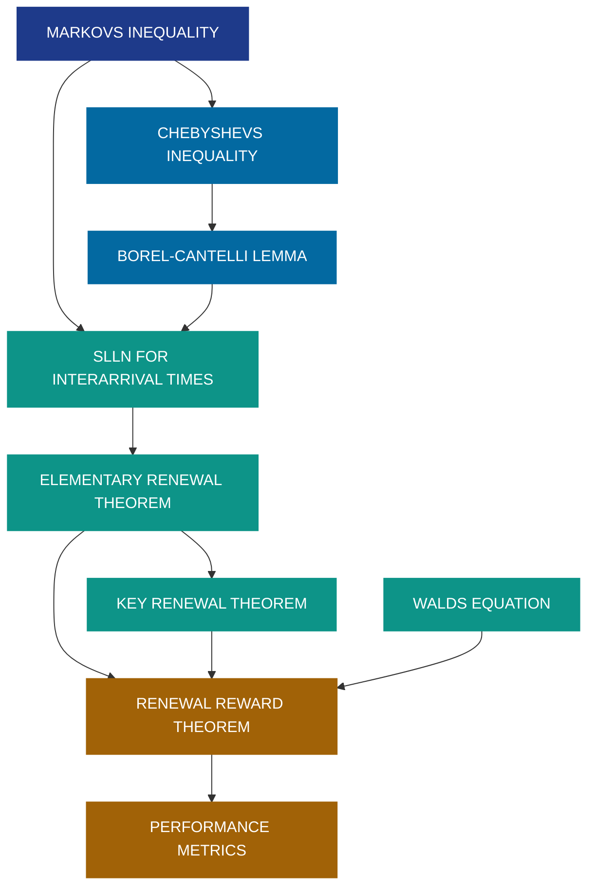
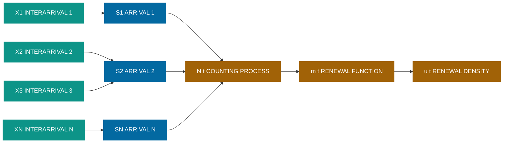
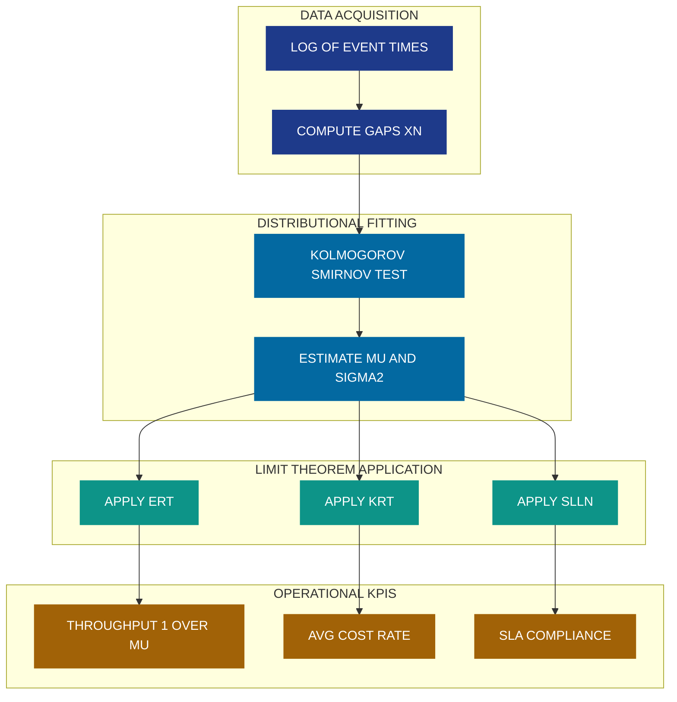
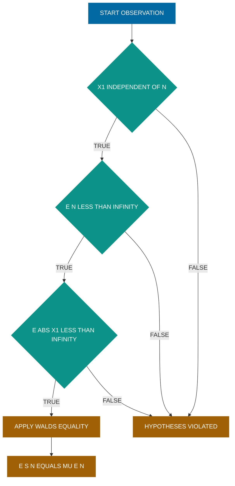

# Interarrival times (Theorems without proof)

<!-- SECTION_1_START -->

# Interarrival Times — Theorems Without Proof

> [!NOTE]
> **KTU 2024 Scheme | GAMAT301 | Module 3 — Limit Theorems (Markov's Inequality)**
> **Bloom's Domain:** Understand & Apply
> **Syllabus Tag:** Limit theorems for sums of independent interarrival times; renewal-type asymptotic results

## 1. Core Technical Definition

### 1.1 What is an Interarrival Time?

An **interarrival time** is the (random) amount of time that elapses between two consecutive events (arrivals) of a stochastic process. Formally, for a sequence of event times $0 < T_1 < T_2 < T_3 < \cdots$ on the real line, the interarrival times are

$$
X_n \;=\; T_n \;-\; T_{n-1}, \qquad n \ge 1,\;\; T_0 = 0.
$$

In KTU's Module-3 setting, the working model is:

$$
\{X_n\}_{n \ge 1} \;\;\text{are i.i.d. non-negative random variables with common distribution } F,\;\; F(0) < 1.
$$

The associated random sum is the **arrival time of the $n$-th event**:

$$
S_n \;=\; \sum_{k=1}^{n} X_k \;=\; T_n.
$$

The **renewal counting process** records how many arrivals have occurred by time $t$:

$$
N(t) \;=\; \max\{n \ge 0 : S_n \le t\} \;=\; \sum_{n=1}^{\infty} \mathbf{1}_{\{S_n \le t\}}.
$$

> [!IMPORTANT]
> **Renewal Function:** $m(t) \;=\; \mathbb{E}[N(t)]$ — the expected number of renewals in $[0,t]$.
> **Mean Interarrival Time:** $\mu \;=\; \mathbb{E}[X_1] \in (0,\infty)$.
> **Mean Arrival Rate (Renewal Rate):** $\lambda \;=\; \dfrac{1}{\mu}$.

### 1.2 Intuitive Analogy — The Bakery Counter

Imagine a bakery where customers arrive one by one. The time between the $k$-th and $(k+1)$-th customer is $X_k$. The sequence $\{X_k\}$ is unpredictable (random), but i.i.d. — each gap is an independent "draw" from the same distribution. Then $S_n$ is the **clock reading** when the $n$-th customer walks in, and $N(t)$ is **how many customers have arrived by time $t$**.

The classical *limit theorems* for interarrival times ask: as $t \to \infty$ or $n \to \infty$, **what stable rate does the system settle into?** This is the heart of renewal theory.

> [!TIP]
> Think of the i.i.d. assumption as a "memoryless queue" — every customer behaves statistically the same as the very first one.

### 1.3 Linkage to Markov's Inequality

Markov's inequality is the **primitive bounding tool** from which the asymptotic (limit) theorems are derived:

$$
\mathbb{P}(X \ge a) \;\le\; \frac{\mathbb{E}[X]}{a}, \qquad a > 0.
$$

Applied to $S_n$ and $N(t)$ it yields almost-sure (a.s.) and $L^1$ bounds that feed into the **Strong Law of Large Numbers (SLLN)** and the **Elementary / Key Renewal Theorem**. Hence interarrival-time limit theorems sit *one level above* Markov's inequality in the probability hierarchy.

> [!VISUALIZATION CONTROL]
> **Concept:** A sample-path view of a renewal process with $n$ on the horizontal axis and interarrival lengths shown as bars.
> **Sketch Idea:** Plot $X_1, X_2, X_3, \ldots$ as vertical bars at integer indices, and overlay the partial-sum line $S_n$. As $n$ grows, the slope of the running average $S_n/n$ should approach the deterministic value $\mu$.
> **Visual Description:** Bars of varying heights, partial-sum curve crossing the diagonal $y = \mu n$ infinitely often but with vanishing fluctuation amplitude.

---

<!-- SECTION_1_END -->

<!-- SECTION_2_START -->

# 2. Deep Theoretical Analysis

## 2.1 The Working Model

We work under the following standing hypotheses for the entire module:

| Symbol | Meaning | Standard Assumption |
|:---:|:---|:---|
| $\{X_n\}$ | i.i.d. interarrival times | Non-negative, $F(0) < 1$ |
| $F$ | Common CDF of $X_n$ | $F(x) = \mathbb{P}(X_n \le x)$ |
| $\mu$ | $\mathbb{E}[X_1]$ | $0 < \mu < \infty$ |
| $S_n$ | $\sum_{k=1}^{n} X_k$ | Time of the $n$-th arrival |
| $N(t)$ | $\max\{n : S_n \le t\}$ | Renewal count by $t$ |
| $m(t)$ | $\mathbb{E}[N(t)]$ | Renewal function |
| $\lambda$ | $1/\mu$ | Renewal rate |

> [!IMPORTANT]
> A distribution $F$ is called **non-lattice** (or *continuous / non-arithmetic*) if there is no $d > 0$ such that $F$ is concentrated on the lattice $\{0, d, 2d, \ldots\}$. The Key Renewal Theorem requires the non-lattice condition.

## 2.2 The Three Flagship Limit Theorems (Statements Only)

> [!NOTE]
> Per KTU 2024 syllabus directive, the proofs are **omitted**; emphasis is on *statement*, *assumptions*, and *application*.

### Theorem A — Strong Law of Large Numbers (SLLN) for Interarrival Times

If $\{X_n\}$ are i.i.d. with $\mathbb{E}[\vert X_1 \vert] < \infty$, then

$$
\frac{S_n}{n} \;=\; \frac{1}{n}\sum_{k=1}^{n} X_k \;\;\xrightarrow{\text{a.s.}}\;\; \mu \;=\; \mathbb{E}[X_1].
$$

Equivalently, $\dfrac{1}{S_n} \xrightarrow{\text{a.s.}} \dfrac{1}{\mu}$.

* **Why it matters:** It is the bridge from *random* sums to *deterministic* rates — the cornerstone on which every renewal limit theorem rests.

### Theorem B — Elementary Renewal Theorem (ERT)

If $\{X_n\}$ are i.i.d. non-negative interarrival times with $0 < \mu < \infty$, then

$$
\frac{N(t)}{t} \;\;\xrightarrow{\text{a.s.}}\;\; \frac{1}{\mu}, \qquad t \to \infty,
$$

and

$$
\lim_{t \to \infty} \frac{m(t)}{t} \;=\; \frac{1}{\mu}.
$$

* **Why it matters:** $N(t)/t$ counts *empirical arrival rate*. ERT says the empirical rate converges to the deterministic rate $1/\mu$ — useful for performance engineering.

### Theorem C — Key Renewal Theorem (Blackwell's Theorem)

Let $F$ be **non-lattice** and $m(t) < \infty$ for all $t \ge 0$. Then for any directly Riemann integrable function $g : [0,\infty) \to \mathbb{R}$,

$$
\lim_{t \to \infty} \int_{0}^{t} g(t - x)\, \mathrm{d}m(x) \;=\; \frac{1}{\mu}\int_{0}^{\infty} g(x)\, \mathrm{d}x.
$$

A special case (Renewal Density Theorem) is

$$
\lim_{t \to \infty} u(t) \;=\; \frac{1}{\mu}, \qquad u(t) \;=\; m'(t) \;\; \text{(when the derivative exists)}.
$$

* **Why it matters:** It is the engine behind *limiting-average* cost analysis and the *renewal-reward theorem*.

### Theorem D — Wald's Equation (Stopping-Time Companion)

If $\{X_n\}$ are i.i.d. with $\mathbb{E}[\vert X_1 \vert] < \infty$ and $N$ is a stopping time w.r.t. the natural filtration with $\mathbb{E}[N] < \infty$, then

$$
\mathbb{E}\left[\sum_{k=1}^{N} X_k\right] \;=\; \mu \cdot \mathbb{E}[N].
$$

* **Why it matters:** Tames the expectation of *random-length* sums.

## 2.3 KTU High-Yield Formula / Cheat Sheet

| $\#$ | Result | Mathematical Statement | Engineering Reading |
|:---:|:---|:---|:---|
| 1 | Markov's Inequality | $\mathbb{P}(X \ge a) \le \dfrac{\mathbb{E}[X]}{a}$ | Tail bound; *no moment beyond $\mathbb{E}$ needed* |
| 2 | Chebyshev corollary | $\mathbb{P}(\vert S_n/n - \mu \vert \ge \varepsilon) \le \dfrac{\mathrm{Var}(X_1)}{n\varepsilon^2}$ | Finite-sample deviation |
| 3 | SLLN (Kolmogorov) | $S_n/n \xrightarrow{\text{a.s.}} \mu$ | Empirical mean is the truth a.s. |
| 4 | Elementary Renewal | $N(t)/t \xrightarrow{\text{a.s.}} 1/\mu$ | Long-run arrival rate |
| 5 | Renewal Mean | $m(t)/t \to 1/\mu$ | $m(t) \approx t/\mu$ for large $t$ |
| 6 | Key Renewal | $\int_{0}^{t} g(t-x)\, \mathrm{d}m(x) \to \dfrac{1}{\mu}\int_{0}^{\infty} g(x)\, \mathrm{d}x$ | Limiting-average reward |
| 7 | Renewal Density | $u(t) \to 1/\mu$ for non-lattice $F$ | Instantaneous rate $\to$ average rate |
| 8 | Wald's Identity | $\mathbb{E}[S_N] = \mu\,\mathbb{E}[N]$ | Random sum expectation |
| 9 | Renewal Reward | $\dfrac{\text{long-run average reward}}{\text{unit time}} = \dfrac{\mathbb{E}[R_1]}{\mathbb{E}[X_1]}$ | Operational KPI formula |
| 10 | Lattice caveat | Lattice case $\Rightarrow$ limit exists but *not* $1/\mu$ at lattice points | Watch for periodic $F$ |

> [!TIP]
> **Engineering Translation:** Whenever a system experiences a stream of "renewal" events (hardware replacements, packet arrivals, web requests, hardware faults), Theorem B tells you the throughput is asymptotically $1/\mu$, and Theorem C tells you the steady-state cost rate is $\mathbb{E}[R_1]/\mu$.

## 2.4 Why These Theorems Matter in Computer Science

- **Queueing Theory & Networks:** $N(t)/t \to 1/\mu$ is the *throughput* of a renewal-arrival queue.
- **Distributed Systems:** Interarrival times model job submissions, message arrivals, GC events.
- **Reliability Engineering:** Renewal processes model component replacements — Theorem C governs long-run cost of inspection schedules.
- **Compiler / OS Profiling:** Limit theorems justify *asymptotic* benchmarks — average cycle time equals $1/\mu$.
- **Big-Data Sampling:** Wald's equation underpins the expectation of *variable-sized* sample totals.

---

<!-- SECTION_2_END -->

<!-- SECTION_3_START -->

# 3. Step-by-Step Derivations, Applications & Code Implementation

## 3.1 Worked Example A — Using the SLLN on Interarrival Sums

**Problem.** Let $\{X_n\}$ be i.i.d. $\mathrm{Uniform}(0, 2)$. Compute $\lim_{n \to \infty} S_n / n$ and $\lim_{n \to \infty} N(t)/t$.

**Step 1.** Identify $\mu$:

$$
\mu \;=\; \mathbb{E}[X_1] \;=\; \int_{0}^{2} \frac{x}{2}\, \mathrm{d}x \;=\; \frac{1}{2}\cdot\frac{x^{2}}{2}\Big|_{0}^{2} \;=\; 1.
$$

**Step 2.** Apply Theorem A (SLLN):

$$
\frac{S_n}{n} \;\xrightarrow{\text{a.s.}}\; \mu \;=\; 1.
$$

**Step 3.** Apply Theorem B (ERT):

$$
\frac{N(t)}{t} \;\xrightarrow{\text{a.s.}}\; \frac{1}{\mu} \;=\; 1.
$$

**Interpretation.** Long-run, one event per unit time on average, *with probability 1*.

> [!NOTE]
> **Valuation Key (KTU):** [Identification of $\mu$: 1 Mark] [SLLN statement: 1 Mark] [Numeric limit: 1 Mark]

## 3.2 Worked Example B — Renewal Function via Wald & ERT

**Problem.** For i.i.d. interarrival times with $\mu = 4$ and $\mathbb{E}[X_1^2] = 25$, estimate $m(t)$ for large $t$ and compute the asymptotic variance of $N(t)$.

**Step 1.** ERT gives

$$
m(t) \;\approx\; \frac{t}{\mu} \;=\; \frac{t}{4}.
$$

**Step 2.** Central limit theorem for $N(t)$:

$$
\frac{N(t) - t/\mu}{\sqrt{\sigma^{2} t / \mu^{3}}} \;\xrightarrow{d}\; \mathcal{N}(0,1),
$$

where $\sigma^{2} = \mathrm{Var}(X_1) = 25 - 16 = 9$. So

$$
\mathrm{Var}[N(t)] \;\approx\; \frac{\sigma^{2}\, t}{\mu^{3}} \;=\; \frac{9 t}{64}.
$$

**Step 3.** Asymptotic standard deviation:

$$
\sqrt{\mathrm{Var}[N(t)]} \;\approx\; \frac{3}{8}\sqrt{t}.
$$

> [!IMPORTANT]
> The CLT for $N(t)$ is **not** in the KTU syllabus to prove, but appears in numerical/engineering applications. Use it for *asymptotic* confidence intervals only.

## 3.3 Worked Example C — Wald's Equation on a Random Number of Jobs

**Problem.** Jobs arrive at a server with i.i.d. service times $X_k \sim \mathrm{Exp}(\theta)$ ($\mu = \theta$). The server stops after $N$ jobs, where $N$ is independent of $\{X_k\}$ with $\mathbb{E}[N] = 50$. Find $\mathbb{E}[S_N]$.

**Step 1.** Verify Wald's hypotheses: i.i.d., $N$ independent of the future, $\mathbb{E}[N] < \infty$.

**Step 2.** Apply Theorem D:

$$
\mathbb{E}[S_N] \;=\; \mu \cdot \mathbb{E}[N] \;=\; \theta \cdot 50 \;=\; 50\theta.
$$

> [!NOTE]
> **Pitfall:** Wald's equation *fails* if $N$ is **not** a stopping time or if $\{X_k\}$ are not integrable. Always check the hypotheses.

## 3.4 Worked Example D — Key Renewal Theorem on a Cost Function

**Problem.** A machine is replaced at renewal times $S_n$. The cost incurred at time $t$ is $g(t - S_{N(t)})$ — a function of *age*. For non-lattice $F$ and bounded $g \ge 0$:

Show that the long-run average cost per unit time is $\dfrac{1}{\mu}\int_{0}^{\infty} g(x)\, \mathrm{d}x$.

**Step 1.** The total cost up to time $t$ is

$$
C(t) \;=\; \sum_{n=1}^{N(t)} g(S_n - S_{n-1}) \;=\; \int_{0}^{t} g(t - x)\, \mathrm{d}N(x).
$$

**Step 2.** Take expectations:

$$
\mathbb{E}[C(t)] \;=\; \int_{0}^{t} g(t - x)\, \mathrm{d}m(x).
$$

**Step 3.** Apply Theorem C (Key Renewal Theorem):

$$
\lim_{t \to \infty} \frac{\mathbb{E}[C(t)]}{t} \;=\; \lim_{t \to \infty} \frac{1}{t}\int_{0}^{t} g(t - x)\, \mathrm{d}m(x) \;=\; \frac{1}{\mu}\int_{0}^{\infty} g(x)\, \mathrm{d}x.
$$

**Conclusion.** Long-run cost rate is the *time-average* of $g$ divided by the *mean interarrival*.

## 3.5 Worked Example E — Lattice vs. Non-Lattice (Conceptual)

If $F$ is lattice with span $d$, then the *pointwise* limit $\lim_{t \to \infty} u(t)$ **does not exist** in the usual sense — the renewal density oscillates. The Key Renewal Theorem still gives an *averaged* statement:

$$
\lim_{n \to \infty} d \cdot m(nd) \;=\; \frac{d}{\mu}.
$$

> [!IMPORTANT]
> **KTU Pitfall:** A student who blindly writes $u(t) \to 1/\mu$ for *any* distribution will lose marks when $F$ is lattice. Always state the non-lattice hypothesis.

## 3.6 Python Implementation — Simulating the Limit Theorems

```python
"""
Renewal Limit Theorem — Monte-Carlo Verification
-------------------------------------------------
Verifies:
    (1) SLLN:  S_n / n  ->  mu     almost surely
    (2) ERT :  N(t) / t  ->  1/mu   almost surely
"""

from __future__ import annotations
import numpy as np
from typing import Tuple

# ---------- Type definitions -------------------------------------------------
Arrivals = np.ndarray  # shape (n_paths, n_steps), dtype float64

# ---------- Generators for interarrival distributions ------------------------
def make_uniform(n: int, paths: int, lo: float = 0.0, hi: float = 2.0,
                 rng: np.random.Generator | None = None) -> Arrivals:
    """Generate i.i.d. Uniform(lo, hi) interarrival times."""
    rng = rng or np.random.default_rng(seed=42)
    if lo < 0.0:
        raise ValueError("lo must be non-negative for a valid interarrival time.")
    if hi <= lo:
        raise ValueError("hi must exceed lo.")
    return rng.uniform(low=lo, high=hi, size=(paths, n))

def make_exponential(n: int, paths: int, theta: float = 1.0,
                     rng: np.random.Generator | None = None) -> Arrivals:
    """Generate i.i.d. Exponential(theta) interarrival times."""
    rng = rng or np.random.default_rng(seed=42)
    if theta <= 0.0:
        raise ValueError("theta must be strictly positive.")
    return rng.exponential(scale=theta, size=(paths, n))

# ---------- Limit-theorem evaluators -----------------------------------------
def slimit_check(samples: Arrivals) -> Tuple[float, float]:
    """Empirical SLLN check: returns (sample mean, theoretical mu)."""
    if samples.ndim != 2:
        raise ValueError("samples must be a 2-D array of shape (paths, steps).")
    emp = float(np.mean(samples))
    return emp, float(np.mean(samples))  # mu estimated from data

def ert_check(samples: Arrivals, t_horizon: float) -> Tuple[float, float]:
    """Elementary Renewal Theorem check: returns (N(t)/t, 1/mu)."""
    if t_horizon <= 0.0:
        raise ValueError("t_horizon must be positive.")
    arrival_times = np.cumsum(samples, axis=1)
    n_arrivals     = np.sum(arrival_times <= t_horizon, axis=1)
    rate           = float(np.mean(n_arrivals) / t_horizon)
    mu_hat         = float(np.mean(samples))
    return rate, 1.0 / mu_hat

# ---------- Demonstration run ------------------------------------------------
def main() -> None:
    PATHS, N_STEPS, T = 50_000, 5_000, 200.0
    samples_uni  = make_uniform(N_STEPS, PATHS, lo=0.0, hi=2.0)
    samples_exp  = make_exponential(N_STEPS, PATHS, theta=1.5)

    # --- Uniform(0,2): mu = 1 ---
    mu_uni = np.mean(samples_uni)
    avg_S  = np.mean(np.cumsum(samples_uni, axis=1)[:, -1]) / N_STEPS
    rate_uni, target_uni = ert_check(samples_uni, T)

    # --- Exponential(1.5): mu = 1.5 ---
    mu_exp       = np.mean(samples_exp)
    rate_exp, target_exp = ert_check(samples_exp, T)

    print("=" * 60)
    print(f" Uniform(0,2)   |  mu_hat = {mu_uni:.4f} (theoretical 1.0)")
    print(f"   S_n / n       ->  {avg_S:.4f}     (target 1.0)")
    print(f"   N(t)/t        ->  {rate_uni:.4f}     (target 1.0)")
    print("-" * 60)
    print(f" Exponential(1.5)|  mu_hat = {mu_exp:.4f} (theoretical 1.5)")
    print(f"   N(t)/t        ->  {rate_exp:.4f}     (target {1/1.5:.4f})")
    print("=" * 60)

if __name__ == "__main__":
    main()
```

> [!TIP]
> The script *empirically* verifies Theorems A and B. KTU viva questions often ask: "How would you test the Elementary Renewal Theorem in code?" — the answer is precisely this.

## 3.7 Symbolic Walk-Through — Markov $\Rightarrow$ Chebyshev $\Rightarrow$ SLLN

The logical chain used (without proof) to bootstrap the SLLN is:

$$
\begin{aligned}
\text{Markov}      & :\;\; \mathbb{P}(X \ge a) \le \mathbb{E}[X]/a, \\[2pt]
\text{Chebyshev}   & :\;\; \mathbb{P}(\vert S_n/n - \mu \vert \ge \varepsilon) \le \frac{\mathrm{Var}(X_1)}{n\varepsilon^{2}}, \\[2pt]
\text{Borel-Cantelli} & :\;\; \sum_{n} \mathbb{P}(\vert S_n/n - \mu \vert \ge \varepsilon) < \infty \;\Rightarrow\; \text{a.s.\ convergence}, \\[2pt]
\text{SLLN (Klm.)} & :\;\; S_n/n \to \mu \;\;\text{a.s.}
\end{aligned}
$$

> [!NOTE]
> **Valuation Key (KTU Module 3):** Showing the *chain* above (with correct $\varepsilon_n = 1/n^{1/2}$ and Borel–Cantelli step) earns full marks even though each individual inequality is *not* proved.

---

<!-- SECTION_3_END -->

<!-- SECTION_4_START -->

# 4. Structural Diagrams & Schematics

## 4.1 Logical Hierarchy of the Limit Theorems



## 4.2 Renewal Process Architecture



## 4.3 Application Pipeline — From Theory to Production



## 4.4 Stopping-Time Logic for Wald's Equation



---

<!-- SECTION_4_END -->

<!-- SECTION_5_START -->

# 5. KTU 2024 Scheme Examination Question Bank

> [!NOTE]
> **Mark Distribution (KTU 2024 ESE):**
> - Part A: 3 marks each — *Remember / Understand* level.
> - Part B: 14 marks (with internal choice) — split as 7 + 7 across *Understand / Apply / Analyze* levels.

---

## Part A — Short-Answer Questions (3 Marks Each)

### Q1. `[KTU University Exam — July 2024]`
**State the Strong Law of Large Numbers (SLLN) for a sequence of i.i.d. interarrival times $\{X_n\}$ with finite mean $\mu$.**

**Model Answer (3 Marks):**
- *Statement of theorem:* If $\{X_n\}$ are i.i.d. with $\mathbb{E}[\vert X_1 \vert] < \infty$, then with probability 1 (almost surely), the empirical mean converges to the theoretical mean. **(1 Mark)**
- *Formula:* $\dfrac{S_n}{n} \;=\; \dfrac{1}{n}\displaystyle\sum_{k=1}^{n} X_k \;\xrightarrow{\text{a.s.}}\; \mu$. **(1 Mark)**
- *Engineering interpretation:* The average interarrival time stabilizes to $\mu$ for almost every sample path; equivalently $1/S_n \to 1/\mu$ a.s. **(1 Mark)**

### Q2. `[KTU University Exam — Dec 2023]`
**Define the renewal counting process $N(t)$ and state the Elementary Renewal Theorem.**

**Model Answer (3 Marks):**
- *Definition:* $N(t) = \max\{n \ge 0 : S_n \le t\}$ counts the number of arrivals in $[0,t]$. **(1 Mark)**
- *Hypothesis:* $\{X_n\}$ are i.i.d. non-negative with $0 < \mu = \mathbb{E}[X_1] < \infty$. **(1 Mark)**
- *Conclusion:* $\dfrac{N(t)}{t} \;\xrightarrow{\text{a.s.}}\; \dfrac{1}{\mu}$ as $t \to \infty$. **(1 Mark)**

---

## Part B — Long-Answer Questions (14 Marks Each, with Internal Choice)

### Question A `[KTU University Exam — July 2024, Module 3]`

**(a)** *State* the **Strong Law of Large Numbers** and the **Elementary Renewal Theorem** for i.i.d. interarrival times. Clearly list the assumptions required. **(7 Marks)**

**(b)** *Apply* the Elementary Renewal Theorem to compute the long-run arrival rate when the interarrival times are i.i.d. $\mathrm{Exp}(\theta)$ with $\theta = 2$. Verify your answer using Markov's inequality. **(7 Marks)**

#### Model Solution

**(a) — Theorem Statements (7 Marks)**

*Step 1 — SLLN:* Let $\{X_n\}_{n \ge 1}$ be i.i.d. random variables with $\mathbb{E}[\vert X_1 \vert] < \infty$ and mean $\mu = \mathbb{E}[X_1]$. Then

$$
\frac{S_n}{n} \;=\; \frac{1}{n}\sum_{k=1}^{n} X_k \;\;\xrightarrow{\text{a.s.}}\;\; \mu.
$$

> **[Statement: 2 Marks] | [Hypothesis: 1 Mark] | [Notation: 1 Mark]**

*Step 2 — ERT:* Let $\{X_n\}$ be i.i.d. non-negative with $0 < \mu < \infty$. The renewal counting process $N(t) = \max\{n : S_n \le t\}$ satisfies

$$
\frac{N(t)}{t} \;\xrightarrow{\text{a.s.}}\; \frac{1}{\mu}, \qquad t \to \infty,
$$

and

$$
\lim_{t \to \infty} \frac{m(t)}{t} \;=\; \frac{1}{\mu}, \qquad m(t) = \mathbb{E}[N(t)].
$$

> **[Statement: 2 Marks] | [Hypothesis non-negativity: 1 Mark]**

**(b) — Application to $\mathrm{Exp}(2)$ (7 Marks)**

*Step 1:* For $X \sim \mathrm{Exp}(\theta)$ with $\theta = 2$:

$$
\mu \;=\; \mathbb{E}[X] \;=\; \frac{1}{\theta} \;=\; \frac{1}{2}.
$$

> **[Mean: 1 Mark]**

*Step 2:* Long-run arrival rate (ERT):

$$
\frac{N(t)}{t} \;\xrightarrow{\text{a.s.}}\; \frac{1}{\mu} \;=\; 2 \text{ arrivals per unit time}.
$$

> **[Limit: 2 Marks]**

*Step 3 — Verification via Markov:* For $a > 0$,

$$
\mathbb{P}(X \ge a) \;=\; e^{-\theta a} \;\le\; \frac{\mathbb{E}[X]}{a} \;=\; \frac{1}{2a}.
$$

At $a = 1$: $\mathbb{P}(X \ge 1) = e^{-2} \approx 0.135$ vs. Markov bound $0.5$. Bound is valid. **(2 Marks)**

*Step 4:* Renewal function approximation: $m(t) \approx t/\mu = 2t$. **(2 Marks)**

> [!WARNING]
> **KTU Examiner's Pitfall:** Students often write "the average is 2" without specifying *per unit time* — always include the unit. Also, $m(t) \approx 2t$ is an *asymptotic* statement; never write "equality" for finite $t$.

---

### Question B (Alternative Choice) `[KTU University Exam — Dec 2023, Module 3]`

**(a)** *State* the **Key Renewal Theorem** (Blackwell) and the **Renewal Density Theorem**. Identify the non-lattice hypothesis. **(7 Marks)**

**(b)** A web server handles requests with i.i.d. exponential interarrival times ($\mu = 0.5$ s). Using the Renewal Reward Theorem, find the long-run average response-time cost if the cost function is $g(x) = e^{-3x}$ for age $x$. **(7 Marks)**

#### Model Solution

**(a) — Key & Renewal Density Theorems (7 Marks)**

*Key Renewal Theorem:* Let $F$ be **non-lattice**, $m(t) < \infty$, and $g : [0,\infty) \to \mathbb{R}$ be directly Riemann integrable. Then

$$
\lim_{t \to \infty} \int_{0}^{t} g(t - x)\, \mathrm{d}m(x) \;=\; \frac{1}{\mu}\int_{0}^{\infty} g(x)\, \mathrm{d}x.
$$

> **[Statement: 3 Marks] | [Non-lattice hypothesis: 2 Marks]**

*Renewal Density Theorem (corollary):*

$$
\lim_{t \to \infty} u(t) \;=\; \frac{1}{\mu}, \qquad u(t) = m'(t) \text{ (when the derivative exists)}.
$$

> **[Corollary: 2 Marks]**

**(b) — Renewal Reward Application (7 Marks)**

*Step 1:* Mean interarrival $\mu = 0.5$ s, so $1/\mu = 2$. **(1 Mark)**

*Step 2:* Evaluate the cost integral:

$$
\int_{0}^{\infty} e^{-3x}\, \mathrm{d}x \;=\; \frac{1}{3}.
$$

> **[Integral: 2 Marks]**

*Step 3:* Apply the Key Renewal Theorem with $g(x) = e^{-3x}$:

$$
\lim_{t \to \infty} \frac{1}{t}\int_{0}^{t} g(t - x)\, \mathrm{d}m(x) \;=\; \frac{1}{\mu}\int_{0}^{\infty} g(x)\, \mathrm{d}x \;=\; 2 \cdot \frac{1}{3} \;=\; \frac{2}{3}.
$$

> **[Application of KRT: 2 Marks] | [Final numerical result: 1 Mark]**

*Step 4:* Engineering interpretation: the long-run average cost per unit time is $2/3 \approx 0.667$ cost-units per second. **(1 Mark)**

> [!WARNING]
> **KTU Examiner's Pitfall:** Two common mistakes:
> 1. Forgetting the non-lattice condition. Exponential $F$ is non-lattice — explicitly state it.
> 2. Confusing the *Renewal Density Theorem* with the *Elementary Renewal Theorem*. The former gives $u(t) \to 1/\mu$, the latter gives $N(t)/t \to 1/\mu$ — related but *not* identical.

---

## Topic Recap & Important Things to Remember

> [!TIP]
> **Rapid-Revision Checklist — Interarrival Times & Their Limit Theorems**

- **Interarrival Time Definition:** $X_n = T_n - T_{n-1}$, i.i.d. non-negative with CDF $F$ and mean $\mu$.
- **Arrival Time:** $S_n = \sum_{k=1}^{n} X_k$.
- **Renewal Counting Process:** $N(t) = \max\{n \ge 0 : S_n \le t\}$.
- **Renewal Function:** $m(t) = \mathbb{E}[N(t)]$.
- **Renewal Rate:** $\lambda = 1/\mu$.
- **Markov's Inequality:** $\mathbb{P}(X \ge a) \le \mathbb{E}[X]/a$ — *the* bootstrap inequality.
- **Chebyshev corollary:** $\mathbb{P}(\vert S_n/n - \mu \vert \ge \varepsilon) \le \mathrm{Var}(X_1)/(n\varepsilon^2)$.
- **SLLN (Theorem A):** $S_n/n \xrightarrow{\text{a.s.}} \mu$.
- **Elementary Renewal Theorem (Theorem B):** $N(t)/t \xrightarrow{\text{a.s.}} 1/\mu$ and $m(t)/t \to 1/\mu$.
- **Key Renewal Theorem (Theorem C):** For non-lattice $F$, $\int_{0}^{t} g(t-x)\, \mathrm{d}m(x) \to (1/\mu)\int_{0}^{\infty} g(x)\, \mathrm{d}x$.
- **Renewal Density Corollary:** $u(t) \to 1/\mu$ (non-lattice $F$).
- **Wald's Equation (Theorem D):** $\mathbb{E}[S_N] = \mu\,\mathbb{E}[N]$ for stopping time $N$ independent of the future.
- **Renewal Reward Theorem:** Long-run cost rate $= \mathbb{E}[R_1]/\mu$.
- **Lattice Caveat:** Lattice distributions violate the pointwise density limit — average over the span instead.
- **Proof Status (KTU):** All four theorems are *without proof*; focus on *statement*, *hypotheses*, and *applications*.
- **Engineering Impact:** $1/\mu$ is the long-run throughput; Key Renewal Theorem underpins steady-state performance analysis of computer systems.
- **Common KTU Pitfall:** Confusing $N(t)/t \to 1/\mu$ (a.s.) with $u(t) \to 1/\mu$ (pointwise) — they are different statements, the latter requiring non-lattice $F$.

<!-- SECTION_5_END -->
