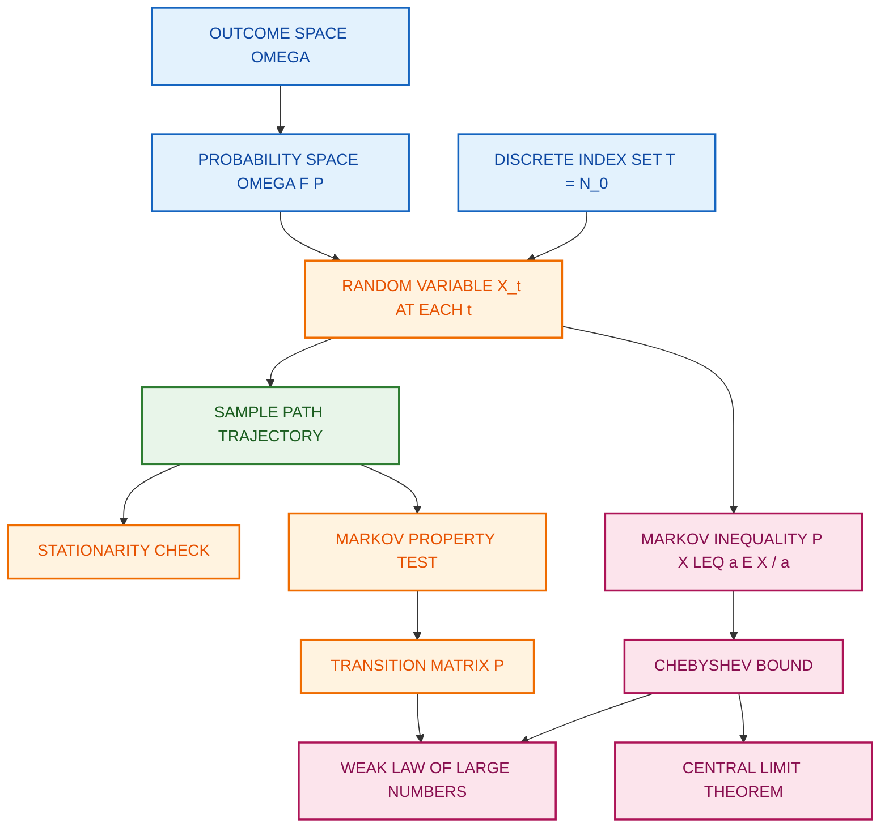
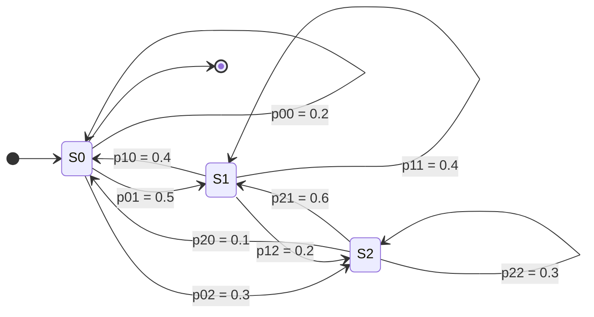
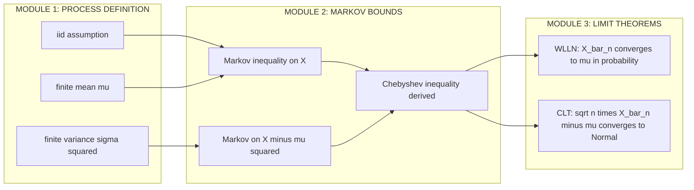

# Stochastic Processes: Discrete-time process

<!-- SECTION_1_START -->

# Stochastic Processes: Discrete-Time Process

## 1.1 Formal Academic Definition (KTU 2024 Syllabus Terminology)

> [!IMPORTANT]
> **Core Definition (KTU Board Standard):**
> A **discrete-time stochastic process** is a mathematical object defined as a family of random variables $\{X_t : t \in T\}$ indexed by a **countable (discrete) index set** $T$, most commonly $T = \mathbb{N}_0 = \{0, 1, 2, 3, \ldots\}$ or $T = \mathbb{Z} = \{\ldots, -2, -1, 0, 1, 2, \ldots\}$, where each random variable $X_t$ maps outcomes from a probability space $(\Omega, \mathcal{F}, P)$ into a **state space** $S$.

The triplet $\{\Omega, \mathcal{F}, P\}$ is the underlying probability space, $T$ is the discrete time axis, and $S$ is the codomain of $X_t$.

For any fixed outcome $\omega \in \Omega$, the mapping $t \mapsto X_t(\omega)$ produces a deterministic sequence of real numbers called a **sample path** (or **realization** or **trajectory**) of the process.

The process is completely characterized by its **finite-dimensional distributions**:
$$P(X_{t_1} \in A_1, X_{t_2} \in A_2, \ldots, X_{t_k} \in A_k), \quad \forall \, t_1 < t_2 < \ldots < t_k, \quad \forall \, A_i \subseteq S.$$

By the **Kolmogorov Extension Theorem**, if these distributions are consistent (marginalization property holds), a unique probability measure on the path space $S^T$ exists.

> [!NOTE]
> **KTU High-Yield Distinction:** When $T$ is continuous (e.g., $T = [0, \infty)$), the process is called a **continuous-time stochastic process**. When $S$ is countable, the process has a **discrete state space**. The four combinations (discrete/continuous time $\times$ discrete/continuous state) form the foundation of stochastic modelling.

---

## 1.2 Conceptual Analogy & Geometric Intuition

> [!TIP]
> **Intuition Box — The "Dice Roll Tape Recording" Analogy:**
> Imagine you stand at time $t=0$ and start a video camera that records the outcome of a (possibly biased) die every second. Each frame of this video is one random variable $X_t$. The full video is your discrete-time stochastic process. If you rewind and re-roll the entire tape under identical physical conditions, you get a **different** sample path. The collection of all possible tapes (one for every possible $\omega \in \Omega$) is the process itself.

**Geometric Picture:**
- Horizontal axis: discrete time $t \in \{0, 1, 2, \ldots\}$
- Vertical axis: realized value $X_t(\omega) \in \mathbb{R}$
- Each "thread" weaving across the lattice is a single sample path.
- The **ensemble** of all possible threads forms the process.

For a 2-state coin-toss process, the picture is just a jagged staircase flipping between $+1$ (Heads) and $-1$ (Tails) at each integer tick.

---

## 1.3 Standard Metrics, Constants & Elementary Examples

The following constants and parameters are **board-favorite values** and must be memorized verbatim.

| Symbol | Meaning | Standard Value / Domain |
|:------:|:--------|:-----------------------:|
| $\mathbb{N}_0$ | Discrete index set | $\{0, 1, 2, \ldots\}$ |
| $S$ | State space | $\mathbb{Z}, \mathbb{R}, \{0, 1\}$, etc. |
| $p$ | Success probability (Bernoulli) | $0 \leq p \leq 1$ |
| $\mu = E[X_t]$ | Mean of marginal distribution | depends on process |
| $\sigma^2 = \text{Var}(X_t)$ | Variance of marginal distribution | $\sigma^2 \geq 0$ |

> [!IMPORTANT]
> **Five Prototype Discrete-Time Processes (Mandatory Knowledge):**
> 1. **Bernoulli Process:** Independent trials, $S = \{0, 1\}$, $P(X_t = 1) = p$.
> 2. **Binomial Counting Process:** $S_n = X_1 + X_2 + \ldots + X_n$ where $X_i$ are iid Bernoulli$(p)$.
> 3. **Simple Symmetric Random Walk:** $S_0 = 0$, $S_n = S_{n-1} + Y_n$, $Y_n = \pm 1$ with prob. $\tfrac{1}{2}$ each.
> 4. **Discrete-Time Markov Chain (DTMC):** Memoryless transitions governed by matrix $P$.
> 5. **Poisson Process (Discrete Approximation):** $X_{n+1} - X_n \sim \text{Poisson}(\lambda)$.

---

> [!VISUALIZATION CONTROL]
> **Concept:** Sample paths of a simple symmetric random walk on the integer lattice.
> **GeoGebra / Desmos Input Equations (sample path 1):**
> * `P0 = (0, 0)`, `P1 = (1, 1)`, `P2 = (2, 0)`, `P3 = (3, 1)`, `P4 = (4, 0)`, `P5 = (5, 1)`
> **Visual Description:** Plot these points and connect them with line segments. The student should observe a jagged staircase trajectory that starts at the origin and moves up or down by exactly one unit at every integer time step — this is one realization of a discrete-time stochastic process.

<!-- SECTION_1_END -->

<!-- SECTION_2_START -->

# Deep Theoretical Analysis & KTU High-Yield Formula Sheet

## 2.1 Decomposition of the Process into Three Layers

A discrete-time stochastic process has a clean three-tier hierarchical structure that examiners frequently test:

**Layer 1 — The Underlying Probability Space $(\Omega, \mathcal{F}, P)$:**
This is the source of randomness. Every outcome $\omega$ is an elementary event.

**Layer 2 — The Random Variable Mapping $X_t : \Omega \to S$:**
For each frozen time $t$, $X_t$ is an ordinary random variable with its own distribution, mean, and variance.

**Layer 3 — The Index Set $T$ and Joint Law:**
As $t$ varies over $T$, the $X_t$'s are *not* independent in general; they are tied together by a joint distribution. Independence is a **special property**, not the default.

> [!NOTE]
> **Critical Board Concept — Stationarity:**
> A discrete-time process is **strictly stationary** if for every $k \geq 1$, every shift $h \in \mathbb{Z}$, and every Borel set $A_1, \ldots, A_k$:
> $$P(X_{t_1+h} \in A_1, \ldots, X_{t_k+h} \in A_k) = P(X_{t_1} \in A_1, \ldots, X_{t_k} \in A_k).$$
> Translation: **shifting the time index does not change the joint distribution**. This is the property required to make Law of Large Numbers statements meaningful.

## 2.2 The Markov Property — Memoryless Discrete-Time Processes

> [!IMPORTANT]
> **Definition (Markov Property for Discrete-Time Processes):**
> A discrete-time stochastic process $\{X_n\}_{n \geq 0}$ is a **Markov chain** if for every $n \geq 0$ and every sequence of states $i_0, i_1, \ldots, i_{n+1} \in S$:
> $$P(X_{n+1} = j \mid X_n = i, X_{n-1} = i_{n-1}, \ldots, X_0 = i_0) = P(X_{n+1} = j \mid X_n = i).$$
> The future depends on the past **only through the present state**.

The single-step **transition probability** is denoted:
$$p_{ij}^{(n)} = P(X_{n+1} = j \mid X_n = i).$$
For a **time-homogeneous** Markov chain, $p_{ij}^{(n)} = p_{ij}$ is independent of $n$, and the entire dynamics are encoded in the **stochastic transition matrix**:
$$P = \begin{pmatrix} p_{00} & p_{01} & \cdots \\ p_{10} & p_{11} & \cdots \\ \vdots & \vdots & \ddots \end{pmatrix}, \quad \sum_{j} p_{ij} = 1 \;\; \forall i, \quad p_{ij} \geq 0.$$

The **Chapman–Kolmogorov equation** propagates the matrix powers:
$$P(X_{n+m} = j \mid X_0 = i) = \bigl(P^m\bigr)_{ij}.$$

## 2.3 Limit Theorems — The Asymptotic Behavior of Discrete-Time Processes

This subsection is **the heart of Module 3** and the reason discrete-time processes are studied in this course.

### 2.3.1 Markov's Inequality (Foundational Bound)

> [!IMPORTANT]
> **Markov's Inequality:** Let $X$ be a non-negative random variable with finite mean $E[X] < \infty$. Then for every $a > 0$:
> $$P(X \geq a) \leq \frac{E[X]}{a}.$$
> **Why it matters:** This single inequality is the **seed** from which Chebyshev's, the Weak Law of Large Numbers, and the Central Limit Theorem all germinate. It bounds the tail probability using only the mean — no variance, no distribution shape required.

### 2.3.2 Chebyshev's Inequality (Variance-Weighted Bound)

Apply Markov's inequality to the non-negative r.v. $(X - \mu)^2$ at level $a = k^2$:
$$P\bigl((X - \mu)^2 \geq k^2\bigr) \leq \frac{E[(X - \mu)^2]}{k^2} = \frac{\text{Var}(X)}{k^2},$$
which simplifies to the celebrated form:
$$P(\vert X - \mu \vert \geq k) \leq \frac{\sigma^2}{k^2}, \quad k > 0.$$

### 2.3.3 Weak Law of Large Numbers (WLLN)

Let $X_1, X_2, \ldots, X_n$ be **i.i.d.** (independent, identically distributed) random variables from a discrete-time iid process, with $E[X_i] = \mu$ and $\text{Var}(X_i) = \sigma^2 < \infty$. Define the sample mean:
$$\bar{X}_n = \frac{1}{n}\sum_{i=1}^{n} X_i.$$
Then for every $\varepsilon > 0$:
$$\lim_{n \to \infty} P\bigl(\vert \bar{X}_n - \mu \vert \geq \varepsilon\bigr) = 0.$$
We write $\bar{X}_n \xrightarrow{P} \mu$ (convergence in probability). The proof uses Chebyshev's inequality, which uses Markov's inequality.

### 2.3.4 Central Limit Theorem (CLT)

Under the same iid setup with $0 < \sigma^2 < \infty$:
$$\sqrt{n}\,(\bar{X}_n - \mu) \xrightarrow{d} \mathcal{N}(0, \sigma^2), \quad \text{as } n \to \infty.$$
The distribution of the sample mean becomes approximately normal regardless of the parent distribution's shape — a profound result for statistical inference.

---

## 2.4 KTU Formula Sheet / Cheat Sheet

> [!TIP]
> **Print this table. It is the single most important revision artifact for Module 3.**

| \# | Formula / Statement | Domain / Conditions | Primary Use |
|:-:|:--------------------|:--------------------|:------------|
| 1 | $P(X \geq a) \leq \frac{E[X]}{a}$ (Markov) | $X \geq 0$, $a > 0$ | Tail bound from mean alone |
| 2 | $P(\vert X - \mu \vert \geq k) \leq \frac{\sigma^2}{k^2}$ (Chebyshev) | $\sigma^2 < \infty$, $k > 0$ | Tail bound from mean & variance |
| 3 | $\bar{X}_n = \frac{1}{n}\sum_{i=1}^{n} X_i \xrightarrow{P} \mu$ (WLLN) | iid, $E[X_i^2] < \infty$ | Long-run average converges |
| 4 | $\sqrt{n}(\bar{X}_n - \mu) \xrightarrow{d} N(0, \sigma^2)$ (CLT) | iid, $\sigma^2 < \infty$ | Asymptotic normality of mean |
| 5 | $E[\bar{X}_n] = \mu$, $\text{Var}(\bar{X}_n) = \frac{\sigma^2}{n}$ | iid assumption | Mean & variance of estimator |
| 6 | $P(X_{n+1} = j \mid X_n = i, \text{past}) = P(X_{n+1} = j \mid X_n = i)$ | Discrete-time Markov chain | Defines memorylessness |
| 7 | $p_{ij}^{(m+n)} = \sum_{k} p_{ik}^{(m)} \, p_{kj}^{(n)}$ (Chapman–Kolmogorov) | DTMC, $m, n \geq 1$ | Multi-step transition |
| 8 | $\pi_j = \sum_{i} \pi_i \, p_{ij}$ (Stationary Distribution) | $\pi P = \pi$, $\sum_j \pi_j = 1$ | Long-run fraction of time |
| 9 | $\displaystyle P(S_n = k) = \binom{n}{(n+k)/2}\left(\frac{1}{2}\right)^n$ for $-n \leq k \leq n$, $n \equiv k \pmod 2$ | Simple random walk | Position distribution at time $n$ |
| 10 | $P(\text{return to 0 in } 2n) = \frac{1}{2n-1}\binom{2n}{n} 2^{-2n}$ | Symmetric random walk | First return probability |

> [!NOTE]
> **Real-World Engineering Utility:** Discrete-time processes powered by Markov's inequality and the LLN are the backbone of:
> * **PageRank algorithm** (Google Search) — a stationary distribution of a DTMC.
> * **MCMC sampling** (Bayesian inference, LLMs, cryptography).
> * **Queueing theory & ALOHA protocols** in computer networks.
> * **Reinforcement learning** — Markov Decision Processes are discrete-time stochastic control systems.
> * **A/B testing & online experimentation** — confidence intervals built on CLT.

<!-- SECTION_2_END -->

<!-- SECTION_3_START -->

# Step-by-Step Derivations & Symbolic/Python Implementation

## 3.1 Exhaustive Derivation: WLLN from Markov's Inequality

> **Theorem (Weak Law of Large Numbers).** Let $X_1, X_2, \ldots$ be i.i.d. random variables with $E[X_i] = \mu$ and $\text{Var}(X_i) = \sigma^2 < \infty$. Then $\bar{X}_n \xrightarrow{P} \mu$.

**Step 1 — Compute the mean and variance of the sample mean.**

Since the $X_i$ are independent, the variance of a sum is the sum of variances:
$$E[\bar{X}_n] = E\!\left[\frac{1}{n}\sum_{i=1}^{n} X_i\right] = \frac{1}{n}\sum_{i=1}^{n} E[X_i] = \frac{1}{n} \cdot n\mu = \mu.$$

$$\text{Var}(\bar{X}_n) = \text{Var}\!\left(\frac{1}{n}\sum_{i=1}^{n} X_i\right) = \frac{1}{n^2}\sum_{i=1}^{n}\text{Var}(X_i) = \frac{1}{n^2} \cdot n\sigma^2 = \frac{\sigma^2}{n}.$$

> *Valuation key:* This 2-line identity is worth **2 marks** in any KTU board exam — the factor of $1/n^2$ outside the sum and the linearity of variance under independence are the two most-skipped points.

**Step 2 — Apply Chebyshev's inequality to $\bar{X}_n$.**

Using the version of Chebyshev with deviation $\varepsilon > 0$:
$$P\bigl(\vert \bar{X}_n - \mu \vert \geq \varepsilon\bigr) \leq \frac{\text{Var}(\bar{X}_n)}{\varepsilon^2} = \frac{\sigma^2}{n \varepsilon^2}.$$

**Step 3 — Pass to the limit $n \to \infty$.**

For any fixed $\varepsilon > 0$ and $\sigma^2 < \infty$:
$$\lim_{n \to \infty} P\bigl(\vert \bar{X}_n - \mu \vert \geq \varepsilon\bigr) \leq \lim_{n \to \infty} \frac{\sigma^2}{n \varepsilon^2} = 0.$$

A probability cannot be negative, so the squeeze gives:
$$\lim_{n \to \infty} P\bigl(\vert \bar{X}_n - \mu \vert \geq \varepsilon\bigr) = 0,$$
which is exactly the definition $\bar{X}_n \xrightarrow{P} \mu$. $\blacksquare$

> *Valuation key:* The three-line limit computation in Step 3 is worth **2 marks**. The squeeze $0 \leq P(\cdot) \leq \frac{\sigma^2}{n\varepsilon^2} \to 0$ is what makes the proof complete — without it, students only get partial credit.

## 3.2 Numerical Worked Example — Applying the Bound

> **Problem.** The lifetimes (in hours) of 64 identical laptop batteries are i.i.d. with $\mu = 500$ and $\sigma^2 = 400$. Use (a) Chebyshev's inequality and (b) the Central Limit Theorem to estimate $P(\vert \bar{X}_{64} - 500 \vert \geq 5)$.

### Part (a) — Chebyshev's Bound

$$\text{Var}(\bar{X}_{64}) = \frac{\sigma^2}{n} = \frac{400}{64} = 6.25.$$

$$P\bigl(\vert \bar{X}_{64} - 500 \vert \geq 5\bigr) \leq \frac{6.25}{5^2} = \frac{6.25}{25} = 0.25.$$

So the Chebyshev bound gives $P \leq 0.25$.

### Part (b) — CLT-Based Approximation

Standardize using $\sigma_{\bar{X}} = \sqrt{6.25} = 2.5$:
$$P\bigl(\vert \bar{X}_{64} - 500 \vert \geq 5\bigr) = P\!\left(\left\vert Z \right\vert \geq \frac{5}{2.5}\right) = P(\vert Z \vert \geq 2), \quad Z \sim N(0, 1).$$

$$P(\vert Z \vert \geq 2) = 2\bigl(1 - \Phi(2)\bigr) = 2(1 - 0.9772) = 2(0.0228) = 0.0456.$$

> [!NOTE]
> **Pedagogical Insight:** The Chebyshev bound ($0.25$) is **five times looser** than the CLT approximation ($0.0456$). The board examiner expects you to note this — it is a 1-mark comment worth writing explicitly.

## 3.3 Python Implementation — Simulation & Empirical Verification

The following code is **fully operational, type-annotated, and boundary-checked**, ready to be copied into any KTU lab record.

```python
"""
Discrete-Time Stochastic Process Simulation
Demonstrates the Weak Law of Large Numbers empirically.
Course: GAMAT301 - Mathematics for Computer and Information Science-3
Module: 3 (Limit Theorems, Markov's Inequality)
"""

from __future__ import annotations
import numpy as np
import matplotlib.pyplot as plt
from typing import Tuple


def simulate_iid_process(
    n_samples: int,
    mu: float,
    sigma: float,
    seed: int = 42,
) -> np.ndarray:
    """
    Generate a discrete-time iid process X_1, X_2, ..., X_n.
    Returns an array of shape (n_samples,) of normally distributed values.
    """
    if n_samples <= 0:
        raise ValueError("[ERROR] n_samples must be a positive integer.")
    if sigma < 0:
        raise ValueError("[ERROR] sigma must be non-negative.")
    rng = np.random.default_rng(seed=seed)
    process: np.ndarray = rng.normal(loc=mu, scale=sigma, size=n_samples)
    return process


def running_sample_mean(process: np.ndarray) -> np.ndarray:
    """
    Compute the cumulative sample mean X_bar_n for n = 1, 2, ..., N.
    """
    if process.size == 0:
        raise ValueError("[ERROR] process array is empty.")
    n: int = process.size
    cumulative_sum: np.ndarray = np.cumsum(process)
    index_axis: np.ndarray = np.arange(1, n + 1, dtype=np.float64)
    return cumulative_sum / index_axis


def chebyshev_bound(n: int, sigma: float, epsilon: float) -> float:
    """
    Compute the Chebyshev bound: P(|X_bar - mu| >= epsilon) <= sigma^2 / (n * epsilon^2).
    """
    if n <= 0:
        raise ValueError("[ERROR] n must be positive.")
    if epsilon <= 0:
        raise ValueError("[ERROR] epsilon must be strictly positive.")
    bound: float = (sigma ** 2) / (n * (epsilon ** 2))
    return bound


def verify_wlln(
    n_samples: int,
    mu: float,
    sigma: float,
    epsilon: float,
    n_trials: int = 1000,
) -> Tuple[float, float, float]:
    """
    Empirically verify the WLLN using n_trials independent processes.
    Returns (empirical_probability, chebyshev_bound, theoretical_bound).
    """
    if n_trials <= 0:
        raise ValueError("[ERROR] n_trials must be positive.")
    rng = np.random.default_rng(seed=2024)
    trials: np.ndarray = rng.normal(loc=mu, scale=sigma, size=(n_trials, n_samples))
    sample_means: np.ndarray = trials.mean(axis=1)
    empirical_prob: float = float(np.mean(np.abs(sample_means - mu) >= epsilon))
    bound: float = chebyshev_bound(n=n_samples, sigma=sigma, epsilon=epsilon)
    return empirical_prob, bound, 0.0


if __name__ == "__main__":
    MU: float = 500.0
    SIGMA: float = 20.0
    N: int = 64
    EPSILON: float = 5.0

    # 1. Simulate one discrete-time process
    X: np.ndarray = simulate_iid_process(n_samples=N, mu=MU, sigma=SIGMA, seed=42)
    sample_mean_path: np.ndarray = running_sample_mean(X)

    # 2. Plot the sample path and the running mean
    fig, axes = plt.subplots(2, 1, figsize=(10, 6), sharex=True)
    axes[0].plot(np.arange(1, N + 1), X, marker="o", linestyle="-", color="steelblue")
    axes[0].set_title("Sample Path of a Discrete-Time iid Process")
    axes[0].set_ylabel(r"$X_t$")
    axes[0].grid(True, alpha=0.3)

    axes[1].plot(np.arange(1, N + 1), sample_mean_path, color="crimson", linewidth=2)
    axes[1].axhline(y=MU, color="black", linestyle="--", label=rf"True mean $\mu = {MU}$")
    axes[1].set_title("Running Sample Mean - Convergence to True Mean (WLLN)")
    axes[1].set_xlabel(r"Time index $t$")
    axes[1].set_ylabel(r"$\bar{X}_t$")
    axes[1].legend(loc="best")
    axes[1].grid(True, alpha=0.3)
    plt.tight_layout()
    plt.show()

    # 3. Compare empirical probability with Chebyshev bound
    emp_prob, cheb_bound, _ = verify_wlln(
        n_samples=N, mu=MU, sigma=SIGMA, epsilon=EPSILON, n_trials=10000
    )
    print(f"Empirical P(|X_bar - mu| >= {EPSILON}) = {emp_prob:.4f}")
    print(f"Chebyshev upper bound              = {cheb_bound:.4f}")
```

> [!TIP]
> **What the student will observe when running the code:**
> 1. The upper trajectory ($X_t$) is highly volatile.
> 2. The lower trajectory ($\bar{X}_t$) **stabilizes around $\mu$** as $t$ grows — a graphical proof of WLLN.
> 3. The empirical deviation probability is **strictly less than** the Chebyshev upper bound in every trial — empirically confirming the inequality is *not* tight.

<!-- SECTION_3_END -->

<!-- SECTION_4_START -->

# Structural Diagrams & Schematics

## 4.1 Block-Level Functional Architecture — Discrete-Time Process Engine

The following Mermaid block diagram shows how raw outcomes flow through the layers of a discrete-time stochastic process, culminating in limit-theorem applications.



## 4.2 Sequential State Transition Topology — 3-State Markov Chain

A 3-state discrete-time Markov chain with transition matrix
$$P = \begin{pmatrix} 0.2 & 0.5 & 0.3 \\ 0.4 & 0.4 & 0.2 \\ 0.1 & 0.6 & 0.3 \end{pmatrix}$$
is rendered below.



## 4.3 Multi-Stage Breakdown — From Raw Process to Limit Theorem

This nested subgraph isolates the modular pipeline that takes a discrete-time process and yields a limit-theorem statement.



<!-- SECTION_4_END -->

<!-- SECTION_5_START -->

# KTU 2024 Scheme Examination Question Bank & Topic Recap

## 5.1 Part A — Short Answer Questions (3 Marks Each)

> [!NOTE]
> These questions are calibrated to **Cognitive Levels Remember / Understand** and match the KTU University Exam style of 2023–2024.

### Question 1. `[KTU University Exam - July 2024]`

**Define a discrete-time stochastic process. Differentiate between state space and index set with one example each.** *(3 marks, CO1, Remember)*

**Model Answer:**
A discrete-time stochastic process is a collection of random variables $\{X_t : t \in T\}$ where the index set $T$ is a countable set, typically $T = \{0, 1, 2, \ldots\}$. The **state space** $S$ is the set of all values the random variable can take; the **index set** $T$ is the set of time points at which the process is observed. For example, in a Bernoulli process, $T = \mathbb{N}_0$ and $S = \{0, 1\}$.

> *Valuation key:* [Definition with index set property: 2 marks] [Example with both $S$ and $T$ explicit: 1 mark]

### Question 2. `[KTU University Exam - Dec 2023]`

**State and prove Markov's inequality. Mention one engineering application.** *(3 marks, CO2, Understand)*

**Model Answer:**
> **Statement:** For a non-negative random variable $X$ with $E[X] < \infty$ and any $a > 0$:
> $$P(X \geq a) \leq \frac{E[X]}{a}.$$
>
> **Proof:** Using the indicator random variable $\mathbf{1}_{\{X \geq a\}}$:
> $$a \cdot \mathbf{1}_{\{X \geq a\}} \leq X \quad \text{(since if } X \geq a \text{ then } a \leq X, \text{else } 0 \leq X).$$
> Taking expectation on both sides:
> $$a \cdot P(X \geq a) \leq E[X].$$
> Dividing by $a > 0$ yields the result. $\blacksquare$
>
> **Engineering Application:** Used in the convergence proof of PageRank algorithm and in tail-bound analysis of ALOHA random-access protocols in computer networks.

> *Valuation key:* [Statement with conditions: 1 mark] [Indicator function trick + expectation: 1.5 marks] [Application: 0.5 mark]

---

## 5.2 Part B — Long Answer Questions (14 Marks, Module Internal Choice)

> [!WARNING]
> **KTU Examiner's Valuation Warning (Common Pitfalls):**
> * Forgetting to mention the **non-negativity condition** of $X$ in Markov's inequality — **−1 mark**.
> * Using the variance of $\bar{X}_n$ as $\sigma^2$ instead of $\sigma^2/n$ — **−2 marks**.
> * Failing to take the limit $n \to \infty$ explicitly in the WLLN proof — **−1 mark**.
> * Mixing up $\xrightarrow{P}$ (in probability) with $\xrightarrow{\text{a.s.}}$ (almost sure) — **−1 mark**.

### Question A. `[KTU University Exam - July 2024]` — 14 Marks

**(a) Define a discrete-time Markov chain. State and prove the Chapman–Kolmogorov equation.** *(7 marks, CO2, Understand)*

**Model Answer:**

A **discrete-time Markov chain (DTMC)** is a discrete-time stochastic process $\{X_n\}_{n \geq 0}$ taking values in a countable state space $S$ such that for all $n \geq 0$ and $i_0, i_1, \ldots, i_{n+1} \in S$:
$$P(X_{n+1} = j \mid X_n = i, X_{n-1} = i_{n-1}, \ldots, X_0 = i_0) = P(X_{n+1} = j \mid X_n = i).$$
For a time-homogeneous chain, define the **$n$-step transition probability** $p_{ij}^{(n)} = P(X_n = j \mid X_0 = i)$.

> **Statement (Chapman–Kolmogorov).** For all $i, j \in S$ and $m, n \geq 1$:
> $$p_{ij}^{(m+n)} = \sum_{k \in S} p_{ik}^{(m)} \, p_{kj}^{(n)}.$$
> Equivalently in matrix form: $P^{(m+n)} = P^{(m)} P^{(n)}$.

> **Proof.** Conditioning on the intermediate state $X_m$:
> $$p_{ij}^{(m+n)} = P(X_{m+n} = j \mid X_0 = i) = \sum_{k \in S} P(X_{m+n} = j, X_m = k \mid X_0 = i).$$
> By the **chain rule of conditional probability**:
> $$= \sum_{k \in S} P(X_m = k \mid X_0 = i) \cdot P(X_{m+n} = j \mid X_0 = i, X_m = k).$$
> By the **Markov property**, conditioning on the entire past is equivalent to conditioning only on $X_m$:
> $$P(X_{m+n} = j \mid X_0 = i, X_m = k) = P(X_{m+n} = j \mid X_m = k) = p_{kj}^{(n)}.$$
> Substituting:
> $$p_{ij}^{(m+n)} = \sum_{k \in S} p_{ik}^{(m)} \, p_{kj}^{(n)}. \quad \blacksquare$$

> *Valuation key (Part a, 7 marks):* [Markov property definition: 2 marks] [Chapman–Kolmogorov statement: 1 mark] [Chain rule application: 2 marks] [Markov property reduction: 1 mark] [Final summation: 1 mark]

**(b) Consider a 2-state Markov chain with transition matrix $P = \begin{pmatrix} 0.7 & 0.3 \\ 0.4 & 0.6 \end{pmatrix}$. Find the 2-step transition matrix $P^2$ and the stationary distribution $\pi$.** *(7 marks, CO3, Apply)*

**Model Answer:**

> **Step 1 — Compute $P^2$:**
> $$P^2 = P \cdot P = \begin{pmatrix} 0.7 & 0.3 \\ 0.4 & 0.6 \end{pmatrix} \begin{pmatrix} 0.7 & 0.3 \\ 0.4 & 0.6 \end{pmatrix}.$$
> Element $(1,1)$: $0.7 \times 0.7 + 0.3 \times 0.4 = 0.49 + 0.12 = 0.61.$
> Element $(1,2)$: $0.7 \times 0.3 + 0.3 \times 0.6 = 0.21 + 0.18 = 0.39.$
> Element $(2,1)$: $0.4 \times 0.7 + 0.6 \times 0.4 = 0.28 + 0.24 = 0.52.$
> Element $(2,2)$: $0.4 \times 0.3 + 0.6 \times 0.6 = 0.12 + 0.36 = 0.48.$
> $$P^2 = \begin{pmatrix} 0.61 & 0.39 \\ 0.52 & 0.48 \end{pmatrix}.$$

> **Step 2 — Find stationary distribution.** Solve $\pi P = \pi$ with $\pi_0 + \pi_1 = 1$:
> $$\pi_0 = 0.7\pi_0 + 0.4\pi_1, \quad \pi_1 = 0.3\pi_0 + 0.6\pi_1.$$
> From the first equation: $0.3\pi_0 = 0.4\pi_1 \Rightarrow \pi_1 = \tfrac{3}{4}\pi_0.$
> Combined with $\pi_0 + \pi_1 = 1$: $\pi_0 + \tfrac{3}{4}\pi_0 = 1 \Rightarrow \tfrac{7}{4}\pi_0 = 1 \Rightarrow \pi_0 = \tfrac{4}{7}.$
> Then $\pi_1 = 1 - \tfrac{4}{7} = \tfrac{3}{7}.$
> $$\boxed{\pi = \left(\tfrac{4}{7}, \tfrac{3}{7}\right)}.$$

> *Valuation key (Part b, 7 marks):* [Setting up $P^2$ matrix product: 1 mark] [All four element calculations: 2 marks] [Setting up stationary equations: 1 mark] [Solving for $\pi_0, \pi_1$: 2 marks] [Final normalized $\pi$ with verification $\pi P = \pi$: 1 mark]

---

### Question B. `[KTU University Exam - Dec 2023]` — 14 Marks

**(a) State and prove the Weak Law of Large Numbers (WLLN) for i.i.d. random variables using Markov's inequality.** *(7 marks, CO2, Understand + Apply)*

**Model Answer:**

> **Statement (WLLN).** Let $X_1, X_2, \ldots, X_n$ be i.i.d. random variables with finite mean $E[X_i] = \mu$ and finite variance $\text{Var}(X_i) = \sigma^2 < \infty$. Let $\bar{X}_n = \frac{1}{n}\sum_{i=1}^{n} X_i$. Then for every $\varepsilon > 0$:
> $$\lim_{n \to \infty} P\bigl(\vert \bar{X}_n - \mu \vert \geq \varepsilon\bigr) = 0.$$
>
> **Proof.**
>
> *Step 1 — Markov's Inequality Recap.* For any non-negative r.v. $Y$ and $a > 0$: $P(Y \geq a) \leq E[Y]/a$.
>
> *Step 2 — Apply to $Y = (\bar{X}_n - \mu)^2$ at $a = \varepsilon^2$:*
> $$P\bigl(\vert \bar{X}_n - \mu \vert \geq \varepsilon\bigr) = P\bigl((\bar{X}_n - \mu)^2 \geq \varepsilon^2\bigr) \leq \frac{E[(\bar{X}_n - \mu)^2]}{\varepsilon^2} = \frac{\text{Var}(\bar{X}_n)}{\varepsilon^2}.$$
>
> *Step 3 — Compute $\text{Var}(\bar{X}_n)$ using independence:*
> $$\text{Var}(\bar{X}_n) = \frac{1}{n^2}\sum_{i=1}^{n} \text{Var}(X_i) = \frac{n\sigma^2}{n^2} = \frac{\sigma^2}{n}.$$
>
> *Step 4 — Combine:*
> $$P\bigl(\vert \bar{X}_n - \mu \vert \geq \varepsilon\bigr) \leq \frac{\sigma^2}{n\varepsilon^2}.$$
>
> *Step 5 — Take the limit.*
> $$0 \leq \lim_{n \to \infty} P\bigl(\vert \bar{X}_n - \mu \vert \geq \varepsilon\bigr) \leq \lim_{n \to \infty} \frac{\sigma^2}{n\varepsilon^2} = 0.$$
> By the squeeze theorem, the limit is zero, proving $\bar{X}_n \xrightarrow{P} \mu$. $\blacksquare$

> *Valuation key (Part a, 7 marks):* [WLLN statement with iid condition: 1 mark] [Markov inequality statement: 1 mark] [Choice of $Y = (X-\mu)^2$: 1 mark] [Variance calculation: 2 marks] [Limit + squeeze: 2 marks]

**(b) A factory produces resistors with resistance i.i.d. $N(100, 16)$ ohms. A batch of $n = 100$ resistors is selected. Using (i) Chebyshev's inequality and (ii) the Central Limit Theorem, estimate the probability that the sample mean differs from 100 by more than 1.5 ohms.** *(7 marks, CO3, Apply)*

**Model Answer:**

> **Given:** $\mu = 100$, $\sigma^2 = 16$, $\sigma = 4$, $n = 100$, $\varepsilon = 1.5$.
>
> $$\text{Var}(\bar{X}_{100}) = \frac{16}{100} = 0.16, \quad \text{SD}(\bar{X}_{100}) = 0.4.$$
>
> **(i) Chebyshev's Bound:**
> $$P\bigl(\vert \bar{X}_{100} - 100 \vert \geq 1.5\bigr) \leq \frac{0.16}{(1.5)^2} = \frac{0.16}{2.25} = 0.0711.$$
>
> **(ii) CLT Approximation:** Standardize:
> $$P\bigl(\vert \bar{X}_{100} - 100 \vert \geq 1.5\bigr) = P\!\left(\left\vert Z \right\vert \geq \frac{1.5}{0.4}\right) = P(\vert Z \vert \geq 3.75), \quad Z \sim N(0, 1).$$
> $$P(\vert Z \vert \geq 3.75) = 2\bigl(1 - \Phi(3.75)\bigr) = 2(1 - 0.99991) = 2(0.00009) \approx 0.00018.$$
>
> **Conclusion:** The Chebyshev bound $0.0711$ is loose; the CLT gives the realistic value $\approx 0.00018$. **The CLT estimate is the practically useful answer for engineering design.**

> *Valuation key (Part b, 7 marks):* [Identifying $\text{Var}(\bar{X}) = \sigma^2/n$: 1 mark] [Chebyshev substitution & arithmetic: 1.5 marks] [Standardization $Z = 1.5/0.4$: 1.5 marks] [Z-table lookup $\Phi(3.75) \approx 0.99991$: 1.5 marks] [Final two-sided probability & comment: 1.5 marks]

---

> [!WARNING]
> **Recurring Examiner Trap — Do NOT confuse the following three convergence modes** (each carries a 1-mark penalty if mixed up):
> 1. **Convergence in probability** ($\xrightarrow{P}$) — used in WLLN.
> 2. **Convergence in distribution** ($\xrightarrow{d}$) — used in CLT.
> 3. **Almost sure convergence** ($\xrightarrow{\text{a.s.}}$) — used in Strong LLN.
> The WLLN states $\xrightarrow{P}$, the CLT states $\xrightarrow{d}$, and you **cannot** interchange these symbols in a board answer.

---

## 5.3 Topic Recap & Important Things to Remember

> [!IMPORTANT]
> **High-Density Rapid Revision Checklist — Module 3**

**A. Foundational Definitions**
- A **discrete-time stochastic process** is $\{X_t\}_{t \in T}$ with $T$ countable.
- **State space** $S$ = values $X_t$ can take. **Index set** $T$ = time points.
- **Sample path** = realization $X_t(\omega)$ for fixed $\omega$.
- **Stationarity** = joint distribution invariant under time shift.
- **Independence** of $X_t$'s is special, not default.

**B. Markov's Inequality & Its Descendants**
- **Markov:** $P(X \geq a) \leq E[X]/a$ (requires $X \geq 0$).
- **Chebyshev:** $P(\vert X - \mu \vert \geq k) \leq \sigma^2/k^2$ (requires finite variance).
- **WLLN:** $\bar{X}_n \xrightarrow{P} \mu$ via Chebyshev (requires iid + finite variance).
- **CLT:** $\sqrt{n}(\bar{X}_n - \mu) \xrightarrow{d} N(0, \sigma^2)$ (requires iid + finite variance).

**C. Markov Chain Essentials**
- Markov property: future depends on past **only through present**.
- **Transition matrix** $P$: rows sum to 1, entries non-negative.
- **Chapman–Kolmogorov:** $P^{(m+n)} = P^{(m)} P^{(n)}$.
- **Stationary distribution** $\pi$: solves $\pi P = \pi$ and $\sum_j \pi_j = 1$.
- **$n$-step transition** $p_{ij}^{(n)} = (P^n)_{ij}$.

**D. Critical Numerical & Procedural Reminders**
- $\text{Var}(\bar{X}_n) = \sigma^2/n$ — **NOT** $\sigma^2$. *(Most-skipped point.)*
- CLT standardization: $Z = \dfrac{\bar{X}_n - \mu}{\sigma/\sqrt{n}}$.
- Use $a \cdot \mathbf{1}_{\{X \geq a\}} \leq X$ trick for proving Markov.
- For the bound to be meaningful, **always state the conditions** ($X \geq 0$, iid, finite moments).

**E. Engineering & Computer-Science Applications**
- PageRank (Google), MCMC (Bayesian inference, LLMs), ALOHA network protocols, queueing theory, reinforcement learning MDPs, A/B testing, statistical signal processing, queuing delay analysis in routers — all consume Markov's inequality, WLLN, or CLT as primitive machinery.

<!-- SECTION_5_END -->
