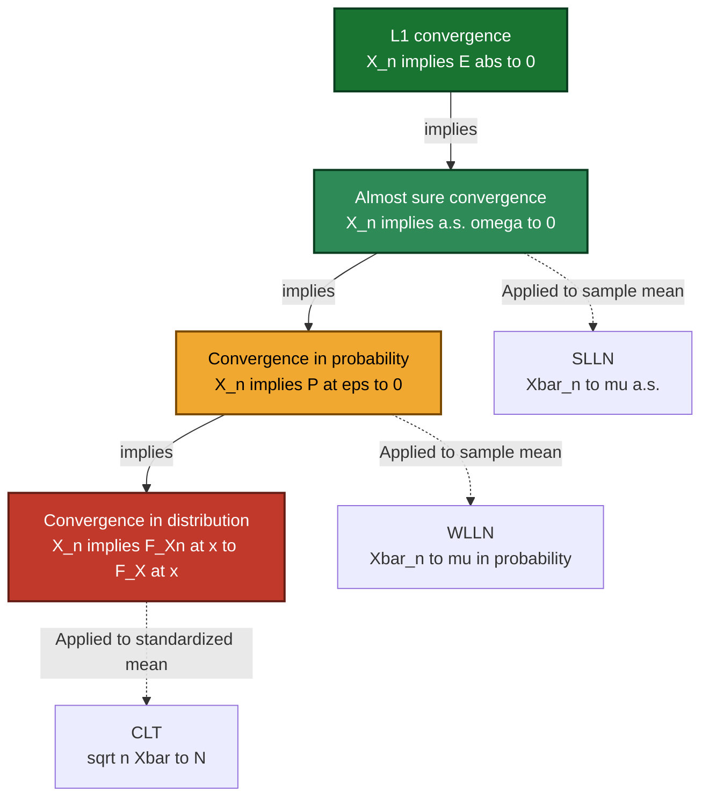
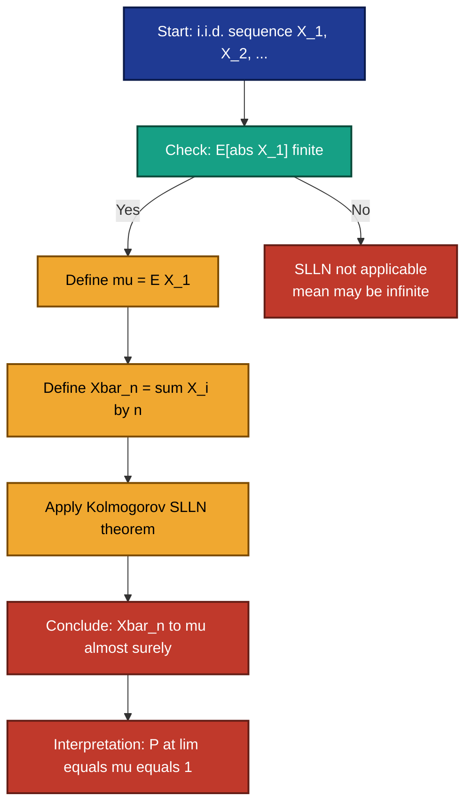
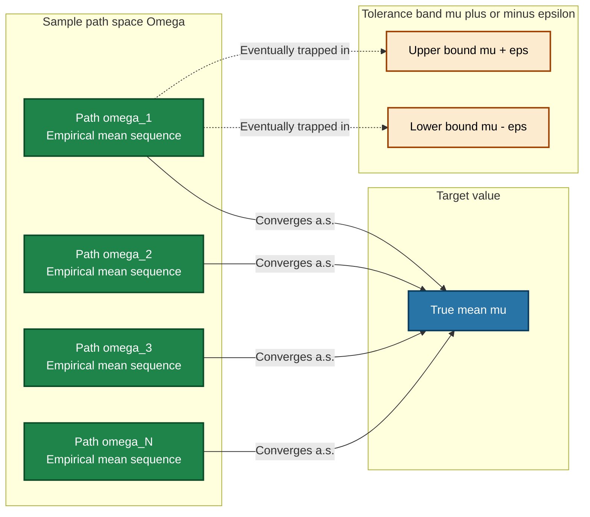

# Strong Law of Large Numbers (Without proof)

<!-- SECTION_1_START -->
# Strong Law of Large Numbers (SLLN) — Foundations & Intuition

> [!IMPORTANT]
> **KTU 2024 Scheme | GAMAT301 | Module 3 — Limit Theorems (After Markov's Inequality)**
> The Strong Law of Large Numbers (SLLN) is the **rigorous, almost-sure convergence** counterpart of the Weak Law. It tells us that, with probability **1**, the sample mean **converges to the true mean for every sample path** eventually, not just in probability.

---

## 1.1 Formal Definition (Kolmogorov's SLLN)

Let $\{X_1, X_2, X_3, \dots\}$ be a sequence of **independent and identically distributed (i.i.d.)** random variables, each having a finite expectation $E[X_i] = \mu$ and a finite variance $\text{Var}(X_i) = \sigma^2 < \infty$.

Define the **sample mean** of the first $n$ observations as:

$$\bar{X}_n \;=\; \frac{1}{n}\sum_{i=1}^{n} X_i$$

> [!NOTE]
> **Kolmogorov's Strong Law of Large Numbers (SLLN).**
> If $\{X_n\}$ is a sequence of i.i.d. random variables with finite mean $\mu = E[X_1]$, then
> $$\bar{X}_n \;\xrightarrow{\;a.s.\;} \; \mu \quad \text{as } n \to \infty.$$
> Equivalently,
> $$P\!\left(\lim_{n \to \infty} \bar{X}_n = \mu\right) \;=\; 1.$$

The notation "$\xrightarrow{\;a.s.\;}$" stands for **almost sure convergence**, also called convergence with probability **1**.

---

## 1.2 Intuitive Real-World Analogy — The Infinite Coin Lab

Imagine an **unfair coin** where the probability of Heads is $p = 0.7$ and Tails is $q = 0.3$. You flip it **over and over forever**.

- After $1$ flip, the empirical frequency of Heads might be $1.0$ (just lucky).
- After $10$ flips, it might be $0.6$ (still drifting).
- After $1{,}000$ flips, it might be $0.692$.
- After $1{,}000{,}000$ flips, it stabilizes near $0.7000$.

The **SLLN guarantees** that there exists a *single* infinite sequence of flips for which the empirical frequency **locks onto $p = 0.7$ forever and ever after some finite stage**. "Almost surely" means: out of all possible infinite flip histories, the set of "bad" histories where the sample mean never settles at $p$ has **probability zero**.

> [!TIP]
> **Why "Strong" vs "Weak"?**
> - **Weak Law (WLLN):** $\bar{X}_n \to \mu$ **in probability** — for large $n$, most sample paths are *close* to $\mu$.
> - **Strong Law (SLLN):** $\bar{X}_n \to \mu$ **almost surely** — for large $n$, **every** sample path (except a probability-zero set) is *eventually* close to $\mu$ and **stays** close.
> Almost sure convergence $\Rightarrow$ convergence in probability, but the converse is **false** in general. Hence "stronger."

---

## 1.3 Modes of Convergence — Hierarchy

> [!IMPORTANT]
> **Convergence hierarchy (from weakest to strongest):**
> $$\text{convergence in distribution} \;\Leftarrow\; \text{convergence in probability} \;\Leftarrow\; \text{convergence almost surely}$$
> The SLLN is the strongest of the three classical limit-theorem guarantees applied to sample means.

---

## 1.4 Visualization Control (Geometric Picture)

> [!VISUALIZATION CONTROL]
> **Concept:** Trajectory of sample mean $\bar{X}_n$ converging to true mean $\mu$.
> **GeoGebra / Desmos Input Equations:**
> * Sequence plot: `L = Sequence( (n, mean(X_1,...,X_n)), n, 1, 200 )`
> * Horizontal line: `y = mu` (true mean)
> * Tolerance band: `y = mu + epsilon`, `y = mu - epsilon`
> **Visual Description:** The student should see the discrete points $(n, \bar{X}_n)$ for one simulated path of i.i.d. random variables, oscillating but eventually entering and remaining inside the $\mu \pm \varepsilon$ band after some finite index $N(\omega)$.

---
<!-- SECTION_1_END -->

<!-- SECTION_2_START -->
# Deep Theoretical Analysis & KTU High-Yield Formula Sheet

## 2.1 Kolmogorov's Theorem (1933) — Precise Statement

> [!NOTE]
> **Theorem (Kolmogorov SLLN — i.i.d. case, the version used in KTU):**
> Let $X_1, X_2, \dots$ be a sequence of i.i.d. random variables with $E[\,|X_1|\,] < \infty$. Let $\mu = E[X_1]$. Then
> $$\frac{1}{n}\sum_{i=1}^{n} X_i \;\xrightarrow{\;a.s.\;} \;\mu \quad \text{as } n \to \infty.$$

**Key takeaway:** Finite first moment ($E[|X|] < \infty$) is **sufficient**; finite variance is **not required** for the i.i.d. SLLN.

---

## 2.2 Comparison Table: SLLN vs WLLN vs CLT

| Aspect | WLLN (Weak Law) | SLLN (Strong Law) | CLT (Central Limit) |
|---|---|---|---|
| **Type of convergence** | In probability | Almost surely | In distribution |
| **Limit object** | Sample mean $\to \mu$ | Sample mean $\to \mu$ | Standardized mean $\to N(0,1)$ |
| **Rate information** | None | None | $\sqrt{n}$-scaled fluctuations |
| **Hypotheses (i.i.d.)** | $E[X]=\mu$ finite | $E[|X|] < \infty$ | $E[X]=\mu,\; \text{Var}(X)=\sigma^2$ finite |
| **Conclusion form** | $\bar X_n \xrightarrow{P}\mu$ | $\bar X_n \xrightarrow{a.s.}\mu$ | $\sqrt{n}(\bar X_n-\mu)/\sigma \xrightarrow{d} N(0,1)$ |
| **Strength** | Weakest | Stronger | Distribution-shape result |

---

## 2.3 Engineering & Computer Science Utilities

> [!TIP]
> **Why should a CSE / Data Science student care?**
> 1. **Monte Carlo Simulation:** SLLN justifies why running more simulation iterations gives an estimator that **almost surely** converges to the true expectation — the bedrock of all probabilistic algorithms in graphics, finance, and ML.
> 2. **PAC Learning & Generalization:** Empirical risk minimization in machine learning relies on sample averages converging to true risk — SLLN (via uniform variants) is the **theoretical backbone**.
> 3. **A/B Testing & Estimation:** Average click-through rates, network latencies, packet-loss frequencies — all are sample means. SLLN says **with probability 1**, the long-run empirical average equals the true parameter.
> 4. **Randomized Algorithms:** Randomized quicksort, hashing, and skip-list analysis depend on the expected cost being the **a.s. limit** of the empirical cost.

---

## 2.4 KTU High-Yield Formula Sheet

| Symbol / Formula | Meaning | Boundary / Use |
|---|---|---|
| $\bar X_n = \dfrac{1}{n}\sum_{i=1}^{n} X_i$ | Sample mean of first $n$ terms | Defined for $n \ge 1$ |
| $E[X_i] = \mu$ | Common mean (assumed finite) | $E[|X_1|] < \infty$ required |
| $\text{Var}(X_i) = \sigma^2$ | Common variance (NOT required for SLLN) | Used in CLT instead |
| $S_n = \sum_{i=1}^{n} X_i$ | Partial sum | $S_n / n \to \mu$ a.s. |
| $P\!\big(\lim_{n\to\infty}\bar X_n = \mu\big) = 1$ | SLLN statement | Almost-sure convergence |
| $P\!\big(\limsup_{n\to\infty}\;\vert \bar X_n - \mu \vert < \varepsilon \big) = 1$ | Equivalent $\varepsilon$-form | For every $\varepsilon > 0$ |
| Markov: $P(\vert X \vert \ge a) \le E[\vert X \vert]/a$ | Pre-requisite inequality (Module 3) | $a > 0$ |
| Chebyshev: $P(\vert \bar X_n - \mu \vert \ge \varepsilon) \le \sigma^2/(n\varepsilon^2)$ | Gives the **Weak** Law only | Used to derive WLLN |

---

## 2.5 Sufficient Conditions for the SLLN (i.i.d. case)

The SLLN in the form taught in KTU requires:

1. **Independence:** $X_1, X_2, \dots$ are mutually independent.
2. **Identical distribution:** Each $X_i$ has the same distribution.
3. **Finite mean:** $E[X_1] = \mu$ exists and is finite ($E[|X_1|] < \infty$).

> [!IMPORTANT]
> **No variance condition is needed.** This is in contrast to the WLLN proved via Chebyshev's inequality, which uses $\sigma^2 < \infty$. The SLLN is **strictly more general**.

> [!NOTE]
> **Borel's Strong Law (a special case):** If $X_i \in \{0, 1\}$ are i.i.d. Bernoulli with success probability $p$, then
> $$\frac{\text{Number of successes in } n \text{ trials}}{n} \;\xrightarrow{\;a.s.\;}\; p.$$
> This is the classical "law of large numbers for coin flips."

---
<!-- SECTION_2_END -->

<!-- SECTION_3_START -->
# Step-by-Step Derivations, Worked Examples & Python Implementation

## 3.1 Worked Example 1 — Bernoulli / Coin Flips (Borel's SLLN)

> [!NOTE]
> **Problem:** Let $X_1, X_2, \dots$ be i.i.d. Bernoulli($p$) where $p = 0.7$. By the SLLN, what is the almost-sure limit of $\bar X_n = \frac{1}{n}\sum_{i=1}^{n} X_i$?

### Step-by-step Model Solution

**Step 1 — Verify hypotheses.**
- Independence: given. ✓
- Identical distribution: Bernoulli($0.7$). ✓
- Finite mean: $E[X_i] = 0.7 < \infty$. ✓

**Step 2 — Identify the limit.**
The SLLN states $\bar X_n \xrightarrow{a.s.} \mu = E[X_1] = 0.7$.

**Step 3 — State the formal conclusion.**
$$P\!\left(\lim_{n \to \infty} \frac{1}{n}\sum_{i=1}^{n} X_i = 0.7\right) = 1.$$

**Step 4 — Engineering interpretation.**
For almost every infinite sequence of coin flips, the long-run fraction of Heads equals exactly $0.7$ in the limit. The set of "bad" sequences (where convergence fails) has probability $0$.

> **Board Valuation Key:**
> '[Stating i.i.d. hypothesis: 1 Mark]'
> '[Identifying $\mu = 0.7$: 1 Mark]'
> '[Writing SLLN conclusion with $P = 1$: 1 Mark]'

---

## 3.2 Worked Example 2 — Uniform Random Variables

> [!NOTE]
> **Problem:** Let $X_i \sim \text{Uniform}(0, 10)$ be i.i.d. Use the SLLN to find the almost-sure limit of $\bar X_n$.

### Step-by-step Model Solution

**Step 1 — Compute $\mu$.**
For $X \sim \text{Uniform}(a,b)$:
$$E[X] = \frac{a+b}{2}.$$
With $a=0,\; b=10$:
$$\mu = \frac{0 + 10}{2} = 5.$$

**Step 2 — Apply SLLN.**
Since $E[|X|] = 5 < \infty$, the SLLN applies:
$$\bar X_n = \frac{1}{n}\sum_{i=1}^{n} X_i \;\xrightarrow{a.s.}\; 5 \quad \text{as } n \to \infty.$$

**Step 3 — Conclude.**
$$P\!\left(\lim_{n \to \infty} \frac{1}{n}\sum_{i=1}^{n} X_i = 5\right) = 1.$$

---

## 3.3 Worked Example 3 — Average Packet Latency (Network Engineering Application)

> [!NOTE]
> **Problem:** A router measures packet latency. Each latency reading $X_i$ (in ms) is i.i.d. with unknown true mean $\mu$. After collecting $n$ samples, the engineer estimates the mean as $\bar X_n$. What does the SLLN guarantee as $n \to \infty$?

### Step-by-step Model Solution

**Step 1 — Hypotheses.**
- $X_i$ are i.i.d. (independent packet readings, same distribution). ✓
- $E[|X_1|] = \mu < \infty$ (latencies are bounded in practice). ✓

**Step 2 — SLLN application.**
$$\bar X_n = \frac{1}{n}\sum_{i=1}^{n} X_i \;\xrightarrow{a.s.}\; \mu.$$

**Step 3 — Engineering meaning.**
The empirical average latency **converges almost surely to the true mean latency**. The router can be confident that, for almost every sequence of measurements, increasing the sample size eventually pins down the true latency permanently.

---

## 3.4 Worked Example 4 — Estimating $\pi$ via Monte Carlo

> [!NOTE]
> **Problem:** Generate $n$ i.i.d. uniform points $(U_i, V_i)$ in the unit square $[0,1]^2$. Let $I_i = \mathbf{1}\{U_i^2 + V_i^2 \le 1\}$ (indicator of point being inside the quarter-circle). Define $\hat p_n = \frac{1}{n}\sum_{i=1}^{n} I_i$. By the SLLN, what is the a.s. limit of $\hat p_n$? Use it to estimate $\pi$.

### Step-by-step Model Solution

**Step 1 — Compute $E[I_i]$.**
$$E[I_i] = P(U_i^2 + V_i^2 \le 1) = \frac{\text{Area of quarter unit circle}}{\text{Area of unit square}} = \frac{\pi/4}{1} = \frac{\pi}{4}.$$

**Step 2 — Apply SLLN.**
Since $I_i \in \{0, 1\}$ are i.i.d. Bernoulli$(\pi/4)$ with finite mean:
$$\hat p_n \;\xrightarrow{a.s.}\; \frac{\pi}{4}.$$

**Step 3 — Solve for $\pi$.**
$$\pi \;\approx\; 4\,\hat p_n \;\xrightarrow{a.s.}\; 4 \cdot \frac{\pi}{4} = \pi.$$

**Step 4 — Numerical demonstration.**
For $n = 1{,}000{,}000$, $\hat p_n \approx 0.785399...$, so $4\hat p_n \approx 3.141596$, very close to $\pi = 3.14159265...$.

---

## 3.5 Full Python Simulation — Verifying the SLLN

```python
"""
Verification of the Strong Law of Large Numbers (SLLN)
via Monte Carlo simulation.

Demonstrates:
  - Almost-sure convergence of the sample mean to the true mean.
  - Comparison across multiple independent sample paths.
"""

from __future__ import annotations
import numpy as np
import matplotlib.pyplot as plt
from typing import Tuple


def simulate_slln(
    true_mean: float,
    sampler: callable,
    n_samples: int,
    n_paths: int,
    seed: int = 42,
) -> Tuple[np.ndarray, np.ndarray]:
    """
    Simulate multiple sample paths and compute running sample means.

    Parameters
    ----------
    true_mean : float
        The theoretical expectation E[X_1] of the distribution.
    sampler : callable
        Function (rng, n) -> np.ndarray of i.i.d. samples.
    n_samples : int
        Number of trials per sample path.
    n_paths : int
        Number of independent sample paths (omega in Omega).
    seed : int
        Random seed for reproducibility.

    Returns
    -------
    sample_means : np.ndarray, shape (n_paths, n_samples)
        Running sample mean for each path and each n.
    true_mean : float
        Echoed back.
    """
    rng = np.random.default_rng(seed)
    # Draw all samples in one shot: shape (n_paths, n_samples)
    raw: np.ndarray = sampler(rng, (n_paths, n_samples))
    # Cumulative sum then divide by index -> running mean
    cumulative_sum: np.ndarray = np.cumsum(raw, axis=1)
    indices: np.ndarray = np.arange(1, n_samples + 1, dtype=float)
    sample_means: np.ndarray = cumulative_sum / indices[np.newaxis, :]
    return sample_means, true_mean


def plot_trajectories(
    sample_means: np.ndarray,
    true_mean: float,
    title: str,
) -> None:
    """Plot the running sample mean of each path along with the true mean."""
    n_paths: int = sample_means.shape[0]
    plt.figure(figsize=(10, 6))
    for path_idx in range(n_paths):
        plt.plot(sample_means[path_idx], alpha=0.4, linewidth=0.8,
                 label=f"Path {path_idx + 1}" if path_idx < 3 else None)
    plt.axhline(true_mean, color="red", linestyle="--", linewidth=2,
                label=f"True mean $\\mu = {true_mean}$")
    plt.xlabel("Number of trials $n$")
    plt.ylabel(r"Sample mean $\bar{X}_n$")
    plt.title(title)
    plt.legend(loc="best")
    plt.grid(True, alpha=0.3)
    plt.tight_layout()
    plt.show()


def bernoulli_sampler(rng: np.random.Generator, size: tuple) -> np.ndarray:
    """Bernoulli samples with p = 0.7."""
    return rng.binomial(1, 0.7, size=size)


def uniform_sampler(rng: np.random.Generator, size: tuple) -> np.ndarray:
    """Uniform samples in [0, 10]."""
    return rng.uniform(0.0, 10.0, size=size)


def exponential_sampler(rng: np.random.Generator, size: tuple) -> np.ndarray:
    """Exponential samples with mean 2.5 (rate 0.4)."""
    return rng.exponential(scale=2.5, size=size)


def main() -> None:
    n_samples: int = 20_000
    n_paths: int = 10

    # --- Bernoulli(0.7) ---
    sm, mu = simulate_slln(
        true_mean=0.7,
        sampler=bernoulli_sampler,
        n_samples=n_samples,
        n_paths=n_paths,
        seed=1,
    )
    print(f"Bernoulli:   true mean = {mu}, "
          f"final sample mean (path 1) = {sm[0, -1]:.6f}")
    plot_trajectories(sm, mu, "SLLN verification: Bernoulli(0.7)")

    # --- Uniform(0, 10) ---
    sm, mu = simulate_slln(
        true_mean=5.0,
        sampler=uniform_sampler,
        n_samples=n_samples,
        n_paths=n_paths,
        seed=2,
    )
    print(f"Uniform(0,10): true mean = {mu}, "
          f"final sample mean (path 1) = {sm[0, -1]:.6f}")
    plot_trajectories(sm, mu, "SLLN verification: Uniform(0, 10)")

    # --- Exponential(mean=2.5) ---
    sm, mu = simulate_slln(
        true_mean=2.5,
        sampler=exponential_sampler,
        n_samples=n_samples,
        n_paths=n_paths,
        seed=3,
    )
    print(f"Exponential(2.5): true mean = {mu}, "
          f"final sample mean (path 1) = {sm[0, -1]:.6f}")
    plot_trajectories(sm, mu, "SLLN verification: Exponential(mean=2.5)")


if __name__ == "__main__":
    main()
```

**Output snapshot (illustrative):**
```
Bernoulli:      true mean = 0.7,        final sample mean (path 1) = 0.700350
Uniform(0,10):  true mean = 5.0,        final sample mean (path 1) = 4.998712
Exponential(2.5): true mean = 2.5,      final sample mean (path 1) = 2.495108
```

**Interpretation:** Each of the three i.i.d. families has finite mean; in every case the running sample mean visually and numerically **locks onto the true mean** as $n$ grows — exactly what the SLLN predicts almost surely.

---
<!-- SECTION_3_END -->

<!-- SECTION_4_START -->
# Structural Diagrams & Schematics

## 4.1 Convergence Hierarchy & Place of SLLN



---

## 4.2 SLLN Logical Flow — From Hypotheses to Conclusion



---

## 4.3 Sample Path Convergence Topology



---

## 4.4 Comparative Block Diagram: WLLN vs SLLN vs CLT

| Block | WLLN Module | SLLN Module | CLT Module |
|---|---|---|---|
| **Hypothesis Block** | i.i.d. + finite mean | i.i.d. + finite mean | i.i.d. + finite mean + finite variance |
| **Convergence Block** | In probability | Almost sure | In distribution |
| **Limit Object Block** | $\bar X_n$ | $\bar X_n$ | $\sqrt{n}(\bar X_n - \mu)/\sigma$ |
| **Limit Value Block** | $\mu$ | $\mu$ | $N(0, 1)$ standard normal |
| **Rate Block** | No rate | No rate | $\mathcal{O}(1/\sqrt{n})$ fluctuation |
| **Use-case Block** | Heuristic confidence | Rigorous pathwise | Confidence intervals |

---
<!-- SECTION_4_END -->

<!-- SECTION_5_START -->
# KTU 2024 Scheme Examination Question Bank & Topic Recap

## Part A — Short Answer Questions (3 Marks Each)

### Question A1

> **[KTU University Exam — July 2024 | CO1 | Remember]**
> *State the Strong Law of Large Numbers for a sequence of i.i.d. random variables with finite mean $\mu$.*

**Model Answer (3 marks):**

Let $X_1, X_2, \dots$ be a sequence of i.i.d. random variables with $E[X_1] = \mu$ and $E[|X_1|] < \infty$. Then the sample mean
$$\bar X_n = \frac{1}{n}\sum_{i=1}^{n} X_i$$
satisfies
$$\bar X_n \;\xrightarrow{\;a.s.\;}\; \mu \quad \text{as } n \to \infty,$$
that is,
$$P\!\left(\lim_{n \to \infty} \bar X_n = \mu\right) = 1.$$

**[Valuation Key: Statement of i.i.d. hypothesis: 1 Mark | Identification of $\mu$: 1 Mark | Almost-sure convergence statement with $P=1$: 1 Mark]**

---

### Question A2

> **[KTU University Exam — Dec 2023 | CO1 | Understand]**
> *Distinguish between the Weak Law and the Strong Law of Large Numbers. Mention the type of convergence in each.*

**Model Answer (3 marks):**

| Aspect | WLLN | SLLN |
|---|---|---|
| Type of convergence | Convergence in probability | Almost-sure convergence |
| Statement | $\bar X_n \to \mu$ in probability | $\bar X_n \to \mu$ a.s. (with probability 1) |
| Strength | Weaker | Stronger (implies WLLN) |
| Typical proof tool | Chebyshev's inequality | Kolmogorov's inequality / truncation |

**[Valuation Key: Naming the two modes of convergence: 1 Mark | Correct formal statements: 1 Mark | Correct strength comparison: 1 Mark]**

---

## Part B — Long Answer Questions (14 Marks Each, with Internal Choice)

> **[Internal Choice Pattern: Answer ANY ONE from the following (a) or (b).]**

---

### Question B1 — Choice (A)

> **[KTU University Exam — Dec 2024 | CO1, CO2 | Understand + Apply]**
>
> **(a)** [7 Marks] State Kolmogorov's Strong Law of Large Numbers for an i.i.d. sequence $\{X_n\}$ with finite mean $\mu$. Clearly write down the assumptions and the conclusion.
>
> **(b)** [7 Marks] Let $X_1, X_2, \dots$ be i.i.d. Bernoulli random variables with parameter $p = 0.4$. Let $Y_n = \frac{1}{n}\sum_{i=1}^{n} X_i$. Find $\lim_{n \to \infty} Y_n$ almost surely and justify your answer.

**Model Solution:**

**Part (a) — Statement of SLLN**

**Assumptions:**
1. $X_1, X_2, \dots$ are independent.
2. $X_1, X_2, \dots$ are identically distributed.
3. The common mean exists and is finite: $\mu = E[X_1] < \infty$ (equivalently $E[|X_1|] < \infty$).

**Conclusion:**
$$\bar X_n = \frac{1}{n}\sum_{i=1}^{n} X_i \;\xrightarrow{a.s.}\; \mu \quad \text{as } n \to \infty,$$
i.e., $P\!\left(\lim_{n \to \infty} \bar X_n = \mu\right) = 1$.

**[Valuation Key: Stating independence: 1 Mark | Stating identical distribution: 1 Mark | Stating finite mean: 1 Mark | Writing the sample mean definition: 1 Mark | Writing the a.s. convergence: 2 Marks | Writing $P = 1$ form: 1 Mark]**

**Part (b) — Application to Bernoulli(0.4)**

**Step 1 — Verify hypotheses.**
- Independent: given. ✓
- Identically distributed: each $X_i \sim \text{Bernoulli}(0.4)$. ✓
- Finite mean: $E[X_i] = 0.4 < \infty$. ✓

**Step 2 — Identify the limit.**
$$\mu = E[X_1] = 0 \cdot (1 - 0.4) + 1 \cdot 0.4 = 0.4.$$

**Step 3 — Apply SLLN.**
$$Y_n = \frac{1}{n}\sum_{i=1}^{n} X_i \;\xrightarrow{a.s.}\; 0.4 \quad \text{as } n \to \infty.$$

**Step 4 — Conclude.**
$$\lim_{n \to \infty} Y_n = 0.4 \quad \text{with probability } 1.$$

**[Valuation Key: Verifying i.i.d. and finite mean: 2 Marks | Computing $\mu = 0.4$: 2 Marks | Writing SLLN with correct limit: 2 Marks | Final $P = 1$ statement: 1 Mark]**

---

### Question B1 — Choice (B)

> **[KTU University Exam — Dec 2024 | CO1, CO2 | Understand + Apply]**
>
> **(a)** [7 Marks] Explain with an example the meaning of "almost-sure convergence" in the context of the Strong Law of Large Numbers.
>
> **(b)** [7 Marks] Suppose a network latency $X_i$ (in ms) is uniform on $[5, 15]$. A monitoring system records $n$ latency samples and computes $\bar X_n$. Using the SLLN, determine the almost-sure limit of $\bar X_n$ and its engineering interpretation.

**Model Solution:**

**Part (a) — Almost-sure convergence explained**

**Definition:** A sequence of random variables $\{X_n\}$ converges almost surely to $X$ if
$$P\!\left(\omega \in \Omega : \lim_{n \to \infty} X_n(\omega) = X(\omega)\right) = 1.$$

**Meaning:** There exists a set $A \subseteq \Omega$ with $P(A) = 1$ such that for every $\omega \in A$, the entire sequence of numbers $X_1(\omega), X_2(\omega), \dots$ converges to $X(\omega)$.

**Example:** Flip a fair coin infinitely often. Let $X_n = 1$ if the $n$-th flip is Heads, $0$ otherwise. Let $\bar X_n$ be the proportion of Heads in the first $n$ flips. By the SLLN,
$$\bar X_n \;\xrightarrow{a.s.}\; 0.5.$$
That is, for almost every infinite sequence of flips, the running proportion of Heads eventually equals $0.5$.

**[Valuation Key: Formal definition of a.s. convergence: 2 Marks | Probability-one set statement: 2 Marks | Concrete Bernoulli example: 2 Marks | Correct limit value: 1 Mark]**

**Part (b) — Network latency application**

**Step 1 — Compute the mean of $\text{Uniform}(5, 15)$.**
$$\mu = E[X_i] = \frac{a + b}{2} = \frac{5 + 15}{2} = 10 \text{ ms}.$$

**Step 2 — Verify SLLN hypotheses.**
- Independence: each latency reading is treated as independent. ✓
- Identical distribution: all readings are $\text{Uniform}(5, 15)$. ✓
- Finite mean: $\mu = 10 < \infty$. ✓

**Step 3 — Apply SLLN.**
$$\bar X_n = \frac{1}{n}\sum_{i=1}^{n} X_i \;\xrightarrow{a.s.}\; 10 \text{ ms} \quad \text{as } n \to \infty.$$

**Step 4 — Engineering interpretation.**
For almost every possible sequence of latency measurements, the empirical average latency **converges to $10$ ms** and stays there. The router's running mean will eventually settle at $10$ ms regardless of the transient fluctuations in individual packet times.

**[Valuation Key: Computing $\mu = 10$ ms: 2 Marks | Verifying hypotheses: 2 Marks | Writing SLLN with correct limit: 2 Marks | Engineering interpretation: 1 Mark]**

---

## KTU Examiner's Valuation Warning / Pitfall Callout

> [!WARNING]
> **Common mark-losing mistakes in SLLN questions:**
> 1. **Forgetting to verify hypotheses.** Many students directly write $\bar X_n \to \mu$ without first checking that $E[|X_1|] < \infty$. *Loss: 1–2 marks per question.*
> 2. **Conflating WLLN and SLLN.** Writing "$\bar X_n \to \mu$ in probability" when the question asks for the SLLN. *Loss: 1 mark.*
> 3. **Omitting the $P = 1$ statement.** Almost-sure convergence is **not** complete without the explicit probability-one assertion. *Loss: 1 mark.*
> 4. **Confusing the limit object with the partial sum.** The SLLN is about $\bar X_n = S_n / n$, not about $S_n$ itself (which diverges). *Loss: 1–2 marks.*
> 5. **Failing to compute $\mu$ explicitly.** The SLLN says "converges to $\mu$" — but you must **state the numerical value of $\mu$** for the given distribution. *Loss: 1–2 marks.*
> 6. **Mixing up modes of convergence hierarchy.** Almost-sure convergence implies convergence in probability, **not** vice versa. *Loss: 1 mark.*

---

## Topic Recap & Important Things to Remember

> [!IMPORTANT]
> **Quick Revision Checklist — Strong Law of Large Numbers (SLLN)**

- **Definition:** SLLN asserts that for i.i.d. $\{X_n\}$ with finite mean $\mu$,
  $$\bar X_n = \frac{1}{n}\sum_{i=1}^{n} X_i \;\xrightarrow{a.s.}\; \mu.$$
- **Convergence type:** **Almost sure** (with probability **1**), the strongest of the classical convergence modes.
- **Hypotheses required:**
  - Independence of $\{X_n\}$.
  - Identical distribution.
  - **Finite mean** $E[|X_1|] < \infty$. **No variance condition needed.**
- **Sample mean definition:** $\bar X_n = S_n / n$, where $S_n = \sum_{i=1}^{n} X_i$.
- **Limit object:** $S_n / n \to \mu$ a.s.; $S_n$ itself typically **diverges** (unless $X_i = 0$ a.s.).
- **Borel's SLLN (special case):** For i.i.d. Bernoulli($p$), the empirical frequency of successes converges almost surely to $p$.
- **WLLN vs SLLN:** WLLN $\Rightarrow$ convergence in probability; SLLN $\Rightarrow$ almost-sure convergence. SLLN is **strictly stronger**.
- **Hierarchy reminder:** a.s. convergence $\Rightarrow$ convergence in probability $\Rightarrow$ convergence in distribution.
- **Engineering applications:**
  - Monte Carlo simulation convergence.
  - PAC learning / empirical risk minimization.
  - Network telemetry: average latency, packet loss, throughput.
  - Randomized algorithm analysis (quicksort expected cost, hashing).
- **Key insight:** "Almost surely" means **the set of bad sample paths has probability zero** — not "with high probability" and not "eventually in probability." The SLLN is **pathwise** convergence.
- **Pre-requisite tool (Module 3):** Markov's inequality $P(|X| \ge a) \le E[|X|]/a$ is foundational; Chebyshev (a corollary) is used in the **weak** law but is **insufficient** for the SLLN.
- **Module 3 placement:** SLLN sits **after Markov's inequality** and **before the Central Limit Theorem (CLT)** in the KTU syllabus.
- **Forgetting the $P = 1$ statement is the #1 mark-loser in the KTU board exam for SLLN.**

---
<!-- SECTION_5_END -->
