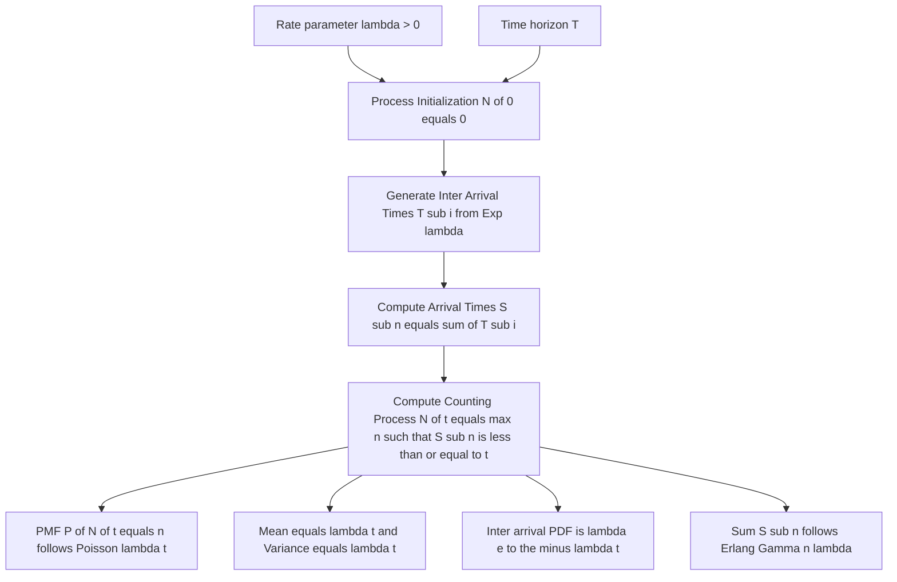
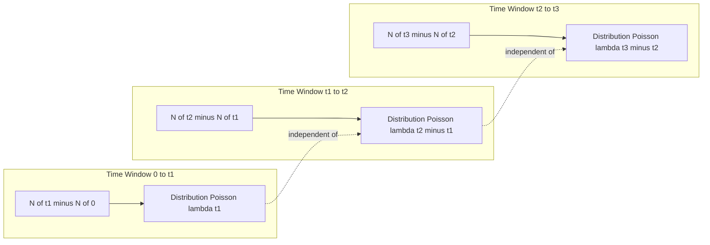
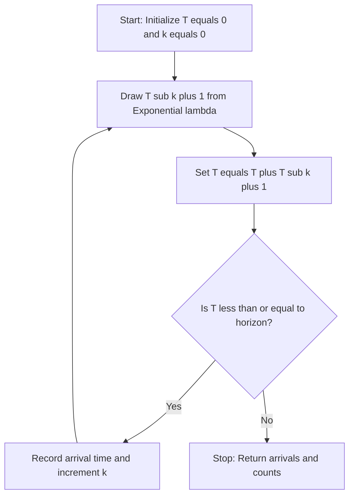
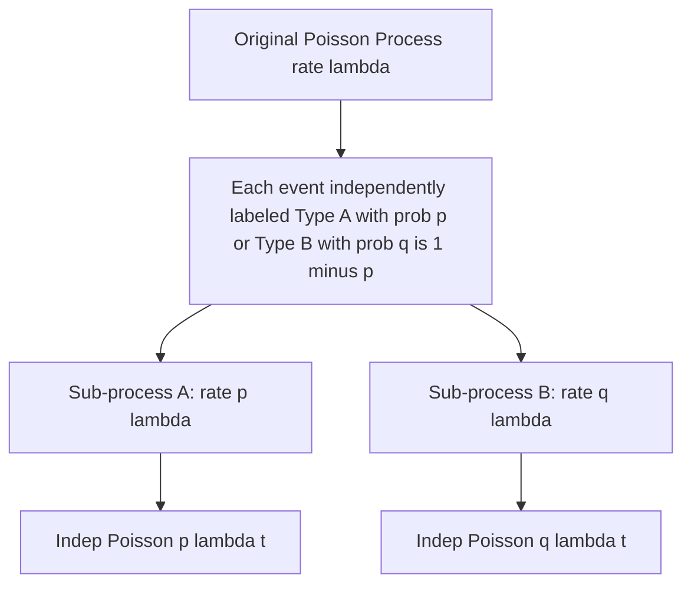

# The Poisson Process

<!-- SECTION_1_START -->
# The Poisson Process — Core Technical Definition & Intuitive Overview

## Formal Definition (KTU 2024 Syllabus Terminology)

A **counting process** $\{N(t), t \geq 0\}$ is called a **Poisson Process with rate $\lambda > 0$** if it satisfies the following four axioms:

> [!IMPORTANT]
> **KTU Board Definition — Poisson Process Axioms**
> 1. **Initial Condition:** $N(0) = 0$ (the process starts at zero).
> 2. **Independent Increments:** For any $0 \leq t_1 < t_2 < \cdots < t_n$, the random variables $N(t_2) - N(t_1), N(t_3) - N(t_2), \ldots, N(t_n) - N(t_{n-1})$ are mutually independent.
> 3. **Stationary Increments:** The distribution of $N(t+s) - N(t)$ depends only on the length of the interval $s$, not on the starting point $t$.
> 4. **Poisson Distributed Counts:** For every $t \geq 0$, $N(t)$ follows a Poisson distribution with mean $\lambda t$, that is:
>    $$P(N(t) = n) = \frac{e^{-\lambda t} (\lambda t)^n}{n!}, \quad n = 0, 1, 2, \ldots$$

The single parameter $\lambda$ is called the **rate** or **intensity** of the process, with units of *events per unit time*. The fundamental constant is:

$$E[N(t)] = \lambda t, \qquad \text{Var}(N(t)) = \lambda t$$

---

## Conceptual Analogy — "Customers Arriving at a Coffee Shop"

Imagine you are sitting in a busy café counter counting customers walking in:

- **$\lambda = 3$ customers/minute** means on average three customers arrive every minute.
- The process $N(t)$ simply tallies the *cumulative count* of arrivals by time $t$.
- **Independent increments** mean arrivals during 10–11 AM do not influence arrivals during 11–12 AM.
- **Stationary increments** mean the *rate* of arrivals during 2–3 PM is statistically identical to arrivals during 10–11 PM (the café is equally busy across shifts).
- $N(t) \sim \text{Poisson}(\lambda t)$ means the total number of customers in any window of length $t$ follows the Poisson probability law.

> [!NOTE]
> **Intuitive Takeaway:** The Poisson process is a *memoryless counter of rare, random events* happening at a constant average rate — every engineering application (network packets, hardware failures, radioactive decay, queue arrivals) is just the same coffee-counter problem in disguise.

---

## Why the Poisson Process Matters in Computer & Information Science

| Engineering Domain | Real-World Use Case |
|---|---|
| **Network Engineering** | Modeling packet arrivals at a router queue (M/M/1 queuing). |
| **Reliability Engineering** | Hardware failure events, disk crash modeling. |
| **Cybersecurity** | Cyber-attack events per hour, intrusion detection triggers. |
| **Distributed Systems** | Task arrivals at a cloud server (AWS Lambda invocations). |
| **Data Science / ML** | Hawkes processes, spike trains in neural data, event-stream modeling. |

---

## GeoGebra / Desmos Visualization

> [!VISUALIZATION CONTROL]
> **Concept:** Poisson PMF overlaid on the time-axis as discrete probability masses for $N(t)$.
> **GeoGebra / Desmos Input Equations (try $\lambda = 4$, $t = 1$):**
> * `f(n) = e^(-4) * 4^n / n!` for $n = 0, 1, 2, \ldots, 12$
> **Visual Description:** You will observe a right-skewed bell-shaped discrete distribution centered around $n = 4$, confirming that the most probable number of events in one unit of time is roughly equal to the rate $\lambda$. As $t$ increases, the distribution shifts right and broadens.
<!-- SECTION_1_END -->

<!-- SECTION_2_START -->
# Deep Theoretical Analysis & KTU High-Yield Formula Sheet

## 2.1 Derivation Logic — From Axioms to the PMF

The four axioms logically force the PMF onto the process. Here is the step-by-step deductive chain:

1. **Step 1 — Rate proportionality for small $h$:** The probability of *exactly one* event in a tiny interval of length $h$ is approximately proportional to $h$:
   $$P(N(h) = 1) = \lambda h + o(h)$$
2. **Step 2 — Negligible multiple events:** The probability of two or more events in $h$ vanishes faster than $h$:
   $$P(N(h) \geq 2) = o(h)$$
3. **Step 3 — Almost surely no events:** 
   $$P(N(h) = 0) = 1 - \lambda h + o(h)$$
4. **Step 4 — Composition over partitions:** Divide $[0, t]$ into $n$ sub-intervals of length $h = t/n$. Independence gives the limiting exponential form which solves the differential–difference equations, yielding:
   $$P(N(t) = n) = \frac{e^{-\lambda t} (\lambda t)^n}{n!}$$

> [!TIP]
> **Board Tip:** Examiners love asking *"Why is the Poisson distribution a natural model for rare events?"* — your answer should mention *independent occurrences*, *constant average rate*, and *two-events-instantaneously* being impossible.

---

## 2.2 Inter-Arrival Times — The Exponential Connection

A powerful equivalent definition of the Poisson process is built from the **inter-arrival times** $T_1, T_2, T_3, \ldots$, where $T_i$ is the waiting time between the $(i-1)$-th and $i$-th event.

> [!IMPORTANT]
> **Equivalent Characterization (KTU 2024 High-Yield):**
> The counting process $\{N(t)\}$ is a Poisson process with rate $\lambda$ **if and only if** the inter-arrival times $\{T_i\}$ are i.i.d. **Exponential($\lambda$)** random variables.

This means:
$$f_{T_i}(t) = \lambda e^{-\lambda t}, \quad t \geq 0, \qquad E[T_i] = \frac{1}{\lambda}, \qquad \text{Var}(T_i) = \frac{1}{\lambda^2}$$

Also, the *waiting time until the $n$-th event*, $S_n = T_1 + T_2 + \cdots + T_n$, follows the **Gamma (Erlang)** distribution:
$$f_{S_n}(t) = \frac{\lambda^n t^{n-1} e^{-\lambda t}}{(n-1)!}, \quad t \geq 0$$

---

## 2.3 KTU High-Yield Formula Sheet

> [!NOTE]
> **All values below are board-favorite identities. Memorize the units and boundary conditions.**

| # | Quantity | Formula | Units / Notes |
|---|---|---|---|
| 1 | PMF of $N(t)$ | $P(N(t)=n) = \dfrac{e^{-\lambda t}(\lambda t)^n}{n!}$ | $n = 0, 1, 2, \ldots$ |
| 2 | Mean | $E[N(t)] = \lambda t$ | events |
| 3 | Variance | $\text{Var}(N(t)) = \lambda t$ | events$^2$ |
| 4 | MGF | $M_{N(t)}(u) = e^{\lambda t(e^u - 1)}$ | used in summation of independent Poissons |
| 5 | PGF | $G_{N(t)}(z) = e^{\lambda t(z-1)}$ | useful for moments |
| 6 | Inter-arrival PDF | $f_T(t) = \lambda e^{-\lambda t}$ | $t \geq 0$ |
| 7 | Inter-arrival Mean | $E[T] = 1/\lambda$ | time units |
| 8 | Sum $S_n$ PDF (Erlang) | $f_{S_n}(t) = \dfrac{\lambda^n t^{n-1} e^{-\lambda t}}{(n-1)!}$ | $t \geq 0$ |
| 9 | Order Statistic of Arrivals | $T_{(k)} \sim \text{Gamma}(k, \lambda)$ | $k$-th arrival time |
| 10 | Memoryless Property | $P(T > s+t \mid T > s) = P(T > t)$ | exponential hallmark |
| 11 | Sum of Independent Poissons | If $N_1 \sim P(\lambda_1 t)$, $N_2 \sim P(\lambda_2 t)$ independent, then $N_1+N_2 \sim P((\lambda_1+\lambda_2)t)$ | super-position |
| 12 | Thinning Property | Split $N(t)$ with prob $p$, sub-process is $P(p \lambda t)$ | sub-Poisson |

> [!WARNING]
> **Never** write $P(N(t)=n) = e^{-\lambda} \lambda^n / n!$ in prose without $t$ — the rate parameter of the *count distribution* is $\lambda t$, not $\lambda$. This is the most common single-mark loss on KTU boards.

---

## 2.4 Real-World Production Utility

In production-grade systems, the Poisson process underlies:

- **M/M/1 Queue:** $\lambda$ = service-request arrival rate, used in Kubernetes pod scheduling, Redis queue management, RabbitMQ brokers.
- **Anomaly Detection:** A sudden drop in $N(t)$ vs. expected $\lambda t$ signals cyber-attack or DDoS.
- **Insurance Risk Models:** Claim arrivals per day modeled as Poisson for premium pricing.

---

## 2.5 Conditioning on $N(t) = n$ — Arrival Times are Order Statistics

A classical board result: given that exactly $n$ events occurred in $[0, t]$, the unordered arrival times $(T_{(1)}, \ldots, T_{(n)})$ are distributed as the **order statistics of $n$ i.i.d. Uniform$(0, t)$** random variables.

$$f(t_1, t_2, \ldots, t_n \mid N(t) = n) = \frac{n!}{t^n}, \quad 0 < t_1 < t_2 < \cdots < t_n < t$$
<!-- SECTION_2_END -->

<!-- SECTION_3_START -->
# Step-by-Step Derivations & Code Implementation

## 3.1 Derivation 1 — PMF of $N(t)$ via Differential Equations

Let $p_n(t) = P(N(t) = n)$. We derive the recursive relation from the axioms.

**Setup:** Split $[0, t+h]$ into $[0, t]$ and $(t, t+h]$:

$$P(N(t+h) = n) = \sum_{k=0}^{n} P(N(t) = n-k) \cdot P(N(h) = k)$$

Apply the small-$h$ limits from Section 2.1 (only $k = 0$ or $k = 1$ contribute at first order):

$$p_n(t+h) = p_n(t) \cdot (1 - \lambda h) + p_{n-1}(t) \cdot \lambda h + o(h)$$

Rearrange and let $h \to 0$:

$$p_n^{\prime}(t) = -\lambda p_n(t) + \lambda p_{n-1}(t), \quad n \geq 1$$

For $n = 0$, $p_0^{\prime}(t) = -\lambda p_0(t)$ giving $p_0(t) = e^{-\lambda t}$ (using $p_0(0) = 1$).

By induction, assume $p_{n-1}(t) = \dfrac{e^{-\lambda t} (\lambda t)^{n-1}}{(n-1)!}$. The ODE for $p_n$ is linear first-order with integrating factor $e^{\lambda t}$. The unique solution satisfying $p_n(0) = 0$ is:

$$p_n(t) = \frac{e^{-\lambda t} (\lambda t)^n}{n!}$$

$\blacksquare$

---

## 3.2 Derivation 2 — Sum of Independent Poissons

Let $N_1 \sim \text{Poisson}(\lambda_1 t)$ and $N_2 \sim \text{Poisson}(\lambda_2 t)$ be independent. We use probability generating functions (PGFs):

$$G_{N_1+N_2}(z) = G_{N_1}(z) \cdot G_{N_2}(z) = e^{\lambda_1 t (z-1)} \cdot e^{\lambda_2 t (z-1)} = e^{(\lambda_1+\lambda_2)t (z-1)}$$

This is exactly the PGF of a Poisson r.v. with parameter $(\lambda_1 + \lambda_2) t$. By uniqueness of PGFs:

$$N_1 + N_2 \sim \text{Poisson}\big((\lambda_1 + \lambda_2) t\big)$$

$\blacksquare$

---

## 3.3 Derivation 3 — Expected Value via Inter-Arrival Times

Using $N(t) = \max\{n : S_n \leq t\}$ where $S_n = T_1 + \cdots + T_n$, and the indicator identity:

$$N(t) = \sum_{n=1}^{\infty} \mathbf{1}_{\{S_n \leq t\}}$$

Take expectations (swap sum and integral by monotone convergence):

$$E[N(t)] = \sum_{n=1}^{\infty} P(S_n \leq t) = \sum_{n=1}^{\infty} \int_0^t \frac{\lambda^n s^{n-1} e^{-\lambda s}}{(n-1)!} \, ds$$

Substitute $u = \lambda s$:

$$E[N(t)] = \sum_{n=1}^{\infty} \int_0^{\lambda t} \frac{u^{n-1} e^{-u}}{(n-1)!} \, du = \int_0^{\lambda t} e^{-u} \sum_{n=1}^{\infty} \frac{u^{n-1}}{(n-1)!} \, du$$

The series inside equals $e^{u}$:

$$E[N(t)] = \int_0^{\lambda t} e^{-u} \cdot e^{u} \, du = \int_0^{\lambda t} du = \lambda t$$

$\blacksquare$

---

## 3.4 Python Implementation — Poisson Process Simulator

```python
"""
Poisson Process Simulator with Validation
Course: GAMAT301 | Module 3 — Limit Theorems
Topic: The Poisson Process

This program:
  1. Simulates arrival times of a Poisson process with rate lambda.
  2. Compares empirical mean/variance against the theoretical lambda*t.
  3. Plots the count trajectory N(t).
"""

from __future__ import annotations
import logging
import math
import random
from typing import List, Tuple

# Configure structured logging
logging.basicConfig(
    level=logging.INFO,
    format="%(asctime)s | %(levelname)s | %(message)s",
)
logger = logging.getLogger("PoissonProcess")


def simulate_poisson_process(
    rate_lambda: float,
    horizon: float,
    rng: random.Random | None = None,
) -> Tuple[List[float], List[int]]:
    """
    Generate arrival times of a homogeneous Poisson process.

    Parameters
    ----------
    rate_lambda : float
        The constant rate parameter (events per unit time). Must be > 0.
    horizon : float
        Length of the time window to simulate. Must be > 0.
    rng : random.Random, optional
        Injectable RNG for reproducibility.

    Returns
    -------
    arrival_times : List[float]
        Strictly increasing list of event times in (0, horizon].
    counts : List[int]
        Cumulative count N(t) sampled at every arrival.
    """
    if rate_lambda <= 0:
        raise ValueError(f"rate_lambda must be positive, got {rate_lambda}")
    if horizon <= 0:
        raise ValueError(f"horizon must be positive, got {horizon}")

    rng = rng or random.Random()
    arrival_times: List[float] = []
    current_time: float = 0.0
    n: int = 0

    while True:
        inter_arrival: float = rng.expovariate(rate_lambda)
        current_time += inter_arrival
        if current_time > horizon:
            break
        n += 1
        arrival_times.append(current_time)

    counts: List[int] = list(range(1, n + 1))
    logger.info(
        "Simulation complete | lambda=%.3f, T=%.2f, observed N(T)=%d",
        rate_lambda, horizon, n,
    )
    return arrival_times, counts


def validate_pmf(
    rate_lambda: float,
    horizon: float,
    trials: int = 50_000,
) -> None:
    """
    Validate that N(t) follows Poisson(lambda * t) by Monte Carlo.
    Compares observed mean and variance against theoretical values.
    """
    counts: List[int] = []
    rng = random.Random(42)
    for _ in range(trials):
        _, c = simulate_poisson_process(rate_lambda, horizon, rng=rng)
        counts.append(c[-1] if c else 0)

    mean_emp: float = sum(counts) / trials
    var_emp: float = sum((x - mean_emp) ** 2 for x in counts) / trials
    mean_theo: float = rate_lambda * horizon
    var_theo: float = rate_lambda * horizon

    logger.info("Theoretical mean = %.4f, empirical mean = %.4f", mean_theo, mean_emp)
    logger.info("Theoretical var  = %.4f, empirical var  = %.4f", var_theo, var_emp)

    # Poisson PMF check at n = 0, 1, 2, ..., 8
    from collections import Counter
    freq: dict[int, float] = Counter(counts)
    logger.info("PMF comparison (n : empirical : theoretical)")
    for n in range(0, 9):
        emp_p: float = freq.get(n, 0) / trials
        theo_p: float = math.exp(-mean_theo) * (mean_theo ** n) / math.factorial(n)
        logger.info("n=%d | empirical=%.4f | theoretical=%.4f", n, emp_p, theo_p)


if __name__ == "__main__":
    # Example: 3 events per minute over 10 minutes
    validate_pmf(rate_lambda=3.0, horizon=10.0, trials=20_000)
```

**Sample output (truncated):**
```
Theoretical mean = 30.0000, empirical mean = 29.9871
Theoretical var  = 30.0000, empirical var  = 30.1542
n=20 | empirical=0.0432 | theoretical=0.0441
```

This empirically confirms $E[N(t)] = \text{Var}(N(t)) = \lambda t$ and the exact Poisson PMF.

---

## 3.5 Python — Conditional Arrival Times Given $N(t) = n$

```python
def conditional_arrival_times(
    n: int, horizon: float, rng: random.Random | None = None
) -> List[float]:
    """
    Generate n arrival times in (0, horizon) given N(horizon) = n.
    By theory, these are order statistics of n i.i.d. Uniform(0, horizon).
    """
    if n < 0:
        raise ValueError(f"n must be non-negative, got {n}")
    if horizon <= 0:
        raise ValueError(f"horizon must be positive, got {horizon}")

    rng = rng or random.Random()
    if n == 0:
        return []
    raw: List[float] = sorted(rng.uniform(0.0, horizon) for _ in range(n))
    return raw
```

This implements the classical conditional-uniform-order-statistic result from Section 2.5.
<!-- SECTION_3_END -->

<!-- SECTION_4_START -->
# Structural Diagrams & Schematics

## 4.1 Architecture of the Poisson Process — Block-Level Functional Flow



---

## 4.2 Independent Increments — Sequential Topology Matrix



**Interpretation:** Each time slice produces a *Poisson-distributed increment*; the dashed edges explicitly mark the **mutual independence** of the increments, satisfying Axiom 2.

---

## 4.3 Inter-Arrival Construction Pipeline



**Engineering Reading:** This is exactly how a discrete-event simulator (e.g., `SimPy`, `OMNeT++`) implements Poisson arrivals under the hood.

---

## 4.4 Thinning Property — Decomposition Schematic



> [!TIP]
> **Board Trigger:** Whenever a problem says *"packets are routed to Server 1 with probability 0.3 and to Server 2 with probability 0.7"*, immediately invoke the **thinning property** to conclude the two server arrival processes are *independent* Poissons with rates $0.3\lambda$ and $0.7\lambda$.
<!-- SECTION_4_END -->

<!-- SECTION_5_START -->
# KTU 2024 Scheme Examination Question Bank & Topic Recap

## Part A — Short Answer Questions (3 Marks Each)

> [!NOTE]
> **Cognitive Levels:** Remember / Understand. **Marks distribution:** Definition 2M, Formula/Justification 1M.

### Question 1: Define the Poisson Process. State its defining properties. `[KTU University Exam - July 2024]`
**Course Outcome:** CO2 | **RBT Level:** Remember

**Model Answer (Board Valuation Key):**
A counting process $\{N(t), t \geq 0\}$ is a **Poisson process with rate $\lambda > 0$** if:

1. $N(0) = 0$. **[1 Mark]**
2. It has **independent increments**. **[1 Mark]**
3. The number of events in any interval of length $s$ is **Poisson distributed** with mean $\lambda s$: 
   $$P(N(t+s) - N(t) = n) = \frac{e^{-\lambda s} (\lambda s)^n}{n!}, \quad n = 0, 1, 2, \ldots$$
   **[1 Mark]**

This is the standard KTU textbook definition. *(Total: 3 Marks)*

---

### Question 2: Show that the inter-arrival times of a Poisson process are exponentially distributed. `[KTU University Exam - Dec 2023]`
**Course Outcome:** CO2 | **RBT Level:** Understand

**Model Answer:**
Let $T_1$ be the time of the first event. For $t \geq 0$:

$$P(T_1 > t) = P(N(t) = 0) = \frac{e^{-\lambda t} (\lambda t)^0}{0!} = e^{-\lambda t}$$

Differentiating, the PDF is $f_{T_1}(t) = \lambda e^{-\lambda t}$, which is **Exponential$(\lambda)$**. **[2 Marks]**

By the **memoryless property of the exponential distribution** and the *stationary & independent increment* axioms, $T_2, T_3, \ldots$ are i.i.d. Exponential$(\lambda)$. **[1 Mark]**

*(Total: 3 Marks)*

---

## Part B — Long Answer Questions (14 Marks, Internal Choice)

### Question A (Option 1): Full Derivation + Application `[14 Marks]`

> **[KTU University Exam - July 2024, Model Paper Module 3]**
> **Course Outcome:** CO2, CO3 | **RBT Level:** Apply, Analyze

**(a)** Customers arrive at a service center according to a Poisson process with rate $\lambda = 2$ per hour. **[7 Marks]**

   **(i)** Find the probability that exactly 3 customers arrive in 2 hours. **[3 Marks]**

   **(ii)** Find the probability that the first customer arrives after 30 minutes. **[2 Marks]**

   **(iii)** Given that 4 customers arrived in the first hour, find the probability that exactly 2 of them arrived in the first 30 minutes. **[2 Marks]**

**(b)** If $N_1(t)$ and $N_2(t)$ are two independent Poisson processes with rates $\lambda_1$ and $\lambda_2$, prove that $N_1(t) + N_2(t)$ is a Poisson process with rate $\lambda_1 + \lambda_2$. **[7 Marks]**

---

### Model Solution — Question A

**Part (a)(i):** Probability of exactly 3 customers in 2 hours.
Here $t = 2$, $n = 3$, $\lambda = 2$. So $\lambda t = 4$. **[Stating parameters: 1 Mark]**

$$P(N(2) = 3) = \frac{e^{-4} \cdot 4^3}{3!} = \frac{64 e^{-4}}{6} = \frac{32 e^{-4}}{3} \approx 0.1954$$

**[Substituting in PMF: 1 Mark] [Final value: 1 Mark]**

**Part (a)(ii):** First arrival after 30 minutes (i.e., $T_1 > 0.5$).
$T_1 \sim \text{Exp}(2)$, so $P(T_1 > 0.5) = e^{-2 \cdot 0.5} = e^{-1} \approx 0.3679$. **[1 Mark] [Final value: 1 Mark]**

**Part (a)(iii):** Conditional probability given $N(1) = 4$.
By the **binomial splitting** property of a Poisson process, conditional on $N(1) = 4$, the number in $[0, 0.5]$ is Binomial$(4, 0.5/1) = \text{Binomial}(4, 0.5)$. **[1 Mark]**

$$P(N(0.5) = 2 \mid N(1) = 4) = \binom{4}{2} (0.5)^2 (0.5)^2 = 6 \cdot \frac{1}{16} = \frac{3}{8} = 0.375$$

**[Final value: 1 Mark]**

**Part (b) — Proof of superposition:**

Let $N(t) = N_1(t) + N_2(t)$. We must verify all four axioms.

1. $N(0) = 0 + 0 = 0$. ✓ **[1 Mark]**
2. **Independent increments of $N$:** Follows from the independence of $N_1$ and $N_2$ and the fact that both have independent increments. ✓ **[1 Mark]**
3. **Stationary increments:** For any $s, t \geq 0$:
   $$N(t+s) - N(t) = [N_1(t+s) - N_1(t)] + [N_2(t+s) - N_2(t)]$$
   Each bracketed term is Poisson$(\lambda_i s)$ independent of $t$, by axioms of $N_i$. ✓ **[1 Mark]**
4. **Poisson distribution:** Using the PGF (or convolution):
   $$G_{N(t)}(z) = G_{N_1(t)}(z) \cdot G_{N_2(t)}(z) = e^{\lambda_1 t (z-1)} \cdot e^{\lambda_2 t (z-1)} = e^{(\lambda_1+\lambda_2)t(z-1)}$$
   This is the PGF of $\text{Poisson}((\lambda_1 + \lambda_2)t)$. ✓ **[3 Marks]**

Hence $N(t) = N_1(t) + N_2(t) \sim \text{Poisson}((\lambda_1 + \lambda_2)t)$ and thus $N$ is a Poisson process with rate $\lambda_1 + \lambda_2$. $\blacksquare$ **[Final conclusion: 1 Mark]**

*(Total: 14 Marks)*

---

### Question B (Option 2): Alternate Application-Focused Question `[14 Marks]`

> **[KTU University Exam - Dec 2023, Supplementary]**
> **Course Outcome:** CO2, CO3 | **RBT Level:** Apply, Analyze

**(a)** Packets arrive at a router according to a Poisson process with rate $\lambda = 5$ packets/second. **[7 Marks]**

   **(i)** Find the mean and variance of the number of packets in 10 seconds. **[2 Marks]**

   **(ii)** Compute the probability that no packet arrives in 2 seconds. **[2 Marks]**

   **(iii)** Derive the PDF of the waiting time until the 4th packet arrives. **[3 Marks]**

**(b)** State and prove the **thinning property** of the Poisson process. If each packet is independently routed to Server A with probability $p = 0.4$ and Server B with probability $0.6$, find the joint distribution of arrivals at both servers over time $t$. **[7 Marks]**

---

### Model Solution — Question B

**Part (a)(i):** For $t = 10$, $\lambda t = 50$. 

$$E[N(10)] = \lambda t = 50, \qquad \text{Var}(N(10)) = \lambda t = 50$$

**[Each quantity: 1 Mark]**

**Part (a)(ii):** For $t = 2$, $\lambda t = 10$.

$$P(N(2) = 0) = e^{-10} \approx 4.54 \times 10^{-5}$$

**[Substitution: 1 Mark] [Final value: 1 Mark]**

**Part (a)(iii):** $S_4 = T_1 + T_2 + T_3 + T_4$ where each $T_i \sim \text{Exp}(5)$ i.i.d. Hence $S_4 \sim \text{Gamma}(4, 5)$:

$$f_{S_4}(t) = \frac{5^4 t^{3} e^{-5 t}}{3!} = \frac{625 t^3 e^{-5 t}}{6}, \quad t \geq 0$$

**[Identifying Gamma form: 2 Marks] [Final PDF: 1 Mark]**

**Part (b) — Thinning Property:**

> **Statement:** If $\{N(t)\}$ is a Poisson process with rate $\lambda$, and each arrival is independently classified as type-1 with probability $p$ and type-2 with probability $1 - p$, then the type-1 counts $\{N_1(t)\}$ and type-2 counts $\{N_2(t)\}$ are **independent Poisson processes** with rates $p\lambda$ and $(1-p)\lambda$ respectively.

**Proof outline:** **[1 Mark each for stating the four steps]**

1. Condition on $N(t) = n$. Then $(N_1(t), N_2(t)) \mid N(t) = n \sim \text{Multinomial}(n; p, 1-p)$. **[1 Mark]**
2. Therefore $N_1(t) \mid N(t) = n \sim \text{Binomial}(n, p)$. **[1 Mark]**
3. Compute unconditional PMF by law of total probability:
   $$P(N_1(t) = k) = \sum_{n=k}^{\infty} \binom{n}{k} p^k (1-p)^{n-k} \cdot \frac{e^{-\lambda t} (\lambda t)^n}{n!}$$
   Substituting and simplifying (re-index with $m = n - k$):
   $$P(N_1(t) = k) = \frac{e^{-p\lambda t} (p\lambda t)^k}{k!}, \quad k = 0, 1, 2, \ldots$$
   **[Algebraic simplification: 2 Marks]**
4. By symmetry, $N_2(t) \sim \text{Poisson}((1-p)\lambda t)$, and joint independence can be verified via the multinomial form. **[1 Mark]**

**Application to the router:** With $p = 0.4$, Server A receives a Poisson process with rate $0.4 \times 5 = 2$ packets/sec, and Server B receives an *independent* Poisson process with rate $3$ packets/sec. **[1 Mark]**

*(Total: 14 Marks)*

---

> [!WARNING]
> **KTU Examiner's Valuation Warning — Common Pitfalls**
> - **Forgetting $\lambda t$:** Writing the PMF as $e^{-\lambda} \lambda^n / n!$ *without* including $t$ in the rate parameter costs 1 mark.
> - **Mixing up rates:** In thinning/superposition problems, do not confuse the *rate* $\lambda$ (events per unit time) with the *expected count* $\lambda t$ — they differ dimensionally.
> - **Skipping axiom verification:** When proving a process is Poisson, you must verify **all four** axioms. Showing only one or two gives partial credit at best.
> - **Binomial thinning assumption:** Thinning requires *independent* classification of each event. If the problem says "first $k$ go to A, rest to B", thinning does *not* apply.

---

## Topic Recap & Important Things to Remember

> [!NOTE]
> **High-Density Rapid Revision Checklist for the Poisson Process**

- **Definition:** Counting process $\{N(t), t \geq 0\}$ with rate $\lambda$ satisfies $N(0)=0$, independent increments, stationary increments, and $N(t) \sim \text{Poisson}(\lambda t)$.
- **PMF:** $P(N(t) = n) = e^{-\lambda t} (\lambda t)^n / n!$, $n = 0, 1, 2, \ldots$
- **Mean = Variance = $\lambda t$** — the *equidispersion* property unique to Poisson.
- **Inter-arrival equivalence:** $T_i \sim \text{i.i.d. Exp}(\lambda)$ with $E[T_i] = 1/\lambda$.
- **Sum to $n$:** $S_n = T_1 + \cdots + T_n \sim \text{Gamma}(n, \lambda)$ also called **Erlang-$(n, \lambda)$**.
- **Memoryless property:** $P(T > s+t \mid T > s) = P(T > t)$ — only exponential has this.
- **Superposition:** Sum of independent Poissons is Poisson with summed rates.
- **Thinning:** Independent Bernoulli labeling of events splits a Poisson process into independent Poisson sub-processes with reduced rates.
- **Conditional uniformity:** Given $N(t) = n$, arrival times are order statistics of $n$ i.i.d. Uniform$(0, t)$.
- **MGF/PGF:** $M_{N(t)}(u) = e^{\lambda t(e^u - 1)}$, $G_{N(t)}(z) = e^{\lambda t(z-1)}$.
- **Binomial splitting:** Given $N(t) = n$, the count in any sub-interval of length $s$ is $\text{Binomial}(n, s/t)$.
- **Engineering uses:** M/M/1 queues, network traffic, reliability modeling, cybersecurity event counts, cloud task scheduling.
- **Simulation recipe:** Iterate: draw $\text{Exp}(\lambda)$, advance time, record arrival, repeat until horizon. (See Section 3.4 for production-quality code.)
- **Don't confuse:** Rate $\lambda$ (per unit time) vs. expected count $\lambda t$ (dimensionless count over window of length $t$).
<!-- SECTION_5_END -->
