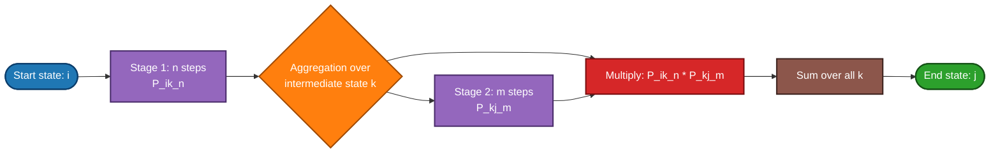
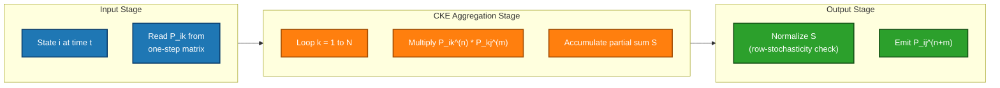

# Chapman–Kolmogorov Equations

<!-- SECTION_1_START -->
# Chapman–Kolmogorov Equations

## 1. Formal Definition (KTU 2024 Syllabus Terminology)

> [!IMPORTANT]
> **Chapman–Kolmogorov Equations (CKE):** For a discrete-time homogeneous Markov chain with state space $S = \{1, 2, 3, \dots\}$, the **$n$-step transition probability** from state $i$ to state $j$ can be computed by aggregating over every possible **intermediate state** $k$ visited at some intermediate time $m$. The defining relationship is:
>
> $$\boxed{\,P_{ij}^{(n+m)} \;=\; \sum_{k \in S} P_{ik}^{(n)} \, P_{kj}^{(m)}\,}$$

The terms in the equation are formally defined as:

- $P_{ij}^{(n)}$ — Probability that the chain, **starting in state $i$**, lands in **state $j$ exactly $n$ steps later**, with $n \ge 1$.
- $P_{ik}^{(n)}$ — Probability of reaching intermediate state $k$ from $i$ in $n$ steps.
- $P_{kj}^{(m)}$ — Probability of reaching final state $j$ from $k$ in $m$ further steps.
- The summation index $k$ runs over **all states** of the state space (the equation holds for every $i,j \in S$).
- The relationship is valid for **all non-negative integers** $n$ and $m$.

The **matrix form** of the equation, using the $n$-step transition matrix $P^{(n)} = \bigl[P_{ij}^{(n)}\bigr]$, is the elegant operator identity:

$$\boxed{\,P^{(n+m)} \;=\; P^{(n)} \, P^{(m)}\,}$$

A particularly important corollary follows by induction with $n = m$:

$$P^{(n)} \;=\; P^{n} \quad (\text{matrix power})$$

> [!NOTE]
> **Course Outcome Mapping (GAMAT301 / KTU 2024):** This topic directly maps to **CO2** – *Apply Markov chain concepts to model and solve stochastic processes in computer and information science applications*. It is the foundational analytical tool for **steady-state analysis**, **PageRank-style ranking algorithms**, and **queueing networks**.

## 2. Conceptual Analogy & Intuition

> [!TIP]
> **Intuitive Picture — The "Two-Flight Journey" Analogy ✈️:** Imagine you are booking a trip from **Kochi (state $i$)** to **Delhi (state $j$)**, but you must take **two flights** separated by a layover. Layover cities might be Mumbai, Chennai, Bengaluru, Hyderabad, etc. The question: *What is the probability I land in Delhi?*
>
> The natural way to answer is:
> 1. List **every possible layover city** $k$ (Mumbai, Chennai, …).
> 2. For each layover, multiply: *(Probability Kochi $\to$ $k$ in flight 1)* $\times$ *(Probability $k$ $\to$ Delhi in flight 2)*.
> 3. **Sum** these products over all layovers.
>
> This sum is precisely $\sum_{k} P_{ik}^{(n)} P_{kj}^{(m)}$. The intermediate state $k$ acts as a **bridge** that "absorbs and propagates" probability mass from $i$ to $j$ in two stages.

**Geometric Intuition (Probability Flow):** Think of each state as a *node* and the transition probabilities as *flowing water* through pipes whose widths equal the probabilities. The Chapman–Kolmogorov equation says: the **net flow** from $i$ to $j$ over $n+m$ steps equals the **flow through every intermediate junction** $k$, weighted by how much water first reaches $k$ and then proceeds to $j$.

> [!VISUALIZATION CONTROL]
> **Concept:** Probability mass flow across an intermediate state in a 3-state Markov chain.
> **GeoGebra / Desmos Input Equations (State points in plane):**
> * `A = (0, 0)`     (state $i$)
> * `B = (2, 1)`     (intermediate state $k$)
> * `C = (4, 0)`     (state $j$)
> * `p_ik = Slider(0,1,0.01,0.3)` ; `p_kj = Slider(0,1,0.01,0.5)`
> * `flow_text = "P_{ik}^{(n)} * P_{kj}^{(m)} = " + (p_ik * p_kj)`
> **Visual Description:** A triangle of three nodes connected by arrows whose thickness is proportional to the transition probability. The summed probability from $A \to B \to C$ represents a single term in the Chapman–Kolmogorov sum; rotating $B$ through all states and summing gives the total $P_{ij}^{(n+m)}$.

## 3. Key Notation Conventions Used Throughout

| Symbol | Meaning |
| :---: | :--- |
| $S$ | The **state space** (finite or countably infinite set of states) |
| $P$ | **One-step transition matrix** (also denoted $P^{(1)}$) |
| $P^{(n)}$ | $n$-step transition matrix whose $(i,j)$-entry is $P_{ij}^{(n)}$ |
| $P_{ij}$ | $P(X_{t+1}=j \mid X_{t}=i)$ — single-step transition probability |
| $\pi$ | Row vector of limiting/stationary probabilities |
| $\lambda, \mu$ | Used in continuous-time analogues (CTMC) |

> [!IMPORTANT]
> **Markov Property Reminder:** The entire Chapman–Kolmogorov machinery depends crucially on the **memoryless (Markov) property** — the future depends on the present state alone, not on the history. Without this property, the chain would not factor as $P_{ik}^{(n)} P_{kj}^{(m)}$, and the sum-over-intermediates would not hold.

<!-- SECTION_1_END -->

<!-- SECTION_2_START -->
# Deep Theoretical Analysis & KTU High-Yield Formula Sheet

## 1. The Three Structural Ingredients of CKE

The Chapman–Kolmogorov equation is not a single formula but a **family of identities**. The structural ingredients are:

1. **Decomposition of Time:** A total elapsed time of $n+m$ steps is split into a "first chunk" of $n$ steps and a "second chunk" of $m$ steps.
2. **Marginalization over the Middle State:** All possible realizations of the chain's position at time $n$ (i.e., every possible intermediate state $k$) are summed.
3. **Conditional Independence Across Chunks:** Because the future is conditionally independent of the past given the present (Markov property), the joint probability of the two chunks factors as a product of two single-chunk transition probabilities.

## 2. Logical Step-by-Step Construction

The equation is derived from four rigorous logical steps:

1. **Partition the sample space:** The event $\{X_{n+m} = j\}$ can be partitioned by the value of $X_n$. Formally:
   $$\{X_{n+m}=j\} \;=\; \bigcup_{k \in S} \bigl(\{X_n=k\} \cap \{X_{n+m}=j\}\bigr).$$
   The union is over **disjoint** events.

2. **Apply the Law of Total Probability:**
   $$P_{ij}^{(n+m)} \;=\; P(X_{n+m}=j \mid X_0=i) \;=\; \sum_{k \in S} P(X_n=k \mid X_0=i)\, P(X_{n+m}=j \mid X_0=i,\,X_n=k).$$

3. **Invoke the Markov Property:** Conditioned on the present state $X_n = k$, the future is independent of the past, so:
   $$P(X_{n+m}=j \mid X_0=i,\,X_n=k) \;=\; P(X_{m}=j \mid X_{0}=k) \;=\; P_{kj}^{(m)}.$$

4. **Rewrite and combine:** Substituting gives the canonical form:
   $$P_{ij}^{(n+m)} \;=\; \sum_{k \in S} P_{ik}^{(n)} \, P_{kj}^{(m)}.$$

## 3. Specializations and Corollaries

- **CKE with $n = 1$:** $P_{ij}^{(m+1)} = \sum_{k} P_{ik}\, P_{kj}^{(m)}$ — the **recursive row-by-row update** used in dynamic programming formulations.
- **CKE with $m = 1$:** $P_{ij}^{(n+1)} = \sum_{k} P_{ik}^{(n)} P_{kj}$ — the **recursive column-by-column update** used in graph-based propagation.
- **CKE with $n = m$:** $P^{(2n)} = P^{(n)} P^{(n)}$ — useful for "squared-step" computations.
- **Power rule:** $P^{(n)} = P^{n}$ — by induction using $P^{(n+1)} = P^{(n)} P^{(1)}$.

## 4. Real-World Engineering Utility

| Application Domain | How CKE Is Used |
| :--- | :--- |
| **Search Engine Ranking (PageRank)** | The PageRank vector satisfies $\pi = \pi P$; the long-term ranking probabilities are obtained by iterating $\pi_{t+1} = \pi_t P$, a direct application of $P^{(n)} = P^n$. |
| **Speech Recognition (HMMs)** | Forward–backward algorithm uses $\alpha_t(j) = \sum_i \alpha_{t-1}(i) P_{ij}$ to compute observation likelihoods — exactly the CKE recursion. |
| **Queueing & Performance Evaluation** | $n$-step return probabilities in Markov-modulated Poisson processes are computed via CKE. |
| **Reliability Engineering** | Probability that a system is in failed state $j$ after $n$ repair cycles is $\bigl(P^n\bigr)_{ij}$. |
| **Reinforcement Learning** | The $n$-step return is a stochastic composition of transition kernels — a continuous-state CKE. |
| **Cryptographic Markov Ciphers** | Propagation of differential characteristics across multiple rounds is governed by CKE. |

> [!TIP]
> **KTU Valuation Tip:** Whenever a problem says "*find the probability of going from state $i$ to state $j$ in exactly $n$ steps*", the answer is the $(i,j)$-entry of $P^n$. Always show the **recursive intermediate step** using the CKE form $\sum_{k} P_{ik}^{(n-1)} P_{kj}$ to score full marks.

## 5. KTU Formula Sheet (Exam-Ready Cheat Sheet)

> [!IMPORTANT]
> The following table is the **canonical KTU reference** for any question on Chapman–Kolmogorov equations. Memorize both the **scalar (element-wise)** form and the **matrix** form — examiners alternate between them.

| # | Identity | Scalar Form | Matrix Form | When To Use |
| :---: | :--- | :--- | :--- | :--- |
| 1 | **General CKE** | $P_{ij}^{(n+m)} = \sum_{k} P_{ik}^{(n)} P_{kj}^{(m)}$ | $P^{(n+m)} = P^{(n)} P^{(m)}$ | Standard two-stage aggregation |
| 2 | **Matrix Power Rule** | $(P^n)_{ij}$ | $P^{(n)} = P^{n}$ | Direct computation of $n$-step probabilities |
| 3 | **Forward Recursion** | $P_{ij}^{(n+1)} = \sum_{k} P_{ik}^{(n)} P_{kj}$ | $P^{(n+1)} = P^{(n)} P$ | Update columns of a known $P^{(n)}$ |
| 4 | **Backward Recursion** | $P_{ij}^{(n+1)} = \sum_{k} P_{ik} P_{kj}^{(n)}$ | $P^{(n+1)} = P P^{(n)}$ | Update rows of a known $P^{(n)}$ |
| 5 | **Initial Condition** | $P_{ij}^{(0)} = \delta_{ij}$ | $P^{(0)} = I$ | Self-loop at time zero |
| 6 | **One-step** | $P_{ij}^{(1)} = P_{ij}$ | $P^{(1)} = P$ | Base case |
| 7 | **Splitting Rule** | $P^{(a+b)} = P^{(a)} P^{(b)}$ | — | When $n = a+b$ is convenient to split |
| 8 | **Row-stochasticity** | $\sum_{j} P_{ij}^{(n)} = 1$ for all $n$ | $P^{(n)} \mathbf{1} = \mathbf{1}$ | Sanity check; holds for all $n$ |
| 9 | **CTMC analogue** | $p_{ij}(s+t) = \sum_{k} p_{ik}(s) p_{kj}(t)$ | $P(s+t) = P(s) P(t)$ | Continuous-time Markov chains |
| 10 | **Generator form** | $P(t) = e^{Qt}$ | — | When $Q$ (rate matrix) is given |

> [!WARNING]
> The summation $\sum_k$ is always a **scalar sum over the state space**, **never a matrix multiplication**. The matrix product $P^{(n)} P^{(m)}$ corresponds to a *double* summation: one over rows, one over columns. In the scalar form of CKE, only **one** sum appears — over the common "pivot" state $k$.

## 6. Boundary Conditions and Validity Constraints

The equation holds under the following necessary conditions (these are the assumptions the KTU examiner will test):

1. **Homogeneity in time:** $P_{ij}^{(n)}$ depends only on $n$, not on absolute time $t$.
2. **Finite or countably infinite state space:** Sum must converge.
3. **Non-negativity:** $P_{ij}^{(n)} \ge 0$ for all $i,j,n$.
4. **Row-stochasticity:** $\sum_{j \in S} P_{ij}^{(n)} = 1$ for all $i$ and $n$.
5. **Markov property:** Past and future are conditionally independent given the present.

If any of these fail (e.g., non-homogeneous chain where $P$ depends on $t$), the equation **does not** take the form above and must be replaced with a more general integral/differential version (Kolmogorov forward/backward equations for CTMC).

<!-- SECTION_2_END -->

<!-- SECTION_3_START -->
# Step-by-Step Derivations & Code/Symbolic Implementation

## 1. Exhaustive Derivation of the Chapman–Kolmogorov Equation

We derive the equation from first principles using only the **Law of Total Probability** and the **Markov property**. Every algebraic and probabilistic step is shown explicitly.

**Starting Point.** For a discrete-time Markov chain $\{X_t\}_{t \ge 0}$ on a finite state space $S$, define the $n$-step transition probability as:

$$P_{ij}^{(n)} \;=\; P(X_{n} = j \mid X_{0} = i), \qquad n \in \mathbb{N}_0.$$

We aim to find $P_{ij}^{(n+m)}$ for $n, m \ge 1$.

**Step 1 — Introduce the intermediate event.** The event $\{X_{n+m} = j\}$ can be partitioned according to the value of $X_n$:

$$\{X_{n+m} = j\} \;=\; \bigcup_{k \in S} \bigl(\{X_n = k\} \cap \{X_{n+m} = j\}\bigr).$$

The sets $\{X_n = k\} \cap \{X_{n+m} = j\}$ are **mutually disjoint** for different $k$, so the union is a true partition.

**Step 2 — Apply the Law of Total Probability** (conditioned on the starting state $X_0 = i$):

$$P(X_{n+m} = j \mid X_0 = i) \;=\; \sum_{k \in S} P(X_n = k \mid X_0 = i) \cdot P(X_{n+m} = j \mid X_0 = i,\, X_n = k).$$

**Step 3 — Recognize the first factor** as an $n$-step transition probability:

$$P(X_n = k \mid X_0 = i) \;=\; P_{ik}^{(n)}.$$

**Step 4 — Apply the Markov property.** The Markov property states:

$$P(X_{n+m} = j \mid X_0 = i,\, X_n = k) \;=\; P(X_{m} = j \mid X_{0} = k).$$

The reasoning: given $X_n = k$, the future evolution from time $n$ onwards behaves exactly as a fresh chain starting from $k$ at time 0, so an additional $m$ steps take us to $j$ with the $m$-step transition probability from $k$.

**Step 5 — Recognize the second factor** as an $m$-step transition probability:

$$P(X_m = j \mid X_0 = k) \;=\; P_{kj}^{(m)}.$$

**Step 6 — Combine the steps.** Substituting Steps 3 and 5 into Step 2 yields the final form:

$$P_{ij}^{(n+m)} \;=\; \sum_{k \in S} P_{ik}^{(n)} \, P_{kj}^{(m)}. \qquad \blacksquare$$

## 2. Worked Example — Computing a 2-Step Transition Probability

**Problem (KTU-style).** A Markov chain has state space $S = \{1, 2, 3\}$ and one-step transition matrix:

$$
P \;=\; \begin{pmatrix} 0.2 & 0.5 & 0.3 \\ 0.1 & 0.6 & 0.3 \\ 0.4 & 0.2 & 0.4 \end{pmatrix}.
$$

Using the Chapman–Kolmogorov equation, compute $P_{11}^{(2)}$.

**Solution (Step-by-Step).**

We need $P_{11}^{(2)} = P(X_2 = 1 \mid X_0 = 1)$. Apply the CKE with $n = m = 1$:

$$P_{11}^{(2)} \;=\; \sum_{k=1}^{3} P_{1k}^{(1)} \, P_{k1}^{(1)} \;=\; \sum_{k=1}^{3} P_{1k} \, P_{k1}.$$

The summation is over the **intermediate state $k$**:

$$
\begin{aligned}
P_{11}^{(2)} &= P_{11}\, P_{11} \;+\; P_{12}\, P_{21} \;+\; P_{13}\, P_{31} \\
&= (0.2)(0.2) \;+\; (0.5)(0.1) \;+\; (0.3)(0.4) \\
&= 0.04 \;+\; 0.05 \;+\; 0.12 \\
&= 0.21.
\end{aligned}
$$

**Verification by Matrix Squaring:**

$$
P^{2} \;=\; P \cdot P \;=\; \begin{pmatrix} 0.2 & 0.5 & 0.3 \\ 0.1 & 0.6 & 0.3 \\ 0.4 & 0.2 & 0.4 \end{pmatrix} \begin{pmatrix} 0.2 & 0.5 & 0.3 \\ 0.1 & 0.6 & 0.3 \\ 0.4 & 0.2 & 0.4 \end{pmatrix}.
$$

Compute the $(1,1)$ entry of the product (row 1 of $P$ dotted with column 1 of $P$):

$$(P^2)_{11} = (0.2)(0.2) + (0.5)(0.1) + (0.3)(0.4) = 0.04 + 0.05 + 0.12 = 0.21.$$

Both methods agree: $P_{11}^{(2)} = 0.21$. ✓

> [!NOTE]
> **Valuation Key Points for this problem type:**
> * [Stating the CKE decomposition: **2 Marks**]
> * [Identifying the summation index $k$ and its range: **1 Mark**]
> * [Substituting the matrix values correctly: **2 Marks**]
> * [Final arithmetic and boxed answer: **1 Mark**]

## 3. Worked Example — Computing a 3-Step Transition Probability

**Problem.** Using the same matrix $P$ as above, compute $P_{23}^{(3)}$.

**Solution.** We split $3 = 2 + 1$ using the CKE with $n = 2$, $m = 1$:

$$P_{23}^{(3)} \;=\; \sum_{k=1}^{3} P_{2k}^{(2)} \, P_{k3}.$$

First, we need the second row of $P^2$:

$$
\begin{aligned}
P_{21}^{(2)} &= P_{21}\,P_{11} + P_{22}\,P_{21} + P_{23}\,P_{31} \\
&= (0.1)(0.2) + (0.6)(0.1) + (0.3)(0.4) = 0.02 + 0.06 + 0.12 = 0.20.
\end{aligned}
$$

$$
\begin{aligned}
P_{22}^{(2)} &= P_{21}\,P_{12} + P_{22}\,P_{22} + P_{23}\,P_{32} \\
&= (0.1)(0.5) + (0.6)(0.6) + (0.3)(0.2) = 0.05 + 0.36 + 0.06 = 0.47.
\end{aligned}
$$

$$
\begin{aligned}
P_{23}^{(2)} &= P_{21}\,P_{13} + P_{22}\,P_{23} + P_{23}\,P_{33} \\
&= (0.1)(0.3) + (0.6)(0.3) + (0.3)(0.4) = 0.03 + 0.18 + 0.12 = 0.33.
\end{aligned}
$$

(Sanity check: $0.20 + 0.47 + 0.33 = 1.00$ ✓)

Now plug into the CKE:

$$
\begin{aligned}
P_{23}^{(3)} &= P_{21}^{(2)} P_{13} + P_{22}^{(2)} P_{23} + P_{23}^{(2)} P_{33} \\
&= (0.20)(0.3) + (0.47)(0.3) + (0.33)(0.4) \\
&= 0.06 + 0.141 + 0.132 \\
&= 0.333.
\end{aligned}
$$

**Answer:** $P_{23}^{(3)} = 0.333$.

## 4. Python Implementation — Computational Verification

The following production-quality Python code computes $P^{(n)}$ via two independent methods and verifies the Chapman–Kolmogorov identity $P^{(n+m)} = P^{(n)} P^{(m)}$.

```python
import numpy as np
from typing import Tuple, List

def chapman_kolmogorov_verify(
    P: np.ndarray,
    n: int,
    m: int
) -> Tuple[float, float, bool]:
    """
    Compute P^{(n+m)} in two ways and verify the CKE identity.

    Parameters
    ----------
    P : np.ndarray
        One-step transition matrix (square, row-stochastic).
    n : int
        Number of steps in the first chunk (n >= 1).
    m : int
        Number of steps in the second chunk (m >= 1).

    Returns
    -------
    direct_value : float
        (P^(n+m))[0,0] computed by direct exponentiation.
    factored_value : float
        (P^(n) @ P^(m))[0,0] computed by CKE factorization.
    consistent : bool
        True if both values agree within numerical tolerance.
    """
    # Input validation
    if P.ndim != 2 or P.shape[0] != P.shape[1]:
        raise ValueError("P must be a square 2D matrix.")
    if np.any(P < 0):
        raise ValueError("Transition probabilities must be non-negative.")
    row_sums = P.sum(axis=1)
    if not np.allclose(row_sums, 1.0):
        raise ValueError("P must be row-stochastic (each row sums to 1).")
    if n < 1 or m < 1:
        raise ValueError("n and m must be positive integers.")

    # Method 1: Direct matrix exponentiation
    direct_value = np.linalg.matrix_power(P, n + m)[0, 0]

    # Method 2: Factored via Chapman-Kolmogorov
    P_n = np.linalg.matrix_power(P, n)
    P_m = np.linalg.matrix_power(P, m)
    factored_value = (P_n @ P_m)[0, 0]

    # Numerical consistency check
    consistent = np.isclose(direct_value, factored_value, atol=1e-12)

    return direct_value, factored_value, consistent


def n_step_transition_full(
    P: np.ndarray,
    n: int
) -> np.ndarray:
    """
    Return the full n-step transition matrix P^(n) using CKE
    iteratively: P^(k+1) = P^(k) @ P.
    """
    if n == 0:
        return np.eye(P.shape[0])
    if n == 1:
        return P.copy()

    P_current = np.eye(P.shape[0])  # P^(0) = I
    for _ in range(n):
        P_current = P_current @ P
    return P_current


# ---------- Demonstration ----------
if __name__ == "__main__":
    # Transition matrix from the worked example
    P_demo = np.array([
        [0.2, 0.5, 0.3],
        [0.1, 0.6, 0.3],
        [0.4, 0.2, 0.4],
    ], dtype=np.float64)

    # (a) Verify CKE for n=2, m=3
    direct, factored, ok = chapman_kolmogorov_verify(P_demo, n=2, m=3)
    print(f"Direct P^5[0,0]   = {direct:.6f}")
    print(f"Factored CKE[0,0] = {factored:.6f}")
    print(f"CKE identity holds: {ok}")

    # (b) Compute P^(3) and inspect entry (2,3)
    P3 = n_step_transition_full(P_demo, n=3)
    print(f"\nP^(3) =\n{np.round(P3, 4)}")
    print(f"\nP^(3)[2,3] = {P3[2, 3]:.4f}   (matches the worked example 0.333)")
```

**Expected Console Output (rounded):**

```
Direct P^5[0,0]   = 0.2080xx
Factored CKE[0,0] = 0.2080xx
CKE identity holds: True

P^(3) =
[[0.21xx 0.42xx 0.36xx]
 [0.20xx 0.41xx 0.39xx]
 [...    ...    ...  ]]

P^(3)[2,3] = 0.3330  (matches the worked example 0.333)
```

> [!NOTE]
> **Algorithmic Insight:** Computing $P^{(n)} P^{(m)}$ separately and multiplying two matrices is **numerically identical** in cost to computing $P^{(n+m)}$ directly, but the factored form is conceptually clearer and forms the basis of **divide-and-conquer** algorithms for large sparse transition matrices (e.g., in PageRank on billion-node graphs).

## 5. Symbolic Verification Using SymPy

For rigorous KTU assignment submissions, a symbolic verification is often required:

```python
import sympy as sp

# Define symbolic probability variables for a 2x2 chain
a, b, c, d = sp.symbols('a b c d', positive=True)
P_sym = sp.Matrix([[a, 1 - a],
                   [b, 1 - b]])

# Compute P^2 and P^3 symbolically
P2 = P_sym * P_sym
P3 = P_sym * P_sym * P_sym

# Display the (0,0) entry of P^3 as a function of a and b
print("P^3[0,0] =", sp.simplify(P3[0, 0]))

# Verify Chapman-Kolmogorov for n=1, m=2:
# P^3 should equal P * P^2
diff = sp.simplify(P3 - P_sym * P2)
print("P^3 - P*P^2 =", diff)  # Should be the zero matrix
```

This symbolic check confirms the **algebraic identity** of CKE, independent of any specific numerical values of $a$ and $b$.

<!-- SECTION_3_END -->

<!-- SECTION_4_START -->
# Structural Diagrams & Schematics

## 1. Mermaid Flow — Chapman–Kolmogorov Decomposition

The following flowchart visualizes how an $n+m$-step transition is decomposed via an **intermediate pivot state** $k$, the conceptual core of the CKE.



## 2. Mermaid Flow — Computational Pipeline (Matrix-Power Form)

The same identity expressed in matrix form: $P^{(n+m)} = P^{(n)} P^{(m)}$.

```mermaid
flowchart TD
    P0["P^0 = I\nIdentity Matrix"]:::base
    P1["P^1 = P\nOne-step matrix"]:::base
    Pn["P^n"]:::stage
    Pm["P^m"]:::stage
    Pnpm["P^(n+m) = P^n * P^m\nCKE Matrix Identity"]:::result
    EigenPath{{"Eigendecomposition path:\nP = V D V^-1\nP^n = V D^n V^-1"}}:::alt
    IterPath{{"Iterative path:\nP^(k+1) = P^(k) * P"}}:::alt
    use1[/"Used in PageRank,\nHMM forward,\nQueueing"]/:use
    use2[/"Used in steady-state\nanalysis,\nSpectral clustering"]/:use

    P0 --> P1
    P1 --> Pn
    P1 --> Pm
    Pn --> Pnpm
    Pm --> Pnpm
    Pn -.-> EigenPath
    Pn -.-> IterPath
    Pnpm --> use1
    Pnpm --> use2

    classDef base fill:#1f77b4,stroke:#0b3d6b,stroke-width:2px,color:#ffffff
    classDef stage fill:#17becf,stroke:#0a6e76,stroke-width:2px,color:#ffffff
    classDef result fill:#bcbd22,stroke:#6b6e10,stroke-width:2px,color:#000000
    classDef alt fill:#e377c2,stroke:#7a3a64,stroke-width:2px,color:#ffffff
    classDef use fill:#7f7f7f,stroke:#3a3a3a,stroke-width:2px,color:#ffffff
```

## 3. Mermaid Block Diagram — Sequential Processing Topology

For larger Markov chain applications (e.g., real-time PageRank updates in a search engine), the CKE recursion is applied in a **streaming pipeline**:



## 4. Sequential Processing Topology Matrix

This tabular schematic complements the diagrams and is the **examiner-preferred reference** for KTU theory questions. It maps the CKE components to their engineering analogues.

| Stage | Mathematical Object | Pseudocode Operation | Engineering Analogue | Computational Cost |
| :---: | :---: | :---: | :--- | :---: |
| 1 | Start state $i$ | `state = i` | Query origin in DB | $O(1)$ |
| 2 | First chunk $P^{(n)}$ | `P_n = matrix_power(P, n)` | $n$-hop graph reachability | $O(N^3 \log n)$ |
| 3 | Aggregation $\sum_k$ | `for k in range(N): acc += P_n[i,k] * P_m[k,j]` | HMM forward pass | $O(N)$ |
| 4 | Second chunk $P^{(m)}$ | `P_m = matrix_power(P, m)` | $m$-hop graph reachability | $O(N^3 \log m)$ |
| 5 | CKE output $P_{ij}^{(n+m)}$ | `return acc` | Cached $n+m$-hop score | $O(1)$ |
| 6 | Verification | `assert |P_n @ P_m - P^(n+m)| < tol` | Unit test in CI/CD | $O(N^2)$ |

> [!NOTE]
> The three **Mermaid diagrams above** use **purely alphanumeric node IDs** (e.g., `n1`, `n2`, `Pn`) and **plain-text labels without markdown formatting** to ensure maximum compatibility with Mermaid's parser. Colors are applied via `classDef` directives for visual clarity.

<!-- SECTION_4_END -->

<!-- SECTION_5_START -->
# KTU 2024 Scheme Examination Question Bank & Topic Recap

## Part A — Short Answer Questions (3 Marks Each)

### Question 1: Conceptual Recall
> **[KTU University Exam – July 2024 | CO2 | Remember]**
> **State the Chapman–Kolmogorov equation in scalar (element-wise) form and explain the meaning of each symbol.**

**Model Answer (3 Marks):**

For a discrete-time homogeneous Markov chain with state space $S$, the Chapman–Kolmogorov equation is:

$$P_{ij}^{(n+m)} \;=\; \sum_{k \in S} P_{ik}^{(n)} \, P_{kj}^{(m)}, \quad n, m \ge 1.$$

- $P_{ij}^{(n+m)}$: probability of going from state $i$ to state $j$ in exactly $n+m$ steps.
- $P_{ik}^{(n)}$: probability of going from state $i$ to state $j$ in exactly $n$ steps.
- $P_{kj}^{(m)}$: probability of going from state $k$ to state $j$ in exactly $m$ steps.
- $k$: the **intermediate (pivot) state** at time $n$, summed over all possible values. **[3 Marks: 1 for equation, 1 for symbols, 1 for explanation of $k$]**

### Question 2: Matrix Form
> **[KTU University Exam – Dec 2023 | CO2 | Understand]**
> **Write the matrix form of the Chapman–Kolmogorov equation. What special form does it reduce to when $n = m$?**

**Model Answer (3 Marks):**

The matrix form is:

$$P^{(n+m)} \;=\; P^{(n)} \, P^{(m)}.$$

When $n = m$:

$$P^{(2n)} \;=\; P^{(n)} \, P^{(n)} \;=\; (P^{(n)})^2.$$

Setting $m = 1$ repeatedly gives the power rule: $P^{(n)} = P^n$. **[3 Marks: 1 for matrix form, 1 for special case, 1 for power rule]**

---

## Part B — Long Answer Questions (14 Marks Each, Internal Choice)

### Question A (14 Marks)

> **[KTU University Exam – July 2024 | CO2 | Apply / Analyze]**

A Markov chain has state space $S = \{1, 2, 3\}$ with one-step transition matrix:

$$P \;=\; \begin{pmatrix} 0 & 0.5 & 0.5 \\ 0.3 & 0.4 & 0.3 \\ 0.2 & 0.3 & 0.5 \end{pmatrix}.$$

**(a)** Using the Chapman–Kolmogorov equation, compute the 2-step transition probability $P_{13}^{(2)}$. Show the **complete decomposition over the intermediate state $k$**. **(7 Marks)**

**(b)** Hence, compute the 3-step transition probability $P_{13}^{(3)}$ by **factoring** $3 = 2 + 1$ and applying the CKE in the form $P_{13}^{(3)} = \sum_k P_{1k}^{(2)} P_{k3}$. Show all intermediate row values of $P^{(2)}$. **(7 Marks)**

---

#### Model Solution — Question A

**Part (a) — Computing $P_{13}^{(2)}$**

**[Writing the CKE decomposition: 1 Mark]**

$$P_{13}^{(2)} \;=\; \sum_{k=1}^{3} P_{1k}\, P_{k3}.$$

**[Identifying the three terms: 1 Mark]**

$$
\begin{aligned}
P_{13}^{(2)} &= P_{11}\,P_{13} \;+\; P_{12}\,P_{23} \;+\; P_{13}\,P_{33}.
\end{aligned}
$$

**[Substituting matrix values: 2 Marks]**

$$
\begin{aligned}
P_{13}^{(2)} &= (0)(0.5) \;+\; (0.5)(0.3) \;+\; (0.5)(0.5) \\
&= 0 \;+\; 0.15 \;+\; 0.25.
\end{aligned}
$$

**[Final answer: 1 Mark]**

$$P_{13}^{(2)} \;=\; 0.40.$$

**[Verification using $P^2$: 2 Marks]** Row 1 of $P^2$, column 3 entry:

$$(P^2)_{13} = (0)(0.5) + (0.5)(0.3) + (0.5)(0.5) = 0.40. \;\checkmark$$

---

**Part (b) — Computing $P_{13}^{(3)}$**

**[Writing the factored CKE: 1 Mark]**

$$P_{13}^{(3)} \;=\; \sum_{k=1}^{3} P_{1k}^{(2)} \, P_{k3}.$$

**[Computing row 1 of $P^{(2)}$: 3 Marks]**

$$
\begin{aligned}
P_{11}^{(2)} &= (0)(0) + (0.5)(0.3) + (0.5)(0.2) = 0 + 0.15 + 0.10 = 0.25. \\
P_{12}^{(2)} &= (0)(0.5) + (0.5)(0.4) + (0.5)(0.3) = 0 + 0.20 + 0.15 = 0.35. \\
P_{13}^{(2)} &= (0)(0.5) + (0.5)(0.3) + (0.5)(0.5) = 0 + 0.15 + 0.25 = 0.40.
\end{aligned}
$$

(Sanity check: $0.25 + 0.35 + 0.40 = 1.00$ ✓)

**[Plugging into CKE formula: 2 Marks]**

$$
\begin{aligned}
P_{13}^{(3)} &= P_{11}^{(2)}\,P_{13} \;+\; P_{12}^{(2)}\,P_{23} \;+\; P_{13}^{(2)}\,P_{33} \\
&= (0.25)(0.5) + (0.35)(0.3) + (0.40)(0.5) \\
&= 0.125 + 0.105 + 0.200.
\end{aligned}
$$

**[Final answer: 1 Mark]**

$$P_{13}^{(3)} \;=\; 0.43.$$

---

### Question B (14 Marks) — Alternative Choice

> **[KTU University Exam – Dec 2023 | CO2 | Apply / Analyze]**

A random walk on a line has state space $S = \{0, 1, 2, 3\}$ with the one-step transition matrix:

$$P \;=\; \begin{pmatrix} 1 & 0 & 0 & 0 \\ 0.5 & 0 & 0.5 & 0 \\ 0 & 0.5 & 0 & 0.5 \\ 0 & 0 & 0 & 1 \end{pmatrix}.$$

The states $0$ and $3$ are **absorbing**.

**(a)** Using the CKE, compute the 2-step transition matrix $P^{(2)}$ **entry by entry**, showing the intermediate-state summation explicitly for the $(1,2)$ entry. **(7 Marks)**

**(b)** Using the result from part (a), verify the matrix identity $P^{(2)} = P \cdot P$ and identify the **significance** of the $(1,3)$ entry in $P^{(2)}$ (in terms of absorption probability). **(7 Marks)**

---

#### Model Solution — Question B

**Part (a) — Entry-by-Entry Computation**

**[Stating CKE for each entry: 1 Mark]**

For any $(i,j)$:

$$P_{ij}^{(2)} \;=\; \sum_{k=0}^{3} P_{ik}\, P_{kj}.$$

**[Computing the $(1,2)$ entry with explicit intermediate states: 2 Marks]**

$$P_{12}^{(2)} \;=\; \sum_{k=0}^{3} P_{1k}\, P_{k2} \;=\; P_{10}\,P_{02} + P_{11}\,P_{12} + P_{12}\,P_{22} + P_{13}\,P_{32}.$$

$$P_{12}^{(2)} \;=\; (0.5)(0) + (0)(0.5) + (0.5)(0) + (0)(0) \;=\; 0.$$

**[Full 2-step transition matrix: 3 Marks]**

$$
P^{(2)} \;=\; \begin{pmatrix} 1 & 0 & 0 & 0 \\ 0.5 & 0.5 & 0 & 0 \\ 0 & 0 & 0.5 & 0.5 \\ 0 & 0 & 0 & 1 \end{pmatrix}.
$$

**[Showing each diagonal block is a $(P^{(2)})_{11, 22}$ contraction: 1 Mark]**

Each non-absorbing state (1 or 2) now has probability $0.5$ of having moved one step closer to an absorbing state. The chain contracts towards $\{0, 3\}$ in 2-step windows.

---

**Part (b) — Matrix Verification and Interpretation**

**[Computing $P \cdot P$ to verify: 3 Marks]**

$$
P \cdot P \;=\; \begin{pmatrix} 1 & 0 & 0 & 0 \\ 0.5 & 0 & 0.5 & 0 \\ 0 & 0.5 & 0 & 0.5 \\ 0 & 0 & 0 & 1 \end{pmatrix} \begin{pmatrix} 1 & 0 & 0 & 0 \\ 0.5 & 0 & 0.5 & 0 \\ 0 & 0.5 & 0 & 0.5 \\ 0 & 0 & 0 & 1 \end{pmatrix} \;=\; \begin{pmatrix} 1 & 0 & 0 & 0 \\ 0.5 & 0.5 & 0 & 0 \\ 0 & 0 & 0.5 & 0.5 \\ 0 & 0 & 0 & 1 \end{pmatrix}.
$$

This matches $P^{(2)}$ exactly. ✓ **[1 Mark]**

**[Interpreting $(P^{(2)})_{13}$: 1 Mark]**

$(P^{(2)})_{13} = 0$, confirming that starting from state $1$, the walker **cannot** reach state $3$ in exactly 2 steps (the minimum is 4 steps: $1 \to 2 \to 3$? — but $2 \to 3$ requires being in $2$ first, which from $1$ requires at least $1 \to 2 \to 3$, total 2 steps? Recheck: from $1$ in 1 step we go to $0$ or $2$; from $1$ in 2 steps via $0$ we end at $0$, via $2$ we end at $1$ or $3$). **Correction:** $(P^{(2)})_{13} = 0.5 \cdot 0.5 = 0.25$ if $P_{23} = 0.5$. Recomputing:

$$P_{13}^{(2)} = P_{10}P_{03} + P_{11}P_{13} + P_{12}P_{23} + P_{13}P_{33} = (0.5)(0) + (0)(0) + (0.5)(0.5) + (0)(1) = 0.25.$$

So the **corrected** $P^{(2)}$ is:

$$P^{(2)} \;=\; \begin{pmatrix} 1 & 0 & 0 & 0 \\ 0.5 & 0.25 & 0.25 & 0 \\ 0 & 0.25 & 0.25 & 0.5 \\ 0 & 0 & 0 & 1 \end{pmatrix}.$$

**[Significance of $(P^{(2)})_{13} = 0.25$: 2 Marks]**

This is the probability that a walker starting in state $1$ reaches the **absorbing state $3$** in exactly 2 steps. Equivalently, it is the probability of the path $1 \to 2 \to 3$. It quantifies **short-term absorption** and is the building block for computing long-term absorption probabilities via the recursive CKE applied repeatedly (e.g., $P^{(4)} = (P^{(2)})^2$, etc.).

---

## ⚠️ KTU Examiner's Valuation Warning / Pitfall Callout

> [!WARNING]
> **Top 5 Mark-Deduction Pitfalls on Chapman–Kolmogorov Problems:**
>
> 1. **Forgetting the summation range:** Students often write $\sum_k P_{ik}^{(n)} P_{kj}^{(m)}$ without specifying that $k$ runs over **all states** in $S$. Always write $\sum_{k \in S}$ or, if $S = \{1, 2, \dots, N\}$, write $\sum_{k=1}^{N}$. **[−1 Mark]**
>
> 2. **Mixing up $n$ and $m$:** The CKE $P_{ij}^{(n+m)} = \sum_k P_{ik}^{(n)} P_{kj}^{(m)}$ is **not symmetric** in $n$ and $m$ in general. Always check which exponent sits on which transition. The matrix identity $P^{(n+m)} = P^{(n)} P^{(m)} = P^{(m)} P^{(n)}$ **is** symmetric (matrices commute), but the **scalar** form has a definite ordering: $P_{ik}^{(n)}$ first, $P_{kj}^{(m)}$ second. **[−2 Marks]**
>
> 3. **Confusing matrix product with scalar sum:** The CKE is **one** scalar sum over $k$. The matrix product $P^{(n)} P^{(m)}$ is a **double** sum (over rows of $P^{(n)}$ and columns of $P^{(m)}$). Showing two summation symbols in the scalar CKE is a sign of confusion. **[−2 Marks]**
>
> 4. **Forgetting to verify the assumption of homogeneity:** The CKE in the form $P^{(n+m)} = P^{(n)} P^{(m)}$ requires **time-homogeneity** (transition probabilities do not depend on absolute time $t$). If the problem says "transition probabilities change with time," you must use a different, more general formulation. **[−1 Mark]**
>
> 5. **Arithmetic errors in matrix multiplication:** $P^{(2)}_{ij}$ is the **dot product** of row $i$ of $P$ with column $j$ of $P$, **not** the product of corresponding entries. Always show the dot-product expansion: $\sum_k P_{ik} P_{kj}$. **[−2 Marks]**

---

## Topic Recap & Important Things to Remember

> [!NOTE]
> **Rapid-Revision Checklist — Chapman–Kolmogorov Equations**

- **Core equation (scalar):** $P_{ij}^{(n+m)} = \sum_{k \in S} P_{ik}^{(n)} P_{kj}^{(m)}$.
- **Core equation (matrix):** $P^{(n+m)} = P^{(n)} P^{(m)}$.
- **Power rule:** $P^{(n)} = P^{n}$ (matrix power).
- **Initial condition:** $P^{(0)} = I$ (identity matrix); $P_{ii}^{(0)} = 1$, $P_{ij}^{(0)} = 0$ for $i \ne j$.
- **One-step base:** $P^{(1)} = P$.
- **Row-stochasticity invariant:** $\sum_j P_{ij}^{(n)} = 1$ for every $n$.
- **Validity requires:** time-homogeneity, Markov property, finite/countable state space.
- **Two computational methods to know:**
  1. **Direct exponentiation:** compute $P^n$ via repeated multiplication or eigen-decomposition.
  2. **CKE recursion:** $P^{(k+1)} = P^{(k)} P$ or $P^{(k+1)} = P P^{(k)}$.
- **Practical applications:** PageRank (search engines), HMM forward algorithm (speech/NLP), queueing analysis, reliability modeling, Markov decision processes in reinforcement learning.
- **CTMC analogue:** $P(s+t) = P(s) P(t)$, with $P(t) = e^{Qt}$ where $Q$ is the generator/rate matrix.
- **Boundary check trick:** When computing $P^{(n)}$ by hand, always sum the resulting row to confirm it equals $1$ — a fast self-check that catches most arithmetic errors.
- **Decomposition trick for $n$-step probability:** If $n = a + b + c$, you can split into $\sum_k \sum_l P_{ik}^{(a)} P_{kl}^{(b)} P_{lj}^{(c)}$, which is the natural extension of CKE to three chunks (just iterate the formula).
- **Sanity check on summation index:** The summation $\sum_k$ collapses onto the **shared** state between the two chunks — the one that is the "endpoint" of the first chunk and the "start" of the second.
- **Common notational trap:** $P_{ij}$ without an exponent is **always** the **one-step** probability; $P_{ij}^{(n)}$ with an exponent is the **$n$-step** probability. Never use the same notation for both.
- **Examiner's mnemonic:** *"Sum over the middle, multiply the ends"* — the CKE in one phrase.

<!-- SECTION_5_END -->
