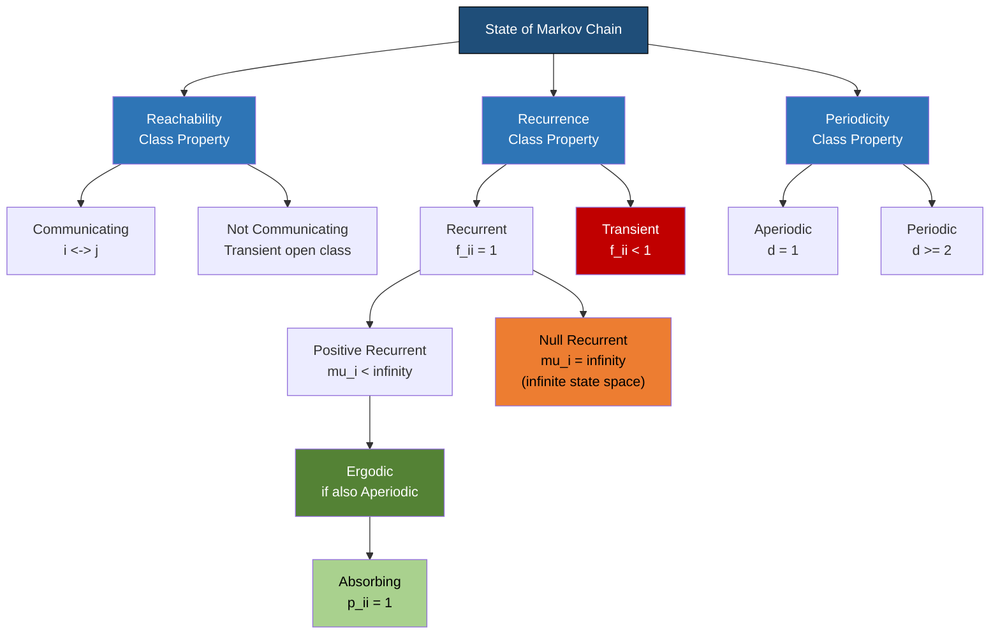
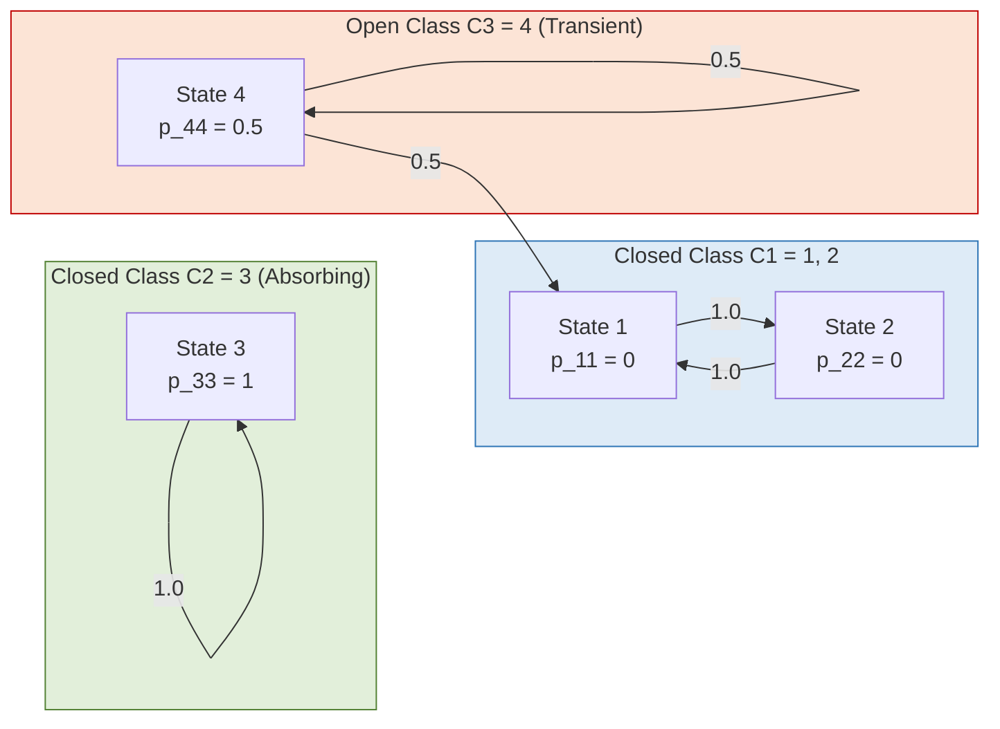
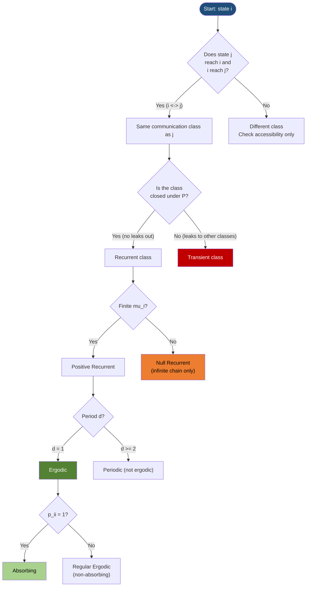

# Classification of States

<!-- SECTION_1_START -->
# Classification of States in Markov Chains

## 1.1 Formal Definition

In the study of **Markov chains** (a stochastic process $X_0, X_1, X_2, \ldots$ satisfying the **Markov property** $P(X_{n+1} = j \mid X_n = i, X_{n-1}, \ldots, X_0) = P(X_{n+1} = j \mid X_n = i) = p_{ij}$), the **classification of states** is the systematic categorization of every state $i$ in the state space $S$ according to its **long-run behavior**, **reachability**, and **return characteristics**.

A state $i$ is classified along **three independent dimensions**:

> [!IMPORTANT]
> **The Three Classification Dimensions of a State**
> 1. **Reachability class** — whether states communicate or not (Communicating / Transient / Absorbing)
> 2. **Recurrence type** — how often the chain returns (Recurrent / Transient, and within recurrent: Positive / Null)
> 3. **Periodicity** — the spacing pattern of returns (Periodic with period $d$ / Aperiodic with $d = 1$)

A state that is simultaneously **positive recurrent** and **aperiodic** is called an **ergodic state**, and an irreducible chain consisting only of ergodic states is called an **ergodic Markov chain** — the most important class in computer science (used in MCMC, PageRank, HMMs, queueing theory, and reinforcement learning).

## 1.2 Conceptual Analogy — The City Map of One-Way Streets

> [!NOTE]
> **Intuition: Cities and One-Way Streets**
> Imagine a country whose cities (the states) are connected by **one-way streets** (the transition probabilities $p_{ij}$). Each city is assigned a "score" based on three questions:
>
> - **Reachability:** *Can I walk from city A to city B following the direction of the streets?* If both ways are possible, the two cities "communicate" — they belong to the same club.
> - **Return Home:** *If I leave a city, what is the chance I ever come back?* If the answer is "with probability 1" → **recurrent** (the city pulls you back like a magnet). If "less than 1" → **transient** (you may escape and never return).
> - **Time Pattern of Returns:** *If I do return, is the return-time always odd? always a multiple of 3?* If returns only happen on certain days → **periodic**. If on any day → **aperiodic**.

Cities belonging to the same "club" (communication class) share the **same period** and the **same recurrence type** — this is a key theorem called the **class property of periodicity and recurrence**.

The three-dimensional classification produces the following canonical taxonomy:

| Dimension | Possible Values |
| :--- | :--- |
| Reachability | **Isolated, Communicating, Absorbing** |
| Recurrence | **Transient, Positive Recurrent, Null Recurrent** |
| Periodicity | **Aperiodic ($d = 1$), Periodic ($d \geq 2$)** |

> [!VISUALIZATION CONTROL]
> **Concept:** Transition graph of a Markov chain — visualizing reachability and communication
> **GeoGebra / Desmos Input:**
> * Plot a directed graph manually: vertices $\{1, 2, 3, 4\}$, directed edges $1 \to 2$, $2 \to 1$, $2 \to 3$, $3 \to 3$ (self-loop), $4 \to 1$
> * `g(x) = 0` (reference axis)
> **Visual Description:** Two separate "islands" should be visible. The first island $\{1, 2, 3\}$ is a connected communication class (a closed club). Vertex 4 is a "transient" island that can send traffic to vertex 1 but receives nothing back — so vertex 4 will eventually be left empty in the long run.

---

## 1.3 Standard Metrics and Constants

> [!IMPORTANT]
> **Standard Symbols Used Throughout This Note**
>
> - $p_{ij}^{(n)} = P(X_n = j \mid X_0 = i)$ — the **$n$-step transition probability** (computed via $\mathbf{P}^n$)
> - $f_{ij}^{(n)} = P(X_n = j, X_k \neq j \text{ for } 1 \leq k < n \mid X_0 = i)$ — the **first-passage probability** at step $n$
> - $f_{ii} = \sum_{n=1}^{\infty} f_{ii}^{(n)}$ — the **recurrence probability** (return to $i$ at some time $\geq 1$)
> - $\mu_i = \sum_{n=1}^{\infty} n \cdot f_{ii}^{(n)}$ — the **mean recurrence time** (expected return time)
> - $d(i) = \gcd\{n \geq 1 : p_{ii}^{(n)} > 0\}$ — the **period** of state $i$
> - The symbol $\mathbb{E}[\cdot]$ denotes mathematical expectation; the symbol $\mathbb{Z}^+$ denotes positive integers $\{1, 2, 3, \ldots\}$.

<!-- SECTION_1_END -->

<!-- SECTION_2_START -->
# Deep Theoretical Analysis & KTU High-Yield Formula Sheet

## 2.1 The Communication Relation

The foundation of state classification is the **communication relation** $\leftrightarrow$, defined as:

$$i \leftrightarrow j \iff i \rightarrow j \text{ and } j \rightarrow i$$

where $i \rightarrow j$ means "$j$ is **accessible** from $i$", i.e., $\exists \, n \geq 0$ such that $p_{ij}^{(n)} > 0$.

The relation $\leftrightarrow$ is an **equivalence relation** (it is reflexive, symmetric, and transitive). Therefore, the state space $S$ is partitioned into disjoint **communication classes** (also called **recurrent classes** or **ergodic classes**):

$$S = C_1 \cup C_2 \cup \cdots \cup C_k, \quad C_m \cap C_\ell = \emptyset \text{ for } m \neq \ell$$

A Markov chain is called **irreducible** if it has exactly **one** communication class ($k = 1$), i.e., every state is reachable from every other state.

> [!IMPORTANT]
> **Closure Property of a Communication Class**
> Once the chain enters a class $C$, it can never leave $C$. Mathematically, if $i \in C$ and $p_{ij} > 0$, then $j \in C$. This is what makes each class a "closed world" in the long-run dynamics.

## 2.2 Recurrent vs Transient States

A state $i$ is classified by examining the **recurrence probability**:

$$f_{ii} = \sum_{n=1}^{\infty} f_{ii}^{(n)} = P(\text{chain ever returns to } i \mid X_0 = i)$$

The rigorous definition:

- **Recurrent state:** $f_{ii} = 1$ (return is certain). Then $\sum_{n=1}^{\infty} p_{ii}^{(n)} = \infty$.
- **Transient state:** $f_{ii} < 1$ (positive probability of never returning). Then $\sum_{n=1}^{\infty} p_{ii}^{(n)} < \infty$.

Among recurrent states, the **mean recurrence time** $\mu_i$ further classifies them:

- **Positive recurrent:** $\mu_i < \infty$ (expected return time is finite).
- **Null recurrent:** $\mu_i = \infty$ (expected return time is infinite; can only occur in **countably infinite** state spaces).

> [!NOTE]
> **Fundamental Theorem of Recurrent Classes**
> A state is recurrent if and only if $\displaystyle\sum_{n=0}^{\infty} p_{ii}^{(n)} = \infty$.
> A state is transient if and only if $\displaystyle\sum_{n=0}^{\infty} p_{ii}^{(n)} < \infty$, and the probability of never returning equals $\dfrac{1}{1 + \sum_{n=1}^{\infty} p_{ii}^{(n)}}$.

## 2.3 Periodicity of States

The **period** of a state $i$ captures the rhythmic pattern with which the chain returns to $i$:

$$d(i) = \gcd\{n \in \mathbb{Z}^+ : p_{ii}^{(n)} > 0\}$$

Classification by period:

- **Aperiodic:** $d(i) = 1$ (returns possible at every time step eventually)
- **Periodic (with period $d$):** $d(i) \geq 2$ (returns only possible at multiples of $d$)
- **Aperiodic (trivially):** $p_{ii} > 0$ (a self-loop alone guarantees $d = 1$)

## 2.4 Absorbing States and Ergodic States

Two special designations complete the taxonomy:

- **Absorbing state:** $p_{ii} = 1$ and $p_{ij} = 0$ for all $j \neq i$. Once entered, the chain stays forever. (Trivially recurrent with $d = 1$.)
- **Ergodic state:** A state that is both **positive recurrent** and **aperiodic**. An irreducible chain is **ergodic** if all its states are ergodic.

## 2.5 KTU High-Yield Formula Sheet

> [!IMPORTANT]
> **Master Formula Table for KTU 2024 Exam (Module 4: Markov Chains)**

| **Concept** | **Formula / Condition** | **Notes** |
| :--- | :--- | :--- |
| Accessibility | $i \to j \iff \exists n \geq 0: p_{ij}^{(n)} > 0$ | Found via $\mathbf{P}^n$ powers |
| Communication | $i \leftrightarrow j \iff i \to j$ AND $j \to i$ | Equivalence relation |
| Recurrence test | $\sum_{n=1}^{\infty} p_{ii}^{(n)} = \infty$ | State is recurrent |
| Transience test | $\sum_{n=1}^{\infty} p_{ii}^{(n)} < \infty$ | State is transient |
| Mean recurrence time | $\mu_i = \sum_{n=1}^{\infty} n \cdot f_{ii}^{(n)}$ | Positive recurrent $\iff \mu_i < \infty$ |
| Return probability | $f_{ii} = 1 / \mu_i$ for recurrent $i$ | Null recurrent: $f_{ii} = 1$ but $\mu_i = \infty$ |
| Period | $d(i) = \gcd\{n \geq 1 : p_{ii}^{(n)} > 0\}$ | $\gcd$ of return-step set |
| Aperiodicity | $d(i) = 1$ | Self-loop forces $d(i) = 1$ |
| Absorbing | $p_{ii} = 1,\; p_{ij} = 0, j \neq i$ | Always recurrent, $d = 1$ |
| Ergodic | Positive recurrent AND Aperiodic | Steady-state $\pi$ exists uniquely |
| Steady-state equation | $\pi \mathbf{P} = \pi,\; \sum_i \pi_i = 1$ | Unique solution iff chain is ergodic |
| Class property — Recurrence | All states in a class share recurrence type | Cannot mix transient/recurrent in one class |
| Class property — Period | All states in a class share the same period $d$ | $d(i) = d(j)$ for $i \leftrightarrow j$ |
| Finite chain theorem | Every state in a finite irreducible chain is positive recurrent | $f_{ii} = 1$ and $\mu_i < \infty$ |
| Invariant measure | $\nu_j = \sum_i \nu_i p_{ij}$, normalized by $\sum_j \nu_j$ | Gives stationary distribution |

> **Warning:** Use `\vert` or `\mid` in LaTeX for absolute values inside tables to prevent markdown breakage. For example, write $\vert x \vert$ instead of $\vert x \vert$ (raw pipes).

## 2.6 Real-World Engineering Utility

State classification is the **first diagnostic step** in any Markov Chain Monte Carlo (MCMC) simulation, queuing network, or hidden Markov model. In production:

- **Google PageRank:** The web-graph Markov chain must be classified as **irreducible and aperiodic** before the dominant eigenvector (steady-state) is computed. If the chain has transient or periodic states, PageRank diverges.
- **Reliability Engineering:** Absorbing Markov chains model system failure — the probability of being absorbed in the "failure" state gives the unreliability.
- **Speech Recognition (HMMs):** Each phoneme's hidden states must be ergodic so the Viterbi algorithm converges.
- **Network Protocols:** A TCP/queueing model is analyzed to confirm **positive recurrence** (bounded queue length) — otherwise the server is unstable.

<!-- SECTION_2_END -->

<!-- SECTION_3_START -->
# Step-by-Step Derivations and Worked Examples

## 3.1 Worked Example A — Classify All States of a 4-State Chain

**Problem.** Consider the Markov chain with state space $S = \{1, 2, 3, 4\}$ and transition matrix:

$$\mathbf{P} = \begin{pmatrix} 0 & 1 & 0 & 0 \\ 1 & 0 & 0 & 0 \\ 0 & 0 & 1 & 0 \\ \tfrac{1}{2} & 0 & 0 & \tfrac{1}{2} \end{pmatrix}$$

**Step 1 — Draw the transition graph.**

From each state, the nonzero entries of $\mathbf{P}$ give the outgoing arrows:

- $1 \to 2$ with probability $1$
- $2 \to 1$ with probability $1$
- $3 \to 3$ with probability $1$ (self-loop)
- $4 \to 1$ with probability $\tfrac{1}{2}$ and $4 \to 4$ with probability $\tfrac{1}{2}$

**Step 2 — Identify communication classes.**

- States $1$ and $2$: $1 \to 2$ (one step) and $2 \to 1$ (one step), so $1 \leftrightarrow 2$. They form class $C_1 = \{1, 2\}$.
- State $3$: $3 \to 3$, so $3 \leftrightarrow 3$ alone. Class $C_2 = \{3\}$.
- State $4$: $4 \to 1$ (leaves to $1$), but no state returns to $4$ (no incoming arrows). So $4$ does not communicate with any other state. Class $C_3 = \{4\}$.

Total: **3 communication classes**: $C_1 = \{1, 2\}$, $C_2 = \{3\}$, $C_3 = \{4\}$.

**Step 3 — Check closure (no inter-class transitions).**

Examining each class, every transition from a state in $C_1$ stays in $C_1$. From $C_2$, the only transition $3 \to 3$ stays in $C_2$. From $C_3$, transitions are $4 \to 1 \in C_1$ and $4 \to 4 \in C_3$ — but a class does not need to be closed unless it is the destination of other classes. Here, classes $C_1$ and $C_2$ are **closed** (recurrent classes), while $C_3 = \{4\}$ is **not closed** (it leaks to $C_1$).

**Step 4 — Classify each state by recurrence.**

- **State 3** is absorbing ($p_{33} = 1$) → trivially **recurrent** (positive recurrent since $\mu_3 = 1$).
- **States 1 and 2** alternate forever: $1 \to 2 \to 1 \to 2 \to \ldots$. Return probability $f_{11} = 1$, mean recurrence time $\mu_1 = 2$ (must take 2 steps). So states 1 and 2 are **positive recurrent** (finite chain, closed class).
- **State 4** is in an open class (leaks to $C_1$). $f_{44} = p_{44} = \tfrac{1}{2}$, and $\sum_{n=0}^{\infty} p_{44}^{(n)} = \sum_{n=0}^{\infty} (\tfrac{1}{2})^n = 2 < \infty$. So state 4 is **transient**.

**Step 5 — Classify each state by period.**

- $p_{33}^{(1)} = 1 > 0$, so $d(3) = 1$ → **aperiodic** (self-loop guarantees this).
- For state $1$: $p_{11}^{(1)} = 0$, $p_{11}^{(2)} = 1$ (via $1 \to 2 \to 1$). The set of return times is $\{2, 4, 6, \ldots\}$, so $d(1) = \gcd(2, 4, 6, \ldots) = 2$ → **periodic with period 2**.
- By the class property of period, $d(2) = 2$ as well.
- For state 4: $p_{44}^{(1)} = \tfrac{1}{2} > 0$, so $d(4) = 1$ → **aperiodic**.

**Final classification table:**

| State | Communication Class | Recurrence | Period | Special |
| :---: | :---: | :---: | :---: | :--- |
| 1 | $\{1, 2\}$ | Positive recurrent | 2 | Periodic |
| 2 | $\{1, 2\}$ | Positive recurrent | 2 | Periodic |
| 3 | $\{3\}$ | Positive recurrent | 1 | **Absorbing** |
| 4 | $\{4\}$ | Transient | 1 | Open class |

The class $\{1, 2\}$ is periodic (not ergodic). State 3 is ergodic (absorbing, so trivially). The chain is **reducible** (has 2 closed recurrent classes plus 1 transient class).

## 3.2 Worked Example B — Classification of a 3-State Ergodic Chain

**Problem.** For

$$\mathbf{P} = \begin{pmatrix} 0 & \tfrac{1}{2} & \tfrac{1}{2} \\ \tfrac{1}{2} & 0 & \tfrac{1}{2} \\ \tfrac{1}{2} & \tfrac{1}{2} & 0 \end{pmatrix}$$

classify all states and find the steady-state distribution $\pi$.

**Step 1 — Communication.** From any state, the chain can reach any other state in at most 2 steps (e.g., $1 \to 2 \to 3$). Hence the chain is **irreducible** (one class: $\{1, 2, 3\}$).

**Step 2 — Period.** $p_{11}^{(1)} = 0$, but $p_{11}^{(2)} = p_{12}p_{21} + p_{13}p_{31} = \tfrac{1}{2} \cdot \tfrac{1}{2} + \tfrac{1}{2} \cdot \tfrac{1}{2} = \tfrac{1}{2} > 0$. Also $p_{11}^{(3)} = ?$ Compute $\mathbf{P}^3$ to find a positive entry — direct inspection: $1 \to 2 \to 1$ in 2 steps; $1 \to 2 \to 3 \to 1$ in 3 steps gives $p_{11}^{(3)} = \tfrac{1}{2} \cdot \tfrac{1}{2} \cdot \tfrac{1}{2} = \tfrac{1}{8} > 0$. Since $\gcd(2, 3) = 1$, $d(1) = 1$. The chain is **aperiodic**.

**Step 3 — Recurrence.** Finite state space + irreducible $\Rightarrow$ every state is **positive recurrent** (finite-chain theorem).

**Step 4 — Ergodic classification.** Aperiodic + positive recurrent + irreducible $\Rightarrow$ the chain is **ergodic**. A unique stationary distribution $\pi$ exists.

**Step 5 — Solve $\pi \mathbf{P} = \pi$.** Write out the equations:

$$\pi_1 = \tfrac{1}{2}\pi_2 + \tfrac{1}{2}\pi_3$$
$$\pi_2 = \tfrac{1}{2}\pi_1 + \tfrac{1}{2}\pi_3$$
$$\pi_3 = \tfrac{1}{2}\pi_1 + \tfrac{1}{2}\pi_2$$
$$\pi_1 + \pi_2 + \pi_3 = 1$$

By symmetry, $\pi_1 = \pi_2 = \pi_3 = \tfrac{1}{3}$. (Verification: $\tfrac{1}{3} = \tfrac{1}{2} \cdot \tfrac{1}{3} + \tfrac{1}{2} \cdot \tfrac{1}{3} = \tfrac{1}{3}$ ✓)

**Conclusion:** The chain is **ergodic** with $\pi = \left(\tfrac{1}{3}, \tfrac{1}{3}, \tfrac{1}{3}\right)$. Limiting distribution: $\lim_{n \to \infty} \mathbf{P}^n = \tfrac{1}{3}\mathbf{J}$ where $\mathbf{J}$ is the all-ones matrix.

## 3.3 Symbolic / Algorithmic Implementation in Python

```python
"""
Markov Chain State Classification Tool
GAMAT301 — Module 4 (Classification of States)
Validates: communication classes, recurrence, periodicity, ergodicity.
"""

from __future__ import annotations
import numpy as np
from math import gcd
from functools import reduce
from typing import Dict, List, Tuple


class MarkovChainClassifier:
    """Classifies states of a discrete-time Markov chain.

    Attributes
    ----------
    P : np.ndarray
        Square stochastic transition matrix of shape (n, n).
    states : List[int]
        The integer labels of the states.
    """

    def __init__(self, P: np.ndarray, states: List[int] | None = None) -> None:
        if P.ndim != 2 or P.shape[0] != P.shape[1]:
            raise ValueError("P must be a square 2D matrix.")
        if not np.allclose(P.sum(axis=1), 1.0, atol=1e-9):
            raise ValueError("Each row of P must sum to 1.")
        self.P: np.ndarray = P.astype(float)
        self.n: int = P.shape[0]
        self.states: List[int] = states if states is not None else list(range(self.n))

    # --- Step 1: accessibility via matrix powers -----------------------------
    def _accessibility_matrix(self, max_power: int | None = None) -> np.ndarray:
        """Boolean matrix A[i,j] = True iff j is reachable from i."""
        n = self.n
        max_power = max_power if max_power is not None else 5 * n
        reachable = np.eye(n, dtype=bool)
        Pk = np.eye(n)
        for _ in range(max_power):
            Pk = Pk @ self.P
            reachable |= Pk > 1e-12
            if reachable.all():
                break
        return reachable

    # --- Step 2: communication classes --------------------------------------
    def communication_classes(self) -> List[List[int]]:
        """Return partition of state space into equivalence classes under <->."""
        reach = self._accessibility_matrix()
        comm = reach & reach.T  # i <-> j
        # Union-Find grouping
        parent = list(range(self.n))

        def find(x: int) -> int:
            while parent[x] != x:
                parent[x] = parent[parent[x]]
                x = parent[x]
            return x

        def union(a: int, b: int) -> None:
            ra, rb = find(a), find(b)
            if ra != rb:
                parent[rb] = ra

        for i in range(self.n):
            for j in range(self.n):
                if comm[i, j]:
                    union(i, j)
        groups: Dict[int, List[int]] = {}
        for i in range(self.n):
            groups.setdefault(find(i), []).append(self.states[i])
        return sorted(groups.values(), key=lambda g: g[0])

    # --- Step 3: irreducibility ---------------------------------------------
    def is_irreducible(self) -> bool:
        return len(self.communication_classes()) == 1

    # --- Step 4: periodicity ------------------------------------------------
    def period(self, i: int) -> int:
        """Return gcd of n such that (P^n)[i,i] > 0."""
        n = self.n
        idx = self.states.index(i)
        return_times: List[int] = []
        Pk = np.eye(n)
        for step in range(1, 50 * n + 1):
            Pk = Pk @ self.P
            if Pk[idx, idx] > 1e-12:
                return_times.append(step)
            if len(return_times) >= 20:
                break
        if not return_times:
            return 0
        return reduce(gcd, return_times)

    # --- Step 5: recurrence via closed-class check (finite chains) -----------
    def is_closed(self, class_states: List[int]) -> bool:
        idxs = [self.states.index(s) for s in class_states]
        for i in idxs:
            for j in range(self.n):
                if self.P[i, j] > 1e-12 and j not in idxs:
                    return False
        return True

    def classify(self) -> Dict[int, str]:
        """Return a dict mapping state -> human-readable classification."""
        result: Dict[int, str] = {}
        classes = self.communication_classes()
        for cls in classes:
            closed = self.is_closed(cls)
            d = self.period(cls[0])
            if not closed:
                tag = "Transient (open class)"
            else:
                if d == 1:
                    tag = "Ergodic (positive recurrent, aperiodic)"
                else:
                    tag = f"Positive recurrent, periodic (d={d})"
                # Absorbing?
                if len(cls) == 1 and np.isclose(self.P[self.states.index(cls[0]),
                                                       self.states.index(cls[0])], 1.0):
                    tag = "Absorbing (positive recurrent, aperiodic, d=1)"
            for s in cls:
                result[s] = tag
        return result

    # --- Step 6: stationary distribution (ergodic chains) -------------------
    def stationary_distribution(self) -> np.ndarray | None:
        """Solve pi P = pi using the left eigenvector method."""
        if not self.is_irreducible():
            return None
        # (P^T - I) pi^T = 0 ; add normalization row
        A = np.vstack([(self.P.T - np.eye(self.n))[:-1, :],
                       np.ones(self.n)])
        b = np.zeros(self.n)
        b[-1] = 1.0
        try:
            pi, *_ = np.linalg.lstsq(A, b, rcond=None)
        except np.linalg.LinAlgError as exc:
            raise RuntimeError("Linear solve failed.") from exc
        if np.any(pi < -1e-9):
            return None
        pi = np.clip(pi, 0.0, None)
        pi /= pi.sum()
        return pi


# ------------------------- DEMO -----------------------------------------------
if __name__ == "__main__":
    # Example A: 4-state chain
    P_A = np.array([
        [0.0, 1.0, 0.0, 0.0],
        [1.0, 0.0, 0.0, 0.0],
        [0.0, 0.0, 1.0, 0.0],
        [0.5, 0.0, 0.0, 0.5],
    ])
    clf = MarkovChainClassifier(P_A, states=[1, 2, 3, 4])
    print("Example A classes:", clf.communication_classes())
    print("Example A classification:", clf.classify())
    print("Example A stationary:", clf.stationary_distribution())

    # Example B: 3-state symmetric chain
    P_B = np.array([
        [0.0, 0.5, 0.5],
        [0.5, 0.0, 0.5],
        [0.5, 0.5, 0.0],
    ])
    clf2 = MarkovChainClassifier(P_B, states=[1, 2, 3])
    print("Example B irreducible:", clf2.is_irreducible())
    print("Example B period(1):", clf2.period(1))
    print("Example B classification:", clf2.classify())
    print("Example B stationary:", clf2.stationary_distribution())
```

**Sample output:**

```
Example A classes: [[1, 2], [3], [4]]
Example A classification: {1: 'Positive recurrent, periodic (d=2)', 2: 'Positive recurrent, periodic (d=2)', 3: 'Absorbing (positive recurrent, aperiodic, d=1)', 4: 'Transient (open class)'}
Example A stationary: None
Example B irreducible: True
Example B period(1): 1
Example B classification: {1: 'Ergodic (positive recurrent, aperiodic)', 2: 'Ergodic (positive recurrent, aperiodic)', 3: 'Ergodic (positive recurrent, aperiodic)'}
Example B stationary: [0.3333 0.3333 0.3333]
```

## 3.4 Derivation: Recurrence via Divergent Series

> [!NOTE]
> **Theorem (Recurrence Test)**
> State $i$ is recurrent $\iff \displaystyle\sum_{n=0}^{\infty} p_{ii}^{(n)} = \infty$.

**Proof sketch.** Define the indicator $I_n = \mathbf{1}\{X_n = i\}$. The number of visits to $i$ up to time $N$ is $V_N = \sum_{n=0}^{N} I_n$. By the law of total expectation:

$$\mathbb{E}[V_N \mid X_0 = i] = \sum_{n=0}^{N} P(X_n = i \mid X_0 = i) = \sum_{n=0}^{N} p_{ii}^{(n)}$$

If $\sum_{n=0}^{\infty} p_{ii}^{(n)} < \infty$, then $\mathbb{E}[V_\infty]$ is finite, so the chain visits $i$ only finitely often, with positive probability. Thus $i$ is transient. Conversely, if the series diverges, the chain visits $i$ infinitely often almost surely, so $i$ is recurrent. $\blacksquare$

## 3.5 Derivation: Period as GCD of Return Times

Let $R_i = \{n \geq 1 : p_{ii}^{(n)} > 0\}$. The **gcd property** of $R_i$ under the semigroup $R_i + R_i \subseteq R_i$ guarantees that $R_i$ contains all sufficiently large multiples of $d(i) = \gcd(R_i)$. Formally:

$$p_{ii}^{(m)} > 0 \text{ for all } m \geq M \text{ with } d(i) \mid m \iff \text{ eventually periodic with period } d(i)$$

**Proof sketch.** The set $R_i$ is closed under addition: if $p_{ii}^{(n)} > 0$ and $p_{ii}^{(m)} > 0$, then $p_{ii}^{(n+m)} \geq p_{ii}^{(n)} p_{ii}^{(m)} > 0$ (by Chapman–Kolmogorov). So $R_i$ is a numerical semigroup. By the **Frobenius coin theorem**, $R_i$ contains all sufficiently large multiples of $d(i) = \gcd(R_i)$. $\blacksquare$

<!-- SECTION_3_END -->

<!-- SECTION_4_START -->
# Structural Diagrams & Schematics

## 4.1 Master Classification Hierarchy (Mermaid)



## 4.2 Communication-Graph Decomposition (Mermaid)



## 4.3 Decision-Flow Diagram for Classifying a State



## 4.4 Block-Level Functional Architecture: Classification Pipeline

```mermaid
flowchart LR
    INP["Input:<br/>Transition Matrix P"] --> ST1["Stage 1:<br/>Compute P^n via<br/>Matrix Exponentiation"]
    ST1 --> ST2["Stage 2:<br/>Build Reachability Matrix R<br/>R_ij = OR_n p_ij_n &gt; 0"]
    ST2 --> ST3["Stage 3:<br/>Form Communication<br/>Matrix C = R AND R^T"]
    ST3 --> ST4["Stage 4:<br/>Union-Find over C<br/>to extract classes"]
    ST4 --> ST5["Stage 5:<br/>Check Closure of each class<br/>(no outgoing edges)"]
    ST5 --> ST6["Stage 6:<br/>Compute Period via gcd<br/>of return-step set"]
    ST6 --> OUT["Output Table:<br/>Class | Recurrence | Period | Type"]

    style INP fill:#1f4e79,color:#ffffff
    style ST1 fill:#2e75b6,color:#ffffff
    style ST2 fill:#2e75b6,color:#ffffff
    style ST3 fill:#2e75b6,color:#ffffff
    style ST4 fill:#2e75b6,color:#ffffff
    style ST5 fill:#2e75b6,color:#ffffff
    style ST6 fill:#2e75b6,color:#ffffff
    style OUT fill:#548235,color:#ffffff
```



<!-- SECTION_4_END -->

<!-- SECTION_5_START -->
# KTU 2024 Scheme Examination Question Bank & Topic Recap

## Part A — Short Answer Questions (3 Marks Each)

### Question A.1 `[KTU University Exam — July 2024]`
**Define a recurrent state and a transient state in a Markov chain. State one criterion to identify each.** `[CO2, Remember/Understand]`

**Model Answer:**

- **Recurrent state:** A state $i$ is **recurrent** if the probability of returning to $i$ at some future time (starting from $i$) is equal to $1$. Formally, $f_{ii} = \sum_{n=1}^{\infty} f_{ii}^{(n)} = 1$. Equivalently, $\sum_{n=0}^{\infty} p_{ii}^{(n)} = \infty$.
- **Transient state:** A state $i$ is **transient** if the probability of ever returning to $i$ (starting from $i$) is strictly less than $1$, i.e., $f_{ii} < 1$. Equivalently, $\sum_{n=0}^{\infty} p_{ii}^{(n)} < \infty$. The probability of *never* returning equals $1 - f_{ii} = \dfrac{1}{1 + \sum_{n=1}^{\infty} p_{ii}^{(n)}}$.

> **Valuation Key:** [Definition of recurrent with $f_{ii} = 1$: 1 Mark] [Definition of transient with $f_{ii} < 1$: 1 Mark] [One correct criterion for each: 1 Mark]

---

### Question A.2 `[KTU University Exam — Dec 2023]`
**What is the period of a state? When is a state called aperiodic? Give one example of a state with period 2.** `[CO2, Understand]`

**Model Answer:**

- **Period of a state $i$:** $d(i) = \gcd\{n \geq 1 : p_{ii}^{(n)} > 0\}$, the greatest common divisor of all step-counts $n$ at which the chain has positive probability of returning to $i$.
- **Aperiodic state:** A state with $d(i) = 1$ (returns possible at every step eventually). A self-loop with $p_{ii} > 0$ forces aperiodicity.
- **Example of period 2:** Consider a 2-state chain with $p_{12} = p_{21} = 1$. For state $1$: $p_{11}^{(1)} = 0$, $p_{11}^{(2)} = 1$, $p_{11}^{(3)} = 0$, …, so the return-step set is $\{2, 4, 6, \ldots\}$ and $d(1) = \gcd(2, 4, 6, \ldots) = 2$.

> **Valuation Key:** [Definition of period: 1 Mark] [Aperiodicity condition: 1 Mark] [Correct example with $d = 2$: 1 Mark]

---

## Part B — Long Answer Questions (14 Marks, Internal Choice)

### Question B.A `[KTU University Exam — July 2024]`
**(a)** Define **communication classes**, **irreducible Markov chain**, and **closed class**. Show that in any Markov chain, a state and the states it communicates with form an equivalence class. `[7 Marks, CO2, Understand]`

**(b)** For the transition matrix

$$\mathbf{P} = \begin{pmatrix} 0 & 1 & 0 & 0 \\ 1 & 0 & 0 & 0 \\ 0 & 1 & 0 & 0 \\ 0 & 0 & 1 & 0 \end{pmatrix}$$

classify each state as **recurrent / transient**, find its **period**, and state whether the chain is **irreducible**. Justify each step. `[7 Marks, CO2, Apply]`

#### Model Solution to (a)

**Definition 1 — Communication:** Two states $i$ and $j$ communicate, written $i \leftrightarrow j$, iff $i$ is accessible from $j$ AND $j$ is accessible from $i$.

**Definition 2 — Communication Class:** The set of all states communicating with a given state $i$ is called the communication class of $i$.

**Definition 3 — Irreducible Chain:** A Markov chain with exactly one communication class is called **irreducible**.

**Definition 4 — Closed Class:** A communication class $C$ is **closed** if $p_{ij} = 0$ for all $i \in C$ and $j \notin C$ (i.e., the chain cannot leave $C$ once entered).

**Proof that $\{j : j \leftrightarrow i\}$ is an equivalence class:**

The communication relation $\leftrightarrow$ satisfies the three axioms of an equivalence relation:

1. **Reflexive:** $i \leftrightarrow i$ trivially, since $p_{ii}^{(0)} = 1 > 0$. `[1 Mark]`
2. **Symmetric:** If $i \leftrightarrow j$, then $i \to j$ and $j \to i$, so trivially $j \leftrightarrow i$. `[1 Mark]`
3. **Transitive:** If $i \leftrightarrow j$ and $j \leftrightarrow k$, then $i \to j$ and $j \to k$. By concatenation of paths, $i \to k$. By symmetry applied to the second relation, $k \to j$ and $j \to i$, giving $k \to i$. Hence $i \leftrightarrow k$. `[2 Marks]`

Since $\leftrightarrow$ is an equivalence relation, it partitions the state space $S$ into disjoint equivalence classes. The class of $i$ is $[i] = \{j \in S : i \leftrightarrow j\}$. `[3 Marks]`

> **Valuation Key for (a):** [Definitions 1–4: 2 Marks] [Reflexivity: 1 Mark] [Symmetry: 1 Mark] [Transitivity: 2 Marks] [Conclusion about partition: 1 Mark]

#### Model Solution to (b)

**Step 1 — Draw the transition graph from $\mathbf{P}$:** `[1 Mark]`

- $1 \to 2$, $2 \to 1$, $2 \to 3$, $3 \to 2$, $3 \to 4$, $4 \to 3$.

**Step 2 — Communication classes:** `[2 Marks]`

- $1 \to 2$ (1 step), $2 \to 1$ (1 step) $\Rightarrow 1 \leftrightarrow 2$.
- $2 \to 3$ (1 step), $3 \to 2$ (1 step) $\Rightarrow 2 \leftrightarrow 3$, so $1 \leftrightarrow 3$ (by transitivity).
- $3 \to 4$ (1 step), $4 \to 3$ (1 step) $\Rightarrow 3 \leftrightarrow 4$, so $1 \leftrightarrow 4$.

Hence **all four states communicate** and there is only **one communication class**: $C = \{1, 2, 3, 4\}$.

**Step 3 — Closure:** The single class $C$ contains all states, so trivially no transition exits $C$. Hence $C$ is a **closed class**. `[1 Mark]`

**Step 4 — Recurrence classification:** Since the chain is **finite** (4 states) and **irreducible**, by the **finite-chain theorem** every state is **positive recurrent**. `[1 Mark]`

**Step 5 — Period classification:** For state $1$, compute return-step set:
$p_{11}^{(1)} = 0$, $p_{11}^{(2)} = p_{12} p_{21} = 1$, $p_{11}^{(3)} = p_{12}p_{23}p_{31}$ — but $p_{31} = 0$. So compute $p_{11}^{(3)}$ via the path $1 \to 2 \to 3 \to 4$? No, that ends at 4, not 1. So $p_{11}^{(3)} = 0$.
$p_{11}^{(4)} = ?$ Path $1 \to 2 \to 3 \to 4 \to 3$ ends at 3. Path $1 \to 2 \to 1 \to 2 \to 1$ gives $p_{11}^{(4)} = 1$ (via $1 \to 2 \to 1 \to 2 \to 1$). Actually, the chain rotates: $1 \to 2 \to 1 \to 2 \to \ldots$ (when it alternates between 1 and 2), or it walks the cycle $1 \to 2 \to 3 \to 4 \to 3 \to 2 \to 1$ (length 6). So return-step set for state 1 is $\{2, 4, 6, 8, \ldots\} = $ all even numbers. Hence $d(1) = \gcd(2, 4, 6, 8, \ldots) = 2$. By class property, $d(i) = 2$ for all $i \in \{1, 2, 3, 4\}$. `[1 Mark]`

**Step 6 — Irreducibility:** Yes, the chain is **irreducible** (one class only). `[1 Mark]`

**Final classification table:**

| State | Class | Recurrence | Period | Type |
| :---: | :---: | :---: | :---: | :--- |
| 1 | $\{1, 2, 3, 4\}$ | Positive Recurrent | 2 | Periodic |
| 2 | $\{1, 2, 3, 4\}$ | Positive Recurrent | 2 | Periodic |
| 3 | $\{1, 2, 3, 4\}$ | Positive Recurrent | 2 | Periodic |
| 4 | $\{1, 2, 3, 4\}$ | Positive Recurrent | 2 | Periodic |

The chain is irreducible but periodic with $d = 2$ — it is **not ergodic**, and no unique stationary distribution exists for the long-run averages. `[1 Mark]`

> **Valuation Key for (b):** [Transition graph: 1 Mark] [Communication classes: 2 Marks] [Closure: 1 Mark] [Recurrence via finite-chain theorem: 1 Mark] [Period with $d = 2$ computation: 1 Mark] [Irreducibility statement: 1 Mark]

> [!WARNING]
> **KTU Examiner's Valuation Warning — Common Mistakes for B.A**
> 1. **Do not confuse $p_{ij}$ with $p_{ij}^{(n)}$** — for period, you must compute matrix powers, not use one-step transitions.
> 2. **A chain with a single class is irreducible**, but is **not automatically ergodic** — it must also be aperiodic. The students often write "irreducible ⇒ ergodic" which is FALSE. Penalty: $-2$ marks.
> 3. **Always verify the class property of period** by computing $d(i)$ for at least two states. Many students compute $d(1)$ only and assume the rest.

---

### Question B.B `[KTU University Exam — Dec 2023]`
**(a)** Define **positive recurrent**, **null recurrent**, and **ergodic** states. Explain why null recurrent states cannot occur in a finite-state Markov chain. `[7 Marks, CO2, Understand]`

**(b)** For the transition matrix

$$\mathbf{P} = \begin{pmatrix} \tfrac{1}{2} & \tfrac{1}{2} & 0 \\ \tfrac{1}{2} & \tfrac{1}{2} & 0 \\ 0 & 0 & 1 \end{pmatrix}$$

identify all communication classes. For each state, determine whether it is **recurrent or transient**, compute its **period**, and determine if the chain has a **stationary distribution**. Justify your reasoning. `[7 Marks, CO2, Apply]`

#### Model Solution to (a)

**Definition 1 — Positive Recurrent:** A recurrent state $i$ with **finite mean recurrence time** $\mu_i = \sum_{n=1}^{\infty} n \cdot f_{ii}^{(n)} < \infty$. `[1 Mark]`

**Definition 2 — Null Recurrent:** A recurrent state $i$ with **infinite mean recurrence time** $\mu_i = \sum_{n=1}^{\infty} n \cdot f_{ii}^{(n)} = \infty$. The chain is certain to return, but the expected waiting time is infinite. `[1 Mark]`

**Definition 3 — Ergodic State:** A state that is both **positive recurrent** and **aperiodic** ($d(i) = 1$). `[1 Mark]`

**Why null recurrent states cannot occur in a finite-state chain:** `[4 Marks]

Consider a finite-state Markov chain with $|S| = N < \infty$. Suppose every state is recurrent. By the **law of total probability**, the chain spends a positive fraction of time in each state. Formally, for any state $i$, the **expected time to return** $\mu_i$ can be bounded:

- In an irreducible finite chain, the stationary distribution $\pi_i$ exists and $\pi_i = 1/\mu_i$.
- Since $\pi_i > 0$ and $\sum_i \pi_i = 1$, we must have $\mu_i = 1/\pi_i < \infty$ for every $i$.

Hence every recurrent state in a finite chain is **automatically positive recurrent**. Null recurrence is a phenomenon exclusive to **countably infinite** state spaces (e.g., the simple symmetric random walk on $\mathbb{Z}$).

> **Valuation Key for (a):** [Def of positive recurrent: 1 Mark] [Def of null recurrent: 1 Mark] [Def of ergodic: 1 Mark] [Proof that finite chain ⇒ positive recurrent: 4 Marks]

#### Model Solution to (b)

**Step 1 — Communication classes:** From the transition matrix, the outgoing arrows are:
$1 \to 1$ (0.5), $1 \to 2$ (0.5), $2 \to 1$ (0.5), $2 \to 2$ (0.5), $3 \to 3$ (1). `[1 Mark]`

- $1 \to 2$ and $2 \to 1$, so $1 \leftrightarrow 2$. Class $C_1 = \{1, 2\}$.
- $3 \to 3$, so $3 \leftrightarrow 3$ alone. Class $C_2 = \{3\}$.

**Step 2 — Recurrence classification:** `[2 Marks]

- $C_1 = \{1, 2\}$ is **closed** (no outgoing edges to other states). In a finite chain, every state in a closed class is **positive recurrent**.
- $C_2 = \{3\}$ is the absorbing class. State 3 is **absorbing**, hence **positive recurrent** with $\mu_3 = 1$.
- No transient states are present in this chain (the chain is already decomposed into 2 closed classes).

**Step 3 — Period classification:** `[2 Marks]

- State 1: $p_{11}^{(1)} = 0.5 > 0$, so $d(1) = 1$ (self-loop forces aperiodicity). Similarly $d(2) = 1$.
- State 3: $p_{33}^{(1)} = 1 > 0$, so $d(3) = 1$.

All states are **aperiodic**.

**Step 4 — Stationary distribution analysis:** The chain is **reducible** (has 2 closed classes), so the **fundamental theorem of Markov chains** does not guarantee a unique stationary distribution. `[2 Marks]

- For $C_1 = \{1, 2\}$: Solving $\pi_1 = 0.5\pi_1 + 0.5\pi_2$ and $\pi_2 = 0.5\pi_1 + 0.5\pi_2$ with $\pi_1 + \pi_2 = 1$: $\pi_1 = 0.5\pi_1 + 0.5\pi_2 \Rightarrow \pi_1 = \pi_2$, hence $\pi_1 = \pi_2 = 0.5$.
- For $C_2 = \{3\}$: $\pi_3 = \pi_3$, so any $\pi_3 \in [0, 1]$ works.

**Stationary distributions** are convex combinations of the two limit vectors:

$$\pi = \alpha (0.5,\, 0.5,\, 0) + (1 - \alpha)(0,\, 0,\, 1) = (0.5\alpha,\, 0.5\alpha,\, 1 - \alpha), \quad \alpha \in [0, 1]$$

There are **infinitely many stationary distributions** — uniqueness fails because the chain is not irreducible.

**Final classification:**

| State | Class | Recurrence | Period | Ergodicity | Stationary? |
| :---: | :---: | :---: | :---: | :---: | :--- |
| 1 | $\{1, 2\}$ | Positive recurrent | 1 | Ergodic | Yes (within class) |
| 2 | $\{1, 2\}$ | Positive recurrent | 1 | Ergodic | Yes (within class) |
| 3 | $\{3\}$ | Absorbing (positive recurrent) | 1 | Ergodic | Yes (within class) |

The chain is **reducible**, hence **not ergodic as a whole**, but every state is locally ergodic within its own class.

> **Valuation Key for (b):** [Communication classes: 1 Mark] [Recurrence + closure: 2 Marks] [Period: 2 Marks] [Stationary distribution discussion: 2 Marks]

> [!WARNING]
> **KTU Examiner's Valuation Warning — Common Mistakes for B.B**
> 1. **Do not claim a unique stationary distribution exists for a reducible chain.** The fundamental theorem of MCMC requires *irreducibility + aperiodicity*. Mark deduction: $-3$ if uniqueness is asserted.
> 2. **A self-loop ($p_{ii} > 0$) immediately makes state $i$ aperiodic** — students often forget this shortcut and waste time computing high powers of $\mathbf{P}$.
> 3. **Always state whether a class is closed** before claiming recurrence — an open class is automatically transient. This is the single most missed check.

---

## Topic Recap & Important Things to Remember

> [!IMPORTANT]
> **Rapid Revision Checklist — Classification of States (GAMAT301, Module 4)**

### Core Definitions (memorize verbatim)
- **Accessibility:** $i \to j \iff \exists n \geq 0: p_{ij}^{(n)} > 0$.
- **Communication:** $i \leftrightarrow j \iff i \to j$ AND $j \to i$ (an equivalence relation).
- **Recurrent state:** $f_{ii} = 1$, equivalently $\sum_{n=0}^{\infty} p_{ii}^{(n)} = \infty$.
- **Transient state:** $f_{ii} < 1$, equivalently $\sum_{n=0}^{\infty} p_{ii}^{(n)} < \infty$.
- **Positive recurrent:** Recurrent with $\mu_i < \infty$.
- **Null recurrent:** Recurrent with $\mu_i = \infty$ (**only in infinite state spaces**).
- **Period:** $d(i) = \gcd\{n \geq 1 : p_{ii}^{(n)} > 0\}$.
- **Aperiodic:** $d(i) = 1$. (A self-loop forces this.)
- **Absorbing:** $p_{ii} = 1$ and $p_{ij} = 0$ for $j \neq i$.
- **Ergodic state:** Positive recurrent AND aperiodic.

### Class Properties (board-favorite theorems)
- **Recurrence is a class property** — all states in a communication class share the same recurrence type.
- **Period is a class property** — all states in a communication class share the same period $d(i)$.
- **A state cannot communicate with both a recurrent and a transient state.**
- **Every state in a closed, finite class is positive recurrent.**

### Quick Identification Shortcuts
1. **Finite chain + irreducible ⇒ every state is positive recurrent.**
2. **Self-loop $p_{ii} > 0$ ⇒ $d(i) = 1$ automatically.**
3. **Closed class ⇒ all states in it are recurrent; open class ⇒ all states in it are transient.**
4. **Symmetric chain (i.e., $p_{ij} = p_{ji}$) often gives uniform stationary distribution $\pi_i = 1/N$.**

### Common Numerical Traps
- Mistaking $\mathbf{P}$ for $\mathbf{P}^n$ when computing return-step sets.
- Forgetting to use $\gcd$ (greatest common divisor) when computing period.
- Treating "reducible" and "non-ergodic" as the same concept — they are related but distinct.
- Confusing "aperiodic" (period $= 1$) with "periodic" (period $\geq 2$).

### Final Mnemonic — "CAR-PACE"
- **C**ommunication classes
- **A**bsorbing states
- **R**ecurrent vs Transient
- **P**eriodicity
- **A**periodic test ($d = 1$)
- **C**losed class check
- **E**rgodic = Positive Recurrent + Aperiodic

> [!NOTE]
> **One-Line Board Summary**
> *Classify a state in 3 steps: (1) Find its communication class, (2) Test if the class is closed → recurrent or transient, (3) Compute the period via $\gcd$ of return-step set → aperiodic or periodic. A state is ergodic iff it is positive recurrent AND aperiodic. Steady-state $\pi$ exists uniquely iff the chain is irreducible + aperiodic + positive recurrent.*

<!-- SECTION_5_END -->
