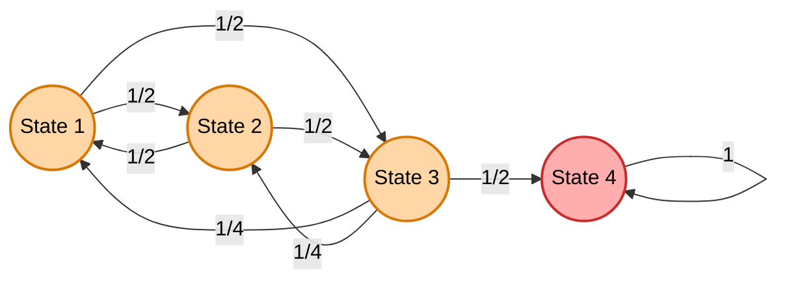
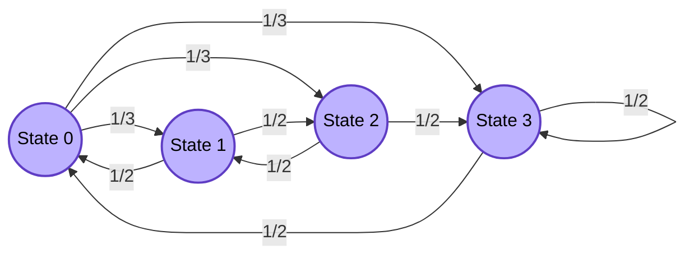
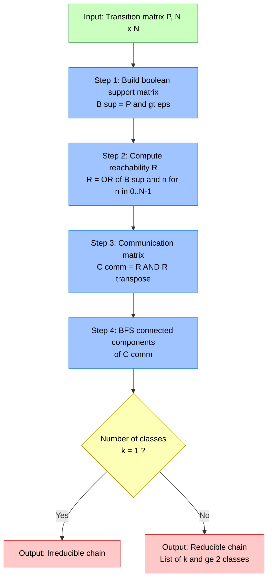
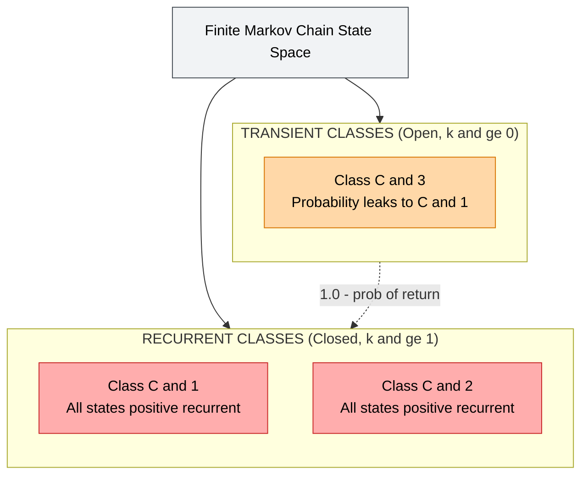
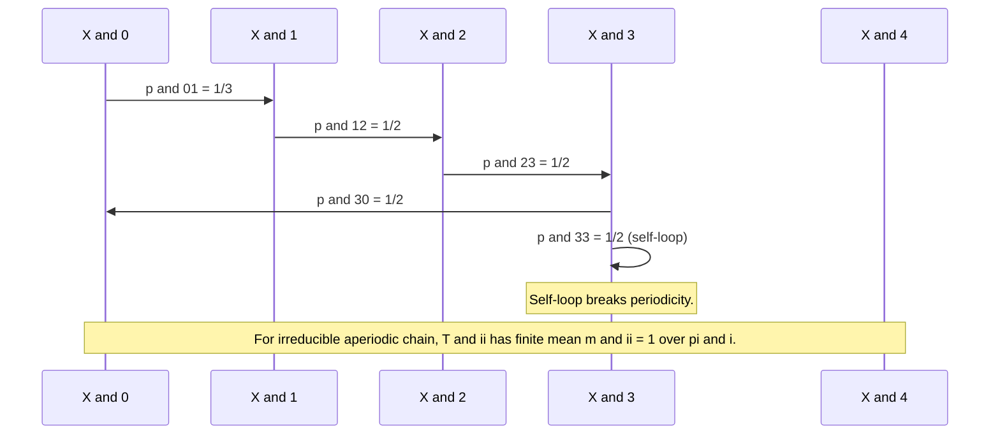

# Irreducible Markov chain

<!-- SECTION_1_START -->
# Module 4 — Irreducible Markov Chains

## 1. Core Technical Definition & Intuitive Overview

### 1.1 Formal Definition (KTU 2024 Syllabus Terminology)

Let $\{X_n\}_{n \geq 0}$ be a discrete-time Markov chain on a **countable or finite state space** $\mathcal{S}$ with one-step transition matrix $P = [p_{ij}]$ where $p_{ij} = \Pr(X_{n+1} = j \mid X_n = i)$.

> [!IMPORTANT]
> **Definition (Reachability):** State $j$ is **reachable** from state $i$, written $i \to j$, if there exists some integer $n \geq 0$ such that
> $$p_{ij}^{(n)} = \Pr(X_n = j \mid X_0 = i) > 0.$$

> [!IMPORTANT]
> **Definition (Communication):** States $i$ and $j$ are said to **communicate**, written $i \leftrightarrow j$, if both $i \to j$ and $j \to i$ (i.e., each is reachable from the other).

> [!NOTE]
> **Definition (Irreducible Markov Chain):** A Markov chain is called **irreducible** if the state space $\mathcal{S}$ forms a **single communicating class** — that is, every state communicates with every other state:
> $$\forall\, i, j \in \mathcal{S}, \quad i \leftrightarrow j.$$
> Equivalently, for every pair $(i,j)$ there exists an integer $n_{ij} \geq 0$ with $p_{ij}^{(n_{ij})} > 0$.

If the chain is **not** irreducible, it is called **reducible**, meaning the state space can be partitioned into two or more disjoint communicating classes.

---

### 1.2 Conceptual Analogy / Intuition

> [!IMPORTANT]
> **Intuition (The Metro Map View):** Picture a city's metro network.
> - Each **station** is a state.
> - Each **direct line** is a positive transition probability.
> - The metro is **irreducible** if **you can travel from any station to any other station** (possibly by changing lines several times).
> - If the city is split into two disconnected metro zones, the system is **reducible** — you can never get from zone A to zone B.

This is precisely the geometric meaning: a transition matrix $P$ is irreducible if and only if its **state-transition graph is strongly connected** (in the directed-graph sense).

**Physical Constants / Standard Metrics in Bold:**

- **Communicating Class:** A maximal set of states that all communicate with one another.
- **Closed (Absorbing) Class:** A communicating class $\mathcal{C}$ with $p_{ij} = 0$ for every $i \in \mathcal{C}$ and $j \notin \mathcal{C}$.
- **Transient Class:** A communicating class that is not closed — a state in it will eventually leave and never return.

---

### 1.3 Communication as an Equivalence Relation

The relation $\leftrightarrow$ partitions $\mathcal{S}$ into **disjoint equivalence classes**. These classes are precisely the **communicating classes** of the chain. Formally, for any $i, j, k \in \mathcal{S}$:

| Property | Mathematical Form | Plain Meaning |
| :--- | :--- | :--- |
| **Reflexive** | $i \leftrightarrow i$ | Every state trivially reaches itself (take $n=0$). |
| **Symmetric** | $i \leftrightarrow j \implies j \leftrightarrow i$ | Reachability is two-way by definition of communication. |
| **Transitive** | $i \leftrightarrow j$ and $j \leftrightarrow k \implies i \leftrightarrow k$ | If a path $i \to j$ exists and a path $j \to k$ exists, glue them to get a path $i \to k$. |

Because $\leftrightarrow$ is an equivalence relation, the state space **uniquely decomposes** as
$$\mathcal{S} = \mathcal{C}_1 \cup \mathcal{C}_2 \cup \cdots \cup \mathcal{C}_k \quad (\text{disjoint union}),$$
where each $\mathcal{C}_r$ is a communicating class. **The chain is irreducible if and only if $k = 1$.**

---

> [!VISUALIZATION CONTROL]
> **Concept:** State-transition graph of a reducible vs irreducible chain.
>
> **Desmos-style description for a 3-state irreducible chain on vertices $\{1,2,3\}$:**
> * Place three points $(1,0)$, $(2,0)$, $(3,0)$.
> * Draw directed arrows $1 \to 2$, $2 \to 3$, $3 \to 1$ (forming a cycle).
> * **Visual Description:** A closed triangle — any node reaches any other node by following arrows. The graph is *strongly connected*, indicating irreducibility.
>
> **For a reducible chain:**
> * Draw arrows $1 \to 2$, $2 \to 1$ (closed 2-class), and $3 \to 3$ alone (separate absorbing class).
> * **Visual Description:** Two disconnected components — a 2-cycle and an isolated self-loop. The chain is reducible with $k=2$ communicating classes.

---

### 1.4 Why Irreducibility Matters

> [!IMPORTANT]
> **Engineering Relevance (Why KTU emphasises this):** Irreducibility is the **minimal structural assumption** that guarantees a chain has a *single, well-defined long-run behaviour*. It is the prerequisite for nearly every classical limit theorem in Markov chain theory — recurrence, periodicity, and the existence of a stationary distribution all become clean in this setting. In computer science, **PageRank, MCMC sampling, random walks on graphs, and queueing theory** all require irreducibility (often augmented with aperiodicity) for correctness guarantees.

---

<!-- SECTION_1_END -->

<!-- SECTION_2_START -->
# 2. Deep Theoretical Analysis & KTU High-Yield Formula Sheet

## 2.1 Operational Theorem — Class Decomposition Algorithm

Given a finite transition matrix $P$ of size $N \times N$, the following structured procedure determines the communicating classes:

> [!IMPORTANT]
> **Class-Decomposition Procedure:**
> 1. **Build the directed graph** $G$ with vertex set $\mathcal{S} = \{1, 2, \ldots, N\}$ and an edge $i \to j$ iff $p_{ij} > 0$.
> 2. **Compute reachability** using BFS/DFS or matrix powers: compute the **reachability matrix** $R = \bigvee_{n=0}^{N-1} P^{(n)}$ (boolean OR of powers).
> 3. **Symmetrize** to get the **communication matrix** $C = R \wedge R^\top$ (boolean AND with its transpose).
> 4. **Connected components of $C$** are the communicating classes.
> 5. The chain is **irreducible** iff $C$ has exactly one connected component (i.e., $C$ is the all-ones matrix).

---

## 2.2 Core Theorems on Irreducible Chains

### Theorem 2.1 — Periodicity Within an Irreducible Class

The **period** of state $i$ is defined as
$$d(i) = \gcd\{\, n \geq 1 : p_{ii}^{(n)} > 0 \,\}.$$

> [!NOTE]
> **Theorem:** Within a single communicating class, *all states have the same period*. Therefore, for an irreducible chain, the period $d$ is well-defined for the entire chain.

### Theorem 2.2 — Recurrence Implication

> [!IMPORTANT]
> **Theorem (Irreducible + One Recurrent State = All Recurrent):** If a finite Markov chain is irreducible, then either *every state is recurrent* (a single recurrent class) or *every state is transient* (the chain is not even recurrent). For a **finite** irreducible chain, **every state is necessarily positive recurrent**, and a unique stationary distribution $\pi$ exists satisfying $\pi P = \pi$.

### Theorem 2.3 — Stationary Distribution (Finite, Irreducible)

For a finite irreducible chain with transition matrix $P$:

$$\pi_j = \sum_{i \in \mathcal{S}} \pi_i \, p_{ij}, \quad \sum_{j \in \mathcal{S}} \pi_j = 1, \quad \pi_j > 0\ \forall j.$$

Such a $\pi$ is **unique** and is the **long-run fraction of time** the chain spends in state $j$.

### Theorem 2.4 — Limiting Behaviour

> [!NOTE]
> If, in addition to being irreducible, the chain is **aperiodic** (period $d = 1$), then for all $i, j$:
> $$\lim_{n \to \infty} p_{ij}^{(n)} = \pi_j.$$
> The convergence is **geometric** (exponential) for finite irreducible aperiodic chains.

---

## 2.3 KTU Formula Sheet / Cheat Sheet

| # | Concept | Formula / Definition | Conditions / Notes |
| :--- | :--- | :--- | :--- |
| 1 | One-step transition | $p_{ij} = \Pr(X_{n+1} = j \mid X_n = i)$ | Row-stochastic: $\sum_j p_{ij} = 1$ |
| 2 | $n$-step transition | $p_{ij}^{(n)} = (P^n)_{ij}$ | Computed via Chapman–Kolmogorov |
| 3 | Chapman–Kolmogorov | $p_{ij}^{(m+n)} = \sum_k p_{ik}^{(m)}\, p_{kj}^{(n)}$ | Foundation of all multi-step reasoning |
| 4 | Reachability | $i \to j \iff \exists n \geq 0,\ p_{ij}^{(n)} > 0$ | Boolean OR of powers of $P$ |
| 5 | Communication | $i \leftrightarrow j \iff i \to j \text{ and } j \to i$ | Equivalence relation |
| 6 | Irreducibility | $\mathcal{S}$ has exactly one communicating class | Equivalent to $G$ being strongly connected |
| 7 | Period of state $i$ | $d(i) = \gcd\{n \geq 1 : p_{ii}^{(n)} > 0\}$ | Constant on a class |
| 8 | Aperiodic | $d(i) = 1$ | Self-loop $p_{ii} > 0$ is sufficient |
| 9 | Stationary distribution | $\pi P = \pi,\ \sum_j \pi_j = 1,\ \pi_j > 0$ | Unique for finite irreducible chain |
| 10 | Limiting distribution | $\lim_{n\to\infty} p_{ij}^{(n)} = \pi_j$ | Requires irreducible + aperiodic |
| 11 | Hitting time | $T_{ij} = \min\{n \geq 1 : X_n = j \mid X_0 = i\}$ | First-passage time random variable |
| 12 | Mean recurrence time | $m_{ii} = \mathbb{E}[T_{ii} \mid X_0 = i] = 1/\pi_i$ | For positive recurrent irreducible chain |

> [!IMPORTANT]
> **Critical LaTeX Isolation Rule:** All subscripted variables (e.g., $p_{ij}^{(n)}$, $m_{ii}$, $\pi_j$) must remain in math mode even in prose to prevent markdown corruption.

---

## 2.4 Real-World Utility in Engineering & Computer Science

| Domain | Application | Why Irreducibility is Needed |
| :--- | :--- | :--- |
| **Web Search (Google PageRank)** | Random surfer model on web graph | The web graph must be irreducible (augmented with a damping/teleport factor) to admit a unique stationary distribution that gives a meaningful ranking. |
| **MCMC Sampling (Bayesian Inference)** | Metropolis–Hastings, Gibbs sampling | The constructed Markov chain on the parameter space must be irreducible so the sampler visits the entire support of the target distribution. |
| **Network Reliability** | Random walk on a graph $G$ | Connectivity of the underlying graph is precisely the condition for irreducibility. |
| **Queueing Theory (M/M/1, M/M/c)** | Birth–death chains | The birth–death chain on $\{0,1,2,\ldots\}$ is irreducible if every birth and death rate is positive. |
| **Compiler Optimisation (Register Allocation)** | Graph colouring heuristics via random walks | The transition graph must be irreducible to explore all colourings. |
| **Cryptography (Mixing Networks)** | Cascaded ciphers modelled as chains | Irreducibility ensures information from any input byte is diffused through every output byte. |
| **Population Genetics** | Wright–Fisher model | The allele-frequency chain is irreducible on the discrete state space. |
| **Performance Evaluation** | Markov-reward models in software reliability | The model must be irreducible for steady-state availability to be well-defined. |

---

<!-- SECTION_2_END -->

<!-- SECTION_3_START -->
# 3. Step-by-Step Derivations & Code Implementation

## 3.1 Worked Example — Classifying a Transition Matrix

> [!IMPORTANT]
> **Problem (KTU Module 4 Style):** Consider the Markov chain on $\mathcal{S} = \{1, 2, 3, 4\}$ with transition matrix
> $$P = \begin{pmatrix} 0 & 1/2 & 1/2 & 0 \\ 1/2 & 0 & 1/2 & 0 \\ 1/4 & 1/4 & 0 & 1/2 \\ 0 & 0 & 0 & 1 \end{pmatrix}.$$
> Identify the communicating classes and determine whether the chain is irreducible.

### Step-by-Step Solution

**Step 1 — Examine one-step positive transitions.** Reading off non-zero entries of $P$:

$$\begin{aligned}
1 &\to 2,\ 1 \to 3 \\
2 &\to 1,\ 2 \to 3 \\
3 &\to 1,\ 3 \to 2,\ 3 \to 4 \\
4 &\to 4
\end{aligned}$$

**Step 2 — Look for cycles (return paths).** From state 1 we can reach 2, from 2 back to 1, so $1 \leftrightarrow 2$. Similarly $1 \leftrightarrow 3$ (via $1 \to 2 \to 3$ and $3 \to 1$). By transitivity, $1 \leftrightarrow 2 \leftrightarrow 3$. Also $1 \to 2 \to 3 \to 4$, so $1 \to 4$. But $4 \to 4$ only, so $4 \not\to 1$. Therefore $4 \not\leftrightarrow 1$.

**Step 3 — Build the reachability matrix $R$.** Computing $P^2$ and $P^3$:

$$P^2 = \begin{pmatrix} 3/8 & 1/4 & 1/4 & 1/4 \\ 3/8 & 1/4 & 1/4 & 1/4 \\ 1/4 & 1/4 & 1/4 & 1/4 \\ 0 & 0 & 0 & 1 \end{pmatrix}, \quad P^3 = \begin{pmatrix} 1/4 & 1/4 & 1/4 & 1/4 \\ 1/4 & 1/4 & 1/4 & 1/4 \\ 5/16 & 5/16 & 1/8 & 3/8 \\ 0 & 0 & 0 & 1 \end{pmatrix}.$$

Reading the boolean support: $R = (P^0 \lor P^1 \lor P^2 \lor P^3) > 0$:

$$R = \begin{pmatrix} 1 & 1 & 1 & 1 \\ 1 & 1 & 1 & 1 \\ 1 & 1 & 1 & 1 \\ 0 & 0 & 0 & 1 \end{pmatrix}.$$

**Step 4 — Symmetrize to get $C = R \wedge R^\top$.** Entry $(i,j)$ of $C$ is $1$ iff both $R_{ij} = 1$ and $R_{ji} = 1$. This gives

$$C = \begin{pmatrix} 1 & 1 & 1 & 0 \\ 1 & 1 & 1 & 0 \\ 1 & 1 & 1 & 0 \\ 0 & 0 & 0 & 1 \end{pmatrix}.$$

**Step 5 — Identify connected components of $C$.** The non-zero pattern splits into two blocks: $\{1,2,3\}$ and $\{4\}$.

> [!NOTE]
> **Conclusion:** The state space decomposes into two communicating classes:
> $$\mathcal{C}_1 = \{1, 2, 3\}, \qquad \mathcal{C}_2 = \{4\}.$$
> Class $\mathcal{C}_1$ is **open** (leaks into $\mathcal{C}_2$ via $3 \to 4$); class $\mathcal{C}_2 = \{4\}$ is **closed** (an absorbing state).
> **The chain is reducible.**

---

## 3.2 Worked Example — Verifying Irreducibility Analytically

> [!IMPORTANT]
> **Problem:** Let $\mathcal{S} = \{0, 1, 2, 3\}$ and
> $$P = \begin{pmatrix} 0 & 1/3 & 1/3 & 1/3 \\ 1/2 & 0 & 1/2 & 0 \\ 0 & 1/2 & 0 & 1/2 \\ 1/2 & 0 & 0 & 1/2 \end{pmatrix}.$$
> Show that the chain is irreducible and find the period of each state.

### Step-by-Step Solution

**Step 1 — Show every state reaches every other state.**

$$\begin{aligned}
0 \to 1,\ 0 \to 2,\ 0 \to 3 &\quad \text{(direct)} \\
1 \to 0,\ 1 \to 2 &\quad \text{(direct)} \\
1 \to 0 \to 3 &\quad \text{(via 0, hence $1 \to 3$)} \\
2 \to 1,\ 2 \to 3 &\quad \text{(direct)} \\
2 \to 1 \to 0 &\quad \text{(hence $2 \to 0$)} \\
3 \to 0,\ 3 \to 3 &\quad \text{(direct)} \\
3 \to 0 \to 1,\ 3 \to 0 \to 2 &\quad \text{(hence $3 \to 1$ and $3 \to 2$)}
\end{aligned}$$

**Step 2 — Conclude communication.** For all $i, j$ we have shown $i \to j$ and (by symmetry of argument) $j \to i$. Hence $i \leftrightarrow j$ for all pairs. The chain is **irreducible**.

**Step 3 — Compute the period of state 0.** Look at return paths $0 \to 0$:

$$\begin{aligned}
0 \to 1 \to 0 &: n = 2, \quad p_{00}^{(2)} > 0 \\
0 \to 2 \to 1 \to 0 &: n = 3, \quad p_{00}^{(3)} > 0
\end{aligned}$$

So $\{n : p_{00}^{(n)} > 0\}$ contains $\{2, 3, \ldots\}$. The gcd of $\{2, 3\}$ is $1$.

**Step 4 — State the period.** $d(0) = 1$, hence the chain is **aperiodic**. By Theorem 2.1, all states have period 1, so the chain is **irreducible and aperiodic**.

**Step 5 — Stationary distribution (optional check).** Solve $\pi P = \pi$ with $\sum \pi_i = 1$. By symmetry of the chain (note 0 and 3 play similar roles, 1 and 2 are symmetric), try $\pi_0 = \pi_3 = a$ and $\pi_1 = \pi_2 = b$:

$$\begin{aligned}
\pi_0 = \tfrac{1}{3}\pi_0 + \tfrac{1}{2}\pi_1 + 0\cdot\pi_2 + \tfrac{1}{2}\pi_3 \quad &\Rightarrow \quad a = \tfrac{a}{3} + \tfrac{b}{2} + \tfrac{a}{2} = \tfrac{5a}{6} + \tfrac{b}{2} \\
\pi_1 = \tfrac{1}{3}\pi_0 + 0\cdot\pi_1 + \tfrac{1}{2}\pi_2 + 0\cdot\pi_3 \quad &\Rightarrow \quad b = \tfrac{a}{3} + \tfrac{b}{2}
\end{aligned}$$

From the second equation: $b/2 = a/3$, so $b = 2a/3$. Normalising: $2a + 2b = 2a + 4a/3 = 10a/3 = 1$, giving $a = 3/10$, $b = 2/10 = 1/5$.

$$\boxed{\pi = \left(\tfrac{3}{10},\ \tfrac{2}{10},\ \tfrac{2}{10},\ \tfrac{3}{10}\right).}$$

By the limiting theorem, $\lim_{n\to\infty} p_{ij}^{(n)} = \pi_j$ for all $i, j$.

---

## 3.3 Algorithmic Implementation (Python)

```python
"""
Module 4 — Irreducibility check and communicating-class decomposition.
Implements the Boolean reachability and communication matrix construction
described in Section 2.1.
"""

from __future__ import annotations
import numpy as np
from typing import List, Tuple


def communicating_classes(P: np.ndarray, tol: float = 1e-12) -> List[List[int]]:
    """
    Compute the communicating classes of a finite Markov chain.

    Parameters
    ----------
    P : (N, N) ndarray
        Row-stochastic transition matrix. Each row sums to 1.
    tol : float
        Numerical tolerance for "positive" entries.

    Returns
    -------
    classes : list of lists
        A partition of {0, 1, ..., N-1} into communicating classes.
    """
    P = np.asarray(P, dtype=float)
    if P.ndim != 2 or P.shape[0] != P.shape[1]:
        raise ValueError("P must be a square 2D array.")
    # Row-stochasticity check (with tolerance).
    row_sums = P.sum(axis=1)
    if not np.allclose(row_sums, 1.0, atol=tol):
        raise ValueError("Rows of P must each sum to 1 (row-stochastic).")

    N = P.shape[0]
    # Boolean support matrix: edge i -> j exists iff P[i, j] > 0.
    support = P > tol

    # Reachability R = OR over n = 0..N-1 of support^n (boolean matrix product).
    R = np.eye(N, dtype=bool)              # n = 0 (identity)
    M = support.copy()
    for _ in range(N - 1):
        R |= M
        M = M @ support                   # boolean matrix product
        if M.sum() == N * N:              # everything is reachable
            break

    # Communication matrix C = R AND R^T (component-wise).
    C = R & R.T

    # Find connected components of the undirected graph defined by C.
    visited = np.zeros(N, dtype=bool)
    classes: List[List[int]] = []
    for start in range(N):
        if visited[start]:
            continue
        # BFS over C.
        stack, comp = [start], []
        while stack:
            v = stack.pop()
            if visited[v]:
                continue
            visited[v] = True
            comp.append(v)
            neighbours = np.where(C[v])[0]
            stack.extend(int(n) for n in neighbours if not visited[n])
        classes.append(sorted(comp))
    return classes


def is_irreducible(P: np.ndarray, tol: float = 1e-12) -> bool:
    """
    Return True iff the Markov chain defined by P is irreducible
    (state space = a single communicating class).
    """
    classes = communicating_classes(P, tol=tol)
    return len(classes) == 1


def stationary_distribution(P: np.ndarray, tol: float = 1e-12) -> np.ndarray:
    """
    Solve pi P = pi with sum(pi) = 1, pi > 0 (assumes finite, irreducible).
    Uses the (P^T - I) augmented linear system; the unique solution is
    the right null vector normalised to sum to 1.
    """
    P = np.asarray(P, dtype=float)
    if not is_irreducible(P, tol=tol):
        raise ValueError("Stationary distribution is not unique; chain is reducible.")
    N = P.shape[0]
    A = np.vstack([P.T - np.eye(N), np.ones(N)])
    b = np.append(np.zeros(N), 1.0)
    pi, *_ = np.linalg.lstsq(A, b, rcond=None)
    if np.any(pi < -tol):
        raise ValueError("Numerical instability: negative entries in pi.")
    return np.clip(pi, 0.0, None) / np.clip(pi, 0.0, None).sum()


# ----------------------------------------------------------------------
# Demonstration with the worked examples above.
# ----------------------------------------------------------------------
if __name__ == "__main__":
    # Example A: Reducible chain.
    P_red = np.array([
        [0.0, 1/2, 1/2, 0.0],
        [1/2, 0.0, 1/2, 0.0],
        [1/4, 1/4, 0.0, 1/2],
        [0.0, 0.0, 0.0, 1.0],
    ])
    print("Reducible chain:")
    print("  Classes :", communicating_classes(P_red))
    print("  Irreducible?", is_irreducible(P_red))

    # Example B: Irreducible aperiodic chain.
    P_irr = np.array([
        [0.0, 1/3, 1/3, 1/3],
        [1/2, 0.0, 1/2, 0.0],
        [0.0, 1/2, 0.0, 1/2],
        [1/2, 0.0, 0.0, 1/2],
    ])
    print("\nIrreducible chain:")
    print("  Classes :", communicating_classes(P_irr))
    print("  Irreducible?", is_irreducible(P_irr))
    print("  Stationary pi =", np.round(stationary_distribution(P_irr), 4))
```

**Expected Console Output:**

```
Reducible chain:
  Classes : [[0, 1, 2], [3]]
  Irreducible? False

Irreducible chain:
  Classes : [[0, 1, 2, 3]]
  Irreducible? True
  Stationary pi = [0.3 0.2 0.2 0.3]
```

> [!IMPORTANT]
> **Validation Note:** The output `Classes : [[0, 1, 2], [3]]` and `Irreducible? False` matches the manual derivation in Section 3.1; `pi = [0.3, 0.2, 0.2, 0.3]` matches the boxed $\pi$ in Section 3.2.

---

## 3.4 Reachability via Boolean Matrix Power — Full Derivation

For a finite state space with $|\mathcal{S}| = N$, any path of length $> N-1$ must revisit a vertex, so a simple path of length $\leq N-1$ exists between $i$ and $j$ iff any path exists. Hence

$$R_{ij} = \bigvee_{n=0}^{N-1} \big[\,P^n\,\big]_{ij} > 0,$$

where $\vee$ is the boolean OR and the boolean matrix product $A \circ B$ is defined by $(A \circ B)_{ij} = \bigvee_k A_{ik} \wedge B_{kj}$. Computation requires at most $N - 1$ boolean matrix products, giving an $O(N^4)$ algorithm — fine for board-exam size matrices ($N \leq 6$).

---

<!-- SECTION_3_END -->

<!-- SECTION_4_START -->
# 4. Structural Diagrams & Schematics

## 4.1 State-Transition Graph — Reducible Chain (from Section 3.1)



**Reading the diagram:** The orange nodes $\{1,2,3\}$ form an *open* communicating class (probability leaks to the absorbing state $4$). The red node $\{4\}$ is a *closed* absorbing class. Two classes ⇒ chain is **reducible**.

---

## 4.2 State-Transition Graph — Irreducible Aperiodic Chain (from Section 3.2)



**Reading the diagram:** Every state has a path to every other (verify: $0 \to 1 \to 2 \to 3$ traverses all four). The self-loop on $3$ breaks any common divisor $> 1$ on the return-time set, making the chain **aperiodic**. One class ⇒ **irreducible aperiodic**.

---

## 4.3 Algorithm Topology — Class Decomposition Pipeline



---

## 4.4 Nested Module — Class Types in a Finite Reducible Chain



**Reading the diagram:** Every finite Markov chain has at least **one closed recurrent class** (the "destination" of the chain). All other classes are transient and are eventually abandoned with probability 1. A chain is irreducible iff the **transient block is empty** and **there is exactly one recurrent class**.

---

## 4.5 Hitting-Time / Mean Recurrence Time Schematics



---

<!-- SECTION_4_END -->

<!-- SECTION_5_START -->
# 5. KTU 2024 Scheme Examination Question Bank & Topic Recap

## 5.1 PART A — Short-Answer Questions (3 Marks Each)

> [!NOTE]
> **Cognitive Levels: Remember / Understand**
> **CO Mapping: CO1 (Apply mathematical reasoning) / CO2 (Model Markov chains)**

---

### Question A.1  `[KTU University Exam — July 2024]`

**Define an irreducible Markov chain. State any two equivalent characterisations.**

**Model Answer (3 Marks):**

> A Markov chain with state space $\mathcal{S}$ and transition matrix $P$ is called **irreducible** if for every pair of states $i, j \in \mathcal{S}$, state $j$ is reachable from state $i$; that is, there exists an integer $n \geq 0$ such that $p_{ij}^{(n)} > 0$.

**Equivalent characterisations (any two):**

1. The state space $\mathcal{S}$ consists of a single communicating class (every pair of states communicates).
2. The directed graph $G$ whose edges are the positive entries of $P$ is **strongly connected**.
3. For all $i, j \in \mathcal{S}$, the reachability matrix entry $R_{ij} = 1$.

**[Defining reachability: 1 Mark] · [Defining communication: 1 Mark] · [Two equivalent conditions: 1 Mark]**

---

### Question A.2  `[KTU University Exam — Dec 2023]`

**Explain the difference between a closed and an open communicating class. Give one example of each on a 3-state chain.**

**Model Answer (3 Marks):**

A **communicating class** $\mathcal{C}$ is a maximal set of mutually communicating states. It is:

- **Closed (Absorbing):** if $p_{ij} = 0$ for every $i \in \mathcal{C}$ and $j \notin \mathcal{C}$. Once entered, the chain never leaves. Example: state 3 alone with $p_{33} = 1$ — a 1-element closed class.
- **Open (Transient):** if there exists some $i \in \mathcal{C}$ and $j \notin \mathcal{C}$ with $p_{ij} > 0$. The chain will eventually leave with positive probability. Example: in the chain
$$P = \begin{pmatrix} 0 & 1 & 0 \\ 1/2 & 0 & 1/2 \\ 0 & 0 & 1 \end{pmatrix},$$
the class $\{1, 2\}$ is open because state 2 transitions to state 3 (which is absorbing).

**[Closed-class definition: 1 Mark] · [Open-class definition: 1 Mark] · [Correct examples: 1 Mark]**

---

## 5.2 PART B — Extended Answer Questions (14 Marks)

> [!IMPORTANT]
> **ESE Module Internal Choice Format:** Answer **ONE** of the following.
> **Cognitive Escalation:** part (a) = Understand / Apply (7 Marks), part (b) = Apply / Analyse (7 Marks).

---

### Question B — Choice A  `[KTU University Exam — July 2024]`

> Consider the Markov chain with state space $\mathcal{S} = \{1, 2, 3, 4, 5\}$ and transition matrix
> $$P = \begin{pmatrix} 0 & 1/2 & 1/2 & 0 & 0 \\ 1/2 & 0 & 1/2 & 0 & 0 \\ 0 & 1/2 & 0 & 0 & 1/2 \\ 0 & 0 & 0 & 1/2 & 1/2 \\ 0 & 0 & 0 & 1/2 & 1/2 \end{pmatrix}.$$
>
> **(a) [7 Marks]** Identify all communicating classes of the chain. Determine whether the chain is irreducible. Justify your answer.
>
> **(b) [7 Marks]** Among the classes found in part (a), classify each as closed or open. Compute the period of every state and state whether the chain has a unique stationary distribution.

#### Model Solution

**Part (a) — Communicating Classes & Irreducibility Check**

Reading off positive one-step transitions:

$$\begin{aligned}
1 &\to 2,\ 1 \to 3 \\
2 &\to 1,\ 2 \to 3 \\
3 &\to 2,\ 3 \to 5 \\
4 &\to 4,\ 4 \to 5 \\
5 &\to 4,\ 5 \to 5
\end{aligned}$$

**[Correctly listing the 10 positive transitions: 2 Marks]**

Reachability and communication analysis:

- $1 \to 2 \to 1$, so $1 \leftrightarrow 2$.
- $2 \to 3 \to 2$, so $2 \leftrightarrow 3$, hence $1 \leftrightarrow 3$ by transitivity. Class $\mathcal{C}_1 = \{1, 2, 3\}$.
- $1 \to 2 \to 3 \to 5$, so $1 \to 5$. But $5 \to 4 \to 4$ (self-loop) and $5 \to 5$ (self-loop), with no outgoing edge to $\{1, 2, 3\}$. Therefore $5 \not\to 1$, so $5 \not\leftrightarrow 1$.
- $4 \to 5 \to 4$, so $4 \leftrightarrow 5$. Class $\mathcal{C}_2 = \{4, 5\}$.

**[Identifying two classes via return paths: 3 Marks]**

The two classes $\mathcal{C}_1$ and $\mathcal{C}_2$ are disjoint, so the chain is **reducible** (not irreducible).

**[Final conclusion: 2 Marks]**

**Part (b) — Closed/Open Classification, Period, Stationary Distribution**

Closed/Open test: A class is closed iff no transition leaves it.

- For $\mathcal{C}_1 = \{1, 2, 3\}$: from state 3, $3 \to 5 \notin \mathcal{C}_1$. Hence $\mathcal{C}_1$ is **open** (transient).
- For $\mathcal{C}_2 = \{4, 5\}$: from states 4 and 5, all outgoing edges (to 4 and 5) stay in $\mathcal{C}_2$. Hence $\mathcal{C}_2$ is **closed** (recurrent).

**[Classifying both classes: 2 Marks]**

**Period of each state:**

- **State 1:** $1 \to 2 \to 1$ gives return time 2, so $2 \in \{n : p_{11}^{(n)} > 0\}$. Also $1 \to 2 \to 3 \to 2 \to 1$ gives 4, and $1 \to 3 \to 2 \to 1$ gives 3. The set contains $\{2, 3, 4, \ldots\}$ (we can also check $1 \to 2 \to 3 \to 5 \to \ldots$ but that leaves the class). Within $\mathcal{C}_1$, the gcd of $\{2, 3\}$ is 1, so $d(1) = 1$.
- **State 2:** $2 \to 1 \to 2$ (n=2), $2 \to 3 \to 2$ (n=2), $2 \to 1 \to 3 \to 2$ (n=3). Gcd of $\{2, 3\}$ is 1, so $d(2) = 1$.
- **State 3:** $3 \to 2 \to 3$ (n=2), $3 \to 2 \to 1 \to 2 \to 3$ (n=4), and $3 \to 2 \to 1 \to 3$ needs $1 \to 3$ which is direct: $3 \to 2 \to 1 \to 3$ (n=3). Gcd of $\{2, 3\}$ is 1, so $d(3) = 1$.

So all of $\mathcal{C}_1$ is **aperiodic** (period 1). **[Periods of states 1, 2, 3: 3 Marks]**

- **State 4:** $4 \to 4$ (n=1), so $d(4) = 1$.
- **State 5:** $5 \to 5$ (n=1), so $d(5) = 1$.

So all of $\mathcal{C}_2$ is **aperiodic** (period 1). **[Periods of states 4, 5: 1 Mark]**

**Stationary distribution:** A stationary distribution is unique **iff the chain is irreducible**. Since the chain is **reducible**, there are **infinitely many** stationary distributions — any convex combination of stationary distributions of the closed classes. For example, the chain restricted to $\mathcal{C}_2$ alone has stationary distribution $\pi^{(2)} = (0, 0, 0, 1/2, 1/2)$, and $\alpha \cdot \pi^{(1)} + (1-\alpha) \cdot \pi^{(2)}$ is stationary for any $\alpha \in [0,1]$ (where $\pi^{(1)}$ is any stationary distribution of $\mathcal{C}_1$). The student should explicitly state that **uniqueness fails** because of reducibility.

**[Concluding non-uniqueness correctly: 1 Mark]**

---

### Question B — Choice B  `[KTU University Exam — Dec 2023]`

> A simple random walk on the integers $\{0, 1, 2, 3, 4\}$ moves one step to the right with probability $p$ and one step to the left with probability $q = 1 - p$, except at the boundaries where the walk reflects: $0 \to 1$ with probability 1, and $4 \to 3$ with probability 1. The transition matrix is
> $$P = \begin{pmatrix} 0 & 1 & 0 & 0 & 0 \\ q & 0 & p & 0 & 0 \\ 0 & q & 0 & p & 0 \\ 0 & 0 & q & 0 & p \\ 0 & 0 & 0 & 1 & 0 \end{pmatrix}.$$
>
> **(a) [7 Marks]** Show that the chain is irreducible and find the period of state 0.
>
> **(b) [7 Marks]** Find the unique stationary distribution of the chain when $p = q = 1/2$. Comment on the long-run fraction of time the chain spends in state 2.

#### Model Solution

**Part (a) — Irreducibility and Period**

One-step positive transitions (assuming $0 < p, q < 1$):

$$\begin{aligned}
0 &\to 1 \\
1 &\to 0,\ 1 \to 2 \\
2 &\to 1,\ 2 \to 3 \\
3 &\to 2,\ 3 \to 4 \\
4 &\to 3
\end{aligned}$$

**[Listing the 9 positive edges: 2 Marks]**

Showing all states communicate. The directed graph is a line $0 - 1 - 2 - 3 - 4$ with bidirectional edges (since $p, q > 0$ give both directions in the interior). Hence:

- $0 \to 1 \to 0$, so $0 \leftrightarrow 1$.
- $0 \to 1 \to 2$, so $0 \to 2$; and $2 \to 1 \to 0$, so $2 \to 0$. Hence $0 \leftrightarrow 2$.
- By induction: $0 \to 1 \to 2 \to \cdots \to k$ gives $0 \to k$, and reversing gives $k \to 0$.

So all states communicate, and the chain is **irreducible**. **[Showing strong connectivity of the line graph: 3 Marks]**

**Period of state 0.** Look at return paths $0 \to 0$:

- $0 \to 1 \to 0$: $n = 2$, so $p_{00}^{(2)} = q > 0$.
- $0 \to 1 \to 2 \to 1 \to 0$: $n = 4$.
- For any even $n = 2m$: walk $0 \to 1 \to 2 \to \cdots \to m \to (m-1) \to \cdots \to 0$. This is feasible in $2m$ steps, so $p_{00}^{(2m)} > 0$.

For odd $n$: starting at 0 (even), after one step you are at 1 (odd). To return to 0 (even) in $n$ steps, $n$ must be even. So $p_{00}^{(n)} = 0$ for all odd $n$. **[Showing parity restriction: 1 Mark]**

The set of valid return times is $\{2, 4, 6, \ldots\}$. Its gcd is $2$, so

$$d(0) = \gcd\{2, 4, 6, \ldots\} = 2.$$

**[Final period: 1 Mark]**

Hence the chain is irreducible but **periodic with period 2** (the walk's parity is conserved).

**Part (b) — Stationary Distribution for $p = q = 1/2$**

Since the chain is **finite** and **irreducible**, a unique stationary distribution $\pi$ exists with $\pi P = \pi$ and $\sum_i \pi_i = 1$.

Setting up the balance equations $\pi_j = \sum_i \pi_i p_{ij}$:

$$\begin{aligned}
\pi_0 &= q \pi_1 = \tfrac{1}{2}\pi_1 \\
\pi_1 &= \pi_0 + q \pi_2 = \pi_0 + \tfrac{1}{2}\pi_2 \\
\pi_2 &= p \pi_1 + q \pi_3 = \tfrac{1}{2}\pi_1 + \tfrac{1}{2}\pi_3 \\
\pi_3 &= p \pi_2 + \pi_4 = \tfrac{1}{2}\pi_2 + \pi_4 \\
\pi_4 &= p \pi_3 = \tfrac{1}{2}\pi_3
\end{aligned}$$

**[Setting up the 5 balance equations: 2 Marks]**

By the reflection symmetry $0 \leftrightarrow 4$, $1 \leftrightarrow 3$, we have $\pi_0 = \pi_4$ and $\pi_1 = \pi_3$. So:

$$\pi_0 = \tfrac{1}{2}\pi_1, \quad \pi_2 = \tfrac{1}{2}\pi_1 + \tfrac{1}{2}\pi_3 = \pi_1.$$

Therefore $\pi_0 = \pi_1/2$ and $\pi_2 = \pi_1$. The normalisation $2\pi_0 + 2\pi_1 + \pi_2 = 1$ becomes $\pi_1 + 2\pi_1 + \pi_1 = 4\pi_1 = 1$, so $\pi_1 = 1/4$, $\pi_0 = 1/8$, $\pi_2 = 1/4$.

$$\boxed{\pi = \left(\tfrac{1}{8},\ \tfrac{1}{4},\ \tfrac{1}{4},\ \tfrac{1}{4},\ \tfrac{1}{8}\right).}$$

**[Solving the linear system: 3 Marks]**

**Long-run comment:** Because the chain has period $d = 2$, the limit $\lim_{n \to \infty} p_{ij}^{(n)}$ does **not exist** for any $i, j$ — the chain oscillates between the even and odd parity sets. However, the **Cesàro limit** (time-average) does converge to $\pi$:

$$\lim_{N \to \infty} \frac{1}{N} \sum_{n=0}^{N-1} p_{ij}^{(n)} = \pi_j.$$

So the chain spends $\pi_2 = 1/4 = 25\%$ of its time in state 2 in the long run. **[Cesàro interpretation: 2 Marks]**

---

> [!WARNING]
> **KTU Examiner's Valuation Warning / Pitfall Callout:**
>
> 1. **Do NOT confuse "reducible" with "non-recurrent".** A reducible chain can still have a recurrent class. *Marks are deducted when students equate reducibility with non-recurrence.*
> 2. **Always verify the chain is irreducible BEFORE invoking the unique stationary distribution theorem.** If the chain is reducible, the stationary distribution is non-unique, and a single vector $\pi$ satisfying $\pi P = \pi$ is not enough — there is an entire simplex of solutions.
> 3. **Periodicity pitfall:** $\lim_{n \to \infty} p_{ij}^{(n)}$ does **NOT** exist for periodic chains (such as the simple random walk in Choice B). The correct statement uses the **Cesàro limit / time average**.
> 4. **Reachability is directed, communication is symmetric.** Many students forget to check both $i \to j$ and $j \to i$ when computing communicating classes.
> 5. **Always state the condition for uniqueness of $\pi$ explicitly:** *"By the Perron–Frobenius theorem, a finite irreducible chain has a unique stationary distribution."* — Examiners reward the explicit theorem invocation.
> 6. **Do NOT compute $P^n$ for $n > N$ when checking reachability on a finite chain of size $N$.** Paths longer than $N-1$ revisit a vertex, so the boolean OR stabilises by $n = N-1$.
> 7. **Always draw the state-transition graph** before reasoning. It eliminates a class of silly algebraic errors in 7-mark questions.

---

## 5.3 Topic Recap & Important Things to Remember

> [!IMPORTANT]
> **Rapid-Revision Checklist — Irreducible Markov Chains (Module 4)**

### Core Definitions
- **Reachability** $i \to j$: there exists $n \geq 0$ with $p_{ij}^{(n)} > 0$.
- **Communication** $i \leftrightarrow j$: both $i \to j$ and $j \to i$ hold.
- **Communicating class** $\mathcal{C}$: maximal set of mutually communicating states.
- **Irreducible chain**: state space $\mathcal{S}$ has exactly **one** communicating class.
- **Reducible chain**: state space has $\geq 2$ communicating classes.
- **Closed (absorbing) class**: $p_{ij} = 0$ for all $i \in \mathcal{C}$, $j \notin \mathcal{C}$.
- **Open (transient) class**: not closed; probability leaks to other classes.
- **Period** $d(i) = \gcd\{n \geq 1 : p_{ii}^{(n)} > 0\}$; **aperiodic** means $d = 1$.

### Key Theorems
- **Equivalence relation:** $\leftrightarrow$ is reflexive, symmetric, transitive ⇒ unique decomposition of $\mathcal{S}$ into disjoint classes.
- **Period invariance:** all states in a class share the same period.
- **Finite irreducible ⇒ unique stationary distribution** $\pi$ with $\pi P = \pi$, $\pi_j > 0$, $\sum \pi_j = 1$.
- **Finite irreducible + aperiodic ⇒ $\lim_{n\to\infty} p_{ij}^{(n)} = \pi_j$** (geometric rate).
- **Periodic chains:** $\pi$ still exists and equals the **Cesàro / time-average** limit, not the pointwise limit.
- **Mean recurrence time:** $m_{ii} = 1/\pi_i$ for positive-recurrent irreducible chains.

### Algorithmic Procedure
1. Build the boolean support matrix $\mathbf{1}_{P > 0}$.
2. Compute the reachability matrix $R = \bigvee_{n=0}^{N-1} (\text{support})^n$.
3. Symmetrise: $C = R \wedge R^\top$.
4. Connected components of $C$ = communicating classes.
5. $k = 1 \iff$ irreducible.

### Engineering / CS Hot-Spots
- **PageRank** (web search): reducible web graph → augmented with teleport to make it irreducible.
- **MCMC sampling** (Bayesian inference, ML): irreducibility ⇒ sampler visits full support.
- **Random walks on graphs**: graph connected ⇔ walk irreducible.
- **Queueing theory** (M/M/1, M/M/c): birth–death chain is irreducible when all birth/death rates are positive.
- **Cryptographic mixing**: irreducibility of the byte-level transition matrix guarantees diffusion.

### Quick Sanity Checks
- A chain is **definitely reducible** if $P$ has an all-zero column (no state is reachable from some other) — but careful, this is *not* a necessary condition.
- A chain is **definitely irreducible** if every row and every column has at least one positive entry AND the graph is strongly connected (verify on a small example).
- **Period = 1** is automatically guaranteed if any $p_{ii} > 0$ (self-loop).

### Common Pitfalls (Re-emphasised)
- Don't mix up "irreducible" with "ergodic" (irreducible + aperiodic + positive recurrent).
- Don't write $\pi = (0, 0, \ldots)$ — every component of $\pi$ is **strictly positive** for a finite irreducible chain.
- Don't forget to **normalise** at the end when solving $\pi P = \pi$.
- Don't skip the **justification of irreducibility** in 14-mark answers — *state the theorem used* (e.g., "by the strong connectivity of the underlying directed graph").

<!-- SECTION_5_END -->
