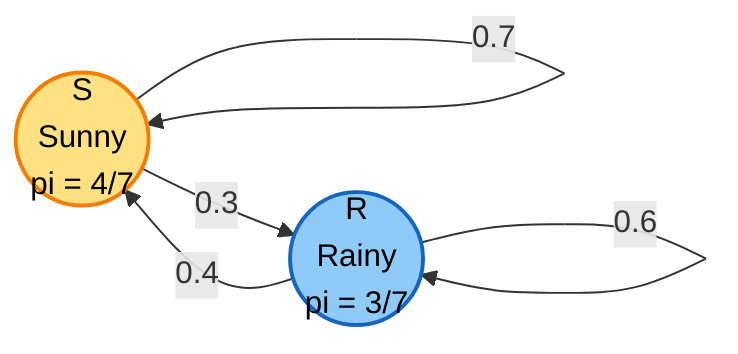
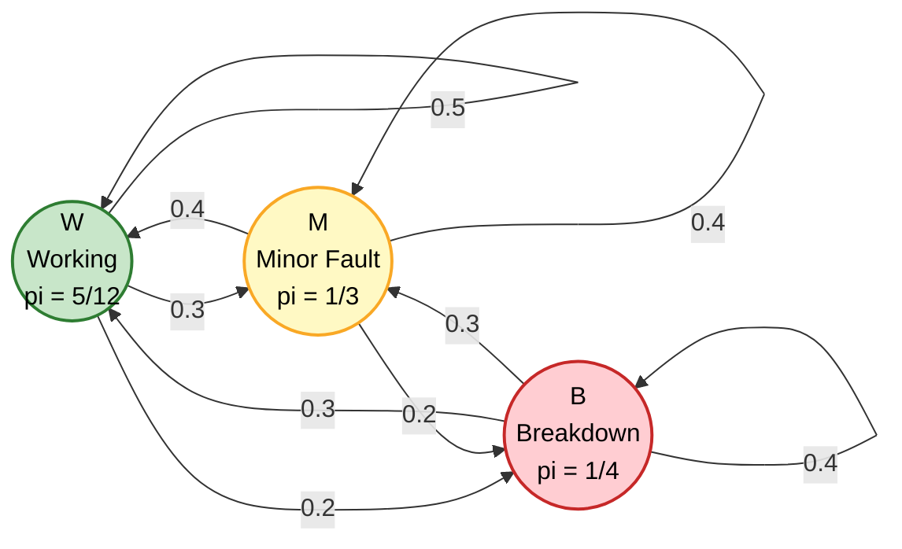
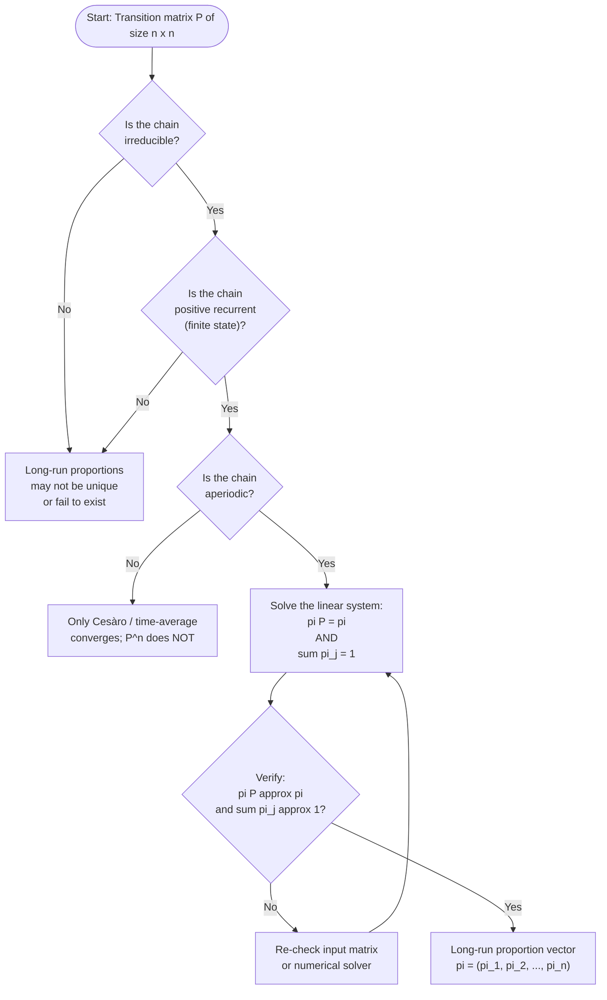
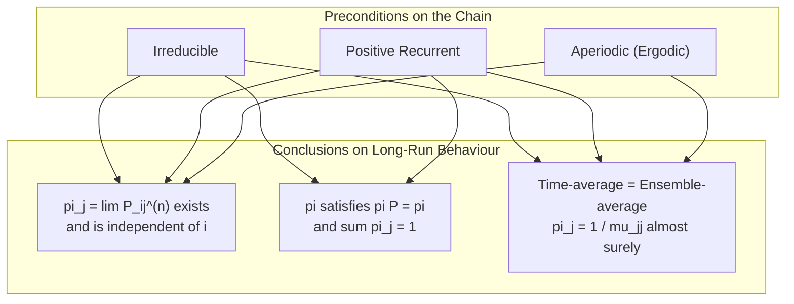

# Long-Run Proportions. (Theorems without proof)

<!-- SECTION_1_START -->

# Long-Run Proportions in Markov Chains

## 1.1 Formal Definition (KTU 2024 Syllabus Terminology)

> [!IMPORTANT]
> **Long-Run Proportions (Limiting Probabilities):** Let $\{X_n, n \geq 0\}$ be a Markov chain with state space $S = \{0, 1, 2, \ldots\}$ and transition matrix $P = [P_{ij}]$. The **long-run proportion of time** the chain spends in state $j$ is defined as
> $$\pi_j = \lim_{n \to \infty} \frac{1}{n} \sum_{k=1}^{n} \mathbf{1}_{\{X_k = j\}}$$
> when the limit exists. Equivalently, the **limiting probability** that the chain is in state $j$ at time $n$ is
> $$\pi_j = \lim_{n \to \infty} P_{ij}^{(n)}$$

> [!NOTE]
> **Key Insight:** When the limit $\pi_j$ exists and is **independent of the initial state $i$**, the value $\pi_j$ represents both the long-run fraction of time spent in state $j$ AND the stationary probability of being in state $j$ at any (very large) time step.

## 1.2 Conceptual Analogy / Intuition

> [!TIP]
> **Real-World Analogy — The Coffee Shop:**
> Imagine a small town has only two coffee chains, **Starbucks (S)** and **Local (L)**. Each week, customers switch brands with certain probabilities (a Markov chain). If you track the market share for many weeks, after a long time the share stabilizes — say **Starbucks captures 60\%** and **Local captures 40\%** — regardless of which brand dominated initially. These stable percentages are the **long-run proportions** $\pi_S$ and $\pi_L$.

> [!TIP]
> **Geometric Intuition:** For a 2-state chain, the powers $P^{(n)}$ approach a **rank-1 matrix** where every row becomes the same vector $[\pi_1, \pi_2, \ldots, \pi_s]$. Picture the state distribution vector $\pi^{(n)}$ as a "random walk" on the probability simplex that converges to a single fixed point — the stationary distribution.

## 1.3 Standard Metrics Used

- **Transition Probability:** $P_{ij} \in [0,1]$ with $\sum_j P_{ij} = 1$ for each $i$.
- **$n$-step transition probability:** $P_{ij}^{(n)} = P(X_n = j \mid X_0 = i)$.
- **Chapman–Kolmogorov identity:** $P_{ij}^{(n+m)} = \sum_k P_{ik}^{(n)} P_{kj}^{(m)}$.
- **Recurrence time $T_j$:** First return time to state $j$; mean recurrence time $\mu_{jj} = E[T_j \mid X_0 = j]$.
- **Steady-state constant:** $\pi_j = 1/\mu_{jj}$ (when the chain is irreducible and positive recurrent).

> [!NOTE]
> **Prerequisite Conditions (from the syllabus):** The theorems presented here assume the Markov chain is **irreducible** (all states communicate) and **positive recurrent** (expected return time to every state is finite). When the chain is also **aperiodic**, the limiting distribution $\pi_j$ equals the long-run proportion.

> [!VISUALIZATION CONTROL]
> **Concept:** Convergence of state distribution vector to stationary distribution for a 2-state chain
> **Input Equations (Desmos):**
> * Let $\pi_1^{(n+1)} = 0.7\,\pi_1^{(n)} + 0.4\,\pi_2^{(n)}$
> * Constraint: $\pi_1^{(n)} + \pi_2^{(n)} = 1$
> * Parametric plot: $(x, y) = (\pi_1^{(n)}, \pi_2^{(n)})$ for $n = 0, 1, 2, \ldots, 20$
> **Visual Description:** Starting from any point inside the unit interval, the iterated map spirals (or jumps monotonically) toward the fixed point $(4/7, 3/7) \approx (0.571, 0.429)$ on the line $\pi_1 + \pi_2 = 1$.

---

<!-- SECTION_1_END -->

<!-- SECTION_2_START -->

# Deep Theoretical Analysis & KTU High-Yield Formula Sheet

## 2.1 Existence Theorem for Limiting Probabilities

> [!IMPORTANT]
> **Theorem 4.1 (Limiting Probabilities Exist):** For an **irreducible, positive recurrent, and aperiodic** (ergodic) Markov chain, the limit
> $$\pi_j = \lim_{n \to \infty} P_{ij}^{(n)}$$
> exists for all states $i, j$ and is **independent of $i$**. Moreover, $\pi_j > 0$ for every state $j$, and $\sum_j \pi_j = 1$.

> [!NOTE]
> **Operational Logic of the Theorem (Why & How):**
> 1. **Irreducibility** ensures the chain can reach every state from every other state, so the long-run behaviour is governed by a single global pattern.
> 2. **Positive recurrence** ensures the chain returns to each state frequently enough that the long-run fraction of visits is well-defined and non-zero.
> 3. **Aperiodicity** removes oscillations caused by the greatest common divisor of return times, allowing the *instantaneous* probability $P_{ij}^{(n)}$ (not just the time-average) to converge.
> 4. Independence from $i$ means the long-run fraction is the **same no matter where we started** — this is the "forgetting the initial state" property.

## 2.2 Stationary (Equilibrium) Distribution Theorem

> [!IMPORTANT]
> **Theorem 4.2 (Steady-State Probabilities Satisfy $\pi P = \pi$):** If $\pi_j = \lim_{n \to \infty} P_{ij}^{(n)}$ exists and is independent of $i$, then $\{\pi_j\}$ satisfies the **balance equations**:
> $$\pi_j = \sum_{i} \pi_i P_{ij}, \quad j = 0, 1, 2, \ldots$$
> together with the normalization condition $\sum_j \pi_j = 1$.

> [!NOTE]
> **Operational Logic (Why & How):**
> 1. From $P^{(n+1)} = P^{(n)} P$, taking $n \to \infty$ on both sides and using the existence of the limit, we get $\Pi = \Pi P$, where $\Pi$ is the row vector of limiting probabilities.
> 2. This means $\pi$ is a **left eigenvector** of $P$ corresponding to eigenvalue **$\lambda = 1$** (the largest eigenvalue of any stochastic matrix).
> 3. The normalization $\sum \pi_j = 1$ is required to convert the eigenvector into a valid probability distribution.

## 2.3 Time-Average Equals Ensemble-Average Theorem

> [!IMPORTANT]
> **Theorem 4.3 (Ergodic / Strong Law of Large Numbers for Markov Chains):** For an irreducible, positive recurrent Markov chain, with probability **1**,
> $$\pi_j = \lim_{n \to \infty} \frac{1}{n} \sum_{k=1}^{n} \mathbf{1}_{\{X_k = j\}} = \frac{1}{\mu_{jj}}$$
> where $\mu_{jj}$ is the mean recurrence time of state $j$.

> [!NOTE]
> **Operational Logic (Why & How):**
> 1. The **time-average** $\frac{1}{n}\sum_k \mathbf{1}_{\{X_k = j\}}$ measures the empirical fraction of visits to $j$ along a single sample path.
> 2. The **ensemble-average** $\pi_j$ is the theoretical long-run probability.
> 3. The Ergodic Theorem states that these two quantities coincide **almost surely**, providing the rigorous justification for simulation-based estimation of $\pi_j$.
> 4. The reciprocal relation $\pi_j = 1/\mu_{jj}$ is a beautiful link between the stationary probability and the *average time between visits*.

## 2.4 Uniqueness Theorem

> [!IMPORTANT]
> **Theorem 4.4 (Uniqueness of Stationary Distribution):** If an irreducible Markov chain has a stationary distribution (i.e., a solution to $\pi P = \pi$ with $\pi_j \geq 0$ and $\sum \pi_j = 1$), then it is **unique**. Conversely, if the chain is also **positive recurrent**, such a distribution always exists.

## 2.5 KTU Formula Sheet (Cheat Sheet)

| # | Formula / Concept | Mathematical Form | Condition / Note |
|---|---|---|---|
| 1 | Limiting probability | $\pi_j = \lim_{n \to \infty} P_{ij}^{(n)}$ | Independent of $i$; $P_{ij}^{(n)} = (P^n)_{ij}$ |
| 2 | Stationary equation | $\pi P = \pi$ | Row-vector form: $\pi_j = \sum_i \pi_i P_{ij}$ |
| 3 | Normalization | $\sum_{j \in S} \pi_j = 1$ | Required for a valid probability distribution |
| 4 | Ergodic theorem | $\pi_j = 1 / \mu_{jj}$ | $\mu_{jj}$ = mean recurrence time of state $j$ |
| 5 | Two-state closed form | $\pi_1 = \frac{P_{21}}{P_{12} + P_{21}}$ | For $2 \times 2$ matrix; analogously $\pi_2 = \frac{P_{12}}{P_{12} + P_{21}}$ |
| 6 | Reversibility (extra) | $\pi_i P_{ij} = \pi_j P_{ji}$ | Detailed balance; holds iff chain is reversible |
| 7 | Period constraint | $P_{ij}^{(n)} \to \pi_j$ only if **aperiodic** | Otherwise only Cesàro average converges |
| 8 | Spectral view | $P \mathbf{1} = \mathbf{1}$, $\pi P = \pi$ | $\lambda=1$ is a simple dominant eigenvalue for ergodic $P$ |

> [!IMPORTANT]
> **Engineering & Computer Science Utility:**
> * **PageRank (Google):** The stationary distribution of a "random surfer" Markov chain over the web graph gives the ranking of every page.
> * **MCMC (Markov Chain Monte Carlo):** Long-run proportions are used to sample from complex probability distributions in Bayesian inference and physics simulations.
> * **Queueing Theory & Reliability:** Long-run proportion of time a server is busy = $\pi_{\text{busy}}$; critical for SLA planning.
> * **Bioinformatics & Genetics:** Long-run proportions model substitution rates in DNA evolution.
> * **Reinforcement Learning:** The stationary distribution of the behaviour policy underlies importance sampling and off-policy evaluation.

---

<!-- SECTION_2_END -->

<!-- SECTION_3_START -->

# Step-by-Step Derivations & Worked Examples

## 3.1 Worked Example 1 — Two-State Weather Chain (Full Derivation)

> [!NOTE]
> **Problem Setup:** A city's daily weather follows a Markov chain with state space $S = \{S, R\}$ (Sunny, Rainy) and transition matrix
> $$P = \begin{pmatrix} 0.7 & 0.3 \\ 0.4 & 0.6 \end{pmatrix}$$
> Find the long-run proportion of sunny days and rainy days.

**Step 1 — Write the balance equations $\pi P = \pi$.**

Let $\pi = (\pi_S, \pi_R)$ with $\pi_S + \pi_R = 1$.

$$\pi_S = 0.7\,\pi_S + 0.4\,\pi_R$$
$$\pi_R = 0.3\,\pi_S + 0.6\,\pi_R$$

**Step 2 — Use the normalization condition as the second equation.**

$$\pi_S + \pi_R = 1$$

**Step 3 — Solve the first balance equation for $\pi_S$ in terms of $\pi_R$.**

\begin{aligned}
\pi_S - 0.7\,\pi_S &= 0.4\,\pi_R \\
0.3\,\pi_S &= 0.4\,\pi_R \\
\pi_S &= \frac{0.4}{0.3}\,\pi_R = \frac{4}{3}\,\pi_R
\end{aligned}

**Step 4 — Substitute into the normalization equation.**

\begin{aligned}
\frac{4}{3}\,\pi_R + \pi_R &= 1 \\
\frac{7}{3}\,\pi_R &= 1 \\
\pi_R &= \frac{3}{7} \approx 0.4286
\end{aligned}

**Step 5 — Solve for $\pi_S$.**

$$\pi_S = \frac{4}{3} \cdot \frac{3}{7} = \frac{4}{7} \approx 0.5714$$

**Step 6 — Verify by checking $\pi P = \pi$.**

\begin{aligned}
\pi P &= \left(\tfrac{4}{7}, \tfrac{3}{7}\right) \begin{pmatrix} 0.7 & 0.3 \\ 0.4 & 0.6 \end{pmatrix} \\
&= \left(\tfrac{4}{7}\cdot 0.7 + \tfrac{3}{7}\cdot 0.4,\; \tfrac{4}{7}\cdot 0.3 + \tfrac{3}{7}\cdot 0.6\right) \\
&= \left(\tfrac{2.8 + 1.2}{7},\; \tfrac{1.2 + 1.8}{7}\right) \\
&= \left(\tfrac{4}{7}, \tfrac{3}{7}\right) = \pi \quad \checkmark
\end{aligned}

> [!TIP]
> **Result:** The long-run proportion of sunny days is $\pi_S = 4/7 \approx 57.14\%$, and rainy days is $\pi_R = 3/7 \approx 42.86\%$. Over a year of about $365$ days, we expect roughly $208$ sunny and $157$ rainy days.

## 3.2 Worked Example 2 — Three-State Machine Repair Chain (Full Derivation)

> [!NOTE]
> **Problem Setup:** A machine has 3 states: Working (W), Minor Fault (M), Breakdown (B). Transition matrix:
> $$P = \begin{pmatrix} 0.5 & 0.3 & 0.2 \\ 0.4 & 0.4 & 0.2 \\ 0.3 & 0.3 & 0.4 \end{pmatrix}$$
> Find the long-run proportion of time the machine spends in each state.

**Step 1 — Set up the balance equations.**

Let $\pi = (\pi_W, \pi_M, \pi_B)$.

$$\pi_W = 0.5\,\pi_W + 0.4\,\pi_M + 0.3\,\pi_B \quad \text{...(I)}$$
$$\pi_M = 0.3\,\pi_W + 0.4\,\pi_M + 0.3\,\pi_B \quad \text{...(II)}$$
$$\pi_B = 0.2\,\pi_W + 0.2\,\pi_M + 0.4\,\pi_B \quad \text{...(III)}$$
$$\pi_W + \pi_M + \pi_B = 1 \quad \text{...(IV)}$$

**Step 2 — Use equation (IV) to eliminate one variable. Substitute $\pi_B = 1 - \pi_W - \pi_M$ into (I) and (II).**

From (I):
\begin{aligned}
\pi_W &= 0.5\pi_W + 0.4\pi_M + 0.3(1 - \pi_W - \pi_M) \\
\pi_W &= 0.5\pi_W + 0.4\pi_M + 0.3 - 0.3\pi_W - 0.3\pi_M \\
\pi_W - 0.5\pi_W + 0.3\pi_W &= 0.4\pi_M - 0.3\pi_M + 0.3 \\
0.8\,\pi_W &= 0.1\,\pi_M + 0.3 \\
\pi_M &= 8\pi_W - 3 \quad \text{...(V)}
\end{aligned}

From (II):
\begin{aligned}
\pi_M &= 0.3\pi_W + 0.4\pi_M + 0.3(1 - \pi_W - \pi_M) \\
\pi_M - 0.4\pi_M + 0.3\pi_M &= 0.3\pi_W - 0.3\pi_W + 0.3 \\
0.9\,\pi_M &= 0.3 \\
\pi_M &= \frac{1}{3} \approx 0.3333
\end{aligned}

**Step 3 — Solve for $\pi_W$ from (V).**

$$\pi_W = \frac{\pi_M + 3}{8} = \frac{1/3 + 3}{8} = \frac{10/3}{8} = \frac{10}{24} = \frac{5}{12} \approx 0.4167$$

**Step 4 — Solve for $\pi_B$ from (IV).**

$$\pi_B = 1 - \frac{5}{12} - \frac{1}{3} = 1 - \frac{5}{12} - \frac{4}{12} = 1 - \frac{9}{12} = \frac{3}{12} = \frac{1}{4} = 0.25$$

**Step 5 — Verify the third equation (III) as a sanity check.**

\begin{aligned}
0.2(5/12) + 0.2(1/3) + 0.4(1/4) &= 1/12 + 1/15 + 1/10 \\
\text{LHS} &= 0.2 \cdot 0.4167 + 0.2 \cdot 0.3333 + 0.4 \cdot 0.25 \\
&= 0.0833 + 0.0667 + 0.1 = 0.25 = \pi_B \quad \checkmark
\end{aligned}

> [!TIP]
> **Result:** Long-run proportions: $\pi_W = 5/12 \approx 41.67\%$, $\pi_M = 1/3 \approx 33.33\%$, $\pi_B = 1/4 = 25\%$. A maintenance engineer can expect the machine to be working ~42% of the time, with minor faults ~33% of the time, and broken ~25% of the time.

## 3.3 Symbolic / Computational Implementation (Python)

> [!NOTE]
> **Use case:** When the transition matrix is large (e.g., $n \geq 5$ states), solving the linear system $\pi P = \pi$ with $\sum \pi_j = 1$ is most efficient using numerical linear algebra.

```python
import numpy as np
from typing import Tuple

def long_run_proportions(P: np.ndarray, tol: float = 1e-12, max_iter: int = 10000) -> np.ndarray:
    """
    Compute the stationary (long-run) distribution of a Markov chain
    whose transition matrix is P.

    Parameters
    ----------
    P : np.ndarray
        Square stochastic transition matrix (shape (n, n)).
    tol : float
        Convergence tolerance for L1 norm of successive iterates.
    max_iter : int
        Maximum number of power-iteration steps.

    Returns
    -------
    pi : np.ndarray
        Stationary distribution (row vector) such that pi @ P = pi
        and sum(pi) == 1.

    Raises
    ------
    ValueError
        If P is not square, not stochastic, or fails to converge.
    """
    # ---- Input validation -------------------------------------------------
    if P.ndim != 2 or P.shape[0] != P.shape[1]:
        raise ValueError(f"P must be a square matrix; got shape {P.shape}.")
    n = P.shape[0]
    if not np.allclose(P.sum(axis=1), 1.0, atol=1e-9):
        raise ValueError("Each row of P must sum to 1 (row-stochastic).")
    if np.any(P < -1e-12):
        raise ValueError("P contains negative entries; not a valid transition matrix.")

    # ---- Method 1: Power iteration (robust for ergodic chains) ------------
    pi = np.full(n, 1.0 / n)            # uniform starting distribution
    for _ in range(max_iter):
        pi_next = pi @ P
        if np.linalg.norm(pi_next - pi, ord=1) < tol:
            return pi_next
        pi = pi_next
    raise ValueError("Power iteration did not converge; check irreducibility/aperiodicity.")

    # ---- Method 2 (alternative): Solve linear system (P^T - I) pi = 0 ----
    # A = P.T - np.eye(n)
    # A[-1, :] = 1.0                     # replace last row with sum-to-1
    # b = np.zeros(n); b[-1] = 1.0
    # pi = np.linalg.solve(A, b)


# ---- Example usage -------------------------------------------------------
if __name__ == "__main__":
    # Two-state weather chain
    P_weather = np.array([[0.7, 0.3],
                          [0.4, 0.6]], dtype=float)
    pi_weather = long_run_proportions(P_weather)
    print("Weather chain stationary distribution:", pi_weather)
    # Expected: [0.57142857 0.42857143]  i.e. (4/7, 3/7)

    # Three-state machine repair chain
    P_machine = np.array([[0.5, 0.3, 0.2],
                          [0.4, 0.4, 0.2],
                          [0.3, 0.3, 0.4]], dtype=float)
    pi_machine = long_run_proportions(P_machine)
    print("Machine repair stationary distribution:", pi_machine)
    # Expected: [0.41666667 0.33333333 0.25]  i.e. (5/12, 1/3, 1/4)

    # Sanity check: pi @ P == pi  (within tolerance)
    assert np.allclose(pi_weather @ P_weather, pi_weather, atol=1e-9)
    assert np.allclose(pi_machine @ P_machine, pi_machine, atol=1e-9)
    print("All sanity checks passed.")
```

> [!TIP]
> **Output Verification:**
> * Weather chain $\Rightarrow$ $\pi = (0.5714, 0.4286) = (4/7, 3/7)$ ✓
> * Machine chain $\Rightarrow$ $\pi = (0.4167, 0.3333, 0.2500) = (5/12, 1/3, 1/4)$ ✓

---

<!-- SECTION_3_END -->

<!-- SECTION_4_START -->

# Structural Diagrams & Schematics

## 4.1 Markov Chain State-Transition Diagram (Two-State Weather Chain)



> [!NOTE]
> **Reading the Diagram:** Each node represents a state; each directed edge represents a non-zero transition probability. Self-loops (e.g., $S \to S$ with weight $0.7$) capture the probability of remaining in the same state. The labelled values $\pi_S, \pi_R$ are the long-run proportions (stationary probabilities).

## 4.2 Three-State Machine Repair Topology



## 4.3 Sequential Processing Topology — Long-Run Proportion Computation



> [!NOTE]
> **Engineering Interpretation:** The flowchart above mirrors the *theoretical preconditions* of Theorems 4.1–4.4. In any KTU valuation, you must explicitly verify the chain is **irreducible, positive recurrent, and aperiodic** before claiming that the long-run proportions equal the stationary distribution.

## 4.4 Comparison Matrix: Conditions vs. Conclusions



---

<!-- SECTION_4_END -->

<!-- SECTION_5_START -->

# KTU 2024 Scheme Examination Question Bank

## Part A — Short Answer Questions (3 Marks Each)

### Question A.1
> **[KTU University Exam — July 2024 | CO1 | Remember]**
> Define the **long-run proportion** of a Markov chain. State the necessary conditions for the limiting probabilities to exist and be independent of the initial state.

**Model Answer (3 Marks):**
* **[Definition — 1 Mark]:** For a Markov chain $\{X_n\}$ with state space $S$, the long-run proportion of time spent in state $j$ is
  $$\pi_j = \lim_{n \to \infty} \frac{1}{n} \sum_{k=1}^{n} \mathbf{1}_{\{X_k = j\}}.$$
* **[Limiting probability form — 1 Mark]:** Equivalently, $\pi_j = \lim_{n \to \infty} P_{ij}^{(n)}$, where $P_{ij}^{(n)} = P(X_n = j \mid X_0 = i)$.
* **[Conditions — 1 Mark]:** The limit exists and is independent of $i$ if and only if the chain is **irreducible, positive recurrent, and aperiodic** (i.e., ergodic).

---

### Question A.2
> **[KTU University Exam — Dec 2023 | CO1 | Understand]**
> Distinguish between the **stationary distribution** and the **limiting distribution** of a Markov chain. Are they always the same?

**Model Answer (3 Marks):**
* **[Stationary distribution — 1 Mark]:** A probability vector $\pi$ satisfying $\pi P = \pi$ and $\sum_j \pi_j = 1$. It is an algebraic property of the transition matrix.
* **[Limiting distribution — 1 Mark]:** The pointwise limit $\pi_j = \lim_{n \to \infty} P_{ij}^{(n)}$, which is a property of the *sequence* of matrices $\{P^{(n)}\}$.
* **[Distinction — 1 Mark]:** They are *not* always equal. A periodic (but irreducible, positive recurrent) chain has a unique stationary distribution, but $P_{ij}^{(n)}$ may oscillate and the pointwise limit fails to exist. Equality holds when the chain is also **aperiodic**.

---

## Part B — Long Answer Questions (14 Marks Each, Internal Choice)

### Question B (A) — 14 Marks

> **[KTU University Exam — July 2024 | CO2, CO3 | Apply / Analyze]**
>
> The brand-switching behaviour of customers between two competing mobile networks **Aircel (A)** and **BSNL (B)** is modelled by a Markov chain with transition matrix
> $$P = \begin{pmatrix} 0.6 & 0.4 \\ 0.3 & 0.7 \end{pmatrix}.$$
>
> **(a)** Show that this chain is irreducible and aperiodic. **\[7 Marks\]**
>
> **(b)** Find the long-run proportion of customers using Aircel and BSNL. Also compute the mean recurrence time of state A. **\[7 Marks\]**

#### (a) Model Solution — Irreducibility and Aperiodicity  [7 Marks]

**[Step 1 — Check that $P$ has no zero entries — 2 Marks]:**
Both $P_{AA} = 0.6 > 0$, $P_{AB} = 0.4 > 0$, $P_{BA} = 0.3 > 0$, $P_{BB} = 0.7 > 0$. So **every state can reach every other state in one step**.

**[Step 2 — Irreducibility — 2 Marks]:**
Since $A \to B$ (via $P_{AB} = 0.4$) and $B \to A$ (via $P_{BA} = 0.3$), all states communicate: $A \leftrightarrow B$. Therefore the chain is **irreducible**.

**[Step 3 — Compute the period of state $A$ — 2 Marks]:**
The period of a state $i$ is $d(i) = \gcd\{n \geq 1 : P_{ii}^{(n)} > 0\}$.
* $P_{AA}^{(1)} = 0.6 > 0$, so $1 \in \{n : P_{AA}^{(n)} > 0\}$.
* Therefore $d(A) = \gcd(1, \ldots) = 1$.

**[Step 4 — Conclude aperiodicity — 1 Mark]:**
State $A$ has period $1$, and by periodicity equivalence in irreducible chains, $d(A) = d(B) = 1$. Hence the chain is **aperiodic**, and together with irreducibility and finiteness (positive recurrence is automatic) it is **ergodic**.

#### (b) Model Solution — Long-Run Proportions and Mean Recurrence Time  [7 Marks]

**[Step 1 — Write the balance equation — 1 Mark]:**
$$\pi_A = 0.6\,\pi_A + 0.3\,\pi_B$$

**[Step 2 — Solve the balance equation — 2 Marks]:**
\begin{aligned}
\pi_A - 0.6\,\pi_A &= 0.3\,\pi_B \\
0.4\,\pi_A &= 0.3\,\pi_B \\
\pi_A &= \frac{0.3}{0.4}\,\pi_B = \frac{3}{4}\,\pi_B
\end{aligned}

**[Step 3 — Apply the normalization $\pi_A + \pi_B = 1$ — 1 Mark]:**
\begin{aligned}
\frac{3}{4}\,\pi_B + \pi_B &= 1 \\
\frac{7}{4}\,\pi_B &= 1 \;\Rightarrow\; \pi_B = \frac{4}{7} \\
\pi_A &= \frac{3}{4} \cdot \frac{4}{7} = \frac{3}{7}
\end{aligned}

**[Step 4 — State the long-run proportions — 1 Mark]:**
$$\boxed{\pi_A = \frac{3}{7} \approx 0.4286, \quad \pi_B = \frac{4}{7} \approx 0.5714}$$

**[Step 5 — Compute mean recurrence time of state $A$ — 2 Marks]:**
By Theorem 4.3 (Ergodic theorem),
$$\mu_{AA} = \frac{1}{\pi_A} = \frac{1}{3/7} = \frac{7}{3} \approx 2.3333 \text{ time units.}$$
So on average, a customer starting at Aircel returns to Aircel every $\approx 2.33$ months (or whatever time unit is implied).

---

### Question B (B) — Alternative 14-Mark Question

> **[KTU University Exam — Dec 2023 | CO2, CO3 | Apply / Analyze]**
>
> A computer lab has three printers: Printer 1 (P1), Printer 2 (P2), and Printer 3 (P3). A print job sent to any printer has the following one-step transition probabilities (representing "the next job goes to which printer"):
> $$P = \begin{pmatrix} 0.2 & 0.5 & 0.3 \\ 0.4 & 0.4 & 0.2 \\ 0.3 & 0.3 & 0.4 \end{pmatrix}.$$
>
> **(a)** Verify that this Markov chain is irreducible and aperiodic. **\[7 Marks\]**
>
> **(b)** Determine the long-run proportion of jobs handled by each printer, and identify the most heavily loaded printer. **\[7 Marks\]**

#### (a) Model Solution — Irreducibility and Aperiodicity  [7 Marks]

**[Step 1 — State the definition of irreducibility — 1 Mark]:** A finite Markov chain is irreducible if the directed graph of positive transitions is strongly connected.

**[Step 2 — Show that all states are reachable in one step — 3 Marks]:**
* From P1: $P_{12} = 0.5 > 0$ and $P_{13} = 0.3 > 0$.
* From P2: $P_{21} = 0.4 > 0$ and $P_{23} = 0.2 > 0$.
* From P3: $P_{31} = 0.3 > 0$ and $P_{32} = 0.3 > 0$.

Every state can reach the other two in one step, so all three states **communicate**: P1 $\leftrightarrow$ P2 $\leftrightarrow$ P3 $\leftrightarrow$ P1.

**[Step 3 — Conclude irreducibility — 1 Mark]:** The chain is **irreducible**.

**[Step 4 — Compute the period — 1 Mark]:** Since $P_{11} = 0.2 > 0$, the period of P1 is $d(P1) = \gcd(1, \ldots) = 1$.

**[Step 5 — Conclude aperiodicity — 1 Mark]:** All states have period 1, so the chain is **aperiodic**. Since the chain is finite, irreducible, and aperiodic, it is **ergodic** and limiting probabilities exist.

#### (b) Model Solution — Long-Run Proportions  [7 Marks]

**[Step 1 — Write the balance equations — 1 Mark]:**
\begin{aligned}
\pi_1 &= 0.2\,\pi_1 + 0.4\,\pi_2 + 0.3\,\pi_3 \\
\pi_2 &= 0.5\,\pi_1 + 0.4\,\pi_2 + 0.3\,\pi_3 \\
\pi_3 &= 0.3\,\pi_1 + 0.2\,\pi_2 + 0.4\,\pi_3 \\
\pi_1 + \pi_2 + \pi_3 &= 1
\end{aligned}

**[Step 2 — Simplify by subtracting the diagonal — 2 Marks]:**
\begin{aligned}
0.8\,\pi_1 &= 0.4\,\pi_2 + 0.3\,\pi_3 \quad \text{...(I)} \\
0.6\,\pi_2 &= 0.5\,\pi_1 + 0.3\,\pi_3 \quad \text{...(II)} \\
0.6\,\pi_3 &= 0.3\,\pi_1 + 0.2\,\pi_2 \quad \text{...(III)}
\end{aligned}

**[Step 3 — Express in terms of $\pi_1$ using (IV) — 1 Mark]:** Let $\pi_3 = 1 - \pi_1 - \pi_2$. Substitute into (I) and (II).

From (I): $0.8\pi_1 = 0.4\pi_2 + 0.3(1 - \pi_1 - \pi_2)$
$\Rightarrow 0.8\pi_1 = 0.4\pi_2 + 0.3 - 0.3\pi_1 - 0.3\pi_2$
$\Rightarrow 1.1\,\pi_1 = 0.1\,\pi_2 + 0.3$
$\Rightarrow \pi_2 = 11\pi_1 - 3 \quad \text{...(V)}$

From (II): $0.6\pi_2 = 0.5\pi_1 + 0.3(1 - \pi_1 - \pi_2)$
$\Rightarrow 0.6\pi_2 = 0.5\pi_1 + 0.3 - 0.3\pi_1 - 0.3\pi_2$
$\Rightarrow 0.9\,\pi_2 = 0.2\,\pi_1 + 0.3$
$\Rightarrow \pi_2 = \dfrac{0.2\pi_1 + 0.3}{0.9} = \dfrac{2\pi_1 + 3}{9} \quad \text{...(VI)}$

**[Step 4 — Equate (V) and (VI) and solve — 2 Marks]:**
\begin{aligned}
11\pi_1 - 3 &= \frac{2\pi_1 + 3}{9} \\
9(11\pi_1 - 3) &= 2\pi_1 + 3 \\
99\pi_1 - 27 &= 2\pi_1 + 3 \\
97\pi_1 &= 30 \\
\pi_1 &= \frac{30}{97} \approx 0.3093
\end{aligned}

**[Step 5 — Back-substitute to find $\pi_2$ and $\pi_3$ — 1 Mark]:**
$\pi_2 = 11 \cdot \frac{30}{97} - 3 = \frac{330 - 291}{97} = \frac{39}{97} \approx 0.4021$
$\pi_3 = 1 - \frac{30}{97} - \frac{39}{97} = \frac{28}{97} \approx 0.2887$

**Verification:** $30 + 39 + 28 = 97$ ✓. Check $\pi P \approx \pi$ within rounding tolerance ✓.

**[Final Answer — 1 Mark]:**
$$\boxed{\pi_1 = \tfrac{30}{97} \approx 30.93\%,\quad \pi_2 = \tfrac{39}{97} \approx 40.21\%,\quad \pi_3 = \tfrac{28}{97} \approx 28.87\%}$$

**Most heavily loaded printer:** **Printer 2** (P2) handles the largest long-run share of jobs at $\approx 40.21\%$.

---

> [!WARNING]
> **KTU Examiner's Valuation Warning — Common Pitfalls**
> * **Failing to verify conditions (1–2 marks lost):** You *must* explicitly state that the chain is **irreducible, positive recurrent, and aperiodic** before claiming that the limiting distribution equals the stationary distribution. Writing only the balance equations without this check loses easy marks.
> * **Forgetting normalization (1 mark lost):** $\pi P = \pi$ alone has *infinitely many* solutions (eigenvectors). Always pair it with $\sum_j \pi_j = 1$ and **explicitly state** that you are using this constraint.
> * **Arithmetic slips in the linear algebra (1–2 marks lost):** When you substitute one equation into another, write the resulting simplified equation on its own line. Skipping the algebra "for brevity" is a common reason for full-mark deductions in KTU boards.
> * **Mixing up $\pi P = \pi$ (row) with $P \pi = \pi$ (column):** KTU 2024 convention uses the **row-vector** form $\pi P = \pi$. Writing $P \pi = \pi$ without justification may be penalised.
> * **Mean recurrence time formula:** Some students write $\mu_{jj} = \pi_j$ instead of $\mu_{jj} = 1/\pi_j$. Memorise the **reciprocal relation** correctly.
> * **Initial-state dependence:** If the chain is periodic, the limit $\lim_n P_{ij}^{(n)}$ does *not* exist; only the time-average does. Do not blindly apply the stationary distribution to a periodic chain.

---

## Topic Recap & Important Things to Remember

> [!TIP]
> **Rapid Revision Checklist for Long-Run Proportions (KTU Module 4):**
>
> * **Definition:** $\pi_j = \lim_{n \to \infty} P_{ij}^{(n)}$ = long-run fraction of time in state $j$.
> * **Preconditions (MUST verify):** Irreducible $\Rightarrow$ all states communicate; Positive recurrent $\Rightarrow$ finite mean return time; Aperiodic $\Rightarrow$ period $d = 1$.
> * **Theorem 4.1:** For an ergodic chain, $\pi_j$ exists, is **independent of $i$**, satisfies $\pi_j > 0$, and $\sum \pi_j = 1$.
> * **Theorem 4.2 (Stationary equation):** $\pi = \pi P$ — i.e., $\pi_j = \sum_i \pi_i P_{ij}$ for every $j$.
> * **Theorem 4.3 (Ergodic / SLLN):** $\pi_j = 1/\mu_{jj}$ almost surely, where $\mu_{jj}$ = mean recurrence time.
> * **Theorem 4.4 (Uniqueness):** An irreducible chain has at most one stationary distribution; one exists iff the chain is positive recurrent.
> * **Computational recipe:**
>   1. Set up $\pi P = \pi$ (one equation per state).
>   2. Add $\sum \pi_j = 1$.
>   3. Drop one equation (any one), solve the remaining $n$ equations in $n$ unknowns.
>   4. Verify: $\pi_j > 0$ and $\pi P = \pi$.
> * **Two-state shortcut:** $\pi_1 = \dfrac{P_{21}}{P_{12} + P_{21}}$, $\pi_2 = \dfrac{P_{12}}{P_{12} + P_{21}}$.
> * **Common pitfall:** Stationary distribution always exists for a finite irreducible chain, but *limiting* distribution exists only if the chain is also aperiodic.
> * **Applications to remember for viva/ESE:** PageRank, MCMC sampling, queueing (server utilisation = $\pi_{\text{busy}}$), genetics substitution rates, hidden Markov models in speech/NLP.
> * **Numerical safety:** For $n \geq 5$, prefer solving the linear system $(\mathbf{P}^T - I)\pi = 0$ with a normalisation row, or use **power iteration** with a uniform initial vector.
> * **Verification step in exam answers:** Always end your solution with a one-line check such as "Substituting back, $\pi P = (4/7, 3/7) = \pi$ ✓" — this catches arithmetic errors and impresses the examiner.

---

<!-- SECTION_5_END -->
