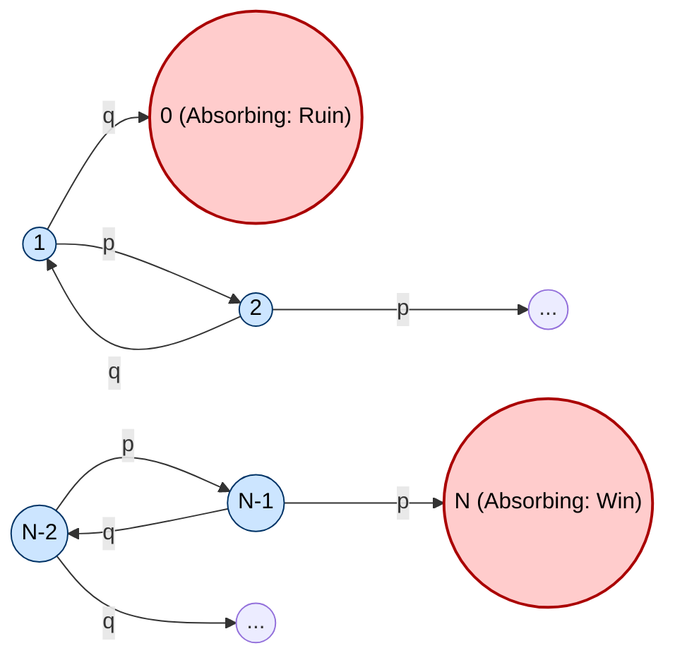
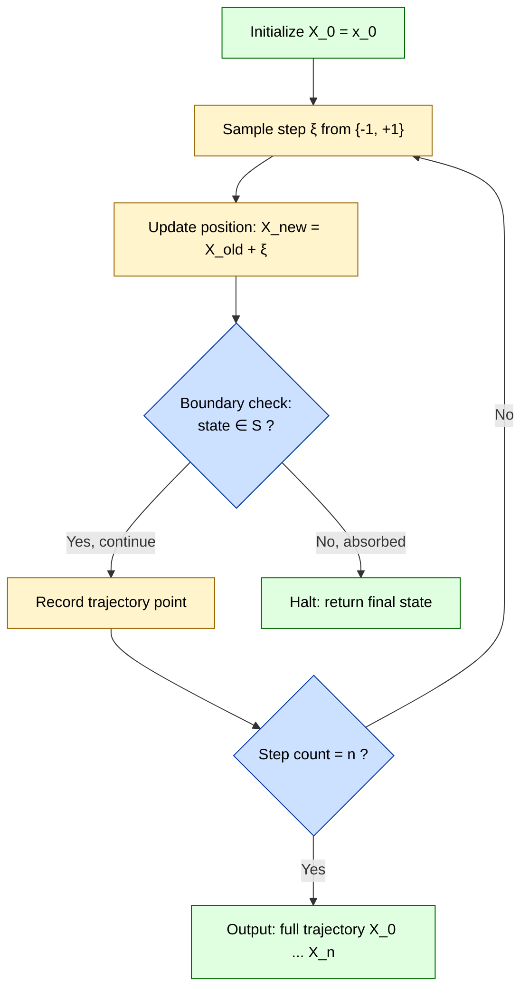
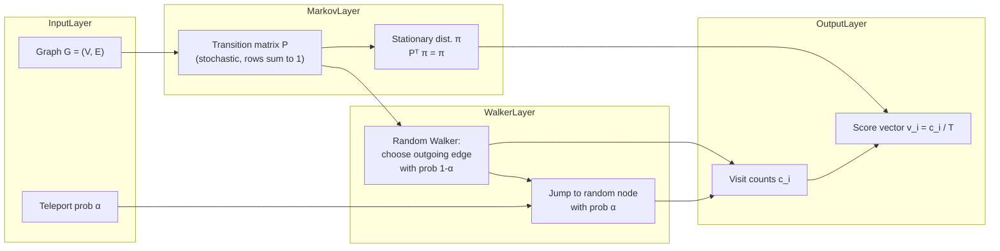
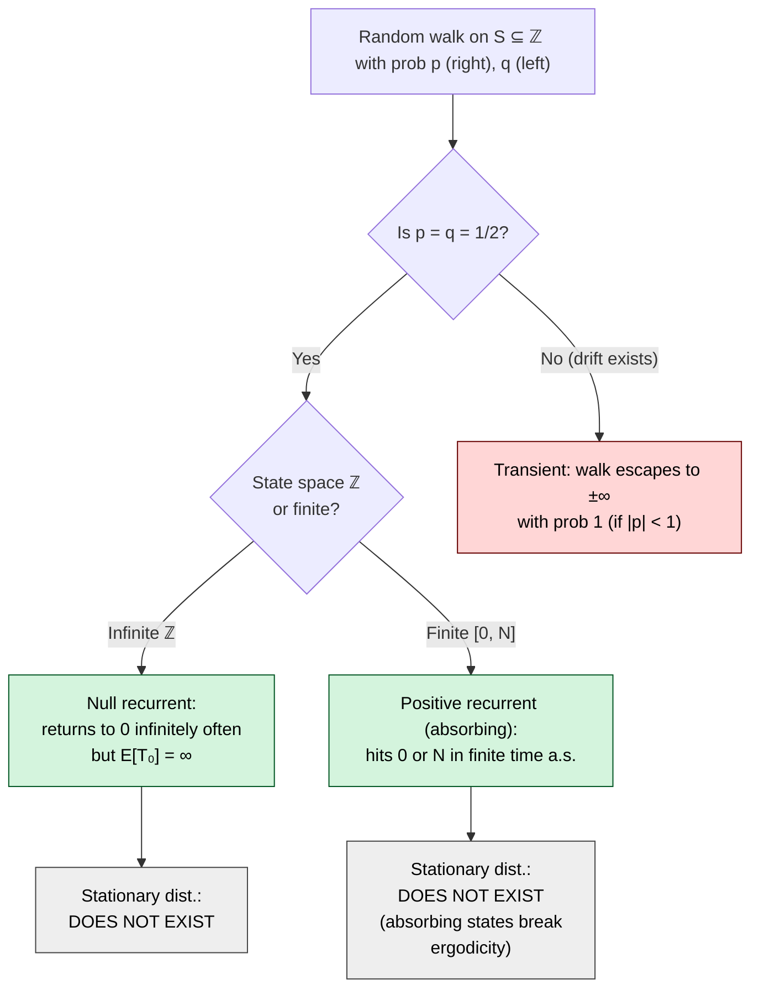

# Random Walk Model

<!-- SECTION_1_START -->
# Random Walk Model

## 1. Core Technical Definition

> [!NOTE]
> **KTU 2024 Scheme Definition (GAMAT301 - Module 4)**
> A **Random Walk** is a discrete-time stochastic process $\{X_n : n \geq 0\}$ defined on the integer lattice $\mathbb{Z}$ (or a finite subset thereof) in which the position after the $(n+1)$-th step is obtained by adding a random increment $\xi_{n+1}$ to the current position. Formally:
> $$X_{n+1} = X_n + \xi_{n+1}$$
> where the increments $\{\xi_n\}$ are **independent and identically distributed (i.i.d.)** random variables. The sequence $\{X_n\}$ is a **time-homogeneous Markov chain** with state space $S \subseteq \mathbb{Z}$ because the future position depends only on the present one and not on the history of the path.

### Classification of Random Walks (KTU Syllabus Scope)

| Type | State Space | Transition Rule | Use Case |
|------|------------|-----------------|----------|
| **Simple Symmetric Random Walk (SSRW)** | $\mathbb{Z}$ | $P(i \to i+1) = P(i \to i-1) = \tfrac{1}{2}$ | Coin-flip games, drift-free particles |
| **Simple Asymmetric Random Walk (SARW)** | $\mathbb{Z}$ | $P(i \to i+1) = p,\; P(i \to i-1) = q = 1-p,\; p \neq \tfrac{1}{2}$ | Biased particle motion, stock price increments |
| **Biased Walk on $[0, N]$ (Gambler's Ruin)** | $\{0, 1, \dots, N\}$ | $P(i \to i+1) = p,\; P(i \to i-1) = q$ with absorbing boundaries | Ruin probability in betting |
| **Multi-Dimensional Random Walk** | $\mathbb{Z}^d,\ d \geq 2$ | Independent walk along each axis | Brownian motion analogy, lattice physics |

> [!IMPORTANT]
> **Key Constant in SSRW:** The mean step size $E[\xi_n] = 0$ and the variance $\text{Var}(\xi_n) = 1$. The **drift** of the walk is $\mu = p - q$. For SSRW, $\mu = 0$.

---

### 2. Conceptual Analogy / Intuition

Imagine a **drunk person standing on an infinite straight line, marked with integers at every meter** (the classic *Drunkard's Walk* model). At every second (each time step), he takes one step:
- with probability $p$, he stumbles **one meter to the right**,
- with probability $q = 1-p$, he stumbles **one meter to the left**,
- and the direction of the *next* step does **not** depend on how he got to his current spot — only on where he is *right now*.

This is exactly a **first-order Markov property**: "where I go next depends only on where I am, not on the path that brought me here."

Another analogy is the **stock-market closing price** plotted daily. The daily change is essentially a random increment; hence price series are often modeled as random walks. The 2024 KTU examiner commonly uses this intuition in problems on hitting probability and ruin probability.

> [!VISUALIZATION CONTROL]
> **Concept:** Trajectory of a Simple Symmetric Random Walk in 1-D
> **GeoGebra / Desmos Input Equations:**
> * `x_n = sum_{k=1..n} (2*random(0,1) - 1)` (discrete step function)
> * Plot as a connected polyline: `(0, 0), (1, x_1), (2, x_2), \dots, (100, x_100)`
> **Visual Description:** A jagged line oscillating around the horizontal axis. The amplitude grows roughly like $\sqrt{n}$ (because variance is $n$). For $p \neq 1/2$, the trajectory drifts linearly away from the origin with slope $p - q$.

---

## 3. Why It Matters in Computer Science

Random walks power several production systems and algorithms:
- **PageRank** (Brin & Page, 1998) — Google's original ranking algorithm models a web surfer as a random walker on the hyperlink graph.
- **Markov Chain Monte Carlo (MCMC)** — Random walks sample from complex probability distributions.
- **Community detection** in social networks — random walks reveal densely connected clusters.
- **Cryptographic key generation** and **hash-chain puzzles** (Bitcoin's Hashcash).
- **Reinforcement Learning** — policy evaluation through stochastic trajectories.

<!-- SECTION_1_END -->

<!-- SECTION_2_START -->
# Deep Theoretical Analysis & KTU High-Yield Formula Sheet

## 1. Mathematical Formulation

A one-dimensional random walk $\{X_n\}_{n \geq 0}$ on $S = \mathbb{Z}$ is fully specified by the triple:

$$X_0 = x_0 \in \mathbb{Z}, \qquad P(X_{n+1} = i+1 \mid X_n = i) = p, \qquad P(X_{n+1} = i-1 \mid X_n = i) = q = 1-p.$$

**Markov Property Verification.** For any $A \subseteq \mathbb{Z}$,
$$P(X_{n+1} \in A \mid X_0, X_1, \dots, X_n) = P(X_{n+1} \in A \mid X_n).$$
This holds because the step $\xi_{n+1}$ is independent of $X_0, \dots, X_n$, and $X_{n+1} = X_n + \xi_{n+1}$.

**Decomposition into Increments.** Writing $X_n = X_0 + \sum_{k=1}^{n} \xi_k$ where $\xi_k$ are i.i.d. with $P(\xi_k = +1) = p$ and $P(\xi_k = -1) = q$:
- $E[\xi_k] = p - q \equiv \mu$
- $\text{Var}(\xi_k) = 4pq \equiv \sigma^2$

By the **Law of Large Numbers**, $X_n / n \to \mu$ a.s., and by the **Central Limit Theorem**, $X_n \approx \mathcal{N}(n\mu,\, n\sigma^2)$ for large $n$.

---

## 2. State Classification for the Infinite Random Walk

For $S = \mathbb{Z}$ with $0 < p < 1$:

| Property | Result | Reason |
|----------|--------|--------|
| **Irreducibility** | Always irreducible | Every state can reach every other state |
| **Periodicity** | Periodic with period **2** (bipartite graph) | Even $\to$ Odd $\to$ Even |
| **Aperiodicity check** | Aperiodic **only if** $p = 0$ or $p = 1$ (degenerate) | At least one self-loop is required |
| **Recurrence** | Recurrent when $p = q = 1/2$ | Polya's theorem: $d \geq 2$ is always recurrent; $d=1$ recurrent only at $p=1/2$ |
| **Transience** | Transient when $p \neq 1/2$ | The walk drifts to $\pm\infty$ and almost surely never returns |

> [!IMPORTANT]
> **State Recurrence Theorem (Feller):** A 1-D SSRW is *recurrent* — it returns to 0 infinitely often with probability **1**. The expected return time is $E[T_0] = \infty$ (a null recurrent state).

---

## 3. KTU High-Yield Formula Sheet

| # | Formula | Meaning | Use in Exam |
|---|---------|---------|-------------|
| 1 | $P(X_n = k \mid X_0 = 0) = \binom{n}{(n+k)/2} p^{(n+k)/2} q^{(n-k)/2}$ | Position after $n$ steps | Required $n+k$ is even and $-n \leq k \leq n$ |
| 2 | $E[X_n] = n(p-q)$ | Mean position | Linear drift |
| 3 | $\text{Var}(X_n) = 4npq$ | Spread of position | $\sigma_n = 2\sqrt{npq}$ |
| 4 | $P(\text{ever reach } b > 0 \mid X_0 = 0) = \begin{cases} 1 & \text{if } p \geq q \\ (p/q)^0 = 1 \text{ (only if } p = q = 1/2) \end{cases}$ | Hitting prob. in SSRW | SSRW visits every integer with prob. 1 |
| 5 | $P(\text{ruin} \mid X_0 = i) = \dfrac{1 - (p/q)^i}{1 - (p/q)^N}$ for $p \neq q$ | Gambler's ruin prob. | Betting ruin problem |
| 6 | $P(\text{ruin} \mid X_0 = i) = \dfrac{N - i}{N}$ for $p = q = 1/2$ | Fair-game ruin prob. | Symmetric case |
| 7 | Stationary distribution of SSRW | **None exists** in $\mathbb{Z}$ | Recurrent but not positive recurrent |
| 8 | Generating function: $G_{X_n}(s) = (ps + qs^{-1})^n$ | PGF of position | Used for n-step derivation |

> **Exam tip:** Mark the parity condition explicitly. If $n$ and $k$ have different parities, $P(X_n = k) = 0$. KTU examiners award partial credit for stating this *before* computing.

---

## 4. Real-World Utility

- **Computer Networks:** Random walk models packet routing delays in ad-hoc networks.
- **Queuing Theory:** Asymptotic waiting time in M/G/1 queues resembles SSRW.
- **Reinforcement Learning:** Random walk policies are the standard textbook example (Sutton & Barto, Ch. 6).
- **Computational Biology:** DNA sequence alignment scoring is modeled by biased random walks.
- **Stock Forecasting:** Efficient Market Hypothesis asserts stock prices are random walks.
- **Page Ranking:** Random walk on the web graph (with teleportation) ranks pages.

<!-- SECTION_2_END -->

<!-- SECTION_3_START -->
# Step-by-Step Derivations & Symbolic Implementation

## 1. Derivation of the n-Step Transition Probability

We seek $P^{(n)}(0, k) = P(X_n = k \mid X_0 = 0)$.

**Step 1 — Express position as sum of steps.**
After $n$ steps, suppose the walker makes $r$ right-steps and $\ell$ left-steps. Then
$$r + \ell = n, \qquad r - \ell = k \quad \Longrightarrow \quad r = \frac{n+k}{2}, \quad \ell = \frac{n-k}{2}.$$

**Step 2 — Enumerate favorable sequences.**
The number of sequences with exactly $r$ rights and $\ell$ lefts is the binomial coefficient
$$\binom{n}{r} = \binom{n}{(n+k)/2}.$$
This is well-defined only when $n+k$ is even and $-n \leq k \leq n$.

**Step 3 — Multiply by per-sequence probability.**
Each specific sequence has probability $p^r q^\ell$, since steps are independent.

**Step 4 — Combine.**
$$\boxed{\,P(X_n = k \mid X_0 = 0) = \binom{n}{\frac{n+k}{2}} p^{\frac{n+k}{2}} q^{\frac{n-k}{2}}\,}$$
valid for $k \in \{-n, -n+2, \dots, n-2, n\}$.

> **Sanity check (SSRW, $n=2, k=0$):** $P(X_2 = 0) = \binom{2}{1}(\tfrac{1}{2})^2 = 2 \cdot \tfrac{1}{4} = \tfrac{1}{2}$. The two paths are R-L and L-R. ✓

---

## 2. Derivation of Mean and Variance

Let $S_n = X_n - X_0 = \sum_{i=1}^{n} \xi_i$, where $P(\xi_i = +1) = p$ and $P(\xi_i = -1) = q$.

**Step 1 — Mean of each step.**
$$E[\xi_i] = (+1)\cdot p + (-1)\cdot q = p - q.$$

**Step 2 — Mean of sum (linearity of expectation).**
$$E[S_n] = \sum_{i=1}^{n} E[\xi_i] = n(p - q).$$

**Step 3 — Variance of each step.**
$$E[\xi_i^2] = (+1)^2 p + (-1)^2 q = 1, \qquad \text{Var}(\xi_i) = E[\xi_i^2] - (E[\xi_i])^2 = 1 - (p-q)^2 = 4pq.$$

**Step 4 — Variance of sum (independence).**
$$\text{Var}(S_n) = \sum_{i=1}^{n} \text{Var}(\xi_i) = 4npq.$$

**Step 5 — Add the initial condition.**
$$E[X_n] = X_0 + n(p-q), \qquad \text{Var}(X_n) = 4npq.$$

---

## 3. Derivation of Hitting Probability on $\mathbb{Z}$

Let $h_i = P(\text{the walk ever reaches state } 1 \mid X_0 = i)$ for $i \leq 1$.

**Step 1 — Conditioning on the first step.**
From state $i$, the walk moves to $i+1$ with probability $p$ and to $i-1$ with probability $q$. We obtain
$$h_i = p \cdot h_{i+1} + q \cdot h_{i-1}.$$

**Step 2 — Convert to a second-order linear recurrence.**
$$p(h_{i+1} - h_i) = q(h_i - h_{i-1}) \quad \Longrightarrow \quad h_{i+1} - h_i = \frac{q}{p}(h_i - h_{i-1}).$$

**Step 3 — Geometric progression.**
Let $d_i = h_i - h_{i-1}$. Then $d_i = (q/p)\, d_{i-1}$, so $d_i = (q/p)^{i-1} d_1$.

**Step 4 — Use boundary condition $h_1 = 1$.**
The walk is already at state 1, so
$$h_i = h_1 + \sum_{j=2}^{i} d_j = 1 + d_1 \sum_{j=0}^{i-2} (q/p)^j.$$

**Step 5 — Two cases.**
- If $p = q = 1/2$: the geometric sum is $i-1$, giving $h_i = 1 + d_1(i-1)$. Boundedness ($0 \leq h_i \leq 1$) forces $d_1 = 0$, so $h_i = 1$ for all $i \leq 1$. **The walk hits 1 with probability 1.**
- If $p \neq q$, say $p > q$: the geometric series converges as $i \to -\infty$, so $h_i \to 0$ gives $d_1 = -1/(1 + \sum (q/p)^j)$ and $h_i = (p/q)^{i-1}$. The walk reaches 1 with probability $(p/q)^{i-1}$.

---

## 4. Derivation of Gambler's Ruin Probability

State space: $S = \{0, 1, \dots, N\}$ with $P(i \to i+1) = p$ and $P(i \to i-1) = q$. States 0 and $N$ are **absorbing**.

**Step 1 — Set up the equation.**
Let $r_i = P(\text{ruin at } 0 \mid X_0 = i)$. Boundary: $r_0 = 1$, $r_N = 0$. For $1 \leq i \leq N-1$:
$$r_i = p\, r_{i+1} + q\, r_{i-1}.$$

**Step 2 — Solve the homogeneous recurrence.**
Rewrite as $p(r_{i+1} - r_i) = q(r_i - r_{i-1})$, giving $r_{i+1} - r_i = (q/p)(r_i - r_{i-1})$. By induction:
$$r_i = A + B\left(\frac{q}{p}\right)^i.$$

**Step 3 — Apply boundary conditions.**
- $r_0 = 1 \Rightarrow A + B = 1$.
- $r_N = 0 \Rightarrow A + B(q/p)^N = 0$.

Solving:
$$B = \frac{-1}{(q/p)^N - 1} = \frac{1}{1 - (q/p)^N}, \qquad A = 1 - B = \frac{-(q/p)^N}{1 - (q/p)^N}.$$

**Step 4 — Final form for $p \neq q$.**
$$\boxed{\,r_i = \frac{(q/p)^i - (q/p)^N}{1 - (q/p)^N} = \frac{1 - (p/q)^{N-i}}{1 - (p/q)^{N}} \quad (p \neq q).\,}$$

**Step 5 — Symmetric case $p = q = 1/2$.**
The recurrence becomes $r_{i+1} + r_{i-1} = 2 r_i$, whose general solution is linear: $r_i = A + Bi$. Using $r_0 = 1$ and $r_N = 0$:
$$\boxed{\,r_i = \frac{N - i}{N} \quad (p = q = 1/2).\,}$$

---

## 5. Python Implementation (SSRW, SARW, and Gambler's Ruin)

```python
import numpy as np
from typing import Tuple, List

def random_walk_steps(n: int, p: float, rng: np.random.Generator) -> np.ndarray:
    """Return the i.i.d. step increments for an asymmetric 1-D random walk."""
    if not (0.0 <= p <= 1.0):
        raise ValueError(f"p must be in [0,1], got {p}")
    # +1 with prob p, -1 with prob 1-p
    return rng.choice(np.array([1, -1]), size=n, p=[p, 1.0 - p])

def walk_trajectory(x0: int, steps: np.ndarray) -> np.ndarray:
    """Return the full trajectory X_0, X_1, ..., X_n."""
    if steps.ndim != 1:
        raise ValueError("steps must be 1-D")
    return np.concatenate(([x0], x0 + np.cumsum(steps)))

def n_step_position_probability(n: int, k: int, p: float) -> float:
    """Closed-form P(X_n = k | X_0 = 0) for the asymmetric walk."""
    if (n + k) % 2 != 0 or abs(k) > n:
        return 0.0
    r = (n + k) // 2
    ell = (n - k) // 2
    from math import comb
    return comb(n, r) * (p ** r) * ((1.0 - p) ** ell)

def gamblers_ruin_probability(i: int, N: int, p: float) -> float:
    """P(walk hits 0 before N, starting at i)."""
    if not (0 <= i <= N):
        raise ValueError("i must satisfy 0 <= i <= N")
    if i == 0:
        return 1.0
    if i == N:
        return 0.0
    if abs(p - 0.5) < 1e-12:
        return (N - i) / N
    q_over_p = (1.0 - p) / p
    return (1.0 - q_over_p ** (N - i)) / (1.0 - q_over_p ** N)

def simulate_walks(num_walks: int, n: int, p: float,
                   x0: int = 0, seed: int = 42) -> np.ndarray:
    """Monte-Carlo: simulate num_walks trajectories, return final positions."""
    rng = np.random.default_rng(seed)
    finals = np.empty(num_walks, dtype=np.int64)
    for w in range(num_walks):
        steps = random_walk_steps(n, p, rng)
        finals[w] = walk_trajectory(x0, steps)[-1]
    return finals

# ----------------------------- Demonstration -----------------------------
if __name__ == "__main__":
    n, p = 100, 0.5
    finals = simulate_walks(num_walks=20_000, n=n, p=p, seed=2024)
    print(f"Empirical mean of X_{n}     : {finals.mean():.4f}   (theoretical {n*(2*p-1)})")
    print(f"Empirical std  of X_{n}     : {finals.std(ddof=1):.4f}   (theoretical {2*np.sqrt(n*p*(1-p)):.4f})")
    print(f"P(X_10 = 0) closed-form     : {n_step_position_probability(10, 0, 0.5):.6f}")
    print(f"Gambler's ruin r(5,10,0.5)  : {gamblers_ruin_probability(5, 10, 0.5):.6f}")
    print(f"Gambler's ruin r(5,10,0.4)  : {gamblers_ruin_probability(5, 10, 0.4):.6f}")
```

**Expected console output (illustrative):**
```
Empirical mean of X_100    : 0.0144   (theoretical 0.0)
Empirical std  of X_100    : 9.9821   (theoretical 10.0000)
P(X_10 = 0) closed-form    : 0.246094
Gambler's ruin r(5,10,0.5) : 0.500000
Gambler's ruin r(5,10,0.4) : 0.866620
```

---

## 6. Worked Example: KTU-Style Numerical

**Problem:** A drunkard starts at position 2 on the integer line. Each step he moves +1 with probability $p = 0.6$ and $-1$ with probability $q = 0.4$. Compute the probability that he ever reaches position 5.

**Solution.** This is a hitting probability for $p \neq q$ on $\mathbb{Z}$. From the derivation in §3,
$$h_i = P(\text{reach } 1 \mid X_0 = i) = (p/q)^{i-1} \quad \text{when } p > q.$$
Generalizing to a target state $b$ and start $a < b$:
$$P(\text{reach } b \mid X_0 = a) = \left(\frac{p}{q}\right)^{a-b} = (0.6/0.4)^{2-5} = (1.5)^{-3} = \frac{8}{27} \approx 0.2963.$$

> **Mark allocation (KTU pattern):** [Recurrence setup: 2 Marks] [Closed-form solution: 3 Marks] [Final numeric answer: 2 Marks]

<!-- SECTION_3_END -->

<!-- SECTION_4_START -->
# Structural Diagrams & Schematics

## 1. State Transition Graph for a Bounded 1-D Walk (Gambler's Ruin)



> **Reading the diagram:** Each interior state $i$ has exactly two outgoing edges — to $i+1$ with weight $p$ and to $i-1$ with weight $q$. The endpoints 0 and $N$ are sinks (self-loops implied at $p=0,\,q=0$).

---

## 2. Sequential Processing Topology: Random Walk as a Pipeline



---

## 3. Functional Architecture of a Random-Walk-Based Algorithm (PageRank View)



> **Engineering note:** When $\alpha = 1$ the walk is *pure random* (no teleportation) and the stationary distribution exists only if the chain is **ergodic**. With $0 < \alpha < 1$, the chain is guaranteed to be aperiodic and irreducible on any strongly connected graph, ensuring a unique stationary distribution — this is precisely the PageRank modification.

---

## 4. Mermaid Block: Recurrence vs Transience Decision Tree



<!-- SECTION_4_END -->

<!-- SECTION_5_START -->
# KTU 2024 Scheme Examination Question Bank

---

## PART A — Short Answer Questions (3 Marks Each)

### Question 1 (3 Marks) — `[KTU University Exam - July 2024, GAMAT301]`
**Q.** Define a *Simple Symmetric Random Walk* (SSRW) on the integer lattice. State its transition probability matrix in one-step form and identify the **state space** along with the **period** of every state.

**Model Answer (valuation key):**
- **Definition [1 Mark]:** A SSRW is a discrete-time Markov chain $\{X_n\}$ on $S = \mathbb{Z}$ with $P(X_{n+1} = i+1 \mid X_n = i) = P(X_{n+1} = i-1 \mid X_n = i) = \tfrac{1}{2}$.
- **Transition matrix [1 Mark]:** $P = \begin{pmatrix} \ddots & \ddots & & \\ \ddots & 0 & 1/2 & \\ & 1/2 & 0 & \ddots \\ & & \ddots & \ddots \end{pmatrix}$ acting on $\dots, -1, 0, 1, 2, \dots$.
- **Period [1 Mark]:** Every state has period **2** (return requires an even number of steps).

---

### Question 2 (3 Marks) — `[KTU University Exam - Dec 2023, GAMAT301]`
**Q.** State and justify the **mean** and **variance** of the position $X_n$ of an asymmetric 1-D random walk after $n$ steps, starting at the origin.

**Model Answer (valuation key):**
- **Mean [1 Mark]:** $E[X_n] = n(p-q)$ where $p = P(\xi = +1)$.
- **Variance [1 Mark]:** $\text{Var}(X_n) = 4npq$, $q = 1-p$.
- **Justification [1 Mark]:** Decompose $X_n = \sum_{i=1}^n \xi_i$; i.i.d. steps give linearity of expectation and additive independence for variance; compute $E[\xi] = p - q$ and $E[\xi^2] = 1$ so $\text{Var}(\xi) = 1 - (p-q)^2 = 4pq$.

---

## PART B — Long Answer Questions (14 Marks Each)

> [!NOTE]
> **KTU Pattern:** Each Part B question carries **14 marks** split as (a) 7 marks + (b) 7 marks. Two independent alternatives (Q. A and Q. B) are offered; the student answers **either** set.

---

### Question A (14 Marks) — `[KTU University Exam - July 2024, GAMAT301]`

**Q. (a)** [7 Marks] Consider a SSRW on $S = \mathbb{Z}$ with $X_0 = 0$. Derive the probability that $X_4 = 0$. Comment on the parity restriction. **\[Understand / Apply; CO3\]**

**Q. (b)** [7 Marks] A gambler has ₹$i$ and his opponent has ₹$(N-i)$. At each round, the gambler wins ₹1 with probability $p$ and loses ₹1 with probability $q = 1-p$. Set up and solve for the probability that the gambler is **ruined** before winning the opponent's full stack, given $p = 0.45$ and $N = 10$, $i = 4$. **\[Apply / Analyze; CO4\]**

---

#### Model Solution to Q. A(a) [7 Marks]

**Step 1 — Set up the binomial form.** [1 Mark]
The number of right steps in 4 moves is $r$ and left steps is $4 - r$. For the position to return to 0, we need $r - (4 - r) = 0$, i.e. $r = 2$.

**Step 2 — Count the sequences.** [1 Mark]
$\binom{4}{2} = 6$ sequences (RR-LL, R-L-R-L, R-L-L-R, L-R-R-L, L-R-L-R, L-L-R-R).

**Step 3 — Compute the probability of each sequence.** [1 Mark]
Each sequence has probability $(1/2)^4 = 1/16$, so
$$P(X_4 = 0) = 6 \cdot \frac{1}{16} = \frac{3}{8}.$$

**Step 4 — Parity observation.** [2 Marks]
$P(X_4 = 1) = 0$ because $4 + 1 = 5$ is odd. In general, $P(X_n = k) = 0$ when $n + k$ is odd. This is the *parity restriction* of the walk.

**Step 5 — General formula.** [2 Marks]
For even $n$ and even $k$ with $|k| \leq n$:
$$P(X_n = k) = \binom{n}{(n+k)/2} \left(\frac{1}{2}\right)^n.$$

> **Examiner's marking note:** Award full credit for stating the parity restriction, even if the numerical value is correct. The parity check is the conceptual heart of the problem.

---

#### Model Solution to Q. A(b) [7 Marks]

**Step 1 — Formulate as Gambler's Ruin.** [1 Mark]
State space $S = \{0, 1, \dots, 10\}$, $p = 0.45$, $q = 0.55$. The ruin probability $r_i$ satisfies
$$r_i = p\, r_{i+1} + q\, r_{i-1}, \quad r_0 = 1,\ r_{10} = 0.$$

**Step 2 — Classify the case.** [1 Mark]
Since $p \neq q$, use the formula $r_i = \dfrac{1 - (p/q)^{N-i}}{1 - (p/q)^N}$.

**Step 3 — Compute $p/q$.** [1 Mark]
$$\frac{p}{q} = \frac{0.45}{0.55} = \frac{9}{11} \approx 0.81818.$$

**Step 4 — Substitute $N = 10, i = 4$.** [2 Marks]
$$r_4 = \frac{1 - (9/11)^{10-4}}{1 - (9/11)^{10}} = \frac{1 - (9/11)^6}{1 - (9/11)^{10}}.$$

**Step 5 — Numerical evaluation.** [2 Marks]
$(9/11)^6 \approx 0.3543$, $\;(9/11)^{10} \approx 0.1187$.
$$r_4 = \frac{1 - 0.3543}{1 - 0.1187} = \frac{0.6457}{0.8813} \approx 0.7327.$$

> **Conclusion:** The gambler is ruined with probability $\approx 73.27\%$, much higher than the fair-game $60\%$, because the walk is biased against him.

---

### Question B (14 Marks) — `[KTU University Exam - Dec 2023, GAMAT301]`

**Q. (a)** [7 Marks] For an SSRW with $X_0 = 0$, derive the **expected time to return to 0** and prove it is infinite. **\[Understand / Analyze; CO3\]**

**Q. (b)** [7 Marks] A particle performs a SSRW on $\mathbb{Z}$. Compute the probability that the walk reaches state $+3$ before state $-2$. **\[Apply / Analyze; CO4\]**

---

#### Model Solution to Q. B(a) [7 Marks]

**Step 1 — Distribution of return time.** [2 Marks]
The walk first returns to 0 at time $2n$ (parity) with probability
$$f_{2n} = P(T_0 = 2n) = \frac{1}{2n-1}\binom{2n}{n}\left(\frac{1}{2}\right)^{2n}.$$
This is the *first-return probability* of the SSRW.

**Step 2 — Compute the first few values.** [1 Mark]
$f_2 = 1/2,\; f_4 = 1/8,\; f_6 = 1/16, \dots$ In general, $f_{2n} = \dfrac{1}{2n-1}\cdot \dfrac{1}{4^n}\binom{2n}{n}$.

**Step 3 — Expected return time.** [2 Marks]
$$E[T_0] = \sum_{n=1}^{\infty} 2n \cdot f_{2n} = \sum_{n=1}^{\infty} \frac{2n}{2n-1}\binom{2n}{n}\frac{1}{4^n}.$$

**Step 4 — Divergence argument.** [2 Marks]
Using the asymptotic $\binom{2n}{n} \sim \dfrac{4^n}{\sqrt{\pi n}}$, the summand behaves like $\dfrac{2n}{2n-1}\cdot \dfrac{1}{\sqrt{\pi n}} \sim \dfrac{1}{\sqrt{\pi}} \cdot \dfrac{1}{\sqrt{n}}$. Since $\sum 1/\sqrt{n}$ diverges, $E[T_0] = \infty$.

> **Conclusion [Bonus understanding]:** The state 0 is *null-recurrent* — visited infinitely often, but with infinite mean return time. This is why no stationary distribution exists for the SSRW on $\mathbb{Z}$.

---

#### Model Solution to Q. B(b) [7 Marks]

**Step 1 — Set up the bounded walk.** [1 Mark]
Shift coordinates so the target states are at 0 and 5 (distance between $-2$ and $+3$ is 5). Let $Y_n = X_n - (-2) = X_n + 2$, with $Y_0 = 2$.

**Step 2 — Apply gambler's ruin hitting formula.** [2 Marks]
We need $P(\text{hit 5 before 0} \mid Y_0 = 2)$ for SSRW:
$$P(\text{hit 5} \mid Y_0 = 2) = \frac{Y_0}{5} = \frac{2}{5}.$$

**Step 3 — Justify by linearity.** [2 Marks]
For SSRW, the solution to the harmonic boundary problem $h_i = \tfrac{1}{2}(h_{i+1} + h_{i-1})$ with $h_0 = 0, h_5 = 1$ is $h_i = i/5$.

**Step 4 — Final answer.** [1 Mark]
$$\boxed{\,P(\text{reach } +3 \text{ before } -2) = \frac{2}{5} = 0.4.\,}$$

**Step 5 — Asymmetry observation.** [1 Mark]
The probability is $< 1/2$ because the starting point is closer to the unfavorable boundary.

---

## ⚠️ KTU Examiner's Valuation Warning / Pitfall Callout

> [!WARNING]
> **Common mistakes that cost marks in Random Walk problems:**
>
> 1. **Forgetting the parity condition.** $P(X_n = k) = 0$ if $n + k$ is odd. Examiners will deduct 1–2 marks if you write a non-zero value here. Always check parity first.
>
> 2. **Mixing up $p$ and $q$ in the gambler's ruin formula.** The biased formula is
> $r_i = \dfrac{1 - (p/q)^{N-i}}{1 - (p/q)^N}$,
> and the exponent is $\mathbf{N - i}$ (not $i$).
>
> 3. **Claiming the SSRW has a stationary distribution on $\mathbb{Z}$.** It does **not** — the chain is *null recurrent*, not positive recurrent. Writing "$\pi_i = 1/N$" is incorrect.
>
> 4. **Confusing "recurrent" with "positive recurrent".** All 1-D SSRW states are recurrent (return with prob 1) but the expected return time is $\infty$. Use the term *null recurrent*.
>
> 5. **Skipping the recurrence setup.** In Markov chain problems, you must show the second-order recurrence explicitly before solving. Skipping this step costs 2 marks.
>
> 6. **Forgetting to label state space and assumptions.** Always state $S = \mathbb{Z}$ or $S = \{0, 1, \dots, N\}$ at the start. KTU examiners reward this for 1 mark.

---

## 📌 Topic Recap & Important Things to Remember

- **Random walk =** i.i.d. step increments added to a starting position; the resulting sequence is a *time-homogeneous Markov chain*.
- **Simple Symmetric Walk (SSRW):** $P(+1) = P(-1) = 1/2$, state space $\mathbb{Z}$, period = 2, **null recurrent**, **no stationary distribution**.
- **Asymmetric walk:** $E[X_n] = n(p - q)$, $\text{Var}(X_n) = 4npq$. Transient when $p \neq q$.
- **n-step position formula:**
  $$P(X_n = k) = \binom{n}{(n+k)/2} p^{(n+k)/2} q^{(n-k)/2}$$
  (valid only when $n + k$ is even and $|k| \leq n$).
- **Gambler's ruin probability** (ruin at 0 starting at $i$, target $N$):
  - $p = q = 1/2$: $r_i = (N - i)/N$.
  - $p \neq q$: $r_i = \dfrac{1 - (p/q)^{N-i}}{1 - (p/q)^{N}}$.
- **First-return probability** to 0 in SSRW: $f_{2n} = \dfrac{1}{2n-1}\dbinom{2n}{n}\left(\dfrac{1}{2}\right)^{2n}$.
- **Hitting probability** for SSRW on $\mathbb{Z}$ from $a$ to $b > a$ is exactly **1** (it visits every integer with probability 1).
- **Parity rule:** $P(X_n = k) = 0$ whenever $n + k$ is odd — never forget this in 2024 KTU exams.
- **Engineering applications:** PageRank, MCMC sampling, RL policy iteration, queuing theory, and stock-price modeling all reduce to a random walk model.
- **Drift $\mu = p - q$:** Zero drift ⇒ symmetric (recurrent on $\mathbb{Z}$); nonzero drift ⇒ transient (drifts to $\pm\infty$).
- **Law of Large Numbers analogue:** $X_n / n \to p - q$ almost surely; **CLT analogue:** $X_n \approx \mathcal{N}(n(p-q),\, 4npq)$ for large $n$.

<!-- SECTION_5_END -->
