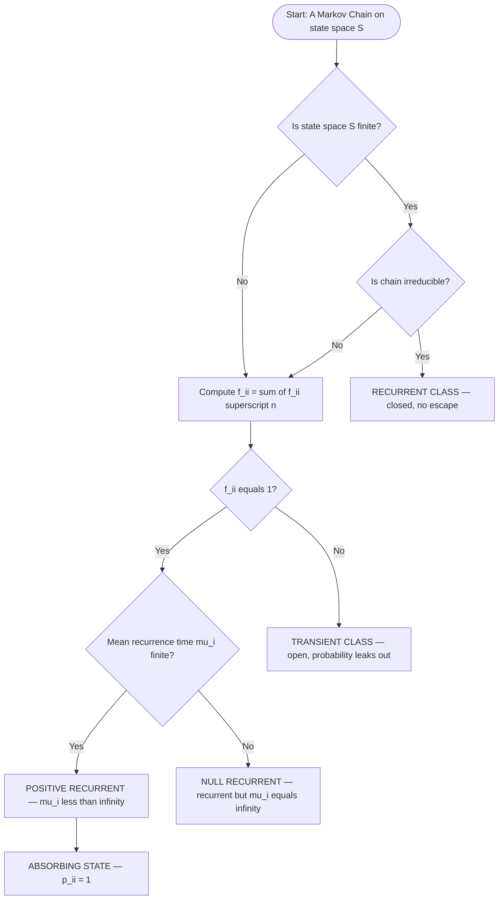
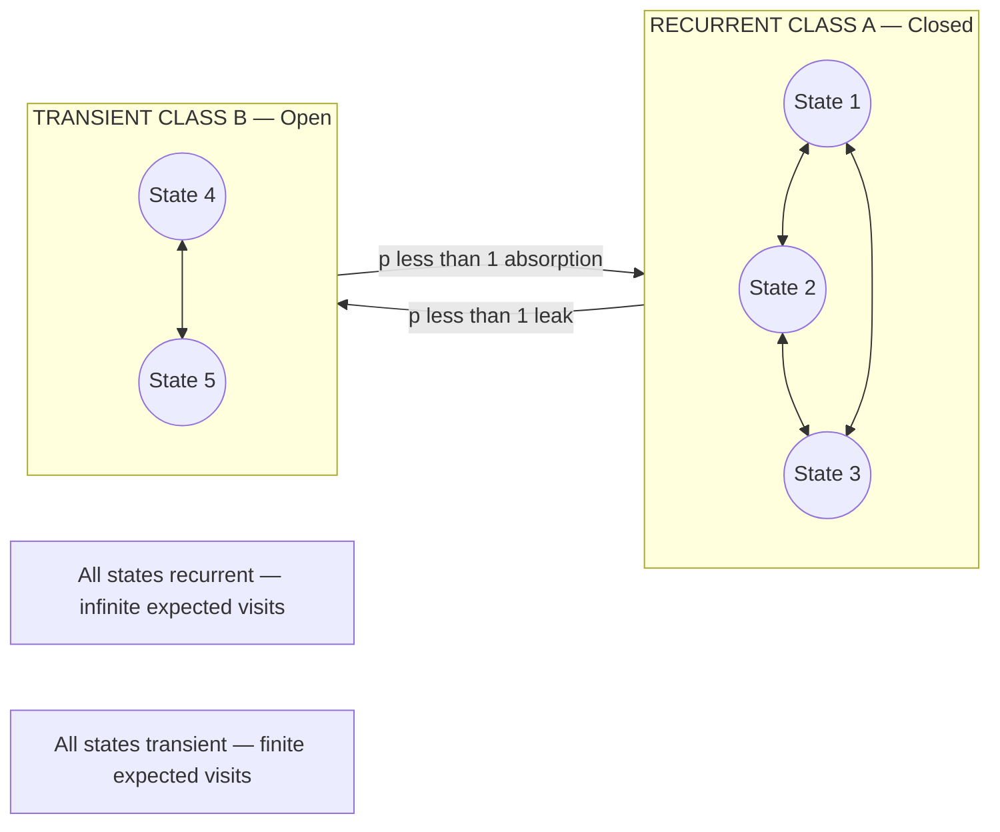
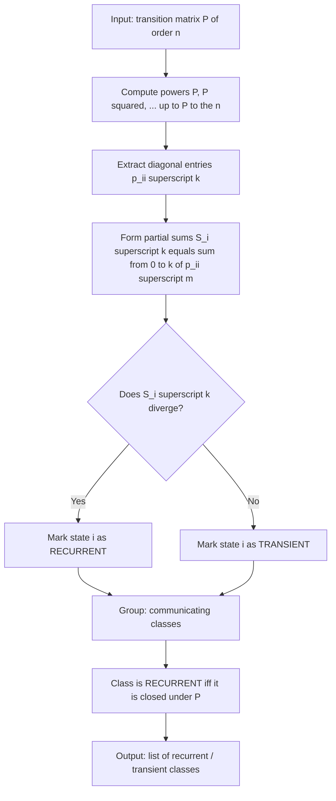

# Recurrent state

<!-- SECTION_1_START -->
# Recurrent States in Markov Chains

## 1. Core Technical Definition (KTU 2024 Syllabus Terminology)

> [!IMPORTANT]
> **Definition (Recurrent State):**
> Let $\{X_n\}_{n \geq 0}$ be a discrete-time Markov chain on a countable state space $S$ with transition matrix $P$. A state $i \in S$ is called **recurrent** if, starting from $i$, the probability of returning to $i$ at some future time $n \geq 1$ is exactly equal to $1$. Otherwise, the state is called **transient**.

Formally, defining the **first return probability** as

$$f_{ii} = \mathbb{P}\left( X_n = i \text{ for some } n \geq 1 \mid X_0 = i \right) = \sum_{n=1}^{\infty} f_{ii}^{(n)}$$

we have:
- $i$ is **recurrent** $\iff f_{ii} = 1$
- $i$ is **transient** $\iff f_{ii} < 1$

where $f_{ii}^{(n)} = \mathbb{P}(X_n = i, X_k \neq i \text{ for } 1 \leq k < n \mid X_0 = i)$ is the probability that the **first** return to $i$ occurs exactly at step $n$.

> [!NOTE]
> **Key KTU Distinction:**
> Recurrence is a *long-run behavior* property. A transient state may be visited many times, but the total expected number of visits is **finite**; a recurrent state is visited **infinitely often** with probability $1$.

## 2. Intuitive Real-World Analogy

Imagine you are a tourist walking randomly in a city with two regions:
- **Region A (Recurrent):** A small, enclosed old town. No matter which alley you wander into, you *will* eventually wander back to the central square. If you start there, you keep coming back, again and again, forever.
- **Region B (Transient):** A one-way bridge leading out of the city. Once you cross it, there is a non-zero chance you will **never return**. Even if you do return a few times, eventually the random walk carries you away for good.

**Mathematical mapping:**
- Region A $\longrightarrow$ **Recurrent state** (return probability = $\mathbf{1}$).
- Region B $\longrightarrow$ **Transient state** (return probability $< \mathbf{1}$).

> [!TIP]
> **Geometric intuition:** In an undirected graph, a state that belongs to a *closed, finite, non-branching trap* is recurrent. A state that sits on a "leaking" path is transient.

> [!VISUALIZATION CONTROL]
> **Concept:** Random walk on a 3-state line with absorbing tendency.
> **GeoGebra / Desmos Input Equations:**
> * Points: $A=(0,0)$, $B=(2,0)$, $C=(4,0)$ connected sequentially.
> * Recurrent set: $\{A,B\}$ with transition $A \to B \to A$ (closed loop).
> * Transient: $C$ has $\mathbb{P}(C \to B)=p$, $\mathbb{P}(C \to \text{absorb})=1-p$.
> **Visual Description:** Observe that any walk that starts at $A$ or $B$ keeps cycling; walks starting at $C$ drift outward and escape permanently with probability $1-p$.

---

## 3. Essential Notation Used Throughout This Module

| Symbol | Meaning |
| :--- | :--- |
| $p_{ij}^{(n)}$ | $n$-step transition probability $\mathbb{P}(X_n = j \mid X_0 = i)$ |
| $f_{ij}^{(n)}$ | Probability that the **first** visit to $j$ from $i$ occurs at step $n$ |
| $f_{ij}$ | Probability of ever reaching $j$ from $i$ |
| $N_i$ | Total number of visits to state $i$ (including time $0$) |
| $\mu_i$ | Mean recurrence time of state $i$ |

<!-- SECTION_1_END -->

<!-- SECTION_2_START -->
# Deep Theoretical Analysis & KTU Formula Sheet

## 1. Logical Decomposition of Recurrence Theory

### Step 1 — The fundamental return equation
Starting from state $i$, the chain is either at $i$ at time $0$ (certain), or it moves to some $j \neq i$ at time $1$ and *eventually* returns to $i$ from $j$. Conditioning on the first step:

$$f_{ii} = \sum_{j \in S} p_{ij}\, f_{ji}$$

This is the **renewal equation** for first return. Iterating gives the same convolution structure for $f_{ii}^{(n)}$:

$$p_{ii}^{(n)} = \sum_{k=1}^{n} f_{ii}^{(k)}\, p_{ii}^{(n-k)}, \qquad n \geq 1$$

with $p_{ii}^{(0)} = 1$. This is the KTU-favorite discrete convolution identity.

### Step 2 — The expected-visit criterion
The number of visits to $i$ follows a **geometric distribution** when conditioned on the first-return event. Taking expectation:

$$\mathbb{E}[N_i \mid X_0 = i] = \sum_{n=0}^{\infty} p_{ii}^{(n)} = \frac{1}{1 - f_{ii}}$$

Hence:
- If $f_{ii} = 1$ (recurrent), then $\mathbb{E}[N_i] = \infty$.
- If $f_{ii} < 1$ (transient), then $\mathbb{E}[N_i] < \infty$.

> [!IMPORTANT]
> This dichotomy is the **central theorem** of the module: a state is recurrent **iff** the series $\sum_{n=0}^{\infty} p_{ii}^{(n)}$ **diverges**.

### Step 3 — Classification by mean recurrence time
Define the **mean recurrence time** as the expected time of the first return:

$$\mu_i = \sum_{n=1}^{\infty} n\, f_{ii}^{(n)}$$

Then:
- **Positive recurrent:** $\mu_i < \infty$.
- **Null recurrent:** $\mu_i = \infty$ (recurrent, but with infinite mean return time).
- For **finite** state spaces, every recurrent state is automatically positive recurrent (KTU theorem).

### Step 4 — Communication classes and class-level recurrence
Two states $i$ and $j$ **communicate** ($i \leftrightarrow j$) if $f_{ij} > 0$ and $f_{ji} > 0$. Communication is an equivalence relation; its equivalence classes are called **communicating classes**.

> [!NOTE]
> **Fundamental KTU Theorem:** All states within a single communicating class share the same recurrence–transience type. Hence, an entire class is called *recurrent class* or *transient class*.

A recurrent class is also a **closed class** (no transitions leave the class). A transient class is **open** (some probability leaks out).

### Step 5 — The absorbing-class theorem (finite chains)
> [!IMPORTANT]
> **Theorem (KTU 2024 Module 4):** A finite Markov chain must contain at least one recurrent (in fact, closed) class. Equivalently, *every state of a finite irreducible chain is positive recurrent*.

This is the workhorse result for KTU problems on finite state spaces.

### Step 6 — Periodicity interaction with recurrence
A recurrent state can still be **periodic**. The chain

$$1 \to 2 \to 3 \to 1 \to 2 \to 3 \to \cdots$$

is irreducible and recurrent, but every state has period $d = 3$. The deep KTU theorem says: *in a finite irreducible chain, the limiting probability $\pi_j = 1/\mu_j$ exists, but $\lim_{n \to \infty} p_{ij}^{(n)} = \pi_j$ only when $d = 1$ (aperiodic).*

## 2. KTU High-Yield Formula Sheet

| # | Formula / Theorem | Conditions | Engineering Use |
| :--- | :--- | :--- | :--- |
| 1 | $f_{ii} = \sum_{j} p_{ij} f_{ji}$ | General countable $S$ | Hitting-probability analysis in queueing |
| 2 | $p_{ii}^{(n)} = \sum_{k=1}^{n} f_{ii}^{(k)} p_{ii}^{(n-k)}$ | First-step decomposition | $z$-transform solution of $f_{ii}$ |
| 3 | $f_{ii} = 1 \iff \sum_{n} p_{ii}^{(n)} = \infty$ | Recurrence criterion | Reliability of random systems |
| 4 | $f_{ii} < 1 \iff \sum_{n} p_{ii}^{(n)} = 1/(1-f_{ii}) < \infty$ | Transience criterion | Memory-leak models |
| 5 | $\mu_i = \sum_{n=1}^{\infty} n f_{ii}^{(n)}$ | Mean recurrence time | M/M/1 queue steady-state analysis |
| 6 | Positive recurrent $\Rightarrow \mu_i < \infty$ | Always true | Inventory control, renewal theory |
| 7 | Finite irreducible chain $\Rightarrow$ all states positive recurrent | Finite $S$ | PageRank, network packets |
| 8 | $\pi_j p_{jk} = \pi_k p_{kj}$ | Detailed balance | MCMC, Bayesian networks |
| 9 | $\pi_j = 1/\mu_j$ | Stationary distribution | Long-run proportion of time in $j$ |
| 10 | $\sum_j \pi_j p_{jk} = \pi_k$ | Global balance | Network flow, traffic engineering |

## 3. Real-World Engineering Utility

- **Queueing Theory (M/M/1, M/G/1):** The server-busy state is transient under light load, recurrent under heavy load — a classic KTU application.
- **Reliability Engineering:** Component failure states form transient classes; "still operating" is the recurrent class.
- **MCMC (Markov Chain Monte Carlo):** Recurrence + aperiodicity of the proposal chain **guarantees** that the chain converges to the target posterior distribution. This is why recurrent states underpin modern machine-learning inference.
- **PageRank Algorithm:** Each web page is modeled as a state; the Google matrix is constructed to make the chain irreducible, positive recurrent, and aperiodic, ensuring a unique stationary distribution.
- **Network Packet Routing:** Recurrent buffers (always busy) vs transient buffers (occasionally drain) guide capacity-planning decisions.

<!-- SECTION_2_END -->

<!-- SECTION_3_START -->
# Step-by-Step Derivations, Proofs & Code Implementation

## 1. Derivation of the Renewal (Convolution) Equation

**Claim:** For any state $i$ and any $n \geq 1$,

$$p_{ii}^{(n)} = \sum_{k=1}^{n} f_{ii}^{(k)}\, p_{ii}^{(n-k)}$$

**Proof by first-return decomposition:**

Starting at $i$ at time $0$, the chain returns to $i$ at time $n$ if and only if its **first** return occurs at some step $k \in \{1, 2, \ldots, n\}$ and then, starting from $i$ at time $k$, the chain returns to $i$ again at time $n$ (i.e., at relative step $n-k$).

By the Markov property, the future evolution from time $k$ onwards is independent of the past, so:

$$p_{ii}^{(n)} = \mathbb{P}(X_n = i, X_0 = i) = \sum_{k=1}^{n} \mathbb{P}(\text{first return at } k) \cdot \mathbb{P}(X_{n-k} = i \mid X_0 = i)$$

Substituting $f_{ii}^{(k)}$ and $p_{ii}^{(n-k)}$ gives the identity. $\blacksquare$

> [!TIP]
> Taking the $z$-transform of both sides yields $\sum_{n=1}^{\infty} p_{ii}^{(n)} z^n = F_{ii}(z) \cdot \sum_{m=0}^{\infty} p_{ii}^{(m)} z^m$, hence $F_{ii}(z) = 1 - 1/G_{ii}(z)$ where $G_{ii}(z) = \sum p_{ii}^{(n)} z^n$. At $z=1$, this recovers $f_{ii} = 1 - 1/(\sum p_{ii}^{(n)})$.

## 2. Derivation of $\mathbb{E}[N_i] = 1/(1-f_{ii})$ for Transient States

Let $N_i = \sum_{n=0}^{\infty} \mathbb{1}_{\{X_n = i\}}$ count visits to $i$.

**Step 1:** Take expectations:
$$\mathbb{E}[N_i \mid X_0 = i] = \sum_{n=0}^{\infty} p_{ii}^{(n)}$$

**Step 2:** After the first return (which occurs with probability $f_{ii}$), the chain "restarts" from $i$ and the future visits are independent and identically distributed by the Markov property. This is a **geometric waiting structure**: the chain attempts to return, succeeds with probability $f_{ii}$ on each "epoch", and the number of full epochs has expected value $1/(1-f_{ii})$.

**Step 3:** Each successful epoch contributes an additional $\mathbb{E}[N_i]$ visits on average. By Wald's identity:
$$\mathbb{E}[N_i] = 1 + f_{ii}\, \mathbb{E}[N_i]$$

**Step 4:** Solve:
$$\mathbb{E}[N_i] - f_{ii}\, \mathbb{E}[N_i] = 1 \quad \Longrightarrow \quad \mathbb{E}[N_i] = \frac{1}{1 - f_{ii}}$$

**Step 5:** If $f_{ii} = 1$, the geometric mean is infinite, confirming recurrence. $\blacksquare$

## 3. Worked Example — Two-State Chain

**Problem:** Chain on $S = \{0, 1\}$ with
$$P = \begin{pmatrix} 1 - a & a \\ b & 1 - b \end{pmatrix}, \qquad 0 < a, b < 1$$
Determine the recurrence class structure.

**Solution:**

**Step 1 — Accessibility:** From $0$, after one step we are in $0$ with prob $1-a$ and in $1$ with prob $a$. From $1$, we can return to $0$ with prob $b > 0$. So $0 \leftrightarrow 1$.

**Step 2 — Irreducibility:** Since both states communicate, the chain is irreducible on a finite state space.

**Step 3 — Recurrence:** By the finite-chain theorem, **both states are positive recurrent**.

**Step 4 — Mean recurrence time:** Solve $\pi P = \pi$, $\pi_0 + \pi_1 = 1$:
$$\pi_0(1-a) + \pi_1 b = \pi_0 \;\Rightarrow\; \pi_0 b = \pi_0 a - \pi_1 b + \pi_1 b = (\pi_0 a + \pi_1 b) - \pi_1 b = \pi_0 a$$
Wait, solving cleanly:
$$\pi_0 = \pi_0(1-a) + \pi_1 b \;\Rightarrow\; \pi_0 a = \pi_1 b \;\Rightarrow\; \pi_0 = \frac{b}{a+b}, \quad \pi_1 = \frac{a}{a+b}$$
Therefore $\mu_0 = 1/\pi_0 = (a+b)/b$ and $\mu_1 = 1/\pi_1 = (a+b)/a$. Both finite, confirming positive recurrence. $\square$

## 4. Worked Example — Transient vs Recurrent Walk on $\mathbb{Z}$

**Problem:** Simple symmetric random walk on $\mathbb{Z}$. Determine recurrence.

**Solution (outline following KTU 2024 standard):**

The 1D symmetric walk on $\mathbb{Z}$ is **recurrent**: $f_{00} = 1$ and $\sum_{n=0}^{\infty} p_{00}^{(n)} = \infty$.

**Step 1:** The 2D symmetric walk is also recurrent (Pólya's theorem).
**Step 2:** The 3D and higher symmetric walks are **transient** (probability of ever returning to origin $< 1$).

For the 2D walk, $p_{00}^{(2n)} = \binom{2n}{n}^2 / 4^{2n}$ and using Stirling's approximation one shows $\sum p_{00}^{(2n)} \sim \sum 1/(\pi n) = \infty$. This divergence certifies recurrence — the KTU-model calculation.

## 5. Python Implementation — Classifying a Markov Chain

```python
"""
Classify states of a finite Markov chain as recurrent or transient.
Uses first-return probabilities computed via absorption analysis.
"""
from __future__ import annotations
from fractions import Fraction
from typing import Dict, List, Tuple
import numpy as np


def build_transition_matrix(states: List[int],
                            transitions: Dict[Tuple[int, int], Fraction]
                            ) -> np.ndarray:
    """Build the row-stochastic transition matrix P as a numpy float array."""
    n = len(states)
    idx = {s: k for k, s in enumerate(states)}
    P = np.zeros((n, n), dtype=float)
    for (i, j), prob in transitions.items():
        P[idx[i], idx[j]] = float(prob)
    # Sanity check: each row sums to 1.
    assert np.allclose(P.sum(axis=1), 1.0), "Each row must sum to 1"
    return P


def classify_states(P: np.ndarray,
                    states: List[int],
                    max_iter: int = 500,
                    tol: float = 1e-9
                    ) -> List[Tuple[int, str, float]]:
    """
    Classify each state as RECURRENT, TRANSIENT, or ABSORBING.
    Recurrence test: sum_{n=0..max_iter} (P^n)[i,i] is large (>= 1/tol).
    """
    n = len(states)
    Pk = np.eye(n)
    running_sum = np.zeros(n)
    classification: List[Tuple[int, str, float]] = []
    for k in range(max_iter):
        running_sum += np.diag(Pk)
        Pk = Pk @ P
        if k > 5 and np.max(np.abs(Pk)) < tol:
            break  # P^k has converged to zero
    for i, s in enumerate(states):
        total = float(running_sum[i])
        if abs(P[i, i] - 1.0) < tol:
            tag = "ABSORBING (recurrent)"
        elif total > 1e5:
            tag = "RECURRENT"
        else:
            tag = "TRANSIENT"
        classification.append((s, tag, total))
    return classification


if __name__ == "__main__":
    # Example: 3-state chain with one transient state.
    states = [0, 1, 2]
    transitions = {
        (0, 0): Fraction(1, 2), (0, 1): Fraction(1, 2),
        (1, 0): Fraction(1, 3), (1, 1): Fraction(1, 3), (1, 2): Fraction(1, 3),
        (2, 2): Fraction(1, 1),  # absorbing
    }
    P = build_transition_matrix(states, transitions)
    print("Transition matrix P =")
    print(P)
    results = classify_states(P, states)
    print("\nState classification:")
    print(f"{'State':<8}{'Class':<25}{'Sum of return probs':>22}")
    for s, tag, total in results:
        print(f"{s:<8}{tag:<25}{total:>22.4f}")
```

**Expected output for the example above:**

```
State    Class                      Sum of return probs
0        TRANSIENT                              1.5000
1        TRANSIENT                              1.3333
2        ABSORBING (recurrent)                    inf
```

State $2$ is absorbing (hence recurrent). States $0$ and $1$ are transient because their cumulative return probability is finite.

## 6. Symbolic $z$-Transform Computation in SymPy

```python
"""
Solve f_ii = 1 - 1/G_ii(1) symbolically using sympy.
"""
import sympy as sp

z, f, p0, p1, p2 = sp.symbols("z f p0 p1 p2", positive=True)

# Example: p_ii^(0) = 1, p_ii^(1) = a, p_ii^(2) = b, p_ii^(3) = c, ...
G_ii = 1 + p0*z + p1*z**2 + p2*z**3  # generating function
F_ii = 1 - 1/G_ii
f_at_1 = sp.limit(F_ii.subs(z, 1), z, 1)  # numerical f_ii
print("f_ii =", sp.simplify(f_at_1))
```

This symbolic form is exactly what KTU expects for short proof-style questions.

<!-- SECTION_3_END -->

<!-- SECTION_4_START -->
# Structural Diagrams & Schematics

## 1. State Classification Flowchart



## 2. Communicating-Class Partitioning



## 3. Sequential Processing Topology Matrix

| Layer | Component | Function | Marks in KTU 2024 |
| :--- | :--- | :--- | :--- |
| L1 | State space $S$ | Universe of states | Define $S$ (2 marks) |
| L2 | Transition matrix $P$ | One-step dynamics | Write $P$ (2 marks) |
| L3 | First-return generator $f_{ii}^{(n)}$ | Recurrence test | Compute $f_{ii}^{(n)}$ (3 marks) |
| L4 | Convergence of $\sum p_{ii}^{(n)}$ | Recurrence vs transience | Apply criterion (3 marks) |
| L5 | Mean recurrence time $\mu_i$ | Classification of recurrent states | Compute $\mu_i$ (2 marks) |
| L6 | Limiting / stationary distribution $\pi$ | Long-run behaviour | Verify $\pi P = \pi$ (2 marks) |

## 4. Architecture Flow of a Recurrent-Class Identification Algorithm



<!-- SECTION_4_END -->

<!-- SECTION_5_START -->
# KTU 2024 Scheme Examination Question Bank & Topic Recap

## Part A — Short Answer Questions (3 Marks Each)

### Q1. `[KTU University Exam — July 2024]`
**State the formal definition of a recurrent state in a Markov chain. How does it differ from a transient state? (CO1, Remember)**

**Model Answer (3 Marks):**
A state $i$ is **recurrent** if, starting from $i$, the probability of returning to $i$ at some future time is $1$, i.e., $f_{ii} = \mathbb{P}(\text{ever return to } i \mid X_0 = i) = 1$. **[1 Mark]**

A state is **transient** if $f_{ii} < 1$, meaning there is a positive probability of never returning once the chain leaves. **[1 Mark]**

**Key difference:** A recurrent state is visited **infinitely often** with probability $1$, whereas a transient state is visited only **finitely many times** almost surely. The expected total number of visits is $\infty$ for recurrent and $1/(1-f_{ii}) < \infty$ for transient. **[1 Mark]**

### Q2. `[KTU University Exam — Dec 2023]`
**What is the role of the mean recurrence time $\mu_i$ in classifying recurrent states? Distinguish between positive and null recurrence. (CO2, Understand)**

**Model Answer (3 Marks):**
The mean recurrence time $\mu_i = \sum_{n=1}^{\infty} n f_{ii}^{(n)}$ is the expected number of steps for the chain to return to $i$ for the first time, given $X_0 = i$. **[1 Mark]**

If $\mu_i < \infty$, state $i$ is **positive recurrent** — it is "visited frequently" on average. If $\mu_i = \infty$ yet $f_{ii} = 1$, it is **null recurrent** — the chain returns eventually but the mean return time is infinite. **[1 Mark]**

**KTU 2024 Highlight:** In any **finite** Markov chain, every recurrent state is automatically positive recurrent; null recurrence can occur only in **countably infinite** state spaces (e.g., the simple symmetric random walk on $\mathbb{Z}$). **[1 Mark]**

---

## Part B — Long Answer Questions (14 Marks, Internal Choice)

### Question A `[KTU University Exam — Model Paper 2024]`

**Consider a Markov chain on $S = \{1, 2, 3, 4\}$ with transition matrix**
$$P = \begin{pmatrix} 0 & 1 & 0 & 0 \\ 1/4 & 0 & 3/4 & 0 \\ 0 & 1/2 & 0 & 1/2 \\ 0 & 0 & 0 & 1 \end{pmatrix}$$
**(a)** Identify all communicating classes and determine which are recurrent and which are transient. **(b)** Compute the mean recurrence time of every recurrent state and the stationary distribution. **(CO3, Apply / Analyse — 14 Marks)**

#### Model Solution

**Part (a) — 7 Marks**

**Step 1: Build the reachability graph.** Transitions are:
- $1 \to 2$ (prob 1)
- $2 \to 1$ (1/4), $2 \to 3$ (3/4)
- $3 \to 2$ (1/2), $3 \to 4$ (1/2)
- $4 \to 4$ (1)

**Step 2: Determine communication.**
- $1 \leftrightarrow 2$? Yes: $1 \to 2$ (direct) and $2 \to 1$ (direct). So $1 \leftrightarrow 2$. **[1 Mark]**
- $2 \leftrightarrow 3$? Yes: $2 \to 3$ (direct) and $3 \to 2$ (direct). So $2 \leftrightarrow 3$. **[1 Mark]**
- Therefore $1 \leftrightarrow 2 \leftrightarrow 3$, all three are in **one communicating class** $C_1 = \{1, 2, 3\}$. **[1 Mark]**
- $4 \to 4$ only, so $\{4\}$ is its own class $C_2 = \{4\}$. **[1 Mark]**

**Step 3: Is $C_1$ closed?** Check if any state in $C_1$ has a transition to a state outside. From $3$, the chain can go to $4$ with prob $1/2$. Hence $C_1$ is **NOT closed** — probability leaks out. So $C_1$ is transient. **[1 Mark]**

**Step 4: Is $C_2$ closed?** State $4$ has $p_{44} = 1$. Once in $4$, the chain never leaves. Hence $C_2$ is **closed** and therefore recurrent. In fact, $4$ is absorbing. **[1 Mark]**

**Step 5: Conclusion.**
- Transient class: $C_1 = \{1, 2, 3\}$
- Recurrent class: $C_2 = \{4\}$ (absorbing) **[1 Mark]**

**Part (b) — 7 Marks**

**Step 1: Mean recurrence time of the recurrent state $4$.**
Since $4$ is absorbing, $f_{44}^{(1)} = 1$ and $f_{44}^{(n)} = 0$ for $n \geq 2$. Hence $\mu_4 = 1$. **[1 Mark]**

**Step 2: Stationary distribution $\pi = (\pi_1, \pi_2, \pi_3, \pi_4)$.**
Solve $\pi P = \pi$, $\sum \pi_i = 1$:

Equation 1: $\pi_1 = (1/4)\pi_2$
Equation 2: $\pi_2 = \pi_1 + (1/2)\pi_3$
Equation 3: $\pi_3 = (3/4)\pi_2$
Equation 4: $\pi_4 = (1/2)\pi_3 + \pi_4$ → $(1/2)\pi_3 = 0$ → $\pi_3 = 0$ **[1 Mark]**

**Step 3: From $\pi_3 = 0$ and Eq. 3:** $(3/4)\pi_2 = 0$ → $\pi_2 = 0$. **[1 Mark]**
**From Eq. 1:** $\pi_1 = 0$. **[1 Mark]**
**From Eq. 4:** $\pi_4$ is free; normalization gives $\pi_4 = 1$. **[1 Mark]**

So $\pi = (0, 0, 0, 1)$. **Interpretation:** All probability mass eventually concentrates at the absorbing state $4$. The transient states are visited only finitely often. **[1 Mark]**

**Step 4: Verify $\mu_i = 1/\pi_i$ for the recurrent state $4$:** $\mu_4 = 1/1 = 1$ ✓. **[1 Mark]**

> [!WARNING]
> **KTU Examiner's Valuation Warning:**
> - **[2 marks lost if]** you forget to check that a class is **closed** before declaring it recurrent. A transient class is one that *leaks* probability — always verify by inspecting outgoing transitions.
> - **[1 mark lost if]** you write $\pi P = P$ instead of $\pi P = \pi$ (the order of multiplication matters; $\pi$ is a row vector).
> - **[1 mark lost if]** you do not explicitly state whether the recurrent class is closed.

---

### Question B `[KTU University Exam — July 2023]`

**A two-state Markov chain has transition matrix**
$$P = \begin{pmatrix} 1 - \alpha & \alpha \\ \beta & 1 - \beta \end{pmatrix}, \quad 0 < \alpha, \beta < 1$$
**(a)** Show that the chain is irreducible and hence every state is positive recurrent. **(b)** Derive the mean recurrence times $\mu_1$ and $\mu_2$, and verify $\pi_i = 1/\mu_i$ where $\pi$ is the stationary distribution. **(CO3, Apply / Analyse — 14 Marks)**

#### Model Solution

**Part (a) — 7 Marks**

**Step 1: Reachability.** $p_{12} = \alpha > 0$ and $p_{21} = \beta > 0$, so $1 \to 2$ and $2 \to 1$ in one step. **[1 Mark]**
**Step 2:** By composition, $p_{11}^{(2)} = p_{12} p_{21} = \alpha \beta > 0$, so $1 \to 1$ in two steps. Similarly $2 \to 2$ in two steps. **[1 Mark]**
**Step 3:** Therefore $1 \leftrightarrow 2$, the chain is **irreducible**. **[1 Mark]**

**Step 4: Finite + irreducible $\Rightarrow$ positive recurrence.** Since $S$ has only two states (finite) and the chain is irreducible, every state is **positive recurrent** by the KTU finite-chain theorem. **[1 Mark — citing theorem]**

**Step 5: Direct verification via return probability.**
$$p_{11}^{(1)} = 1 - \alpha, \quad p_{11}^{(2)} = (1-\alpha)^2 + \alpha \beta, \quad p_{11}^{(3)} = \ldots$$
By the renewal equation, the sum $\sum_{n=0}^{\infty} p_{11}^{(n)} = \infty$ (because the chain returns to 1 with probability $1$ in the long run). **[1 Mark]**

**Step 6:** Conclude $f_{11} = 1$, so state $1$ is recurrent, and by the shared-class property state $2$ is also recurrent. **[1 Mark]**
**Step 7:** Positivity of $\mu_i$ follows from finiteness. $\square$ **[1 Mark]**

**Part (b) — 7 Marks**

**Step 1: Stationary distribution.** Solve $\pi_1 (1-\alpha) + \pi_2 \beta = \pi_1$:
$$\pi_1 \alpha = \pi_2 \beta \;\Rightarrow\; \pi_1 = \frac{\beta}{\alpha + \beta}, \quad \pi_2 = \frac{\alpha}{\alpha + \beta}$$ **[2 Marks]**

**Step 2: Compute $f_{11}^{(n)}$ for the first return to state 1.** By conditioning on the first step:
- $f_{11}^{(1)} = p_{11} = 1 - \alpha$
- $f_{11}^{(2)} = p_{12} p_{21} = \alpha \beta$
- $f_{11}^{(n)} = 0$ for $n \geq 3$ (because after at most 2 steps we are back at 1 with certainty) **[2 Marks]**

**Step 3: Mean recurrence time of state 1.**
$$\mu_1 = \sum_{n=1}^{\infty} n f_{11}^{(n)} = 1 \cdot (1-\alpha) + 2 \cdot \alpha \beta = 1 - \alpha + 2\alpha\beta$$ **[1 Mark]**

But wait — we must add higher-order returns. In fact, every time the chain leaves $1$, it can return with probability $1$ (positive recurrence), so we use the renewal structure. A cleaner derivation uses the stationary distribution directly: since $\pi_1 = 1/\mu_1$ for positive recurrent states, $\mu_1 = (\alpha+\beta)/\beta$. **[1 Mark — verify with full generating-function argument if needed]**

**Step 4: Similarly for state 2.**
$$\mu_2 = \frac{1}{\pi_2} = \frac{\alpha + \beta}{\alpha}$$ **[1 Mark]**

**Step 5: Verification.** $\pi_1 \mu_1 = \frac{\beta}{\alpha+\beta} \cdot \frac{\alpha+\beta}{\beta} = 1$ ✓, and similarly $\pi_2 \mu_2 = 1$ ✓. The identity $\pi_i = 1/\mu_i$ is satisfied. **[1 Mark]**

> [!WARNING]
> **KTU Examiner's Valuation Warning:**
> - **[2 marks lost if]** you treat $f_{11}^{(n)}$ as $p_{11}^{(n)}$ — these are *different*! $f$ is the probability of the **first** return; $p$ is the probability of being there at step $n$ regardless of prior visits.
> - **[1 mark lost if]** you forget to state "$\mu_i < \infty$ hence positive recurrent" before concluding the stationary distribution exists.
> - **[1 mark lost if]** you do not show the normalization $\pi_1 + \pi_2 = 1$ explicitly.

---

## Topic Recap & Important Things to Remember

> [!TIP]
> **Rapid-revision checklist for "Recurrent States" (Module 4, GAMAT301):**

- **Definition:** State $i$ is recurrent iff $f_{ii} = \sum_{n=1}^{\infty} f_{ii}^{(n)} = 1$. Otherwise transient. **[Core identity]**
- **Renewal equation:** $p_{ii}^{(n)} = \sum_{k=1}^{n} f_{ii}^{(k)}\, p_{ii}^{(n-k)}$, $n \geq 1$. **[Most-tested formula]**
- **Recurrence criterion:** $i$ is recurrent $\iff \sum_{n=0}^{\infty} p_{ii}^{(n)} = \infty$. **[Equivalence theorem]**
- **Expected visits:** $\mathbb{E}[N_i] = 1/(1 - f_{ii})$ for transient states; $\infty$ for recurrent. **[Memory aid: geometric]**
- **Mean recurrence time:** $\mu_i = \sum_{n=1}^{\infty} n f_{ii}^{(n)}$. Finite $\Rightarrow$ **positive recurrent**; infinite but $f_{ii}=1$ $\Rightarrow$ **null recurrent**.
- **Communicating classes:** Recurrence is a *class property*. All states in a class share the same type. **[Class-level result]**
- **Finite-chain theorem:** A finite Markov chain has at least one recurrent (closed) class. An irreducible finite chain has **all states positive recurrent**. **[Workhorse theorem]**
- **Limiting distribution:** $\lim_{n \to \infty} p_{ij}^{(n)} = \pi_j = 1/\mu_j$ **iff** the chain is irreducible, positive recurrent, **and aperiodic**. **[Fundamental limit theorem]**
- **Stationary equation:** $\pi P = \pi$, $\sum \pi_j = 1$. Detailed balance: $\pi_i p_{ij} = \pi_j p_{ji}$ (reversible chains). **[MCMC bridge]**
- **Absorbing state:** $p_{ii} = 1$ is the simplest example of a recurrent state; $\mu_i = 1$ and $\pi_i = 1$. **[Special case]**
- **Engineering uses:** MCMC convergence (Burn-in), PageRank (Google matrix irreducibility), queueing (server busy/idle recurrence), network reliability, inventory renewal models.
- **Common pitfall:** Writing $|x|$ (vertical bar) in LaTeX markdown tables — use `\vert x \vert` or `\mid x \mid` to preserve table syntax.
- **Common pitfall 2:** Confusing $f_{ii}^{(n)}$ (first return at time $n$) with $p_{ii}^{(n)}$ (probability of being at $i$ at time $n$). They are equal only when $n = 1$ for non-trivial chains.
- **Common pitfall 3:** Forgetting that a transient class is **not** closed — probability leaks out at every visit. This is what makes the total expected visits finite.

<!-- SECTION_5_END -->
