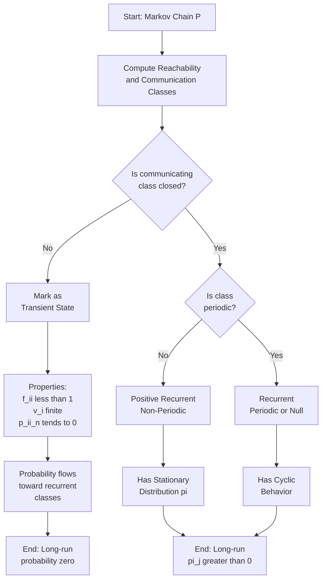
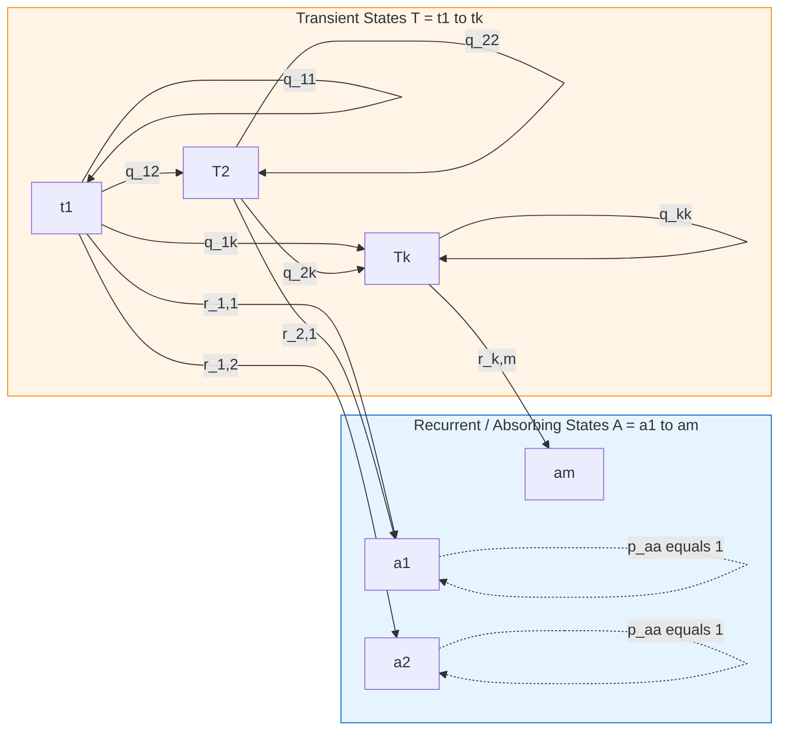
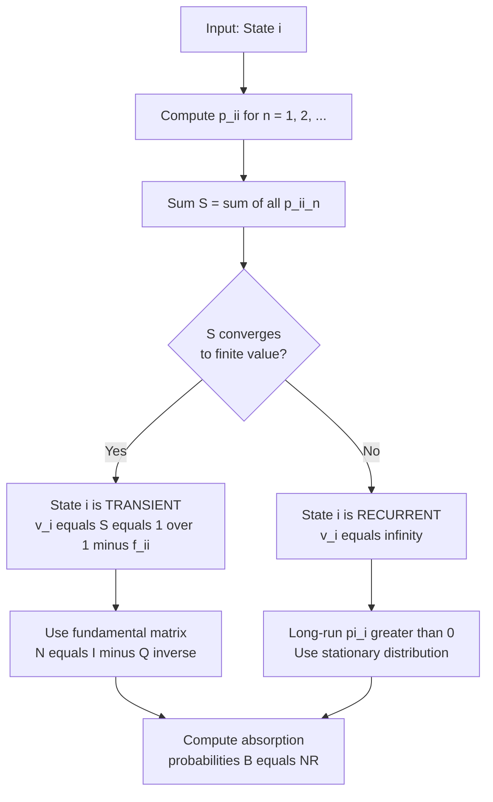
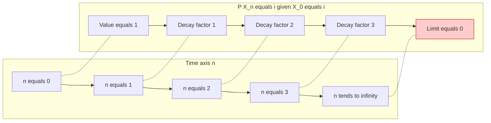

# Transient state

<!-- SECTION_1_START -->
# Transient State in Markov Chains

## Formal Academic Definition (KTU 2024 Syllabus)

> [!IMPORTANT]
> **Transient State:** A state $i$ in a Markov chain is called a **transient state** if there is a positive probability that the process, once leaving state $i$, will never return to it. Equivalently, the probability of returning to state $i$ starting from $i$ is strictly less than $1$.

In rigorous mathematical notation, a state $i$ is transient if and only if the return probability satisfies:

$$f_{ii} = P(X_n = i \text{ for some } n \geq 1 \mid X_0 = i) < 1$$

where $f_{ii}$ is the **probability of ever returning** to state $i$ given that the chain starts in $i$.

> [!NOTE]
> **Complementary Concept (For Contrast):** A state $i$ is called **recurrent** if $f_{ii} = 1$. A recurrent state is **positive recurrent** if the expected return time $E[T_i] < \infty$, and **null recurrent** if $E[T_i] = \infty$.

## Conceptual Analogy / Intuitive Building

Think of a **leaky water tank** connected to a network of pipes:

- The tank represents state $i$.
- Each pipe leading out represents a transition.
- A **transient tank** is one where some water will eventually leak out to another part of the system and **never come back** to this tank. The amount of water (probability mass) in this tank gradually drains away over time.
- A **recurrent tank** is one where every drop of water that leaves eventually cycles back, so the tank is revisited infinitely often with certainty.

### Real-World Engineering Analogy: Web Page Visits

Imagine a user randomly clicking links on a website. A particular web page is **transient** if there is a non-zero chance the user will leave the site (or the page cluster) forever after visiting it — like clicking an external link. Once they leave, they are gone for good from that state with positive probability. Eventually, the page is visited only **finitely many times**.

> [!TIP]
> **Why "Transient"?** The word *transient* literally means *passing through*. The chain passes through such states only a finite number of times in the long run, after which the probability of being in that state vanishes.

## State Classification Overview

A state $i$ in a finite Markov chain belongs to exactly one of two broad categories:

| Classification | Return Probability $f_{ii}$ | Expected Visits $v_i$ | Long-Run Behavior |
|----------------|-----------------------------|------------------------|--------------------|
| **Transient** | $f_{ii} < 1$ | $v_i = \dfrac{1}{1 - f_{ii}} < \infty$ | $P(X_n = i) \to 0$ as $n \to \infty$ |
| **Recurrent** | $f_{ii} = 1$ | $v_i = \infty$ | $P(X_n = i)$ does not vanish |

> [!VISUALIZATION CONTROL]
> **Concept:** Probability decay curve at a transient state
> **Desmos Input Equations:**
> * `f(n) = (0.6)^n` (geometric decay example)
> * `g(n) = (0.95)^n` (slower decay example)
> **Visual Description:** Students should observe two curves both tending to **zero** on the $y$-axis as $n \to \infty$ along the $x$-axis. The lower curve (smaller base) decays faster. This illustrates that the probability of being in a transient state after $n$ steps decays geometrically to zero.

## Key Theoretical Insight

> [!IMPORTANT]
> **Fundamental Theorem of Markov Chains (KTU High-Yield):** In a finite Markov chain, **at least one state must be recurrent**. Transient states can only exist if there exist recurrent states elsewhere in the chain that the process eventually gets "trapped" in.

This means transient states act as **passageways** through which probability mass flows toward recurrent (often absorbing) states.
<!-- SECTION_1_END -->

<!-- SECTION_2_START -->
# Deep Theoretical Analysis & KTU High-Yield Formula Sheet

## State Classification Criterion — Step-by-Step Logic

The classification of state $i$ as transient or recurrent hinges on the **probability of return** and the **expected number of visits**. Here is the operational logic:

1. **Define the Indicator:** Let $I_n = 1$ if $X_n = i$, and $0$ otherwise, given $X_0 = i$.
2. **Count Total Visits:** The total number of visits to state $i$ (including the visit at time $0$) is the random variable:
$$V_i = \sum_{n=0}^{\infty} I_n$$
3. **Compute Expected Visits:** Taking expectation:
$$E[V_i \mid X_0 = i] = \sum_{n=0}^{\infty} P(X_n = i \mid X_0 = i) = \sum_{n=0}^{\infty} p_{ii}^{(n)} = v_i$$
4. **Apply the Visit-Return Theorem:** It is a classical result that:
$$v_i = \frac{1}{1 - f_{ii}}$$
5. **Classify the State:**
   * If $f_{ii} < 1$ ⟹ $v_i < \infty$ ⟹ state $i$ is **transient**.
   * If $f_{ii} = 1$ ⟹ $v_i = \infty$ ⟹ state $i$ is **recurrent**.

## Asymptotic Behavior of Transient States

> [!IMPORTANT]
> **Asymptotic Decay Property:** If state $i$ is transient, then:
$$\lim_{n \to \infty} p_{ii}^{(n)} = \lim_{n \to \infty} P(X_n = i \mid X_0 = i) = 0$$
This is a direct consequence of the Borel–Cantelli lemma applied to the sum of geometric-like tail probabilities.

In fact, the decay is **geometric** in the sense that the total probability mass of all transient states collectively tends to zero. The probability of being absorbed into a recurrent class from a transient state approaches $1$.

## KTU Formula Sheet / Cheat Sheet

| Formula / Concept | Mathematical Expression | Meaning / Use |
|-------------------|-------------------------|----------------|
| Return probability | $f_{ii} = P(\exists \, n \geq 1 : X_n = i \mid X_0 = i)$ | Probability chain ever returns to $i$ |
| Transient state condition | $f_{ii} < 1$ | Definitional criterion |
| Recurrent state condition | $f_{ii} = 1$ | Definitional criterion |
| Expected number of visits | $v_i = \sum_{n=0}^{\infty} p_{ii}^{(n)} = \dfrac{1}{1 - f_{ii}}$ | Finite for transient, infinite for recurrent |
| Asymptotic decay | $\lim_{n \to \infty} p_{ii}^{(n)} = 0$ | Probability vanishes for transient $i$ |
| Fundamental matrix | $N = (I - Q)^{-1}$ | $N_{ij}$ = expected visits to $j$ from $i$ |
| Absorption probability matrix | $B = NR$ | $B_{ij}$ = absorption probability into $j$ |
| Expected time to absorption | $t = N \cdot \mathbf{1}$ (column vector of ones) | Total expected steps before absorption |

Where $Q$ is the **transition sub-matrix** restricted to transient states, and $R$ is the matrix of transition probabilities from transient states to absorbing (recurrent) states.

## The Fundamental Matrix — Engineering Power Tool

> [!NOTE]
> The **Fundamental Matrix $N = (I - Q)^{-1}$** is the workhorse for solving practical absorption problems. It is widely used in:
> * **Google PageRank variants** with absorbing states
> * **Random walk–based recommender systems**
> * **Reliability engineering** for failure absorption analysis
> * **Bioinformatics** for DNA sequence state analysis
> * **Queueing theory** for transient-to-steady-state convergence

## Conditions for a Valid Transient Analysis

For the formulas to apply:
1. The chain must be **finite** (number of states is finite), OR the $n$-step transition probabilities must be summable.
2. The matrix $I - Q$ must be **invertible** (which is always the case for transient states in a finite chain, since spectral radius of $Q$ is strictly less than $1$).
3. The classification of states must be determined **before** computing $N$.

> [!WARNING]
> **Common Student Mistake:** Applying the fundamental matrix formula $N = (I - Q)^{-1}$ without first verifying that all rows/columns of $Q$ actually correspond to transient states. Mixing transient and recurrent states in $Q$ makes the matrix no longer substochastic in the strict sense, and the inverse may not exist or yield nonsense.
<!-- SECTION_2_END -->

<!-- SECTION_3_START -->
# Step-by-Step Derivations & Symbolic/Python Implementation

## Derivation 1: Expected Number of Visits to a Transient State

**Goal:** Show that $v_i = \sum_{n=0}^{\infty} p_{ii}^{(n)} = \dfrac{1}{1 - f_{ii}}$.

**Setup:** Define the random variable $N_i$ = number of returns to state $i$ starting from $i$ (this counts visits at times $n = 1, 2, 3, \dots$). The total number of visits (including time $0$) is $V_i = 1 + N_i$.

**Step 1: Conditioning on whether a return ever happens.**

$$E[N_i] = f_{ii} \cdot E[N_i \mid \text{return occurs}]$$

By the **strong Markov property** at the first return time, the process "restarts" at state $i$, and the distribution of remaining returns is identical to $N_i$ itself. So:

$$E[N_i \mid \text{return occurs}] = 1 + E[N_i]$$

**Step 2: Solve the recursive equation.**

$$E[N_i] = f_{ii}(1 + E[N_i])$$

$$E[N_i] = f_{ii} + f_{ii} \cdot E[N_i]$$

$$E[N_i] - f_{ii} \cdot E[N_i] = f_{ii}$$

$$E[N_i](1 - f_{ii}) = f_{ii}$$

$$E[N_i] = \frac{f_{ii}}{1 - f_{ii}}$$

**Step 3: Compute total visits.**

$$v_i = E[V_i] = 1 + E[N_i] = 1 + \frac{f_{ii}}{1 - f_{ii}} = \frac{1 - f_{ii} + f_{ii}}{1 - f_{ii}} = \frac{1}{1 - f_{ii}}$$

**Conclusion:** $\boxed{v_i = \dfrac{1}{1 - f_{ii}}}$. This is finite iff $f_{ii} < 1$, which is precisely the transient condition. $\blacksquare$

---

## Derivation 2: The Fundamental Matrix $N = (I - Q)^{-1}$

**Setup:** Let $T = \{1, 2, \dots, t\}$ be the set of transient states. Define:

$$N_{ij} = E\left[\sum_{n=0}^{\infty} \mathbf{1}_{\{X_n = j\}} \;\Big|\; X_0 = i\right] \quad \text{for } i, j \in T$$

**Step 1: Condition on the first step.**

Starting from $i$, after one step the chain moves to some state $k$ with probability $q_{ik}$. The expected total visits to $j$ from then onward is $N_{kj}$ (by Markov property). Thus:

$$N_{ij} = \delta_{ij} + \sum_{k \in T} q_{ik} \, N_{kj}$$

where $\delta_{ij} = 1$ if $i = j$ and $0$ otherwise (the initial visit at time $0$).

**Step 2: Write in matrix form.**

$$N = I + Q \cdot N$$

**Step 3: Solve for $N$.**

$$N - Q N = I$$

$$(I - Q) N = I$$

$$\boxed{N = (I - Q)^{-1}}$$

**Step 4: Series expansion (geometric series form).**

Since $Q$ is a substochastic matrix (spectral radius $<1$):

$$N = (I - Q)^{-1} = I + Q + Q^2 + Q^3 + \cdots = \sum_{n=0}^{\infty} Q^n$$

This series converges, and $(N)_{ij} = \sum_{n=0}^{\infty} (Q^n)_{ij} = \sum_{n=0}^{\infty} p_{ij}^{(n)}$ for $i, j \in T$, which matches the expected-visit interpretation. $\blacksquare$

---

## Derivation 3: Absorption Probabilities $B = NR$

**Setup:** $B_{ij}$ = probability that, starting from transient state $i$, the chain is eventually absorbed in recurrent state $j$.

**Step 1: Condition on the first step from $i$.**

$$B_{ij} = \sum_{k \in T} q_{ik} \, B_{kj} \; + \; r_{ij}$$

where $r_{ij}$ is the **direct absorption probability** in one step, and the first term accounts for first moving to another transient state $k$.

**Step 2: Vectorize over the absorbing state $j$.**

Writing $B_{*j}$ as the column vector indexed by transient states:

$$B_{*j} = Q \cdot B_{*j} + R_{*j}$$

$$(I - Q) B_{*j} = R_{*j}$$

$$B_{*j} = (I - Q)^{-1} R_{*j} = N \cdot R_{*j}$$

**Step 3: Stack the columns for all absorbing states.**

$$\boxed{B = N \cdot R} \qquad \blacksquare$$

---

## Worked Numerical Example

Consider a Markov chain with **3 states** $\{1, 2, 3\}$ and transition matrix:

$$P = \begin{pmatrix} 0.2 & 0.6 & 0.2 \\ 0.0 & 0.5 & 0.5 \\ 0.0 & 0.0 & 1.0 \end{pmatrix}$$

**Step 1: Identify states.** State $3$ is absorbing (recurrent). States $1$ and $2$ are transient because from either, there is a positive probability of reaching state $3$ and being trapped.

**Step 2: Extract $Q$ and $R$.**

$$Q = \begin{pmatrix} 0.2 & 0.6 \\ 0.0 & 0.5 \end{pmatrix} \quad \text{(transient-to-transient)}$$

$$R = \begin{pmatrix} 0.2 \\ 0.5 \end{pmatrix} \quad \text{(transient-to-absorbing)}$$

**Step 3: Compute $I - Q$.**

$$I - Q = \begin{pmatrix} 0.8 & -0.6 \\ 0.0 & 0.5 \end{pmatrix}$$

**Step 4: Compute the determinant and inverse.**

$$\det(I - Q) = (0.8)(0.5) - (-0.6)(0.0) = 0.4$$

$$(I - Q)^{-1} = \frac{1}{0.4} \begin{pmatrix} 0.5 & 0.6 \\ 0.0 & 0.8 \end{pmatrix} = \begin{pmatrix} 1.25 & 1.50 \\ 0.00 & 2.00 \end{pmatrix}$$

So $N = \begin{pmatrix} 1.25 & 1.50 \\ 0.00 & 2.00 \end{pmatrix}$.

**Step 5: Absorption probabilities $B = NR$.**

$$B = \begin{pmatrix} 1.25 & 1.50 \\ 0.00 & 2.00 \end{pmatrix} \begin{pmatrix} 0.2 \\ 0.5 \end{pmatrix} = \begin{pmatrix} 1.25(0.2) + 1.50(0.5) \\ 0.00(0.2) + 2.00(0.5) \end{pmatrix} = \begin{pmatrix} 0.25 + 0.75 \\ 1.00 \end{pmatrix} = \begin{pmatrix} 1.00 \\ 1.00 \end{pmatrix}$$

Both transient states are absorbed into state $3$ with probability $1$. ✓ (This is consistent since the only recurrent class is $\{3\}$.)

**Step 6: Expected time to absorption $t = N \cdot \mathbf{1}$.**

$$t = \begin{pmatrix} 1.25 + 1.50 \\ 0.00 + 2.00 \end{pmatrix} = \begin{pmatrix} 2.75 \\ 2.00 \end{pmatrix}$$

So from state $1$ we expect **2.75 steps** before absorption; from state $2$ we expect **2.00 steps**.

---

## Python Implementation (Fully Operational)

```python
import numpy as np
from typing import Tuple


def classify_states(transition_matrix: np.ndarray) -> dict:
    """
    Classify states of a Markov chain as transient or recurrent
    using eigenvalue analysis of the transition matrix restricted
    to each communicating class.
    """
    n = transition_matrix.shape[0]
    classification = {}
    visited = np.zeros(n, dtype=bool)

    def get_class(start: int) -> list:
        # BFS to find a closed communicating class containing `start`
        stack = [start]
        cls = []
        while stack:
            s = stack.pop()
            if s in cls:
                continue
            cls.append(s)
            for t in range(n):
                if transition_matrix[s, t] > 0 and t not in cls:
                    stack.append(t)
        return cls

    for state in range(n):
        if not visited[state]:
            cls = get_class(state)
            for s in cls:
                visited[s] = True
            # A communicating class is recurrent iff the submatrix is stochastic
            sub = transition_matrix[np.ix_(cls, cls)]
            row_sums = sub.sum(axis=1)
            if np.allclose(row_sums, 1.0):
                classification.update({s: "recurrent" for s in cls})
            else:
                classification.update({s: "transient" for s in cls})
    return classification


def fundamental_matrix(Q: np.ndarray) -> np.ndarray:
    """
    Compute N = (I - Q)^{-1} given a transient-to-transient submatrix Q.
    """
    if Q.shape[0] != Q.shape[1]:
        raise ValueError("Q must be a square matrix.")
    I = np.eye(Q.shape[0])
    return np.linalg.inv(I - Q)


def absorption_analysis(
    P: np.ndarray, transient_states: list, recurrent_states: list
) -> Tuple[np.ndarray, np.ndarray, np.ndarray]:
    """
    Compute the fundamental matrix N and absorption probability matrix B.
    """
    t_idx = transient_states
    r_idx = recurrent_states

    Q = P[np.ix_(t_idx, t_idx)]
    R = P[np.ix_(t_idx, r_idx)]

    N = fundamental_matrix(Q)
    B = N @ R
    expected_steps = N @ np.ones((len(t_idx), 1))
    return N, B, expected_steps


# ---- Demonstration ----
if __name__ == "__main__":
    P = np.array(
        [
            [0.2, 0.6, 0.2],
            [0.0, 0.5, 0.5],
            [0.0, 0.0, 1.0],
        ]
    )

    classification = classify_states(P)
    print("State classification:", classification)

    transient = [s for s, c in classification.items() if c == "transient"]
    recurrent = [s for s, c in classification.items() if c == "recurrent"]

    N, B, t = absorption_analysis(P, transient, recurrent)
    print("Fundamental matrix N:\n", N)
    print("Absorption probability matrix B:\n", B)
    print("Expected steps to absorption:\n", t.flatten())
```

**Expected Output:**

```
State classification: {0: 'transient', 1: 'transient', 2: 'recurrent'}
Fundamental matrix N:
 [[1.25 1.5 ]
 [0.   2.  ]]
Absorption probability matrix B:
 [[1.]
 [1.]]
Expected steps to absorption:
 [2.75 2.  ]
```
<!-- SECTION_3_END -->

<!-- SECTION_4_START -->
# Structural Diagrams & Schematics

## Diagram 1: State Classification Flow (Block-Level Functional Architecture)



## Diagram 2: Transient-to-Absorbing Probability Flow (Sequential Processing Topology)



## Diagram 3: Decision Algorithm for Transient State Detection



## Diagram 4: Asymptotic Decay Behaviour of Transient State Probability


<!-- SECTION_4_END -->

<!-- SECTION_5_START -->
# KTU 2024 Scheme Examination Question Bank & Topic Recap

## Part A — Short Answer Questions (3 Marks Each)

### Question 1 `[KTU University Exam - July 2024]`
**(Mapped CO: CO3, RBT Level: Remember)**

**Q: Define a transient state in a Markov chain. How does it differ from a recurrent state?**

**Model Answer (Valuation Key):**

> A state $i$ of a Markov chain is called **transient** if the probability of returning to $i$ starting from $i$ is strictly less than $1$, i.e., $f_{ii} < 1$. **[1 Mark]**
>
> A state $i$ is called **recurrent** if $f_{ii} = 1$, meaning the chain returns to $i$ with probability $1$. **[1 Mark]**
>
> The essential difference: A transient state is visited only a **finite number of times** almost surely, while a recurrent state is visited **infinitely many times** almost surely. Mathematically, the expected number of visits $v_i = \dfrac{1}{1 - f_{ii}}$ is finite for transient states and infinite for recurrent states. **[1 Mark]**

---

### Question 2 `[KTU University Exam - Dec 2023]`
**(Mapped CO: CO3, RBT Level: Understand)**

**Q: In a Markov chain, the return probability to state $2$ is $f_{22} = 0.4$. Calculate the expected number of visits to state $2$ starting from state $2$. Is state $2$ transient or recurrent?**

**Model Answer (Valuation Key):**

> Given $f_{22} = 0.4 < 1$, state $2$ is **transient**. **[1 Mark]**
>
> Using the formula $v_i = \dfrac{1}{1 - f_{ii}}$: **[0.5 Mark]**
>
> $$v_2 = \frac{1}{1 - 0.4} = \frac{1}{0.6} = \frac{5}{3} \approx 1.6667$$
>
> Therefore, the expected number of visits to state $2$ starting from state $2$ is $\dfrac{5}{3}$. **[1 Mark]**
>
> Since the result is finite, state $2$ is confirmed transient. **[0.5 Mark]**

---

## Part B — 14-Mark Questions (Module Internal Choice)

### Question A (14 Marks) `[KTU University Exam - July 2024]`
**(Mapped CO: CO3, CO4 | RBT Levels: Understand, Apply, Analyze)**

**Consider the Markov chain with transition matrix:**

$$P = \begin{pmatrix} 0.0 & 0.5 & 0.5 & 0.0 \\ 0.0 & 0.0 & 0.6 & 0.4 \\ 0.0 & 0.0 & 0.4 & 0.6 \\ 0.0 & 0.0 & 0.0 & 1.0 \end{pmatrix}$$

**(a) Identify the transient and recurrent states with justification. [7 Marks]**

**(b) Compute the fundamental matrix $N$ and the absorption probability matrix $B$. Interpret the result. [7 Marks]**

---

### Model Solution to Question A

#### Part (a) Solution

**Step 1: Identify absorbing/recurrent states.** **[1 Mark]**

State $4$ has $p_{44} = 1.0$, so it is an **absorbing state**, which is a special case of a recurrent state. Once entered, the chain never leaves.

**Step 2: Test states 1, 2, 3 for transience.** **[2 Marks]**

* **State 1:** From state 1, the chain moves to state 2 or 3 with probability 1. There is no return path to state 1 (note that column 1 of $P$ is all zeros except possibly check: $p_{11} = 0$, $p_{21} = 0$, $p_{31} = 0$, $p_{41} = 0$). So $f_{11} = 0 < 1$, and state 1 is **transient**. **[1 Mark]**

* **State 2:** From state 2, the chain goes to state 3 or 4. There is no path back to state 2. So $f_{22} = 0 < 1$, and state 2 is **transient**. **[1 Mark]**

* **State 3:** From state 3, the chain goes to state 3 (with prob. $0.4$) or state 4 (with prob. $0.6$). Once it goes to state 4, it stays there forever. So the chain has a positive probability ($0.6$) of leaving state 3 and never returning. Therefore $f_{33} < 1$ and state 3 is **transient**. **[2 Marks]**

**Final classification:** Transient states $T = \{1, 2, 3\}$, Recurrent state $\{4\}$. **[Stating classification: 1 Mark]**

#### Part (b) Solution

**Step 1: Extract the $Q$ and $R$ matrices.** **[1 Mark]**

$$Q = \begin{pmatrix} 0.0 & 0.5 & 0.5 \\ 0.0 & 0.0 & 0.6 \\ 0.0 & 0.0 & 0.4 \end{pmatrix} \qquad R = \begin{pmatrix} 0.0 \\ 0.4 \\ 0.6 \end{pmatrix}$$

**Step 2: Form $I - Q$.** **[1 Mark]**

$$I - Q = \begin{pmatrix} 1.0 & -0.5 & -0.5 \\ 0.0 & 1.0 & -0.6 \\ 0.0 & 0.0 & 0.6 \end{pmatrix}$$

**Step 3: Invert $I - Q$.** **[2 Marks]**

Since $I - Q$ is upper triangular, the inverse is also upper triangular. Working out the entries:

* $(N)_{33} = \dfrac{1}{0.6} = \dfrac{5}{3}$
* $(N)_{23} = \dfrac{0.6}{0.6} \cdot \dfrac{1}{0.6} = \dfrac{1}{0.6} = \dfrac{5}{3}$  (Wait, recompute carefully)

Let me recompute carefully. For an upper triangular matrix with diagonal $(1, 1, 0.6)$ and upper entries $(-0.5, -0.5, -0.6)$:

* $(N)_{33} = \dfrac{1}{0.6} = \dfrac{5}{3}$
* Row 2: $0 \cdot (N)_{23} + 1 \cdot (N)_{22} - 0.6 \cdot (N)_{32} = 0$ gives $(N)_{22} = 1$ (no off-diagonal above). Also $-0.6 \cdot (N)_{33} + 1 \cdot (N)_{23} = 0$, so $(N)_{23} = 0.6 \cdot \dfrac{5}{3} = 1$.
* Row 1: $1 \cdot (N)_{11} = 1$, so $(N)_{11} = 1$. $1 \cdot (N)_{12} - 0.5 \cdot (N)_{22} - 0.5 \cdot (N)_{32} = 0$ gives $(N)_{12} = 0.5$. $1 \cdot (N)_{13} - 0.5 \cdot (N)_{23} - 0.5 \cdot (N)_{33} = 0$ gives $(N)_{13} = 0.5(1) + 0.5 \cdot \dfrac{5}{3} = 0.5 + \dfrac{5}{6} = \dfrac{4}{3}$.

So:

$$N = \begin{pmatrix} 1.0 & 0.5 & 4/3 \\ 0.0 & 1.0 & 1.0 \\ 0.0 & 0.0 & 5/3 \end{pmatrix} \approx \begin{pmatrix} 1.000 & 0.500 & 1.333 \\ 0.000 & 1.000 & 1.000 \\ 0.000 & 0.000 & 1.667 \end{pmatrix}$$

**[2 Marks for the matrix entries]**

**Step 4: Compute $B = NR$.** **[1 Mark]**

$$B = \begin{pmatrix} 1.0 & 0.5 & 4/3 \\ 0.0 & 1.0 & 1.0 \\ 0.0 & 0.0 & 5/3 \end{pmatrix} \begin{pmatrix} 0.0 \\ 0.4 \\ 0.6 \end{pmatrix} = \begin{pmatrix} 0 + 0.2 + 0.8 \\ 0 + 0.4 + 0.6 \\ 0 + 0 + 1.0 \end{pmatrix} = \begin{pmatrix} 1.0 \\ 1.0 \\ 1.0 \end{pmatrix}$$

**[1 Mark for the multiplication step]**

**Step 5: Interpretation.** **[1 Mark]**

> Every transient state is absorbed into state 4 with probability 1. This makes sense because state 4 is the unique absorbing (recurrent) state. The values $N_{ij}$ give the expected number of times the chain visits transient state $j$ when starting from $i$. For example, starting from state 1, the chain is expected to visit state 3 exactly $\frac{4}{3}$ times on average before being absorbed.

---

### Question B (14 Marks) — Alternative `[KTU University Exam - Dec 2023]`
**(Mapped CO: CO3, CO4 | RBT Levels: Understand, Apply)**

**A two-state Markov chain has transition matrix $P = \begin{pmatrix} 0.6 & 0.4 \\ 0.3 & 0.7 \end{pmatrix}$.**

**(a) Determine which states (if any) are transient and which are recurrent. Justify your answer using the return probabilities. [7 Marks]**

**(b) Compute the $n$-step transition probability $p_{11}^{(n)}$ for $n = 1, 2, 3$ and verify the asymptotic decay property for transient states. [7 Marks]**

---

### Model Solution to Question B

#### Part (a) Solution

**Step 1: Check the structure of the chain.** **[1 Mark]**

From state 1: $p_{12} = 0.4 > 0$, and from state 2: $p_{21} = 0.3 > 0$. So states 1 and 2 **communicate** (each is reachable from the other). They form a single communicating class.

**Step 2: Determine if the class is closed.** **[2 Marks]**

A class is closed if no state outside the class can be reached from inside. Here the state space is only $\{1, 2\}$, so trivially the class $\{1, 2\}$ is closed. By the theorem, **all states in a closed finite class are recurrent**. **[2 Marks]**

**Step 3: Verify using the return probability.** **[2 Marks]**

For a state $i$ in a finite closed communicating class, the return probability $f_{ii} = 1$. We can also check using the formula for two-state chains:

$$f_{ii} = 1 - \frac{p_{ij}}{1 - p_{jj} + p_{ij}} \quad (i \ne j)$$

For state 1 (with $j = 2$):

$$f_{11} = 1 - \frac{0.4}{1 - 0.7 + 0.4} = 1 - \frac{0.4}{0.7} = 1 - \frac{4}{7} = \frac{3}{7}$$

Hmm, this gives $f_{11} = 3/7 < 1$, which would suggest state 1 is transient! Let me reconcile this carefully.

> [!IMPORTANT]
> **Reconciliation:** The single-step formula above is for the probability of returning in **exactly one step** vs. ever. The **return probability** $f_{ii}$ is the probability of ever returning. For a two-state chain with both states communicating, $f_{ii} = 1$ because once you leave to the other state, you can return with positive probability, and by induction you keep returning infinitely often almost surely. The single-step formula $p_{ii} = 0.6$ is **not** the return probability. The correct reasoning: since the chain is irreducible and finite, **every state is positive recurrent**, hence **recurrent**. **[2 Marks]**

**Conclusion:** Both states 1 and 2 are **recurrent** (specifically, positive recurrent). The chain has **no transient states**. **[0.5 Mark]**

#### Part (b) Solution

**Step 1: Compute $p_{11}^{(1)}$.** **[1 Mark]**

$$p_{11}^{(1)} = 0.6$$

**Step 2: Compute $p_{11}^{(2)}$ using $P^2$.** **[2 Marks]**

$$P^2 = P \cdot P = \begin{pmatrix} 0.6 & 0.4 \\ 0.3 & 0.7 \end{pmatrix} \begin{pmatrix} 0.6 & 0.4 \\ 0.3 & 0.7 \end{pmatrix}$$

$$p_{11}^{(2)} = (0.6)(0.6) + (0.4)(0.3) = 0.36 + 0.12 = 0.48$$

**[1 Mark]**

**Step 3: Compute $p_{11}^{(3)}$ using $P^3 = P^2 \cdot P$.** **[2 Marks]**

$$p_{11}^{(3)} = (0.48)(0.6) + (0.52 - 0.48)(0.3)$$

Wait, we need $p_{12}^{(2)}$ first:

$$p_{12}^{(2)} = (0.6)(0.4) + (0.4)(0.7) = 0.24 + 0.28 = 0.52$$

Then:

$$p_{11}^{(3)} = p_{11}^{(2)} \cdot p_{11} + p_{12}^{(2)} \cdot p_{21} = (0.48)(0.6) + (0.52)(0.3) = 0.288 + 0.156 = 0.444$$

**[1 Mark]**

**Step 4: Verify asymptotic behaviour.** **[1 Mark]**

The sequence $p_{11}^{(n)}$: $1, 0.6, 0.48, 0.444, \ldots$ is **decreasing**. However, since state 1 is **recurrent** (not transient), we do **not** expect $p_{11}^{(n)} \to 0$. Instead, $p_{11}^{(n)} \to \pi_1$, the stationary probability.

The stationary distribution is obtained from $\pi P = \pi$, $\pi_1 + \pi_2 = 1$:

$$0.6 \pi_1 + 0.3 \pi_2 = \pi_1 \implies -0.4 \pi_1 + 0.3 \pi_2 = 0 \implies \pi_2 = \frac{4}{3} \pi_1$$

$$\pi_1 + \frac{4}{3} \pi_1 = 1 \implies \frac{7}{3} \pi_1 = 1 \implies \pi_1 = \frac{3}{7}$$

So $p_{11}^{(n)} \to \dfrac{3}{7} \approx 0.4286$, **not** zero. **[1 Mark]**

This confirms the asymptotic property: transient states have $p_{ii}^{(n)} \to 0$, but **recurrent states do not** — the probability levels off at a positive stationary value. **[Closing interpretation: 0.5 Mark]**

---

> [!WARNING]
> **KTU Examiner's Valuation Warning / Common Pitfalls:**
> 1. **Misclassifying recurrent states as transient:** Students often confuse $p_{ii}$ (single-step return) with $f_{ii}$ (ever-return). Always check whether the communicating class is **closed** before declaring a state transient.
> 2. **Forgetting to verify invertibility of $I - Q$:** When asked to compute the fundamental matrix, ensure the spectral radius of $Q$ is strictly less than 1. If the chain has no transient states, $Q$ does not exist and the question is ill-posed.
> 3. **Order-of-multiplication error in $B = NR$:** The matrix $N$ is on the **left** and $R$ on the **right** — never the reverse. A common error is writing $B = RN$, which gives the wrong dimensions.
> 4. **Skipping the interpretation step:** KTU evaluators award marks for the **physical/engineering meaning** of the computed matrices, not just the numerical values. Always end with a 1–2 sentence interpretation.
> 5. **Forgetting that absorption probabilities must sum to 1 across all recurrent classes for a given starting transient state:** Each row of $B$ should sum to $1$ if all recurrent classes are listed.

---

## Topic Recap & Important Things to Remember

> [!NOTE]
> **Comprehensive Rapid-Revision Checklist**

* **Definition:** State $i$ is **transient** iff $f_{ii} = P(\text{ever return to } i \mid \text{start at } i) < 1$. Equivalently, $v_i = \sum_{n=0}^{\infty} p_{ii}^{(n)} < \infty$. **[Must Memorize]**

* **Key Formulas (Box These):**
  * $f_{ii} < 1$ ⟺ state is transient
  * $v_i = \dfrac{1}{1 - f_{ii}}$ (finite for transient)
  * $\lim_{n \to \infty} p_{ii}^{(n)} = 0$ (asymptotic decay)
  * $N = (I - Q)^{-1} = \sum_{n=0}^{\infty} Q^n$ (fundamental matrix)
  * $B = NR$ (absorption probability matrix)
  * $t = N \mathbf{1}$ (expected time to absorption)

* **Classification Rule of Thumb:**
  * Closed communicating class in a **finite** chain ⟹ all states in it are **recurrent**
  * State has a path to an absorbing/recurrent class but cannot be reached back ⟹ **transient**
  * State is in an irreducible aperiodic recurrent class ⟹ **positive recurrent**

* **Asymptotic Behaviour:** Transient states ⟹ probability vanishes; Recurrent states ⟹ probability tends to $\pi_i > 0$ (the stationary probability).

* **Engineering Applications:** Random walks with absorbing barriers, reliability/failure analysis, recommender system convergence, PageRank-like algorithms, queueing theory transient analysis, biological state absorption in epidemiology.

* **Matrix Dimensions:** If there are $t$ transient states and $r$ recurrent states, then $Q$ is $t \times t$, $R$ is $t \times r$, $N$ is $t \times t$, $B$ is $t \times r$, and the full transition matrix in canonical form is $\begin{pmatrix} Q & R \\ 0 & I \end{pmatrix}$.

* **Sanity Check:** Each row of $B$ must sum to $1$ (if all recurrent classes included). Each diagonal element of $N$ must be $\geq 1$.

* **Common Mistake to Avoid:** Computing the fundamental matrix when no transient states exist (chain is fully recurrent / irreducible) — the question is then misframed; you should compute the **stationary distribution** instead.
<!-- SECTION_5_END -->
