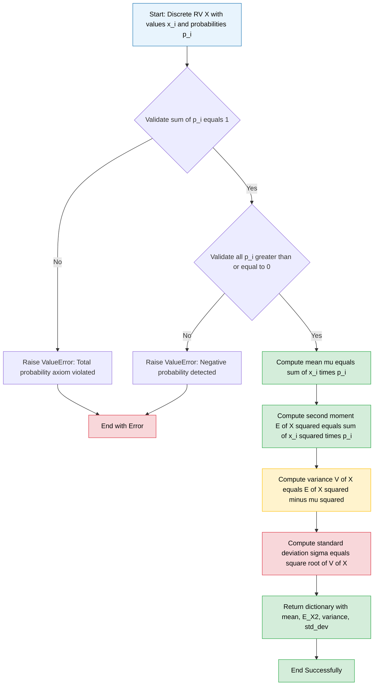
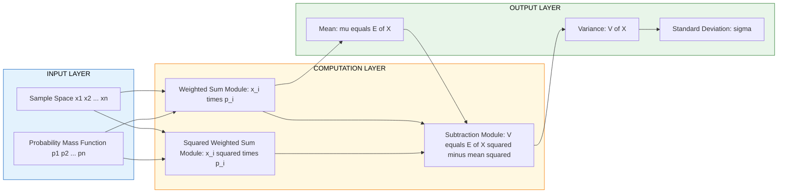
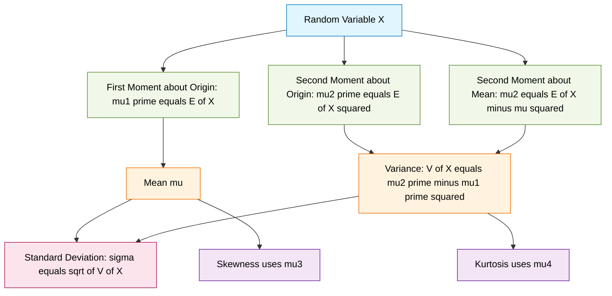

# Expectation, Mean, and Variance

<!-- SECTION_1_START -->
# Expectation, Mean, and Variance of Discrete Random Variables

## 1. Formal Academic Definition

> [!IMPORTANT]
> **Definition (Expectation of a Discrete Random Variable):**
> Let $X$ be a discrete random variable taking values $x_1, x_2, x_3, \ldots, x_n$ with corresponding probabilities $p_1, p_2, p_3, \ldots, p_n$, where $p_i = P(X = x_i) \geq 0$ and $\sum_{i=1}^{n} p_i = 1$. The **mathematical expectation** (or **expected value**, or **mean**) of $X$, denoted by $E(X)$ or $\mu_X$ or simply $\mu$, is defined as:
> $$E(X) = \sum_{i=1}^{n} x_i \, p_i$$

> [!IMPORTANT]
> **Definition (Variance of a Discrete Random Variable):**
> The **variance** of a discrete random variable $X$, denoted by $V(X)$, $\sigma_X^2$, or simply $\sigma^2$, is defined as the expected value of the squared deviation of $X$ from its mean:
> $$V(X) = E\left[(X - \mu)^2\right] = \sum_{i=1}^{n} (x_i - \mu)^2 \, p_i$$
> The **standard deviation** is $\sigma = \sqrt{V(X)}$.

## 2. Conceptual Analogy & Intuitive Overview

> [!NOTE]
> **Intuition — The "Balance Point" Picture:**
> Imagine a wooden plank with weights placed at positions $x_1, x_2, \ldots, x_n$ on a number line. The *weights* are the probabilities $p_i$. The **expectation** $E(X)$ is the exact balance point (fulcrum position) where the plank would be perfectly level. Probabilities are normalized to sum to **1** (total mass), so the balance point is the probability-weighted average of the positions.

> [!NOTE]
> **Intuition — Variance as "Spread Meter":**
> Variance measures how *spread out* the values of $X$ are around the mean $\mu$. A small variance means values cluster tightly around the mean; a large variance means values are scattered far from the mean. Think of it as the *average squared distance* of outcomes from the balance point.

## 3. Standard Metrics and Constants

> [!TIP]
> **Key Metric Conventions in KTU Examinations:**
> - $E(X)$ is also denoted as the **first moment** about the origin: $E(X^1) = \mu_1'$
> - $V(X) = E(X^2) - [E(X)]^2$ — the **shortcut formula** (most frequently tested)
> - $E(X^2) = \sum x_i^2 \, p_i$ — the **second moment** about the origin: $\mu_2'$
> - The unit of variance is the **square** of the unit of $X$; the unit of standard deviation matches the unit of $X$.

## 4. Visualization Callout

> [!VISUALIZATION CONTROL]
> **Concept:** Expectation as the center of mass (balance point) of a discrete probability distribution.
> **Desmos Input Equations (Bar Visualization):**
> * For the probability mass at $x=1$ with $p=0.2$: point $(1, 0.2)$
> * For the probability mass at $x=2$ with $p=0.3$: point $(2, 0.3)$
> * For the probability mass at $x=3$ with $p=0.5$: point $(3, 0.5)$
> * Mean line: vertical line at $x = E(X) = 2.3$
> **Visual Description:** Three vertical bars (heights $0.2$, $0.3$, $0.5$) at positions $1, 2, 3$. The dashed vertical line at $x = 2.3$ is the balance point. Values further from $2.3$ contribute more to variance since they are squared deviations.

<!-- SECTION_1_END -->

<!-- SECTION_2_START -->
# Deep Theoretical Analysis & KTU High-Yield Formula Sheet

## 1. Logical Steps for Computing Expectation

To compute $E(X)$ for a discrete random variable, follow this **structured reasoning chain**:

- **Step 1 — List the Sample Space Values:** Enumerate all distinct values $x_1, x_2, \ldots, x_n$ that $X$ can take.
- **Step 2 — Attach Probabilities:** For each $x_i$, identify $p_i = P(X = x_i)$. Verify the **axiom of total probability**: $\sum p_i = 1$.
- **Step 3 — Form the Product Pairs:** Compute each $x_i \cdot p_i$ term.
- **Step 4 — Sum All Products:** $E(X) = \sum x_i \cdot p_i$. This yields the long-run average outcome.

> [!IMPORTANT]
> **The 'Why' Behind Expectation:**
> Expectation is a *linear operator*. If you repeat the experiment infinitely many times, the sample mean of the observed values **converges** to $E(X)$ by the **Law of Large Numbers**. This is why expectation is the cornerstone of statistical inference, machine learning loss functions, and decision theory.

## 2. Logical Steps for Computing Variance

- **Step 1:** Compute $\mu = E(X)$ first.
- **Step 2:** Compute $E(X^2) = \sum x_i^2 \, p_i$.
- **Step 3:** Apply the **shortcut formula** $V(X) = E(X^2) - \mu^2$.
- **Alternative (Definition form):** Compute each $(x_i - \mu)^2 \cdot p_i$ and sum.

> [!IMPORTANT]
> **The 'Why' Behind the Shortcut Formula:**
> $V(X) = E[(X-\mu)^2] = E[X^2 - 2\mu X + \mu^2] = E(X^2) - 2\mu E(X) + \mu^2 = E(X^2) - \mu^2$. This avoids computing $(x_i - \mu)^2$ for each $i$ — far less arithmetic in KTU exams.

## 3. KTU High-Yield Formula Sheet

| Formula | Expression | Notes |
|---|---|---|
| Expectation of $X$ | $E(X) = \sum_{i} x_i \, p_i$ | Definition form |
| Expectation of $g(X)$ | $E[g(X)] = \sum_{i} g(x_i) \, p_i$ | Function of RV |
| Variance (definition) | $V(X) = \sum_{i} (x_i - \mu)^2 \, p_i$ | Squared deviation form |
| Variance (shortcut) | $V(X) = E(X^2) - [E(X)]^2$ | **Most tested in KTU** |
| Standard Deviation | $\sigma = \sqrt{V(X)}$ | Same unit as $X$ |
| $k$-th moment about origin | $\mu_k' = E(X^k) = \sum_{i} x_i^k \, p_i$ | Useful for advanced problems |
| $k$-th moment about mean | $\mu_k = E[(X-\mu)^k]$ | Variance is $\mu_2$ |
| Linearity of $E(\cdot)$ | $E(aX + b) = aE(X) + b$ | Constants shift/scale |
| Variance of linear transform | $V(aX + b) = a^2 V(X)$ | Constant $b$ has no variance |
| $V(X) \geq 0$ | $V(X) = 0 \iff X$ is constant | Variance is non-negative |

> [!NOTE]
> **Real-World Engineering Utility:**
> - **Information Science:** Expected loss in classification, expected reward in reinforcement learning, mean squared error (MSE) in signal processing.
> - **Machine Learning:** Loss functions are expectations of per-sample cost over data distributions.
> - **Computer Networks:** Expected packet delay, expected queue length, expected throughput.
> - **Cryptography & Information Theory:** Entropy is a generalized expectation; expected bits of information.

## 4. The Mean–Variance Tradeoff (Engineering Insight)

> [!TIP]
> Two random variables can have the **same mean** but **vastly different variances**. For example:
> - $X$: $P(X=0) = 0.5$, $P(X=2) = 0.5 \Rightarrow E(X) = 1$, $V(X) = 1$.
> - $Y$: $P(Y=1) = 1 \Rightarrow E(Y) = 1$, $V(Y) = 0$.
> Both have mean $1$, but $X$ is "risky" while $Y$ is "deterministic." This is the basis of **risk analysis** in financial engineering and **robust optimization** in ML.

<!-- SECTION_2_END -->

<!-- SECTION_3_START -->
# Step-by-Step Derivations & Worked Examples

## Example 1 — Direct Expectation and Variance (Foundational)

> **Problem:** A discrete random variable $X$ has the following probability distribution:
>
> | $X$ | $1$ | $2$ | $3$ | $4$ |
> |---|---|---|---|---|
> | $P(X)$ | $0.1$ | $0.2$ | $0.4$ | $0.3$ |
>
> Find $E(X)$ and $V(X)$.

### Step 1 — Verify the Probability Axiom

$$\sum p_i = 0.1 + 0.2 + 0.4 + 0.3 = 1.0 \quad \checkmark$$

### Step 2 — Compute $E(X)$ Using the Definition

$$E(X) = \sum_{i=1}^{4} x_i \, p_i$$

$$E(X) = (1)(0.1) + (2)(0.2) + (3)(0.4) + (4)(0.3)$$

$$E(X) = 0.1 + 0.4 + 1.2 + 1.2$$

$$\boxed{E(X) = 2.9}$$

### Step 3 — Compute $E(X^2)$

$$E(X^2) = \sum_{i=1}^{4} x_i^2 \, p_i$$

$$E(X^2) = (1^2)(0.1) + (2^2)(0.2) + (3^2)(0.4) + (4^2)(0.3)$$

$$E(X^2) = (1)(0.1) + (4)(0.2) + (9)(0.4) + (16)(0.3)$$

$$E(X^2) = 0.1 + 0.8 + 3.6 + 4.8$$

$$E(X^2) = 9.3$$

### Step 4 — Apply the Shortcut Variance Formula

$$V(X) = E(X^2) - [E(X)]^2$$

$$V(X) = 9.3 - (2.9)^2$$

$$V(X) = 9.3 - 8.41$$

$$\boxed{V(X) = 0.89}$$

### Step 5 — Standard Deviation

$$\sigma = \sqrt{V(X)} = \sqrt{0.89} \approx 0.9434$$

---

## Example 2 — Expectation of a Function of $X$

> **Problem:** Given the same distribution as Example 1, find $E(3X^2 - 2X + 5)$.

### Step 1 — Apply Linearity of Expectation

$$E(3X^2 - 2X + 5) = 3E(X^2) - 2E(X) + 5$$

### Step 2 — Substitute the Computed Moments

$$E(3X^2 - 2X + 5) = 3(9.3) - 2(2.9) + 5$$

$$E(3X^2 - 2X + 5) = 27.9 - 5.8 + 5$$

$$\boxed{E(3X^2 - 2X + 5) = 27.1}$$

> [!IMPORTANT]
> **Key Insight:** The linearity $E(aX + b) = aE(X) + b$ holds even when $b$ is a constant. This is heavily tested in KTU board exams as a "shortcut" question.

---

## Example 3 — Finding a Missing Probability Parameter

> **Problem:** The probability distribution of $X$ is:
>
> | $X$ | $-1$ | $0$ | $1$ | $2$ |
> |---|---|---|---|---|
> | $P(X)$ | $0.2$ | $k$ | $0.3$ | $0.1$ |
>
> Given $E(X) = 0.3$, find $k$, $E(X^2)$, and $V(X)$.

### Step 1 — Use the Total Probability Axiom to Find $k$

$$0.2 + k + 0.3 + 0.1 = 1$$

$$k + 0.6 = 1 \quad \Rightarrow \quad k = 0.4$$

### Step 2 — Verify $E(X) = 0.3$

$$E(X) = (-1)(0.2) + (0)(0.4) + (1)(0.3) + (2)(0.1)$$

$$E(X) = -0.2 + 0 + 0.3 + 0.2 = 0.3 \quad \checkmark$$

### Step 3 — Compute $E(X^2)$

$$E(X^2) = (-1)^2(0.2) + (0)^2(0.4) + (1)^2(0.3) + (2)^2(0.1)$$

$$E(X^2) = 0.2 + 0 + 0.3 + 0.4$$

$$E(X^2) = 0.9$$

### Step 4 — Compute $V(X)$

$$V(X) = E(X^2) - [E(X)]^2 = 0.9 - (0.3)^2 = 0.9 - 0.09$$

$$\boxed{V(X) = 0.81}$$

---

## Example 4 — Verification of Linear Transformation Property

> **Problem:** Let $X$ be a discrete RV with $E(X) = 4$ and $V(X) = 9$. Find $E(2X - 5)$ and $V(3X + 7)$.

### Step 1 — Apply $E(aX + b) = aE(X) + b$

$$E(2X - 5) = 2(4) + (-5) = 8 - 5 = 3$$

### Step 2 — Apply $V(aX + b) = a^2 V(X)$

$$V(3X + 7) = (3)^2 \cdot V(X) = 9 \cdot 9 = 81$$

> [!NOTE]
> **Pitfall Avoidance:** Adding a constant $b$ to $X$ does **NOT** change the variance — it merely shifts the distribution. Only multiplicative scaling $a$ affects variance, and it does so quadratically.

---

## Example 5 — Algorithmic Implementation in Python

> **Problem:** Implement a robust Python function to compute $E(X)$, $E(X^2)$, and $V(X)$ with input validation.

```python
from typing import List, Dict
import math

def compute_expectation_and_variance(
    distribution: Dict[int, float]
) -> Dict[str, float]:
    """
    Computes the mean E(X), second moment E(X^2), variance V(X),
    and standard deviation of a discrete random variable.
    
    Parameters
    ----------
    distribution : Dict[int, float]
        Mapping of outcome x_i to probability p_i.
    
    Returns
    -------
    Dict[str, float]
        Keys: 'mean', 'E_X2', 'variance', 'std_dev'
    
    Raises
    ------
    ValueError
        If probabilities do not sum to 1 (within tolerance) or are negative.
    """
    if not distribution:
        raise ValueError("[ERROR] Distribution dictionary is empty.")
    
    # --- Validation Step 1: Non-negative probabilities ---
    for x, p in distribution.items():
        if p < 0:
            raise ValueError(
                f"[ERROR] Negative probability detected at x={x}: p={p}"
            )
    
    # --- Validation Step 2: Total probability axiom ---
    total_prob = sum(distribution.values())
    if not math.isclose(total_prob, 1.0, abs_tol=1e-9):
        raise ValueError(
            f"[ERROR] Probabilities sum to {total_prob}, expected 1.0"
        )
    
    # --- Compute E(X) ---
    mean: float = sum(x * p for x, p in distribution.items())
    
    # --- Compute E(X^2) ---
    second_moment: float = sum((x ** 2) * p for x, p in distribution.items())
    
    # --- Compute V(X) using shortcut formula ---
    variance: float = second_moment - (mean ** 2)
    
    # --- Defensive: variance must be non-negative (floating point tolerance) ---
    if variance < -1e-12:
        raise ValueError("[ERROR] Computed negative variance — invalid input.")
    
    variance = max(variance, 0.0)
    std_dev: float = math.sqrt(variance)
    
    return {
        "mean": mean,
        "E_X2": second_moment,
        "variance": variance,
        "std_dev": std_dev,
    }


# ===== Test Harness for Example 1 =====
if __name__ == "__main__":
    dist_ex1: Dict[int, float] = {
        1: 0.1,
        2: 0.2,
        3: 0.4,
        4: 0.3,
    }
    results = compute_expectation_and_variance(dist_ex1)
    print(f"E(X)   = {results['mean']:.4f}")        # Expected: 2.9000
    print(f"E(X^2) = {results['E_X2']:.4f}")        # Expected: 9.3000
    print(f"V(X)   = {results['variance']:.4f}")    # Expected: 0.8900
    print(f"sigma  = {results['std_dev']:.4f}")     # Expected: 0.9434
```

**Expected Output:**
```
E(X)   = 2.9000
E(X^2) = 9.3000
V(X)   = 0.8900
sigma  = 0.9434
```

<!-- SECTION_3_END -->

<!-- SECTION_4_START -->
# Structural Diagrams & Schematics

## 1. Computational Workflow for $E(X)$ and $V(X)$



## 2. Block-Level Architecture: Mean vs. Variance Conceptual Pipeline



## 3. Conceptual Map: Relationship Between Mean, Variance, and Moments



## 4. Sequential Processing Topology Matrix

| Stage | Input | Operation | Output | Validation Check |
|---|---|---|---|---|
| **Stage 1** | Raw PMF table $(x_i, p_i)$ | Enumerate support of $X$ | Validated list of pairs | $\sum p_i = 1$ |
| **Stage 2** | Validated pairs | Form products $x_i \cdot p_i$ | Product list | Each $p_i \in [0, 1]$ |
| **Stage 3** | Product list | Aggregate sum | $E(X) = \mu$ | $\mu$ finite and real |
| **Stage 4** | Validated pairs | Form products $x_i^2 \cdot p_i$ | Squared product list | No overflow |
| **Stage 5** | Squared product list | Aggregate sum | $E(X^2)$ | $E(X^2) \geq \mu^2$ |
| **Stage 6** | $\mu$, $E(X^2)$ | Subtract: $E(X^2) - \mu^2$ | $V(X)$ | $V(X) \geq 0$ |
| **Stage 7** | $V(X)$ | Square root | $\sigma$ | $\sigma \geq 0$ |

<!-- SECTION_4_END -->

<!-- SECTION_5_START -->
# KTU 2024 Scheme Examination Question Bank & Topic Recap

---

## Part A — Short Answer Questions (3 Marks Each)

### Question A1
> **[KTU University Exam – July 2024 | CO1 | Remember]**
> Define the mathematical expectation of a discrete random variable. If a fair die is rolled, find $E(X)$ where $X$ denotes the number that appears on the upper face.

**Model Answer:**

**Definition (2 Marks):** If $X$ is a discrete random variable taking values $x_1, x_2, \ldots, x_n$ with probabilities $p_1, p_2, \ldots, p_n$, then the **mathematical expectation** of $X$ is defined as:
$$E(X) = \sum_{i=1}^{n} x_i \, p_i$$

**Computation (1 Mark):** For a fair die, $X \in \{1, 2, 3, 4, 5, 6\}$ with $P(X = x_i) = \tfrac{1}{6}$ for all $i$.

$$E(X) = (1 + 2 + 3 + 4 + 5 + 6) \cdot \frac{1}{6} = \frac{21}{6} = 3.5$$

---

### Question A2
> **[KTU University Exam – Dec 2023 | CO1 | Understand]**
> State any three properties of expectation of a discrete random variable.

**Model Answer:**

1. **Linearity:** $E(aX + b) = aE(X) + b$ for constants $a, b$.
2. **Expectation of a constant:** $E(c) = c$ for any constant $c$.
3. **Non-negativity preservation:** If $X \geq 0$, then $E(X) \geq 0$.
4. **Additivity:** $E(X + Y) = E(X) + E(Y)$ (for any two RVs $X, Y$).
5. **Multiplicativity for independent RVs:** If $X, Y$ independent, $E(XY) = E(X) \cdot E(Y)$.

*(Any three correct properties with brief justification: 3 Marks)*

---

## Part B — Long Answer Questions (14 Marks Each)

> **MODULE INTERNAL CHOICE:** Attempt **either** Question B1A **or** Question B1B.

---

### Question B1A (14 Marks)

> **[KTU University Exam – July 2024 | CO1, CO2 | Understand, Apply]**

**(a)** Define variance and standard deviation of a discrete random variable. Derive the relation $V(X) = E(X^2) - [E(X)]^2$ from first principles. **(7 Marks)**

**(b)** The probability distribution of a discrete random variable $X$ is given below:

| $X$ | $-2$ | $-1$ | $0$ | $1$ | $2$ |
|---|---|---|---|---|---|
| $P(X)$ | $0.1$ | $0.2$ | $0.3$ | $0.3$ | $0.1$ |

Compute $E(X)$, $E(X^2)$, $V(X)$, and $\sigma$. **(7 Marks)**

---

#### Model Solution for B1A(a)

**Definition of Variance (2 Marks):** The variance of a discrete random variable $X$ with mean $\mu = E(X)$ is the expected value of the squared deviation of $X$ from its mean:
$$V(X) = E\left[(X - \mu)^2\right] = \sum_{i=1}^{n} (x_i - \mu)^2 \, p_i$$

**Definition of Standard Deviation (1 Mark):** The standard deviation is the positive square root of variance:
$$\sigma = \sqrt{V(X)}$$

**Derivation of the Shortcut Formula (4 Marks):**

Starting from the definition:
$$V(X) = \sum_{i=1}^{n} (x_i - \mu)^2 \, p_i$$

Expanding the square:
$$V(X) = \sum_{i=1}^{n} (x_i^2 - 2\mu x_i + \mu^2) \, p_i$$

Distributing the summation:
$$V(X) = \sum_{i=1}^{n} x_i^2 \, p_i - 2\mu \sum_{i=1}^{n} x_i \, p_i + \mu^2 \sum_{i=1}^{n} p_i$$

Applying the axioms of expectation and total probability:
$$V(X) = E(X^2) - 2\mu \cdot E(X) + \mu^2 \cdot 1$$

Since $\mu = E(X)$:
$$V(X) = E(X^2) - 2\mu^2 + \mu^2$$

$$\boxed{V(X) = E(X^2) - \mu^2 = E(X^2) - [E(X)]^2}$$

---

#### Model Solution for B1A(b)

**Step 1 — Verify Total Probability (0.5 Marks):**
$$0.1 + 0.2 + 0.3 + 0.3 + 0.1 = 1.0 \quad \checkmark$$

**Step 2 — Compute $E(X)$ (2 Marks):**
$$E(X) = (-2)(0.1) + (-1)(0.2) + (0)(0.3) + (1)(0.3) + (2)(0.1)$$
$$E(X) = -0.2 - 0.2 + 0 + 0.3 + 0.2$$
$$\boxed{E(X) = 0.1}$$

**Step 3 — Compute $E(X^2)$ (2 Marks):**
$$E(X^2) = (-2)^2(0.1) + (-1)^2(0.2) + (0)^2(0.3) + (1)^2(0.3) + (2)^2(0.1)$$
$$E(X^2) = (4)(0.1) + (1)(0.2) + 0 + (1)(0.3) + (4)(0.1)$$
$$E(X^2) = 0.4 + 0.2 + 0 + 0.3 + 0.4$$
$$\boxed{E(X^2) = 1.3}$$

**Step 4 — Compute $V(X)$ (1.5 Marks):**
$$V(X) = E(X^2) - [E(X)]^2 = 1.3 - (0.1)^2 = 1.3 - 0.01$$
$$\boxed{V(X) = 1.29}$$

**Step 5 — Compute Standard Deviation (1 Mark):**
$$\sigma = \sqrt{V(X)} = \sqrt{1.29} \approx 1.1358$$

---

### Question B1B (14 Marks) — Alternative Choice

> **[KTU University Exam – Dec 2023 | CO1, CO2 | Understand, Apply]**

**(a)** State and prove the linearity property of expectation: $E(aX + b) = aE(X) + b$ for a discrete random variable $X$ and constants $a, b$. Hence deduce $E(b) = b$. **(7 Marks)**

**(b)** The probability mass function of a discrete random variable $Y$ is given by:
$$P(Y = y) = \begin{cases} k \cdot y & \text{for } y = 1, 2, 3, 4 \\ 0 & \text{otherwise} \end{cases}$$

Find the value of $k$, $E(Y)$, $E(Y^2)$, and $V(Y)$. **(7 Marks)**

---

#### Model Solution for B1B(a)

**Statement of Property (1 Mark):** For a discrete random variable $X$ with values $x_i$ and probabilities $p_i$, and for any real constants $a$ and $b$:
$$E(aX + b) = aE(X) + b$$

**Proof (5 Marks):**

Let $Z = aX + b$. Then $Z$ takes values $z_i = a x_i + b$ with probabilities $p_i$.

By the definition of expectation of a function of a discrete RV:
$$E(aX + b) = \sum_{i=1}^{n} (a x_i + b) \, p_i$$

Distributing $p_i$:
$$E(aX + b) = \sum_{i=1}^{n} a x_i \, p_i + \sum_{i=1}^{n} b \, p_i$$

Factoring out the constants:
$$E(aX + b) = a \sum_{i=1}^{n} x_i \, p_i + b \sum_{i=1}^{n} p_i$$

Recognizing the summations:
$$E(aX + b) = a \cdot E(X) + b \cdot 1$$

$$\boxed{E(aX + b) = aE(X) + b}$$

**Deduction of $E(b) = b$ (1 Mark):** Setting $a = 0$ in the proved identity:
$$E(0 \cdot X + b) = 0 \cdot E(X) + b = b$$
$$\therefore E(b) = b$$

---

#### Model Solution for B1B(b)

**Step 1 — Apply the Total Probability Axiom to Find $k$ (2 Marks):**
$$\sum_{y=1}^{4} P(Y = y) = 1$$
$$k(1) + k(2) + k(3) + k(4) = 1$$
$$k(1 + 2 + 3 + 4) = 1$$
$$k(10) = 1 \quad \Rightarrow \quad k = 0.1$$

**Step 2 — Verify (0.5 Marks):** $\sum = 0.1 + 0.2 + 0.3 + 0.4 = 1.0 \checkmark$

**Step 3 — Compute $E(Y)$ (1.5 Marks):**
$$E(Y) = \sum_{y=1}^{4} y \cdot P(Y = y) = \sum_{y=1}^{4} y \cdot (0.1 y) = 0.1 \sum_{y=1}^{4} y^2$$
$$E(Y) = 0.1 (1^2 + 2^2 + 3^2 + 4^2) = 0.1 (1 + 4 + 9 + 16) = 0.1 (30)$$
$$\boxed{E(Y) = 3.0}$$

**Step 4 — Compute $E(Y^2)$ (1.5 Marks):**
$$E(Y^2) = \sum_{y=1}^{4} y^2 \cdot P(Y = y) = \sum_{y=1}^{4} y^2 \cdot (0.1 y) = 0.1 \sum_{y=1}^{4} y^3$$
$$E(Y^2) = 0.1 (1^3 + 2^3 + 3^3 + 4^3) = 0.1 (1 + 8 + 27 + 64) = 0.1 (100)$$
$$\boxed{E(Y^2) = 10.0}$$

**Step 5 — Compute $V(Y)$ (1.5 Marks):**
$$V(Y) = E(Y^2) - [E(Y)]^2 = 10.0 - (3.0)^2 = 10.0 - 9.0$$
$$\boxed{V(Y) = 1.0}$$

---

## KTU Examiner's Valuation Warning / Pitfall Callout

> [!WARNING]
> **Common Mark-Deduction Pitfalls in Expectation & Variance Questions:**
>
> 1. **Skipping the probability validation step:** Always verify $\sum p_i = 1$ before computing $E(X)$. Failing to do so can cost **1 Mark** even if the final answer is correct.
> 2. **Confusing $E(X^2)$ with $[E(X)]^2$:** Students frequently write $V(X) = E(X^2) - E(X^2)$ and arrive at $0$. Remember the correct order: **$E(X^2)$ minus the square of $E(X)$** — this single error costs **3–4 Marks** in a 7-mark sub-question.
> 3. **Forgetting to square the deviations in the definition form:** When using $V(X) = \sum (x_i - \mu)^2 p_i$, students sometimes write $\sum (x_i - \mu) p_i$ — this always yields $0$ (a dead giveaway of incomplete understanding).
> 4. **Incorrect handling of $V(aX + b)$:** The correct form is $V(aX + b) = a^2 V(X)$, **NOT** $aV(X) + b$. Adding a constant $b$ does **not** affect variance. This is a favorite KTU trap.
> 5. **Unit mismatch in final answer:** If the question asks for standard deviation, give $\sigma = \sqrt{V(X)}$ — do not just state variance. The unit of $\sigma$ matches $X$; the unit of $V(X)$ is the square of $X$'s unit.
> 6. **Missing the linearity shortcut:** For $E(aX + b)$ style questions, breaking apart into $aE(X) + b$ is **faster** and **safer** than recomputing the distribution of $aX + b$.

---

## Topic Recap & Important Things to Remember

> [!IMPORTANT]
> **Rapid Revision Checklist — Expectation, Mean, and Variance**

- **Expectation Definition:** $E(X) = \sum_{i=1}^{n} x_i \, p_i$ — a *probability-weighted average* of the values of $X$.
- **Variance Definition:** $V(X) = \sum_{i=1}^{n} (x_i - \mu)^2 \, p_i$ — a measure of *dispersion* around the mean.
- **Shortcut Variance Formula:** $V(X) = E(X^2) - [E(X)]^2$ — the most-used identity in KTU problems.
- **Standard Deviation:** $\sigma = \sqrt{V(X)}$ — expressed in the same unit as $X$.
- **Total Probability Axiom (Mandatory Check):** $\sum_{i=1}^{n} p_i = 1$ — always verify before computation.
- **Non-negativity of Probability:** $0 \leq p_i \leq 1$ for all $i$.
- **Variance is Non-negative:** $V(X) \geq 0$ always, with equality **iff** $X$ is a constant.
- **Linearity of Expectation:** $E(aX + b) = aE(X) + b$ — for any constants $a, b$.
- **Variance under Linear Transform:** $V(aX + b) = a^2 V(X)$ — constants shift the mean but do not change the spread.
- **Expectation of a Constant:** $E(c) = c$ — the expectation of a degenerate (constant) random variable.
- **Unit of Variance:** $(\text{unit of } X)^2$ — the squared unit.
- **Unit of Standard Deviation:** Same as the unit of $X$.
- **Moments:** $\mu_1' = E(X)$, $\mu_2' = E(X^2)$, $\mu_2 = V(X) = E[(X-\mu)^2]$.
- **Expectation of a Function:** $E[g(X)] = \sum g(x_i) \, p_i$ — no need to find the distribution of $g(X)$ first.
- **Geometric Intuition:** Mean is the *center of mass*; variance is the *moment of inertia* about the center of mass.
- **Engineering Relevance:** MSE in regression, expected loss in classification, risk in portfolio theory, entropy in information theory, average reward in MDPs/reinforcement learning.
- **Pitfall to Avoid:** Never confuse $E(X^2)$ with $(E(X))^2$. They are equal **only** if $V(X) = 0$.

<!-- SECTION_5_END -->
