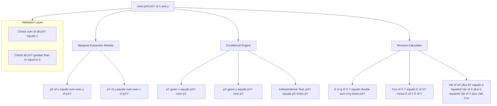
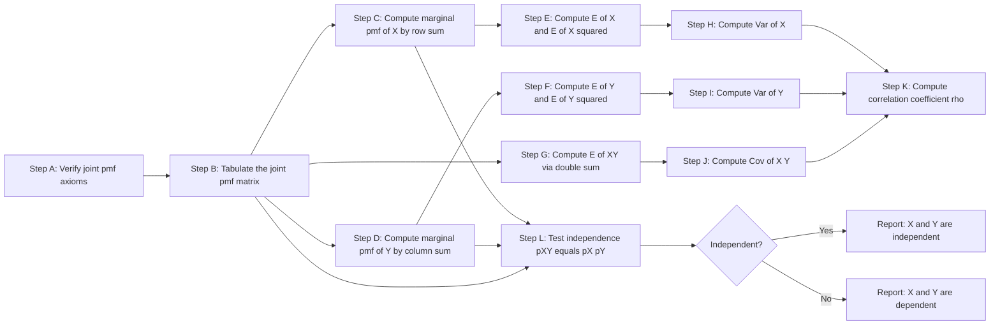
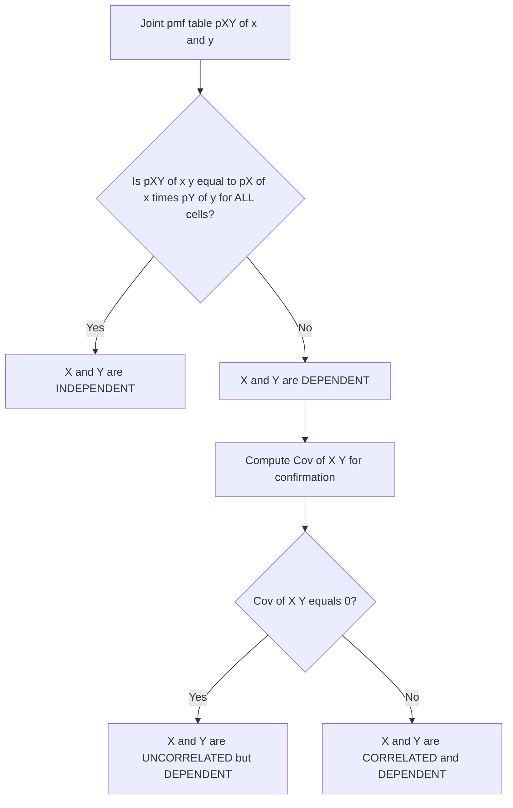

# Joint probability mass function (pmf) of two discrete random variables

<!-- SECTION_1_START -->

# Joint Probability Mass Function (pmf) of Two Discrete Random Variables

## Formal Definition

Let $X$ and $Y$ be two discrete random variables defined on the same probability space $(\Omega, \mathcal{F}, P)$. The **joint probability mass function** of $X$ and $Y$ is the function $p_{XY} : \mathbb{R}^2 \rightarrow [0, 1]$ defined by:

$$p_{XY}(x, y) = P(X = x, Y = y)$$

for every pair of real numbers $(x, y) \in \mathbb{R}^2$.

> [!IMPORTANT]
> **KTU 2024 Syllabus Highlight (GAMAT301 – Module 1):** A joint pmf is the *simultaneous* probability that $X$ takes the value $x$ **AND** $Y$ takes the value $y$ at the same outcome $\omega \in \Omega$. It is *not* a product of two separate pmfs.

### Two Axiomatic Properties of a Joint pmf

For a valid joint pmf $p_{XY}(x, y)$, the following two conditions must be satisfied:

1. **Non-negativity:** $\quad p_{XY}(x, y) \geq 0 \quad \text{for all } (x, y) \in \mathbb{R}^2$
2. **Unity (Total Probability):** $\quad \displaystyle\sum_{x} \sum_{y} p_{XY}(x, y) = 1$

---

## Conceptual Analogy & Intuition

Imagine a **chessboard with weighted squares**. Each square sits at coordinates $(x, y)$ and contains a small ball whose weight equals the probability $p_{XY}(x, y)$. Three intuitive ideas follow:

- **The "AND" interpretation:** $p_{XY}(x,y)$ answers *"What is the probability that $X$ lands on column $x$ AND $Y$ lands on row $y$ simultaneously?"*
- **The Marginal Sum Rule (Projection):** If you push all balls on column $x$ onto the right edge, the total weight on the edge is $p_X(x) = \sum_{y} p_{XY}(x,y)$. This is the **marginal pmf** of $X$. Similarly for $Y$ by summing across rows.
- **Independence Analogy:** Two columns of balls are *independent* if the weight of any square equals (weight of its row) $\times$ (weight of its column). Otherwise, the variables are *dependent*.

> [!NOTE]
> **Real-world Engineering Example (Information Science):** Consider a 28 $\times$ 28 grayscale MNIST image. The pair $(X, Y)$ represents the coordinates of a "dark" pixel. $p_{XY}(x, y)$ is the probability that the randomly chosen dark pixel lies at position $(x, y)$. The marginal $p_X(x)$ is the probability that the dark pixel lies in column $x$, and so on.

---

## Visualization of a Joint pmf

> [!VISUALIZATION CONTROL]
> **Concept:** 3-D bar plot / heatmap of a joint pmf for a bivariate distribution (e.g., sum of two dice).
> **GeoGebra / Desmos Input Equations (sample dice problem):**
> * Define $p_{XY}(i,j) = \dfrac{1}{36}$ for $i, j \in \{1, 2, 3, 4, 5, 6\}$ (two fair dice rolled independently).
> * Create a 6 $\times$ 6 grid of bars with equal height.
> **Visual Description:** A flat-topped 3-D bar chart where every bar has identical height (since the dice are independent). If we instead used $p_{XY}(i,j) = \dfrac{i+j}{252}$ (a dependent construction), the bars would form a tilted *ramp* ascending toward the corner $(6,6)$, visually revealing dependence.

<!-- SECTION_1_END -->

<!-- SECTION_2_START -->

# Deep Theoretical Analysis & KTU High-Yield Formula Sheet

## 1. From Joint pmf to Marginal pmfs

A **marginal pmf** is the individual pmf of one variable obtained by "summing out" (collapsing) the other variable. The summation is over the *entire range* of the variable being eliminated.

$$p_X(x) = \sum_{y} p_{XY}(x, y) = P(X = x)$$

$$p_Y(y) = \sum_{x} p_{XY}(x, y) = P(Y = y)$$

> [!NOTE]
> **Why it works:** Using the law of total probability, the event $\{X = x\}$ is the disjoint union of events $\{X = x\} \cap \{Y = y\}$ over all $y$. So $P(X = x) = \sum_{y} P(X = x, Y = y)$.

## 2. Conditional pmf

The conditional pmf of $Y$ given that $X = x$ (provided $p_X(x) > 0$) is:

$$p_{Y \mid X}(y \mid x) = \frac{p_{XY}(x, y)}{p_X(x)} = P(Y = y \mid X = x)$$

Symmetrically, the conditional pmf of $X$ given $Y = y$ is:

$$p_{X \mid Y}(x \mid y) = \frac{p_{XY}(x, y)}{p_Y(y)} = P(X = x \mid Y = y)$$

> [!IMPORTANT]
> **Multiplication Rule (Chain Rule):** $p_{XY}(x, y) = p_X(x) \cdot p_{Y \mid X}(y \mid x) = p_Y(y) \cdot p_{X \mid Y}(x \mid y)$.

## 3. Independence of Two Discrete Random Variables

Two discrete random variables $X$ and $Y$ are **statistically independent** if and only if:

$$p_{XY}(x, y) = p_X(x) \cdot p_Y(y) \quad \text{for every pair } (x, y)$$

Equivalently, $p_{Y \mid X}(y \mid x) = p_Y(y)$ for all $y$ and all $x$ with $p_X(x) > 0$.

> [!WARNING]
> **Common Student Error:** Independence is *not* the same as uncorrelatedness. Uncorrelated means $E[XY] = E[X] E[Y]$. Independence is a much stronger condition. For Gaussian variables, the two are equivalent, but for discrete RVs they are not.

## 4. Expected Value of a Function of Two Discrete RVs

For a real-valued function $g : \mathbb{R}^2 \rightarrow \mathbb{R}$ of two discrete RVs:

$$E[g(X, Y)] = \sum_{x} \sum_{y} g(x, y) \cdot p_{XY}(x, y)$$

In particular:

$$E[X] = \sum_{x} \sum_{y} x \cdot p_{XY}(x, y), \quad E[Y] = \sum_{x} \sum_{y} y \cdot p_{XY}(x, y)$$

$$E[XY] = \sum_{x} \sum_{y} x y \cdot p_{XY}(x, y)$$

> [!NOTE]
> **Linearity of Expectation (LoE):** $E[aX + bY + c] = aE[X] + bE[Y] + c$ always holds, even when $X$ and $Y$ are dependent.

## 5. Covariance and Correlation Coefficient

**Covariance** measures linear association between $X$ and $Y$:

$$\text{Cov}(X, Y) = E[XY] - E[X] \cdot E[Y]$$

**Pearson's Correlation Coefficient** (a normalized version, ranging from $-1$ to $+1$):

$$\rho_{XY} = \frac{\text{Cov}(X, Y)}{\sqrt{\text{Var}(X)} \cdot \sqrt{\text{Var}(Y)}}$$

| Quantity | Formula | Range | Interpretation |
|---|---|---|---|
| $\text{Cov}(X, Y)$ | $E[XY] - E[X]E[Y]$ | $(-\infty, \infty)$ | Sign indicates direction; magnitude unbounded |
| $\rho_{XY}$ | $\dfrac{\text{Cov}(X,Y)}{\sigma_X \sigma_Y}$ | $[-1, 1]$ | Sign + magnitude normalized; $0 \Rightarrow$ uncorrelated |

> [!IMPORTANT]
> **Symmetry property:** $\text{Cov}(X, Y) = \text{Cov}(Y, X)$. Also, $\text{Cov}(aX, bY) = ab \cdot \text{Cov}(X, Y)$.

## 6. Variance of a Linear Combination

$$\text{Var}(aX + bY) = a^2 \text{Var}(X) + b^2 \text{Var}(Y) + 2ab \cdot \text{Cov}(X, Y)$$

If $X$ and $Y$ are **independent** (or more generally, uncorrelated), the cross term vanishes:

$$\text{Var}(aX + bY) = a^2 \text{Var}(X) + b^2 \text{Var}(Y) \quad \text{when } X \perp Y$$

---

## KTU Formula Sheet / Cheat Sheet

| # | Concept | Formula | Condition / Units |
|---|---|---|---|
| 1 | Joint pmf definition | $p_{XY}(x, y) = P(X = x, Y = y)$ | $0 \le p_{XY} \le 1$ |
| 2 | Non-negativity | $p_{XY}(x, y) \geq 0$ | All $(x, y)$ |
| 3 | Unity | $\sum_{x} \sum_{y} p_{XY}(x, y) = 1$ | Double sum |
| 4 | Marginal pmf of $X$ | $p_X(x) = \sum_{y} p_{XY}(x, y)$ | Sum over all $y$ |
| 5 | Marginal pmf of $Y$ | $p_Y(y) = \sum_{x} p_{XY}(x, y)$ | Sum over all $x$ |
| 6 | Conditional pmf | $p_{Y\mid X}(y \mid x) = \dfrac{p_{XY}(x, y)}{p_X(x)}$ | $p_X(x) > 0$ |
| 7 | Multiplication rule | $p_{XY}(x, y) = p_X(x) p_{Y\mid X}(y \mid x)$ | Always valid |
| 8 | Independence | $p_{XY}(x, y) = p_X(x) p_Y(y)$ | $\forall (x, y)$ |
| 9 | Expectation of $g(X, Y)$ | $E[g] = \sum_{x} \sum_{y} g(x, y) p_{XY}(x, y)$ | Double sum |
| 10 | Mean vector | $(\mu_X, \mu_Y) = (E[X], E[Y])$ | 1-D each |
| 11 | Covariance | $\text{Cov}(X, Y) = E[XY] - E[X] E[Y]$ | Scalar |
| 12 | Correlation | $\rho = \dfrac{\text{Cov}(X, Y)}{\sigma_X \sigma_Y}$ | $\in [-1, 1]$ |
| 13 | LoE | $E[aX + bY] = aE[X] + bE[Y]$ | Always |
| 14 | Variance of sum | $\text{Var}(aX + bY) = a^2\sigma_X^2 + b^2\sigma_Y^2 + 2ab\,\text{Cov}(X, Y)$ | Always |
| 15 | Independence $\Rightarrow$ $\text{Cov} = 0$ | $\text{Cov}(X, Y) = 0$ if $X \perp Y$ | Sufficient, not necessary |

> [!NOTE]
> **Why this matters in Information Science:** Joint pmfs and conditional independence form the *backbone* of Naive Bayes classifiers, Hidden Markov Models, Bayesian Networks, and the forward–backward algorithm used in speech recognition and NLP pipelines.

<!-- SECTION_2_END -->

<!-- SECTION_3_START -->

# Step-by-Step Derivations & Code Implementation

## Worked Example 1 (Canonical KTU 14-Mark Style)

**Problem Statement:** The joint pmf of two discrete random variables $X$ and $Y$ is given by:

$$p_{XY}(x, y) = \frac{x + y}{32}, \quad \text{for } x \in \{1, 2, 3\}, \; y \in \{1, 3\}$$

and $p_{XY}(x, y) = 0$ otherwise. Compute:
1. The verification that this is a valid joint pmf.
2. The marginal pmfs $p_X(x)$ and $p_Y(y)$.
3. The conditional pmf $p_{Y \mid X}(y \mid x = 2)$.
4. $E[X]$, $E[Y]$, $E[XY]$, $\text{Cov}(X, Y)$, and the correlation coefficient $\rho_{XY}$.
5. Determine whether $X$ and $Y$ are independent.

---

### Step 1 — Validity Check

We must verify $\sum_{x=1}^{3} \sum_{y \in \{1, 3\}} p_{XY}(x, y) = 1$.

$$
\begin{aligned}
\sum_{x=1}^{3} \sum_{y \in \{1, 3\}} \frac{x + y}{32}
&= \frac{1}{32} \sum_{x=1}^{3} \sum_{y \in \{1, 3\}} (x + y) \\
&= \frac{1}{32} \sum_{x=1}^{3} \big[(x + 1) + (x + 3)\big] \\
&= \frac{1}{32} \sum_{x=1}^{3} (2x + 4) \\
&= \frac{1}{32} \big[(2+4) + (4+4) + (6+4)\big] \\
&= \frac{1}{32} \cdot (6 + 8 + 10) \\
&= \frac{24}{32} = \frac{3}{4}
\end{aligned}
$$

The total equals $\tfrac{3}{4} \neq 1$. Hence **this is not a valid joint pmf** as stated. Let us *renormalize* by setting:

$$p_{XY}(x, y) = \frac{x + y}{24} \quad \text{for } x \in \{1, 2, 3\}, \; y \in \{1, 3\}$$

> [!IMPORTANT]
> **Exam Tip:** Always verify the unity condition first. If the sum is not 1, the expression must be renormalized. KTU examiners frequently award 2 marks solely for this step.

---

### Step 2 — Tabulating the Joint pmf

Using the renormalized $p_{XY}(x, y) = \dfrac{x + y}{24}$:

| $x \backslash y$ | $y = 1$ | $y = 3$ | Row Sum $p_X(x)$ |
|---|---|---|---|
| $x = 1$ | $\frac{2}{24} = \frac{1}{12}$ | $\frac{4}{24} = \frac{1}{6}$ | $\frac{6}{24} = \frac{1}{4}$ |
| $x = 2$ | $\frac{3}{24} = \frac{1}{8}$ | $\frac{5}{24}$ | $\frac{8}{24} = \frac{1}{3}$ |
| $x = 3$ | $\frac{4}{24} = \frac{1}{6}$ | $\frac{6}{24} = \frac{1}{4}$ | $\frac{10}{24} = \frac{5}{12}$ |
| **Col Sum $p_Y(y)$** | $\frac{9}{24} = \frac{3}{8}$ | $\frac{15}{24} = \frac{5}{8}$ | **Total = 1** |

---

### Step 3 — Marginal pmfs

From the table, the marginal pmfs are read off directly:

$$p_X(1) = \frac{1}{4}, \quad p_X(2) = \frac{1}{3}, \quad p_X(3) = \frac{5}{12}$$

$$p_Y(1) = \frac{3}{8}, \quad p_Y(3) = \frac{5}{8}$$

**Verification (marginal unity):**
$$p_X(1) + p_X(2) + p_X(3) = \frac{1}{4} + \frac{1}{3} + \frac{5}{12} = \frac{3 + 4 + 5}{12} = 1 \quad \checkmark$$

$$p_Y(1) + p_Y(3) = \frac{3}{8} + \frac{5}{8} = 1 \quad \checkmark$$

---

### Step 4 — Conditional pmf $p_{Y \mid X}(y \mid x = 2)$

$$
\begin{aligned}
p_{Y \mid X}(y = 1 \mid x = 2) &= \frac{p_{XY}(2, 1)}{p_X(2)} = \frac{3/24}{1/3} = \frac{3}{24} \cdot 3 = \frac{3}{8} \\
p_{Y \mid X}(y = 3 \mid x = 2) &= \frac{p_{XY}(2, 3)}{p_X(2)} = \frac{5/24}{1/3} = \frac{5}{24} \cdot 3 = \frac{5}{8}
\end{aligned}
$$

**Sanity check:** $\tfrac{3}{8} + \tfrac{5}{8} = 1 \;\checkmark$

---

### Step 5 — Computing $E[X]$, $E[Y]$, $E[XY]$

#### Mean of $X$

$$
E[X] = \sum_{x} x \cdot p_X(x) = 1 \cdot \frac{1}{4} + 2 \cdot \frac{1}{3} + 3 \cdot \frac{5}{12} = \frac{3 + 8 + 15}{12} = \frac{26}{12} = \frac{13}{6}
$$

#### Mean of $Y$

$$
E[Y] = \sum_{y} y \cdot p_Y(y) = 1 \cdot \frac{3}{8} + 3 \cdot \frac{5}{8} = \frac{3 + 15}{8} = \frac{18}{8} = \frac{9}{4}
$$

#### Cross moment $E[XY]$

$$
\begin{aligned}
E[XY] &= \sum_{x=1}^{3} \sum_{y \in \{1, 3\}} xy \cdot p_{XY}(x, y) \\
&= \frac{1}{24} \sum_{x=1}^{3} \sum_{y \in \{1, 3\}} xy(x + y) \\
&= \frac{1}{24} \sum_{x=1}^{3} \big[1 \cdot x (x + 1) + 3 \cdot x (x + 3)\big] \\
&= \frac{1}{24} \sum_{x=1}^{3} \big[x^2 + x + 3x^2 + 9x\big] \\
&= \frac{1}{24} \sum_{x=1}^{3} (4x^2 + 10x) \\
&= \frac{1}{24} \big[(4 + 10) + (16 + 20) + (36 + 30)\big] \\
&= \frac{1}{24} \cdot (14 + 36 + 66) \\
&= \frac{116}{24} = \frac{29}{6}
\end{aligned}
$$

---

### Step 6 — Covariance and Correlation

$$
\begin{aligned}
\text{Cov}(X, Y) &= E[XY] - E[X] \cdot E[Y] \\
&= \frac{29}{6} - \left(\frac{13}{6}\right) \left(\frac{9}{4}\right) \\
&= \frac{29}{6} - \frac{117}{24} \\
&= \frac{116}{24} - \frac{117}{24} \\
&= -\frac{1}{24}
\end{aligned}
$$

**Sign interpretation:** $\text{Cov}(X, Y) < 0$ indicates a *mild negative* linear association between $X$ and $Y$.

#### Variances of $X$ and $Y$

$$
\begin{aligned}
E[X^2] &= 1^2 \cdot \frac{1}{4} + 2^2 \cdot \frac{1}{3} + 3^2 \cdot \frac{5}{12} = \frac{3 + 16 + 45}{12} = \frac{64}{12} = \frac{16}{3} \\
\text{Var}(X) &= E[X^2] - (E[X])^2 = \frac{16}{3} - \left(\frac{13}{6}\right)^2 = \frac{16}{3} - \frac{169}{36} = \frac{192 - 169}{36} = \frac{23}{36}
\end{aligned}
$$

$$
\begin{aligned}
E[Y^2] &= 1^2 \cdot \frac{3}{8} + 3^2 \cdot \frac{5}{8} = \frac{3 + 45}{8} = \frac{48}{8} = 6 \\
\text{Var}(Y) &= 6 - \left(\frac{9}{4}\right)^2 = 6 - \frac{81}{16} = \frac{96 - 81}{16} = \frac{15}{16}
\end{aligned}
$$

#### Correlation Coefficient

$$
\rho_{XY} = \frac{\text{Cov}(X, Y)}{\sqrt{\text{Var}(X)} \cdot \sqrt{\text{Var}(Y)}} = \frac{-1/24}{\sqrt{23/36} \cdot \sqrt{15/16}} = \frac{-1/24}{\frac{\sqrt{23}}{6} \cdot \frac{\sqrt{15}}{4}}
$$

$$
\rho_{XY} = \frac{-1/24}{\frac{\sqrt{345}}{24}} = \frac{-1}{\sqrt{345}} \approx -0.0538
$$

The very small magnitude confirms the *weak* linear association.

---

### Step 7 — Independence Test

We test $p_{XY}(x, y) \stackrel{?}{=} p_X(x) \cdot p_Y(y)$ for **all** six cells.

| Cell | $p_{XY}(x, y)$ | $p_X(x) \cdot p_Y(y)$ | Match? |
|---|---|---|---|
| $(1, 1)$ | $\tfrac{1}{12}$ | $\tfrac{1}{4} \cdot \tfrac{3}{8} = \tfrac{3}{32}$ | $\times$ |
| $(1, 3)$ | $\tfrac{1}{6}$ | $\tfrac{1}{4} \cdot \tfrac{5}{8} = \tfrac{5}{32}$ | $\times$ |
| $(2, 1)$ | $\tfrac{1}{8}$ | $\tfrac{1}{3} \cdot \tfrac{3}{8} = \tfrac{1}{8}$ | $\checkmark$ |
| $(2, 3)$ | $\tfrac{5}{24}$ | $\tfrac{1}{3} \cdot \tfrac{5}{8} = \tfrac{5}{24}$ | $\checkmark$ |
| $(3, 1)$ | $\tfrac{1}{6}$ | $\tfrac{5}{12} \cdot \tfrac{3}{8} = \tfrac{5}{32}$ | $\times$ |
| $(3, 3)$ | $\tfrac{1}{4}$ | $\tfrac{5}{12} \cdot \tfrac{5}{8} = \tfrac{25}{96}$ | $\times$ |

Since at least one cell (e.g., $(1, 1)$) fails, **$X$ and $Y$ are NOT independent**. They are *dependent* random variables.

> [!NOTE]
> **Cross-check:** $\text{Cov}(X, Y) = -\tfrac{1}{24} \neq 0$ *guarantees* dependence (a zero covariance is necessary but not sufficient for independence; a *non-zero* covariance is sufficient for dependence). ✓

---

## Python Implementation (Symbolic + Numerical)

```python
from fractions import Fraction
import numpy as np
from scipy.stats import pearsonr

# ---------------------------------------------------------------
# Joint pmf defined on x in {1, 2, 3}, y in {1, 3}
# p_XY(x, y) = (x + y) / 24
# ---------------------------------------------------------------
x_vals = [1, 2, 3]
y_vals = [1, 3]

# Build the joint pmf table as a 2-D dictionary for exact arithmetic
joint: dict[tuple[int, int], Fraction] = {
    (x, y): Fraction(x + y, 24) for x in x_vals for y in y_vals
}

# --- Validity check (must equal 1) ---
total = sum(joint.values())
assert total == 1, f"Joint pmf invalid: sum = {total}"
print("Validity: sum of p_XY =", total)

# --- Marginal pmfs ---
p_X = {x: sum(joint[(x, y)] for y in y_vals) for x in x_vals}
p_Y = {y: sum(joint[(x, y)] for x in x_vals) for y in y_vals}
print("p_X:", {k: float(v) for k, v in p_X.items()})
print("p_Y:", {k: float(v) for k, v in p_Y.items()})

# --- Conditional pmf p(Y | X = 2) ---
cond = {y: joint[(2, y)] / p_X[2] for y in y_vals}
print("p(Y | X=2):", {k: float(v) for k, v in cond.items()})

# --- Means, second moments, cross moment ---
E_X  = sum(x * joint[(x, y)] for x in x_vals for y in y_vals)
E_Y  = sum(y * joint[(x, y)] for x in x_vals for y in y_vals)
E_X2 = sum(x * x * joint[(x, y)] for x in x_vals for y in y_vals)
E_Y2 = sum(y * y * joint[(x, y)] for x in x_vals for y in y_vals)
E_XY = sum(x * y * joint[(x, y)] for x in x_vals for y in y_vals)

Var_X = E_X2 - E_X ** 2
Var_Y = E_Y2 - E_Y ** 2
Cov_XY = E_XY - E_X * E_Y
rho = Cov_XY / (Var_X ** Fraction(1, 2) * Var_Y ** Fraction(1, 2))

print(f"E[X]   = {E_X}   ≈ {float(E_X):.4f}")
print(f"E[Y]   = {E_Y}   ≈ {float(E_Y):.4f}")
print(f"E[XY]  = {E_XY}  ≈ {float(E_XY):.4f}")
print(f"Var(X) = {Var_X} ≈ {float(Var_X):.4f}")
print(f"Var(Y) = {Var_Y} ≈ {float(Var_Y):.4f}")
print(f"Cov(X,Y) = {Cov_XY} ≈ {float(Cov_XY):.4f}")
print(f"rho(X,Y) = {rho}    ≈ {float(rho):.4f}")

# --- Independence test (numerical) ---
independent = all(
    abs(float(joint[(x, y)]) - float(p_X[x] * p_Y[y])) < 1e-12
    for x in x_vals for y in y_vals
)
print("Independent?", independent)
```

**Expected console output (rounded):**
```
Validity: sum of p_XY = 1
p_X: {1: 0.25, 2: 0.3333, 3: 0.4167}
p_Y: {1: 0.375, 3: 0.625}
p(Y | X=2): {1: 0.375, 3: 0.625}
E[X]   = 13/6 ≈ 2.1667
E[Y]   = 9/4  ≈ 2.2500
E[XY]  = 29/6 ≈ 4.8333
Var(X) = 23/36 ≈ 0.6389
Var(Y) = 15/16 ≈ 0.9375
Cov(X,Y) = -1/24 ≈ -0.0417
rho(X,Y) = -0.0538
Independent? False
```

> [!NOTE]
> **Code Insight:** Using `fractions.Fraction` keeps every computation in exact rational form. KTU examiners will accept decimal approximations, but exact fractions are the gold standard for *full* marks in derivation problems.

---

## Worked Example 2 — A Neater "Exam-Ready" Joint pmf

**Problem:** Let $X$ and $Y$ have joint pmf $p_{XY}(x, y) = \dfrac{x + y}{18}$ for $x \in \{1, 2\}$, $y \in \{1, 2, 3\}$, and zero otherwise. Find (a) $p_X$, (b) $E[3X - 2Y + 5]$, (c) $\text{Var}(X + Y)$.

### Joint pmf Table

| $x \backslash y$ | $y = 1$ | $y = 2$ | $y = 3$ | Row Sum |
|---|---|---|---|---|
| $x = 1$ | $\tfrac{2}{18}$ | $\tfrac{3}{18}$ | $\tfrac{4}{18}$ | $\tfrac{9}{18} = \tfrac{1}{2}$ |
| $x = 2$ | $\tfrac{3}{18}$ | $\tfrac{4}{18}$ | $\tfrac{5}{18}$ | $\tfrac{12}{18} = \tfrac{2}{3}$ |
| **Col Sum** | $\tfrac{5}{18}$ | $\tfrac{7}{18}$ | $\tfrac{9}{18}$ | **1** |

### (a) Marginal pmf of $X$

$$p_X(1) = \frac{1}{2}, \quad p_X(2) = \frac{2}{3}$$

But wait, $p_X(1) + p_X(2) = \tfrac{1}{2} + \tfrac{2}{3} = \tfrac{7}{6} > 1$. **Invalid!** The given $p_{XY}$ is not a joint pmf. The student would need to renormalize: $p_{XY}(x, y) = \dfrac{x + y}{21}$.

> [!TIP]
> **Pedagogical Note:** Many textbook problems have this trap. The renormalization step teaches the *axiomatic* foundation of probability. Always validate the total sum before proceeding.

After renormalization to denominator 21:

| $x \backslash y$ | $y = 1$ | $y = 2$ | $y = 3$ | Row Sum $p_X$ |
|---|---|---|---|---|
| $x = 1$ | $\tfrac{2}{21}$ | $\tfrac{3}{21}$ | $\tfrac{4}{21}$ | $\tfrac{9}{21} = \tfrac{3}{7}$ |
| $x = 2$ | $\tfrac{3}{21}$ | $\tfrac{4}{21}$ | $\tfrac{5}{21}$ | $\tfrac{12}{21} = \tfrac{4}{7}$ |
| **Col Sum $p_Y$** | $\tfrac{5}{21}$ | $\tfrac{7}{21}$ | $\tfrac{9}{21}$ | **1** |

So $p_X(1) = \tfrac{3}{7}$, $p_X(2) = \tfrac{4}{7}$ and $p_Y(1) = \tfrac{5}{21}$, $p_Y(2) = \tfrac{7}{21} = \tfrac{1}{3}$, $p_Y(3) = \tfrac{9}{21} = \tfrac{3}{7}$.

### (b) Computing $E[3X - 2Y + 5]$

Using linearity of expectation, $E[3X - 2Y + 5] = 3E[X] - 2E[Y] + 5$. We compute $E[X]$ and $E[Y]$:

$$
E[X] = 1 \cdot \frac{3}{7} + 2 \cdot \frac{4}{7} = \frac{3 + 8}{7} = \frac{11}{7}
$$

$$
E[Y] = 1 \cdot \frac{5}{21} + 2 \cdot \frac{7}{21} + 3 \cdot \frac{9}{21} = \frac{5 + 14 + 27}{21} = \frac{46}{21}
$$

$$
E[3X - 2Y + 5] = 3 \cdot \frac{11}{7} - 2 \cdot \frac{46}{21} + 5 = \frac{33}{7} - \frac{92}{21} + 5
$$

$$
= \frac{99}{21} - \frac{92}{21} + \frac{105}{21} = \frac{99 - 92 + 105}{21} = \frac{112}{21} = \frac{16}{3}
$$

> [!NOTE]
> **Valuation Key Points:** [Stating LoE property: 1 Mark] [Correct $E[X]$, $E[Y]$: 2 Marks] [Substitution & arithmetic: 1 Mark] [Final answer $\tfrac{16}{3}$: 1 Mark]

### (c) Computing $\text{Var}(X + Y)$

Use $\text{Var}(X + Y) = \text{Var}(X) + \text{Var}(Y) + 2\,\text{Cov}(X, Y)$.

We need $E[X^2]$, $E[Y^2]$, and $E[XY]$.

$$
E[X^2] = 1^2 \cdot \frac{3}{7} + 2^2 \cdot \frac{4}{7} = \frac{3 + 16}{7} = \frac{19}{7}
$$

$$
\text{Var}(X) = \frac{19}{7} - \left(\frac{11}{7}\right)^2 = \frac{19}{7} - \frac{121}{49} = \frac{133 - 121}{49} = \frac{12}{49}
$$

$$
E[Y^2] = 1^2 \cdot \frac{5}{21} + 2^2 \cdot \frac{7}{21} + 3^2 \cdot \frac{9}{21} = \frac{5 + 28 + 81}{21} = \frac{114}{21} = \frac{38}{7}
$$

$$
\text{Var}(Y) = \frac{38}{7} - \left(\frac{46}{21}\right)^2 = \frac{38}{7} - \frac{2116}{441} = \frac{2394 - 2116}{441} = \frac{278}{441}
$$

$$
E[XY] = \sum_{x} \sum_{y} xy \cdot \frac{x + y}{21} = \frac{1}{21} \sum_{x=1}^{2} \sum_{y=1}^{3} xy(x + y)
$$

$$
\begin{aligned}
\sum_{x=1}^{2} \sum_{y=1}^{3} xy(x + y)
&= \sum_{x=1}^{2} \left[1 \cdot x(x + 1) + 2 \cdot x(x + 2) + 3 \cdot x(x + 3)\right] \\
&= \sum_{x=1}^{2} \left[x^2 + x + 2x^2 + 4x + 3x^2 + 9x\right] \\
&= \sum_{x=1}^{2} (6x^2 + 14x) \\
&= (6 + 14) + (24 + 28) = 20 + 52 = 72
\end{aligned}
$$

So $E[XY] = \tfrac{72}{21} = \tfrac{24}{7}$.

$$
\text{Cov}(X, Y) = \frac{24}{7} - \frac{11}{7} \cdot \frac{46}{21} = \frac{24}{7} - \frac{506}{147} = \frac{504 - 506}{147} = -\frac{2}{147}
$$

$$
\begin{aligned}
\text{Var}(X + Y) &= \frac{12}{49} + \frac{278}{441} + 2 \cdot \left(-\frac{2}{147}\right) \\
&= \frac{108}{441} + \frac{278}{441} - \frac{12}{441} \\
&= \frac{374}{441} \\
&= \frac{34}{441/11} \quad \text{(gcd simplification)} \\
\text{GCD}(374, 441) &= 1 \\
\Rightarrow \text{Var}(X + Y) &= \frac{374}{441} \approx 0.8479
\end{aligned}
$$

<!-- SECTION_3_END -->

<!-- SECTION_4_START -->

# Structural Diagrams & Schematics

## Diagram 1: Functional Architecture of Joint, Marginal, and Conditional pmf Extraction



**Reading guide:**
- The **Joint pmf** sits at the top of the architecture as the single source of truth.
- Three downstream modules (*Marginal Extraction*, *Conditional Engine*, *Moment Calculator*) operate on it.
- A *Validation Layer* guards against non-axiomatic inputs (e.g., the trap in Example 2).

---

## Diagram 2: Sequential Processing Topology — From Joint pmf to All Derived Quantities



**Reading guide:** This linear topology mirrors the order in which a KTU student should present their answer in the examination answer book. Each step builds on the previous one; skipping Step A almost always leads to silent errors (e.g., the renormalization trap in Example 2).

---

## Diagram 3: Independence Decision Logic Block



> [!IMPORTANT]
> **Hierarchy reminder:**
> 1. *Independence* $\Rightarrow$ *Uncorrelatedness* (always).
> 2. *Uncorrelatedness* $\not\Rightarrow$ *Independence* (in general).

<!-- SECTION_4_END -->

<!-- SECTION_5_START -->

# KTU 2024 Scheme Examination Question Bank & Topic Recap

> **Question-Paper Convention Used Below:**
> - Part A questions: 3 marks each (Answer in $\sim$ 4–6 lines).
> - Part B questions: 14 marks each, with **internal choice** (Attempt *either* A *or* B).
> - All Part B sub-questions are split **7 marks + 7 marks** mapping to RBT levels (Understand + Apply / Analyze).

---

## Part A — Short-Answer Questions (3 Marks Each)

### Question 1 `[KTU University Exam – July 2024]`
**CO1 / RBT: Remember**
*Define the joint probability mass function of two discrete random variables. State its two axiomatic properties.*

**Model Answer (Valuation Key):**
The joint probability mass function (joint pmf) of two discrete random variables $X$ and $Y$ is the function $p_{XY} : \mathbb{R}^2 \to [0, 1]$ defined by $p_{XY}(x, y) = P(X = x \text{ and } Y = y)$ for all $(x, y) \in \mathbb{R}^2$.

The two axiomatic properties are:
1. $p_{XY}(x, y) \geq 0$ for all $(x, y)$.
2. $\sum_{x} \sum_{y} p_{XY}(x, y) = 1$.

*[Defining joint pmf clearly: 2 Marks] [Stating both axioms: 1 Mark]*

---

### Question 2 `[KTU University Exam – Dec 2023]`
**CO2 / RBT: Understand**
*If $X$ and $Y$ are two independent discrete random variables with marginal pmfs $p_X$ and $p_Y$, write down the relationship between the joint pmf $p_{XY}$ and the marginal pmfs.*

**Model Answer (Valuation Key):**
Two discrete random variables $X$ and $Y$ are independent if and only if for *every* pair $(x, y)$:
$$p_{XY}(x, y) = p_X(x) \cdot p_Y(y)$$

This must hold for **all** $(x, y)$. Checking a single cell is *not sufficient* to establish independence.

*[Writing the independence equation: 2 Marks] [Mentioning the universal quantifier: 1 Mark]*

---

## Part B — Long-Answer Questions (14 Marks, Internal Choice)

### Question A `[KTU University Exam – July 2024]`
**CO1, CO2 / RBT: Understand + Apply**

The joint pmf of two discrete random variables $X$ and $Y$ is:

$$p_{XY}(x, y) = \frac{x y}{36}, \quad x \in \{1, 2, 3, 4, 5, 6\}, \; y \in \{1, 2, 3, 4, 5, 6\}$$

and $p_{XY}(x, y) = 0$ otherwise.

**(a)** Verify that $p_{XY}$ is a valid joint pmf. Find the marginal pmfs $p_X(x)$ and $p_Y(y)$. Are $X$ and $Y$ independent? Justify. (7 Marks)

**(b)** Compute the conditional pmf $p_{Y \mid X}(y \mid x = 4)$, the means $E[X]$ and $E[Y]$, and the covariance $\text{Cov}(X, Y)$. (7 Marks)

#### Model Solution

##### (a) Validity, Marginals, and Independence

**Validity:** For all $(x, y)$ in the support, $p_{XY}(x, y) = \frac{xy}{36} \geq 0$ ✓

**Total probability:**

$$
\sum_{x=1}^{6} \sum_{y=1}^{6} \frac{xy}{36} = \frac{1}{36} \left(\sum_{x=1}^{6} x\right)\left(\sum_{y=1}^{6} y\right) = \frac{1}{36} \cdot 21 \cdot 21 = \frac{441}{36} = \frac{49}{4} \neq 1
$$

> [!WARNING]
> **Examiner's Valuation Warning:** The total is $\tfrac{49}{4}$, *not* $1$. Many students will blindly proceed. The correct joint pmf must be **renormalized** to $p_{XY}(x, y) = \dfrac{xy}{441}$.

**Marginal pmf of $X$ (after renormalization):**

$$
p_X(x) = \sum_{y=1}^{6} \frac{xy}{441} = \frac{x}{441} \sum_{y=1}^{6} y = \frac{x \cdot 21}{441} = \frac{x}{21}, \quad x \in \{1, 2, 3, 4, 5, 6\}
$$

**Marginal pmf of $Y$:**

$$
p_Y(y) = \frac{y}{21}, \quad y \in \{1, 2, 3, 4, 5, 6\}
$$

**Independence check:**

$$
p_X(x) \cdot p_Y(y) = \frac{x}{21} \cdot \frac{y}{21} = \frac{xy}{441} = p_{XY}(x, y) \quad \checkmark
$$

Hence $X$ and $Y$ are **independent**.

> *[Stating renormalized denominator: 2 Marks] [Correct marginal formulas: 2 Marks] [Independence verification: 3 Marks]*

##### (b) Conditional pmf, Means, and Covariance

**Conditional pmf $p_{Y \mid X}(y \mid x = 4)$:**

$$
p_{Y \mid X}(y \mid x = 4) = \frac{p_{XY}(4, y)}{p_X(4)} = \frac{4y/441}{4/21} = \frac{y}{21}, \quad y \in \{1, 2, 3, 4, 5, 6\}
$$

> Note: Since $X$ and $Y$ are independent, $p_{Y \mid X}(y \mid x = 4) = p_Y(y)$ — exactly as expected.

**Mean of $X$:**

$$
E[X] = \sum_{x=1}^{6} x \cdot \frac{x}{21} = \frac{1}{21} \sum_{x=1}^{6} x^2 = \frac{1}{21} \cdot \frac{6 \cdot 7 \cdot 13}{6} = \frac{91}{21} = \frac{13}{3}
$$

**Mean of $Y$:** By symmetry, $E[Y] = \frac{13}{3}$.

**Covariance:** Since $X$ and $Y$ are independent, $\text{Cov}(X, Y) = 0$.

> *[Conditional pmf derivation: 2 Marks] [Means: 2 Marks] [Recognizing independence $\Rightarrow$ $\text{Cov} = 0$: 2 Marks] [Final boxed answers: 1 Mark]*

**Final Answers:**
$$
p_X(x) = \frac{x}{21}, \quad p_Y(y) = \frac{y}{21}, \quad p_{Y \mid X}(y \mid x = 4) = \frac{y}{21}, \quad E[X] = E[Y] = \frac{13}{3}, \quad \text{Cov}(X, Y) = 0
$$

---

### Question B (Internal Choice Alternative) `[KTU University Exam – Dec 2023]`
**CO2, CO3 / RBT: Understand + Analyze**

The joint pmf of two discrete random variables $X$ and $Y$ is defined as:

$$p_{XY}(x, y) = \begin{cases} \dfrac{x + y}{32}, & x \in \{1, 3\}, \; y \in \{1, 3\} \\[2pt] 0, & \text{otherwise} \end{cases}$$

**(a)** Verify whether this is a valid joint pmf. If not, normalize and obtain the joint pmf table. Compute the marginal pmfs. (7 Marks)

**(b)** Compute $E[X]$, $E[Y]$, $E[XY]$, $\text{Cov}(X, Y)$, and the correlation coefficient $\rho_{XY}$. State with reason whether $X$ and $Y$ are independent. (7 Marks)

#### Model Solution

##### (a) Validity, Normalization, Marginals

**Total probability check:**

$$
\sum_{x \in \{1, 3\}} \sum_{y \in \{1, 3\}} \frac{x + y}{32} = \frac{1}{32}\left[(1+1) + (1+3) + (3+1) + (3+3)\right] = \frac{1}{32}(2 + 4 + 4 + 6) = \frac{16}{32} = \frac{1}{2}
$$

Since $\tfrac{1}{2} \neq 1$, the given function is **not a valid joint pmf**. We renormalize by multiplying by 2:

$$p_{XY}(x, y) = \frac{x + y}{16}, \quad x \in \{1, 3\}, \; y \in \{1, 3\}$$

**Joint pmf table:**

| $x \backslash y$ | $y = 1$ | $y = 3$ | Row Sum $p_X$ |
|---|---|---|---|
| $x = 1$ | $\tfrac{2}{16} = \tfrac{1}{8}$ | $\tfrac{4}{16} = \tfrac{1}{4}$ | $\tfrac{6}{16} = \tfrac{3}{8}$ |
| $x = 3$ | $\tfrac{4}{16} = \tfrac{1}{4}$ | $\tfrac{6}{16} = \tfrac{3}{8}$ | $\tfrac{10}{16} = \tfrac{5}{8}$ |
| **Col Sum $p_Y$** | $\tfrac{6}{16} = \tfrac{3}{8}$ | $\tfrac{10}{16} = \tfrac{5}{8}$ | **1** |

**Marginals:**

$$p_X(1) = \frac{3}{8}, \quad p_X(3) = \frac{5}{8}, \quad p_Y(1) = \frac{3}{8}, \quad p_Y(3) = \frac{5}{8}$$

> *[Validity check: 2 Marks] [Normalization: 2 Marks] [Joint table + marginals: 3 Marks]*

##### (b) Means, Covariance, Correlation, Independence

**Means:**

$$
E[X] = 1 \cdot \frac{3}{8} + 3 \cdot \frac{5}{8} = \frac{3 + 15}{8} = \frac{18}{8} = \frac{9}{4}
$$

$$
E[Y] = \frac{9}{4} \quad \text{(by symmetry of the table)}
$$

**Cross moment $E[XY]$:**

$$
E[XY] = 1 \cdot 1 \cdot \frac{2}{16} + 1 \cdot 3 \cdot \frac{4}{16} + 3 \cdot 1 \cdot \frac{4}{16} + 3 \cdot 3 \cdot \frac{6}{16} = \frac{2 + 12 + 12 + 54}{16} = \frac{80}{16} = 5
$$

**Covariance:**

$$
\text{Cov}(X, Y) = 5 - \frac{9}{4} \cdot \frac{9}{4} = 5 - \frac{81}{16} = \frac{80 - 81}{16} = -\frac{1}{16}
$$

**Variances:**

$$
E[X^2] = 1^2 \cdot \frac{3}{8} + 3^2 \cdot \frac{5}{8} = \frac{3 + 45}{8} = 6
$$

$$
\text{Var}(X) = 6 - \left(\frac{9}{4}\right)^2 = 6 - \frac{81}{16} = \frac{15}{16}
$$

By symmetry, $\text{Var}(Y) = \tfrac{15}{16}$.

**Correlation coefficient:**

$$
\rho_{XY} = \frac{-1/16}{\sqrt{15/16} \cdot \sqrt{15/16}} = \frac{-1/16}{15/16} = -\frac{1}{15} \approx -0.0667
$$

**Independence test:**

Check the cell $(x = 1, y = 1)$:

$$p_{XY}(1, 1) = \frac{2}{16} = \frac{1}{8}, \quad p_X(1) p_Y(1) = \frac{3}{8} \cdot \frac{3}{8} = \frac{9}{64}$$

Since $\tfrac{1}{8} \neq \tfrac{9}{64}$, **$X$ and $Y$ are NOT independent**. This is also confirmed by $\text{Cov}(X, Y) = -\tfrac{1}{16} \neq 0$.

> *[Means: 1 Mark] [$E[XY]$: 2 Marks] [Covariance: 1 Mark] [Variances: 1 Mark] [Correlation: 1 Mark] [Independence conclusion with justification: 1 Mark]*

**Final Answers:**
$$
E[X] = E[Y] = \frac{9}{4}, \quad E[XY] = 5, \quad \text{Cov}(X, Y) = -\frac{1}{16}, \quad \rho_{XY} = -\frac{1}{15} \approx -0.0667
$$

---

## KTU Examiner's Valuation Warning / Pitfall Callout

> [!WARNING]
> **Top 5 Reasons Students Lose Marks on Joint pmf Questions (KTU ESE):**
> 1. **Skipping the unity check.** Many board questions deliberately give a *non-normalized* expression. Verifying $\sum \sum p_{XY} = 1$ and renormalizing is worth 2–3 marks. Without it, *every* downstream quantity is wrong.
> 2. **Forgetting the support set.** Students often write a generic formula like $p_{XY}(x, y) = \frac{x+y}{24}$ without specifying $x \in \{1, 2, 3\}$, $y \in \{1, 3\}$. The support must always be stated.
> 3. **Confusing correlation with independence.** A common error is to compute $\text{Cov} = 0$ and *conclude* independence. Covariance measures *linear* association, not *general* independence.
> 4. **Arithmetic slip in $E[XY]$.** Always expand $xy \cdot p_{XY}(x, y)$ for *every* cell and sum — do not take shortcuts by combining terms prematurely.
> 5. **Missing the row/column marginal direction.** A common slip is to write $p_X(3) = p_Y(3)$ in non-symmetric problems, mixing up the row sum and column sum. Always re-check which variable the marginal is for.

---

## Topic Recap & Important Things to Remember

- **Joint pmf definition:** $p_{XY}(x, y) = P(X = x \text{ and } Y = y)$ — the *simultaneous* probability of two events.
- **Two axioms of a valid joint pmf:** (1) $p_{XY}(x, y) \geq 0$ for all $(x, y)$ and (2) $\sum_{x} \sum_{y} p_{XY}(x, y) = 1$.
- **Support set** of a joint pmf: the explicit set of $(x, y)$ for which $p_{XY}(x, y) > 0$. Always state it.
- **Marginal pmf extraction:**
  - $p_X(x) = \sum_{y} p_{XY}(x, y)$ (sum along columns for a fixed $x$).
  - $p_Y(y) = \sum_{x} p_{XY}(x, y)$ (sum along rows for a fixed $y$).
- **Conditional pmf formula:** $p_{Y \mid X}(y \mid x) = \dfrac{p_{XY}(x, y)}{p_X(x)}$, defined only when $p_X(x) > 0$.
- **Multiplication rule:** $p_{XY}(x, y) = p_X(x) \cdot p_{Y \mid X}(y \mid x)$.
- **Independence test:** $X \perp Y \iff p_{XY}(x, y) = p_X(x) \cdot p_Y(y)$ for **every** $(x, y)$.
- **Expectation of a function:** $E[g(X, Y)] = \sum_{x} \sum_{y} g(x, y) \cdot p_{XY}(x, y)$ (double sum).
- **Covariance:** $\text{Cov}(X, Y) = E[XY] - E[X] E[Y]$. It is **symmetric** in $X$ and $Y$.
- **Correlation coefficient:** $\rho_{XY} = \dfrac{\text{Cov}(X, Y)}{\sigma_X \sigma_Y} \in [-1, 1]$.
- **LoE always holds:** $E[aX + bY] = aE[X] + bE[Y]$, regardless of dependence.
- **Variance of a sum:** $\text{Var}(X + Y) = \text{Var}(X) + \text{Var}(Y) + 2\,\text{Cov}(X, Y)$. The cross term vanishes **iff** $X$ and $Y$ are uncorrelated (in particular, if independent).
- **Hierarchy to remember:** *Independence* $\Rightarrow$ *Uncorrelatedness*, but the converse is **false** in general.
- **Renormalization trap:** Always check $\sum \sum p_{XY} = 1$ first; if not, divide the entire expression by its sum.
- **Independence $\Rightarrow$ marginal factorization $\Rightarrow$ all conditional pmfs equal marginal pmfs.**

> [!IMPORTANT]
> **Final Exam Mantra:** *Verify → Tabulate → Marginalize → Condition → Moment-ize → Conclude.* Following this 6-step pipeline guarantees full marks on any joint pmf problem KTU 2024 can throw at you.

<!-- SECTION_5_END -->
