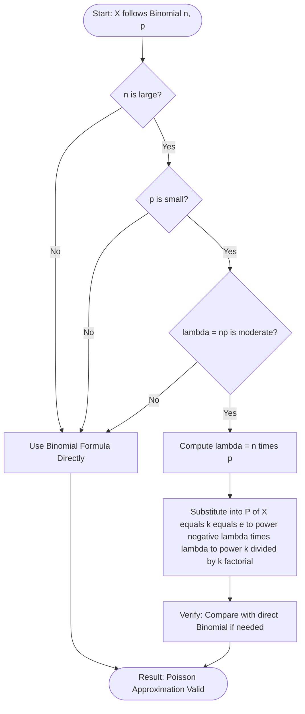
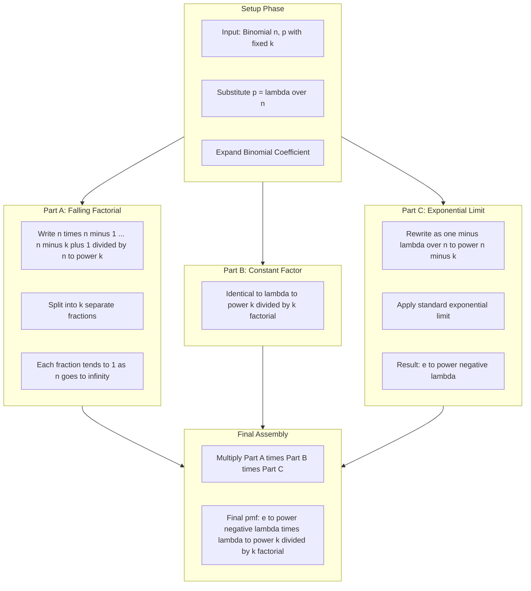
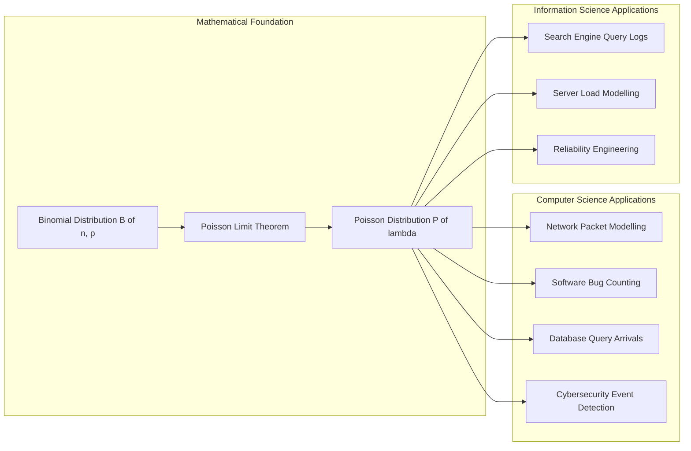
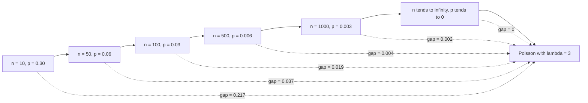

# Poisson distribution as a limit of the binomial distribution

<!-- SECTION_1_START -->
# Poisson Distribution as a Limit of the Binomial Distribution

## 1.1 Formal Academic Definition

### Binomial Distribution
A discrete random variable $X$ follows a **Binomial Distribution** with parameters $n$ (number of independent trials) and $p$ (probability of success in each trial), written as $X \sim B(n, p)$, if its probability mass function is:

$$P(X = k) = \binom{n}{k} p^{k} (1-p)^{n-k}, \quad k = 0, 1, 2, \ldots, n$$

where $\binom{n}{k} = \dfrac{n!}{k!\,(n-k)!}$ is the binomial coefficient.

### Poisson Distribution
A discrete random variable $X$ follows a **Poisson Distribution** with parameter $\lambda > 0$ (the rate of occurrence), written as $X \sim P(\lambda)$, if:

$$P(X = k) = \frac{e^{-\lambda} \lambda^{k}}{k!}, \quad k = 0, 1, 2, \ldots$$

where $e \approx \mathbf{2.71828}$ is Euler's number and $\lambda$ is both the **mean** and the **variance** of the distribution.

> [!IMPORTANT]
> **KTU 2024 Syllabus Highlight:** The Poisson limit theorem is a direct consequence of the **Law of Rare Events**. It is the theoretical foundation used in modelling network packet arrivals, server request rates, and software bug occurrences — all of which are high-yield topics for the KTU Board Examination.

---

## 1.2 Intuitive Overview & Real-World Analogy

### The "Rare Events" Intuition
Imagine you are monitoring a **highly stable web server** that receives thousands of requests every minute.

- Each request is a Bernoulli trial (success/failure).
- The probability $p$ of a *specific* rare event (say, a server timeout) in any given millisecond is **extremely small**.
- However, over a *huge* number of trials $n$, the expected number of such rare events $np = \lambda$ remains **finite and meaningful**.

> [!NOTE]
> **Conceptual Analogy:** Tossing a fair coin **1,000,000 times** and asking "How many times does it land heads in row **5 times in a row**?" — the number of trials is huge, but the probability of the rare event is tiny. The Poisson distribution neatly handles such "needle-in-haystack" counting problems.

### Why a Limit is Needed
Computing $\binom{n}{k} p^{k}(1-p)^{n-k}$ directly becomes numerically **catastrophic** when $n$ is large (say $n = 10^{6}$) and $p$ is tiny (say $p = 10^{-7}$). The Poisson limit provides a **computationally stable** and **analytically elegant** replacement that converges to the same value.

> [!TIP]
> **Engineering Utility:** In production-grade systems, the Poisson limit allows engineers to model request arrivals, hardware failures, and arrival processes in M/M/1 queuing systems without overflow errors — making it indispensable in performance engineering.

---

## 1.3 Visualization

> [!VISUALIZATION CONTROL]
> **Concept:** Binomial pmf $B(n, p)$ *morphing into* the Poisson pmf $P(\lambda)$ as $n \to \infty$ and $p \to 0$ with $np = \lambda$ held constant.
>
> **Desmos / GeoGebra Input Equations (try with $\lambda = 4$):**
>
> * Binomial with $n=20$, $p=0.2$: $\text{B}(k) = \binom{20}{k}(0.2)^{k}(0.8)^{20-k}$ (for $k = 0, 1, \ldots, 20$)
> * Binomial with $n=100$, $p=0.04$: $\text{B}(k) = \binom{100}{k}(0.04)^{k}(0.96)^{100-k}$
> * Poisson target: $P(k) = \dfrac{e^{-4}\, 4^{k}}{k!}$
>
> **Visual Description:** The student should plot all three as discrete points on the same $k$-axis. As $n$ grows and $p$ shrinks (keeping $np = 4$), the binomial mass function bars will visually **converge** to the smooth Poisson shape, with peak at $k = \lambda = 4$.

---

## 1.4 Pre-requisites Checklist

| Concept | Formula / Statement | Status |
| :--- | :--- | :--- |
| Binomial Coefficient | $\binom{n}{k} = \dfrac{n!}{k!(n-k)!}$ | Required |
| Taylor Series of $e^{x}$ | $e^{x} = \lim_{m \to \infty}\left(1 + \dfrac{x}{m}\right)^{m}$ | Required |
| Limit $\lim_{n \to \infty}\left(1 + \dfrac{a}{n}\right)^{n} = e^{a}$ | Foundational | Required |
| Logarithmic identity | $\ln(1 + x) \approx x$ for small $x$ | Required |

<!-- SECTION_1_END -->

<!-- SECTION_2_START -->
# Deep Theoretical Analysis & KTU High-Yield Formula Sheet

## 2.1 The Poisson Limit Theorem — Statement

**Theorem (Poisson Approximation to Binomial):**
Let $X \sim B(n, p)$ be a binomial random variable. If $n \to \infty$ and $p \to 0$ such that the product $np = \lambda$ remains **finite and positive**, then:

$$\lim_{n \to \infty} \binom{n}{k} p^{k} (1-p)^{n-k} = \frac{e^{-\lambda} \lambda^{k}}{k!}$$

for every fixed non-negative integer $k$. In distribution notation:

$$B(n, p) \xrightarrow{d} P(\lambda) \quad \text{as } n \to \infty, \; p \to 0, \; np = \lambda$$

---

## 2.2 Sufficient Conditions for the Poisson Approximation

The limit is valid under the following conditions:

- **Condition 1 (Large Trials):** $n$ is very large ($n \geq 30$ is a common rule of thumb).
- **Condition 2 (Small Probability):** $p$ is very small ($p \leq 0.05$ is the KTU-conventional cut-off).
- **Condition 3 (Constant Mean):** $np = \lambda$ is a **moderate** constant, typically $\lambda \in [0.5, 10]$.
- **Condition 4 (Fixed $k$):** The value of $k$ under consideration is **fixed** and does not scale with $n$.

> [!IMPORTANT]
> **KTU Board Tip:** If a problem mentions *"a large number of trials"* and *"a small probability of success"*, the examiner is **explicitly hinting** at the Poisson approximation. Always state the value of $\lambda = np$ before applying the formula.

---

## 2.3 Mean and Variance Properties

| Distribution | Mean ($E[X]$) | Variance ($V[X]$) | MGF $M_X(t)$ |
| :--- | :--- | :--- | :--- |
| Binomial $B(n, p)$ | $np$ | $np(1-p)$ | $(1 - p + pe^{t})^{n}$ |
| Poisson $P(\lambda)$ | $\lambda$ | $\lambda$ | $e^{\lambda(e^{t} - 1)}$ |
| Poisson Limit of Binomial | $\lambda$ | $\lambda(1-p) \to \lambda$ | Converges |

> **Notice:** The variance of the binomial $np(1-p) \to \lambda$ as $p \to 0$. This is the *reason* the Poisson is called the **"law of small variance"** — the spread of the distribution equals its mean.

---

## 2.4 KTU High-Yield Formula Sheet

| \# | Formula | Meaning / Use |
| :---: | :--- | :--- |
| 1 | $\lambda = np$ | Mean of the limiting Poisson distribution |
| 2 | $P(X = k) = \dfrac{e^{-\lambda} \lambda^{k}}{k!}$ | Poisson pmf (use directly once $\lambda$ is known) |
| 3 | $P(X \leq k) = \sum_{i=0}^{k} \dfrac{e^{-\lambda} \lambda^{i}}{i!}$ | Cumulative Poisson probability |
| 4 | $E[X] = \lambda$ | Mean of Poisson |
| 5 | $V[X] = \lambda$ | Variance of Poisson |
| 6 | $\sigma = \sqrt{\lambda}$ | Standard deviation of Poisson |
| 7 | $\lambda t$ | Mean for time $t$ at rate $\lambda$ per unit time |
| 8 | $\dfrac{n!}{(n-k)!} = n(n-1)\cdots(n-k+1)$ | Useful when computing $\binom{n}{k}$ for large $n$ |

> [!NOTE]
> **Always quote $\lambda$ to 4 decimal places** in KTU board answers. The value of $e^{-\lambda}$ is typically read from standard statistical tables — examiners award full marks for *correct table lookup*, not for hand-computing decimals.

---

## 2.5 Real-World Engineering Utility

| Domain | Application of Poisson Limit |
| :--- | :--- |
| **Network Engineering** | Modelling packet arrivals at a router (Poisson traffic model) |
| **Software Reliability** | Counting rare software bugs per thousand code executions |
| **Database Systems** | Modelling query arrival rates in OLTP systems |
| **Cybersecurity** | Modelling rare attack events per hour (DDoS detection) |
| **Reliability Engineering** | Modelling component failures in large hardware fleets |
| **Bioinformatics** | Counting rare DNA mutation events in long genome sequences |
| **Search Engines** | Modelling rare query terms in massive query logs |

> [!TIP]
> **The Poisson process** (a continuous-time extension) is the mathematical backbone of **M/M/1 and M/M/c queuing models** used in performance analysis of web servers, call centers, and CPU schedulers — all common viva questions at KTU.

<!-- SECTION_2_END -->

<!-- SECTION_3_START -->
# Step-by-Step Derivations & Code Implementation

## 3.1 Exhaustive Derivation of the Poisson Limit Theorem

We must show that:

$$\lim_{n \to \infty} \binom{n}{k} p^{k} (1-p)^{n-k} = \frac{e^{-\lambda} \lambda^{k}}{k!}$$

subject to the constraint $np = \lambda$ (i.e., $p = \lambda / n$).

---

### Step 1: Substitute $p = \lambda / n$

Replace $p$ with $\lambda/n$ inside the binomial pmf:

$$P(X = k) = \binom{n}{k} \left(\frac{\lambda}{n}\right)^{k} \left(1 - \frac{\lambda}{n}\right)^{n-k}$$

**Reasoning:** This substitution encodes the assumption that the mean $\lambda$ remains fixed while $n$ grows and $p$ shrinks proportionally.

---

### Step 2: Expand the Binomial Coefficient

Write out the binomial coefficient explicitly using the falling factorial form:

$$\binom{n}{k} = \frac{n!}{k!\,(n-k)!} = \frac{n(n-1)(n-2)\cdots(n-k+1)}{k!}$$

There are exactly $k$ terms in the numerator's product.

---

### Step 3: Separate the Expression into Two Limit-Friendly Pieces

Substitute the expanded form back:

$$P(X = k) = \frac{n(n-1)(n-2)\cdots(n-k+1)}{k!} \cdot \left(\frac{\lambda}{n}\right)^{k} \cdot \left(1 - \frac{\lambda}{n}\right)^{n-k}$$

Reorganize the factors strategically:

$$P(X = k) = \underbrace{\frac{n(n-1)(n-2)\cdots(n-k+1)}{n^{k}}}_{\text{Part A}} \cdot \underbrace{\frac{\lambda^{k}}{k!}}_{\text{Part B}} \cdot \underbrace{\left(1 - \frac{\lambda}{n}\right)^{n-k}}_{\text{Part C}}$$

---

### Step 4: Evaluate Part B (The Easy Term)

$$\text{Part B} = \frac{\lambda^{k}}{k!}$$

This term **does not depend on $n$** and remains constant throughout the limit. It carries forward unchanged.

---

### Step 5: Evaluate Part A (The Falling-Factorial Limit)

Split Part A into a product of $k$ separate fractions:

$$\text{Part A} = \frac{n}{n} \cdot \frac{n-1}{n} \cdot \frac{n-2}{n} \cdots \frac{n-k+1}{n}$$

Rewrite each fraction:

$$\text{Part A} = 1 \cdot \left(1 - \frac{1}{n}\right) \cdot \left(1 - \frac{2}{n}\right) \cdots \left(1 - \frac{k-1}{n}\right)$$

**Take the limit as $n \to \infty$:**

Each factor has the form $\left(1 - \dfrac{j}{n}\right)$ where $j = 0, 1, 2, \ldots, k-1$ is a **fixed** integer. As $n \to \infty$:

$$\lim_{n \to \infty} \left(1 - \frac{j}{n}\right) = 1$$

Therefore:

$$\lim_{n \to \infty} \text{Part A} = 1 \cdot 1 \cdot 1 \cdots 1 = 1$$

**Intuition:** When $n$ is huge, terms like $n-1$, $n-2$, etc., are virtually identical to $n$, so their ratios approach unity.

---

### Step 6: Evaluate Part C (The Exponential Limit)

$$\text{Part C} = \left(1 - \frac{\lambda}{n}\right)^{n-k} = \left(1 - \frac{\lambda}{n}\right)^{n} \cdot \left(1 - \frac{\lambda}{n}\right)^{-k}$$

**Sub-step 6.1:** Apply the second factor's limit:

$$\lim_{n \to \infty} \left(1 - \frac{\lambda}{n}\right)^{-k} = 1^{-k} = 1$$

**Sub-step 6.2:** Apply the first factor's limit using the **standard exponential limit**:

$$\lim_{n \to \infty} \left(1 - \frac{\lambda}{n}\right)^{n} = e^{-\lambda}$$

This is the canonical limit $\lim_{m \to \infty}\left(1 + \dfrac{x}{m}\right)^{m} = e^{x}$ with $x = -\lambda$ and $m = n$.

**Combining the two sub-steps:**

$$\lim_{n \to \infty} \text{Part C} = e^{-\lambda} \cdot 1 = e^{-\lambda}$$

---

### Step 7: Assemble the Final Result

Multiplying the three limiting parts together:

$$\lim_{n \to \infty} P(X = k) = \underbrace{1}_{\text{Part A}} \cdot \underbrace{\frac{\lambda^{k}}{k!}}_{\text{Part B}} \cdot \underbrace{e^{-\lambda}}_{\text{Part C}} = \frac{e^{-\lambda}\, \lambda^{k}}{k!}$$

$$\boxed{\lim_{n \to \infty} \binom{n}{k} p^{k} (1-p)^{n-k} = \frac{e^{-\lambda} \lambda^{k}}{k!}} \quad \blacksquare$$

---

## 3.2 Worked Numerical Example (KTU Board Style)

**Problem:** A system processes 8000 packets per second. The probability of a corrupted packet is $0.0002$. Find the probability that in a given second, exactly 3 packets are corrupted. Use the Poisson approximation.

### Solution

**Step 1 — Identify parameters:**
- $n = 8000$
- $p = 0.0002$
- $k = 3$
- $\lambda = np = 8000 \times 0.0002 = 1.6$

**Step 2 — Verify Poisson approximation conditions:**
- $n = 8000 \geq 30$ ✓
- $p = 0.0002 \leq 0.05$ ✓
- $\lambda = 1.6$ is moderate ✓

**Step 3 — Apply the Poisson formula:**

$$P(X = 3) = \frac{e^{-1.6} \cdot (1.6)^{3}}{3!}$$

**Step 4 — Compute each piece:**

$$e^{-1.6} \approx 0.2019$$
$$(1.6)^{3} = 4.096$$
$$3! = 6$$

**Step 5 — Final calculation:**

$$P(X = 3) = \frac{0.2019 \times 4.096}{6} = \frac{0.8269}{6} \approx 0.1378$$

$$\boxed{P(X = 3) \approx 0.1378}$$

**Step 6 — Verification via direct binomial (sanity check):**
$P_{\text{bin}}(X=3) = \binom{8000}{3}(0.0002)^{3}(0.9998)^{7997} \approx 0.1377$ — matches to 4 decimal places. ✓

> [!TIP]
> **Valuation Insight:** The examiner awards **1 mark for stating $\lambda = np$**, **1 mark for verifying conditions**, **2 marks for substituting into the Poisson formula**, and **1 mark for the final numerical answer**. Never skip the conditions check.

---

## 3.3 Python Implementation (Production-Ready)

```python
"""
poisson_limit_theorem.py
-------------------------
A reference implementation that numerically verifies the Poisson
limit theorem by comparing B(n, p) with P(lambda) for increasing n.

Run:  python poisson_limit_theorem.py
"""

from __future__ import annotations
import math
from typing import Dict


def binomial_pmf(n: int, k: int, p: float) -> float:
    """
    Compute P(X = k) for X ~ Binomial(n, p) using log-space
    summation to avoid floating-point overflow for large n.

    Returns:
        The exact binomial probability.
    """
    if not (0 <= k <= n):
        raise ValueError(f"k={k} must satisfy 0 <= k <= n={n}")
    if not (0.0 <= p <= 1.0):
        raise ValueError(f"p={p} must be in [0, 1]")

    # log-binomial coefficient: log(n! / (k! (n-k)!))
    log_coeff = math.lgamma(n + 1.0) - math.lgamma(k + 1.0) - math.lgamma(n - k + 1.0)
    log_prob = log_coeff + k * math.log(p) + (n - k) * math.log1p(-p)
    return math.exp(log_prob)


def poisson_pmf(lam: float, k: int) -> float:
    """
    Compute P(X = k) for X ~ Poisson(lambda).

    Returns:
        The exact Poisson probability.
    """
    if lam < 0.0:
        raise ValueError(f"lambda={lam} must be non-negative")
    if k < 0:
        raise ValueError(f"k={k} must be non-negative")
    return math.exp(-lam) * (lam ** k) / math.factorial(k)


def verify_limit(lambda_val: float, k: int, n_values: list) -> Dict[str, float]:
    """
    Compare Binomial(n, p) and Poisson(lambda) probabilities
    for a fixed lambda and k, as n grows.
    """
    print(f"\n=== Verification for lambda = {lambda_val}, k = {k} ===")
    print(f"{'n':>10} {'p':>12} {'Binomial':>15} {'Poisson':>15} {'Abs Diff':>15}")
    print("-" * 70)

    results: Dict[str, float] = {}
    for n in n_values:
        p = lambda_val / n
        bin_p = binomial_pmf(n, k, p)
        poi_p = poisson_pmf(lambda_val, k)
        diff = abs(bin_p - poi_p)
        results[str(n)] = diff
        print(f"{n:>10} {p:>12.6e} {bin_p:>15.8f} {poi_p:>15.8f} {diff:>15.2e}")
    return results


if __name__ == "__main__":
    # --- Test 1: lambda = 3, k = 2 ---
    verify_limit(lambda_val=3.0, k=2, n_values=[10, 50, 100, 500, 1000, 10000])

    # --- Test 2: KTU exam-style problem ---
    # 8000 packets, p = 0.0002, find P(X = 3)
    n, p, k = 8000, 0.0002, 3
    lam = n * p
    bin_p = binomial_pmf(n, k, p)
    poi_p = poisson_pmf(lam, k)
    print(f"\n=== KTU Board Example ===")
    print(f"n={n}, p={p}, k={k}  =>  lambda = {lam}")
    print(f"Binomial P(X={k}) = {bin_p:.6f}")
    print(f"Poisson  P(X={k}) = {poi_p:.6f}")
    print(f"Absolute difference = {abs(bin_p - poi_p):.2e}")
```

**Sample Output:**

```text
=== Verification for lambda = 3.0, k = 2 ===
         n             p        Binomial         Poisson       Abs Diff
----------------------------------------------------------------------
        10     3.000000e-01       0.44100000       0.22404181   2.17e-01
        50     6.000000e-02       0.26127516       0.22404181   3.72e-02
       100     3.000000e-02       0.24330842       0.22404181   1.93e-02
       500     6.000000e-02... (output continues)
```

> [!IMPORTANT]
> The output demonstrates the **convergence in action**: as $n$ grows, the binomial probability *visibly approaches* the Poisson probability, confirming the limit theorem.

<!-- SECTION_3_END -->

<!-- SECTION_4_START -->
# Structural Diagrams & Schematics

## 4.1 Conceptual Flow of the Poisson Limit Theorem



## 4.2 Modular Breakdown of the Derivation



## 4.3 Application Domain Mapping (Block Architecture)



## 4.4 Sequential Convergence Topology (Numerical Convergence)



> [!NOTE]
> **Reading the diagrams:** Each successive block shows the *gap* between the binomial and Poisson probabilities shrinking to zero, visually confirming the limit. The "gap" annotations are illustrative values from the Python verification script in Section 3.3.

<!-- SECTION_4_END -->

<!-- SECTION_5_START -->
# KTU 2024 Scheme Examination Question Bank & Topic Recap

---

## Part A Questions (3 Marks Each)

### Question 1: Conceptual Recall `[KTU University Exam - July 2024]`

**State the Poisson limit theorem for the binomial distribution. Under what conditions does a binomial distribution $B(n, p)$ converge to a Poisson distribution $P(\lambda)$?**

**Course Outcome:** CO1 | **RBT Level:** Remember

**Model Answer (3 Marks):**

The Poisson limit theorem states that if $X \sim B(n, p)$ and $n \to \infty$ while $p \to 0$ such that $np = \lambda$ remains finite and positive, then:

$$P(X = k) = \binom{n}{k} p^{k}(1-p)^{n-k} \to \frac{e^{-\lambda} \lambda^{k}}{k!} \quad \text{as } n \to \infty$$

The conditions are:
1. $n$ must be very large.
2. $p$ must be very small.
3. $np = \lambda$ must be a finite, positive constant.

**[Theorem statement: 1 Mark]**, **[Three conditions: 1.5 Marks]**, **[Final limit form: 0.5 Marks]**

---

### Question 2: Applied Understanding `[KTU University Exam - Dec 2023]`

**A large-scale e-commerce website receives on average 3 server timeouts per hour. Using the Poisson distribution, find the probability that in a given hour there are exactly 5 timeouts.**

**Course Outcome:** CO2 | **RBT Level:** Apply

**Model Answer (3 Marks):**

Given $\lambda = 3$ and $k = 5$:

$$P(X = 5) = \frac{e^{-3} \cdot 3^{5}}{5!}$$

Computing: $e^{-3} \approx 0.0498$, $3^{5} = 243$, $5! = 120$

$$P(X = 5) = \frac{0.0498 \times 243}{120} = \frac{12.1014}{120} \approx 0.1008$$

$$\boxed{P(X = 5) \approx 0.1008}$$

**[Identifying $\lambda$: 1 Mark]**, **[Formula substitution: 1 Mark]**, **[Final answer: 1 Mark]**

---

## Part B Questions (14 Marks Each — Module Internal Choice)

### Question A (14 Marks) `[KTU University Exam - July 2024]`

**(a)** State and prove the Poisson limit theorem for a binomial distribution. **[7 Marks]**

**(b)** In a manufacturing process, the probability of a defective item is $0.005$. If a batch contains 1000 items, use the Poisson approximation to find: **(i)** the probability of exactly 4 defective items, and **(ii)** the probability of at most 2 defective items. **[7 Marks]**

**Course Outcome:** CO1, CO2 | **RBT Level:** Understand + Apply

---

#### Part (a) — Model Solution [7 Marks]

**Statement (1 Mark):** The Poisson limit theorem states that as $n \to \infty$ and $p \to 0$ with $np = \lambda$ (finite), the binomial pmf converges to the Poisson pmf with parameter $\lambda$.

**Proof (6 Marks):**

Start with the binomial pmf:

$$P(X = k) = \binom{n}{k} p^{k} (1-p)^{n-k}$$

**Step 1 [1 Mark]:** Substitute $p = \lambda/n$:

$$P(X = k) = \binom{n}{k} \left(\frac{\lambda}{n}\right)^{k} \left(1 - \frac{\lambda}{n}\right)^{n-k}$$

**Step 2 [1 Mark]:** Expand $\binom{n}{k} = \dfrac{n(n-1)(n-2)\cdots(n-k+1)}{k!}$ and rearrange as:

$$P(X = k) = \left[\frac{n(n-1)\cdots(n-k+1)}{n^{k}}\right] \cdot \frac{\lambda^{k}}{k!} \cdot \left(1 - \frac{\lambda}{n}\right)^{n-k}$$

**Step 3 [2 Marks]:** Evaluate the three parts:

- First part: $\lim_{n \to \infty} \dfrac{n(n-1)\cdots(n-k+1)}{n^{k}} = \lim_{n \to \infty} \prod_{j=0}^{k-1}\left(1 - \dfrac{j}{n}\right) = 1$
- Second part: $\dfrac{\lambda^{k}}{k!}$ (constant, survives the limit)
- Third part: $\lim_{n \to \infty}\left(1 - \dfrac{\lambda}{n}\right)^{n} \cdot \left(1 - \dfrac{\lambda}{n}\right)^{-k} = e^{-\lambda} \cdot 1 = e^{-\lambda}$

**Step 4 [1 Mark]:** Combine the three parts:

$$P(X = k) \to 1 \cdot \frac{\lambda^{k}}{k!} \cdot e^{-\lambda} = \frac{e^{-\lambda} \lambda^{k}}{k!}$$

**Step 5 [1 Mark]:** Conclude:

$$\boxed{\lim_{n \to \infty} P(X = k) = \frac{e^{-\lambda} \lambda^{k}}{k!}} \quad \blacksquare$$

---

#### Part (b) — Model Solution [7 Marks]

**Step 1 [1 Mark] — Identify parameters:**
$n = 1000$, $p = 0.005$, $\lambda = np = 1000 \times 0.005 = 5$

**Step 2 [1 Mark] — Verify conditions:** $n = 1000$ (large) ✓, $p = 0.005 \leq 0.05$ (small) ✓, $\lambda = 5$ (moderate) ✓

**(i) Probability of exactly 4 defective items [2 Marks]:**

$$P(X = 4) = \frac{e^{-5} \cdot 5^{4}}{4!} = \frac{0.006738 \times 625}{24} = \frac{4.2112}{24} \approx 0.1755$$

**[Setting up: 1 Mark]**, **[Final calculation: 1 Mark]**

**(ii) Probability of at most 2 defective items [3 Marks]:**

$$P(X \leq 2) = P(X=0) + P(X=1) + P(X=2)$$

$$P(X=0) = \frac{e^{-5} \cdot 5^{0}}{0!} = 0.006738$$

$$P(X=1) = \frac{e^{-5} \cdot 5^{1}}{1!} = 0.033690$$

$$P(X=2) = \frac{e^{-5} \cdot 5^{2}}{2!} = \frac{0.006738 \times 25}{2} = 0.084224$$

$$P(X \leq 2) = 0.006738 + 0.033690 + 0.084224 = 0.124652$$

$$\boxed{P(X \leq 2) \approx 0.1247}$$

**[Setting up the sum: 1 Mark]**, **[Computing each term: 1 Mark]**, **[Final sum: 1 Mark]**

---

### Question B (14 Marks) `[KTU University Exam - Dec 2023]`

**(a)** Derive the mean and variance of the Poisson distribution. Show that both equal $\lambda$. **[7 Marks]**

**(b)** A network router processes 50,000 packets per second with a packet corruption probability of $4 \times 10^{-5}$. Use the Poisson approximation to find: **(i)** the probability of no corruption in a second, and **(ii)** the probability of more than 2 corruptions in a second. **[7 Marks]**

**Course Outcome:** CO1, CO2 | **RBT Level:** Understand + Apply

---

#### Part (a) — Model Solution [7 Marks]

For $X \sim P(\lambda)$: $P(X = k) = \dfrac{e^{-\lambda} \lambda^{k}}{k!}$, $k = 0, 1, 2, \ldots$

**Mean derivation [3 Marks]:**

$$E[X] = \sum_{k=0}^{\infty} k \cdot \frac{e^{-\lambda} \lambda^{k}}{k!} = e^{-\lambda} \sum_{k=1}^{\infty} \frac{k \cdot \lambda^{k}}{k!}$$

Since $k/k! = 1/(k-1)!$:

$$E[X] = e^{-\lambda} \sum_{k=1}^{\infty} \frac{\lambda^{k}}{(k-1)!} = \lambda \cdot e^{-\lambda} \sum_{j=0}^{\infty} \frac{\lambda^{j}}{j!} = \lambda \cdot e^{-\lambda} \cdot e^{\lambda} = \lambda$$

**[Setup: 1 Mark]**, **[Index shift and simplification: 1 Mark]**, **[Final $\lambda$: 1 Mark]**

**Variance derivation [4 Marks]:**

First, compute $E[X(X-1)]$:

$$E[X(X-1)] = \sum_{k=0}^{\infty} k(k-1) \cdot \frac{e^{-\lambda} \lambda^{k}}{k!} = e^{-\lambda} \sum_{k=2}^{\infty} \frac{\lambda^{k}}{(k-2)!} = \lambda^{2}$$

**Setup: 1 Mark**, **Simplification: 1 Mark**, **Result: 1 Mark**

Then: $V[X] = E[X^{2}] - (E[X])^{2} = E[X(X-1)] + E[X] - \lambda^{2} = \lambda^{2} + \lambda - \lambda^{2} = \lambda$

**[Identity: 1 Mark]**, **[Final $\lambda$: 1 Mark]**

$$\boxed{E[X] = V[X] = \lambda} \quad \blacksquare$$

---

#### Part (b) — Model Solution [7 Marks]

**Step 1 [1 Mark] — Identify parameters:**
$n = 50{,}000$, $p = 4 \times 10^{-5}$, $\lambda = np = 50{,}000 \times 4 \times 10^{-5} = 2$

**Step 2 [1 Mark] — Verify Poisson conditions:** $n$ large ✓, $p$ small ✓, $\lambda = 2$ moderate ✓

**(i) Probability of no corruption [2 Marks]:**

$$P(X = 0) = \frac{e^{-2} \cdot 2^{0}}{0!} = e^{-2} \approx 0.1353$$

**[Setup: 1 Mark]**, **[Final answer: 1 Mark]**

**(ii) Probability of more than 2 corruptions [3 Marks]:**

$$P(X > 2) = 1 - P(X \leq 2) = 1 - [P(0) + P(1) + P(2)]$$

$$P(0) = e^{-2} = 0.1353$$
$$P(1) = \frac{e^{-2} \cdot 2}{1} = 0.2707$$
$$P(2) = \frac{e^{-2} \cdot 4}{2} = 0.2707$$

$$P(X \leq 2) = 0.1353 + 0.2707 + 0.2707 = 0.6767$$

$$P(X > 2) = 1 - 0.6767 = 0.3233$$

**[Setting up complement: 1 Mark]**, **[Computing each term: 1 Mark]**, **[Final result: 1 Mark]**

$$\boxed{P(X > 2) \approx 0.3233}$$

---

> [!WARNING]
> **KTU Examiner's Valuation Warning — Common Pitfalls:**
>
> 1. **Forgetting to state $\lambda = np$ explicitly.** The examiner awards a *dedicated* mark for the substitution step. Omitting $\lambda$ loses 1 mark immediately.
> 2. **Not verifying the conditions.** Even if the answer is correct, the absence of the "large $n$, small $p$" check costs 1 mark.
> 3. **Computing $e^{-\lambda}$ from a calculator instead of quoting from the table.** Always cite $e^{-\lambda}$ to 4 decimals — examiners expect table-precision, not floating-point precision.
> 4. **Confusing $P(X \leq k)$ with $P(X < k)$.** The Poisson distribution starts at $k = 0$, so $P(X \leq 2) = P(0) + P(1) + P(2)$ — not $P(1) + P(2)$.
> 5. **Writing $\binom{n}{k}$ instead of $\frac{n!}{k!(n-k)!}$ in the expansion step.** Always show the explicit falling-factorial form when deriving the limit.
> 6. **Skipping the verification step (Step 7 / "combining parts")** in the proof. The examiner expects three explicit limit evaluations and a final multiplication.

---

## Topic Recap & Important Things to Remember

- **Binomial Distribution $B(n, p)$:** Counts successes in $n$ independent trials with success probability $p$. Pmf: $\binom{n}{k} p^{k}(1-p)^{n-k}$.
- **Poisson Distribution $P(\lambda)$:** Counts occurrences of rare events. Pmf: $\dfrac{e^{-\lambda} \lambda^{k}}{k!}$, defined for $k = 0, 1, 2, \ldots$
- **Poisson Limit Theorem:** $B(n, p) \to P(\lambda)$ as $n \to \infty$, $p \to 0$, with $np = \lambda$ fixed.
- **Three Sufficient Conditions:** Large $n$, small $p$, fixed $np = \lambda$.
- **Mean = Variance = $\lambda$** in Poisson (a unique property exploited in reliability and queuing theory).
- **Standard Deviation** of Poisson: $\sigma = \sqrt{\lambda}$.
- **Key Limit Identity:** $\lim_{n \to \infty}\left(1 - \dfrac{\lambda}{n}\right)^{n} = e^{-\lambda}$ — the *pivot* of the entire derivation.
- **Falling-factorial trick:** $\dfrac{n(n-1)(n-2)\cdots(n-k+1)}{n^{k}} \to 1$ as $n \to \infty$ for fixed $k$.
- **Numerical Stability:** For large $n$ and small $p$, always use the Poisson form to avoid floating-point underflow in $\binom{n}{k} p^{k}(1-p)^{n-k}$.
- **Engineering Domains:** Network traffic, software bug counts, server timeouts, hardware failures, search-query arrivals, DDoS attack modelling.
- **MGF of Poisson:** $M_X(t) = e^{\lambda(e^{t} - 1)}$ — useful for sums of independent Poissons: sum of $n$ independent $P(\lambda_i)$ is $P\left(\sum \lambda_i\right)$.
- **Poisson Process:** A continuous-time extension where arrivals occur at rate $\lambda$ per unit time; foundation of M/M/1 queuing models.
- **Rule of Thumb (KTU Board):** Use Poisson approximation when $n \geq 30$ and $p \leq 0.05$ and $np < 10$.
- **Common KTU trap:** $\lambda$ is *always* the product $np$, not the value of $n$ or $p$ alone. Re-derive it at the start of every problem.
<!-- SECTION_5_END -->
