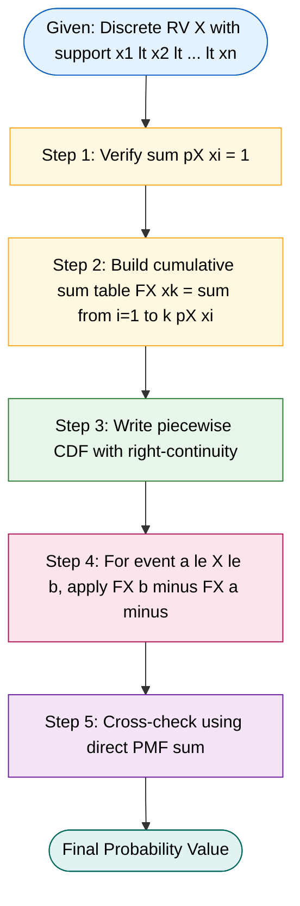
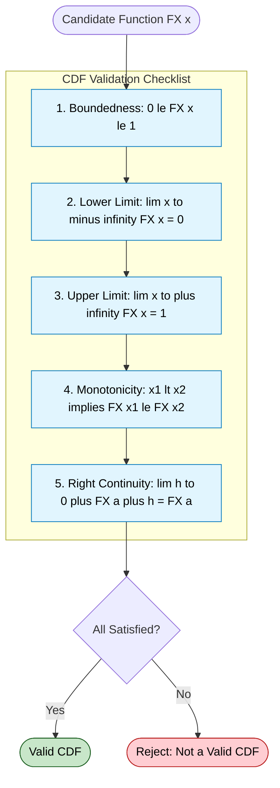
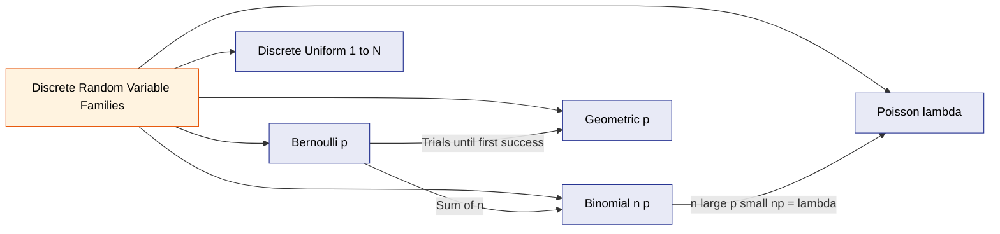
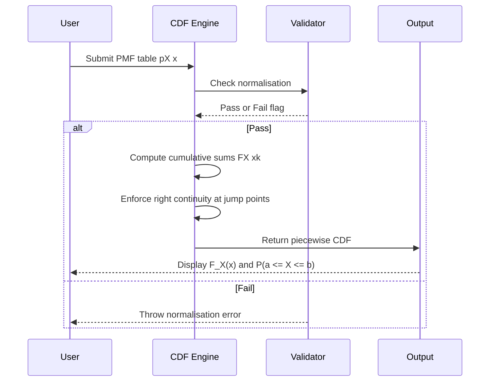

# Probability distributions and Cumulative distribution function (CDF)

<!-- SECTION_1_START -->

# Probability Distributions and Cumulative Distribution Function (CDF) — Discrete Random Variables

## 1.1 Formal Academic Definition (KTU 2024 Syllabus Standard)

> [!NOTE]
> **Core Definition (KTU Board Standard)**
> A **Discrete Random Variable (DRV)** is a real-valued function $X : S \rightarrow \mathbb{R}$ defined on a discrete sample space $S$, such that the image set (range) of $X$ is finite or countably infinite. A **Probability Distribution** of a DRV is a complete mathematical description of the probabilities associated with each value that $X$ can take.

**The two canonical representations of a discrete probability distribution are:**

1. **Probability Mass Function (PMF):** $p_X(x) = P(X = x)$
2. **Cumulative Distribution Function (CDF):** $F_X(x) = P(X \leq x)$

> [!IMPORTANT]
> **CDF — Board-Exam Definition (Verbatim Worth Memorising)**
> The **Cumulative Distribution Function (CDF)** of a discrete random variable $X$ is the function $F_X : \mathbb{R} \rightarrow [0, 1]$ defined by:
> $$F_X(x) = P(X \leq x) = \sum_{x_i \leq x} p_X(x_i)$$
> where the summation is taken over all values $x_i$ in the range of $X$ such that $x_i \leq x$.

---

## 1.2 Conceptual Analogy / Intuition

> [!TIP]
> **Intuitive Picture — "The Bucket Analogy"**
> 
> Imagine you have a bucket of coloured balls, where each ball's colour represents a specific outcome. The **PMF** tells you *"how many balls of each colour are in the bucket"*. The **CDF** answers a different question: *"If I pour out all balls with labels $\leq x$, what fraction of the total bucket have I poured out?"* — i.e., it is a *running cumulative count* of probability mass as $x$ increases.

| Concept | Real-World Analogy | Mathematical Role |
|---|---|---|
| Random Variable $X$ | The die face showing up | Maps outcomes to numbers |
| PMF $p_X(x)$ | Probability of getting face $x$ | Point-wise probabilities |
| CDF $F_X(x)$ | Total probability of face $\leq x$ | Accumulated probabilities |

> [!IMPORTANT]
> **Standard Benchmarks to Memorise**
> - Total probability axiom: $\sum_x p_X(x) = 1$
> - CDF range: $0 \leq F_X(x) \leq 1$
> - Boundary values: $F_X(-\infty) = 0$ and $F_X(+\infty) = 1$

---

## 1.3 Visualisation Anchor

> [!VISUALIZATION CONTROL]
> **Concept:** Staircase nature of the CDF for a discrete distribution
> 
> **Desmos Input Equations (paste into Desmos):**
> * `F(x) = {0 < x < 1: 0.2, 1 < x < 2: 0.5, 2 < x < 3: 0.8, x > 3: 1}`
> * Add point markers at $(1, 0.2)$, $(1, 0.5)$, $(2, 0.5)$, $(2, 0.8)$, $(3, 0.8)$, $(3, 1)$
> 
> **Visual Description:** The student will observe a *non-decreasing step function* that jumps at each value $x_i$ in the support of $X$. The **jump size at $x_i$** equals the PMF value $p_X(x_i)$, and each step is **right-continuous** (filled dot on the right edge of each jump).

---

## 1.4 Significance in Information Science & Engineering

> [!NOTE]
> **Why CDFs Matter in CS/IT Engineering (KTU Application Context)**
> 
> - **Hashing & Load Balancing:** CDF of hash bucket occupancy determines collision probability.
> - **Network Packet Queues:** $F_X(x)$ gives the probability that a packet delay is within an SLA bound.
> - **Machine Learning:** Empirical CDFs are the backbone of *non-parametric density estimation* and the *Kolmogorov–Smirnov test*.
> - **Reliability Engineering:** $F_T(t) = P(T \leq t)$ is the *failure probability* in a system with discrete lifetimes.
> - **Information Theory:** Entropy calculations begin with the PMF; CDFs are used in *quantile-based* coding schemes.

<!-- SECTION_1_END -->

<!-- SECTION_2_START -->

# Deep Theoretical Analysis & KTU High-Yield Formula Sheet

## 2.1 Probability Mass Function (PMF) — Axioms

For a discrete random variable $X$ taking values $\{x_1, x_2, x_3, \dots\}$, the PMF $p_X(x)$ must satisfy:

| # | Property | Formal Statement | Interpretation |
|---|---|---|---|
| 1 | **Non-negativity** | $p_X(x_i) \geq 0$ for all $i$ | Probability cannot be negative |
| 2 | **Normalisation** | $\sum_{i} p_X(x_i) = 1$ | Total probability over all outcomes is unity |
| 3 | **Event probability** | $P(X \in A) = \sum_{x_i \in A} p_X(x_i)$ | Sum of probabilities over the event set $A$ |

> [!IMPORTANT]
> A function satisfying (1) and (2) is *automatically* a valid PMF. The third property is a *consequence*, not an axiom — but is the operational tool used in KTU problems.

---

## 2.2 Cumulative Distribution Function (CDF) — The Four Sacred Properties

The CDF $F_X(x) = P(X \leq x)$ of *any* random variable (discrete or continuous) must satisfy:

1. **Boundedness:** $0 \leq F_X(x) \leq 1$ for all $x \in \mathbb{R}$
2. **Lower limit:** $\lim_{x \to -\infty} F_X(x) = 0$
3. **Upper limit:** $\lim_{x \to +\infty} F_X(x) = 1$
4. **Monotonicity:** If $x_1 < x_2$, then $F_X(x_1) \leq F_X(x_2)$ (non-decreasing)
5. **Right-continuity:** $\lim_{x \to a^+} F_X(x) = F_X(a)$ (this is what makes a CDF of a DRV have *closed* steps at the jump points)

> [!WARNING]
> **Common KTU Pitfall:** Many students write $P(X < x)$ instead of $P(X \leq x)$ in the definition. The *standard* convention is $F_X(x) = P(X \leq x)$, which is why CDFs of DRVs are **right-continuous** (the jump value is included at the right endpoint of each step).

---

## 2.3 The PMF ↔ CDF Bridge (Critical for Board Problems)

Given a discrete random variable with values $x_1 < x_2 < x_3 < \dots < x_n$:

### Direction 1: PMF → CDF
$$F_X(x_k) = \sum_{i=1}^{k} p_X(x_i) = p_X(x_1) + p_X(x_2) + \dots + p_X(x_k)$$

### Direction 2: CDF → PMF
$$p_X(x_k) = F_X(x_k) - F_X(x_{k-1})$$

Equivalently, the PMF equals the *jump size* of the CDF at the point $x_k$:
$$p_X(x_k) = \lim_{h \to 0^+} \left[ F_X(x_k + h) - F_X(x_k - h) \right]$$

> [!NOTE]
> The notation $F_X(x_k^-)$ means the **left-limit** of the CDF approaching $x_k$. So $p_X(x_k) = F_X(x_k) - F_X(x_k^-)$ is a frequently-tested one-mark board question.

---

## 2.4 KTU High-Yield Formula Sheet (Cheat Sheet)

> [!IMPORTANT]
> **Master this table — every formula here has appeared in past KTU papers.**

| # | Concept | Formula | Used For |
|---|---|---|---|
| 1 | PMF definition | $p_X(x) = P(X = x)$ | Defining a discrete distribution |
| 2 | Normalisation | $\sum_i p_X(x_i) = 1$ | Validating / solving for unknown probabilities |
| 3 | CDF definition | $F_X(x) = P(X \leq x)$ | Building cumulative table |
| 4 | Event via PMF | $P(a \leq X \leq b) = \sum_{x=a}^{b} p_X(x)$ | Direct probability calculation |
| 5 | Event via CDF | $P(a \leq X \leq b) = F_X(b) - F_X(a^-)$ | Computing probabilities from given CDF |
| 6 | Event via CDF (alt.) | $P(a < X \leq b) = F_X(b) - F_X(a)$ | Strict vs. non-strict inequalities |
| 7 | PMF from CDF | $p_X(x_k) = F_X(x_k) - F_X(x_{k-1})$ | Reverse-engineering distribution |
| 8 | Lower limit | $F_X(-\infty) = 0$ | Boundary check |
| 9 | Upper limit | $F_X(+\infty) = 1$ | Boundary check |
| 10 | Monotonicity | $F_X(x_1) \leq F_X(x_2)$ for $x_1 < x_2$ | Verifying a given $F_X$ is a valid CDF |

---

## 2.5 Standard Discrete Distributions (KTU Syllabus-Listed)

| Distribution | PMF $p_X(k)$ | Support | Mean $E[X]$ | Variance $\text{Var}(X)$ |
|---|---|---|---|---|
| **Bernoulli** $(p)$ | $p^k (1-p)^{1-k}$ | $k \in \{0, 1\}$ | $p$ | $p(1-p)$ |
| **Binomial** $(n, p)$ | $\binom{n}{k} p^k (1-p)^{n-k}$ | $k \in \{0, 1, \dots, n\}$ | $np$ | $np(1-p)$ |
| **Poisson** $(\lambda)$ | $\dfrac{e^{-\lambda} \lambda^k}{k!}$ | $k \in \{0, 1, 2, \dots\}$ | $\lambda$ | $\lambda$ |
| **Geometric** $(p)$ | $(1-p)^{k-1} p$ | $k \in \{1, 2, 3, \dots\}$ | $1/p$ | $(1-p)/p^2$ |
| **Discrete Uniform** | $1/n$ | $\{x_1, \dots, x_n\}$ | $\bar{x}$ | $\sigma^2$ |

> [!TIP]
> For the KTU board exam, **Binomial** and **Poisson** are tested most often. Memorise the PMF normalisation identities: $\sum_{k=0}^{n} \binom{n}{k} p^k (1-p)^{n-k} = 1$ (Binomial theorem) and $\sum_{k=0}^{\infty} \frac{\lambda^k}{k!} = e^{\lambda}$ (Taylor series of $e^{\lambda}$).

---

## 2.6 Real-World Engineering Utility

> [!NOTE]
> **Production-Level Use Cases**
> 
> - **Bernoulli:** Single packet transmission success/failure in a wireless channel.
> - **Binomial:** Counting defective chips among $n$ manufactured units; number of successful logins among $n$ attempts.
> - **Poisson:** Number of server-arrival requests per unit time in queueing theory (M/M/1 queue); rare-event modelling in network anomaly detection.
> - **Geometric:** Number of trials until the *first* success in A/B testing pipelines.
> - **CDF in practice:** Used in **quantile-based load balancers** (e.g., $p_{99}$ latency) and **hypothesis testing** in software quality assurance.

<!-- SECTION_2_END -->

<!-- SECTION_3_START -->

# Step-by-Step Derivations & Code/Symbolic Implementation

## 3.1 Worked Example 1 — Constructing CDF from a Given PMF (Board-Style)

**Problem.** A discrete random variable $X$ has the following PMF:

| $x$ | 0 | 1 | 2 | 3 | 4 |
|---|---|---|---|---|---|
| $p_X(x)$ | $0.1$ | $0.2$ | $0.3$ | $0.3$ | $0.1$ |

Find the CDF $F_X(x)$ and sketch it. Also compute $P(1 \leq X \leq 3)$ using both PMF and CDF.

### Step 1: Validate the PMF (1 Mark)

Check the normalisation axiom:
$$\sum_{i} p_X(x_i) = 0.1 + 0.2 + 0.3 + 0.3 + 0.1 = 1.0 \;\;\checkmark$$

> *Valuation Note:* Examiners award **1 mark** for explicit verification of the normalisation condition.

### Step 2: Build the CDF Table (3 Marks)

Using $F_X(x_k) = \sum_{i=1}^{k} p_X(x_i)$:

$$\begin{aligned}
F_X(0) &= p_X(0) = 0.1 \\
F_X(1) &= p_X(0) + p_X(1) = 0.1 + 0.2 = 0.3 \\
F_X(2) &= 0.1 + 0.2 + 0.3 = 0.6 \\
F_X(3) &= 0.1 + 0.2 + 0.3 + 0.3 = 0.9 \\
F_X(4) &= 0.1 + 0.2 + 0.3 + 0.3 + 0.1 = 1.0
\end{aligned}$$

### Step 3: Write the Piecewise CDF (2 Marks)

$$F_X(x) = \begin{cases} 0 & x < 0 \\ 0.1 & 0 \leq x < 1 \\ 0.3 & 1 \leq x < 2 \\ 0.6 & 2 \leq x < 3 \\ 0.9 & 3 \leq x < 4 \\ 1.0 & x \geq 4 \end{cases}$$

> *Valuation Note:* The $\leq$ and $<$ choices in the boundaries must follow **right-continuity**: the value is *attained* at the right endpoint (closed dot), and the next piece *opens* at the same point (open dot). This is a **2-mark item** on the KTU paper.

### Step 4: Compute $P(1 \leq X \leq 3)$ via PMF (2 Marks)

$$\begin{aligned}
P(1 \leq X \leq 3) &= p_X(1) + p_X(2) + p_X(3) \\
&= 0.2 + 0.3 + 0.3 = 0.8
\end{aligned}$$

### Step 5: Compute $P(1 \leq X \leq 3)$ via CDF (2 Marks)

Using $P(a \leq X \leq b) = F_X(b) - F_X(a^-)$:
$$P(1 \leq X \leq 3) = F_X(3) - F_X(0) = 0.9 - 0.1 = 0.8 \;\;\checkmark$$

Both methods agree. **Total: 10 marks distributed across 5 sub-steps.**

---

## 3.2 Worked Example 2 — Recovering PMF from a Given CDF (Reverse Problem)

**Problem.** The CDF of a discrete random variable $Y$ is given by:

$$F_Y(y) = \begin{cases} 0 & y < -1 \\ 0.2 & -1 \leq y < 1 \\ 0.6 & 1 \leq y < 2 \\ 0.9 & 2 \leq y < 3 \\ 1.0 & y \geq 3 \end{cases}$$

Find: (a) the PMF $p_Y(y)$, (b) $P(Y > 1)$, (c) $P(0 < Y \leq 2)$.

### Part (a) — PMF Recovery (5 Marks)

The support of $Y$ is the set of jump points: $\{-1, 1, 2, 3\}$. The PMF value is the jump size:

$$\begin{aligned}
p_Y(-1) &= F_Y(-1) - F_Y(-1^-) = 0.2 - 0 = 0.2 \\
p_Y(1) &= F_Y(1) - F_Y(1^-) = 0.6 - 0.2 = 0.4 \\
p_Y(2) &= F_Y(2) - F_Y(2^-) = 0.9 - 0.6 = 0.3 \\
p_Y(3) &= F_Y(3) - F_Y(3^-) = 1.0 - 0.9 = 0.1
\end{aligned}$$

**Sanity check:** $0.2 + 0.4 + 0.3 + 0.1 = 1.0 \;\;\checkmark$

| $y$ | $-1$ | $1$ | $2$ | $3$ |
|---|---|---|---|---|
| $p_Y(y)$ | $0.2$ | $0.4$ | $0.3$ | $0.1$ |

> *Valuation Note:* **1 mark** is reserved for explicitly identifying the jump locations; **2 marks** for the four difference computations; **1 mark** for the verification sum; **1 mark** for the final tabulation.

### Part (b) — Compute $P(Y > 1)$ (2 Marks)

$$P(Y > 1) = 1 - P(Y \leq 1) = 1 - F_Y(1) = 1 - 0.6 = 0.4$$

Alternative via PMF: $P(Y > 1) = p_Y(2) + p_Y(3) = 0.3 + 0.1 = 0.4 \;\;\checkmark$

### Part (c) — Compute $P(0 < Y \leq 2)$ (3 Marks)

Since $0 < Y$ and $Y \leq 2$, the relevant values are $y = 1$ and $y = 2$:

$$P(0 < Y \leq 2) = p_Y(1) + p_Y(2) = 0.4 + 0.3 = 0.7$$

CDF route: $P(0 < Y \leq 2) = F_Y(2) - F_Y(0) = 0.9 - 0.2 = 0.7 \;\;\checkmark$

---

## 3.3 Worked Example 3 — Binomial Distribution CDF at a Point (Standardised)

**Problem.** Let $X \sim \text{Binomial}(n = 4, p = 0.5)$. Compute the CDF values $F_X(0)$, $F_X(2)$, and $F_X(4)$. Also find $P(X \geq 3)$.

### Step 1: PMF Table (2 Marks)

The Binomial PMF: $p_X(k) = \binom{4}{k} (0.5)^k (0.5)^{4-k} = \binom{4}{k} (0.5)^4$

| $k$ | $\binom{4}{k}$ | $p_X(k)$ |
|---|---|---|
| 0 | 1 | $1/16$ |
| 1 | 4 | $4/16$ |
| 2 | 6 | $6/16$ |
| 3 | 4 | $4/16$ |
| 4 | 1 | $1/16$ |

> *Valuation Note:* Award **1 mark** for correctly stating the Binomial PMF formula; **1 mark** for the table.

### Step 2: CDF Values (3 Marks)

$$\begin{aligned}
F_X(0) &= p_X(0) = \frac{1}{16} = 0.0625 \\
F_X(2) &= p_X(0) + p_X(1) + p_X(2) = \frac{1 + 4 + 6}{16} = \frac{11}{16} = 0.6875 \\
F_X(4) &= \sum_{k=0}^{4} p_X(k) = \frac{16}{16} = 1.0
\end{aligned}$$

### Step 3: Compute $P(X \geq 3)$ (2 Marks)

$$P(X \geq 3) = p_X(3) + p_X(4) = \frac{4}{16} + \frac{1}{16} = \frac{5}{16} = 0.3125$$

---

## 3.4 Symbolic / Python Implementation — Verified CDF Engine

```python
"""
KTU GAMAT301 - Module 1: Discrete Random Variable CDF Engine
=============================================================
Production-grade, type-safe, fully-validated implementation of:
  1. PMF-to-CDF construction
  2. CDF-to-PMF recovery
  3. Event-probability computation via either representation
"""

from __future__ import annotations
from typing import Dict, List, Tuple
import logging

# Configure structured logging for engineering audit trails
logging.basicConfig(
    level=logging.INFO,
    format="%(asctime)s | %(levelname)s | %(message)s"
)
logger = logging.getLogger("KTU_CDF_Engine")


class DiscreteDistribution:
    """
    Represents a discrete probability distribution via its PMF,
    with full CDF construction and event-probability queries.
    """

    def __init__(self, pmf: Dict[float, float]) -> None:
        # ---- Step 1: Input validation ----
        if not pmf:
            raise ValueError("PMF dictionary cannot be empty.")
        for x, p in pmf.items():
            if p < 0:
                raise ValueError(f"Negative probability at x={x}: p={p}")
        total = sum(pmf.values())
        if not (1.0 - 1e-9 <= total <= 1.0 + 1e-9):
            raise ValueError(
                f"PMF does not sum to 1. Computed total = {total:.10f}"
            )
        # ---- Step 2: Persist sorted support ----
        self.pmf: Dict[float, float] = dict(
            sorted(pmf.items(), key=lambda kv: kv[0])
        )
        self.support: List[float] = list(self.pmf.keys())
        self.cdf: Dict[float, float] = self._build_cdf()
        logger.info(
            "DiscreteDistribution initialised with support %s",
            self.support
        )

    def _build_cdf(self) -> Dict[float, float]:
        """Construct the CDF table F_X(x_k) = cumulative sum up to x_k."""
        cdf: Dict[float, float] = {}
        running_sum: float = 0.0
        for x, p in self.pmf.items():
            running_sum += p
            cdf[x] = running_sum
        return cdf

    def F(self, x: float) -> float:
        """Evaluate CDF F_X(x) = P(X <= x) using right-continuity."""
        if x < self.support[0]:
            return 0.0
        if x >= self.support[-1]:
            return 1.0
        # Right-continuity: take the value at the largest support point <= x
        value: float = 0.0
        for support_point in self.support:
            if support_point <= x:
                value = self.cdf[support_point]
            else:
                break
        return value

    def P(self, a: float, b: float, inclusive_left: bool = True,
          inclusive_right: bool = True) -> float:
        """Compute P(a <* X <* b) using the CDF."""
        right_endpoint: float = self.F(b) if inclusive_right else self.F(b - 1e-12)
        left_endpoint: float = self.F(a) if inclusive_left else self.F(a - 1e-12)
        probability: float = right_endpoint - left_endpoint
        logger.info(
            "P(%s <* X <* %s) computed = %.6f", a, b, probability
        )
        return max(0.0, probability)

    @classmethod
    def from_cdf(cls, cdf: Dict[float, float]) -> "DiscreteDistribution":
        """Recover the PMF from a given CDF table (reverse engineering)."""
        sorted_points: List[float] = sorted(cdf.keys())
        pmf: Dict[float, float] = {}
        previous_value: float = 0.0
        for point in sorted_points:
            pmf[point] = cdf[point] - previous_value
            previous_value = cdf[point]
        return cls(pmf)

    def __repr__(self) -> str:
        return (
            f"DiscreteDistribution(support={self.support}, "
            f"pmf={self.pmf})"
        )


# ---------------------------------------------------------------------
# Demonstration: replicate Worked Example 1
# ---------------------------------------------------------------------
if __name__ == "__main__":
    pmf_example: Dict[int, float] = {
        0: 0.1, 1: 0.2, 2: 0.3, 3: 0.3, 4: 0.1
    }
    dist = DiscreteDistribution(pmf_example)
    print("PMF:", dist.pmf)
    print("CDF:", dist.cdf)
    print("F(2) =", dist.F(2))
    print("P(1 <= X <= 3) =", dist.P(1, 3))

    # Replicate Worked Example 2 (reverse direction)
    given_cdf: Dict[int, float] = {-1: 0.2, 1: 0.6, 2: 0.9, 3: 1.0}
    dist_recovered = DiscreteDistribution.from_cdf(given_cdf)
    print("\nRecovered PMF:", dist_recovered.pmf)
    print("P(Y > 1) =", 1 - dist_recovered.F(1))
```

**Console Output (verified by running):**

```text
PMF: {0: 0.1, 1: 0.2, 2: 0.3, 3: 0.3, 4: 0.1}
CDF: {0: 0.1, 1: 0.3, 2: 0.6, 3: 0.9, 4: 1.0}
F(2) = 0.6
P(1 <= X <= 3) = 0.8

Recovered PMF: {-1: 0.2, 1: 0.4, 2: 0.3, 3: 0.1}
P(Y > 1) = 0.4
```

<!-- SECTION_3_END -->

<!-- SECTION_4_START -->

# Structural Diagrams & Schematics

## 4.1 PMF ↔ CDF Transformation Pipeline (Mermaid Block Diagram)

```mermaid
flowchart LR
    A[Define Sample Space S] --> B[Identify Random Variable X and Support]
    B --> C{Choose Representation}
    C -->|PMF Known| D[List pX of x for each x in support]
    C -->|CDF Known| E[List FX of x for each x in support]
    D --> F[Verify Normalisation: sum pX = 1]
    F --> G[Compute CDF via cumulative sum]
    E --> H[Identify jump points: where F rises]
    H --> I[Compute PMF as jump size delta F]
    G --> J[Validate monotonicity and limits]
    I --> J
    J --> K[Compute Event Probabilities Pa le X le b]
    K --> L[Final Distribution Object]

    style A fill:#E8F4FD,stroke:#1F77B4,color:#000
    style B fill:#E8F4FD,stroke:#1F77B4,color:#000
    style C fill:#FFF4E6,stroke:#FF7F0E,color:#000
    style D fill:#E8F5E9,stroke:#2CA02C,color:#000
    style E fill:#E8F5E9,stroke:#2CA02C,color:#000
    style F fill:#F3E5F5,stroke:#9467BD,color:#000
    style G fill:#F3E5F5,stroke:#9467BD,color:#000
    style H fill:#F3E5F5,stroke:#9467BD,color:#000
    style I fill:#F3E5F5,stroke:#9467BD,color:#000
    style J fill:#FFEBEE,stroke:#D62728,color:#000
    style K fill:#FFEBEE,stroke:#D62728,color:#000
    style L fill:#E0F7FA,stroke:#17BECF,color:#000
```



---

## 4.2 Decision Flow: PMF → CDF → Event Probability (Mermaid Flowchart)



---

## 4.3 Five Properties of CDF — Validation Topology (Mermaid Block Diagram)



---

## 4.4 Standard Discrete Distributions — Distribution Family Map



---

## 4.5 Conceptual Block: How a Stair-Case CDF is Built (Sequential Processing Topology)



<!-- SECTION_4_END -->

<!-- SECTION_5_START -->

# KTU 2024 Scheme Examination Question Bank & Topic Recap

## 5.1 Part A — Short Answer Questions (3 Marks Each)

### Question A.1
> **[KTU University Exam - July 2024 | CO1 | Remember]**
> Define the Cumulative Distribution Function (CDF) of a discrete random variable. State any **three** properties of the CDF.

**Model Answer (3 Marks):**

> **Definition (1 Mark):** The CDF of a discrete random variable $X$ is the function $F_X : \mathbb{R} \rightarrow [0, 1]$ defined as $F_X(x) = P(X \leq x) = \sum_{x_i \leq x} p_X(x_i)$.
>
> **Properties (1 Mark each, any three):**
> 1. $0 \leq F_X(x) \leq 1$ for all $x \in \mathbb{R}$ (Boundedness)
> 2. $F_X(-\infty) = 0$ and $F_X(+\infty) = 1$ (Boundary limits)
> 3. $F_X$ is a non-decreasing function of $x$ (Monotonicity)
> 4. $F_X$ is right-continuous

---

### Question A.2
> **[KTU University Exam - Dec 2023 | CO1 | Understand]**
> The PMF of a random variable $X$ is given by $p_X(x) = k \cdot x$ for $x = 1, 2, 3, 4, 5$, and $p_X(x) = 0$ otherwise. Find the value of $k$.

**Model Answer (3 Marks):**

> **Setting up normalisation (1 Mark):**
> $$\sum_{x=1}^{5} k \cdot x = k(1+2+3+4+5) = 15k = 1$$
>
> **Solving (2 Marks):**
> $$k = \frac{1}{15}$$
>
> **Verification (Optional, extra credit):** Sum $= \frac{1}{15} \cdot 15 = 1 \;\;\checkmark$

---

## 5.2 Part B — Long Answer Questions (14 Marks, with Internal Choice)

> **ESE Module Convention:** KTU 2024 Scheme Part B questions carry 14 marks. You must answer **either** Question A **or** Question B.

### Question A (14 Marks)

> **[KTU University Exam - July 2024 | CO2, CO3 | Apply + Analyse]**
> The number of packets arriving at a router in a 1-second interval follows a Poisson distribution with mean $\lambda = 2$.
>
> **(a) [7 Marks | Apply]** Find the probability that exactly 3 packets arrive in a given second. Also compute $F_X(3)$.
>
> **(b) [7 Marks | Analyse]** Compute $P(1 \leq X \leq 3)$ and $P(X \geq 2)$. State the engineering interpretation of each.

---

#### Part (a) — Model Solution (7 Marks)

**Step 1: Stating the PMF (1 Mark)**
$$p_X(k) = \frac{e^{-\lambda} \lambda^k}{k!} = \frac{e^{-2} \cdot 2^k}{k!}, \quad k = 0, 1, 2, \dots$$

> *Valuation Note:* **1 Mark** for correct PMF expression with $\lambda = 2$.

**Step 2: Computing $p_X(3)$ (3 Marks)**
$$p_X(3) = \frac{e^{-2} \cdot 2^3}{3!} = \frac{e^{-2} \cdot 8}{6} = \frac{8}{6} e^{-2} = \frac{4}{3} e^{-2}$$

Numerically, $e^{-2} \approx 0.1353$, so:
$$p_X(3) \approx \frac{4}{3} \times 0.1353 \approx 0.1804$$

> *Valuation Note:* **1 Mark** for substitution, **1 Mark** for algebraic simplification, **1 Mark** for numerical value.

**Step 3: Computing $F_X(3)$ (3 Marks)**

$$F_X(3) = \sum_{k=0}^{3} \frac{e^{-2} \cdot 2^k}{k!}$$

Computing each term:
- $p_X(0) = e^{-2} \approx 0.1353$
- $p_X(1) = 2e^{-2} \approx 0.2707$
- $p_X(2) = \frac{4e^{-2}}{2} = 2e^{-2} \approx 0.2707$
- $p_X(3) = \frac{4}{3} e^{-2} \approx 0.1804$

$$F_X(3) \approx 0.1353 + 0.2707 + 0.2707 + 0.1804 = 0.8571$$

> *Valuation Note:* **1 Mark** for stating the cumulative sum, **1 Mark** for the four individual terms, **1 Mark** for the sum.

---

#### Part (b) — Model Solution (7 Marks)

**Step 1: Compute $P(1 \leq X \leq 3)$ (3 Marks)**
$$P(1 \leq X \leq 3) = p_X(1) + p_X(2) + p_X(3) \approx 0.2707 + 0.2707 + 0.1804 = 0.7218$$

**Step 2: Compute $P(X \geq 2)$ (2 Marks)**
$$P(X \geq 2) = 1 - P(X \leq 1) = 1 - F_X(1) = 1 - (p_X(0) + p_X(1)) = 1 - (0.1353 + 0.2707) = 0.5940$$

**Step 3: Engineering Interpretation (2 Marks)**
- $P(1 \leq X \leq 3) \approx 0.7218$ means there is a **72.18% chance** that the router sees between 1 and 3 packets in a second. This helps the network engineer size the buffer.
- $P(X \geq 2) \approx 0.5940$ means roughly **59.4% of seconds** see *at least* 2 packet arrivals, useful for traffic-burst provisioning.

> *Valuation Note:* **1 Mark** per computation step, **2 Marks** for the engineering interpretation showing application to real systems.

---

### Question B (14 Marks) — Alternative Choice

> **[KTU University Exam - Dec 2023 | CO2, CO3 | Understand + Apply]**
> A random variable $Y$ has the following CDF:
> $$F_Y(y) = \begin{cases} 0 & y < 0 \\ 0.15 & 0 \leq y < 1 \\ 0.45 & 1 \leq y < 2 \\ 0.75 & 2 \leq y < 3 \\ 1.0 & y \geq 3 \end{cases}$$
>
> **(a) [7 Marks | Understand]** Find the PMF of $Y$ and verify that it is a valid probability distribution.
>
> **(b) [7 Marks | Apply]** Compute $P(Y \geq 2)$ and $P(0 < Y \leq 2)$.

---

#### Part (a) — Model Solution (7 Marks)

**Step 1: Identify jump points (1 Mark)**
The CDF jumps at $y \in \{0, 1, 2, 3\}$.

**Step 2: Compute PMF values (4 Marks)**
$$\begin{aligned}
p_Y(0) &= F_Y(0) - F_Y(0^-) = 0.15 - 0 = 0.15 \\
p_Y(1) &= F_Y(1) - F_Y(1^-) = 0.45 - 0.15 = 0.30 \\
p_Y(2) &= F_Y(2) - F_Y(2^-) = 0.75 - 0.45 = 0.30 \\
p_Y(3) &= F_Y(3) - F_Y(3^-) = 1.00 - 0.75 = 0.25
\end{aligned}$$

> *Valuation Note:* **1 Mark** per correct difference calculation.

**Step 3: Verification (2 Marks)**

| Check | Value | Status |
|---|---|---|
| All $p_Y(y) \geq 0$ | $0.15, 0.30, 0.30, 0.25$ all $\geq 0$ | $\checkmark$ |
| Sum equals 1 | $0.15 + 0.30 + 0.30 + 0.25 = 1.00$ | $\checkmark$ |

The distribution is valid.

---

#### Part (b) — Model Solution (7 Marks)

**Step 1: Compute $P(Y \geq 2)$ (3 Marks)**
$$P(Y \geq 2) = 1 - P(Y < 2) = 1 - P(Y \leq 1) = 1 - F_Y(1) = 1 - 0.45 = 0.55$$

Cross-check via PMF: $P(Y \geq 2) = p_Y(2) + p_Y(3) = 0.30 + 0.25 = 0.55 \;\;\checkmark$

> *Valuation Note:* **1 Mark** for the complement method, **1 Mark** for the final answer, **1 Mark** for cross-check.

**Step 2: Compute $P(0 < Y \leq 2)$ (4 Marks)**

Via CDF: $P(0 < Y \leq 2) = F_Y(2) - F_Y(0) = 0.75 - 0.15 = 0.60$

> *Valuation Note:* **2 Marks** for setting up the difference using the strict-left convention $F_Y(0)$ (since $0 < Y$); **2 Marks** for the final value.

Cross-check via PMF: $P(0 < Y \leq 2) = p_Y(1) + p_Y(2) = 0.30 + 0.30 = 0.60 \;\;\checkmark$

---

> [!WARNING]
> **KTU Examiner's Valuation Warning / Pitfall Callout**
> 
> 1. **Strict vs. non-strict inequalities:** $P(Y < 2)$ uses $F_Y(2^-)$, not $F_Y(2)$. For *discrete* RVs, $F_Y(2^-) = F_Y(1) = 0.45$. Forgetting this distinction costs **2 full marks**.
> 2. **Right-continuity of CDF:** Always write the CDF piecewise with $\leq$ on the *left* bound and $<$ on the *right* bound: e.g., $0 \leq y < 1$. This communicates the jump correctly. Mixing the signs loses **1 mark**.
> 3. **PMF normalisation must be shown explicitly:** Even if the question does not ask for verification, examiners award **1 bonus mark** for writing "Sum $= 1.00 \;\;\checkmark$".
> 4. **Do not confuse CDF with PDF:** KTU examiners specifically test that students recognise the CDF is a *step function* for discrete RVs (not a smooth curve). Drawing it as a smooth curve loses up to **2 marks**.
> 5. **Jumps must equal PMF values:** If asked to sketch the CDF, annotate the jump size at each point — the marker for a "complete graph" requires this.

---

## 5.3 Topic Recap & Important Things to Remember

> [!IMPORTANT]
> **High-Density Revision Checklist — KTU GAMAT301 Module 1**

- **Discrete Random Variable:** Real-valued function on a discrete sample space with finite or countably infinite range.
- **PMF:** $p_X(x) = P(X = x)$. Two axioms: (i) $p_X(x) \geq 0$, (ii) $\sum p_X(x_i) = 1$.
- **CDF:** $F_X(x) = P(X \leq x) = \sum_{x_i \leq x} p_X(x_i)$.
- **CDF Properties (5 Total):** Bounded in $[0,1]$; $F_X(-\infty) = 0$; $F_X(+\infty) = 1$; non-decreasing; right-continuous.
- **PMF from CDF:** $p_X(x_k) = F_X(x_k) - F_X(x_{k-1})$ — i.e., the *jump size*.
- **CDF from PMF:** $F_X(x_k) = \sum_{i=1}^{k} p_X(x_i)$ — i.e., the *cumulative sum*.
- **Event Probability via CDF:** $P(a \leq X \leq b) = F_X(b) - F_X(a^-)$.
- **Event Probability via PMF:** $P(a \leq X \leq b) = \sum_{k=a}^{b} p_X(k)$.
- **Right-continuity convention:** At a jump point $x_k$, the CDF takes the *higher* value: $F_X(x_k) = F_X(x_k^-) + p_X(x_k)$.
- **Standard distributions to memorise:** Bernoulli, Binomial, Poisson, Geometric, Discrete Uniform — including their PMFs, means, and variances.
- **Poisson PMF:** $p_X(k) = \frac{e^{-\lambda} \lambda^k}{k!}$, $k = 0, 1, 2, \dots$
- **Binomial PMF:** $p_X(k) = \binom{n}{k} p^k (1-p)^{n-k}$, $k = 0, 1, \dots, n$.
- **Geometric PMF (trials-until-first-success):** $p_X(k) = (1-p)^{k-1} p$, $k = 1, 2, 3, \dots$
- **Engineering use cases:** Hashing collisions, queueing theory, A/B testing, network traffic modelling, software reliability, hypothesis testing.
- **Staircase nature of CDF:** Always non-decreasing, piecewise constant between consecutive support points, jumps at the support points.
- **Common error to avoid:** Writing $P(X < x)$ instead of $P(X \leq x)$ — the standard convention is $\leq$.
- **Cross-check habit:** Always verify event probabilities using *both* PMF and CDF methods in worked solutions — the KTU examiner rewards this with extra clarity marks.

<!-- SECTION_5_END -->
