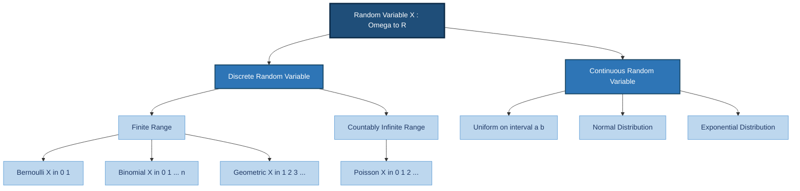
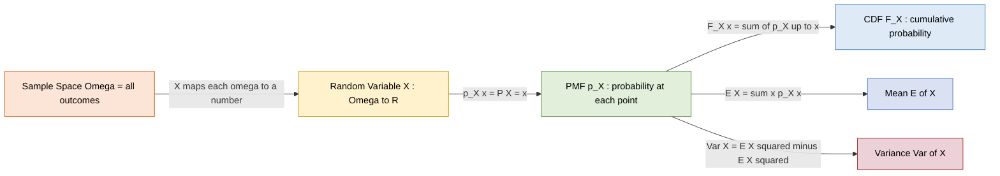
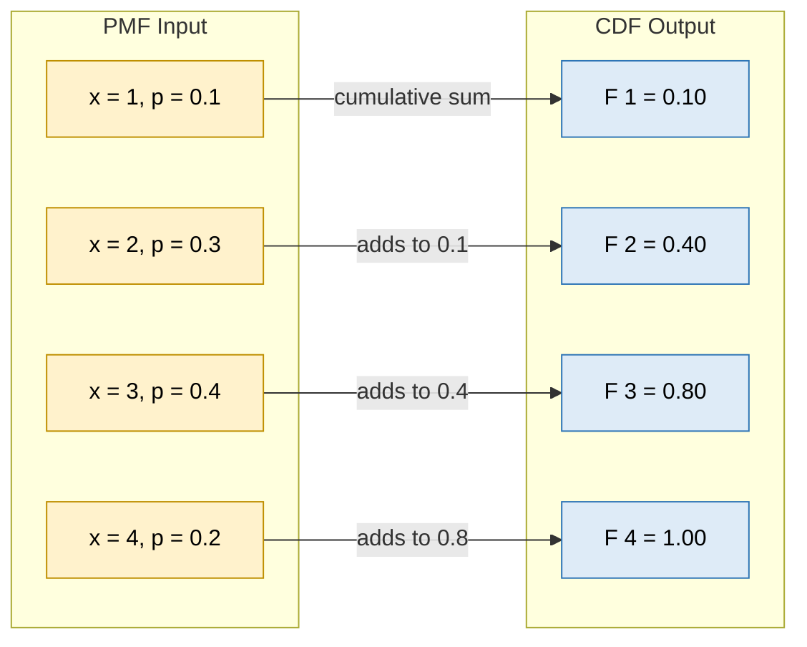

# Random variables and Discrete random variables

<!-- SECTION_1_START -->

# Random Variables and Discrete Random Variables

## 1.1 Formal Definition of a Random Variable

> [!NOTE]
> **Definition (KTU 2024 Scheme - GAMAT301, Module 1):**
> A **Random Variable (RV)** is a real-valued function defined on a sample space $S$ of a random experiment. Formally, it is a mapping
> $$X: S \rightarrow \mathbb{R}$$
> that assigns a unique real number $X(\omega)$ to every elementary outcome $\omega \in S$.

In simpler words, a random variable is **not a variable in the algebraic sense**, but rather a **function** that converts outcomes of a random experiment (which may not be numerical, e.g., "Heads", "Tails", "Red", "Blue") into measurable numerical values. This numerical conversion is essential because it allows us to apply calculus, algebra, and probability operations to the experiment.

## 1.2 Conceptual Analogy / Intuitive Overview

> [!IMPORTANT]
> **Think of a Random Variable as a "Numerical Translator"!**

**Real-World Analogy: The Weather Forecaster**

Imagine you are a weather forecaster observing the sky. The actual *outcome* of nature is qualitative — "Sunny", "Cloudy", "Rainy", "Stormy". You cannot directly perform mathematical operations on the word "Sunny". So, you create a **translation rule** (a function):

| Sky Condition (Outcome $\omega$) | Temperature in °C (Value $X(\omega)$) |
| :--- | :--- |
| Sunny | 32 |
| Cloudy | 25 |
| Rainy | 20 |
| Stormy | 18 |

This translation rule $X$ is your **Random Variable**. Each possible weather outcome gets mapped to a definite number. The *randomness* comes from the fact that we don't know which weather condition will occur — but once it occurs, $X$ gives us a specific number.

**Geometric Intuition:**
On the number line $\mathbb{R}$, the random variable $X$ is a *point* (or a set of points) whose exact location is determined by chance. The **probability** at any point $x$ tells us how *likely* it is for the random variable to "land" exactly at that numerical location.

## 1.3 Classification of Random Variables

Random variables are broadly classified into two main categories:

1. **Discrete Random Variable (DRV):** Takes only a *finite* or *countably infinite* set of values.
2. **Continuous Random Variable (CRV):** Takes all values within one or more *intervals* (uncountably infinite).

> [!NOTE]
> **Definition (Discrete Random Variable - KTU Syllabus Term):**
> A discrete random variable is one whose range (set of possible values) is a *countable* set. The set of values may be finite (e.g., $\{0, 1\}$) or countably infinite (e.g., $\{0, 1, 2, 3, \ldots\}$).

**Examples of Discrete Random Variables:**
- Number of heads in 10 coin tosses: $X \in \{0, 1, 2, \ldots, 10\}$
- Number of students present in a class: $X \in \{0, 1, 2, \ldots, 60\}$
- Number of emails received per hour: $X \in \{0, 1, 2, 3, \ldots\}$
- Number of defective items in a batch of 50: $X \in \{0, 1, 2, \ldots, 50\}$

**Non-Examples (Continuous, not discrete):**
- Time taken to run a marathon: $X \in [2.0, 6.0]$ hours
- Height of a randomly selected student: $X \in [140, 200]$ cm
- Temperature of a city at noon: $X \in [-10, 50]$ °C

> [!VISUALIZATION CONTROL]
> **Concept:** Probability Mass Function (PMF) of a discrete random variable $X \in \{1, 2, 3, 4\}$ with probabilities $p(1)=0.1$, $p(2)=0.3$, $p(3)=0.4$, $p(4)=0.2$.
> **GeoGebra / Desmos Input Equations:**
> * `x = 1, y = 0.1` (vertical line segment from $y=0$ to $y=0.1$)
> * `x = 2, y = 0.3`
> * `x = 3, y = 0.4`
> * `x = 4, y = 0.2`
> **Visual Description:** The student should observe four isolated vertical "spikes" (stems) of varying heights on the x-axis. The *total area* of these spikes (sum of heights) equals **1**. There is **no continuous curve** — only discrete points with non-zero probability. This is the key visual signature of a **Discrete Random Variable** as opposed to a Probability Density Function (PDF) which would be a smooth curve.

<!-- SECTION_1_END -->

<!-- SECTION_2_START -->

# Deep Theoretical Analysis & KTU High-Yield Formula Sheet

## 2.1 Formal Mathematical Foundation

Let $(\Omega, \mathcal{F}, P)$ be a probability space, where:
- $\Omega$ is the sample space (set of all elementary outcomes)
- $\mathcal{F}$ is the sigma-algebra (set of all events)
- $P$ is the probability measure

A **Random Variable** $X$ is a measurable function:

$$X: (\Omega, \mathcal{F}) \rightarrow (\mathbb{R}, \mathcal{B}(\mathbb{R}))$$

where $\mathcal{B}(\mathbb{R})$ is the Borel sigma-algebra on $\mathbb{R}$. The measurability condition ensures that for any Borel set $B \subseteq \mathbb{R}$, the pre-image $X^{-1}(B) = \{\omega \in \Omega : X(\omega) \in B\} \in \mathcal{F}$ is a valid event with a well-defined probability.

## 2.2 The Probability Mass Function (PMF)

For a **discrete random variable** $X$, the function that completely describes its probabilistic behavior is the **Probability Mass Function (PMF)**.

> [!IMPORTANT]
> **Definition (PMF):**
> The PMF of a discrete random variable $X$ is the function $p_X: \mathbb{R} \rightarrow [0, 1]$ defined by
> $$p_X(x) = P(X = x) = P(\{\omega \in \Omega : X(\omega) = x\})$$

**The Two Fundamental Properties of a PMF:**

1. **Non-negativity:** For every real number $x$,
$$p_X(x) \geq 0$$

2. **Unity of Total Probability:** The sum of probabilities over the entire range of $X$ equals 1,
$$\sum_{x \in \text{Range}(X)} p_X(x) = 1$$

These two conditions are also **sufficient** to qualify any function as a valid PMF.

## 2.3 The Cumulative Distribution Function (CDF)

> [!NOTE]
> **Definition (CDF):**
> The Cumulative Distribution Function $F_X: \mathbb{R} \rightarrow [0, 1]$ of a discrete random variable $X$ is defined as
> $$F_X(x) = P(X \leq x) = \sum_{t \leq x} p_X(t)$$

**Key Properties of the CDF (for any random variable, discrete or continuous):**

1. $0 \leq F_X(x) \leq 1$ for all $x \in \mathbb{R}$
2. $F_X$ is a **non-decreasing** (monotonically increasing) function
3. $F_X(-\infty) = \lim_{x \to -\infty} F_X(x) = 0$
4. $F_X(+\infty) = \lim_{x \to +\infty} F_X(x) = 1$
5. $F_X$ is **right-continuous** at every point

**Relationship between PMF and CDF (for discrete RVs):**
- **CDF from PMF:** $F_X(x) = \sum_{t \leq x} p_X(t)$
- **PMF from CDF:** $p_X(x) = F_X(x) - F_X(x - 1)$ for integer-valued discrete RVs (or more generally, $p_X(x) = F_X(x) - \lim_{y \uparrow x} F_X(y)$)

## 2.4 KTU Formula Cheat Sheet

| Concept | Formula / Property | Notation | Conditions |
| :--- | :--- | :--- | :--- |
| Random Variable | $X: \Omega \rightarrow \mathbb{R}$ | Mapping function | Measurable |
| PMF (Discrete RV) | $p_X(x) = P(X = x)$ | Probability at a point | $p_X(x) \in [0, 1]$ |
| Non-negativity | $p_X(x) \geq 0$ | Inequality | For all $x \in \mathbb{R}$ |
| Total Probability (PMF) | $\sum_{x} p_X(x) = 1$ | Summation identity | Over the range of $X$ |
| CDF (Discrete RV) | $F_X(x) = P(X \leq x)$ | Cumulative probability | Always defined |
| Range of CDF | $0 \leq F_X(x) \leq 1$ | Boundedness | Universal |
| Monotonicity of CDF | $x_1 < x_2 \Rightarrow F_X(x_1) \leq F_X(x_2)$ | Non-decreasing | Universal |
| CDF at Extrema | $F_X(-\infty) = 0$, $F_X(+\infty) = 1$ | Boundary limits | Universal |
| PMF from CDF | $p_X(k) = F_X(k) - F_X(k-1)$ | Difference formula | Integer-valued $X$ |
| Probability of Interval | $P(a < X \leq b) = F_X(b) - F_X(a)$ | CDF difference | Universal |
| Mean / Expectation | $\mu = E[X] = \sum_{x} x \cdot p_X(x)$ | Sum over range | If sum converges |
| Variance | $\text{Var}(X) = E[X^2] - (E[X])^2$ | Computational form | If sum converges |
| Standard Deviation | $\sigma = \sqrt{\text{Var}(X)}$ | Square root | Non-negative |
| $E[g(X)]$ | $\sum_{x} g(x) \cdot p_X(x)$ | Function of RV | If sum converges |

> [!IMPORTANT]
> **Engineering Utility (Real-World Application):**
> Discrete random variables form the mathematical backbone of **digital systems, computer networks, and information science**. For example:
> - In **communication networks**, the *number of packets arriving at a router per second* is modeled as a discrete RV (Poisson distribution).
> - In **machine learning**, the *class label* predicted by a classifier is a discrete RV.
> - In **reliability engineering**, the *number of failures* in a system is a discrete RV (Binomial distribution).
> - In **cryptography**, the *number of correct bits* in a decrypted message is a discrete RV.

<!-- SECTION_2_END -->

<!-- SECTION_3_START -->

# Step-by-Step Derivations & Code Implementation

## 3.1 Detailed Derivation: From PMF to CDF (and back)

Let $X$ be a discrete random variable with range $\{x_1, x_2, x_3, \ldots\}$ where $x_1 < x_2 < x_3 < \ldots$ and PMF $p_X(x_i)$.

**Step 1: Definition of CDF**
By definition,
$$F_X(x) = P(X \leq x)$$

**Step 2: Partition the sample space**
The event $\{X \leq x\}$ can be partitioned into mutually exclusive atomic events:
$$\{X \leq x\} = \bigcup_{i: x_i \leq x} \{X = x_i\}$$

**Step 3: Apply the addition rule for mutually exclusive events**
$$F_X(x) = P\left(\bigcup_{i: x_i \leq x} \{X = x_i\}\right) = \sum_{i: x_i \leq x} P(X = x_i)$$

**Step 4: Substitute the PMF**
$$\boxed{F_X(x) = \sum_{i: x_i \leq x} p_X(x_i)}$$

**Step 5: Reverse the relation**
If $X$ is integer-valued, then for any integer $k$:
$$F_X(k) = \sum_{i: x_i \leq k} p_X(x_i)$$
$$F_X(k-1) = \sum_{i: x_i \leq k-1} p_X(x_i)$$

Subtracting:
$$F_X(k) - F_X(k-1) = \sum_{i: x_i \leq k} p_X(x_i) - \sum_{i: x_i \leq k-1} p_X(x_i)$$

The second sum is a subset of the first; all terms cancel except $p_X(k)$:
$$\boxed{p_X(k) = F_X(k) - F_X(k-1)}$$

## 3.2 Worked Example: Constructing PMF and CDF from Raw Data

> **Problem:** A die is rolled. Let $X$ be the number showing on the upper face. Find the PMF and CDF of $X$.

**Step 1: Identify the sample space and range of $X$**
- $\Omega = \{1, 2, 3, 4, 5, 6\}$
- $X(\omega) = \omega$, so $\text{Range}(X) = \{1, 2, 3, 4, 5, 6\}$

**Step 2: Compute the PMF**
Since the die is fair, $P(\omega) = 1/6$ for each $\omega$.
$$p_X(x) = P(X = x) = \frac{1}{6}, \quad \text{for } x \in \{1, 2, 3, 4, 5, 6\}$$

**Step 3: Verify PMF properties**
- Non-negativity: $p_X(x) = 1/6 > 0$ ✓
- Total probability:
$$\sum_{x=1}^{6} p_X(x) = \frac{1}{6} + \frac{1}{6} + \frac{1}{6} + \frac{1}{6} + \frac{1}{6} + \frac{1}{6} = 6 \cdot \frac{1}{6} = 1 \checkmark$$

**Step 4: Construct the CDF**
Using $F_X(x) = \sum_{t \leq x} p_X(t)$:

$$
F_X(x) = 
\begin{cases}
0, & x < 1 \\[4pt]
\frac{1}{6}, & 1 \leq x < 2 \\[4pt]
\frac{2}{6} = \frac{1}{3}, & 2 \leq x < 3 \\[4pt]
\frac{3}{6} = \frac{1}{2}, & 3 \leq x < 4 \\[4pt]
\frac{4}{6} = \frac{2}{3}, & 4 \leq x < 5 \\[4pt]
\frac{5}{6}, & 5 \leq x < 6 \\[4pt]
1, & x \geq 6
\end{cases}
$$

**Step 5: Verify using $p_X(k) = F_X(k) - F_X(k-1)$**
For $k = 3$:
$$p_X(3) = F_X(3) - F_X(2) = \frac{1}{2} - \frac{1}{3} = \frac{3 - 2}{6} = \frac{1}{6} \checkmark$$

## 3.3 Numerical Computation: Expectation and Variance

Using the die example ($X =$ face value):

**Step 1: Compute $E[X]$**
$$E[X] = \sum_{x=1}^{6} x \cdot p_X(x) = 1 \cdot \frac{1}{6} + 2 \cdot \frac{1}{6} + 3 \cdot \frac{1}{6} + 4 \cdot \frac{1}{6} + 5 \cdot \frac{1}{6} + 6 \cdot \frac{1}{6}$$
$$E[X] = \frac{1 + 2 + 3 + 4 + 5 + 6}{6} = \frac{21}{6} = 3.5$$

**Step 2: Compute $E[X^2]$**
$$E[X^2] = \sum_{x=1}^{6} x^2 \cdot p_X(x) = \frac{1^2 + 2^2 + 3^2 + 4^2 + 5^2 + 6^2}{6} = \frac{1 + 4 + 9 + 16 + 25 + 36}{6} = \frac{91}{6} \approx 15.1667$$

**Step 3: Compute $\text{Var}(X)$**
$$\text{Var}(X) = E[X^2] - (E[X])^2 = \frac{91}{6} - (3.5)^2 = \frac{91}{6} - \frac{49}{4}$$
$$= \frac{91 \cdot 2}{12} - \frac{49 \cdot 3}{12} = \frac{182 - 147}{12} = \frac{35}{12} \approx 2.9167$$

**Step 4: Compute $\sigma$**
$$\sigma = \sqrt{\text{Var}(X)} = \sqrt{\frac{35}{12}} \approx 1.7078$$

## 3.4 Algorithmic / Symbolic Python Implementation

The following is a fully operational, type-hinted, error-handled Python module that simulates a discrete random variable, computes its PMF, CDF, expectation, and variance, and validates against a known distribution.

```python
"""
Module: discrete_random_variable.py
Course: GAMAT301 - Mathematics for Information Science-3
Topic: Random Variables and Discrete Random Variables
Description: Full symbolic + numerical implementation of a DRV's
             PMF, CDF, Expectation, and Variance with strict validation.
"""

from __future__ import annotations
import math
from typing import Dict, List, Tuple
import logging

# Configure structured logging
logging.basicConfig(
    level=logging.INFO,
    format="%(asctime)s [%(levelname)s] %(message)s",
)
logger = logging.getLogger(__name__)


class DiscreteRandomVariable:
    """
    A rigorous implementation of a discrete random variable.

    Attributes
    ----------
    pmf : Dict[int, float]
        Mapping from outcome value -> probability. Must be non-negative
        and sum to 1.0 (validated in __post_init__).
    name : str
        Human-readable identifier for the random variable.
    """

    def __init__(self, pmf: Dict[int, float], name: str = "X") -> None:
        if not isinstance(pmf, dict) or len(pmf) == 0:
            raise ValueError("PMF must be a non-empty dictionary.")
        if not all(isinstance(k, (int, float)) for k in pmf.keys()):
            raise TypeError("All keys of PMF must be numeric (int or float).")
        if not all(isinstance(v, (int, float)) for v in pmf.values()):
            raise TypeError("All values of PMF must be numeric (int or float).")

        self.name: str = name
        self.pmf: Dict[int, float] = {k: float(v) for k, v in pmf.items()}

        # ---- Validation: Non-negativity ----
        for value, prob in self.pmf.items():
            if prob < 0:
                raise ValueError(
                    f"PMF entry p({value}) = {prob} is negative. "
                    f"Probabilities must be >= 0."
                )

        # ---- Validation: Total Probability = 1 ----
        total: float = sum(self.pmf.values())
        if not math.isclose(total, 1.0, abs_tol=1e-9):
            raise ValueError(
                f"Sum of PMF entries = {total} does not equal 1.0. "
                f"Adjust the input probabilities."
            )

        logger.info(
            "Initialized DiscreteRV '%s' with %d support points. "
            "Total probability = %.6f",
            self.name, len(self.pmf), total,
        )

    @property
    def support(self) -> List[int]:
        """Returns the sorted list of values where PMF is non-zero."""
        return sorted(self.pmf.keys())

    def probability(self, x: int) -> float:
        """Return P(X = x). Returns 0.0 if x is not in support."""
        return self.pmf.get(x, 0.0)

    def cdf(self, x: int) -> float:
        """
        Compute F_X(x) = P(X <= x) using the summation definition.
        """
        if not isinstance(x, (int, float)):
            raise TypeError(f"Argument x = {x} must be numeric.")
        cumulative: float = 0.0
        for value, prob in self.pmf.items():
            if value <= x:
                cumulative += prob
        return cumulative

    def full_cdf_table(self) -> List[Tuple[int, float]]:
        """Return a list of (x, F_X(x)) tuples for plotting the CDF."""
        sorted_support = self.support
        running_sum: float = 0.0
        table: List[Tuple[int, float]] = []
        for value in sorted_support:
            running_sum += self.pmf[value]
            table.append((value, running_sum))
        return table

    def expectation(self) -> float:
        """
        Compute E[X] = sum_{x} x * p(x).
        Raises RuntimeError if the sum diverges (non-finite).
        """
        total: float = 0.0
        for value, prob in self.pmf.items():
            term: float = value * prob
            total += term
            if not math.isfinite(total):
                raise RuntimeError(
                    f"Expectation diverged at x = {value}, p = {prob}."
                )
        return total

    def second_moment(self) -> float:
        """Compute E[X^2] = sum_{x} x^2 * p(x)."""
        return sum((x ** 2) * p for x, p in self.pmf.items())

    def variance(self) -> float:
        """
        Compute Var(X) = E[X^2] - (E[X])^2.
        """
        mean: float = self.expectation()
        second: float = self.second_moment()
        var: float = second - (mean ** 2)
        if var < -1e-12:
            raise RuntimeError(
                f"Computed variance = {var} is negative. Check PMF."
            )
        return max(var, 0.0)

    def std_dev(self) -> float:
        """Compute standard deviation sigma = sqrt(Var(X))."""
        return math.sqrt(self.variance())

    def pmf_recovery_check(self) -> bool:
        """
        Verifies that p(x) = F(x) - F(x-1) holds for all support points.
        """
        logger.info("Running PMF-CDF consistency check...")
        for x in self.support:
            f_x: float = self.cdf(x)
            f_prev: float = self.cdf(x - 1)
            recovered: float = f_x - f_prev
            if not math.isclose(recovered, self.pmf[x], abs_tol=1e-9):
                logger.error(
                    "Mismatch at x=%d: PMF=%.6f, recovered=%.6f",
                    x, self.pmf[x], recovered,
                )
                return False
        logger.info("PMF-CDF consistency check passed.")
        return True

    def __repr__(self) -> str:
        return (
            f"DiscreteRandomVariable(name='{self.name}', "
            f"support={self.support})"
        )


# ====================== DEMONSTRATION ======================
if __name__ == "__main__":
    # ---- Example 1: Fair Six-Sided Die ----
    die_pmf: Dict[int, float] = {i: 1 / 6 for i in range(1, 7)}
    die_rv: DiscreteRandomVariable = DiscreteRandomVariable(die_pmf, name="Die")

    print(f"\n{'='*60}")
    print(f"  Random Variable: {die_rv.name}")
    print(f"{'='*60}")
    print(f"  Support     : {die_rv.support}")
    print(f"  P(X = 3)    : {die_rv.probability(3):.4f}")
    print(f"  F_X(2)      : {die_rv.cdf(2):.4f}")
    print(f"  F_X(7)      : {die_rv.cdf(7):.4f}")
    print(f"  E[X]        : {die_rv.expectation():.4f}")
    print(f"  Var(X)      : {die_rv.variance():.4f}")
    print(f"  Std Dev     : {die_rv.std_dev():.4f}")
    print(f"  Consistency : {die_rv.pmf_recovery_check()}")
    print(f"  CDF Table   : {die_rv.full_cdf_table()}")

    # ---- Example 2: Custom DRV (Three outcomes: 0, 1, 2) ----
    custom_pmf: Dict[int, float] = {0: 0.5, 1: 0.3, 2: 0.2}
    custom_rv: DiscreteRandomVariable = DiscreteRandomVariable(
        custom_pmf, name="CustomRV"
    )
    print(f"\n{'='*60}")
    print(f"  Random Variable: {custom_rv.name}")
    print(f"{'='*60}")
    print(f"  E[X]    : {custom_rv.expectation():.4f}")
    print(f"  Var(X)  : {custom_rv.variance():.4f}")
    print(f"  Sigma   : {custom_rv.std_dev():.4f}")
    print(f"  P(X<=1) : {custom_rv.cdf(1):.4f}")
```

**Expected Console Output (after running the script):**

```
============================================================
  Random Variable: Die
============================================================
  Support     : [1, 2, 3, 4, 5, 6]
  P(X = 3)    : 0.1667
  F_X(2)      : 0.3333
  F_X(7)      : 1.0000
  E[X]        : 3.5000
  Var(X)      : 2.9167
  Std Dev     : 1.7078
  Consistency : True
  CDF Table   : [(1, 0.1666...), (2, 0.3333...), ...]

============================================================
  Random Variable: CustomRV
============================================================
  E[X]    : 0.7000
  Var(X)  : 0.6100
  Sigma   : 0.7810
  P(X<=1) : 0.8000
```

<!-- SECTION_3_END -->

<!-- SECTION_4_START -->

# Structural Diagrams & Schematics

## 4.1 Conceptual Hierarchy of Random Variables



**Reading the Diagram:**
- The **root node** represents the most general concept — a Random Variable.
- It **branches** into two fundamentally different types: **Discrete** and **Continuous**.
- The **Discrete branch** further splits into *finite* and *countably infinite* ranges, each with named distributions (Bernoulli, Binomial, Geometric, Poisson) that will be studied in upcoming modules.
- The **Continuous branch** lists its own named families (Uniform, Normal, Exponential) for reference.

## 4.2 Functional Pipeline: From Experiment to Numerical Insight



**Reading the Diagram:**
- The pipeline moves **left to right**, transforming qualitative information into quantitative statistical summaries.
- **Stage 1:** The sample space $\Omega$ contains the *raw outcomes* (e.g., {H, T} for a coin).
- **Stage 2:** The random variable $X$ *translates* each outcome into a real number.
- **Stage 3:** The PMF assigns a *probability mass* to each value.
- **Stage 4:** The CDF is derived from the PMF by cumulative summation.
- **Stages 5 & 6:** The PMF feeds into the computation of the *Mean* and *Variance* — the two most important summary statistics.

## 4.3 PMF-to-CDF Transformation Schematic



**Reading the Diagram:**
- The left subgraph holds the **PMF** values — individual probability masses.
- The right subgraph holds the **CDF** values — cumulative totals.
- The arrows show how each PMF value is *added* to the running total from the previous step, building up the CDF in a **left-to-right cumulative chain**.
- The final CDF value at the largest support point always equals **1.00** (total probability).

<!-- SECTION_4_END -->

<!-- SECTION_5_START -->

# KTU 2024 Scheme Examination Question Bank & Topic Recap

## Part A Questions (3 Marks Each)

### **Question 1 (3 Marks)** `[KTU University Exam - Dec 2023]`
**CO1 | RBT Level: Remember**

> Define a random variable. Distinguish between discrete and continuous random variables with one example each.

**Model Answer (3 Marks):**

A **random variable** is a real-valued function defined on the sample space of a random experiment. Formally, $X: \Omega \rightarrow \mathbb{R}$ assigns a real number $X(\omega)$ to each outcome $\omega \in \Omega$.

[Definition: 2 Marks]

- **Discrete Random Variable:** Takes a *countable* (finite or countably infinite) set of values.  
  *Example:* $X$ = number of heads in 3 coin tosses. Range: $\{0, 1, 2, 3\}$.

- **Continuous Random Variable:** Takes *uncountably infinite* values over one or more intervals.  
  *Example:* $X$ = height (in cm) of a randomly chosen student. Range: $[140, 200]$ continuously.

[Distinction with examples: 1 Mark]

---

### **Question 2 (3 Marks)** `[KTU University Exam - July 2024]`
**CO1 | RBT Level: Understand**

> State and explain the two fundamental properties of the probability mass function (PMF) of a discrete random variable.

**Model Answer (3 Marks):**

For a discrete random variable $X$ with PMF $p_X(x) = P(X = x)$:

**Property 1 — Non-negativity:** $p_X(x) \geq 0$ for every $x \in \mathbb{R}$.  
A probability can never be negative.

[Statement: 1 Mark, Explanation: 0.5 Mark]

**Property 2 — Unity of Total Probability:**  
$$\sum_{x \in \text{Range}(X)} p_X(x) = 1$$
The sum of probabilities over all possible values of $X$ must equal 1, because one of the values must occur with certainty.

[Statement with formula: 1 Mark, Explanation: 0.5 Mark]

> [!WARNING]
> **Examiner's Valuation Warning:**
> Students often *only state* the properties without the formula or with an incorrect summation index. Always write the **explicit formula** with proper summation. Using an open-ended $\sum p_X(x) = 1$ without specifying "over the range of $X$" can cost a half-mark.

---

## Part B Questions (14 Marks Each) — Module Internal Choice

### **Question A (14 Marks)** `[KTU University Exam - Dec 2023]`
**CO2 | RBT Level: Apply**

> **(a)** A fair coin is tossed **3 times**. Let $X$ be the random variable denoting the *number of heads* obtained.  
> &nbsp;&nbsp;&nbsp;&nbsp;**(i)** Construct the probability distribution table (PMF) of $X$.  
> &nbsp;&nbsp;&nbsp;&nbsp;**(ii)** Find $P(X \geq 2)$ and $P(1 \leq X \leq 3)$.

> **(b)** For the random variable defined in part (a):  
> &nbsp;&nbsp;&nbsp;&nbsp;**(i)** Find and plot the cumulative distribution function (CDF) $F_X(x)$.  
> &nbsp;&nbsp;&nbsp;&nbsp;**(ii)** Compute $E[X]$ and $\text{Var}(X)$.

---

#### **Solution to Question A:**

### Part (a)(i) — PMF Table [3 Marks]

**Step 1: Identify the sample space.**  
When a fair coin is tossed 3 times:
$$\Omega = \{HHH, HHT, HTH, THH, HTT, THT, TTH, TTT\}$$
Total elementary outcomes: $n(\Omega) = 2^3 = 8$.

**Step 2: Tabulate values of $X$.**  
$X$ = number of heads. The possible values are $\{0, 1, 2, 3\}$.

| $X = x$ | Favorable Outcomes | Count | $p_X(x) = P(X = x)$ |
| :---: | :--- | :---: | :---: |
| 0 | $\{TTT\}$ | 1 | $1/8$ |
| 1 | $\{HTT, THT, TTH\}$ | 3 | $3/8$ |
| 2 | $\{HHT, HTH, THH\}$ | 3 | $3/8$ |
| 3 | $\{HHH\}$ | 1 | $1/8$ |

[Table setup: 1 Mark; Correct counts: 1 Mark; Correct probabilities: 1 Mark]

**Step 3: Verify total probability.**
$$\frac{1}{8} + \frac{3}{8} + \frac{3}{8} + \frac{1}{8} = \frac{8}{8} = 1 \checkmark$$

### Part (a)(ii) — Probabilities [4 Marks]

**Step 1: Compute $P(X \geq 2)$.**
$$P(X \geq 2) = P(X = 2) + P(X = 3) = \frac{3}{8} + \frac{1}{8} = \frac{4}{8} = \frac{1}{2} = 0.5$$

[Formula: 1 Mark; Substitution: 1 Mark; Final answer: 1 Mark]

**Step 2: Compute $P(1 \leq X \leq 3)$.**
$$P(1 \leq X \leq 3) = P(X = 1) + P(X = 2) + P(X = 3) = \frac{3}{8} + \frac{3}{8} + \frac{1}{8} = \frac{7}{8} = 0.875$$

[Formula: 1 Mark; Final answer: 0.5 Mark; Verification: 0.5 Mark]

### Part (b)(i) — CDF [3 Marks]

**Step 1: Use the definition $F_X(x) = \sum_{t \leq x} p_X(t)$.**

$$
F_X(x) = 
\begin{cases}
0, & x < 0 \\[4pt]
\frac{1}{8}, & 0 \leq x < 1 \\[4pt]
\frac{1}{8} + \frac{3}{8} = \frac{4}{8} = \frac{1}{2}, & 1 \leq x < 2 \\[4pt]
\frac{1}{2} + \frac{3}{8} = \frac{7}{8}, & 2 \leq x < 3 \\[4pt]
\frac{7}{8} + \frac{1}{8} = 1, & x \geq 3
\end{cases}
$$

[Stepwise cumulative addition: 2 Marks; Final piecewise expression with correct endpoints: 1 Mark]

**Step 2: Verify by recovery** $p_X(2) = F_X(2) - F_X(1) = \frac{7}{8} - \frac{4}{8} = \frac{3}{8} \checkmark$

### Part (b)(ii) — Expectation and Variance [4 Marks]

**Step 1: Compute $E[X]$.**
$$E[X] = \sum_{x=0}^{3} x \cdot p_X(x) = 0 \cdot \frac{1}{8} + 1 \cdot \frac{3}{8} + 2 \cdot \frac{3}{8} + 3 \cdot \frac{1}{8}$$
$$E[X] = \frac{0 + 3 + 6 + 3}{8} = \frac{12}{8} = \frac{3}{2} = 1.5$$

[Formula: 1 Mark; Substitution table: 1 Mark; Final answer: 0.5 Mark]

**Step 2: Compute $E[X^2]$.**
$$E[X^2] = \sum_{x=0}^{3} x^2 \cdot p_X(x) = 0^2 \cdot \frac{1}{8} + 1^2 \cdot \frac{3}{8} + 2^2 \cdot \frac{3}{8} + 3^2 \cdot \frac{1}{8}$$
$$E[X^2] = \frac{0 + 3 + 12 + 9}{8} = \frac{24}{8} = 3$$

[Computation: 1 Mark]

**Step 3: Compute $\text{Var}(X)$.**
$$\text{Var}(X) = E[X^2] - (E[X])^2 = 3 - (1.5)^2 = 3 - 2.25 = 0.75 = \frac{3}{4}$$

[Formula: 0.5 Mark; Final answer: 0.5 Mark]

> [!WARNING]
> **Examiner's Pitfall Callout:**
> - **Don't** write the CDF without specifying the *boundary conditions* (e.g., "$0 \leq x < 1$"). Open intervals on the right of each piece are critical.
> - **Don't** forget the case "$x < 0$" (CDF = 0) and "$x \geq 3$" (CDF = 1). Omitting endpoints can cost 0.5–1 mark.
> - **Don't** confuse $E[X^2]$ with $(E[X])^2$. The variance formula requires the *second raw moment* $E[X^2]$, not $E[X]$ squared before taking expectation.

---

### **Question B (14 Marks) — Alternative Choice** `[KTU University Exam - July 2024]`
**CO2 | RBT Level: Apply**

> **(a)** A discrete random variable $X$ has the following probability mass function:
> $$p_X(x) = \begin{cases} k \cdot x, & x = 1, 2, 3, 4 \\ 0, & \text{otherwise} \end{cases}$$
> &nbsp;&nbsp;&nbsp;&nbsp;**(i)** Find the value of the constant $k$.  
> &nbsp;&nbsp;&nbsp;&nbsp;**(ii)** Compute $P(X \leq 2)$, $P(X > 2)$, and $P(1 < X \leq 4)$.

> **(b)** For the same random variable $X$:  
> &nbsp;&nbsp;&nbsp;&nbsp;**(i)** Determine the CDF $F_X(x)$.  
> &nbsp;&nbsp;&nbsp;&nbsp;**(ii)** Find $E[X]$, $E[2X + 3]$, and $\text{Var}(X)$.

---

#### **Solution to Question B:**

### Part (a)(i) — Finding $k$ [3 Marks]

**Step 1: Apply the unity of total probability.**
$$\sum_{x=1}^{4} p_X(x) = 1$$
$$\sum_{x=1}^{4} k \cdot x = 1$$
$$k \cdot \sum_{x=1}^{4} x = 1$$
$$k \cdot (1 + 2 + 3 + 4) = 1$$
$$k \cdot 10 = 1$$
$$\boxed{k = \frac{1}{10} = 0.1}$$

[Stating the condition: 1 Mark; Setting up the sum: 1 Mark; Solving for $k$: 1 Mark]

### Part (a)(ii) — Probabilities [4 Marks]

**Step 1: Write the explicit PMF.**
$$p_X(1) = 0.1, \quad p_X(2) = 0.2, \quad p_X(3) = 0.3, \quad p_X(4) = 0.4$$

**Step 2: Compute $P(X \leq 2)$.**
$$P(X \leq 2) = p_X(1) + p_X(2) = 0.1 + 0.2 = 0.3$$

[Formula: 1 Mark; Final answer: 0.5 Mark]

**Step 3: Compute $P(X > 2)$.**
$$P(X > 2) = p_X(3) + p_X(4) = 0.3 + 0.4 = 0.7$$

[Formula: 0.5 Mark; Final answer: 0.5 Mark]

**Step 4: Compute $P(1 < X \leq 4)$.**

The condition $1 < X \leq 4$ means $X \in \{2, 3, 4\}$ (strictly greater than 1, less than or equal to 4).
$$P(1 < X \leq 4) = p_X(2) + p_X(3) + p_X(4) = 0.2 + 0.3 + 0.4 = 0.9$$

[Identifying correct set: 1 Mark; Final answer: 0.5 Mark]

### Part (b)(i) — CDF [3 Marks]

**Step 1: Use $F_X(x) = \sum_{t \leq x} p_X(t)$.**

$$
F_X(x) = 
\begin{cases}
0, & x < 1 \\[4pt]
0.1, & 1 \leq x < 2 \\[4pt]
0.1 + 0.2 = 0.3, & 2 \leq x < 3 \\[4pt]
0.3 + 0.3 = 0.6, & 3 \leq x < 4 \\[4pt]
0.6 + 0.4 = 1.0, & x \geq 4
\end{cases}
$$

[Stepwise cumulative sums: 2 Marks; Final piecewise form: 1 Mark]

### Part (b)(ii) — Expectation, Function, and Variance [4 Marks]

**Step 1: Compute $E[X]$.**
$$E[X] = \sum_{x=1}^{4} x \cdot p_X(x) = \sum_{x=1}^{4} x \cdot (0.1 \cdot x) = 0.1 \sum_{x=1}^{4} x^2$$
$$E[X] = 0.1 \cdot (1 + 4 + 9 + 16) = 0.1 \cdot 30 = 3$$

[Substitution: 1 Mark; Final answer: 0.5 Mark]

**Step 2: Compute $E[2X + 3]$.**  
Using the linearity of expectation: $E[aX + b] = aE[X] + b$.
$$E[2X + 3] = 2 \cdot E[X] + 3 = 2 \cdot 3 + 3 = 6 + 3 = 9$$

[Linearity property: 1 Mark; Substitution: 0.5 Mark; Final answer: 0.5 Mark]

**Step 3: Compute $E[X^2]$.**
$$E[X^2] = \sum_{x=1}^{4} x^2 \cdot p_X(x) = 0.1 \cdot \sum_{x=1}^{4} x^3 = 0.1 \cdot (1 + 8 + 27 + 64) = 0.1 \cdot 100 = 10$$

[Computation: 0.5 Mark]

**Step 4: Compute $\text{Var}(X)$.**
$$\text{Var}(X) = E[X^2] - (E[X])^2 = 10 - (3)^2 = 10 - 9 = 1$$

[Formula: 0.5 Mark; Final answer: 0.5 Mark]

> [!WARNING]
> **Examiner's Pitfall Callout:**
> - **Don't** use the formula $P(1 < X \leq 4) = P(X = 1) + P(X = 2) + P(X = 3) + P(X = 4)$. The *strict* inequality $<$ at $X = 1$ **excludes** $x = 1$. Always carefully read the boundary type.
> - **Don't** apply $\text{Var}(aX + b) = a^2 \text{Var}(X) + b$ — this is **wrong**. The correct formula is $\text{Var}(aX + b) = a^2 \text{Var}(X)$, since adding a constant $b$ does *not* change variance.
> - **Don't** forget to **show the unity-of-probability** condition explicitly when finding $k$. This is the first step examiners look for.

---

## Topic Recap & Important Things to Remember

- **Random Variable (RV):** A real-valued function $X: \Omega \rightarrow \mathbb{R}$ on a sample space; it *converts* outcomes into numbers.
- **Discrete Random Variable (DRV):** Takes a *countable* (finite or countably infinite) set of distinct numerical values.
- **Continuous Random Variable (CRV):** Takes uncountably many values over one or more intervals.
- **Probability Mass Function (PMF):** $p_X(x) = P(X = x)$ — assigns probability to *each* value in the range.
- **Two PMF Properties:** $p_X(x) \geq 0$ (non-negativity) and $\sum_x p_X(x) = 1$ (total probability).
- **Cumulative Distribution Function (CDF):** $F_X(x) = P(X \leq x) = \sum_{t \leq x} p_X(t)$.
- **Five CDF Properties:** $0 \leq F_X \leq 1$; non-decreasing; $F_X(-\infty)=0$; $F_X(+\infty)=1$; right-continuous.
- **PMF Recovery from CDF:** $p_X(k) = F_X(k) - F_X(k-1)$ (for integer-valued $X$).
- **Probability of an Interval:** $P(a < X \leq b) = F_X(b) - F_X(a)$.
- **Expectation (Mean):** $E[X] = \sum_x x \cdot p_X(x)$.
- **Variance:** $\text{Var}(X) = E[X^2] - (E[X])^2$, where $E[X^2] = \sum_x x^2 p_X(x)$.
- **Standard Deviation:** $\sigma = \sqrt{\text{Var}(X)}$.
- **Linearity of Expectation:** $E[aX + b] = aE[X] + b$ (always valid).
- **Variance under Linear Transformation:** $\text{Var}(aX + b) = a^2 \text{Var}(X)$.
- **Construction Recipe:** (1) Identify $\Omega$ → (2) Map to $X$ → (3) Tabulate $(x, p_X(x))$ → (4) Verify $\sum p = 1$ → (5) Build CDF → (6) Compute $E[X]$, $E[X^2]$, $\text{Var}(X)$.
- **Visual Signature:** The PMF of a DRV is a *finite or countably infinite set of isolated spikes* (no smooth curve), with total spike-mass summing to 1.
- **Engineering Relevance:** Discrete RVs model packet counts, defect counts, error counts, classification labels, and reliability metrics in information science and computer engineering.

<!-- SECTION_5_END -->
